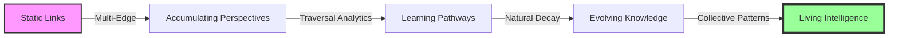
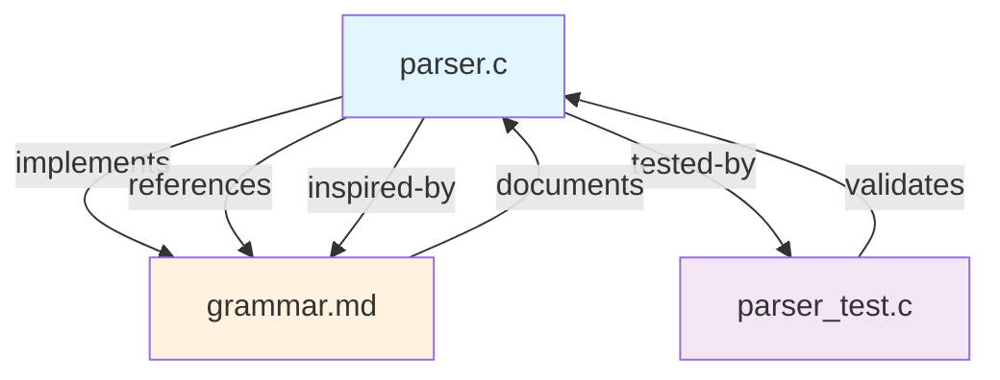
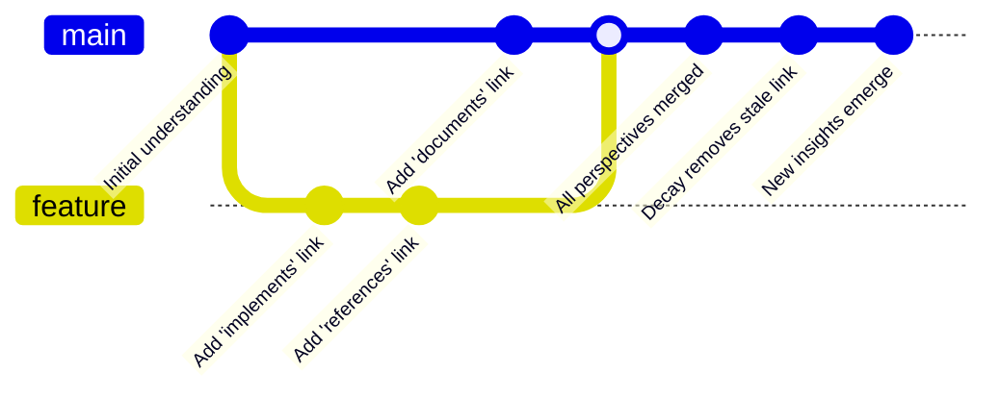
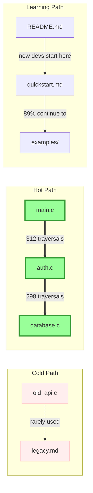
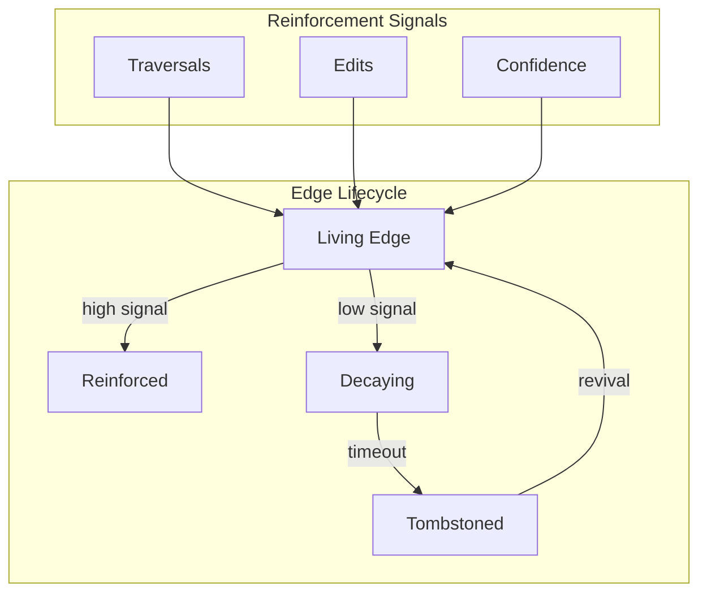
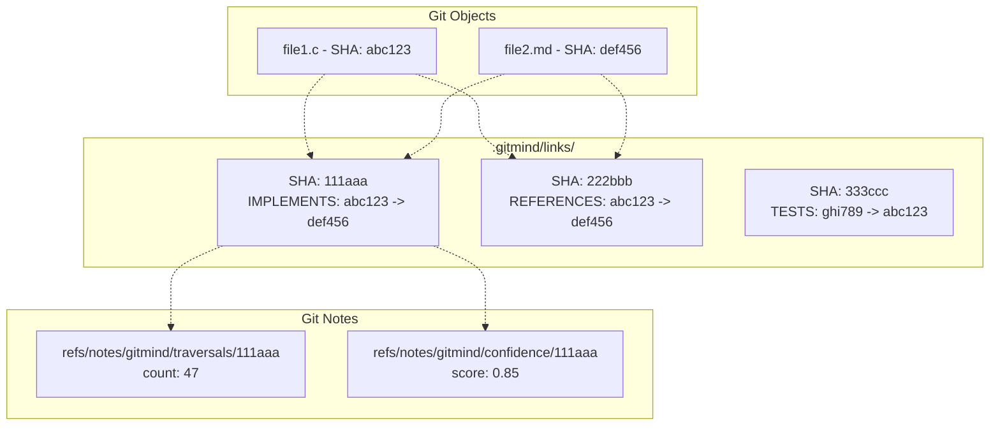
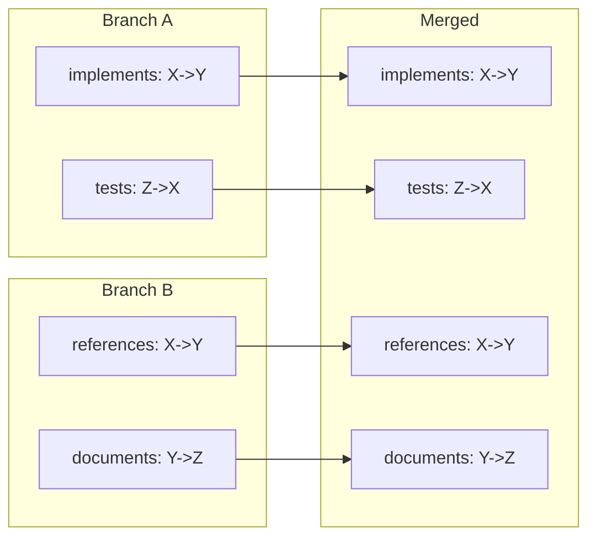
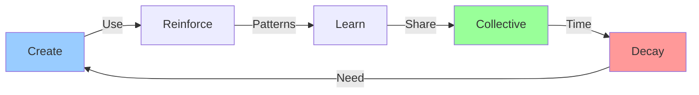
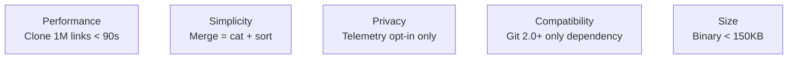
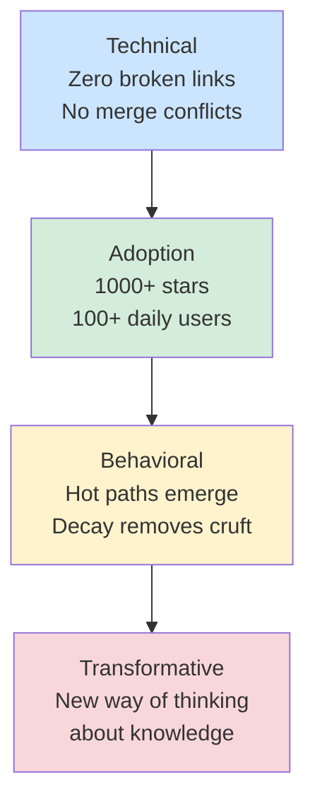

# Git-Mind Vision 2025: Living Knowledge Infrastructure

__Version__: 2.0

__Date__: June 14, 2025

__Authors__: Collective synthesis of Claude, ChatGPT, Gemini, and human insights

---

## The Core Insight

Knowledge doesn't conflict—it accumulates. Knowledge doesn't die—it evolves.

Git-mind transforms version control from tracking _what_ we built to understanding _why_ we built it and _how_ that understanding changes over time.

---

## The Journey: From Links to Living Intelligence



---

## Core Concepts Visualized

### 1. Multi-Edge Reality



__Every perspective preserved. Every relationship matters.__

### 2. Knowledge Evolution Through Git



__Understanding evolves like code—branching, merging, growing.__

### 3. Traversal Intelligence



__The system learns which paths help people understand.__

### 4. Natural Selection of Knowledge



__Knowledge that helps survives. Knowledge that doesn't fades.__

---

## Architecture: Simple Yet Profound

### Storage Model



__Content-addressed files. Multi-edge links. Mutable metadata.__

### Merge Without Conflicts



__Simple set union. No conflicts. All perspectives preserved.__

---

## The User Experience Evolution

### Phase 1: Individual Intelligence (Alpha)

```bash

# Create semantic links that survive refactoring

git mind link README.md src/main.c --type implements

  

# See how understanding evolved

git mind evolution --since "3 months ago"

  

# Time travel through knowledge

git checkout HEAD~20 && git mind list

```

### Phase 2: Team Intelligence (Beta)

```bash

# See what paths your team actually uses

git mind analytics --hot-paths

  

# Learn from collective navigation

git mind traverse auth.c --suggest-path

  

# Discover relationship patterns

git mind patterns --min-confidence 0.8

```

### Phase 3: Living Intelligence (v1.0)

```bash

# Knowledge self-organizes

git mind decay --apply # Remove stale edges

  

# AI-assisted navigation

git mind assist "How do I implement auth?"

  

# Collective learning paths

git mind onboard --generate-optimal-path

```

---

## The Philosophical Leap

### From Static to Living

| Traditional | Git-Mind Alpha | Git-Mind Future |

|------------|----------------|-----------------|

| A links to B | A links to B in 3 ways | A→B used 47 times for debugging |

| Links break on rename | Links follow content | Links strengthen with use |

| Conflicts need resolution | Perspectives accumulate | Knowledge evolves naturally |

| Manual cleanup | Manual creation | Self-organizing system |

### The Knowledge Lifecycle



__Knowledge lives, breathes, evolves.__

---

## Implementation Philosophy

### Core Principles

1. __Git-Native__: Use Git's strengths, don't fight them

2. __Content-Addressed__: Identity through SHA, not paths

3. __Multi-Edge__: Every perspective valid and preserved

4. __Usage-Driven__: Let behavior guide organization

5. __Natural Selection__: Reinforce the useful, decay the stale

### Technical Invariants



__Hard constraints that keep us honest.__

---

## The Global Impact

### Near Term (2025)

- Developers never lose context in refactors

- Teams share mental models, not just code

- Understanding accumulates instead of conflicts

### Medium Term (2026-2027)

- Codebases become self-documenting through usage

- Onboarding time cut by 50% through optimal paths

- Collective intelligence emerges from individual actions

### Long Term (2028+)

- Version control for consciousness itself

- Human-AI hybrid intelligence at scale

- Knowledge infrastructure for civilization

---

## Success Metrics



__From solving problems to changing minds.__

---

## The Vision in One Page

__Git-mind__ is version control for understanding itself.

Starting as a tool that creates unbreakable links between files, it evolves into a living map of how we actually think about code. Through multi-edge relationships, traversal analytics, and natural decay, it becomes infrastructure for collective intelligence.

Every perspective strengthens the graph. Every traversal teaches the system. Every decay cycle keeps knowledge fresh.

We're not building a better documentation tool. We're building a nervous system for shared understanding—one that learns, adapts, and evolves with use.

The graph breathes. The edges live. Understanding accumulates.

__Ship weekly. Think in decades. This is the way.__

---

_"In the beginning was the Link, and the Link was with Git, and the Link was Good."_
