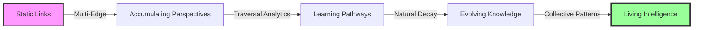
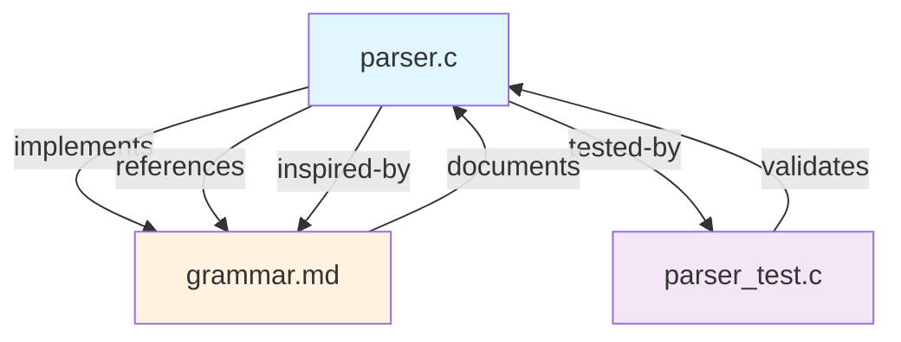
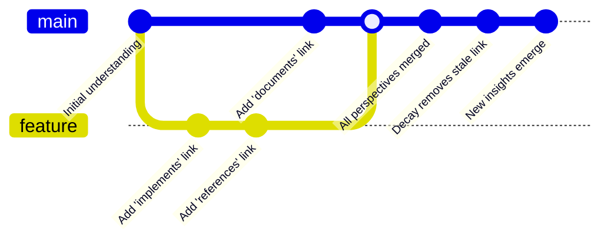
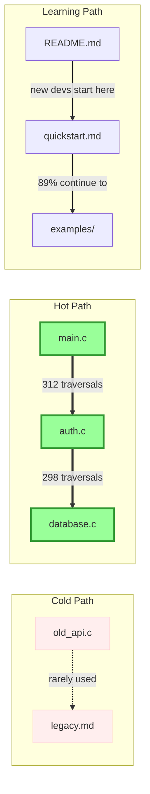
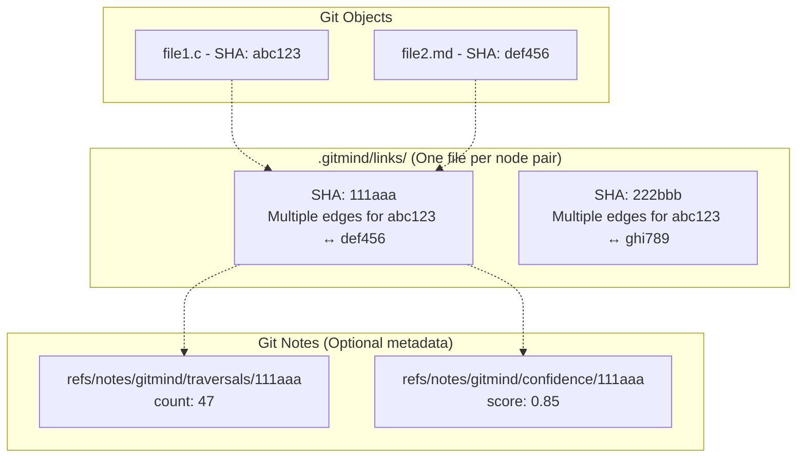
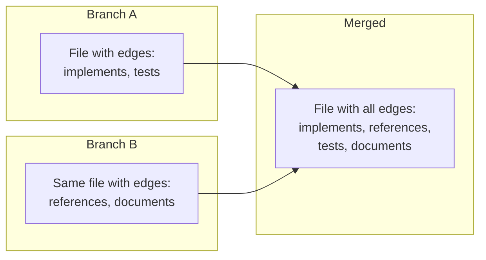
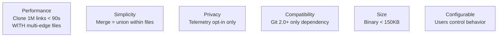
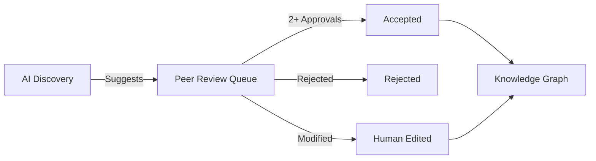
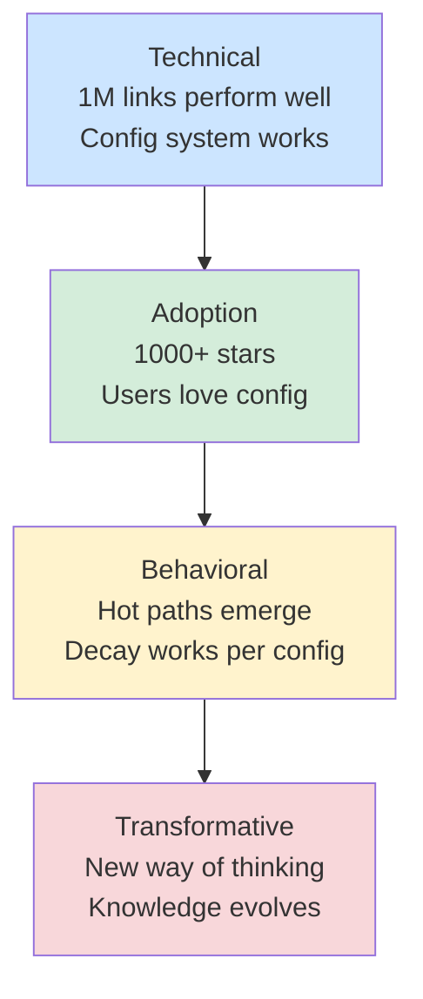

# Git-Mind Vision 2025: Living Knowledge Infrastructure

__Version__: 2.1  
__Date__: June 14, 2025 (Updated with breakthrough insights)  
__Authors__: Collective synthesis of Claude, ChatGPT, Gemini, and human insights

---

## The Core Insight

Knowledge doesn't conflict—it accumulates. Knowledge doesn't die—it evolves.

Git-mind transforms version control from tracking _what_ we built to understanding _why_ we built it and _how_ that understanding changes over time.

---

## The Journey: From Links to Living Intelligence



---

## Core Concepts Visualized

### 1. Multi-Edge Reality (Single File Innovation)



__Key Innovation__: Multiple edges stored in a SINGLE file per node pair:

```yaml
# .gitmind/links/abc123.link
edges:
  - type: implements
    confidence: 0.9
    author: alice
    timestamp: 1234567890
  - type: references
    confidence: 0.7
    author: bob
    timestamp: 1234567891
```

This reduces Git objects by 10-100x while preserving all perspectives.

### 2. Knowledge Evolution Through Git



__Understanding evolves like code—branching, merging, growing.__

### 3. Traversal Intelligence (Configurable)



__The system learns which paths help people understand.__

### 4. Natural Selection of Knowledge (User Configured)

```yaml
# .gitmind/config.yml
decay:
  enabled: true
  default_timeout: 90d
  types:
    implements:
      decay: false  # Never decay
    experimental:
      decay: true
      timeout: 30d
    legal-reference:
      decay: false  # Immortal
```

__Users decide what lives forever and what naturally fades.__

---

## Architecture: Simple Yet Profound

### Storage Model (Optimized)



__Content-addressed files. Multi-edge links in single files. Optional mutable metadata.__

### Git Integration Strategy

```gitattributes
# Custom packing and diffing for link files
*.link filter=gitmind-pack diff=gitmind-diff

# Leverage Git's existing optimization
*.link binary
```

Using Git's filter drivers for:

- Efficient packing of multi-edge files
- Semantic diffs of edge changes
- Custom merge strategies

### Merge Without Conflicts



__Simple edge union within files. No conflicts. All perspectives preserved.__

---

## Configuration Philosophy

### User Control Over System Behavior

```yaml
# .gitmind/config.yml
traversal:
  tracking: opt-in
  anonymize: true
  contexts: [debugging, learning, refactoring]

decay:
  enabled: true
  edge_types:
    # Each type can have custom rules
    implements: { decay: false }
    experimental: { decay: true, timeout: 30d }
    personal-note: { decay: user-preference }

visualization:
  default: ascii
  available: [ascii, web2d, webgl3d]

ai_insights:
  enabled: true
  peer_review_required: true
  min_reviewers: 2
```

__Push complexity to users who care. Sensible defaults for everyone else.__

---

## The User Experience Evolution

### Phase 1: Individual Intelligence (Alpha)

```bash
# Create semantic links that survive refactoring
git mind link README.md src/main.c --type implements

# Configure your preferences
git mind config decay.timeout 60d

# See how understanding evolved
git mind evolution --since "3 months ago"
```

### Phase 2: Team Intelligence (Beta)

```bash
# See what paths your team actually uses
git mind analytics --hot-paths

# Review AI suggestions
git mind review --pending
> AI suggests: parser.c --[implements]--> pattern.md
> Approve? [y/n/modify]

# Discover patterns
git mind patterns --min-confidence 0.8
```

### Phase 3: Living Intelligence (v1.0)

```bash
# Knowledge self-organizes based on YOUR rules
git mind decay --apply --dry-run

# WebGL visualization of living knowledge
git mind serve --viz webgl

# Export learning paths
git mind onboard --generate-optimal-path
```

---

## Implementation Philosophy

### Core Principles (Updated)

1. __Git-Native__: Use Git's strengths, don't fight them
2. __Content-Addressed__: Identity through SHA, not paths
3. __Multi-Edge Single File__: Reduce Git objects 10-100x
4. __User-Configured__: Let users decide decay, traversal, everything
5. __Natural Selection__: Reinforce the useful, decay the stale (per user rules)
6. __Performance First__: Built in C, use Git's own libraries
7. __Progressive Enhancement__: ASCII → 2D → WebGL

### Technical Invariants



__Hard constraints that keep us honest.__

---

## Visualization Stack

### Progressive Enhancement

1. __ASCII (MVP)__

   ```
   parser.c ===[3 edges]===> grammar.md
     implements (0.9)
     references (0.7)
     inspired-by (0.5)
   ```

2. __D3.js 2D (Beta)__
   - Force-directed graphs
   - Time sliders
   - Heatmaps

3. __WebGL 3D (v1.0)__
   - Particle effects for traversals
   - Immersive navigation
   - Real-time evolution

Libraries identified:

- Three.js for 3D
- D3.js for 2D
- Highcharts for temporal
- vis.js for interactive

---

## Peer Review for AI Insights



__Collective intelligence includes quality control.__

---

## The Global Impact

### Near Term (2025)

- Developers configure their own knowledge rules
- Multi-edge files solve Git performance
- Teams share mental models without conflicts

### Medium Term (2026-2027)

- Codebases self-document based on usage patterns
- Onboarding paths emerge from collective behavior
- Knowledge evolution visible in WebGL

### Long Term (2028+)

- Version control for consciousness itself
- Human-AI hybrid intelligence at scale
- Configurable knowledge infrastructure for civilization

---

## Success Metrics



__From solving problems to changing minds.__

---

## The Vision in One Page

__Git-mind__ is version control for understanding itself.

Starting as a tool that creates unbreakable links between files, it evolves into a living map of how we actually think about code. Through multi-edge relationships (in single files!), configurable traversal analytics, and user-defined decay rules, it becomes infrastructure for collective intelligence.

Every perspective strengthens the graph. Every traversal teaches the system. Every decay cycle keeps knowledge fresh—according to YOUR rules.

We're not building a better documentation tool. We're building a nervous system for shared understanding—one that learns, adapts, and evolves with use, while respecting that different domains have different needs.

The graph breathes. The edges live. Understanding accumulates. Users decide.

__Ship weekly. Think in decades. Configure everything.__

---

_"In the beginning was the Link, and the Link was with Git, and the Link was Good—and the User configured it as they saw fit."_
