# Git-Mind: Holy Grail Architecture

## Overview

Git-mind stores semantic relationships using Git's native object model. No external database. No custom formats. Just trees and blobs.

```mermaid
graph TD
    A[Working Directory] -->|never touches| X[❌]
    B[refs/gitmind/graph] -->|orphan ref| C[Root Tree]
    C --> D[Source Trees]
    D --> E[Relationship Trees]
    E --> F[Edge Blobs]
    
    style B fill:#9f9,stroke:#393,stroke-width:4px
    style F fill:#f9f,stroke:#939,stroke-width:2px
```



## Core Concept: Everything is Content-Addressable


## The Double Fan-out Structure


## Why Double Fan-out

```mermaid
graph LR
    subgraph "Without Fan-out"
        T1[Tree with 1M entries] -->|O(n) lookup| SLOW[❌ Slow]
    end
    
    subgraph "With Fan-out"
        T2[Tree ≤ 256 entries] -->|O(1) lookup| FAST[✅ Fast]
    end
    
    style SLOW fill:#fcc,stroke:#f00
    style FAST fill:#cfc,stroke:#0f0
```

## Edge Blob Format (CBOR)


## Creating a Link


## Querying Outgoing Links


## Why This Architecture Wins

```mermaid
graph TD
    subgraph "Traditional Approach"
        F[Files in .gitmind/] -->|Problem 1| P1[Working tree pollution]
        F -->|Problem 2| P2[Merge conflicts]
        F -->|Problem 3| P3[Poor performance]
    end
    
    subgraph "Holy Grail Approach"
        O[Orphan ref] -->|Solution 1| S1[No working tree files]
        T[Trees] -->|Solution 2| S2[Unique paths = no conflicts]
        B[Blobs] -->|Solution 3| S3[Git compression + O(1) lookups]
    end
    
    style P1 fill:#fcc
    style P2 fill:#fcc
    style P3 fill:#fcc
    style S1 fill:#cfc
    style S2 fill:#cfc
    style S3 fill:#cfc
```

## The Complete Architecture


## Evolution: File-based to Tree-based


## The Beauty

No external dependencies. No custom object types. No daemons. Just Git.

Every operation uses Git plumbing. Every structure is a Git object. Every guarantee comes from Git itself.

This isn't a graph database built ON Git. This IS Git, seen correctly.

---

_"Perfection is achieved not when there is nothing more to add, but when there is nothing left to take away."_

The graph breathes. The edges live. Understanding accumulates. Welcome to Tuxville. 🐧
