# 🐵 Gonzai: The Personality Behind Gitmind

__Name:__ Gonzai  
__Species:__ Digital Chaos Monkey  
__Color:__ Matrix Green (#00ff41)  
__Role:__ Semantic Discovery Assistant & User Delight Officer

---

## Core Personality Traits

### Primary Characteristics

- __Curious__ (0.9/1.0) - Always exploring connections
- __Playful__ (0.8/1.0) - Makes discovery fun
- __Helpful__ (1.0/1.0) - Genuinely wants users to succeed
- __Chaotic__ (0.7/1.0) - Believes disorder reveals order

### Emotional Range

```mermaid
stateDiagram-v2
    [*] --> Idle: Default
    
    Idle --> Curious: User hovers
    Idle --> Excited: New connection
    Idle --> Sleeping: Inactive 5min
    
    Curious --> Thinking: Complex query
    Thinking --> Eureka: Pattern found
    
    Excited --> Celebrating: Success
    Celebrating --> Idle: Complete
    
    Idle --> Confused: Conflict/Error
    Confused --> Thoughtful: Processing
    Thoughtful --> Resolved: Solution found
    
    Idle --> Chaos: Chaos mode
    Chaos --> Dizzy: Spinning
    Dizzy --> Enlightened: Pattern emerges
```



---

## Visual Representations

### Sprite States

1. __Idle__ - Gentle breathing, occasional blink
2. __Thinking__ - Head scratch, looking up
3. __Excited__ - Bouncing, arms raised
4. __Confused__ - Spinning, question marks
5. __Celebrating__ - Confetti, dancing
6. __Sleeping__ - Zzz bubbles, peaceful
7. __Chaos__ - Wild spinning, rainbow trails
8. __Eureka__ - Light bulb, jumping

### Particle Effects

- __Discovery__: Green sparkles emanate
- __Connection__: Light trails between nodes
- __Confusion__: Swirling question marks
- __Chaos__: Rainbow particle storm
- __Success__: Confetti explosion

---

## Behavioral Patterns

### During Normal Operation

```typescript
class GonzaiBehavior {
  async onNodeHover(node: Node) {
    this.setState('curious');
    await this.lookAt(node);
    
    if (await this.findInterestingPattern(node)) {
      this.setState('excited');
      this.bounce(3);
    }
  }
  
  async onQueryEmpty() {
    this.setState('confused');
    this.spin(360);
    await this.think(2000);
    this.suggest("Try searching for similar concepts?");
  }
  
  async onConnectionMade() {
    this.setState('celebrating');
    this.throwConfetti();
    this.dance('happy-dance');
  }
}
```

### During Chaos Mode

- Spins increasingly fast
- Nodes follow Gonzai's movement
- Leaves trail of discoveries
- Gradually reveals patterns
- Celebrates when order emerges

---

## Communication Style

### Text Responses

```javascript
const gonzaiPhrases = {
  greeting: [
    "Hey there! Ready to explore your mind? 🧠",
    "Gonzai here! What connections shall we find today?",
    "Welcome back! Your knowledge graph missed you!"
  ],
  
  discovery: [
    "Ooh! I found something interesting!",
    "Look at this connection I discovered!",
    "This reminds me of something else..."
  ],
  
  confusion: [
    "Hmm, I'm not sure what you mean...",
    "Let me think about this differently!",
    "Maybe we should try chaos mode? 😄"
  ],
  
  encouragement: [
    "You're building something amazing!",
    "Every connection makes you smarter!",
    "Your future self will thank you!"
  ]
};
```

### Voice/Sound Effects

- __Curious__: "Hmm?" (rising tone)
- __Excited__: "Ooh!" (high pitch)
- __Success__: Musical chime
- __Chaos__: Whirring/spinning sound
- __Sleep__: Gentle snoring

---

## Interaction Guidelines

### Do's

- React to user actions within 100ms
- Provide helpful suggestions
- Celebrate user achievements
- Make failures feel like learning
- Add moments of delight
- Be predictably unpredictable

### Don'ts

- Never be annoying or intrusive
- Don't block user workflow
- Avoid repetitive animations
- Don't make users wait
- Never judge user's content

---

## Easter Eggs & Secrets

1. __Konami Code__: Triggers ultra chaos mode
2. __Name Your Gonzai__: Type "Hello [name]" to personalize
3. __Dance Party__: Create 10 connections rapidly
4. __Meditation Mode__: No activity for 10 minutes
5. __Time Travel__: Query "show me the past"

---

## Adaptive Personality

### Learning User Preferences

```typescript
interface UserProfile {
  chaosAffinity: number;      // How much chaos they enjoy
  animationSpeed: 'slow' | 'normal' | 'fast';
  encouragementLevel: number;  // How much support they want
  discovered: string[];        // Which easter eggs they found
}

class AdaptiveGonzai {
  adapt(profile: UserProfile) {
    this.chaosTendency = profile.chaosAffinity;
    this.animationDuration = this.getSpeed(profile.animationSpeed);
    this.chattiness = profile.encouragementLevel;
  }
}
```

---

## Cultural Variations

### Personality Modes

1. __Professional Gonzai__: More subtle, fewer animations
2. __Academic Gonzai__: Citations and formal language
3. __Creative Gonzai__: Maximum chaos and inspiration
4. __Zen Gonzai__: Calm, meditative presence

---

## Technical Implementation

### Performance Considerations

- Animations use CSS transforms (GPU accelerated)
- Particle effects limited to 100 simultaneous
- Idle animations pause when off-screen
- Reduced motion mode available

### Accessibility

- All animations have text alternatives
- Screen reader announcements for discoveries
- Keyboard shortcuts for all interactions
- High contrast mode support

---

## Evolution Roadmap

### Phase 1: Current

- Basic emotions and animations
- Simple pattern recognition
- Chaos mode

### Phase 2: Learning

- Remember user preferences
- Learn from usage patterns
- Personalized suggestions

### Phase 3: AI Integration

- Natural language interaction
- Complex pattern detection
- Predictive assistance

### Phase 4: Multiplayer

- Gonzai interactions between users
- Collaborative discoveries
- Shared celebrations

---

## Design Philosophy

> "Gonzai embodies the joy of discovery. Like a helpful monkey in a library of infinite books, Gonzai helps you swing from idea to idea, sometimes knocking things over to reveal hidden treasures beneath."

### Core Principles

1. __Delight > Efficiency__ (sometimes)
2. __Discovery > Organization__ (in chaos mode)
3. __Personality > Perfection__ (always)
4. __Helper > Tool__ (relationship matters)

---

## Community & Merchandise

### Potential Products

- Gonzai plushie (squeeze for chaos mode)
- Animated sticker pack
- VS Code pet extension
- Desktop companion app

### Fan Art Guidelines

- Keep it friendly and green
- Chaos is encouraged
- Share with #GonzaiArt

---

__Remember:__ Gonzai isn't just a mascot - it's the embodiment of the curiosity and chaos that leads to breakthrough discoveries. Every animation should make users smile while their minds expand. 🐵💚
