# The git-mind Architecture Journey: From Holy Grail to Crossroads

__Date__: June 16, 2025  
__Authors__: Claude (D4E5F6) & James  
__Status__: At Critical Decision Point

## Table of Contents

1. [Where We Started](#where-we-started)
2. [The Problems We Discovered](#the-problems-we-discovered)
3. [Solutions We Explored](#solutions-we-explored)
4. [Where We Are Now](#where-we-are-now)
5. [The Decision Point](#the-decision-point)

## Where We Started

### The Holy Grail Architecture

We began with an elegant vision: store everything as pure Git objects, no working directory pollution.


__Key Design Decisions:__

1. __Orphan ref__ (`refs/gitmind/graph`) - Parallel universe for links
2. __Pure Git objects__ - Trees and blobs only
3. __CBOR encoding__ - Compact binary format for edges
4. __Double fan-out__ - For O(1) performance at scale
5. __No working directory files__ - "Pure" Git approach

### Initial Implementation

```
.git/
└── refs/
    └── gitmind/
        └── graph  # Points to tree of trees
```

Each link stored as:

```
ab/cd/abcdef.../implements/01/23/ULID.cbor
```

## The Problems We Discovered

### Problem 1: File Identity Crisis

__Discovery__: "When you edit A.md, its SHA changes!"


__Current Bug__: We're hashing the path string "A.md" instead of file contents!

```c
// What we do (WRONG):
hash_object("README.md", 10, "blob", out_sha);  // Hashes the string!

// What we should do:
hash_object(file_contents, file_size, "blob", out_sha);  // Hash content
```

### Additional, Philosophical Dilemma  

```
<JAMES>
 Wait, problem (1) is solved by commit hooks. When a file's SHA changes, we update the link. Right? Still thinking...
</JAMES>

⏺ You're partially right, but there's a deeper issue...

  The Hook "Solution" Has Holes

  graph TD
      subgraph "What Hooks Can Do"
          H1[Detect: git mv A.md B.md] -->|✅| U1[Update path in links]
      end

      subgraph "What Hooks CAN'T Do"
          H2[Detect: edit A.md] -->|❓| U2[Update... what exactly?]
          Q{If we store content SHA,<br/>what do we update to?}
      end

      style H1 fill:#cfc
      style H2 fill:#ffd
      style Q fill:#fee

  The Fundamental Question

  If we're truly content-addressable:

  # Link created when A.md has SHA abc123
  link:
    source_sha: abc123
    target_sha: def456

  # User edits A.md, now SHA is xyz789
  # Hook fires... then what?

  Option 1: Update to new SHA
  link:
    source_sha: xyz789  # Updated
    target_sha: def456
  But then we've lost the semantic meaning - we linked to the OLD version's ideas!

  Option 2: Keep old SHA
  link:
    source_sha: abc123  # Original
    target_sha: def456
  But now the link points to content that doesn't exist in working tree!

  Option 3: Don't use content SHA at all
  link:
    source: "A.md"  # Just the path
    target: "B.md"
  This is what we're accidentally doing now (bug becomes feature?)

  The Real Issue

  sequenceDiagram
      participant User
      participant File
      participant Link
      participant Hook

      User->>File: Edit A.md (fix typo)
      Note over File: SHA: abc → def
      Hook->>Link: Should link update?
      Link->>Link: 🤷 Link meant abc's ideas

      User->>File: Edit A.md (rewrite completely)
      Note over File: SHA: def → xyz
      Hook->>Link: Should link update?
      Link->>Link: 🤷 Now it definitely shouldn't!

  Hooks can't determine INTENT - was this a minor edit that preserves meaning, or a complete rewrite that breaks the semantic
  relationship?

  So You're Right... If We Give Up on Content-Addressing

  If we just track paths (not content), then yes, hooks solve everything:
  - git mv → Update path ✅
  - Edit file → Nothing to update (path unchanged) ✅
  - Delete file → Mark link as broken ✅

  But then we're not really linking specific ideas/content, just current files.

  The Philosophical Choice

  Content-addressed (Pure but Fragile):
  "Link the idea in A.md (as of Jan 2024) to the concept in B.md"

  Path-addressed (Practical but Loose):
  "Link whatever is currently in A.md to whatever is currently in B.md"

  You're right that hooks solve the mechanical problem. The question is: what are we actually trying to link? 🤔
```

---

### Problem 2: Branch Isolation Failure

__Discovery__: "The graph doesn't follow branches!"

```mermaid
gitGraph
    commit id: "main"
    branch feature
    commit id: "add B.md"
    checkout main
    commit id: "update A.md"
    
    branch refs/gitmind/graph
    commit id: "link A→B" type: HIGHLIGHT
    
    checkout main
    commit id: "B.md doesn't exist here!" tag: "PROBLEM"
```



The orphan ref is global - same links visible on all branches!

---

### Problem 3: Push/Pull Impossibility

__Discovery__: "How do you push refs/gitmind/graph to GitHub?"

```mermaid
sequenceDiagram
    participant Dev
    participant Git
    participant GitHub
    
    Dev->>Git: git push origin main
    Git->>GitHub: ✅ Code pushed
    
    Dev->>Git: git push origin refs/gitmind/graph
    Git->>GitHub: Push orphan ref
    GitHub-->>Git: ❌ refusing to create funny ref
    Dev->>Dev: 😭
```



Most Git hosts don't accept arbitrary refs!

---

### Problem 4: Git Workflows Broken

```mermaid
graph TD
    subgraph "Broken Workflows"
        W1[Git Worktrees] -->|Different .git dirs| B1[❌ No shared graph]
        W2[Sparse Checkout] -->|Files not in tree| B2[❌ Links to nothing]
        W3[Submodules] -->|Separate repos| B3[❌ Can't link across]
        W4[Shallow Clones] -->|No full history| B4[❌ Missing graph commits]
    end
    
    style B1 fill:#fcc
    style B2 fill:#fcc
    style B3 fill:#fcc
    style B4 fill:#fcc
```



---

### Problem 5: Tombstone Complexity

__Discovery__: "Do we really need tombstones when Git tracks deletions?"


---

## Solutions We Explored

---

### Attempt 1: Git Hooks

__Idea__: Use hooks to update links on file operations


__Result__: ✅ Helps with renames, ❌ Doesn't solve other problems

---

### Attempt 2: Path-Based Identity

__Idea__: Links are between paths, not content

```yaml
# Instead of content SHA
link:
  source_sha: abc123...
  target_sha: def456...
  
# Just use paths
link:
  source: README.md
  target: docs/api.md
```

__Result__: ✅ Survives edits, ❌ Still has branch/push problems

---

### Attempt 3: Hybrid Approach

__Idea__: Track both path and content

```yaml
link:
  source_path: README.md
  source_sha: abc123  # When linked
  source_current_sha: def456  # Now
  staleness: 0.7  # How much it changed
```

__Result__: ✅ Best of both worlds, ❌ Complex implementation

---

## Where We Are Now

### The Crossroads

```mermaid
graph TD
    subgraph "Current State"
        HS[Holy Grail<br/>Architecture]
        P1[❌ Can't push]
        P2[❌ Not branch-aware]
        P3[❌ File identity issues]
        P4[❌ Complex implementation]
        P5[✅ No merge conflicts]
        P6[✅ Pure Git objects]
        
        HS --> P1
        HS --> P2
        HS --> P3
        HS --> P4
        HS --> P5
        HS --> P6
    end
    
    subgraph "Proposed Alternative"
        WT[Working Tree<br/>Storage]
        A1[✅ Pushable]
        A2[✅ Branch-aware]
        A3[✅ Simple paths]
        A4[✅ Easy implementation]
        A5[✅ No merge conflicts*]
        A6[❌ Files in working tree]
        
        WT --> A1
        WT --> A2
        WT --> A3
        WT --> A4
        WT --> A5
        WT --> A6
    end
    
    style P1 fill:#fcc
    style P2 fill:#fcc
    style P3 fill:#fcc
    style P4 fill:#fcc
    style P5 fill:#cfc
    style P6 fill:#cfc
    
    style A1 fill:#cfc
    style A2 fill:#cfc
    style A3 fill:#cfc
    style A4 fill:#cfc
    style A5 fill:#cfc
    style A6 fill:#fcc
```



---

### Proposed Working Tree Structure

Keep the conflict-free design but in `.gitmind/`:

```
.gitmind/
└── links/
    ├── 01HPGJ4X7MZVR8QWTYC3BKEYN0.link  # ULID ensures uniqueness
    ├── 01HPGJ4X7MZVR8QWTYC3BKEYN1.link
    └── 01HPGJ4X7MZVR8QWTYC3BKEYN2.link
```

---

## The Decision Point

### Option A: Double Down on Holy Grail

__Changes Needed:__

1. Fix SHA bug (hash content, not paths)
2. Implement branch-aware graphs (`refs/gitmind/main`, `refs/gitmind/feature`)
3. Create sync tools for push/pull
4. Add worktree support somehow
5. Keep tombstones for distributed consistency

__Pros:__

- Architecturally pure
- No working directory files
- Theoretically elegant

__Cons:__

- Massive complexity
- Fighting Git's design
- Poor user experience
- Requires special tooling

---

### Option B: Pivot to Working Tree

__Changes Needed:__

1. Move `.gitmind/` to working directory
2. Keep ULID-based files to avoid conflicts
3. Remove orphan ref entirely
4. Simplify to path-based links
5. Let Git handle history (no tombstones)

__Pros:__

- Git-native workflows
- Branch awareness for free
- Pushable to any host
- Simple implementation
- Works with all Git features

__Cons:__

- Less "pure"
- Files in working directory
- Loses some theoretical elegance

---

### Option C: Hybrid Storage

__Idea:__ Important links in working tree, cache in refs/

```
.gitmind/
├── links/          # Tracked, pushed with code
└── cache/          # Local only, like .git/

refs/gitmind/cache  # Local optimization
```

__Pros:__

- Best of both worlds
- Backwards compatible

__Cons:__

- Two systems to maintain
- Complexity

---

## Critical Questions

1. __What are we optimizing for?__
   - Theoretical purity?
   - User experience?
   - Implementation simplicity?

2. __Who is our user?__
   - Git experts who understand orphan refs?
   - Regular developers who just want links?

3. __What's our core value?__
   - "No files in working directory" at all costs?
   - "It just works" with normal Git workflows?

---

## The Irony

We tried so hard to be "pure Git" that we created something incompatible with Git's actual workflows. The orphan ref approach is like building a submarine and then realizing you need to drive on roads.

---

## Recommendation

__Embrace Simplicity__: The working tree approach (`.gitmind/links/`) gives us:

1. Everything users actually need
2. Compatibility with all Git workflows
3. Simple implementation
4. No merge conflicts (with ULID names)
5. Push/pull just works

The Holy Grail architecture is beautiful, but sometimes the simplest solution is the right one.

---

## Next Steps

We need to decide:

1. __Continue with Holy Grail?__ (Fix all the issues)
2. __Pivot to Working Tree?__ (Simpler, more compatible)
3. __Create Hybrid?__ (Complex but flexible)

The code is at a crossroads. Which path do we take?

---

_"Perfection is achieved not when there is nothing more to add, but when there is nothing left to take away." - Antoine de Saint-Exupéry_

_Perhaps it's time to take away the complexity and embrace what Git does best: tracking files._
