# Deep Analysis: The File Identity Problem in git-mind

**Author**: Claude (D4E5F6)  
**Date**: June 16, 2025  
**Status**: CRITICAL DESIGN ISSUE

## Executive Summary

The current git-mind implementation has a fundamental flaw: it hashes file paths as strings rather than file contents, accidentally creating a path-based system while pretending to be content-addressable. This report analyzes the implications and recommends a path forward.

## The Core Problem

When we create a link between files, what exactly are we linking?


### Current Implementation Bug

```c
// What we do now (WRONG):
ret = ctx->backend->hash_object(ctx, "README.md", 10, "blob", src_sha);
// This creates SHA of the string "README.md", not the file content!

// What we should do if content-addressable:
char file_content[MAX_FILE];
read_file("README.md", file_content);
ret = ctx->backend->hash_object(ctx, file_content, file_size, "blob", src_sha);
```

## Test Coverage Analysis

### Currently Tested ✅
- Basic link creation
- Link listing
- git mv (accidentally works due to path hashing bug!)
- File deletion detection

### NOT Tested ❌
```bash
# File content changes
echo "new content" >> README.md
git add && git commit
# Do links survive? (Currently yes, but shouldn't with real content addressing)

# Case sensitivity
git mv README.md readme.md  # On case-insensitive filesystems

# Special characters
git mv simple.md "complex name with spaces & symbols!.md"

# Unicode
git mv doc.md "文档.md"

# Symlinks
ln -s ../external/file.md link.md
git-mind link link.md other.md

# Binary files
git-mind link image.png document.pdf

# Submodules
cd submodule && git-mind link ../parent.md sub.md

# Permission changes
chmod +x script.sh  # Does SHA change?

# Line ending changes
unix2dos file.txt  # LF -> CRLF

# Encoding changes
iconv -f UTF-8 -t Latin-1 file.txt

# Sparse checkout
git sparse-checkout set --no-cone "docs/*"
# Are links to excluded files handled?

# Multiple worktrees
git worktree add ../feature
# Do links work across worktrees?

# During merge conflicts
# What happens to links when files conflict?

# Stashed changes
git stash
# Do links reference stashed versions?

# Historical versions
git-mind link README.md@{yesterday} doc.md

# Files outside repo
git-mind link ../../../etc/passwd internal.md  # Security!

# Extremely long paths
git-mind link a/b/c/d/e/f/.../z.md other.md  # Path length limits

# Concurrent modifications
# Two users modify and link simultaneously
```

## Design Alternatives Analysis

### Option 1: Pure Content-Addressable (Git-like)

**Verdict**: Unusable for semantic links

### Option 2: Pure Path-Based (Current accident)

```mermaid
graph LR
    Edit[Edit file] --> Same[✅ Links survive]
    Move[Move file] --> Update[Need to update]
    
    style Same fill:#90EE90
```

**Verdict**: What users expect, but needs rename detection

### Option 3: Hybrid Tracking
```yaml
edge:
  source_path: "README.md"
  source_sha: "abc123..."  # SHA when link created
  source_current_sha: "def456..."  # Current SHA
  confidence: 0.8  # Degrades when content changes
```
**Verdict**: Complex but powerful

### Option 4: Git History Integration
```bash
# Use git log --follow to track identity
git log --follow --format=%H README.md | head -1
# Links follow the file's Git identity
```
**Verdict**: Expensive but accurate

### Option 5: Explicit Identity Management

**Verdict**: Most robust but requires initialization

### Option 6: Two-Phase Architecture

**Verdict**: Clean separation but complex

## Recommendation: Path-Based with Git Integration

After deep analysis, I recommend:

### 1. **Be Honest: We're Path-Based**
```c
typedef struct {
    char source_path[PATH_MAX];    // Primary identity
    char target_path[PATH_MAX];    
    char type[64];
    time_t timestamp;
    // Optional: SHA for change detection
    char source_sha[41];  // SHA when linked
    char target_sha[41];
} gm_link_t;
```

### 2. **Use Git's Rename Detection**
```bash
# Periodically run:
git diff --name-status --find-renames HEAD~1
# Update paths in links accordingly
```

### 3. **Mark Stale Links**
```c
typedef enum {
    LINK_VALID,
    LINK_SOURCE_MOVED,    // Git detected rename
    LINK_TARGET_MOVED,
    LINK_SOURCE_DELETED,
    LINK_TARGET_DELETED,
    LINK_SOURCE_MODIFIED  // SHA changed significantly
} link_status_t;
```

### 4. **Provide Migration Tools**
```bash
git-mind repair        # Fix broken links using Git history
git-mind gc           # Remove links to deleted files
git-mind follow       # Update paths after renames
```

## Tombstone Analysis

### Performance Impact


**Measurement**: O(n) filtering cost where n = total edges ever created

### User Experience Impact


### Correctness Analysis

**Pros**:
- Distributed conflict resolution
- Complete audit trail
- Resurrection possible

**Cons**:
- Can't truly delete (privacy/GDPR?)
- Unbounded growth
- Clock-dependent ordering

### Tombstone Recommendation

**Replace with Git-native deletion**:
```bash
# Instead of tombstone, just remove from tree
# Git commit history shows who deleted when
git log --diff-filter=D --summary | grep delete
```

## Final Architecture Recommendation


### Implementation Plan

1. **Phase 1**: Fix current bug
   - Stop hashing paths as strings
   - Decide on identity model

2. **Phase 2**: Add comprehensive tests
   - All exotic file operations
   - Cross-platform scenarios
   - Git integration cases

3. **Phase 3**: Implement rename detection
   - Hook into Git's rename detection
   - Update links automatically

4. **Phase 4**: Remove tombstones
   - Use Git history for deletions
   - Add `git-mind gc` for cleanup

## Conclusion

The file identity problem is fundamental to any link tracking system. By embracing a path-based approach with Git integration, we can deliver what users actually expect while maintaining system simplicity.

The current implementation accidentally got it right (for the wrong reasons). We should formalize this approach and build proper Git integration rather than pretending to be content-addressable.

Tombstones, while elegant in distributed databases, are overkill for a Git-based system that already has comprehensive history tracking.

## Addendum: Test Suite Needed

```bash
#!/bin/bash
# Comprehensive test suite for file operations

# Test: Edit file after linking
test_file_edit() {
    git-mind link A.md B.md --type implements
    echo "new content" >> A.md
    git add A.md && git commit -m "Edit A"
    
    # Should link survive?
    git-mind list | grep -q "A.md.*B.md" || fail "Link lost after edit"
}

# Test: Rename detection
test_rename_detection() {
    git-mind link old.md other.md --type tests
    git mv old.md new.md
    git commit -m "Rename"
    
    # Should detect rename
    git-mind repair
    git-mind list | grep -q "new.md.*other.md" || fail "Rename not detected"
}

# Test: Unicode handling
test_unicode() {
    touch "文档.md" "документ.md" "🎉.md"
    git add . && git commit -m "Unicode files"
    
    git-mind link "文档.md" "документ.md" --type translates
    git-mind list | grep -q "文档.md" || fail "Unicode not handled"
}

# ... 50 more tests covering all edge cases
```

---

*The path forward is clear: embrace simplicity, leverage Git, and test comprehensively.*