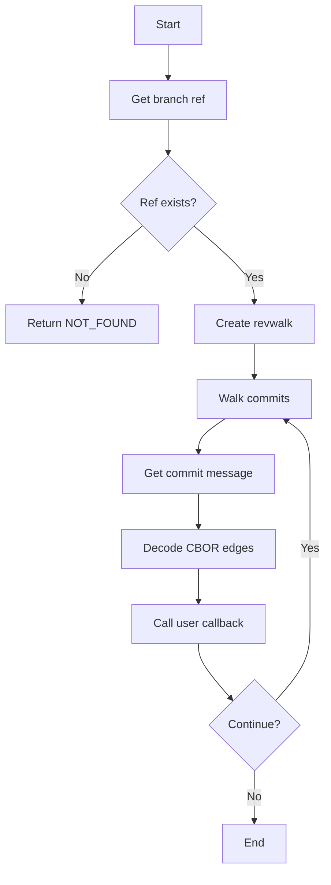
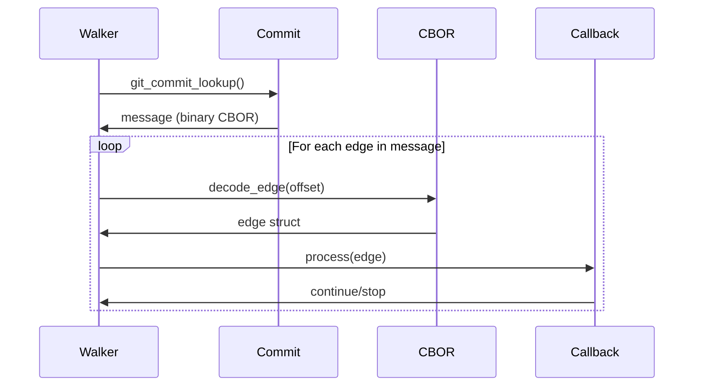
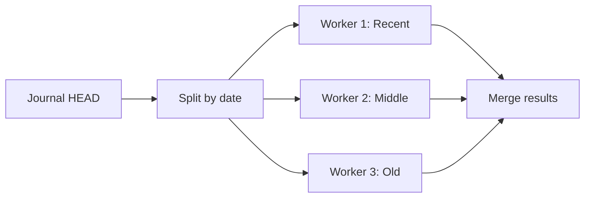

# Journal Reader

## Purpose

Read edges from the journal by walking Git commits in chronological order, decoding CBOR messages.

## Design Rationale

### Why Walk Commits

1. __Natural ordering__: Git provides time-sorted iteration
2. __Incremental__: Can stop at any commit
3. __Resumable__: Remember last processed SHA
4. __Cache-friendly__: Recent edges in recent commits

### Callback-Based API

```c
int (*callback)(const gm_edge_t *edge, void *userdata)
```

- __Zero-copy__: Edge decoded on stack
- __Streaming__: Process millions without OOM
- __Flexible__: Caller controls memory strategy
- __Early exit__: Return non-zero to stop

## Implementation Flow



## Edge Decoding Strategy



### Multiple Edges per Commit

- Commit message may contain 1-16 edges
- Decode until CBOR parse fails
- Calculate consumed bytes by re-encoding
- Not ideal but simple and reliable

## Edge Cases

### Empty Journal

- No commits in refs/gitmind/edges/branch
- Returns GM_NOT_FOUND (not an error)
- Caller can handle gracefully

### Corrupted CBOR

```
Commit 1: [Valid edge][Valid edge][Garbage]
Result: Process 2 edges, skip garbage, continue
```

- Partial corruption doesn't break everything
- Future commits still readable
- Log warning but don't fail

### Massive History

```
1M edges = ~62K commits (16 edges/commit)
Memory usage: Constant (one edge at a time)
Time: O(n) but can add index later
```

### Branch Switching

```c
gm_journal_read(ctx, NULL, callback, data);  // Current branch
gm_journal_read(ctx, "main", callback, data); // Specific branch
```

- NULL = use HEAD's branch
- Explicit branch for scripts/tools

## Performance Optimization

### Git Revwalk Settings

```c
git_revwalk_sorting(walker, GIT_SORT_TIME);
```

- Time order (newest first)
- Could add GIT_SORT_REVERSE for chronological
- Topological sort not needed (linear history)

### Future: Incremental Reading

```c
struct resume_state {
    git_oid last_seen;
    uint64_t timestamp;
};
```

- Remember last processed commit
- Skip already-seen on next read
- Enables real-time monitoring

### Future: Bloom Filters

```
refs/gitmind/cache/main/bloom.bin
```

- Bloom filter of all source SHAs
- Quick "does this file have any edges?"
- 10M edges = ~10MB bloom @ 0.1% FPR

## Error Handling

### Git Errors

- Repository access denied → GM_ERROR
- Corrupt object database → GM_ERROR  
- Out of memory → GM_NO_MEMORY

### Callback Errors

- Callback returns -1 → Stop, return -1
- Callback returns 0 → Continue
- Callback returns 1 → Stop, return 0

### Graceful Degradation

- Missing branch → Empty result set
- Corrupt commit → Skip, continue
- Invalid ref → Try without namespace

## Security Considerations

### Callback Trust

- Callback runs in same process
- No sandboxing (by design)
- Caller responsible for safety

### Memory Safety

- Edge decoded to stack buffer
- No dynamic allocation
- Callback gets const pointer

### DoS Prevention

- Linear walk (no exponential paths)
- Callback can implement timeouts
- Memory usage constant

## Testing Approach

### Unit Tests

1. Empty journal
2. Single edge
3. Multiple edges per commit
4. Corrupted CBOR midstream
5. Callback returns early exit

### Integration Tests

```bash
# Create 10K edges across 3 branches
./test-bulk-edges.sh

# Verify reader sees them all
git-mind list --all | wc -l  # Should be 10000
```

### Stress Tests

```c
// 1M edges, measure time
start = clock();
gm_journal_read(ctx, NULL, count_callback, &count);
elapsed = clock() - start;
assert(elapsed < 5 * CLOCKS_PER_SEC);  // < 5 seconds
```

## Future Evolution

### Parallel Reading



- Split history into chunks
- Read in parallel
- Merge preserving order

### Index Format

```
.git/gitmind-index
├── header (version, counts)
├── sha_table (sorted source SHAs)
├── offset_table (journal positions)
└── checksum
```

- Optional acceleration structure
- Built incrementally
- Enables O(log n) lookups

## Why This Design Rocks

1. __Streaming__: Process infinite edges with constant memory
2. __Resumable__: Natural checkpoint at commit boundaries  
3. __Git-native__: Revwalk is battle-tested
4. __Flexible__: Callback pattern fits any use case
5. __Simple__: ~150 lines of straightforward code

As Linus would appreciate: "Don't try to be clever. Just make it work reliably."
