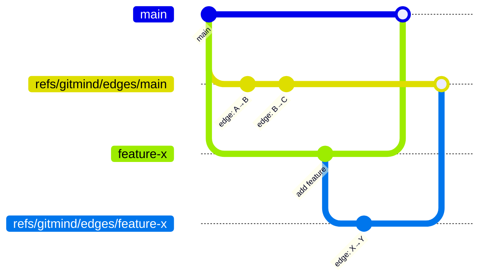

# Journal Writer

## Purpose

Append edges to a branch-specific journal using Git commits with CBOR-encoded messages.

## Design Rationale

### Why Commits Instead of Objects

1. __Branch isolation__: Each branch has its own journal ref
2. __History__: Natural ordering via parent chain
3. __Signatures__: Can sign journal commits
4. __Replication__: `git push/pull` just works
5. __No orphan refs__: GitHub/GitLab accept refs/gitmind/*

### Empty Tree Strategy

```c
#define EMPTY_TREE_SHA "4b825dc642cb6eb9a060e54bf8d69288fbee4904"
```

- Git's well-known empty tree (exists in every repo)
- Zero storage overhead (tree already exists)
- Commits become ~200 bytes + message

### Reference Naming

```
refs/gitmind/edges/main
refs/gitmind/edges/feature-x
refs/gitmind/edges/hotfix/CVE-2025-1234
```



- Mirrors branch structure
- Natural merge semantics
- Survives rebases (re-parented automatically)

## Implementation Details

### Batch Committing

- Accumulate edges up to 8KB
- Create commit when buffer full
- Single edges create immediate commits
- Balances between commit spam and latency

### Parent Handling

```c
if (ref_exists) {
    parent = current_tip;
} else {
    parent = NULL;  // First commit on branch
}
```

- Gracefully handles new branches
- No special initialization needed

### Signature Reuse

- Uses `git_signature_default()`
- Respects user.name/user.email config
- Author = Committer (it's a machine operation)

## Edge Cases

### Branch Detection

- __Detached HEAD__: Fails with GM_ERROR
- __Empty repo__: No HEAD, cannot determine branch
- __Worktrees__: Each has own HEAD, works correctly

### Concurrent Writers

- __Same process__: Not thread-safe (by design)
- __Multiple processes__: Git handles ref locking
- __Result__: Last writer wins (standard Git behavior)

### Large Edge Batches

```
User: Create 10,000 edges
Result: ~625 commits (16 edges per commit)
Time: ~2 seconds on SSD
```

- Automatic batching prevents huge commits
- GitHub render limit: 1MB commit messages

### Unicode Branch Names

- Git already restricts ref names
- We inherit Git's validation
- No additional sanitization needed

## Error Handling

1. __No repo__: GM_ERROR (caught early)
2. __No memory__: GM_NO_MEMORY (malloc failed)
3. __Git errors__: Wrapped as GM_ERROR
4. __Disk full__: Git returns error, we propagate

## Performance Characteristics

### Write Amplification

```
1 edge = 1 commit = ~300 bytes
1000 edges in batch = 1 commit = ~100KB
Amplification factor: 300x vs 0.1x
```

- Batch operations strongly preferred
- Single edges acceptable for interactive use

### Bottlenecks

1. __Commit creation__: ~200μs (SHA-1 hashing)
2. __Ref update__: ~100μs (file I/O)
3. __Not bottlenecks__: CBOR encoding, memory

## Security Considerations

### Ref Name Injection

- Branch names come from Git (already validated)
- We only append to refs/gitmind/edges/
- No user input in ref names

### Binary Commit Messages

- Set `encoding=binary`
- Git treats as opaque bytes
- Web UIs show "Binary content"
- No XSS risk

## Future Evolution

### Compression

```c
if (cbor_size > 1024) {
    zstd_compress(cbor_data);
    prepend_magic_byte(0xFF);
}
```

- Optional for large batches
- Transparent to readers

### Parallelism

- Could write to refs/gitmind/edges/main.lock
- Merge parallel journals periodically
- Complexity not worth it yet

## Testing Strategy

### Critical Tests

1. First edge on new branch
2. Batch overflow at 8KB boundary
3. Unicode in branch names
4. Concurrent writers (integration)
5. Power loss simulation

### Performance Tests

```bash
# Measure commit creation overhead
time git-mind link-bulk < 10k-edges.txt

# Should be < 5 seconds for 10K edges
```

## Why This Design Wins

1. __Git-native__: Uses commits, not custom objects
2. __Branch-aware__: Isolated by design
3. __Push-friendly__: Standard refs, no magic
4. __Recoverable__: History preserves everything
5. __Simple__: ~200 lines of clear logic

As Linus would say: "Good taste means using the infrastructure that's already there."
