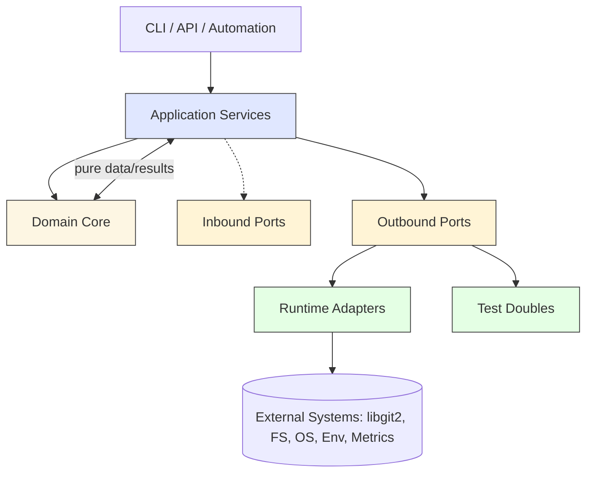
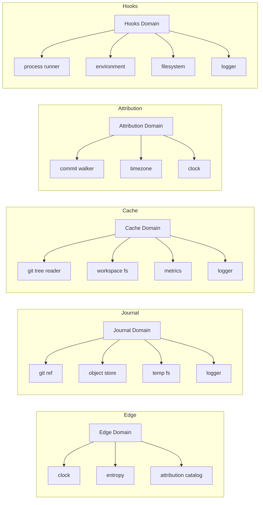
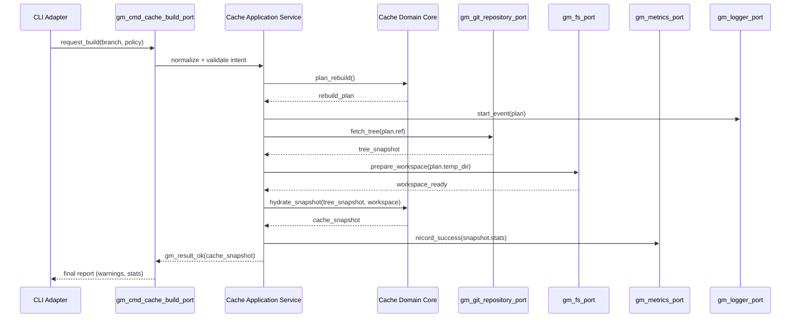

# Repository Guidelines

## Agent TL;DR (read me first)

- TOP PRIORITY: Transition the codebase to a hexagonal architecture. Every edit must push toward strict SRP, dependency-injected edges, and test-double-friendly seams while keeping guardrails (clang-tidy, tests, docs, CI) green.
- Build/test: `make ci-local` (Docker-only; Meson guard prevents host builds). Docs verify: `make docs-verify`.
- Review seeding: `make seed-review PR=<number>`; see `docs/tools/Review_Seeding.md`.
- Red lines: OID-first equality; use `gm_snprintf/gm_strcpy_safe`; append-only journal; no public ABI breaks (append fields).
- Refs via `gm_build_ref`; reject inputs starting with `refs/`. No `GM_PATH_MAX*2` buffers.
- Public headers are umbrella-safe with C++ linkage guards; run `make header-compile`.
- Docker-only policy: override host build only with `-Dforce_local_builds=true` when absolutely necessary.

```yaml
agent:
  docker_only: true
  build: "make ci-local"
  docs_verify: "make docs-verify"
  seed_review: "make seed-review PR=${PR}"
  header_compile: "make header-compile"
  stop_signs:
    - behavior_or_abi_change
    - adding_dependencies
    - changing_ci_gates
    - large_refactor
```

## Boot Checklist

- Check for nested `AGENTS.md` when editing in subdirs
- Use Docker for builds/tests; never host-run by default
- Run `make docs-verify` for doc changes; `make header-compile` for new public headers
- Respect One‑Thing rule for touched files
- For fork PRs, seeded worksheet may be artifact+comment (see Review_Seeding)
- Sync feature/milestone updates in `docs/features/Features_Ledger.md`; follow the Capture→GA lifecycle and rerun `make features-update`.

## Recent Developments

```yaml
recent_developments:
  - date: 2025-09-16
    summary: >
      Review seeding + auto‑replies: added seed script, auto‑seed workflow (same‑repo commit, fork artifact fallback), and apply‑feedback workflow that replies to PR comments from the worksheet. Renamed bot secret to GITMIND_PR_WORKSHEET_BOT.
  - date: 2025-09-16
    summary: >
      Worksheet gates: pre‑push guard + checker to block unfilled templates/undecided sections in review worksheets; bypass knob documented.
  - date: 2025-09-16
    summary: >
      Curated AGENTS.md: TL;DR + machine‑readable agent block + Boot Checklist; added Recent Developments YAML and auto‑archival to docs/activity via pre‑commit hook.
  - date: 2025-09-16
    summary: >
      Features Ledger: introduced docs/features/Features_Ledger.md + hubless/update_progress.py (KLoC‑weighted groups); added README features-progress block; wired pre-commit and a main-branch auto-update workflow; make features-update.
  - date: 2025-09-16
    summary: >
      Review ergonomics: CodeRabbit config (.coderabbit.yml) for summary‑first; PR template guidance; docs‑only auto‑labeling workflow.
  - date: 2025-09-15
    summary: >
      CI/CD: Fixed C-Core Gate failures. README now complies with markdownlint (underscore emphasis/strong, blockquote spacing, no inline HTML wrappers, code fence fixes, heading punctuation). Added local CI rig `tools/ci/ci_local.sh` and `make ci-local` to mirror C-Core Gate (markdownlint + docs checks, Dockerized build/tests/E2E, clang-tidy pass).
  - date: 2025-09-15
    summary: >
      Build: Switched Meson `c_std` from `c23` to `c2x` (Meson-compatible while targeting C23). Moved `option()`s to `meson_options.txt`. Set `GITMIND_DOCKER=1` in gauntlet Dockerfile to satisfy the Meson host-build guard inside gating containers. Registered new unit test target `test_ref_utils` in `meson.build`.
  - date: 2025-09-15
    summary: >
      Core (refs): `gm_build_ref` now accepts Git-style branch shorthands (slashes allowed), validates the combined ref via libgit2 `git_reference_normalize_name`, and rejects leading `refs/` to prevent double-prefixing. Updated header docs and added unit tests.
  - date: 2025-09-15
    summary: >
      Core (path safety): Removed `GM_PATH_MAX * 2` buffer in `core/src/cache/tree_builder.c`; now uses `GM_PATH_MAX` and bounded `gm_snprintf`.
  - date: 2025-09-15
    summary: >
      Docs: Added `docs/architecture/Ref_Name_Validation.md` (with ToC) documenting ref-building policy and validation. Updated `docs/CI_STRATEGY.md` and `docs/code-review/CLAUDE.md` to clarify C23 policy expressed via Meson `c2x`. Expanded `docs/operations/Environment_Variables.md` with `GITMIND_CI_IMAGE` and `HOOKS_BYPASS`.
  - date: 2025-09-15
    summary: >
      Reviews: Documented rejected suggestions for PR #169 under `docs/code-reviews/rejected-suggestions/` (canonical CHANGELOG filename, keep `md-verify` alias, ignore `.PHONY` ordering churn). Linked decisions in the PR thread.
```

## Lessons Learned

- 2025-09-17 — Legacy GitHub issues drift fast; triage with `possibly-*` labels and mirror anything still relevant into `docs/features/Features_Ledger.md` so the ledger stays the source of truth.
- 2025-09-19 — Treat clang-tidy "warning counts" as per-diagnostic, not per-include churn; measure progress via filtered reports and keep lint passes surgical without opportunistic feature work.
- 2025-09-19 — Verify clang-tidy counts before scheduling a module migration; if a target already sits at zero, pick another area so every pass drives an actual warning delta.
- 2025-09-19 — Cache rebuild now routes through an app-level service (`core/src/app/cache/cache_rebuild_service.c`) so `builder.c` stays a thin adapter and the One-Thing rule holds.
- 2025-09-19 — All future temp directory work must flow through a platform-aware filesystem/temp-path service (`~/.gitmind/<repo-id>/…` on every OS). Draft the port + adapters next and stop writing ad-hoc dotfiles in tests.
- 2025-09-19 — In progress: drafting git object/commit ports + fake adapters so cache rebuilds and tests stop reaching into libgit2 directly.
- 2025-09-27 — When swapping hooks over to ports, wire the adapter once per run and dispose it as soon as the loop ends; the seam stays clean and tests don't need real repos.
- 2025-09-27 — When you add a port capability, stub it in the fake immediately; tests stay fast, and tidy stops tattling.

## Project Structure & Module Organization

- `core/` — C23 library: `include/` (public headers), `src/` (impl), `tests/` (unit). Add new code here.
- `include/` — Umbrella API (`gitmind.h`) and namespaced headers under `include/gitmind/`.
- `src/` — Legacy code under migration. Avoid adding new modules here.
- `apps/` — Future CLI/hooks/apps. Until announced, prefer `core/` additions.
- `tests/` — E2E/integration/legacy tests and fixtures.
- `tools/`, `quality/`, `.githooks/` — Dev tooling (clang-tidy, formatting, gauntlet, secret scanning).
- `docs/` — Architecture, dev setup, and operational notes.

## Build, Test, and Development Commands

> [!WARNING]
> **DO NOT BUILD GITMIND OUTSIDE OF DOCKER**
> git-mind manipulates Git internals (refs/*, objects, config). Building or running tests on the host can corrupt this repository or others on your machine. All builds and tests must run inside the CI Docker image for safety and parity.

> [!INFO]
> _If you really want to..._
> Use the provided container workflow:
> - `make ci-local` — runs docs checks, builds, and unit tests in the CI image
> - `tools/ci/ci_local.sh` — same as above, invoked directly
>
> Advanced (at your own risk):
> - `meson setup build -Dforce_local_builds=true` — explicit Meson override
> - `GITMIND_ALLOW_HOST_BUILD=1` — legacy env override (discouraged)
> If you override, you accept responsibility for any repo damage.

- Configure + build (inside CI container): `make ci-local` or `tools/ci/ci_local.sh`
- Run unit tests (inside CI container): done as part of `make ci-local`
- Make shims: `make`, `make test`, `make clean`
- Lint (CI parity): `./tools/docker-clang-tidy.sh` → produces `clang-tidy-report.txt`
- Strict multi-compiler build: `./tools/gauntlet/run-gauntlet.sh` (recommended before PRs)
- Enable hooks: `pre-commit install` (clang-format + detect-secrets + docs link/TOC checks)
- Docs linter (all docs): `python3 tools/docs/check_docs.py --mode link` and `--mode toc`
- Pre-commit (changed files): `pre-commit run --all-files docs-link-check` and `docs-toc-check`
 - Markdown linter: `make md-lint` (check) and `make md-fix` (autofix) — uses `.markdownlint.jsonc`
 - Header guards lint: `meson run -C build lint_header_guards`
 - Public headers compile check: `ninja -C build header-compile`

## Coding Style & Naming Conventions

- Language: C23 with warnings-as-errors; no VLAs or shadowing; explicit prototypes.
- Formatting: `.clang-format` (LLVM-based, 4 spaces, 80 cols, pointer alignment right). Pre-commit runs `clang-format`.
- **NEVER** use `NOLINT` or other mechanisms to suppress clang-tidy warnings. All warnings must be fixed.
- Naming: functions/vars `lower_snake_case` (prefix `gm_`), macros `UPPER_SNAKE`, types end in `_t`, header guards `GITMIND_*`.
- Includes: prefer specific headers; order/regroup per `.clang-format`.
 - Public headers must be umbrella-safe: compile standalone, correct include order, stable header guards, and `extern "C"` when included from C++.

## Testing Guidelines

- Unit tests live in `core/tests/unit/` as `test_<module>.c`. Keep deterministic and isolated.
- Meson wires test backends as needed—just build and run tests via Meson/Ninja.
- E2E/integration under `tests/` for CLI/flow checks. Keep fixtures minimal.

## Commit & Pull Request Guidelines

- Conventional commits: `type(scope): description` (e.g., `fix(core/cbor): handle null keys`).
- Every PR should reference a corresponding GitHub issue. Commits closing an issue should use the `Fixes #<number>` syntax.
- For any non-trivial task, briefly outline your plan of attack in the PR description or an associated issue. This includes the files you expect to change and the verification steps you will take.
- PRs must describe changes, link issues, include a short test plan, pass CI, and introduce no new clang-tidy warnings (`./tools/docker-clang-tidy.sh`). Update docs when applicable.
- **NEVER** use `git add -A` or `git commit -a`. Always stage changes intentionally and individually (`git add <path>`) to ensure only desired changes are included.
- **NEVER** alter, disable, or otherwise circumvent git hooks or tests. They are critical for maintaining code quality and repository integrity.
- After a PR is approved and all checks pass, ask the user if they want you to push the changes and open a pull request.
- Code review (CodeRabbit): Keep `.coderabbit.yml` updated. Prefer summary reviews, limit per-line comments on docs. If rejecting a suggestion, add a note under `docs/code-reviews/rejected-suggestions/{commit}_{branch}_{PR#}_{suggestion}.md` with a link to the original comment and rationale.

## Security & Configuration

- Do not commit secrets. Pre-commit runs `detect-secrets` with `.secrets.baseline`.
- Use `.env.example` as a template; never check in real credentials.
 - E2E safety: some CI E2E steps require `GITMIND_SAFETY=off` in the container environment.

## Agent-Specific Notes

- Make minimal, focused diffs; avoid drive-by refactors. Match existing patterns in `core/` and headers under `include/`.
- Run build, tests, and lint locally before proposing changes. Keep changes zero-warnings and formatted.
- Prefer OID-first APIs for SHA-agnostic correctness. Use `git_oid` (typedef `gm_oid_t`) in new core interfaces, and compare via `git_oid_cmp`.
- Current top priority: drive clang-tidy to zero warnings. Pause feature work; focus on cleaning modules one by one. Measure per-file warning counts via `rg 'path/to/file' clang-tidy-report-full.txt | wc -l` and confirm the filtered count drops to 0 before moving on.
- All new code must declare explicit ports/adapters: keep domain logic pure, inject IO via context structs, and supply test doubles in unit tests. Use these seams to chip toward a full hexagonal structure.

### Hexagonal Architecture Master Plan (adopt in every PR)

#### Layering model (concentric rings)
- **Domain Core** – Pure, deterministic C23 modules holding graph semantics, cache/journal rules, attribution math, and result types. No direct IO, libgit2, or global state.
- **Application Services** – Thin use-case coordinators that translate inbound intents into domain operations, orchestrate ports, aggregate results, and enforce transactional boundaries.
- **Ports Layer** – Forward declarations of every external dependency (driving and driven). Ports are expressed as POD structs carrying function pointers/vtables and configuration for dependency injection.
- **Adapters Layer** – Concrete implementations of ports for libgit2, POSIX filesystem, CLI/environment, logging, metrics, and test doubles. Lives under `core/src/adapters/**` (runtime) and `core/tests/fakes/**` (tests).

#### Visual guides
- **Hexagonal layers** – shows the concentric model that all modules must respect.



- **Module responsibilities** – maps each bounded context to its critical ports.



- **Cache rebuild journey** – a sequence chart for the most complex data flow.



#### Iterative execution workflow (start here)
- **Phase 0 – Environment parity**
  - Clone/fetch latest `fix/clang-tidy-warnings`; confirm `git status` clean.
  - Run `make ci-local` inside Docker to ensure the baseline build/test/clang-tidy loop passes before touching code.
- **Phase 1 – Baseline & scaffolding**
  - Capture starting diagnostics via `./tools/docker-clang-tidy.sh` (or reuse the artifact) and log per-file counts with `rg 'path/to/file' clang-tidy-report-full.txt | wc -l`.
  - Introduce missing port headers (inbound/outbound) with `gm_result_t` signatures and `TODO` comments; land stub adapters that return `GM_ERR_NOT_IMPLEMENTED` so composition can begin without functional regressions.
- **Phase 2 – Focused module migration**
  - Pick the smallest bounded context that still emits warnings (start with Attribution if unsure).
  - Extract pure logic into `core/src/domain/<module>/` respecting the One-Thing rule (one entity/service per file).
  - Wrap every side effect behind the relevant outbound port; add real adapter in `core/src/adapters/**` and deterministic fake in `core/tests/fakes/**`.
  - Update the composition root to inject the new dependencies via a `gm_runtime_context_t` slice.
- **Phase 3 – Verification loop**
  - Extend or add unit tests that exercise the domain via fakes only; add integration coverage if the real adapter is safe to run in Docker.
  - Re-run `make ci-local`; record before/after warning deltas in the commit message and AGENTS activity log.
  - Document lessons learned in `docs/activity/<date>_hexagonal.md` and refresh module status tables/diagrams above.
- **Repeat**
  - Move to the next module with outstanding warnings, reusing the same sequence. Never progress without zero warnings for the touched files and updated documentation.

#### Domain modules & responsibilities
- **Edge Graph Domain** (`core/src/domain/edge/**`, headers in `core/include/gitmind/edge*.h`)
  - Entities: `gm_edge_t`, attributed edge payloads, ULID/oid identity, merge rules.
  - Services: edge validation, CRDT merge (OR-set + advice LWW), hashing, equality.
  - Ports consumed: clock (for ULID), entropy, attribution catalog.
- **Journal Domain** (`core/src/domain/journal/**`, `core/include/gitmind/journal.h`)
  - Entities: journal entry, append log, branch history, ref targeting.
  - Services: append, snapshot, branch repair, migration between legacy/attributed forms.
  - Ports consumed: git reference writer, object store, clock, filesystem temp staging, logging.
- **Cache Domain** (`core/src/domain/cache/**`, `core/include/gitmind/cache*.h`)
  - Entities: cache snapshot, index, query predicates, cache builder state machine.
  - Services: snapshot hydration, query execution, invalidation, size budgeting.
  - Ports consumed: git tree/object reader, filesystem workspace, metrics emitter, logging.
- **Attribution Domain** (`core/src/domain/attribution/**`, `core/include/gitmind/attribution.h`)
  - Entities: author timeline, file-line attributions, aggregation windows.
  - Services: blame stitching, time bucketing, commit ancestry traversal.
  - Ports consumed: git commit walker, clock, timezone/formatting helper.
- **Hooks & Integrations** (`core/src/domain/hooks/**`, `core/include/gitmind/hooks/**`)
  - Entities: hook definitions, event payloads, execution outcomes.
  - Services: scheduling, policy enforcement, failure handling.
  - Ports consumed: process runner, environment reader, filesystem, logging.
- **Support Domains** – Shared deterministic helpers kept pure:
  - `error/result`: central `gm_result_t` hierarchy and error catalogs.
  - `time`: pure conversions, formatting, range checking (consumes clock port only through services).
  - `utf8`/`util`/`crypto`: pure validation, encoding, hashing primitives.

#### Inbound (driving) ports – exposed use cases
| Port | Purpose | Interface (header) | Primary consumers |
| --- | --- | --- | --- |
| `gm_cmd_journal_port_vtbl` | Append/read journal entries, manage branches. | `core/include/gitmind/ports/journal_command_port.h` | CLI, future API server |
| `gm_cmd_cache_build_port_vtbl` | Trigger cache rebuilds and invalidations. | `core/include/gitmind/ports/cache_build_port.h` | CLI, background workers |
| `gm_qry_cache_port_vtbl` | Execute cache queries and report stats. | `core/include/gitmind/ports/cache_query_port.h` | CLI, integrations |
| `gm_qry_attribution_port_vtbl` | Produce attribution reports. | `core/include/gitmind/ports/attribution_query_port.h` | CLI, UI adapters |
| `gm_cmd_hook_port_vtbl` | Register, dry-run, and execute hooks. | `core/include/gitmind/ports/hook_command_port.h` | CLI, automation agents |
| `gm_admin_health_port_vtbl` | Health, diagnostics, and warning budgets. | `core/include/gitmind/ports/admin_health_port.h` | CI watchdogs |

Each inbound port owns the orchestration layer for its bounded context and returns `gm_result_t` (or richer domain result structs) that capture success, warnings, and remediation hints.

#### Outbound (driven) ports – infrastructural dependencies
| Port | Purpose | Interface (header) | Default adapter |
| --- | --- | --- | --- |
| `gm_git_repository_port` | Commit/tree/ref IO via libgit2. | `core/include/gitmind/ports/git_repository_port.h` | `core/src/adapters/libgit2/repository_adapter.c` |
| `gm_git_ref_port` | Dedicated ref create/update/delete. | `core/include/gitmind/ports/git_ref_port.h` | `core/src/adapters/libgit2/ref_adapter.c` |
| `gm_fs_port` | POSIX filesystem operations (mkdir, readlink, temp dirs). | `core/include/gitmind/ports/filesystem_port.h` | `core/src/adapters/fs/posix_filesystem_adapter.c` |
| `gm_clock_port` | Wall/monotonic clocks, timezone offsets. | `core/include/gitmind/ports/clock_port.h` | `core/src/adapters/time/system_clock_adapter.c` |
| `gm_entropy_port` | ULID randomness / crypto-safe bytes. | `core/include/gitmind/ports/entropy_port.h` | `core/src/adapters/crypto/os_entropy_adapter.c` |
| `gm_logger_port` | Structured logging, warning budgets. | `core/include/gitmind/ports/logger_port.h` | `core/src/adapters/logging/stdio_logger_adapter.c` |
| `gm_metrics_port` | Emit counters/gauges for cache/journal states. | `core/include/gitmind/ports/metrics_port.h` | `core/src/adapters/metrics/null_metrics_adapter.c` (default) |
| `gm_process_port` | Spawn hook processes, capture IO. | `core/include/gitmind/ports/process_port.h` | `core/src/adapters/process/posix_process_adapter.c` |
| `gm_env_port` | getenv, config files, feature toggles. | `core/include/gitmind/ports/env_port.h` | `core/src/adapters/config/env_adapter.c` |
| `gm_thread_port` | Background task scheduling (if needed later). | `core/include/gitmind/ports/thread_port.h` | `core/src/adapters/threading/null_thread_adapter.c` (stub) |

Every outbound port ships with: (a) production adapter, (b) deterministic fake under `core/tests/fakes`, (c) harness verifying contract invariants.

#### Adapter inventory & placement
- Runtime adapters live under `core/src/adapters/<area>/<name>_adapter.c` with matching private headers in `core/src/adapters/<area>/<name>_adapter.h`.
- Composition roots:
  - `core/src/app/cli_composition.c` – wires CLI inbound ports to libgit2/FS/system adapters.
  - `core/src/app/background_tasks.c` – future cron/daemon wiring.
  - Tests compose against fakes via `core/tests/support/<module>_fixture.c`.
- Each adapter publishes a factory returning the port vtable plus state; teardown hooks capture deterministic cleanup.

#### Cross-cutting seams
- `gm_result_t` extended variants for warnings vs errors; ports never return raw ints.
- Warning budget tracker injected via `gm_logger_port` to enforce “warnings == bugs” discipline; totals recorded per module for zero-warning drive.
- Configuration context (`gm_runtime_context_t`) holds references to all ports for DI; built once in composition root and threaded downward.
- Feature toggles (experimental adapters) registered in the context but default to safe stubs.

#### File & directory layout (target state)
- `core/src/domain/**` – pure domain logic split by bounded context (`edge`, `journal`, `cache`, `attribution`, `hooks`, `util`).
- `core/include/gitmind/ports/**` – all inbound/outbound port definitions (strictly headers, no inline behavior beyond trivial helpers).
- `core/src/ports/**` – default implementations for simple inbound coordinators that remain in C (optional).
- `core/src/adapters/**` – infrastructure adapters grouped by dependency (libgit2, fs, time, crypto, logging, process, env, metrics, thread).
- `core/tests/fakes/**` – deterministic fakes/mocks/stubs per port.
- `apps/cli/src/**` – UI/input adapters that translate CLI flags into inbound port calls; stays thin.
- `docs/architecture/hexagonal/**` – living documentation tracking adapter status and remaining migrations.

#### Migration & execution plan
1. **Port scaffolding sweep** – Introduce skeleton headers for all inbound/outbound ports with `gm_result_t` signatures and TODO markers documenting each method. Land empty adapters with `GM_ERR_NOT_IMPLEMENTED` bodies to unblock compilation.
2. **Module-by-module extraction** – For each domain module (edge, journal, cache, attribution, hooks):
   - Split pure logic into `core/src/domain/<module>/`.
   - Wrap side effects behind the appropriate outbound ports.
   - Publish an inbound coordinator implementing the relevant driving port.
3. **Adapter fulfillment** – Replace `GM_ERR_NOT_IMPLEMENTED` stubs with real adapters, starting with libgit2 repository/ref access, filesystem IO, and clock/entropy providers.
4. **Composition wiring** – Update CLI/background entry points to build a `gm_runtime_context_t` and pass dependencies explicitly. Delete legacy global singletons once wiring compiles.
5. **Testing convergence** – For each port, author contract tests exercising success/error paths with both real adapters (when safe) and fakes. Unit tests rely only on fakes; integration tests validate real adapters inside containers.
6. **Warning budget enforcement** – Track clang-tidy warnings per module via `quality-reports/` snapshots; block merges unless touched modules report zero diagnostics.
7. **Documentation + log** – After each bounded context migration, log the work in `docs/activity/<date>_hexagonal.md` and refresh this plan with current status (ports implemented, adapters pending).

#### Execution guardrails (never skip)
- Boundaries first: every time you encounter IO, immediately wrap it in the correct outbound port and inject it.
- Ports & adapters: new functionality enters via inbound ports only; composition roots wire concrete adapters.
- SRP refactors: maintain “one responsibility per translation unit” and keep domain logic pure.
- Guardrails always on: run `make ci-local` (Docker) for every commit; touched files must be clang-tidy clean.
- Document progress: update `AGENTS.md` and `docs/activity/` as ports or adapters graduate from TODO to done.

#### Integration of Legacy Concerns
- **Security Primitives:** All new security features must be designed and implemented as ports and adapters within the hexagonal architecture.
- **Memory Safety:** All module migrations must address memory safety concerns, including bounds checking and null checks.

### One-Thing Rule (Touched code policy)

- You touch it? You refactor it. If you modify a type or function that clearly bundles multiple concerns in a single file, split out the thing you touched into its own file (1 file = 1 thing):
  - One enum per header.
  - One struct per header (public structs under `include/gitmind/`, internal-only in `core/include/gitmind/<module>/internal/`).
  - One responsibility per C file where practical.
- You touch it? You factor it out. Make sure the item you edited truly lives in its own file: one enum/struct/module per translation unit, no dumping new responsibilities into an existing compilation unit just because it was nearby.
- Beyond the “one thing” split, every touched area must uphold SRP, be test-double friendly, and lean on dependency injection. Whenever an operation can fail, surface a proper result type. New or modified code must stay warning-free under the current clang‑tidy rules before the change is considered done.
- Scope: Only the item you touched (don’t boil the ocean). If you edit `Bar` in `foo.c` and `foo.c` contains 12 types, you only have to extract `Bar` now.
- Enforcement: Pre-commit includes a heuristic check (`one-thing`); bypass in emergencies with `GM_ONE_THING_ALLOW=1` in the environment. PRs should include a brief note when bypassed.
- History policy: Do not amend or rebase once commits exist. Create new commits for follow-up fixes, merge instead of rebasing, and never rewrite history. Force pushes are forbidden—if you believe one is unavoidable, stop and get explicit user approval first.

## Working Knowledge (for agents)

- Journal-first graph: Edges are CBOR commits under `refs/gitmind/edges/<branch>`; cache lives in `refs/gitmind/cache/<branch>` and is rebuildable (never merged).
- Semantics as names: Store `type_name` and `lane_name` as UTF-8 strings on edges; do not collapse into a generic/custom type. Derive 64-bit IDs from names (NFC + stable hash) only for cache/filters.
- Time-travel correctness: All semantics (and optional advice) are in-history; queries evaluate against the chosen commit and branch.
- Merge/conflict model: Append-only journal; edge ULIDs form an OR-Set; “Semantics Advice” (optional) merges with hybrid CRDT (LWW scalars, OR-Set collections).
- Link vs code authors: Edge attribution `author` is the link creator (from `git config` unless provided); code authorship at the chosen commit is recorded separately (per-file last commit author/time) when captured by external tooling.
- Docker hygiene: Images are namespaced/labeled (`gitmind/ci:clang-20`, `gitmind/gauntlet:<compiler>`; label `com.gitmind.project=git-mind`). The CI image is built locally from `.ci/Dockerfile`; use `make docker-clean` to reclaim space safely.
- CI/Tidy nuance: Local builds and tests pass. Clang-tidy in Docker depends on CRoaring headers in the CI image; add a source build step for deterministic results on aarch64 if CI flags it.
 - CI path filters: Core build/test workflows are restricted to code paths; doc-only changes do not trigger core builds. Markdown lint runs separately with reduced noise via `.markdownlint.jsonc`.

## Agent Activity Log

See archives under `docs/activity/` for older logs.

### 2025-10-08
- Telemetry & logging
  - Added internal telemetry config shim (`core/include/gitmind/telemetry/internal/config.h`, `core/src/telemetry/config.c`).
  - Implemented repo tag hashing flag `GITMIND_METRICS_REPO_HASH_ALGO=sha256|fnv` (default `fnv`); tests cover `sha256` path.
  - Introduced log formatter DI seam: `gm_log_formatter_fn` in `gm_context_t` (internal) with default renderer (`core/src/telemetry/log_format.c`); services format KV → render (JSON/text) → emit via `gm_logger_port`.
- Cache
  - Refactored cache rebuild service to use the formatter DI seam; emits `rebuild_start`/`rebuild_ok`/`rebuild_failed` logs and metrics (`cache.rebuild.duration_ms`, `cache.edges_processed_total`, `cache.tree_size_bytes`).
  - Added end‑to‑end test using fakes for logger/metrics and a stub repo; metrics exercised by default.
- Journal
  - Scaffolded inbound port `gm_cmd_journal_port` (append/append_attributed) with thin coordinator.
  - Instrumented journal append/read with logs + metrics via the formatter DI seam; unified tags (branch/mode/repo/extras). Removed legacy env branch override from writer; use repo HEAD via port.
  - Added formatter unit test and a small journal port test using fake repo head.
- Adapter contract tests
  - Added libgit2 adapter test for `build_tree_from_directory` (verifies tree ODB object).
- Docs
  - Updated `docs/operations/Telemetry_Config.md` with repo hash flag, Quickstart, custom logger adapter guide, and note on advanced formatter DI seam.
  - Pruned stale CLI links in docs index to keep docs checks green.
- CI/Status
  - `make ci-local` (Docker) green across the session; tidy diff‑guard ran. Branch: `feat/hex-ports-ci-green`. Merge‑only; no force pushes.
- Next actions (paused for feedback)
  - Journal: consider adding edge‑count metric on read (requires callback plumbing), and enable richer unit tests around the inbound port.
  - Optional: regenerate concise CLI docs; consider flipping repo hash default to `sha256` after review.

```jsonl
{"ts":"2025-10-08T23:59:00Z","kind":"note","topic":"logging","msg":"Formatter DI seam added; cache/journal emitting structured logs; adapters remain the extension point."}
{"ts":"2025-10-08T23:59:00Z","kind":"note","topic":"telemetry","msg":"Repo tag hashing supports sha256|fnv; tests and docs updated."}
{"ts":"2025-10-08T23:59:00Z","kind":"note","topic":"journal","msg":"Inbound port scaffolded; append/read instrumented; writer env override removed; CI green."}
```

### 2025-09-29
- Merged PR #173 after tightening the remaining safe-string usage and OID helper semantics; rebased on `origin/main` and created `feat/next-hex-task` for the follow-up work.
- Problems solved today: delivered GM.MVP.T001 (strict equality regressions + OID-first doc sweep), captured a fresh clang-tidy snapshot, and drafted the "State of the Repo" discussion.
- Problems still open: GM.MVP.T002 (negative ref-utils tests), GM.MVP.T003 (CLI safety matrix), and the libgit2 cleanup in CLI/bench helpers.
- Immediate next moves: spin up the ref-utils test sprint, keep the clang-tidy backlog doc current, and log ongoing progress in `docs/activity/2025-09.md`.
- Unscheduled-but-important: worksheet automation cleanup and the CLI safety test expansion still need dedicated time before month end.
- Context reminder: capture major decisions in the ledger/worksheet quickly—we’re pushing the context window, so keep notes concise.

### 2025-09-27
- Routed cache metadata, query, and journal flows through `gm_git_repository_port`; reader/writer now use the adapter for head detection, commit walking, message bodies, and ref updates.
- Added port surface area (head lookup, commit walk/message helpers, parent-aware commit spec) plus libgit2 adapter support to keep hex seams consistent.
- Clang-tidy cleanup delivered: renamed the short `s1`…`s5` path segments, refreshed `walk_commits` naming, and forward-declared libgit2 types so include-cleaner stops shouting.
- Fake git repository port now provides head branch lookup, per-ref commit walks, and commit-message reads via new helpers—tests can enqueue histories instead of skipping those seams.
- Edge creation (basic + attributed) now resolves blob identities through `gm_git_repository_port`; goodbye `ctx->git_repo`/`git_ops` shims. Legacy SHA arrays are populated from the returned OIDs so the transitional fields stay intact.
- Post-commit hook now builds a libgit2-backed `gm_git_repository_port` instead of poking `ctx->git_repo`; journal helpers lean solely on ports and clean up the adapter after processing.
- Hook journey note: fake git port fuels the edge tests; with augment helpers on the seam, the remaining hook work is porting merge detection and retiring the legacy `git_ops` shim.
- Augment helpers now resolve HEAD/parent blob OIDs through the repository port (new `resolve_blob_at_commit` seam), and the fake git adapter learned commit-scoped blob mapping so tests can assert hook behavior without libgit2.
- Architecture doc updated (`docs/architecture/augments-system.md`) with the post-commit ➜ repository-port wiring so future hooks keep the seam intact.
- Merge detection runs through the port too: added `commit_parent_count`, rewired the post-commit hook to create/dispose the port up front, and landed a `test_hook_augment` suite that exercises HEAD/parent blob lookups and merge detection via the fake adapter.
- `gm_context_t` is now strictly port-based—dropped the legacy `git_ops`/`git_repo` shim, handed raw libgit2 ownership to the CLI runtime, refreshed cache/journal tests, and kept the new shape green with `make ci-local`.
- Next up: finish scouring CLI + bench utilities for direct libgit2 calls, port them behind adapters, and keep clang-tidy quiet while we prep the PR.
- Lesson logged: mirroring libgit2 semantics meant storing commit sequences per ref; keeping messages alongside the OIDs made the reader decode deterministic again.
- Cap’n memo: espresso's on deck—once edge jumps ports, we raid the galley for celebratory biscotti.
- Filesystem tidy sweep: replaced the lingering raw `memset` calls in `gm_fs_path_dirname`/`gm_fs_path_basename_append` with `gm_memset_safe`, added the explicit `separator_len` so the bool math stops tripping clang-tidy, and pulled in the security header for the helper prototypes.
- POSIX temp adapter now defines `_GNU_SOURCE` up front and trusts glibc's `realpath`; the redundant extern declaration is gone, keeping include-cleaner + tidy happy.
- Immediate next move: rerun `make ci-local` once these filesystem fixes settle, then chase the remaining bool-to-int clang-tidy nits in the staged benchmark + fake git port files before we go PR hunting.
- Lesson logged: tidy catches implicit bool arithmetic fast—introducing small helper variables beats sprinkling casts and keeps the intent readable for future hex refactors.
- Message in a bottle: future Cap’n, there’s cocoa in the galley—sip it while you double-check the tidy report before raising the PR flag.
- CodeRabbit pass (batch 2): accepted output-zeroing and error-propagation notes—commit creation now clears result OIDs up front, commit message reads null-init outputs, hook blob lookups zero result buffers and distinguish NOT_FOUND from real failures, commit walks honour `GM_CALLBACK_STOP`, and the fake port header owns its std includes.
- CodeRabbit pass (batch 3): reaffirmed the wildebeest benchmark already routes queries via `gm_oid_t`, clarified detached-HEAD fallback inside `gm_hook_get_blob_sha`, and brought the PR171 review docs in line with the front-matter/TOC guidelines.

### 2025-09-28
- Hardened port usage: journal writer now bubbles explicit commit/ref update codes and retries fast-forward only once; cache rebuild composes a parent-aware commit spec and refuses non-fast-forward updates; libgit2 adapter enforces ancestry checks via `git_graph_descendant_of`.
- Filesystem polish: `gm_fs_path_normalize_logical`/`basename_append` zero outputs on failure paths, guard short buffers, and cap segment arrays; posix temp adapter wraps `_GNU_SOURCE` in an `#ifndef` so clang stays quiet.
- Fake git port + tests updated to use `gm_memset_safe`/`gm_strcpy_safe`, keeping parity with production safety helpers.
- CI status: `make ci-local` passes after the fast-forward guard, cache parent wiring, and path-utils fixes (clang-tidy clean).
- Outstanding follow-ups for future-me:
  * Extract the duplicated `resolve_blob_identity` helper (edge + edge_attributed) into a shared utility so we maintain one implementation.
  * Replace remaining `git_oid_tostr` usage with a core-level `gm_oid_to_hex` helper and drop the remaining direct libgit2 includes in cache/query paths.
  * Sweep for any lingering `fprintf` debug traces before shipping.
  * Run CodeRabbit worksheet checker again after touching docs to ensure no new “Decision:” gaps.
- Today’s continuation: pulled the trigger on that list—extracted `gm_edge_resolve_blob_identity` into `core/src/edge/internal/blob_identity.c`, introduced `gm_bytes_to_hex`/`gm_oid_to_hex`, and refactored cache rebuild/query to drop `git_oid_fmt/tostr`; `make ci-local` is green and `tools/review/check_worksheets.py docs/code-reviews/PR171/*.md` still flags the known undecided sections (see console), so next slot should be worksheet triage + CodeRabbit replies.
- Draft Punks spin-out begun: workflows (`auto-seed-review`, `apply-feedback`, `review-artifact-cleanup`, `coderabbit-status`, `seed-review`) and review scripts copied into `/Users/james/git/draft-punks/`; README drafted in character for future extraction of the review tooling.
- PR #172 merged; local `main` fast-forwarded to `069ff59`. Seeded worksheet artifacts under `docs/code-reviews/PR172/` deleted from the repo (these are post-merge and live only in history now).
- On branch `feat/edge-port-followup`, swapped remaining edge/journal code to rely on `gm_oid_to_hex` instead of `git_oid_tostr`, removed lingering `<git2/oid.h>` from cache/edge modules, and cleaned the tree in preparation for further edge migration.
- Next up: continue the edge/augment migration by auditing `core/src/hooks/augment.c`, `core/src/domain/cache/edge_map.c`, and `core/src/journal/writer.c` for lingering libgit2 helpers (e.g., `git_oid_cmp`, `git_oid_is_zero`, `git_oid_fromraw`) and replace them with gm-level utilities/ports as needed.
- Follow-up (same day): cleaned up CodeRabbit’s fake-port feedback—fake commit/update paths now surface `gm_strcpy_safe` truncations, the shared OID helpers carry project-compliant naming/includes, and the deleted worksheet directory is ready for a fresh seed if we decide to log post-merge notes.
- Quick-start when you return: rerun `make ci-local` if you touch the cache/journal surface, then tackle the shared blob helper → oid hex helper chain; once that’s in place, prep the PR summary referencing the fast-forward protections.

## Next Steps (handoff checklist)
- Complete on-disk cache migration to OID-only storage and naming; ensure rebuild and fallback readers handle both formats or gate with a one-time migration.
- Extend journal CBOR schema to store OIDs explicitly (not only derivable from legacy fields); update reader/writer and consumers.
- Sweep any remaining headers for guard/extern "C" issues and fix items flagged by `lint_header_guards`.
- Expand attributed edge CBOR to include OIDs alongside legacy fields; update cache/journal consumers accordingly.
- Stabilize and merge open PRs (#164, #165, #166, #167) after CI green; incorporate CodeRabbit actionable feedback and document any rejections under `docs/code-reviews/rejected-suggestions/`.
- Add focused tests: journal base64 encode/decode roundtrip, `gm_snprintf` truncation behavior, and OID-based equality/lookup paths in cache and hooks.
- Silence remaining clang-tidy warnings by fixing short parameter names, pruning redundant includes, and implementing the fake git port’s head/commit-walk seams.
- Audit other hook helpers (diff runner, env) for direct libgit2 usage and port them; parallel update CLI hook installer if needed.
- Expand docs beyond AUGMENTS (e.g., hooks install guide) to reference the repository port seam instead of raw libgit2 handles.
- Sweep for off-the-path libgit2 usage (`gm_cache_query_fanout`, benchmarks) and line up follow-up ports before cutting the PR.
- Document the port-based hook wiring in the broader docs set (install guide, CLI walkthrough) so the CLI/runtime split stays obvious.

## Vision Snapshot

- Version your thoughts: graph of code/docs/notes tracked in Git.
- Serverless distributed graph DB: repos are the database; clone/branch/merge.
- Human + AI co‑thought: shared memory with attribution and review lanes.
- Names‑as‑truth semantics; edges‑as‑commits; optional advice merging via CRDT.
- MCP service (optional, local‑only) for tools to read/write edges.

## External Tracking (Local Experiments)

If you maintain a separate experimental tracking system locally (e.g., a personal graph database or notes), keep it entirely outside this repository and CI. Do not include configuration or scripts here.

## Regression Guardrails

- Build/run
  - Docker-only for build and test; use `make ci-local` or `tools/ci/ci_local.sh`.
  - Meson gate blocks host builds; override only with `-Dforce_local_builds=true` when necessary.
- API semantics
  - Equality is OID-first: if both OIDs present they must match; SHA fallback only when OIDs are absent.
  - Refs: build via `gm_build_ref`; reject inputs starting with `refs/`; follow ref-name safety rules.
- Safety ops
  - Use `gm_snprintf`/`gm_strcpy_safe`/`gm_memcpy_span`; check return codes; treat truncation as error.
  - Zero output buffers on error paths before formatting or copying.
- Public headers
  - Umbrella-safe; direct includes only; add C++ linkage guards; stable header guards.
- Cache/journal
  - Journal is append-only under `refs/gitmind/edges/<branch>`; cache under `refs/gitmind/cache/<branch>`.
  - Avoid ABI breaks in public structs; append new fields at struct tail; mark deprecated fields.
- Paths/buffers
  - Prefer `GM_PATH_MAX`; do not use `GM_PATH_MAX*2`; allocate if larger is required.
- Docs
  - Front matter first; single H1; `## Table of Contents`; titles match H1; add `api_version` to API docs.
  - License/SPDX comments after front matter.
- Tests
  - Run in Docker; avoid HEAD assumptions in bare repos; seed branches in tests when needed.

## PR Review Checklist

- Scope & safety
  - Docker-only build/test verified; no host-only assumptions.
  - No public ABI breaks (or explicitly called out and versioned).
- Semantics & correctness
  - OID-first behavior enforced; no SHA fallback when OIDs exist.
  - Refs created via `gm_build_ref` with input validation.
- Security & robustness
  - All string/memory ops use safe wrappers; truncation and errors handled.
  - Outputs zeroed on failure; no partial writes.
- Headers & includes
  - C++ linkage guards present; include-what-you-use; umbrella viability.
- Docs & tooling
  - Front matter valid; titles/H1 aligned; TOC heading H2; API docs include `api_version`.
  - Changelog updated for pushes to `main` (pre-push hook regex covers variants).
- CI & review hygiene
  - Local CI (Docker) passes (tests + tidy as configured).
  - If CodeRabbit runs: summary-first; propose fix-it patches; avoid noisy doc inlines.

References
- Guide: `docs/tools/Review_Seeding.md` (end-to-end review seeding + bot setup)
- Code review seeding script: `tools/review/seed_feedback_from_github.py` (uses `GITHUB_TOKEN`).
- CodeRabbit config: `.coderabbit.yml` (summary-first, caps, doc filters).
- PR template: `.github/pull_request_template.md` (guidance for reviewers).


---

{"date":"2025-10-07","time":"15:30","summary":"Conducted a comprehensive repository analysis and cleanup, reconciled legacy documentation into a single source of truth (`AGENTS.md`), and formulated a detailed, actionable plan for the hexagonal architecture migration.","topics":[{"topic":"`CLAUDE.md` vs `AGENTS.md` Reconciliation","what":"Compared the two files to identify outdated information.","why":"To consolidate agent instructions into a single source of truth.","context":"`CLAUDE.md` was the old, conversational guide, while `AGENTS.md` is the new, technical guide.","issue":"Discrepancies and outdated information in `CLAUDE.md`.","resolution":"Created `FACTS.md` to compare the files, then updated `AGENTS.md` with the relevant information from `CLAUDE.md`.","future_work":"None.","time_percent":25},{"topic":"`TASKLIST.md` Analysis","what":"Analyzed `TASKLIST.md` to determine the relevance of its tasks.","why":"To understand the project's historical context and current priorities.","context":"`TASKLIST.md` was a historical document from mid-2022.","issue":"The file was largely outdated and did not reflect the current focus on the hexagonal architecture.","resolution":"Appended an analysis to `TASKLIST.md`, then deleted the file and integrated the relevant parts into `AGENTS.md`.","future_work":"None.","time_percent":25},{"topic":"Repository Cleanup","what":"Identified and deleted obsolete files and directories.","why":"To improve the repository's hygiene.","context":"The repository contained several build artifacts and legacy files.","issue":"The presence of unnecessary files cluttered the repository.","resolution":"Created `file-matrix.md` to analyze the file hierarchy, then deleted the unnecessary files and updated `.gitignore`.","future_work":"None.","time_percent":25},{"topic":"Hexagonal Architecture Migration Planning","what":"Created a detailed prompt for completing the hexagonal architecture migration.","why":"To provide a clear and actionable plan for the next phase of development.","context":"The hexagonal architecture is the top priority for the project.","issue":"The need for a detailed, step-by-step plan to guide the migration.","resolution":"Created a comprehensive prompt that includes progress tracking, testing, and documentation requirements.","future_work":"Execute the prompt to complete the migration.","time_percent":25}],"key_decisions":["`AGENTS.md` is the single source of truth for agent instructions.","`TASKLIST.md` is obsolete and has been deleted.","The hexagonal architecture migration is the top priority."],"action_items":[{"task":"Execute the hexagonal architecture migration prompt.","owner":"AI agent"}]}
{"date":"2025-10-07","time":"16:08","summary":"Conducted a comprehensive documentation cleanup, consolidating and archiving outdated files to improve clarity and maintainability.","topics":[{"topic":"Documentation Cleanup","what":"Analyzed the docs/ directory, identified redundant and outdated files, and consolidated them into a more coherent structure.","why":"The documentation was disorganized and contained conflicting information, making it difficult for newcomers to understand the project.","context":"The docs/ directory had a large number of historical and overlapping documents.","issue":"The documentation was a mess.","resolution":"Created a cleanup plan, archived obsolete files, and consolidated related documents into single, comprehensive guides.","future_work":"Continue the cleanup by reviewing and updating the remaining core documents and implementing the new directory structure.","time_percent":100}],"key_decisions":["Consolidated attribution, cache, and CLI documentation into single, authoritative files.","Archived a significant number of outdated and redundant documents.","Adopted a Map of Content (MoC) approach for the documentation."],"action_items":[{"task":"Continue the documentation cleanup by reviewing and updating the remaining core documents.","owner":"AI agent"}]}
