# Instructions for Claude and AI Assistants

This file contains important instructions for Claude and other AI assistants working on the git-mind project.

## 🚀 Quick Reference

### Most Important Rules
1. **NEVER commit without permission** - Always ask first!
2. **MIND-UCLA v1.0 license** - Not Apache, not MIT!
3. **All Git operations in Docker/temp dirs** - Never in working repo
4. **SPDX headers on all new files** - See examples below
5. **Test everything in Docker** - Use `make test`

### Common Commands
```bash
# Run tests
make test

# Build in Docker
make docker-build

# Check implementation status
cat TASKLIST.md

# GitHub issue management
gh issue list --assignee @me
gh issue view <number>
gh issue edit <number> --add-assignee @me
gh issue close <number>
```

### Decision Flowchart (Simple)

```mermaid
graph TD
    A[New Task] --> B{Have GitHub Issue #?}
    B -->|Yes| C[Check if valid:<br/>- Open<br/>- Assigned to me or unassigned]
    B -->|No| D[Try to find one:<br/>gh issue list]
    
    C --> E{Valid?}
    D --> F{Found one?}
    
    E -->|Yes| G[Claim if needed]
    E -->|No| H[⚠️ Work untracked]
    F -->|Yes| C
    F -->|No| H
    
    G --> I[Do the work]
    H --> I
    
    I --> J[Complete task]
    J --> K{Had issue?}
    
    K -->|Yes| L[Update/close issue]
    K -->|No| M[Done]
    
    L --> M
```


### Task Implementation Guide
When working on a task:
1. **Multiple steps?** → Use TodoWrite
2. **Git operation?** → Use Docker/temp dir (NEVER working repo!)
3. **New file?** → Add SPDX header
4. **Need tests?** → Write test first (TDD)
5. **Test behavior** → Not stdout/implementation

## Project Overview

- **Project Name**: git-mind
- **CLI Name**: git-mind
- **License**: MIND-UCLA v1.0 (NOT APACHE 2.0! NOT MIT!)
- **Copyright**: © 2025 J. Kirby Ross / Neuroglyph Collective
- **Repository**: https://github.com/neuroglyph/git-mind

## 📋 Table of Contents

1. [Quick Reference](#-quick-reference)
2. [Project Overview](#project-overview)
3. [Critical Rules](#critical-rules)
4. [Development Practices](#development-practices)
5. [Testing Guidelines](#testing-guidelines)
6. [Technical Details](#technical-details)
7. [AI Collaboration](#ai-collaboration)
8. [Common Tasks](#common-tasks)
9. [Quick Examples](#quick-examples)

## Development Tools and Techniques

- Use mermaid diagrams to illustrate complex ideas in Markdown, github issues (it can make git graphs too) also svg
- Track tasks via gh issues and organize them into milestones

## Critical Rules

### 1. NEVER Make Git Commits or Operations in Working Repo
- The user will explicitly ask if they want commits made
- Default to NO commits unless specifically requested
- NEVER run git operations in the working repository
- All git operations must be in Docker containers or temp directories
- This is a hard rule with no exceptions

### 2. Code Quality Standards
- **NO MAGIC NUMBERS** - All numeric constants must be #defined
- **NO MAGIC STRINGS** - All string literals must be #defined constants
- **Silent by default** - Library functions output nothing unless error
- **--verbose** - Main.c controls verbose output based on flag
- **--porcelain** - Machine-readable output controlled by main.c
- **SRP** - Each function/module has ONE responsibility
- **DI** - Use dependency injection for testability
- **KISS** - Simplest solution that works
- **YAGNI** - Don't add features until needed

### 3. License Headers (SPDX)

All new files MUST include SPDX headers:

#### Source Code Files (.h, .c, .sh, etc.)
```c
/* SPDX-License-Identifier: LicenseRef-MIND-UCAL-1.0 */
/* © 2025 J. Kirby Ross / Neuroglyph Collective */
```

#### Shell Scripts
```bash
#!/bin/bash
# SPDX-License-Identifier: LicenseRef-MIND-UCAL-1.0
```

#### Configuration Files (Dockerfile, Makefile, .yml, .toml, .json)
```yaml
# SPDX-License-Identifier: LicenseRef-MIND-UCAL-1.0
```

#### Markdown Files (optional but encouraged)
```markdown
<!-- SPDX-License-Identifier: LicenseRef-MIND-UCAL-1.0 -->
<!-- © 2025 J. Kirby Ross / Neuroglyph Collective -->
```

### 4. License Information
- This project uses **MIND-UCLA v1.0** exclusively

## Development Practices

#### Development Philosophy
- **TDD (Test-Driven Development)**: Write tests first, then implementation
- **SOLID Principles**: Single responsibility, Open/closed, Liskov substitution, Interface segregation, Dependency inversion
- **KISS**: Keep It Simple, Stupid - avoid unnecessary complexity
- **YAGNI**: You Aren't Gonna Need It - don't add functionality until needed
- **Test Double-Friendly Design**: Use dependency injection and traits to enable test doubles when needed

#### Testing
- ALWAYS run, build, or test in Docker NO MATTER WHAT
- Use `make test` to run the full test suite
- Pre-push hooks enforce test passing
- Write tests BEFORE implementation (TDD)
- Each function should have corresponding tests
- **Always use real Git repos in tests** - our entire stack relies on Git
- **NEVER run Git operations in the actual working repo** - only in Docker/temp dirs
- Create temporary Git repositories for each test
- All Git operations must be isolated from the working repository
- Use dependency injection for clean architecture
- Test doubles are only for contriving edge cases, not replacing Git
- **Always test behavior, not implementation** - Tests verify what the system does, not how
- **One test file per component** - Each test file focuses on testing one component's behavior

##### Test Strategy - Three Levels
Always have these three levels of tests, all focused on behavior:
1. **Unit Tests** - Test individual components in isolation
   - Located in `tests/unit/` directory
   - Test single functions/modules in isolation
   - Fast, focused on one thing
2. **Integration Tests** - Test components working together
   - Located in `tests/` directory
   - Test command behavior, file I/O, Git operations
   - Use real Git repos, real file systems
3. **End-to-End Tests** - Test complete user workflows
   - Also in `tests/` directory
   - Test full CLI commands from user perspective
   - Verify entire features work as users expect

**Every user story in `design/features/` should have corresponding end-to-end tests**
   
- **Every acceptance criteria should have its own specific test**

- **Tests should be organized by USER STORY by FEATURE** and should verify the user story's acceptance criteria

##### Testing Principles - NEVER Test stdout/stderr
- **NEVER test stdout/stderr output** - This is brittle and couples tests to implementation
- Testing stdout is just spying by another name - it violates behavior testing
- Instead, use proper return types:
  - Commands return `CommandResult<T>` with exit code and optional value
  - Tests check the exit code and returned values directly
  - The CLI layer handles printing - tests verify behavior, not output
- Example: Don't test "No links found" string, test that `list()` returns empty Vec

##### Definition of Done for Features
A feature is only complete when:
1. All acceptance criteria from `design/features/F*.md` have corresponding tests
2. Tests pass at all three levels (unit, integration, end-to-end)
3. User story is demonstrable through end-to-end tests
4. Documentation is updated
5. Code follows project conventions
6. TASKLIST.md has been updated

#### Code Style
- Keep functions small and focused (SOLID)
- Avoid premature optimization (YAGNI)
- **Single Responsibility Principle** - Each module/struct has one reason to change

## Technical Details

#### Storage Model
- Links stored in `.gitmind/links/` directory
- Format: `LINK_TYPE: source -> target  # ts:timestamp`
- Files named by SHA of content
- **Git IS the database** - no external storage
- Every operation uses Git's content-addressable storage
- Testing must use real Git operations to be valid

#### Architecture
- CLI first approach (no server required)
- Optional daemon for web UI
- Distributed by design
- Content-addressable storage

### Important Files to Read
When starting work, always check:
1. `TASKLIST.md` - Current implementation status
2. `README.md` - Project overview (root)

## AI Collaboration

### Attribution System

#### When Creating Edges
AI assistants MUST properly attribute edges they create:

```bash
# Set environment variables before creating edges
export GIT_MIND_SOURCE=claude  # or 'gpt' for other AIs
export GIT_MIND_AUTHOR=claude@anthropic
export GIT_MIND_SESSION=conversation_id

# Create edge with confidence score
git mind link src/a.c src/b.c --type depends_on --confidence 0.85
```

#### Confidence Guidelines
- **1.0**: Only for human-created edges or absolute certainty
- **0.9-0.99**: Very high confidence (obvious relationship)
- **0.7-0.89**: Good confidence (likely relationship)
- **0.5-0.69**: Moderate confidence (possible relationship)
- **< 0.5**: Low confidence (speculative)

#### Review Workflow
When suggesting edges:
1. Always mark as pending unless explicitly told to commit
2. Group related edges with same session_id
3. Provide reasoning for relationships
4. Accept human feedback gracefully

## Common Tasks

### Adding a New Source File
1. Add SPDX header (see above)
2. Follow project conventions
3. Add tests
4. Update documentation if needed

### Updating Documentation
1. Add SPDX headers to new docs
2. Keep technical docs in `/design/` or `/docs/` (user docs)
3. Update `TASKLIST.md` when completing tasks

### Working with Git
1. NEVER commit without explicit permission
2. Use conventional commits when asked to commit or suggest commit messages
3. Run tests before any push (automatic via hooks)
5. When asked for commit messages, provide them in this format:
   ```bash
   git add <files> && git commit -m "type(scope): message"
   ```
6. Suggest commits after completing each task from TASKLIST.md
7. Keep TASKLIST.md up-to-date as tasks are completed

### Tech Design and Feature Tracking
- Whenever we make a significant tech design decision, document it in `design/decisions`
- Whenever we complete a feature, update the document in `design/features` to reflect its status

## Development Workflow Example

When implementing a new feature:
1. **Start with tests** (TDD)
2. **Design with DI** for testability
3. **Write minimal code** to make tests pass (KISS)
4. **Use real Git repos** in tests, test doubles only when needed, work from temporary directories
5. **Refactor** if needed while keeping tests green
6. **Don't add extra features** (YAGNI)
7. **Keep each module focused** on one responsibility (SRP)

### Logging and Journal
- Leave your impressions or thoughts in `.claude/claude-mind/YYYY-MM-DD/` directory
- Always use today's actual date (double-check to avoid date errors!)
- Create per-session files to avoid merge conflicts:
  - Format: `HH:MM-topic-sessionID.md` (e.g., `14:45-web-viz-abc123.md`)
  - Use first 6 chars of conversation ID for sessionID
- Use posix timestamps (e.g., `1749941840`)
- Your "Collaborator" identity comes from `git config user.name` and `git config user.email`, but protected i.e. "[J. Kirby Ross](james@flyingrobots.dev)"
- Include session metadata at the start of each file:
  ```markdown
  # Claude Development Journal
  
  ## Session: 1749941840
  **Collaborator**: [J. Kirby Ross](james@flyingrobots.dev)
  **Topics**: Web visualization, Help system  
  **Conversation**: abc123def456 (first 12 chars)
  
  ### 14:45 UTC - Initial Thoughts
  [content...]
  ```
- This is your dev journal - feel free to write freely when you get ideas or insights
- Create an `index.md` in each day's directory summarizing sessions

## Quick Examples

### Creating a New C File
```c
/* SPDX-License-Identifier: LicenseRef-MIND-UCAL-1.0 */
/* © 2025 J. Kirby Ross / Neuroglyph Collective */

#include "git_mind.h"

// Define constants - NO MAGIC STRINGS/NUMBERS!
#define MAX_BUFFER_SIZE 1024
#define ERROR_MSG "Operation failed"

// Single responsibility function
int process_data(const char* input, char* output) {
    // Implementation here
    return 0;
}
```

### Writing Tests (TDD Example)
```c
// tests/test_process.c
void test_process_data_handles_empty_input() {
    char output[MAX_BUFFER_SIZE];
    int result = process_data("", output);
    assert(result == 0);
    assert(strlen(output) == 0);
}
```

### Suggesting a Commit
```bash
# After completing a task:
git add src/process.c tests/test_process.c
git commit -m "feat(process): add data processing with empty input handling"
```

---
## 💡 Final Reminders

- **MIND-UCLA v1.0**, not Apache 2.0, not MIT!
- **No commits without permission!**
- **SPDX headers on all new files!**
- **Test everything in Docker!**
- We now depend on **libgit2** for robust Git operations

---
*Last updated: June 2025*