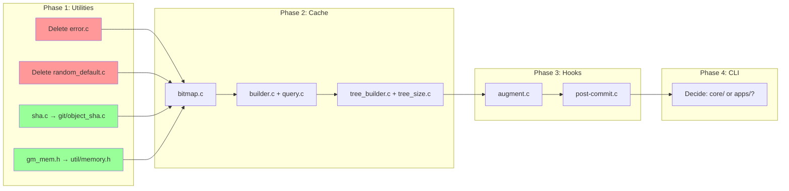

# Git-Mind Module Dependency Analysis & Migration Order

**Date**: 2025-07-10  
**Purpose**: Analyze dependencies between remaining src/ modules to determine optimal migration order

## Executive Summary

### Migration Priority Order:
1. **Immediate**: Resolve utility conflicts (delete 2 files, migrate 2 files)
2. **High Priority**: Cache system (5 files, ~1500 lines)
3. **Medium Priority**: Hooks system (2 files, ~270 lines)
4. **Low Priority/Optional**: CLI (6 files, decision needed on location)

### Key Findings:
- Two utility files should be deleted (redundant with core)
- SHA utility serves different purpose than core SHA256 (keep both)
- Cache system is self-contained and ready for migration
- CLI may be better placed in `apps/` rather than `core/`

## Overview

This document provides a comprehensive dependency analysis of the remaining modules in the `src/` directory to determine the correct migration order to `core/`.

## Module Dependency Graph

```mermaid
graph TD
    %% External dependencies
    libgit2[libgit2]
    roaring[roaringc]
    system[System Libraries]
    
    %% Already migrated to core
    core_error[core/error ✓]
    core_types[core/types ✓]
    core_crypto[core/crypto ✓]
    core_journal[core/journal ✓]
    core_edge[core/edge ✓]
    core_attribution[core/attribution ✓]
    
    %% Utility modules (to be analyzed)
    util_error[src/util/error.c]
    util_sha[src/util/sha.c]
    util_random[src/util/random_default.c]
    util_mem[src/util/gm_mem.h]
    
    %% Cache system
    cache_bitmap[src/cache/bitmap.c]
    cache_builder[src/cache/builder.c]
    cache_query[src/cache/query.c]
    cache_tree_builder[src/cache/tree_builder.c]
    cache_tree_size[src/cache/tree_size.c]
    
    %% Hooks system
    hooks_augment[src/hooks/augment.c]
    hooks_post_commit[src/hooks/post-commit.c]
    
    %% CLI
    cli_main[src/cli/main.c]
    cli_link[src/cli/link.c]
    cli_list[src/cli/list.c]
    cli_cache_rebuild[src/cli/cache_rebuild.c]
    cli_install_hooks[src/cli/install_hooks.c]
    cli_output[src/cli/output.c]
    
    %% Dependencies
    util_sha --> libgit2
    util_sha --> util_mem
    util_error --> system
    
    cache_bitmap --> roaring
    cache_builder --> libgit2
    cache_builder --> cache_bitmap
    cache_builder --> core_journal
    cache_query --> libgit2
    cache_query --> cache_bitmap
    cache_query --> core_journal
    cache_tree_builder --> libgit2
    cache_tree_size --> libgit2
    
    hooks_augment --> core_journal
    hooks_augment --> core_edge
    hooks_post_commit --> hooks_augment
    hooks_post_commit --> core_journal
    
    cli_main --> libgit2
    cli_main --> util_error
    cli_main --> cli_link
    cli_main --> cli_list
    cli_main --> cli_cache_rebuild
    cli_main --> cli_install_hooks
    
    cli_link --> core_journal
    cli_link --> util_error
    cli_link --> cli_output
    
    cli_list --> core_journal
    cli_list --> core_edge
    cli_list --> cli_output
    
    cli_cache_rebuild --> cache_builder
    cli_cache_rebuild --> cache_query
    cli_cache_rebuild --> cli_output
    cli_cache_rebuild --> util_error
    
    cli_install_hooks --> cli_output
    
    %% Edge module dependencies (already migrated)
    core_edge --> util_sha
    core_edge --> util_mem
    
    style core_error fill:#90EE90
    style core_types fill:#90EE90
    style core_crypto fill:#90EE90
    style core_journal fill:#90EE90
    style core_edge fill:#90EE90
    style core_attribution fill:#90EE90
```



## Detailed Module Analysis

### 1. **Utility Modules** (`src/util/`)

#### Files:
- `error.c` - Error string handling
- `sha.c` - SHA computation using libgit2
- `random_default.c` - Random number generation
- `gm_mem.h` - Memory operation wrappers (header-only)

#### Dependencies:
- `error.c`: No dependencies on other src/ modules
- `sha.c`: Depends on `gm_mem.h`, uses libgit2
- `random_default.c`: No dependencies on other src/ modules
- `gm_mem.h`: Header-only, no dependencies

#### Conflicts with Core:
- **`error.c`**: Conflicts with `core/src/error/error.c`
- **`sha.c`**: Potentially redundant with `core/src/crypto/sha256.c`
- **`random_default.c`**: Potentially redundant with `core/src/crypto/random.c`

### 2. **Cache System** (`src/cache/`)

#### Files:
- `bitmap.c` - Roaring bitmap operations
- `builder.c` - Cache building logic
- `query.c` - Cache query operations
- `tree_builder.c` - Git tree building
- `tree_size.c` - Tree size calculations

#### Dependencies:
- External: libgit2, roaringc
- Internal: Uses `core/journal` (already migrated)
- Inter-module: `builder.c` and `query.c` depend on `bitmap.c`

### 3. **Hooks System** (`src/hooks/`)

#### Files:
- `augment.c` - Edge augmentation logic
- `post-commit.c` - Git post-commit hook

#### Dependencies:
- Uses `core/journal` (already migrated)
- Uses `core/edge` (already migrated)
- `post-commit.c` depends on `augment.c`

### 4. **CLI** (`src/cli/`)

#### Files:
- `main.c` - Main entry point
- `link.c` - Link command
- `list.c` - List command
- `cache_rebuild.c` - Cache rebuild command
- `install_hooks.c` - Hook installation
- `output.c` - Output formatting

#### Dependencies:
- `main.c`: Entry point, depends on all other CLI modules
- `link.c`: Uses `core/journal`, `util/error.c`
- `list.c`: Uses `core/journal`, `core/edge`
- `cache_rebuild.c`: Uses cache system
- `output.c`: No dependencies on other src/ modules

## Root Nodes (No Internal Dependencies)

Based on the analysis, the following are root nodes with no dependencies on other `src/` modules:

1. **`util/gm_mem.h`** - Header-only utility
2. **`util/error.c`** - Standalone error handling (conflicts with core)
3. **`util/random_default.c`** - Standalone random generation
4. **`cli/output.c`** - Standalone output formatting

## Migration Order

### Phase 1: Resolve Utility Conflicts
1. **Analyze and resolve conflicts**:
   - Compare `src/util/error.c` vs `core/src/error/error.c`
   - Compare `src/util/sha.c` vs `core/src/crypto/sha256.c`
   - Compare `src/util/random_default.c` vs `core/src/crypto/random.c`
   - Decide: merge, replace, or keep both

2. **Migrate `util/gm_mem.h`**:
   - Move to `core/include/gitmind/util/memory.h`
   - Update all references in already-migrated modules

### Phase 2: Cache System
3. **Migrate cache bitmap**:
   - `src/cache/bitmap.c` → `core/src/cache/bitmap.c`
   - Create `core/include/gitmind/cache/bitmap.h`

4. **Migrate cache core**:
   - `src/cache/builder.c` → `core/src/cache/builder.c`
   - `src/cache/query.c` → `core/src/cache/query.c`
   - Create `core/include/gitmind/cache/cache.h`

5. **Migrate cache utilities**:
   - `src/cache/tree_builder.c` → `core/src/cache/tree_builder.c`
   - `src/cache/tree_size.c` → `core/src/cache/tree_size.c`

### Phase 3: Hooks System
6. **Migrate hooks**:
   - `src/hooks/augment.c` → `core/src/hooks/augment.c`
   - `src/hooks/post-commit.c` → `core/src/hooks/post-commit.c`
   - Move `src/hooks/augment.h` → `core/include/gitmind/hooks/augment.h`

### Phase 4: CLI (Optional - May Stay in src/)
7. **Migrate CLI output**:
   - `src/cli/output.c` → `core/src/cli/output.c` (or leave in apps/)

8. **CLI commands** (may remain in src/ or move to apps/):
   - Consider whether CLI should be in core or remain separate

## Complexity Analysis

### Low Complexity
- **`util/gm_mem.h`**: Header-only, simple macros
- **`util/error.c`**: ~45 lines, simple error strings
- **`cli/output.c`**: ~130 lines, standalone formatting

### Medium Complexity
- **`util/sha.c`**: ~60 lines, libgit2 integration
- **`hooks/augment.c`**: ~170 lines, edge operations
- **`hooks/post-commit.c`**: ~100 lines, hook logic

### High Complexity
- **Cache system**: ~1500 lines total
  - `bitmap.c`: ~200 lines, roaring bitmap ops
  - `builder.c`: ~600 lines, complex cache building
  - `query.c`: ~400 lines, query logic
  - Tree operations: ~300 lines combined

## Recommended Migration Sequence

1. **Immediate**: Resolve util conflicts (gm_mem.h can be migrated immediately)
2. **Next**: Cache system (self-contained, well-defined)
3. **Then**: Hooks system (depends on journal/edge which are done)
4. **Optional**: CLI (consider leaving in src/ or moving to apps/)

## Key Decisions Needed

1. **Utility Conflicts**: How to handle the three conflicting util files?
2. **CLI Location**: Should CLI remain in src/, move to core/, or apps/?
3. **Memory Wrappers**: Should gm_mem.h be promoted to a core utility?

## Conflict Resolution Analysis

### 1. **error.c Conflict**
- **src/util/error.c**: Simple error string lookup (~45 lines)
  - Provides: `gm_error_string()`, `gm_log_default()`
  - Uses simple array of error strings
- **core/src/error/error.c**: Advanced error handling (~200+ lines)
  - Provides: Full error type with formatting, chaining, heap/stack storage
  - Much more sophisticated error management

**Resolution**: Delete `src/util/error.c`, use core's error system

### 2. **SHA Conflict**
- **src/util/sha.c**: Uses libgit2 for SHA1 computation (~60 lines)
  - Provides: `gm_sha_from_path()` - computes SHA1 from git index
  - Purpose: Get git object SHA for files
- **core/src/crypto/sha256.c**: Uses libsodium for SHA256 (~150 lines)
  - Provides: SHA256 hashing with crypto backend
  - Purpose: General cryptographic hashing

**Resolution**: These serve different purposes! 
- Rename `src/util/sha.c` → `core/src/git/object_sha.c`
- Keep both, as one is for git objects (SHA1) and one is for crypto (SHA256)

### 3. **Random Conflict**
- **src/util/random_default.c**: Basic stdlib random (~30 lines)
  - Provides: Simple random operations wrapper
- **core/src/crypto/random.c**: Crypto-secure random with backend (~100 lines)
  - Provides: Cryptographically secure random via backend

**Resolution**: Delete `src/util/random_default.c`, use core's crypto random

## Updated Migration Order

### Phase 1: Utility Resolution (Immediate)
1. **Delete conflicting files**:
   - Remove `src/util/error.c` (use core/error)
   - Remove `src/util/random_default.c` (use core/crypto/random)

2. **Migrate gm_sha_from_path**:
   - Move `src/util/sha.c` → `core/src/git/object_sha.c`
   - Create `core/include/gitmind/git/object_sha.h`
   - Update references in edge module

3. **Migrate memory utilities**:
   - Move `src/util/gm_mem.h` → `core/include/gitmind/util/memory.h`
   - Update edge module references

### Phase 2: Cache System (Next)
4. **Migrate in dependency order**:
   - First: `bitmap.c` (no internal deps)
   - Then: `builder.c` and `query.c` (depend on bitmap)
   - Last: `tree_builder.c` and `tree_size.c`

### Phase 3: Hooks System
5. **Migrate hooks**:
   - `augment.c` first (used by post-commit)
   - `post-commit.c` second

### Phase 4: CLI (Decision Needed)
6. **Consider CLI location** - options:
   - Keep in `src/cli/` as application code
   - Move to `apps/cli/` with other applications
   - Create `core/src/cli/` for reusable CLI utilities only

## Next Steps

1. Execute Phase 1 utility resolution immediately
2. Create migration plan for cache system (largest remaining module)
3. Update build system for each migration
4. Ensure zero warnings in GNU CRY GAUNTLET for each migration

## Simplified Migration Flow



## Migration Commands Reference

```bash
# Phase 1 - Utilities
git rm src/util/error.c
git rm src/util/random_default.c
./scripts/migrate-module.sh util/sha git/object_sha
./scripts/migrate-module.sh util/gm_mem util/memory header-only

# Phase 2 - Cache
./scripts/migrate-module.sh cache/bitmap cache/bitmap
./scripts/migrate-module.sh cache/builder cache/builder
# ... etc

# Phase 3 - Hooks
./scripts/migrate-module.sh hooks/augment hooks/augment
./scripts/migrate-module.sh hooks/post-commit hooks/post-commit
```