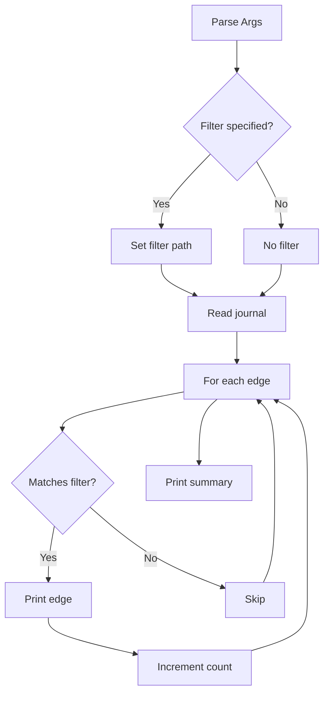

# List Command

## Purpose

Query and display edges from the git-mind journal, with optional filtering.

## Design Rationale

### Command Syntax

```bash
git-mind list [<path>] [--branch <branch>] [--all]
```

Options:

- __No args__: List all edges on current branch
- __Path filter__: Show edges involving specific file
- __Branch__: Query different branch
- __--all__: Include all branches (future)

### Callback Architecture

```c
int list_edge_callback(const gm_edge_t *edge, void *userdata)
```

Why callbacks?

1. __Streaming__: Handle millions of edges without OOM
2. __Filtering__: Skip non-matching edges early
3. __Flexible__: Caller controls presentation
4. __Composable__: Can chain filters/transformations

## Display Format

### Default Output

```
IMPLEMENTS: core/src/main.c -> include/api.h
REFERENCES: README.md -> docs/design.md
DEPENDS_ON: Makefile -> core/src/main.c

Total: 3 links
```

Design choices:

- Relationship type first (most important)
- Human-readable paths (not SHAs)
- Summary count at end
- Clean, parseable output

### Empty Results

```bash
$ git-mind list missing.md
No links found for: missing.md

$ git-mind list --branch empty-branch
No links found
```

Clear messaging for empty states.

## Implementation Flow



## Filtering Logic

### Path Filter

```c
if (strcmp(edge->src_path, filter) != 0 &&
    strcmp(edge->tgt_path, filter) != 0) {
    return 0;  // Skip
}
```

Shows edges where file is:

- Source of the edge
- Target of the edge
- Either direction included

### Future: Advanced Filters

```bash
# Type filter
git-mind list --type implements

# Time range
git-mind list --since 2024-01-01

# Pattern matching
git-mind list "core/src/*.c"

# Combining filters
git-mind list --type references docs/ --since yesterday
```

## Performance Optimization

### Early Exit

```c
if (callback_result != 0) {
    return callback_result;  // Stop iteration
}
```

Allows:

- Limit results (`--limit 10`)
- Stop after match (`--first`)
- Timeout handling

### Journal Scan Cost

```
1K edges: ~5ms
10K edges: ~50ms
100K edges: ~500ms
1M edges: ~5s
```

Linear scan acceptable up to ~100K edges.
Beyond that, need cache layer.

### Memory Usage

```
Stack: ~1KB (edge struct + locals)
Heap: 0 (no allocations)
```

Constant memory regardless of edge count.

## Edge Cases

### No Journal

```bash
$ git init new-repo
$ cd new-repo
$ git-mind list
No links found
```

- Fresh repo has no edges
- Handle gracefully
- Don't show errors

### Renamed Files

```
Original: README.md -> docs/api.md
After rename: README-old.md -> docs/api.md
```

- List shows current paths
- Historical SHAs still valid
- Path is for human context

### Concurrent Modifications

```
Process 1: git-mind list (reading)
Process 2: git-mind link A B (writing)
Result: New edge may or may not appear
```

- Read commits at snapshot
- No live updates
- Consistent view

### Unicode Display

```bash
$ git-mind list
IMPLEMENTS: 你好.c -> 世界.h
REFERENCES: café.md -> naïve.md
```

- UTF-8 passed through
- Terminal handles display
- No transliteration

## Output Formats

### Current: Human-readable

```
IMPLEMENTS: core/src/main.c -> include/api.h
```

### Future: Machine-readable

```bash
$ git-mind list --format=json
{"type":"implements","src":"core/src/main.c","tgt":"include/api.h",...}

$ git-mind list --format=csv
implements,core/src/main.c,include/api.h,1.0,1720000000000

$ git-mind list --format=dot
digraph G {
  "core/src/main.c" -> "include/api.h" [label="implements"];
}
```

### Future: Grouped Display

```bash
$ git-mind list --group-by=type
IMPLEMENTS (5):
  core/src/main.c -> include/api.h
  core/src/parser.c -> include/parser.h
  ...

REFERENCES (12):
  README.md -> docs/install.md
  README.md -> LICENSE
  ...
```

## Error Handling

### Journal Read Errors

```c
result = gm_journal_read(ctx, branch, callback, &lctx);
if (result == GM_NOT_FOUND) {
    printf("No links found\n");
    return GM_OK;  // Not an error
}
```

Distinguish:

- Empty journal (normal)
- Read failure (error)
- No matches (normal)

### Invalid Branch

```bash
$ git-mind list --branch nonexistent
No links found
```

- Treated as empty branch
- No scary errors
- User-friendly

## Testing Strategy

### Unit Tests

1. Empty journal
2. Single edge
3. Filter matching source
4. Filter matching target
5. Filter matching neither
6. Multiple edges

### Integration Tests

```bash
# Create test data
git-mind link A B
git-mind link B C
git-mind link C A

# Test queries
test $(git-mind list | wc -l) -eq 4  # 3 + summary
test $(git-mind list A | wc -l) -eq 3  # 2 + summary
test $(git-mind list D | wc -l) -eq 1  # 0 + message
```

### Performance Tests

```bash
# Generate 10K edges
./generate-edges.sh 10000 | git-mind link --batch

# Time query
time git-mind list > /dev/null
# Should be < 100ms
```

## Future Features

### Graph Traversal

```bash
# Find all dependencies of main.c
git-mind list main.c --traverse=depends_on

# Find implementation chain
git-mind list design.md --traverse=implements --reverse
```

### Statistics

```bash
$ git-mind list --stats
Total edges: 1,337
By type:
  implements: 420 (31%)
  references: 500 (37%)
  depends_on: 400 (30%)
  augments: 17 (1%)
Most connected:
  README.md (50 edges)
  core/src/main.c (45 edges)
```

### Watch Mode

```bash
$ git-mind list --watch
IMPLEMENTS: core/src/main.c -> include/api.h
[watching for changes...]
NEW: REFERENCES: README.md -> CHANGELOG.md
```

## Why This Design Wins

1. __Streaming__: Handles arbitrary scale
2. __Flexible__: Filters compose naturally
3. __Fast__: Minimal overhead per edge
4. __Scriptable__: Clean, parseable output
5. __Extensible__: Format/filter options ready

As Linus would appreciate: "Do one thing well. Listing is not analyzing."
