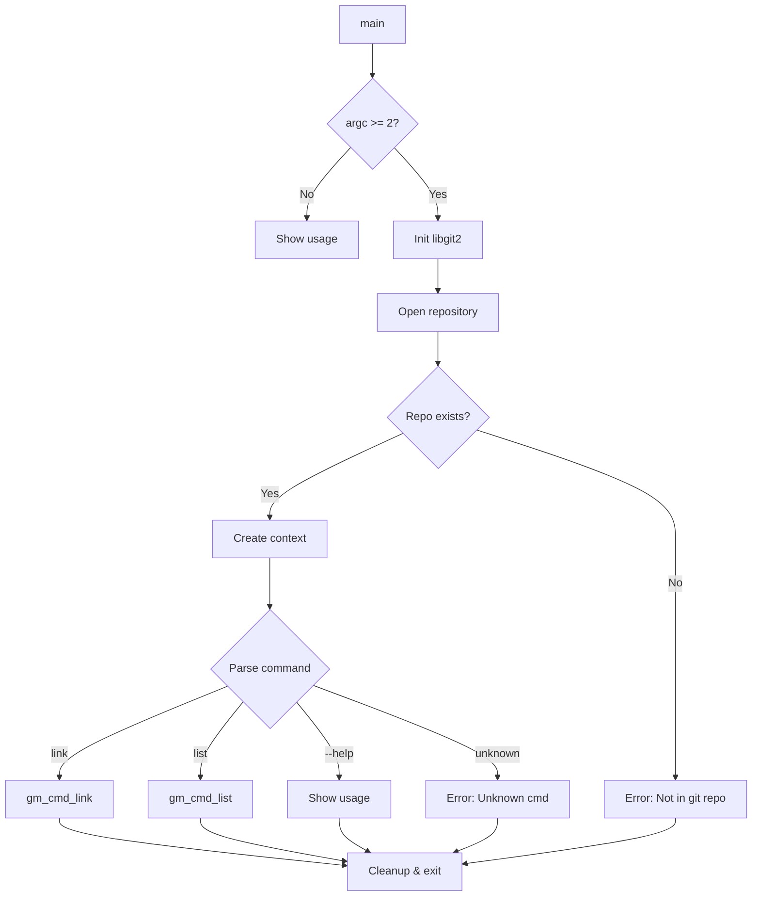

# Main CLI Entry Point

## Purpose

Parse commands, initialize Git context, dispatch to subcommands, and handle errors gracefully.

## Design Rationale

### Simple Command Structure

```bash
git-mind <command> [args...]
```

Not using getopt or argparse because:

1. __Minimal dependencies__: C23
2. __Clear flow__: Easy to trace execution
3. __Subcommand pattern__: Like Git itself
4. __Future-proof__: Can add complex parsing later

### Context Initialization

```c
typedef struct {
    void *git_repo;
    void (*log_fn)(int level, const char *fmt, ...);
    // ... extensible
} gm_context_t;
```

Dependency injection from the start:

- Testable (mock Git operations)
- Flexible (different storage backends)
- Clean (no globals)

## Program Flow



## Error Handling Philosophy

### User-Friendly Messages

```c
if (error < 0) {
    fprintf(stderr, "Error: Not in a git repository\n");
    if (e) {
        fprintf(stderr, "Git error: %s\n", e->message);
    }
}
```

Two-level errors:

1. Simple message for users
2. Technical details if available

### Exit Codes

```c
return (result == GM_OK) ? 0 : 1;
```

Simple binary:

- 0 = Success
- 1 = Any error

Future: Specific codes for different failures.

## Context Management

### Initialization

```c
git_libgit2_init();  // Global init
git_repository_open(&repo, ".");  // Find .git
gm_libgit2_repository_port_create(&ctx.git_repo_port, NULL,
                                   &ctx.git_repo_port_dispose, repo);
ctx.log_fn = gm_log_default;
```

Clean sequence:

1. Initialize libgit2 once
2. Open repository in current dir
3. Move the raw handle into the CLI runtime for cleanup
4. Build injectable ports and pass the pure context everywhere

### Cleanup

```c
ctx.git_repo_port_dispose(&ctx.git_repo_port);
git_libgit2_shutdown();
```

RAII-style cleanup:

- Always invoke the port disposer
- Shutdown libgit2 last
- No resource leaks

## Command Dispatch

### Current Design

```c
if (strcmp(cmd, "link") == 0) {
    result = gm_cmd_link(&ctx, argc - 2, argv + 2);
} else if (strcmp(cmd, "list") == 0) {
    result = gm_cmd_list(&ctx, argc - 2, argv + 2);
}
```

Simple string comparison:

- No hash table needed (few commands)
- Clear control flow
- Easy to add commands

### Future: Command Table

```c
typedef struct {
    const char *name;
    int (*func)(gm_context_t*, int, char**);
    const char *help;
} command_t;

static command_t commands[] = {
    {"link", gm_cmd_link, "Create a link"},
    {"list", gm_cmd_list, "List links"},
    {NULL, NULL, NULL}
};
```

When we have 10+ commands.

## Usage Display

### Current Format

```
Usage: git-mind <command> [args...]

Commands:
  link <source> <target> [--type <type>]  Create a link between files
  list [<path>] [--branch <branch>]       List links

Relationship types:
  implements    Source implements target
  references    Source references target
  depends_on    Source depends on target
  augments      Source augments/updates target
```

Design principles:

- Examples in command list
- Common options documented
- Relationship types explained
- Compact but complete

### Future: Man Page Generation

```c
if (strcmp(argv[1], "--generate-man") == 0) {
    generate_man_page();
    return 0;
}
```

Auto-generate from help text.

## Platform Considerations

### Repository Discovery

```c
git_repository_open(&repo, ".");
```

libgit2 handles:

- Walking up to find .git
- Worktree detection
- Submodule boundaries
- Case-insensitive filesystems

### Path Separators

- libgit2 normalizes to forward slashes
- We inherit this behavior
- No platform-specific code needed

## Security Hardening

### No Command Injection

```c
// We never do this:
system(user_input);  // ❌

// Direct function calls only:
gm_cmd_link(&ctx, argc, argv);  // ✅
```

### Argument Validation

- Commands validate their own args
- Main only routes to commands
- No preprocessing of user input

### Signal Handling

Currently: None (default behavior)

Future considerations:

```c
signal(SIGINT, cleanup_handler);
signal(SIGTERM, cleanup_handler);
```

For long-running operations.

## Testing Approach

### Unit Testing Challenges

Main is hard to unit test. Instead:

- Keep main thin
- Test command functions directly
- Integration tests for full flow

### Integration Tests

```bash
#!/bin/bash
# Test not in git repo
cd /tmp
git-mind list 2>&1 | grep -q "Not in a git repository"

# Test help
git-mind --help | grep -q "Usage:"

# Test unknown command
git-mind bogus 2>&1 | grep -q "Unknown command"
```

### Memory Testing

```bash
valgrind --leak-check=full git-mind list
# Should show: All heap blocks were freed
```

## Performance Notes

### Startup Cost

```
git_libgit2_init(): ~1ms
git_repository_open(): ~5ms
Command dispatch: ~1μs
Total overhead: ~6ms
```

Acceptable for CLI tool.

### Memory Usage

```
libgit2 init: ~2MB
Repository open: ~500KB
Our code: ~10KB
Total: ~2.5MB
```

Reasonable for modern systems.

## Future Enhancements

### Plugin Architecture

```c
if (is_plugin_command(cmd)) {
    exec_plugin(cmd, args);
}
```

Allow git-mind-* executables.

### Configuration

```c
git_config_get_string(&value, config, "gitmind.editor");
```

Read from .git/config.

### Daemon Mode

```bash
git-mind daemon --port 8080
```

For web UI or API server.

### Shell Completion

```bash
# Bash completion
_git_mind() {
    COMPREPLY=($(compgen -W "link list help" -- ${COMP_WORDS[COMP_CWORD]}))
}
complete -F _git_mind git-mind
```

## Why This Design Wins

1. __Simple__: Main does minimal work
2. __Extensible__: Easy to add commands
3. __Testable__: Dependency injection
4. __Robust__: Proper cleanup always
5. __Fast__: Minimal startup overhead

As Linus would say: "The main() function should be so simple that it's obviously correct."
