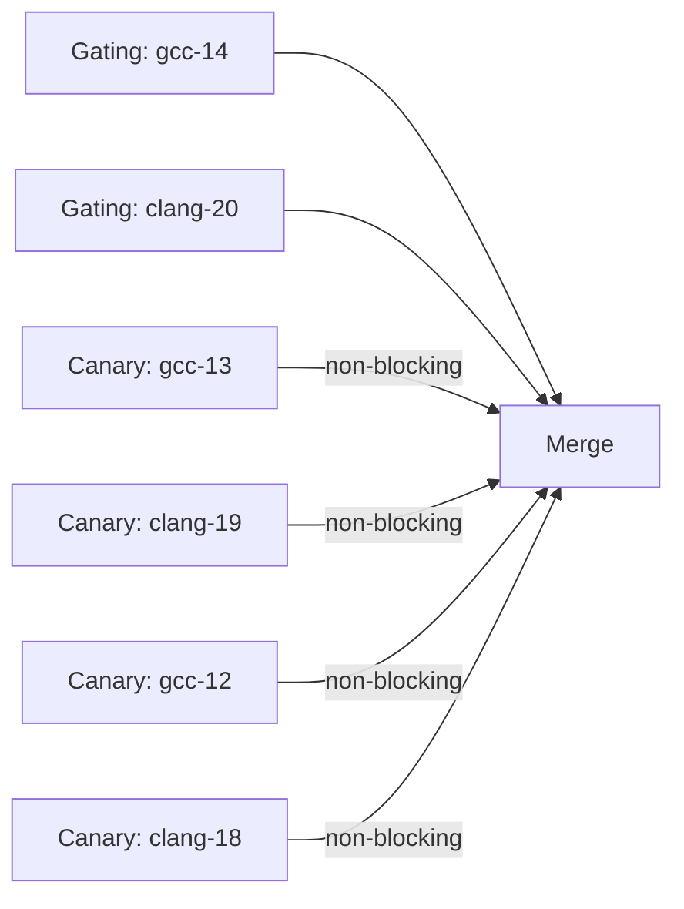

# CI/CD Strategy

## Overview

This repository enforces high correctness and portability while centering on modern C23 (expressed in Meson as `c_std=c2x` for broad compiler support). CI is split into:

- Gating jobs that must pass for merges
- Canary jobs that provide early portability signals but do not block
- Static analysis (clang-tidy) with a strict baseline
- Deterministic Docker builds to ensure local=CI parity

## Compiler Matrix

### Gating (C23 focus)

- `gcc-14` — first broadly usable GCC with C23 support
- `clang-20` — latest LLVM with strong C23 + clang-tidy 20

Rationale: These represent the C23 target surface we care about. They block the PR when they fail.

### Canaries (non‑blocking)

- `gcc-12`, `gcc-13` — older GCCs common on LTS distros
- `clang-18`, `clang-19` — earlier LLVMs

Rationale: Useful signals for downstream consumers. They run with `continue-on-error: true` so they never block merges.

## Static Analysis

- `clang-tidy` 20 with `quality/.clang-tidy`; warnings-as-errors.
- Baseline file `tools/baseline_count.txt` enforces no regressions.
- CI builds a deterministic LLVM 20 environment in Docker.
- CRoaring is installed from apt when available, or built from source in CI to stabilize aarch64 and older runners.

## Builds & Tests

- Meson + Ninja builds and runs unit tests.
- Cache artifacts are not pushed; they are derived and may be uploaded only for debugging.

## Docker Hygiene

- Images are namespaced and labeled for safe cleanup: `gitmind/ci:clang-20`, `gitmind/gauntlet:<compiler>`; label `com.gitmind.project=git-mind`. The CI image is built from the checked-in `.ci/Dockerfile` when missing (no registry dependency).
- Local helper: `make docker-clean` removes only project images/containers and builder cache.

## Time & Cost

- Gating jobs run in parallel and should complete under a few minutes.
- Canaries may be slower; they are non‑blocking and primarily diagnostic.

## Future Enhancements

- Add cohesion-report to CI to summarize semantic (advice) changes across merges.
- Nightly long‑matrix (more compilers/OSes) as a separate scheduled workflow.
- Cache Docker layers to reduce cold start times.
