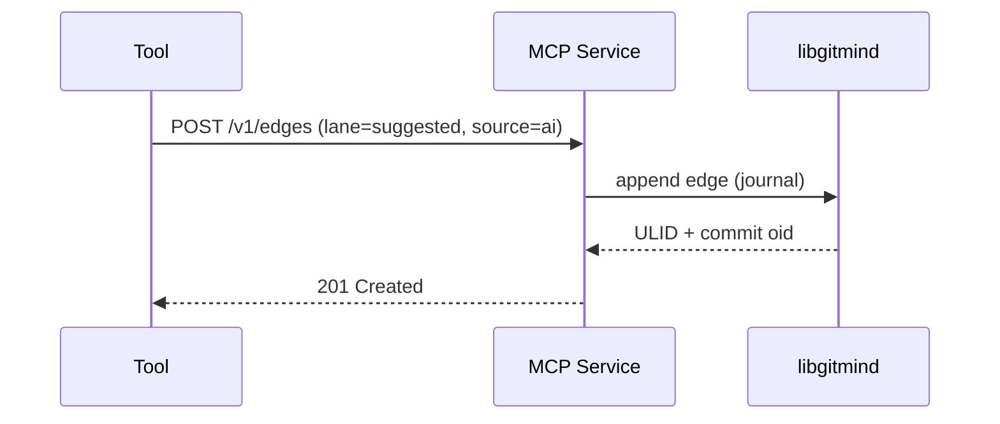
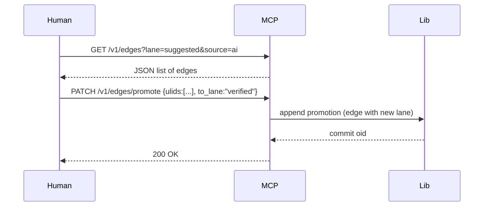

# PRD: Co‑Thought MCP Service (Local Tools Integration)

Table of Contents

- Summary
- Goals
- Non‑Goals
- Scope and Assumptions
- Interface Design
- Data Model
- Flows
- Security and Privacy
- Performance Targets
- Acceptance Criteria
- Rollout Plan

## Summary

Define a small, local‑only service that tools/agents can use to read/write git‑mind edges and query the journal/cache via a stable interface. This enables human + AI co‑thought: AI suggests edges into a `suggested` lane; humans review and promote to `verified`.

## Goals

- Provide a stable, local interface for edge CRUD and queries (no network dependence).
- Respect branch/time semantics: all operations target an explicit repo + ref.
- Enforce lane/attribution conventions for co‑thought workflows.
- Remain an optional module that does not gate core releases.

## Non‑Goals

- Remote/cloud service, authentication with external identity providers.
- Cross‑repo federation or long‑lived daemon management.
- Plugin runtime inside the service; keep core policies minimal.

## Scope and Assumptions

- Local‑only transport (Unix domain socket on POSIX; Named Pipe on Windows). Optional loopback HTTP for dev mode.
- Runs in the same workspace as the Git repo; reads/writes via libgitmind.
- No external network calls; all data remains local.
- Attribution is provided by the caller or derived from `git config`.

## Interface Design

Transport

- Default: Unix domain socket at `.gitmind/mcp.sock` (repo‑relative) or `\\.\pipe\gitmind-mcp` on Windows.
- Dev mode: `localhost:8765` (opt‑in), for easy testing.

Resource: Edge

- POST `/v1/edges`
  - Creates an edge (journal append) with names‑as‑truth fields.
  - Body (JSON):

    ```json
    {
      "repo": "/path/to/repo",
      "ref": "refs/gitmind/edges/main",
      "src_path": "docs/auth-flow.md",
      "tgt_path": "src/auth.c",
      "type_name": "implements",
      "lane_name": "suggested",
      "attribution": {"source": "ai", "author": "tool@local", "session": "abc"},
      "confidence": 0.85
    }
    ```

  - Response: `{ "ulid": "01H...", "commit": "<oid>" }`

- GET `/v1/edges`
  - Query journal/cache with filters.
  - Query params: `repo`, `ref`, `from`, `to`, `type`, `lane`, `source`, `format=json|ndjson`, pagination (`limit`, `cursor`).

- PATCH `/v1/edges/promote`
  - Promote edges between lanes (e.g., `suggested` → `verified`).
  - Body: `{ "repo": "...", "ref": "...", "ulids": ["..."], "to_lane": "verified" }`

- DELETE `/v1/edges`
  - Tombstone/remove by ULID (append a negative confidence or dedicated tombstone record per policy).

Health

- GET `/v1/health` → `{ "status": "ok", "repo": "...", "head": "...", "gitmind_version": "x.y.z", "libgitmind": "a.b.c" }`

Errors

- JSON problem details: `{ "error": "invalid_argument", "message": "...", "field": "..." }`

## Data Model

- Edge record aligns with libgitmind’s attributed edge (names‑as‑truth + attribution + lane + paths + SHAs + ULID + timestamp + confidence).
- Derived IDs (`type_id`, `lane_id`) are never persisted across repos; computed on the fly for cache access.

## Flows

Suggest Edge (AI)



Review and Promote (Human)



## Security and Privacy

- Local‑only by default (UDS/Named Pipe); loopback HTTP is for dev/testing only.
- No remote endpoints; no data leaves the machine unless the user explicitly exports.
- Rate limiting and simple allowlist of repos to avoid accidental cross‑workspace access.

## Performance Targets

- Edge append: < 5ms per request (excluding disk flush) in typical local repos.
- Query: median < 10ms for common filters with cache on 100k edges; graceful fallback to journal scan if cache absent.

## Acceptance Criteria

- Service starts/stops locally and serves `/v1/health`.
- Can append edges with names‑as‑truth, attribution, and lanes to the journal.
- Can query edges with filters for `--source` and `--lane` parity with CLI.
- Can promote edges between lanes with ULIDs.
- No network dependencies; local‑only transport by default.
- Tests cover happy paths and error handling; docs include examples.

## Rollout Plan

1) Stub service with UDS/Named Pipe transport and `/v1/health`.
2) Implement POST `/v1/edges` (append), GET `/v1/edges` (query minimal).
3) Add promotion and tombstone endpoints; harden filters.
4) Document lane conventions and attribution filters; add CLI helpers.
5) Optional: loopback HTTP for dev; add NDJSON streaming for large queries.
