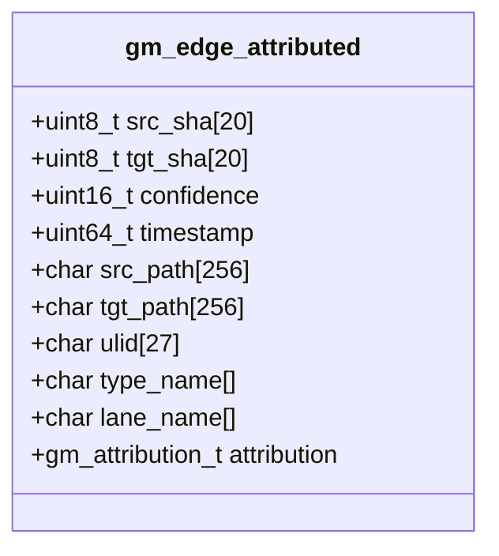

# PRD: First‑Class, Time‑Travel‑Safe Semantics for git‑mind

## Summary
This PRD proposes making user‑defined relationship semantics (type, lane) first‑class in git‑mind while preserving branch/time‑travel correctness and conflict‑free merging. Edges store names (strings) as ground truth; stable numeric IDs are derived from names at runtime for cache/index performance. Optional “Semantics Advice” records (committed like edges) allow richer behavior (e.g., symmetry, transitivity) without hard‑coding policies in core. Plugins can propose/normalize semantics via safe hooks.

## Goals
- First‑class semantics: accept any `type_name` and `lane_name`; no “custom” bucket.
- Time‑travel safe: semantics and behavior follow the commit/branch you view.
- Conflict‑free: merges converge without textual conflicts (append‑only data; CRDT‑like).
- Fast queries: bitmap caches keyed by stable IDs derived from names.
- Extensible: optional advice and plugins; core remains minimal and deterministic.

## Non‑Goals
- Global registries or centralized config not tied to Git history.
- Forcing a canonical vocabulary across repos.
- Shipping a full plugin runtime in this milestone (define hooks and data).

## Background (Current Architecture)
- Journal (truth): CBOR‑encoded edges under `refs/gitmind/edges/<branch>`; push/pull with code; time‑travel friendly.
- Cache (speed): Roaring bitmaps under `refs/gitmind/cache/<branch>`; rebuildable; never merged.
- Evolution: AUGMENTS edges maintain relationships across blob changes.

## Proposed Design

### Data Model (edge)
- Persist on every edge:
  - `type_name: string`, `lane_name: string` (UTF‑8; normalized)
  - Existing fields unchanged: `src_sha`, `tgt_sha`, `timestamp`, `ulid`, `confidence`, `src_path`, `tgt_path`, `attribution {source_type, author, session}`
- Derived (not persisted globally):
  - `type_id = hash64("gm_type:" + type_name)`
  - `lane_id = hash64("gm_lane:" + lane_name)`
  - Hash is a deterministic, specified algorithm (e.g., FNV‑1a‑64 over NFC‑normalized UTF‑8)



### Semantics Advice (optional, committed)
- Small records committed alongside edges (append‑only), scoped to branch/time:
  - Example fields (all optional):
    - `type_name: string`, `aliases: [string]`, `symmetric: bool`, `transitive: bool`, `implies: [string]`, `color: string`, `icon: string`
    - `lane_name: string`, `protected: bool`, `visibility: string`, `color: string`
- Conflict‑free merge via OR‑Set/LWW properties: newest (ts, actor, ulid) wins per field; sets are unioned.

```mermaid
erDiagram
  EDGE ||--o{ ADVICE : influences
  EDGE {
    string type_name
    string lane_name
    bytes20 src_sha
    bytes20 tgt_sha
  }
  ADVICE {
    string subject_name
    string kind  // "type"|"lane"
    json   props // e.g., symmetric, transitive, color, implies[]
  }
```

### Deterministic IDs for Cache
- IDs are derived at runtime from names; used as bitmap keys:
  - `type_id = fnv1a64("gm_type:" + nfc(type_name))`
  - `lane_id = fnv1a64("gm_lane:" + nfc(lane_name))`
- Names are always kept with edges; IDs are never the source of truth.

### Plugins / Hooks (phaseable)
- `edge.pre_append`: normalize/validate names; map aliases.
- `edge.post_append`: derive edges (e.g., tests ⇒ references) by emitting additional journal entries.
- `cache.plan`: suggest index combinations (by derived IDs).
- `query.rewrite`: expand filters per advice (e.g., type groupings).
- `import/export`: Neo4j/CSV mappers using names as canonical.

## Flows

### Edge Append (write path)
```mermaid
sequenceDiagram
  participant CLI as git mind link
  participant Core as libgitmind
  participant Plug as Plugins (optional)
  participant J as Journal (refs/gitmind/edges)

  CLI->>Core: link A -> B (type=implements, lane=verified)
  Core->>Core: resolve blob SHAs; nfc(type/lane)
  Core->>Core: type_id=hash(type), lane_id=hash(lane)
  Core->>Plug: edge.pre_append(edge) [opt]
  Plug-->>Core: normalized edge (aliases, checks)
  Core->>J: append CBOR commit with edge (names + fields)
  Core->>Plug: edge.post_append(edge) [opt]
  Plug-->>J: optional derived edges/advice commits
```

### Query via Cache
```mermaid
flowchart LR
  A[Filter: type=implements, lane=verified] --> B[Compute IDs]
  B --> C[Bitmap lookup: fanout/fanin by type_id/lane_id]
  C --> D[Materialize edge records]
  D --> E[Apply advice (symmetric/transitive) if present]
  E --> F[Return results]
```

### Branch/Timeline Safety
```mermaid
gitGraph
  commit id: "init"
  branch main
  commit id: "E1: A->B implements" tag: "edge"
  commit id: "S1: type=implements symmetric=false" tag: "advice"
  branch feature
  checkout feature
  commit id: "E2: C->D tests" tag: "edge"
  commit id: "S2: tests implies references" tag: "advice"
  checkout main
  merge feature
  commit id: "merge" tag: "union(edges, advice)"
```

## API Surfaces (C, minimal)
- New helpers (header‑only or core):
  - `uint64_t gm_sem_type_id(const char* type_name_utf8)`
  - `uint64_t gm_sem_lane_id(const char* lane_name_utf8)`
  - NFC normalization utility.
- Edge CBOR: include `type_name`, `lane_name` as strings. Keep legacy `rel_type` field for now (optional mapping layer).
- Advice parser (optional this milestone): validate and expose typed views.

## CBOR Notes (edge)
- Append two string entries (nfc normalized):
  - `type_name: tstr`, `lane_name: tstr`
- Backward compatibility: decoder tolerates missing (treat as empty/"primary").

## Performance & Memory
- Name→ID hash cost: O(len(name)), negligible relative to I/O.
- Bitmap keys: 64‑bit IDs; no global tables; perfect for roaring bitmaps.
- Advice retrieval: optional; map by name/ID with in‑memory cache keyed per commit.

## Security
- Plugins out‑of‑process or WASM sandbox in future; no network/filesystem by default.
- Advice is data; core treats it as hints. Validation prevents pathological expansions.

## Migration & Compatibility
- Edges written without names remain valid; readers infer defaults and warn.
- Zero changes to refs layout.
- Importers/exporters operate on names; deterministic ID functions ensure cache stability.

## Risks & Mitigations
- Risk: Divergent semantics across branches complicate queries.
  - Mitigation: Explicit branch scoping and advice commits; UI indicates branch semantics.
- Risk: Plugin abuse / perf.
  - Mitigation: Optional plugins; timeouts; safe mode.

## Acceptance Criteria
- Edges persist and read `type_name`/`lane_name` strings.
- Cache uses derived type/lane IDs; query by name matches IDs.
- Merge two branches with different edges/advice yields union without textual conflicts.
- Time‑travel: querying older commits reflects semantics at that point in history.

## Open Questions
- Advice CRDT flavor: LWW per property vs OR‑Set of facts — pick one for v1.
- Reserved lanes? e.g., `meta` lane for advice vs separate advice ref.
- Hash algorithm: FNV‑1a‑64 vs a SipHash variant (doc the exact function).

## Rollout Plan
1) Implement deterministic ID helpers + NFC normalization.
2) Extend edge CBOR with `type_name`/`lane_name` (readers tolerant).
3) Update cache builder to accept name filters → IDs.
4) Optional: advice reader and minimal application (e.g., symmetric handling).
5) CLI surface: allow any names; drop special “custom” handling.
6) Document plugin hooks; stub no‑op runner for tests.

