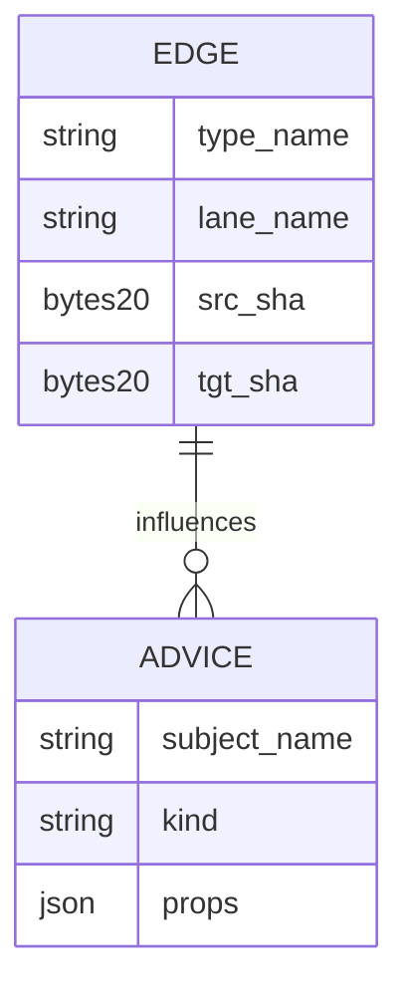
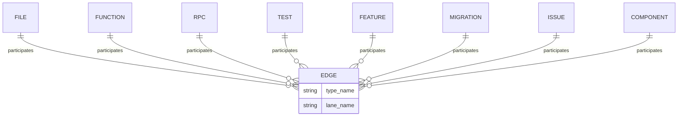
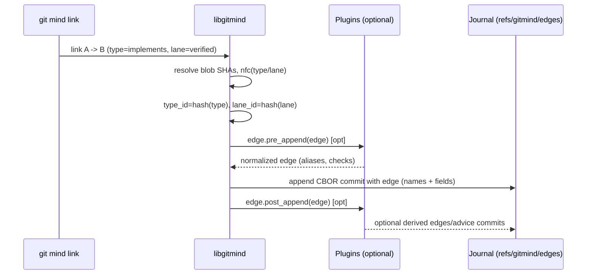
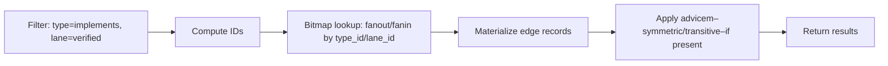
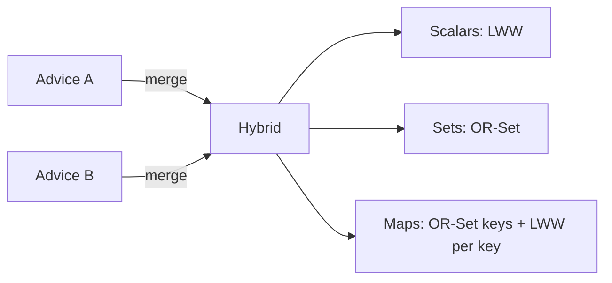
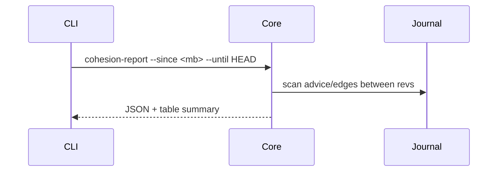

# PRD: First‑Class, Time‑Travel‑Safe Semantics for git‑mind

Table of Contents

- [Summary](#summary)
- [Goals](#goals)
- [Non‑Goals](#non-goals)
- [Background (Current Architecture)](#background-current-architecture)
- [Proposed Design](#proposed-design)
- [Flows](#flows)
- [API Surfaces (C, minimal)](#api-surfaces-c-minimal)
- [CBOR Notes (edge)](#cbor-notes-edge)
- [Performance & Memory](#performance--memory)
- [Security](#security)
- [Migration & Compatibility](#migration--compatibility)
- [Risks & Mitigations](#risks--mitigations)
- [Acceptance Criteria](#acceptance-criteria)
- [Open Questions](#open-questions)
- [Rollout Plan](#rollout-plan)

## Summary

This PRD proposes making user‑defined relationship semantics (type, lane) first‑class in git‑mind while preserving branch/time‑travel correctness and conflict‑free merging. Edges store names (strings) as ground truth; stable numeric IDs are derived from names at runtime for cache/index performance. Optional “Semantics Advice” records (committed like edges) allow richer behavior (e.g., symmetry, transitivity) without hard‑coding policies in core. Plugins can propose/normalize semantics via safe hooks.

## Goals

- First‑class semantics: accept any `type_name` and `lane_name`; no “custom” bucket.
- Time‑travel safe: semantics and behavior follow the commit/branch you view.
- Conflict‑free: merges converge without textual conflicts (append‑only data; CRDT‑like).
- Fast queries: bitmap caches keyed by stable IDs derived from names.
- Extensible: optional advice and plugins; core remains minimal and deterministic.

## Non‑Goals

- Global registries or centralized config not tied to Git history.
- Forcing a canonical vocabulary across repos.
- Shipping a full plugin runtime in this milestone (define hooks and data).

## Background (Current Architecture)

- Journal (truth): CBOR‑encoded edges under `refs/gitmind/edges/<branch>`; push/pull with code; time‑travel friendly.
- Cache (speed): Roaring bitmaps under `refs/gitmind/cache/<branch>`; rebuildable; never merged.
- Evolution: AUGMENTS edges maintain relationships across blob changes.

## Proposed Design

### Data Model (edge)

- Persist on every edge:
  - `type_name: string`, `lane_name: string` (UTF‑8; normalized)
  - Existing fields unchanged: `src_sha`, `tgt_sha`, `timestamp`, `ulid`, `confidence`, `src_path`, `tgt_path`, `attribution {source_type, author, session}`
- Derived (not persisted globally):
  - `type_id = hash64("gm_type:" + type_name)`
  - `lane_id = hash64("gm_lane:" + lane_name)`
  - Hash is a deterministic, specified algorithm (e.g., FNV‑1a‑64 over NFC‑normalized UTF‑8)


### Semantics Advice (optional, committed)

- Small records committed alongside edges (append‑only), scoped to branch/time:
  - Example fields (all optional):
    - `type_name: string`, `aliases: [string]`, `symmetric: bool`, `transitive: bool`, `implies: [string]`, `color: string`, `icon: string`
    - `lane_name: string`, `protected: bool`, `visibility: string`, `color: string`
- Conflict‑free merge via OR‑Set/LWW properties: newest (ts, actor, ulid) wins per field; sets are unioned.



### Entity Vocabulary (Nodes) and Relationship Types (Examples)

- Nodes are repo artifacts and concepts; edges link them semantically. The core stays file/blob-centric for identity but higher-level entities are resolvable overlays.
- Canonical examples (non-exhaustive, all stored as names):
  - Nodes: `File`, `Function`, `RPC`, `Test`, `Feature`, `Migration`, `Issue`, `Component`, `Doc`.
  - Edge types (i.e., `type_name`): `DEFINES`, `CALLS`, `IMPLEMENTS`, `TESTS`, `DOCUMENTS`, `DEPENDS_ON`, `AUGMENTS`.



Resolution note: In the C core, identity is via `src_sha`/`tgt_sha` (blob nodes). Higher-level entities are resolved by tooling (e.g., symbol index, SQL parser) and written as edges between the blobs that define them; names capture semantics.

### Deterministic IDs for Cache

- IDs are derived at runtime from names; used as bitmap keys:
  - `type_id = fnv1a64("gm_type:" + nfc(type_name))`
  - `lane_id = fnv1a64("gm_lane:" + nfc(lane_name))`
- Names are always kept with edges; IDs are never the source of truth.

### Plugins / Hooks (phaseable)

- `edge.pre_append`: normalize/validate names; map aliases.
- `edge.post_append`: derive edges (e.g., tests ⇒ references) by emitting additional journal entries.
- `cache.plan`: suggest index combinations (by derived IDs).
- `query.rewrite`: expand filters per advice (e.g., type groupings).
- `import/export`: CSV/JSON mappers using names as canonical.

## Flows

### Edge Append (write path)



### Query via Cache



### Branch/Timeline Safety

```mermaid
gitGraph
  commit id: "init"
  branch main
  commit id: "E1: A->B implements" tag: "edge"
  commit id: "S1: type=implements symmetric=false" tag: "advice"
  branch feature
  checkout feature
  commit id: "E2: C->D tests" tag: "edge"
  commit id: "S2: tests implies references" tag: "advice"
  checkout main
  merge feature
  commit id: "merge" tag: "union(edges, advice)"
```

### Merge Semantics for Advice (CRDT choices)

We must deterministically merge advice from multiple branches. Recommended hybrid strategy:

- Scalars (bool/enum/number/color): Last‑Write‑Wins (LWW) per property; tie‑break by (logical_clock||timestamp, actor_id, ulid).
- Collections (aliases, implies, tags): Observed‑Remove Set (OR‑Set) union with tombstones (removes beat prior adds; later adds can re‑introduce).
- Maps: OR‑Set of keys, then per‑key LWW for values.



Table (examples):

- symmetric: true vs false → winner by LWW.
- aliases: {calls, invokes} vs {uses} → OR‑Set union {calls, invokes, uses}.
- aliases: add "calls" vs remove "calls" → tombstone removes earlier add; later add re‑introduces with new tag.

Optional policy advice (later): allow field‑level override (LWW vs OR_SET) committed in history; default remains hybrid.

### Cohesion Report (after merge)

Provide a deterministic summary of semantic changes post‑merge.

- CLI: `git mind cohesion-report [--since <rev>] [--until <rev>] [--branch <name>]`
- Outputs (machine + human):
  - Scalar flips per type/lane advice with winner metadata
  - Set diffs (adds, removes, tombstones) for aliases/implies
  - Newly introduced cycles or deep chains in `implies` (with capped depth)



## API Surfaces (C, minimal)

- New helpers (header‑only or core):
  - `uint64_t gm_sem_type_id(const char* type_name_utf8)`
  - `uint64_t gm_sem_lane_id(const char* lane_name_utf8)`
  - NFC normalization utility.
- Edge CBOR: include `type_name`, `lane_name` as strings. Keep legacy `rel_type` field for now (optional mapping layer).
- Advice parser (optional this milestone): validate and expose typed views.

## CBOR Notes (edge)

- Append two string entries (nfc normalized):
  - `type_name: tstr`, `lane_name: tstr`
- Backward compatibility: decoder tolerates missing (treat as empty/"primary").

## Performance & Memory

- Name→ID hash cost: O(len(name)), negligible relative to I/O.
- Bitmap keys: 64‑bit IDs; no global tables; perfect for roaring bitmaps.
- Advice retrieval: optional; map by name/ID with in‑memory cache keyed per commit.

## Security

- Plugins out‑of‑process or WASM sandbox in future; no network/filesystem by default.
- Advice is data; core treats it as hints. Validation prevents pathological expansions.

## Migration & Compatibility

- Edges written without names remain valid; readers infer defaults and warn.
- Zero changes to refs layout.
- Importers/exporters operate on names; deterministic ID functions ensure cache stability.

## Risks & Mitigations

- Risk: Divergent semantics across branches complicate queries.
  - Mitigation: Explicit branch scoping and advice commits; UI indicates branch semantics.
- Risk: Plugin abuse / perf.
  - Mitigation: Optional plugins; timeouts; safe mode.

## Acceptance Criteria

- Edges persist and read `type_name`/`lane_name` strings.
- Cache uses derived type/lane IDs; query by name matches IDs.
- Merge two branches with different edges/advice yields union without textual conflicts.
- Time‑travel: querying older commits reflects semantics at that point in history.
- Cohesion report implemented for merges; deterministic hybrid advice merge rules documented and covered by tests.

## Open Questions

- Advice CRDT flavor: LWW per property vs OR‑Set of facts — pick one for v1.
- Reserved lanes? e.g., `meta` lane for advice vs separate advice ref.
- Hash algorithm: FNV‑1a‑64 vs a SipHash variant (doc the exact function).

## Rollout Plan

1) Implement deterministic ID helpers + NFC normalization.
2) Extend edge CBOR with `type_name`/`lane_name` (readers tolerant).
3) Update cache builder to accept name filters → IDs.
4) Optional: advice reader and minimal application (e.g., symmetric handling).
5) CLI surface: allow any names; drop special “custom” handling.
6) Document plugin hooks; stub no‑op runner for tests.
7) Implement `cohesion-report` CLI and tests; document CRDT rules.
