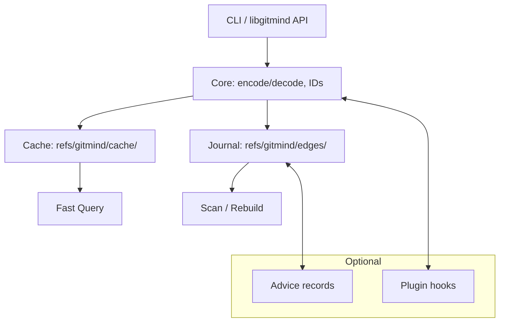
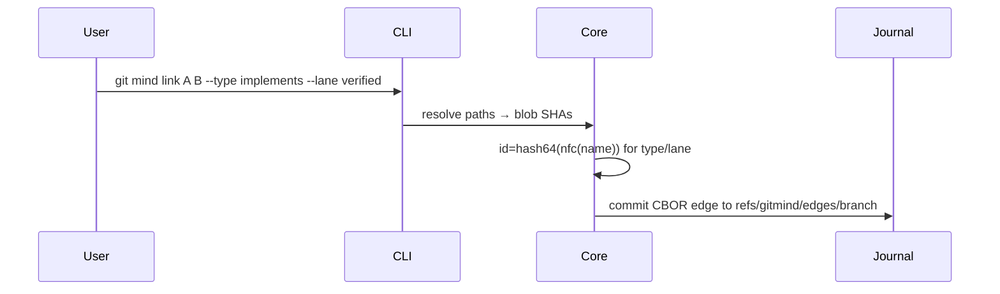
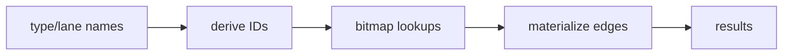

# System Architecture

Table of Contents

- [Executive Summary](#executive-summary)
- [High-Level Design](#high-level-design)
- [Components and Technology Stack](#components-and-technology-stack)
- [Data Flows and Storage](#data-flows-and-storage)
- [Scaling Strategy and Performance Targets](#scaling-strategy-and-performance-targets)

## Executive Summary

git-mind is a Git-native semantic graph system. The journal (source of truth) stores edges as CBOR payloads under branch-scoped refs; the cache (performance layer) stores Roaring Bitmaps for fast queries. Semantics are first-class names; stable numeric IDs are derived solely for cache keys. See also: [Journal Pivot](journal-architecture-pivot.md), [Bitmap Cache Design](bitmap-cache-design.md), and [ADR 0001](../adr/0001-first-class-semantics.md).

## High-Level Design

## Components and Technology Stack

- Language: C (C23), Meson + Ninja
- Git Integration: libgit2
- Serialization: CBOR (custom lightweight impl under `core/src/cbor/`)
- Indexing: CRoaring (Roaring Bitmaps)
- CLI: `git mind` subcommands; library surface for embedders
- Tooling: clang-tidy 20, Dockerized builds; CI gates on gcc-14/clang-20

## Data Flows and Storage

Edge Append

Query via Cache

Storage Layout

- Journal: `refs/gitmind/edges/<branch>` parent-linked commits with CBOR message
- Cache: `refs/gitmind/cache/<branch>/<shard>` bitmap trees; never merged

## Scaling Strategy and Performance Targets

- Scaling knobs
  - Shard caches by leading byte(s) of IDs
  - Incremental rebuilds based on journal tip
  - Memory-capped bitmap loads (LRU)
- Targets (pre-1.0)
  - Median query latency: < 10ms on 100k edges local dataset
  - Rebuild throughput: > 50k edges/sec on commodity laptop
  - Cache size: < 1.5× raw edge count in compressed bits
