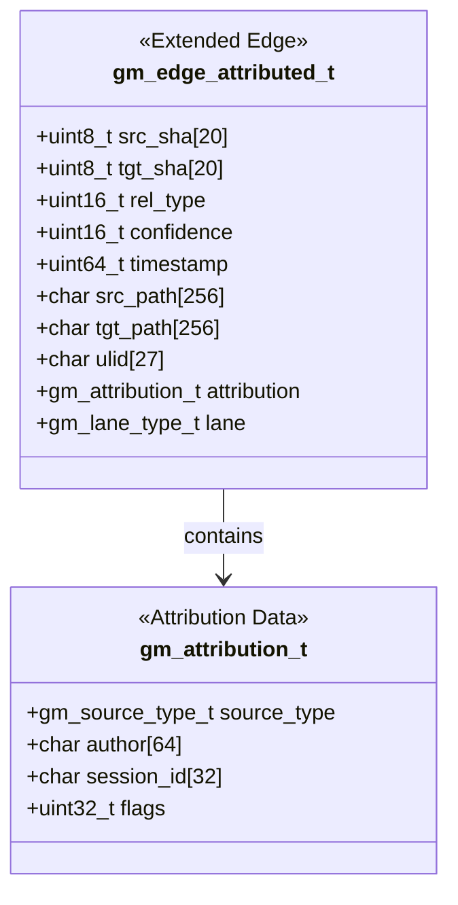
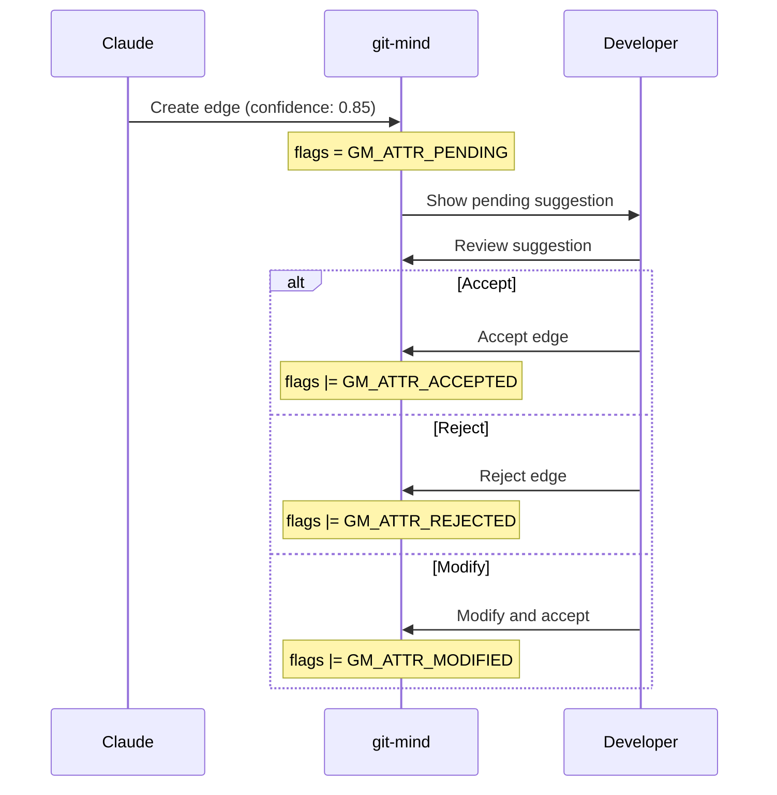
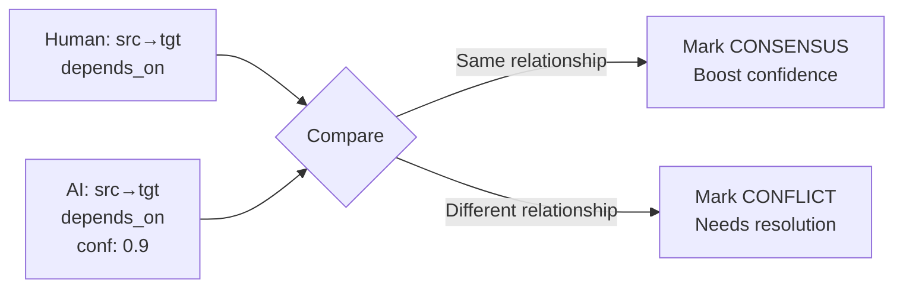

<!-- SPDX-License-Identifier: LicenseRef-MIND-UCAL-1.0 -->
<!-- © 2025 J. Kirby Ross / Neuroglyph Collective -->

# Attribution System Architecture

## Overview

The attribution system is the foundation for human-AI collaboration in git-mind. It tracks who created each semantic edge (human or AI), enabling filtered views, collaborative workflows, and consensus building.

## Core Concepts

### Source Types

Every edge must have a source indicating its creator:

```c
typedef enum {
    GM_SOURCE_HUMAN        = 0,    /* Human-created edge */
    GM_SOURCE_AI_CLAUDE    = 1,    /* Claude AI via MCP */
    GM_SOURCE_AI_GPT      = 2,    /* GPT-4 or similar */
    GM_SOURCE_AI_OTHER    = 3,    /* Other AI systems */
    GM_SOURCE_SYSTEM      = 4,    /* System-generated (e.g., AUGMENTS) */
    GM_SOURCE_IMPORT      = 5,    /* Imported from external source */
    GM_SOURCE_UNKNOWN     = 255   /* Unknown source */
} gm_source_type_t;
```

### Attribution Metadata

Each edge carries attribution information:

```c
typedef struct {
    gm_source_type_t source_type;       /* Who created this edge */
    char author[64];                    /* Email or identifier */
    char session_id[32];                /* Session/conversation ID */
    uint32_t flags;                     /* Review status and metadata */
} gm_attribution_t;
```

### Attribution Flags

Flags track the review and consensus status:

```c
#define GM_ATTR_REVIEWED    0x0001      /* Human reviewed AI suggestion */
#define GM_ATTR_ACCEPTED    0x0002      /* AI suggestion accepted */
#define GM_ATTR_REJECTED    0x0004      /* AI suggestion rejected */
#define GM_ATTR_MODIFIED    0x0008      /* AI suggestion modified */
#define GM_ATTR_CONSENSUS   0x0010      /* Human and AI agree */
#define GM_ATTR_CONFLICT    0x0020      /* Human and AI disagree */
#define GM_ATTR_PENDING     0x0040      /* Awaiting review */
```

## Extended Edge Structure

The original `gm_edge_t` is extended with attribution:



## Lanes System

Edges can be organized into lanes for different workflows:

```c
typedef enum {
    GM_LANE_DEFAULT     = 0,    /* Default lane */
    GM_LANE_ARCHITECTURE = 1,    /* Architecture documentation */
    GM_LANE_TESTING     = 2,    /* Test coverage */
    GM_LANE_REFACTOR   = 3,    /* Refactoring relationships */
    GM_LANE_ANALYSIS   = 4,    /* AI analysis results */
    GM_LANE_CUSTOM     = 100   /* User-defined lanes */
} gm_lane_type_t;
```

## Filter System

### Filter Structure

```c
typedef struct {
    gm_source_type_t source_mask;       /* Bitmask of sources to include */
    float min_confidence;               /* Minimum confidence (0.0-1.0) */
    float max_confidence;               /* Maximum confidence (0.0-1.0) */
    gm_lane_type_t lane;               /* Specific lane or GM_LANE_DEFAULT */
    uint32_t flags_required;           /* Must have these flags */
    uint32_t flags_excluded;           /* Must not have these flags */
} gm_filter_t;
```

### Pre-defined Filters

```c
/* Show everything */
gm_filter_init_default(&filter);

/* Show only human-created edges */
gm_filter_init_human_only(&filter);

/* Show AI insights with minimum confidence */
gm_filter_init_ai_insights(&filter, 0.8);
```

## CBOR Storage Format

### Extended Format

The CBOR encoding now includes attribution data:

```
Array(13) [
    bytes(20),    // src_sha
    bytes(20),    // tgt_sha
    uint16,       // rel_type
    uint16,       // confidence (half-float)
    uint64,       // timestamp
    text,         // src_path
    text,         // tgt_path
    text(26),     // ulid
    uint8,        // source_type (NEW)
    text,         // author (NEW)
    text,         // session_id (NEW)
    uint32,       // flags (NEW)
    uint8         // lane (NEW)
]
```

### Backward Compatibility

The decoder can handle legacy 8-element arrays by setting defaults:
- `source_type` = GM_SOURCE_HUMAN
- `author` = "legacy@unknown"
- `session_id` = ""
- `flags` = 0
- `lane` = GM_LANE_DEFAULT

## Usage Patterns

### Human Creating Edges

```bash
# Default: edges created by humans
git mind link src/main.c docs/design.md --type implements

# Behind the scenes:
# source_type = GM_SOURCE_HUMAN
# author = from git config user.email
# confidence = 1.0
```

### AI Creating Edges (via MCP)

```bash
# Environment setup for Claude
export GIT_MIND_SOURCE=claude
export GIT_MIND_AUTHOR=claude@anthropic
export GIT_MIND_SESSION=conversation_abc123

# Claude creates edge via MCP tool
# source_type = GM_SOURCE_AI_CLAUDE
# author = claude@anthropic
# session_id = conversation_abc123
# confidence = 0.85 (AI provides)
```

### Filtering Views

```bash
# Show only human edges
git mind list --source human

# Show AI suggestions above 80% confidence
git mind list --source ai --min-confidence 0.8

# Show pending AI suggestions
git mind list --pending

# Show edges in architecture lane
git mind list --lane architecture
```

## Collaboration Workflows

### AI Suggestion Review



### Consensus Building

When human and AI create similar edges:



## Implementation Files

### Headers
- `include/gitmind/attribution.h` - Main attribution types and functions

### Source
- `src/attribution/attribution.c` - Core attribution functions
- `src/attribution/cbor.c` - CBOR encoding/decoding for attributed edges
- `src/attribution/attribution.md` - Implementation notes

### Integration Points
- `src/cli/link.c` - Set attribution when creating edges
- `src/cli/list.c` - Filter edges by attribution
- `src/journal/writer.c` - Store attributed edges
- `src/journal/reader.c` - Read attributed edges

## API Reference

### Setting Attribution

```c
/* Set default attribution based on source type */
int gm_attribution_set_default(gm_attribution_t *attr, gm_source_type_t source);

/* Get attribution from environment variables */
int gm_attribution_from_env(gm_attribution_t *attr);
```

### Filtering

```c
/* Initialize filters */
int gm_filter_init_default(gm_filter_t *filter);
int gm_filter_init_human_only(gm_filter_t *filter);
int gm_filter_init_ai_insights(gm_filter_t *filter, float min_confidence);

/* Check if edge matches filter */
int gm_filter_match(const gm_filter_t *filter, const gm_edge_attributed_t *edge);
```

### Encoding/Decoding

```c
/* CBOR serialization */
int gm_edge_attributed_encode_cbor(const gm_edge_attributed_t *edge, 
                                  uint8_t *buffer, size_t *len);
int gm_edge_attributed_decode_cbor(const uint8_t *buffer, size_t len, 
                                  gm_edge_attributed_t *edge);
```

## Future Enhancements

1. **Bulk Review Interface** - Review multiple AI suggestions at once
2. **Attribution Analytics** - Show contribution breakdown by source
3. **Trust Scores** - Track AI accuracy over time
4. **Team Attribution** - Multiple humans with individual attribution
5. **Audit Trail** - Full history of edge modifications

## Design Rationale

### Why Source Attribution?

Human and AI contributors think differently:
- **Humans**: High intent, sporadic, certain
- **AIs**: Pattern-based, systematic, probabilistic

By tracking source, we can:
- Show appropriate views for different users
- Build trust in AI suggestions gradually
- Maintain human intent while benefiting from AI insights

### Why Lanes?

Different workflows need different edge sets:
- Architecture documentation vs implementation details
- Test coverage analysis vs refactoring plans
- AI exploration vs human curation

Lanes let these coexist without interference.

### Why Review Flags?

AI suggestions need human oversight:
- Not all patterns are meaningful
- Context matters more than correlation
- Human judgment validates AI insights

The review system creates a feedback loop that improves both human understanding and AI effectiveness.

---

*The attribution system transforms git-mind from a single-user tool into a collaborative platform where humans and AI build understanding together.*