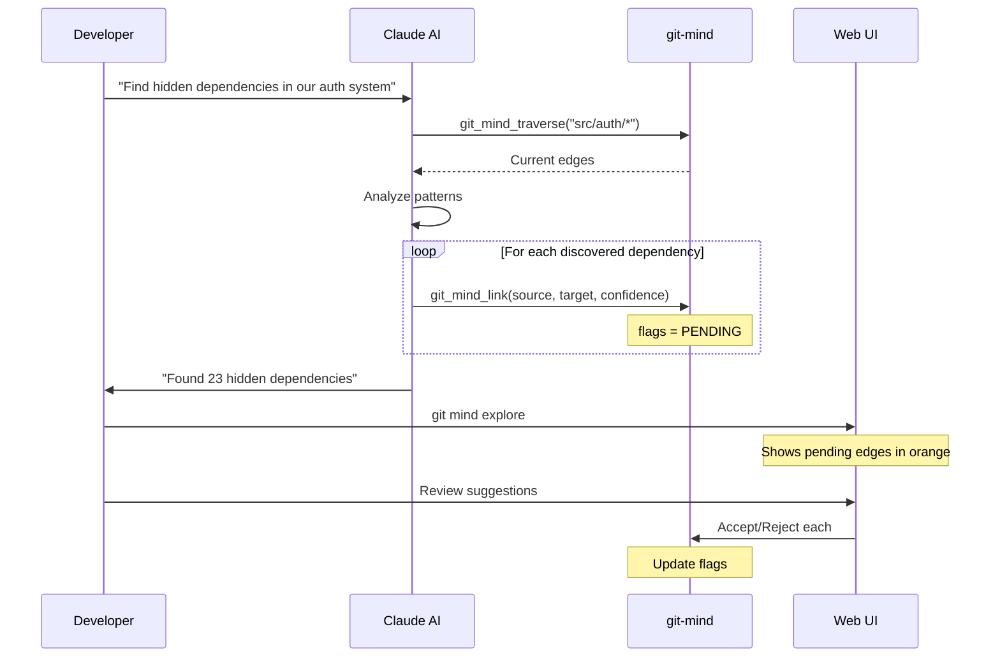
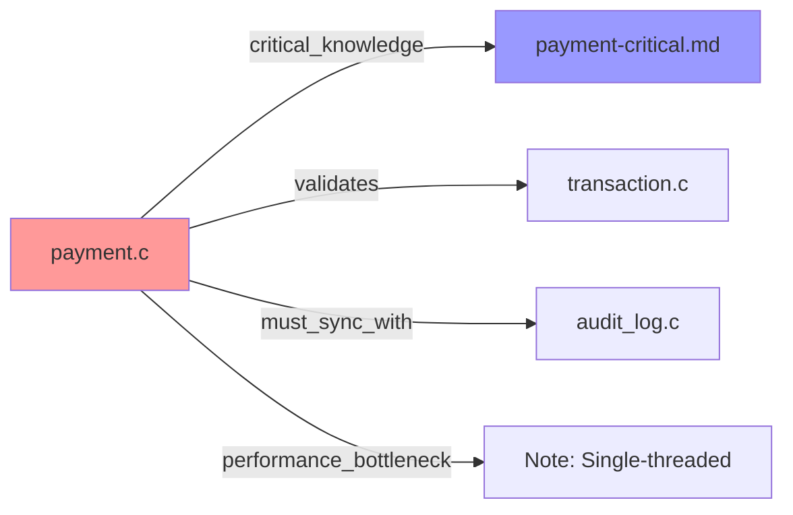
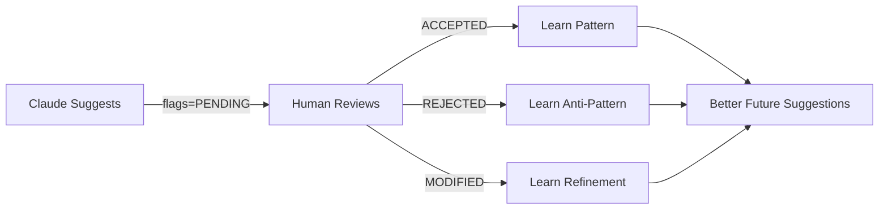

<!-- SPDX-License-Identifier: LicenseRef-MIND-UCAL-1.0 -->
<!-- © 2025 J. Kirby Ross / Neuroglyph Collective -->
---
title: Attribution System Use Cases
description: Scenarios demonstrating lanes, filters, and human+AI collaboration.
audience: [developers]
domain: [architecture]
tags: [attribution, collaboration]
status: stable
last_updated: 2025-09-15
---

# Attribution System Use Cases

Table of Contents

- [Use Case 1: AI-Assisted Code Review](#use-case-1-ai-assisted-code-review)

Real-world scenarios showing how the attribution system enables human-AI collaboration.

## Use Case 1: AI-Assisted Code Review

### Scenario

A developer asks Claude to analyze their codebase for hidden dependencies.

### Flow



### Result

- Developer sees AI discoveries visually
- Can accept obvious ones (high confidence)
- Investigate surprising ones
- Reject false positives

## Use Case 2: Onboarding New Developer

### Scenario

New team member needs to understand a complex codebase.

### Human-Only View

```bash
# New dev starts with human-curated edges
git mind list --source human --from src/core/*

Output:
src/core/engine.c ──implements──> docs/architecture.md [human]
src/core/engine.c ──depends_on──> config/engine.yaml [human]
```

### AI-Enhanced View

```bash
# Then explores AI insights
git mind list --source ai --min-confidence 0.8

Output:
src/core/engine.c ──couples_with──> src/cache/manager.c [ai: 0.92]
src/core/engine.c ──performance_critical──> benchmarks/engine.c [ai: 0.88]
```

### Combined Understanding

The new developer gets:

- Explicit architectural knowledge (human)
- Hidden patterns and relationships (AI)
- Confidence levels to gauge reliability

## Use Case 3: Architecture Documentation

### Scenario

Team lead wants to document system architecture with AI help.

### Step 1: Human Documents Key Relationships

```bash
# Team lead creates high-level edges
git mind link src/api/* docs/api-design.md --type implements
git mind link src/auth/* security/auth-spec.md --type implements
```

### Step 2: AI Fills in Details

```python
# Claude analyzes and adds detailed edges
for module in ['api', 'auth', 'core']:
    analyze_module_dependencies(module)
    create_detailed_edges(confidence_threshold=0.75)
```

### Step 3: Collaborative Review

```bash
# Team reviews AI additions
git mind explore

# In Web UI:
- Human edges shown as solid lines
- AI suggestions as dashed lines
- Drag to connect = human confirmation
- Right-click to reject
```

### Result

Complete architecture map combining:

- Human strategic vision
- AI detailed analysis
- Team consensus

## Use Case 4: Test Coverage Analysis

### Scenario

QA engineer + Claude ensure complete test coverage.

### Lane-Based Organization

```bash
# Human creates testing lane
export GIT_MIND_LANE=testing
git mind link tests/unit/* src/* --type tests

# Claude analyzes coverage
export GIT_MIND_SOURCE=claude
export GIT_MIND_LANE=testing
# Claude finds missing test relationships
```

### Coverage Report

```bash
git mind coverage --lane testing

Output:
Test Coverage Report:
- Files with tests: 145/200 (72.5%)
- Human-verified: 145 edges
- AI-discovered: 31 potential gaps
- Consensus tests: 120 (human + AI agree)

Missing coverage (AI confidence):
- src/utils/helper.c (0.95)
- src/legacy/parser.c (0.89)
- src/experimental/new_api.c (0.76)
```

## Use Case 5: Refactoring Planning

### Scenario

Team plans major refactoring with AI assistance.

### Identify Tightly Coupled Code

```sql
-- Claude's analysis query
SELECT source, target, COUNT(*) as change_frequency
FROM commit_history
WHERE source_changed AND target_changed
GROUP BY source, target
HAVING change_frequency > 10
```

### Create Refactoring Edges

```bash
# Claude creates edges for coupled files
export GIT_MIND_SOURCE=claude
export GIT_MIND_LANE=refactor

git mind link src/old_api.c src/old_impl.c \
  --type tightly_coupled --confidence 0.94
```

### Human Validates

```bash
# Developer reviews coupling
git mind list --lane refactor --pending

# Accepts valid coupling
git mind review --accept e1234567

# Adds refactoring plan
git mind link src/old_api.c docs/refactor-plan.md \
  --type refactor_target
```

## Use Case 6: Knowledge Persistence

### Scenario

Senior developer leaving, needs to transfer knowledge.

### Collaborative Knowledge Capture

1. __Senior Dev Session__

```bash
# Senior dev explains critical paths
git mind link src/payment.c docs/payment-critical.md \
  --type critical_knowledge
```

2. __Claude Interviews__

```
Claude: "I see payment.c is marked critical. What makes it critical?"
Senior: "It handles all transaction validation..."
Claude: *creates detailed edges based on explanation*
```

3. __Knowledge Graph__



## Use Case 7: Continuous AI Learning

### Scenario

Claude improves recommendations over time.

### Feedback Loop



### Metrics Dashboard

```bash
git mind ai-stats --source claude

Claude Performance (Last 30 days):
- Suggestions made: 847
- Accepted: 623 (73.6%)
- Rejected: 89 (10.5%)
- Modified: 135 (15.9%)
- Consensus rate: 67.2%

Improving areas:
- Test detection: 94% accuracy ↑
- Coupling analysis: 81% accuracy ↑
- Performance flags: 62% accuracy →
```

## Use Case 8: Merge Conflict for Ideas

### Scenario

Two developers + AI have different views on architecture.

### The Conflict

```yaml
Alice's View:
  src/cache.c --depends_on--> src/memory.c
  Reason: "Cache needs memory manager"

Bob's View:
  src/cache.c --independent_of--> src/memory.c
  Reason: "Cache should be pluggable"

Claude's Analysis:
  src/cache.c --loosely_coupled--> src/memory.c
  Confidence: 0.77
  Reason: "Can work with different memory backends"
```

### Resolution Process

```bash
git mind conflicts --resolve

Conflict in src/cache.c relationships:
1. Alice: depends_on → memory.c
2. Bob: independent_of → memory.c  
3. Claude: loosely_coupled → memory.c (0.77)

[D]iscuss [V]ote [M]erge-all [C]hoose-one: D

Opening discussion thread...
```

### Outcome

Team discusses, reaches consensus:

- Cache is loosely coupled (Claude was right)
- Add interface documentation
- Both devs learned from AI perspective

## Best Practices

### 1. Start with Human Edges

Build foundation with explicit knowledge first.

### 2. Let AI Explore

Use AI for discovery, not just validation.

### 3. Review Regularly

Don't let pending suggestions pile up.

### 4. Use Lanes

Organize different types of analysis.

### 5. Track Metrics

Monitor AI accuracy to build trust.

### 6. Document Decisions

When rejecting AI suggestions, document why.

---

_These use cases show how attribution transforms git-mind from a single-user tool into a platform for collective intelligence._
