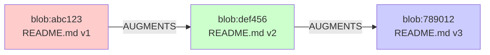
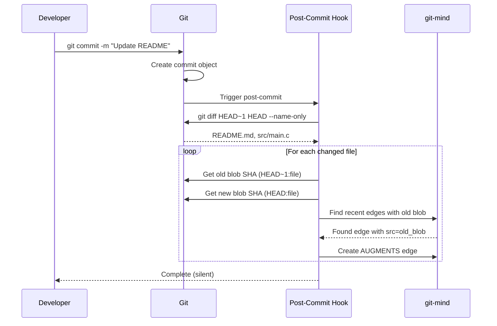
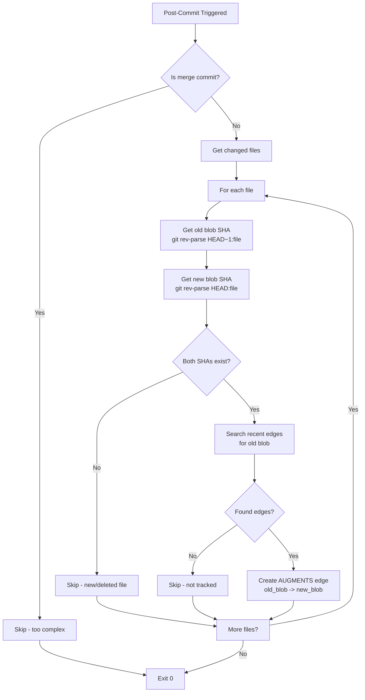
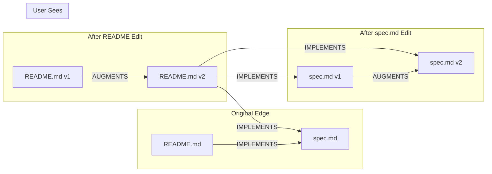
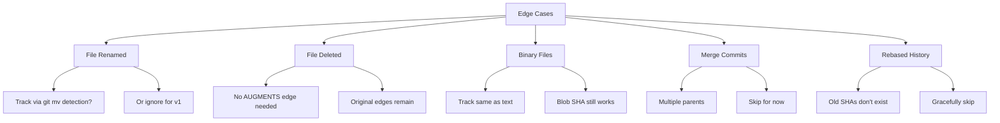

# AUGMENTS System Architecture

Table of Contents

- [Overview](#overview)
- [Core Concepts](#core-concepts)
- [How It Works](#how-it-works)
- [Detailed Design](#detailed-design)

## Overview

The AUGMENTS system automatically tracks file evolution by creating edges between old and new blob SHAs whenever files are modified. This happens transparently via a post-commit hook, creating a complete history of how content evolves over time.

## Core Concepts

### What is an AUGMENTS Edge

An AUGMENTS edge represents the evolution of content:

- __Source__: The old blob SHA (previous version)
- __Target__: The new blob SHA (current version)
- __Semantics__: "old content AUGMENTS INTO new content"
- __Automatic__: Created by post-commit hook, never manually



### How It Works



## Detailed Design

### 1. Post-Commit Hook Flow



### 2. Edge Discovery Strategy

To find which edges need AUGMENTS updates, we need an efficient search strategy:

```mermaid
graph TD
    A[Need to find edges<br/>with src=old_blob] --> B{Strategy?}
    
    B --> C[Option 1: Scan Journal]
    C --> C1[Walk last N commits]
    C --> C2[Decode CBOR edges]
    C --> C3[Check if src=old_blob]
    C --> C4[Pro: Simple<br/>Con: O(N) scan]
    
    B --> D[Option 2: Use Git Log]
    D --> D1[git log --grep=blob_sha]
    D --> D2[Parse matching commits]
    D --> D3[Pro: Git optimized<br/>Con: Needs exact format]
    
    B --> E[Option 3: Cache Lookup]
    E --> E1[If cache exists]
    E --> E2[Use bitmap index]
    E --> E3[Pro: O(1) lookup<br/>Con: Cache might be stale]
    
    C4 --> F[Choose Option 1<br/>for Phase 1]
    D3 --> F
    E3 --> F
```

### 3. Following AUGMENTS Chains

When displaying edges, we need to show the most current version:



## Implementation Details

### File Structure

```
src/
├── hooks/
│   ├── post-commit.c      # Main hook entry point
│   ├── augment.c          # AUGMENTS edge creation
│   └── augment.h          # Interface definitions
```

### Key Functions

```c
// Get blob SHA for file at specific commit
int get_blob_sha(git_repository *repo, 
                 const char *commit_ref,
                 const char *file_path,
                 uint8_t *sha_out);

// Find recent edges with given source blob
int find_edges_by_source(gm_context_t *ctx,
                        const uint8_t *src_sha,
                        gm_edge_t **edges_out,
                        size_t *count_out);

// Create AUGMENTS edge between blobs
int create_augments_edge(gm_context_t *ctx,
                        const uint8_t *old_sha,
                        const uint8_t *new_sha,
                        const char *file_path);

// Main hook logic
int post_commit_hook(int argc, char **argv);
```

### Performance Considerations

1. __Lookback Window__: Only scan last 100-200 edges
2. __Skip Large Commits__: If >50 files changed, skip
3. __Timeout__: Abort if taking >500ms
4. __Async Option__: Queue for background processing

### Edge Cases



## User Experience

### Automatic Tracking

```bash
# Developer workflow remains unchanged
$ git-mind link README.md API.md --type IMPLEMENTS
$ vim README.md  # Make changes
$ git commit -m "Update README"
# AUGMENTS edge created automatically!
```

### Viewing Evolution

```bash
# See current state (follows AUGMENTS)
$ git-mind list
IMPLEMENTS: README.md -> API.md

# See full history
$ git-mind list --show-augments
IMPLEMENTS: README.md@v1 -> API.md
AUGMENTS: README.md@v1 -> README.md@v2
IMPLEMENTS: README.md@v2 -> API.md  # Current
```

### Time Travel

```bash
# See graph at specific commit
$ git-mind list --at HEAD~10
IMPLEMENTS: README.md@v1 -> API.md  # Before augmentation
```

## Testing Strategy

### Unit Tests

- Blob SHA extraction from commits
- Edge search algorithms
- AUGMENTS edge creation

### Integration Tests

- Post-commit hook triggering
- Multi-file commits
- Edge case handling

### E2E Tests

```bash
# Test full workflow
1. Create initial edge
2. Modify source file
3. Commit change
4. Verify AUGMENTS edge created
5. Verify list shows current version
```

## Future Enhancements

1. __Rename Detection__: Use git's rename detection to track moved files
2. __Bulk Import__: Create AUGMENTS for existing git history
3. __Visualization__: Show evolution graph in web UI
4. __Metrics__: Track how often files change together

## Summary

The AUGMENTS system makes git-mind truly magical by automatically tracking content evolution. Every commit enriches the semantic graph, building a complete history of how your codebase evolves over time - with zero manual effort required.
