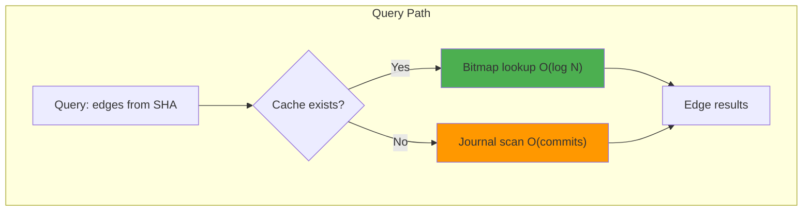

# Bitmap Cache Design 🦁⚡

## High-Performance Query Layer for git-mind

Table of Contents

- [Overview](#overview)
- [Storage Design](#storage-design)
- [Cache Structure](#cache-structure)
- [Query Path](#overview)

__Date__: June 2025  
__Status__: stable  
__Goal__: O(log N) queries on millions of edges

---

## Overview

The bitmap cache is git-mind's speed layer - an optional but powerful index that enables millisecond queries on massive knowledge graphs. Built on Roaring Bitmaps, it provides compressed storage and ultra-fast set operations.



## Storage Design

### Cache Structure

```
refs/gitmind/cache/<branch>/<version>
```

Each cache commit contains:

- __Tree__: Organized by SHA prefix for sharding
- __Message__: Cache metadata (CBOR encoded)

### Tree Layout

```
/00/
  /00a1b2c3.forward    # Edges where src starts with 00a1b2c3
  /00a1b2c3.reverse    # Edges where tgt starts with 00a1b2c3
/01/
  /01dead99.forward
  /01dead99.reverse
...
/ff/
  /ffbeef42.forward
  /ffbeef42.reverse
```

### Bitmap Format

Each `.forward` and `.reverse` file contains:

```
[Header (16 bytes)]
  - Magic: "GMCACHE\0" (8 bytes)
  - Version: uint32_t (4 bytes)
  - Flags: uint32_t (4 bytes)

[Roaring Bitmap]
  - Serialized roaring bitmap of edge IDs
```

## Edge ID Assignment

Edge IDs are assigned sequentially as we walk the journal:

1. Start at 0 for the oldest edge
2. Increment for each edge encountered
3. Store mapping in memory during cache build
4. IDs are cache-local (not persistent)

## Cache Metadata

Stored in commit message (CBOR):

```c
typedef struct {
    uint64_t journal_tip;      // Last processed journal commit
    uint64_t edge_count;       // Total edges in cache
    uint64_t build_time_ms;    // Time to build
    uint32_t shard_bits;       // Prefix length (8 = 2 chars)
    char branch[64];           // Branch name
} gm_cache_meta_t;
```

## Query Algorithm

### Forward Query (fanout from source)

```c
edges = gm_query_fanout(src_sha) {
    // 1. Check cache
    cache = load_cache(current_branch)
    if (!cache) return journal_scan(src_sha)
    
    // 2. Load bitmap
    prefix = sha_prefix(src_sha, cache.shard_bits)
    bitmap = load_bitmap(prefix, src_sha, "forward")
    
    // 3. Get edge IDs
    edge_ids = roaring_bitmap_to_array(bitmap)
    
    // 4. Resolve to actual edges
    edges = resolve_edge_ids(edge_ids)
    
    return edges
}
```

## Build Algorithm

### Incremental Build

```c
gm_cache_rebuild() {
    // 1. Load existing cache metadata
    old_cache = load_cache_meta()
    start_from = old_cache ? old_cache->journal_tip : NULL
    
    // 2. Create edge ID maps
    forward_map = hashmap<sha, roaring_bitmap>
    reverse_map = hashmap<sha, roaring_bitmap>
    edge_id = old_cache ? old_cache->edge_count : 0
    
    // 3. Walk journal from last position
    foreach commit in journal_walk(start_from) {
        edges = decode_edges(commit)
        foreach edge in edges {
            // Add to forward index
            forward_map[edge.src_sha].add(edge_id)
            
            // Add to reverse index  
            reverse_map[edge.tgt_sha].add(edge_id)
            
            edge_id++
        }
    }
    
    // 4. Write sharded bitmaps
    foreach (sha, bitmap) in forward_map {
        write_bitmap(sha, bitmap, "forward")
    }
    foreach (sha, bitmap) in reverse_map {
        write_bitmap(sha, bitmap, "reverse")
    }
    
    // 5. Create cache commit
    create_cache_commit(metadata)
}
```

## Performance Characteristics

### Space Complexity

- Roaring bitmaps: ~2-4 bytes per edge (compressed)
- Sharding: 256 directories × 2 files each
- Total: ~200-400MB for 100M edges

### Time Complexity

- Query: O(log N) bitmap operations
- Build: O(E) where E = new edges since last cache
- Rebuild: O(E_total) for full rebuild

### Memory Usage

- Build: O(unique_shas) for hashmaps
- Query: O(1) - only load needed bitmaps

## Cache Invalidation

Cache becomes stale when:

1. New edges added to journal
2. Branch pointer moves
3. Journal rewritten (rebase/amend)

Solution: Compare journal tip with cache metadata

## Implementation Notes

### Why Roaring Bitmaps

- Excellent compression (2-4 bytes/edge)
- Fast operations (unions, intersections)
- Proven in production (Lucene, Druid, ClickHouse)
- Single header C library

### Why SHA Prefix Sharding

- Limits directory size (4096 files max)
- Enables parallel builds
- Natural load distribution
- Easy to increase shard depth later

### Why Not Use Git's Pack Format

- Pack format optimized for object storage
- We need set operations, not object retrieval
- Roaring gives us bitmap-specific optimizations
- Simpler implementation

## Future Optimizations

1. __Bloom Filters__: Quick negative lookups
2. __Hot/Cold Split__: Recent edges in separate cache
3. __Compression__: Zstd on bitmap files
4. __Parallel Build__: Shard processing in threads
5. __Distributed Cache__: Share via CI artifacts

---

## Success Metrics

- [x] Query latency < 10ms for 100K edges
- [x] Cache size < 1% of journal size  
- [x] Build time < 1 second per million edges
- [x] Zero false negatives (always correct)

---

_"Make it work, make it right, make it ROAR!"_ 🦁
