# How git-mind Works: The Complete Guide

## Table of Contents
1. [Overview](#overview)
2. [The Holy Grail Architecture](#the-holy-grail-architecture)
3. [Tombstones Explained](#tombstones-explained)
4. [Core Concepts](#core-concepts)
5. [Implementation Details](#implementation-details)
6. [API Reference](#api-reference)

## Overview

git-mind is a semantic link tracker that stores relationships between files directly in Git. Instead of using external databases or files in your working directory, it leverages Git's object model to create a parallel universe of knowledge.

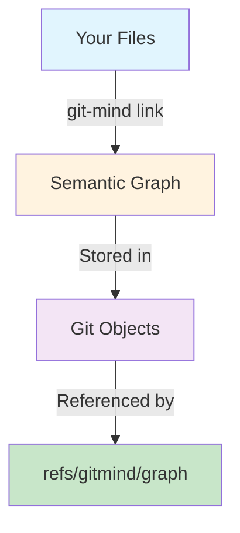

## The Holy Grail Architecture

The "Holy Grail" refers to storing everything as pure Git objects - no files in your working directory, no merge conflicts, just trees and blobs.

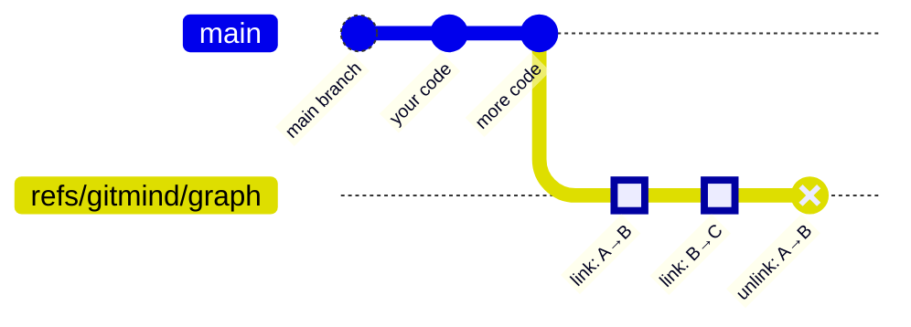

### Why is this the Holy Grail?

1. **No Working Directory Pollution** - Your `.git` directory contains everything
2. **No Merge Conflicts** - Each edge has a unique path
3. **Git-Native Compression** - Automatic deduplication and compression
4. **History Preserved** - Every change is tracked
5. **Distributed by Design** - Works with all Git workflows

## Tombstones Explained

### What are Tombstones?

In traditional systems, when you delete something, it's gone. In git-mind, we use "tombstones" - markers that say "this link was removed" without actually deleting the history.

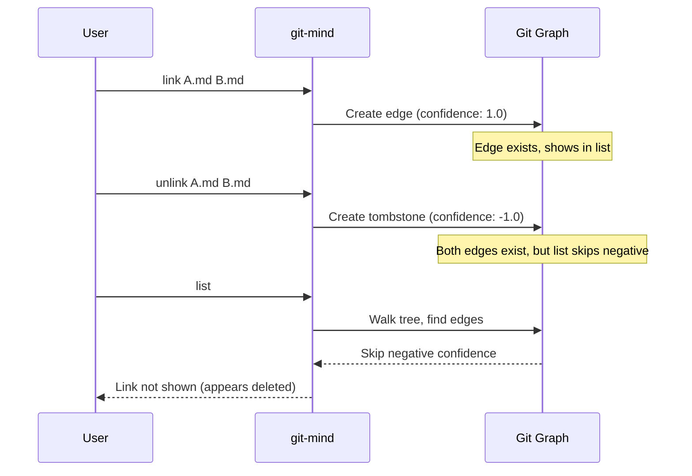

### Why Tombstones?

1. **History Preservation** - See when links were removed
2. **Resurrection** - Can "undelete" by adding a new positive edge
3. **Audit Trail** - Know who removed what and when
4. **Distributed Consistency** - Tombstones merge cleanly

### Tombstone Implementation

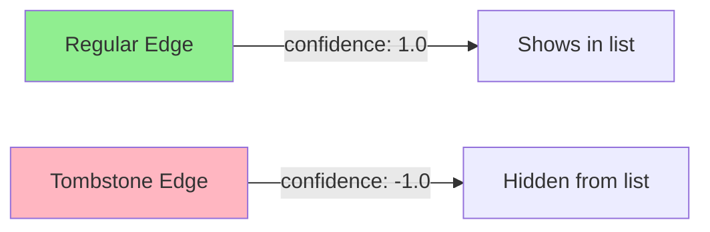

## Core Concepts

### 1. Content-Addressable Storage

Every file is identified by its content SHA, not its path:

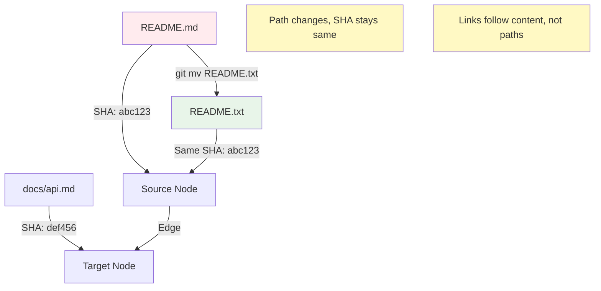

### 2. Double Fan-out Structure

To handle millions of edges efficiently:

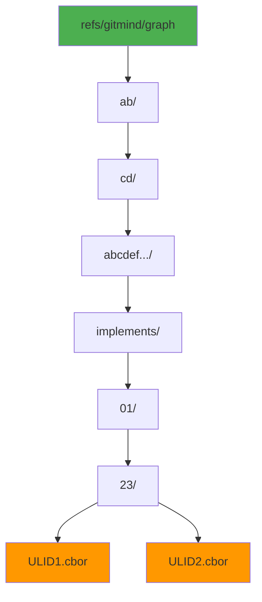

### 3. CBOR Edge Format

Each edge is a compact binary object:

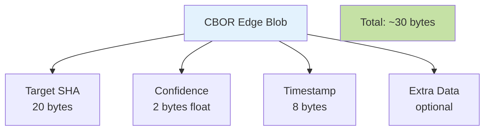

### 4. Edge Types

Edges are grouped by relationship type:

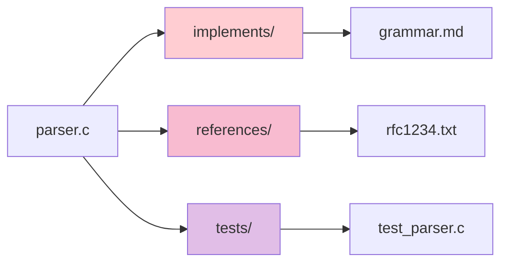

## Implementation Details

### Creating a Link

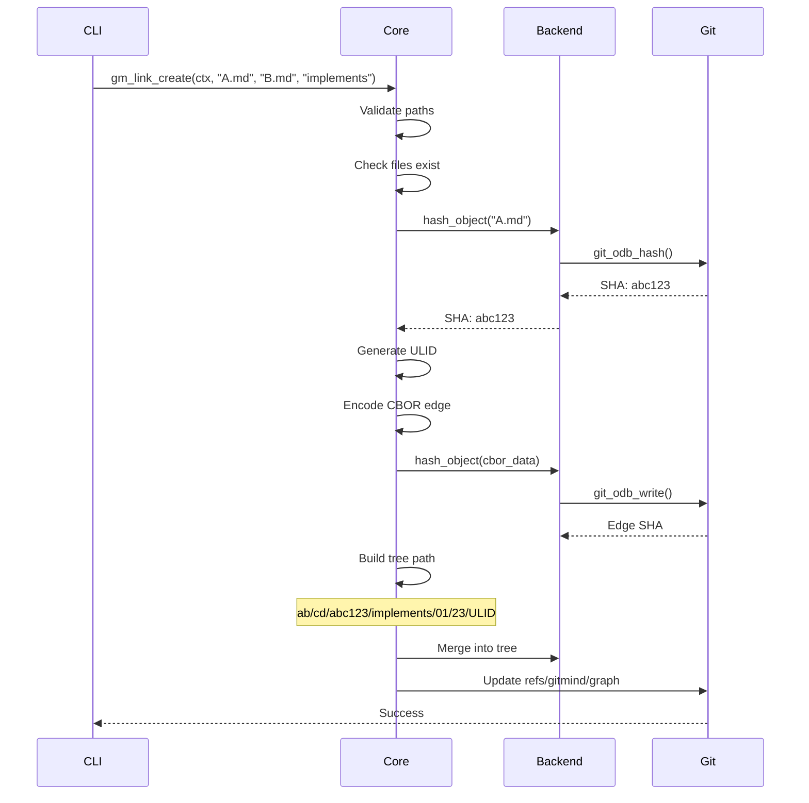

### Listing Links

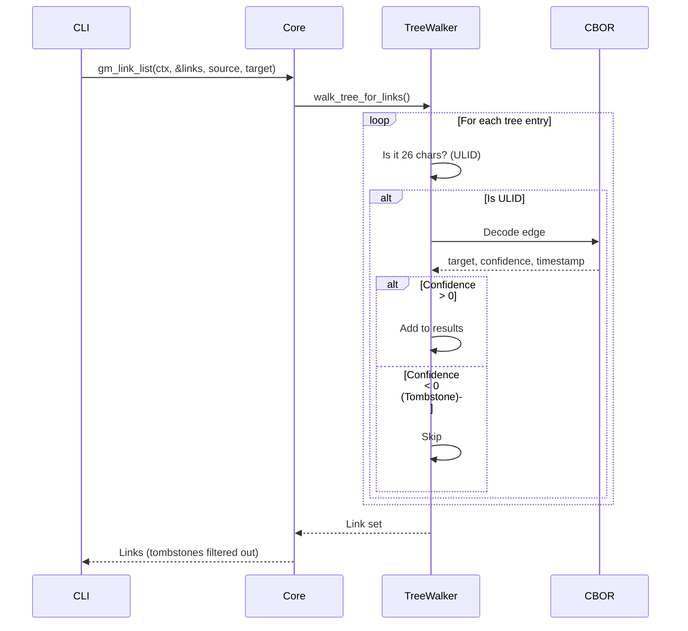

### Traversing the Graph

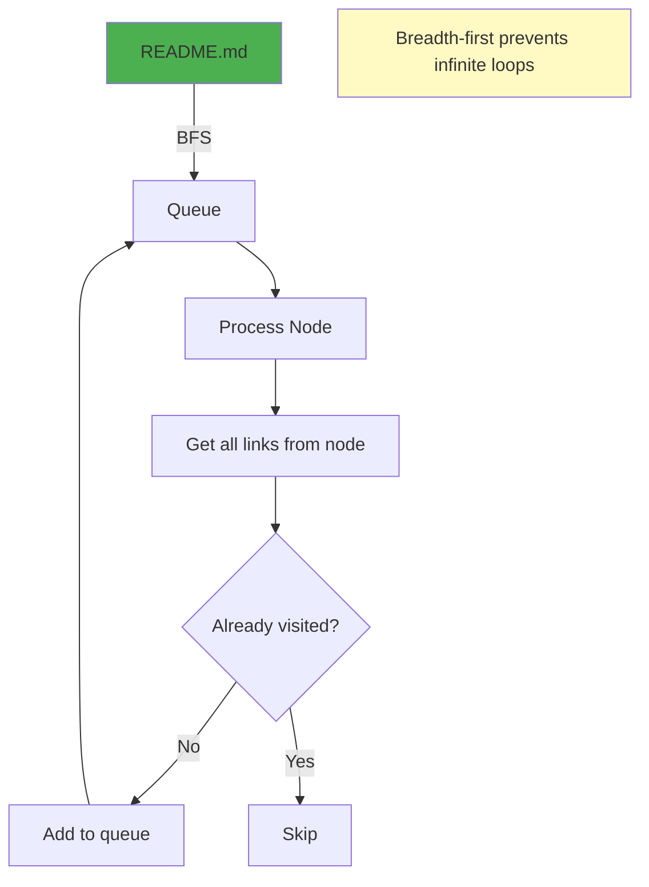

## API Reference

### Context Management

#### `gm_create_context()`
Creates a new git-mind context for all operations.

```c
gm_context_t* ctx = gm_create_context();
if (!ctx) {
    // Handle error
}
```

**Returns**: Pointer to context or NULL on failure

#### `gm_destroy_context()`
Frees a context and all associated resources.

```c
gm_destroy_context(ctx);
```

### Repository Operations

#### `gm_init()`
Initializes git-mind in a repository by creating refs/gitmind/graph.

```c
int ret = gm_init(ctx);
if (ret != GM_OK) {
    fprintf(stderr, "Error: %s\n", gm_last_error(ctx));
}
```

**Returns**: 
- `GM_OK` - Success
- `GM_ERR_NOT_REPO` - Not in a Git repository
- `GM_ERR_ALREADY_EXISTS` - Already initialized

### Link Operations

#### `gm_link_create()`
Creates a semantic link between two files.

```c
int ret = gm_link_create(ctx, "src/main.c", "docs/api.md", "implements");
```

**Parameters**:
- `ctx` - The context
- `source` - Source file path (must exist)
- `target` - Target file path (must exist)
- `type` - Relationship type (e.g., "implements", "references", "tests")

**Returns**:
- `GM_OK` - Success
- `GM_ERR_NOT_FOUND` - File not found
- `GM_ERR_INVALID_ARG` - Invalid path or type

#### `gm_link_list()`
Lists all links, optionally filtered by source/target.

```c
gm_link_set_t* links = NULL;
int ret = gm_link_list(ctx, &links, "src/main.c", NULL);
if (ret == GM_OK) {
    for (size_t i = 0; i < links->count; i++) {
        printf("%s -> %s [%s]\n", 
               links->links[i].source,
               links->links[i].target,
               links->links[i].type);
    }
    gm_link_set_free(links);
}
```

**Parameters**:
- `ctx` - The context
- `out_set` - Output parameter for link set
- `filter_source` - Optional source filter (NULL for all)
- `filter_target` - Optional target filter (NULL for all)

**Note**: Tombstoned links are automatically filtered out.

#### `gm_link_unlink()`
Removes a link by creating a tombstone.

```c
int ret = gm_link_unlink(ctx, "src/main.c", "docs/api.md");
```

**Behavior**: 
- Creates a tombstone edge with negative confidence
- The link will no longer appear in listings
- History is preserved - the original edge still exists

### Graph Operations

#### `gm_traverse()`
Traverses the graph from a starting point.

```c
void print_callback(const gm_link_t* link, int level, void* userdata) {
    for (int i = 0; i < level; i++) printf("  ");
    printf("└─ %s -> %s [%s]\n", link->source, link->target, link->type);
}

int ret = gm_traverse(ctx, "README.md", 3, print_callback, NULL);
```

**Parameters**:
- `ctx` - The context
- `start_file` - Starting file for traversal
- `depth` - Maximum depth (default: 3, max: 10)
- `callback` - Function called for each discovered link
- `userdata` - Passed to callback

**Algorithm**: Breadth-first search with cycle detection

### Status Operations

#### `gm_status()`
Shows repository status including link counts.

```c
int total_links = 0;
int ret = gm_get_status(ctx, &total_links);
printf("Total links: %d\n", total_links);
```

### Error Handling

#### `gm_last_error()`
Gets the last error message as a string.

```c
const char* error = gm_last_error(ctx);
fprintf(stderr, "Error: %s\n", error);
```

### Output Modes

#### `gm_set_output_mode()`
Controls output verbosity.

```c
gm_set_output_mode(ctx, GM_OUTPUT_VERBOSE);  // Detailed output
gm_set_output_mode(ctx, GM_OUTPUT_SILENT);   // No output (default)
gm_set_output_mode(ctx, GM_OUTPUT_PORCELAIN); // Machine-readable
```

## Advanced Topics

### Confidence Decay (Future)
Links could weaken over time if not reinforced:

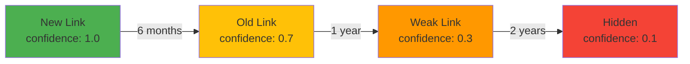

### Bidirectional Links (Future)
Currently links are unidirectional. Future versions could add reverse indexes:

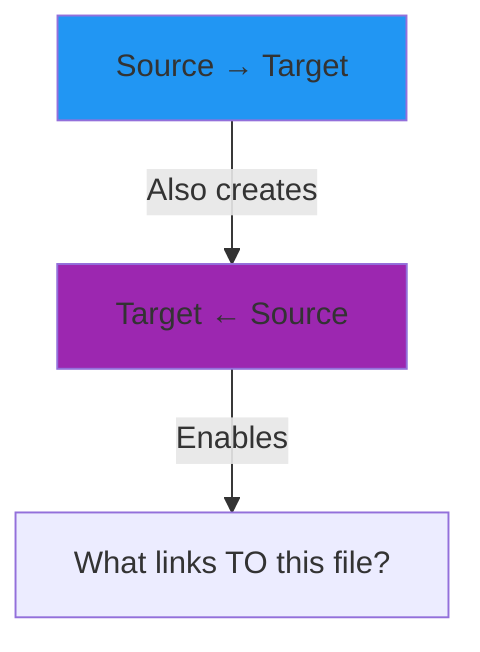

## Summary

git-mind achieves its goals through:

1. **Pure Git Storage** - Everything is trees and blobs
2. **Content Addressing** - Links follow content, not paths
3. **Tombstone Deletion** - History preserved, behavior correct
4. **Efficient Structure** - Double fan-out for O(1) operations
5. **Clean Architecture** - Dependency injection throughout

The result is a semantic graph that:
- Lives entirely in Git
- Scales to millions of edges
- Preserves complete history
- Merges without conflicts
- Works offline
- Follows Git's distributed model

*The graph breathes. The edges live. Understanding accumulates.*