# Project: No Tux Given 🐧⚡

## The git-mind Final Architecture

Table of Contents

- [Executive Summary](#executive-summary)
- [Core Design Principles](#core-design-principles)
- [The Two-Layer Architecture](#the-two-layer-architecture)
- [Implementation Details](#implementation-details)
- [Solving the Hard Problems](#solving-the-hard-problems)
- [Migration Plan (Fresh Start)](#migration-plan-fresh-start)
- [Code Structure](#code-structure)
- [Why This Wins](#why-this-wins)
- [Potential Gotchas & Solutions](#potential-gotchas--solutions)
- [The Payoff](#the-payoff)
- [Next Steps](#next-steps)

__Date__: June 16, 2025  
__Status__: BLANK SLATE - LET'S GO HARD  
__Motto__: "Keep code in files, truth in commits, speed in shards"

---

## Executive Summary

After 3 days of exploration, we're abandoning the Holy Grail orphan ref approach and pivoting to the __Ultimate Design__: edge-journal commits with branch-aware graphs that actually work with Git's model.

```mermaid
graph TD
    subgraph "No Tux Given Architecture"
        Code[Your Code<br/>refs/heads/main]
        Journal[Edge Journal<br/>refs/gitmind/edges/main]
        Cache[Speed Cache<br/>refs/gitmind/cache/main]
        
        Code -->|branch-aware| Journal
        Journal -->|rebuild| Cache
        Journal -->|git push| GitHub[✅ WORKS!]
    end
    
    style Journal fill:#4CAF50
    style Cache fill:#FFC107
    style GitHub fill:#2196F3
```



---

## Core Design Principles

1. __Immutable content is the only true identity__ - Every file version (blob SHA) is its own node
2. __Branches are parallel universes__ - Links live in the branch that created them
3. __The graph is first-class history__ - You can `git bisect` semantics like code
4. __Push/pull must Just Work™__ - No exotic refs, no special servers
5. __Hot queries are O(log N)__ - AI can answer in <10ms with 100M edges

---

## The Two-Layer Architecture

### Layer 0: Edge Journal (Source of Truth)

```
refs/gitmind/edges/main       # Commits with CBOR edge data
refs/gitmind/edges/feature-x  # Per-branch isolation
```

Each edge operation creates a commit:

- __Empty tree__ (storage efficient)
- __CBOR message__ containing edge data
- __Parent chain__ preserves order
- __Standard ref__ that GitHub accepts

### Layer 1: Speed Cache (Optional)

```
refs/gitmind/cache/main/<fan>/<out>/bitmaps
```

- Roaring bitmaps for O(log N) queries
- Rebuilt from journal anytime
- Never pushed (local optimization)
- Can be shared via CI artifacts

---

## Implementation Details

### Edge Structure

```c
typedef struct {
    uint8_t  src_sha[20];     // Source blob SHA-1
    uint8_t  tgt_sha[20];     // Target blob SHA-1  
    uint16_t rel_type;        // Relationship enum
    uint16_t confidence;      // IEEE-754 half float
    uint64_t timestamp;       // Unix millis
    char     src_path[256];   // Path at creation time
    char     tgt_path[256];   // For human display
} gm_edge_t;
```

### CBOR Encoding

```
[
  src_sha,      // 20 bytes
  tgt_sha,      // 20 bytes  
  rel_type,     // 2 bytes
  confidence,   // 2 bytes
  timestamp,    // 8 bytes
  src_path,     // variable
  tgt_path      // variable
]
Total: ~100-300 bytes per edge
```

### Creating an Edge

```c
int gm_link_create(repo, source_path, target_path, rel_type) {
    // 1. Resolve paths to blob SHAs
    src_sha = git_blob_lookup(source_path);
    tgt_sha = git_blob_lookup(target_path);
    
    // 2. Create edge struct
    edge = {src_sha, tgt_sha, rel_type, 1.0, time(), ...};
    
    // 3. Encode to CBOR
    cbor_encode(&edge, buffer);
    
    // 4. Create journal commit
    empty_tree = "4b825dc642cb6eb9a060e54bf8d69288fbee4904";
    parent = git_ref_lookup("refs/gitmind/edges/main");
    
    commit = git_commit_create(
        tree: empty_tree,
        parent: parent,
        message: buffer,
        encoding: "binary"
    );
    
    // 5. Update journal ref
    git_ref_update("refs/gitmind/edges/main", commit);
}
```

---

## Solving the Hard Problems

### 1. File Identity Crisis ✅

```yaml
# Edge tracks both content AND path
edge:
  src_blob: abc123  # Exact content when linked
  src_path: README.md  # Human context
  
# When file edited, post-commit hook adds:
AUGMENTS: old_blob -> new_blob
```

### 2. Branch Awareness ✅

```bash
# Each branch has its own journal
git checkout main
git-mind list  # Shows main's links

git checkout feature  
git-mind list  # Shows feature's links

# Merges work naturally
git merge feature  # Journals merge too!
```

### 3. Push/Pull ✅

```bash
# Just push both refs!
git push origin main refs/gitmind/edges/main

# Or configure:
git config --add remote.origin.push refs/gitmind/edges/*

# Then just:
git push  # Everything goes!
```

### 4. Performance ✅

- Journal scan: O(new commits) not O(all edges)
- Cache lookup: O(log N) via roaring bitmaps
- Rebuild cache: O(edges) but async/incremental

### 5. Deletions (Tombstones) ✅

Instead of deleting edges, we create a "tombstone" edge with a negative confidence. This preserves history and allows for clean merges and undos.

```mermaid
graph TD
    subgraph "Time 1: Create Link"
        T1[10:00 AM]
        E1[Edge 1<br/>confidence: +1.0<br/>✅ Shows in list]
    end
    
    subgraph "Time 2: Unlink (Tombstone)"
        T2[11:00 AM]
        E1_2[Edge 1<br/>confidence: +1.0]
        E2[Edge 2<br/>confidence: -1.0<br/>❌ Hidden from list]
    end
    
    subgraph "Time 3: Re-link"
        T3[12:00 PM]
        E1_3[Edge 1<br/>confidence: +1.0]
        E2_3[Edge 2<br/>confidence: -1.0]
        E3[Edge 3<br/>confidence: +1.0<br/>✅ Shows in list]
    end
    
    T1 --> T2
    T2 --> T3
    
    style E1 fill:#90EE90
    style E2 fill:#FFB6C1
    style E3 fill:#90EE90
```



---

## Migration Plan (Fresh Start)

### Weekend 1: Core Journal

- [ ] Edge CBOR encoder/decoder
- [ ] Journal commit writer  
- [ ] Journal reader/scanner
- [ ] Basic CLI (link, list via scan)

### Weekend 2: Identity & Branches  

- [ ] Blob SHA resolution from paths
- [ ] Branch-aware ref naming
- [ ] AUGMENTS edge for edits
- [ ] Post-commit hook

### Weekend 3: Speed Layer

- [ ] Roaring bitmap integration
- [ ] Cache builder (incremental)
- [ ] Fast queries via cache
- [ ] Push/pull testing

---

## Code Structure

```
src/
├── core/
│   ├── journal.c      # Commit-based storage
│   ├── edge.c         # CBOR edge handling
│   ├── branch.c       # Branch-aware refs
│   └── augment.c      # Edit tracking
├── cache/
│   ├── bitmap.c       # Roaring integration
│   ├── builder.c      # Cache construction
│   └── query.c        # Fast lookups
├── cli/
│   └── main.c         # Commands
└── hooks/
    └── post-commit.c  # Auto augments
```

---

## Why This Wins

### vs Holy Grail (Current)

- ✅ Pushable to any Git host
- ✅ Branch-aware by design
- ✅ No orphan ref magic
- ✅ Works with Git workflows

### vs Simple Files  

- ✅ No merge conflicts
- ✅ Immutable history
- ✅ Content-addressable
- ✅ O(log N) performance

### vs Everything Else

- ✅ Pure Git (commits are native)
- ✅ Simple implementation (~2K LOC)
- ✅ Future-proof (can always rebuild)
- ✅ Distributed-first

---

## Potential Gotchas & Solutions

| Issue | Solution |
|-------|----------|
| Binary commit messages | Set `encoding=binary`, tools handle gracefully |
| Journal spam in `git log` | Use `--exclude=refs/gitmind/**` |
| Large imports | Batch edges, split commits at 1MB |
| Shallow clones | Cache rebuilds from available history |
| Rebase changes parents | Cache rebuilds automatically |

---

## The Payoff

In 3 weekends, we'll have:

- 🚀 Branch-aware semantic graphs
- 📤 GitHub/GitLab/Bitbucket compatible  
- ⚡ Millisecond queries on millions of edges
- 🔍 Complete history with `git log`
- 🎯 Content-addressable truth
- 🛠️ ~2000 lines of clean C

No more fighting Git. No more orphan refs. No more push rejections.

Just pure, elegant, Git-native knowledge graphs.

---

## Next Steps

1. __Archive current code__ as `holy-grail-attempt`
2. __Start fresh__ with journal-based design
3. __Build MVP__ in one weekend
4. __Test push/pull__ on GitHub
5. __Celebrate__ 🍺

---

_"Sometimes the best code is the code you throw away."_

Let's build something that actually works with Git, not against it.

__Project: No Tux Given__ - Because we're not asking permission, we're shipping excellence.

🐧⚡ Let's. Fucking. Go.
