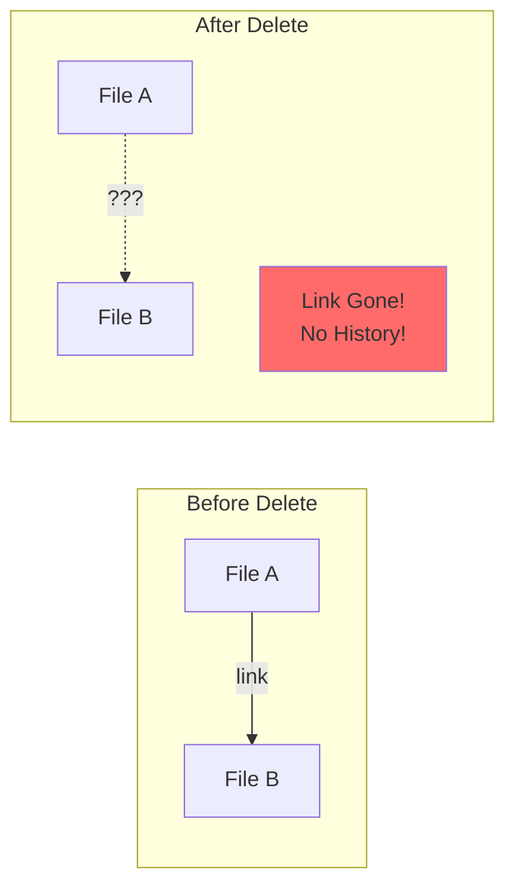
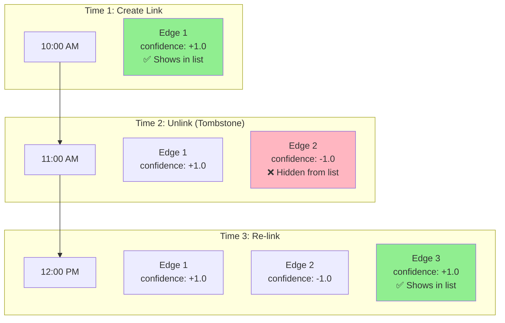
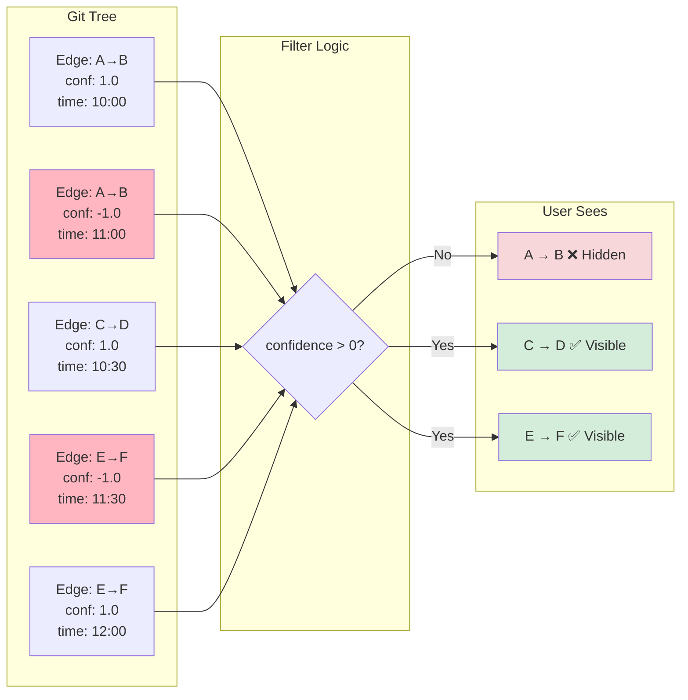
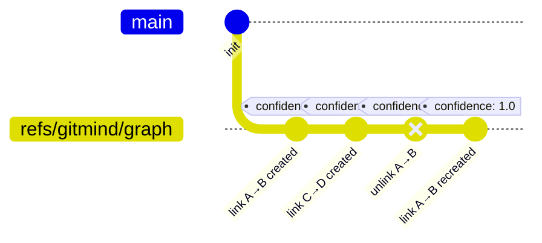
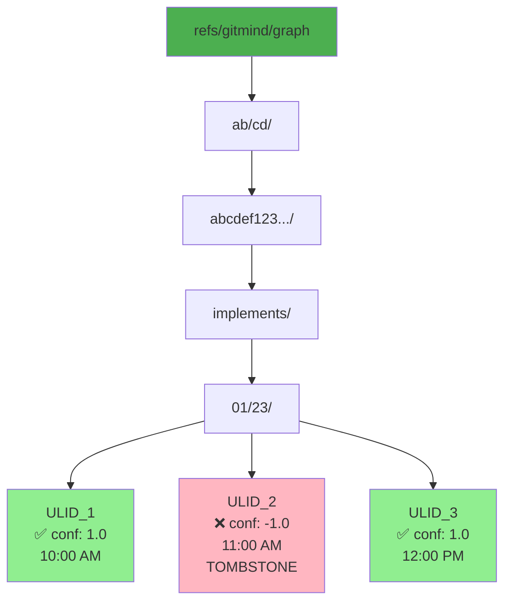
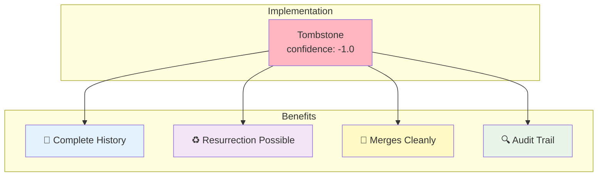
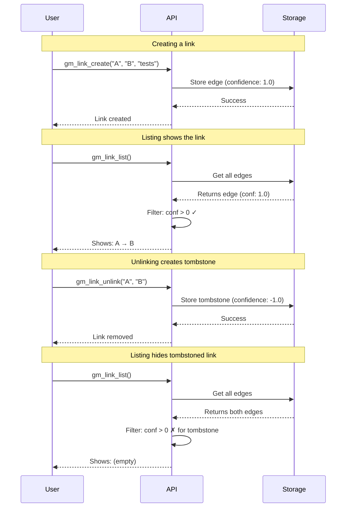

# Visual Guide: How Tombstones Work

Table of Contents
- [The Problem: Traditional Deletion](#the-problem-traditional-deletion)
- [The Solution: Tombstones](#the-solution-tombstones)

## The Problem: Traditional Deletion

## The Solution: Tombstones

## How List Filtering Works

## Real Example in Git

## Tree Structure with Tombstones

## Benefits Visualized

## Code Behavior

## Summary

Tombstones are edges with **negative confidence** that:
- 📜 Preserve complete history
- 👻 Make links "disappear" from user view
- 🔄 Allow clean distributed merges
- ♻️ Enable future resurrection
- 🔍 Provide audit trails

The user sees the **behavior** (link gone) without knowing the **implementation** (tombstone edge)!
