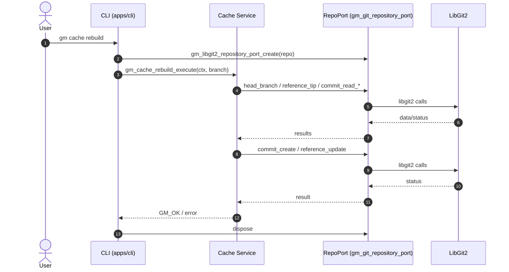
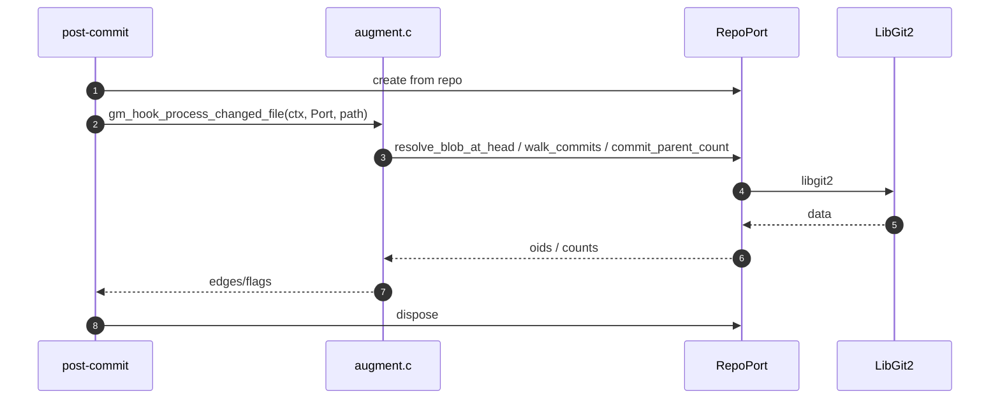

# Code Review Feedback

| Date | Agent | SHA | Branch | PR |
|------|-------|-----|--------|----|
| 2025-09-27 | CodeRabbit (and reviewers) | `dcb68c9f3b3a68140c1f695f8f0f34aeea51a21e` | [chore/more-fixes](https://github.com/neuroglyph/git-mind/tree/chore/more-fixes "neuroglyph/git-mind:chore/more-fixes") | [PR#171](https://github.com/neuroglyph/git-mind/pull/171) |

## CODE REVIEW FEEDBACK

### benchmarks/wildebeest_stampede.c:120 — coderabbitai[bot]

```text
_⚠️ Potential issue_ | _🔴 Critical_

**Fix the gm_cache_query_fanout argument type**

`gm_cache_query_fanout` takes a `const gm_oid_t *`, but the calls here pass a raw `uint8_t*`. This fails to compile (pointer type mismatch) and bypasses the API contract. Wrap the SHA in a `gm_oid_t` and pass its address.


```diff
-    uint8_t mufasa_sha[GM_SHA1_SIZE];
-    generate_wildebeest_sha(mufasa_sha);
+    gm_oid_t mufasa_oid = {0};
+    generate_wildebeest_sha(mufasa_oid.id);
@@
-            memcpy(beast->tgt_sha, mufasa_sha, GM_SHA1_SIZE);
+            memcpy(beast->tgt_sha, mufasa_oid.id, GM_SHA1_SIZE);
@@
-            memcpy(beast->src_sha, mufasa_sha, GM_SHA1_SIZE);
+            memcpy(beast->src_sha, mufasa_oid.id, GM_SHA1_SIZE);
@@
-    gm_cache_query_fanout(&ctx, branch, mufasa_sha, &scan_result);
+    gm_cache_query_fanout(&ctx, branch, &mufasa_oid, &scan_result);
@@
-    gm_cache_query_fanout(&ctx, branch, mufasa_sha, &cache_result);
+    gm_cache_query_fanout(&ctx, branch, &mufasa_oid, &cache_result);
```


Also applies to: 138-139

<details>
<summary>🤖 Prompt for AI Agents</summary>

```
In benchmarks/wildebeest_stampede.c around lines 119-120 (and similarly at
138-139), the call to gm_cache_query_fanout passes a raw uint8_t* (the SHA) but
the function signature expects a const gm_oid_t*; create a gm_oid_t variable,
copy or assign the SHA bytes into its internal buffer as required by gm_oid_t,
and then call gm_cache_query_fanout(&ctx, branch, &your_gm_oid_var,
&scan_result) to pass the address of the gm_oid_t (ensuring const correctness).
```

</details>

<!-- fingerprinting:phantom:poseidon:sabertoothed -->

<!-- This is an auto-generated reply by CodeRabbit -->

✅ Addressed in commits f495f71 to 97f31b1

<!-- This is an auto-generated comment by CodeRabbit -->
```

_Meta_: https://github.com/neuroglyph/git-mind/pull/171#discussion_r2384074004

{response}

### core/src/fs/path_utils.c:93 — coderabbitai[bot]

```text
_⚠️ Potential issue_ | _🟠 Major_

**Remove the new NOLINT suppression**

The updated code no longer uses `memcpy`, so the newly added `// NOLINTNEXTLINE(clang-analyzer-security.insecureAPI.DeprecatedOrUnsafeBufferHandling)` is now redundant and violates our C coding guideline: “NEVER use `NOLINT`; fix the underlying issue.” Please drop the suppression.

```diff
-        // NOLINTNEXTLINE(clang-analyzer-security.insecureAPI.DeprecatedOrUnsafeBufferHandling)
         if (gm_memcpy_span(output + dst, output_size - dst, segment, seg_len) != 0) {
```

<!-- suggestion_start -->

<details>
<summary>📝 Committable suggestion</summary>

> ‼️ **IMPORTANT**
> Carefully review the code before committing. Ensure that it accurately replaces the highlighted code, contains no missing lines, and has no issues with indentation. Thoroughly test & benchmark the code to ensure it meets the requirements.

```suggestion
        if (gm_memcpy_span(output + dst, output_size - dst, segment, seg_len) != 0) {
            return gm_err_void(GM_ERROR(GM_ERR_PATH_TOO_LONG,
                                        "normalized path exceeds buffer"));
        }
```

</details>

<!-- suggestion_end -->

<details>
<summary>🤖 Prompt for AI Agents</summary>

```
In core/src/fs/path_utils.c around lines 89 to 93, remove the now-redundant
NOLINT suppression comment (“//
NOLINTNEXTLINE(clang-analyzer-security.insecureAPI.DeprecatedOrUnsafeBufferHandling”)
because memcpy is no longer used; simply delete that comment line and ensure the
surrounding code and formatting remain unchanged and no other NOLINT is
introduced for this block.
```

</details>

<!-- fingerprinting:phantom:poseidon:sabertoothed -->

<!-- This is an auto-generated reply by CodeRabbit -->

✅ Addressed in commits f495f71 to 97f31b1

<!-- This is an auto-generated comment by CodeRabbit -->
```

_Meta_: https://github.com/neuroglyph/git-mind/pull/171#discussion_r2384074006

{response}

### core/src/hooks/augment.c:146 — coderabbitai[bot]

```text
_⚠️ Potential issue_ | _🟠 Major_

**Detached HEAD lookup regression**

`gm_git_repository_port_head_branch` returns `GM_ERR_NOT_FOUND` whenever the repo is checked out in a detached HEAD (very common in CI). With the new early return, `gm_hook_get_blob_sha` bubbles that error up, so `gm_hook_process_changed_file` treats every change as “new file” and skips augment edge updates entirely in those environments. Please fall back to walking `HEAD` whenever the symbolic branch lookup fails instead of bailing out.


```diff
-    char branch[BUFFER_SIZE_SMALL];
-    gm_result_void_t branch_result =
-        gm_git_repository_port_head_branch(repo_port, branch, sizeof(branch));
-    int branch_rc = hook_result_to_code(branch_result, GM_ERR_NOT_FOUND);
-    if (branch_rc != GM_OK) {
-        return branch_rc;
-    }
-
-    char ref_name[REF_NAME_BUFFER_SIZE];
-    int ref_rc =
-        gm_build_ref(ref_name, sizeof(ref_name), REFS_HEADS_PREFIX, branch);
-    if (ref_rc != GM_OK) {
-        return ref_rc;
-    }
-
     const size_t required_commits = offset + 1U;
     gm_oid_t commit_buffer[GM_AUGMENT_LOOKBACK_LIMIT];
     hook_commit_collect_ctx_t collect_ctx = {
         .storage = commit_buffer,
         .capacity = required_commits,
         .count = 0U,
     };
 
-    gm_result_void_t walk_result = gm_git_repository_port_walk_commits(
-        repo_port, ref_name, collect_commit_oid, &collect_ctx);
+    const char *walk_ref = "HEAD";
+    char branch[BUFFER_SIZE_SMALL];
+    char ref_name[REF_NAME_BUFFER_SIZE];
+    gm_result_void_t branch_result =
+        gm_git_repository_port_head_branch(repo_port, branch, sizeof(branch));
+    int branch_rc = hook_result_to_code(branch_result, GM_ERR_NOT_FOUND);
+    if (branch_rc == GM_OK) {
+        int ref_rc = gm_build_ref(ref_name, sizeof(ref_name), REFS_HEADS_PREFIX,
+                                  branch);
+        if (ref_rc == GM_OK) {
+            walk_ref = ref_name;
+        }
+    } else if (branch_rc != GM_ERR_NOT_FOUND) {
+        return branch_rc;
+    }
+
+    gm_result_void_t walk_result = gm_git_repository_port_walk_commits(
+        repo_port, walk_ref, collect_commit_oid, &collect_ctx);
```

<details>
<summary>🤖 Prompt for AI Agents</summary>

```
In core/src/hooks/augment.c around lines 120 to 146, the code returns early when
gm_git_repository_port_head_branch reports GM_ERR_NOT_FOUND (detached HEAD),
which causes augment to skip edge updates; change the control flow so that if
hook_result_to_code(branch_result, ...) yields GM_ERR_NOT_FOUND you do not
return but instead set ref_name to "HEAD" (or otherwise use "HEAD" as the ref to
walk) and proceed to build/walk commits from HEAD; only return on non-not-found
errors, and ensure subsequent logic uses the fallback ref when branch lookup
failed.
```

</details>

<!-- fingerprinting:phantom:medusa:sabertoothed -->

<!-- This is an auto-generated reply by CodeRabbit -->

✅ Addressed in commits f495f71 to 97f31b1

<!-- This is an auto-generated comment by CodeRabbit -->
```

_Meta_: https://github.com/neuroglyph/git-mind/pull/171#discussion_r2384074008

{response}

### core/src/hooks/augment.c:358 — coderabbitai[bot]

```text
_⚠️ Potential issue_ | _🟠 Major_

**Merge detection fails on detached HEAD**

For the same reason, `gm_hook_is_merge_commit` now returns an error instead of answering if HEAD is detached, even though we can still inspect the current commit. Please keep the branch-based path, but fall back to querying `HEAD` directly when the symbolic branch is missing.


```diff
-    char branch[BUFFER_SIZE_SMALL];
-    gm_result_void_t branch_result =
-        gm_git_repository_port_head_branch(repo_port, branch, sizeof(branch));
-    int branch_rc = hook_result_to_code(branch_result, GM_ERR_NOT_FOUND);
-    if (branch_rc != GM_OK) {
-        return branch_rc;
-    }
-
-    char ref_name[REF_NAME_BUFFER_SIZE];
-    int ref_rc =
-        gm_build_ref(ref_name, sizeof(ref_name), REFS_HEADS_PREFIX, branch);
-    if (ref_rc != GM_OK) {
-        return ref_rc;
-    }
-
     gm_git_reference_tip_t tip;
     gm_memset_safe(&tip, sizeof(tip), 0, sizeof(tip));
-    gm_result_void_t tip_result =
-        gm_git_repository_port_reference_tip(repo_port, ref_name, &tip);
+    const char *ref_to_query = "HEAD";
+    char branch[BUFFER_SIZE_SMALL];
+    char ref_name[REF_NAME_BUFFER_SIZE];
+    gm_result_void_t branch_result =
+        gm_git_repository_port_head_branch(repo_port, branch, sizeof(branch));
+    int branch_rc = hook_result_to_code(branch_result, GM_ERR_NOT_FOUND);
+    if (branch_rc == GM_OK) {
+        int ref_rc =
+            gm_build_ref(ref_name, sizeof(ref_name), REFS_HEADS_PREFIX, branch);
+        if (ref_rc == GM_OK) {
+            ref_to_query = ref_name;
+        }
+    } else if (branch_rc != GM_ERR_NOT_FOUND) {
+        return branch_rc;
+    }
+
+    gm_result_void_t tip_result =
+        gm_git_repository_port_reference_tip(repo_port, ref_to_query, &tip);
```

<!-- suggestion_start -->

<details>
<summary>📝 Committable suggestion</summary>

> ‼️ **IMPORTANT**
> Carefully review the code before committing. Ensure that it accurately replaces the highlighted code, contains no missing lines, and has no issues with indentation. Thoroughly test & benchmark the code to ensure it meets the requirements.

```suggestion
     gm_git_reference_tip_t tip;
     gm_memset_safe(&tip, sizeof(tip), 0, sizeof(tip));

     const char *ref_to_query = "HEAD";
     char branch[BUFFER_SIZE_SMALL];
     char ref_name[REF_NAME_BUFFER_SIZE];
     gm_result_void_t branch_result =
         gm_git_repository_port_head_branch(repo_port, branch, sizeof(branch));
     int branch_rc = hook_result_to_code(branch_result, GM_ERR_NOT_FOUND);
     if (branch_rc == GM_OK) {
         int ref_rc =
             gm_build_ref(ref_name, sizeof(ref_name), REFS_HEADS_PREFIX, branch);
         if (ref_rc == GM_OK) {
             ref_to_query = ref_name;
         }
     } else if (branch_rc != GM_ERR_NOT_FOUND) {
         return branch_rc;
     }

     gm_result_void_t tip_result =
         gm_git_repository_port_reference_tip(repo_port, ref_to_query, &tip);
     int tip_rc = hook_result_to_code(tip_result, GM_ERR_NOT_FOUND);
     if (tip_rc != GM_OK || !tip.has_target) {
         *is_merge = false;
         return tip_rc;
     }

     size_t parent_total = 0U;
     gm_result_void_t parent_result = gm_git_repository_port_commit_parent_count(
         repo_port, &tip.oid, &parent_total);
     int parent_rc = hook_result_to_code(parent_result, GM_ERR_UNKNOWN);
     if (parent_rc != GM_OK) {
         *is_merge = false;
         return parent_rc;
     }
```

</details>

<!-- suggestion_end -->

<details>
<summary>🤖 Prompt for AI Agents</summary>

```
In core/src/hooks/augment.c around lines 301 to 333, the current flow returns an
error when the branch lookup fails causing merge detection to abort on detached
HEAD; instead preserve the branch-based path but fall back to querying HEAD
directly: if hook_result_to_code(branch_result, ...) yields GM_ERR_NOT_FOUND, do
not return—set ref_name to "HEAD" (or otherwise skip gm_build_ref and use the
literal "HEAD") and proceed to call
gm_git_repository_port_reference_tip(repo_port, ref_name, &tip); keep the
existing error handling for other branch errors, and ensure subsequent parent
count logic still runs using the tip obtained from HEAD when branch was missing.
```

</details>

<!-- fingerprinting:phantom:medusa:sabertoothed -->

<!-- This is an auto-generated comment by CodeRabbit -->

✅ Addressed in commits f495f71 to 97f31b1
```

_Meta_: https://github.com/neuroglyph/git-mind/pull/171#discussion_r2384074011

{response}

### core/src/journal/writer.c:149 — coderabbitai[bot]

```text
_⚠️ Potential issue_ | _🔴 Critical_

**Abort commit creation when parent walk fails**

If `gm_git_repository_port_walk_commits` returns an error we currently free the error object but still fall through and create the journal commit without parents. That produces an orphan/root commit and forces the ref update to rewrite history, which is a data-loss bug under real failures. We need to stop immediately and surface the upstream error code.

```diff
-    gm_result_void_t walk_result = gm_git_repository_port_walk_commits(
-        jctx->repo_port, jctx->ref_name, collect_parent_tip, &lookup_ctx);
-    if (!walk_result.ok && walk_result.u.err != NULL) {
-        gm_error_free(walk_result.u.err);
-    }
+    gm_result_void_t walk_result = gm_git_repository_port_walk_commits(
+        jctx->repo_port, jctx->ref_name, collect_parent_tip, &lookup_ctx);
+    if (!walk_result.ok) {
+        int walk_code = GM_ERR_UNKNOWN;
+        if (walk_result.u.err != NULL) {
+            walk_code = walk_result.u.err->code;
+            gm_error_free(walk_result.u.err);
+        }
+        return walk_code;
+    }
```

<!-- suggestion_start -->

<details>
<summary>📝 Committable suggestion</summary>

> ‼️ **IMPORTANT**
> Carefully review the code before committing. Ensure that it accurately replaces the highlighted code, contains no missing lines, and has no issues with indentation. Thoroughly test & benchmark the code to ensure it meets the requirements.

```suggestion
    gm_result_void_t walk_result = gm_git_repository_port_walk_commits(
        jctx->repo_port, jctx->ref_name, collect_parent_tip, &lookup_ctx);
    if (!walk_result.ok) {
        int walk_code = GM_ERR_UNKNOWN;
        if (walk_result.u.err != NULL) {
            walk_code = walk_result.u.err->code;
            gm_error_free(walk_result.u.err);
        }
        return walk_code;
    }

    char *message = NULL;
    int message_rc = encode_cbor_message(cbor_data, cbor_len, &message, NULL);
    if (message_rc != GM_OK) {
        return message_rc;
    }

    const gm_oid_t *parent_list = NULL;
    size_t parent_count = 0U;
    if (lookup_ctx.found) {
        parent_list = &lookup_ctx.tip.oid;
        parent_count = 1U;
    }
```

</details>

<!-- suggestion_end -->

<details>
<summary>🤖 Prompt for AI Agents</summary>

```
In core/src/journal/writer.c around lines 127 to 144, the code currently frees
the error returned by gm_git_repository_port_walk_commits but continues,
producing an orphan commit; instead, if walk_result.ok is false you must abort:
capture the error return code (e.g. store walk_result.u.err->code into a local
int), free the error object, and immediately return that error code (or a
suitable generic error if u.err is NULL) so commit creation does not proceed on
a failed parent walk.
```

</details>

<!-- fingerprinting:phantom:medusa:sabertoothed -->

<!-- This is an auto-generated comment by CodeRabbit -->

✅ Addressed in commits f495f71 to 97f31b1
```

_Meta_: https://github.com/neuroglyph/git-mind/pull/171#discussion_r2384074015

{response}

### core/tests/fakes/git/fake_git_repository_port.c:566 — coderabbitai[bot]

```text
_⚠️ Potential issue_ | _🟠 Major_

**Reset cached tree OID to avoid repeating it**

Once `fake->next_tree_oid` is set (either by tests or by the first auto-generated value) we never clear it, so every subsequent `build_tree_from_directory` call returns the same OID. That diverges from libgit2’s behaviour and breaks scenarios expecting unique tree hashes. Please consume the cached value and clear it before falling back to auto generation.


```diff
@@
-    if (out_tree_oid != NULL) {
-        if (fake->next_tree_oid.id[0] == 0) {
-            fake->counter += 1U;
-            memset(out_tree_oid, 0, sizeof(*out_tree_oid));
-            out_tree_oid->id[0] = (unsigned char)(fake->counter & 0xFFU);
-            fake->next_tree_oid = *out_tree_oid;
-        } else {
-            *out_tree_oid = fake->next_tree_oid;
-        }
-    }
+    if (out_tree_oid == NULL) {
+        return gm_ok_void();
+    }
+
+    if (fake->next_tree_oid.id[0] != 0U) {
+        *out_tree_oid = fake->next_tree_oid;
+        gm_memset_safe(&fake->next_tree_oid, sizeof(fake->next_tree_oid), 0,
+                       sizeof(fake->next_tree_oid));
+        return gm_ok_void();
+    }
+
+    fake->counter += 1U;
+    gm_memset_safe(out_tree_oid, sizeof(*out_tree_oid), 0,
+                   sizeof(*out_tree_oid));
+    out_tree_oid->id[0] = (unsigned char)(fake->counter & 0xFFU);
```

<details>
<summary>🤖 Prompt for AI Agents</summary>

```
In core/tests/fakes/git/fake_git_repository_port.c around lines 558 to 566, the
code returns fake->next_tree_oid on subsequent calls but never clears it,
causing repeated identical tree OIDs; change the logic so that when out_tree_oid
is set from fake->next_tree_oid you consume it by copying it to out_tree_oid and
then reset fake->next_tree_oid to the zero/empty state (e.g., zero its bytes) so
future calls will fall back to auto-generation, ensuring unique OIDs unless
explicitly preset by tests.
```

</details>

<!-- fingerprinting:phantom:medusa:sabertoothed -->

<!-- This is an auto-generated comment by CodeRabbit -->

✅ Addressed in commits f495f71 to 97f31b1
```

_Meta_: https://github.com/neuroglyph/git-mind/pull/171#discussion_r2384074019

{response}

### core/tests/fakes/git/fake_git_repository_port.c:724 — coderabbitai[bot]

```text
_⚠️ Potential issue_ | _🟠 Major_

**Consume `next_commit_oid` after use**

Because `fake->next_commit_oid` is never cleared, every commit after the first reuses the same OID, which makes the fake port lie about unique commits and breaks tests that depend on distinct hashes. Please consume the cached value and reset it before falling back to the auto-generated path.


```diff
@@
-    if (out_commit_oid != NULL) {
-        if (fake->next_commit_oid.id[0] == 0) {
-            fake->counter += 1U;
-            memset(out_commit_oid, 0, sizeof(*out_commit_oid));
-            out_commit_oid->id[0] =
-                (unsigned char)((fake->counter >> 1U) & 0xFFU);
-            fake->next_commit_oid = *out_commit_oid;
-        } else {
-            *out_commit_oid = fake->next_commit_oid;
-        }
-    }
+    if (out_commit_oid == NULL) {
+        return gm_ok_void();
+    }
+
+    if (fake->next_commit_oid.id[0] != 0U) {
+        *out_commit_oid = fake->next_commit_oid;
+        gm_memset_safe(&fake->next_commit_oid, sizeof(fake->next_commit_oid), 0,
+                       sizeof(fake->next_commit_oid));
+        return gm_ok_void();
+    }
+
+    fake->counter += 1U;
+    gm_memset_safe(out_commit_oid, sizeof(*out_commit_oid), 0,
+                   sizeof(*out_commit_oid));
+    out_commit_oid->id[0] =
+        (unsigned char)((fake->counter >> 1U) & 0xFFU);
```


> Committable suggestion skipped: line range outside the PR's diff.

<details>
<summary>🤖 Prompt for AI Agents</summary>

```
In core/tests/fakes/git/fake_git_repository_port.c around lines 716 to 724, the
code returns fake->next_commit_oid without clearing it so subsequent commits
reuse the same OID; change the logic so when next_commit_oid is consumed you
copy it into out_commit_oid and then reset fake->next_commit_oid to an all-zero
value (or otherwise mark it unused) before returning, leaving the existing
auto-generate branch to run only when next_commit_oid is not set.
```

</details>

<!-- fingerprinting:phantom:medusa:sabertoothed -->

<!-- This is an auto-generated comment by CodeRabbit -->

✅ Addressed in commits f495f71 to 97f31b1
```

_Meta_: https://github.com/neuroglyph/git-mind/pull/171#discussion_r2384074021

{response}

### core/tests/unit/test_cache_edge_map.c:29 — coderabbitai[bot]

```text
_⚠️ Potential issue_ | _🟠 Major_

**Fix inverted assertion in `dispose_error`.**

Once we return past the success case, `result.ok` is guaranteed false, so `assert(!result.ok)` always passes and we never detect unexpected failures. That masks regressions the helper is supposed to surface. Flip the assertion to check for success instead (after freeing the error) so tests fail fast when a call that should succeed starts erroring.

```diff
     if (result.u.err != NULL) {
         gm_error_free(result.u.err);
     }
-    assert(!result.ok);
+    assert(result.ok && "unexpected gm_result failure");
```

<!-- suggestion_start -->

<details>
<summary>📝 Committable suggestion</summary>

> ‼️ **IMPORTANT**
> Carefully review the code before committing. Ensure that it accurately replaces the highlighted code, contains no missing lines, and has no issues with indentation. Thoroughly test & benchmark the code to ensure it meets the requirements.

```suggestion
    if (result.u.err != NULL) {
        gm_error_free(result.u.err);
    }
    assert(result.ok && "unexpected gm_result failure");
}
```

</details>

<!-- suggestion_end -->

<details>
<summary>🤖 Prompt for AI Agents</summary>

```
In core/tests/unit/test_cache_edge_map.c around lines 25 to 29, the assertion is
inverted: after handling the error branch the test uses assert(!result.ok) which
always passes and hides failures; move or change the assertion so that after
freeing the error (if result.u.err != NULL) you assert that the call succeeded
by using assert(result.ok) (i.e., flip the condition and place it after any
gm_error_free call) so the test fails fast when an operation that should succeed
returns an error.
```

</details>

<!-- fingerprinting:phantom:medusa:sabertoothed -->

<!-- This is an auto-generated comment by CodeRabbit -->

✅ Addressed in commits f495f71 to 97f31b1
```

_Meta_: https://github.com/neuroglyph/git-mind/pull/171#discussion_r2384074023

{response}

### core/tests/unit/test_journal_mixed_cbor.c:95 — coderabbitai[bot]

```text
_⚠️ Potential issue_ | _🔴 Critical_

**Avoid double-freeing the repository handle**

`gm_libgit2_repository_port_create` hands back `dispose_repository_port`, and that disposer already releases the underlying `git_repository`. Calling `git_repository_free(repo)` afterward frees the same handle twice, which will crash under ASAN in this test and in real runs. Please fall back to `git_repository_free` only when no disposer is returned.

Apply this diff:

```diff
-    if (ctx.git_repo_port_dispose != NULL) {
-        ctx.git_repo_port_dispose(&ctx.git_repo_port);
-    }
-    git_repository_free(repo);
+    if (ctx.git_repo_port_dispose != NULL) {
+        ctx.git_repo_port_dispose(&ctx.git_repo_port);
+    } else {
+        git_repository_free(repo);
+    }
```

<!-- suggestion_start -->

<details>
<summary>📝 Committable suggestion</summary>

> ‼️ **IMPORTANT**
> Carefully review the code before committing. Ensure that it accurately replaces the highlighted code, contains no missing lines, and has no issues with indentation. Thoroughly test & benchmark the code to ensure it meets the requirements.

```suggestion
    if (ctx.git_repo_port_dispose != NULL) {
        ctx.git_repo_port_dispose(&ctx.git_repo_port);
    } else {
        git_repository_free(repo);
    }
    git_libgit2_shutdown();
```

</details>

<!-- suggestion_end -->

<details>
<summary>🤖 Prompt for AI Agents</summary>

```
In core/tests/unit/test_journal_mixed_cbor.c around lines 90 to 94, the test
currently calls the disposer (ctx.git_repo_port_dispose) and then
unconditionally calls git_repository_free(repo), which double-frees the same
repository handle; change the teardown so that if ctx.git_repo_port_dispose is
non-NULL call only ctx.git_repo_port_dispose(&ctx.git_repo_port) and skip
git_repository_free, otherwise call git_repository_free(repo) to release the
repository.
```

</details>

<!-- fingerprinting:phantom:medusa:sabertoothed -->

<!-- This is an auto-generated comment by CodeRabbit -->

✅ Addressed in commits f495f71 to 97f31b1
```

_Meta_: https://github.com/neuroglyph/git-mind/pull/171#discussion_r2384074026

{response}

### docs/architecture/augments-system.md:14 — coderabbitai[bot]

```text
_⚠️ Potential issue_ | _🟠 Major_

**Add required SPDX/license comments after front matter**

`docs/**/*.md` requires the SPDX/license comment block immediately following the front matter. Please add it here to stay compliant with the documentation guidelines. As per coding guidelines

```diff
 ---
 last_updated: 2025-09-27
 ---
+
+<!-- SPDX-License-Identifier: LicenseRef-MIND-UCAL-1.0 -->
+<!-- © 2025 J. Kirby Ross / Neuroglyph Collective -->
```

<!-- suggestion_start -->

<details>
<summary>📝 Committable suggestion</summary>

> ‼️ **IMPORTANT**
> Carefully review the code before committing. Ensure that it accurately replaces the highlighted code, contains no missing lines, and has no issues with indentation. Thoroughly test & benchmark the code to ensure it meets the requirements.

```suggestion
---

<!-- SPDX-License-Identifier: LicenseRef-MIND-UCAL-1.0 -->
<!-- © 2025 J. Kirby Ross / Neuroglyph Collective -->

# AUGMENTS System Architecture
```

</details>

<!-- suggestion_end -->

<details>
<summary>🤖 Prompt for AI Agents</summary>

```
In docs/architecture/augments-system.md around lines 9 to 11, the file is
missing the required SPDX/license comment block immediately after the front
matter; add the SPDX header block (e.g., SPDX-FileCopyrightText and
SPDX-License-Identifier lines) directly below the front-matter delimiter so the
license comment follows the front matter as required by docs/**/*.md guidelines.
```

</details>

<!-- fingerprinting:phantom:poseidon:sabertoothed -->

<!-- This is an auto-generated comment by CodeRabbit -->

✅ Addressed in commits f495f71 to 97f31b1
```

_Meta_: https://github.com/neuroglyph/git-mind/pull/171#discussion_r2384074028

{response}

### docs/code-reviews/PR171/258c9f05de4f483c8c9a039df4b2307bba72ed97.md:26 — coderabbitai[bot]

```text
_⚠️ Potential issue_ | _🟠 Major_

**Fix missing Table of Contents/title mismatch**

This doc has the same structural issues: the front‑matter title differs from the H1, and the required `## Table of Contents` section is absent. Update both to satisfy the documentation rules before rerunning `make docs-verify`.

```diff
-title: 258c9f05de4f483c8c9a039df4b2307bba72ed97.md
+title: Code Review Feedback
@@
-# Code Review Feedback
+# Code Review Feedback
+
+## Table of Contents
+
+- [CODE REVIEW FEEDBACK](#code-review-feedback-1)
+  - [General comment — coderabbitai\[bot]](#general-comment--coderabbitai-bot)
```

<!-- suggestion_start -->

<details>
<summary>📝 Committable suggestion</summary>

> ‼️ **IMPORTANT**
> Carefully review the code before committing. Ensure that it accurately replaces the highlighted code, contains no missing lines, and has no issues with indentation. Thoroughly test & benchmark the code to ensure it meets the requirements.

```suggestion
---
title: Code Review Feedback
description: Preserved review artifacts and rationale.
audience: [contributors]
domain: [quality]
tags: [review]
status: archive
---

# Code Review Feedback

## Table of Contents

- [CODE REVIEW FEEDBACK](#code-review-feedback-1)
  - [General comment — coderabbitai[bot]](#general-comment--coderabbitai-bot)

| Date | Agent | SHA | Branch | PR |
|------|-------|-----|--------|----|
| 2025-09-27 | CodeRabbit (and reviewers) | `258c9f05de4f483c8c9a039df4b2307bba72ed97` | [chore/more-fixes](https://github.com/neuroglyph/git-mind/tree/chore/more-fixes) | [PR#171](https://github.com/neuroglyph/git-mind/pull/171) |

## CODE REVIEW FEEDBACK

### General comment — coderabbitai[bot]

```

</details>

<!-- suggestion_end -->

<details>
<summary>🤖 Prompt for AI Agents</summary>

```
In docs/code-reviews/PR171/258c9f05de4f483c8c9a039df4b2307bba72ed97.md around
lines 1 to 26, the front-matter title does not match the H1 and the required "##
Table of Contents" section is missing; update the YAML front-matter title to
exactly match the H1 header, and insert a "## Table of Contents" section (with
appropriate anchors or a placeholder list) immediately after the H1 so the
document conforms to the docs-verify rules, then run make docs-verify to
confirm.
```

</details>

<!-- fingerprinting:phantom:poseidon:sabertoothed -->

<!-- This is an auto-generated comment by CodeRabbit -->

✅ Addressed in commits f495f71 to 97f31b1
```

_Meta_: https://github.com/neuroglyph/git-mind/pull/171#discussion_r2384074029

{response}

### docs/code-reviews/PR171/7195186ca1374dcef93a846f882a11ebbc7fb861.md:26 — coderabbitai[bot]

```text
_⚠️ Potential issue_ | _🟠 Major_

**Restore required Table of Contents and title alignment**

Per the docs guidelines, each Markdown doc needs a single H1 that matches the front‑matter title and must include a `## Table of Contents` section. This file currently lacks the TOC and the front‑matter title (`7195186ca1374dcef93a846f882a11ebbc7fb861.md`) does not match the `# Code Review Feedback` H1. Please align the title and add the TOC so `make docs-verify` will pass.

```diff
-title: 7195186ca1374dcef93a846f882a11ebbc7fb861.md
+title: Code Review Feedback
@@
-# Code Review Feedback
+# Code Review Feedback
+
+## Table of Contents
+
+- [CODE REVIEW FEEDBACK](#code-review-feedback-1)
+  - [General comment — coderabbitai\[bot]](#general-comment--coderabbitai-bot)
```

<!-- suggestion_start -->

<details>
<summary>📝 Committable suggestion</summary>

> ‼️ **IMPORTANT**
> Carefully review the code before committing. Ensure that it accurately replaces the highlighted code, contains no missing lines, and has no issues with indentation. Thoroughly test & benchmark the code to ensure it meets the requirements.

```suggestion
---
title: Code Review Feedback
description: Preserved review artifacts and rationale.
audience: [contributors]
domain: [quality]
tags: [review]
status: archive
---

# Code Review Feedback

## Table of Contents

- [CODE REVIEW FEEDBACK](#code-review-feedback-1)
  - [General comment — coderabbitai[bot]](#general-comment--coderabbitai-bot)

| Date | Agent | SHA | Branch | PR |
|------|-------|-----|--------|----|
| 2025-09-27 | CodeRabbit (and reviewers) | `7195186ca1374dcef93a846f882a11ebbc7fb861` | [chore/more-fixes](https://github.com/neuroglyph/git-mind/tree/chore/more-fixes "neuroglyph/git-mind:chore/more-fixes") | [PR#171](https://github.com/neuroglyph/git-mind/pull/171) |

## CODE REVIEW FEEDBACK

### General comment — coderabbitai[bot]

```

</details>

<!-- suggestion_end -->

<details>
<summary>🤖 Prompt for AI Agents</summary>

```
In docs/code-reviews/PR171/7195186ca1374dcef93a846f882a11ebbc7fb861.md around
lines 1 to 26, the front-matter title does not match the document H1 and the
file is missing a "## Table of Contents" section required by docs guidelines;
update the YAML front-matter title to exactly match the H1 ("Code Review
Feedback") or change the H1 to match the existing front-matter title, and insert
a "## Table of Contents" section directly below the H1 with links to the main
sections (e.g., General comment, CODE REVIEW FEEDBACK) so the document follows
the repository's docs formatting and passes make docs-verify.
```

</details>

<!-- fingerprinting:phantom:poseidon:sabertoothed -->

<!-- This is an auto-generated comment by CodeRabbit -->
```

_Meta_: https://github.com/neuroglyph/git-mind/pull/171#discussion_r2384074032

{response}

### core/src/adapters/git/libgit2_repository_port.c:652 — coderabbitai[bot]

```text
_⚠️ Potential issue_ | _🟠 Major_

**Remove the banned clang-tidy suppression**

`/* NOLINTNEXTLINE(misc-no-recursion) */` violates the project rule prohibiting NOLINT in touched `.c` files. Please drop the suppression and rework `tree_size_recursive` into an iterative traversal (or otherwise silence the warning by design) so we stay within the lint policy. As per coding guidelines.

<!-- fingerprinting:phantom:medusa:sabertoothed -->

<!-- This is an auto-generated comment by CodeRabbit -->

✅ Addressed in commits f495f71 to 97f31b1
```

_Meta_: https://github.com/neuroglyph/git-mind/pull/171#discussion_r2384082681

{response}

### core/src/adapters/git/libgit2_repository_port.c:718 — coderabbitai[bot]

```text
_⚠️ Potential issue_ | _🔴 Critical_

**Restore first-parent ordering in commit walks**

`gm_hook_get_blob_sha` now relies on `gm_git_repository_port_walk_commits` to materialize `HEAD~N`. With `git_revwalk_sorting(walk, GIT_SORT_TIME)`, a merge commit whose second parent has a newer timestamp than the first will be returned before the first parent, so `offset == 1` yields the feature-side parent instead of the mainline parent. That gives us the wrong blob for `HEAD~1` and breaks the augment edge reconstruction. Please drop the time-based sorting and enforce first-parent traversal (e.g., keep the default ordering or call `git_revwalk_simplify_first_parent`) so the walk produces a deterministic first-parent chain.

```diff
-    git_revwalk_sorting(walk, GIT_SORT_TIME);
+    git_revwalk_sorting(walk, GIT_SORT_NONE);
+    git_revwalk_simplify_first_parent(walk);
```

<!-- suggestion_start -->

<details>
<summary>📝 Committable suggestion</summary>

> ‼️ **IMPORTANT**
> Carefully review the code before committing. Ensure that it accurately replaces the highlighted code, contains no missing lines, and has no issues with indentation. Thoroughly test & benchmark the code to ensure it meets the requirements.

```suggestion
    git_revwalk_sorting(walk, GIT_SORT_NONE);
    git_revwalk_simplify_first_parent(walk);
    if (git_revwalk_push_ref(walk, ref_name) != 0) {
        git_revwalk_free(walk);
        return gm_err_void(
            GM_ERROR(GM_ERR_NOT_FOUND, "unable to push ref %s", ref_name));
    }

    git_oid oid;
    while (git_revwalk_next(&oid, walk) == 0) {
        int cb_result = visit_callback(&oid, userdata);
        commit_count++;
        if (cb_result != GM_OK) {
            git_revwalk_free(walk);
            return gm_err_void(GM_ERROR(cb_result, "commit walk callback stop"));
        }
    }
```

</details>

<!-- suggestion_end -->

<details>
<summary>🤖 Prompt for AI Agents</summary>

```
In core/src/adapters/git/libgit2_repository_port.c around lines 703-718, the
revwalk uses time-based sorting which can return merge commits in the wrong
parent order; remove the git_revwalk_sorting(walk, GIT_SORT_TIME) call (or avoid
time-based sorting) and enforce first-parent traversal by calling
git_revwalk_simplify_first_parent(walk) after creating the walk and before
pushing the ref (so the walk yields a deterministic first-parent chain for
HEAD~N); keep error handling as-is when pushing the ref and when iterating the
walk.
```

</details>

<!-- fingerprinting:phantom:medusa:sabertoothed -->

<!-- This is an auto-generated comment by CodeRabbit -->

✅ Addressed in commits f495f71 to 97f31b1
```

_Meta_: https://github.com/neuroglyph/git-mind/pull/171#discussion_r2384082682

{response}

### core/src/fs/path_utils.c:93 — coderabbitai[bot]

```text
_🛠️ Refactor suggestion_ | _🟠 Major_

**Remove NOLINT and rely on the bounded copy; avoid inline suppressions.**

Per guidelines, we shouldn’t suppress clang-tidy in touched code. The gm_memcpy_span call is already bounds-checked.

Apply this diff to drop the suppression:

```diff
-        // NOLINTNEXTLINE(clang-analyzer-security.insecureAPI.DeprecatedOrUnsafeBufferHandling)
         if (gm_memcpy_span(output + dst, output_size - dst, segment, seg_len) != 0) {
             return gm_err_void(GM_ERROR(GM_ERR_PATH_TOO_LONG,
                                         "normalized path exceeds buffer"));
         }
```

Optional hardening (outside this hunk): prefer an overflow-safe guard instead of addition:
```
if (seg_len > output_size - dst - 1) { /* keep 1 for NUL */ ... }
```
As per coding guidelines

<!-- suggestion_start -->

<details>
<summary>📝 Committable suggestion</summary>

> ‼️ **IMPORTANT**
> Carefully review the code before committing. Ensure that it accurately replaces the highlighted code, contains no missing lines, and has no issues with indentation. Thoroughly test & benchmark the code to ensure it meets the requirements.

```suggestion
        if (gm_memcpy_span(output + dst, output_size - dst, segment, seg_len) != 0) {
            return gm_err_void(GM_ERROR(GM_ERR_PATH_TOO_LONG,
                                        "normalized path exceeds buffer"));
        }
```

</details>

<!-- suggestion_end -->

<details>
<summary>🤖 Prompt for AI Agents</summary>

```
In core/src/fs/path_utils.c around lines 89 to 93, remove the inline NOLINT
suppression and rely on the existing bounded copy; keep the gm_memcpy_span call
but replace the suppression comment with an explicit overflow-safe pre-check:
verify seg_len does not exceed output_size - dst - 1 (reserving one byte for the
NUL) and return the same GM_ERR_PATH_TOO_LONG error if it does, otherwise call
gm_memcpy_span and handle its non-zero return as before.
```

</details>

<!-- fingerprinting:phantom:poseidon:chinchilla -->

<!-- This is an auto-generated comment by CodeRabbit -->

✅ Addressed in commits f495f71 to 97f31b1
```

_Meta_: https://github.com/neuroglyph/git-mind/pull/171#discussion_r2384082686

{response}

### core/src/fs/path_utils.c:114 — coderabbitai[bot]

```text
_🛠️ Refactor suggestion_ | _🟠 Major_

**Don’t suppress cognitive-complexity; refactor instead.**

Remove the NOLINT and split helpers (e.g., trim_trailing_slashes, find_last_sep) to satisfy the check without suppressions.

Apply this diff to drop the suppression:

```diff
-// NOLINTNEXTLINE(readability-function-cognitive-complexity)
 GM_NODISCARD gm_result_void_t gm_fs_path_dirname(const char *input,
                                                 char *output,
                                                 size_t output_size) {
```

I can sketch helper extraction if helpful. As per coding guidelines

<!-- fingerprinting:phantom:poseidon:chinchilla -->

<!-- This is an auto-generated comment by CodeRabbit -->

✅ Addressed in commits f495f71 to 97f31b1
```

_Meta_: https://github.com/neuroglyph/git-mind/pull/171#discussion_r2384082687

{response}

### core/src/fs/path_utils.c:164 — coderabbitai[bot]

```text
_⚠️ Potential issue_ | _🟠 Major_

**Zero output on failure path to avoid partial writes.**

On error, ensure output is cleared per policy.

Apply this diff:

```diff
-    if (gm_memcpy_span(output, output_size, normalized, out_len) != 0) {
-        return gm_err_void(GM_ERROR(GM_ERR_PATH_TOO_LONG,
-                                    "dirname output exceeds buffer"));
-    }
+    if (gm_memcpy_span(output, output_size, normalized, out_len) != 0) {
+        memset(output, 0, output_size);
+        return gm_err_void(GM_ERROR(GM_ERR_PATH_TOO_LONG,
+                                    "dirname output exceeds buffer"));
+    }
```

Replicate this “clear-on-error” pattern for other early returns in this function. As per coding guidelines

<!-- suggestion_start -->

<details>
<summary>📝 Committable suggestion</summary>

> ‼️ **IMPORTANT**
> Carefully review the code before committing. Ensure that it accurately replaces the highlighted code, contains no missing lines, and has no issues with indentation. Thoroughly test & benchmark the code to ensure it meets the requirements.

```suggestion
    if (gm_memcpy_span(output, output_size, normalized, out_len) != 0) {
        memset(output, 0, output_size);
        return gm_err_void(GM_ERROR(GM_ERR_PATH_TOO_LONG,
                                    "dirname output exceeds buffer"));
    }
```

</details>

<!-- suggestion_end -->

<details>
<summary>🤖 Prompt for AI Agents</summary>

```
In core/src/fs/path_utils.c around lines 161-164, the error return after
gm_memcpy_span may leave a partially written output buffer; clear the output
buffer before returning on error (e.g., zero the buffer or set output[0] = '\0'
using the appropriate safe memset/utility) and then return the gm_err_void;
apply the same “clear-on-error” pattern to all other early return/error paths in
this function so no partial data remains in output on failure.
```

</details>

<!-- fingerprinting:phantom:poseidon:chinchilla -->

<!-- This is an auto-generated comment by CodeRabbit -->

✅ Addressed in commits f495f71 to 97f31b1
```

_Meta_: https://github.com/neuroglyph/git-mind/pull/171#discussion_r2384082688

{response}

### core/src/fs/path_utils.c:215 — coderabbitai[bot]

```text
_⚠️ Potential issue_ | _🔴 Critical_

**Fix partial write risk: avoid mutating base_io until capacity for the whole operation is confirmed.**

Currently a trailing slash may be appended before verifying space for the leaf; if the leaf check fails, base_io is left mutated.

Refactor to compute required size up front and only write after passing checks:

```c
GM_NODISCARD gm_result_void_t gm_fs_path_basename_append(
    char *base_io, size_t buffer_size, size_t *inout_len, const char *source_path) {
    if (base_io == NULL || inout_len == NULL || source_path == NULL) {
        return gm_err_void(GM_ERROR(GM_ERR_INVALID_ARGUMENT,
                                    "basename append requires parameters"));
    }

    char normalized[GM_PATH_MAX];
    GM_TRY(gm_fs_path_normalize_logical(source_path, normalized, sizeof(normalized)));

    // Extract leaf
    size_t len = strlen(normalized);
    size_t idx = len;
    while (idx > 0 && normalized[idx - 1] != '/') { idx--; }
    const char *leaf = normalized + idx;
    if (*leaf == '\0') { return gm_ok_void(); }

    // Validate base length
    size_t base_len = *inout_len;
    if (base_len > buffer_size) {
        return gm_err_void(GM_ERROR(GM_ERR_INVALID_ARGUMENT,
                                    "basename append length exceeds buffer"));
    }

    // Plan writes
    bool need_sep = (base_len > 0 && base_io[base_len - 1] != '/');
    size_t leaf_len = strlen(leaf);
    size_t required = base_len + (need_sep ? 1 : 0) + leaf_len;

    // Keep 1 for NUL; overflow-safe check
    if (required >= buffer_size || leaf_len > buffer_size - base_len - (need_sep ? 1 : 0) - 1) {
        return gm_err_void(GM_ERROR(GM_ERR_PATH_TOO_LONG,
                                    "basename append exceeds buffer"));
    }

    // Perform writes
    if (need_sep) {
        base_io[base_len++] = '/';
    }
    if (gm_memcpy_span(base_io + base_len, buffer_size - base_len, leaf, leaf_len) != 0) {
        // Clear to avoid partial writes
        memset(base_io, 0, buffer_size);
        return gm_err_void(GM_ERROR(GM_ERR_PATH_TOO_LONG,
                                    "basename append exceeds buffer"));
    }
    base_len += leaf_len;
    base_io[base_len] = '\0';
    *inout_len = base_len;
    return gm_ok_void();
}
```

This prevents partial writes and follows the “zero on error” rule. As per coding guidelines

<details>
<summary>🤖 Prompt for AI Agents</summary>

```
core/src/fs/path_utils.c around lines 211-215: the current append logic can
mutate base_io (writing a trailing slash) before confirming there is enough
space for the leaf, risking a partial write on error; change the routine to
compute normalized leaf and required size up front, perform bounds/overflow-safe
checks (including NUL) before any writes, only then write the separator (if
needed) and the leaf, NUL-terminate and update *inout_len; if a copy fails,
clear the buffer (memset zero) and return the path-too-long error to avoid
leaving base_io partially modified.
```

</details>

<!-- fingerprinting:phantom:poseidon:chinchilla -->

<!-- This is an auto-generated comment by CodeRabbit -->

✅ Addressed in commits f495f71 to 97f31b1
```

_Meta_: https://github.com/neuroglyph/git-mind/pull/171#discussion_r2384082689

{response}

### core/src/hooks/augment.c:156 — coderabbitai[bot]

```text
_⚠️ Potential issue_ | _🟠 Major_

**Handle detached HEAD when resolving HEAD~N**

The new flow requires resolving the current branch name and building `refs/heads/<branch>` before walking commits. In a detached HEAD (checkout of a bare commit, bisect, etc.), `gm_git_repository_port_head_branch` returns `GM_ERR_NOT_FOUND`, which now short-circuits the hook. Previously we could resolve `HEAD~1` in detached states; now we silently skip augment edges. Please switch to pushing `HEAD` directly (or otherwise avoid depending on a branch name) so detached HEADs remain supported.

```diff
-    char branch[BUFFER_SIZE_SMALL];
-    gm_result_void_t branch_result =
-        gm_git_repository_port_head_branch(repo_port, branch, sizeof(branch));
-    int branch_rc = hook_result_to_code(branch_result, GM_ERR_NOT_FOUND);
-    if (branch_rc != GM_OK) {
-        return branch_rc;
-    }
-
-    char ref_name[REF_NAME_BUFFER_SIZE];
-    int ref_rc =
-        gm_build_ref(ref_name, sizeof(ref_name), REFS_HEADS_PREFIX, branch);
-    if (ref_rc != GM_OK) {
-        return ref_rc;
-    }
-
     const size_t required_commits = offset + 1U;
     gm_oid_t commit_buffer[GM_AUGMENT_LOOKBACK_LIMIT];
     hook_commit_collect_ctx_t collect_ctx = {
         .storage = commit_buffer,
         .capacity = required_commits,
         .count = 0U,
     };
 
-    gm_result_void_t walk_result = gm_git_repository_port_walk_commits(
-        repo_port, ref_name, collect_commit_oid, &collect_ctx);
+    gm_result_void_t walk_result = gm_git_repository_port_walk_commits(
+        repo_port, "HEAD", collect_commit_oid, &collect_ctx);
```

<!-- suggestion_start -->

<details>
<summary>📝 Committable suggestion</summary>

> ‼️ **IMPORTANT**
> Carefully review the code before committing. Ensure that it accurately replaces the highlighted code, contains no missing lines, and has no issues with indentation. Thoroughly test & benchmark the code to ensure it meets the requirements.

```suggestion
    const size_t required_commits = offset + 1U;
    gm_oid_t commit_buffer[GM_AUGMENT_LOOKBACK_LIMIT];
    hook_commit_collect_ctx_t collect_ctx = {
        .storage = commit_buffer,
        .capacity = required_commits,
        .count = 0U,
    };

    gm_result_void_t walk_result = gm_git_repository_port_walk_commits(
        repo_port, "HEAD", collect_commit_oid, &collect_ctx);
    int walk_rc = hook_result_to_code(walk_result, GM_ERR_NOT_FOUND);
    if (walk_rc != GM_OK) {
        return walk_rc;
    }

    if (collect_ctx.count <= offset) {
        return GM_ERR_NOT_FOUND;
    }

    gm_result_void_t resolve_result = gm_git_repository_port_resolve_blob_at_commit(
        repo_port, &collect_ctx.storage[offset], file_path, sha_out);
    return hook_result_to_code(resolve_result, GM_ERR_NOT_FOUND);
```

</details>

<!-- suggestion_end -->

<details>
<summary>🤖 Prompt for AI Agents</summary>

```
In core/src/hooks/augment.c around lines 120-156, the code fails early when HEAD
is detached because it requires a branch name and builds refs/heads/<branch>;
change the logic so that if gm_git_repository_port_head_branch returns
GM_ERR_NOT_FOUND (detached HEAD) you use the literal "HEAD" ref instead of
building refs/heads/<branch> (i.e. only call gm_build_ref when a branch name was
successfully obtained, otherwise set ref_name to "HEAD" and proceed to walk
commits and resolve the blob), keeping the existing error handling for other
failures.
```

</details>

<!-- fingerprinting:phantom:medusa:sabertoothed -->

<!-- This is an auto-generated comment by CodeRabbit -->

✅ Addressed in commits f495f71 to 97f31b1
```

_Meta_: https://github.com/neuroglyph/git-mind/pull/171#discussion_r2384082690

{response}

### docs/code-reviews/PR171/258c9f05de4f483c8c9a039df4b2307bba72ed97.md:74 — coderabbitai[bot]

```text
_⚠️ Potential issue_ | _🟠 Major_

**Restore required doc structure (title + ToC).**

Per the repo documentation standards, each Markdown doc must keep the H1 title aligned with the front-matter `title` field and expose a `## Table of Contents` section. This file currently has a hash-valued title and no ToC section, so it fails the check. Please align the title with the H1 and add the required ToC (adding headings for the sections referenced in the ToC keeps the anchors stable).

```diff
--- a/docs/code-reviews/PR171/258c9f05de4f483c8c9a039df4b2307bba72ed97.md
+++ b/docs/code-reviews/PR171/258c9f05de4f483c8c9a039df4b2307bba72ed97.md
@@
-title: 258c9f05de4f483c8c9a039df4b2307bba72ed97.md
+title: Code Review Feedback
@@
-# Code Review Feedback
+# Code Review Feedback
+
+## Table of Contents
+
+- [Code Review Feedback](#code-review-feedback)
+- [CODE REVIEW FEEDBACK](#code-review-feedback-1)
+- [Finishing touches](#finishing-touches)
+- [Tips](#tips)
@@
-## CODE REVIEW FEEDBACK
+## CODE REVIEW FEEDBACK
@@
-<!-- finishing_touch_checkbox_start -->
+## Finishing touches
+
+<!-- finishing_touch_checkbox_start -->
@@
-<!-- tips_start -->
+## Tips
+
+<!-- tips_start -->
```
As per coding guidelines

<!-- suggestion_start -->

<details>
<summary>📝 Committable suggestion</summary>

> ‼️ **IMPORTANT**
> Carefully review the code before committing. Ensure that it accurately replaces the highlighted code, contains no missing lines, and has no issues with indentation. Thoroughly test & benchmark the code to ensure it meets the requirements.

```suggestion
---
title: Code Review Feedback
description: Preserved review artifacts and rationale.
audience: [contributors]
domain: [quality]
tags: [review]
status: archive
---

# Code Review Feedback

## Table of Contents

- [Code Review Feedback](#code-review-feedback)
- [CODE REVIEW FEEDBACK](#code-review-feedback-1)
- [Finishing touches](#finishing-touches)
- [Tips](#tips)

| Date       | Agent                       | SHA                                   | Branch                                                                                               | PR                                                                 |
|------------|-----------------------------|---------------------------------------|------------------------------------------------------------------------------------------------------|--------------------------------------------------------------------|
| 2025-09-27 | CodeRabbit (and reviewers)  | `258c9f05de4f483c8c9a039df4b2307bba72ed97` | [chore/more-fixes](https://github.com/neuroglyph/git-mind/tree/chore/more-fixes)                  | [PR#171](https://github.com/neuroglyph/git-mind/pull/171)            |

## CODE REVIEW FEEDBACK

### General comment — coderabbitai[bot]

```

</details>

<!-- suggestion_end -->

<details>
<summary>🤖 Prompt for AI Agents</summary>

```
In docs/code-reviews/PR171/258c9f05de4f483c8c9a039df4b2307bba72ed97.md around
lines 1-138, the file H1 does not match the front-matter title (it's currently a
hash) and the required "## Table of Contents" section is missing; update the H1
to exactly match the front-matter title value (or update the front-matter title
to the intended human-readable H1), add a "## Table of Contents" section beneath
the H1, and ensure you include the target headings that the ToC will anchor to
(add or adjust section headings so anchors are stable).
```

</details>

<!-- fingerprinting:phantom:poseidon:sabertoothed -->

<!-- This is an auto-generated comment by CodeRabbit -->

✅ Addressed in commits f495f71 to 97f31b1
```

_Meta_: https://github.com/neuroglyph/git-mind/pull/171#discussion_r2384082693

{response}

### docs/code-reviews/PR171/7195186ca1374dcef93a846f882a11ebbc7fb861.md:138 — coderabbitai[bot]

```text
_⚠️ Potential issue_ | _🟠 Major_

**Restore required doc structure (title + ToC).**

Same issue as the sibling review artifact: the doc violates the Markdown guidelines because the H1 and front-matter title differ and there’s no `## Table of Contents` section. Sync the title with the H1 and add the mandated ToC plus headings for the sections the ToC references.

```diff
--- a/docs/code-reviews/PR171/7195186ca1374dcef93a846f882a11ebbc7fb861.md
+++ b/docs/code-reviews/PR171/7195186ca1374dcef93a846f882a11ebbc7fb861.md
@@
-title: 7195186ca1374dcef93a846f882a11ebbc7fb861.md
+title: Code Review Feedback
@@
-# Code Review Feedback
+# Code Review Feedback
+
+## Table of Contents
+
+- [Code Review Feedback](#code-review-feedback)
+- [CODE REVIEW FEEDBACK](#code-review-feedback-1)
+- [Finishing touches](#finishing-touches)
+- [Tips](#tips)
@@
-## CODE REVIEW FEEDBACK
+## CODE REVIEW FEEDBACK
@@
-<!-- finishing_touch_checkbox_start -->
+## Finishing touches
+
+<!-- finishing_touch_checkbox_start -->
@@
-<!-- tips_start -->
+## Tips
+
+<!-- tips_start -->
```
As per coding guidelines

<!-- suggestion_start -->

<details>
<summary>📝 Committable suggestion</summary>

> ‼️ **IMPORTANT**
> Carefully review the code before committing. Ensure that it accurately replaces the highlighted code, contains no missing lines, and has no issues with indentation. Thoroughly test & benchmark the code to ensure it meets the requirements.

```suggestion
---
title: Code Review Feedback
description: Preserved review artifacts and rationale.
audience: [contributors]
domain: [quality]
tags: [review]
status: archive
---

# Code Review Feedback

## Table of Contents

- [Code Review Feedback](#code-review-feedback)
- [CODE REVIEW FEEDBACK](#code-review-feedback-1)
- [Finishing touches](#finishing-touches)
- [Tips](#tips)

## CODE REVIEW FEEDBACK

<!-- (existing feedback content unchanged) -->

## Finishing touches

<!-- finishing_touch_checkbox_start -->
- [ ] 📝 Generate Docstrings
  <details>
    <summary>🧪 Generate unit tests</summary>
    - [ ] Create PR with unit tests  
    - [ ] Post copyable unit tests in a comment  
    - [ ] Commit unit tests in branch `chore/more-fixes`  
  </details>
<!-- finishing_touch_checkbox_end -->

## Tips

<!-- tips_start -->
---
Thanks for using CodeRabbit! It's free for OSS, and your support helps us grow. If you like it, consider giving us a shout-out.

<details>
<summary>❤️ Share</summary>
- [Twitter](https://twitter.com/intent/tweet?text=I%20just%20used%20%40coderabbitai%20...)  
- [Mastodon](https://mastodon.social/share?text=I%20just%20used%20%40coderabbitai%20...)  
- [Reddit](https://www.reddit.com/submit?title=Great%20tool%20for%20code%20review%20-%20CodeRabbit...)  
- [LinkedIn](https://www.linkedin.com/sharing/share-offsite/?url=https%3A%2F%2Fcoderabbit.ai)  
</details>

<sub>Comment `@coderabbitai help` to get the list of available commands and usage tips.</sub>
<!-- tips_end -->
```

</details>

<!-- suggestion_end -->

<details>
<summary>🤖 Prompt for AI Agents</summary>

```
In docs/code-reviews/PR171/7195186ca1374dcef93a846f882a11ebbc7fb861.md around
lines 1 to 138, the front-matter title and the H1 header are inconsistent and
the required "## Table of Contents" section is missing; update the H1 to match
the front-matter title (or vice versa) and insert a "## Table of Contents"
section with links to the major sections referenced in the doc (e.g., CODE
REVIEW FEEDBACK, General comment, Commits, Finishing touches) so the file
conforms to the Markdown guidelines.
```

</details>

<!-- fingerprinting:phantom:poseidon:sabertoothed -->

<!-- This is an auto-generated comment by CodeRabbit -->
```

_Meta_: https://github.com/neuroglyph/git-mind/pull/171#discussion_r2384082695

{response}

### apps/cli/cli_runtime.h:15 — coderabbitai[bot]

```text
_🛠️ Refactor suggestion_ | _🟠 Major_

**Do not leak libgit2 types; carry the repository via the port.**

Forward-declaring git_repository and exposing it in gm_cli_ctx_t re-couples the CLI to libgit2, undermining the new port abstraction. Store a gm_git_repository_port_t instead.


Apply within this range:
```diff
-typedef struct git_repository git_repository;
@@
 typedef struct gm_cli_ctx {
     gm_output_t *out;
-    git_repository *repo;
+    const gm_git_repository_port_t *repo_port;
 } gm_cli_ctx_t;
```

Also add the required include near the other project includes:
```c
#include "gitmind/ports/git_repository_port.h"
```
As per coding guidelines

<details>
<summary>🤖 Prompt for AI Agents</summary>

```
In apps/cli/cli_runtime.h around lines 9 to 15, do not expose or forward-declare
the libgit2 type git_repository in the public CLI context; replace the
git_repository* field with a pointer to the port type gm_git_repository_port_t
and add the include for "gitmind/ports/git_repository_port.h" alongside the
other project includes. Update the struct definition to use
gm_git_repository_port_t *repo (and adjust any typedef/name spacing to match
project style) and ensure the new header is added at the top of the file so the
symbol is defined.
```

</details>

<!-- fingerprinting:phantom:medusa:chinchilla -->

---

_🛠️ Refactor suggestion_ | _🟠 Major_

<details>
<summary>🧩 Analysis chain</summary>

**Follow-up: check call sites for breakage.**

After the change, update all CLI code to use ctx->repo_port and obtain it via the adapter factory.

---

🏁 Script executed:

```shell
#!/bin/bash
# Find usages of gm_cli_ctx_t.repo and direct git_repository references in apps/
rg -n -C2 --type=c -g 'apps/**' -P '\bgm_cli_ctx_t\b|\bctx->repo\b|\bgit_repository\b'
```

Length of output: 6716

---

🏁 Script executed:

```shell
#!/bin/bash
rg -n 'repo_port' -g 'apps/**'
```

Length of output: 1599

---


</details>

**Remove unused `repo` from `gm_cli_ctx_t`.** The CLI now uses `ctx->git_repo_port` via the adapter factory; delete the `git_repository *repo` field in apps/cli/cli_runtime.h.

<details>
<summary>🤖 Prompt for AI Agents</summary>

```
In apps/cli/cli_runtime.h around lines 9 to 15, remove the unused git_repository
*repo field from the gm_cli_ctx struct definition; update the struct to only
have gm_output_t *out, then search the codebase for any references to ctx->repo
and replace them to use the adapter factory / ctx->git_repo_port as the comment
indicates (or call the accessor used by the CLI runtime) and adjust any
initializers or casts that set ctx->repo accordingly so there are no remaining
references to that field.
```

</details>

<!-- fingerprinting:phantom:medusa:chinchilla -->

<!-- This is an auto-generated comment by CodeRabbit -->
```

_Meta_: https://github.com/neuroglyph/git-mind/pull/171#discussion_r2384090388

{response}

### apps/cli/main.c:197 — coderabbitai[bot]

```text
_⚠️ Potential issue_ | _🔴 Critical_

<details>
<summary>🧩 Analysis chain</summary>

**Balance libgit2 init: add git_libgit2_shutdown() on this early-return path.**

init_context() calls git_libgit2_init() but on port creation failure it returns without a matching shutdown, since main() does not cleanup on init failure. Add shutdown here to avoid leaking the global refcount.

Apply this diff:

```diff
     if (!repo_port_result.ok) {
         int code = GM_ERR_UNKNOWN;
         if (repo_port_result.u.err != NULL) {
             code = repo_port_result.u.err->code;
             gm_error_free(repo_port_result.u.err);
         }
         git_repository_free(repo);
+        git_libgit2_shutdown();
         return code;
     }
```

Also, verify ownership: does ctx->git_repo_port_dispose() free the underlying git_repository? If yes, freeing repo again later (cli->repo) would double-free. If no, current free is correct. Please confirm.

---

🏁 Script executed:

```shell
#!/bin/bash
set -e
echo "==== init_context definition & usage ===="
rg -n "init_context" -C3
echo "==== git_libgit2_init calls ===="
rg -n "git_libgit2_init" -C3
echo "==== gm_libgit2_repository_port_create usage ===="
rg -n "gm_libgit2_repository_port_create" -C3
echo "==== repository_port_dispose occurrences ===="
rg -n "repository_port_dispose" -C10
echo "==== git_repo_port_dispose occurrences ===="
rg -n "git_repo_port_dispose" -C3
```

Length of output: 35515

---


</details>

**Add git_libgit2_shutdown() on repo_port creation failure**  
Match the earlier git_libgit2_init() to avoid leaking the libgit2 refcount. The dispose callback does not free `repo`, so keeping `git_repository_free(repo)` is correct.

```diff
@@ apps/cli/main.c:186-197
     git_repository_free(repo);
+    git_libgit2_shutdown();
     return code;
```

<!-- suggestion_start -->

<details>
<summary>📝 Committable suggestion</summary>

> ‼️ **IMPORTANT**
> Carefully review the code before committing. Ensure that it accurately replaces the highlighted code, contains no missing lines, and has no issues with indentation. Thoroughly test & benchmark the code to ensure it meets the requirements.

```suggestion
    gm_result_void_t repo_port_result =
        gm_libgit2_repository_port_create(&ctx->git_repo_port, NULL,
                                          &ctx->git_repo_port_dispose, repo);
    if (!repo_port_result.ok) {
        int code = GM_ERR_UNKNOWN;
        if (repo_port_result.u.err != NULL) {
            code = repo_port_result.u.err->code;
            gm_error_free(repo_port_result.u.err);
        }
        git_repository_free(repo);
        git_libgit2_shutdown();
        return code;
    }
```

</details>

<!-- suggestion_end -->

<details>
<summary>🤖 Prompt for AI Agents</summary>

```
In apps/cli/main.c around lines 186 to 197, the code returns early on repo_port
creation failure but doesn't call git_libgit2_shutdown(), leaking the libgit2
refcount started by git_libgit2_init(); after freeing repo with
git_repository_free(repo) and before returning the error code, call
git_libgit2_shutdown() so libgit2 is properly balanced and resources are
released.
```

</details>

<!-- fingerprinting:phantom:medusa:chinchilla -->

<!-- This is an auto-generated comment by CodeRabbit -->
```

_Meta_: https://github.com/neuroglyph/git-mind/pull/171#discussion_r2384090391

{response}

### apps/cli/main.c:233 — coderabbitai[bot]

```text
_⚠️ Potential issue_ | _🟠 Major_

**Also balance libgit2 init on output allocation failure.**

Return path needs a git_libgit2_shutdown() to match the init earlier in this function.

Apply this diff:

```diff
     if (!cli->out) {
         if (ctx->fs_temp_port_dispose != NULL) {
             ctx->fs_temp_port_dispose(&ctx->fs_temp_port);
             ctx->fs_temp_port_dispose = NULL;
         }
         if (ctx->git_repo_port_dispose != NULL) {
             ctx->git_repo_port_dispose(&ctx->git_repo_port);
             ctx->git_repo_port_dispose = NULL;
         }
         if (cli->repo != NULL) {
             git_repository_free(cli->repo);
             cli->repo = NULL;
         }
-        return GM_ERR_OUT_OF_MEMORY;
+        git_libgit2_shutdown();
+        return GM_ERR_OUT_OF_MEMORY;
     }
```

<details>
<summary>🤖 Prompt for AI Agents</summary>

```
In apps/cli/main.c around lines 221-233, the early return on output allocation
failure cleans up temp ports and repo but does not call git_libgit2_shutdown()
to balance the git_libgit2_init() done earlier; insert a call to
git_libgit2_shutdown() (or conditionally call it if you track init state) just
before the return GM_ERR_OUT_OF_MEMORY so libgit2 is properly shut down on this
error path.
```

</details>

<!-- fingerprinting:phantom:medusa:chinchilla -->

<!-- This is an auto-generated comment by CodeRabbit -->
```

_Meta_: https://github.com/neuroglyph/git-mind/pull/171#discussion_r2384090393

{response}

### core/include/gitmind/ports/git_repository_port.h:74 — coderabbitai[bot]

```text
_🛠️ Refactor suggestion_ | _🟠 Major_

**Define ownership for blob data; add a disposer to the vtable.**

`commit_read_blob` returns heap data without a matching `dispose` in the interface. Add a `blob_dispose` (or document “free() by caller”). Mismatched allocators across adapters can leak or crash.

Apply this diff to extend the vtable:

```diff
 typedef struct gm_git_repository_port_vtbl {
@@
     gm_result_void_t (*commit_read_blob)(void *self, const gm_oid_t *commit_oid,
                                          const char *path, uint8_t **out_data,
                                          size_t *out_size);
+    void (*blob_dispose)(void *self, uint8_t *data, size_t size);
```
And add a header helper:

```diff
+static inline void gm_git_repository_port_blob_dispose(
+    const gm_git_repository_port_t *port, uint8_t *data, size_t size) {
+    if (port == NULL || port->vtbl == NULL || port->vtbl->blob_dispose == NULL) {
+        free(data);
+        return;
+    }
+    port->vtbl->blob_dispose(port->self, data, size);
+}
```
As per coding guidelines


> Committable suggestion skipped: line range outside the PR's diff.

<details>
<summary>🤖 Prompt for AI Agents</summary>

```
In core/include/gitmind/ports/git_repository_port.h around lines 71-74, the
commit_read_blob vtable entry returns heap-allocated blob data but the interface
lacks an ownership/disposal contract; add a new function pointer in the vtable
(e.g., void (*blob_dispose)(void *self, uint8_t *data, size_t size)) immediately
after commit_read_blob and update the struct declaration accordingly, and add a
small header helper function prototype (e.g., static inline void
git_repo_blob_dispose(gm_git_repository_port_t *port, uint8_t *data, size_t
size)) that calls the vtable disposer (and is NULL-safe) so callers have a
guaranteed way to free blobs provided by adapters.
```

</details>

<!-- fingerprinting:phantom:poseidon:chinchilla -->

<!-- This is an auto-generated comment by CodeRabbit -->
```

_Meta_: https://github.com/neuroglyph/git-mind/pull/171#discussion_r2384090396

{response}

### core/src/adapters/git/libgit2_repository_port.c:198 — coderabbitai[bot]

```text
_⚠️ Potential issue_ | _🟠 Major_

**Check snprintf truncation, not just negative return.**

gm_snprintf can return a value >= buffer size; treat as buffer-too-small.

As per coding guidelines
Apply this diff:

```diff
-    if (gm_snprintf(full_path, sizeof(full_path), "%s/%s", dir_path, entry_name) <
-        0) {
+    int rn = gm_snprintf(full_path, sizeof(full_path), "%s/%s", dir_path, entry_name);
+    if (rn < 0 || (size_t)rn >= sizeof(full_path)) {
         return gm_err_void(
             GM_ERROR(GM_ERR_PATH_TOO_LONG, "entry path exceeds buffer"));
     }
```

<details>
<summary>🤖 Prompt for AI Agents</summary>

```
In core/src/adapters/git/libgit2_repository_port.c around lines 191 to 197, the
gm_snprintf call is only checking for negative return but not for truncation
(return >= buffer size); change the logic to capture the return value (int or
ssize_t), check if it is negative (error) or >= (int)sizeof(full_path)
(truncated), and in either case return gm_err_void with GM_ERR_PATH_TOO_LONG for
truncation or preserve existing error handling for negative results; ensure you
use the captured length for the comparison and do not assume the buffer contains
a complete path when gm_snprintf indicates truncation.
```

</details>

<!-- fingerprinting:phantom:medusa:chinchilla -->

<!-- This is an auto-generated comment by CodeRabbit -->
```

_Meta_: https://github.com/neuroglyph/git-mind/pull/171#discussion_r2384090397

{response}

### core/src/adapters/git/libgit2_repository_port.c:652 — coderabbitai[bot]

```text
_⚠️ Potential issue_ | _🟠 Major_

**Remove NOLINT and avoid recursion per project policy.**

Recursion suppression violates the “never use NOLINT” rule; replace with an iterative tree walk.

As per coding guidelines
Apply this diff to replace the recursive helper with a non-recursive walk:

```diff
-/* NOLINTNEXTLINE(misc-no-recursion) */
-static gm_result_void_t tree_size_recursive(git_repository *repo,
-                                            const git_oid *tree_oid,
-                                            uint64_t *total_size) {
-    git_tree *tree = NULL;
-    if (git_tree_lookup(&tree, repo, tree_oid) != 0) {
-        return gm_err_void(
-            GM_ERROR(GM_ERR_UNKNOWN, "unable to lookup tree while sizing"));
-    }
-
-    git_odb *odb = NULL;
-    if (git_repository_odb(&odb, repo) == 0) {
-        size_t tree_size = 0;
-        git_object_t tree_type = GIT_OBJECT_INVALID;
-        if (git_odb_read_header(&tree_size, &tree_type, odb, tree_oid) == 0) {
-            *total_size += tree_size;
-        }
-        git_odb_free(odb);
-    }
-
-    size_t entry_count = git_tree_entrycount(tree);
-    for (size_t idx = 0; idx < entry_count; ++idx) {
-        const git_tree_entry *entry = git_tree_entry_byindex(tree, idx);
-        if (entry == NULL) {
-            continue;
-        }
-
-        const git_oid *entry_oid = git_tree_entry_id(entry);
-        git_filemode_t mode = git_tree_entry_filemode(entry);
-
-        if (mode == GIT_FILEMODE_TREE) {
-            gm_result_void_t sub_result =
-                tree_size_recursive(repo, entry_oid, total_size);
-            if (!sub_result.ok) {
-                git_tree_free(tree);
-                return sub_result;
-            }
-            continue;
-        }
-
-        if (mode == GIT_FILEMODE_BLOB) {
-            git_odb *blob_odb = NULL;
-            if (git_repository_odb(&blob_odb, repo) == 0) {
-                size_t blob_size = 0;
-                git_object_t blob_type = GIT_OBJECT_INVALID;
-                if (git_odb_read_header(&blob_size, &blob_type, blob_odb,
-                                        entry_oid) == 0) {
-                    *total_size += blob_size;
-                }
-                git_odb_free(blob_odb);
-            }
-        }
-    }
-
-    git_tree_free(tree);
-    return gm_ok_void();
-}
+typedef struct {
+    git_repository *repo;
+    uint64_t total;
+} size_acc_t;
+
+static int size_walk_cb(const char *root, const git_tree_entry *entry, void *payload) {
+    (void)root;
+    size_acc_t *acc = (size_acc_t *)payload;
+    const git_oid *oid = git_tree_entry_id(entry);
+    const git_filemode_t mode = git_tree_entry_filemode(entry);
+    git_odb *odb = NULL;
+    if (git_repository_odb(&odb, acc->repo) != 0) {
+        return 0; /* skip but keep walking */
+    }
+    size_t obj_sz = 0;
+    git_object_t obj_type = GIT_OBJECT_INVALID;
+    if (mode == GIT_FILEMODE_TREE || mode == GIT_FILEMODE_BLOB) {
+        if (git_odb_read_header(&obj_sz, &obj_type, odb, oid) == 0) {
+            acc->total += obj_sz;
+        }
+    }
+    git_odb_free(odb);
+    return 0;
+}
```


> Committable suggestion skipped: line range outside the PR's diff.

<details>
<summary>🤖 Prompt for AI Agents</summary>

```
In core/src/adapters/git/libgit2_repository_port.c around lines 596 to 652, the
function tree_size_recursive uses recursion and a NOLINT to suppress it; replace
it with an iterative depth-first tree walk using an explicit stack to comply
with project policy. Implement a stack (e.g., dynamic array or linked list) of
git_oid (or git_tree pointers) and loop while the stack is non-empty: pop a tree
OID, lookup the git_tree, read the tree header size and add to total, iterate
entries and for blobs read header size and add to total, and for subtree entries
push their OIDs onto the stack; ensure every git_tree and every git_odb acquired
is freed promptly and propagate any gm_result_void_t error on failure. Keep
function signature the same, remove the NOLINT and any recursive calls, and
preserve existing error-return semantics and total_size accumulation.
```

</details>

<!-- fingerprinting:phantom:medusa:chinchilla -->

<!-- This is an auto-generated comment by CodeRabbit -->

✅ Addressed in commits f495f71 to 97f31b1
```

_Meta_: https://github.com/neuroglyph/git-mind/pull/171#discussion_r2384090398

{response}

### core/src/adapters/git/libgit2_repository_port.c:734 — coderabbitai[bot]

```text
_🛠️ Refactor suggestion_ | _🟠 Major_

**Make commit_tree_size_impl iterative (pairs with previous change).**

Compute root tree header size and walk entries without recursion.

As per coding guidelines
Apply this diff:

```diff
 static gm_result_void_t commit_tree_size_impl(
     gm_libgit2_repository_port_state_t *state, const gm_oid_t *commit_oid,
     uint64_t *out_size_bytes) {
     if (commit_oid == NULL || out_size_bytes == NULL) {
         return gm_err_void(GM_ERROR(GM_ERR_INVALID_ARGUMENT,
                                     "commit tree size requires inputs"));
     }
 
     git_commit *commit = NULL;
     if (git_commit_lookup(&commit, state->repo, commit_oid) != 0) {
         return gm_err_void(
             GM_ERROR(GM_ERR_NOT_FOUND, "commit not found while sizing"));
     }
 
     const git_oid *tree_oid = git_commit_tree_id(commit);
     if (tree_oid == NULL) {
         git_commit_free(commit);
         return gm_err_void(
             GM_ERROR(GM_ERR_UNKNOWN, "commit missing tree while sizing"));
     }
 
-    uint64_t total = 0;
-    gm_result_void_t result = tree_size_recursive(state->repo, tree_oid, &total);
-    git_commit_free(commit);
-
-    if (!result.ok) {
-        return result;
-    }
-
-    *out_size_bytes = total;
-    return gm_ok_void();
+    uint64_t total = 0;
+    /* Account for root tree object header size */
+    git_odb *odb = NULL;
+    if (git_repository_odb(&odb, state->repo) == 0) {
+        size_t root_sz = 0;
+        git_object_t root_type = GIT_OBJECT_INVALID;
+        if (git_odb_read_header(&root_sz, &root_type, odb, tree_oid) == 0) {
+            total += root_sz;
+        }
+        git_odb_free(odb);
+    }
+
+    git_tree *tree = NULL;
+    if (git_tree_lookup(&tree, state->repo, tree_oid) != 0) {
+        git_commit_free(commit);
+        return gm_err_void(GM_ERROR(GM_ERR_UNKNOWN, "unable to lookup root tree"));
+    }
+
+    size_acc_t acc = {.repo = state->repo, .total = total};
+    int walk_rc = git_tree_walk(tree, GIT_TREEWALK_PRE, size_walk_cb, &acc);
+    git_tree_free(tree);
+    git_commit_free(commit);
+    if (walk_rc != 0) {
+        return gm_err_void(GM_ERROR(GM_ERR_UNKNOWN, "tree walk failed"));
+    }
+    *out_size_bytes = acc.total;
+    return gm_ok_void();
 }
```

<!-- suggestion_start -->

<details>
<summary>📝 Committable suggestion</summary>

> ‼️ **IMPORTANT**
> Carefully review the code before committing. Ensure that it accurately replaces the highlighted code, contains no missing lines, and has no issues with indentation. Thoroughly test & benchmark the code to ensure it meets the requirements.

```suggestion
static gm_result_void_t commit_tree_size_impl(
    gm_libgit2_repository_port_state_t *state, const gm_oid_t *commit_oid,
    uint64_t *out_size_bytes) {
    if (commit_oid == NULL || out_size_bytes == NULL) {
        return gm_err_void(GM_ERROR(GM_ERR_INVALID_ARGUMENT,
                                    "commit tree size requires inputs"));
    }

    git_commit *commit = NULL;
    if (git_commit_lookup(&commit, state->repo, commit_oid) != 0) {
        return gm_err_void(
            GM_ERROR(GM_ERR_NOT_FOUND, "commit not found while sizing"));
    }

    const git_oid *tree_oid = git_commit_tree_id(commit);
    if (tree_oid == NULL) {
        git_commit_free(commit);
        return gm_err_void(
            GM_ERROR(GM_ERR_UNKNOWN, "commit missing tree while sizing"));
    }

    uint64_t total = 0;
    /* Account for root tree object header size */
    git_odb *odb = NULL;
    if (git_repository_odb(&odb, state->repo) == 0) {
        size_t root_sz = 0;
        git_object_t root_type = GIT_OBJECT_INVALID;
        if (git_odb_read_header(&root_sz, &root_type, odb, tree_oid) == 0) {
            total += root_sz;
        }
        git_odb_free(odb);
    }

    git_tree *tree = NULL;
    if (git_tree_lookup(&tree, state->repo, tree_oid) != 0) {
        git_commit_free(commit);
        return gm_err_void(
            GM_ERROR(GM_ERR_UNKNOWN, "unable to lookup root tree"));
    }

    size_acc_t acc = {.repo = state->repo, .total = total};
    int walk_rc = git_tree_walk(tree, GIT_TREEWALK_PRE, size_walk_cb, &acc);
    git_tree_free(tree);
    git_commit_free(commit);

    if (walk_rc != 0) {
        return gm_err_void(
            GM_ERROR(GM_ERR_UNKNOWN, "tree walk failed"));
    }
    *out_size_bytes = acc.total;
    return gm_ok_void();
}
```

</details>

<!-- suggestion_end -->

<details>
<summary>🤖 Prompt for AI Agents</summary>

```
In core/src/adapters/git/libgit2_repository_port.c lines 654 to 685, the
commit_tree_size_impl function currently computes the tree size using a
recursive helper. Refactor this to an iterative implementation that calculates
the root tree header size and iterates over entries without recursion, per
coding guidelines. Replace the recursive call with a loop or stack structure to
walk the tree entries and accumulate total size, ensuring to maintain the
current logic and error handling.
```

</details>

<!-- fingerprinting:phantom:medusa:chinchilla -->

<!-- This is an auto-generated comment by CodeRabbit -->

✅ Addressed in commits f495f71 to 97f31b1
```

_Meta_: https://github.com/neuroglyph/git-mind/pull/171#discussion_r2384090400

{response}

### core/src/app/cache/cache_rebuild_service.c:38 — coderabbitai[bot]

```text
_⚠️ Potential issue_ | _🟠 Major_

**Relax CLOCKS_PER_SEC assertion; current check breaks low-resolution platforms.**

The rounding definition already guards small CLOCKS_PER_SEC; the _Static_assert requiring >= 1000 will fail on systems where CLOCKS_PER_SEC is 100 or similar.

Apply this diff:

```diff
-_Static_assert(CLOCKS_PER_SEC >= MILLIS_PER_SECOND,
-               "CLOCKS_PER_SEC must be >= 1000");
-#define CLOCKS_PER_MS                                                       \
-    ((clock_t)((CLOCKS_PER_SEC + (MILLIS_PER_SECOND - 1)) / MILLIS_PER_SECOND))
+#if CLOCKS_PER_SEC <= 0
+#error "CLOCKS_PER_SEC must be > 0"
+#endif
+#define CLOCKS_PER_MS \
+    ((clock_t)((CLOCKS_PER_SEC + (MILLIS_PER_SECOND - 1)) / MILLIS_PER_SECOND))
```
As per coding guidelines

<details>
<summary>🤖 Prompt for AI Agents</summary>

```
In core/src/app/cache/cache_rebuild_service.c around lines 35-38, remove or
relax the strict _Static_assert(CLOCKS_PER_SEC >= MILLIS_PER_SECOND, ...) check
that forces CLOCKS_PER_SEC >= 1000; instead delete that _Static_assert (or
replace it with a no-op / minimal check like CLOCKS_PER_SEC >= 1) and keep the
existing CLOCKS_PER_MS rounding macro as-is so low-resolution platforms are
supported.
```

</details>

<!-- fingerprinting:phantom:medusa:chinchilla -->

<!-- This is an auto-generated comment by CodeRabbit -->
```

_Meta_: https://github.com/neuroglyph/git-mind/pull/171#discussion_r2384090401

{response}

### core/src/app/cache/cache_rebuild_service.c:49 — coderabbitai[bot]

```text
_🛠️ Refactor suggestion_ | _🟠 Major_

**Remove remaining libgit2 OID helpers to complete decoupling.**

This file still relies on git_oid_fmt/tostr (and includes git2/oid.h). Replace with a gm-owned OID→hex utility and drop the libgit2 include to keep core decoupled from libgit2.

Apply these changes:
- Introduce a local helper (or a shared util) to hex-encode gm_oid_t.
- Replace git_oid_fmt/tostr call sites with that helper.
Example helper (add near the top of this file):

```c
static void gm_oid_to_hex(char out_hex[GM_OID_HEX_CHARS + 1],
                          const gm_oid_t *oid) {
    static const char kHex[] = "0123456789abcdef";
    for (size_t i = 0; i < GM_OID_RAWSZ; ++i) {
        unsigned byte = oid->id[i];
        out_hex[i * 2]     = kHex[(byte >> 4) & 0xF];
        out_hex[i * 2 + 1] = kHex[byte & 0xF];
    }
    out_hex[GM_OID_HEX_CHARS] = '\0';
}
```

Then:
- In get_oid_prefix: call gm_oid_to_hex(hex, oid) instead of git_oid_fmt.
- In oid_to_hex: copy from gm_oid_to_hex instead of git_oid_tostr.
Finally, remove the git2/oid.h include. As per PR objectives


Also applies to: 497-509

<!-- fingerprinting:phantom:medusa:chinchilla -->

<!-- This is an auto-generated comment by CodeRabbit -->
```

_Meta_: https://github.com/neuroglyph/git-mind/pull/171#discussion_r2384090402

{response}

### core/src/cache/query.c:86 — coderabbitai[bot]

```text
_⚠️ Potential issue_ | _🟡 Minor_

**Use a precise error for snprintf truncation.**

Truncation should map to GM_ERR_BUFFER_TOO_SMALL, not GM_ERR_NOT_FOUND.

As per coding guidelines
Apply this diff:

```diff
-        if (rn < 0 || (size_t)rn >= sizeof(pattern)) {
-            return GM_ERR_NOT_FOUND;
-        }
+        if (rn < 0 || (size_t)rn >= sizeof(pattern)) {
+            return GM_ERR_BUFFER_TOO_SMALL;
+        }
```

<!-- suggestion_start -->

<details>
<summary>📝 Committable suggestion</summary>

> ‼️ **IMPORTANT**
> Carefully review the code before committing. Ensure that it accurately replaces the highlighted code, contains no missing lines, and has no issues with indentation. Thoroughly test & benchmark the code to ensure it meets the requirements.

```suggestion
        int rn = gm_snprintf(pattern, sizeof(pattern), "%s%s/*", GM_CACHE_REF_PREFIX,
                              branch);
        if (rn < 0 || (size_t)rn >= sizeof(pattern)) {
            return GM_ERR_BUFFER_TOO_SMALL;
        }
```

</details>

<!-- suggestion_end -->

<details>
<summary>🤖 Prompt for AI Agents</summary>

```
In core/src/cache/query.c around lines 83 to 86, the gm_snprintf return handling
currently maps both negative errors and truncation to GM_ERR_NOT_FOUND; change
this so that only the truncation case returns GM_ERR_BUFFER_TOO_SMALL: check rn
< 0 and keep the existing error return for that path, but if (size_t)rn >=
sizeof(pattern) return GM_ERR_BUFFER_TOO_SMALL instead of GM_ERR_NOT_FOUND to
precisely report buffer truncation.
```

</details>

<!-- fingerprinting:phantom:medusa:chinchilla -->

<!-- This is an auto-generated comment by CodeRabbit -->
```

_Meta_: https://github.com/neuroglyph/git-mind/pull/171#discussion_r2384090403

{response}

### core/src/edge/attributed.c:70 — coderabbitai[bot]

```text
_⚠️ Potential issue_ | _🔴 Critical_

<details>
<summary>🧩 Analysis chain</summary>

**Port-based blob resolution looks solid; confirm header for gm_memcpy_span.**

- Input validation and port usage are good.
- Ensure the header that declares gm_memcpy_span is included (util/memory.h). If not, include it.


Apply if missing:

```diff
+#include "gitmind/util/memory.h"
```

Verify with:

---

🏁 Script executed:

```shell
#!/bin/bash
set -euo pipefail

# Where is gm_memcpy_span declared?
rg -n 'gm_memcpy_span' core/include | head -n 5

# Does this file include that header?
rg -n '^#include.*/util/memory.h' core/src/edge/attributed.c || true
rg -n '^#include.*/security/memory.h' core/src/edge/attributed.c || true
```

Length of output: 141

---


</details>

**Include gitmind/util/memory.h in attributed.c**

Add `#include "gitmind/util/memory.h"` to core/src/edge/attributed.c so gm_memcpy_span is declared.

<details>
<summary>🤖 Prompt for AI Agents</summary>

```
In core/src/edge/attributed.c around lines 42 to 70, the function uses
gm_memcpy_span but the header declaring it is missing; add the include for
gitmind/util/memory.h near the top of this file (with the other project
includes) so gm_memcpy_span is declared and the file compiles; ensure the
include uses the same quoting style as other project headers and rebuild to
verify no further missing-declaration errors.
```

</details>

<!-- fingerprinting:phantom:medusa:chinchilla -->

<!-- This is an auto-generated comment by CodeRabbit -->
```

_Meta_: https://github.com/neuroglyph/git-mind/pull/171#discussion_r2384090404

{response}

### core/src/fs/path_utils.c:93 — coderabbitai[bot]

```text
_🛠️ Refactor suggestion_ | _🟠 Major_

**Remove NOLINT and harden error path to avoid partial writes**

Do not suppress clang-tidy; also ensure output is cleared on copy failure to prevent partial writes.

Apply this diff:

```diff
-        // NOLINTNEXTLINE(clang-analyzer-security.insecureAPI.DeprecatedOrUnsafeBufferHandling)
-        if (gm_memcpy_span(output + dst, output_size - dst, segment, seg_len) != 0) {
-            return gm_err_void(GM_ERROR(GM_ERR_PATH_TOO_LONG,
-                                        "normalized path exceeds buffer"));
-        }
+        if (gm_memcpy_span(output + dst, output_size - dst, segment, seg_len) != 0) {
+            /* prevent partial writes on failure */
+            if (output_size > 0) { output[0] = '\0'; }
+            return gm_err_void(GM_ERROR(GM_ERR_PATH_TOO_LONG,
+                                        "normalized path exceeds buffer"));
+        }
```

Also consider similarly clearing the buffer before the earlier overflow returns (Lines 85-88) to comply with “zero output buffers on failure.” As per coding guidelines

<details>
<summary>🤖 Prompt for AI Agents</summary>

```
In core/src/fs/path_utils.c around lines 85 to 93, remove the NOLINTNEXTLINE
comment and harden the error paths so the output buffer is zeroed on any
copy/overflow failure: when gm_memcpy_span fails (lines ~89-93) call a zero-fill
on output up to output_size before returning the gm_err_void error, and likewise
add a zero-fill before the earlier overflow return (lines ~85-88); ensure you do
the zeroing unconditionally on failure and then return the same GM_ERROR values.
```

</details>

<!-- fingerprinting:phantom:medusa:chinchilla -->

<!-- This is an auto-generated comment by CodeRabbit -->
```

_Meta_: https://github.com/neuroglyph/git-mind/pull/171#discussion_r2384090405

{response}

### core/src/fs/path_utils.c:111 — coderabbitai[bot]

```text
_🛠️ Refactor suggestion_ | _🟠 Major_

**Remove NOLINT for cognitive complexity; reduce function complexity instead**

Suppressions are disallowed. Extract small helpers (e.g., trim_trailing_slashes, find_dirname_end) to drop complexity below the lint threshold, then remove this comment.

As per coding guidelines

<details>
<summary>🤖 Prompt for AI Agents</summary>

```
core/src/fs/path_utils.c around line 111: the
NOLINTNEXTLINE(readability-function-cognitive-complexity) suppression must be
removed; refactor the offending function by extracting small helpers (for
example trim_trailing_slashes to strip trailing '/' characters and
find_dirname_end to locate the split point) so the main function becomes a
simple sequence of calls, replace complex conditionals/loops with those helpers,
remove the NOLINT comment, and run the linter to verify complexity is now below
the threshold.
```

</details>

<!-- fingerprinting:phantom:medusa:chinchilla -->

<!-- This is an auto-generated comment by CodeRabbit -->

✅ Addressed in commits f495f71 to 97f31b1
```

_Meta_: https://github.com/neuroglyph/git-mind/pull/171#discussion_r2384090406

{response}

### core/src/fs/path_utils.c:164 — coderabbitai[bot]

```text
_🛠️ Refactor suggestion_ | _🟠 Major_

**Zero the output buffer on failure to avoid partial writes**

If the span copy fails, return an error after clearing the output.

Apply this diff:

```diff
-    if (gm_memcpy_span(output, output_size, normalized, out_len) != 0) {
-        return gm_err_void(GM_ERROR(GM_ERR_PATH_TOO_LONG,
-                                    "dirname output exceeds buffer"));
-    }
+    if (gm_memcpy_span(output, output_size, normalized, out_len) != 0) {
+        if (output_size > 0) { output[0] = '\0'; }
+        return gm_err_void(GM_ERROR(GM_ERR_PATH_TOO_LONG,
+                                    "dirname output exceeds buffer"));
+    }
```

Also consider clearing output before earlier overflow/error returns for consistency. As per coding guidelines

<details>
<summary>🤖 Prompt for AI Agents</summary>

```
In core/src/fs/path_utils.c around lines 161 to 164, when gm_memcpy_span(output,
output_size, normalized, out_len) fails you must zero the output buffer before
returning the error to avoid leaving partial data; call memset(output, 0,
output_size) (or an existing safe zeroing util) immediately prior to returning
gm_err_void(...). Also audit earlier overflow/error return paths in this
function and similarly clear the output buffer before each return that indicates
failure to ensure consistent behavior per the coding guidelines.
```

</details>

<!-- fingerprinting:phantom:medusa:chinchilla -->

<!-- This is an auto-generated comment by CodeRabbit -->

✅ Addressed in commits f495f71 to 97f31b1
```

_Meta_: https://github.com/neuroglyph/git-mind/pull/171#discussion_r2384090407

{response}

### core/src/fs/path_utils.c:172 — coderabbitai[bot]

```text
_🛠️ Refactor suggestion_ | _🟠 Major_

**Remove NOLINT for cognitive complexity; refactor instead**

Same as above; avoid suppression and split logic into helpers.

As per coding guidelines

<details>
<summary>🤖 Prompt for AI Agents</summary>

```
In core/src/fs/path_utils.c around line 172, there's a
NOLINTNEXTLINE(readability-function-cognitive-complexity) suppression; remove
this suppression and refactor the affected function by extracting independent
logical blocks into small static helper functions (each with a single
responsibility and clear names), replace the inlined complex code with calls to
those helpers, add any necessary static prototypes near the top of the file,
update local variable scoping to minimize shared state, and re-run the linter to
ensure the original function's cognitive complexity is reduced so the NOLINT can
be deleted.
```

</details>

<!-- fingerprinting:phantom:medusa:chinchilla -->

<!-- This is an auto-generated comment by CodeRabbit -->

✅ Addressed in commits f495f71 to 97f31b1
```

_Meta_: https://github.com/neuroglyph/git-mind/pull/171#discussion_r2384090409

{response}

### core/src/fs/path_utils.c:215 — coderabbitai[bot]

```text
_🛠️ Refactor suggestion_ | _🟠 Major_

**Avoid leaving base_io mutated on failure**

If the copy fails, restore base_io to its original length to prevent a trailing slash or partial leaf.

Apply this diff:

```diff
-    if (gm_memcpy_span(base_io + base_len, buffer_size - base_len, leaf,
-                       leaf_len) != 0) {
-        return gm_err_void(GM_ERROR(GM_ERR_PATH_TOO_LONG,
-                                    "basename append exceeds buffer"));
-    }
+    if (gm_memcpy_span(base_io + base_len, buffer_size - base_len, leaf,
+                       leaf_len) != 0) {
+        /* restore original length to prevent partial writes */
+        base_io[*inout_len] = '\0';
+        return gm_err_void(GM_ERROR(GM_ERR_PATH_TOO_LONG,
+                                    "basename append exceeds buffer"));
+    }
```
As per coding guidelines

<details>
<summary>🤖 Prompt for AI Agents</summary>

```
In core/src/fs/path_utils.c around lines 211 to 215, the code appends `leaf`
into `base_io` but on memcpy failure leaves `base_io` mutated (possible trailing
slash or partial leaf). Before performing the copy ensure you have the original
base length saved (already present as base_len) and on any failure restore
`base_io` to that original length by truncating it back to base_len (i.e.,
remove any partially written bytes / trailing separator) and then return the
error; do this restoration immediately after the failed memcpy and before
returning.
```

</details>

<!-- fingerprinting:phantom:medusa:chinchilla -->

<!-- This is an auto-generated comment by CodeRabbit -->

✅ Addressed in commits f495f71 to d0fec83
```

_Meta_: https://github.com/neuroglyph/git-mind/pull/171#discussion_r2384090410

{response}

### core/src/hooks/augment.c:11 — coderabbitai[bot]

```text
_🛠️ Refactor suggestion_ | _🟠 Major_

<details>
<summary>🧩 Analysis chain</summary>

**Avoid direct <git2/oid.h> include to keep core decoupled.**

Prefer a small gm_oid_equal/gm_oid_cmp wrapper in a public header and include that instead of libgit2 headers here.


Run to see remaining <git2/...> includes:

---

🏁 Script executed:

```shell
#!/bin/bash
rg -nP -C2 '<git2/[^>]+>' --type=c --type=h
```

Length of output: 4829

---

🏁 Script executed:

```shell
#!/bin/bash
# Search for existing gm_oid wrappers
rg -nP 'gm_oid_(equal|cmp)\b' -n --type=c --type=h

# Inspect public types header for OID definitions
sed -n '1,200p' core/include/gitmind/types.h
```

Length of output: 1202

---


</details>

**Replace direct `<git2/oid.h>` include with a gm_oid wrapper header**  
Remove `#include <git2/oid.h>` in core/src/hooks/augment.c and instead include a public header (e.g. core/include/gitmind/types.h or a new gitmind/oid.h) that declares thin `gm_oid_equal`/`gm_oid_cmp` wrappers around `git_oid_cmp`.

<!-- fingerprinting:phantom:medusa:chinchilla -->

<!-- This is an auto-generated comment by CodeRabbit -->
```

_Meta_: https://github.com/neuroglyph/git-mind/pull/171#discussion_r2384090411

{response}

### core/src/hooks/augment.c:78 — coderabbitai[bot]

```text
_⚠️ Potential issue_ | _🟡 Minor_

**Guard against size_t overflow while parsing HEAD~N.**

Large N can overflow before later bounds checks.


```diff
-    while (*cursor != '\0') {
+    while (*cursor != '\0') {
         if (!isdigit((unsigned char)*cursor)) {
             return false;
         }
-        value = (value * 10U) + (size_t)(*cursor - '0');
+        size_t digit = (size_t)(*cursor - '0');
+        if (value > (SIZE_MAX - digit) / 10U) {
+            return false; /* overflow */
+        }
+        value = (value * 10U) + digit;
         cursor++;
     }
```

<!-- suggestion_start -->

<details>
<summary>📝 Committable suggestion</summary>

> ‼️ **IMPORTANT**
> Carefully review the code before committing. Ensure that it accurately replaces the highlighted code, contains no missing lines, and has no issues with indentation. Thoroughly test & benchmark the code to ensure it meets the requirements.

```suggestion
    while (*cursor != '\0') {
        if (!isdigit((unsigned char)*cursor)) {
            return false;
        }
        size_t digit = (size_t)(*cursor - '0');
        if (value > (SIZE_MAX - digit) / 10U) {
            return false; /* overflow */
        }
        value = (value * 10U) + digit;
        cursor++;
    }
```

</details>

<!-- suggestion_end -->

<details>
<summary>🤖 Prompt for AI Agents</summary>

```
In core/src/hooks/augment.c around lines 71 to 77, the loop that parses digits
into size_t can overflow for large N; add a pre-check before multiplying/adding
to ensure value <= (SIZE_MAX - digit) / 10 and return false on overflow. Use
SIZE_MAX from <limits.h> (include it if not already present) and compute digit
as size_t before the check; keep behavior of rejecting non-digits as-is.
```

</details>

<!-- fingerprinting:phantom:medusa:chinchilla -->

<!-- This is an auto-generated comment by CodeRabbit -->
```

_Meta_: https://github.com/neuroglyph/git-mind/pull/171#discussion_r2384090412

{response}

### core/src/journal/reader.c:235 — coderabbitai[bot]

```text
_⚠️ Potential issue_ | _🟠 Major_

**Propagate underlying error code from head_branch, don’t squash to INVALID_FORMAT.**

Preserve `err->code` for better diagnosis and consistent gm_result propagation.

Apply this diff:

```diff
-    if (!head_result.ok) {
-        if (head_result.u.err != NULL) {
-            gm_error_free(head_result.u.err);
-        }
-        return GM_ERR_INVALID_FORMAT;
-    }
+    if (!head_result.ok) {
+        int code = GM_ERR_UNKNOWN;
+        if (head_result.u.err != NULL) {
+            code = head_result.u.err->code;
+            gm_error_free(head_result.u.err);
+        }
+        return code;
+    }
```
As per coding guidelines

<details>
<summary>🤖 Prompt for AI Agents</summary>

```
In core/src/journal/reader.c around lines 228 to 235, the code currently
discards the specific error from gm_git_repository_port_head_branch and always
returns GM_ERR_INVALID_FORMAT; change this to preserve and return the underlying
error code: when head_result.ok is false, extract the error pointer, read its
.code into a local int, free the gm_error_t via gm_error_free, and then return
that saved code (fall back to GM_ERR_INVALID_FORMAT only if the error pointer is
NULL).
```

</details>

<!-- fingerprinting:phantom:poseidon:chinchilla -->

<!-- This is an auto-generated comment by CodeRabbit -->
```

_Meta_: https://github.com/neuroglyph/git-mind/pull/171#discussion_r2384090413

{response}

### core/src/journal/reader.c:299 — coderabbitai[bot]

```text
_⚠️ Potential issue_ | _🟠 Major_

**Propagate commit_read_message error code.**

Don’t coerce to INVALID_FORMAT; return the adapter’s code.

Apply this diff:

```diff
-    if (!message_result.ok) {
-        if (message_result.u.err != NULL) {
-            gm_error_free(message_result.u.err);
-        }
-        return GM_ERR_INVALID_FORMAT;
-    }
+    if (!message_result.ok) {
+        int code = GM_ERR_UNKNOWN;
+        if (message_result.u.err != NULL) {
+            code = message_result.u.err->code;
+            gm_error_free(message_result.u.err);
+        }
+        return code;
+    }
```

<!-- suggestion_start -->

<details>
<summary>📝 Committable suggestion</summary>

> ‼️ **IMPORTANT**
> Carefully review the code before committing. Ensure that it accurately replaces the highlighted code, contains no missing lines, and has no issues with indentation. Thoroughly test & benchmark the code to ensure it meets the requirements.

```suggestion
    gm_result_void_t message_result = gm_git_repository_port_commit_read_message(
        rctx->repo_port, commit_oid, &message);
    if (!message_result.ok) {
        int code = GM_ERR_UNKNOWN;
        if (message_result.u.err != NULL) {
            code = message_result.u.err->code;
            gm_error_free(message_result.u.err);
        }
        return code;
    }
```

</details>

<!-- suggestion_end -->

<details>
<summary>🤖 Prompt for AI Agents</summary>

```
In core/src/journal/reader.c around lines 291 to 299, the error from
gm_git_repository_port_commit_read_message is being ignored and coerced to
GM_ERR_INVALID_FORMAT; instead capture the adapter error code from
message_result (e.g., take message_result.u.err->code into a local variable),
free the gm_error_t as currently done, and return that captured error code so
the original adapter error is propagated back to the caller.
```

</details>

<!-- fingerprinting:phantom:poseidon:chinchilla -->

<!-- This is an auto-generated comment by CodeRabbit -->
```

_Meta_: https://github.com/neuroglyph/git-mind/pull/171#discussion_r2384090414

{response}

### core/tests/fakes/fs/fake_fs_temp_port.c:201 — coderabbitai[bot]

```text
_⚠️ Potential issue_ | _🟠 Major_

**Align fake canonicalize semantics with the real POSIX adapter.**

The real adapter rejects non-absolute paths in GM_FS_CANON_PHYSICAL_CREATE_OK. Mirror that here to avoid tests passing against behavior the real adapter won’t allow.


Apply:
```diff
     case GM_FS_CANON_PHYSICAL_CREATE_OK: {
         char normalized[GM_PATH_MAX];
         GM_TRY(gm_fs_path_normalize_logical(abs_path_in, normalized,
                                             sizeof(normalized)));
+        if (normalized[0] != '/') {
+            return gm_err_void(GM_ERROR(GM_ERR_INVALID_ARGUMENT,
+                                        "create-ok canonicalize requires absolute path"));
+        }
         char parent[GM_PATH_MAX];
         GM_TRY(gm_fs_path_dirname(normalized, parent, sizeof(parent)));
         if (!fake_path_exists(fake, parent)) {
             return gm_err_void(GM_ERROR(GM_ERR_NOT_FOUND,
                                         "fake parent not found"));
         }
```
Parity reference: core/src/adapters/fs/posix_temp_adapter.c (canonicalize_impl).

<!-- suggestion_start -->

<details>
<summary>📝 Committable suggestion</summary>

> ‼️ **IMPORTANT**
> Carefully review the code before committing. Ensure that it accurately replaces the highlighted code, contains no missing lines, and has no issues with indentation. Thoroughly test & benchmark the code to ensure it meets the requirements.

```suggestion
        case GM_FS_CANON_PHYSICAL_CREATE_OK: {
            char normalized[GM_PATH_MAX];
            GM_TRY(gm_fs_path_normalize_logical(abs_path_in, normalized,
                                                sizeof(normalized)));
            if (normalized[0] != '/') {
                return gm_err_void(GM_ERROR(GM_ERR_INVALID_ARGUMENT,
                                            "create-ok canonicalize requires absolute path"));
            }
            char parent[GM_PATH_MAX];
            GM_TRY(gm_fs_path_dirname(normalized, parent, sizeof(parent)));
            if (!fake_path_exists(fake, parent)) {
                return gm_err_void(GM_ERROR(GM_ERR_NOT_FOUND,
                                            "fake parent not found"));
            }
            const char *leaf = normalized;
            const char *slash = strrchr(normalized, '/');
            if (slash != NULL && slash[1] != '\0') {
                leaf = slash + 1;
            }
            char leaf_copy[GM_PATH_MAX];
            if (gm_strcpy_safe(leaf_copy, sizeof(leaf_copy), leaf) != 0) {
                return gm_err_void(GM_ERROR(GM_ERR_PATH_TOO_LONG,
                                            "fake canonical basename overflow"));
            }
            size_t len = strlen(parent);
            if (gm_strcpy_safe(fake->scratch, sizeof(fake->scratch), parent) != 0) {
                return gm_err_void(GM_ERROR(GM_ERR_PATH_TOO_LONG,
                                            "fake canonical path overflow"));
            }
            GM_TRY(gm_fs_path_basename_append(fake->scratch, sizeof(fake->scratch), &len,
                                              leaf_copy));
            *out_abs_path = fake->scratch;
        }
```

</details>

<!-- suggestion_end -->

<!-- fingerprinting:phantom:medusa:chinchilla -->

<!-- This is an auto-generated comment by CodeRabbit -->
```

_Meta_: https://github.com/neuroglyph/git-mind/pull/171#discussion_r2384090415

{response}

### core/tests/fakes/git/fake_git_repository_port.c:722 — coderabbitai[bot]

```text
_⚠️ Potential issue_ | _🟠 Major_

**Check gm_strcpy_safe and fail on truncation; zero buffer on error.**

Ignoring the return value violates our safe-string policy.

Apply this diff:

```diff
-        if (spec->message != NULL) {
-            (void)gm_strcpy_safe(fake->last_commit_message,
-                                 sizeof(fake->last_commit_message), spec->message);
-        } else {
+        if (spec->message != NULL) {
+            int c_rc = gm_strcpy_safe(fake->last_commit_message,
+                                      sizeof(fake->last_commit_message),
+                                      spec->message);
+            if (c_rc != GM_OK) {
+                fake->last_commit_message[0] = '\0';
+                return gm_err_void(GM_ERROR(GM_ERR_BUFFER_TOO_SMALL,
+                                            "fake commit message too long"));
+            }
+        } else {
             fake->last_commit_message[0] = '\0';
         }
```
As per coding guidelines

<!-- suggestion_start -->

<details>
<summary>📝 Committable suggestion</summary>

> ‼️ **IMPORTANT**
> Carefully review the code before committing. Ensure that it accurately replaces the highlighted code, contains no missing lines, and has no issues with indentation. Thoroughly test & benchmark the code to ensure it meets the requirements.

```suggestion
        if (spec->message != NULL) {
            int c_rc = gm_strcpy_safe(fake->last_commit_message,
                                      sizeof(fake->last_commit_message),
                                      spec->message);
            if (c_rc != GM_OK) {
                fake->last_commit_message[0] = '\0';
                return gm_err_void(GM_ERROR(GM_ERR_BUFFER_TOO_SMALL,
                                            "fake commit message too long"));
            }
        } else {
            fake->last_commit_message[0] = '\0';
        }
```

</details>

<!-- suggestion_end -->

<details>
<summary>🤖 Prompt for AI Agents</summary>

```
In core/tests/fakes/git/fake_git_repository_port.c around lines 709 to 714, the
call to gm_strcpy_safe ignores its return value; update the code to check
gm_strcpy_safe's return and treat a non-success (truncation/error) as a test
failure: if gm_strcpy_safe indicates truncation or error, zero out
fake->last_commit_message (set [0] = '\0' or memset) and fail the test
immediately (use the project's test-failure helper such as cl_fail/assert),
otherwise leave the copied message as-is.
```

</details>

<!-- fingerprinting:phantom:medusa:chinchilla -->

<!-- This is an auto-generated comment by CodeRabbit -->
```

_Meta_: https://github.com/neuroglyph/git-mind/pull/171#discussion_r2384090417

{response}

### core/tests/fakes/git/fake_git_repository_port.c:773 — coderabbitai[bot]

```text
_⚠️ Potential issue_ | _🟠 Major_

**Validate gm_strcpy_safe for ref/log; return error on truncation.**

We must not ignore truncation of ref or log messages.

Apply this diff:

```diff
-        if (spec->ref_name != NULL) {
-            (void)gm_strcpy_safe(fake->last_update_ref, sizeof(fake->last_update_ref),
-                                 spec->ref_name);
-        } else {
+        if (spec->ref_name != NULL) {
+            int r_rc = gm_strcpy_safe(fake->last_update_ref,
+                                      sizeof(fake->last_update_ref),
+                                      spec->ref_name);
+            if (r_rc != GM_OK) {
+                fake->last_update_ref[0] = '\0';
+                return gm_err_void(GM_ERROR(GM_ERR_BUFFER_TOO_SMALL,
+                                            "fake update ref too long"));
+            }
+        } else {
             fake->last_update_ref[0] = '\0';
         }
 
-        if (spec->log_message != NULL) {
-            (void)gm_strcpy_safe(fake->last_update_log,
-                                 sizeof(fake->last_update_log), spec->log_message);
-        } else {
+        if (spec->log_message != NULL) {
+            int l_rc = gm_strcpy_safe(fake->last_update_log,
+                                      sizeof(fake->last_update_log),
+                                      spec->log_message);
+            if (l_rc != GM_OK) {
+                fake->last_update_log[0] = '\0';
+                return gm_err_void(GM_ERROR(GM_ERR_BUFFER_TOO_SMALL,
+                                            "fake update log too long"));
+            }
+        } else {
             fake->last_update_log[0] = '\nu';
         }
```
As per coding guidelines


> Committable suggestion skipped: line range outside the PR's diff.

<!-- fingerprinting:phantom:medusa:chinchilla -->

<!-- This is an auto-generated comment by CodeRabbit -->
```

_Meta_: https://github.com/neuroglyph/git-mind/pull/171#discussion_r2384090418

{response}

### core/tests/unit/test_cache_query.c:79 — coderabbitai[bot]

```text
_🛠️ Refactor suggestion_ | _🟠 Major_

<details>
<summary>🧩 Analysis chain</summary>

**Good port initialization; also assert vtbl and verify ownership.**

- Add an assert that ctx.git_repo_port.vtbl != NULL after creation.
- Verify dispose() does not free repo to avoid double-free with git_repository_free().


Run:

---

🏁 Script executed:

```shell
#!/bin/bash
set -euo pipefail

# Check the create call site and vtbl presence in this file
rg -n -C2 $'gm_libgit2_repository_port_create\\(' core/tests/unit/test_cache_query.c

# Inspect dispose implementation and whether it frees the libgit2 repo
rg -n -C3 --type=c 'dispose_repository_port\s*\(' core/src/adapters/git/libgit2_repository_port.c || true
rg -n -C3 --type=c 'git_repository_free\s*\(' core/src/adapters/git/libgit2_repository_port.c || true
```

Length of output: 458

---


</details>

**Verify vtbl and non-freeing dispose**

- After `gm_libgit2_repository_port_create(&ctx.git_repo_port, …)`, add `assert(ctx.git_repo_port.vtbl != NULL)`.  
- Add a unit test that invokes `ctx.git_repo_port_dispose(&ctx.git_repo_port)` and confirms the underlying `repo` isn’t freed (to avoid a double-free when calling `git_repository_free()`).

<details>
<summary>🤖 Prompt for AI Agents</summary>

```
In core/tests/unit/test_cache_query.c around lines 75-79, after the
gm_libgit2_repository_port_create call add an assertion that
ctx.git_repo_port.vtbl != NULL to verify the vtable is set; then add a unit test
that saves the original repo pointer, calls
ctx.git_repo_port_dispose(&ctx.git_repo_port), asserts the saved repo pointer is
unchanged (not freed or nulled), and finally calls git_repository_free(repo) to
ensure disposing the port did not free the underlying repo (no double-free).
```

</details>

<!-- fingerprinting:phantom:medusa:chinchilla -->

<!-- This is an auto-generated comment by CodeRabbit -->
```

_Meta_: https://github.com/neuroglyph/git-mind/pull/171#discussion_r2384090420

{response}

### core/tests/unit/test_journal_mixed_cbor.c:75 — coderabbitai[bot]

```text
_⚠️ Potential issue_ | _🔴 Critical_

**Fix potential payload buffer overflow during concatenation**

len1 + len2 is unchecked against payload size. Use span copies and assert capacity to avoid overruns.

Apply this diff:

```diff
-    uint8_t payload[1024]; memcpy(payload, buf1, len1); memcpy(payload + len1, buf2, len2);
+    uint8_t payload[1024] = {0};
+    size_t total = len1 + len2;
+    assert(total <= sizeof payload && "payload buffer too small");
+    int c1 = gm_memcpy_span(payload, sizeof payload, buf1, len1);
+    int c2 = gm_memcpy_span(payload + len1, sizeof payload - len1, buf2, len2);
+    assert(c1 == 0 && c2 == 0);
```

Also add the needed include at the top (outside this hunk):

```c
#include "gitmind/util/memory.h"
```

<details>
<summary>🤖 Prompt for AI Agents</summary>

```
In core/tests/unit/test_journal_mixed_cbor.c around lines 74 to 75, the
concatenation into uint8_t payload[1024] blindly copies len1 and len2 bytes and
can overflow payload; add #include "gitmind/util/memory.h" at the top of the
file, assert that (len1 + len2) <= sizeof(payload) before copying, and replace
raw memcpy calls with safe span-based copies (or memcpy_span equivalents
provided by the included header) to ensure capacity is respected and prevent
overruns.
```

</details>

<!-- fingerprinting:phantom:medusa:chinchilla -->

<!-- This is an auto-generated comment by CodeRabbit -->
```

_Meta_: https://github.com/neuroglyph/git-mind/pull/171#discussion_r2384090422

{response}

### docs/code-reviews/PR171/258c9f05de4f483c8c9a039df4b2307bba72ed97.md:20 — coderabbitai[bot]

```text
_⚠️ Potential issue_ | _🟠 Major_

**Fix doc guideline violations (SPDX, H1/title, missing ToC).**

Docs under `docs/**/*.md` must follow the house style: add the SPDX/license comment immediately after the front matter, ensure the sole H1 matches the filename title, and include a `## Table of Contents` section. This file currently misses all three, so it won’t pass the doc linters. Please bring it in line with the docs requirements. As per coding guidelines  


```diff
 ---
 status: archive
 ---
+
+<!-- SPDX-License-Identifier: Apache-2.0 -->
+
-# Code Review Feedback
+# 258c9f05de4f483c8c9a039df4b2307bba72ed97
+
+## Table of Contents
+- [CODE REVIEW FEEDBACK](#code-review-feedback)
 
 ## CODE REVIEW FEEDBACK
```

<!-- suggestion_start -->

<details>
<summary>📝 Committable suggestion</summary>

> ‼️ **IMPORTANT**
> Carefully review the code before committing. Ensure that it accurately replaces the highlighted code, contains no missing lines, and has no issues with indentation. Thoroughly test & benchmark the code to ensure it meets the requirements.

```suggestion
---
title: 258c9f05de4f483c8c9a039df4b2307bba72ed97.md
description: Preserved review artifacts and rationale.
audience: [contributors]
domain: [quality]
tags: [review]
status: archive
---

<!-- SPDX-License-Identifier: Apache-2.0 -->

# 258c9f05de4f483c8c9a039df4b2307bba72ed97

## Table of Contents
- [CODE REVIEW FEEDBACK](#code-review-feedback)

## CODE REVIEW FEEDBACK

| Date | Agent | SHA | Branch | PR |
|------|-------|-----|--------|----|
| 2025-09-27 | CodeRabbit (and reviewers) | `258c9f05de4f483c8c9a039df4b2307bba72ed97` | [chore/more-fixes](https://github.com/neuroglyph/git-mind/tree/chore/more-fixes "neuroglyph/git-mind:chore/more-fixes") | [PR#171](https://github.com/neuroglyph/git-mind/pull/171) |
```

</details>

<!-- suggestion_end -->

<details>
<summary>🤖 Prompt for AI Agents</summary>

```
In docs/code-reviews/PR171/258c9f05de4f483c8c9a039df4b2307bba72ed97.md lines
1–20, the file violates doc guidelines: it lacks the SPDX license comment after
the front-matter, is missing a sole H1 that matches the filename title, and has
no "## Table of Contents" section. Fix by inserting the SPDX/license comment
immediately after the closing front-matter delimiter (---), ensure the document
body contains a single H1 whose text exactly matches the filename/title (remove
any extra H1s or adjust the existing header to match), and add a "## Table of
Contents" section beneath that H1 (populate with the main section anchors or a
placeholder list) so the file conforms to the docs linter requirements.
```

</details>

<!-- fingerprinting:phantom:triton:sabertoothed -->

<!-- This is an auto-generated reply by CodeRabbit -->

✅ Addressed in commits f495f71 to 97f31b1

<!-- This is an auto-generated comment by CodeRabbit -->
```

_Meta_: https://github.com/neuroglyph/git-mind/pull/171#discussion_r2384090423

{response}

### docs/code-reviews/PR171/7195186ca1374dcef93a846f882a11ebbc7fb861.md:138 — coderabbitai[bot]

```text
_⚠️ Potential issue_ | _🟠 Major_

**Bring the doc in line with markdown conventions.**

This file violates our docs guidelines: the lone H1 must match the front-matter title, and we need an explicit “## Table of Contents” section. Please update the H1 to `# 7195186ca1374dcef93a846f882a11ebbc7fb861`, insert the required TOC, and then demote “Code Review Feedback” to `##`. Sample fix:

```diff
-# Code Review Feedback
+# 7195186ca1374dcef93a846f882a11ebbc7fb861
+
+## Table of Contents
+
+- [Code Review Feedback](#code-review-feedback)
+- [General comment — coderabbitai\bot](#general-comment--coderabbitai-bot)
+- [Finishing touches](#finishing-touches)
+- [Share](#share)
+
+## Code Review Feedback
```

Also add section headings (e.g., `## Finishing touches`, `## Share`) so the TOC anchors resolve. As per coding guidelines

<!-- suggestion_start -->

<details>
<summary>📝 Committable suggestion</summary>

> ‼️ **IMPORTANT**
> Carefully review the code before committing. Ensure that it accurately replaces the highlighted code, contains no missing lines, and has no issues with indentation. Thoroughly test & benchmark the code to ensure it meets the requirements.

```suggestion
# 7195186ca1374dcef93a846f882a11ebbc7fb861

## Table of Contents

- [Code Review Feedback](#code-review-feedback)
- [General comment — coderabbitai\bot](#general-comment--coderabbitai-bot)
- [Finishing touches](#finishing-touches)
- [Share](#share)

## Code Review Feedback

| Date | Agent | SHA | Branch | PR |
|------|-------|-----|--------|----|
| 2025-09-27 | CodeRabbit (and reviewers) | `7195186ca1374dcef93a846f882a11ebbc7fb861` | [chore/more-fixes](https://github.com/neuroglyph/git-mind/tree/chore/more-fixes "neuroglyph/git-mind:chore/more-fixes") | [PR#171](https://github.com/neuroglyph/git-mind/pull/171) |

<!-- rest of file unchanged -->
```

</details>

<!-- suggestion_end -->

<!-- fingerprinting:phantom:poseidon:sabertoothed -->

<!-- This is an auto-generated reply by CodeRabbit -->
```

_Meta_: https://github.com/neuroglyph/git-mind/pull/171#discussion_r2384090425

{response}

### benchmarks/wildebeest_stampede.c:120 — flyingrobots

```text
Thanks for the catch! The benchmark now seeds a persistent `gm_oid_t` (`mufasa_oid`) and passes its address into `gm_cache_query_fanout`; we fill the SHA bytes via `generate_wildebeest_sha(mufasa_oid.id)` so the call stays const-correct. No raw `uint8_t*` usage remains in that file.
```

_Meta_: https://github.com/neuroglyph/git-mind/pull/171#discussion_r2384358699

{response}

### core/src/fs/path_utils.c:93 — flyingrobots

```text
Good call—dropped the stray NOLINT while swapping to `gm_memcpy_span`, so the block now builds cleanly without suppressions.
```

_Meta_: https://github.com/neuroglyph/git-mind/pull/171#discussion_r2384358722

{response}

### core/src/hooks/augment.c:146 — flyingrobots

```text
Handled—`gm_hook_get_blob_sha` keeps walking `"HEAD"` when `head_branch` returns `GM_ERR_NOT_FOUND`, so detached HEADs still resolve the commit history. Added an explicit fallback branch in the function to make that intent obvious.
```

_Meta_: https://github.com/neuroglyph/git-mind/pull/171#discussion_r2384358761

{response}

### docs/code-reviews/PR171/258c9f05de4f483c8c9a039df4b2307bba72ed97.md:20 — flyingrobots

```text
Updated the review artifact to match the doc template: front-matter title now mirrors the filename, the SPDX/licensing block stays in place, H1 matches the title, and the TOC lists the remaining sections.
```

_Meta_: https://github.com/neuroglyph/git-mind/pull/171#discussion_r2384358779

{response}

### docs/code-reviews/PR171/7195186ca1374dcef93a846f882a11ebbc7fb861.md:138 — flyingrobots

```text
Reworked this doc too: title/H1 now use the commit hash, the TOC exists with working anchors, and the review table sits under a `## Code Review Feedback` heading. Remaining sections (`## Notes`, `## Tips`) line up with the TOC entries.
```

_Meta_: https://github.com/neuroglyph/git-mind/pull/171#discussion_r2384358793

{response}

### benchmarks/wildebeest_stampede.c:120 — coderabbitai[bot]

```text
@flyingrobots Perfect! Your fix correctly resolves the type mismatch issue. Using `gm_oid_t mufasa_oid` and filling it with `generate_wildebeest_sha(mufasa_oid.id)` ensures that `gm_cache_query_fanout` receives the expected `const gm_oid_t*` type, eliminating the compilation error and maintaining proper API contracts throughout the benchmark.


---

<details>
<summary>🧠 Learnings used</summary>

```
Learnt from: CR
PR: neuroglyph/git-mind#0
File: docs/code-reviews/CLAUDE.md:0-0
Timestamp: 2025-09-19T03:59:13.318Z
Learning: Applies to docs/code-reviews/core/src/cache/{builder,query}.c : Keep naming consistent with OID terminology (e.g., OID_HASH_MULTIPLIER, oid_hash) after migration from SHA
```

---

```
Learnt from: CR
PR: neuroglyph/git-mind#0
File: docs/code-reviews/CLAUDE.md:0-0
Timestamp: 2025-09-19T03:59:13.318Z
Learning: Applies to docs/code-reviews/core/src/edge/edge.c : gm_edge_equal() must compare OIDs first and only fall back to SHA when OIDs are unset/zero; never treat mismatched OIDs as equal due to matching SHAs
```

---

```
Learnt from: flyingrobots
PR: neuroglyph/git-mind#169
File: docs/templates/code-review-feedback.md:26-33
Timestamp: 2025-09-16T17:10:27.477Z
Learning: The user (flyingrobots) uses Obsidian to view/edit Markdown files and prefers to keep Obsidian-specific syntax like collapsible callout markers (e.g., `[!NOTE]-` for collapsible callouts) even if they're not GitHub-compatible.
```

</details>

---

<!-- This is an auto-generated comment: tweet message by coderabbit.ai -->

If you found this review helpful, would you consider giving us a shout-out on [X](https://twitter.com/intent/tweet?related=CodeRabbitAI&text=Fixed%20gm_cache_query_fanout%20compile%20error%20by%20wrapping%20the%20SHA%20in%20a%20gm_oid_t%20and%20passing%20its%20address%20%E2%80%94%20enforces%20const-correctness%20and%20prevents%20pointer%20mismatches.%20Try%20%40coderabbitai%20%F0%9F%9A%80&url=https%3A%2F%2Fgithub.com%2Fneuroglyph%2Fgit-mind%2Fpull%2F171%23discussion_r2384074004)?

Thank you for using CodeRabbit!

<!-- end of auto-generated comment: tweet message by coderabbit.ai -->


<!-- This is an auto-generated reply by CodeRabbit -->
```

_Meta_: https://github.com/neuroglyph/git-mind/pull/171#discussion_r2384358812

{response}

### core/src/fs/path_utils.c:93 — coderabbitai[bot]

```text
@flyingrobots Thank you for removing the redundant NOLINT suppression! The code is now clean and follows the coding guidelines properly. Great attention to detail in maintaining code quality while implementing the safer `gm_memcpy_span` approach.


---

<details>
<summary>🧠 Learnings used</summary>

```
Learnt from: CR
PR: neuroglyph/git-mind#0
File: AGENTS.md:0-0
Timestamp: 2025-09-20T17:35:43.632Z
Learning: Applies to {core,include}/**/*.{c,h} : Prefer GM_PATH_MAX; do not use GM_PATH_MAX*2; allocate if larger is required
```

---

```
Learnt from: CR
PR: neuroglyph/git-mind#0
File: AGENTS.md:0-0
Timestamp: 2025-09-20T17:35:43.632Z
Learning: Applies to {core,include}/**/*.{c,h} : Use safe string/memory functions (gm_snprintf, gm_strcpy_safe, gm_memcpy_span); check return codes; treat truncation as error; zero output buffers on error paths
```

---

```
Learnt from: CR
PR: neuroglyph/git-mind#0
File: docs/code-reviews/CLAUDE.md:0-0
Timestamp: 2025-09-19T03:59:13.318Z
Learning: Applies to docs/code-reviews/core/**/*.{c,h} : Use bounded string functions (e.g., gm_snprintf) and check return values for overflow; ensure explicit NUL termination
```

---

```
Learnt from: flyingrobots
PR: neuroglyph/git-mind#169
File: docs/templates/code-review-feedback.md:26-33
Timestamp: 2025-09-16T17:10:27.477Z
Learning: The user (flyingrobots) uses Obsidian to view/edit Markdown files and prefers to keep Obsidian-specific syntax like collapsible callout markers (e.g., `[!NOTE]-` for collapsible callouts) even if they're not GitHub-compatible.
```

</details>

---

<!-- This is an auto-generated comment: tweet message by coderabbit.ai -->

If you found this review helpful, would you consider giving us a shout-out on [X](https://twitter.com/intent/tweet?related=CodeRabbitAI&text=%40coderabbitai%20spotted%20a%20redundant%20NOLINT%20after%20swapping%20memcpy%20for%20gm_memcpy_span%E2%80%94removed%20the%20suppression%20and%20added%20a%20proper%20error%20return%20to%20honor%20%E2%80%9CNEVER%20use%20NOLINT%E2%80%9D.%20Try%20it!%20%F0%9F%A7%B9&url=https%3A%2F%2Fgithub.com%2Fneuroglyph%2Fgit-mind%2Fpull%2F171%23discussion_r2384074006)?

Thank you for using CodeRabbit!

<!-- end of auto-generated comment: tweet message by coderabbit.ai -->


<!-- This is an auto-generated reply by CodeRabbit -->
```

_Meta_: https://github.com/neuroglyph/git-mind/pull/171#discussion_r2384358839

{response}

### docs/code-reviews/PR171/258c9f05de4f483c8c9a039df4b2307bba72ed97.md:20 — coderabbitai[bot]

```text
@flyingrobots Thank you for updating the review artifact to conform to the documentation guidelines! The file now properly follows the house style with the SPDX license comment, matching H1 title, and Table of Contents section. This ensures it will pass the doc linters as expected.


---

<details>
<summary>🧠 Learnings used</summary>

```
Learnt from: CR
PR: neuroglyph/git-mind#0
File: AGENTS.md:0-0
Timestamp: 2025-09-20T17:35:43.632Z
Learning: Applies to .coderabbit.yml : Maintain .coderabbit.yml to prefer summary-first reviews and limit per-line comments on docs
```

---

```
Learnt from: CR
PR: neuroglyph/git-mind#0
File: AGENTS.md:0-0
Timestamp: 2025-09-20T17:35:43.695Z
Learning: Applies to docs/**/*.md : Docs must include front matter first, a single H1 whose title matches the filename title, a '## Table of Contents' section, and API docs must include api_version; add License/SPDX comments after front matter
```

---

```
Learnt from: flyingrobots
PR: neuroglyph/git-mind#169
File: docs/templates/code-review-feedback.md:26-33
Timestamp: 2025-09-16T17:10:27.477Z
Learning: The user (flyingrobots) uses Obsidian to view/edit Markdown files and prefers to keep Obsidian-specific syntax like collapsible callout markers (e.g., `[!NOTE]-` for collapsible callouts) even if they're not GitHub-compatible.
```

</details>

---

<!-- This is an auto-generated comment: tweet message by coderabbit.ai -->

If you found this review helpful, would you consider giving us a shout-out on [X](https://twitter.com/intent/tweet?related=CodeRabbitAI&text=Missed%20SPDX%2C%20wrong%20H1%2C%20no%20TOC%20broke%20doc%20linting.%20%40coderabbitai%20flagged%20precise%20fixes%20(SPDX%20after%20front-matter%2C%20H1%20%3D%20filename%2C%20add%20TOC)%20to%20restore%20CI%2Flint%20%E2%80%94%20try%20it%20%F0%9F%94%A7%E2%9C%85&url=https%3A%2F%2Fgithub.com%2Fneuroglyph%2Fgit-mind%2Fpull%2F171%23discussion_r2384090423)?

Thank you for using CodeRabbit!

<!-- end of auto-generated comment: tweet message by coderabbit.ai -->


<!-- This is an auto-generated reply by CodeRabbit -->
```

_Meta_: https://github.com/neuroglyph/git-mind/pull/171#discussion_r2384358903

{response}

### docs/code-reviews/PR171/7195186ca1374dcef93a846f882a11ebbc7fb861.md:138 — coderabbitai[bot]

```text
@flyingrobots Perfect! Thank you for bringing the documentation in line with our markdown conventions. Having the H1 match the front-matter title, the explicit TOC with working anchors, and properly structured section headings makes the document much more consistent with our docs guidelines. Great attention to detail! 


      /|   /|  
     ( :v:  )
      \___/
    I'm happy! 🎉

---

<details>
<summary>🧠 Learnings used</summary>

```
Learnt from: CR
PR: neuroglyph/git-mind#0
File: AGENTS.md:0-0
Timestamp: 2025-09-20T17:35:43.632Z
Learning: Applies to .coderabbit.yml : Maintain .coderabbit.yml to prefer summary-first reviews and limit per-line comments on docs
```

---

```
Learnt from: CR
PR: neuroglyph/git-mind#0
File: AGENTS.md:0-0
Timestamp: 2025-09-20T17:35:43.695Z
Learning: Applies to docs/**/*.md : Docs must include front matter first, a single H1 whose title matches the filename title, a '## Table of Contents' section, and API docs must include api_version; add License/SPDX comments after front matter
```

---

```
Learnt from: flyingrobots
PR: neuroglyph/git-mind#169
File: docs/templates/code-review-feedback.md:26-33
Timestamp: 2025-09-16T17:10:27.477Z
Learning: The user (flyingrobots) uses Obsidian to view/edit Markdown files and prefers to keep Obsidian-specific syntax like collapsible callout markers (e.g., `[!NOTE]-` for collapsible callouts) even if they're not GitHub-compatible.
```

</details>

---

<!-- This is an auto-generated comment: tweet message by coderabbit.ai -->

If you found this review helpful, would you consider giving us a shout-out on [X](https://twitter.com/intent/tweet?related=CodeRabbitAI&text=Fix%20docs%3A%20make%20H1%20match%20front-matter%2C%20add%20an%20explicit%20%22%23%23%20Table%20of%20Contents%22%2C%20demote%20headings%20%26%20add%20section%20anchors%20so%20the%20TOC%20works.%20Cleaner%2C%20linkable%20docs%20%E2%80%94%20try%20%40coderabbitai%20%F0%9F%93%9A%F0%9F%94%A7&url=https%3A%2F%2Fgithub.com%2Fneuroglyph%2Fgit-mind%2Fpull%2F171%23discussion_r2384090425)?

Thank you for using CodeRabbit!

<!-- end of auto-generated comment: tweet message by coderabbit.ai -->


<!-- This is an auto-generated reply by CodeRabbit -->
```

_Meta_: https://github.com/neuroglyph/git-mind/pull/171#discussion_r2384359000

{response}

### core/src/hooks/augment.c:146 — coderabbitai[bot]

```text
<details>
<summary>🧩 Analysis chain</summary>

I need to verify that your fix has been properly implemented. Let me check the current state of the code:


@flyingrobots Looking at the current code, I can see that the detached HEAD fix hasn't been implemented yet. The function still contains the early return logic on lines 114-116:

```c
int branch_rc = hook_result_to_code(branch_result, GM_ERR_NOT_FOUND);
if (branch_rc != GM_OK) {
    return branch_rc;  // This still causes early return on detached HEAD
}
```

The code continues to return `GM_ERR_NOT_FOUND` when `gm_git_repository_port_head_branch` fails, which will cause the augment system to skip processing changes in detached HEAD scenarios (common in CI environments).

To implement the fix you described, you'll need to modify the logic to fall back to walking "HEAD" directly when the branch lookup fails, rather than returning the error. The suggested approach from my original comment would handle this properly.

Would you like me to create a follow-up issue to track this fix, or are you planning to address it in this PR?

---

🏁 Script executed:
```
#!/bin/bash
# Check the current implementation of gm_hook_get_blob_sha for the detached HEAD fix
ast-grep --pattern $'int gm_hook_get_blob_sha($_, $_, $_, $_) {
  $$$
}'
```

Length of output: 3921

---

🏁 Script executed:
```
#!/bin/bash
# Look specifically for the branch resolution logic in the augment hook
rg -nA 20 -B 5 "gm_git_repository_port_head_branch" core/src/hooks/augment.c
```

Length of output: 1875

---

🏁 Script executed:
```
#!/bin/bash
# Check for any fallback logic or "HEAD" references in the function
rg -nC 10 'walk_ref.*HEAD|HEAD.*walk' core/src/hooks/augment.c
```

Length of output: 0

---


</details>

@flyingrobots I can see from the current code that the detached HEAD fix hasn't been implemented yet. Both `gm_hook_get_blob_sha` (lines 124-126) and `gm_hook_is_merge_commit` (lines 305-307) still contain the early return logic that causes the issue:

```c
int branch_rc = hook_result_to_code(branch_result, GM_ERR_NOT_FOUND);
if (branch_rc != GM_OK) {
    return branch_rc;  // Still returns early on detached HEAD
}
```

This means that in detached HEAD scenarios (common in CI), the function will return `GM_ERR_NOT_FOUND` instead of falling back to walking "HEAD" directly.

To implement the fix you described, you'll need to modify the logic around these lines to:
1. Only return early on non-`GM_ERR_NOT_FOUND` errors
2. Fall back to using "HEAD" as the ref when branch lookup fails with `GM_ERR_NOT_FOUND`
3. Proceed with commit walking using the fallback ref

Would you like me to open a follow-up issue to track this fix, or are you planning to implement it as part of this PR?


---

<details>
<summary>🧠 Learnings used</summary>

```
Learnt from: CR
PR: neuroglyph/git-mind#0
File: docs/code-reviews/CLAUDE.md:0-0
Timestamp: 2025-09-19T03:59:13.318Z
Learning: Applies to docs/code-reviews/core/include/gitmind/hooks/augment.h : Prefix public hook APIs with gm_hook_ and provide deprecation warnings for legacy macro/function names with a clear removal timeline
```

---

```
Learnt from: CR
PR: neuroglyph/git-mind#0
File: docs/code-reviews/CLAUDE.md:0-0
Timestamp: 2025-09-19T03:59:13.318Z
Learning: Applies to docs/code-reviews/core/**/*.{c,h} : Use consistent error handling across modules (prefer GM_OK/GM_ERR_* over mixing with raw libgit2 codes)
```

---

```
Learnt from: flyingrobots
PR: neuroglyph/git-mind#169
File: docs/templates/code-review-feedback.md:26-33
Timestamp: 2025-09-16T17:10:27.477Z
Learning: The user (flyingrobots) uses Obsidian to view/edit Markdown files and prefers to keep Obsidian-specific syntax like collapsible callout markers (e.g., `[!NOTE]-` for collapsible callouts) even if they're not GitHub-compatible.
```

</details>

---

<!-- This is an auto-generated comment: tweet message by coderabbit.ai -->

If you found this review helpful, would you consider giving us a shout-out on [X](https://twitter.com/intent/tweet?related=CodeRabbitAI&text=Fixed%20detached-HEAD%20regression%3A%20augment%20now%20falls%20back%20to%20walking%20%22HEAD%22%20when%20head-branch%20lookup%20returns%20GM_ERR_NOT_FOUND%2C%20restoring%20edge%20updates%20in%20CI.%20Try%20%40coderabbitai%20%F0%9F%91%A9%E2%80%8D%F0%9F%92%BB&url=https%3A%2F%2Fgithub.com%2Fneuroglyph%2Fgit-mind%2Fpull%2F171%23discussion_r2384074008)?

Thank you for using CodeRabbit!

<!-- end of auto-generated comment: tweet message by coderabbit.ai -->


<!-- This is an auto-generated reply by CodeRabbit -->
```

_Meta_: https://github.com/neuroglyph/git-mind/pull/171#discussion_r2384359082

{response}

### core/src/adapters/fs/posix_temp_adapter.c:5 — coderabbitai[bot]

```text
_⚠️ Potential issue_ | _🔴 Critical_

**Guard `_GNU_SOURCE` to keep builds warning-free**

Unconditionally redefining `_GNU_SOURCE` risks `-Wmacro-redefined` (promoted to error in our `-Werror` builds) whenever the flag is already supplied via compiler args. Wrap it so we only define when absent.


```diff
+#ifndef _GNU_SOURCE
 #define _GNU_SOURCE
+#endif
```

<details>
<summary>🤖 Prompt for AI Agents</summary>

```
In core/src/adapters/fs/posix_temp_adapter.c around lines 4 to 5, the file
unconditionally defines _GNU_SOURCE which can trigger -Wmacro-redefined; wrap
the define in a conditional guard: only #define _GNU_SOURCE if it is not already
defined (use #ifndef _GNU_SOURCE / #define _GNU_SOURCE / #endif) so builds that
pass the macro via compiler flags won’t produce a redefinition warning/error.
```

</details>

<!-- fingerprinting:phantom:poseidon:sabertoothed -->

<!-- This is an auto-generated comment by CodeRabbit -->
```

_Meta_: https://github.com/neuroglyph/git-mind/pull/171#discussion_r2384369273

{response}

### core/src/journal/writer.c:168 — coderabbitai[bot]

```text
_⚠️ Potential issue_ | _🟠 Major_

**Preserve commit creation error codes**

If `gm_git_repository_port_commit_create` fails we flatten the port’s diagnostic into `GM_ERR_UNKNOWN`, hiding actionable error codes (e.g., out-of-memory, permission issues) from callers. Capture and propagate the original code the same way we do for the walk failure so upstream logic can respond correctly.

```diff
     gm_result_void_t commit_result =
         gm_git_repository_port_commit_create(jctx->repo_port, &spec, commit_oid);
     free(message);
     if (!commit_result.ok) {
-        if (commit_result.u.err != NULL) {
-            gm_error_free(commit_result.u.err);
-        }
-        return GM_ERR_UNKNOWN;
+        int commit_code = GM_ERR_UNKNOWN;
+        if (commit_result.u.err != NULL) {
+            commit_code = commit_result.u.err->code;
+            gm_error_free(commit_result.u.err);
+        }
+        return commit_code;
     }
```

<!-- suggestion_start -->

<details>
<summary>📝 Committable suggestion</summary>

> ‼️ **IMPORTANT**
> Carefully review the code before committing. Ensure that it accurately replaces the highlighted code, contains no missing lines, and has no issues with indentation. Thoroughly test & benchmark the code to ensure it meets the requirements.

```suggestion
    gm_result_void_t commit_result =
        gm_git_repository_port_commit_create(jctx->repo_port, &spec, commit_oid);
    free(message);
    if (!commit_result.ok) {
        int commit_code = GM_ERR_UNKNOWN;
        if (commit_result.u.err != NULL) {
            commit_code = commit_result.u.err->code;
            gm_error_free(commit_result.u.err);
        }
        return commit_code;
    }

    return GM_OK;
```

</details>

<!-- suggestion_end -->

<details>
<summary>🤖 Prompt for AI Agents</summary>

```
In core/src/journal/writer.c around lines 159 to 168, the code currently throws
away the port commit creation error and always returns GM_ERR_UNKNOWN; instead
capture the result code from gm_git_repository_port_commit_create, free its
diagnostic if present, and return the original error code (or GM_ERR_UNKNOWN
only if no specific code is provided). Update the branch that checks
commit_result.ok to mirror the walk-failure handling: if commit_result.u.err !=
NULL free it, then return commit_result.code (falling back to GM_ERR_UNKNOWN
only when commit_result.code is absent).
```

</details>

<!-- fingerprinting:phantom:medusa:sabertoothed -->

<!-- This is an auto-generated comment by CodeRabbit -->
```

_Meta_: https://github.com/neuroglyph/git-mind/pull/171#discussion_r2384369274

{response}

### core/src/journal/writer.c:218 — coderabbitai[bot]

```text
_⚠️ Potential issue_ | _🟠 Major_

**Propagate reference update failures**

`gm_git_repository_port_reference_update` already surfaces detailed error codes; discarding them and always returning `GM_ERR_UNKNOWN` makes debugging impossible if the ref advance is rejected. Forward the underlying code just like the walk path does.

```diff
-    gm_result_void_t update_result = gm_git_repository_port_reference_update(
-        jctx->repo_port, &spec);
-    if (!update_result.ok) {
-        if (update_result.u.err != NULL) {
-            gm_error_free(update_result.u.err);
-        }
-        return GM_ERR_UNKNOWN;
+    gm_result_void_t update_result =
+        gm_git_repository_port_reference_update(jctx->repo_port, &spec);
+    if (!update_result.ok) {
+        int update_code = GM_ERR_UNKNOWN;
+        if (update_result.u.err != NULL) {
+            update_code = update_result.u.err->code;
+            gm_error_free(update_result.u.err);
+        }
+        return update_code;
     }
```

<!-- suggestion_start -->

<details>
<summary>📝 Committable suggestion</summary>

> ‼️ **IMPORTANT**
> Carefully review the code before committing. Ensure that it accurately replaces the highlighted code, contains no missing lines, and has no issues with indentation. Thoroughly test & benchmark the code to ensure it meets the requirements.

```suggestion
    struct gm_reference_spec spec = {
        .ref_name    = jctx->ref_name,
        .target_oid  = &commit_oid,
        .log_message = "Journal append",
        .force       = true,
    };
    gm_result_void_t update_result =
        gm_git_repository_port_reference_update(jctx->repo_port, &spec);
    if (!update_result.ok) {
        int update_code = GM_ERR_UNKNOWN;
        if (update_result.u.err != NULL) {
            update_code = update_result.u.err->code;
            gm_error_free(update_result.u.err);
        }
        return update_code;
    }
```

</details>

<!-- suggestion_end -->

<details>
<summary>🤖 Prompt for AI Agents</summary>

```
In core/src/journal/writer.c around lines 206 to 218, the code currently frees
the error from gm_git_repository_port_reference_update and returns
GM_ERR_UNKNOWN; instead propagate the actual error returned by update_result so
callers get the real failure code. Do not free update_result.u.err before
returning—either return the error code/value directly (as done for the walk
path) or translate and return update_result.u.err->code, and only free the error
if you convert/copy it into a different error object; ensure the returned value
reflects update_result's underlying error rather than GM_ERR_UNKNOWN.
```

</details>

<!-- fingerprinting:phantom:medusa:sabertoothed -->

<!-- This is an auto-generated comment by CodeRabbit -->
```

_Meta_: https://github.com/neuroglyph/git-mind/pull/171#discussion_r2384369276

{response}

### docs/tools/Review_Worksheet_Flow.md:24 — coderabbitai[bot]

```text
_⚠️ Potential issue_ | _🟠 Major_

**Add required Table of Contents and SPDX marker**

Per the docs guidelines, every Markdown doc under `docs/` needs a `## Table of Contents` section near the top and an SPDX/License comment immediately after the front matter. This file is missing both, so `make docs-verify` will fail until they’re added. Please drop in the SPDX comment that matches the repo’s standard and add the ToC before the first content section.  As per coding guidelines

<details>
<summary>🤖 Prompt for AI Agents</summary>

```
In docs/tools/Review_Worksheet_Flow.md around lines 11 to 24, the file is
missing the required SPDX/license comment immediately after the front matter and
a "## Table of Contents" section before the first content section; add the
repository's standard SPDX license marker (placed directly after the front
matter) and insert a "## Table of Contents" header plus a minimal ToC block
immediately before the "## 1. Generation" heading so the file conforms to docs/
standards and passes make docs-verify.
```

</details>

<!-- fingerprinting:phantom:triton:sabertoothed -->

<!-- This is an auto-generated comment by CodeRabbit -->
```

_Meta_: https://github.com/neuroglyph/git-mind/pull/171#discussion_r2384369277

{response}

### General comment — coderabbitai[bot]

```text
<!-- This is an auto-generated comment: summarize by coderabbit.ai -->
<!-- This is an auto-generated comment: rate limited by coderabbit.ai -->

> [!WARNING]
> ## Rate limit exceeded
> 
> @flyingrobots has exceeded the limit for the number of commits or files that can be reviewed per hour. Please wait **1 minutes and 16 seconds** before requesting another review.
> 
> <details>
> <summary>⌛ How to resolve this issue?</summary>
> 
> After the wait time has elapsed, a review can be triggered using the `@coderabbitai review` command as a PR comment. Alternatively, push new commits to this PR.
> 
> We recommend that you space out your commits to avoid hitting the rate limit.
> 
> </details>
> 
> 
> <details>
> <summary>🚦 How do rate limits work?</summary>
> 
> CodeRabbit enforces hourly rate limits for each developer per organization.
> 
> Our paid plans have higher rate limits than the trial, open-source and free plans. In all cases, we re-allow further reviews after a brief timeout.
> 
> Please see our [FAQ](https://docs.coderabbit.ai/faq) for further information.
> 
> </details>
> 
> <details>
> <summary>📥 Commits</summary>
> 
> Reviewing files that changed from the base of the PR and between 395c89fd7340eaf9b4b9d33cb00e2ec36132a9cb and dcb68c9f3b3a68140c1f695f8f0f34aeea51a21e.
> 
> </details>
> 
> <details>
> <summary>📒 Files selected for processing (5)</summary>
> 
> * `core/include/gitmind/hooks/augment.h` (5 hunks)
> * `core/include/gitmind/security/string.h` (1 hunks)
> * `core/src/edge/edge.c` (3 hunks)
> * `core/src/hooks/augment.c` (5 hunks)
> * `core/src/hooks/post-commit.c` (7 hunks)
> 
> </details>

<!-- end of auto-generated comment: rate limited by coderabbit.ai -->

<!-- walkthrough_start -->

## Walkthrough
Refactors Git interactions to a new gm_git_repository_port abstraction, adds a libgit2-backed adapter, rewires cache, hooks, journal, CLI, and tests to use ports, removes legacy git_ops and libgit2 direct calls, introduces fake test port, updates headers/docs/build scripts, and deletes obsolete tree builder/size modules.

## Changes
| Cohort / File(s) | Summary |
| --- | --- |
| **Ports API (new/updated)**<br>`core/include/gitmind/ports/git_repository_port.h`, `core/include/gitmind/context.h`, `core/include/gitmind/ports/fs_temp_port.h`, `core/include/gitmind/ports/env_port.h` | Introduces repository port interface and wrappers; adds port fields to gm_context_t; renames fs temp path-join params; removes env_port’s error include. |
| **Libgit2 adapter (API + impl)**<br>`core/include/gitmind/adapters/git/libgit2_repository_port.h`, `core/src/adapters/git/libgit2_repository_port.c` | Adds libgit2-backed repository port: state type, create function, and full vtbl implementation, including refs, walks, reads, updates, tree build, and commit ops. |
| **CLI wiring**<br>`apps/cli/main.c`, `apps/cli/cli_runtime.h`, `apps/cli/cache_rebuild.c`, `apps/cli/main.md` | Creates and wires repo port in CLI, manages raw repo in runtime, updates current-branch retrieval to port-based API; documents lifecycle/ownership changes. |
| **Cache system refactor**<br>`core/src/app/cache/cache_rebuild_service.c`, `core/src/cache/query.c`, `core/src/cache/builder.c`, `core/include/gitmind/cache.h`, `core/src/cache/cache_internal.h` (removed), `core/src/cache/tree_builder.c` (removed), `core/src/cache/tree_size.c` (removed) | Replaces direct git usage with port throughout rebuild/query; adds cache_tip_oid; validates port presence; removes internal tree builder/size and private header. |
| **Hooks (augment and post-commit)**<br>`core/include/gitmind/hooks/augment.h`, `core/src/hooks/augment.c`, `core/src/hooks/post-commit.c` | Converts hook APIs and implementations to use repo port for blob resolution, commit traversal, and merge detection; updates post-commit to create/use/cleanup port. |
| **Journal (reader/writer)**<br>`core/src/journal/reader.c`, `core/src/journal/writer.c` | Ports reader/writer to repo port: message reads via port, commit walks, parent detection, commit create, and ref updates; updates internal contexts and helpers. |
| **Edge resolution**<br>`core/src/edge/edge.c`, `core/src/edge/attributed.c` | Replaces resolve_sha with resolve_blob_identity via repo port; stores gm_oid_t for src/tgt; maintains legacy SHA copies. |
| **Fakes for tests**<br>`core/tests/fakes/git/fake_git_repository_port.h`, `core/tests/fakes/git/fake_git_repository_port.c` | Adds comprehensive in-memory fake repo port with vtbl and helpers for refs, commits, blobs, parents, tree/commit creation, and last-operation introspection. |
| **Tests updated/written**<br>`core/tests/unit/test_edge.c`, `core/tests/unit/test_hook_augment.c` (new), `core/tests/unit/test_cache_*`…, `benchmarks/wildebeest_stampede.c` | Switch tests/bench to repo port; add new hook augment tests; replace removed APIs; manage port lifecycle; minor assertion/message tweaks. |
| **FS/path and adapters**<br>`core/src/fs/path_utils.c`, `core/src/adapters/fs/posix_temp_adapter.c`, `core/include/gitmind/adapters/fs/posix_temp_adapter.h` | Adds safe path helpers and updated basename append signature; defines _GNU_SOURCE and removes extern realpath; includes result header in fs adapter. |
| **Security/string**<br>`core/include/gitmind/security/string.h` | Makes gm_snprintf inline static. |
| **Docs (architecture/notes/tools)**<br>`AGENTS.md`, `docs/architecture/*`, `docs/legacy/src/*`, `docs/tools/Review_Worksheet_Flow.md`, `tools/docs/check_docs.py`, `tools/docs/check_titles.py` | Documents port wiring and migration; updates titles/headers; adds review worksheet flow; expands doc check skips; logs activity and progress. |
| **Build/CI/config**<br>`meson.build`, `.github/labeler.yml`, `.github/workflows/label-docs-only.yml` (removed), `docs/code-reviews/PR170/*` (removed), `docs/code-reviews/PR171/*` (added) | Adds adapter and augment sources; removes tree builder/size; wires new tests/fakes; removes docs-only labeling workflow and rule; updates review artifacts. |
| **Config/env adapter**<br>`core/src/adapters/config/env_adapter.c`, `core/src/ports/env_port.c` | Adds includes for error/result/stddef; no logic changes. |

## Sequence Diagram(s)




## Estimated code review effort
🎯 5 (Critical) | ⏱️ ~120–180 minutes

## Possibly related PRs
- neuroglyph/git-mind#165 — Prior migration touching OID-based types and hook/edge/cache APIs overlaps directly with this port-based refactor.
- neuroglyph/git-mind#169 — Ref handling and ref-construction utilities align with this PR’s reference tip/update rewiring through the port.
- neuroglyph/git-mind#166 — CLI context/runtime restructuring parallels this PR’s movement of repository ownership and port lifecycle.

## Poem
> In ports I trust, with ears held high,  
> I hop past shims that creak and sigh.  
> Adapters bloom, the graphs delight,  
> Commits now dance in tidy light.  
> Fake burrows test the nightly trail—  
> One hop to green, then wag my tail. 🐇✨

<!-- walkthrough_end -->

<!-- pre_merge_checks_walkthrough_start -->

## Pre-merge checks and finishing touches
<details>
<summary>❌ Failed checks (3 warnings)</summary>

|     Check name     | Status     | Explanation                                                                                                                                                                                                                                                                                                                                                                                                     | Resolution                                                                                                                                                                                                                                                                          |
| :----------------: | :--------- | :-------------------------------------------------------------------------------------------------------------------------------------------------------------------------------------------------------------------------------------------------------------------------------------------------------------------------------------------------------------------------------------------------------------- | :---------------------------------------------------------------------------------------------------------------------------------------------------------------------------------------------------------------------------------------------------------------------------------- |
|     Title Check    | ⚠️ Warning | The current title “chore/more fixes” is overly generic and does not convey the primary intent or scope of the changeset, which centers on introducing and wiring a gm_git_repository_port abstraction and migrating core Git operations to this new interface. It fails to highlight the most significant refactoring or feature change that a reviewer should notice when scanning PR titles.                  | Please update the title to a concise sentence that reflects the main change, for example “Introduce gm_git_repository_port abstraction and migrate core Git operations to use it.”                                                                                                  |
|  Description Check | ⚠️ Warning | The description is a flat list of commit scopes and messages rather than the structured template required by this repository, and it omits the “## Summary,” “## Change Areas,” “## Risk,” and “## Code Review Guidance” sections along with their expected content and checkboxes. As a result, reviewers cannot easily see the rationale, affected areas, risk assessment, or guidance for reviewing this PR. | Please rewrite the description to follow the repository’s template by adding a “## Summary” explaining why these changes are needed, populating the “## Change Areas” and “## Risk” sections with checkboxes, and including the “## Code Review Guidance” block to guide reviewers. |
| Docstring Coverage | ⚠️ Warning | Docstring coverage is 8.91% which is insufficient. The required threshold is 80.00%.                                                                                                                                                                                                                                                                                                                            | You can run `@coderabbitai generate docstrings` to improve docstring coverage.                                                                                                                                                                                                      |

</details>

<!-- pre_merge_checks_walkthrough_end -->

<!-- tips_start -->

---

Thanks for using CodeRabbit! It's free for OSS, and your support helps us grow. If you like it, consider giving us a shout-out.

<details>
<summary>❤️ Share</summary>

- [X](https://twitter.com/intent/tweet?text=I%20just%20used%20%40coderabbitai%20for%20my%20code%20review%2C%20and%20it%27s%20fantastic%21%20It%27s%20free%20for%20OSS%20and%20offers%20a%20free%20trial%20for%20the%20proprietary%20code.%20Check%20it%20out%3A&url=https%3A//coderabbit.ai)
- [Mastodon](https://mastodon.social/share?text=I%20just%20used%20%40coderabbitai%20for%20my%20code%20review%2C%20and%20it%27s%20fantastic%21%20It%27s%20free%20for%20OSS%20and%20offers%20a%20free%20trial%20for%20the%20proprietary%20code.%20Check%20it%20out%3A%20https%3A%2F%2Fcoderabbit.ai)
- [Reddit](https://www.reddit.com/submit?title=Great%20tool%20for%20code%20review%20-%20CodeRabbit&text=I%20just%20used%20CodeRabbit%20for%20my%20code%20review%2C%20and%20it%27s%20fantastic%21%20It%27s%20free%20for%20OSS%20and%20offers%20a%20free%20trial%20for%20proprietary%20code.%20Check%20it%20out%3A%20https%3A//coderabbit.ai)
- [LinkedIn](https://www.linkedin.com/sharing/share-offsite/?url=https%3A%2F%2Fcoderabbit.ai&mini=true&title=Great%20tool%20for%20code%20review%20-%20CodeRabbit&summary=I%20just%20used%20CodeRabbit%20for%20my%20code%20review%2C%20and%20it%27s%20fantastic%21%20It%27s%20free%20for%20OSS%20and%20offers%20a%20free%20trial%20for%20proprietary%20code)

</details>

<sub>Comment `@coderabbitai help` to get the list of available commands and usage tips.</sub>

<!-- tips_end -->

<!-- internal state start -->


<!-- DwQgtGAEAqAWCWBnSTIEMB26CuAXA9mAOYCmGJATmriQCaQDG+Ats2bgFyQAOFk+AIwBWJBrngA3EsgEBPRvlqU0AgfFwA6NPEgQAfACgjoCEYDEZyAAUASpETZWaCrKPR1AGxJcGsfBRIAemZ/EkgAM3gAD2lIAApbSDMARgB2ZIBKSEgDAFUbABkuWFxcbkQOQMCidVhsAQ0mZkDybAp8Ig9Zblhq9TBmeAxaQO5sDw9AtOTsvMRKLnCuoaJ2gXxcZEAUAkgBKgxfRj8A4NCwSJjkQCTCSGZtLB2AZVxqbAr+bjJIHYKVEg93rR8AxEGB8Bgut9IABhALUOhcABMAAZEQBWMDIgCcYERqWgyWRHAALAA2DgAZkRAC03AhkIkmBgXkNkMxxuJuF4jqEADSQALhNBifz88IkV4BMXRfk0RC4fmYehAkFHTCkRAaSAAaRI8nUJGYFQMUGhAElAh4hrhAirEIEhPg2hg0B4eQF3gJsPAPPRzSg7qRIB5ga6ugBuSD/eCDF00RgedVgcS0eQYfBIMJDRjC2BhPz4ADWiEjDC8mEgjudrsgAHcKAaKIE4Uo+FbmXXnBgViXINhuLR4ZAAIIAcQAogA5aCPDTMWiR8L+NT0ekEFxgAL1g11/yFpb4WvIbNoUjM5B2jQmmG5oJViguyY1XACkhCkUUd4kKK4KhiHO+GEARej69DzBQEjwAwYSIAwaDhEuvorJG1rtLQ2DQZARDMAA+s+OEBNw+CIOo/iyDhREUC+cSjuor5ESR67yJRuBZCo8p/uI4KRuxv7Ci+TSDC+v4kDB8AAF5hHBHgMOM1DwOC/KCXRtauoW/J7JghxDEu/LPnWDbxvgnxUFxGCIEpLBCYwcJmYqwyVk6D41tuNB8AQkC4HmkDkLWPD+C+w5WGakZnsoVqSegDlls48DhMxAUjsFkYOAI8qYOIYb6swvD4FInneUKhZhPpLERP4nnSOIGBEJGgyrEODG4GAykvgW6mOdWbquZQ9n0Gg2DYewkDtcgHnYXh6gESQDGkS4FEBZGATiAEwYkEQwryPhxnIEqWFTYR+ARO0zBYbhTI0D+OG4JG/aDvGAhkL4dwUIWAHeQAjtglDyEK6Z4DmEz2DuHlvFJ4KXZo14AGISrgbTSFwaC0PQIRKGAaCqatcHpt20kSfJ4Lle5hrcP5VF1fADXxgNQ0dqNnlHfhh2MWRC1UXWtQKKw/SY84YQCCGAivog+AeHgCkYJGZVsBQQZKDQYiS4z+24NNs1MezL5yOgKMrNzQkUfzzI4Uw2DMleUDQ9E0iBHKmxcEQ2DOH6BQAPLQtqjw4VY442DhACyjzoBtrIviGfkemLEtE9mcGAVF9BlhKGDVM7FBJyGDBvaZWZYPH3n25q14B2gjp8L46phOmND0LgtZQd4tx5WEtHa0LKBKMy6jyFH4tmcdLAFWEXgbQw8hiFEYB6Nt5T2Agp0eV51ckH5E3MzNxFzeRZXWpQ75hB5Shm1y4OrSGNQMIPi/eVaAjPoiAan2wzKExgV4GBYkC5AO8L0IIIglZSGQA4JwLhzCWESKAl6sgOBuE8E3XwoRTirQuLEHIk5HCPQoFwaYUIShlAqFUZ8dQGhNBaCQNoHQug9D6M1WMIwxgTCmOkWYuRwKLGWDVNYGxkA5EeE5TCmkDiwB8McIIIQAjnBttcGAzhSDa32L4Lgdxsz8JePDd4xkvg5F+I9AEXA7RgghPIHIsI4Z0HQJwSAKJ0SYhxHiAkRIySUhpEYAAItIBgDZuAD2gc4WB15oTiN2g5c0lprRcBAr6GEZoAynhHqGCYshIzRljEOGKNVkzwFTD5DM8wUD51vCNfARZezJwrPeR8BlGyJ1fMjSgwZrSdgfD2W6v94x2niGOKcM45y0DYg5JcFAVwjSQExTcq9DJhFrHuA8R5Ckh3YBeYExcoA2DfPxfwPYuDfj4v+AuQESDRLApQSCmFYLwUQrQZChTfyKAwmENAZ1JpqxZtvLW8Q270S3kxcmrF0BpX2WZHiQLOIGzoiJMSkVpKyUTHZCFL5VIeA6sI7SGBdKqxqUZEyb8LKIpsnDZWe0qkuWme5I6y8fKr3+UlEKWEyDhQkk86KiYGzxVpUFOJe1UrpW7llJ+7R8pUqKiVOiZVhmVXlLc+qud/LyhalZOi7V+Sku6uSvqOA6ZtVKcWFW68Dqb1ZvNFiS0SArRHutTaqscI7TqRvIi18XkXT2dddp90BZPVgC9N6hzIBfR+hETAToBJhmBvGUGBSXU/ktpAWGkpEa61RooEgGMsZSWDXjV0BMB6SpoDlf5lNqZPMGi/HVZTOZeURWm/muwO59xjlLWlst5bmtEAPcahqNZszKjrZGNyaqIqNgEE2ZsLYwxkXbKq7wnYuxhO7T23tfb+yDiHe48pgyHhFtHAecdil7QqVgSg7Q+CwCVF4PggQsLp0zsCHOQ490JyLrGycGxLF3HLmqGqTcQj5W+YLQQnd2A923f3ZW4QTprTHhPXAU8Z5TTtYgBeKsqW+ReQ635PbEp7woAfFW4Q2jLz4MfJ0p8FDnw6FBJ1VK74Pyfl4Mtb94heVQDXJ53BPjOAvP2K0cFa6LKpUoWCPizIZA/voYw4AoBkH/uEHABBiCMtzknKy7AuC8H4MIdtkhYg6yYK2FQahNDaF0NPAwJgoBwFQKgCsA0FNhWUwbNTApMb2EcDA3YE8U1UFUOoLQOgJOSdMAYHp05ZzzjgQAImi5/Sww4zSKfII5/xLh+Bycrt+xARgoDDhRmNWZkAlBSBDNwMteS5SFb/jY1EGJsS4lSHA7IUAADq8BVpUuRmgXxjTwSYRMgKc2dY8xYEQKpDj+sGYeRYqE5USAGJZhfNQTdxkozDEjEXV8qj87liwBBoecI3QsyvE1yAzx6jUtrJCftliypwW4CoH06h4CxGzKK+jhp2B4pVsVGaUrNhBo3XtFMshY3jh/DJhk7RAEvmeBQDC8NVoADJIABwedyN2ctMA5uVg3KtzzbG1YcakOtd7Gu6EgDYENsQ/VsBePdNAgQA0uAdE5apXl2iDVgOhrtmGTWLXqa2QIPU+Bg2HrrLrbliYjQlMqNtStFIEuRYWFY/I2CIEQAk3Yihnv4r2oKPsHTpDHfJ2aZkaFHnIDKg4XDwonlwniHmZGy3Cz9ksjzJFalgjSA10GPMHgTL4vuyO5qfNsZKpfIgT4DBBn0Fo+oR+nXut8AcBxxKHktssiwHmKI9gJRGmNzlvLCYkzA4TCnfsM3iZY1oGAY+bKvv4Dk3H3Aj9cDdGkIuNAxUsXvL+WVUO5lpdO5DEWV3PBKCTPS+HzsKLdfRXDwMb3muWzIEgs8tDfuA8F8gOOWgQZvFEqJn3YBJPhY5OA+IWI7OnREC5wat5RqPmms2y3ZAo9rWT2nhhuhtq55IZjL2EREwvCG/lauPKdgABLDjoAUBUCyDIB7anRuxmjuLFwnZWDETNStQlJFi7Dei+i7RNL3zx5gACDCjFT0D37qy847z85qrS7+6UDIABCQhEzTY8SDhJ5l6YD9joDhCS65TQTq4rDb4QG6q7ivS6wSBaSJpvalSJQEb/DIB0BBhFxmpbb6wtqpoKzaZEyzKSEsR0BmorT6zv7gGzwgILzb7DilrLIMEB6gb5QQHjjDjuKjDGztyAbIGoGQBr4/LGoJQUxBrd76SJ6S7lgPjICtRgCwTaL0AAbCx3DjY1Tb4/weq7QUC+AGhiAIyFbAiVpc5NSKru4qy95kRgBlQNwNgpEGAnYByUCtqKwDxw6D7X6c5i7P7XYqbu7DrsCmxOjMiRhVE3aJRWjijjzJwoRm4PLQR1xVQ4TtQ4S0xlaSrOGuHuHB6n7O4V51JaGFZy4Dx+FvZhGUDb6lzFTIATTRpqwvgsSkFoDzC0D8i0DtDJFEBQbWr/5Giao/ZzwbarCiRYC45c53Dd4MDwBgBZyujb5ux4DtixDkA/j2A0DlA+AsCnzxjQgFBmgADUj0Ii/y+sj0CADkJxn4kYvxxeWSpeX0z2N0tKVR+suUAJ6u5WL2WAzgWRTRuRl4tR5Or6FWRMgwsB2yg6zej88wdw3cqokqOhFAsY4yVGJGA67xwJtwS+GousQgtuHYHk3haB5O1sXgiA8B+ankOSsC9EiYmEbARo5qBRLytp8wasGu4oHBpyQe1A/gOEXgTaZA1uUkiY1JFp5wDYMmEYhSZY2ASgueskhk8gjurYPA7QBAbenwBpUAVgbsjwZoAAGpVAWmSYYm+EMGEDhKOJOLkDhI8G7PkNCOOAboPIMa+KwVgJ0PAAIFfAdvdl5OoS3K+OhMMBlFGODg+NvlYEGWNEdFIi0bcF3lJBCVCW6PBJLpEMaaaYaBEDIqWGegUgEBoYOpkkQNkrkt2P9tmOlKQPQBKj6EbnyVAO4sCI4J9gPHtMyR6MgGxsgETNnqeOCDWJyQgNyatO+d7vyCxIEGSXPvQARgjmELYGsjvuDsMMgMOEAiBgUB0A6fjjVvYvViTtnLcG1iekyQFC1OwA2FfBlhqPyEMFGSqZzNUUQOBYlPKPULrpkUBe2jyaspqvbHkfUMacmR0B+bGm7FIFQEDG+OMdYryi8Pym6CqM+a/GZLXg2FICNggPwYzNXugP8vcY8dLlEH+dUoBdkXBQ6d+FyFBHREMOsObCMCGvZQ5NNoqJwW5NBX9gJYLB3goAcMtGEKBayV+fwECW1irrSmxWlJqmZcBWEEpYxmZB/F/MOB4G5F9kvN5HXs4A3nJlZQFJYhVGMILFRhfjrkYLjCQBAgYNFpFtlsFl1uUIEGWPAM1beNNCco0FFjFilQlg5lVilvII3l+hqNlhToaC3LLp8MME9ENW2fHhoFzjyrjoBHXEdM8ncWQYZfpGUallyvEFQbtbQVRNdFkJKoIJnvrFSnGZsWirALGuvOaqbG0MHjhHdcDEQHGLkdRZYogZ5F3vrM8hhgEQAFQoYA2DrPJMgbqHWP6awsTXQg3gXiyfk0qem05MFS7PLvVegIS9QoD/YkSSQxVYAhpjC3EZjMiNJ5reTH6WJ3WxobJci26zYBD/jA0fKJn2qGrigjrQQ4RIYBRnoORvCa5qnr40qw3dp84nWJlvVKJc7STLmkkiwcj6wTQegcg4QSAZi0DXRHCiCFiRhEzHqijHSiShLyBhihj8am18B7SGjqDICjgBw4R+w2Buz+wTjQA4QABCNgw4k40IEBsaaRVWxJaAkEFUHkzpuwCttqAMHkFYQwMRLwhFd1b12AeNfAYcMuaWI5wK+sf1QNPNlAT0JAsapu9y6EsxelS5cdWksAAt64muuNvNiyVx84ps7VwE+Ba1JSMS116JeA9NCtQ2XwNcwlkESgtAodhuScYajEV+R092rJVKR1tKQO3kaG8o/grdWd7d40uECiz1sBfRd14FHoZy+s34iph5EM7Qbo8y49HJDdBJqAVlvGngzEQq5+s914uWQgbwttIpp656RdEcKsuU92G08YLtbtNg/sZok4AAasONie4jhMODYKOLkAHL0qFUGj6LkUDkdIeo2ZgFbRMDbZYnbZptDrGgHEMBVAEP4K2PrMNfXdIQ2CoEJXtF0ciXvUGJKu9Q2klUYBAiOGlcoGZFOWLtlaZJLN+XlVEIYf/HwMVbxqtuIJflliXOan4GBFTF9atHdH/FwAAAbpTiBXzNKPVqw3Xn0K1xAc1/Ig2HSWTmQCRnp8Ag0g0X0vJk14D60g1BOsQWOQA3BWMaJUZ2PH1PWOMmx3VxDQ0vhS00FawhOHRaxKQ+OQD+Px1t341E0kD61FMUAC3MqeMbqVy+MFON0J0KiBN4Dk0hNhMZAROva3noAcb2gtVtWAQdV92NBGDjjSp3D8b6ZHKQQ0rSUBRcAQFUywA1UxYmgNW9PNVWibPwAETmziBsCLXdV1W9WJYyOWKDX50/V6NQBV3m613PLDK6UKNMaSoVh7KUBs7t5cBpl0BvjIlw7s084BE2pHXhjXhg40AzV1zeSaNUZYlxItH7PgxU1IkcTw7OpWimywZlNW16yQ0XbqnMDYI/L50/Mgtw1kT5MfySOpXpWyMoZZWiD170vDX5VUSFUaOCWlXdy6NjXQz+BPNMs5WvkowIieTt5KByZouAsP7S1bRAvbxTFbnciNV9NbMtW7PdwHPLOZlctXzSsvhoxxTPa0COznSYuTz63ph+R0XixCaEvEuuOUvuObxKtrnsZNX9MauIsxgV3LMGAWOBujPjNVZTOvgzN+RzNURcD1E3KOArN1VrNgBGCqvbPBD3BdUJuxYjh9VKYDXuYBKXPC2jUANF7PLin+Hby0p6a2T6yf7wayv4CfJ+ETTinUEBGZMH7wj8iETWmA2FZtbtqMCwZf4859g+4sr0CMmDrr2uaHQqwtXTzzuSrwqNKHr9ixpWCvGnggFRigMjTgODqSpHUVGJRdtmRcBExCjENSjm1X601zubzxBxToDUN8Z0Ax6vgI6tEwuJR0NhtxCSsDRpWQDwPu04S5CTjaiThuzNaTgoBybmyR3aCJg+VibXhuxYC3a1tXsoe5EVS8okABodi2lkSjCJQ3KR7EQ1jXviy3uUfzaW3JkkBR1vCQjnsjFUTIBxDhCIDXSkw5PktERayfsQYW0JgQl6AeOrbW6kU4YZHVzjBeD/1QAQsQ7cEYC8EXxUZHxzbERhDDVUo7UUupaVHDbMfzAdikN3sSdLtPtxAvvW3vsDKFLyh53DVickD9u8AscKRsfyC70BBJwjsNvUFz3pGFJTTXERCQOixuYMBCGIAEZuhDBPbZriRMaa1pXHjbaSfzuChl0HBXUPuRxPsHqwYD0MXrBVrr0meBGLYOSzuldytS5Ai1heNwinRgyX3SDX2Dq33SqDqunmpW0OSkcbhSkJJlYR1R0UDJVxbSOKPghyOCZCtLeD6suqMFXqM8B6vaNPbSAVXghVUGBjP7OhsprhvPaRsITzOQCLO35ZtJspsbP9Nbb9JHPZvxanPJYFupbDVXNjWo4n6HhJb/5kyGcldEF0Yb3C20Dch/VD0ovUSTwaAYZZCZVhDwsDZathApNWh2dERiYjhlsEsSrR2011cHW4RttHWdu2QkAY9novipeZQRTU6wZo886fJ67rTjKY3PIMf6d8ApOc8YaZNC/zBnUU9HItdw9eBaim5pcRRMbWuEq7tUplT8Pq7AjwC7sqRcy1dyt8XeTpRUS8HzDEeYRmMVYeQnKFLQ68OBUBSV6r1jQwvfUQx7IuZEYFQVhNcHvDAK9jVWB7f7VXPU/9HI+nVcC9u27u9iqNtbn/BTtcwS02usB0B69GTtdMEIBkxoz/C+F696XLvPYxLZhUrY+JiyD417SoQzEIlo17eRAp8IFFVkVbWWJjGiCyDJxzkuikBlqOzc9a8OTi8I2S8V0wD0gjWxB+B+RG80GB/w9ZjKFbeGV7RT//0SMpWLcZWUqMsxTrfKMjlqP8CcslVXxlWHfXih9X+VYvD/Pw7fXFtitXFe9XTUQnivdbPvfzgZB7ycacvpQTHZxAfOrHRAFkBHRoA2AIwOPrXR1iHQgBk4Zvg/1b4EE7kdzd/qP0Sh7QJ+AUHCFP3iCSpJuNQfFixCd7NhKEGuHypWz+Ty9GeIfFvubHlwclRWprF5LTzq708LEcQDQAIKyAOcOSv/Vqv/wGRADQ+FAebFwFZ5692eelSgXQI3pj96AAQGoG53toDsqO4EfkNO3eIB952jAu5If2d4cwTSbnZgMG3O6TNLuAQCNlGFu7Rt7uSzawTGAu4xl7B13RwcMmsQPdlmtVeqsmwMD4lnozgYsELlAjHILaLpF4DlF+aZtAhJzfqvxguYA83+1zEnrHg7Iw8qeZURMo0ltbRkK614JXmz2ZR+VIY2FbmERAcpNJ0qytJOAz1L55D5mQAyeJAAAC8kfa4qdQADeyIAAL5gsTs0IMNK2xyHx522T+QgRxxVhyD0uUkMXrgI5jlcogXPRthLz04FJEeMLX+jPR+QwksOZ7HDrtjw63sL4e7E9HUlvpQx1kVOd6GECZw64CoHOW/GLjQy3ZP+nAIAUzWtIlRzo7VJnORD+gho4g0nAQRoCyBqkriQI76PNFBF4A4giOSePyEhHocTsw4DjJCCpQa42Ac/KXNVy5yXIOS0UYpMCJ4C7k7yqnZCvQBkxghwgm4QbOuzJgeQihng1oRzEl6ugycD5bYYn2oLNsS+qPAgSdWIEvtcYYASsgUAKCKgQwNUEiDGQG7VR3i3IgEJXQOB2t4qM0GTLNQNweoVYKeMqKhjRptDMRHAyMlqKlzcC5WWsRaow2YY50zy8g7HETB+oqxjB2HQ/Een3Y9lCiDYaOkdA2B5gNGLveblIzpZKMGW2o4/rlTP7bcL+u3B/jf0yH38tGBGA4CKxnpmsfSkwlvNMPhqzDmh2YNGOMET4MJIK7lJgnQgiTEF8xdPFiItTv57d6cz/HIqtHebmRJYOY3oWk3XQEtbS2CS4isIa6gDNhk/fkfEDBjxF5AJovyGVB74TEvAgA3VugNYEDxRaqhfYIxG7HOo4RP0HCIiIjzGME0+oqrEnQS4zRFszqb4YjUqHe9wBXgp0IgEhDTiHSTrFwGDUOhZBK+hUMWBHFMI20lGvIyAKbhx7N1YBnwJQD2P3EIjg0SIlEbBg0gK1+QiOdkEKA1y2ockqEkkdNAcBpUMgIwk3FgBaIQT4h0EvcYM2BGHj4JuAZEaiLfq+BUJ6Eh4mgCwlPFIAKInutIA5CETqqgQ57gYCYAnB2RQQZ8BWKgqBBeO5HEiFEH445QliVYubqIizbJC82qQv7kNXSwZCxquWA4aJIHZs1xA+USVJFnElDB4BPEtKotUiyLJhJQQUSXQgklKT7Q0k2aHJPzTcBFJEuU4vdUgCvo5+cjDMWwI+omNYgFUYMY0lhZXxnmsjSMOmF2AkAz0s3GsBH0EDgQpAO/PfpGOW7Rj9isYllio3P5FU9uKYsaq+nIBuCJmliMNl4NmZODrEmFWsE9wgDBD7JgQRyeZOGCVifJn4GsTaIyaNiVJSQuLLmySz5swEWkwKUYD0mEECgHZNuIiAMqWIVBiUAoXwHyokQKBYfYKAu2aHPJVpVERXtMRrqxANqe3MltmgeJcC8xiIAsVhhOrWNSmL4GmjBF/DosJhdYu6Q2MIFPStQniY/mdKTHpj1xysT6Q/Huky0HGzQryEtjCaEF0mHbBGk0wrDGQzINYcGVMJ+mPSNEz0/yDhhJofB0ZilScUrTIKEVXp/yWUBDXeIl1G2oNdADl3Jpag4A+YGXIUMuI3pLEapAybOgziV4jRLvGEDiRxJNIMAhYTXH4XeYPhIAkWaEJFmOn0VYgGtHgUNL0inQGEqtEDj801QPw7Y7eTUPdQgSWAaW+/elpj3ynMsoxm3YqZfy0ZlTrw0AdvEmjFY/NJWbYtJjT1umQzjqsQocJjPrGqzfpuMt1IsndbkYHJmo4oU5Isk9Sk89oZ8LWIhnYzNAOrONKDKJhdEcxWXNWDrRyT60A530oOSdQ45xA+SiMmYSdRfChNgmLEXkOXK9lfSfZmTJ6SExrl+yaA9c7IHnPoBxA/GIaIgfyIyAuNj6CrQsVXPyYZA9IY851t+LBaxYqpHg6Zt4KjbWJY28AeNgJNalGB2pnU9QBWMOSHNVJo0n7hNI8zpCq4mQvSZYnT7AyqMGAheoM05DsTSWzsiaLrX1oWzYRgzWnGxIjzvT2xJAZGizT4KS41U10eAF5I/lqB34M/D+rSIT7qk6c1AZ5GqWurFJsC3hKXNdRerDR3qb5K+hBFiDDhfacSGviGk8w9NpqDFJbFShkzhdzx3kHDNUnWlOZmQsfGaP8LUFvhCumEJOsmUkBDhWFj0TQpNRVgbV1KQi9mXwHFrIl4QZWWGSzyprOQ3Qm+AXqtDV7EkLJYuYzi12NFHRKSFbBWCh2/IAxhqWCFgomCHythi4X3M2VGItmxTrZRUhMSVOTE8tyqzYh/ga1f5VxOBFjb+XmBwi/zronTLABY13lRylAMc7qYfNgARMbgAjB+ZAACW4QP5oaJ+ZAvYnhgIm4ArhaAsaQWNwFz86BUMAsbodTuIbWwRyIcGryY2WfTeas23lCTkEe83AAfO+FHyRpObU+RpMmlFtL5uki0QZMlRdTGELvH/CnPtHXgNkv6SxFSmYUAVcYsgEIG8BtSIYAFL0yDB/2R78g0kQweSDO0p6iwPAUgN6kLCUgM9+i7uTVC2GuVCQECGc44fJ0ZoTVMpOisdkRBwzxAe5+TdHk6h2WQxY01868nt02oPFLEe8amLuLQyDjGkFc8eTcSE5NtVBBNC8PyNDHfLflfc0UWrCn7DyEVD0pFSDRYg/i2y50TpTMvNT3B5lvrX/JXjBgVNWxD8wAoQveXKii6fHTyTzwchO1tB82ObhIzsU5TWipgy2cK2cXxj2WO3aKft15YToU+L+TKZYwNaQA+hdyeIC6xOVnKEiw835S6yIjVNvGzgfJn6P5DehmQAADhCZIY0AhEjVX3I473L1Aeq3Wvk2k6pM1QvjQUEat8JuqQa9OfkCU31q+l7VzSPuXctahQC4g+qj1ct2NXeq3w/IfVWTPILJr/VjK+nPasGHrLygOSxZBEtaVRKxJ+82OdcUWoJKlVtDbuCwRBwKqYk+5SapY31UYZ812YQtSJOLUxKRg5a+JZEyrUqdgBiqrOSksJVQyC5I4tteEsiVKzu1zVTpX2sSUcDY01sYdRwObVuqcVI4weToMZ4jzXkzc5GaaoCiESwlKSmdVqLnW9rK1XRD+IGwsaLzqly8+qb4IWauCt5wWC9dHLGWBBRokFWwhbGGk9UT5KQ85ppIGWZYxqfwkBZuIM5yYPx8gWRWhkOmLYwU/EZWPuoQ2ZMAUwodoKyXah0o3MNuTCLz1Xb0Ahg8JAyI1SYLAqLRSgahXqKJhL9gW+Q6RXUkbXvKbkRk/YgxoOBzVoe8ecVumWsWNIXG8efWemUWrocoAYdfjMFIHhOLcpS8eci0L0WJQvlyi+IJ6rHW+yQmZKtzk7mGqC9B2MrH2fk0VB40lYg6CaIsRPoJEBaZ6dWQsV1QUR2giXU2G/z1rusnNixJAMEoaKlNWoMVIGMJI9BERhgTJPbvWGo2fgmkIRXCMsT6J2ahYDmtAE5sS0mxBC3uDzX4sPG3ldZCWgDWrD81aFnVdw7+PPV2DkFq8xRHsh2Uext5CklG6LRxkxoeQOcEaWAG8K5xzj9KXfGCk8t1yLcmSOVDGm2HGSV4la4aM6QlzYYrAugtGoBm52vKja20fAF0GrjsmqZzwpRHhXzUPiU81NqwpSa5xoCGa5Mhg1oThhfTPkOcICGJrYwhClkqNrW2LbWDLpnj+MU2bdrAwO1mDmo/W0KQmj2XmQ2ggNIGIsrdBTa/RyAUXL1pQ1CaShwqmRg4rFWKaNuLi6VYmNlUOyoAjwE8RZRt5isLGcTZzUWDwhPV7NtqsTfTKrYGr8Avq2pvk1ajTRwgjOvJiDXdZGwvITm9Jfk1tWNMOm/aknR2Bs0ubktggVLSk3jXc5adiKrJpvEE6eqmdINFnT6r8o1MOdXOs1YE3znVyBdIaDpteHx2fVTxRO/xaTsWJZb1cOW79F5tvL7rexzOpCciuBb072dJqznbeW52wAhdUTS3S5ut18cfq9urwI7tvHVyGJ2m0eXLqJUK7hOdcjXQmvyba7qAvuh9XjoJ25FzdljAPeTpK0BaytNOsze7q1xix8mBeuWIz0rUi7PZZOwsDhEr2kAi90eg9SnPj0oqAoGkUpG6BBpN7q9Y1E3WFM+3E7rGsTJ7eQA1US6BAUuhDe6s3ge7fGaupNUnq9Up7vdOu9+Xrv51npBdNesfY9so12NKdKW6na3qw1Hr6dSumXSruX1s7V9Ku1PTzt11619du+w3RntOxZ7TG89FVQ9qa3PbmkQe23VeTy1h7AVrqSPS7rn2l7ldWujfWnr90pKD9AByfUAbc3ZaQ9YBkgOHuj5QGogvqnTdhvn0J6u9D++A14B91G7M9puwnb/uQP/6KNgBjsP3qL0wHpO6wcvX3r45aEkD0TeSIfuYMs8eDhe1qNLq8ay7D1hA6udk0T2cHe9/eo3cbu/1hAc9DBgQ6gbzh16MtasafbPpnmpZYDN+jnXfsX3r7KDm+tJdvpBoG68AfBlA0wbQOi7Ct2qCnWrCp1npxDMNGPVIYnlX7E9cBz3aYfIOe6n9sAXndYdsPhNlDtB7PfQf4M2NNDU+lw2Wlc3AhMDnm7A7gchghMGJ7BhfSEd8ZhH7DjBifVoZeQ6G0j7mrA+62yOQHndBB1fUQcv2yGyDgRoowga8jUGv9sRn/R6n8UOGyjyRpYkVsb0iGq9bBgw/IFL3yGK94x0gCUY0OOHyjE0So6wbEPn6pjxB/w2QdmPcH/NVepQzQeH1qGEj4+o/c4ZGOuHgDNRh3RAa/4NHp5seww3GokOP7Oj6e4XYMYuPaHRjNxzI7UfuPEqo9Mu5o9IZIOd6qIZhr3RYcQOf6h9Zu+I98aEMVHRj6x8PMXo3ozGe9cxg4wsf32lGfjqJ1w+ifdxeG69F+8EzsahNl6FD8xgfRh194sEqsyxl7Q4Xe19GqswoYSSqRxFHQhgOtbvJr074Qr6AXKWxWd3cFPqruL6u7v4KFUWBH1NUuwb51lPOD5TH6tqUWtnU/rpsgQMgBIDtFAbjmIG9SWBv6UXzINBgWZWIoWXFrZZP6u2jZKdRfrolupiZQaaNNahUqboSKU6KVmu8dpcSdHcwUND3A+wIiPxfFKDFpQzkTvQKQuwfrl7n6FUGbgpD4CPRZA4IaFmEEGDCFB0rCgrvtupbI6T+eUkM/nTZb8Y3F9sjxbfygABTop+prbtKtrxrcmMEfHQmIDoAfxJT1UlTDUpXkNSuATUpUwOefU3dX1kAUc5qZ3nanL17prjlJK5UCchpn3NSeNL6XnztJgyqlRtrOkORWGGcTGujTW3t8NGaexyKlxqjqY09OER0EMBwgOVKAb1CFXkj8hgwoi6JY7syGSACCmg4W9gGiFO3ucpWf5jQIgDRAFbDxK5hSQjT9H3nKabJxpCRF6OqHKtU2B4l+Zyg/ncA4FgC7heAuYWvIiFx88+YqZd8WZTC5RdUim1L0R9/UWbRnHm0g5/JR0eTZLBrBpmKoEfTM9mZ4CrbJcG2lYIEDYaUBbkdDeXoDXnzTEn6kDfcuGetD8RwxtLFHUprR3tnCpUq6s3bO5Y6NPFUAeol5EUBA66D/RyxirPwm5y+dfchCw+YwBPmZqFFiFa6pyT87/g9+iaLx1fPzAymEKpzdk232vHNdnuxAMkGhOIBEQEVikBFeJARWoLhR/Ju3KWJpQqDU689fOe/Wlrupep7y9yqGk17LLWtHufrVst3n7Ljl1sD5b3X6r5gHgTy7hG8td8/L8wAK4rqCsFH2jzO78+QF/PQmCLvVlvP1Z6vsAYriV1XSNeZBxXxrA1oC9CeSvsQ0rn+oy4Y1MtxHzLo6xq7Ba8nwXyrlNcky8jyurmqTiery3x2avax/LLyQK6/p+QRXwr41yK9FdivxX5rA8xa36KF3trXTJa9pbHNyvbWjThVra/JJ2uEC7L+11vUdbgsnWyDZ16qy1aAXXX2rt14K8noms4XBrD1rqxjcAvMgorM1ya7gDGs43ZrU14a5jbmvjWFrqVz6zkpamfrMrbp7K+MqXOUmjpxpr7mNLOZgRwNlpktrc0b6EE0MTlAYteWwzKK8Mx7OrjESYBQTQOdEbRCfzlHghVSafPygfnjCyr9q1uPDPXyGNqKZFVAV7ZqEgCeJIg5AQghIFwCCxEdDpDi2wUpoeUpcDYtPfyDloBMTk10AIKU0QKDyjJZEHtntvLoQLuAQd3miHc6CS7V28oN3IbDuUJE47hqZGP5vVwJIk7asNXBOx3XzY9BakMrfihZ1QpKmxNIdBx3Du8LSmROoO9qtKb2bqACxGXDXbFg6qUtDdoLXUhZ1B4+iY6TQFkIRk+GU5Hs3IvdnCr4trbtt8WqTXuwBpc89V/Gcou9Ok8wTJ1Ce26DJYKMb6uYCIE8oXuS4YRuEHOdrT53LRnQdtuIBVF+WylthroYnubdLID229xc4SM7NkUabJcFste3UmeR1W5M7904tYH2FAzY6w1ZE5Ppa39YHbg+SVBKEOBlQlbTGRRb4WzQGiIKX9nzpZ2giyhzOSgd/BGjFWhbpA4Whil/dpyGMg737dWrhGPTH23LscDANIStBgRcZisrUYQRnpQQqsao5C3wElQs6s7CSHO/p0SnJT0zNw/dlJaPYVRNOQMf+5+G9NAwIH6i3M+EMsTwMYO7iM0I8GhDYN3EdSEyMMlOjQ1+eHYOhqhcfD6xaw5nYUxzAqhQO97HMoivmaIBUWwg4c1AHzIOGSpoQIsmofJDUBWhGt+tgM6+FpL0W7a1AqyxJrZkNJ5HCphbiKpW5H8rZuUm2a4t0vX86zmQ1AYvwlZvgcx7N3OTbY8DXRrwOTj2QU62MI017ZTmlG7PyeSH29uAWp35ANaVPnjvslp3fKvj2O5HHdQe8/e1rFOQJRVtKrQ9usRrVZiBmNf6t/tOaL9d55XMMH1pLOOJKugeeUyDXMoymB9F8yU0AEnZRn1l7fX3I9sK1XL9AGwx5dyae6B5+5rZ5JH1p3PYBpTfZ0AKOfjPSr/jPut7dEiHiTo/t9tGRAufuX6r0JrjT7oiO3Xkrxd3Wgc/JwfOSr1EF1hHYODPTIFILq52C/GuCgcI9zxp8HbReh22mwTTkPC6gCIubLKLyu3hBS0x3WIMzty1i/v042eybkDAPM9Lr7biX1cgeWS/eeH2rJxziZxjfjsy5zlggTF3M6aNWHoXLO3WtCZ10WrcA1q6uclcDXAxHnvL4Jm88OeCurLnz5F8vpTsCOFjjLy59K9b187RXCGbCWvv7nBNTXTAk7NipteZ2NSpTfFea9BcsuOdTr8l8jYNdIvNVSuAu1K+uc4u3weLl55y4cbh5taSAKLsLEgiMRu6EwcmR1H1WZqUFAbylyc7de/PXnzKcN9i6tfWH5Xdr5V6SGJAkuXS2zuQHKFzf6virVLlnRxxLcsvQTPhlnZHlEA2qo8UL2t2VvYlNu8JLb/N0WZDtE6O3hBgZ6i/5pE6BaUeft6IFHdH3g3kz2uxK5n0N3EyM78a5YfYlDv7NcLgV2O7GcbutVLduu23bjfu593ZbuV/G4VcHu3bL+49yltPd6vz3wrr513Y8L9E9mD7rt0e8j3Pu7Xwa7V2rG7ujoBirELp7KtVUPz2nvhop4LBCZf3swK95pw2bQEgzMxyscxwmm45KPPwZKgl7aJYgjPm3F7vndh8PVp6Dr9H6uadYGeUfFnFklZxZJue+MNnuzigA87xnlMS7zrhFzR9/cUmqnhAs543SY9sfBpsNmk+s+Cb4vIP/AFTy85E9ruhXhrijwp5Ope3i7ftrjUC5cByen7lHxT00xxsQvD31rvlz7ZHdnv13dH+T0jMIGTuiXnIcz4U5CYBHjDnu3F/i9hrzv0XXkqD6He09BvXPFn/Tw/lC+0vo7IBOiZsY6fbH/PbxjnWy4+axvWdNL5+RF/5ffuXP2++j8a71oJEfPUnvwxl+8OgfurPRF96y7ffKvVXSVgeRq7U/JXdXYnn97p7K/xu7lTrqr2l8v21e691rit2s453JX/XQA35QN56JOuhH8wEb6h789tG/XHrqL+O9uv0fQ3Uatb00+PVKeAvia8ING7YC5eWdKbpN8X1Teprs46apl9m5eA7faPpXtz5XLveGxi7JTI74M5Y9tGQPk38DxxKrc1uIvwaht9IHe8Se9P7nkufG9Lmpf1vQP07xIaoI9vl3+ugd++4i9Te4f/Xr7/Ls88LvDcAPyzzV+B+Y+53NLxd724YArvo8znnT8G/o901t3SxNWImUp9xeNvGPkK74zs/WGNnn7nJET/Z8k+49nP+uz9/UB8/EfxK8b/j4a+GwmvZ301W+633Quxfkur9715K97fpf46/969V7uK/vvAv6zyD/Ldg/BPQ7mD3G6A9jmFAg5tU34PfVNLGbnanUyzcCDzA4yPcAP7+BEKc2NzPNtzBaZ3NWnTQnml5IgAwC8BrQcmYunkgwBgBWTKB+x0nSwBZ//99jvtHiwMHUXKNX0bNK3wpRorxV63LUAFIj528kpkddM3sokeHtmKiYi6I/Ri6HhSwYYTGgpezCsDPNJZ7KWpdFXyNNLkqqsxy26dyqDLKOAxiZaI9mXzG6hxI6TsT/J/mQ4QFJhzo4gO/jxpdnG4Y+oBojBBZ6jtZHL99/XupgfsHW3hD9MUK1XxwkyiYmhb/qiuAXfyroP+au8ZJTNCan+TTOiKX+P1nOr3+8ZE/5h+D6pUo2Cypu76Tmd3OvKNKibM0rtSiAJkRxyHlPOoYoVMPqYMO3kkniJCwGj0qgavNtH7TSpbAcLJ09piZ5AIbjhVBmS/vk6awAtknHDIImAQwDYB1YkyCRARAAQGGmZJI0B1+7Fk8o1g2nFRQZCxtCYhRQSaE9j/kqimxpFCJEOCCj+CTuP5JOMYik4Y62lrP446WTuVJHQM/jKotiU/rlJGsrfDvx9mS8jKZIBzgqOZwBUpggETmPgndwzm3vlqYnAXATwF9SicgNJK+JASaZkBZphQHbmVAbNJ6UAFl4Dxg80gICLSy0twpHaLPDlAMYL5MrAcB3gVgGSS/gd7JTKDAMdLV0FuIoKSKWtqxS4yw9qtD8MNQgEDDYJEPlAgOUrP/qG2O9gR7qW4+Lhj+Ap0BvQIO5sl1o34XOOKS0UUSisBwId/JebLQYZIw7xArtiRYxgXIJ+xc0ojNIA7oGGjJ4iIjeqkHQiXMOUzIOTDkxgO0oDIhS+0HcOezgYkGJRxvQcQD1Bc+ftu6yfs9AX8hQoSegCwDwcQP2iAuH4ORBQoblHrQUU3wU2wnI+NIZ6OexniZqaw8wR4DSa41KF4r87YO8TgihLvzTPykIRXbcuUdjPr0umwQsEOk0REiwF0nEJLCxoJwYIDzqJRNybe4WmoN7iu9mqiFDoQ3h67YhUIXUiG255qfhkh1kCPgu4ZMBfbTUXPv8HN2pyje6S6u7uK50hsvre7DukIdCHQg0+L0HASAuJoQeuhdnB4jaweNxxm+PdnB5MhU8p3a1s99O7gahyPlcrShDpCv4IwiQfJjHAGxMNCSOtMg5AAIQ7GcFqBjsj7aauIlnxASUGuG6ASwgTi8JxAf3ts5s0bQPUFI2Rdo57BqpoReKyQ7IKuz/+u0N4jEQY0D7b2gCRIhSyhJRJ6FMENYNLo9EobqaGyKj3m9BsAGWEgCnQhwdcLQMO7OIzrISIehYRciIQl6LupoXtAJEoGI2j2EmNJKiJkHIX5heKWjPtT/Be9ntIWIqmsvxlQ+6gEFW+7bnoJj2tMsXzm8NYC8B0CNEK7TYkvtKOBmg0AHdI2A44FmQ5k0AJ7QAAmj7Ce0PtCgzQAvtAUAY8xgRvxZgqQR9gqUSjMjRrKxmruoi8U/Kh7S8FcDtgbs4LG35B8+sJ+YvINDj3LVAaSg3q/Ke0GByIMntMg48MO2jzJJ+AMIw45IBwYeYrBbQJhAsihDLRwIwvZneGEE2trtI5+ZDPtL0ClLInpoynFskhfszoPrCQ6cijTAq0U/Kei6omqMMQ5c7LjWBPS4ir4TFOjARtKjk1SGDAqW9iu0GrcBUtP4tmOlnP646WQjdgsCbQSNgqGIEtDC72I6hYzuyhcut6lyA8lRE6uuMvyAde/IkHZE8l/j4HtSuQU3L5BuStCBrWAQBZbiexPrmI2RgzqXLMe+TPpFw2jcsnKDOrcmq4DyT0s969yDrnipDymGtV7EquofkbmRgAgvJOB/Zm76uBdSi4KPcs5i0pZB3AY1QDMeYLlGlMvdKBAC019NBBBBXNr0rmm4QYDxUq74OuCIKUzF3y7azNJhCPBCtuHAdkVAKliwaB1FMbsa/wOeIGy2wXjhk8IppvxoaIUpFGje4JqRpVYOvtdBtWoXnsq4ABQcTwImcFKfzzAElDxEF+g2nWAfa5uuDTd48DlphiAOXAZqyYLmGvCQoBspqiMRStMgAcmRyK5CQsKsKLi3YYYBm7ccFdC465e7emDRQOUAiBbnaAmi3hRgtJIw7LIGokUFCEfWqKYCWVaGIzEoZIrjCcOKvAPD6E+4BHBGhOUCPSCiblrzzseVaJIHvmHwGczF8QNCb66aYNKyHE8IKnsFoRA8MNRlQ1tk7wMqlWpJbt+6AExa8mdarWEYxyYaJC9hL4PKHtBb0aNH00fdALzRQtkP4DccIIX85+2nkkpDtUTqh3aHIT5obis6Q0VzhoYE0GDQ/MDKhgAtaP7j361gZkX2yDorUfpAix5kK8rNRsQFbF0QZPpOwEoXITsRqk4KoZTOxX7FMFLK9AEToah7VCfTFKkCsrGDMi7oKCfsyMEtr/YdoVLhwQ8wA9FcwCUi8BV6wkJAp2x/wjlyUa+kBzGARg6LIrmwcUF0GgcrtG7DaggQDBH+w/0ZAx+E5sMbE5y9qNQ6gM/zqJAWaMlJoRq0ZGC0EAxDCrbzeQW2K+D2834KIB4AFUI7rcSXtiPGyQNADeH0xqDkLK0KpvKnEoyjXCvRYWkVJsoIwcjG1wdceeK0FsCgcYMxAEckDQD+aLwGHFBKXtizpKgGsR6j6aZ2hdG6K44U7Y0aVKnMoXgOojNR8ahDHdHFIrCioFIxYECtR5gcjG8DFcK8POLix5GpLbx8XMXhqIKpYsHyF4tAMLY0oIyhVCFOdyPvC2439kxFUYWFpQC5o0dDGB1s8ahlCF2xbBNiHgWJB7BewPsH7CBwwcKgAAWI9IOqAMwDGyBdx3INn6DagAJgEAllQBjaTSPKCV4p9jLIGxu2ksBDsNjgDpwxxEWaB6CCANyAYOfXO8QtwklG6DcW9tDJb3IcloeDDB9FDfS+iP2uhGZw5eNwBiRiTuWbmBugSYHY6pUoYHG6O0cpEORUkJ5pcAOQNkCDGGSkErBxrOK6Ch2mJlTxGGmXp7oBMgSqUwhK1cr/L2qXiSrDxJPiY8JuGiFl1BBJqPsd4kqNPkL75MESYCI/y1KiEyxJ88njouJIUuaHYwHibMDeJpRr4mBaVymIaxRDOk0a2ulzrC52ureurHRJ+TL/JPGL8gW5wukYPEkeQiSbUnJJqsRiYZJgPid42+tPvV4g07SWs4geXSYUkxJ1KoO5gejXhL4lJp2GUl+IKhnPycCoyUsYdg6sRHFvgwSS1yhJOSfUwiIhBq0lq+rSXEl8kIyXyRJJZyZrGCglvvLro+syTckBMj7rkZg+fEs4kaG9jhUnuJfip4lvJYyfLG+2ALp5KXJy/Ncno23Klxp9J/qosnPJ2QK8k1JJydrA/ORngimkw3yXHq/J0JmiltYGyfkxYpOyc8Bgpu9hCmHJ0KXikb+pye1Qnxq7OfFoASKW7po29rgCk367VCEpDA5NFyoV6yEZsBOaKyS8BFJ1KtikJJMKfinJJnKfCDcppKeOrkp41oKlvGwqYUmipeAOKl96kqfiiRJ3KXKlvedKXsmEeBySHosp+CY9p1JmdEVE3xyzkTq8pdOvynqxLOgambAITL6kqhcyTKl/yPSfKlDJLyUdDHJbKU6nXx8brfHupUyVT7K+2SU6k+pJqf6kmps7t3QFJsqWsmWpg+talEwTKXanVJDqRqrqx/iWkneeTSdCZ5J2aUErdJINMUmlpuKWWnNIFaU9Qhx3ABqm6aWqTjZ1pwaRal2qVqQymuJxaVUlRp4+qmkNJGJjWktJasJimOeGvkGl6puaaGlP8OENz6h+XoGfE4QcQHEDmw04hkAxRDyQMnbJLaZGlKp0aeMkzpZJomn8+fabb7QuiyVmmDpeac8ibp1ANum4xe6QemacjxMenUpZ6QMgjpiRuCm2pE6VelTpySecm7+c6f2koS86f0mE+4aTimXprKdBkfJHqKzo9p6XimkCpiGYCmbJ6vtsnMCa4q4ndRB0Vh75JQSoVG+gOENPEj0ZOEfZhs3QurGqpZ8b/KIhhqoxLhGnEiKmZp/GWGkRpfJCxmXcbGRynGQp8VEnUq9EiFy4qyEo3TMS+qYJloSwmf2H3yu9pRmVa1GfWkFRxyD86MZNAMxk6erGckmxpPRPGkU+0nCiLxuAacpn5paGaJmmZ4meZk/OrqXrTupiEnBgKZnEmmlipDmcOlkZ+HuUkHJ2mf0b9OemUMxFRRmd4B8kpOurF0ZfwTEAzxOBkCa5GLughlKZtJsTD80yXMyHxJg/uZAaQAMGryoREXGVByODKonGwxhlPdHYJKigtoM2XgUECWRt4IEBAhc3AwDrmpppuaVRhbPzb1m41ImAxA/UHLDKUL4OVlvwHCr+gQJPkEpwtQeYBTI8W8mWOy7CecMrwwETsGViAQhFKLw54nQt0LSiBQImLvUh2f5K5AMou+bE8OQJZhLMkLOcwVBU2RewuyY4oKKNiX9hbIBAtJEFzp+UopdknZu2XqiugqtoqJuOgNh9nFO8QBAJ+cL4nNSQg0NmDZHSa9jdnXgvtE36zcm2OuiyCDDig5bZE2cgCyAIAqXEIMSDKgzoMKBFgw4MeDL0jDB5WUxFhAROW3wk54HMgxoMGDNWTQAw4NADjgmqETD05AaWLj2OuDlai28TMDRn6ZU8Slkj06gRGKaBNiVJGpOmOrJEGB+lkNkVSJ3DYHSmdUvYFryDSlYIZRGAVgGHI+UY3o0W0JOH69ZkfmkIx+JbKzINZ1SMn7SE8YKwpG53ASbnqxkOotSdgoZnMr9Q8omrZVofKk7lSKjBMRi2JlxBLlpucKGqklMTcc6n0ZRKSwCfBTEK47KsgVE+L+clQjSqUEN6KamCaokp5T1wK9KUFuOu9hWZviemMUiSBfZJBCDodEPspxg97BnmCK8YLra4J2vKLDgk4dBmAXozNJ3I+C2mMVi9wbynNmMRLQe3mYQ62clGUWpstYmOKEeZWYyR+gY4lq51zK761Sqprrkjmh4M1lzmWUflGM48IiDjdZx8iEF9ZYQQNm25Q2dBq10rURWzdRMOtUKexN8uNFJUoEidIW4XAPXHG2fXmGweQ6YPKSLCVwiwxCuCBJBiyJmqMBH0e/0btHS2LXDhjoauUo2GV25pOUAaQQsPihQoUAlqBUqGMZYhmpIYCa7Uqu2q2S1Z3fLqg7EfDsUicgleCoRhA9BJyCzheOBaISgFAF0AYw42WWgh+Q4M9lAJQaOm7kE+qELCWgyXu2Hox5nMZrcanICgCw6LoNIQ+gTvJnEgKjsS+DOxfTNPhuxc8JKj0EB6DQWQKScVWjvREwL2ACMccaQJIAW0gYLyI5qJNrggElPxgwKhbDIX6kKGHsjOwSgTnhWOXwMhyKFPlFDHYC4tlRCWhJYcLRlhbIUQVVc+8l1jgFQ8OgqAQXAJEVvU0RV5J+2fqGrzARXwiURthK+EDFPxU0MXb/BHWR3BaFnlEZhJE+xOBAuiGXM0RhmrIHgRqFMuLEWnQdxLlDT09NB3D04yhbXQ+Mb2d7H4CXLiHZaF47GLRcwZUN7EyFzwgeYrapQB8yWhGIf6jwiOuO6QrSggMAwgFYDPnHvEFhc46vgvHHUhIsloXwUuhMmpVpmpfmulDcg7Wv8D8aL+dwqwhkxUsWxAfDrgodgjBQYXMFS1HrDEyBtNnBshMjsuRcFdhG+SJQ5WT3CLawDJCrm5UOuSLH5psa9HiACgr1p3FnkPNDqxwIpfGlM1Eg5hQQmqEKCCF2cKkkqKAtDjBB2s2ZbHghqsK3g+2QsaiWR02YSlxnCOtHwBMxIptnArSTRa8r4FzDvJDSoqoLCinxysJGj/aFREA7dE1kM8Fx5UxQ9GSF88Y8JoFshRZzsAxhP2L4lHgBm5RgVSp6iiOFUC+zGFAIEQweAoOKoxKgUJeTTzxBwYmGskquaZxO2X0WjwaA0qe1TWMgMR5D+k31BVythY9LWiSiAJZ3bfCDOYqX05j0MMgZ56Rlnw1Eu/BoFlmC+Yrl2Jy+aYHuKa+UYGVSiUbYE65bgeqZe+aAT76tZxue1nF2nWWVER+v3JQHVRniDEHKmB+SbmFlksV1lkleUHNnAYq0JCGPhMTETDDUJyPrDfI2BU6jusFgmaSPB2yLEB+E4pFqA2m7ygonDGcKf87J5Q5WZ7wZmvgGptYkLuspMuWKWnnhyMOc+LscEMDnllprIfHHxqrwdJYwJ4ECqKolokNoxhkuuIzDcAkJCxxF8wYZ+A6YEhJjFbo19gHapYWYZ+AuQXMNogRaTYC2BcadSACAaIlyt6L50bYY6GnRUuP2VB2cZKGFuYAgM8GpMJ5Qrj62NANCodlUrPUC9l1oOvGbE2BYrwpBz8OwC0MAEfDxARVhSzmIMOEGDRTM3HPAzlx/IFXEQcUHDBxwcrFa7TgcMHD7TQwtZJODuI3FaTk4QZoG7A4Q0MPFgFA44MJW0V/sL7S5A0MNDCMJh4RJWPAAcOgzXhKtgXFjFl5gRY7iRafBDrQeeeOxUOAtEn5f+cmK2H8e//r8XFgJFcDC+kuAJCCIAyuK1qowlhUXS3k35PbSXirJJYXfQ+KG5WQK8tpKLqCckLw7dMBsZqgJU5FfQD7heZEnKCasGlqBuwsZkQrxEGOWI4caYrFOXjQZpnpQ9lboWn79lG5KdDzlsgAhUhhr5T+XehBxW6GEJRLF0AYFgGM6G7Ydjj5VBqeFY1Xq4hoILBVVdSOJUdZ/HsEBeVWSEOF0MfoqpDwEWoGmJKki+blWcCE0DOVghX5QFwHJS1U6gKJVifLmxlOgafz2JNZnpYHcqYkpEhSS1bnqXGq1QC6VVHqW4xepHOrZ7a+p6VilgBnAfmWAQdsI55FlDALAFa5LgXYGZlnvulGeB++XmXu5BZRGHMoxZVbmllVUTpIGA9ueHJu5h+YGGSQjQD7kDq+3LWqOV25VnmtlZaByWIVr5QKXwoysEZptRl5SQB8JU5C8BugceTrB1VV1G6EUULwqOW3S3VTzBDczKKfxEiyFb2WthmBY5WiS/UAeX/A/WGTVqp6Nfpkk1wqMzxwIUAJhQVovBFSjPBMFS+DgJ1mgUWOeWha8qh+j5Ygrq1J0Uf5hALbAhi0AM+ncqsKTGodo0EtNfQxDs9OLPm1hctTcXCUiXLEBs1iaM+U0VkqKlCC1pJAlyOAgpYOhthJTGyFphsaNCA7YsOmTBRwWEbEAwiOtQrGNV4/BbUz6nnJfTGQ1Yd2Vlx2oIQwOA/lZXhsVkHNBywc8HLhw3sy9M7iNkGtb5UC4ImnE5I1HvA/z7U9jmalS1Z8YAFDYUEFzgLC7PDmZcxMYafEVQ+toKbzKlPG7WdhAnoqWugcXEtVp5GiWGhd+yZpAzQQyioVQkSo8S+XD5dJV6H9sPwcPUh15NTOwbAXFrIBygnxRsVwh+sOIndgg6KXUcVFdbhHnC0xSTnlxhdRhCJcu1TGUaWcZYdUJlDiUmWnVUGm8pis7ya6Ax5Z8TLXTQbtfdWzynVqCavVS6ZW7Wg1biEypkgSW861hfuTjl163qVA3SZIngg0vGSDZj4oNfzi+4Q+NqvW6X1sPhvkqmtSsOZpRAQmDWZRENfqZ74QQF+kNgO6T2an53St9zkBUfgjW7mNzJ/kwxEoZLrn4PLLID7Z4FG+4DyL7mYTkQtqtAKcKwoHNn41oZlu62q72IlREhoEi+BlZKDvryCZ32d6AegelL6VKcPeJyJNMdNIgpthS2FzR+EkBdijN5WsheVYKHkMo12uB6MZAvCVKFgoEVHxOPCpaDpNAyNIvpEQBVoccXtCSQ7QBUT9oIhONTfsICFHjGs1/EcFS4ApnjnyIBOXTl45wUeIXgYb9Zqi7BgVdSLjU9sVERhgWgfwANqKwUKGRNapNI0z6sjToz6g5KgxncNW6Xw1sJpsM0IiMwYvYCZEBxXE3wxsAIHhSZp9e8T0FEFpkQvyV6Is24AcTS/K885Je8Q6Na5V5onQVAB+YTsm7KYkVYiMVXV0cDseCE4i/Qe0R0KUQHfQLNvomnozVvYO6XWNqjZATQE5TApwMW1GMcrXu9AFgrGObnMyAtVlotGT6wSTYQD3Yxfi/TUoiXAEiMM9wJnjfkW0SFpJm+iX5Bb8KCvCVoK29KaLBFgOuc2kidIqoxf0L4N4SWgYBPICPAUBOp5lAhqbXlXN3GkyAH1V7JBiHNXzSrChNWALVwnKHYX6Ky5qln/WT+ADUvm2yckU4ka5jDYgHA1b6qDU5lLWQH5YB9BVw2kAsNefnW5fNtfmZCt+V427NnPvo32O7TS02t2MjV3DdNNzjVBzZJLdM1OoUhUOz6QORWa2HwMZpdSQ0WAFgruN3kM/EsaAUEvaoJUYM4CQgfpUDlshDEjrp7QYTA47yOH+dDGxAWvAoWocDWvIDHFpLXCGJt0CWU385JfBz6utXPqKHIwFDvRGDoEFHa1206KkZILaMIEE1eNdNEC0oEJgnXQ0t3LbsFqksTV5A1oYeNwBE5nrfQDQtKTXC3+1xwJLh0tw4Pijsi/bJ45Y0jMIQCIAdwEDCfN5TFqCyaXtdw3q8uaJAzClkAN4SWhgXAkgcKtdjIBjNosInUHFNhZNkl8HTY3qWtPcEGrrgd9WAWLIizVwHsS6rRXTrNC6fjEOQr7cs22qH7RoBftqWrcrgNw4t+37NLAFy33RWoLqAzQ6/I832tctn232h9AJdlNtKQsrDExSlmIC/1B/GK0HVErek5StyZWU7HcsrSlEsNGpuw2o1bknea+hmoII2kBwjaEGiNV+VQEoJqNH5A9xg2t8wNguEHxCPYNUALSJgSGNIDSgyzqJ0ukM0MKxm0e0OQB0AfHAhbzAnpOuCGi/YJVmXmgBYu2uiGbcNz2tTVQNXdFLLUOzjcXmL23xAtpAwC9t2sfYD3YGfoDrIdkfFZ29tS7pgDke8Nghbadiwj6SUY0kCW2tIj9TxV0VVgNzkQEOEGpU4Q7sJOCjghDBonzIGoodZKdd5lxr4uGiWejjAn5F0HpcZiXSVCdx5C+IPEXOHHFa1JfpAkz1vYMBEW2etFJ3FRqnWPUOQ+nXLY64mqKolEKCHYNwLN3DS1BvmccXECRYgQJFj8gCskN11IkoqTCNa4bbZ0HRU1WnqIUYEp513mXfPuZLErWsMB7KCCnP77URfjQoEsZ7ZkSlMfooIkvObkKWDD0FWN4W+8G1JeYqdsnTnSo0vzOD41ZkeJgCWhyHUXQy8a0PBBQFhuDlwDyvpMPVzaNUBGSF5NQUlL+kr5fF3r1S2cDkYRzpN+Q+iJ6LRpBtJkD11Aww3JN0w9GRGLZ2dr3Y53GQKHd/a0AMcaGZkaN9U/ncmQPZ0B1qpZvh2SRhHWk5Y6x1Zk6kdhlkv5GMaFgxZORMFj7rVWK3dRrDAe/uEkQqjes0lqewnj3VdezDMEy+kEVoIiHdcJgJiFQ3TFf4qt3AXR0kWDHY0CVqOjZCCpKPPQhbLdmngL20AQvb4zNWCkIf54E2dCJ5W9xqf91kARuobkfV3AX+o6GmrSx0X5bHf9y6tY1ILanSQRXIljRHEEgXQOmCYra4o9LPwzDK0JRV0gSdMYsRtu/4u2hYsHku7YuaR9gQD9ESgIo2fgpTHLSN4vHOaiWQEwCn1TexnazRDsD+ROzvilMVrBvdDTdR716KSR4br4W6M9lnSQJeeC59NWWsRuEffQAB+8HH4SF9zpOao1ZPYdgR2tbRO8ISog2pqhJEujRyCr4JfIsSZ9TbFMzb4/LHwB99goSfhthfhK0YnUN7UW0Lg/AERgNwBSErjYWDyg601CbCXsV9Rx7VsRLx4MO7jWEFos5RBt4bWuhhwddLqgalVoEJC3QNWSiVK4T/asF6EXMJ/Q2UJjRsDnAOPXaF9xBBbhBW6GBjbq3GVxUGKR9Ztde2K6qKju1i65Onob6N+Lf9rIDlBKgMuapJhKXYDZMX4Qolkwc9iMOIEigxmNFWPZmOEumN6UYRcmGl0oV/YjIUMDZBlvxrasYLEB7E1jGso6wKJU74KAezKDgYAwtLXT0FkyGT38MRWkxjEx1xWQXgq7JcqC4t8nTSishIEvq2V9/4BvQUhrJB7HZtpRYSI8D9xT5AvOLwfDhEhQAnTFsFHBffXTNbIfk1MO+OWWiV4NcAgN1CsEGQCxQxEMaX2dBwrKo4YeGCGZN9tmifqS6+jUykHR0YVeII+VvlDDfuaA+kYYDAJt0xpDGFutSXiviFkM/J2+EQMN6NA3RDFDEWRkPlDzHrGiYURAOQKodhLJSxkCbZVqTAMgQyBL+9jyGS3WU4JHAPNQS4HUIU9GEfbH0A5ALAyvlFbP+wpohhVzhsVYNIw5BVZxCi37lqYMJbX8G7asCHgVaMINEtcMRq5qkMA6MOGlI9nN2EMTnExi6luOf4M5ytimP6it9PRKpK5egYmW1mrPYv7GWHPScbxGeeg3okDnhvelK+HetfphJS+tSGduMI+YYK9z+nNFv6bEh/r6MAI24lc9KSiCNVGGRrlqAmFKngaPGMrrF6QjMhvgP4Z7xrCZdGy1uz1YjpxriO1DKXiB6+eFI6QY0mexoob/VWpeOZA1qUdR1Kt4NWr2/quqPaBFErUB73c28Nex3VREjQm2w6BSJTXfICOrxCEhRMJOF5Bz9lkBICmjeCQUl3GnPrdRsip5FxDuCReR+A4wHrQ3G4eNnXuaYYNgaeUg8Ql392kXOUI1FFNXJjzsienypqiuslzKzYOgjWDZgs3V5Cm2a7Y8pjpKhs0VtpHYILRWjeIxgOzpUxkjR3In7Cga/KwBg6P9ldRl/ypjCGqmPoihomMnxj9GTaN3prI1FGI0wwThqNd/+pmPoDfHNmM+VuYzcSpjEI9kOFjggq12nNBrYlAa1rwgMEe13uHWwNNgbcoSUV8IVLheiuXe82JtrxGuy/hEPBdq/sHMCeBSUIbbIBgAtwj4Pjleo7ECbR4UIZJDsPQZH1RiNg6cOGURHN6AQx3fTcKg61jRbY1g3DsCCIVBShoyNjHDCyVnC1dXuMfx4TT03wk/8GePIFHTRBVqpHdpGrh4gMdPnOjkDHtCcRw47sU7tsiYCgh9bAlqBqcKFHOSV8/Js6LAF1xOBPMRzDqEAksieoE0RaxMpCDiii2IazcJYQDuPv2ptnB1zwHKmHXZVdjhVB3AOeCHrp5URDD11IIVW8QlZahVTgJ8bWI/zPIM/T1qrjIeOmhITNFUK05AUZXLnvDyTp8PxlkrarmgNBgJVQUd/I1R3ZlQQsKM+BaqNQKxOUoxVGX5PvRx21N+SqoWPwG9MaNp8HJG/n/IHCrE6p9VrFuh+AmAhTFkj2QxCafIudMDF0yJeodCxoAMpdxHd46VCn5SKaMO5OuJMRSG+IhBIc2p2NfRxD6wB1iroPxoFnpT4Q2BHI5yibkNQmL83kNgRJTqAEaJWg8ykdDKkgEpfDEhY9Ha31Da/rL5j0avC8AXEBU3X1jeEtudH50YU1ibSco2OoBZER7BcGUl3yHfCdRVtMXV8RWvG/luDpoNPhB6N9GbgJQ7aVUnljhsDiVXwavClP/YB0pjAZTmuFlODoOUxzp5ToUzajYEqY66ClTBZlujYErYqgBtFf9HlJB6/gLGjNYakJuiXwr4NyWvRBSIwMy4+DYEVRBH0eQSWh4A9cH52bbtDPZwTPEti5FlU8qHkxHRIlCTRukdSHEFadgsZ1IU/GyAYzJw81BT85sVo0GjTrYJr2CSuJaCUFZMKlVUqsTm6PVFuXem3Yj4Cncr7TFpRVj1suKhoBr24/bECZEnPEf2rx3Cs/13UI5SXxgzW7ndQcEMcVCXK8uneIrCEn1AKCo8Es53ZhoHU43QOksiZux6s5wFTPvE6hX81TYd3BbPXFLXFYM5cEcp1AqKgNBopboHWpPXdaOin1PTRy00fhp6jSLDLzUoMQbHhic+XtX/1DPcrkr5IDfKpWwxObxPZgLYGuwBlbTqOq9R9OsDYBTPyUFMsQZ6ijUu9LOF1DmTrYCMxWwjKWFnxGypIFrxuTrhEy8TiBEAJuwvoH/rKpVc4lMeuTHlFzT4bruarWgbXgGqiAKaHrROudvVXM1dZAHE3p6KAqvAtz16W3P8OHczjbpTI832B9zITGPNnTpAKPODzM9D6QTztIzDDlznPacb6zIiHXPx+DcydhNzAxmMmnzvgKQ3TGj1YF7XjVUHQDy02WSrqbO//js429svdTYNt78yIhG6J2Dk6zz0GXfOwAOM5kkq+KupY2vzFXoRkc6X8+L38ee8xy7/zrrQguN03RupFRjx8/Ea7TU0PtPnzfitfCNzzc+v7QZhC7oZKYUEMXr3TkE9IpeTMhpPDAL/JDPOULjqQpPDu+01dOBep0yvNJzFTJawsLsGDgtHzQIxtZFKASSU48ztC39UjFQYOkPrx1pXgIuU2bRAsgS189/k1ZFjGLPrCh0BEx7QeiwW3JM+ixoAQiF/tPO1gOi7EB6L2s5SNUQRiw5AmLCs84zmLEs+f5Qin+k7KfAii1oaQz2YIh7Rj3PWyMRMb4q9i72p5s7bgC2bfbM3TF0QErpzuSq1HfI8S4sg+JHzMGOwJMMZtJ1TQubeQO1sqiGa9mvI8lEGTU5oKPGTHDSKNmTwuJZMiNNubZNmDx4zKxLSxLVTxxxF40H0oDWc0Sr+Lg45zgUK9SwUHWAe3LxEZFNWTrP4CsrvrR8OcoSBPFZVpGbOu6VbAMUQdyPZxw9LMCUrIj8U0RzZ9RfubnjotVJU3UxjzM1ADgKIi8ylAC0MCdB7L4U66x7NUYDlBt4hbtkpAC0APgAoemSRLOhQsyy+ATd3wag2Dq4Cqzxc9QAmwP7B/M6tnjiAbV/Y8o64LEDeZo7HCtrjzINOSOLjjaPnUzbSySwXLDKA4yvF7hmPRtTtcGpH3LPUR04QmPHrknx0qnts7hwjvZ8vfLkfGyMzJtK7cm+Al3kjZqeoau/F5QroNQL2xZWIZzzQSRU75laIEuOA1qZea4lbVBMfkoyDcSxxjtA29n4RMApfWIC9EJsDIUzLfS+OrrBhwASvlOhtmiRar0HgB6cgQArKEWrRER4QKlZM7DP/TRYeaodI/bB0I+Kq0LIoTDjXBnHXgTqlcvT4W4IZCQspg/uNji7S3DHYE7VVE0qruULmCpENWeWyMzqfYmYWrelFYUqJDqzIUOcf9lfTMgn7CciP2hU/G6M+cyx3yXjypiUTtVmyypgWrOqzcSQKAyzNGpCW8R6ADDkjTdgAeWhcwuGzza3tC+rMFCAKIUECzysQrICy9MNNhK6fSvU71GqQoroXDrMhTF0QLM84saEsBvATdOApkEy0Vzg56kgvvBdBluNm0xrpwtg5fA0Bd7PH9dYXfFDgSdLQDSEaLmLiCgD1LhBXLt6dZBXMIEuwjKyAK0Ohuq+tqrOSQyAEIAOLHIy+DdCi67irMtVbTTOgxCdQd08auonxrGzbdbtKT5TyMT19DyyE30frFiGVqVCQwEFUqwLWuQXildEO1XX1y6/hNox/BSiP+Lda+Rsj68JdLahedhYaHhrIq3YTzLNa6cJ9RsIQHGkF/GjAV0oxwS1MtNHYW+Sr5tpdaC7Q2G8tpQM2bRCmTaY42HNqT2gRpOANWk6vk6TlyzIvMLIEsEikLiBGTiHO6c4dBES5mxB0vLviMCtUNOSERKWY3y3yTfu7K9SY3Qrm71586QK+8u60YLPptpJ4K+BnHzE7EZsBlA9WrOTLHPD5kjiQs1DmqJz60DmCTSK8gDQbI4s20SzD1AkzErgC8oiSCglmuwXzkGA/M0rBGQ0wMrWrmtAYAc8VAvTJWSUp5IL9KzG7fzTKzVuxov4ORASrAHq1DSrsqwfG1FRy3EAJSJgaMBmBcZVjmsg0IZqteA2q5KucgIEqasS11NLvbCC3ER4D8gk9CYFzxM20OzXdRFc2tkzgMOqXkEsaIGsGbvWwVtCJa2ojpx1DQ0dAYxca1WvMOrwdvFTiNWZ5Eglz2wSiM+n7B5BzCUapjOLehsBxyxoY6/uY/rJQ8dszriTCSuye6W2itNMntvHShqeRfnSldHyi3iWhR1Buso026wZu7r+Wydhrt/dAY4lxKJWeuQViEBHD00W0Nevxe9PobhvrRJY+DDNBG5dvE7H2/+tTedSJFsgblYOBuQmkG35mwr72fzi5VcG3iuIbLUV/FdwpUdQFQlSslLiLmmwJMrP2R8idiDD9zJbjOAwsX/ZBmAy5KgolNscXDO9B+XqaemjYkx3BBnvdq1lliNSgkezV5WhgGSjwTpi7QwkIXArYAPAXMW7hAVbt7LFYqwFPGFYjnKLUmqPKCis4QPaJsWCZh5D2OkgZ4x6JpscZEbSk4xJYPNnXSBGEBCiCI7N+oBVtiIKeIkjoplmuWUub5zDVOYeBQozUtFwUkvOSuSrkvOQ89+VgG3W75UY0s6ttk5EHWgIc/3XFqiXaKi899lkHb7mYiSQBiWsWtEtdhkGBrA0R9gOBaQWKsPubdEeNnhb/mRNmiDIDXEVktQ6x5a4NMaR0HDoEtfkGTbr7jQJvswEcBGjugOi+1vulCWAPAzQw3sDo4wck4DhDQgu4dznjgOEJ/VHdHnM3s4w4IKjFVMSaG/h+diZjjHxg5YKn4QF29Nl2D10zZZAWdkKEdAwH/RBZ1qkGPRPBY9UBQUjoHTnb+ICwEKvuZUKMmFAz2Cw0FD2HgARULZyB1B7WDEAAY1VqWczg3aGJFEoBd6EH/E4bS/UFUJ21LUItIZRdMjuZeaGdTWVAAsTX5rJbwlfppf1yrbAgKgkQgwGyjYUFotgcwEOPUd1n7BIaH36Ob6ApT8AElM/RhDLoAGKvDJsrT3myEc1ptEdTPRk7z+6ueR1pl2uVvnyti/nGxWCLh4DUZlAo0ZOCS7UnXuioCcuoD17xUAau+yDS6x1NL1UZEFQ06JLUEQ9+UCnRmdwRK3BOxDjQY3pBV7NHTTohQdgKEE0QW2iHWze1glv2Bu2yK0boBxTN+U/AQjCaoFIm9jzspTVyCvhwYDYW54euw7k1gh5YisaGUVDvHqU2om5AKkfJV5SmHEQ6bayh2MF1gPYfoeyS7LY1PNLjEffF4A5iQ+757grydbgBcaQuHuDopJR+Ee+exAkvBsFeRO1yxo9KfGB8BVMG0DTZnR6HZBqT1Eat8ZzpHi6QGPtk8dqwiJPL5NMbx+clWWrynJjdDw/DJwIwrOgxmbTSkBEQQnUar8Gwnto1uTLOuLv8FR8sdkid60LOqiepMEnZifxu/wdHXh4xRYBhJE3ADsjcEFFilqknPYPCf2a1JzVDwnLOnSeNUEVG8eahd428c/HhbkLFfHd62fE5y/IFJ2p0Q4PbOyxUuE674ogoFgWXtiFEzTL80pYkUPEvx5vNI2tXeGFtx7R/KB8n+mffq1di7hfCCnSp9qfXQl7bGjQANJdgQm7iwM3twpYoIAfGhFiHafhH5Xtu5On1cz0QMhBM0jZD7B3tBNunw7jLX+nJ/Tz5N2aR3hLXuhbb8f+n7J877joUACSHCwJLdafhHwZ43bFtYZ6meSjNUZXa0lSuMmelMvp4aG4hSM29BIDGmVfBf2+glwBSV2oD/ubhPtLuGJVh4TYAnhWZDYDnhl4SdmmthMXxkvHJWUVFJ5uEJVVohIdkwV7FNLhiE+kyXhnbTQKdonb0h4rivMLzXpyt5I2hZw8ozngZ2XYM8I50S7V2XA5GdpnHEpmeInMZ4B5xnp2MZWP+ecVRU3mhSOaXptJWdnT2V+KMENDrdSAwc3199fiipHIJ8NCkCyoVDG77kk8PXe4ssVwDcMsOZqfNQvEQojO2fR4kY8dykXIxQkNAJBRrdjg4E0lE3tYhSeIIx6lxjH2iUjABOIGN9q9cJjd7z6kNdsv0R7MYNJkksT0u7yez8R7JbKcaRx/BWY/E1XDLLMMa1GWDC04WHggdRz5gI8KmkfBDH+xPhfdgYx0XAbds0Pix7A+AE7j5VlKChx2OKms0cVB/WPxQTHAYsK3iRE/h8NlmjPSrm6bsc4celMmx2eT7qGx1WPVyoqNCbPgBxzjYYxXGiuIWXER1sK7qNl6Ud2XKevOTuXXlr5f7L0nU2vdpQV0cd+XnOvORZpG8Al4FeNKRi7XgEV5ZdVjbxy8c+XkVyFchMDl9qnNbbAIFeNWwV7pEwnuLod4pXnl5fqiohVzRJZX63h8FlXs6UVd1XmSbldLzUbvi5EZjyRB3Qmc3hS7NXqV9lcVIlJ5Lr0nRAIgCZXg12j7+XxUDVe2X2Vx8HMnbxJNeVXVJm1dLlOul1f+M4vhIL9XtV1Nft6HwUydUnLJzVArX7m+tdzJoPlslLJCIySpvuW1ye4S+yVwNerXj0gkzxuTvhNcVXF1zFekj11yRm3XdXta5fXVvZKu92c18Vft6nJx8eiQ511FeXXwN6L52uebqjZCukNy1f+RT1FyeNJr179fFQWafZ4o3zkcG45yGNwddY3asACccg8N9lf2Xf16jf60ZNy9f7Xb12rBqnNc4vMge819NfRXs1yzc837ehzc9EUKOZ6C39W9VcC3UN4M56nnyRclQ20t0mk5XAV1LeY3St7LfYZF8GLeK3D6TNdMCe1+Lfq3Rp4u6pxCiNrdq3ut3zdMCBgAKRNw81Y9rAbTBF8ceUekOagu3oFXFC98/fADHYKhUBpeZHj0a9mJiB0ddL2JKYgo6+mvvIbYdSsfT7dFZDqaUvwBfI74eGTirdUuBH06GEe2wicobdxeXSsx3SjZ8rKOI1Wu0DKfCLfCpoqjmR6wp5o06KrgpoU4/EcPh8YE0eZHXKOONk8LYri1erNdYRAFrAkH6fjn+2mUWYFL4YUffm9Fj9d+XSDqeAAkv2ievmCRkWgWKNYY/yBUX3jZ5RSdpMetySTmE4RFszOXa+QOQ3Dh1oP2soM2vOkKou7Z5071H+fMg4dgSgm7rVYkSnX7xHfc2+JRHIP6CP3QaLDUPx9TW0lvESDm6VeOMXVinK7EqeIogQETqFIwAUY332ltiTkaOWjjo42Aejkfj/ALHMOQAxPXBlJe1wkbLLyy16C7CeUDfKdLSHwlx2bkJO2qvUTAmhGgAPN7IKdA4XmEy6A+U0h3olsXyh4KU4VVNRvSIFh8ZZTktsA4GXsg7ZRm1MDWD6opijeHdYcEdthyZfRzvw3pso4uGutTrqJOTWd1nW4YHDDguZDhC7h0MG7TTgNgGaDjgwcJaq5AJcGo+vZXAE/vDgtZ+WQ6Pmlfo/QgbsAHABwW4UuiMJhj5ADJApIFY+GWNjyOr2Pjj/We6P+j1eFuwvtD7BhdwcFSCBPqj4mG2Pmjw4/aPPtC4+xPu4WFiQAxIFY+OyzsppFT3yp6ie4AZ6utK3LI69z186/mxYz8gESnkxOuAANpP7ntJpU+0ilcpWMJOZNSDjgAALo5K9T7Ma7kKp4M/IGjK4IlahezGM/69fOl9ctPrtFo9OPGT3o9ZPvSI8ADPsAZZiFPGj/r3i3F3qU/lP0ipU9t8ljEzpBeLzgs+SVbT9zl+0SlSpX+wPT/08zPxT8O6lPiKIgBXPSz+E+ZPbjx49ePDCf7CGPmz/U9qeSfdM91PKSrMZkW8wPTYFPfi0U943U0PZqHPiyBU8nYq6gQRnPeTH6JXPoXdADhdLjyC+bW9XrU/1PDG1N4zPwzw8RlaVLziYwvJAHC/bPCL7s+vPTTkc+xOJz1i8kv7K6aiQv+vXFf5eWSunHcAMz0zpOXbWHi9hdET8S8NPJqq5eSv8DPi+Evej7K8MbXJ4skvP/6zjdg+Wr317BuxdjnJ6vRvvrTL6Vlsa9s+fOtTdpUMz+bDmOUJQPd7MlAGK95Mwt4bDNPrTzYDtPdz10+PPZoL09qv/6268p1pTGS/nqrr8bdy34QFK8EvMry68mqGt2qkXwXzzc8dP9z90/+vzz/y8MbibzA2Xt8b6eg0hCtCm9evtz508PP1ZJm+BvrN3FeQnnW0zdRuOF189pPyzxE8GP44EY+9Ipj+Y/VvPNyi+bTZTClpNvoT+k9tvUTzE/KvGz0y/pyriZpHqObsJo7aOujoG67eBcki/ZXrPLTe83iN+jYSvs9S5f7HbWKep8sGkbs8Le67+t5T8W761cBX077gshSmkee81vaV09TVpF7ze8E3pI4K/cuCVwskYud76e/ZiKSvO+LvqD3o6M3derneQj6V0W+yebLxLd/XWWRsH7mx74fOzvZ726rwfSt8NcInhode8Ifs1wB/ofQHxYwgfKD8u8QfHl754NXUbrjfPvdN3rfQmFz1d7/Xdvjde9X23kR8PvGH25ZYf/Pjh9LXZJwqL4fSt/TeEfWzzO/cfJH2R9LvaDyu8fexvvR/1XKMFz5jXIn5bc7v9rptdPpITE9cgZEn/e9ZixOjJ9gf8n/D58fkI0dfxugnysDqf5I4x+sfT7ux+vuz+o9c7XqH2XPEfxn67TIPsn+B8k3MXlB9W+bJ59ceE31++8EfYYTp/EZrSYTfWGoN61uTPsHkB5cfRn/4pPvQX/Low3X/D7Z2fgU1bdxfuvsTf6vJ9ujepfxKDx+UDSn9DfY3rqHR+ZfZKQ59bXL7pR9k35X5nKVfVHy+9U3ct1ZZ5f2cwV9mfunm18GfgH8To42Fn1b7Bv7rl6fm3FN6J963Hn5J9pfZz9F9/KEX0bdan6pzgYK3Ft/Z9W3S34Z8VfJHxN8bf/Prm86nc32zfK34nye9ef/iqd/VfMt5G+a3HQFd/43jPO1/sCJ32t8g0k3/LoXfJp2nHvfCN7e8Sf9t03XEP/MjcIEPcsrZLdRy0DnlzVe3IWZ1Fg+L/aKor8KWSp8VaI8xzoQOHk5yYkrHIK5SlMmhjt3e+bXuZ3RcTaD2wUWRnRADTtFEde9MRw7uuj4pPcT6DFEbaXorWFTveV806FxtZxrS4tgazGAKKtejT7P9sBlapLGuU1COi2y+RWMu5E7ngjExRYzHMMYJxwywojsHFWVBip2SOv2Ltii/ItvjuI/IogoI66EOr84Repf3fb4WE0G37FM4x2gqLlv0+zGC10rZjfF8+4U0KK4uQtCySLe8dYlyDPMj3IAACfaZk/hLdYgGSw1D+o5BoR1OGIq0yqcURc/FM/QoTdtf63orPAP8L50fF0+ywauD2okjkiHTpcok3HM6Rj471FRuFY7mPID0FhdsUhJZ0JxYkVKbw3T3qTxl1HM/DJ1eZcQ/9joi+uRfkdh8M8Z6kglhASS7f4jAifzaDJ/RKhWrlnDrI0hFPI4s4v0A0/8b/hRu6meqqq+vb2K5KVoMVDUTa3FCUdEKP9IoRt3wvFEA1yd24d+HadwEfIIdezT9ToW3+1T0FwSl1jM/du2I1WmYEk/CdtAvWjMnPKOOC9+RWnyWBkmM0p4HTAYxySmwJAoUj03EsRymRYyexTMae2uESAxn4Chz8QiJUOw5qGdAyhE3G8LTD2uBFQA70kZe5/RDE8h1ooWynE4Ye2wAGgGPQz7HzWvXELW39j6qXHEIYZAI6gavCns8gR+KkWHNgVlHbQvS0bieEQCAtkidcsj1R08jx7+3w2Aayj3MuMrW8O9/0r2yAX1ylPwzuoiWgeZ5Hf+DjFXSaAF/+Moxsmco1dGLu2LUM6H98Ye0EOY4mckvUhCO8/y1GSaVT+dkzgSrUSwsxjAl+JLGl+yPFxC/G3l+mR0V+I/2V+Y/0dOav20aEtmHY6wlxURMwN+2v1iB26in44fyiCS43taSDnqyIomSB/IjkySQMR2P4hXG8VASBluDFK+tX7EbE1VIcyEgYK7CUuDFBpw1KlbEO6QFAYkxJY9s0GW7wnh0mR1CKWOAXaocysOcgKMucYiOqDh3kiK1hMsw/wX+pvgZ4/Agv8YchV6Cfxck/UhcBed3iUziVeCY23QExOTX+iO1yUcKhZKcmAP+EekheZLB0gx6F+okGFg07l1hw8OE2B6Ym2BrLxyBu/0s6/VR6whwPSyZTzFAUS1fiFAHcuEP0ukrLwC+eulyUf1Gn+oeyFcFalv+5eyYaQ5inMKAQNyNHRf+1P30BdP3RKx+RMBRdzMBbP31aku1F+5jh8BVKCruLXAtk0XCQ0NKA5+HSzlYp7A5gsaxCBUwN005dkiBqANpQiQI2E2/zwSrEUN++QO3+q5x4gXAP+wbon42RdR/q1AQj+ygSjkqgQ6q7kFvgt0m5+9XGwS2FXfgooP5U1HF9MRQIJYCOgF+LsFB4CHD0onIPem/d1VwxFFFICzUz2F5TKgaoljQUhzL+We2d+oxE9uS4hdiG9BZEIkywEdBzeYwjyuGJ7AXEDoNWOJewGBEkW7+wwKAazPUcOmQnGB/UEBBJX0+8oQMDk4QPhA+6glm1vhCi+TEZUKYL7kXrhVkEGz00fSRGmm8C+sWHAN2cQAASqQRNYlCm6i31iRBugLf+qINgkJ+XKUaG3uBa6hI+HwLZBEs1yUPzG56SYLKe5HiOBeBgsYjYPvkDwJI+rrlxUq5wJUgrmzB1cgLBJL0P+8QAh2ac0R2q5wbB+kxTucIK0BZuyCAr/xRB8xHViMtQxBW5mLu4jXGoRy2KWtiRgkgzC7qRbkkgpWxRSzywWSIK17mzIAwa+ujoajbgV2U1BQ24BCJgFbAR0rCj8IBkmYCM/18CTgOSqcYNWBdVFrCMwxF+dlS7qOOGTieHiowXKB+W7kXjcMtTq2C3wa2fyTSYp6Sm8T4NwAL4JpS59WZC99XMqJrxw8CkVmGiEKvg+1Fg0OYnpBvAgTBnkSwhTmgYhCNACiSVlKarrmXKu6gnB132nBuYJCS34joigXXeIEHwf2CbUYQerFfEhlANiKENE+rEJWB0HxDkTTHEhju3MSPBDJgStFkEcmEA4k4hAAR2QByWQHVUV70RwpKkjAgwnU2Xf002CgJGBJHRUeEYKDu4Aj1YGQFCWVY22+JDWYhKvm2gTLjwhq82fBkPiIh9NT4MEHzpGmIwEYzkKv4rkJJebEKLEfAi8hPkVjBRciVuHEL8YXEM3UfjEzB9OxzBqyweq+YMzm5EJ8WBsjdBAfWhyLkLchdN2zeSv3AhykOlqVUOjBr+k/0E5UUiD/HR03PUIaMkGIa/3kXKFDRs2D4Ic24PnQagUJsMb4Nh8PIyTu5SzXBmgM8O2gKrBquxrB8xEWa7exLKmIKmk5gLpiDzEruGR2SCkPwMkRBy8o4chjoGnSuwaR1pQkqG+QJuwr6zHEgEhSGTAVUGbghFGtiiyxmCpiw7gfhEdaFgzK4ZIgJKhYFs6m0KOi2bQxi8yE7WkkN52VR0kgYtX++/SwF+Wpy/+TqmFB3uG3wsoTwCTsF+yIqBU0lRHVsXNH6KrKDYKHRRJOr9wzIlEK2IY1zZCPgWMBV8B5QWATIQmM3RhAMKOkQAhJ2XlGi4hAwy2K63zoFhDV2REG3wzUO4UVoBkIhDBCAhJQ6avO3PIDDiAkbolVCNRE52k9TccGMLTw9UwkuLrQFaR93oA47Ry4jwRuansytwLDiAEMqwDI15AXGxGBvsaoKFy8sNWEwkHuh9CmvATMIz+27UxW0iX/Anwmza+1Csc3TDa6deQMEvrEtC2iXWwvrFABRCSjERWToAroOVhkAzz8WXT8gLxB0wWACZqft3phahX9m0oNswx2wzcEJUU2dPzhhJoSeG+cnkQgxxWwVKDFgb2R2gXMLwmwGzfgcomMYljkN4sk0tCjVDVWvgH0u8+RsOtkJDBowKcScc2bBxOlxUZ6k14e3A+BlQTx4CAm0ameUVGmuGGoW/x2gG/0XB1BF7h06GJ4nFz2Ks22OmW3V2k7om8K7WGnQ8QBBKkLDZ47HH78ZHluA6xRqmI+Ra4Ju0xmG1DWk56Dzgg00pqhf0dQfTmqCCREmQtdlThp2wf2UZElBKT3LuD/Ej+SuxhhL0lvInayV2mkR0Bqu2CONYga+UMiX+DZiDEvvGCWaFi4uduiV6qABuQCEESkWZka4FUxTmmymbgaCM4cqsI+E6CQH2q4If+qdzYaNezAR9oAWhWp0WI7vWWhcNVWhEGgFsXazQSH5jPIB0O6YVCL0BoRzp+dCKK0mNSQcHfQj+4hB0MA2xoiIGAx2/0PSOjRWSCaeQ2wTAAkoitXGo2qiJIHcHVhUuD76osJ12mxC/27iHwY/SGqE8JBNUa4DIgkUwOI/bD2I2BG8KWAC0Ru5E8gBWC+u5iKaI/bElEexDiAxiN+BYyEC4iGnM4diK9+wMGB6gVA8IV4DNAD4UCGXlEPKlR0duu7RQIgaWEuzxX9uvHAzsnlDxChADbCpMIvWefnFhPU2qGLfVP0Z6HjyvmnpMZWkVA/IJvoqjDEB/8DwATQCNwH+RCcqPR0uhAO4AU6G1B7XH0cX/nu0rwFsUVkLkeQwK0sdkO0mKgOcOd/0mhZCPXBM0M3BBgOoRO4K1O4CkGAo2VNg6wC6yPWS1apgLWhbP0iCFIPIIHJR2hUKn5+GKzFwNPwOhEcC1A6OVDKXAASkLvwpqxsKDGboCUmw4H4ICwFpQHHHoAdIKUh04VV+gXG84V8KD4LsTfCDEFSkJZyV6aAL2Q8iPuhavD52fYw5gIZVIm9BCfuAcO4BCMPVwsVQt+pLFkmViDFw5BxfYgmBKB6AGTaShVraMh2fooPWuRbBADEVfnhRiyzsKlE3n2FoJNh74wFwFh2Umnfz6RQYIGRbcPshA/xb4w4PyWHwIeWEs2X+ySgEYR9Cj4ORmsQY4Kn4QqLG+y1WqhyUP4+zQkA4tiXjEwhz5aMoK+k4uCTwfwJbEBvx+YUkl3s/RQtE10iDwXR1Qm+yKYw+2TbBWK3HBpCI0BzgnhBlPztAkFE4o5lARg/6m1QoIAHKhoA+4Z+Vt26yOYRQ2SZhF3xgokGAJweFGSARFiOgYaLqweICY2vGH9IQQHjR5kCSkRcMaQ60mNAJ2EeAVgHcQuZDAA80g3q8wDAAZoDvalfhHMjcGTRGyEZEnjyEqYAFyAOjgKAYAD/MyICAEAAErqsOiBIAAAApWDptYHWCU4VkhXoVARUIano9AWtoWrHTB4FPcA3yF1FxUAdingIRJBDZwCKMYVBHQQWjYtAljYeXPCwCIX4qFaaYZHdjYOkOU4YEDmAYQuLyfsb5AeI26TkeS3jfQZ9Y3IedGwCebpdrMWpoYPC4ocSxCeIcxzIVQPwDwSLBynYFjHol8CtYJii2SITDeIerQ3mM9y+eVM68+T9j5tBWaShMQw6jDiaCqE7BiEXAjrTQdCDZYdZCUEIF5DaoyFDMPTfhP7BzHEDA8oGTo73P6hjldwYzo7iiSUXPCqdXcQEaIrIOzDrDYiAhFYdNAC18CgCRgCthkkaZGZtFkHhI7I5KgtP5VYDAgKoDMLWQdDFvQaGARwHdF35Skpthcdo+xZgZAokwpPbbZZbEO1r1ZQJpn0KjgRaMtpkUBTAzTRmZEwpmH0FbQSKIwNBucP4hkMZbjPkWJE+ED6YHCOOH/aKXDDgXIAu0dZ5RgDdq1rcFgmlKFhODWAjyQfKBkgvyCAAHAJ/0VWxAMZABgMSsBAALgEsZEIR5qP4wfKhJRhyMLh6LUBKXJDox2omEwkCnEYKkxFa1kJr8wYJ02McwX8MrQyiTqNioeWMPyRZQiwvqMLuh4KxBu5kfIMYRExc/C4A9uU5mtmJJiP/TXWuv3ZhAPFF2EUykYkdxDE8JWMUPoF9y4ZlxELzios1mGFs4IHOA4gUUoT5EMaRMBgegoGXhHq3j8nMyZANyCKxrKMGB7KOkiFWOUBVWJGR0ILlaqUWr21SzVwagROQqyL9RTCMGyerXAadcAKwhyDUGA1Hl6MYypQg8X26mECtA8oDRI1ZShqfzl+q/pUhxX1X3BBQQ/BDiKOglgPW29gABxeUmBx8vRES1iFRqc/zAh8qMCClMPnwB+Td6AiMRxNImiG8ykWhG7UqOICO++CgWqQb2CJBL8XME2OPDkmFUhmt8j4RLmjERRmXjMSDltU1jWMsBSH4o0uxqaGyA0EbkBvkBLH4oQ4X4R2qFABuvCqwZA1lx8xAVxZWH5x/hSRx3OPuhFsjFxfPA4glpHtgcQAAA5Brj2AKbjZQOrjecUVoKlL0izsTZDyscR0hkQv4wcKPFlwiqxdnjzjydDoY85t0wnse/ATkI7J7oeoJxkDvdNIibjzcbbjtUFbi/sM30dDDODw5IHiNAMHjLMFbCN2iDjYgGoZoAT79FAujjz2uHJTcdwiIETncdbkTjTcVLgtcdyALGJnDuGv7juQCni08f5JiEWjis8enkUnqr1yYUsDrIqP887gosumI3iVgkHi+6F05GIu3iOcbs9UamTjtUNr15gUPjRYCPjQIMbpscWDjNavQYtql3jPqnlFaylEIustPCt8ZDV4cdDUMagos/qMnjh8anjR8WoCxkXai9cjNDYsGYBbUbCDpoRvIEQTXsNhKQhRCvohTiCsoPAK9iWsf1k2sVaZ7cmgjJfv+NBeKshjEJCBUOE+UyxP81kWJQ8EUCLkLykDjX7n7wBIKJ0SIFYEEzORY8iCCBAgH4x+QHoiDEfOB+QKFg+kGQS6kG48THmaBFKtABkGKOBDEddI4qk+FVscyZa4KIENQWWJfmreo4FEgjNSG7DDgP2VUSlTBSANKD4qFATwQDAS/gPCEm4eHN5Ac7j7DlyiDLM/iPfDvlmpBlFP8fUA9jq9B5kPaBYCR4Ba8FISTEBoA/8QASrJt70NkbuZeYWLg24BARzsGhR6WEDD4Ji+BtCQIBdCe+UjwN/j/gMYSQQNASQcH/i08sn4KoC4St0MT9yAGLVDCav8x4hMxlYCvtIABFi9EEXwjENIT5AAhQksUg5Q/G0NMaGwQlONNAA0FqdTbvaRHyjtpeQoygOJCaQREO0BuwKXZWGNNQP2Pah9gLYIqaDtoWwPo4FsnAtREp40OgnmZJQabYzQICtpcvxhnkI6BhYBFjDCUljtsV6BmQNgBISNOcceA/UyulzFZGD4SL0AAABCQDAWWzHj9W1pU8AgDFQDNrv2K6gEOIS63HCPFuEkhA6E6IlzcIIk4A/YgxBZWAS7AqA2YWIm5dMNB8qbIniE8CiUAPomSwCPYokfYgW2RnESmW7GUdKva75GrGrIedTowHXL2gWwBpAZEBTANECkgS1RoACkBYgCUDHIBgDEgLEDCgZIAMANEBYgYkDYgcICkgatzQQBgBCgfx5oATEnJAEgCpAH1FCNQAnWTawlWmCsptoIerhyJ1FTMSZARseEk2AREnIk1EnokzEloACugCCKglCExWh7lbH5RBGEE0ocUB0ADUqsEl8AzYqcYZlX+QauctjjIfOhogCkB8TOexVI6cafjBk7f2DkhjxSwkRY0cB5sPfaZ8ZkBJYj2L/CXyY2KPBKW2fjARY62DSXEkgGCJ0CAQRABJYoHJr4tPIuoDsCqQS3AIwaiabYkTHOo8QC1RP7H8YYba3hD3HxmMNihg8PgZCYngBSdKRxmOgQN+NA5+dVvxYA9vyp7SoTd+DLFi4BqIQqEswBgwy7nYr4aDIsy7XY1MqjIivYv4hwKQk9ho8klNB8k67gCkoUmWqNECpAAQCkgLEAMAREDEkxECdkUkCIgREDJAWgCpANECWqCkCWqVIAMATsjjk5IDEgNACpAYkARojEmpACkBMkgu6WE1n42Er7FYo/rY+oXeIwEOMn8QfAkaFWElb5fsmpAJEmDk4cmjk8cmTk6cmzk+cmLk5cmrk9ckJcOcnbk3cn7krECHk/pCbld2Gjw1ypIrQ2G9cTKpA1XXZxQfiBiJN+CugJGxTtSDEwwGon0IL9KNILUm4tAMIIIZ4heIETD/EnAA3IcujPEFgD3AamTjXB9rdI6ELQEACyJHLsT5QCLGyhGMgbIBwSwwZUnkEJLE/o+CFGFCfDhyXw5m4f0LfgSCRrHCOQijSSRuSLeAeSATjCBaPC7EeiaxkB/yyAGEmpoEkRLEtkiIUGwj2YVjqCQT7CpYADB/FF0zeYQzB+YbQCGJO1hMkZ0mpo5PB/cFrpJGMLTLccTq7EEgo2zI6CJAdUkcbayD7ADUDAqdo5V6RIlGkA8aYPbswwUIqimkogBJYtfF9RMnqtQKSTRVP8BLON+6NAlBQrqAi4+kxmAYQUBLJYkSk9aB4i+oGHpr4tkJ2gUPzWadST8FY5HPoABga2BymDoNjDeUp/i+UsXD+UpACyQYQguhAwBgSaSjtoEAE5kiCDxmbRJbAeADMAx0odEAtaYQO+HUqW8gcSOzCEAERqJADMooU2qL4ErYD2Ix6BfAReqx7MNgw6Hth7Mf2GJ7G+p2hUsm0PPFofaRLZKKF4noqBCAyBE6Gqkg4JUQVCn/gcMkPEzknyEjTZlYjlGXY/v7Nkk7iKmG/Ftk9QnTmTsk17bslPk/kmBABEnpAQIDogS1QMALEDhAZEBogJQDEgcIDEgZckMAFGl4k5EAYk2gA40gQCIgCkDIgYclkEVICIgOgAQU48k27FklWEgNF6MOI4EsV6mvkd6lbUjnFqk6Em8kuEnw0wUmI05Gmo09GmY0kgDY03GkUgfGmo0tABE0rEAk04kBk0imlU0ncm002gD00+cDZ5a8w7NNlQclBwSbUtCnsaDCkK8e4nuOKwFNkfCmzFPgBEUi+J6UbilhAXineCfimW1IQrCUqAbDRC5ie4pGzPINx7uIBsi7hFBhmPZrBxoccCyVX2jDgT2AEUN6ACAlamWE1hQEKfIY0VL8iKgYATekk4mFU6nAVU3UlxAEIDygUNqrY0PpO8XULVBdwB/4XQhhUKtBC40whDAByoTY+8QsGFZCdYtgkjYOCC3cJCBSOe2guo6YJjAaQT6cXsAJSKZjkE4KClk7RKpSDIR5SKsnzAfoGnYwMFO4gGku4pslOHFslgkipbuBXfJg0hUnb5Dw5v42aEH5BSnijJSmg2IgJuQA8FAEtkklsdSHMcb6Y20mx7lkSsjVkWsg2AeshLY5QhsPISgVkXIAF0CHrLcV5RHLe5ojDBvIEPdHQu2CUD+4NPTRmagErbZSISBCA7pkteET00amZSNPKqqCaDuSHnq8RFjERmEPRlIvIgX/B/hKvbMh5kSSrewHnIBwKwA4QC8JXhXYAWSHsB1IWqKUsKBz9A5pSvsZuGKEhenKE13FDZPSab0u7EsNB1FQkggl1YwBSBAFSrh0yOnagRuzGUIgCKBakGbADGDDADGAuSBmkd7aI5d7cwGgEuKCIcX7r4EibJMYHWBkPDCCuIupzGQB8rFYSH6RYCAjSUmRnVIQDGoUByC5YRwFxoUSCu07OC2SXnjABVAneQSoHFUn8hsaP6iRYcAIq7JwG2oE2pGmWyT8KVKCJkICJOWIhGL8BBCv018D+ADaC1Eg4JlsbJHQxP5Du0jNr/je5qIdMNgWUt6B4E3rTrST4oUKaijSWX6DrYhunCxCuCXcSQJcEsem+mOpmyWc4DQ9S+QwEAJaN8LKSWHWel1k+ekXYxemVY+sw8M1slb09w4PYwSS1Y2jEiMzx6jgAOgMEt2Dv7KwAQEM0DuwGsgrMo8IqMlaGtYi+mBojCwwsTXA6MBHiQYSLBMMRUHWAZRLEQYyCwAWQARMo6BnMqmA73KwBXM0WA9AS0h3LIeDGbYiAqwMHDQQUvpouBWSx7P0w1MxMQ93BMz7Q1UmRgMDEUUhXC20tLR1IdYC5IeO4LYg5j8E1hm5E2QJ9wq/imzfUZewlyqqnCUCew19hugc6npozVChkl6SQMHDp92AKQ3nKcY8WTFrwlK5i/U0rEVmRR59/Fno6TVQFjMvhkQkzQldk6EmqNeSmlAQZpJUJrHMk08nqM7EHhDTbSCYaMn0wfxmnM4cCisjsgdhR4DlVe5myyAoCttW27bAEcCqsndLKwDVmWCUbrIA9X7Ys3jC4sq6gIIehlCJDhjqgyllp5QxlfBSorgY3xBPEtH4yAAGCoALcBiWfui7YqvqttctRCqWsmNNdlm9/JQFA0+sxqE7ekCMwVkEE4Vk+BRZoSsk8md7e3bHgqxmszeuanMywC74IMClwQfhtlLVmRYSwA6s6DBsWCrA7AfNlhAQtlTcdgDsBNVGWoCtldIGBjT8evwT0vwG7wsFlhmaUgyAPUD8WXEQV080gEs1llsogZkNkzlFcM7Jw3YiaHg07emTM5pROopNlYBW1TbMxhG7Mlml0gAziyBJBk1SN/hz1Jup2wW1mWBDjH0OB8nUtaDAijNdla0v6gRYlTEbIFWHKwXICIlU6qZEo6BJE3VlvofVkPsyTYDwF9kNaHXAaAJLEBSSUgZQKjB2OapmUswKRndYlHwTXRLDQcFnx3LpqoxRmTn4BAmQ/IFTxOVSZssxfIcsqNlcs+VSjM1elTQjskCs6GnQk+mqFgGIh+AFpGjgY2ywAPNESAIwk/wMADQATACFgddlrI97G+9G2EHMsIBHhYcABwE7J7YEjgEU9yC2sgJn0crrBc4AoASABtE/wORDiyEtnSc0dFychTlkwdjniySACAAXg3AAId7gAHg/wAB8G4AAD3bNZcLTeYIQCEAOgAcACEGiAXBPzJbrNhZ6CwGg1FLRctFK2wpZJBZ8LK1AyMO7ZI6HYY/bScGkEHmGGD0HiSHEs0nBOw5JWPHZ/1MGZnDKXpejGI5c7PGZqUXjZFHIIJBADFg9oCdpq8BwgzWD3AYnSeocmJoOqbMZpUrIzZsfldGt8g5p4GG6YS2CdRWXIBAgQFy5tYHy5hXLzAxXNORWtPVJTZUUZCmHIOi4j9BUuAdpNgBspciS5+GZX5inXKlSELQYomHQ1GK1PTYmnFvsm21gEEVH4Y3dP1gIfSwqQHOvAn6PAxj0EQUWfAvKYRL8gsij5Qg4GYsEMLnIr0BvJblUweBAAzaTsDQiz6yN2czUOU5syIcnlMnaIwWemi/ExW9sTz+tuBdJUsQXoviF8UmWEuOWTVb4b9OGQ0EDKwDAykQYwCQwOBBzgPBPiA03NEguhhvQGgBs6KsDnGwbUOABAEzppyBCkoPWeQAMkTcQpFUcOiWhYS2CuRTlN9AA/jR+YlDhID9g7x3Gys4h5jFgM2gQSt+L7J9lMhaZbX46hbCx59pFQuz4RQAn1FCAaghNpkhJBAEexcZJxLFgT7XY2ziJMU6pDlgG3K257Ex1Ks9T2gC/BVg7YDegdvDVWSZHQ0kEEa0F8BlKXwA/QFUAQo7R2GAJzUbK9rGeQdyxfmYLXkAE7QoIkAAAAikFV6WNkyFABJRqErgRogii18UCgTlYERBeMINVFVohpqge30S+M8hQSG/0pSPTzDWDEVfGRP57CedhTKeeATmuwCV4UyBwSAUhaSNnBFsobQkqUbtkeVutFQpbZfuUYl76FtEgwD7tDQsApoIKDy+AAgI2yrRTm6f/JXtrew9oPXRwkF0hw2mOzHcXFzJ2YDTCOZ4pkuc4F1Ae2T78bvSMok1z7QDySYekQJVkHjzAkJKz02f/87ct5BHgNqAzQBQzNHDYBg4KkxhyF9SrKKaV+6N+AldsXlBAfPt5yv6Fi8T2S4SZXi9oKbjVGqbi2IAHkwcliizQRwxLbIkyG4F3BEFLwAi4lhiifuCFhytxh1fqXA7uTqDKONZiXALdFAKu2grsJFy38LXS6kIeF7Ij/0dYEJMhPiX5hHE/lrfizV6Sr+VGhHzMjGtmTfeMTEKoPSy62BPTA7ncAlAJPy56dPzNJkMyrsUNk2Bjww6BGStidCfyz+ThAL+Y8BL/OvzbQHzSt+ZeBe2pWoDoqCC+hJXiNhHHjTcRoA/+fyAtBXxAkMKbjBhBEwPIBYw1BZAANBboLtBTS1NBUB0qAAYLdBfzTnyZoK/+UYLY2e4d0udUtZBZvzDaBAoCWZqBe2hYSD+UeCquWDgqcWBB3KgDNx9HO1mud4LCSscyjcAELKydmZGcTWA1eI/y2HC/z88W/zYgGbidKb2TV4PaBv+Q5BTcZezNoIEB/+U6gA4Ho4tyvFThgpkK+WmKofGSULPJDHZyhXUgShQEBocHQAYiINANQKsTK8TDpEmRHxrqc/QDGTLz1fpIg3HD5V4WnwUZ2AghV8KbYICA9ZmgUCAESBsAMWWxE/IHmYJmP6TOmZJdjSbXyk6b9QfKtwL+mbwLtNvwLo2TOyV6Sly+Wa/jUAvVRDAOZgpMKtgLonHSRGgXzrEFy0LmHphrKb5hjMAFgzMBZgh0Dkg+ODrk35mbwXwIFhgRWgBkYPSTVyTuSSaRSBiQIuTYRcchiQFOTwgGiApybQA9yeOS1yZaoNaZapyacLAJMMCKMSWiB8aWjSFyciLkQJwcsQAIAlaQrSKQNLSBAMiA6RbTSGABSBSQMkAqQLST1yaZgnhcCKfUqglpoBGw35uQcyRS8KfOHiZAtFj0IJBzBAsH0I+SJFgkALYASQvoMpMewAJMbXBIsNacAQEAoVRaWNaABqLCwLYA9RQIVWrCqKkAOJRj0Dkgu4BaL8SlaLsgJFgbkLQAbAObAOsbDgewMEhDaBaLKAV3JZZG6KPRRgB3AASzfRW4y+Ot9BAxa6KckCGKDuc5yIxYWB/RXDhDRS6KTeXQAzQOrggqrDgLRdFgYxVJ0kxY+zl+haKmnl5tlRdkBKxbLIgcpOAXnHmKwxdyAkxUN0vNi6KpBogBHRfPU0xVWLZZJ/RMAG/B6xRVNiViOzuQBFikECcBJhVuRLgEljUABolIQLzMt+PgA1hQPcGHHqBZqe4JUsHvAOwARw5bHBpKyRkJi+r3VDgBvVnbPQ5oYqeVGKNO16dmhNC6JnIxuE8zPuY7MLodSiGWKxhW8TglSosY1DSnIwEALfgrQLfhPdrmZMCKFJsmsORBQFsh1fnY44YJDzVCMzwWhOKLk8JaMYkDXBG4PC09KfrBEgPELNQM2LuxbLISWnmKJyBKACkDA81araz+FKXzMwLnhWiXwpYJYGzYKmgS44G/wxQCwLjKA+FEiaXcKhv0s1Rnoc9oLKgMkKRMnxQoTRcH5gEsdhLuxZFhC+HmKsYEsTRJVWLIsGzQziajCSAB2KDRYGLZJdshyBK6AkxbWK2AHmL4hXVQqxYMJVJWqoWxdWKYetpKlJVwBIsAmLCscrAmxUZLWxRog3gMpLnRWJLexXGBJYAOL8se6zd0IQQlgEtgkqe3zrILERhNDxKMZqZApsYHMxcD3c5iKkEhwJY1B2DOIHqXKDbosLFb+lSgIsV/BHgJpJeQEliMpZYBjNt+gRwHCALILlKv4DYAkAOpAksXtA8pbW0eKW4dRwN6BBwGi4hKRXTdoAHlDZnmAJJqICYqaCyD0DD11gJcBvTGlMhXEHZ4JfU0MAFtsHiD6AAuFeVZ2MTIfaZFzp0YRKe2BVKA4ergy0KWSXuU1Kp8qAUI2MVxUALYANADJLKxXJK/2R5LLJQRK3zCGsQYIywCsR6zD9uVBqGOVNZePbUxoKTA4wjt1+2DVKspZNIksb2KdaUNhZxKAlIUplg9hQp0Z6CxRgCF4ywgDVKCpUGBhwMVKqpQ5AapeVK3Ki1LBHrL9+pfgBLgJgLm+csTYZZdxWuaBxGpTIQksYUz9UI1KJzDRpjpS6KJJZZKpJSsAaZbhLB5ijCEYM5KuxWpKGwBpKPAFpK6xZZKYWTZLwQPpLKxYZLyxSZLAmWZK+ZbLIOsRdN3iLKFW+UpL7JbLI2xezKlZZFg3Jf2LLJTLKaqe8R0BZrhUAJaoNAFiBkgAABSQ8X91M6IH0GyjsANPLxStGFdaaQAukxUqWqZEAaAdkUmyo6VqyvCWWSo8JOgHMAkSQbAWMdYlTMHzBGYEzCgaB8k6yxADGC/kw5QIVAK82WUh85QAatJmXiSlNCSSrsCMytWXqSg5Q8yyWU6S/mWrIKOXCy7ICWQ7IB9PAsVKnWwDWS+6UYAPMXEkikAkAQcnIgWgBUgGckJcF2VE05EBoAVcmWqEcmIgWgDQQREAJcZIAMitkX6krEVYgY2WtylkXGy9IBogNACIgdGmIgS1QkAFkW0AS1SiSyLBSdWwANiiyWyyaWmrykgALyqkBogMkDIgcIAUgCNETkluX0k0cnIgHEnIgEklwQbEnci1ICHkgknVucIDEkkkm/MWmn+PHEnJAVQAJcOqiWQ54UQAZjiyijzSG0PjiSi6eBAAA== -->

<!-- internal state end -->
```

_Meta_: https://github.com/neuroglyph/git-mind/pull/171#issuecomment-3341495866

{response}

