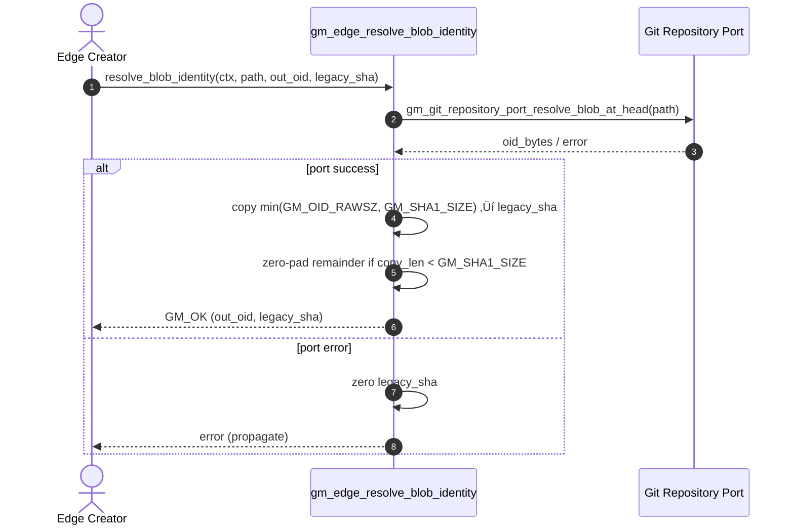

# Code Review Feedback

| Date | Agent | SHA | Branch | PR |
|------|-------|-----|--------|----|
| 2025-09-29 | CodeRabbit (and reviewers) | `5402cadb5e7a3f71e0bee7a1e05a1f5034d4fc3c` | [chore/code-rabbit-cleanup](https://github.com/neuroglyph/git-mind/tree/chore/code-rabbit-cleanup "neuroglyph/git-mind:chore/code-rabbit-cleanup") | [PR#172](https://github.com/neuroglyph/git-mind/pull/172) |

## CODE REVIEW FEEDBACK

### core/include/gitmind/edge/internal/blob_identity.h:23 — coderabbitai[bot]

```text
_⚠️ Potential issue_ | _🟡 Minor_

**Fix legacy buffer padding description.**

The implementation zero-fills the legacy SHA buffer only when `GM_OID_RAWSZ` is *smaller* than `GM_SHA1_SIZE`. The doc currently says “exceeds,” so the guidance is inverted. Please update the phrasing so callers understand when padding happens.

```diff
- * (`legacy_sha`, sized to `GM_SHA1_SIZE`) are populated. When `GM_OID_RAWSZ`
- * exceeds `GM_SHA1_SIZE`, the legacy buffer is zero-padded to maintain
+ * (`legacy_sha`, sized to `GM_SHA1_SIZE`) are populated. When `GM_OID_RAWSZ`
+ * is smaller than `GM_SHA1_SIZE`, the legacy buffer is zero-padded to maintain
```

<!-- suggestion_start -->

<details>
<summary>üìù Committable suggestion</summary>

> ‼️ **IMPORTANT**
> Carefully review the code before committing. Ensure that it accurately replaces the highlighted code, contains no missing lines, and has no issues with indentation. Thoroughly test & benchmark the code to ensure it meets the requirements.

```suggestion
 * On success, both the preferred OID (`out_oid`) and the legacy SHA-1 buffer
 * (`legacy_sha`, sized to `GM_SHA1_SIZE`) are populated. When `GM_OID_RAWSZ`
 * is smaller than `GM_SHA1_SIZE`, the legacy buffer is zero-padded to maintain
 * deterministic contents. Callers must provide non-null pointers.
```

</details>

<!-- suggestion_end -->

<details>
<summary>🤖 Prompt for AI Agents</summary>

```
In core/include/gitmind/edge/internal/blob_identity.h around lines 20 to 23, the
comment incorrectly states that the legacy SHA buffer is zero-padded when
GM_OID_RAWSZ "exceeds" GM_SHA1_SIZE; update the phrasing to say that the legacy
buffer is zero-padded when GM_OID_RAWSZ is smaller than GM_SHA1_SIZE (i.e., when
the preferred OID raw size is less than the legacy SHA-1 size), so callers know
padding happens to fill the remainder of the legacy buffer to GM_SHA1_SIZE;
ensure callers still know to provide non-null pointers.
```

</details>

<!-- fingerprinting:phantom:medusa:sabertoothed -->

<!-- This is an auto-generated comment by CodeRabbit -->
```

_Meta_: https://github.com/neuroglyph/git-mind/pull/172#discussion_r2385101775

{response}

### core/src/util/oid.c:44 — coderabbitai[bot]

```text
_⚠️ Potential issue_ | _🔴 Critical_

**Guard against overflow before sizing the hex buffer**

`required = (len * 2U) + 1U` can overflow `size_t` for large inputs, which lets the length check pass with a wrapped value and we then scribble past `out` while the loop iterates `len` times. Please short-circuit when `len` exceeds the safe range before doing the multiply.


```diff
@@
-    const size_t required = (len * 2U) + 1U;
+    if (len > (SIZE_MAX - 1U) / 2U) {
+        gm_memset_safe(out, out_size, 0, out_size);
+        return GM_ERR_INVALID_ARGUMENT;
+    }
+
+    const size_t required = (len * 2U) + 1U;
```

<!-- suggestion_start -->

<details>
<summary>üìù Committable suggestion</summary>

> ‼️ **IMPORTANT**
> Carefully review the code before committing. Ensure that it accurately replaces the highlighted code, contains no missing lines, and has no issues with indentation. Thoroughly test & benchmark the code to ensure it meets the requirements.

```suggestion
    if (len > (SIZE_MAX - 1U) / 2U) {
        gm_memset_safe(out, out_size, 0, out_size);
        return GM_ERR_INVALID_ARGUMENT;
    }

    const size_t required = (len * 2U) + 1U;
    if (out_size < required) {
        gm_memset_safe(out, out_size, 0, out_size);
        return GM_ERR_BUFFER_TOO_SMALL;
    }

    for (size_t i = 0; i < len; ++i) {
        unsigned byte = bytes[i];
        out[i * 2U] = KHexDigits[(byte >> KNibbleBits) & KNibbleMask];
        out[(i * 2U) + 1U] = KHexDigits[byte & KNibbleMask];
    }
    out[len * 2U] = '\0';
```

</details>

<!-- suggestion_end -->

<details>
<summary>🤖 Prompt for AI Agents</summary>

```
In core/src/util/oid.c around lines 27-38, the computed required = (len * 2U) +
1U can overflow size_t for large len; before performing the multiply, check that
len does not exceed (SIZE_MAX - 1) / 2 (or equivalent safe_max) and if it does,
zero the output buffer via gm_memset_safe and return GM_ERR_BUFFER_TOO_SMALL (or
an appropriate error). After that guard, compute required normally, perform the
existing out_size check and proceed with the hex conversion.
```

</details>

<!-- fingerprinting:phantom:medusa:sabertoothed -->

<!-- This is an auto-generated comment by CodeRabbit -->
```

_Meta_: https://github.com/neuroglyph/git-mind/pull/172#discussion_r2385101784

{response}

### docs/code-reviews/PR172/203f4e3539b1d8fc73b641e94b0a420f2e592a14.md:22 — coderabbitai[bot]

```text
_⚠️ Potential issue_ | _🟠 Major_

**Restore required Table of Contents and title alignment**

Docs under `docs/**` must include a `## Table of Contents` section and keep the front-matter `title` in sync with the H1. This file omits the TOC and the front-matter title (`203f4e3539b1d8fc73b641e94b0a420f2e592a14.md`) does not match the H1 (`Code Review Feedback`). Please add the missing TOC heading and align the title/H1 pair. As per coding guidelines.

<details>
<summary>🤖 Prompt for AI Agents</summary>

```
In docs/code-reviews/PR172/203f4e3539b1d8fc73b641e94b0a420f2e592a14.md lines
1-18, the front-matter title does not match the H1 and the required "## Table of
Contents" section is missing; update the YAML front-matter title to exactly
"Code Review Feedback" to match the H1 and insert a "## Table of Contents"
heading (with any preferred TOC entries or a placeholder) immediately after the
H1 so the document follows the docs/** guidelines.
```

</details>

<!-- fingerprinting:phantom:poseidon:sabertoothed -->

<!-- This is an auto-generated comment by CodeRabbit -->

‚úÖ Addressed in commits fecc9d6 to d11ee83
```

_Meta_: https://github.com/neuroglyph/git-mind/pull/172#discussion_r2385101790

{response}

### .github/workflows/review-artifact-cleanup.yml:48 — coderabbitai[bot]

```text
_⚠️ Potential issue_ | _🔴 Critical_

**Fix checkout to track a branch before pushing**

`actions/checkout` on a `pull_request` event leaves the repo in a detached HEAD at `refs/pull/<id>/merge`. The later `git push` step then fails with “You are not currently on a branch,” so the cleanup commit never lands. Check out the base branch (or push `HEAD` explicitly) before removing files.  


```diff
       - name: Checkout repository
         uses: actions/checkout@v4
         with:
-          fetch-depth: 0
+          fetch-depth: 0
+          ref: ${{ github.event.pull_request.base.ref }}
```

<!-- suggestion_start -->

<details>
<summary>üìù Committable suggestion</summary>

> ‼️ **IMPORTANT**
> Carefully review the code before committing. Ensure that it accurately replaces the highlighted code, contains no missing lines, and has no issues with indentation. Thoroughly test & benchmark the code to ensure it meets the requirements.

```suggestion
       - name: Checkout repository
         uses: actions/checkout@v4
         with:
           fetch-depth: 0
           ref: ${{ github.event.pull_request.base.ref }}
```

</details>

<!-- suggestion_end -->

<details>
<summary>🤖 Prompt for AI Agents</summary>

```
.github/workflows/review-artifact-cleanup.yml lines 18-47: the job checks out
the PR merge ref (detached HEAD) so later git commit/push fails; change the
checkout to track the target branch before making the cleanup commit. Either set
actions/checkout to the pull_request base ref (use ref: ${{
github.event.pull_request.base.ref }} and fetch-depth: 0) or, immediately after
the existing checkout, fetch from origin and create/checkout a local branch that
tracks the PR base branch (so commits are made on a branch and can be pushed);
ensure the branch is tracking origin/<base> before the git commit and git push
steps.
```

</details>

<!-- fingerprinting:phantom:triton:sabertoothed -->

<!-- This is an auto-generated comment by CodeRabbit -->

‚úÖ Addressed in commits fecc9d6 to d11ee83
```

_Meta_: https://github.com/neuroglyph/git-mind/pull/172#discussion_r2385144548

{response}

### docs/code-reviews/PR172/5add14fcdabafff59a99ea484d691140afdb68c3.md:27 — coderabbitai[bot]

```text
_⚠️ Potential issue_ | _🟠 Major_

**Fix doc front matter/title alignment and add required TOC**

`docs/**` files must keep the front-matter `title` identical to the H1 and include a `## Table of Contents` section immediately after the H1. This file’s title still uses the SHA filename and the TOC is missing. Update the title to “Code Review Feedback” and add the TOC block so the doc complies with the repo guidelines.

```diff
 ---
-title: 5add14fcdabafff59a99ea484d691140afdb68c3.md
+title: Code Review Feedback
 description: Preserved review artifacts and rationale.
 audience: [contributors]
 domain: [quality]
 tags: [review]
 status: archive
 ---
 
 # Code Review Feedback
+
+## Table of Contents
+- [Code Review Feedback](#code-review-feedback)
+- [CODE REVIEW FEEDBACK](#code-review-feedback-1)
```

 As per coding guidelines

<!-- suggestion_start -->

<details>
<summary>üìù Committable suggestion</summary>

> ‼️ **IMPORTANT**
> Carefully review the code before committing. Ensure that it accurately replaces the highlighted code, contains no missing lines, and has no issues with indentation. Thoroughly test & benchmark the code to ensure it meets the requirements.

```suggestion
---
title: Code Review Feedback
description: Preserved review artifacts and rationale.
audience: [contributors]
domain: [quality]
tags: [review]
status: archive
---

# Code Review Feedback

## Table of Contents
- [Code Review Feedback](#code-review-feedback)
- [CODE REVIEW FEEDBACK](#code-review-feedback-1)

| Date | Agent | SHA | Branch | PR |
|------|-------|-----|--------|----|
| 2025-09-28 | CodeRabbit (and reviewers) | `5add14fcdabafff59a99ea484d691140afdb68c3` | [chore/code-rabbit-cleanup](https://github.com/neuroglyph/git-mind/tree/chore/code-rabbit-cleanup "neuroglyph/git-mind:chore/code-rabbit-cleanup") | [PR#172](https://github.com/neuroglyph/git-mind/pull/172) |

## CODE REVIEW FEEDBACK
```

</details>

<!-- suggestion_end -->

<details>
<summary>🤖 Prompt for AI Agents</summary>

```
In docs/code-reviews/PR172/5add14fcdabafff59a99ea484d691140afdb68c3.md around
lines 1 to 16, the front-matter title is the SHA and the document is missing a
required Table of Contents; update the YAML front-matter title value to "Code
Review Feedback" so it matches the H1, and immediately after the H1 insert a "##
Table of Contents" section (with the standard TOC entries used across docs/) so
the file complies with repo guidelines.
```

</details>

<!-- fingerprinting:phantom:triton:sabertoothed -->

<!-- This is an auto-generated comment by CodeRabbit -->

‚úÖ Addressed in commits fecc9d6 to d11ee83
```

_Meta_: https://github.com/neuroglyph/git-mind/pull/172#discussion_r2385144568

{response}

### .github/workflows/coderabbit-status.yml:27 — coderabbitai[bot]

```text
_⚠️ Potential issue_ | _🔴 Critical_

**Fix: install Python dependency used by the script (requests).**

The workflow runs a script that imports requests, but there’s no install step. This will fail with ModuleNotFoundError in CI.

Apply this diff to add an install step:

```diff
       - name: Set up Python
         uses: actions/setup-python@v5
         with:
-          python-version: '3.x'
+          python-version: '3.x'
+      - name: Install dependencies
+        run: |
+          python -m pip install --upgrade pip
+          python -m pip install requests
       - name: Check unresolved CodeRabbit threads
         env:
           GITHUB_TOKEN: ${{ secrets.GITHUB_TOKEN }}
         run: |
           python3 tools/review/check_coderabbit_threads.py \
             --owner "${GITHUB_REPOSITORY%%/*}" \
             --repo "${GITHUB_REPOSITORY##*/}" \
             --pr ${{ github.event.number }}
```

<!-- suggestion_start -->

<details>
<summary>üìù Committable suggestion</summary>

> ‼️ **IMPORTANT**
> Carefully review the code before committing. Ensure that it accurately replaces the highlighted code, contains no missing lines, and has no issues with indentation. Thoroughly test & benchmark the code to ensure it meets the requirements.

```suggestion
      - name: Set up Python
        uses: actions/setup-python@v5
        with:
          python-version: '3.x'
      - name: Install dependencies
        run: |
          python -m pip install --upgrade pip
          python -m pip install requests
      - name: Check unresolved CodeRabbit threads
        env:
          GITHUB_TOKEN: ${{ secrets.GITHUB_TOKEN }}
        run: |
          python3 tools/review/check_coderabbit_threads.py \
            --owner "${GITHUB_REPOSITORY%%/*}" \
            --repo "${GITHUB_REPOSITORY##*/}" \
            --pr ${{ github.event.number }}
```

</details>

<!-- suggestion_end -->

<details>
<summary>🤖 Prompt for AI Agents</summary>

```
.github/workflows/coderabbit-status.yml around lines 16 to 23: the CI job sets
up Python but never installs the requests dependency required by the script,
causing ModuleNotFoundError; add a step after "Set up Python" to install the
dependency (e.g., run pip install requests --upgrade or pip3 install requests)
so the script can import requests successfully during the workflow run.
```

</details>

<!-- fingerprinting:phantom:medusa:chinchilla -->

<!-- This is an auto-generated comment by CodeRabbit -->

‚úÖ Addressed in commits fecc9d6 to d11ee83
```

_Meta_: https://github.com/neuroglyph/git-mind/pull/172#discussion_r2385271905

{response}

### docs/code-reviews/PR172/8a32c6a810ebf632709cec6c928381c9c47fdee9.md:20 — coderabbitai[bot]

```text
_⚠️ Potential issue_ | _🟠 Major_

**Align title with H1 and add the required TOC**

Docs under `docs/**` have to mirror the H1 in the front matter `title` and include an explicit `## Table of Contents` immediately after the H1. Please update both so this artifact stays compliant. As per coding guidelines

```diff
 ---
-title: 8a32c6a810ebf632709cec6c928381c9c47fdee9.md
+title: Code Review Feedback
 description: Preserved review artifacts and rationale.
 audience: [contributors]
 domain: [quality]
 tags: [review]
 status: archive
 ---
 
 # Code Review Feedback
+
+## Table of Contents
+- [Code Review Feedback](#code-review-feedback)
+- [CODE REVIEW FEEDBACK](#code-review-feedback-1)
```

<!-- suggestion_start -->

<details>
<summary>üìù Committable suggestion</summary>

> ‼️ **IMPORTANT**
> Carefully review the code before committing. Ensure that it accurately replaces the highlighted code, contains no missing lines, and has no issues with indentation. Thoroughly test & benchmark the code to ensure it meets the requirements.

```suggestion
---
title: Code Review Feedback
description: Preserved review artifacts and rationale.
audience: [contributors]
domain: [quality]
tags: [review]
status: archive
---

# Code Review Feedback

## Table of Contents
- [Code Review Feedback](#code-review-feedback)
- [CODE REVIEW FEEDBACK](#code-review-feedback-1)
```

</details>

<!-- suggestion_end -->

<details>
<summary>🤖 Prompt for AI Agents</summary>

```
In docs/code-reviews/PR172/8a32c6a810ebf632709cec6c928381c9c47fdee9.md lines
2-20, the front-matter title must match the document's H1 and you must insert an
explicit "## Table of Contents" immediately after the H1; update the YAML
front-matter title to exactly match the H1 text and add a "## Table of Contents"
header directly below the H1 (populate with relevant links or placeholders) so
the file conforms to the docs guideline.
```

</details>

<!-- fingerprinting:phantom:triton:sabertoothed -->

<!-- This is an auto-generated comment by CodeRabbit -->

‚úÖ Addressed in commits fecc9d6 to d11ee83
```

_Meta_: https://github.com/neuroglyph/git-mind/pull/172#discussion_r2385271909

{response}

### docs/code-reviews/PR172/82dab217893b6ee8bb8dcdca2217f9900a06b76f.md:23 — coderabbitai[bot]

```text
_⚠️ Potential issue_ | _🟠 Major_

**Doc still violates the title/TOC requirement.**

The YAML `title` must match the H1 and we need a “## Table of Contents” section right after the H1. Please update both to satisfy the repository doc rules.  


```diff
 ---
-title: 82dab217893b6ee8bb8dcdca2217f9900a06b76f.md
+title: Code Review Feedback
 description: Preserved review artifacts and rationale.
 audience: [contributors]
 domain: [quality]
 tags: [review]
 status: archive
 ---
 
 # Code Review Feedback
+
+## Table of Contents
+- [Code Review Feedback](#code-review-feedback)
+- [CODE REVIEW FEEDBACK](#code-review-feedback-1)
```
As per coding guidelines.

<!-- suggestion_start -->

<details>
<summary>üìù Committable suggestion</summary>

> ‼️ **IMPORTANT**
> Carefully review the code before committing. Ensure that it accurately replaces the highlighted code, contains no missing lines, and has no issues with indentation. Thoroughly test & benchmark the code to ensure it meets the requirements.

```suggestion
---
title: Code Review Feedback
 description: Preserved review artifacts and rationale.
 audience: [contributors]
 domain: [quality]
 tags: [review]
 status: archive
---

 # Code Review Feedback

## Table of Contents
- [Code Review Feedback](#code-review-feedback)
- [CODE REVIEW FEEDBACK](#code-review-feedback-1)

| Date | Agent | SHA | Branch | PR |
|------|-------|-----|--------|----|
| 2025-09-28 | CodeRabbit (and reviewers) | `82dab217893b6ee8bb8dcdca2217f9900a06b76f` | [chore/code-rabbit-cleanup](https://github.com/neuroglyph/git-mind/tree/chore/code-rabbit-cleanup "neuroglyph/git-mind:chore/code-rabbit-cleanup") | [PR#172](https://github.com/neuroglyph/git-mind/pull/172) |

## CODE REVIEW FEEDBACK

### core/include/gitmind/edge/internal/blob_identity.h:23 — coderabbitai[bot]

```

</details>

<!-- suggestion_end -->

<details>
<summary>🤖 Prompt for AI Agents</summary>

```
In docs/code-reviews/PR172/82dab217893b6ee8bb8dcdca2217f9900a06b76f.md around
lines 1 to 23, the YAML front-matter title does not match the H1 and the
document is missing a “## Table of Contents” section immediately after the H1;
update the YAML title to exactly match the H1 text, add a “## Table of Contents”
heading right after the H1 (with any required TOC entries or a placeholder), and
ensure the TOC appears directly below the H1 to conform to repository doc rules.
```

</details>

<!-- fingerprinting:phantom:triton:sabertoothed -->

<!-- This is an auto-generated comment by CodeRabbit -->

‚úÖ Addressed in commits fecc9d6 to d11ee83
```

_Meta_: https://github.com/neuroglyph/git-mind/pull/172#discussion_r2385399829

{response}

### docs/code-reviews/PR172/b22c22398de39c4ab93e1c747b1122d2241eed22.md:16 — coderabbitai[bot]

```text
_⚠️ Potential issue_ | _🟠 Major_

**Restore required TOC and align title with H1.**

Docs under `docs/**` must keep the front-matter `title` identical to the H1 and include a `## Table of Contents` immediately after the H1. This file still uses the SHA for `title` and omits the TOC, so it violates the documented style requirements. Please update the title to match the H1 and add the missing TOC block. As per coding guidelines.

Apply this diff to fix both issues:

```diff
---
-title: b22c22398de39c4ab93e1c747b1122d2241eed22.md
+title: Code Review Feedback
 description: Preserved review artifacts and rationale.
 audience: [contributors]
 domain: [quality]
 tags: [review]
 status: archive
 ---
 
 # Code Review Feedback
+
+## Table of Contents
+- [Code Review Feedback](#code-review-feedback)
+- [CODE REVIEW FEEDBACK](#code-review-feedback-1)
```

<!-- suggestion_start -->

<details>
<summary>üìù Committable suggestion</summary>

> ‼️ **IMPORTANT**
> Carefully review the code before committing. Ensure that it accurately replaces the highlighted code, contains no missing lines, and has no issues with indentation. Thoroughly test & benchmark the code to ensure it meets the requirements.

```suggestion
---
title: Code Review Feedback
description: Preserved review artifacts and rationale.
audience: [contributors]
domain: [quality]
tags: [review]
status: archive
---

# Code Review Feedback

## Table of Contents
- [Code Review Feedback](#code-review-feedback)
- [CODE REVIEW FEEDBACK](#code-review-feedback-1)

| Date | Agent | SHA | Branch | PR |
|------|-------|-----|--------|----|
| 2025-09-28 | CodeRabbit (and reviewers) | `b22c22398de39c4ab93e1c747b1122d2241eed22` | [chore/code-rabbit-cleanup](https://github.com/neuroglyph/git-mind/tree/chore/code-rabbit-cleanup "neuroglyph/git-mind:chore/code-rabbit-cleanup") | [PR#172](https://github.com/neuroglyph/git-mind/pull/172) |

## CODE REVIEW FEEDBACK
```

</details>

<!-- suggestion_end -->

<details>
<summary>🤖 Prompt for AI Agents</summary>

```
In docs/code-reviews/PR172/b22c22398de39c4ab93e1c747b1122d2241eed22.md around
lines 2 to 16, the front-matter title is set to the SHA and the document is
missing a "## Table of Contents" immediately after the H1; update the YAML
front-matter title to exactly match the file's H1 text and insert a "## Table of
Contents" block directly after the H1 heading so the front-matter title and H1
are identical and the TOC appears in the required location.
```

</details>

<!-- fingerprinting:phantom:triton:sabertoothed -->

<!-- This is an auto-generated comment by CodeRabbit -->

‚úÖ Addressed in commits fecc9d6 to d11ee83
```

_Meta_: https://github.com/neuroglyph/git-mind/pull/172#discussion_r2385399838

{response}

### docs/code-reviews/PR172/7b7b5f565ef23d959b126b0df50e0a3992c52da2.md:24 — coderabbitai[bot]

```text
_⚠️ Potential issue_ | _🟠 Major_

**Doc front matter + headings violate required structure.** The doc rules demand the front‑matter `title` match the H1, and a `## Table of Contents` section is mandatory. Here, the title is the SHA string while the H1 is “Code Review Feedback”, and there’s no TOC. Please align the title with the H1 and add the TOC before the remaining sections.  As per coding guidelines

```diff
-title: 7b7b5f565ef23d959b126b0df50e0a3992c52da2.md
+title: Code Review Feedback
@@
-# Code Review Feedback
+# Code Review Feedback
+
+## Table of Contents
+
+- [Code Review Feedback](#code-review-feedback)
+- [CODE REVIEW FEEDBACK](#code-review-feedback-1)
+- [General comment — coderabbitai\[\bot\]](#general-comment--coderabbitai-bot)
```

<!-- suggestion_start -->

<details>
<summary>üìù Committable suggestion</summary>

> ‼️ **IMPORTANT**
> Carefully review the code before committing. Ensure that it accurately replaces the highlighted code, contains no missing lines, and has no issues with indentation. Thoroughly test & benchmark the code to ensure it meets the requirements.

```suggestion
---
title: Code Review Feedback
description: Preserved review artifacts and rationale.
audience: [contributors]
domain: [quality]
tags: [review]
status: archive
---

# Code Review Feedback

## Table of Contents

- [Code Review Feedback](#code-review-feedback)
- [CODE REVIEW FEEDBACK](#code-review-feedback-1)
- [General comment — coderabbitai[bot]](#general-comment--coderabbitai-bot)

| Date | Agent | SHA | Branch | PR |
|------|-------|-----|--------|----|
| 2025-09-28 | CodeRabbit (and reviewers) | `7b7b5f565ef23d959b126b0df50e0a3992c52da2` | [chore/code-rabbit-cleanup](https://github.com/neuroglyph/git-mind/tree/chore/code-rabbit-cleanup "neuroglyph/git-mind:chore/code-rabbit-cleanup") | [PR#172](https://github.com/neuroglyph/git-mind/pull/172) |

## CODE REVIEW FEEDBACK

### General comment — coderabbitai[bot]

```

</details>

<!-- suggestion_end -->

<details>
<summary>🤖 Prompt for AI Agents</summary>

```
In docs/code-reviews/PR172/7b7b5f565ef23d959b126b0df50e0a3992c52da2.md lines
1-24, the front-matter title does not match the H1 and the required "## Table of
Contents" section is missing; update the YAML front-matter title to exactly
match the H1 "Code Review Feedback" (remove the SHA string), and insert a "##
Table of Contents" header immediately after the H1 with appropriate links (e.g.,
to CODE REVIEW FEEDBACK and any subsections) so the document follows the
required structure.
```

</details>

<!-- fingerprinting:phantom:triton:sabertoothed -->

<!-- This is an auto-generated comment by CodeRabbit -->
```

_Meta_: https://github.com/neuroglyph/git-mind/pull/172#discussion_r2386258061

{response}

### docs/code-reviews/PR172/d11ee830d5615e5582114d625a52283760d61767.md:11 — coderabbitai[bot]

```text
_⚠️ Potential issue_ | _🟠 Major_

**Restore doc title alignment and required TOC section.**

Front matter `title` still uses the SHA instead of matching the H1 (`Code Review Feedback`), and the mandatory `## Table of Contents` block after the H1 is missing. Both violate the docs/ guidelines. Please align the title and add the TOC.   As per coding guidelines

```diff
 ---
-title: d11ee830d5615e5582114d625a52283760d61767.md
+title: Code Review Feedback
 description: Preserved review artifacts and rationale.
 audience: [contributors]
 domain: [quality]
 tags: [review]
 status: archive
 ---
 
 # Code Review Feedback
+
+## Table of Contents
+- [Code Review Feedback](#code-review-feedback)
+- [CODE REVIEW FEEDBACK](#code-review-feedback-1)
```

<!-- suggestion_start -->

<details>
<summary>üìù Committable suggestion</summary>

> ‼️ **IMPORTANT**
> Carefully review the code before committing. Ensure that it accurately replaces the highlighted code, contains no missing lines, and has no issues with indentation. Thoroughly test & benchmark the code to ensure it meets the requirements.

```suggestion
---
title: Code Review Feedback
description: Preserved review artifacts and rationale.
audience: [contributors]
domain: [quality]
tags: [review]
status: archive
---

# Code Review Feedback

## Table of Contents
- [Code Review Feedback](#code-review-feedback)
- [CODE REVIEW FEEDBACK](#code-review-feedback-1)
```

</details>

<!-- suggestion_end -->

<details>
<summary>🤖 Prompt for AI Agents</summary>

```
In docs/code-reviews/PR172/d11ee830d5615e5582114d625a52283760d61767.md around
lines 2 to 11, the front-matter title still contains the commit SHA and the
mandatory "## Table of Contents" section is missing; update the front-matter
title to "Code Review Feedback" to match the H1 and add a "## Table of Contents"
heading immediately after the H1 (populate entries if required by guidelines) so
the file conforms to the docs/ guidelines.
```

</details>

<!-- fingerprinting:phantom:triton:sabertoothed -->

<!-- This is an auto-generated comment by CodeRabbit -->
```

_Meta_: https://github.com/neuroglyph/git-mind/pull/172#discussion_r2386258065

{response}

### General comment — coderabbitai[bot]

```text
<!-- This is an auto-generated comment: summarize by coderabbit.ai -->
<!-- walkthrough_start -->

## Walkthrough
Adds OID hex utilities and a blob-identity resolver, integrates them into edge/cache/query paths, hardens path parsing and test fakes, adds new sources to the build, updates worksheet/CI tooling and many review-doc artifacts; exposes two OID hex APIs and one blob-identity helper.

## Changes
| Cohort / File(s) | Summary |
|---|---|
| **OID hex utilities (new API)**<br>`core/include/gitmind/util/oid.h`, `core/src/util/oid.c` | Add `gm_bytes_to_hex` and `gm_oid_to_hex` declarations/implementations with input validation, buffer-size checks, safe zeroing, and NUL termination. |
| **Adopt OID hex helpers**<br>`core/src/app/cache/cache_rebuild_service.c`, `core/src/cache/query.c` | Replace direct git2 oid-to-hex formatting with `gm_oid_to_hex` / `gm_bytes_to_hex`; add buffer initialization and error handling; include new util header. |
| **Blob identity resolver (new helper) + integration**<br>`core/include/gitmind/edge/internal/blob_identity.h`, `core/src/edge/internal/blob_identity.c`, `core/src/edge/edge.c`, `core/src/edge/attributed.c` | Add `gm_edge_resolve_blob_identity`; centralize port-backed blob resolution producing `out_oid` and legacy SHA buffer (zero-padded), replace prior in-file resolve logic and propagate port errors. |
| **Filesystem path utils hardening**<br>`core/src/fs/path_utils.c` | Add dynamic `max_segments` param, update callers, and guard segment emission against output-buffer overruns with explicit path-too-long reporting. |
| **Fake git repo port safety**<br>`core/tests/fakes/git/fake_git_repository_port.c` | Check `gm_strcpy_safe` return values; clear destinations and return `GM_ERR_BUFFER_TOO_SMALL` when copies exceed buffers. |
| **Cache header comment move**<br>`core/include/gitmind/cache.h` | Relocated a struct-tail comment; no layout/type/API changes. |
| **Build configuration**<br>`meson.build` | Add `core/src/edge/internal/blob_identity.c` and `core/src/util/oid.c` to the build sources. |
| **Worksheet checker tweak**<br>`tools/review/check_worksheets.py` | Treat deleted worksheet files as acceptable by returning an empty problems list on FileNotFoundError. |
| **Coderabbit status tooling**<br>`tools/review/check_coderabbit_threads.py`, `.github/workflows/coderabbit-status.yml` | Add script to detect unresolved CodeRabbit review threads via GitHub GraphQL and a workflow to run it on PR events. |
| **Review artifact cleanup workflow**<br>`.github/workflows/review-artifact-cleanup.yml` | New workflow to remove per-PR review-doc artifacts on merged PRs and commit the cleanup if changes exist. |
| **Docs & review artifacts**<br>`docs/code-reviews/*`, `docs/code-reviews/PR172/*`, `AGENTS.md` | Remove multiple archived/rejected review docs, add PR172 artifacts, and append a 2025-09-28 AGENTS.md entry. |
| **Misc CI workflow metadata**<br>`.github/workflows/auto-seed-review.yml` | Update commit author metadata and seed commit messages in workflow steps. |

## Sequence Diagram(s)


## Estimated code review effort
🎯 4 (Complex) | ⏱️ ~50 minutes

## Possibly related PRs
- neuroglyph/git-mind#165 — Continues the OID-first migration and touches related edge/cache OID handling and helpers referenced by this change.  
- neuroglyph/git-mind#169 — Overlaps OID/hex handling and edge/ref construction refactors that this PR integrates or replaces.  
- neuroglyph/git-mind#171 — Related to repository-port and blob-resolution changes; likely shares design and port calls with the new resolver.

## Poem
> I nibble bytes and spin them hex,  
> I hop through blobs and mend the specs,  
> I guard the paths and tidy docs,  
> I patch the tests and hush the clocks,  
> A rabbit’s hop, a tiny fix—🐇✨

<!-- walkthrough_end -->


<!-- pre_merge_checks_walkthrough_start -->

## Pre-merge checks and finishing touches
<details>
<summary>‚ùå Failed checks (3 warnings)</summary>

|     Check name     | Status     | Explanation                                                                                                                                                                                                                                                                                                                                                                                                    | Resolution                                                                                                                                                                                                                                                                                                                                                                                                                           |
| :----------------: | :--------- | :------------------------------------------------------------------------------------------------------------------------------------------------------------------------------------------------------------------------------------------------------------------------------------------------------------------------------------------------------------------------------------------------------------- | :----------------------------------------------------------------------------------------------------------------------------------------------------------------------------------------------------------------------------------------------------------------------------------------------------------------------------------------------------------------------------------------------------------------------------------- |
|     Title Check    | ⚠️ Warning | The title “chore/code rabbit cleanup” is too vague and does not convey the primary objectives of the pull request, which include substantial refactoring across blob identity resolution, OID utilities, filesystem path handling, testing ports, and CI workflows. It fails to summarize the main architectural changes or key new public APIs and instead uses generic “chore” language that obscures scope. | Rewrite the title to clearly reflect the primary architectural changes, for example “refactor: add repository port blob identity resolver and OID hex utilities”. Make sure it concisely conveys the high-level scope of the refactor rather than generic chores. Use imperative, title-case phrasing that highlights the main change.                                                                                               |
|  Description Check | ⚠️ Warning | The pull request description does not follow the repository’s required template and instead lists individual commits without providing the structured Summary, Change Areas, Risk, or Code Review Guidance sections. As a result, reviewers cannot quickly understand the high-level purpose, affected areas, risk level, or guidance as expected by the template.                                             | Restructure the description to follow the required template by adding a “## Summary” section that briefly explains the motivation and key changes. Then mark the affected areas under “## Change Areas” with the relevant checkboxes and specify the level of risk under “## Risk”. Finally, include a “## Code Review Guidance” section with top risks, proposed fix-it blocks, and pattern references as outlined in the template. |
| Docstring Coverage | ⚠️ Warning | Docstring coverage is 0.00% which is insufficient. The required threshold is 80.00%.                                                                                                                                                                                                                                                                                                                           | You can run `@coderabbitai generate docstrings` to improve docstring coverage.                                                                                                                                                                                                                                                                                                                                                       |

</details>

<!-- pre_merge_checks_walkthrough_end -->

<!-- finishing_touch_checkbox_start -->

<details>
<summary>‚ú® Finishing touches</summary>

- [ ] <!-- {"checkboxId": "7962f53c-55bc-4827-bfbf-6a18da830691"} --> üìù Generate Docstrings
<details>
<summary>üß™ Generate unit tests</summary>

- [ ] <!-- {"checkboxId": "f47ac10b-58cc-4372-a567-0e02b2c3d479", "radioGroupId": "utg-output-choice-group-unknown_comment_id"} -->   Create PR with unit tests
- [ ] <!-- {"checkboxId": "07f1e7d6-8a8e-4e23-9900-8731c2c87f58", "radioGroupId": "utg-output-choice-group-unknown_comment_id"} -->   Post copyable unit tests in a comment
- [ ] <!-- {"checkboxId": "6ba7b810-9dad-11d1-80b4-00c04fd430c8", "radioGroupId": "utg-output-choice-group-unknown_comment_id"} -->   Commit unit tests in branch `chore/code-rabbit-cleanup`

</details>

</details>

<!-- finishing_touch_checkbox_end -->

<!-- tips_start -->

---

Thanks for using CodeRabbit! It's free for OSS, and your support helps us grow. If you like it, consider giving us a shout-out.

<details>
<summary>❤️ Share</summary>

- [X](https://twitter.com/intent/tweet?text=I%20just%20used%20%40coderabbitai%20for%20my%20code%20review%2C%20and%20it%27s%20fantastic%21%20It%27s%20free%20for%20OSS%20and%20offers%20a%20free%20trial%20for%20the%20proprietary%20code.%20Check%20it%20out%3A&url=https%3A//coderabbit.ai)
- [Mastodon](https://mastodon.social/share?text=I%20just%20used%20%40coderabbitai%20for%20my%20code%20review%2C%20and%20it%27s%20fantastic%21%20It%27s%20free%20for%20OSS%20and%20offers%20a%20free%20trial%20for%20the%20proprietary%20code.%20Check%20it%20out%3A%20https%3A%2F%2Fcoderabbit.ai)
- [Reddit](https://www.reddit.com/submit?title=Great%20tool%20for%20code%20review%20-%20CodeRabbit&text=I%20just%20used%20CodeRabbit%20for%20my%20code%20review%2C%20and%20it%27s%20fantastic%21%20It%27s%20free%20for%20OSS%20and%20offers%20a%20free%20trial%20for%20proprietary%20code.%20Check%20it%20out%3A%20https%3A//coderabbit.ai)
- [LinkedIn](https://www.linkedin.com/sharing/share-offsite/?url=https%3A%2F%2Fcoderabbit.ai&mini=true&title=Great%20tool%20for%20code%20review%20-%20CodeRabbit&summary=I%20just%20used%20CodeRabbit%20for%20my%20code%20review%2C%20and%20it%27s%20fantastic%21%20It%27s%20free%20for%20OSS%20and%20offers%20a%20free%20trial%20for%20proprietary%20code)

</details>

<sub>Comment `@coderabbitai help` to get the list of available commands and usage tips.</sub>

<!-- tips_end -->

<!-- internal state start -->


<!-- DwQgtGAEAqAWCWBnSTIEMB26CuAXA9mAOYCmGJATmriQCaQDG+Ats2bgFyQAOFk+AIwBWJBrngA3EsgEBPRvlqU0AgfFwA6NPEgQAfACgjoCEYDEZyAAUASpETZWaCrI5Gr2ADafIFEgEdsaVxIMwBGAHYAJi4AIgZYfD8AeiYlXxU1EIZPEkxsbljIOUgAM09ZeAwiCkF8XGQACnxuMgBKSEAUAkhYXFxuRA5k5KJ1WGwBDSZmZPJsWqIK7lgR9TBmKtpk7i9PZMiojUgAZXx5hhJiqgwErgSkklTFEjAqVTWcvIwCyEAkwkhcM5SJxIMxtBgjgBhPzUOjoEJRAAMUQArGBEQBOMBRAAc0EROI4AGYMRwUQAWABaGiMABFpAwKPBuOJ8FhGqU0GJEGA2RU2m4oAB1eBKV6YUbVXwkTliJLoDD0T75bjoRn4RDIUa4AA0PCSuoUfj1DC5sBIJs88D1tHwDEQepoiAaesw9EhAEkaVAPRhcLVaNgLsg0JAiMwAPraiN+bga9RJWQRuMUEIqZ1UMTwNkK+gbGqw5DfNi1bDIPyIOMYRDwNRW8TSMq1ZiQXJELnyMQADzAemjLRDirD6hjJDjAPwAPNkHIAHd9am9VUcthaFUiG5ILpIABxdTFTyCFBKP3qeQV/CePDZjB6uPOsDTDYhRL4ADWeqEZwoGDQPlnTI0BQrrYOG7A9Pg74OqClCkJASg0FmOaNE+I7cM47ARkw2B+m0JosM+kCzn+H5XJgCQoBgpT4PhrD7oyeSsreuaQF+8y/v+gGUOgAgZlyTE0luUD0th3BWlKpoJJcbqQHQcGlM2ra1tqUSQAA8h6tJlDhSHVixfiygQTISQR+7+iQlw1gAXpcpqeAwXjUDeLGobgYBoMRfgHkeF5XkxE5TpcKaaAYUAAKIYLA5GNrg06cm+lzaguITUXwTriFKMloLQtAht5AjwUg97ca+b76dIrRiGU8p2Z4AhcmVzotPY8BEBxiDepAABi8Bdo2MlRRQJ7rowUXVNIXBENgzjugAMmpkIANLHBGVhhTYEYALLHCxkLzUtK1rRtxxhZC6Cao4LI3tBypYJJ05sICrb4NlI2pQCFA6bC9ACNcFG/mw0H1Z40XDrgEZWgIKkRlU6jJIg4y4Las5YDmnLwFeFZ6lNM2MIeDBlVQNCukOt2yRQtR8GNtC5HwAgkFFEjZhQnUeswYkkGwfrIJDKmMH+PgGfxSTIAQkBlpcggiFVmmDvQ6jKOIUgfRZH1oFIFCIH+ADceNfMgpQY9IsjOpz4viPW8D9UOno8LGnUAII5cgWulJcGBsmAnIPqlnn0AZlBkBc4vcLQhYsc6bozfANnlmO8ZGfI+Ao5QCPMpaXwFCT9AaVp171vI6b+vxN6dQAco4lBnMg9wVuVTMkLOYCIBZa4mXRLrwXald+k5OYFGHTqQI0Ds7mFZfQMcGjMLQeqzkkb4IxZDR4Sx6UhrQQhlrgXMNDSoW9sY4BQGQ9D4KUOAEMQZCK3CT7sFwvD8MIohK42JRpMo7yaNouiHyYUA4CoFQJgS+hBSDkCJnfAiD8MjzgcE4FwxROzPDeFkLQOh9BGAMAAowo9x6T2nrQNwsRSEGAsJAB2Hpr6QO+vYRwYIkHn1GhKaQRg4CXDXKUC+2VcroHgnQpEqJ0RYlxLJP0SCxb4InlPGe8EGRMjUFKOcLFqLeGTmAH488KBlS5LUTUyVxZa1IHqQ2uREAmxoC2OMVoEbZ3sGgN2YBzSeFaJrO8V5kC2wHuHGSLcNZ/m0rgeYLxtFlQVswDqMBpy8OgX6cCCRWE1zZP6S8ZRDzzhkpQSmPQ3TiSIPQigspLhVBnM4ImkhLipRbI0EgGgiAaE/N+DihifFOlMWgH2SQ/YOLdjjIa0Eso3GCEgqSBNEAdBksuK8ShkDMC8OIDmaomIqFyNVdRTcChNBIF2YuWYpQIwwvQFxbjoKxhBgwEaa4/BVV5uoVSZY0AmOlMwfATMpRKAEKBO2VRO4yTCUvEg2RzTjLaEcD0aZPCIEnLaByu88pMFPN8PuWBZzmi8gIQ8Ahkj4FFD0EgrjU4uTNJcPwXyMZbECJQc8Mphaa3QF5X5AYgx0COGpAJ3glwhCZYoFlyAEBEFgGAXIUgfAtEVjeQJiTxpyx4CDDAGARoeyHrOMYZxIVARGpgeQOzRB4FWbZZ4PBqCwGQKU2KqAuGlH3uYSwDtPBARRaLScsVOGiBBhUtkyBmE7OCnCeUOxMXwAYOI8QDZEBGCgGXNkbrEI0FoEcaNLU2rUBCdBX5lBinQQDRMK0IbB6hgzEGYJddZyB3QDlf1fBXlcKtvLLAFrkBWv3mFZ08AwTxoUOkPwDd5wylSiCWaycDCkNiJG0wBgmApGmauR42oNiKlSCSjQsASFkIoVQmht96AIMYUnC+0rSARoMJtWGYJPB6g9hgL2OkVk+Hvn6aU+MUVETGKU8MWESURkemgCMIJXVlCtp4PhfgwSlPNdOLWbB+BDW4jJXAshWhNDYj+P8f7mQRlxbQCMSjHTmjul+xZmHRRguiW6xkzJ/LKsuIAHAInZKHoNQew/pi0Am0D4MWvBpCUGVg7AAQh6VsaBZDqo0IAXAIiKdNBG8uECkWCBVYs0tDRGsM4dKeJS4YsAP3RIOh7gxH6Aad1h7ZZ00fCGwJWfNKiHbJjSPfwBgDlgIsX44JkGIm8AvPBMgLjLcKBSATdg8hdqHUSq9QFADSgcjOCdfwC+vqDRVp4Lm4Nob1BW2PVARoJnD0xUnIGvNyQEupjhFFj1Tq2hGFbeIDt0Du0kF7bJbhBouBDtnCOshB8wBGCnY8GdShVg702EV2gpBkgZtQ3sTFggYYnjDbIFda6x0buoRA7d9DEH7pYTKyNlDnb8JUWdB2VhBOlN6+Nm4My53qAXVsOSfX4mTeSNNgQs32BnhXQFXyysAMvePO9hD1U+ChlGFILAZigomvQO2KozoFOxgTomfF2UjgcO0jcfyH77ujmhZ4KQOGsVvdPID9VOwGjFHqLAfhXG3YUzhLnYe6qDOTKHKGNsHYTgAAkHZgDCMUbA3DuKNHZwwJMhzV42VqGAdCOURoAZF/IL5gu+BorILuTaEZc4RhsA7IUxxKSyS7BcOgyAdwa+ONzsIEZjgekpGFAKYHe6lIQpQBdSBxAhsRTQbmqO4q3ucn4QI8A65XrAN8bw+oJsG3lKTvAZygXsTyh+isCyIwSFU4aKZg5lV0NVbFdXEYy5qVpB6Y4kIHY2FpOCkIvmeONjOuJN8TyqnykhAAajbwodmTk6wfaCxYELjqmLOoU2VmLw+4uG79VZ5LQaQ0A4y7t+jcIVEFdS6Uf3OYawppLSQLgBghJhkjCnh1aeM9H4jNj77umXtE/m40D9XudngxCAAKm7PhaswLnCQFf+hWK2MkY5+r+TOWGeo2AvyOIf6v+CuEY4u2sB+24Q6poTEdwDwF2K4A286w292F2QEHEz2hOooAOC2sAiBwoYw8I/otYeAE0BeReJeZeFeWkOYAGfgJaDaNmtqZgVWbatWSoRqPaVsfazWqYXAnOrUZBo6463Wk66B/W12Q2i6+cOKooi2HWy2dqq2N8UCO6DCzgW2uWx69GeUh2yOSgfA52Chg2t2yQKhWGn2sUTGSghs5Aos88s+ealCJ20elhbIGsGUBSSiBhAiT0Ys5oXY2Uog7agSGY64gwoUF+cgTof6+AEYERaBGAAReUyR0kFMwmAUbOyclApoLc+KXYzGxkBSeeVOseIQSutOkAEgf4ooL6WSFMNUzwTQZumui0eoPR60G0HoZcAAag7LNJpBGBXjuAAKqbQEL9Ea6DERh8YzFdRdTrQRjQBqRqTW6bTjGzRgqJEfoZ5pEZEKBZGUDk4g5AGijQFSyvwBTqD8o7JRGXLnqVFvRJAtg1EtQbAer8B4Bk4XF8S/KyrZKdGzI0i+iYGNiRyKi4z9K5R6jt6d7P6UB3QsD/61gYxnj2Kwo9yAj+TvToRUCPREoyTsHsRNF/hBBRJhRdjFSizmhlFj6ep6Riy1REpMyhgAYqLmhREsz96D5hYckurThsmxY+qMmJYz5r7z7E6L6JGbRAqJCMaVrEKQAAAGvySRsgKRBA6ROyKEXqIQEBfoUBb+uR0E1kumIQuQzEiSfAIBeAeotp9xeAcBMcJAbQWplEgGayWpVhl2s6Nhw29hahsAWpypqpigFaDGXAOpj6JxdxhpERJpX+F+wBYBLCzp6qbp3pHp4Mtpvp/pEO2pwZsJYZyhFsqhCaUZvBNWdCn80ojW/aLWkAKpa4jgGhMhPW6BiAFADAyQaA3A3AS6UkE55oo45KwGcBPGwadSDAS2wWlC2htCnau6IRzCRhu2NgY4FyjY1yjxjycEzCKkAA5FqCOKpqUMwLgINgZqkRmK+vnimdhmmTskDhcQESNLnCPhEf6cCE+TTr1EcCYb4IINvOUfzsrpROli0VZG0UOBCVTHkuuFwPABfO+akUaRUejFCneAZL1CgC7ECgFJzCyIXEOBvhjgHgnj+B1McUCiBcRRUR7Jkuoigf1DBQ0dxL8aAs/lQLmfxNxO9OHp4GAEBAushfQBLFqLcR+WcTsrrGjOxiElynrM4MyUFGxeVBwUxVAKcXhSgOzLkLvC+kYU2PJkoOzoEQFJeckpcZrM5GLLZSQO2PZWLDhZ+V2HqKBm8lcsHo8f2KmRqP6EYs3qzBIrysGPIq0IqEHEnA2tOBNi0lhubLiYDgKRYcPNgTWRjHWSukcdghuqFuySPpFu6uPtdJPsVp2jmnPmluGrtiqbFHGbEpqVeiQDGe1Tuq1L+LviHIPHQFwN1YkSMc4PAAatKADKNTODGo2TEZ2i2UIY3E1gOuIZIb2V1v2SkIOcOTpskFSi4FMCuStluroRtnupPruYkfua8gFsxk5CGsnh5LhYBe2hzBZf5JSQeVyHCM8ZFXBL8R+taR9V+WdgLC1E6J1PuWEnCMBYcsmHpd5TobCDBaBX1MgGWCNGDfqdIBDRUbDjQNlJPqFfQNUtQIEa6LLlKLUF8nDlUMCc0VaIPDeHqHxXwLaaNKIIvPYr6nmmZK7lUC+vTIzMzNFc9NlGpjvKORGHJpGDpv5f9RcPQABlxkzNXDBYihrDWDmKDZGODb5SxJ1QqOTDkmMoTAxYqlKAMTYBtKsesZsdsbsccPsbNLNPwODupX4NFakoGGrebbwulmyIEgod+flVsBGfWcZvliliGsdoJlZS7mIKyokU7FvKbP7ASnQgIGcAiaMiCovCxBJVJSLYNc5NTPkv6QBhbg7HbDKCRQNF+branM5P/qajaqufakPrVVphKdVRVXVTKSVnKQnc1UqVGotQYNVstXVqSg1sIRtR2V2fAD2dIbtXIftUOSNmNtTYorQQmsub2RdWtldVuUwgenZmwvdaraVsFVVH9sQcTjSrjteDmDyfws+j4JHB7ujrpK+VTqGLVIUTOOtfKfioSnwFjqNrptfgTjNi/fNkBZGNjgfTQfGlhDCMTOVI9XCBrUIdrX/algg7fsg2eKZd9ewCir7qgFZQBmlYEr5B/VgJ3cRPIGLBLAppAycpQJ1DMaHHQhHbYiEGLLwmDLYbgUw1NkQXNh9sA0OAFT9tOBxbyLxJeECpcOiZNvFafEld7WDFEEVbAAI0IytQLL4dKLju8gUtCucNJEOICBQMCPlP9oqXlhflftIJePjuQ/I4Du+mg3AxGBg18lgwxLCCrWJFyCNGQ3IyQfzN4IZWRoUqWIqCNIeKMCGu9PdowDg/RY7t6q6hQKqmUTpDfbPOdMQdZS2O5Z5SNBQ4Diw/5APe7OtXw0KdglAL3aKZVYPdFsPdKdPjBp4algvrfdPeQEtfwV2ovW2aISCGvRvZ1hALIedgdXvY8PdmdafVoZdXQpfYYTfZlpAA9TJvWvgbEUSaQz43jjfgk6/SxEDaeZcDUUE5fiE5EzQI7BqZRLCZHTdjgXA3gRiX+IQUgwE6QXDffUqJYxFtOJeDnTYw85C4k78SorA6QDjr46i69k0/IO9PnfnvY0OY4+rUCORc/VC9Y5eKwyk1i7pt8+7MnPInZY2PXbS35K5ZOIyzi/c4g/izSyTXkGfBfFUF7EbM9Nk51GjhWCEMwgBnk9885OUKy6Bt5gplBhaP8zMlqi44SbzeMixHk7DOIIhbQ8KZQuVbFm0/IoM1KfFqPQ1XwJAxM8etGtM7PXwc2YIUvete2WIZ2XQOvcwDtWs3tY8Js9I49gQf4yQbs9IWfejZufoVfdtkengvtqGCorRYA3y/E2i082dgObvTG1c7I0W/NlML7lUpvlgKza0UPMzXHsPB/sagAYCeDDmbAeLnqGQA4HXABklAjjWInIYiAs0RjAairSizpW40xjlU0dNRftGKOwmC4MmAaPy344TtQEadlPYnUfOyfvZQzllK2B5Rzpy1zdXl3mTo2EwNwEmA6edFq+erTJPj0VrjrnrgbjJD0fXVbjbnbq6H0JReTpyS0PIL21FLUwprnEe1gFzVJZBM3B+xbSLBnNpZe+2KLnAXB39QZebaheCgetBxDGrqgOYsyaAoB5btbrbmFJpZLvgDFNOBq5sNxMwrB2gEcPucRw4I5tIN6piWZUCqXJADCVduWFBXDqhbkoqDXe9FUI24xga/CuAb+FOyDJikFAaPYsFNYwsoMihdWGmrhx2AR6GFMrG4ElzSGF5FOjcrgBUC1DZIxkOKx2AGa9NVaB50RPhuA8GFrKdVa708PXa5KRPsM7KaM26x46c11PW/GfNVqcntIKnunqmV4yE4W0KyQQ/krSks/tAe/rgH5SCd/s6Z3YAU+W/qAaKOAZAWV7x6WaUuWUGaW8OeW2C5WwV6/VMNGcFjwd602StX6ws5tZABIYKuGxOhs7vaUIgNsCahGPnB1CfUm/s+fYc2m8c0krtgyd7gxgpjI8aprLpi3GBNzAA/5NvoNSEsgvGVquA/OGCF2POTd+TqSWgOScDkOG0oDeTq82qFOm3IsAtqk3m1Rqy2QKlHFXyetR919/CkpIRF/QBij9d2j0CIa6rlgPU05FKOEXkldx5bvEuF/qK5PrjST9OJrdmGWJ2Q7AABqrQOzQCc7W5hRm4EI7SIrwkhRQCCMjWMYR6gNjueMOBjludI/vdoCfc4/sDICs1BBHDHCVRYXBoCyyB1fLfJhrcewUDnqFlZM68+AcX3u0FzKK+o8q/wfy52ixEU8O/lIFE80yToSaiNhmT5baXk/fcpPL6MYU44RhxF183+mcwjjK+3duVaNVQE8KaC8sZp30CzIZQvoOlED565QhDzxeD0A7LG7q2ItAmea3vqSowaxquzgsdVzzt1H6WJ7U4mqoeECHhSioV6iU6UBlMlJiMV3hwCUzi7AAjD9GQwsOAOqPzaUjTMJx/k6oBW/53h9wglChi0CyAAypbY+u+3dWjPgC0bCajOSL8H/L9ajTSwaMYw6Zlc38AayfTVhzyUF5AUBucKcI6pjrgto+sTd6sU3VeiGxWZjot6i3YcjHUTbroduKbOEEc1uonMjAvoAOnygOzrUzoNaLwNJGyDdc7CtZBwiGicI15agTMWZOUTABBxFAI0fOOlkbDvQGcBaI4AySZIAgPCkDGHtdEFB6kDSylLsJkWyL8JciDKKgJw0nBFEy0Q5TpJcEApxEpQvxXgOKjpgF0+EVtdcFTxZotF2abIexK7EuCscF+WAVCrrCpKMUC8akRaKMwU6fxTcSxB2hGGGJjEJitIKYjYFmLzEJ4oze2o7TWIbENortPYgcU6g+V+Bggq4knkUrQFxGMFeQUEXkBE8vKvLI2gTUQBE1DGWGXsHilH6Gw+o/sDyO50uDftJiv7fXLrGrqNgJK/APFCUEMFShm+RHdiCNB8GODRi4xSYtMTmIEJ94aOL6uZRob+QXCVQX3nZ3vSmlMA5Od6IBTXBJQwQY5LVEOEVSqA1k1dDQSxHkq9JLgbAV5EgjoHho8qkYbYS3GLKOIfSd7AdhZzLrSVRa/kRVuX36B4B94ZVPuuFii5D1HWU+OLo1S8LutdsyXOijmE6qJldS+NPgXhQzJw5zSuAS0r/mtIFkbI0BB0iaEGi/58yhQosl6RsjtdwcUrLrjvSgGEC1CDAaMlAH+GAMgR2pEEVEN8oQiQgPlVEU11zKojXS6IhVp6RLJ+kOuuIyAQQMKpEDoym9CNtvUeDrxkg8UaQINjFFoAEoUYEcOu0ThbtUwMAzQmuQOaptNsSAw7gYDRxWVzkANdgZOB0hsg1wd6IxI2HPKRgMwDAZ9nAVOFAMwwN/U7soNtZRRgUUfNgjbTmbgofaMo1yNg0Yg6tk+IDUyCEEBjGISkPmMgcQSqbaYjUVvU0CyAs4eiOCNJK8JLGwqWj/Q1osXHaN+SThIkRAGMAwCQ4LVr037KwfRFyA4cqqbaSuoCKUY21BwmHPgD4LUg2BGgLQp2v4K2I7EghntPULEHFFd5CIYY5vBOEnBd8iAsQUjFYCIZlg5eHHTLg6nJqZihyNo/QZJjNRtQHgCaKTj6PgYyhA4wydbuYx1Y1h/iP+JEsgCkHSQ/m70AyBGDmosQsm36ETs3i4B5AKIT7eQE1CHaLiZ+3KLAA+N3ovihyJY0POWJT5JAKwVYCHvIlrEvp6GVYvwJ5084F5liXYl2r2PdoHFmxpFaUBwThCj9Kw0RQ2CGlHFwRGgg46UZcCB7SgL4BACcWyCnGjNqJCUYahjSybjjno1QacWyhKYD9OaDMdWMzC8yw4tWf3N5kFxbbXEvIZcGYp7VGZqd94SaBhpOC4Fb4BqqaOuN8NSwTYs0usL3LUHMwZIFq8CRIKmAcjk5figtYNPuAU6rCFBQXb8fwDcSxZNgOvGgJRAcDcI7J4ER/pWABr7wemfzFDjn3zxW0rGrkGCJqDHEuSOuNErCCGP9Gwhfmp3MKWQFz5U5Ip35OiQHD8DDIFAz7MsolPylBxdMdExoA+LmpHEQp6UgXLTmFSZSIpxdKxnRK4nxT9xo4WnOVJPEjVh4L4iiWcPC42sJ8bwh1jFydYjNdJCpMNFPUgCeseqY3eegISAHL1A2SzUAWG0FETpYUK3T+K8H9azgVue0B2DMVpBhQiE51OARuQQH7dNRO2O+vgzL6cJu4P1VVlKz2lPAxQa1Y6ckFOnnTLpciNFMGmykpJwQcIYMezD8D4YawysVakdO/JY9Wo7JMUbDARiPgHgj4Ksd8FVC/RyIpjVJu5Qm7xJH0ChHdK/FqpCdgGyAXVFZMqTXUDCeoMEF+GBxDkEAcaeYFKhObDxc4krTWKGJRkoomk7EWIqcIQwmgSUT/SgFFC8B6hSoyAJOvRLpSrxMAf4E2KgGYRIAHA0gE0IBAt7JABUKwNgN2RbC5DdZeExyQUmozQQ3EVNQqX0M8nXR8I6QQIC0UBydIW4moTTvYD1SARqK6smsOmniQFh/ITIRAKRC97hVDpjWL6mQM5gq872f4aFF3DhTsA4QGsbXigWdnSgH0p3EuF6nsShhXCgSDWGuDECugI8CkSSYxjygIR2MdAZmQsngDNxKZOYX6WUnyJvxa2XkG8QtWfh+ZmienOZhm3NGusJ6Ss6LtdFUoYAFxi9R6oEmYRb83pAw5yM4HECGRu6zwvpgi3IzlZJpnwsevFwnq/CDA41ZabMwRnACg2bWebrIS+kHTfpK3WwGEAABsGIIrOSFKBEhSgGIREK/JIACByQFIBgAIDCCIgiQgCnEI5lfk4gMQGIWgKUBxCIKBApQABVECJDkgMQV0vZqqN27qibqO5ZAQYHpC5BO0AGcsg/OeAxzhCz8mwG/I/kkAv5P8v+QAqAUgKwFECqBTArgUIKkFKCtBSQAwVYKiEc8BAF+PBnDDQ+0wLjLDIZmQgjU+5RrF1Fbj1QCYqcw1u9FsChAGFtbF5BcwZQbz+IurWdKHzF6OgVAjkbmvdOYQdyIkgyYTiyDoDJA/A0sTtG7DoBqKyoViGJu0lBDNylk9co2JTVUUNRfZukbZPUkaSN1pcZYbKTfS4mp0mIKJcwtxCvF6hXMjdQecLNgqNFrIawjcXEMU40w1hvDUVtxDbqnhC53hQTGVMKlyZH0HaICKYlqCNLqacGK0G1Ep4wAFoLETnGEGSBho1kpJPEixGaJMhtasKQ6SDE7RTRiCGmCZK6EcxYltUmTETjmGQnkB6Av4LuZUhuhsgGIXk0DCGxfSmwBgKtGoCJxvDuRsuYcQqXxBoCjALZF7JQZcoMT1Q+AHk7OVKCiAYgUAViDeLQArAtx6AAlCPFyAuBOLdxcrTmG8kCQEp20Nw9jto1PBOcuZnaG5EkDFZlBQl6i+xXhhIDB4weY4eNC4pIBuKCGlFGZc8s1B2hpqGKlFH+B1bwY4ootMYSGX1pYBlUb0cfhCpJWgwl5EeexVvJFKRdxSe8mquFli5HyZpk9SZqWKWkWAZmvrNaQG0WatZh0O0++XaH2nUKn5yQF+REAGWohoFGIUoIiBRBKAv55IHEESAYCmq0AECvheSAEAYLEQEQVQGgGiB0AMQEQHBdtzwXwC9CGoohVqNIVaMXpAZV6faG+kvB9Vhq41SiFNXmrLVTC0oDartUOqnViCl1W6o9X1RvVtAX1aIsC6gyLigIKRQygSCVJVpcaxGevKwr8QrG2i8IEar0XKM4k3uQCbCVD4/oC0qS5zKGAUXpAlFy9FRZ4rCUtxAG3KzKFgAdiOLO0UWJAGvNZzszJAzDRlbkFdBhh0aYw1gOBEVpzM0E6gbQAAG1iWAAXW3U9RFUacEnmcCkhkVAGo/eZA6hbkioCURrN8KI0dDMgbSg0S4I3lM55ggUoYOpRcETSTg6Z+qYeeb2LF3cc5sq/SQDWvHlpa8foXWNphvppY/AbnDtfyndxJALel6T2C/xqzRrCSbRX/oZCYqlVRVtrcVfa33m1VpVLrMZrNPoEesoNzrZxZAynnhY+5NabXunQvkqr5m609VZAFvlaqjAVCn6UdLoWRABlRqjECiDCA4hX5poMIESAiDkhaAFwX+USDQA4hyQr8pBTiCiBoAwgYQQBQIAYARBSgAgDTWEH9WwDA1t04NYQuvphqCUEaqNfoqeqhhNozgN8MjCwANrDI5a8ECNGHWXBR161cdbQC8XfkE1eigkrvBMWncGlbkJpdxD7XUBQwjQIZTq1mQUYrougnAGuHKk2gWA4ICxUQBtJEkywLOUPhvgjw0ZYtZzRGYlq8USYp1/kX4g4F4htzqwXANqtlAK0olFF3W3FaRB3C7rhx7AKbR3Ggg3qkACAKUNAAfUsk72mK2/va2XXhZakUSvUHRgXV0AxMq8GCV6meWLD6g/UNfiEG2KQhBl6gNZC0S6VLbMtI0TmPTD+ZWp7AiqMckChdiJBVUUoJQcVCVA8y7WxWteNOGgAzVmECi0mXvFSZP5H0GkrZW+1ATOBq1rNXOVisnwejGsSgkLixDmV3Lg470MEG+DlwSk7QFxapAFHS2ryt8gIQunwkaDPa+lAyuHR9owC7xV44TQqNsvqBRbSk0GwEMPJbLygyN7aQDfgBlYjSXhYpUfO8IPn1UksCXOafKsWnKrAB4mtVdN2k2rNdpOq2NTQsbiKbogyQJED/PJAkAiQKIEkGAtoA4hSg9mokAIFfnkgbNGIF1YiDQDkgkQpQKICQBRAYhLNYQckK5pVGbp8Fd0kNd5sekQUc261Vnb3GJJStnCFux+QpoNX0Lbd9u9NU7pd0Yg3dHur3T7r90kAA9AgIPSHsRBh6I9UeqzbHrkRe5ots6qtQgCeqdb4t84HrWEsz2aBoeUrBQgkVJGtLQx7SvgEVre0laFElGDmpVqtjDIatjuerY1tTQTJHYkAWIAPpm0TqCYRQHKvxUoKhhEdw85HSVx9wZ0D9kIYvPbhsBhQRiHoMKEKG6hhQwotIPjA7CWhFB+tzkLvbDB71oA8A4CINd5HUWHrP4x6n+NaG+2ZRWyy9V5cCoWq4Ngx3gUcjWFg3u5J8RIIkFGrIq5B0+35MnVcuqAkxKEZeD0IJnSjPUvJ02AmKYnRkbaiAqHIMCyTthYk/kQ4aFJcnBaLInKXazqONvolHjg4drbRdrKCCLa/Q++gAN7XbqwJAAAL5yoAaiQYDPw0SJJopdM1FslZVlVKyhNZEp1Hoox3cofMISNzqPpfTvQr5y9CLU2pYiUGDElO6KCKutaq7+mEqoZlNK+Hjymqp8qZj1Rk0GA5Nda3tCt1cWvw6AzcUCEemHz7BaAwihgCiFfkx7f5r8qIN6tNAog69r891e7pdVEhX5KIFEASAtWmbXsbsagNjJbn6CEMVA8PRGDfmvy08f4GoJsCSNjlgV1yxvHHp7rrl1siA0NY9PDXkLpw72LyA4d+rUbjFsQQfZQiWPcgig6/PgNEat1/T4j6fJI0QBSPXRkgGgM46WooiM9q49h5fX9vhybqW8fAfY/ZULTJHggPLDRRlsmqeBejAhgoL5k5XtrYVT1awyCXdz+oeEjM9NgBgcBHH3jFWojZKClQwJH0jeFWm4oDwPHh4uGyoPULnXHBMAyQGYnxgJNYBSktsGSNv134hpG8cuCQbcsgDfHfjehAY1cq9Srw0UTGYiE2hjTeTSa9ARoG0jWV4cEhjOsWJRSig80HYpJokySdARMAAkcESkzvz+6pZaT1QOOtKDjBgBVU6QJk8ZBZMAmPpuQVeMXCUDnxlun+E0f3UnC5ZnqG+oJE9xiZ6RGgcYLtX53oSsmz+aMCfRfHIB0A6Aqs0mGyENgnhg4FSaoJBoQ1h0xh6QOXThHI3FBhJWtT5SGEFzp9MNCAM1HXJXlZ6156xkIMoz/D9t0zb8Nznjr7307dKok9kkypYhhJnAqgzA9IB8MRcGN6uiaSxqCMyqQjPwxLrtgMM8bx6TVfjXpEE00CLMgWUTYbtQPG6Oypu8AUKJ2P6rnjiR2E8ca9TJA9NuIaIGEAYAuqMQ0C1+TlF+XpqIglqlEFZt9XkgGAUQUoOkaLWXmwgv6Bo25ByDNHxZsgNo7pk6OhNqguQHziGShIzxrp7m8YzYpT2ZsDA5zQLZ8bZ3haCz/mkgYTv21gbyVCRvQnCbbSAjHt9gPPNWqlAR1nQsgNZIesCD3aR8EoNZPjIJgg7vyJNAWLxoTrNwEMaySfWlt80kyu1mWhASNqsbHB9ueoGwA8b1BChXRkADzKLr5Ois9Q0AKgOae4Sra8AT3KwPKmA2QAUdoZ6rfIgrU10qqlyTlbwfJ2UksTNRdVOgFLMjRP4UZrHYvL8LpA4No8xziUjMp1pnujaNlhJzZCtnRpNpjs8xqlXdm2NOuzjQOZnpz1L5k3CTSbs1Vm7tVMa/PbEbJUUraAhxjc9WC3PpGcQu5/cwIEPMMBjz6Rs1eSHPO0Anz1528/eaiCPmrNL5xiE0ebifnvzHR1+V0cF6VxUr4U0xiBdwUJ7oDExyC7fTRzEzZMUrDtaHw7muGqoo+4eMuYL1nGNASU8zibKanVBYoRCDoMhdK2KJIZ0oFK/QiwvElW8ExTYQhiKzh6rDd+0gUvWuPyByZXAUMOfpVyUF8tgIbdQJY1HAGcwQSvS5BjePYWG0k4IWHKGcxsEsT949C4A0Frd6CkyFlDO1GYwPBvalwSEHxjbGyQ4GPACpSGNNqQVGaoYvIIO1kEEo3EpFDAIAEwCNMDpxmqyAgU9iZCwBgAijlSbhfYDEma1OHlQVQXADGEyPr2tUEQmRUIgF1ihgaMYlpjJJbXD1pTY2UPrSNqYNVmtT+AcmzXHmAFS0wAxl6AkEw3yWSAFp68ZQSUG6rqwhk40aHTV12n9Lh2jALrA3xDVnTRYeoK9yEJjsLLQEI0FUkYgWdI4veGyCLdZwaWQzL9YOIgF6xpasK4rDJtxXnZzGKNGW7kwFsbnGc31hFrlepPrbIn0gRhXvrPM4aLiF5YqBiVmd73rqfACx0uCrp3njSArekVjdrpPn9nEitqA3QvVnMiEYr7WSI3NaSurnUr65+Exle3PZWoge5g80eZPPFXSr5V3TZVYfOqbarCteq++catuxWjQin861cvzh7DphkJICMeTYeaoTB3KY5xdGtrJxr/Ccu4CMQvFb6AKxxGQ7ALOIAigyF2vP5gIYccsTWUJ+5PjQv7X+7AN6UO2CGgLDZI4e5WSDe/J7RBMLRqHmjnLKgHsdX1vSD9cVsAPklGQO9I8b2sjaxFXJqTLaHIDSWyajQBKGOEVtOZ1b6ATW2aFNO639bw8I208GrCrxEU1p14eJdZvQ7WEHZ626YmUteQHbRcpncHekg+9vZ7AKw9hoRUyUh4Hlq+8xGUaK29tp3Ws1uoO2cqw8FFwzvKmx1qIMkmiAYOdEEP0qiJlBZC79P/7jdW7HcjaRqs7txXZNeevVQXt7tpWB7K3IezlbHsFWJ7Z5i81eZnt3m57T5uq40eXuwPmrv5xhKFuTizzfk+9m6eBeT1OW6Qp9yNQo8MWNqqo5ZZC7+LhAdzXrNnJRuDflB/2MLB19K0Ceen+bEHvFiJd+Q+t7ohLpTp45DYwfi2QgktvFCK0PYwB6Hil0S5w7OBs3adlwSS3aY8zVpNgeoZLkNVUuYB1Lml0R3e0HmQymxFZhmbYsRlP5dkLEJdYZbUekoTU3EJwsYL6hWSZqcGqM7LqeMJmFdSZiWvKBASlm6AM8ueQFsXmQnMnU1kKHRt8NV3GNo571EFfruhHG7shCK2Jrbsr0b5sVxc+boSsuOe77Ttc/9dSNeOR7uV/K4VdPMlWAnYQCq8E+qvz3nzi98J1aBXtAovz69lq10b1EXB1geiDUDqbGDCoFYVAKFIk7AsX0ILqTkhek4Uyx24LeZ6+0YpyefTnH8mlFylfccA3PHWV7x3lfHtFX/HZVwJzeeJc1WyXr5hq5E9pe/mGXLwMEOqB5A1F2XjqLlzPDEVlq6nE1xGYgPejlPyD6Dj40a/FiJVBmcIaB+kieTbA9KJr/RPaPrDKAuXqTIs4LGBPIqj75ar7Uc/sR22Qk0uNS+EuHyanP4NoArdJlsrZo7np4aDI5YwgWW3Y6fKM5A2Q1xV5QWujPhrtqpFvzDdaHy34d3lMbJVtd0F8Ob7O66uNTliikOePkjna3XqYKQtPjrgvu32b4TVOahcznbHkmhc32SiNSuYjtC5KxhblcYvFXWLnx7i8nsEuiXVV7V2E7fOUv9X7R3844F+gEoQYVL1owoW5d9XD7A1/lzBY/tx34LWTyLbk/EtXH5xKCJ3NjrQuNYl5ODl1+i/orAO4J9VEaLA8yqWxGwmPacJe9w0gw9FlC242+8qcD3/KrT0Dxg85MF8CHvJ3pzGIGeWn9Q7pwJIm68gFzX+LkIO2GZ1b9pKZoqeQG/dsbB1ELzCA55iaweYP0UU4eU0alssFwm3gL/y225BeHzgrDd7t2Fa9YzubHiMuxzN22pd3l3uxuI6i77vgfNzkeyoyQBj3ku3zCSpXe5EVDNwy0Y4MAOSFWj0L3536VK5nNKBfmWinSB92Md5cpO7q0xzDz89/6fB4JFGJRAUmdeptDrbrqNwphnhgBnPnDSlmPphU1OEHki7HUU+sptLwOAPCmQ09vswBF9U2+JLsj1AiQ+HZzES2cyQD80WICziEFJxCB/0/P0RQy2LHYLghQQTnygFhULgIp/CZAdfcHDc9WMOKRFbjP5kabk4wgHAPnLhqdQIBVQvxGL+JDTBDh1U4kH7S4zZAsBg00ER3N7lBiC9iCFVQzvdtPBUeBHulHCH/1SaCBslw85j1VFQAeiC7xO2Y6iujWfvjFW13MzMctTNfV9/WZR1/aHCQ6NQsmC78smuhiexVEnwI9J7BddvQrBgfXdOaU/XzB08Lxd93dXduPXXenjEAZ6M+6vcsWTcz33as/cAbPdnhhcmESAYAvzWKrr5GZ6sBrH3yTrzfy988ZOfvL6dCHBGx/W613BxvHxlf09FGifS90z5wbdCWeLIlP2zy/Ic/LA2QDP2DFURLUgyJFAH3a21puOh2drOdfa0wEQCPRUsIvr7HrbV/8JgtCUTrhoCsCc41IZcAAJp+lRG1TgxaCdH2drn8bbEMc9j+grBbAppgZtbYt9uKcPfH7LJOHFoiSkg4dbvBXNBBnpvShURS1dqq9NBuqQZ+gM6YGl5BlYjPqoh69yy0BSMSaW7zxiMNGp5QsflM9zKSQMoSkWRXFrQHec0oXvdw7RoyXlTUAkcsKKxytJHlzuO7d8px0i+lc4/tPG7k42L8M+2fifUvsn7L+s8K/7PGIFGi8B2AYySfZn8ZdNR9ws+3NbPrzxz7uqvuM+PPwYaBtxL09F6GJnMCB/Qd3xsNdrLjLEoRgQR3wgngviM/F6mTSiF4FhwB2dLGVgO0R9VNpyqSumVhIQbnDLgx4eaB3Ao1OaiiRhrQVxS9tfTUl2cQgE0g7hOaQPz1BbAN0l08MAVeB49kIfchSsrtLEyK1IIGukO9TYG4D15k0dKg1h8UeYHdwdvNg12Q00DPwjl1LZ0zZRhtfzBmoHvEEBkcbhc/iLtLUK/w7pm8dNxr86YZM2ZgG/GVGh92zfSxrspPatwHdEfFqn0NwrAATR9orec0x8t6AXz2Np/EXxW4SjHEDs0IFb9HBAsIZ0FStbzIkF5Bc7DzzVEk9M/2IUL/S+1kCxXbJxSgpWV+wrA68HOkaxfnWVCOdvyMLzukIvbyyJl0AqVjtcMvWfSy8YIQEH7UF9VziX19fFfQq0IDKrQdNbQLfTYwGtN0ia1oIEGGdA+pb6Ba1U3WqlQcTIIr0NByA9kF7tvyDil1g9vdr0hAMFe0U8hbaBrXcgeQVCkWUDse7UMYVSaFFRhytPSBkhbYQPAgJjlbmEj9JUUi3lAyHbgBi0MFBN0vADHLZD0VK/EQPu9SzfCWe84VQuynAQENdQJ0FHBQLjNezVLCVkrKIt1U5W/Qf0itVVdu1MCHHBF3itdVSf0F9cfEgJsCCQewKJBHAqoAjAlALjAYAmXU13chQIXeC8DE9TzW3JBrY9DQCyFM+2jVgQld1BCrA8EOSBbAqEJhCMAOELHAbkJEP0QUQ77iIRE7S/zTlRXQnluNFbDoICgdg+KhuQ6ECA2+5QQZlybQOAlA2Lhqwc20utUdRui1o/3BQA1gffPZ1wDCIPxBICLffBl5DRAOhEDcNQEP3Iww/BPkaII3DYJjNLgXAOxJe8QHB1DIxMbyep3oXkwLBwzXzRkF5ZcpRgZHRHGlPF1aScB3APQaAE2hhiVwVfxL0dag/QBQ3eAjBX8dACtAZBEMEnEawdIA/RSoSMJqVJgmSH0cNELZFmsfvT5zLsMackzgCEAtSB3BaaUPlnJUrFoCYhiAR0ThAzAYYPXBy/W00UD2NGpV7cPg1yzedvaD5wjdXvGQNZCbmIIM3lK7GH00DJPEemmkXgjjX0DIXIwNrUYXFTwXdzAjTxXMSQxIIysZQFECRAA9b9CFkqw1wnW1MZPwGxlM4fTEV9bPeuSkhUrHKjAA6/SWiP949Tzz25vPPwKjdI1YV389xXEIG2scSemiOlplfkJ/t3oJVlKBNwzEHJBk/UORAMUkKoGmgBIZILxDKaVINS84QdLxUBzLEnWXpcg9R2/CFgkCBKCLgTfTq0KgnfWCQagzpHBggeMv1xsdlCpGVhkHHS3YxXub3ga81Qw0O4hbJS5BfB0KeoQvgLw80GjoMAfOh/AZuMKAdgtIUpHht7OQP0KhQ7GTBcAqeTAissSuJUNch8AgmUICbAMgP+9kIFwmyRAzE0I4gzQ4wzVt2AL/g6J6UZPk5xRI8SJxptOdjANQRbKAIxoWmOty8gDQRICIAYzFt0dwnLHPy0N2QcRhygp8IWi4ilOBYXVpggM1HC11kI4O4BiAiiCkw6eWG0HpOQBZDIgbgWomBxeDcgQ34CAliCtkGIy8JEixI5dl5JpwShwSQQxFW3sALJQsxlBAuNDQ1A8DE0w98CdCQMGpo3djwKcKvLkKzNE4BNwh88/Wb3IVxSVABIlLkMiTmZpcKHEmsCzbuigBz5RTznCR/f4LH8l3CfyJDLA2V2sCisECK3DbPfMHZJJWW9SFResY8JVBqfSo2/QZMcugfAlBAgAQwkMaXCZBmiH5nvDRjbwMxD02c/1fDR8QIIQtPwgEEX077VY0ftPw5+x/8gvA33kRacYvw9Fn0W4UjsK2Cfjhx7o+oBsxKLH5FejibQUg4sEIkV27UrsHLwnx3oFHRoBivSAFK9OVFpywchLTP3sRavG0Bv96A/33xkMoyQwKk4qC9gzDNkVUDz8xYHlEDpm/ZGKetZUbKCzoQgWYJzBywqJFUlmwyBjeCeZIt0cQS3eNHb94cYEy+dbg23h0QwtT7zEB1AsaSBch3dt3h9O3cZghdR3M2N0DUsYFyIhy0TqhVpnpXvmrQJzRtxbtlo5T3nczApc2XDXHVcPSsVuDcP2idwyCM9h9wnfyxlboAoEuiUQHHDrwqBXZCoAbwgmnRD+rPlx+ianZeX7CqNQGO/CQvfhC6DErZenN9WvW0McZDcYuGQQvJICOnBUbdG3qhcACiCr5hrHMLW9K1WMTaC/fPAPSiEgDSOIC1wvUI0dIvCP0wdNgs0J2ROAg5E/MhQlxlhx+2HvzskQgeSVmhy6E3kkCigocDdwPicOTfA+A6ryjlKPHwGfBWoJ1BHInIt+Flj07AERaRjDJWK8hYwcIPiQ2/LsMLh7gwJEycE7EaynNbUAFxHCBmLQPHDgjFsLCNR3BT1nDh/L2NH91PDaM08hfeNBn9NzYOLAjQ4o6IjjToqOJxkY4xXy6NT+GsGqBNEZgCvccDdyF2COod6IPt2fLEM59BXSLH+j/NCwK09to0kOQTtww6JRRjog8LOjo408Ps9cE7WXXBCE4hJvdRyJACIRWo0rBzCE7ID2EJ3IRC3YAkEFoNC8sPQBzLj8nUZiPC+hBOUaUBEiHQno+WKMJkg+WXmywYowpOm2QbgZ4GSAosI1E6YJkf0msIo6FdDvY0g9L2VD1ANSIyiNIxoOQdBgQOzaCSvbSPZB6QWGNKx5DMWAAApJTB8APQNSH4AU4TWHm9J8euLsBq5BdCIBV4YSyj91YDKgSx8EgpAMcP1HwGoEBsGxPSApMBWJOw/I2r0Ycmo2sHLMgon2xWESbIlGpVPlIu0Dhqo4MRuB2CQ1GWtKAUjA4Re5ctBMwRPEeSMJ1YhRxODhAoeTWQ7TJ73KisSPENzDewuOCiDELAf2HCNAgBLHC67c2KnClSFHyWjIE9H3sc1owGG8tyw0CxP8nw3wK1E6pAhg8IVEUlmp0jYfw35wKUNAnxEtmUFiex42QbhDQZIHkWgFAUryCt5yZWukgwhyfzXd8tko2Nh8PhHQNlVT5RaIgTnDOcyDZlmbaUcd1owkLgTDVYxg9UPVFEBAiDPMPSJBHzCvTCAogV+Qb1EFaoxIAg9EkCj1MjaqzQBDgChKSdT/ahLuo09N7gJiX0GJz1jyyXPVgT41IvUJSBAYlNJSijclMpSwFGlLpSQIxEEZS0AZlKiBWUsOA5SBCAD31Z8dYwPWoPFJLTCUtFCVLQ8J9ICwYEZ9IUMyCsI/ILK0MHYoIG8StWrSqBt9KoN31VZGF3S9pddR18TI6BbSNTktdMPYM6Tbg2eUGI4JTARPoo9UyAT1HQBYMyoDFmCBSsZmJDBcLVyFlQIcSMTtAROJOy95DyHQwsI2pRVCH5nQWVD2lqCaoFQDFk6UNQAdgHE0ogqaO9FG9B5OJnrUf7EyywcngxXWyYbYxOhOw2wxlBiohYn+J7pfLV4WNjOzQK2tjkUy2KOS0UqKwxSMfAEMXdGJKFDJVe0VIGLoIwAFHNAQdDQGfZrkx8IIUeU4hTql+UbiIKR3oHqFyBo0XAC6hVBMKHMj/SK2gVojYTCkhNyyP7wQjNKK3jMFFg4wXZhAcJQT05IkJSCZp91NcFhAKgTmkQxPZHlVTABPGED4R2iHJB/5AiOhlt4EoJtEFc905eBDAF1Gai94e0B3lKJTQKDxfShpK+N7cxYHyKMk0kOviTMRMJxmLsP+PDU9EadXROvS3kw2L8tRwuHyRTJwuVVOYF06x09jTk4NlNk1o+pDGAJgZIDCQ6+LT17Q5Ez8POjcZDQFkBmATwGPSY059zupUBZlC5j+UvcFwBOcCYEoQGnRTNMk5qO+0hAsE1UFWMhQBeEBQGgF+3EtqCOE3pQcwHIDB9c/cfhWDIohqKwASwUgF3EIUXwBwhROcWC+Q/QbAGFRCwFb1z9M0b4h0oyiWjz8ScpdCMXF7wDdmYDEUQ2Cmg64JKAlgKAWYEkknYmTB8xKAMAG0VZo8GI9dcqRhML1gAWwDDxL3SgD0AmYvEMHAaUZhLXCeTe0BtSCLZKMuBtFYsHphnMTNJT4HM1+JQAOkmjyc4TmQzjiVo3HhOHF1AFgXM4Q8W01myQEcDmAzAaBbLyIWWJyyOArAEWm9M9IAsEfQAIBWGJUDEKDlR1ZUHYAjxAs8tKeFLAX+LbN4UgTMRT+3OdLk9kfW0xh1uNafG2BZPShjtiklETWOT0Uv4MxStpD2JOSTAxHOkyYEvFPFSDgZIEvMcoHIwYAw4eqG4QQIjEDQB4FPIBtU9Nd+Ws1yQIPXvMfdaBSJA04p9wzjiFPlJUQPw4IP81RUzHIL0CUnHN4R8cwnJViScsnIxAKckzVoBqcmPTpyktWBQYAmczvVS8MKJfHvYYZEAJgDptdZMBjTUg4AUi9WKUCKcPU0iPsRiITwDfBYoUsEFROoIUBIhLcs4EFQI4Pi0jSWY34JxUT9UiF+JnGYEHxCmpUVGbNZUZ/24c1Ah/UF5LwJtm9cYdGanA0RoV9UWQ5krEhjRbuRoAZxAKPYQyxOaLFHcYUGa/GcxTWEOWO8O2KnHTzGwQaGGhqDMoBolDEWB0llJyPaQ4k/FcsJEcisnJX+QXM/dLdFQUffRLAwMCmSpRCpaDILAWwDGE8Ri4eympZEmFyLRhTJemFwArPLAALY7mXdirZKGFlUXpcs8dmChOoWcWNdYIWzD5poIesOrSi5XSBmp8VOVGZ5C0eW3egzci3NgArcqnFPh9YveESIrANjmYASNIeHbkjpODCIyHTEjKV0MDJQWAyUmW3PNz7c0CCFQn8xIAlgdgpVG0dcbH6zhAxbO3PvyHc2ADltAGURi1QNSZIAbdIZJ+31zVwJVHWpU8r8hLzBkW0AWDJ8OxNfSSUY6iCB5I/lInynmXPOeYC8nJTLyb4XPyhwKCjpHYkjOWD0ilXQwUgUNQxGTE5oICNmwKzWoBvItlYUDG2eJTc9vOXgv1dwjyA3wffQ9Q4IDrROYJMDtCZAKiS+hjgcChjDwK3Y/ENlRXUIlQbSmSIgrgkVEJWWzS/fadEtTqyaOkJF6yfCG+SQU1eAzQw4thlxRk8nTBNZMbGRSTyV4Ng3MRLEM2E7oLufJJDgCwWZEdBggSvJwz7EcsOsSdVOQuD5fZfvODhB8skmHgVSE3m0AqIhGGThFbJjMPVlWAplYI0CyArcYCWLllYYAoIzinzmIQbSDBjLFChfS2Yx9X31qMSiHLlieUL1RhqgIIoKQjwl/mSTngYS2/hqojwwSKZIff21pfnYVGd4w5Q8U5iWzb7InS1dP7M10Ac4TNPkUfChFWNAQIgGRz4c2FxBBZuKQhxTZM2KHkzrM5OEJCEDFi131NM7TN0yMQmN0mMoLdnPWpTM8zIKh51CfFeLMkEICeLxgbFEhL3iuNLcg/6MsG+LLeGuUf05ixEpOBqg2IDvZPM0gG8y2GXYFHAqUOoO9zyKBrAd57QhKiTs/AcVC2U3SHfgSBWlb0nsQUMpMFShRwXtCOAdwa4HJwUMrG3XirsqKSusXs3YEOlSStHRCThhXrwsIsSr8AKgX+EYMMYJgBM3izqVOHEG0aAAYDuBi6cywkByQN0nIofgKwH1I6fIxBGhTS9qgbYUQYeCZyuwPwq/xoaeEP0YbgDLGHgCgJIpGhdg1UFs5I4bwHbTJStMKUYcIfhCtLzSgoJZB4QccQ3TfpbdL5okpOUu/g/0e/NFYOoYqV+I4nSgGiYaIGrzsAJs7iAsIa1R3mnBIS2N12Q+MydIRSjiicJATG7MTKH8bilTyxS1o5rP5ycQNVI1TX5YzXAVAFNBSJB8jTEAuACrBgCj1bVHED3MMQfcwc0lAOvWZyqE76PPS9xNATioyCiogoKalTcG3AIKOfLHcvCLHQUocMVIXSEjE6kX4EmYr13rQPbDAiux3C3kT2AHCRRnlhxOXeEBpMSHws8Ka2PcVhIoorQTZoclFDh5phCzYUgA6hIgHsQV4ifnXi6xCEDvoYmOKmPIqoQCmbT7KX4kAo7ErcqgB9yeCqPJH6OkXuQYKFCpGhDaern4EKdFITBFPqTEnSBO6OOGpVvQ/mCkgWIE6nkBsBcxBcKo2XemZspyR4B0wZyKQuww20iDXg0eRI6hYqpgDk0oJKI3JRKgr0k1hfTIdJ5EtYL0poppYOiqBlJtbOR5XZJMK5cqMzGwRfJRZBWO/EoYv6SslvKo6H5JkYIWAbmrYny/5TNQXy+Cyijry6NhBZrK/5OrYRK/AVwIdmeDSBSfKkFhMTWUBgCBMUWNCiU5GwYKBvCGoQGjUq7mVhj1AFcLnAboZcCHj1A1OVvN6KckRSoaZvLRIlvTjYU2GsQocUkgSKuCkYN0qIKKk1VNyJO3iX4eQeqBBUi89bgthL02DGVKS2b5OW5VuWKFaqMYTbmxhHRLVHv44cR/jkiX+F7Pb5GJDYtaD2HasE6guoKvKShBCmeLjkZMeFCqr9sIQtala6SKK+SRRSKKlEcMyUXFFZRcGHlFEwRUU0AFSIm0PKrRdcTtEAMuZmcsv1JO0z4N4vSGVAUJDIVr4MkexE7E/BLCTdoPaL2lQAAM9Z2odIdJkFSlEiPjAErm89FWcggeBIkPwLkiECbzpKgWMtT+Ul5PfhHmLypYgiBTqFpB6Ev6m1zgg1Gu3BSaobJkhtFaIMazCyv2KSsCU8qHoqSDCtAljOwnsKXl7gyRPtBSw820nxWa6IPsRpEQhDkQgeG3JULyKJYMEwyyufI0KqaqAHXTlM4QnjKCYXdJlq94YqSxqXUHBmT8z+KUEaBv4joHwy6LKTD5UWQA1EEhtwMuEwF5aheCYyYSl4qdqMkNWsbhVM4IPUyCgVEtS4GKsmB+B6symrdtuIbRVCy6kPYubdq7XZI7d+0kTKXwNSLgDJF7uLSV3wXK8ytDJLK6ATIJD8Fwl4FCaGkQWsOgXsEgAFrYeFXwJ5KpPIIYYrMjCpwRYut0A9AMuvONssCBirqPQSrAzok67qBS4HubSWb9ryxxKBZF0Xrj+SCahRhrr86wytxZjKglkaBG60uvLFkgHwXLq26+cDKVoGLuoeTNSNmGoY2Q5JDpxKwM23vUFMNCLoi06tNBrrgUz8pDR16yrEPweRMerjYJ6hDCmAK6xuAfrtwTOqwIR6u7HcrRhGypMq36qnHXrW3dki/qoAY4Evq64CWC2B2rE2We48mIFKlk2KxsFdMO6wpGKQp8N0BHwI6eXnygfOeKvCqWINco0rU4SrEiNVazdPVq30+A0RKUylDPTLXAXqxPSfAs9K1E+U8Mq3wHUmMo9rZwDWrfBEyr+CyBGGtMsPTxBewFNAsAEEosy6sxGUty0y3KQwBr8d0ExLv4d3ONSCYO9g2EAMWRoKheS0clgAAARS9olZMWFXsKIX6TgAmGuIOHAwcawBsB5ZOSr59Pq4eENgBZLgHAVEQY1CPRGgsxE1QpQd6BwhVGqcFsbVcLyHlxyIsQvwkIDdqh+qP4VBERLtAFxMODX4HzG0BvMi+GVDwIGYhsBZoWiAy186bfg6B3oamQ9dQmxRuyga0yyF4aVg4KjyhfQrnmJMexRaHHhxEJmFaUMtffwcj/lZsTNQOkicASgyTOZG4zRmLCgUwlZVQzKIvlXxGMEX0+UDwTLSmwD0UfIpjLKrzRBJJzKGY/Mo6y+AQ9WgcqedPBwyFAbwFwd3DYyHJxCVEpn4REBGjCTQQmpfO9d1GrIDCalGmHITQJMMpwgyFWC+EeaUWMvnCbL9K4CtgL4RACB1WgX5oUxagvAX3U/QAlXOcgaX4hbIfG5PjJh5QPnGT5/m1vzebqmw3HdxvRH8rxtoKByTkr3oQxuWBTG/ppI1r0JEB8bpm27TzAxm7RWYE4U/jJ2TBM44rrKgc0kRS4KRLUmnq5M17ALBlgfwE8BaA4Zq4AMwPUBYqpW/0AyqpqA1D8Ty5XABLrm6lVs5EcRQMmoa4yuhqSbkyqptygJGkkV7qb4/2sTJ86pgDOaxAdbhUanmj8lTLqmiVrIA5W5zCzKKAV1pzLPWsfiITKATClwgm6qTXdxT1aAAKBcgU9WlbKiC9QvVNW/zS1IdWo6UEbhGhAzEbqm41oKq+WnuoFb6ox3EaA1WyiFwBY2zrgTat0vVqTLRGw1uYaTWyahhrh5flp3AdcB31MaIwceFpArADSAngi23ERLbaGndPoaDWx1qNbn2atsVa62rNqf0LpHXD4wBMaAAjBEA4Yi7btWugP4ak2/torbB2qtuuKl0hHLuK1PR4u1BYShTLdq3ikckgNW5RI0sctMnTNYa9M1nPuTIAUXjoRZhUDQLQuAUrI0AnxGSHfbOYdjFHlKaRSFiBtQdYD6NiWWIGSBAOv+pvD6gAAAFXicTimAWAF+0nBYgKwA0AVm6wAQA6APjDNAwO2IGWA60NRVgBoOtQBwz+IjQEDBxoNkCKAIMTTA8Iyys5Vo5YWwiCMJOoBRQ7gYpcMU9CxeKVtbgNsgm1il7MUv3g54gCyRIAqpI6QFBfZWTFm0UtOwDMAAAEm0VGgeTvro2gJDoP0WgMsEaBbABTuD8eOgpwZgP+LWF/pesYeBU7ucNTv9JiWKnBbhpOj3OYwxwFJkfSdEIvM5rt4TaocRoMUrObz6PdjqGkciqGqtA3yhTFShGoXjs7pKyg4o5b/s2spCt9ApNHlIisft0SY7Y8c1rRWUMBMjrUfCTNRzNpdHJxS2yiVOSALNQnJHsIgOBW90AFEgDsCnNfTX012Usrt/k/5IPX/kpUszXnLuUxcvvaIKdj1kpKiYtFFCCkHcmRcXDTtN69oZQzolDlYTnMi10IAmDHFdc6IFMRu4BIu/zGsINIagB4lI1bts7es2PbMkTeHc7E5RIkMzYqRsHRIpuqpBn0mXTIPgwDUXkFKBMZZ7Lc7nQXHlNc5kAJTWR680WuQNr067ty02nAXW6V6mn6p51fE+m0X17AJkrQLFUJCgG1KCfpWio3FXDN0s4QTdCDyO2CAICqO4X1M4QI7Kxn8RQ3Eg3sKRoTyoUZe+IkXsRVi5nnrzs0pmIKCC4t03exw6C6AtkMe82XUsrajnWDgbZMxhGovED0CPadEJTOfyrCugPbSepYZD8TfpL2sMgfahb326A8l2REa1gZEuvFFexWulF1LbhvZCEqMMzusnSiPC8NCpcTqDLSm1vBgdtS4PmzYegSQj9zP1W/IgLHcvxACAggAfOmoh8rtnW87/flLIaNymSBewiGyfKebPlDgowcxIS/OMFF0kEJ3bHYcqkGzKNfyHQ0LgLgHw0S7J6j2lSw5ABFrCC9YVPFFZMeBkQmQ0fhURyNSOHZhQ0MLh9BLUjJs1ApKBosdybZU2j/zg4GJyJR3oanpdh0XF/0b9jtBpFG9HwVqRaUUkG7qAhXtPIOjCBqbpRkgedYAN/42QSZHe7/FN9SWQCU/8MXVGdbNPLhr40/NjNJYYTMVjG/D5sMl74wDURURogVPw99utkoUbxezKCftPsv+O2SAjGLuAS4u+aX10Mcy3SxzbdV1Q1SogDBUPMlAEkH3MVADEEgU9zXTQ9VrNAAfSMogWvToAABjrtuSOGx6RUq/ei2E417RSpI9BJoCisLqyK08tIq8KC8o9Rgun+sUJbCHOueYnK5+NfT8BEFN1hJ9SiD/Km2VfUArU/YCo3EwKiCoUkoK2Rwrtq+lcvxqjwZos6Z2C7SpRQ8Bz5mxZ8uYBvkAMGpqix0OgNknIH5CNwssrn68FjJ6QGmgf3rO0Lqs4qeuABorYgGglimAmBsPpGFxTEFhYKc8hKuJJTJAAr59w4CYJhZd7elHux1+1uy4YyiAhsD6xBlpOy8YKPgobyftEFj8rQi/ej6BD6eNHfqE+dlkIbmi9SpkgyGoitPqCGigs6hOcGaDVxs0mIpKr88DcvEYF1eCBVMNgOqqV5L+WVCRJocbzDZEHhNyHGrn+KLLf4WpRv0MH4YJbhW5O6fqq5dQq7ur4Qdqg/JKl2JFaoNAUYyDknAKhGSr4A5IkXq/oP0B6pzE3YAiWpJbBKnmvLRRcURW5tQY6t0w12eODHYrqrfIGGoATaCqz+EXSxibOh4eqUJ4G5dCpwzLTzEP6ZUXWD40TY2yNL8+e8OCbyZClvNaZJwCOmeTvwOKifqTBvrjMGoWd+oCqPyvkSJESa7IvJrRuhrMojU+qN0c59UlkMoK+EHPvBii5YHSFtKEQvolri+CRAyxLBolrjzmQL7rtAdTVAofyAumSDnARyQ7uzoHRVomGRpanRFcy3qtKDLRpRLgB7bG4JNvNqda+QCt5zIagFwz8YsUZDBCMyFVx7nuADNAcIONjwZpzKHmAIMcwQqvvTH08PmfTKYVjsdrhe92rkLNSXhDWTZE9Yp4S/asuI1C3EWrLsAGagoBzAI6023LbVe6oL9rVQscgNAYPB1MBUCGEHKj5sW+5jUalAeYtebK20qN3B1AUEt3AqASltmhOoY4EpLOXVOUc5URxKm2Nma1d1ZrpKspz+Yy48oEeIVETojpxyDY3ouBbba1IB6WIHnSB7wIcWKO7buYUI+6V+tZDX7hoywrSlrxBkfQL2XdiUd6G+mzudzncbIoT4GezTFUZ1qcxIJUiVfwvZJI8dYLZrDmV3vKlaNbeX/iX+msrf7Ic6cL2xTuHAekHjafgRrrkCKQaHqNBv+vvKTGGuvpBIy1AkpiTY78jbpf+KUGtIwGOQSrSGkQYbhATxuuqUo8KC8c2KbwA6pvKs628ZzqHx5fQWCuAESBrs3xvrw/HlEpKAZxmgJ4wKFrSTawkFYhX8ftEZJVMTYH8qnepbCk6aQe8YjKnQdkBQJ7OTZAIJu4akYIR8epXyQG2CafHwJl8enTAbLlmVhQwOwdMqV2EBgUTEKOEE6Y0pFfHWo8aiHKaolxlFGvqGB2+sQJD8R8YdSuJvev6E2QmgvILMB/YSK4jyyip2Q6uYygiIjiR+sCqxsDytfqFsBgBUnqauCefHNJ7RIHDUYDMRkGDxaiZsnOoeGopRZJrwnkmtiyXripo/FsP7r06v9uYzjRBTA5zPhyBpilLkgSvsnhIRyY0ma+1yrLYWJl+rYnbJ+jzhGHyokUhTLgcsJpAv+4uMF9+c2gGs0LIW1URAyrbIyKMqjCzRpypc1EDQBNw3EB00SjKXMiBX5P1U5SeXFAa660BvSrO68oY4Vuokbf3qHBaCsWBl4jOVPKvTM80QeIa6WR1JB8ocK2UrlmJe0V+gXoXKnLCUi8tPsRbYMsrIAxoC4HhQ+x33s0gdaFCcMsNygybPGTKIgdMmdkDoB0Cv6dPXnAnrXKXSyl+2MU+QXQwiYwBWBnQWYgApEwory/EO0WuEYK32TBBTwe0GumBJrPOSGQ+8hvn0Z6gVhonGgwKd95AJGwbggVWHMFoqTQUSf85SerPPUqvppW2OGkEIzgALA6UnspxzaZvnPYA7ZKvrpecWYftFvONKq1QiwVuE7Dcq8OCE5ydKtz6KwlO1i5IhSIQf0r2qk8EsKCh1zrKqRoV0zW4NuM2uBb/hrmWHl9+IPgu5JJZpQdFo4TKFGqGhsnBvCGpbjhaHAM/qhTQa6eYacGMm2KA75Zqv8agbzINa1hk0iooX3BLqhmYmH14AKEyqvJQpQImXJAqPgwgbT0UBrnaAIWwlQa4LPAYAzQLHOGqs1kYliE+96XrF1OBrPEZOlVFEoICUknt/DO/HhD5rsRwWsRj+U4Opo17EIUylBxa2RHTmH2/Po+TpCoOwBGPjfBtnH5wM6DxqmgIgRYgaJiSqKng2OYM7m25iCgpMnGO/oKR1qqQA87vptu1l7+IeXqIhr+/hDXavR3fS3nTR5OG3VDWwfqj4nx5RtCbYtKMbMgN2m/vZr102gXz7xDKoHlBYHQZSu8JIUHJhd6OwMeHg6kfvoPnF4DvL5HHnOPzmGQssZuzTGgnsexGORqnSy7tx5/vAbX+ns25akfMiZ0DgXXStBECBkykaBbhm8fuG7xx8vinQhPBYIWqybOs/LYAUheCZZBp5rnqaWfBffKHsShdvGtB/rnkHiqXbF8ngMfydeDB02SNaBdKtHD+Hu5pGuQh0ajQHLCOgcFPSmb6+EePo8powasrAGsecBTbDJqiHmVaUsf2RRsolXqp+FwFOptLQvO0ZGNaCelFieIGTBHcaaxPpvAjF1sMHZsG/BdctOI/kEfhmLWUD/JbptPL0n3SgPrRnVp+5jZkWWDevXlXvbvxGYlZZxf1FEPdph+m3QrUfZHz6yOp2lDAHBGPhxEbFTiaoDQ+wfQQQKgHgR7pRJs9HEDP+EMAAEPjtmw0hX6ToA4CZxhCAsETJYgBIAC81tU1NYBWqsAFNTS90UQI1QEASQEgFgV/+r+URBUFTIAKsKllpagBbAvI3PNwBgPRRB6oV+SJB/5DsopAg9dTQJy+pxxAs0Q9NVNoBiDLBCqWw4U0FpScQCBRUBPkAqwAUIFHEBxASAXTVdU8rQBQpSIgM1QnLNNaZaqXMQb3QiBQFF1VQVHl7K1dVScsIFoAIgD5bysk1GlLtUA9Pc2yMAFH5ayWkQOwJJSIgPqfAG8jTkE4UIgJ3RJBf5JhT3MlAVq1lTg9TEBRXWl11ToALVCBRHshFRECwUwgTcMtVLlmzVq7bzMBTAUbzHTS1DplmZeqXRQWpZ/zsMJ/JOWslrjFfEXGJllakGliJeaWlDRAliAkAWwD4x8YBKFoA2O3eDfzs6WIC4BOQKFAtBlVioqL51Vu0DfBbAfVcryjVnUGVWkAdlGyRRQE8GtXDVluDtWtwWIClsbAHCBprjgX8cQBIQYumtWWMY1c9XvVnCGgBF9INb5oQ1z6DDWD9CNYwA1JpkAWCY10/SFH41j1YP1G8OgA9BWexAH9WKAa1dIRs12IBhb01t8H3IAJZ+y4BT1eyaVWtwJtYP0raMuEkkS1qNYn7K12IGzXm12IDV7XV5OQTW+16GxgqO16cDh0aMWuF4rBCLEp4SJMJ70ggaSKaHJYu4SoXF026PO2rNCFF+CzApAKTwsW3sjcedAbXCiCIsJgIXg9NgbIyC1Ql+wSeaYHB1fQZxQh/IeKrXOracmHvSg0CWcTRt8CUy72AihHxjCmyGi92vTZ05kMxkwz4AEoCUfbqmqcxPYKZbOSi9kd1SBFSwp10Tokx5UHGDghkLW7ycw4SJ9jqQe1+yc9WOiktfhouIBTDh1OSZCQ4zdFsRgZ4mQG6nA3X4LmXvRls78jg6lkGjGvWkgB6yCjA5tjwmH71t+lxZghjAayoMsMTCOAbfSyCe56IA5SQACUf9ykATYBTCNl7ekzvFRIliByMh+PU5zGhUNrr09xROqJBmIZm9mAlQpAX9TyDHwGQR4B78zpHp1F2SQk6Vegednoyb6DQBI3m1z1ZrQSAEtaPypxXtabXYgTFSohWoEJEHXbV0jY06mQJE08BK1ttbYAS14rTHRm19Q1C3G1vzZE6+aFLcC24gFNcKCsAbtdC3PVgdYNWh18rYP1R1lFHHWgoALOPWvw1Ke+s2OR2xShDg1lg9EN8xMGqiQeylTMoMaP0v5MfmqKLXByBMzD46Dbdqk8wlBcgTQc0+XfHoAmnJmQ0tsNR+0Js6YiORdjA7EdURkdwCAngWmg4d0oQ8oU9hVpe0IlGkblUSACDwCYNzi2N4SSNU02ik5LAoBioV0Fed1OLbd8AqvS9lFRdt6sbEcp8CpxKAAMHxWpUfNmrfC3H1qjriBq1pbae4axdSdYJ1JLrfnAPRIPB+rIdjGk346aZRJowKEVbZcBMC1pnEtfoUFq/4e/TVix4nbV6JXV6AGDbOyyMELJC0z677ab9EonMcgAidywCDWeHTbc6QJML3MXERUCYS/V86bGgjgteFz2hbKSm4N3jGavgD53KvCORk3uoNlVgyeLfhFV2j9RrEO3ORi4DJ3nIL3Oahd422VqAodQDB7B9wRNIEC59ICW2LNxt9nbjsdGjon4htn5l83ctgLaC3nAEYJ92+1iLcKzotqrdi2/N+Ldag2VZLfbW4gHCKYgMtptay2G1uLby2CYArZLWaaopQUVFTQLZh3Ktm1fdW09urcT2itnVUjm5IscVQBEQDQERBEQAAFILjKnGARzOXyUuRJHcN1d7gqQFukAi0/CUuW69xveh2098jbiBnfM4H5ggJUMq1JoO3eYrVjNqBEzGA1v0gFjoZGTGX3i/BU2UBSAEfcj3YgP3biBgtoPbC3ETGPeLpM9+PYr2qiZ+3sn1DRAivVlVmFtsBithYJLWA9SBTKtIVyFeqsPdZZfvN3VUQBpT01O8wuBUQN+UeWicy5doB698XLQAI9NVIgUG9RlJKtIViBRRAfd8tfIjbATtdyAS1iICS1IVn+X+XjNAA7gO6p2BQc1HNCIEzVw9ckCM0KU0oAiBxl1Za2WKUkowr1Nw6rrvMoVn+Qj0x0e/cFWpViOqwg5V8Vd7AgAA= -->

<!-- internal state end -->
```

_Meta_: https://github.com/neuroglyph/git-mind/pull/172#issuecomment-3342580469

{response}

