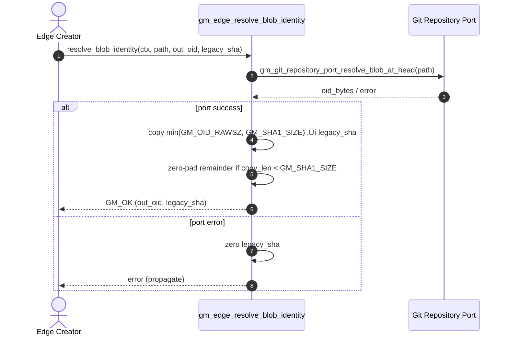

# Code Review Feedback

| Date | Agent | SHA | Branch | PR |
|------|-------|-----|--------|----|
| 2025-09-28 | CodeRabbit (and reviewers) | `82dab217893b6ee8bb8dcdca2217f9900a06b76f` | [chore/code-rabbit-cleanup](https://github.com/neuroglyph/git-mind/tree/chore/code-rabbit-cleanup "neuroglyph/git-mind:chore/code-rabbit-cleanup") | [PR#172](https://github.com/neuroglyph/git-mind/pull/172) |

## CODE REVIEW FEEDBACK

### core/include/gitmind/edge/internal/blob_identity.h:23 — coderabbitai[bot]

```text
_⚠️ Potential issue_ | _🟡 Minor_

**Fix legacy buffer padding description.**

The implementation zero-fills the legacy SHA buffer only when `GM_OID_RAWSZ` is *smaller* than `GM_SHA1_SIZE`. The doc currently says “exceeds,” so the guidance is inverted. Please update the phrasing so callers understand when padding happens.

```diff
- * (`legacy_sha`, sized to `GM_SHA1_SIZE`) are populated. When `GM_OID_RAWSZ`
- * exceeds `GM_SHA1_SIZE`, the legacy buffer is zero-padded to maintain
+ * (`legacy_sha`, sized to `GM_SHA1_SIZE`) are populated. When `GM_OID_RAWSZ`
+ * is smaller than `GM_SHA1_SIZE`, the legacy buffer is zero-padded to maintain
```

<!-- suggestion_start -->

<details>
<summary>üìù Committable suggestion</summary>

> ‼️ **IMPORTANT**
> Carefully review the code before committing. Ensure that it accurately replaces the highlighted code, contains no missing lines, and has no issues with indentation. Thoroughly test & benchmark the code to ensure it meets the requirements.

```suggestion
 * On success, both the preferred OID (`out_oid`) and the legacy SHA-1 buffer
 * (`legacy_sha`, sized to `GM_SHA1_SIZE`) are populated. When `GM_OID_RAWSZ`
 * is smaller than `GM_SHA1_SIZE`, the legacy buffer is zero-padded to maintain
 * deterministic contents. Callers must provide non-null pointers.
```

</details>

<!-- suggestion_end -->

<details>
<summary>🤖 Prompt for AI Agents</summary>

```
In core/include/gitmind/edge/internal/blob_identity.h around lines 20 to 23, the
comment incorrectly states that the legacy SHA buffer is zero-padded when
GM_OID_RAWSZ "exceeds" GM_SHA1_SIZE; update the phrasing to say that the legacy
buffer is zero-padded when GM_OID_RAWSZ is smaller than GM_SHA1_SIZE (i.e., when
the preferred OID raw size is less than the legacy SHA-1 size), so callers know
padding happens to fill the remainder of the legacy buffer to GM_SHA1_SIZE;
ensure callers still know to provide non-null pointers.
```

</details>

<!-- fingerprinting:phantom:medusa:sabertoothed -->

<!-- This is an auto-generated comment by CodeRabbit -->
```

_Meta_: https://github.com/neuroglyph/git-mind/pull/172#discussion_r2385101775

> [!note]- **Accepted**
> Added a pre-check in `gm_bytes_to_hex` that guards against `(len * 2U) + 1U` overflowing, zeroing the buffer and returning `GM_ERR_INVALID_ARGUMENT` when the input would exceed safe bounds.

### core/src/util/oid.c:38 — coderabbitai[bot]

```text
_⚠️ Potential issue_ | _🔴 Critical_

**Guard against overflow before sizing the hex buffer**

`required = (len * 2U) + 1U` can overflow `size_t` for large inputs, which lets the length check pass with a wrapped value and we then scribble past `out` while the loop iterates `len` times. Please short-circuit when `len` exceeds the safe range before doing the multiply.


```diff
@@
-    const size_t required = (len * 2U) + 1U;
+    if (len > (SIZE_MAX - 1U) / 2U) {
+        gm_memset_safe(out, out_size, 0, out_size);
+        return GM_ERR_INVALID_ARGUMENT;
+    }
+
+    const size_t required = (len * 2U) + 1U;
```

<!-- suggestion_start -->

<details>
<summary>üìù Committable suggestion</summary>

> ‼️ **IMPORTANT**
> Carefully review the code before committing. Ensure that it accurately replaces the highlighted code, contains no missing lines, and has no issues with indentation. Thoroughly test & benchmark the code to ensure it meets the requirements.

```suggestion
    if (len > (SIZE_MAX - 1U) / 2U) {
        gm_memset_safe(out, out_size, 0, out_size);
        return GM_ERR_INVALID_ARGUMENT;
    }

    const size_t required = (len * 2U) + 1U;
    if (out_size < required) {
        gm_memset_safe(out, out_size, 0, out_size);
        return GM_ERR_BUFFER_TOO_SMALL;
    }

    for (size_t i = 0; i < len; ++i) {
        unsigned byte = bytes[i];
        out[i * 2U] = KHexDigits[(byte >> KNibbleBits) & KNibbleMask];
        out[(i * 2U) + 1U] = KHexDigits[byte & KNibbleMask];
    }
    out[len * 2U] = '\0';
```

</details>

<!-- suggestion_end -->

<details>
<summary>🤖 Prompt for AI Agents</summary>

```
In core/src/util/oid.c around lines 27-38, the computed required = (len * 2U) +
1U can overflow size_t for large len; before performing the multiply, check that
len does not exceed (SIZE_MAX - 1) / 2 (or equivalent safe_max) and if it does,
zero the output buffer via gm_memset_safe and return GM_ERR_BUFFER_TOO_SMALL (or
an appropriate error). After that guard, compute required normally, perform the
existing out_size check and proceed with the hex conversion.
```

</details>

<!-- fingerprinting:phantom:medusa:sabertoothed -->

<!-- This is an auto-generated comment by CodeRabbit -->
```

_Meta_: https://github.com/neuroglyph/git-mind/pull/172#discussion_r2385101784

> [!note]- **Accepted**
> Updated `docs/code-reviews/PR172/203f4e3539b1d8fc73b641e94b0a420f2e592a14.md` so the front-matter title matches the H1 and added the required `## Table of Contents` block immediately after the heading.

### docs/code-reviews/PR172/203f4e3539b1d8fc73b641e94b0a420f2e592a14.md:18 — coderabbitai[bot]

```text
_⚠️ Potential issue_ | _🟠 Major_

**Restore required Table of Contents and title alignment**

Docs under `docs/**` must include a `## Table of Contents` section and keep the front-matter `title` in sync with the H1. This file omits the TOC and the front-matter title (`203f4e3539b1d8fc73b641e94b0a420f2e592a14.md`) does not match the H1 (`Code Review Feedback`). Please add the missing TOC heading and align the title/H1 pair. As per coding guidelines.

<details>
<summary>🤖 Prompt for AI Agents</summary>

```
In docs/code-reviews/PR172/203f4e3539b1d8fc73b641e94b0a420f2e592a14.md lines
1-18, the front-matter title does not match the H1 and the required "## Table of
Contents" section is missing; update the YAML front-matter title to exactly
"Code Review Feedback" to match the H1 and insert a "## Table of Contents"
heading (with any preferred TOC entries or a placeholder) immediately after the
H1 so the document follows the docs/** guidelines.
```

</details>

<!-- fingerprinting:phantom:poseidon:sabertoothed -->

<!-- This is an auto-generated comment by CodeRabbit -->
```

_Meta_: https://github.com/neuroglyph/git-mind/pull/172#discussion_r2385101790

> [!note]- **Accepted**
> The cleanup workflow now checks out `${{ github.event.pull_request.base.ref }}` so we commit and push on the branch instead of a detached merge ref.

### .github/workflows/review-artifact-cleanup.yml:47 — coderabbitai[bot]

```text
_⚠️ Potential issue_ | _🔴 Critical_

**Fix checkout to track a branch before pushing**

`actions/checkout` on a `pull_request` event leaves the repo in a detached HEAD at `refs/pull/<id>/merge`. The later `git push` step then fails with “You are not currently on a branch,” so the cleanup commit never lands. Check out the base branch (or push `HEAD` explicitly) before removing files.  


```diff
       - name: Checkout repository
         uses: actions/checkout@v4
         with:
-          fetch-depth: 0
+          fetch-depth: 0
+          ref: ${{ github.event.pull_request.base.ref }}
```

<!-- suggestion_start -->

<details>
<summary>üìù Committable suggestion</summary>

> ‼️ **IMPORTANT**
> Carefully review the code before committing. Ensure that it accurately replaces the highlighted code, contains no missing lines, and has no issues with indentation. Thoroughly test & benchmark the code to ensure it meets the requirements.

```suggestion
       - name: Checkout repository
         uses: actions/checkout@v4
         with:
           fetch-depth: 0
           ref: ${{ github.event.pull_request.base.ref }}
```

</details>

<!-- suggestion_end -->

<details>
<summary>🤖 Prompt for AI Agents</summary>

```
.github/workflows/review-artifact-cleanup.yml lines 18-47: the job checks out
the PR merge ref (detached HEAD) so later git commit/push fails; change the
checkout to track the target branch before making the cleanup commit. Either set
actions/checkout to the pull_request base ref (use ref: ${{
github.event.pull_request.base.ref }} and fetch-depth: 0) or, immediately after
the existing checkout, fetch from origin and create/checkout a local branch that
tracks the PR base branch (so commits are made on a branch and can be pushed);
ensure the branch is tracking origin/<base> before the git commit and git push
steps.
```

</details>

<!-- fingerprinting:phantom:triton:sabertoothed -->

<!-- This is an auto-generated comment by CodeRabbit -->
```

_Meta_: https://github.com/neuroglyph/git-mind/pull/172#discussion_r2385144548

> [!note]- **Accepted**
> Aligned the front matter/title in `docs/code-reviews/PR172/5add14fcdabafff59a99ea484d691140afdb68c3.md` and inserted the mandatory table-of-contents section.

### docs/code-reviews/PR172/5add14fcdabafff59a99ea484d691140afdb68c3.md:23 — coderabbitai[bot]

```text
_⚠️ Potential issue_ | _🟠 Major_

**Fix doc front matter/title alignment and add required TOC**

`docs/**` files must keep the front-matter `title` identical to the H1 and include a `## Table of Contents` section immediately after the H1. This file’s title still uses the SHA filename and the TOC is missing. Update the title to “Code Review Feedback” and add the TOC block so the doc complies with the repo guidelines.

```diff
 ---
-title: 5add14fcdabafff59a99ea484d691140afdb68c3.md
+title: Code Review Feedback
 description: Preserved review artifacts and rationale.
 audience: [contributors]
 domain: [quality]
 tags: [review]
 status: archive
 ---
 
 # Code Review Feedback
+
+## Table of Contents
+- [Code Review Feedback](#code-review-feedback)
+- [CODE REVIEW FEEDBACK](#code-review-feedback-1)
```

 As per coding guidelines

<!-- suggestion_start -->

<details>
<summary>üìù Committable suggestion</summary>

> ‼️ **IMPORTANT**
> Carefully review the code before committing. Ensure that it accurately replaces the highlighted code, contains no missing lines, and has no issues with indentation. Thoroughly test & benchmark the code to ensure it meets the requirements.

```suggestion
---
title: Code Review Feedback
description: Preserved review artifacts and rationale.
audience: [contributors]
domain: [quality]
tags: [review]
status: archive
---

# Code Review Feedback

## Table of Contents
- [Code Review Feedback](#code-review-feedback)
- [CODE REVIEW FEEDBACK](#code-review-feedback-1)

| Date | Agent | SHA | Branch | PR |
|------|-------|-----|--------|----|
| 2025-09-28 | CodeRabbit (and reviewers) | `5add14fcdabafff59a99ea484d691140afdb68c3` | [chore/code-rabbit-cleanup](https://github.com/neuroglyph/git-mind/tree/chore/code-rabbit-cleanup "neuroglyph/git-mind:chore/code-rabbit-cleanup") | [PR#172](https://github.com/neuroglyph/git-mind/pull/172) |

## CODE REVIEW FEEDBACK
```

</details>

<!-- suggestion_end -->

<details>
<summary>🤖 Prompt for AI Agents</summary>

```
In docs/code-reviews/PR172/5add14fcdabafff59a99ea484d691140afdb68c3.md around
lines 1 to 16, the front-matter title is the SHA and the document is missing a
required Table of Contents; update the YAML front-matter title value to "Code
Review Feedback" so it matches the H1, and immediately after the H1 insert a "##
Table of Contents" section (with the standard TOC entries used across docs/) so
the file complies with repo guidelines.
```

</details>

<!-- fingerprinting:phantom:triton:sabertoothed -->

<!-- This is an auto-generated comment by CodeRabbit -->
```

_Meta_: https://github.com/neuroglyph/git-mind/pull/172#discussion_r2385144568

> [!note]- **Accepted**
> Added a pip install step to `coderabbit-status.yml` so the `requests` dependency is available before running `check_coderabbit_threads.py`.

### .github/workflows/coderabbit-status.yml:23 — coderabbitai[bot]

```text
_⚠️ Potential issue_ | _🔴 Critical_

**Fix: install Python dependency used by the script (requests).**

The workflow runs a script that imports requests, but there’s no install step. This will fail with ModuleNotFoundError in CI.

Apply this diff to add an install step:

```diff
       - name: Set up Python
         uses: actions/setup-python@v5
         with:
-          python-version: '3.x'
+          python-version: '3.x'
+      - name: Install dependencies
+        run: |
+          python -m pip install --upgrade pip
+          python -m pip install requests
       - name: Check unresolved CodeRabbit threads
         env:
           GITHUB_TOKEN: ${{ secrets.GITHUB_TOKEN }}
         run: |
           python3 tools/review/check_coderabbit_threads.py \
             --owner "${GITHUB_REPOSITORY%%/*}" \
             --repo "${GITHUB_REPOSITORY##*/}" \
             --pr ${{ github.event.number }}
```

<!-- suggestion_start -->

<details>
<summary>üìù Committable suggestion</summary>

> ‼️ **IMPORTANT**
> Carefully review the code before committing. Ensure that it accurately replaces the highlighted code, contains no missing lines, and has no issues with indentation. Thoroughly test & benchmark the code to ensure it meets the requirements.

```suggestion
      - name: Set up Python
        uses: actions/setup-python@v5
        with:
          python-version: '3.x'
      - name: Install dependencies
        run: |
          python -m pip install --upgrade pip
          python -m pip install requests
      - name: Check unresolved CodeRabbit threads
        env:
          GITHUB_TOKEN: ${{ secrets.GITHUB_TOKEN }}
        run: |
          python3 tools/review/check_coderabbit_threads.py \
            --owner "${GITHUB_REPOSITORY%%/*}" \
            --repo "${GITHUB_REPOSITORY##*/}" \
            --pr ${{ github.event.number }}
```

</details>

<!-- suggestion_end -->

<details>
<summary>🤖 Prompt for AI Agents</summary>

```
.github/workflows/coderabbit-status.yml around lines 16 to 23: the CI job sets
up Python but never installs the requests dependency required by the script,
causing ModuleNotFoundError; add a step after "Set up Python" to install the
dependency (e.g., run pip install requests --upgrade or pip3 install requests)
so the script can import requests successfully during the workflow run.
```

</details>

<!-- fingerprinting:phantom:medusa:chinchilla -->

<!-- This is an auto-generated comment by CodeRabbit -->
```

_Meta_: https://github.com/neuroglyph/git-mind/pull/172#discussion_r2385271905

> [!note]- **Accepted**
> Harmonized the title and table of contents in `docs/code-reviews/PR172/8a32c6a810ebf632709cec6c928381c9c47fdee9.md` to match the docs guidelines.

### docs/code-reviews/PR172/8a32c6a810ebf632709cec6c928381c9c47fdee9.md:20 — coderabbitai[bot]

```text
_⚠️ Potential issue_ | _🟠 Major_

**Align title with H1 and add the required TOC**

Docs under `docs/**` have to mirror the H1 in the front matter `title` and include an explicit `## Table of Contents` immediately after the H1. Please update both so this artifact stays compliant. As per coding guidelines

```diff
 ---
-title: 8a32c6a810ebf632709cec6c928381c9c47fdee9.md
+title: Code Review Feedback
 description: Preserved review artifacts and rationale.
 audience: [contributors]
 domain: [quality]
 tags: [review]
 status: archive
 ---
 
 # Code Review Feedback
+
+## Table of Contents
+- [Code Review Feedback](#code-review-feedback)
+- [CODE REVIEW FEEDBACK](#code-review-feedback-1)
```

<!-- suggestion_start -->

<details>
<summary>üìù Committable suggestion</summary>

> ‼️ **IMPORTANT**
> Carefully review the code before committing. Ensure that it accurately replaces the highlighted code, contains no missing lines, and has no issues with indentation. Thoroughly test & benchmark the code to ensure it meets the requirements.

```suggestion
---
title: Code Review Feedback
description: Preserved review artifacts and rationale.
audience: [contributors]
domain: [quality]
tags: [review]
status: archive
---

# Code Review Feedback

## Table of Contents
- [Code Review Feedback](#code-review-feedback)
- [CODE REVIEW FEEDBACK](#code-review-feedback-1)
```

</details>

<!-- suggestion_end -->

<details>
<summary>🤖 Prompt for AI Agents</summary>

```
In docs/code-reviews/PR172/8a32c6a810ebf632709cec6c928381c9c47fdee9.md lines
2-20, the front-matter title must match the document's H1 and you must insert an
explicit "## Table of Contents" immediately after the H1; update the YAML
front-matter title to exactly match the H1 text and add a "## Table of Contents"
header directly below the H1 (populate with relevant links or placeholders) so
the file conforms to the docs guideline.
```

</details>

<!-- fingerprinting:phantom:triton:sabertoothed -->

<!-- This is an auto-generated comment by CodeRabbit -->
```

_Meta_: https://github.com/neuroglyph/git-mind/pull/172#discussion_r2385271909

> [!note]- **Acknowledged**
> Thanks for the status update — we’ll keep playing until CodeRabbit finishes processing the refreshed score.

### General comment — coderabbitai[bot]

```text
<!-- This is an auto-generated comment: summarize by coderabbit.ai -->
<!-- This is an auto-generated comment: review in progress by coderabbit.ai -->

> [!NOTE]
> Currently processing new changes in this PR. This may take a few minutes, please wait...
> 
> <details>
> <summary>üì• Commits</summary>
> 
> Reviewing files that changed from the base of the PR and between 093b7cb4bbf8e87b29a1d779b958263c941c616e and 82dab217893b6ee8bb8dcdca2217f9900a06b76f.
> 
> </details>
> 
> <details>
> <summary>üìí Files selected for processing (1)</summary>
> 
> * `docs/code-reviews/PR172/5add14fcdabafff59a99ea484d691140afdb68c3.md` (1 hunks)
> 
> </details>
> 
> ```ascii
>  _________________________________________
> < Making HAL 9000 open the pod bay doors. >
>  -----------------------------------------
>   \
>    \   (\__/)
>        (•ㅅ•)
>        / „ÄÄ „Å•
> ```

<!-- end of auto-generated comment: review in progress by coderabbit.ai -->

<!-- walkthrough_start -->

## Walkthrough
Adds OID hex utilities and a blob-identity resolver, wires them into edge/cache/query paths, hardens path parsing and fake-git test copies, updates build list, adjusts worksheet/CI review tooling, and removes/adds assorted review documentation and AGENTS.md entries. No public ABI-breaking removals observed.

## Changes
| Cohort / File(s) | Summary |
|---|---|
| **OID hex utilities (new API)**<br>`core/include/gitmind/util/oid.h`, `core/src/util/oid.c` | New `gm_bytes_to_hex` and `gm_oid_to_hex` implementations and declarations with input validation, buffer-size checks, safe zeroing, and NUL termination. |
| **Adopt OID hex helpers**<br>`core/src/app/cache/cache_rebuild_service.c`, `core/src/cache/query.c` | Replace direct git2 oid-to-hex formatting with `gm_oid_to_hex` / `gm_bytes_to_hex`; add buffer initialization and error handling; include new util header. |
| **Blob identity resolver (new helper) + integration**<br>`core/include/gitmind/edge/internal/blob_identity.h`, `core/src/edge/internal/blob_identity.c`, `core/src/edge/edge.c`, `core/src/edge/attributed.c` | Add `gm_edge_resolve_blob_identity`; delegate previous inline blob-resolution logic in edge creation to this helper; handle port availability, legacy SHA padding/zeroing, and error propagation. |
| **Filesystem path utils hardening**<br>`core/src/fs/path_utils.c` | Parse functions now accept dynamic `max_segments`; emit safeguards against output-buffer overruns and return path-too-long on overflow. |
| **Fake git repo port safety**<br>`core/tests/fakes/git/fake_git_repository_port.c` | Check `gm_strcpy_safe` return codes; clear destinations and return `GM_ERR_BUFFER_TOO_SMALL` on overflow. |
| **Cache header comment move**<br>`core/include/gitmind/cache.h` | Relocated a struct-tail comment; no layout/type changes. |
| **Build configuration**<br>`meson.build` | Add `core/src/edge/internal/blob_identity.c` and `core/src/util/oid.c` to sources. |
| **Docs & review artifacts**<br>`docs/code-reviews/*`, `docs/code-reviews/PR172/*`, `AGENTS.md` | Remove many archived/rejected review docs, add PR172 artifacts, and append a 2025-09-28 entry to `AGENTS.md`. |
| **Worksheet checker tweak**<br>`tools/review/check_worksheets.py` | Treat deleted worksheet files as acceptable by returning an empty problems list on FileNotFoundError. |
| **CI workflow: review artifact cleanup**<br>`.github/workflows/review-artifact-cleanup.yml` | New workflow to remove per-PR review artifacts on merged PRs and commit/push cleanup when changes exist. |
| **Coderabbit status workflow & tooling**<br>`.github/workflows/coderabbit-status.yml`, `tools/review/check_coderabbit_threads.py` | Add workflow to run `check_coderabbit_threads.py` on PR events; new script queries GitHub GraphQL for unresolved CodeRabbit threads and reports them. |

## Sequence Diagram(s)


## Estimated code review effort
🎯 4 (Complex) | ⏱️ ~50 minutes

## Possibly related PRs
- neuroglyph/git-mind#165 — Overlaps OID-first migration and edge/blob identity helpers; likely continued work on same APIs.  
- neuroglyph/git-mind#166 — Related changes to edge blob identity and OID/hex utilities integration.  
- neuroglyph/git-mind#169 — Touches OID/ref/edge handling and replacement of direct git2 oid logic; strongly related.

## Poem
> I nibble bytes and spin them hex,  
> I hop through blobs and mend the specs,  
> I guard the paths and tidy docs,  
> I patch the tests and hush the clocks,  
> A rabbit’s hop, a tiny fix—🐇✨

<!-- walkthrough_end -->

<!-- pre_merge_checks_walkthrough_start -->

## Pre-merge checks and finishing touches
<details>
<summary>‚ùå Failed checks (2 warnings, 1 inconclusive)</summary>

|     Check name     | Status         | Explanation                                                                                                                                                                                                                                                                                                                                                                                                                                                                                                       | Resolution                                                                                                                                                                                                                                                                                                                                                                                                                                                                                                          |
| :----------------: | :------------- | :---------------------------------------------------------------------------------------------------------------------------------------------------------------------------------------------------------------------------------------------------------------------------------------------------------------------------------------------------------------------------------------------------------------------------------------------------------------------------------------------------------------- | :------------------------------------------------------------------------------------------------------------------------------------------------------------------------------------------------------------------------------------------------------------------------------------------------------------------------------------------------------------------------------------------------------------------------------------------------------------------------------------------------------------------ |
|  Description Check | ⚠️ Warning     | The provided description is a long unstructured list of commit-style entries and does not follow the repository’s required template, which mandates distinct sections for Summary, Change Areas, Risk, and Code Review Guidance. Without these headings and checkbox fields, it is unclear what high-level problem is being solved, which areas are impacted, or how reviewers should prioritize risks and feedback. The current format makes it difficult to quickly assess scope, impact, and testing guidance. | Please restructure the PR description to match the repository template by adding a “## Summary” section that concisely describes the change and its rationale, a “## Change Areas” list with checked boxes for Core, CLI/Hooks, Docs, and CI/Tooling as appropriate, a “## Risk” section indicating behavior changes or public API impacts, and a “## Code Review Guidance” section with top-risk notes and suggested fix-it blocks. This will ensure reviewers can quickly understand scope, impact, and guidance. |
| Docstring Coverage | ⚠️ Warning     | Docstring coverage is 0.00% which is insufficient. The required threshold is 80.00%.                                                                                                                                                                                                                                                                                                                                                                                                                              | You can run `@coderabbitai generate docstrings` to improve docstring coverage.                                                                                                                                                                                                                                                                                                                                                                                                                                      |
|     Title Check    | ❓ Inconclusive | The title “chore/code rabbit cleanup” is overly generic and does not clearly convey the primary functional changes introduced in this PR, such as the migration to a new git_repository_port abstraction or the addition of OID hex utilities. It does not read as a coherent sentence and omits important context about the core refactoring and feature enhancements. As a result, reviewers scanning the commit history may not quickly grasp the scope or intent of the changes.                              | Please revise the title to succinctly summarize the main change in a single clear sentence, for example “refactor(core): introduce gm_git_repository_port abstraction and decouple legacy git ops” or “feat(util): add OID hex utilities and integrate in cache and edge modules,” so that it immediately communicates the PR’s core purpose to readers.                                                                                                                                                            |

</details>

<!-- pre_merge_checks_walkthrough_end -->

<!-- tips_start -->

---

Thanks for using CodeRabbit! It's free for OSS, and your support helps us grow. If you like it, consider giving us a shout-out.

<details>
<summary>❤️ Share</summary>

- [X](https://twitter.com/intent/tweet?text=I%20just%20used%20%40coderabbitai%20for%20my%20code%20review%2C%20and%20it%27s%20fantastic%21%20It%27s%20free%20for%20OSS%20and%20offers%20a%20free%20trial%20for%20the%20proprietary%20code.%20Check%20it%20out%3A&url=https%3A//coderabbit.ai)
- [Mastodon](https://mastodon.social/share?text=I%20just%20used%20%40coderabbitai%20for%20my%20code%20review%2C%20and%20it%27s%20fantastic%21%20It%27s%20free%20for%20OSS%20and%20offers%20a%20free%20trial%20for%20the%20proprietary%20code.%20Check%20it%20out%3A%20https%3A%2F%2Fcoderabbit.ai)
- [Reddit](https://www.reddit.com/submit?title=Great%20tool%20for%20code%20review%20-%20CodeRabbit&text=I%20just%20used%20CodeRabbit%20for%20my%20code%20review%2C%20and%20it%27s%20fantastic%21%20It%27s%20free%20for%20OSS%20and%20offers%20a%20free%20trial%20for%20proprietary%20code.%20Check%20it%20out%3A%20https%3A//coderabbit.ai)
- [LinkedIn](https://www.linkedin.com/sharing/share-offsite/?url=https%3A%2F%2Fcoderabbit.ai&mini=true&title=Great%20tool%20for%20code%20review%20-%20CodeRabbit&summary=I%20just%20used%20CodeRabbit%20for%20my%20code%20review%2C%20and%20it%27s%20fantastic%21%20It%27s%20free%20for%20OSS%20and%20offers%20a%20free%20trial%20for%20proprietary%20code)

</details>

<sub>Comment `@coderabbitai help` to get the list of available commands and usage tips.</sub>

<!-- tips_end -->

<!-- internal state start -->


<!-- DwQgtGAEAqAWCWBnSTIEMB26CuAXA9mAOYCmGJATmriQCaQDG+Ats2bgFyQAOFk+AIwBWJBrngA3EsgEBPRvlqU0AgfFwA6NPEgQAfACgjoCEYDEZyAAUASpETZWaCrI5Gr2ADafIFEgEdsaVxIMwBGAHYAJi4AIgZYfD8AeiYlXxU1EIZPEkxsbljIOUgAM09ZeAwiCkF8XGQACnxuMgBKSEAUAkhYXFxuRA5k5KJ1WGwBDSZmZPJsWqIK7lgR9TBmKtpk7i9PZMiojUgAZXx5hhJiqgwErgSkklTFEjAqVTWcvIwCyEAkwkhcM5SJxIMxtBgjgBhPzUOjoEJRAAMUQArGBEQBOMBRAAc0EROI4AGYMRwUQAWABaGiMABFpAwKPBuOJ8FhGqU0GJEGA2RU2m4oAB1eBKV6YUbVXwkTliJLoDD0T75bjoRn4RDIUa4AA0PCSuoUfj1DC5sBIJs88D1tHwDEQepoiAaesw9EhAEkaVAPRhcLVaNgLsg0JAiMwAPraiN+bga9RJWQRuMUEIqZ1UMTwNkK+gbGqw5DfNi1bDIPyIOMYRDwNRW8TSMq1ZiQXJELnyMQADzAemjLRDirD6hjJDjAPwAPNkHIAHd9am9VUcthaFUiG5ILpIABxdTFTyCFBKP3qeQV/CePDZjB6uPOsDTDYhRL4ADWeqEZwoGDQPlnTI0BQrrYOG7A9Pg74OqClCkJASg0FmOaNE+I7cM47ARkw2B+m0JosM+kCzn+H5XJgCQoBgpT4PhrD7oyeSsreuaQF+8y/v+gGUOgAgZlyTE0luUD0th3BWlKpoJJcbqQHQcGlM2ra1tqUSQAA8h6tJlDhSHVixfiygQTISQR+7+iQlw1gAXpcpqeAwXjUDeLGobgYBoMRfgHkeF5XkxE5TpcKaaAYUAAKIYLA5GNrg06cm+lzaguITUXwTriFKMloLQtAht5AjwUg97ca+b76dIrRiGU8p2Z4AhcmVzotPY8BEBxiDepAABi8Bdo2MlRRQJ7rowUXVNIXBENgzjugAMmpkIANLHBGVhhTYEYALLHCxkLzUtK1rRtxxhZC6Cao4LI3tBypYJJ05sICrb4NlI2pQCFA6bC9ACNcFG/mw0H1Z40XDrgEZWgIKkRlU6jJIg4y4Las5YDmnLwFeFZ6lNM2MIeDBlVQNCukOt2yRQtR8GNtC5HwAgkFFEjZhQnUeswYkkGwfrIJDKmMH+PgGfxSTIAQkBlpcggiFVmmDvQ6jKOIUgfRZH1oFIFCIH+ADceNfMgpQY9IsjOpz4viPW8D9UOno8LGnUAII5cgWulJcGBsmAnIPqlnn0AZlBkBc4vcLQhYsc6bozfANnlmO8ZGfI+Ao5QCPMpaXwFCT9AaVp171vI6b+vxN6dQAco4lBnMg9wVuVTMkLOYCIBZa4mXRLrwXald+k5OYFGHTqQI0Ds7mFZfQMcGjMLQeqzkkb4IxZDR4Sx6UhrQQhlrgXMNDSoW9sY4BQGQ9D4KUOAEMQZCK3CT7sFwvD8MIohK42JRpMo7yaNouiHyYUA4CoFQJgS+hBSDkCJnfAiD8MjzgcE4FwxROzPDeFkLQOh9BGAMAAowo9x6T2nrQNwsRSEGAsJAB2Hpr6QO+vYRwYIkHn1GhKaQRg4CXDXKUC+2VcroHgnQpEqJ0RYlxLJP0SCxb4InlPGe8EGRMjUFKOcLFqLeGTmAH488KBlS5LUTUyVxZa1IHqQ2uREAmxoC2OMVoEbZ3sGgN2YBzSeFaJrO8V5kC2wHuHGSLcNZ/m0rgeYLxtFlQVswDqMBpy8OgX6cCCRWE1zZP6S8ZRDzzhkpQSmPQ3TiSIPQigspLhVBnM4ImkhLipRbI0EgGgiAaE/N+DihifFOlMWgH2SQ/YOLdjjIa0Eso3GCEgqSBNEAdBksuK8ShkDMC8OIDmaomIqFyNVdRTcChNBIF2YuWYpQIwwvQFxbjoKxhBgwEaa4/BVV5uoVSZY0AmOlMwfATMpRKAEKBO2VRO4yTCUvEg2RzTjLaEcD0aZPCIEnLaByu88pMFPN8PuWBZzmi8gIQ8Ahkj4FFD0EgrjU4uTNJcPwXyMZbECJQc8Mphaa3QF5X5AYgx0COGpAJ3glwhCZYoFlyAEBEFgGAXIUgfAtEVjeQJiTxpyx4CDDAGARoeyHrOMYZxIVARGpgeQOzRB4FWbZZ4PBqCwGQKU2KqAuGlH3uYSwDtPBARRaLScsVOGiBBhUtkyBmE7OCnCeUOxMXwAYOI8QDZEBGCgGXNkbrEI0FoEcaNLU2rUBCdBX5lBinQQDRMK0IbB6hgzEGYJddZyB3QDlf1fBXlcKtvLLAFrkBWv3mFZ08AwTxoUOkPwDd5wylSiCWaycDCkNiJG0wBgmApGmauR42oNiKlSCSjQsASFkIoVQmht96AIMYUnC+0rSARoMJtWGYJPB6g9hgL2OkVk+Hvn6aU+MUVETGKU8MWESURkemgCMIJXVlCtp4PhfgwSlPNdOLWbB+BDW4jJXAshWhNDYj+P8f7mQRlxbQCMSjHTmjul+xZmHRRguiW6xkzJ/LKsuIAHAInZKHoNQew/pi0Am0D4MWvBpCUGVg7AAQh6VsaBZDqo0IAXAIiKdNBG8uECkWCBVYs0tDRGsM4dKeJS4YsAP3RIOh7gxH6Aad1h7ZZ00fCGwJWfNKiHbJjSPfwBgDlgIsX44JkGIm8AvPBMgLjLcKBSATdg8hdqHUSq9QFADSgcjOCdfwC+vqDRVp4Lm4Nob1BW2PVARoJnD0xUnIGvNyQEupjhFFj1Tq2hGFbeIDt0Du0kF7bJbhBouBDtnCOshB8wBGCnY8GdShVg702EV2gpBkgZtQ3sTFggYYnjDbIFda6x0buoRA7d9DEH7pYTKyNlDnb8JUWdB2VhBOlN6+Nm4My53qAXVsOSfX4mTeSNNgQs32BnhXQFXyysAMvePO9hD1U+ChlGFILAZigomvQO2KozoFOxgTomfF2UjgcO0jcfyH77ujmhZ4KQOGsVvdPID9VOwGjFHqLAfhXG3YUzhLnYe6qDOTKHKGNsHYTgAAkHZgDCMUbA3DuKNHZwwJMhzV42VqGAdCOURoAZF/IL5gu+BorILuTaEZc4RhsA7IUxxKSyS7BcOgyAdwa+ONzsIEZjgekpGFAKYHe6lIQpQBdSBxAhsRTQbmqO4q3ucn4QI8A65XrAN8bw+oJsG3lKTvAZygXsTyh+isCyIwSFU4aKZg5lV0NVbFdXEYy5qVpB6Y4kIHY2FpOCkIvmeONjOuJN8TyqnykhAAajbwodmTk6wfaCxYELjqmLOoU2VmLw+4uG79VZ5LQaQ0A4y7t+jcIVEFdS6Uf3OYawppLSQLgBghJhkjCnh1aeM9H4jNj77umXtE/m40D9XudngxCAAKm7PhaswLnCQFf+hWK2MkY5+r+TOWGeo2AvyOIf6v+CuEY4u2sB+24Q6poTEdwDwF2K4A286w292F2QEHEz2hOooAOC2sAiBwoYw8I/otYeAE0BeReJeZeFeWkOYAGfgJaDaNmtqZgVWbatWSoRqPaVsfazWqYXAnOrUZBo6463Wk66B/W12Q2i6+cOKooi2HWy2dqq2N8UCO6DCzgW2uWx69GeUh2yOSgfA52Chg2t2yQKhWGn2sUTGSghs5Aos88s+ealCJ20elhbIGsGUBSSiBhAiT0Ys5oXY2Uog7agSGY64gwoUF+cgTof6+AEYERaBGAAReUyR0kFMwmAUbOyclApoLc+KXYzGxkBSeeVOseIQSutOkAEgf4ooL6WSFMNUzwTQZumui0eoPR60G0HoZcAAag7LNJpBGBXjuAAKqbQEL9Ea6DERh8YzFdRdTrQRjQBqRqTW6bTjGzRgqJEfoZ5pEZEKBZGUDk4g5AGijQFSyvwBTqD8o7JRGXLnqVFvRJAtg1EtQbAer8B4Bk4XF8S/KyrZKdGzI0i+iYGNiRyKi4z9K5R6jt6d7P6UB3QsD/61gYxnj2Kwo9yAj+TvToRUCPREoyTsHsRNF/hBBRJhRdjFSizmhlFj6ep6Riy1REpMyhgAYqLmhREsz96D5hYckurThsmxY+qMmJYz5r7z7E6L6JGbRAqJCMaVrEKQAAAGvySRsgKRBA6ROyKEXqIQEBfoUBb+uR0E1kumIQuQzEiSfAIBeAeotp9xeAcBMcJAbQWplEgGayWpVhl2s6Nhw29hahsAWpypqpigFaDGXAOpj6JxdxhpERJpX+F+wBYBLCzp6qbp3pHp4Mtpvp/pEO2pwZsJYZyhFsqhCaUZvBNWdCn80ojW/aLWkAKpa4jgGhMhPW6BiAFADAyQaA3A3AS6UkE55oo45KwGcBPGwadSDAS2wWlC2htCnau6IRzCRhu2NgY4FyjY1yjxjycEzCKkAA5FqCOKpqUMwLgINgZqkRmK+vnimdhmmTskDhcQESNLnCPhEf6cCE+TTr1EcCYb4IINvOUfzsrpROli0VZG0UOBCVTHkuuFwPABfO+akUaRUejFCneAZL1CgC7ECgFJzCyIXEOBvhjgHgnj+B1McUCiBcRRUR7Jkuoigf1DBQ0dxL8aAs/lQLmfxNxO9OHp4GAEBAushfQBLFqLcR+WcTsrrGjOxiElynrM4MyUFGxeVBwUxVAKcXhSgOzLkLvC+kYU2PJkoOzoEQFJeckpcZrM5GLLZSQO2PZWLDhZ+V2HqKBm8lcsHo8f2KmRqP6EYs3qzBIrysGPIq0IqEHEnA2tOBNi0lhubLiYDgKRYcPNgTWRjHWSukcdghuqFuySPpFu6uPtdJPsVp2jmnPmluGrtiqbFHGbEpqVeiQDGe1Tuq1L+LviHIPHQFwN1YkSMc4PAAatKADKNTODGo2TEZ2i2UIY3E1gOuIZIb2V1v2SkIOcOTpskFSi4FMCuStluroRtnupPruYkfua8gFsxk5CGsnh5LhYBe2hzBZf5JSQeVyHCM8ZFXBL8R+taR9V+WdgLC1E6J1PuWEnCMBYcsmHpd5TobCDBaBX1MgGWCNGDfqdIBDRUbDjQNlJPqFfQNUtQIEa6LLlKLUF8nDlUMCc0VaIPDeHqHxXwLaaNKIIvPYr6nmmZK7lUC+vTIzMzNFc9NlGpjvKORGHJpGDpv5f9RcPQABlxkzNXDBYihrDWDmKDZGODb5SxJ1QqOTDkmMoTAxYqlKAMTYBtKsesZsdsbsccPsbNLNPwODupX4NFakoGGrebbwulmyIEgod+flVsBGfWcZvliliGsdoJlZS7mIKyokU7FvKbP7ASnQgIGcAiaMiCovCxBJVJSLYNc5NTPkv6QBhbg7HbDKCRQNF+branM5P/qajaqufakPrVVphKdVRVXVTKSVnKQnc1UqVGotQYNVstXVqSg1sIRtR2V2fAD2dIbtXIftUOSNmNtTYorQQmsub2RdWtldVuUwgenZmwvdaraVsFVVH9sQcTjSrjteDmDyfws+j4JHB7ujrpK+VTqGLVIUTOOtfKfioSnwFjqNrptfgTjNi/fNkBZGNjgfTQfGlhDCMTOVI9XCBrUIdrX/algg7fsg2eKZd9ewCir7qgFZQBmlYEr5B/VgJ3cRPIGLBLAppAycpQJ1DMaHHQhHbYiEGLLwmDLYbgUw1NkQXNh9sA0OAFT9tOBxbyLxJeECpcOiZNvFafEld7WDFEEVbAAI0IytQLL4dKLju8gUtCucNJEOICBQMCPlP9oqXlhflftIJePjuQ/I4Du+mg3AxGBg18lgwxLCCrWJFyCNGQ3IyQfzN4IZWRoUqWIqCNIeKMCGu9PdowDg/RY7t6q6hQKqmUTpDfbPOdMQdZS2O5Z5SNBQ4Diw/5APe7OtXw0KdglAL3aKZVYPdFsPdKdPjBp4algvrfdPeQEtfwV2ovW2aISCGvRvZ1hALIedgdXvY8PdmdafVoZdXQpfYYTfZlpAA9TJvWvgbEUSaQz43jjfgk6/SxEDaeZcDUUE5fiE5EzQI7BqZRLCZHTdjgXA3gRiX+IQUgwE6QXDffUqJYxFtOJeDnTYw85C4k78SorA6QDjr46i69k0/IO9PnfnvY0OY4+rUCORc/VC9Y5eKwyk1i7pt8+7MnPInZY2PXbS35K5ZOIyzi/c4g/izSyTXkGfBfFUF7EbM9Nk51GjhWCEMwgBnk9885OUKy6Bt5gplBhaP8zMlqi44SbzeMixHk7DOIIhbQ8KZQuVbFm0/IoM1KfFqPQ1XwJAxM8etGtM7PXwc2YIUvete2WIZ2XQOvcwDtWs3tY8Js9I49gQf4yQbs9IWfejZufoVfdtkengvtqGCorRYA3y/E2i082dgObvTG1c7I0W/NlML7lUpvlgKza0UPMzXHsPB/sagAYCeDDmbAeLnqGQA4HXABklAjjWInIYiAs0RjAairSizpW40xjlU0dNRftGKOwmC4MmAaPy344TtQEadlPYnUfOyfvZQzllK2B5Rzpy1zdXl3mTo2EwNwEmA6edFq+erTJPj0VrjrnrgbjJD0fXVbjbnbq6H0JReTpyS0PIL21FLUwprnEe1gFzVJZBM3B+xbSLBnNpZe+2KLnAXB39QZebaheCgetBxDGrqgOYsyaAoB5btbrbmFJpZLvgDFNOBq5sNxMwrB2gEcPucRw4I5tIN6piWZUCqXJADCVduWFBXDqhbkoqDXe9FUI24xga/CuAb+FOyDJikFAaPYsFNYwsoMihdWGmrhx2AR6GFMrG4ElzSGF5FOjcrgBUC1DZIxkOKx2AGa9NVaB50RPhuA8GFrKdVa708PXa5KRPsM7KaM26x46c11PW/GfNVqcntIKnunqmV4yE4W0KyQQ/krSks/tAe/rgH5SCd/s6Z3YAU+W/qAaKOAZAWV7x6WaUuWUGaW8OeW2C5WwV6/VMNGcFjwd602StX6ws5tZABIYKuGxOhs7vaUIgNsCahGPnB1CfUm/s+fYc2m8c0krtgyd7gxgpjI8aprLpi3GBNzAA/5NvoNSEsgvGVquA/OGCF2POTd+TqSWgOScDkOG0oDeTq82qFOm3IsAtqk3m1Rqy2QKlHFXyetR919/CkpIRF/QBij9d2j0CIa6rlgPU05FKOEXkldx5bvEuF/qK5PrjST9OJrdmGWJ2Q7AABqrQOzQCc7W5hRm4EI7SIrwkhRQCCMjWMYR6gNjueMOBjludI/vdoCfc4/sDICs1BBHDHCVRYXBoCyyB1fLfJhrcewUDnqFlZM68+AcX3u0FzKK+o8q/wfy52ixEU8O/lIFE80yToSaiNhmT5baXk/fcpPL6MYU44RhxF183+mcwjjK+3duVaNVQE8KaC8sZp30CzIZQvoOlED565QhDzxeD0A7LG7q2ItAmea3vqSowaxquzgsdVzzt1H6WJ7U4mqoeECHhSioV6iU6UBlMlJiMV3hwCUzi7AAjD9GQwsOAOqPzaUjTMJx/k6oBW/53h9wglChi0CyAAypbY+u+3dWjPgC0bCajOSL8H/L9ajTSwaMYw6Zlc38AayfTVhzyUF5AUBucKcI6pjrgto+sTd6sU3VeiGxWZjot6i3YcjHUTbroduKbOEEc1uonMjAvoAOnygOzrUzoNaLwNJGyDdc7CtZBwiGicI15agTMWZOUTABBxFAI0fOOlkbDvQGcBaI4AySZIAgPCkDGHtdEFB6kDSylLsJkWyL8JciDKKgJw0nBFEy0Q5TpJcEApxEpQvxXgOKjpgF0+EVtdcFTxZotF2abIexK7EuCscF+WAVCrrCpKMUC8akRaKMwU6fxTcSxB2hGGGJjEJitIKYjYFmLzEJ4oze2o7TWIbENortPYgcU6g+V+Bggq4knkUrQFxGMFeQUEXkBE8vKvLI2gTUQBE1DGWGXsHilH6Gw+o/sDyO50uDftJiv7fXLrGrqNgJK/APFCUEMFShm+RHdiCNB8GODRi4xSYtMTmIEJ94aOL6uZRob+QXCVQX3nZ3vSmlMA5Od6IBTXBJQwQY5LVEOEVSqA1k1dDQSxHkq9JLgbAV5EgjoHho8qkYbYS3GLKOIfSd7AdhZzLrSVRa/kRVuX36B4B94ZVPuuFii5D1HWU+OLo1S8LutdsyXOijmE6qJldS+NPgXhQzJw5zSuAS0r/mtIFkbI0BB0iaEGi/58yhQosl6RsjtdwcUrLrjvSgGEC1CDAaMlAH+GAMgR2pEEVEN8oQiQgPlVEU11zKojXS6IhVp6RLJ+kOuuIyAQQMKpEDoym9CNtvUeDrxkg8UaQINjFFoAEoUYEcOu0ThbtUwMAzQmuQOaptNsSAw7gYDRxWVzkANdgZOB0hsg1wd6IxI2HPKRgMwDAZ9nAVOFAMwwN/U7soNtZRRgUUfNgjbTmbgofaMo1yNg0Yg6tk+IDUyCEEBjGISkPmMgcQSqbaYjUVvU0CyAs4eiOCNJK8JLGwqWj/Q1osXHaN+SThIkRAGMAwCQ4LVr037KwfRFyA4cqqbaSuoCKUY21BwmHPgD4LUg2BGgLQp2v4K2I7EghntPULEHFFd5CIYY5vBOEnBd8iAsQUjFYCIZlg5eHHTLg6nJqZihyNo/QZJjNRtQHgCaKTj6PgYyhA4wydbuYx1Y1h/iP+JEsgCkHSQ/m70AyBGDmosQsm36ETs3i4B5AKIT7eQE1CHaLiZ+3KLAA+N3ovihyJY0POWJT5JAKwVYCHvIlrEvp6GVYvwJ5084F5liXYl2r2PdoHFmxpFaUBwThCj9Kw0RQ2CGlHFwRGgg46UZcCB7SgL4BACcWyCnGjNqJCUYahjSybjjno1QacWyhKYD9OaDMdWMzC8yw4tWf3N5kFxbbXEvIZcGYp7VGZqd94SaBhpOC4Fb4BqqaOuN8NSwTYs0usL3LUHMwZIFq8CRIKmAcjk5figtYNPuAU6rCFBQXb8fwDcSxZNgOvGgJRAcDcI7J4ER/pWABr7wemfzFDjn3zxW0rGrkGCJqDHEuSOuNErCCGP9Gwhfmp3MKWQFz5U5Ip35OiQHD8DDIFAz7MsolPylBxdMdExoA+LmpHEQp6UgXLTmFSZSIpxdKxnRK4nxT9xo4WnOVJPEjVh4L4iiWcPC42sJ8bwh1jFydYjNdJCpMNFPUgCeseqY3eegISAHL1A2SzUAWG0FETpYUK3T+K8H9azgVue0B2DMVpBhQiE51OARuQQH7dNRO2O+vgzL6cJu4P1VVlKz2lPAxQa1Y6ckFOnnTLpciNFMGmykpJwQcIYMezD8D4YawysVakdO/JY9Wo7JMUbDARiPgHgj4Ksd8FVC/RyIpjVJu5Qm7xJH0ChHdK/FqpCdgGyAXVFZMqTXUDCeoMEF+GBxDkEAcaeYFKhObDxc4krTWKGJRkoomk7EWIqcIQwmgSUT/SgFFC8B6hSoyAJOvRLpSrxMAf4E2KgGYRIAHA0gE0IBAt7JABUKwNgN2RbC5DdZeExyQUmozQQ3EVNQqX0M8nXR8I6QQIC0UBydIW4moTTvYD1SARqK6smsOmniQFh/ITIRAKRC97hVDpjWL6mQM5gq872f4aFF3DhTsA4QGsbXigWdnSgH0p3EuF6nsShhXCgSDWGuDECugI8CkSSYxjygIR2MdAZmQsngDNxKZOYX6WUnyJvxa2XkG8QtWfh+ZmienOZhm3NGusJ6Ss6LtdFUoYAFxi9R6oEmYRb83pAw5yM4HECGRu6zwvpgi3IzlZJpnwsevFwnq/CDA41ZabMwRnACg2bWebrIS+kHTfpK3WwGEAABsGIIrOSFKBEhSgGIREK/JIACByQFIBgAIDCCIgiQgCnEI5lfk4gMQGIWgKUBxCIKBApQABVECJDkgMQV0vZqqN27qibqO5ZAQYHpC5BO0AGcsg/OeAxzhCz8mwG/I/kkAv5P8v+QAqAUgKwFECqBTArgUIKkFKCtBSQAwVYKiEc8BAF+PBnDDQ+0wLjLDIZmQgjU+5RrF1Fbj1QCYqcw1u9FsChAGFtbF5BcwZQbz+IurWdKHzF6OgVAjkbmvdOYQdyIkgyYTiyDoDJA/A0sTtG7DoBqKyoViGJu0lBDNylk9co2JTVUUNRfZukbZPUkaSN1pcZYbKTfS4mp0mIKJcwtxCvF6hXMjdQecLNgqNFrIawjcXEMU40w1hvDUVtxDbqnhC53hQTGVMKlyZH0HaICKYlqCNLqacGK0G1Ep4wAFoLETnGEGSBho1kpJPEixGaJMhtasKQ6SDE7RTRiCGmCZK6EcxYltUmTETjmGQnkB6Av4LuZUhuhsgGIXk0DCGxfSmwBgKtGoCJxvDuRsuYcQqXxBoCjALZF7JQZcoMT1Q+AHk7OVKCiAYgUAViDeLQArAtx6AAlCPFyAuBOLdxcrTmG8kCQEp20Nw9jto1PBOcuZnaG5EkDFZlBQl6i+xXhhIDB4weY4eNC4pIBuKCGlFGZc8s1B2hpqGKlFH+B1bwY4ootMYSGX1pYBlUb0cfhCpJWgwl5EeexVvJFKRdxSe8mquFli5HyZpk9SZqWKWkWAZmvrNaQG0WatZh0O0++XaH2nUKn5yQF+REAGWohoFGIUoIiBRBKAv55IHEESAYCmq0AECvheSAEAYLEQEQVQGgGiB0AMQEQHBdtzwXwC9CGoohVqNIVaMXpAZV6faG+kvB9Vhq41SiFNXmrLVTC0oDartUOqnViCl1W6o9X1RvVtAX1aIsC6gyLigIKRQygSCVJVpcaxGevKwr8QrG2i8IEar0XKM4k3uQCbCVD4/oC0qS5zKGAUXpAlFy9FRZ4rCUtxAG3KzKFgAdiOLO0UWJAGvNZzszJAzDRlbkFdBhh0aYw1gOBEVpzM0E6gbQAAG1iWAAXW3U9RFUacEnmcCkhkVAGo/eZA6hbkioCURrN8KI0dDMgbSg0S4I3lM55ggUoYOpRcETSTg6Z+qYeeb2LF3cc5sq/SQDWvHlpa8foXWNphvppY/AbnDtfyndxJALel6T2C/xqzRrCSbRX/oZCYqlVRVtrcVfa33m1VpVLrMZrNPoEesoNzrZxZAynnhY+5NabXunQvkqr5m609VZAFvlaqjAVCn6UdLoWRABlRqjECiDCA4hX5poMIESAiDkhaAFwX+USDQA4hyQr8pBTiCiBoAwgYQQBQIAYARBSgAgDTWEH9WwDA1t04NYQuvphqCUEaqNfoqeqhhNozgN8MjCwANrDI5a8ECNGHWXBR161cdbQC8XfkE1eigkrvBMWncGlbkJpdxD7XUBQwjQIZTq1mQUYrougnAGuHKk2gWA4ICxUQBtJEkywLOUPhvgjw0ZYtZzRGYlq8USYp1/kX4g4F4htzqwXANqtlAK0olFF3W3FaRB3C7rhx7AKbR3Ggg3qkACAKUNAAfUsk72mK2/va2XXhZakUSvUHRgXV0AxMq8GCV6meWLD6g/UNfiEG2KQhBl6gNZC0S6VLbMtI0TmPTD+ZWp7AiqMckChdiJBVUUoJQcVCVA8y7WxWteNOGgAzVmECi0mXvFSZP5H0GkrZW+1ATOBq1rNXOVisnwejGsSgkLixDmV3Lg470MEG+DlwSk7QFxapAFHS2ryt8gIQunwkaDPa+lAyuHR9owC7xV44TQqNsvqBRbSk0GwEMPJbLygyN7aQDfgBlYjSXhYpUfO8IPn1UksCXOafKsWnKrAB4mtVdN2k2rNdpOq2NTQsbiKbogyQJED/PJAkAiQKIEkGAtoA4hSg9mokAIFfnkgbNGIF1YiDQDkgkQpQKICQBRAYhLNYQckK5pVGbp8Fd0kNd5sekQUc261Vnb3GJKfSLdj8hTQavoW277d6ap3S7oxBu6PdXun3X7pIAB6BAQekPYiDD0R6o9Vm2PXIi9zRbZ1VahAE9U63xb5wPWsJZns0DQ8pWChBIlAHG1VBqIA64eMVptAKJKMHNSrVbGGQ1bHc9WxramgmSOxIAHW6bcotm19aRt9owtPdOl1rJmE2ip/LsmHgjVXQECQ0PXU5p/RYAeobRY3lqmUJ99kIYvPbhsBhQRiHoMKEKG6hhQwotIPjA7CWgn7AGbsbSa90nFgI1RC9Y9RWvPX1AL13kAmFT0wIYVyClCPAOAiDULVm2GTb5QUjJ1XKDkTW2VMGO8CjkawsG93LdRDErcIcTFQ/A3VEaT4iQRIKNWRVyDp9vy1Bs/lKEaC/FxgGAEuqUnGVM8fMJqXfYQYdhzqy8HoQTOlGepeTps6ii9jkHjBSgHY6hwTOvMEjbg1td6gpAQCDAslwlA2ygm4U7Q4RhacOfBR3WbAshZUVtXgzEwuCJBgMqccwz0wBB/rL8Q4frc5EG10rYig0TJlUBLr6HDwNYZRPds6jjb6JR44OI3jlyMbtF2soIItr9B76AA3tdurAkAAAvnKgBoBHcqGmFSdxr1SX7DU6QKyrKqVlCayJsWDCJRDQFq09FGO7lD5hCRucR9L6d6FfOXoRam1LEMQ9f1aLDJu6EXBjeromksappXw8eU1VPlTMlpc9S+ZNwk0m7NVZu7VTGrz29oVuri1+HQGbigQj0w+fYLQGEUMAUQr8mPb/NflRBvVpoFELXtfnur3dLqokK/JRAogCQFq0za9gQNuQcgLc/QQhioHh6Iwb81+Wnj/A1BNg9xscsCuuWN449PddcutkQGhrHp4a8hdOHexeRxjv1ajcYtiAD7KE9J7kEUHX58A5Ndaq42SopW0B7jRAR49dGSAaARTpaiiIz2rhjGl9f2+HJupbx8Abj+yApOfoFPBAeWGijLZNU8BYmIjBQXzJyvbWwqnqQxkEu7n9Q8JGZ6bADA4FVNtoKtRGyUFKhgSPpG8KtNxQHjlPDxcNlQeoWocwDJAZifGY4KAlKS2wZI2/XfiGhyP3r0AtyyAFqZ1N6FcTVyr1KvDRRMZiITaGNN5NJr0BGgbSNZXhwSGM6xYlFKKDzWMP+nAzwZzEgEjgjhmd+f3VLNGaIBx1pQcYMAKqnSAJnjISZ/Ux9NyCrxi4Sgc+Mt0/wmj+6k4XLM9XX1BInuMTPSI0DjBdq/O9CZM2fzRjj6L45AOgHQFVmkw2QhsE8MHAqTVBINCGsOmMPSBy6cI5G4oMJK1qfKQwgudPphoQBmo65K8rPWvJZMhBlGf4fti+bfhuc8dve+nbpVEnskmVLEMJM4FUFkHpAIq61qrv6YSqhmmxmVdsZ+GJddsSaLXePSar8a9IgmmgRZkCyibDdrZY4x2VN3gChRnJq3X9MVPxp+Tgpr1MkD024hogYQBgC6oxDQLX5OUX5emoiCWqUQVm31eSAYBRBSgLxoteJbCC/pYT2MhE+LNkDIndMaJ0JtUFyA+cQyUJGeNdPc0kmbFKezNgYHOaBaNTbO8Lb+f80kDCd+2sDeStuN6FbTv1R7fYDzzVqpQEdZ0LIDWSHrAg92kfBKDWT4yCYIO78iTQFi8aE6zcBDGsgn1pbfNJMrtZloQEjarGxwfbnqBsBym9QQoV0ZAA8yi6czorPUNACoAjnuEq2vAE9ysDypgNkAFHUeeq3yIK1NdKqpck5V2w7QInfSJ6ZqLqp0AQFkaJ/HPNY7F5fhdIHBtHmOcSkZlOtM90bRssJObIJCysbGmMaiL3qDC2xp12cbcLM9A42JqovG6aLpxui+bouN6r89zFu4zabYvVgOLLxnENxd4sCB+LDAQSy8bNXkhRLtABS5JekuyWog8lqzUpcYgqXm4aljS6idfnonBelcPk+FNMaGXcFCe0g6SbMu300cxM2TFKw7Wh8O5MxqqCPvv2567r3JkUxoCSnmcTZTU6oLFCIQdAHLpWxRJDOlC8n6E7l1Vq3gmKbCEMRWcPYMZK6PoJT84+QOTK4Chgcq/FSgvlsBDbqcrGoyIzmCCVdXIMDxtU6wUnBCw5QzmNgp6fvEuXAGgtLvdYeKsoZ2ozGB4N7UuCQg+MbY2SHAx4AVKQxptSCozVDF5BB2sgglG4lIoYBAAmARpgdOM1WQECnsQOWAMAEUckHcL7AZ7z7Zw8qCqC4AYwmR9e1qgiEyKhEAusUMDRiKtMZSra4etKbGyhwH7uNzenovTjAh2a48wAqWmFxMvQEgmG6qyQFHPXjKCSg3VdWEMnGjQ6au6c91cO0YBdYG+IaguaLD1BXuQhMdqNaAhGgqkjECzpHF7w2RC7rOFq4eZfrBxEAvWNLVhXFYUHw4SrVFRRoy2ZmAtjc4zm+t8tcr1J9bJ020ZOa99Z5nDRcQvLFQMT3zPe9dT4FpOlwVdO88acxqlX7XtdJ8nC4kVtQG6F651kQicfawyaDADF/VQ9b5NPXdbL1zi+9aiA8W+LAloS/9cBvA3dNoNuS6pshsK1ob8J2G27CRNCLNLiNy/OHsOmGQkghJ5Nh5stMHdyTqVwm2smJv8IQHgIuy8VvoCMnEZDsX84gCKAOXa8/mAhhx09NZQFHk+Zyzzdwd2mgJV7IaAsNkjh7lZht78ntEEyImoeaOcsp3srXq29Imt8C7zeev+UTbcus28ksC4ZmpMtocgOVbJqNAEoY4Fx05hbvoA27ZoIc13Z7vDx+7TwasKvERQTnXhxVpO9DtYRrGJ7pieq15FntFymdB96SD729nsBBj2GhFTJSHirWJHzEZRi4722ncoLW6g7ZyrDwhXDO8qbHWogySaIBg50aFJclzyUEHLv0//uNyQcdyNpGqtB2cdk1U35N3J7B6xbwcrcCHH1khz9bIciWxLElqhzJZocKWob1AGG9Y/htaXGEoW5OLPN+S8ObpJl5PfNbpDCPI1dTwxY2qqjlkHLv4uEB3KVs2clGHj4HNzdcuuO8Hhp56f5vsfY7HH2V3K2c2BegvdIhV4q2XbxQitD2MAWJ7VdRcZmzgyd2nZcFKvTmPM1aTYHqGS5DVGrmAZq61eKd3tB5kMpsaBYZm2LEZt+tMEOCXW9WWnpKE1NxCcLGC+oVkmanBvPOy6FTt5hXfeYlrygQEQFugDPLnkBbF5Fp952TZCh0bkL4Dnaxro2OHyDrsD3XZlkQe1rkHK9G+Vdb7IYPFnXJ2hTydcurP9H6zt65s6+ukO/ruzoG/s6kuHPwbtDxS/Q9OeMPznrDhG+ib1EXB1geiDUJ2bGDCoFYVAKFPc+MsX1TLzzkha84UzUnr7Nlj55FsoV2vGL1xrx49Z1suvXrXFoh59e+u/XhLANvZ2EBBv+uIbQb5S6G7hvhutLUbl4GCHVA8gaiibx1Cm5nhiKy1MLrmx3MQHvQdHYLvR6031v31xYiVQZnCEsfpInk2wPSv2/0T2j6wygFN6k3/OCwjTyKgR+Wq+18v7E09kJNLiav2Hp5/cz+DaAK3SZbK2aKV6eGgxzXejjiN2On3POQNkNcVeUPhaY2Sq9IvRro3Wk2ujTJzaxyB3pFY0wOdjcD1STDu43TSsLqWXa8FIWnx00PJr998JvIunXKL0zyTbRZteYP7rZbnBxW6eMbOa3Wz+t+Q6bctuwbbbk53CatBMOgU6l7t+w8cC/QCUIMfj0iYUKpusb/DnG5m8stqO8335yR0Yq+dStlHc4xAG50nck3EZS85F6mz5vtzDHcE+qiNGseZVLYjYTHtOBE+4aQYeiyhdKcU/gv9H7ju9PKYM8r70zBfPx9mcxcxicXY5/UCucCS3uvIBc1/i5H3vHmdW/aSmaKnkAqPbGwdOy8wh5cemPPGQEplOFAQtkprBcODyhd3kQf0Lhr1D9hZNfHWvW5HqZ4jJmczdtq6D2j8s/o/OunjkesEyQBj3Bu4TCSpXe5EVDNwy0Y4MAOSFWj0L3536Pk5nNKDqWWinSaT8SfTdPO7qFJlzxq9/6fB4JFGJRMqYM93SjPDaJd/gwUwzwwAs3zhpS1H0wqoXdjyRdjoBfWU2l4HAHhTIiWhHXOcIaAG9p1Yo6aAuyPUCJByeIuPPeVpAPzRYg0uIQUnEIH/Q2/RFerYsdguCFBAzfKAWFQuAin8JkA19wcBb1Yw4pEVuM/mRpuTjCAcA+cuGp1AgFVC/Fzv4kLl2fDwDiQftLjNkCwGDTQRHc3uUGIL2IIVVDO9208GF7ye6UXDZ51JoIGyXDz4vVUVAB6N/vE6qTV91OQW+MXs2vzlJy1Ij5X39ZGnGjocJDo1CyYxfyya6EV91eIfIPe18rwRcq9HWDA+uii3V+vmDprXW9Frw65WcLuhTnX/4z147f9eiAg3nByN+4BjeJvDC5MIkAwDqWsVGPs8xjYDUyfHnXmzN+t7eda+X06EOCF7+t2Ov0+7Xv3xiC6+B+GHwf0P8N4sgR/xvL8qb8sDZDx/YMVREtSDIkVO5sdxc3YAkOc850ebTARAI9FSy++9b0oBPyC+C0JROuGgKwJzjUhlwAAmn6VEaQuDFJpkfZ2ufxtsQxz2N/QXqHMDMJ7X2Lx+58lRrJssk4cWiJKSDh1u8Fc0EGem9KFRarV2iH00G6r7n6AC5gaXkGVgT/aBG4EqZSMJNGl8eMGakldZXG/2Td5rBlBKQsiXFloBlXGlCV87hbRkZJ5UagCRxYUCZxWkR5Sj1Qc75BZ1uslnb3za9R/F6399uvcbyD9WELJir9EAcP0j96/DEBRoXgHYAxlcsegPkMJhDqGT83NVPxW90/O6gU8M+bP0GFQNXEjrsvPHMH08F3O+Gw07WLjFiUEYCCHfBcvAvgJdxeUyVKIXgWHAHZ0sZWA7RH1U2nKpK6ZWEhBucMuDHh5oHcCjU5qKJHxts3e70795qTlx38O4V/QJkP9GwDdJGPG8FXgMvZCH3JeTK7U9MitSCBrp+fU2BuA9eZNHSoNYfFHmB3cLn1MReoXfEWVfAd/y6dMANlGG1/MGajl8QQKpxuFz+f+0tRxAjumbw2zSAOv9HzbmSSRLfMVWt8yvcD1lVdjAjxq8ABV32osrXOZ2utzjXVVICC/H338D2LQExxA7NCBW/RwQLCGdA+TaSyJBeQL+yW9UDTzW3JcbY9FEDxHSoJU9PnFKHU9irZLz+d61LR0pIkXOdxEMKAlKzIURHQ1FcDKaVpVDF2latFA1+1IrV+9F9I+yZBytZiDQBVwPHxK1atKoC303SOgz1AQYZ0D6lvoFrUfdwsZxxMh4kQHzadnIKqXo9vyDil1gefVH0hAMFe0U8hbaBrXcgeQVCkyCc2e7UMYVSaFFRhfg2VFthA8CAmOVuYM/0vNPPEJ24AYtDBRvdLwPpy2Q9FMAIKDZfIC3wlFfOFT/spwEBDXUCdOpxqCjUDoxOxYA3o1U5EA3AMONVVFB0ut+gmj2LcsHcgLGCXrCYKmCiQGYKqAIwJQC4wGAGNwHd3IUCF3hVgxPXWD02O6icDbgymhz0SA+1xGC9Qo7xW5DQhgGmDHcM0LHAbkK0P0QbQ77iIQ77MQLTllPQnmlMXHIIOO9IAdkPiobkOhH+DvuUEFjcm0ZIMyg1YasBHsxbVHUbotaKWwUANYLfzv0TSDuAjh9Qk/1O9zQtMM7Rd3DUEP9yMY/wT5GiE9xZCOIS4GrDsSXvEBwWwyMRJ8nqd6GzMCwE8180ZBeWXKUYGR0RxpTxdWknAdwD0GgBNoYYlcFX8S9HWoP0DMN3gIwV/HQArQGQRDBJxGsHSAP0UqEPCalMkJooeQjRC2RKbGML/MjTQJH6lQzKwJsC1IHcFppQ+Wcj5MWgJiGIBHROEDMACQ9cBACpzOUJw9E6BUKsolQpayVdvaFVxPdlfCoJfCqNVTy1dbUHV2aDurJD1t82g2CLlVTXF33NcCAzUKIDbXD0JLdC/FiwoCVuGUBRAkQAPW/QhZYCNcJ1tTGT8BsZTOH0x6/cb3rkpIPkxyowAOoMlp+A+PWW89uVb2IVtgy+3EAaTXYNstsInb0UQ4mI6WmV0wrR3eglWUoBYjMQckEf9Q5ZyC9wqgaaAEgiZZwKlYdPGCEBB+1FQBGsSdZeg+CvvL4LK1vHf4Kq1ZzW0E302MBrTBCd9CEM6RwYIHloBYQnNnd434OELjDOrV7m944fOsM7DuIWyUuQXwdCnqEL4YSPNBo6DAHzofwGbjCgHYLSFKQbbezjf1CoI+xkwXAPAz1ZEQgHxCBqw4/jIggAnwMCDdfZCBcJskPcx7DoLE0jaNm7dgC/4OielGT5OcYqNKicabTnYwDUQuzMCMaFplqpejA0ESAiAS8xK9Hceay/8ajdkHEYcoKfCFoMopTgWF1aYIDNRwtdZF5DuAPwIogpMOnits3UTkAWRWoiiHlBQwJQXIEN+N/XsQrZDqxJR6ACaJKjl2XkmnBwnBJBDFG7ewAslXwi+FVx8nDUGYNBzNfwJ0SgwanPdjg/ITB8UQnMHfNE4G9zN8f/an3IVxSVABIlLkMiTmZpcKHFJtfzbuigBz5Wrwoj6vKjw996LHULo9eTYv3YtmI1iPG98wdkklZb1IVF6w+IlUCj8wTb9Bkxy6B8CUECABDCQxpcJkGaIfmKSKJM1gi9zJNzLBSIZ1MIukzUjpHSAFkdGseR2wjFHDQPUjawUrEPEKYRpwJRneW4TPsK2Cfjhw5Y+oBsxQrH5BViA7QUhuC/NCm3JlYoqxn+9n8IH06jmIfK2xibAbIKh95URfXij24Z8D38CZTIwKk4qC9l6dHw1UB/8xYHlEDp4A52Plt6ULKE3hoKKkJzAAIqJFUkYI9jRqVFQiL0VckAlCO/t55MUPQjbeHRDC11fMQCaDVjAiJt8R6bD1riOgvCx417fXD31cBNctE6oVaZ6V75q0Ui1g8zXfAJZjCA5rw5jWvLmMYiisAyL5j2I0yM9guIzgKxlboAoAliUQHHDrwqBXZCoBxIgmntDsbDNxECz3MxRUju4kIA5scSPMOwcqY6d2Sil3JlxI4b40MBEE9I6cCdsXbeqFwAKIKvnxstfLtg0xI1dwOaj1ALwLajrAXwNc8mINsJxikw5iz6iL/HZBSCDkNSyzCXGWHH7YMAuyRCB5JWaHLoTeUoIq0ZIN3A+Jw5N8Df8I5Zq2XN3sQJGfBWoJ1BHIFot+CriX7AERaQWyBCK8hYwCsHTkm4vkELgpQ98Lfjb7Am3ItcIrawQ9+41oLHjj5Ij0d89jZeKmMLrPoOoj8/Ji29DnrJiN3ijI/eMFij4kWJPicZM+Pr90TU/hSMQ/OzzE80AdyA5C+A4hExsZIghQ2CM/bN0iw34ot1ojdQreP1CrEwyLYiBYlFCFjuI0WNPiBIyb1cTtZdcE0RmAUT0YMfEpACIQUY0rHgTb7Zy17R3IOy3YAkEBEP28KAk/1+dRmXiL6EE5RpUySIdCej5YjwmSD5Ys7LBiPCk6bZBuBngZICiwjUTpgmR/SawijoV0O9jsinvFBMNB8ZdBNsBYQuFy4AQ45EOB9erRoHpBacFCXghCjMWAAApJTB8APQNSH4AU4TWFp9J8CBLsBq5BdCIBV4SOPP8+w9WAyoEsdxOegm4D9R8BqBAbFGT0gKTEgYk6HaOh94nRGNrAQLA6M3sVhQOyJRqVT5X/tA4KGODEbgdgnuCEESgFIwOEXuXLQTMArxHkjCZAOstYw/kPyCh5NZGnMFfMGKxJbg1V3FDVrWmLUicAsB3wiBmQiMHitjYePQ8TrboOZi3fWZ2ojAYDawAijLQQNkjhA4hTqkCGDwhURSWanSNhULfnApQ0CfES2ZQWJ7HjZBuENBkgeRaAV1SvIK3kDiIMSyCHJ/NVfzZS+4jlIHiUPceI40WqM+T5TJnAVN6DNpU2VMSN4h10NVjGD1Q9UUQAyK68w9IkHkty9MICiBX5evUQUITEgCD0SQKPTeNwbNAEOA1YvhzT9gku6jT03uUlJuYcwK5y7jyyZwi9SC/H1OSA/UgQADT3jf42DTQ0sBQjSo0gyMRBY0tAHjSogRNLDgU0gQk799WfHR6D1qDxSS0wlLRUL1DgMfSSt9LBgSeCsw173n1Pgy2N+CQIHyIuAN9OrQCjt9YJDJCLXJ7xaM3SLK0joFtAdOS0ZIexNyNbDZ5X+jglFAwdCj1TIBPUdAXQzKgMWYIGtjOrEME8tXIWVE4M+rELnvsveQ8jqMiUd6BcMh+Z0FlQ9pagmqBHA2lOLDUAHYG9NKIKmjvRifQeU0jGsTV1lQ+XWUNmsldVLHlDk6HmSVCYqfOLUSe6eD1eE9XdYygc7fXRId9HUgxPIiV4wVKk02YidEYkoUMlV7RUgYugjAAUc0BB0NAZ9nFTAkpPSlStROqX5RMogpHegeoXIGjRcALqFUEwoUaP9IraBWiNhMKC03LIdfV0M0oreMwSg9jBdmEBwlBPTkiQlIJmn3U1wWEAqBOaRDE9keVVMHRRpQbKHBJlMn/kCI6GW3gSgm0bN14zl4EMAXUZqL3h7QHeUolNBTPZTKGkRE2ALFgtooyTSQ6+e8xEwnGABw/48NT0Rp02kqTKVTe47axaCPhYiJ5SqvRImd8mYxjLdSxtLaWoj6kMYAmBkgMJDr5S3cpM1cxY3GQ0BZAZgE8AhMjWLk87qVAWZR047NL3BcATnAmBKED7wazTJOahkdIQJxNVAmTIUAXhAUBoCUdiraglVN6UHMAMMQVZLAjwGQ86MC41cEsFIBdxCFF8AcIUTnFgvkP0GwBhUQsCZ93bIpG+IdKMoki9BgL9W9RPMD0XvAN2OIMRRDYKaDrgkoCWAoBZgSSVniZMHzEoAwAbRWZT9g6aNyozEuhWABbAMPBE9KAPQEX1bgwcBpRokn0NTlbeaBI21HojBLH4ckygFohnwedlSTm4lAGRSIvJzg/s5jOJXPcac1yBYFzOEPCnM5s/CXaUjMwGnpy8iFlnmsjgKwBFoNzPSALBH0ACAVhiVAxCg5UdWVB2A9sgIDpI94K1LyytEgrJ0T2g3lJiysPWUm2BjXShl2sOrVy1VCzrSiKDZlmbaXmcaIoYM9C/pUtPEscoT4wYAw4eqG4QDIjEDQB4FPIBtU9Nd+Ws1yQIPVksfdaBSJAH42TyfjiFLNJURNvNSMLSP44tKdyR05IBdzaAN3I9z/3b3N9yMQf3JM1aAIPJj1Q8pLVgUGASPI70HvAgwzpys9ak1dpZUn37T5QH1LqiAQqUABcVaRrD/oywexGIhPAN8CkpYAUsEFROoekE6tMrQBliAhQEiFigR82ACKBP4vbyzDWZWALXAj7MsB2zTU0nMaAGcQCj2EMsftjdtqWRJmvxPlEOXZI0g8xEsQzYTulyRYMQkI6R2JJKCM5rHTmggJgMRJwByOJPxXDMdVCtCzod4FXm/0G6QXkvAm2ddxh0xXYhOtlG4NzjziWUGfGyggI6BHZgY0W7hZVCVPgC/TjtBpD1A98r8gPyRhVewwIrsasmjpCResmi91Ug1MLtbQX4JUypZGSBOokvJQ11gT8p5jPznmC/MQljBN2xkV0ChoF1g780ki+TBoYaGqAp7GiUMQLPdeEMkpZIuKKNXw59CYh2Cj/MycZUXWD2kYLJbL4yxGMtGlFlDEIxbgqUQqSsyCwFsAxhPEYuC8pUqR7Ei9vyDgpQYloz+hXYC2O5l3Yq2ShkwL2zRHCQRgoR2GMF+Ui1w2l7IpkF1Td7Adx5BwNTTHyxIUzFBpRqVegFsBg+WXFNEdlCpGVh0Mx+DY5mAYn3WBYIWzD5pmrUMH7y3wOfLOBBUaqHu0OTeMIUEF4RLJ7zZURIAlh2Q8zxoABgGFiV8S41J2fsh4U23KTtCz2SisZIaREIQx3OVGZ5z9J52UDjsoouNZ/kZwEJDaNdRLIy1dLXM10dckiNPlnfJVQYyjEjUKDZZuKQjtyas2KDqzJs5OAdz0DBKx312szrO6zr03rOIV+s2Kh4oVEYbNGyCoedQnxLizJBCAzi8YGxQ/i64tvS3IJovuLLeGuSNjYtfK2/gTgOg1iA72dbNIBNsthl2BRwKlChDnGVxgawHeccISp77PwHFQtlN0h34EgVpW9J7EGEG34FaJIFHBe0PRT+Kwwa4HJwaSx7LcTaqSY3FtriI312BDpLEs7gcpZyMXEfs/GN9kQeVUCsB9SWP0gBI8yrkpILs/hGlL2qLAG+DKMeEHHF2M36S4y+aJKQsIwSv9GHzRWDqGfY7wezPqErk6JhogofOwGLB6YbAsUg47Bop0CSuXZAtyKPVeJAEPU9eMiT89UtJxAW0ttNfljNcBUAU0FIkB+NMQC4B+sGAKPVtUcQHiwxBeLBzSUBa9KPPTSnQ6VL2w+EFRAIKKiIgsVkTsTcG3BXi/OPcJCPLwix0rGfMuKV8kSaBSEwRQCm6TqRfgUX013etBIKpkoFgKo9gBwkUZ5YcTl3hAaTEhoLKCmtj3FYSC6K0E2aHJRQ4eaSKTdI7ROoSIB7EWhIn4GEusQhA76PwyPJH6F8C/JEM+yikMvycZJLKQpICPnY8yzSBgpxk2ulpT0gTujjgkigKB0wWIFgvfccBJoB5EE7KckeAdMGcnUL5yUnwg14NHkSOoWCqYCu1VaIKhc4jGGCiPKRoQ2nq5+BCnUbLCaXyg8RmecKNyUSoSTJNZlMyHSeRLWcTLcYCWLllYYoGIO1s5HldknPK9xfo3eKIGCek6ZcubFny478Shi/pKyMgqjoNUmRghYBuatgHL/lC6Noqc/XFFu4S2dVN64tUx5mrYwK/AVwIdmeDT1SlKkFl6TWUBgENMUWNCiU5GwYKHEiGoQGhpYXC5iAVwucBuhlwIePUDU4cldohyQiKhpg2tEiGTONhTYaxChxRCkaHELcfaoHoqIKTuk0QLYCTIfzGmUcqjYluFbk7p1uEKqmAz9eCEbMNgciTt4l+RQzJItGZzCRItUe/jhxH+GqJf4lc9vkYlhUZiQuJeilJi6hpCl/INAhbaW2hkZMeFHoq2YT6LhJSEnKXNRzotVJFFzoqUW8zJRcUVlFwYeUUTBFRTQAVJ/bBSjgIsxdcTtF9MuZgWsv1e+0z5GEvSGVB9k2QNr4MkexE7E/BLCTdoPaL2lQB9M5l0idIdJkFSlEiPjHUKinQHJfQgeBIkPwRUiEAAif8ghknAI6eVO/A4qIlnkqPsCIrPgiRMfLfi/qNDIUd6K2kBBqhwbRXQyV3RHJTybdVSD+oXyr9OyhAC5CIn0GU7RylDik+0D/CR7SfB9T345qzGLZEOSlPFOoRbJ0Rls3aEExmS3AAMLF4eirYyms4Ql1KCYHjN0L/MgTPkAcKrTBwZH/cQwKRGgVRI6A/MkYoCzIVFo2CMFpTATpqXS1lkBKLihWvMTms381ayCgSEtS5lwrSiwAfgOHJo1l7biG0U5ip4Xo1Ncm1O0Sh4w6zoycy+ajJF7uLSQyCVM+QgnTyC3kT7LIyQgxcJeBDCv4FGgWmw6BewSAFpth4VfAnkTsSrEPwfa0IXBFA63QD0AQ60U2yxmKpqlBSl8DUi4AHa5yAe5tJeAK7K3avitkq42P6oQwV0b2plA2Kg8RRZBWTioQwA6kUyDrE68sWSAfBUOpTr5wMpWgZKsDOkzqpOIcpstkkOnErBh7GM0zt86ZWFzqMgwg31TxykNA7qo67cB5Fi68Fm1SFKsOsbhF6qAB4rQyIupBYBKteoUYN6+cCIst6k4CdqLOCWC2BkbE2We48mPVKllsBcxHicI6qx3mBikKfDdAR8COnl58oHzlMqPCuDCHBay8ZMqx0HFmo4y2a1TM/h0DI0ppLTS1wACSesmPK1Es0lUtlL1SlkC1LWaxuHZq3wfUq/gsgOBpNKeagKCPs6OdQC+LScjuTnyTS3KQwBr8d0GeA4SrIBxUJ1AmDvYNhADE+KxsncCoBlgAAEUvaJWTFhmHCiF+k4AeBu/IQcSpCwBbAeWXwrc/VauHhDYAWS4BwFREGNQj0WELMRNUKUCAyGGwBrL4pG+GM0xpwSELwF91MmRDA8ACyQ34UEA0u/htAWZJ5DX4RQ2DxbfZqPAgZiGwFmhKc/yUUBZADoHehqZFd0YapweBr0VMG18KDw64UMFXCueQMx7FFoceHEQmYVpQy0eAvTl1h7JUaLNRkUicASgsAVAE5L6hJFIUwlZcozKIvlXxGMFlM+UFKaCkWwD0UtoxLNELzRK0t8L7EbRXtKxKRSEscqedPG8yFAbwBG1DOYyHJxCVHL2mKbqGjCTQcIcJthKwSiJroaklVlAkx3o8zIVYL4BZqMaVmlzISrfoK2AvhEAIHVaBtmhTAsalCglWFcgaX4hbJNG5PjJh5QPnGT5dmlFmMa6GohOdBvRKcu9toKByXwr3oPhtHJYAIRubFoIUPCRBNGqptu08wLLNJzmBDXM0TLa7XOtrjc22uzrARPuq1IY62rNewCwZYH8BPACIKKauADMD1AWC8lv9BbKqagNR3s8uVwAm6wqDEBORHEUDIIGnUugbUEQ0toaXMnmpJFuoFLgpFcWyuqYBRmsQHW5DGj5uIaXM0lrIBqW5zBudKARVutLVWsnIdLMKXCATqpNd3FPVoAAoFyBT1ClsqIL1C9TZb/NLUk5ajpPBoIbYGvltygBW1yuFacWn2sdxGgZlt+QLWzrmtbOM7lscaiGh1oQbBWyagurh5EVp3AdcOfyEaIwceFpArADSAnhvW3EV9aoG7jJgbeW40v5bn2ENrpbw2nFr/0LpHXD4wBMaAAjBbA4YmTaOWyIJwbZwW1ozbv4WVsdac2wxKONjEkEGOL5uQwBwRj4cRGxV/gq+GvSH0EECoB4Ee6Q/geW7+AwQ/4QwAARhxEcFFA0hX6ToBpq9eRnaj4CAEgAxLW1TU1gFcGwAU1NL3RRAjVAQBJASAWBTbSogL+URBUFTIB+t12udomDvjUSwxASQYBXqhX5IkH/lAyikCD11Nd3NfkIgRxAs0Q9FtNoABDLBDnaw4U0EjScQCBRUBPkH6wAUIFHEBxASAXTVdUvrQBRDSIgM1UTLNNB9t7bMQb3QiBQFF1VQU0O961dUfcsIFoAIgXDq+sk1CNLtUA9Hiw+MAFddp7bN2v0UXaGS4QhXbT4Qjs3auMV8RcYmWVqVXbUwTjpKNECWICQBbAPjHxgEoWgAUUrG3ACsBwqOgFiAuATkChQLQWToRgtAxTrtA3wWwG06ygZOX06twOTsQB2UbJFFATwczt06W4HUFk7y7GwBwhIahgGOAIMhrUhBi6czpYwrOo2Pc6cIH7y+9/OvmkC7PoYLtiBQujAHpBomm8Ei6CYaLqCBXO6zsbw6AD0AuhpAHzooBzO0hAy6jYixpS63wfcgAlFHLgFPVECLcBk6twBrqNiraMuEklCu8LrWQyu2IGK7Gu2ICaKnOyzu66Gu2IAtstytrunA4dGjFrh/ywQmWbUkiTE1kNYNznPpUsP/MqFxddau08cfFuJ+QbqQlKsoECoOggxUAeRvoQ7o+dgSTF3DAXnA12eODHZRqoziLhMwW4TSgYkNIrKD1IG8v3yLYTjTvZbQNbtfCyaKTGDF0UcCBbhSZfHyHBOfZfjQLUwCYUvc79JyK+zaUqRNpRDbU6JxU868RDGgLgeFHAo8oU9i7z+O+lHIaFUMJ09s8YpHDBB5AZVEgAg8AmCW6qASsC1Yn2SWHPz0rNAJFyuu2rqG6zKwrsas/bcTTKIAMOHTFghOS5Axw3OS+mf8seVH2pTLo9xKpTkJX2XB6dWXJkiJxOffQNsjIE0j8ABQPowGzEoSMBu6xS+7tqrHuhwvDNRAM4CWQLKpKAHANmvgBoxYTfMwtg9eiRlrLCy7gvEqvJKGikgTWN2yfrdZPrXFImMfcHbQTZelQJQUEVgBcNuKedlsAoY3rGSwKAYqBP9BSDqC57Gu6zprQSAQrogjeJQbus7MVKiFagQkNLuC6euh0zZUyulrrYBCu4rTHRGuyo0G76urPviBi6Wvtz64gRLs8jnITrsL6jYvrp06Bu7nus6RulFDG7dKQKlO5P4hgpAQeJApAuy0+XfEMxWDHchDEErAKxRVqCa2DED/uq6NZZvsvwtkAoYhkOCozosyiiYxTKnDBAESIeHXyMoKqDhdvyVWz3QUSbDXkc/bcHwjl7EfvURkdwCAip06kSABFB2qJHu4xzCeIhchi6fOnwogMZEn+V8JHSCV6fPHoEkImpUVD6tTM/CXphzPRAPHc7omEEWqvqUSiqZ5QMHWQciUQzqL4fkIjXEAbILIM4TVEWbUGMhozHW+ImMIlzNQP40+2DQXosWDp7v1LHy9kXYFnqXB7/TPCcY1TKUEp1ooDQEz62+3nriB+emQWsZl+p7gAxtFWfsu7jAqnCP67uyRCpUMaTfjpp9vGjAoRX+gwmrtXKYq0RQerKPstj6YanOw0pkNkoKt+EcwcsB/OrJ0/7OkCTF4N7m4ug358AbGgscHgFEgmJkgTnEghIfLzrpcPQZIC21wCzKBDA27XgEj7t1TwbOYIfawZzAam+ygkiaoHmTwyqGJtUKcshv/sawABxYwuBch1FFGcWgV4Ah8ELWVHkC3QnsH3AH0qDNQBVUCPAuEUe3tCJRTQLAEEG3Odk3hId0MQdKGH/bpMAG5BhQZ66c+vPqWL1wBYZ56rekvsByu+izr06B+2ICr6OIGvta64gbQZvBG+hrub7ue1vp67mu44aNi4h3zr3s6zXPr2Gh+nYZc7R+o2PH6mIQroeGqicsOUA4IVAERANAREERAAAUmv78JWHAak/JYo2PdVc8/pWbDO5O1QA4O0EYhH5BvYaUGjYxfzOB+YICRwhtSAAAEG2rIF/hE9AnN87EAP0lziGq5WHAz/hpgGeGsRz4diAlhuIHz6pxPYYOG/wI4br6ThnVWpHzhrcEqNECK9Vk6LG2wB76fgn4biAA9SBSBs6OujvBsPdFEFQVaAd1VEAI09NRksLgVEDfk0Oz3Lg7NRzEDyAI9FtIgV69WNIBs6OiBRRAFB2IClGbAdru2HYgCICS06On+RI7jNWSzNHHVIvPetuEAQAiBM1cPXJAjNENNKAIgG9s/a/2kNMBNy9FiJIALNaMdDG3YB0YMAxRrjqgAROuYqwgJOwTv0AgAA= -->

<!-- internal state end -->
```

_Meta_: https://github.com/neuroglyph/git-mind/pull/172#issuecomment-3342580469

> [!note]- **Acknowledged**
> Understood — awaiting CodeRabbit's follow-up.
