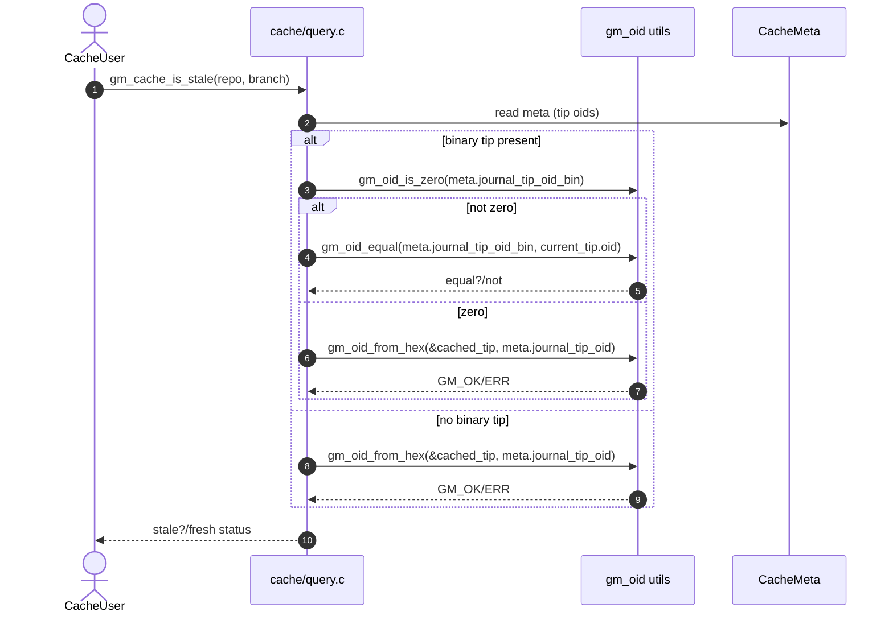
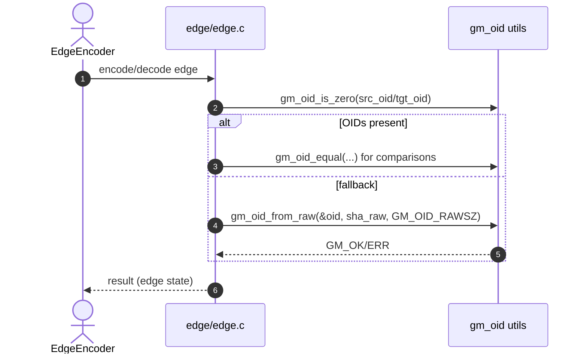

# Code Review Feedback

| Date | Agent | SHA | Branch | PR |
|------|-------|-----|--------|----|
| 2025-09-29 | CodeRabbit (and reviewers) | `e0243058aac14ff3a8c83af2f6d4dcfe97dd2804` | [feat/edge-port-followup](https://github.com/neuroglyph/git-mind/tree/feat/edge-port-followup "neuroglyph/git-mind:feat/edge-port-followup") | [PR#173](https://github.com/neuroglyph/git-mind/pull/173) |

## CODE REVIEW FEEDBACK

### core/include/gitmind/util/oid.h:7 — coderabbitai[bot]

```text
_⚠️ Potential issue_ | _🔴 Critical_

<details>
<summary>🧩 Analysis chain</summary>

**Verify umbrella exposure in include/gitmind.h.**

Public headers must be umbrella‑safe and reachable via the umbrella. Please confirm this header is re‑exported.

---

🏁 Script executed:

```shell
#!/bin/bash
# Expect: include/gitmind.h exists and references util/oid.h
fd -a gitmind.h include | xargs -I{} rg -n 'gitmind/util/oid\.h' {}
# Also check for duplicates/different paths:
rg -nP --glob 'include/**' '\butil/oid\.h\b'
```

Length of output: 0

---

🏁 Script executed:

```shell
#!/usr/bin/env bash
# Locate all gitmind.h files and check for util/oid.h references
find . -type f -name gitmind.h | while read file; do
  echo "---- $file ----"
  grep -Hn "util/oid\.h" "$file" || echo "no reference"
done
```

Length of output: 42

---


</details>

**Include util/oid.h in the umbrella header**  
Add the following to `include/gitmind.h` so that `core/include/gitmind/util/oid.h` is re-exported by the umbrella API:  
```diff
--- a/include/gitmind.h
+++ b/include/gitmind.h
@@ /* somewhere among other includes */
+#include <gitmind/util/oid.h>
```

<!-- suggestion_start -->

<details>
<summary>📝 Committable suggestion</summary>

> ‼️ **IMPORTANT**
> Carefully review the code before committing. Ensure that it accurately replaces the highlighted code, contains no missing lines, and has no issues with indentation. Thoroughly test & benchmark the code to ensure it meets the requirements.

```suggestion
++ b/include/gitmind.h
@@ /* somewhere among other umbrella-header includes */
 #include <gitmind/other_header.h>
#include <gitmind/util/oid.h>
 #include <gitmind/yet_another_header.h>
```

</details>

<!-- suggestion_end -->

<details>
<summary>🤖 Prompt for AI Agents</summary>

```
In core/include/gitmind/util/oid.h at line 7, the util/oid header is not being
re-exported by the umbrella API; open include/gitmind.h and add an #include
"gitmind/util/oid.h" (placed with the other util/includes or alphabetical group)
so that core/include/gitmind/util/oid.h is exposed via the umbrella header;
update any include guards or ordering if necessary to preserve compile order.
```

</details>

<!-- fingerprinting:phantom:medusa:chinchilla -->

<!-- This is an auto-generated comment by CodeRabbit -->
```

_Meta_: https://github.com/neuroglyph/git-mind/pull/173#discussion_r2387021216

{response}

### core/src/edge/attributed.c:285 — coderabbitai[bot]

```text
_⚠️ Potential issue_ | _🔴 Critical_

**Fix OID backfill length mismatch (potential OOB read)**

You pass GM_OID_RAWSZ while sourcing from out.src_sha/out.tgt_sha (GM_SHA1_SIZE). That can read past the SHA buffer or fail. Zero‑pad into a GM_OID_RAWSZ scratch first.

```diff
-    if (gm_oid_is_zero(&out.src_oid)) {
-        (void)gm_oid_from_raw(&out.src_oid, out.src_sha, GM_OID_RAWSZ);
-    }
-    if (gm_oid_is_zero(&out.tgt_oid)) {
-        (void)gm_oid_from_raw(&out.tgt_oid, out.tgt_sha, GM_OID_RAWSZ);
-    }
+    if (gm_oid_is_zero(&out.src_oid)) {
+        uint8_t tmp[GM_OID_RAWSZ];
+        gm_memset_safe(tmp, sizeof tmp, 0, sizeof tmp);
+        gm_memcpy_span(tmp, sizeof tmp, out.src_sha, GM_SHA1_SIZE);
+        (void)gm_oid_from_raw(&out.src_oid, tmp, GM_OID_RAWSZ);
+    }
+    if (gm_oid_is_zero(&out.tgt_oid)) {
+        uint8_t tmp[GM_OID_RAWSZ];
+        gm_memset_safe(tmp, sizeof tmp, 0, sizeof tmp);
+        gm_memcpy_span(tmp, sizeof tmp, out.tgt_sha, GM_SHA1_SIZE);
+        (void)gm_oid_from_raw(&out.tgt_oid, tmp, GM_OID_RAWSZ);
+    }
```
As per coding guidelines (zero outputs on error paths; use gm_memcpy_span). Based on learnings.

<!-- suggestion_start -->

<details>
<summary>📝 Committable suggestion</summary>

> ‼️ **IMPORTANT**
> Carefully review the code before committing. Ensure that it accurately replaces the highlighted code, contains no missing lines, and has no issues with indentation. Thoroughly test & benchmark the code to ensure it meets the requirements.

```suggestion
    if (gm_oid_is_zero(&out.src_oid)) {
        uint8_t tmp[GM_OID_RAWSZ];
        gm_memset_safe(tmp, sizeof tmp, 0, sizeof tmp);
        gm_memcpy_span(tmp, sizeof tmp, out.src_sha, GM_SHA1_SIZE);
        (void)gm_oid_from_raw(&out.src_oid, tmp, GM_OID_RAWSZ);
    }
    if (gm_oid_is_zero(&out.tgt_oid)) {
        uint8_t tmp[GM_OID_RAWSZ];
        gm_memset_safe(tmp, sizeof tmp, 0, sizeof tmp);
        gm_memcpy_span(tmp, sizeof tmp, out.tgt_sha, GM_SHA1_SIZE);
        (void)gm_oid_from_raw(&out.tgt_oid, tmp, GM_OID_RAWSZ);
    }
```

</details>

<!-- suggestion_end -->

<!-- fingerprinting:phantom:poseidon:chinchilla -->

<!-- This is an auto-generated comment by CodeRabbit -->
```

_Meta_: https://github.com/neuroglyph/git-mind/pull/173#discussion_r2387021226

{response}

### core/src/edge/edge.c:497 — coderabbitai[bot]

```text
_⚠️ Potential issue_ | _🔴 Critical_

**Fix OID backfill length mismatch (potential OOB read)**

As in attributed.c, passing GM_OID_RAWSZ while sourcing from GM_SHA1_SIZE buffers risks OOB. Zero‑pad into a GM_OID_RAWSZ scratch first.

```diff
-    if (gm_oid_is_zero(&edge.src_oid)) {
-        (void)gm_oid_from_raw(&edge.src_oid, edge.src_sha, GM_OID_RAWSZ);
-    }
-    if (gm_oid_is_zero(&edge.tgt_oid)) {
-        (void)gm_oid_from_raw(&edge.tgt_oid, edge.tgt_sha, GM_OID_RAWSZ);
-    }
+    if (gm_oid_is_zero(&edge.src_oid)) {
+        uint8_t tmp[GM_OID_RAWSZ];
+        gm_memset_safe(tmp, sizeof tmp, 0, sizeof tmp);
+        gm_memcpy_span(tmp, sizeof tmp, edge.src_sha, GM_SHA1_SIZE);
+        (void)gm_oid_from_raw(&edge.src_oid, tmp, GM_OID_RAWSZ);
+    }
+    if (gm_oid_is_zero(&edge.tgt_oid)) {
+        uint8_t tmp[GM_OID_RAWSZ];
+        gm_memset_safe(tmp, sizeof tmp, 0, sizeof tmp);
+        gm_memcpy_span(tmp, sizeof tmp, edge.tgt_sha, GM_SHA1_SIZE);
+        (void)gm_oid_from_raw(&edge.tgt_oid, tmp, GM_OID_RAWSZ);
+    }
```
As per coding guidelines (safe memory ops; zero on error).

<!-- suggestion_start -->

<details>
<summary>📝 Committable suggestion</summary>

> ‼️ **IMPORTANT**
> Carefully review the code before committing. Ensure that it accurately replaces the highlighted code, contains no missing lines, and has no issues with indentation. Thoroughly test & benchmark the code to ensure it meets the requirements.

```suggestion
    if (gm_oid_is_zero(&edge.src_oid)) {
        uint8_t tmp[GM_OID_RAWSZ];
        gm_memset_safe(tmp, sizeof tmp, 0, sizeof tmp);
        gm_memcpy_span(tmp, sizeof tmp, edge.src_sha, GM_SHA1_SIZE);
        (void)gm_oid_from_raw(&edge.src_oid, tmp, GM_OID_RAWSZ);
    }
    if (gm_oid_is_zero(&edge.tgt_oid)) {
        uint8_t tmp[GM_OID_RAWSZ];
        gm_memset_safe(tmp, sizeof tmp, 0, sizeof tmp);
        gm_memcpy_span(tmp, sizeof tmp, edge.tgt_sha, GM_SHA1_SIZE);
        (void)gm_oid_from_raw(&edge.tgt_oid, tmp, GM_OID_RAWSZ);
    }
```

</details>

<!-- suggestion_end -->

<details>
<summary>🤖 Prompt for AI Agents</summary>

```
In core/src/edge/edge.c around lines 492 to 497, the code calls gm_oid_from_raw
using edge.src_sha/edge.tgt_sha buffers sized GM_SHA1_SIZE but passes
GM_OID_RAWSZ which can read past the source buffer; to fix, allocate a
GM_OID_RAWSZ-byte scratch array, zero it, copy GM_SHA1_SIZE bytes from the SHA
buffer into the scratch, then call gm_oid_from_raw with the scratch and
GM_OID_RAWSZ; ensure the scratch is zeroed before use and that any failure from
gm_oid_from_raw leaves the oid zeroed (follow existing safe-memory/error-zeroing
patterns).
```

</details>

<!-- fingerprinting:phantom:poseidon:chinchilla -->

<!-- This is an auto-generated comment by CodeRabbit -->
```

_Meta_: https://github.com/neuroglyph/git-mind/pull/173#discussion_r2387021236

{response}

### core/src/util/oid.c:17 — coderabbitai[bot]

```text
_🛠️ Refactor suggestion_ | _🟠 Major_

<details>
<summary>🧩 Analysis chain</summary>

**Repo-wide check: ensure no straggler `git_oid_cmp`/raw memcmp remain**

Run a quick scan to confirm all equality moves funnel through gm_oid_equal.

---

🏁 Script executed:

```shell
#!/bin/bash
# Find legacy equality patterns that should be gm_oid_equal
rg -nP --type=c --type=h -C2 '\bgit_oid_cmp\s*\(|\bmemcmp\s*\(\s*[^,]*->id\s*,\s*[^,]*->id\s*,\s*GM_OID_RAWSZ\s*\)'
```

Length of output: 201

---


</details>

**Replace raw memcmp in OID comparison with gm_oid_equal**

* In `core/src/util/oid.c:79`, replace  
  `return memcmp(lhs->id, rhs->id, GM_OID_RAWSZ) == 0;`  
  with  
  `return gm_oid_equal(lhs, rhs);`

<details>
<summary>🤖 Prompt for AI Agents</summary>

```
In core/src/util/oid.c around lines 4 to 17 and specifically at line ~79,
replace the raw memcmp comparison `memcmp(lhs->id, rhs->id, GM_OID_RAWSZ) == 0`
with the helper `gm_oid_equal(lhs, rhs)`; update the return to `return
gm_oid_equal(lhs, rhs);` so the OID equality uses the centralized function (no
other changes needed if oid.h is already included).
```

</details>

<!-- fingerprinting:phantom:poseidon:chinchilla -->

<!-- This is an auto-generated comment by CodeRabbit -->
```

_Meta_: https://github.com/neuroglyph/git-mind/pull/173#discussion_r2387021242

{response}

### core/tests/unit/test_cache_query.c:99 — coderabbitai[bot]

```text
_🛠️ Refactor suggestion_ | _🟠 Major_

**Use gm_strcpy_safe in tests (no raw strcpy)**

Per project guidelines, tests also use safety wrappers. Replace both strcpy calls.

Apply:

```diff
-    edges[0].rel_type = GM_REL_IMPLEMENTS; edges[0].confidence = 0x3C00; strcpy(edges[0].src_path, "A"); strcpy(edges[0].tgt_path, "B");
+    edges[0].rel_type = GM_REL_IMPLEMENTS;
+    edges[0].confidence = 0x3C00;
+    (void)gm_strcpy_safe(edges[0].src_path, GM_PATH_MAX, "A");
+    (void)gm_strcpy_safe(edges[0].tgt_path, GM_PATH_MAX, "B");
@@
-    edges[1].rel_type = GM_REL_IMPLEMENTS; edges[1].confidence = 0x3C00; strcpy(edges[1].src_path, "A"); strcpy(edges[1].tgt_path, "C");
+    edges[1].rel_type = GM_REL_IMPLEMENTS;
+    edges[1].confidence = 0x3C00;
+    (void)gm_strcpy_safe(edges[1].src_path, GM_PATH_MAX, "A");
+    (void)gm_strcpy_safe(edges[1].tgt_path, GM_PATH_MAX, "C");
```

Include header if not already:
```c
#include "gitmind/security/string.h"
```
As per coding guidelines.

<details>
<summary>🤖 Prompt for AI Agents</summary>

```
In core/tests/unit/test_cache_query.c around lines 93 to 99, the test uses raw
strcpy which violates project safety guidelines; replace both
strcpy(edges[0].src_path, "A") / strcpy(edges[0].tgt_path, "B") and the pair for
edges[1] with gm_strcpy_safe(dest, sizeof dest, "literal") calls, and ensure the
file includes the safety header by adding #include "gitmind/security/string.h"
at the top if it isn't already present.
```

</details>

<!-- fingerprinting:phantom:poseidon:chinchilla -->

<!-- This is an auto-generated comment by CodeRabbit -->
```

_Meta_: https://github.com/neuroglyph/git-mind/pull/173#discussion_r2387021247

{response}

### docs/code-reviews/PR173/7445bcf00c71b6f768e9eb6b1fd99d2b1c60783f.md:10 — coderabbitai[bot]

```text
_🛠️ Refactor suggestion_ | _🟠 Major_

**Align title/H1, add ToC, and insert SPDX header**

To meet docs guidelines: make H1 match the title, add a "## Table of Contents", and place SPDX after front matter.

As per coding guidelines

```diff
 --- 
-title: 7445bcf00c71b6f768e9eb6b1fd99d2b1c60783f.md
+title: Code Review Feedback
 description: Preserved review artifacts and rationale.
 audience: [contributors]
 domain: [quality]
 tags: [review]
 status: archive
 ---
 
-# Code Review Feedback
+<!-- SPDX-License-Identifier: LicenseRef-MIND-UCAL-1.0 -->
+
+# Code Review Feedback
+
+## Table of Contents
+- Overview
+- Commits Reviewed
+- Notes
+- Finishing Touches
```

<!-- suggestion_start -->

<details>
<summary>📝 Committable suggestion</summary>

> ‼️ **IMPORTANT**
> Carefully review the code before committing. Ensure that it accurately replaces the highlighted code, contains no missing lines, and has no issues with indentation. Thoroughly test & benchmark the code to ensure it meets the requirements.

```suggestion
---
title: Code Review Feedback
description: Preserved review artifacts and rationale.
audience: [contributors]
domain: [quality]
tags: [review]
status: archive
---

<!-- SPDX-License-Identifier: LicenseRef-MIND-UCAL-1.0 -->

# Code Review Feedback

## Table of Contents
- Overview
- Commits Reviewed
- Notes
- Finishing Touches
```

</details>

<!-- suggestion_end -->

<details>
<summary>🤖 Prompt for AI Agents</summary>

```
In docs/code-reviews/PR173/7445bcf00c71b6f768e9eb6b1fd99d2b1c60783f.md around
lines 1 to 10, the document needs to follow docs guidelines: make the H1 match
the title, add a "## Table of Contents" section, and insert an SPDX header
immediately after the YAML front matter; update the top-level heading to exactly
match the title line, add a "## Table of Contents" line beneath the H1, and add
a standard SPDX license identifier line (e.g., "SPDX-License-Identifier: MIT")
directly after the closing front-matter delimiter.
```

</details>

<!-- fingerprinting:phantom:poseidon:chinchilla -->

<!-- This is an auto-generated comment by CodeRabbit -->
```

_Meta_: https://github.com/neuroglyph/git-mind/pull/173#discussion_r2387021252

{response}

### docs/code-reviews/PR173/7445bcf00c71b6f768e9eb6b1fd99d2b1c60783f.md:419 — coderabbitai[bot]

```text
_⚠️ Potential issue_ | _🟡 Minor_

**Drop leftover `{response}` placeholder**

The placeholder renders verbatim and is confusing in a static artifact. Remove it.


```diff
- {response}
-
```

<!-- suggestion_start -->

<details>
<summary>📝 Committable suggestion</summary>

> ‼️ **IMPORTANT**
> Carefully review the code before committing. Ensure that it accurately replaces the highlighted code, contains no missing lines, and has no issues with indentation. Thoroughly test & benchmark the code to ensure it meets the requirements.

```suggestion
_Meta_: https://github.com/neuroglyph/git-mind/pull/173#issuecomment-3345476880

```

</details>

<!-- suggestion_end -->

<details>
<summary>🤖 Prompt for AI Agents</summary>

```
In docs/code-reviews/PR173/7445bcf00c71b6f768e9eb6b1fd99d2b1c60783f.md around
lines 122 to 125, there is a leftover literal "{response}" placeholder that
renders verbatim and is confusing; remove the "{response}" token and any
surrounding placeholder markers so the file contains only the intended static
text (or replace it with the correct static content if one was intended), then
save and run a quick preview to confirm no stray placeholders remain.
```

</details>

<!-- fingerprinting:phantom:poseidon:chinchilla -->

<!-- This is an auto-generated comment by CodeRabbit -->

✅ Addressed in commit 17ddad1
```

_Meta_: https://github.com/neuroglyph/git-mind/pull/173#discussion_r2387021260

{response}

### General comment — coderabbitai[bot]

```text
<!-- This is an auto-generated comment: summarize by coderabbit.ai -->
<!-- This is an auto-generated comment: review in progress by coderabbit.ai -->

> [!NOTE]
> Currently processing new changes in this PR. This may take a few minutes, please wait...
> 
> <details>
> <summary>📥 Commits</summary>
> 
> Reviewing files that changed from the base of the PR and between eaf10c68312837f2c879203292c0e58b568b83a8 and e0243058aac14ff3a8c83af2f6d4dcfe97dd2804.
> 
> </details>
> 
> <details>
> <summary>📒 Files selected for processing (4)</summary>
> 
> * `core/include/gitmind/util/oid.h` (2 hunks)
> * `core/src/util/oid.c` (2 hunks)
> * `core/tests/unit/test_cache_query.c` (4 hunks)
> * `include/gitmind.h` (1 hunks)
> 
> </details>
> 
> ```ascii
>  ____________________________________________
> < Like a moth to a flame, I'm drawn to bugs. >
>  --------------------------------------------
>   \
>    \   (\__/)
>        (•ㅅ•)
>        / 　 づ
> ```

<!-- end of auto-generated comment: review in progress by coderabbit.ai -->
<!-- usage_tips_start -->

> [!TIP]
> <details>
> <summary>You can disable the changed files summary in the walkthrough.</summary>
> 
> Disable the `reviews.changed_files_summary` setting in your project's settings in CodeRabbit to disable the changed files summary in the walkthrough.
> 
> </details>

<!-- usage_tips_end -->
<!-- walkthrough_start -->

## Walkthrough
Adds a new gm_oid utility API (gm_oid_equal, gm_oid_is_zero, gm_oid_from_raw, gm_oid_from_hex) and migrates core modules and unit tests to use it instead of libgit2 git_oid helpers; updates cache/journal flows for safer init and hex handling; removes many PR172 review artifacts and adds PR173 artifact; updates activity docs.

## Changes
| Cohort / File(s) | Summary |
| --- | --- |
| **OID utilities API**<br>`core/include/gitmind/util/oid.h`, `core/src/util/oid.c` | Add gm_oid_equal, gm_oid_is_zero, gm_oid_from_raw, gm_oid_from_hex; implement hex parsing, validation, and defensive checks; retain gm_oid_to_hex. |
| **Cache & query**<br>`core/src/cache/query.c` | Replace local hex/oid helpers with gm_oid_* APIs; use gm_memset_safe for meta init; use gm_oid_is_zero/gm_oid_from_hex/gm_oid_equal in stale checks. |
| **Journal writer**<br>`core/src/journal/writer.c` | Use gm_oid_from_hex/gm_oid_to_hex and narrow internal commit_oid param to gm_oid_t; preserve existing commit/parent flow with new OID helpers. |
| **Edge & attributed handling**<br>`core/src/edge/edge.c`, `core/src/edge/attributed.c` | Replace git_oid_* usage with gm_oid_* for encode/decode, backfill, and comparisons; add error checks on OID parsing. |
| **Domain / edge map**<br>`core/src/domain/cache/edge_map.c` | Validate bucket_count != 0; replace git_oid_cmp with gm_oid_equal; remove git2/oid.h include and add gitmind/util/oid.h. |
| **Hooks / augment**<br>`core/src/hooks/augment.c` | Use gm_oid_equal for comparisons; adopt GM_CALLBACK_STOP and GM_OK sentinel checks; add oid util include. |
| **Adapters**<br>`core/src/adapters/git/libgit2_repository_port.c` | Switch git_oid_equal → gm_oid_equal; include gitmind/util/oid.h. |
| **Unit tests (many files)**<br> `core/tests/unit/*` (e.g., `test_cache_query.c`, `test_cache_edge_map.c`, `test_edge_cbor_oid.c`, `test_journal_*`, `test_cache_*`, ...) | Replace git_oid_fromraw/compare with gm_oid_from_raw/gm_oid_equal/gm_oid_is_zero; add GM_OK asserts; use safe string helpers and updated headers. |
| **Docs — activity & agents**<br>`docs/activity/2025-09.md`, `AGENTS.md` | Add 2025‑09‑29 activity entry documenting gm_oid utilities and migrations; update AGENTS.md narrative/housekeeping notes. |
| **Docs — code review artifacts**<br>`docs/code-reviews/PR172/*`, `docs/code-reviews/PR173/7445bcf00c71b6f768e9eb6b1fd99d2b1c60783f.md` | Remove multiple archived PR172 review artifact files; add PR173 code-review artifact document. |

## Sequence Diagram(s)




## Estimated code review effort
🎯 3 (Moderate) | ⏱️ ~30 minutes

## Possibly related PRs
- neuroglyph/git-mind#165 — Very similar OID-first migration touching gm_oid_* helpers and edge/cache/journal paths.  
- neuroglyph/git-mind#171 — Overlapping changes converting callers from git_oid_* to gm_oid_* across core modules and tests.  
- neuroglyph/git-mind#172 — Prior PR that introduced related OID utilities and review artifacts; closely intersects doc cleanup and OID surface.

## Poem
> I hop through hex and tidy bytes,  
> I nibble zeros in moonlit nights.  
> From raw to oid I dance and test—  
> “GM_OK” I whisper, then to rest.  
> Thump-thump, the cache and journals beam. 🐇✨

<!-- walkthrough_end -->

<!-- pre_merge_checks_walkthrough_start -->

## Pre-merge checks and finishing touches
<details>
<summary>❌ Failed checks (2 warnings)</summary>

|     Check name     | Status     | Explanation                                                                                                                                                                                                                                                          | Resolution                                                                                                                                                                                                                                                          |
| :----------------: | :--------- | :------------------------------------------------------------------------------------------------------------------------------------------------------------------------------------------------------------------------------------------------------------------- | :------------------------------------------------------------------------------------------------------------------------------------------------------------------------------------------------------------------------------------------------------------------ |
|  Description Check | ⚠️ Warning | The provided description includes a summary and testing instructions but omits the required “Change Areas,” “Risk,” and “Code Review Guidance” sections specified by the repository’s description template, making it incomplete relative to the expected structure. | Please expand the description to include the “Change Areas” checklist with appropriate scopes selected, a “Risk” section indicating whether this introduces behavior or public API changes, and the “Code Review Guidance” section per the template’s requirements. |
| Docstring Coverage | ⚠️ Warning | Docstring coverage is 41.18% which is insufficient. The required threshold is 80.00%.                                                                                                                                                                                | You can run `@coderabbitai generate docstrings` to improve docstring coverage.                                                                                                                                                                                      |

</details>
<details>
<summary>✅ Passed checks (1 passed)</summary>

|  Check name | Status   | Explanation                                                                                                                                                                                                                                                                                                    |
| :---------: | :------- | :------------------------------------------------------------------------------------------------------------------------------------------------------------------------------------------------------------------------------------------------------------------------------------------------------------- |
| Title Check | ✅ Passed | The title “feat(core/oid): migrate edge/cache to gm helpers” succinctly captures a key aspect of the changeset by highlighting the migration of edge and cache components in the core/oid module to the new gm helper APIs, making it a clear and specific summary of a significant part of this pull request. |

</details>

<!-- pre_merge_checks_walkthrough_end -->

<!-- tips_start -->

---

Thanks for using CodeRabbit! It's free for OSS, and your support helps us grow. If you like it, consider giving us a shout-out.

<details>
<summary>❤️ Share</summary>

- [X](https://twitter.com/intent/tweet?text=I%20just%20used%20%40coderabbitai%20for%20my%20code%20review%2C%20and%20it%27s%20fantastic%21%20It%27s%20free%20for%20OSS%20and%20offers%20a%20free%20trial%20for%20the%20proprietary%20code.%20Check%20it%20out%3A&url=https%3A//coderabbit.ai)
- [Mastodon](https://mastodon.social/share?text=I%20just%20used%20%40coderabbitai%20for%20my%20code%20review%2C%20and%20it%27s%20fantastic%21%20It%27s%20free%20for%20OSS%20and%20offers%20a%20free%20trial%20for%20the%20proprietary%20code.%20Check%20it%20out%3A%20https%3A%2F%2Fcoderabbit.ai)
- [Reddit](https://www.reddit.com/submit?title=Great%20tool%20for%20code%20review%20-%20CodeRabbit&text=I%20just%20used%20CodeRabbit%20for%20my%20code%20review%2C%20and%20it%27s%20fantastic%21%20It%27s%20free%20for%20OSS%20and%20offers%20a%20free%20trial%20for%20proprietary%20code.%20Check%20it%20out%3A%20https%3A//coderabbit.ai)
- [LinkedIn](https://www.linkedin.com/sharing/share-offsite/?url=https%3A%2F%2Fcoderabbit.ai&mini=true&title=Great%20tool%20for%20code%20review%20-%20CodeRabbit&summary=I%20just%20used%20CodeRabbit%20for%20my%20code%20review%2C%20and%20it%27s%20fantastic%21%20It%27s%20free%20for%20OSS%20and%20offers%20a%20free%20trial%20for%20proprietary%20code)

</details>

<sub>Comment `@coderabbitai help` to get the list of available commands and usage tips.</sub>

<!-- tips_end -->

<!-- internal state start -->


<!-- DwQgtGAEAqAWCWBnSTIEMB26CuAXA9mAOYCmGJATmriQCaQDG+Ats2bgFyQAOFk+AIwBWJBrngA3EsgEBPRvlqU0AgfFwA6NPEgQAfACgjoCEYDEZyAAUASpETZWaCrKPR1AGxJcAZiWoAFEwUJAD0+PC0AJRczPBEVDSQdKShDGgMsCSQBJBEzJBZHtyUyAG2kGYAjADsAMxRkJAGAHKOApRctXVNBgCqNgAyXLC4uNyIHKGhROqw2AIaTMyh5NgU+EQestywM+pgcRi0odzYHh6h3b19iJ2QPtvwGAmC+LjIzQDK+OsM2QIqBhMr5/LhQikSGBuPgKLgwD58Bd8AB3bDcSCAJMIYM5SLhIIDMCDIMxtFhvrhqNhJvwSuSDABhELUOjoTiQABMAAYOQBWMBcgCcYA5gugXJqHAALFyOByABwALSMX0cpJcHAMUAAgrR6PlIAB5ACSABFIHh4B51PBpFx8gB9CK0B0+DbMB1UFEAGjyHudrvdDqyAA9fY6AyQAI7YNAecP+yIOpAOgBelHwGi1kD63FoLOStFIvvSmRIvtg+HwAGtEL7MPQhL8KBg4zl8Ba7jkspByCi/UazYUSMVSlmoIqM2Bnja4/B04wMj22JT85T28lrUcC480NX5CbzctuM4kPgMIhx5AALLxRLZbAYdQ5aQfDfU7IGoolCjIBsbjxNnQMRJHUeR0TXaQswMaBX2eIhNSgGxH1iPdsgYeAwEA9IPHMSxc0g+hBBEECpGQBwnBcPDrDsCj1VcGDPG8B4wSCWEwmdGISTvAtITSJdslyL8Rx/MoKmqeoojcBBkAqZ5cA2WhsH+ZA+wHQ8LXEa1xGkSAAgjJM3RYT00B9P0nUMoNQwTCyXWjWN43MgMU3TDZGn/CCWWQYJ0JYGFyAwN9cg/bsSGYLhIRLASKyrWt62OSAm3WVsPA0SAGQEkkSFXag0BQZBXMIGdxDndN6FyEJmHwKQHg8PcDyHY9T0Qc9LxzJ98RoRA32cbI4gSFlyo7ELcB7YTR1/dAEtyQCiGA8QJDAi08y8tLYO6+CUAvBTlPEVquAoR8STQxhMOwuM0p+P4ASBYk/GoCEiyhGE4QRJFALRDFsWgXFsoJW7YFQ55LspXBqS4fA6TS257keWR4I2AR3jagZhkKMYJimfZRoWJYWFWEh1k2bZdmxw5nhOM4Liueo0qZMFWWoLhuT5AVhVFcVJRlOUlWg/RjHAKAyCInwcAIYgyGUGh6GWNhAq4Xh+GEUQFt0uQFCUKhVHULQdH5kwoDgVBUEwMXCFIch7xllg5fZL17DVZx5HVphNZUNRNG0XQwEMAXTAMbUAHEAFEWmgL4NGYWhNQAIjjgwLEgbVjQly3Bodyj5HwUXMkwUhEGk1BaHgHwc9apA32zyBaHwBhHHYah4HPZbIOQZ4k5DsOI6jtLdSUehrXIZAlEQBgKHgDp0EgU0qB8fErEfWt7G4Z4wF+XBfXE2oOSyihSCm+gQjq6XIBRWFaxPf5Cl+O5qxIEgV5eX1IWhWF8URZEUTAdFT/P+L6G4HVDA5B6DkBDPibqD9kCIj4GgbAxdxAvAPjwN+m0hKJhdAQYMJAQzIKPunS02lbRtVNCObKrJB66UqtVbIvAm58AwO8XSKh16LkyPBUIkR2BLRwQpDIe0sD/nPEQCISDITcQGgI6u2VtAeDrFtBgHh4GbRCH4EIwJdK5EQCUDCPh4AMGHCGNAIiMCvzhL/Cg1ZkHwFYHQeABYwH4n4U3C8a0sghHQB4xhDxHwgXPG2V26FYB52kL6LqHxfSwh4Asa0BjtRWGNIwYJLxpAAG5+AYG2L2ZwiRJC0I2CReE3UqTIE8l1ZBPg8DrGyGfSxPAgGXiMNRbUHgaC5NahuUa2QlCKOcI3DpVccEvRPlEs4AhYnJECjaaQRgoAtA7EMt+dBTgxP0dI3p7SLwkkUCXW0tAjDBw2qSE+gTIAhEWiQfsJBS5vy4IMVEBg44x1mf7HynDgRKKUNjI4JxCHhEiBoQGjz46J2TqnKWrI6JO34DnZJ+dZlJz1KyNSYyJnxMSTAwc5pkm0EHghAwTQoAGTsjGOMXAmohGQLgM+WLoFRLkDQacSgpk4QUIFdgWZCVOSTC5DM5KsgMCXiXKaWL8roAuGAQq/A+BdJQfJSgYqWh9EGIMTluhuUuiMh6L0CtIbnC8iKjSWqp72wZQCbApdKBqqJRgwMxlQwK2cHcP8hj7AKU2vJDsptDxXmNIFRSylWTBEpf5YuSDKnAikYgeIrYwaUq2goEI7zFHwLCLMXAPzQh/OdIC9J3jc4pKpQskMFdNoRr8ReQAmAQEhIMExaUSonRqILG6pjSmmgtaVLFxRbQrrLqps5AgyQzDNZKM1ZBjuE6QLtma82VKz0DQEi6OkAAAGSMkQaodPZOMbFtqbvxAAKg8LAeRTA93EodIeigJ6ogroTXorwq63nPBTV89Nmbs0AtgCumdc7FDoCXVwNdVYPCbt5RsXd3V92QAPZxO97cH3ZBXc+j5qbvkUyzVpf5tBAU/qgLO0a/7F39yA/JTdWqTIon0raw9zoSytXxNgeS8pL0wa9L6aN6ZWNegdF4DAt771WiQyh19ab1Afqwzm79v7CMLsA6usjF6KOhmo7ZVjsHIj0b3bnPgB7QwCYQ0Jp97Fk2fLExmjDn6cPSYMIc8Qxyg2KGyOc20Vyblwi4LO4ujhgXPK1K8kziAKAMH4mWUIMZKCyCWLHEFlgwUWwhfQKFLgYVJJCdOpCYUaEDxIEQDI8hQzYeHBNHxkbu16WKeIAximPShkvfgSjNk6sSDjNgcs5k6tYLo8gi926PCNGNbKxDvr/WKEDUltAfgtqzmtKmfpWAq7nVAyuPK3VDpiFbQmx0pYsjJkQA6Ypj7Fp5UdGwZgdxcAHcmyQK8NgH51X+PQYuIQxCQEKmAMsgrB2iwve/W0HhaDIBRHMKealvwKoveBjsmKVsaCSi2OMl74DcDU2oQRCVYc7ZIEjlHzokmiFrLd+7GRWShjAOLPHZ6pC/hcTwagQKuWOk6w150ARYfw5Sjj2yvoABkWPMHI8aNiJTVkcEBD5wJAX3BfTs+bJz8QuPIhRCvARdOzBzgK8fWehSG7Hioh7UfLOWBIf7alf+EX9qcGai5X68yWO9sHcpF4X0KIsiCIJM8aFHO2wK7FbwaQ7B6PMBPOPFqWBGH9g/MgXrpLQPGLJFBuuFB1GXYVxobreWT7qxN2mDM1rIC2+2wJB3h32uu7IL2DsaPoUK99D4OMoGBAZCsbkMnTe7jlWR2y6n0bm7Uk2hb2rOD8+24UrIB09uIsuF9O9z7ViYcyKWMXhXtlK+R+dWB03eeCXqsLx6e3lXT2ZU47Q+na/Oy6Rz1KhflIl9li53j54kDF2peeyrLKzAGDB7exmfHgqrzzJpaFobioprKLJwisjoqIDpKVb6KhBwIlrWjQrg6TQoiUDOZZZSC0D/y9iXLFaiQzC2pQ6EFqbKY4KeIPgd4JryoI6gazT6LQQWC+YvJgBGBvJBYhY1ykjPChZZCPSkAOikjcDRbMGgopwJZWwZz0SpYFrwrZh9ysiHRTJsCQAtbWhri07tyOiQiCFoAo5jwMwbghCFIEjKR3yXZMCPj4gAC81hkAXIp8IOeUI8Y8yOqsyQyesIROgCJO5UPYfWS0c+W2HoOhQhDoxGDw7oeQ6gamX+3A4u7ALgPs3WnEkAth9hG4MeDkCR/qsgyRmm/ASuROVUWB0idIzKDARuyQ4ClAKU0RuAHI2GgKw4i6Cq6sI4NinuiCc06gbcqGSgyCxGrINBdRDg3Awyqh9i9REmVoTRsAI2OuSkj2CiSiveC2P24mlmkmX6G4YxExWRbY1IxiN22Yho1ODebKOuoGeu/YlUCevaiAaAbAXAAgZhf0fCPecYvoT+lAAiOBi00a+I9BBivicKjM0aAxg2/hseS0/uxc6QSQ/4akrxgq2UE+vwgUqhc4Gh54jBcWnaA6nSPYPS/a82321RI6REfAoBE6UyU6Rg8y5AByRy6cpyLmeB1yMC7IXm8APmTyLBbBgWwW/BYQ1A7qrx0sIh/JYh4KkhyWWcsK6WCKd2Phyxb+r2h4CI7oYA9sOEcijho05GQYXo4u68GgB63OZypkvogc14Doh4DoNg2oAA6l8IqO5AlEMfQLafaWaI6S6W6fYPOKflQCuJQPWIBEgsDoaT6YaAANJ/5xQJo9JObahjAUBbohjJjB7XFRI+kMgABChoNgDocZwcAAmg6F8DYAyL6eaP+PmUWSWWWZWdAIHNAHWW4sbKNksbpEMrEs+JQBsHwDinig8FEhpCHtGkgh5BvnlFVB4v2fos+BpOileLqEINSCfHonURpIwhQKSLNvNlwE/jQC/lXOmmplDomXSp/KyNnjEQGFquxufiFFfr/ubrahRvbNGbAJALGX6U6a6YqN8f0ZtOkBtC8KEBIM6NOM2rCJtOXl4vfP3FeLePueOQeWKZtP+GtrtOsAEmCX0b2imQMSeKNFwNotpGcv4IDsBBsIgMgOrq0sjo+pQkDiDkuRhPiMnoUA2GOf+D8RAXJggi4m2ISCpKEJQv9P4EvJisyPmGoNpFFvIUui0ZrCsamvaJsccJhrMVJrseiBMWpLaaKuip2McdBAioySQEYEnASWSUSd0qIKSQIuSeASMtSeOpMuIPSdmDZcyfZqyU5jRRcm5lyZ5nYnyfHP5qwQYOwcKXxJCFKbFknOIZLHKY7CllXLITMtmCqQ9rpOqYxo8fvBeY+UmAeqKigRxYaRelVfZJIHGOwH+GPPgIxYWPvAEbgLIL6IWcWZMoEqEKRafqNPIv+E3oKg+mOVXIeNAlEV4HlpUZAF8AABLahXjaFPRbqx7n5z7IBzUGl/nvkbA9a2p9Z14N6bSTUt4dgcEHbBKhC4BECXaIDBIKDB7NQdLl5YCHW9SV74j+53CBRXj9V2BkCuwcKkWbSIDRllg9onVeoJSD6UaYUEjvB/ktTXTIKUh7x/RzXpLEbIBDmjL050p8DPBqGRCioniyCASLrDzrCbQjVXgFnN7TWQDAktzpzBRdgo32ww5IDTlzSHWax5L0DGqLX5YrXrWgXP4iz1GkHugvlA2UCLRIKyr+71rUgPAN43U1p1r0KmH4i/kapJwJKNJQB+qLGBp9EpprGpZ46ELTLIBZCtF8D6Q6W/LbHWaNBaJGVvybpVWQxdqtRoXPBRK5XE0XjVLiqgYaSjkerIA/gwJsD0DHa9pqT1Xm3Gi+h3wPybRS3LVrXai60XA3V9GUivZIXZB6GAL6IqBeBWUJz4ltKOW5Cyokl9JuWpYeWjpeXjJgF0nELWXni2W2YsknIhXsnhW3I3hRXMDMGxWClJocGhCVg1iIDwHYD5AcoMAxbPIykSHpzykyFEXKnE7LEaQUpnhYBwkN1JDGqXkBhxEJFPQ+z3XdZiAhg+y414i2SNDpEOHoJqZ9Zv2kAf3BaWnf2/2/SXacRpT5WX2QoEAYhnqiXNzGohBxpPhIJVBGHZTJSbT5nagqoFnagMhxlVnQCGhWCnxu6c2xT61bjPioA4L/B0B0DeGFX6gZVrLYPJQZGm2xkJm5AUwP2+RTIYCxgCLcO+EeHDmJlo3+AUBZJtLbhSLGoBAk18DAAZE8484KNRIgB2FVB+0djaOeF8AmP/l2nxmQAGNGPWN2EkNkMUNUNfA0NWBRD1j5jcDdEbhqTA2IIjhYlKLZCYoqNZLdSQwq4rQnzFT2KgYvpmY0heluq4oTzNH/g0mFH0DO1TrqUKqe0Wa6VWaApRDpLUKlF0ItY0DhAA4Q7qCNEGUpOppxOERON8XHBjmywtUEOPDv6uODDkOUPUO0PoBUr+HODbBgAxMYhNp1ENl2MJloCqSwiHmXHPAyMuLrm0CbmQLWzJ7SChrgU2zsDHSWKlADNeCvZqQqBrbOIdIBDDOjMeNeM2krONDtw6F3DOCZAT563N7IJ6kKr7V4n2Vt090d3EkuXd3lZDqUnSrRKD20m+Uj3ZiMJMkT1BVT0DEz3JDubckL1L0QBxUJUhbe6XAojjxtIpWH1xbpVpwnyn05Xn1IOqm6RHFlWiyBzNPVUiTXOm2BLt5QjaKiC7IGIaQFPELW7qoo0qY85hT+Pj4KT3yWkaCauNAhCcvR4VWaruhrYBCasaDK4742pqZYIqYmvavIN6vwNJgEBGs2su5OFl0eD62FSbSYOyLVIAE5L669o9UlAyE2wrlDgh5PHkIU3o5bRtJ1EoFytQCwHVaYkGEsgOhUvomsDqDGuas2QBiHqyz6u2u6tuqNypv4jps0CZty6I7Fu4B5saDhj6swYNsAN7MHNBQ9gjFtg3Fo2CCUgzga09gh4XO+7/jHiWhIK9Guo6uUoNxSK82CRjS2pVUyuhLHTyRkjXW1poD1p8A/WupU6lC0715WiW2QBxn3wTCFDxDuJYQkBSDXEfTII6PdOZNIJnrRqQKBS+gSlAH5wbgJ38WbTkUno8AbAniZ4rsbA71/kNuMDMhSL/iqLoEaLc1JBc012ipqFtZ/geK8BjbLFRLFxUVoCyBcNNIt2Quh1bIwvOUbKOWItLJUkosTKToYtQALyotBnNpUjxqgkhL7I4s2LBX4tPuuaEsRXz3eaL38nL3xVCkhblP72iGMuykn1ZUKmAd5VW09m21TyICHnJPsq0GurFzpp06/jFNM44IOh4ckAelHMhrnhhpzTZw+AXZsrFJ/sX70DqxqQJ3kFTnwR7N0W5PmUHGga5AUqCQ0oE00U4PQJxhdjNzSMXB/gJRxfICmqyBdThfJ3eVRdEFb6nWxcCpWLCrepDgmwSqFTpKjm6QZemdnBOJUqHQnE6h6hFe8cldK3GT2xiMdRJPBmGpDhYOmQEj5ebum1U04kYAz4ZjetYA6M4EiMZIOwMAqSXt9y9dooJJGmW64LDczZjc1fmjGp5ShhurjxPxhORCNxIJ8YvWwBabU4BM3cnjwCTS5BmryJetILNxrfIIbfNwODbfSCXt3ZDtbK/YNY3efkOj/f1bYK4IdCG2wiuuGm8LCysjcuwe/BEB/mypg6Cu/hXjBzDoNh22pOGXjGB1qTloCJzg9UVa4C0DrqpRve3dhc8//hnawjgRaQu1mv4Zkiw/E0lqQVzTvuJ1IJ3CkgsplA+nBw2AlnGgtAABqpDfp2oNggcfQ14oc0AnzDoavJZBZfQAAYtb2rw6DQ4aFWdeKQ4MGb/Gc59In4BeHkjeWjUqiqnKmZ22onHhK3XRz2p3XC4SSx8Jci7k5x3p/PbJgBiRquj6S0IaKaMaF8AyPr+aFz5umA9+/iL9jBseqegxtBgeteogAZlgIhsZqvcKap3hsn/Oqn3QEBhn1nzn3nzYAXyBpvrnhBiX9X3BoJo+shsp3pZcDmgwG3wRh316d33aZn9n7n/n3G0d9qqZKpoWzBl/VX0xoFCxletaUGVxjxaZLxmQPXw8EZtP83ypz7UsIv3+iJV3+n2v735vwP9vwqzFxl8NM2BHzlW2CS6Z9M8GBvo/wpaz8miC/QKmJzxYYEwq0nOejyWip+YyWK9MIOEi3qPh1AT1V8IC3vyEhgQsAXjJ0Q+D0saO8WDKlp0zhn0lSqlOimpDaYjxtKpTb2rMUF4uBsmyNL2vAKkxyMVI1cH7u/mfqWQWAupBvLVWOpfljSF/E8IxTQQ9h7YGkf7jjSyA/dL+7Wf8GszuBwhkAYPLABDx26iCiqEg17GtgYDcBwIpVGpCDkdC2D7BV2PwL6BUHC1pEkFebKYUtR8AT8gxRir8WIYrMrw17KBNUVLRiInoKCKmH4JyZn55ec0YEv+zwCYdNEw0LsKTzwL80puSPVwePkeJTYoC2gkgLoPfbgtqO+GD/p32XQroasA3XflRmAHrwtMUGE/rgDP5sYL+J+bjDfz4z38V076LYvpS/Q/pRODma2BJzQGckMBJLBTjgKU5Jp8BWaDqMQO6ikDdsoRPQrQKPoMCWW2nZgYWgvqctxBL2UvuG2xSgcoyzggoNKxF6FN24+A1CHfFXwR4L80eRQcd1NIFF9MaRFxisy2jy1UsUgg1iwDWzIJKsOtOfCNlExlE8ewIcCPEy/4REzAHA7IDHFGFlNX+sAGOHgkwIrtsgSIfUM0zmKaUlAoNMEh9RDy31GGswAxE/X1YT5v8IDSMLtXbgAkYiDYdEhcBVi+Mu2ZzUbC+1RDARgg7nbYFeDOLKALgvobxJF0O6LMBOzCDxFVGLh6I6A6SAnuRDhok8OwsqbOjVWbp0CHK0LA0bCyY491Y+nldjkPXRZJ8AqUw8TqgKk7zCPMsnXkvJxirLC3kawwgeCHCTbDscU+KLGp2lIadj6RwpgWyxYHdc2BeBTETSBxE8C5+Oxc3EILuBJ4wIoQNbHz0sHDxrBJVY4mCJZHPkpuptfIf2FGjUAaKMYCQVlwpIDl8QrxAIZzTICvccCRAWMBQDoqUoNc8g2xvaQTL7VJieUQwb8Wh52t7AGAOhIFFFgE8jq5kRALOLu64BRYgCHWkjEfB0UgiuQMgA4A8QlDsgeY8NBs2wpni+AqiVsGwA6YGpxEiTUqH4Ni4MZ1s+IQ6v3iQRVi0a2oUIAWVCAMh/BaiLLguhCHGChx8ZO8eUixyQBQx9gQhhiBfHbQ3x6AVfBNVXwZ1vxNLOukKxBwn5fQOrB7GB3HhRJwRdqZgLIMy5oUJe9xLhCyj7a+IWeoo/sJEziFKAdyNoDpP+GVRDgoxLidIU4j8ZBQOwIjMAKK3oBy9bhc0TFJOSdRhdqO2YL4DGhVHuVh0rHFZLx0T6FjQE7wXTmlEAJqQ+69AMoVEnVG7JWQuTLuoSTQIeJ5IAaR7NBDszIDHMswt0USy4CrV72pLALKsNfAECNhQYg/BAJdBkdxSloXEuGNSr0DmWkKY4bGNOGsDaeqacmnaIMRu1NY9rGYmmOsw9YhBOjQFAWN7R6knK/AAHDnUVpPllae/brF6EaCm08oakfrpVMG7VSCiL5E/FXFqk9YexdFZ8PVMERgSl2wSTqD2GKkCMWwJg8ITOgjoUADoHRXSM3FNgTi4QZ7KJJJJ6YeptotFVLNGj4zvxfWIQdJNrg2DMSaK3BLZBjUoDA4uwQnFJDhmo4dooW5WBjn2nhYDJRYRk+Pt5S0kIprejE2nMqLjQPhURDQsieWNaE0ZD+BRMfl0J6E19TIAmbECMJ+EtD9+jrKGaAJhnMZ1M7U4MgMJRCIBUw9/TWsV0O4BBrQd8LJFZOGLG4hB5TWAFJGdEoDQqbkmTpgO9HYCfJeAvyesKIFBidCYpceBKToAT4kYFAfYZGMOGxSYxipBKfGNUh4FHhVoJaOlNKAnl+il+DBDqRHDpwaqY4nfqjSR4ciHIFlUgGlAKok5Cxlw+oqKhDrWT7hamBqvWLUL9MXhfkwqSexpyYMoieXcpLkEPD2gUZqNVAB+HoDtxzh5VB1hCIokX9+pTY5ctf37BBDI2YZWBJ6QgkjjKuhU6+n5C+oYBA5oDTkaUioKnltpkc2It/hklDhuq8gaoVAFVzlIbqHNUccu2H5SpS555DYlHIdyFRw6GFcJPUnaDwR1ZomBWf2FVmTQAgeOf8Do3MYOwGe5iYlJpGVlTpQa54K4rVDFF3En8DxKNhFGBBOZhqogEKmDTpxjVIOAeCgFgUJqDTysZSVkBVGuS3N8QjUw7jeOYQJRxpZgsKJgCqxtp204fQki9KsnMcPpakuPmOk0nD0k+f0srItPkzIzmhlGaAdsiUhT8UxwgiYb0CaBKT+OQMvSGsy2hqIQgEtKIgTy4iIKdG+2UvkHJNJtC8AHQxjNjPP5mR+hicg7MGQEwBAv5yAFdCIzvTg9lIO3RmU5OmEaxXRHJdyZ6KwECkVh3M7qP5L5kkCdCDAMWbZAllpVNO0Y6QvFLkKZZOWT2IsaKmrZnsfZFYkHIqONAFzmpqMnnCa3sDBYCJfQzhSCLPIK0wZVUqjHYvzZWkUQyuRFP3HsDXY2eo45aQExEbhcaZZ3ObFIirjgdkEPEy7v9jooZ1cmp4uaEwHsGnwqA4xe4C4IUh2Dih12ZRhoHurgdn4GgZ6pdnKVvsNA5wamsI2BF1zIAFsq+o1Fzmh5m4mElkXESXHRc0aSMQ0ljWCy11pocDWlFBIfmvgCGWSZuN+K/lhDhxONDsNThLgNRzQ8qBIEtEwnnVY8LuBAI+nOmw9NoOCGIXNFPkQ1D5I1SZkYLcrwizMoCPAhPMRHHAIaxCNGoeBlxZZp8b7KxsvKIRZD55+xWhRf3yXBY3Bx4rsbspNkE8IWTSKALAorT1DrF0g1GTawTSyolZylcqQEBpL+LmgCK/6fArT7Rcm23zLAJiqHAFN5A5lXFeOjNZMyXJEi2eh6PZneTyWJmf0QFOUXbU+sB2H+crw0XRTEsUhaFLoqT57ccgNKFFN5WeVtM1iyYumXiNyncCIQVjAqRy0KpWz38k5PVMfFpx6l5qLACqaipNLorKxIKqjC6zpyqCZyq3YdM2L0GeJuxtsCrMGU6kIzkE2E8YmoPQhyCE0G3MJd2kmVUppl/bR+bMqwAbcv54io1QUCrERkY0Jyv5SkKXFcVnwo4juQrRgqRBOEOZBOVtwsEzoaJO805TLxlrahEAYktZqyBrnwSlef8+hkZjsnEccKegsAKZH+o5zkJu0WnPEsnawhXOxwHCrfLDrURfpRKswcpPwX3zl0HimQXv3RXC5LVZK0CjbQwh2r453FdsS8ENIpzo2GKnsK/ONAQsWkT0jpMAuj6gKKSrHL6VAodEZZIAiKqNNOtjqzqgM86mOSiBQW5NFxhE+RurEQU2LkFCaSxabOyDaNh0KsVkCAqkRaElV4w32km0gAFlrk7EFFdHMoxkrxBtADAJWnxBlrcA2oxwRfO1qIAskoLOdWWM8V/DQBtU1JOayThzw8lK6nnDVOcXpgPVfihjXMjwK5M5VqGB2iv0pEkiu5WUikXSr66HdFk3gqsf4uzABBjQ+a7io0B44ccU1Uk9sHfHzkZyxUocyIsaowX5S/ykmg7okhk3VIGVoil0SzMkVszFhPormZsI+C8zAxPKgQk+SBb/5IpDLTRVGOlk6LZZeilpdOOKomro5lE/UhaqQUvliMJyh1QWpe6GlcQ9cQKCBMTKLL7GGdMJSlM/rU1/wVS1fFXEGV/lIQbUSIbe3ER1rFev8/RGUA2gXAvhWKatVQRvph56GFeP6l4nPCSoMw/iyVeQB27IFaKCqeVeVkxTTyEo77Ddv/NNHnr6OFoxjq5QRZgKkWkCjjtAsfVOjrNzMglu6OJZyd2VuA5zYorc1bCs2cQEMCLNUVeEfNdApliKtZZBaJVPXETaWNVX0zOkYaoTIVLC0aRoa4aMxf2Gi3AaTS3i5tr4o4zurRYXUgwYNMmlLLm4JW+wM2CvgFbxlh1duO3jWQGD0yE8PALWqehTiy2YW9JQoCyXRaih7g0ZaBNuUI77GmKC4pkr2RnyIOAQDgjjReoDKMaBINZjjs9J47hZEkonWLxC0k6jF/24+e5zRqCz8dJ8cRCDtRWGzPS8O3TUjp51zVftRisnczt0iM7Bd4UwRHgErBpyksUPFxMmHoCU6ClEK4pXDrp0ZzqJ27UtdLwCYXKD57nI+ZDXDQfRn4MdO7qkI7GGlQlKu25eVm3lYBw5hVPuVEgHmLou2tsNJo1q1pNxqQWSUEgThg1S74I6W3XQR2yCfDuxzgQJerEDWjrXEzSM0c9MW2vSY+q229etvtEu1R62LJgoypmHMr0BrKhzZzI5W+SFFrm5zbW2SiI5jxPVIVQ9syoyzdOj6hQo8v7D8aRtfAJQOUTeV2gMm1oAQOz0yaLAGZkSamjNr0gYL6ZPjX5Yo1TUlNM0xm0Xa0pg1GLFxVcWVKSJppOoFUzPWnJ+p/Ig5ch/Yb8RkH+D+McK9q+utuueBtcd1r3azlGzpbZhvxhq8/DGtWygwdaLzL5oMQ8RhKaZL4BRSWDhTJrz9mm8NR2ENybcNuzS9aO/FfazqNwj42bCeKgaTbyoL1DCVMT/3TQVl2JAsOYKh5LiRGEZNpMKI3n9t/9sISUSpSgCqgBAdwCLGmw6W311m6+T8JaoHZdIMyj+WcXgEHFl6w9rUP3YeOZrZ6FeQingx0BgQRN1gqh2kXnJD6WBK982yPpaOW3vSb1ECgehtofUIpSEVo2nMJqrFozMEMGQHBvDAEWhmFMGDglDqv4OKGAt/fjIetoTeUsVLtPSN0o+14jRdXhpw1gFyonB1EUbKjd3PBnYbl1MWxdT4rYWNBTNaycyrlXSTP739zcapv3TKIvZ04CGfdg2lFg/6+OLaEIFZsnpMrbNLK9kJ5OJ5ICxFbJSTnZoWGHalh/sGuAwC3rOJFoPVUICzH5BChI40cdTn5qllJY4pz22fa9oal4F1jbMEUIKHglIrcgCxpY6RBzFnHNjUcJcaNBCDmp+RHwdWeutiW8trwoqQ/f4fImNYDZ1kIvnsrbl9bCRwODxIMjiGXKvkI1KKGWCyg5R1w+1GKJvRwJUtsl6gBVK3OGRalbQPTArOT2gI/4Ng04Ebk+J+NsJlwMiNcHlDoSx7iDhMHIR2C1oXM8sFAJvPvE0Ezd0tlKJEDVDyhY4wAcEoNeeHST9RNkqWAMdgbfDGpn9RqSdQ4YL1PLSTS46g1/I+whUJTC28VDGgf7gJNsptbo6GGMT+JQMfzc7CGs5prNLs1B41I8fZjAMOwzpi44VxWpWBTQAADU5r6IDx2QCefWBxDjJRN6Udea7LAojs1T/Yd06KB8o/KcmC7K+Zon8Ku7No8ZhwtrguaEKZIBAceKyhzPgJT1Vei9TXtg0raXDtohPptoZJj1xjNmvbVIrZVzG4qtxtIE5m1lhUt6tgbeGsa5B1AfAUoEgHUF5B1BBQAgKoLQHlA+AGA9QAQAADYpQVQEgIKClACAuQaAKUNyB8AcgSAvIQUByDQBVApQWxg+vdq0UBaxVhxowHdhKJthH9/hKZB4j7M1Ad4gSbs1Jz8B0B9aCx1LeyHnLngkQcwNZNeGcDVga4KIGAVrnXk7sZywWBAKUQJbOBxA9eMQPIkpBhnQ2ObCJGbCvMd6tYHsNKgDU3YcS3qaCX4PDXqQk5KwjTX8DgRagYQ4wuYiAcRL8g0DIAgBBo3UVOSN7K2lAdC6qNrqWoxAWo3tIhkrTeRIzmJAIBwJhpZViE8ophONQSh9AU4FMk8SrG7TfNo64gEg0oC8CSkHpgC9uhWavXWj69rh1KT5Wb0GAsW49HbYMebMyd7kKII7QYA7OfmZ6vZmwP2d5AygOQ6QTnryBIA1A0AQ5moKua5AdAwrJ5kgFyF5AnmfAvIQc1KFoBSg5zdQBgOeZ2PCqp9gWmfUYFIRGXaccSlM6UW8tTH+wqFkuPwgFPzZmqD/LwG1DgDdIS4osN6oG2qaPnRYeUftMWE8TsJSiDIEKjYHdhEDRrAxO7GgNqvoWFTRmJEvXDg65cdZJ8f87bD8FZie6yZji61QYrDxa4W9Kqz2dCBvnGiB6LY6BVfSIU4w1YV40TxPRB44gYwRuieJ3r5w3KvoZOOgAtiA13Q/jeREZECiHAxSCqRhF1BwIMhEktSasP2zuKWJWrPYbkdhajpnSaE1RGgD7xqjqhILqIbIzJZGm1iU9N8KmbXAAtMqvzeBH85z2bwcYPrr4QY+RXho4F8EU9WxIFCdj6SOwpyNITZagKRI+AHlWvY5RwnOANwk8dJqZJ2SajaA6SWVGjf+otQvAVMshJZaGtIW2wG1xdj4c/nVXPEaF+q45IGMd6hjXe9kG5Y8teWuzPls635ffOhAkreoU83OcUqTZS4h5tAIKEFD+ApQ8odK4ucFBVBTzW5nwJz0XPygGAdQXKxGN2MxT9j0+qOsVbVsPyewjfa20oCpsEy7b/l4jC7YYBu3S4KVwUF7Z9vbn/btAQO8HZlCTZw7kd6O1HH2X6IEOcF54IzFpEhA3c0aGqFNeyAzWpO1vFCvrTmv8I0a51txBgRKKOZ2Ush4PKHnbuVJGtM9bWRMTqiyBWE8lwHevNBtjBwyp8ZwLgyICV9M7BLCG3rtMka5WKvkDxIhnkRhQOgalDUV52hEM3DmM+l3HdYevwd5E/uQ4JQH3jomp4zFcQHM20vpcckjcGqAEBlFwhqkfVLPsHBaXBwtexoYOM6SfXBxg4poN5n1SIq+gvg9kCGtkFND2IBozAZ+LgByun6BeMiLO5Bz2vc3SsFaAJE5m+sW1BbNlys1xLVEy29kdRzJPIFlT/NNboGbW5zZQ4rT5rYqJo/dIAW0cgF5l7w84c+n8XbLflOZA2fb3iKzb+2u5A8jbNGAM7UIW2+ddCA1ABA5j3kClcXOhW9zdQWgIKEPNTmOQi5zc7QBStcgErEV720Fd5Ach8wHIGO1FMn2MDCrSdgwCVfIR+Fuk5NzaxI8NuvZaxRjrO75f7PmPLH1j2xxyHseOPJzVQFx2448deOJzR5hgH44CdbGJ7zV/JJJ1Ju1zW7ICC+UYMqs239bI9jC3gkavO5KRm0FbAyaKaTzfK3TlwuPEAPnh6wyiIh76C4JkgwkxieRDCLr4hmGQCDpByg7QcYOsHbzK41Inql5AGBoGPppiWNSBIiL6gbQAAG1BlAAXQmfix/Nh8fW7jdKAhmlAQ7LwAPAripZb79DnbnQBwL9Xfo+Fh54wEAjeCjnuNWQKEHIsIANaVFrIEjZJFSG1ab16Tu/lQCyoeroGKuKbG4QeIULkj0e2I6cSelGt99ugIEoJZ9PcoylyGwksSTbXys2jDQEQAh0NsgbQmciGQjEsS1RkGwHbvBDrwzgKLcL5SAi7CTI46+jDniyw4GJRIlC9mbINh0IWq1MSLwmSNU/4dk264cTlxJ2ZntOJCXHT/6jI+bqPSI+JUrhxdKss1nvpdZ/ypo6cum2XLc9S2wY88tHXOzJ96q6k4dvyh/HKgDkLUHlCCg6gS5++PKFUDyhaABd9IByCDc1AfA3trkFua5CuOagi5nwEE9835XQnN5oqxE5TvRPqn1cT1yddcy+vGi/rxSgm5DdhvFzEbqNzG5jdoB43tQJN4KBTdoA03FjzN5U5gDqCiRC6I11WwacL3zgHgHU967QE02/zsTi5qbWBvwhjkbSV5zIiEz0AY4Kz00Ig5sDIPUH6Du3ls/cYEjGX4zkkJfcAS0JKACIIzGffS1P277zAB+4Ep+tEdg8PUBKO+8Bto0Z6Lz/ex4HuuwA4OxPU9DSOSxKWp4A1pV18/KuQx2qhO2drhVftfXBiF804O1WXf/3fIHNyFw7FxNpRjQTiORB2ExELpI9mSNuwB6A8ge/yIzieDhTUoAnguuCGqv+0Ahb66JvleQIKY8DU5PBZ+Q/cFLICCvdad8G2TqzurBLa5lXJZ+lGNChBYb/be9wC8Yb3dgHmEM9+HggfuEAgKIT+8B8eu4H0sHGQhxh2LjGJQyP9kIH/bxo3kJXEwfxbbi6twhIkyLq+ai7RvfsvnytkcDp2qZtrjwndg8b7wJcJP8QxLvNDzdYdxtBLJODh2Bqtf576hyLMybLbNemXzRJFCy1WZUduGm96jri465NvaOXXHot145vbNlvWnp10x/KAitBXFzaAeUFUE8cCAfAi5uoByBqBCh/gDARcwwCPPyg6gLXwbwwClCJulAa57N5eZBdPaC3mWKe8W+ScmP7bVbhr/1+a+teSA7Xzr9196+iABvQ3kb1UDG8Tew798QUFseqdN3MgpG1PeRvqec227C6HxI1t7sha0Bg9388C2JdVPDLUTkt2R4M0g2V3e95wuu4+fZJk8kDwSExHoAff+7eBb77TcFQhmsLj6HKoTYWdgOtkmKbd7u/3cbOj32D9xjLkvePpEMj7Z9qRYfcdXxq1Hr+8Tx8GuE0cc0FrCRNhEhVFbCUTZYSWgdDgbuM29j4IBQDMpuPNFZW/x9Z3/Lkjwnw+5dXE8TEx9gjvyUiZ7DPKp7tsdIVaBOBno9EGSvB6W51c63FpI71Swj5hvnwbi1DoHCODjwupf7bAOz6OK0+meZDV8Cz2Q4t+TJpdptJ39h4f5PgRXc0AgGK4/md4JgVTnM5iVS4sm1ERDhdJD38ZEgC9Kll+0QE+uQEU4xxTEt+7wtHPDxBYPZ0F9rQhepAng/l1D0UJtOR3hHswSbuCNP73PLWVGzSIxeDuHz2Lvq8b4AuJCR33YWsRB7KjIJYQeWJ8CP8ZMkS+AtgKS2bfad4WXs5zY4GSRwL6fAPTPv8q2Bh+qwMv8jsy9l6UfWvqzzR2sx4cxbFfcWzl/W7o8gAVfe9hj6r9O4rc52HbAgeNwwHjcTno3o5wUON5UChuJAKd41AE3lOb5O/jvG4rmKFPG4zeBwvHaiq2VLeYGA95tli9oeLn1AQWUFoIgD+STk/7GOPrq/6NE7/kFZf+goD/4Tm//gICABwAaAHB28brQCQBq5nQAwBjdk2p3eJNmnpPesPKyCI++tij760MfviCb20khsCYkYPhQBru7zjwGrOe7us6HumDqT6UMOzrTim0Gnle48AN7o3xC0+HPTaZ+jNhLTwAV2vIhgoufv9Z7WIZuv40eRnjPo5Ab1tM6kOVnpX5QgzvgA6ye/xKeA3wBtnVZiA2ssfDIoKlow6CAzTp54hUqjuZRc0aNjZLZALar2Ry2RUu35FcJBli6v487uI4+G5vnv5nqFrpepH+qkmtr5eaLHZYaO2LE66leN/lIr3+siit4EBpjrQDB2EbnUBcgtALyCLmVQKFa8gvIP67V2ldnyBoAfjgqB1AGbk0GtBGbjUCwBksvAHze4Tm1biCpcOjZkQRnPBCPo4FpYhYBXgVI6IYXANUG1ea3sNT1BJAMN5NBLQW0EHmnQUG6nmPQUlb9Bw3kMGV2tQIuZjBPcAO4RMRmBwGPelxGSAWSFVpTYEss7nTZWkTEvoLpyDgFIaUgUyG2BPEGJPiBVwzwNJTdij3Boi6Bn1t2hr+BnrR6XEFzHJbRmc0HlAY+4Zn+7Du4XvIhqBsFpnZP2BINhBJk/4NDbDUR1vQ4fuUrgXhvgAPlIgdEGjGma10iFuLTz+I7tdafIZaKIHLuYNhIG9oBPms4HumzooEJkbvvSE/umKD9amB8iI+4oAFwFuS5IRhnoFv2UdBYFohj1kuLWgCiicKkABgS1Y4EAfi76yeH1Jtb8CRXtUSiAeACEFyuBQeVKHiQlsl5h+ZYHEEK2CQSaiYEvVlPDEu/fuF6ZBZZvqZR8uQb3TgKtrvepFBRXiUElekxnMItmPelUF4BKTq/51AZjlKBSgvIAIAMAPgCm7zmVQEuY+AGbvKBrmO3q45VAYdt7YMBU5v14Sgw3lm5RwF5nAGPaBxgW6SqJxv2CBh8Tt4FOIEXmmGre3QFmE5heYQWFcgRYSWFlhFYUuZTmNYYKB1hp3ouaNhQ5td7a48FjiFchahOIp0OfwYKhj2NgGADdAVTloEayTFPSa5QekEM7tY9HmM6LcOAMXBTOpbudJzOR9hxjIGcnnlC8BX3kPbAsWnkuInYexvhYQuFIbXDz4URKc4TWnsPAAhmBodCGiwPzkRx/OoAjC6UW4ft5CVc8ETgQK4W9IiBMIFPEyGluzXLpJpe8gJgDyAwylfCx60yqci4UatMwjJ03wY86zW5vp06AhaNLKi2ApZvYaWuOXso5Rhp/na7n+22gmHT05Qa5YPIWjomGsyrrvo6Vex2mvSLoehG0hb06aFJQTw6aByCegD8O1TqAQvA6DDIE+gRYIBOnOE7xijMBR4IimKMfp4ilgsW5tazcMVLMi3cn1iZE0Km2BHsN9F+zrAKeJejjKuFDoiwMeNFHIJoaHOoj/ADoPfLZkgCPWCiWATLKh1qQRFzTyU1yOhxXwf9NlA2GzQHNrZBijlkZ5BDes6E/S9lpf7OSzrhJEzGXolbZDhNQfbaZhtQHqCLoVQGgARWIAYm4ygogP/oxWDATyBhWAgMN6/mPgNObTm4wXHbthiduyxGwhYnMFE0oOHgS9h6QeF4luG4cOwZKfkMF7Y2vkM/7U2f4QeGYob5tHbPBvfq6pJimoDJjKR64AYKmRtgdhZPmnes6hrEV4KQhSBLEVJxaeKUiSEvBLVnpA3YrLvRhJomIuhi4iiGoCgAxYQGvR8QJrODEnaoQNDHG+0ljtEEy6wfVai6hoC35fB8Hq1pEUILGGyvW2Fg4CahPdAEDkh4yOBF18aNBz4Pe2juBzyIwgchp3YYAMLZRI7QEfB1QYAM8oWaN9pHQmYQMbZGgxf5BnR8xXtBqpcomguzRWgdBEHp/keiEYHII72CeB6gYHMKFbI7cHcDnEhzuxCoK5wLpABAsukLpLAz8E9CGxyQJQ6msS4ogDmE1FkOij2kxpyyJ6+eLfquqi2LljS0VnMFwTQg4kaKkmALvsxbkiesBxmgvgenBc0GQAdadUm7FjhYmdbJrHB4Y9Glr54FBkxQ8QUiLC7CSF+EEpTYZOnbKi2CUFnRay4krL6ryjGqaCpBoMLrakK29uIEGmzaK6oHRuwYdE8hRIXyHKISCF8DemfphPLpa0APgCASQlHcozoFPtkCAAOASjWuFniEOwRMS4iAAuARgRX2CqGrEfCAEw4IRLh1bU+oTGja5AddFKLyEiSKYGyhn7lbq6h8HLT4s+QsptJY2gStKa5x+TCRpVw+cavhQE0EIAT8IJsjK6HOOMS+IDE/1Kq5CBFKhq5P26SM+DngWSHNH/gxLqtasRzcZPFZ+pttqG4x+aqn55ATGPmAaIIYbxE5BBUZGH5BNliVHFBjlmJGuS0xh6KjGsAN5K+wBsL76pYcCPc7ARELgdBTcp9C7BOYZzjBHewhgJQntskQPtgEhjuKhbsJfsELACADjqWGhWq5g8GqKO5tWHrmNjkG5e2dQIMHrmi4VKBDm1yDyACJlCf4DDRk4RHZ1A+TjcF7mDAPKA1AR5oOaigQVp46dBAgC0GRuw3s14CJBgJwl4xlujwnVWIssLAaJgsBfKCE2HhPiyefCeYj8wBgAADeO+DHBIAtgAWSUhdAGPG2wVgJh50AMcL4Cpc5YGEldW5wLQBRJ4EbYBJJZdHcDegYSUgAwO48EigYAuSfXhyIqSU0AxwxcLQDIQGAKXEMAXwO6gvAiAAyCVcuSTtBVJkADUmRA9Se4C4AXgO0kE4nSZ1wFJ1SbUn1JpCKPCjOAiMMmCooyW1jjJPSYPB3wtAMaCMU+HM0kUAuSXHDLJMcHVDdQ8ydWB3YDgK0iIAuSRc474TQKElNAdyT0lz4LQFGy7JAyY+jHJMcMsn3JMcIs6LJ3SV8n9kmAPNgvJPYDeGQAw8fdCNsbyJxCxAKcdkB8QMEugj4EpQLPHmCL6IMm1yKkZth5Qd8ORHisr2PdEz6f0OrAIAxPNaDE8CUcuApxZVh9JxCk7JlDHg8cW+Dqu19hxDU06ojrElS+cUil8AAtsdDVgHqE4iguKjNCI6IkrDdE4uPRpKy/y1nAhHdgqAFTCgYIQBFjdQGgB8nXJdyTHC8ehursmAEaNkqlMYJCvLYgpTEGKhnoGEPknjkn8NJYYAUgFMiWmVob0QAu23ARQ0AWSKojPyjYjYjDI0qSHiypXETYCqpnyRqnqiJALsn6eLYPBBqp9ydUlL+GAAb7VI5SSklBp1SQhSzAKUMclPJbALsk3hzyPckAAvkGm3J0aTHCPJzyVwAxw0ya4T3h6UB0nJpPST8nJJlSXWkxwAKbGguIwKfkjVQXCE9jSAVaXBrnhRnMcIFacEDOw9qFaDIAZCLALOyYujVCQpgp7SSEhJwzIHWCzxw8TYBIA1YN6Czx/4KPFjW+toHAoJqfiim4+5EKKmy203L2iSegJELxz+d4UuzKsfgTLh7gAqQoh+QRlhgT6qNUC9JDI0Gklg7QG2CECBp6qTGnSASINqnlpVgF4A1qFJAVqwsMyW4S04w3AiKyoo8TSLagy6bPFz48EYBHjEUHOPBcGmSrpB3Az8v85Twa6RunHpSKuIwIkiFFkCWGo0N2TrqasHuwHsd6mZrv25QvOl7paAgekIh/wJRlSIP4EGwPpLIHP76pEgg7FRpxaSGlhpB9pGnNpsafGkhAiaU2nAZPSamme4HgBmllpPSXentp6qQWnqpRaV8mlpWaeWmNJZOqNbnEpAFJlfJDaXkl/JGqa2lAp5mUdYtJ60dZnRByACuYaAVQPKAAApGwF/k3ZA4Clwy5ByjHR4mXOmvG0gHRZhyyAPKBcgGgCm7+ZQGdGk9JWqQIi7J5ZL8CLgWAEoSroAAAJQR2sEOz7OMUgjHuZiAHehiMc9hja3G7mQoCeZaWdJlOYsmRGkvAtmRqkaZ6aZVyZpoaeWkNZAehckGZO+Lc5hJhybgC2AlabMntp5aZt6pWXIMuH+unjhuYKJ1bhY5huYdgqDiJIbptkOO05hyBSgZTi472OtFH/7rmDAQ8FDmi4TUBSZByfaa2AryQNkPJzQYOYCAdQIubHmIbiG4qJiVq46eOw3u14F2fQUKCLmdQUOZjmwdp27FhpcNYkWOrXp179erXn0GpWd2QYB5pgid4kuB2OPtRboCUPoBAAA== -->

<!-- internal state end -->
```

_Meta_: https://github.com/neuroglyph/git-mind/pull/173#issuecomment-3345476880

{response}

