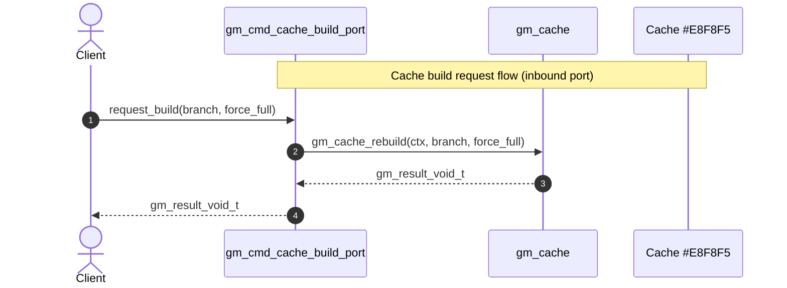
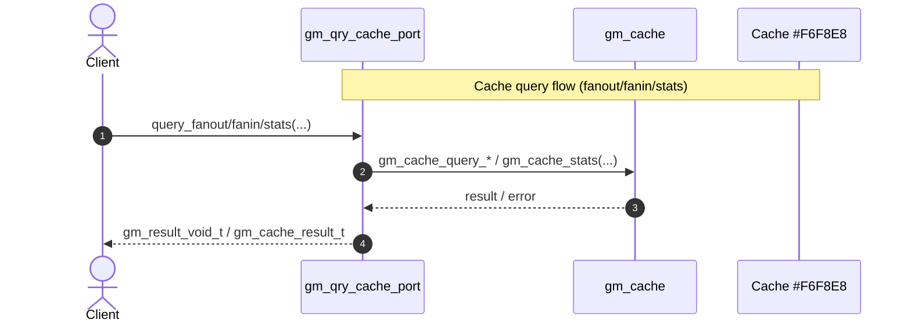
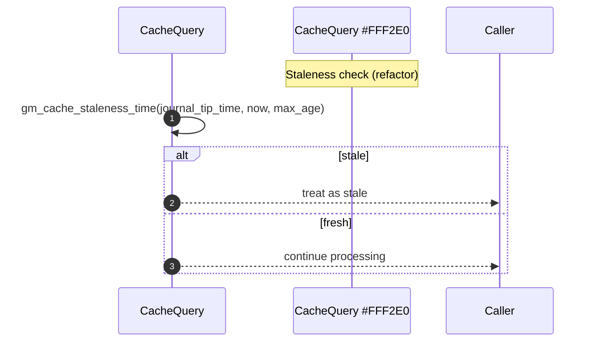
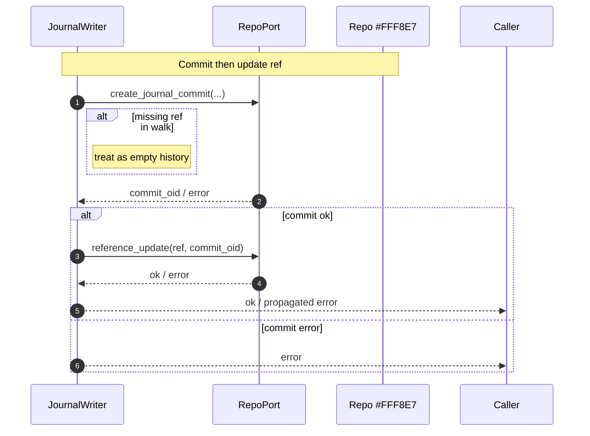

# Code Review Feedback

| Date | Agent | SHA | Branch | PR |
|------|-------|-----|--------|----|
| 2025-10-08 | CodeRabbit (and reviewers) | `0b8482eddf197be5ff9494f58d7c14eb38fcbadb` | [feat/hex-ports-ci-green](https://github.com/neuroglyph/git-mind/tree/feat/hex-ports-ci-green "neuroglyph/git-mind:feat/hex-ports-ci-green") | [PR#177](https://github.com/neuroglyph/git-mind/pull/177) |

## CODE REVIEW FEEDBACK

### core/src/adapters/logging/stdio_logger_adapter.c:41 — coderabbitai[bot]

```text
_🛠️ Refactor suggestion_ | _🟠 Major_

<details>
<summary>🧩 Analysis chain</summary>

**Verify `gmtime_r` portability.**

The code uses `gmtime_r`, which is POSIX but not C standard. Ensure this is available on all target platforms or provide a fallback.

---

🏁 Script executed:

```shell
#!/bin/bash
# Check if gmtime_r is used elsewhere in the codebase or if there are existing portability abstractions
rg -n "gmtime_r|gmtime_s" --type=c --type=h -C2
```

Length of output: 2559

---

[tasks review_file_3/6 inspect_time_abstraction_1/1]
[observations]
- `wrap_gmtime_r` defined in `core/src/time/time.c`.
- Logging adapter calls raw `gmtime_r`, bypassing time abstraction.
- Time abstraction in `time_ops` maps to `wrap_gmtime_r`, not used in logger.
[analysis]
- Using raw `gmtime_r` risks portability issues on Windows.
- Abstraction exists to centralize portability handling.
[pending]
- Confirm `wrap_gmtime_r` has Windows fallback.
- Recommend logger use `time_ops->gmtime_r`.
[actions]
- Inspect `wrap_gmtime_r` implementation for fallback.
- Suggest using abstraction in logger.
[done] 
<!-- [/scratchpad] -->

---

🏁 Script executed:

```shell
#!/bin/bash
rg -nP -C3 'wrap_gmtime_r' core/src/time/time.c
```

Length of output: 471

---


</details>

**Replace raw `gmtime_r` with `time_ops->gmtime_r` in stdio_logger_adapter.c**  
Leverage the existing time abstraction (wrap_gmtime_r) and handle its `gm_result_tm_ptr_t` return to ensure compatibility on non-POSIX targets.

<!-- This is an auto-generated comment by CodeRabbit -->
```

_Meta_: https://github.com/neuroglyph/git-mind/pull/177#discussion_r2412649574

{response}

### docs/code-reviews/PR177/47a1bf537feb065ef3cbac02a8bf78e75944111c.md:10 — coderabbitai[bot]

```text
_⚠️ Potential issue_ | _🟡 Minor_

**Align title with H1.**

Per the markdown guidelines, the `title` field in front matter must match the H1 heading. Currently, `title: 47a1bf537feb065ef3cbac02a8bf78e75944111c.md` doesn't match `# Code Review Feedback`.


Apply this diff to align them:

```diff
 ---
-title: 47a1bf537feb065ef3cbac02a8bf78e75944111c.md
+title: Code Review Feedback
 description: Preserved review artifacts and rationale.
```

<!-- suggestion_start -->

<details>
<summary>📝 Committable suggestion</summary>

> ‼️ **IMPORTANT**
> Carefully review the code before committing. Ensure that it accurately replaces the highlighted code, contains no missing lines, and has no issues with indentation. Thoroughly test & benchmark the code to ensure it meets the requirements.

```suggestion
---
title: Code Review Feedback
description: Preserved review artifacts and rationale.
audience: [contributors]
domain: [quality]
tags: [review]
status: archive
---

# Code Review Feedback
```

</details>

<!-- suggestion_end -->

<details>
<summary>🤖 Prompt for AI Agents</summary>

```
In docs/code-reviews/PR177/47a1bf537feb065ef3cbac02a8bf78e75944111c.md around
lines 1–10, the front-matter title
("47a1bf537feb065ef3cbac02a8bf78e75944111c.md") does not match the H1 ("Code
Review Feedback"); update the title field in the front matter to exactly "Code
Review Feedback" (match capitalization and spacing) so it matches the H1
heading.
```

</details>

<!-- This is an auto-generated comment by CodeRabbit -->

✅ Addressed in commits e2eb59c to 9c9c521
```

_Meta_: https://github.com/neuroglyph/git-mind/pull/177#discussion_r2412649584

{response}

### docs/planning/Milestones.md:14 — coderabbitai[bot]

```text
_⚠️ Potential issue_ | _🟠 Major_

**Insert SPDX/license block immediately after the front matter**

Per our doc guidelines, every markdown doc needs the SPDX/license notice right after the front matter. Please add it here.  

Use this patch:

```diff
 status: draft
 ---
 
+<!-- SPDX-License-Identifier: LicenseRef-MIND-UCAL-1.0 -->
+<!-- © 2025 J. Kirby Ross / Neuroglyph Collective -->
+
 # Milestones (Placeholder)
```

<!-- suggestion_start -->

<details>
<summary>📝 Committable suggestion</summary>

> ‼️ **IMPORTANT**
> Carefully review the code before committing. Ensure that it accurately replaces the highlighted code, contains no missing lines, and has no issues with indentation. Thoroughly test & benchmark the code to ensure it meets the requirements.

```suggestion
---

<!-- SPDX-License-Identifier: LicenseRef-MIND-UCAL-1.0 -->
<!-- © 2025 J. Kirby Ross / Neuroglyph Collective -->

# Milestones (Placeholder)

## Table of Contents

- Near Term
```

</details>

<!-- suggestion_end -->

<details>
<summary>🤖 Prompt for AI Agents</summary>

```
In docs/planning/Milestones.md around lines 8 to 14, the document is missing the
required SPDX/license notice immediately after the front matter; insert the SPDX
license block (as the project convention uses an HTML comment SPDX line, e.g.
<!-- SPDX-License-Identifier: Apache-2.0 --> and any accompanying copyright or
license attribution required by our doc guidelines) directly below the front
matter header so the license notice appears before the rest of the content.
```

</details>

<!-- fingerprinting:phantom:medusa:sabertoothed -->

<!-- This is an auto-generated comment by CodeRabbit -->
```

_Meta_: https://github.com/neuroglyph/git-mind/pull/177#discussion_r2412649598

{response}

### docs/planning/Product_Roadmap.md:12 — coderabbitai[bot]

```text
_⚠️ Potential issue_ | _🟠 Major_

**Restore the SPDX/license block after the front matter.**

The documentation standards require the SPDX and copyright comments immediately following the front matter. Add the standard block before the H1.  


```diff
 ---
 status: draft
 ---
+
+<!-- SPDX-License-Identifier: LicenseRef-MIND-UCAL-1.0 -->
+<!-- © 2025 J. Kirby Ross / Neuroglyph Collective -->
 
 # Product Roadmap (Placeholder)
```
As per coding guidelines


> Committable suggestion skipped: line range outside the PR's diff.

<details>
<summary>🤖 Prompt for AI Agents</summary>

```
In docs/planning/Product_Roadmap.md around lines 8 to 12, the SPDX/license and
copyright comment block required by documentation standards is missing after the
front matter; insert the standard SPDX/license block (including SPDX identifier
and copyright line) immediately after the front matter and before the H1 "#
Product Roadmap (Placeholder)" so the license header appears directly after the
front matter and above the document title.
```

</details>

<!-- fingerprinting:phantom:medusa:sabertoothed -->

<!-- This is an auto-generated comment by CodeRabbit -->
```

_Meta_: https://github.com/neuroglyph/git-mind/pull/177#discussion_r2412649608

{response}

### docs/planning/Release_Plans.md:14 — coderabbitai[bot]

```text
_⚠️ Potential issue_ | _🟠 Major_

**Add required SPDX/license notice after front matter**

Docs under `docs/**/*.md` must place the SPDX/license block immediately after the front matter. Please add the standard notice so we stay compliant.  

Apply this diff:

```diff
 status: draft
 ---
 
+<!-- SPDX-License-Identifier: LicenseRef-MIND-UCAL-1.0 -->
+<!-- © 2025 J. Kirby Ross / Neuroglyph Collective -->
+
 # Release Plans (Placeholder)
```

<!-- suggestion_start -->

<details>
<summary>📝 Committable suggestion</summary>

> ‼️ **IMPORTANT**
> Carefully review the code before committing. Ensure that it accurately replaces the highlighted code, contains no missing lines, and has no issues with indentation. Thoroughly test & benchmark the code to ensure it meets the requirements.

```suggestion
---

<!-- SPDX-License-Identifier: LicenseRef-MIND-UCAL-1.0 -->
<!-- © 2025 J. Kirby Ross / Neuroglyph Collective -->

# Release Plans (Placeholder)

## Table of Contents

- Cadence
```

</details>

<!-- suggestion_end -->

<details>
<summary>🤖 Prompt for AI Agents</summary>

```
In docs/planning/Release_Plans.md around lines 8-14, the file is missing the
required SPDX/license notice immediately after the front matter; insert the
standard SPDX license block (for example an HTML comment like
SPDX-License-Identifier: <LICENSE-ID>) directly below the closing front-matter
delimiter (---) with a single blank line separation, so the notice appears as
the first content after front matter and complies with docs/**/*.md
requirements.
```

</details>

<!-- fingerprinting:phantom:medusa:sabertoothed -->

<!-- This is an auto-generated comment by CodeRabbit -->
```

_Meta_: https://github.com/neuroglyph/git-mind/pull/177#discussion_r2412649615

{response}

### docs/planning/Sprint_Plans.md:12 — coderabbitai[bot]

```text
_⚠️ Potential issue_ | _🟠 Major_

**Insert SPDX/license comments after front matter.**

Per the documentation guidelines, every Markdown page must include the SPDX/license comment block right after the front matter. Please add the standard comments before the H1.  


```diff
 ---
 status: draft
 ---
+
+<!-- SPDX-License-Identifier: LicenseRef-MIND-UCAL-1.0 -->
+<!-- © 2025 J. Kirby Ross / Neuroglyph Collective -->
 
 # Sprint Plans (Placeholder)
```
As per coding guidelines

<!-- suggestion_start -->

<details>
<summary>📝 Committable suggestion</summary>

> ‼️ **IMPORTANT**
> Carefully review the code before committing. Ensure that it accurately replaces the highlighted code, contains no missing lines, and has no issues with indentation. Thoroughly test & benchmark the code to ensure it meets the requirements.

```suggestion
---
status: draft
---

<!-- SPDX-License-Identifier: LicenseRef-MIND-UCAL-1.0 -->
<!-- © 2025 J. Kirby Ross / Neuroglyph Collective -->

# Sprint Plans (Placeholder)

## Table of Contents
```

</details>

<!-- suggestion_end -->

<details>
<summary>🤖 Prompt for AI Agents</summary>

```
In docs/planning/Sprint_Plans.md around lines 8 to 12, the file is missing the
required SPDX/license comment block after the front matter and before the H1;
add the standard SPDX/license comment block (e.g., SPDX-License-Identifier and
copyright/license owner lines used across the repo) immediately after the
YAML/front-matter section and before the "# Sprint Plans (Placeholder)" heading
so the document conforms to the documentation guidelines.
```

</details>

<!-- fingerprinting:phantom:medusa:sabertoothed -->

<!-- This is an auto-generated comment by CodeRabbit -->
```

_Meta_: https://github.com/neuroglyph/git-mind/pull/177#discussion_r2412649624

{response}

### docs/PRDs/PRD-co-thought-mcp-service.md:18 — coderabbitai[bot]

```text
_⚠️ Potential issue_ | _🟠 Major_

**Add required SPDX/License comment after front matter.**

Docs under `docs/` must place the SPDX/License comment immediately after the front matter. Please insert it between the front matter and the H1 heading to comply with our documentation policy.  [As per coding guidelines]

<details>
<summary>🤖 Prompt for AI Agents</summary>

```
In docs/PRDs/PRD-co-thought-mcp-service.md around lines 9 to 18, the file is
missing the required SPDX/License comment immediately after the front matter;
insert the SPDX short-form license comment (e.g. <!-- SPDX-License-Identifier:
Apache-2.0 --> or the project's approved identifier) directly between the
closing front-matter block and the H1 heading so the license line appears as the
first content after front matter and before "# PRD — Co‑Thought MCP Service".
```

</details>

<!-- fingerprinting:phantom:triton:sabertoothed -->

<!-- This is an auto-generated comment by CodeRabbit -->
```

_Meta_: https://github.com/neuroglyph/git-mind/pull/177#discussion_r2412649633

{response}

### docs/PRDs/PRD-git-mind-semantics-time-travel-prototype.md:13 — coderabbitai[bot]

```text
_⚠️ Potential issue_ | _🟠 Major_

**Add the required license/SPDX comment after the front matter.**

Docs must place the License/SPDX comment immediately after the front matter, but nothing is present here. Please add it to stay compliant.  As per coding guidelines.

```diff
 ---
 
+# <!-- SPDX-License-Identifier: Apache-2.0 -->
+
 # PRD — First-Class Semantics (Time-Travel Prototype)
```

<!-- suggestion_start -->

<details>
<summary>📝 Committable suggestion</summary>

> ‼️ **IMPORTANT**
> Carefully review the code before committing. Ensure that it accurately replaces the highlighted code, contains no missing lines, and has no issues with indentation. Thoroughly test & benchmark the code to ensure it meets the requirements.

```suggestion
---
<!-- SPDX-License-Identifier: Apache-2.0 -->

# PRD — First-Class Semantics (Time-Travel Prototype)

## Table of Contents
```

</details>

<!-- suggestion_end -->

<details>
<summary>🤖 Prompt for AI Agents</summary>

```
In docs/PRDs/PRD-git-mind-semantics-time-travel-prototype.md around lines 8-13
the required license/SPDX comment is missing after the front matter; add the
project's standard SPDX license comment immediately after the closing
front-matter marker (on the next line) so the file includes the correct
SPDX-License-Identifier comment consistent with the repo's licensing policy.
```

</details>

<!-- fingerprinting:phantom:triton:sabertoothed -->

<!-- This is an auto-generated comment by CodeRabbit -->
```

_Meta_: https://github.com/neuroglyph/git-mind/pull/177#discussion_r2412649638

{response}

### docs/specs/Technical_Specifications.md:14 — coderabbitai[bot]

```text
_⚠️ Potential issue_ | _🟠 Major_

**Restore the SPDX/license comment after the front matter**

We require the SPDX/license notice immediately following the front matter in every doc. Please add it back so the spec placeholder stays compliant.  

Suggested change:

```diff
 status: draft
 ---
 
+<!-- SPDX-License-Identifier: LicenseRef-MIND-UCAL-1.0 -->
+<!-- © 2025 J. Kirby Ross / Neuroglyph Collective -->
+
 # Technical Specifications (Placeholder)
```

<!-- suggestion_start -->

<details>
<summary>📝 Committable suggestion</summary>

> ‼️ **IMPORTANT**
> Carefully review the code before committing. Ensure that it accurately replaces the highlighted code, contains no missing lines, and has no issues with indentation. Thoroughly test & benchmark the code to ensure it meets the requirements.

```suggestion
status: draft
---

<!-- SPDX-License-Identifier: LicenseRef-MIND-UCAL-1.0 -->
<!-- © 2025 J. Kirby Ross / Neuroglyph Collective -->

# Technical Specifications (Placeholder)

## Table of Contents

- Overview
```

</details>

<!-- suggestion_end -->

<details>
<summary>🤖 Prompt for AI Agents</summary>

```
In docs/specs/Technical_Specifications.md around lines 8 to 14, the SPDX/license
notice was removed after the front matter; restore the required SPDX/license
comment immediately following the front matter (e.g. add the SPDX identifier
line such as "SPDX-License-Identifier: <license>" right after the front-matter
separator) so the document is compliant with project licensing conventions.
```

</details>

<!-- fingerprinting:phantom:medusa:sabertoothed -->

<!-- This is an auto-generated comment by CodeRabbit -->
```

_Meta_: https://github.com/neuroglyph/git-mind/pull/177#discussion_r2412649645

{response}

### docs/wish-list-features/README.md:10 — coderabbitai[bot]

```text
_⚠️ Potential issue_ | _🟠 Major_

**Add required SPDX comment after front matter.**

Docs must place the license/SPDX comment block immediately after the front matter; this placeholder currently omits it. Please add the repository-standard SPDX and copyright comments beneath the `---` block.  


```diff
 ---
 status: draft
 ---
+
+<!-- SPDX-License-Identifier: LicenseRef-MIND-UCAL-1.0 -->
+<!-- © 2025 J. Kirby Ross / Neuroglyph Collective -->
 
 # Wish List Features (Placeholder)
```
As per coding guidelines

<!-- suggestion_start -->

<details>
<summary>📝 Committable suggestion</summary>

> ‼️ **IMPORTANT**
> Carefully review the code before committing. Ensure that it accurately replaces the highlighted code, contains no missing lines, and has no issues with indentation. Thoroughly test & benchmark the code to ensure it meets the requirements.

```suggestion
---
status: draft
---
<!-- SPDX-License-Identifier: LicenseRef-MIND-UCAL-1.0 -->
<!-- © 2025 J. Kirby Ross / Neuroglyph Collective -->

# Wish List Features (Placeholder)
```

</details>

<!-- suggestion_end -->

<details>
<summary>🤖 Prompt for AI Agents</summary>

```
In docs/wish-list-features/README.md around lines 8 to 10, the front matter
separator (“---”) is present but the required repository-standard SPDX and
copyright comment block is missing immediately after it; insert the standard
SPDX license comment block (matching repository conventions) directly beneath
the `---` line, including SPDX identifier and copyright owner/year, ensuring
there are no blank lines between the front matter separator and the comment
block.
```

</details>

<!-- fingerprinting:phantom:medusa:sabertoothed -->

<!-- This is an auto-generated comment by CodeRabbit -->
```

_Meta_: https://github.com/neuroglyph/git-mind/pull/177#discussion_r2412649654

{response}

### migration-progress.md:5 — coderabbitai[bot]

```text
_⚠️ Potential issue_ | _🟡 Minor_

**Add required front matter.**

Per the markdown guidelines, documentation files must have front matter at the beginning. This migration tracking document is missing it.


Add front matter before line 1:

```diff
+---
+title: Hexagonal Architecture Migration Progress
+description: Single source of truth for tracking hexagonal architecture migration
+audience: [contributors]
+domain: [architecture]
+tags: [migration, hexagonal]
+status: active
+---
+
 # Hexagonal Architecture Migration Progress
```

<!-- suggestion_start -->

<details>
<summary>📝 Committable suggestion</summary>

> ‼️ **IMPORTANT**
> Carefully review the code before committing. Ensure that it accurately replaces the highlighted code, contains no missing lines, and has no issues with indentation. Thoroughly test & benchmark the code to ensure it meets the requirements.

```suggestion
---
title: Hexagonal Architecture Migration Progress
description: Single source of truth for tracking hexagonal architecture migration
audience: [contributors]
domain: [architecture]
tags: [migration, hexagonal]
status: active
---

# Hexagonal Architecture Migration Progress

Started: 2025-10-08

This file is the single source of truth for tracking the end-to-end migration of the C library to a strict hexagonal architecture, per AGENTS.md. Update this checklist as work proceeds. Check off items with `[x]` only after they are complete and validated (CI green, zero new clang-tidy warnings, and docs updated).
```

</details>

<!-- suggestion_end -->

<details>
<summary>🤖 Prompt for AI Agents</summary>

```
In migration-progress.md around lines 1 to 5, the document is missing required
front matter; add a YAML front matter block at the very top (before line 1)
including at minimum a title, date (2025-10-08), and a short description (and
optionally tags/layout) so the file conforms to the markdown guidelines and site
generator expectations; ensure the block is delimited with triple dashes and the
rest of the content follows after the closing dashes.
```

</details>

<!-- This is an auto-generated comment by CodeRabbit -->
```

_Meta_: https://github.com/neuroglyph/git-mind/pull/177#discussion_r2412649659

{response}

### docs/code-reviews/PR177/3b7ce522e107011f8f92dc629facfa5b6a3595fb.md:18 — coderabbitai[bot]

```text
_⚠️ Potential issue_ | _🔴 Critical_

<details>
<summary>🧩 Analysis chain</summary>

**Doc header must match guidelines.**

The doc front matter and header block miss multiple required conventions: the `title` must exactly match the H1 (“Code Review Feedback”), the SPDX/license comment block must appear immediately after the front matter, and the file needs a `## Table of Contents` section. Please align this file with the docs/**/*.md rules.  
   
Add front matter fixes and license block quickly with this patch scaffold:

```diff
---
-title: 3b7ce522e107011f8f92dc629facfa5b6a3595fb.md
+title: Code Review Feedback
 description: Preserved review artifacts and rationale.
 audience: [contributors]
 domain: [quality]
 tags: [review]
 status: archive
 ---
+<!-- SPDX-License-Identifier: LicenseRef-MIND-UCAL-1.0 -->
+<!-- © 2025 J. Kirby Ross / Neuroglyph Collective -->
 
 # Code Review Feedback
+
+## Table of Contents
```

Confirm any additional required sections follow afterward. As per coding guidelines.

---

🏁 Script executed:

```shell
#!/bin/bash
# List docs directory contents
find docs -maxdepth 2 -type f

# Search for SPDX license convention in docs
rg -n "SPDX-License-Identifier" -g "docs/**/*.md"

# Search for Table of Contents guideline in docs
rg -n "## Table of Contents" -g "docs/**/*.md"

# Search for files mentioning 'guideline'
rg -l "guideline" -g "docs/**/*.md"
```

Length of output: 14870

---

🏁 Script executed:

```shell
#!/bin/bash
# Show front matter of the review artifact
sed -n '1,30p' docs/code-reviews/PR177/3b7ce522e107011f8f92dc629facfa5b6a3595fb.md

# Show template conventions
echo "---- TEMPLATE START ----"
sed -n '1,50p' docs/templates/code-review-feedback.md
echo "---- TEMPLATE END ----"
```

Length of output: 2224

---

🏁 Script executed:

```shell
#!/bin/bash
# Search for front matter guidelines
rg -n "front matter" -g "docs/quality/Markdown_Style_Guide.md"

# Search for SPDX guidelines
rg -n "SPDX" -g "docs/quality/Markdown_Style_Guide.md"

# Search for Table of Contents in style guide
rg -n "Table of Contents" -g "docs/quality/Markdown_Style_Guide.md"
```

Length of output: 57

---


</details>

**Doc header must match guidelines.**  
Front matter `title` must be “Code Review Feedback” (matching the H1), insert the SPDX/license comment immediately after the front matter, and add a `## Table of Contents` section beneath the H1.  

```diff
---
-title: 3b7ce522e107011f8f92dc629facfa5b6a3595fb.md
+title: Code Review Feedback
 description: Preserved review artifacts and rationale.
 audience: [contributors]
 domain: [quality]
 tags: [review]
 status: archive
---
+<!-- SPDX-License-Identifier: LicenseRef-MIND-UCAL-1.0 -->
+<!-- © 2025 J. Kirby Ross / Neuroglyph Collective -->
 
 # Code Review Feedback
 
+## Table of Contents
```

<!-- suggestion_start -->

<details>
<summary>📝 Committable suggestion</summary>

> ‼️ **IMPORTANT**
> Carefully review the code before committing. Ensure that it accurately replaces the highlighted code, contains no missing lines, and has no issues with indentation. Thoroughly test & benchmark the code to ensure it meets the requirements.

```suggestion
---
title: Code Review Feedback
 description: Preserved review artifacts and rationale.
 audience: [contributors]
 domain: [quality]
 tags: [review]
 status: archive
<!-- SPDX-License-Identifier: LicenseRef-MIND-UCAL-1.0 -->
<!-- © 2025 J. Kirby Ross / Neuroglyph Collective -->

 # Code Review Feedback

## Table of Contents
```

</details>

<!-- suggestion_end -->

<details>
<summary>🤖 Prompt for AI Agents</summary>

```
In docs/code-reviews/PR177/3b7ce522e107011f8f92dc629facfa5b6a3595fb.md around
lines 1 to 18, the front matter and document structure do not follow project
guidelines: change the YAML front-matter title value to "Code Review Feedback",
insert the SPDX/license comment immediately after the closing front-matter
block, and add a "## Table of Contents" section directly beneath the H1 heading;
ensure spacing and ordering match other review artifacts.
```

</details>

<!-- fingerprinting:phantom:triton:sabertoothed -->

<!-- This is an auto-generated comment by CodeRabbit -->
```

_Meta_: https://github.com/neuroglyph/git-mind/pull/177#discussion_r2412749770

{response}

### core/include/gitmind/ports/cache_query_port.h:76 — coderabbitai[bot]

```text
_🛠️ Refactor suggestion_ | _🟠 Major_

<details>
<summary>🧩 Analysis chain</summary>

**Clarify stats output parameter behavior on error and verify implementation.**

The `stats` function documentation mentions returning `GM_ERR_NOT_FOUND` on a missing branch, but does not explicitly state what happens to the output parameters (`edge_count` and `cache_size_bytes`) on error. Per coding guidelines, output buffers should be zeroed on error paths.


1. Update the documentation to clarify that `edge_count` and `cache_size_bytes` are set to zero on error.
2. Verify that the implementation in `core/src/ports/cache/cache_query_port.c` properly zeros these outputs before returning an error.

---

🏁 Script executed:

```shell
#!/bin/bash
# Description: Verify that stats implementation zeros output parameters on error paths.

# Search for the stats implementation and check error handling
ast-grep --pattern $'gm_result_void_t $_(gm_qry_cache_port_t *$_, const char *$_, uint64_t *$_, uint64_t *$_) {
  $$$
}'
```

Length of output: 0

---

🏁 Script executed:

```shell
#!/bin/bash
rg -nP 'gm_result_void_t\s+stats\s*\(' -C3 core/src/ports/cache/*.c
```

Length of output: 0

---

🏁 Script executed:

```shell
rg -nP '\.stats\s*=' -C3 core/src
```

Length of output: 514

---

🏁 Script executed:

```shell
#!/bin/bash
rg -nP 'gm_result_void_t\s+stats_impl' -C50 core/src/ports/cache/cache_query_port.c
```

Length of output: 3961

---


</details>

**Zero outputs on error in stats_impl and update docs.** The `stats_impl` function (core/src/ports/cache/cache_query_port.c:50–63) never clears `*edge_count` or `*cache_size_bytes` on error; add `*edge_count = 0; *cache_size_bytes = 0;` before each `gm_err_void` return and update the doc comment in `cache_query_port.h` to state that outputs are zeroed on failure.

<details>
<summary>🤖 Prompt for AI Agents</summary>

```
In core/src/ports/cache/cache_query_port.c around lines 50–63 and
core/include/gitmind/ports/cache_query_port.h lines 61–76, the stats_impl
implementation fails to clear output parameters on error; before every
gm_err_void return in stats_impl set *edge_count = 0; *cache_size_bytes = 0; to
ensure callers get zeroed outputs on failure, and update the doc comment in
cache_query_port.h to explicitly state that on failure (e.g., non-existent
branch or other errors) both edge_count and cache_size_bytes are set to 0.
```

</details>

<!-- This is an auto-generated comment by CodeRabbit -->
```

_Meta_: https://github.com/neuroglyph/git-mind/pull/177#discussion_r2412822288

{response}

### docs/architecture/journal-architecture.md:9 — coderabbitai[bot]

```text
_🛠️ Refactor suggestion_ | _🟠 Major_

**Add the SPDX notice after the front matter**

The documentation standard requires an SPDX/license comment immediately following the YAML header.  


```diff
 ---
 title: Project: No Tux Given 🐧⚡
 description: Edge-journal commits with branch-aware graphs; the final architecture for storing semantics in Git.
 audience: [developers]
 domain: [architecture]
 tags: [journal, cbor, refs]
 status: stable
 last_updated: 2025-09-15
 ---
+<!-- SPDX-License-Identifier: Apache-2.0 -->
```

<!-- suggestion_start -->

<details>
<summary>📝 Committable suggestion</summary>

> ‼️ **IMPORTANT**
> Carefully review the code before committing. Ensure that it accurately replaces the highlighted code, contains no missing lines, and has no issues with indentation. Thoroughly test & benchmark the code to ensure it meets the requirements.

```suggestion
---
title: Project: No Tux Given 🐧⚡
description: Edge-journal commits with branch-aware graphs; the final architecture for storing semantics in Git.
audience: [developers]
domain: [architecture]
tags: [journal, cbor, refs]
status: stable
last_updated: 2025-09-15
---
<!-- SPDX-License-Identifier: Apache-2.0 -->
```

</details>

<!-- suggestion_end -->

<details>
<summary>🤖 Prompt for AI Agents</summary>

```
In docs/architecture/journal-architecture.md around lines 1 to 9, the YAML front
matter is present but missing the required SPDX/license comment immediately
after it; add a single-line SPDX identifier (e.g., "SPDX-License-Identifier:
Apache-2.0" or the project's chosen SPDX tag) on the line immediately following
the closing --- of the front matter so the file begins with the YAML block and
the SPDX notice directly after it.
```

</details>

<!-- fingerprinting:phantom:medusa:sabertoothed -->

<!-- This is an auto-generated comment by CodeRabbit -->
```

_Meta_: https://github.com/neuroglyph/git-mind/pull/177#discussion_r2412822301

{response}

### docs/architecture/journal-architecture.md:28 — coderabbitai[bot]

```text
_🛠️ Refactor suggestion_ | _🟠 Major_

**Use the mandated H2 heading for the Table of Contents**

Please change the “Table of Contents” label to a `## Table of Contents` heading to satisfy the docs guideline.  


```diff
-Table of Contents
+## Table of Contents
```

<!-- suggestion_start -->

<details>
<summary>📝 Committable suggestion</summary>

> ‼️ **IMPORTANT**
> Carefully review the code before committing. Ensure that it accurately replaces the highlighted code, contains no missing lines, and has no issues with indentation. Thoroughly test & benchmark the code to ensure it meets the requirements.

```suggestion
## Table of Contents

- [Executive Summary](#executive-summary)
- [Core Design Principles](#core-design-principles)
- [The Two-Layer Architecture](#the-two-layer-architecture)
- [Implementation Details](#implementation-details)
- [Solving the Hard Problems](#solving-the-hard-problems)
- [Migration Plan (Fresh Start)](#migration-plan-fresh-start)
- [Code Structure](#code-structure)
- [Why This Wins](#why-this-wins)
- [Potential Gotchas & Solutions](#potential-gotchas--solutions)
- [The Payoff](#the-payoff)
- [Next Steps](#next-steps)
```

</details>

<!-- suggestion_end -->

<details>
<summary>🤖 Prompt for AI Agents</summary>

```
In docs/architecture/journal-architecture.md around lines 15 to 28 the plain
text "Table of Contents" needs to be converted into a level-2 Markdown heading;
replace the current label with "## Table of Contents" (i.e., prepend "## " and
ensure it's on its own line) so the document follows the mandated H2 heading
guideline for the table of contents.
```

</details>

<!-- fingerprinting:phantom:medusa:sabertoothed -->

<!-- This is an auto-generated comment by CodeRabbit -->
```

_Meta_: https://github.com/neuroglyph/git-mind/pull/177#discussion_r2412822303

{response}

### docs/architecture/ref-name-validation.md:9 — coderabbitai[bot]

```text
_🛠️ Refactor suggestion_ | _🟠 Major_

**Add the required SPDX comment after front matter**

Docs must include the license/SPDX comment immediately after the YAML front matter. Please add it here to satisfy the doc guidelines.  


```diff
 ---
 title: Ref Name Validation
 description: Building refs safely with Git-style branch shorthands.
 audience: [contributors, developers]
 domain: [architecture]
 tags: [git, refs]
 status: stable
 last_updated: 2025-09-30
 ---
+<!-- SPDX-License-Identifier: Apache-2.0 -->
```

<!-- suggestion_start -->

<details>
<summary>📝 Committable suggestion</summary>

> ‼️ **IMPORTANT**
> Carefully review the code before committing. Ensure that it accurately replaces the highlighted code, contains no missing lines, and has no issues with indentation. Thoroughly test & benchmark the code to ensure it meets the requirements.

```suggestion
---
title: Ref Name Validation
description: Building refs safely with Git-style branch shorthands.
audience: [contributors, developers]
domain: [architecture]
tags: [git, refs]
status: stable
last_updated: 2025-09-30
---
<!-- SPDX-License-Identifier: Apache-2.0 -->
```

</details>

<!-- suggestion_end -->

<details>
<summary>🤖 Prompt for AI Agents</summary>

```
In docs/architecture/ref-name-validation.md around lines 1 to 9, the YAML front
matter is present but the required SPDX license comment is missing immediately
after the front matter; add the SPDX identifier comment line (e.g., "//
SPDX-License-Identifier: <LICENSE-ID>" or the project’s canonical SPDX comment
format) directly below the closing "---" of the front matter so the file
contains the license/SPDX comment immediately after the YAML block per doc
guidelines.
```

</details>

<!-- fingerprinting:phantom:medusa:sabertoothed -->

<!-- This is an auto-generated comment by CodeRabbit -->
```

_Meta_: https://github.com/neuroglyph/git-mind/pull/177#discussion_r2412822314

{response}

### docs/architecture/system-overview.md:9 — coderabbitai[bot]

```text
_🛠️ Refactor suggestion_ | _🟠 Major_

**Insert SPDX notice after the front matter**

Per the docs guidelines, place the SPDX/license comment immediately after the YAML header.  


```diff
 ---
 title: System Architecture
 description: High-level view of git-mind components and interactions.
 audience: [developers]
 domain: [architecture]
 tags: [system, overview]
 status: draft
 last_updated: 2025-09-15
 ---
+<!-- SPDX-License-Identifier: Apache-2.0 -->
```

<!-- suggestion_start -->

<details>
<summary>📝 Committable suggestion</summary>

> ‼️ **IMPORTANT**
> Carefully review the code before committing. Ensure that it accurately replaces the highlighted code, contains no missing lines, and has no issues with indentation. Thoroughly test & benchmark the code to ensure it meets the requirements.

```suggestion
---
title: System Architecture
description: High-level view of git-mind components and interactions.
audience: [developers]
domain: [architecture]
tags: [system, overview]
status: draft
last_updated: 2025-09-15
---
<!-- SPDX-License-Identifier: Apache-2.0 -->
```

</details>

<!-- suggestion_end -->

<details>
<summary>🤖 Prompt for AI Agents</summary>

```
In docs/architecture/system-overview.md around lines 1–9 the YAML front matter
is present but missing the required SPDX/license notice; add the SPDX license
comment immediately after the closing --- of the front matter by inserting the
project's SPDX identifier as a comment (e.g. an HTML or Markdown comment
containing "SPDX-License-Identifier: <identifier>") directly after the header
end so the notice is the first thing after the YAML block.
```

</details>

<!-- fingerprinting:phantom:medusa:sabertoothed -->

<!-- This is an auto-generated comment by CodeRabbit -->
```

_Meta_: https://github.com/neuroglyph/git-mind/pull/177#discussion_r2412822322

{response}

### docs/architecture/system-overview.md:20 — coderabbitai[bot]

```text
_🛠️ Refactor suggestion_ | _🟠 Major_

**Promote “Table of Contents” to an H2 heading**

Docs must include a `## Table of Contents` section. Please update the heading accordingly.  


```diff
-Table of Contents
+## Table of Contents
```

<!-- suggestion_start -->

<details>
<summary>📝 Committable suggestion</summary>

> ‼️ **IMPORTANT**
> Carefully review the code before committing. Ensure that it accurately replaces the highlighted code, contains no missing lines, and has no issues with indentation. Thoroughly test & benchmark the code to ensure it meets the requirements.

```suggestion
## Table of Contents

- [Executive Summary](#executive-summary)
- [High-Level Design](#high-level-design)
- [Components and Technology Stack](#components-and-technology-stack)
- [Data Flows and Storage](#data-flows-and-storage)
- [Scaling Strategy and Performance Targets](#scaling-strategy-and-performance-targets)
```

</details>

<!-- suggestion_end -->

<details>
<summary>🤖 Prompt for AI Agents</summary>

```
In docs/architecture/system-overview.md around lines 13 to 20, the "Table of
Contents" text is plain text but should be an H2 heading; change the line to use
Markdown H2 syntax ("## Table of Contents") so the docs include the required
section header and render correctly in the table of contents.
```

</details>

<!-- fingerprinting:phantom:medusa:sabertoothed -->

<!-- This is an auto-generated comment by CodeRabbit -->
```

_Meta_: https://github.com/neuroglyph/git-mind/pull/177#discussion_r2412822329

{response}

### docs/code-reviews/PR177/0d1b34b0ee501bc7b7b2d0a9fb82e06a37642c77.md:10 — coderabbitai[bot]

```text
_⚠️ Potential issue_ | _🟡 Minor_

**Doc header must match guidelines.**

The front matter title must be "Code Review Feedback" (matching the H1), the SPDX/license comment must appear immediately after the front matter, and a "## Table of Contents" section must follow the H1.


Apply this diff:

```diff
 ---
-title: 0d1b34b0ee501bc7b7b2d0a9fb82e06a37642c77.md
+title: Code Review Feedback
 description: Preserved review artifacts and rationale.
 audience: [contributors]
 domain: [quality]
 tags: [review]
 status: archive
 ---
+<!-- SPDX-License-Identifier: LicenseRef-MIND-UCAL-1.0 -->
+<!-- © 2025 J. Kirby Ross / Neuroglyph Collective -->
 
 # Code Review Feedback
+
+## Table of Contents
```

As per coding guidelines.

<!-- suggestion_start -->

<details>
<summary>📝 Committable suggestion</summary>

> ‼️ **IMPORTANT**
> Carefully review the code before committing. Ensure that it accurately replaces the highlighted code, contains no missing lines, and has no issues with indentation. Thoroughly test & benchmark the code to ensure it meets the requirements.

```suggestion
---
title: Code Review Feedback
description: Preserved review artifacts and rationale.
audience: [contributors]
domain: [quality]
tags: [review]
status: archive
---
<!-- SPDX-License-Identifier: LicenseRef-MIND-UCAL-1.0 -->
<!-- © 2025 J. Kirby Ross / Neuroglyph Collective -->

# Code Review Feedback

## Table of Contents
```

</details>

<!-- suggestion_end -->

<!-- This is an auto-generated comment by CodeRabbit -->
```

_Meta_: https://github.com/neuroglyph/git-mind/pull/177#discussion_r2412822333

{response}

### docs/code-reviews/PR177/9f49dd2ad65837735ac218c3d159b36f8b840819.md:18 — coderabbitai[bot]

```text
_⚠️ Potential issue_ | _🟠 Major_

**Align front matter with doc standards.**

Please update the front matter `title` to match the H1, insert the required SPDX/license comments immediately after the front matter, and add the mandatory `## Table of Contents` section. These steps are required for every `docs/**/*.md` file. As per coding guidelines

```diff
 ---
-title: 9f49dd2ad65837735ac218c3d159b36f8b840819.md
+title: Code Review Feedback
 description: Preserved review artifacts and rationale.
 audience: [contributors]
 domain: [quality]
 tags: [review]
 status: archive
 ---
+
+<!-- SPDX-License-Identifier: LicenseRef-MIND-UCAL-1.0 -->
+<!-- © 2025 J. Kirby Ross / Neuroglyph Collective -->
 
 # Code Review Feedback
+
+## Table of Contents
+
+- [Code Review Feedback](#code-review-feedback)
+- [CODE REVIEW FEEDBACK](#code-review-feedback-1)
```

<!-- suggestion_start -->

<details>
<summary>📝 Committable suggestion</summary>

> ‼️ **IMPORTANT**
> Carefully review the code before committing. Ensure that it accurately replaces the highlighted code, contains no missing lines, and has no issues with indentation. Thoroughly test & benchmark the code to ensure it meets the requirements.

```suggestion
---
title: Code Review Feedback
description: Preserved review artifacts and rationale.
audience: [contributors]
domain: [quality]
tags: [review]
status: archive
---

<!-- SPDX-License-Identifier: LicenseRef-MIND-UCAL-1.0 -->
<!-- © 2025 J. Kirby Ross / Neuroglyph Collective -->

# Code Review Feedback

## Table of Contents

- [Code Review Feedback](#code-review-feedback)
- [CODE REVIEW FEEDBACK](#code-review-feedback-1)

| Date | Agent | SHA | Branch | PR |
|------|-------|-----|--------|----|
| 2025-10-08 | CodeRabbit (and reviewers) | `9f49dd2ad65837735ac218c3d159b36f8b840819` | [feat/hex-ports-ci-green](https://github.com/neuroglyph/git-mind/tree/feat/hex-ports-ci-green "neuroglyph/git-mind:feat/hex-ports-ci-green") | [PR#177](https://github.com/neuroglyph/git-mind/pull/177) |

## CODE REVIEW FEEDBACK

### core/src/adapters/logging/stdio_logger_adapter.c:41 — coderabbitai[bot]
```

</details>

<!-- suggestion_end -->

<details>
<summary>🤖 Prompt for AI Agents</summary>

```
In docs/code-reviews/PR177/9f49dd2ad65837735ac218c3d159b36f8b840819.md lines
1-18, the front matter title doesn't match the H1 and the required SPDX/license
comment and Table of Contents section are missing; update the front matter title
to exactly match the H1, add the required SPDX/license comment block immediately
after the front matter, and insert a mandatory "## Table of Contents" heading
(with any needed anchors/placeholder entries) below the SPDX/license block so
the file conforms to docs/**/*.md standards.
```

</details>

<!-- fingerprinting:phantom:triton:sabertoothed -->

<!-- This is an auto-generated comment by CodeRabbit -->
```

_Meta_: https://github.com/neuroglyph/git-mind/pull/177#discussion_r2412828968

{response}

### docs/code-reviews/PR177/e9a58433621fc5d60552af3685c2a4cd68ece5e0.md:16 — coderabbitai[bot]

```text
_⚠️ Potential issue_ | _🟠 Major_

**Doc header must match guidelines.**  
Please align with the docs rules: set the front-matter `title` to match the H1, insert the required SPDX/license block immediately after the front matter, and add the mandated `## Table of Contents` section beneath the H1.  
 As per coding guidelines

```diff
 ---
-title: e9a58433621fc5d60552af3685c2a4cd68ece5e0.md
+title: Code Review Feedback
 description: Preserved review artifacts and rationale.
 audience: [contributors]
 domain: [quality]
 tags: [review]
 status: archive
 ---
+<!-- SPDX-License-Identifier: LicenseRef-MIND-UCAL-1.0 -->
+<!-- © 2025 J. Kirby Ross / Neuroglyph Collective -->
 
 # Code Review Feedback
+
+## Table of Contents
+
+- [Code Review Feedback](#code-review-feedback)
+- [CODE REVIEW FEEDBACK](#code-review-feedback-1)
```

<!-- suggestion_start -->

<details>
<summary>📝 Committable suggestion</summary>

> ‼️ **IMPORTANT**
> Carefully review the code before committing. Ensure that it accurately replaces the highlighted code, contains no missing lines, and has no issues with indentation. Thoroughly test & benchmark the code to ensure it meets the requirements.

```suggestion
---
title: Code Review Feedback
description: Preserved review artifacts and rationale.
audience: [contributors]
domain: [quality]
tags: [review]
status: archive
---
<!-- SPDX-License-Identifier: LicenseRef-MIND-UCAL-1.0 -->
<!-- © 2025 J. Kirby Ross / Neuroglyph Collective -->

# Code Review Feedback

## Table of Contents

- [Code Review Feedback](#code-review-feedback)
- [CODE REVIEW FEEDBACK](#code-review-feedback-1)

| Date | Agent | SHA | Branch | PR |
|------|-------|-----|--------|----|
| 2025-10-08 | CodeRabbit (and reviewers) | `e9a58433621fc5d60552af3685c2a4cd68ece5e0` | [feat/hex-ports-ci-green](https://github.com/neuroglyph/git-mind/tree/feat/hex-ports-ci-green "neuroglyph/git-mind:feat/hex-ports-ci-green") | [PR#177](https://github.com/neuroglyph/git-mind/pull/177) |

## CODE REVIEW FEEDBACK
```

</details>

<!-- suggestion_end -->

<!-- fingerprinting:phantom:triton:sabertoothed -->

<!-- This is an auto-generated comment by CodeRabbit -->
```

_Meta_: https://github.com/neuroglyph/git-mind/pull/177#discussion_r2412841494

{response}

### core/src/app/cache/cache_rebuild_service.c:519 — coderabbitai[bot]

```text
_⚠️ Potential issue_ | _🟠 Major_

**Honor gm_telemetry_* return values to avoid leaked errors.**

Both gm_telemetry_cfg_load and gm_telemetry_build_tags return gm_result_void_t, yet we drop them on the floor. If either surfaces an error, the gm_error_t leaks and we proceed with possibly uninitialized config/tag buffers. Please capture the results, free any error payloads, and decide whether to continue (with defaults) or abort.

As per coding guidelines

```diff
-    gm_telemetry_cfg_t tcfg = {0};
-    (void)gm_telemetry_cfg_load(&tcfg, gm_env_port_system());
+    gm_telemetry_cfg_t tcfg = {0};
+    gm_result_void_t cfg_rc =
+        gm_telemetry_cfg_load(&tcfg, gm_env_port_system());
+    if (!cfg_rc.ok) {
+        if (cfg_rc.u.err != NULL) {
+            gm_error_free(cfg_rc.u.err);
+        }
+        /* Defaults in tcfg stay zeroed; continue without telemetry tweaks. */
+    }
@@
-    (void)gm_telemetry_build_tags(&tcfg, branch, mode, repo_canon, &repo_id,
-                                  tags, sizeof(tags));
+    gm_result_void_t tags_rc = gm_telemetry_build_tags(
+        &tcfg, branch, mode, repo_canon, &repo_id, tags, sizeof(tags));
+    if (!tags_rc.ok) {
+        if (tags_rc.u.err != NULL) {
+            gm_error_free(tags_rc.u.err);
+        }
+        tags[0] = '\0';
+    }
```

<!-- suggestion_start -->

<details>
<summary>📝 Committable suggestion</summary>

> ‼️ **IMPORTANT**
> Carefully review the code before committing. Ensure that it accurately replaces the highlighted code, contains no missing lines, and has no issues with indentation. Thoroughly test & benchmark the code to ensure it meets the requirements.

```suggestion
    /* Telemetry configuration */
    gm_telemetry_cfg_t tcfg = {0};
    gm_result_void_t cfg_rc =
        gm_telemetry_cfg_load(&tcfg, gm_env_port_system());
    if (!cfg_rc.ok) {
        if (cfg_rc.u.err != NULL) {
            gm_error_free(cfg_rc.u.err);
        }
        /* Defaults in tcfg stay zeroed; continue without telemetry tweaks. */
    }
    const char *mode = "full"; /* TODO: detect incremental when available */
    char tags[256];
    tags[0] = '\0';
    gm_repo_id_t repo_id = {0};
    char repo_path[GM_PATH_MAX];
    const char *repo_canon = NULL;
    do {
        int rp = unwrap_result(gm_git_repository_port_repository_path(
            &ctx->git_repo_port, GM_GIT_REPOSITORY_PATH_GITDIR, repo_path,
            sizeof(repo_path)));
        if (rp != GM_OK) break;
        gm_fs_canon_opts_t copts = {.mode = GM_FS_CANON_PHYSICAL_EXISTING};
        if (unwrap_result(gm_fs_temp_port_canonicalize_ex(
                &ctx->fs_temp_port, repo_path, copts, &repo_canon)) != GM_OK) {
            repo_canon = NULL;
        }
        (void)compute_repo_id(ctx, &repo_id);
    } while (0);
    gm_result_void_t tags_rc = gm_telemetry_build_tags(
        &tcfg, branch, mode, repo_canon, &repo_id, tags, sizeof(tags));
    if (!tags_rc.ok) {
        if (tags_rc.u.err != NULL) {
            gm_error_free(tags_rc.u.err);
        }
        tags[0] = '\0';
    }
    if (tcfg.extras_dropped) {
        (void)gm_logger_log(&ctx->logger_port, GM_LOG_WARN, "cache",
                            "telemetry extras dropped=1");
```

</details>

<!-- suggestion_end -->

<details>
<summary>🤖 Prompt for AI Agents</summary>

```
In core/src/app/cache/cache_rebuild_service.c around lines 494-519, the calls to
gm_telemetry_cfg_load and gm_telemetry_build_tags ignore their gm_result_void_t
return values which can leak gm_error_t and leave telemetry state uninitialized;
capture each return into a gm_result_void_t variable, check for GM_OK, and on
error extract and free the gm_error_t (or call the library error-cleanup
helper), log an appropriate error via ctx->logger_port, then decide flow: either
abort the rebuild early (return an error) or continue using safe defaults
(ensure tcfg and tags are zeroed/valid) depending on surrounding error-handling
conventions. Ensure every branch that receives an error frees the error payload
before proceeding to avoid leaks.
```

</details>

<!-- fingerprinting:phantom:medusa:sabertoothed -->

<!-- This is an auto-generated comment by CodeRabbit -->
```

_Meta_: https://github.com/neuroglyph/git-mind/pull/177#discussion_r2412906880

{response}

### core/src/telemetry/config.c:255 — coderabbitai[bot]

```text
_⚠️ Potential issue_ | _🟠 Major_

**Check `gm_strcpy_safe` return value and handle truncation.**

The `(void)` cast ignores truncation when copying `repo_canon_path`, which could be longer than the 65-byte `repo_val` buffer. Per coding guidelines, truncation must be treated as an error.


Apply this fix:

```diff
         if (cfg->repo_tag == GM_REPO_TAG_PLAIN) {
             if (repo_canon_path != NULL && repo_canon_path[0] != '\0') {
-                (void)gm_strcpy_safe(repo_val, sizeof(repo_val), repo_canon_path);
+                if (gm_strcpy_safe(repo_val, sizeof(repo_val), repo_canon_path) != 0) {
+                    return gm_err_void(GM_ERROR(GM_ERR_BUFFER_TOO_SMALL, "repo path too long"));
+                }
             }
```

As per coding guidelines.

<!-- suggestion_start -->

<details>
<summary>📝 Committable suggestion</summary>

> ‼️ **IMPORTANT**
> Carefully review the code before committing. Ensure that it accurately replaces the highlighted code, contains no missing lines, and has no issues with indentation. Thoroughly test & benchmark the code to ensure it meets the requirements.

```suggestion
         if (cfg->repo_tag == GM_REPO_TAG_PLAIN) {
             if (repo_canon_path != NULL && repo_canon_path[0] != '\0') {
                if (gm_strcpy_safe(repo_val, sizeof(repo_val), repo_canon_path) != 0) {
                    return gm_err_void(GM_ERROR(GM_ERR_BUFFER_TOO_SMALL, "repo path too long"));
                }
             }
         }
```

</details>

<!-- suggestion_end -->

<details>
<summary>🤖 Prompt for AI Agents</summary>

```
In core/src/telemetry/config.c around line 228, the call to
(void)gm_strcpy_safe(repo_val, sizeof(repo_val), repo_canon_path) ignores the
function's return value and potential truncation; change this to capture the
return, check for non-success/truncation per gm_strcpy_safe's contract, and
handle it (e.g., log an error including the offending path, set appropriate
error state/return code or abort initialization) instead of discarding the
result so truncated copies are treated as errors per coding guidelines.
```

</details>

<!-- This is an auto-generated comment by CodeRabbit -->
```

_Meta_: https://github.com/neuroglyph/git-mind/pull/177#discussion_r2412906896

{response}

### core/tests/fakes/metrics/fake_metrics_port.c:52 — coderabbitai[bot]

```text
_⚠️ Potential issue_ | _🟠 Major_

**Stop recording entries when gm_strcpy_safe truncates.**

We bump the slot counter before validating the copies and ignore gm_strcpy_safe’s return codes. Any truncation leaves the state inconsistent (count advanced, partial strings stored) and violates the “treat truncation as error” rule for test fakes. Please gate the increment on successful copies, reset the slot on failure, and surface an error result so tests can fail loudly.

As per coding guidelines

```diff
@@
-    size_t i = st->counter_count++;
-    (void)gm_strcpy_safe(st->counters[i].name, sizeof(st->counters[i].name),
-                         name ? name : "");
-    st->counters[i].value = value;
-    (void)gm_strcpy_safe(st->counters[i].tags, sizeof(st->counters[i].tags),
-                         tags ? tags : "");
-    return gm_ok_void();
+    size_t slot = st->counter_count;
+    if (gm_strcpy_safe(st->counters[slot].name,
+                       sizeof(st->counters[slot].name),
+                       name ? name : "") != 0) {
+        st->counters[slot].name[0] = '\0';
+        st->counters[slot].tags[0] = '\0';
+        st->counters[slot].value = 0;
+        return gm_err_void(GM_ERROR(GM_ERR_BUFFER_TOO_SMALL,
+                                    "fake metrics counter name truncated"));
+    }
+    st->counters[slot].value = value;
+    if (gm_strcpy_safe(st->counters[slot].tags,
+                       sizeof(st->counters[slot].tags),
+                       tags ? tags : "") != 0) {
+        st->counters[slot].name[0] = '\0';
+        st->counters[slot].tags[0] = '\0';
+        st->counters[slot].value = 0;
+        return gm_err_void(GM_ERROR(GM_ERR_BUFFER_TOO_SMALL,
+                                    "fake metrics counter tags truncated"));
+    }
+    st->counter_count = slot + 1;
+    return gm_ok_void();
@@
-    size_t i = st->gauge_count++;
-    (void)gm_strcpy_safe(st->gauges[i].name, sizeof(st->gauges[i].name),
-                         name ? name : "");
-    st->gauges[i].value = value;
-    (void)gm_strcpy_safe(st->gauges[i].tags, sizeof(st->gauges[i].tags),
-                         tags ? tags : "");
-    return gm_ok_void();
+    size_t slot = st->gauge_count;
+    if (gm_strcpy_safe(st->gauges[slot].name,
+                       sizeof(st->gauges[slot].name),
+                       name ? name : "") != 0) {
+        st->gauges[slot].name[0] = '\0';
+        st->gauges[slot].tags[0] = '\0';
+        st->gauges[slot].value = 0.0;
+        return gm_err_void(GM_ERROR(GM_ERR_BUFFER_TOO_SMALL,
+                                    "fake metrics gauge name truncated"));
+    }
+    st->gauges[slot].value = value;
+    if (gm_strcpy_safe(st->gauges[slot].tags,
+                       sizeof(st->gauges[slot].tags),
+                       tags ? tags : "") != 0) {
+        st->gauges[slot].name[0] = '\0';
+        st->gauges[slot].tags[0] = '\0';
+        st->gauges[slot].value = 0.0;
+        return gm_err_void(GM_ERROR(GM_ERR_BUFFER_TOO_SMALL,
+                                    "fake metrics gauge tags truncated"));
+    }
+    st->gauge_count = slot + 1;
+    return gm_ok_void();
@@
-    size_t i = st->timing_count++;
-    (void)gm_strcpy_safe(st->timings[i].name, sizeof(st->timings[i].name),
-                         name ? name : "");
-    st->timings[i].millis = millis;
-    (void)gm_strcpy_safe(st->timings[i].tags, sizeof(st->timings[i].tags),
-                         tags ? tags : "");
-    return gm_ok_void();
+    size_t slot = st->timing_count;
+    if (gm_strcpy_safe(st->timings[slot].name,
+                       sizeof(st->timings[slot].name),
+                       name ? name : "") != 0) {
+        st->timings[slot].name[0] = '\0';
+        st->timings[slot].tags[0] = '\0';
+        st->timings[slot].millis = 0;
+        return gm_err_void(GM_ERROR(GM_ERR_BUFFER_TOO_SMALL,
+                                    "fake metrics timing name truncated"));
+    }
+    st->timings[slot].millis = millis;
+    if (gm_strcpy_safe(st->timings[slot].tags,
+                       sizeof(st->timings[slot].tags),
+                       tags ? tags : "") != 0) {
+        st->timings[slot].name[0] = '\0';
+        st->timings[slot].tags[0] = '\0';
+        st->timings[slot].millis = 0;
+        return gm_err_void(GM_ERROR(GM_ERR_BUFFER_TOO_SMALL,
+                                    "fake metrics timing tags truncated"));
+    }
+    st->timing_count = slot + 1;
+    return gm_ok_void();
```

<!-- suggestion_start -->

<details>
<summary>📝 Committable suggestion</summary>

> ‼️ **IMPORTANT**
> Carefully review the code before committing. Ensure that it accurately replaces the highlighted code, contains no missing lines, and has no issues with indentation. Thoroughly test & benchmark the code to ensure it meets the requirements.

```suggestion
static gm_result_void_t counter_add(void *self, const char *name, uint64_t value,
                                    const char *tags) {
    gm_fake_metrics_state_t *st = (gm_fake_metrics_state_t *)self;
    if (st == NULL) return gm_ok_void();
    if (st->counter_count >= 32) return gm_ok_void();
    size_t slot = st->counter_count;
    if (gm_strcpy_safe(st->counters[slot].name,
                       sizeof(st->counters[slot].name),
                       name ? name : "") != 0) {
        st->counters[slot].name[0] = '\0';
        st->counters[slot].tags[0] = '\0';
        st->counters[slot].value = 0;
        return gm_err_void(GM_ERROR(GM_ERR_BUFFER_TOO_SMALL,
                                    "fake metrics counter name truncated"));
    }
    st->counters[slot].value = value;
    if (gm_strcpy_safe(st->counters[slot].tags,
                       sizeof(st->counters[slot].tags),
                       tags ? tags : "") != 0) {
        st->counters[slot].name[0] = '\0';
        st->counters[slot].tags[0] = '\0';
        st->counters[slot].value = 0;
        return gm_err_void(GM_ERROR(GM_ERR_BUFFER_TOO_SMALL,
                                    "fake metrics counter tags truncated"));
    }
    st->counter_count = slot + 1;
    return gm_ok_void();
}

static gm_result_void_t gauge_set(void *self, const char *name, double value,
                                  const char *tags) {
    gm_fake_metrics_state_t *st = (gm_fake_metrics_state_t *)self;
    if (st == NULL) return gm_ok_void();
    if (st->gauge_count >= 32) return gm_ok_void();
    size_t slot = st->gauge_count;
    if (gm_strcpy_safe(st->gauges[slot].name,
                       sizeof(st->gauges[slot].name),
                       name ? name : "") != 0) {
        st->gauges[slot].name[0] = '\0';
        st->gauges[slot].tags[0] = '\0';
        st->gauges[slot].value = 0.0;
        return gm_err_void(GM_ERROR(GM_ERR_BUFFER_TOO_SMALL,
                                    "fake metrics gauge name truncated"));
    }
    st->gauges[slot].value = value;
    if (gm_strcpy_safe(st->gauges[slot].tags,
                       sizeof(st->gauges[slot].tags),
                       tags ? tags : "") != 0) {
        st->gauges[slot].name[0] = '\0';
        st->gauges[slot].tags[0] = '\0';
        st->gauges[slot].value = 0.0;
        return gm_err_void(GM_ERROR(GM_ERR_BUFFER_TOO_SMALL,
                                    "fake metrics gauge tags truncated"));
    }
    st->gauge_count = slot + 1;
    return gm_ok_void();
}

static gm_result_void_t timing_ms(void *self, const char *name, uint64_t millis,
                                  const char *tags) {
    gm_fake_metrics_state_t *st = (gm_fake_metrics_state_t *)self;
    if (st == NULL) return gm_ok_void();
    if (st->timing_count >= 32) return gm_ok_void();
    size_t slot = st->timing_count;
    if (gm_strcpy_safe(st->timings[slot].name,
                       sizeof(st->timings[slot].name),
                       name ? name : "") != 0) {
        st->timings[slot].name[0] = '\0';
        st->timings[slot].tags[0] = '\0';
        st->timings[slot].millis = 0;
        return gm_err_void(GM_ERROR(GM_ERR_BUFFER_TOO_SMALL,
                                    "fake metrics timing name truncated"));
    }
    st->timings[slot].millis = millis;
    if (gm_strcpy_safe(st->timings[slot].tags,
                       sizeof(st->timings[slot].tags),
                       tags ? tags : "") != 0) {
        st->timings[slot].name[0] = '\0';
        st->timings[slot].tags[0] = '\0';
        st->timings[slot].millis = 0;
        return gm_err_void(GM_ERROR(GM_ERR_BUFFER_TOO_SMALL,
                                    "fake metrics timing tags truncated"));
    }
    st->timing_count = slot + 1;
    return gm_ok_void();
}
```

</details>

<!-- suggestion_end -->

<!-- fingerprinting:phantom:medusa:sabertoothed -->

<!-- This is an auto-generated comment by CodeRabbit -->
```

_Meta_: https://github.com/neuroglyph/git-mind/pull/177#discussion_r2412906903

{response}

### core/tests/unit/test_cache_telemetry_emit.c:23 — coderabbitai[bot]

```text
_⚠️ Potential issue_ | _🟠 Major_

**Use gm_snprintf/gm_strcpy_safe in test helper.**

The helper bypasses the required safe wrappers (snprintf/memcpy), so truncation would slip by silently. Please lean on gm_snprintf and gm_strcpy_safe, check their return values, and bail if formatting/copying fails.

As per coding guidelines

```diff
@@
-#include <stdio.h>
+#include <stdio.h>
@@
-#include "gitmind/security/memory.h"
+#include "gitmind/security/memory.h"
+#include "gitmind/security/string.h"
@@
-    int n = snprintf(buf, sizeof(buf), "%s=%s", k, v);
-    assert(n > 0 && (size_t)n < sizeof(buf));
+    int n = gm_snprintf(buf, sizeof(buf), "%s=%s", k, v);
+    assert(n >= 0 && (size_t)n < sizeof(buf));
@@
-    memcpy(heap, buf, (size_t)n + 1);
+    if (gm_strcpy_safe(heap, (size_t)n + 1, buf) != 0) {
+        heap[0] = '\0';
+        free(heap);
+        assert(!"set_env: gm_strcpy_safe truncated");
+    }
```


Also applies to: 110-118

<details>
<summary>🤖 Prompt for AI Agents</summary>

```
In core/tests/unit/test_cache_telemetry_emit.c around lines 4-23 (and also apply
same change at lines 110-118), the test helper currently uses raw
snprintf/memcpy-style operations that bypass the project's safe wrappers; update
the helper to use gm_snprintf and gm_strcpy_safe instead, check their return
values and if either indicates truncation/failure, fail the test immediately
(bail out) with an assertion or error return; ensure all format/copy calls are
replaced, handle and assert on non-zero/error return codes from the gm_*
functions, and remove any raw snprintf/memcpy usage so truncation cannot
silently pass.
```

</details>

<!-- fingerprinting:phantom:medusa:sabertoothed -->

<!-- This is an auto-generated comment by CodeRabbit -->
```

_Meta_: https://github.com/neuroglyph/git-mind/pull/177#discussion_r2412906915

{response}

### core/tests/unit/test_cache_telemetry_emit.c:138 — coderabbitai[bot]

```text
_⚠️ Potential issue_ | _🟠 Major_

**Check the gm_strcpy_safe result before proceeding.**

We currently ignore the return value when copying the fake repo path, so a truncation would leave `sr.gitdir` containing partial data. Please assert/handle the result instead of discarding it.

As per coding guidelines

```diff
-    gm_strcpy_safe(sr.gitdir, sizeof(sr.gitdir), "/fake/state");
+    int copy_rc = gm_strcpy_safe(sr.gitdir, sizeof(sr.gitdir), "/fake/state");
+    assert(copy_rc == 0);
```

<details>
<summary>🤖 Prompt for AI Agents</summary>

```
In core/tests/unit/test_cache_telemetry_emit.c around lines 133 to 138, the
result of gm_strcpy_safe when copying "/fake/state" into sr.gitdir is ignored
which can hide truncation; call gm_strcpy_safe and check its return value,
asserting success (or handling error) before proceeding—e.g., capture the
return, assert it indicates the copy succeeded (or fail the test) so tests don't
continue with a potentially truncated gitdir.
```

</details>

<!-- fingerprinting:phantom:medusa:sabertoothed -->

<!-- This is an auto-generated comment by CodeRabbit -->
```

_Meta_: https://github.com/neuroglyph/git-mind/pull/177#discussion_r2412906923

{response}

### docs/code-reviews/PR177/62e7ab80a904e1bc42f06c250efb102af17ea962.md:10 — coderabbitai[bot]

```text
_⚠️ Potential issue_ | _🟠 Major_

**Fix documentation header to comply with standards.**

The file has multiple issues with the documentation guidelines:
1. Front matter `title` must match the H1 heading
2. SPDX/license comment must appear immediately after front matter
3. Missing required `## Table of Contents` section


Apply this fix:

```diff
 ---
-title: 62e7ab80a904e1bc42f06c250efb102af17ea962.md
+title: Code Review Feedback
 description: Preserved review artifacts and rationale.
 audience: [contributors]
 domain: [quality]
 tags: [review]
 status: archive
 ---
+<!-- SPDX-License-Identifier: LicenseRef-MIND-UCAL-1.0 -->
+<!-- © 2025 J. Kirby Ross / Neuroglyph Collective -->
 
 # Code Review Feedback
+
+## Table of Contents
```

As per coding guidelines.

<!-- suggestion_start -->

<details>
<summary>📝 Committable suggestion</summary>

> ‼️ **IMPORTANT**
> Carefully review the code before committing. Ensure that it accurately replaces the highlighted code, contains no missing lines, and has no issues with indentation. Thoroughly test & benchmark the code to ensure it meets the requirements.

```suggestion
---
title: Code Review Feedback
description: Preserved review artifacts and rationale.
audience: [contributors]
domain: [quality]
tags: [review]
status: archive
---
<!-- SPDX-License-Identifier: LicenseRef-MIND-UCAL-1.0 -->
<!-- © 2025 J. Kirby Ross / Neuroglyph Collective -->

# Code Review Feedback

## Table of Contents
```

</details>

<!-- suggestion_end -->

<details>
<summary>🤖 Prompt for AI Agents</summary>

```
In docs/code-reviews/PR177/62e7ab80a904e1bc42f06c250efb102af17ea962.md around
lines 1 to 10, the front matter and document body do not meet project docs
standards: update the YAML front matter `title` to exactly match the H1 heading
text, insert the required SPDX/license comment (e.g. SPDX-License-Identifier:
MIT) immediately after the closing front matter block, and add a required "##
Table of Contents" section below the SPDX line (populate with appropriate
anchors or placeholders for the document sections).
```

</details>

<!-- This is an auto-generated comment by CodeRabbit -->
```

_Meta_: https://github.com/neuroglyph/git-mind/pull/177#discussion_r2412906934

{response}

### core/tests/unit/test_repo_build_tree.c:21 — coderabbitai[bot]

```text
_⚠️ Potential issue_ | _🟡 Minor_

**Check `fwrite` return value.**

The helper function casts `fwrite`'s return to void, ignoring write failures. Per coding guidelines, check returns and treat errors appropriately.


Apply this diff:

```diff
 static void write_file(const char *path, const char *content) {
     FILE *f = fopen(path, "wb");
     assert(f != NULL);
     size_t n = fwrite(content, 1, strlen(content), f);
-    (void)n;
+    assert(n == strlen(content));
     fclose(f);
 }
```

<!-- suggestion_start -->

<details>
<summary>📝 Committable suggestion</summary>

> ‼️ **IMPORTANT**
> Carefully review the code before committing. Ensure that it accurately replaces the highlighted code, contains no missing lines, and has no issues with indentation. Thoroughly test & benchmark the code to ensure it meets the requirements.

```suggestion
static void write_file(const char *path, const char *content) {
    FILE *f = fopen(path, "wb");
    assert(f != NULL);
    size_t n = fwrite(content, 1, strlen(content), f);
    assert(n == strlen(content));
    fclose(f);
}
```

</details>

<!-- suggestion_end -->

<details>
<summary>🤖 Prompt for AI Agents</summary>

```
In core/tests/unit/test_repo_build_tree.c around lines 15 to 21, the write_file
helper ignores fwrite's return value; change it to check that fwrite returned
the expected number of bytes (strlen(content)) and handle failures: after
fwrite, compare the returned size to strlen(content), and if they differ, call
perror or assert/fail the test (ensure the file is closed before failing). This
ensures write errors are detected and reported rather than silently ignored.
```

</details>

<!-- This is an auto-generated comment by CodeRabbit -->
```

_Meta_: https://github.com/neuroglyph/git-mind/pull/177#discussion_r2412919592

{response}

### core/tests/unit/test_repo_build_tree.c:73 — coderabbitai[bot]

```text
_🛠️ Refactor suggestion_ | _🟠 Major_

<details>
<summary>🧩 Analysis chain</summary>

**Move integration test to appropriate directory.**

This test uses real libgit2 adapters (`git_libgit2_init`, `git_repository_init`, `gm_libgit2_repository_port_create`), making it an integration test. Per coding guidelines: "Unit tests should use fakes only; integration tests may use real adapters but only inside Docker." Move this test from `core/tests/unit/` to `core/tests/integration/` and update the meson.build registration accordingly.


As per coding guidelines

Verify the test directory structure:

---

🏁 Script executed:

```shell
#!/bin/bash
# Check if integration test directory exists
fd -t d "integration" core/tests/

# List other tests that might use real adapters
rg -l "git_libgit2_init|git_repository_init" core/tests/unit/
```

Length of output: 192

---


</details>

**Relocate integration-style tests to core/tests/integration/**

- Tests under core/tests/unit/ using real libgit2 adapters: test_repo_build_tree.c, test_cache_branch_limits.c, test_journal_mixed_cbor.c, test_cache_tree_size.c, test_cache_query.c, test_cache_meta.c  
- Create core/tests/integration/ (if missing) and move these tests there  
- Update meson.build to register them as integration tests

<details>
<summary>🤖 Prompt for AI Agents</summary>

```
core/tests/unit/test_repo_build_tree.c lines 23-73: these are integration-style
tests that use the real libgit2 adapter and should be relocated; move
test_repo_build_tree.c (and the other listed files: test_cache_branch_limits.c,
test_journal_mixed_cbor.c, test_cache_tree_size.c, test_cache_query.c,
test_cache_meta.c) from core/tests/unit/ into a new directory
core/tests/integration/ (create it if missing), update any include or path
references accordingly, and modify meson.build to stop registering them as unit
tests and instead register them as integration tests under
core/tests/integration/ (adjust test names/targets and dependencies to match the
new location).
```

</details>

<!-- This is an auto-generated comment by CodeRabbit -->
```

_Meta_: https://github.com/neuroglyph/git-mind/pull/177#discussion_r2412919602

{response}

### docs/code-reviews/PR177/191912ae67648beab20b6c597cc130e73db5a1e5.md:10 — coderabbitai[bot]

```text
_⚠️ Potential issue_ | _🟠 Major_

**Align front matter with documentation standards.**

The front matter title must match the H1, and the required SPDX/license comment must appear immediately after the front matter. Additionally, add a `## Table of Contents` section after the H1.


Apply this diff:

```diff
 ---
-title: 191912ae67648beab20b6c597cc130e73db5a1e5.md
+title: Code Review Feedback
 description: Preserved review artifacts and rationale.
 audience: [contributors]
 domain: [quality]
 tags: [review]
 status: archive
 ---
+<!-- SPDX-License-Identifier: LicenseRef-MIND-UCAL-1.0 -->
+<!-- © 2025 J. Kirby Ross / Neuroglyph Collective -->
 
 # Code Review Feedback
+
+## Table of Contents
```

As per coding guidelines.

<!-- suggestion_start -->

<details>
<summary>📝 Committable suggestion</summary>

> ‼️ **IMPORTANT**
> Carefully review the code before committing. Ensure that it accurately replaces the highlighted code, contains no missing lines, and has no issues with indentation. Thoroughly test & benchmark the code to ensure it meets the requirements.

```suggestion
---
title: Code Review Feedback
description: Preserved review artifacts and rationale.
audience: [contributors]
domain: [quality]
tags: [review]
status: archive
---
<!-- SPDX-License-Identifier: LicenseRef-MIND-UCAL-1.0 -->
<!-- © 2025 J. Kirby Ross / Neuroglyph Collective -->

# Code Review Feedback

## Table of Contents
```

</details>

<!-- suggestion_end -->

<details>
<summary>🤖 Prompt for AI Agents</summary>

```
In docs/code-reviews/PR177/191912ae67648beab20b6c597cc130e73db5a1e5.md around
lines 1 to 10, the front matter title does not match the H1, there is no
SPDX/license comment immediately after the front matter, and the file is missing
a "## Table of Contents" section; update the YAML front matter title to exactly
match the H1 text, insert the required SPDX/license comment (e.g.
SPDX-License-Identifier: <license>) immediately after the closing --- of the
front matter, and add a "## Table of Contents" heading on a new line directly
after the H1 header.
```

</details>

<!-- This is an auto-generated comment by CodeRabbit -->
```

_Meta_: https://github.com/neuroglyph/git-mind/pull/177#discussion_r2412919609

{response}

### core/src/telemetry/config.c:107 — coderabbitai[bot]

```text
_⚠️ Potential issue_ | _🟠 Major_

**Check `gm_strcpy_safe` return value and handle truncation.**

Both calls cast the return value to `(void)`, ignoring potential truncation. Per coding guidelines, truncation must be treated as an error, and outputs must be zeroed on failure paths.

Although `validate_key` and `validate_val` check lengths beforehand, the return value must still be checked to handle any unexpected conditions.


Apply this fix:

```diff
     gm_kv_pair_t *p = &cfg->extras[cfg->extra_count++];
-    (void)gm_strcpy_safe(p->key, sizeof(p->key), k);
-    (void)gm_strcpy_safe(p->value, sizeof(p->value), v);
+    int key_ret = gm_strcpy_safe(p->key, sizeof(p->key), k);
+    int val_ret = gm_strcpy_safe(p->value, sizeof(p->value), v);
+    if (key_ret != 0 || val_ret != 0) {
+        /* Should not happen due to prior validation, but handle defensively */
+        memset(p, 0, sizeof(*p));
+        cfg->extra_count--;
+        *dropped = true;
+        return;
+    }
```

As per coding guidelines.

<!-- suggestion_start -->

<details>
<summary>📝 Committable suggestion</summary>

> ‼️ **IMPORTANT**
> Carefully review the code before committing. Ensure that it accurately replaces the highlighted code, contains no missing lines, and has no issues with indentation. Thoroughly test & benchmark the code to ensure it meets the requirements.

```suggestion
    gm_kv_pair_t *p = &cfg->extras[cfg->extra_count++];
-    (void)gm_strcpy_safe(p->key, sizeof(p->key), k);
    int key_ret = gm_strcpy_safe(p->key, sizeof(p->key), k);
    int val_ret = gm_strcpy_safe(p->value, sizeof(p->value), v);
    if (key_ret != 0 || val_ret != 0) {
        /* Should not happen due to prior validation, but handle defensively */
        memset(p, 0, sizeof(*p));
        cfg->extra_count--;
        *dropped = true;
        return;
    }
```

</details>

<!-- suggestion_end -->

<details>
<summary>🤖 Prompt for AI Agents</summary>

```
In core/src/telemetry/config.c around lines 106-107, the calls to gm_strcpy_safe
for p->key and p->value currently cast their return values to void; instead
check each call's return value and treat any non-success (truncation/failure) as
an error: on failure zero the destination buffers (memset p->key and p->value to
0), clean up any related state, and return/propagate an error code from this
function so callers know the copy failed; do this for both the key and value
copies and ensure no truncated data is left in the struct.
```

</details>

<!-- This is an auto-generated comment by CodeRabbit -->
```

_Meta_: https://github.com/neuroglyph/git-mind/pull/177#discussion_r2412948246

{response}

### docs/operations/Telemetry_Config.md:14 — coderabbitai[bot]

```text
_⚠️ Potential issue_ | _🟠 Major_

**Add required "## Table of Contents" section.**

The document has proper front matter, SPDX header, and H1 title, but is missing the required "## Table of Contents" section. Per coding guidelines, all docs must include a Table of Contents after the H1.


Add the section after line 14:

```diff
 # Telemetry Configuration (Logs + Metrics)
 
+## Table of Contents
+
+- [Goals](#goals)
+- [Defaults](#defaults)
+- [Configuration (Environment)](#configuration-environment)
+- [Guardrails](#guardrails)
+- [Naming Conventions](#naming-conventions)
+- [Implementation Plan (Incremental)](#implementation-plan-incremental)
+- [Example (Text Log)](#example-text-log)
+- [Example (Metrics with tags)](#example-metrics-with-tags)
+- [Repo Tag Hash Algorithm](#repo-tag-hash-algorithm)
+- [Custom Logger Adapters (Extension Point)](#custom-logger-adapters-extension-point)
+- [Quickstart](#quickstart)
+
 ## Goals
```

As per coding guidelines.

<!-- suggestion_start -->

<details>
<summary>📝 Committable suggestion</summary>

> ‼️ **IMPORTANT**
> Carefully review the code before committing. Ensure that it accurately replaces the highlighted code, contains no missing lines, and has no issues with indentation. Thoroughly test & benchmark the code to ensure it meets the requirements.

```suggestion
---
title: Telemetry Configuration (Logs + Metrics)
description: Safe, low-cardinality defaults with bounded customization via environment.
audience: [developers]
domain: [operations]
tags: [telemetry, logging, metrics]
status: draft
last_updated: 2025-10-08
---

<!-- SPDX-License-Identifier: LicenseRef-MIND-UCAL-1.0 -->
<!-- © 2025 J. Kirby Ross / Neuroglyph Collective -->

# Telemetry Configuration (Logs + Metrics)

## Table of Contents

- [Goals](#goals)
- [Defaults](#defaults)
- [Configuration (Environment)](#configuration-environment)
- [Guardrails](#guardrails)
- [Naming Conventions](#naming-conventions)
- [Implementation Plan (Incremental)](#implementation-plan-incremental)
- [Example (Text Log)](#example-text-log)
- [Example (Metrics with tags)](#example-metrics-with-tags)
- [Repo Tag Hash Algorithm](#repo-tag-hash-algorithm)
- [Custom Logger Adapters (Extension Point)](#custom-logger-adapters-extension-point)
- [Quickstart](#quickstart)

## Goals
```

</details>

<!-- suggestion_end -->

<details>
<summary>🤖 Prompt for AI Agents</summary>

```
In docs/operations/Telemetry_Config.md around lines 1 to 14, the document lacks
the required "## Table of Contents" section immediately after the H1; add a new
section header "## Table of Contents" right after line 14 and populate it with a
short TOC listing the major headings in the file (e.g., Overview, Logging,
Metrics, Configuration, Examples, References) using markdown link entries so the
doc conforms to the coding guidelines.
```

</details>

<!-- This is an auto-generated comment by CodeRabbit -->
```

_Meta_: https://github.com/neuroglyph/git-mind/pull/177#discussion_r2412948266

{response}

### General comment — coderabbitai[bot]

```text
<!-- This is an auto-generated comment: summarize by coderabbit.ai -->
<!-- walkthrough_start -->

## Walkthrough
Adds port-based logging/metrics and cache build/query APIs and adapters, introduces telemetry and OID-prefix helpers, factors cache staleness into an internal inline helper, adjusts git/journal behaviors, adds tests/fakes, updates Meson, and performs large documentation rework and temporary git-cache artifacts.

## Changes
| Cohort / File(s) | Summary |
|---|---|
| **Internal cache helper**<br>`core/include/gitmind/cache/internal/staleness.h` | New static-inline `gm_cache_staleness_time(journal_tip_time, now_time, max_age_seconds)` to evaluate strict staleness. |
| **Context expansion**<br>`core/include/gitmind/context.h` | Adds optional `logger_port` and `metrics_port` fields plus disposer callbacks; includes new port headers. |
| **Public port headers**<br>`core/include/gitmind/ports/logger_port.h`, `core/include/gitmind/ports/metrics_port.h`, `core/include/gitmind/ports/cache_build_port.h`, `core/include/gitmind/ports/cache_query_port.h` | Adds vtable-based port APIs: logger/metrics outbound ports with no-op wrappers and cache build/query inbound port interfaces with init/dispose declarations. |
| **Cache port implementations**<br>`core/src/ports/cache/cache_build_port.c`, `core/src/ports/cache/cache_query_port.c` | Implements per-port state, vtables, validation, calls into gm_cache APIs, error mapping, and lifecycle (init/dispose). |
| **Logging adapter (stdio)**<br>`core/src/adapters/logging/stdio_logger_adapter.c`, `core/src/adapters/logging/stdio_logger_adapter.h` | New FILE*-backed logger adapter with level filtering, ISO8601 UTC timestamps, component label, init/dispose routines, and error handling. |
| **Metrics adapter (null)**<br>`core/src/adapters/metrics/null_metrics_adapter.c`, `core/src/adapters/metrics/null_metrics_adapter.h` | New no-op metrics adapter implementing counter/gauge/timing vtbl and lifecycle functions. |
| **Domain: OID prefix & telemetry config**<br>`core/include/gitmind/cache/internal/oid_prefix.h`, `core/src/domain/cache/oid_prefix.c`, `core/include/gitmind/telemetry/internal/config.h`, `core/src/telemetry/config.c` | Adds `gm_cache_oid_prefix` implementation and telemetry config/load + tag-building logic for telemetry and metrics gating. |
| **Cache staleness refactor**<br>`core/src/cache/query.c` | Replaces inline time comparison with `gm_cache_staleness_time` and includes the new internal header. |
| **Git repository adapter tweaks**<br>`core/src/adapters/git/libgit2_repository_port.c` | Fallback to synthetic signature if git_signature_default fails; create missing ref path directories; non-fast-forward rejection respects `force`. |
| **Journal writer flow**<br>`core/src/journal/writer.c` | Treat missing ref as empty history in walks; capture commit result and update target ref to new commit, propagating update errors. |
| **App cache rebuild service**<br>`core/src/app/cache/cache_rebuild_service.c` | Uses `gm_cache_oid_prefix`, telemetry config/tags, metrics emission, final-commit tracking; replaces local shard-size constant with `GM_CACHE_MAX_SHARD_PATH`. |
| **Tests & fakes**<br>`core/tests/fakes/*`, `core/tests/unit/test_cache_oid_prefix.c`, `core/tests/unit/test_cache_telemetry_emit.c`, `core/tests/unit/test_telemetry_cfg.c` | Adds fake logger/metrics adapters for tests and unit tests for oid prefix and telemetry config/emission. |
| **Build system**<br>`meson.build` | Registers new ports/adapters, exposes new public headers, and adds new test targets. |
| **Docs — placeholders & architecture**<br>`docs/...` (many files) | Extensive documentation churn: placeholder replacements, new architecture docs, planning/migration artifacts, SPDX/front-matter hygiene, and code-review archives. |
| **Temporary git-cache artifacts**<br>`.gm_cache_query_tmp/...` | Adds a temporary repo tree with config, refs, and multiple object blobs (non-code artifacts). |

## Sequence Diagram(s)








## Estimated code review effort
🎯 4 (Complex) | ⏱️ ~60 minutes

## Possibly related PRs
- neuroglyph/git-mind#169 — Adds/uses the same internal staleness helper and updates cache/query to call it.  
- neuroglyph/git-mind#165 — Refactors cache/query and OID/layout handling; likely overlaps with cache changes.  
- neuroglyph/git-mind#158 — Also modifies cache query staleness/time logic and may conflict with the new helper.

## Poem
> In burrows of bytes I hop and write,  
> I timestamp logs beneath the night.  
> I nudge the cache to wake and build,  
> count metrics small and soft and chilled.  
> Refs find their home — a rabbit's delight. 🐇

<!-- walkthrough_end -->


<!-- pre_merge_checks_walkthrough_start -->

## Pre-merge checks and finishing touches
<details>
<summary>❌ Failed checks (2 warnings)</summary>

|     Check name     | Status     | Explanation                                                                                                                                                                                                                                                                                                                                                                         | Resolution                                                                                                                                                                                                                              |
| :----------------: | :--------- | :---------------------------------------------------------------------------------------------------------------------------------------------------------------------------------------------------------------------------------------------------------------------------------------------------------------------------------------------------------------------------------- | :-------------------------------------------------------------------------------------------------------------------------------------------------------------------------------------------------------------------------------------- |
|  Description Check | ⚠️ Warning | The description includes all four required sections (Summary, Change Areas, Risk, and Code Review Guidance) but diverges from the repository’s template by using custom checklist items under Change Areas and severity levels under Risk instead of the prescribed categories (Behavior change, Public API change, Docs-only) and standard area names (CLI / Hooks, CI / Tooling). | Please align the Change Areas checklist with the exact template entries (Core (C), CLI / Hooks, Docs, CI / Tooling) and update the Risk section to use the prescribed checkboxes for Behavior change, Public API change, and Docs-only. |
| Docstring Coverage | ⚠️ Warning | Docstring coverage is 0.00% which is insufficient. The required threshold is 80.00%.                                                                                                                                                                                                                                                                                                | You can run `@coderabbitai generate docstrings` to improve docstring coverage.                                                                                                                                                          |

</details>
<details>
<summary>✅ Passed checks (1 passed)</summary>

|  Check name | Status   | Explanation                                                                                                                                                                                                                                               |
| :---------: | :------- | :-------------------------------------------------------------------------------------------------------------------------------------------------------------------------------------------------------------------------------------------------------- |
| Title Check | ✅ Passed | The title clearly summarizes the primary changes by mentioning the addition of hex ports, cache coordinators, and improvements to journal adapter robustness, which directly reflect the major features introduced in this PR without extraneous details. |

</details>

<!-- pre_merge_checks_walkthrough_end -->

<!-- finishing_touch_checkbox_start -->

<details>
<summary>✨ Finishing touches</summary>

- [ ] <!-- {"checkboxId": "7962f53c-55bc-4827-bfbf-6a18da830691"} --> 📝 Generate docstrings
<details>
<summary>🧪 Generate unit tests (beta)</summary>

- [ ] <!-- {"checkboxId": "f47ac10b-58cc-4372-a567-0e02b2c3d479", "radioGroupId": "utg-output-choice-group-unknown_comment_id"} -->   Create PR with unit tests
- [ ] <!-- {"checkboxId": "07f1e7d6-8a8e-4e23-9900-8731c2c87f58", "radioGroupId": "utg-output-choice-group-unknown_comment_id"} -->   Post copyable unit tests in a comment
- [ ] <!-- {"checkboxId": "6ba7b810-9dad-11d1-80b4-00c04fd430c8", "radioGroupId": "utg-output-choice-group-unknown_comment_id"} -->   Commit unit tests in branch `feat/hex-ports-ci-green`

</details>

</details>

<!-- finishing_touch_checkbox_end -->

<!-- tips_start -->

---

Thanks for using CodeRabbit! It's free for OSS, and your support helps us grow. If you like it, consider giving us a shout-out.

<details>
<summary>❤️ Share</summary>

- [X](https://twitter.com/intent/tweet?text=I%20just%20used%20%40coderabbitai%20for%20my%20code%20review%2C%20and%20it%27s%20fantastic%21%20It%27s%20free%20for%20OSS%20and%20offers%20a%20free%20trial%20for%20the%20proprietary%20code.%20Check%20it%20out%3A&url=https%3A//coderabbit.ai)
- [Mastodon](https://mastodon.social/share?text=I%20just%20used%20%40coderabbitai%20for%20my%20code%20review%2C%20and%20it%27s%20fantastic%21%20It%27s%20free%20for%20OSS%20and%20offers%20a%20free%20trial%20for%20the%20proprietary%20code.%20Check%20it%20out%3A%20https%3A%2F%2Fcoderabbit.ai)
- [Reddit](https://www.reddit.com/submit?title=Great%20tool%20for%20code%20review%20-%20CodeRabbit&text=I%20just%20used%20CodeRabbit%20for%20my%20code%20review%2C%20and%20it%27s%20fantastic%21%20It%27s%20free%20for%20OSS%20and%20offers%20a%20free%20trial%20for%20proprietary%20code.%20Check%20it%20out%3A%20https%3A//coderabbit.ai)
- [LinkedIn](https://www.linkedin.com/sharing/share-offsite/?url=https%3A%2F%2Fcoderabbit.ai&mini=true&title=Great%20tool%20for%20code%20review%20-%20CodeRabbit&summary=I%20just%20used%20CodeRabbit%20for%20my%20code%20review%2C%20and%20it%27s%20fantastic%21%20It%27s%20free%20for%20OSS%20and%20offers%20a%20free%20trial%20for%20proprietary%20code)

</details>

<sub>Comment `@coderabbitai help` to get the list of available commands and usage tips.</sub>

<!-- tips_end -->

<!-- internal state start -->


<!-- DwQgtGAEAqAWCWBnSTIEMB26CuAXA9mAOYCmGJATmriQCaQDG+Ats2bgFyQAOFk+AIwBWJBrngA3EsgEBPRvlqU0AgfFwA6NPEgQAfACgjoCEYDEZyAAUASpETZWaCrKPR1AGxJcAgrXqwJAAePPgUuIgANIxoDIEKYbTwGNRhUegY9EL42BQpHui0aNw0fBSC2Ii45IjIABS2kGYAjADsrQCUkHKQAGYesslE5QL4EZCAKAT83GQakADKORQMJN1UGHFcvSTUAPSBQWDcYRFgDPDEFCRkkIBJhJDM2hhzAMJX1HRcAEwADF8ArGBmj8wD8ABzQH4ANg4PwAzBwvl8AFpzACqNgAMlxYLhcNxEBxdrsiOpYNgBBomMxduRcvgiANuLASeowMxkrRdtxsB4PLs2q0NG4EMhGmhaBJMCtkLh4gc0ER8PkHvBhtR4MruvJkrhyrRsOcMERIMFuB54OdcKFwshMPQ5ckEhQkikCBR0vBmLx8BIhpBsrkVSNKtVpOl7aaMA4KP6XgBJHjOdSyOYAaRI8l6sVw2DQBTimFIhIMUD89ByuFG2EyNoiXCIzAA+h4GaQKE3juEMvRG022HrLYhOydIHVHAIrny0GBEGhttEMIR8Nw+rGyLQBl1I0ps7zrRLiqVCfZcEl8JBW0R2z3IBheQUB7GGIhhVAAKJBGi1vtMDA0L8m2tAB3MlLzbShbyfIcx2KGZMjodBrVwbQCgIdAJHweB6B8AAhRNJx2ABrDo30gcsUAwatawYWJ4iYRJklSD0uFouISCbARsHgDxaBHbtIzYwImwAR2wShZH460lC8IgNWNSB0OCJBxAUnwrHjRAAG5nVdZiUG9Lw2H/DVlWQJ0mCuXZEGWbkTkQXYhJIXYyM/PUcx4XJVic098zIcNIECDwZj4dDLOc5IGA8bAlFZXAOUyRy6Ii/9KHyayUK8GpX1gW9KlWdQ1xYGJ2MgMSJLHcLrNspzdnKlwqVI0tIAACWcJQsEDPJ81vC0BFJXAvkKI9IO4ahYGQXowj6eAPVwM4WA5A9ayuXpGHecRlV2bBuCKGhKrCZybIYXYuvS4DY1KKlbyq47dkPEpKAcgbdj6gavibK5jkQdQwkkrtNAYDpoki6LXRNVbICSPgGA2zUsEjH6iDdLy+nzDwBFiIiyIAEXwBhHHYUysB2vbpC2eAQlofHkAtDAiIjfxICuMTZsQ3pyn/B5qFKXZ5isHGAA1okjCV6A5dVNowI5ymGcMNGYB0qAYIjKGFAwXlgItVmcHYTxeQ7L3gSdnHkOoXmB6x7N2PwRo9Mcr3baJoJfaInMtgApJZzsu1YxrlSAAGojf69Qhoe0pojxgnjJQqXXkxeNdjRQXb1w7jeN2BNIGAsIiP6fBgOQJdrWpc0SBoWg5hsJAiK4TFC8mRgteNaR0CuQoknEKQx3IYDAp2JQPV2XoeOkaIUJ4sA4I3RBtx/PMXUQnoaCqV9IAANXzbDia4dHFOkcYxtqSjIGj1W+DqOEvl2a+Oh0x5VcYC5W1ogpUDlm46mpl8g+6DP6DB1XuMYOUUixgHELQWQpFIA2BIH6Eg/ciDcSKBsbwfR8aVH4FgPudYB4SiehPBAWAGIuiYu6dIFoqiIQjoQ28Z18yvWNu9ZmFQqjZRml4V85hLBol2h8CswhRDdzbg4JwLg3CeHQRRA4dZ0g+VIXpChItawMIKLQsobCwwnwaHYFo7Qug9H6IMY0IwxjICmCuWYCwlgrC2DsXA+xghHHsmcC4n8sD3EeMkV4G1PiQF+ACIEIJwSQhhPCREKJ0RYhxHiAkRI4rkkpNSWkJB6SMlkMyOK7JOTcgfAKdo6s4CoHFJKaUbc5SrAVEqFUEsqBS21JRPUihDT+jNBaK0cjbyOhIfgRibo0gg29OUP0Ck1GsK4uw8MKj6BkBjHGRMY1LqpkgJrbW5kNhg28M1AA8ngai9AAYnj7I7SgUlbx9hdsOAGPBorIF3Ggfcw1Hr2zqFUc84FryUEXA+B4FdnxzzIr+ZUAFcBAVNF+DciFQIB1ORQXYVz0DcHgkoeg1BFKoUUheNAmFsLkXwmsYiZF4xURyDRZKulyFpFYslTiADzmCVpfVf6o4ZIkDkqpE0SkggqX9OpTSOkvTl1jsTDZCgrJ3SOUldiLlmpuWVqXClVQ/IcKCiFLF4qUpRRis5AaCUuS1V1GlRhyqsry1ypGfKKBrQc2Kj5ZlZE2pL06t7HqkY3ph2eaUJMcpJrTVHnNBarBCqRkhrDBx8Ntr8P2nUW6tk1G7AuuoNWDA3aHWqidDRz11BMNDoNT6JBvq/RcFJRqZEKI3MCAQj0ab+n6SFUZImUtGZ2wjLWH+hMTINNJh8eotquaPDxJQPmAthZG3pjNII49VSS3hjLBkVxagK1oE1Aw0BD4OQTHvPkB815JhPk6c+kEr43zvg/NAT9zhgFfj1D+Vwv4/2QMHLiPFAG7pAYwDw4DIHQLmAAOUQX0GsYh4bb1wPIB5+5ZQXjnNsO8y5VxZurrXeujc6hi3UJIbyLdiwT1QtPZFs9ojIPasveQwDAWb23nteGXAKA1m5pel++Mep1CPbGAAXnQVd+hjDgCgBufga1HkEGIP5epiFqSxy4LwfgQiQNSBkPIJgQ8VBqE0NoXQYBDAmCgMU8ydoEZ4EIKQcgEn6BSfYHRtA/cxGPBcI0lTyhVDqC0DoXjfHTAGCqqDHVcV9XSsCLsI13V+Smv8ku2AHADAACI4sGAsOReMYmzMCPsI4ez8h8BrULK3RARgSXNINDKdAd5AMhZVFWoemrgubL83q3JhrUqhYyiq81iktbSRIKPGopXlXiAYJROmqxejAYab+Wl4XspAS9KsdCShSgJW8kqzKEX15wBG2N+GGLVbIDUTN7gM22CLkLkdkgMzuZBCbIqDiiBRDKloOkK4uY8j+j1OJFAa1KmMFyFcLm4g2AoGQFUZ8uABjoF6N6/b4hDsA9WD0Zghs5SYEu9d0gTY7t/ke4K60z2gyTXzHdz78HgJnaB/Bg8kPILQ/gLD2b/BQrxBIF+gkiE4fk5hcQjrqxHhXZuznTkhc5gbfwdV1ALwg3+2Nl4AXAdgilCwDFl4MXIAkZdH6vgLxA7B0tXd4HKFMjtVF09U8tBRj4A8BoC1tZ3m6it/+i88vjUFCUCisg5w27TUoOUPgLdNz+gEJmB7lEeTWilBaGjWo/RoEUvTsuyZEBmXbgVOrqL1Y8PIh4UooqNXfaUGA+p8NkDZYhQDRC00eQCA6VGcQ4hpBGCgAAWQrrARQnd/EAANzcFAm+xDHq3ptw/HLqKEAAWcFNO6fHcgNxf8Y/wVLlJ3D6Is/cDz+tLztHt37uZDnh30+o8Zcd586n3V6gAtNYVyagf5qO9GHfFUL0aWnPM3gfAQD3WprhC4M3pIjhYvxalheYn7aqxQNaJR/igpW7RZxYxYJaWA+DJambKCVzpbiJZY5Y4b17NTljl4lCgYu6FpQobCyBgDJAiAgZahHIarAqpSAScBlb9xsDMCB72xwrnJ1AnIQQdgAxARdCc7Wr3JIDfSjRYTNafLthSRNhJCIAiEXZXIcGXL/JDhSG4D8FgTqBCGyH4B3Z8AKG8EyEiHEqn70C4KV7V5VaQSu7EEe4njsEAxW5QTKEvilqwDGFJC0SoEWSLTsCyidbc5E7UGPDyCB4z4YDJCYbbxcZoq1gXQzz2y6zwZgArjIDASBAkz3h3ZVzNQbZE65bFil6RjfaQHy6nj0ZiCozoSt68SdyYbKg9TUGc6VjoBZ6UBtI8qP4KSjzM6PYM7dAkBax+j+pe4dGcpyLp7wGZ7Z7Nq57xD55fqF5J4l5mgnDl58DmGWg16YbYFQDzDvZiDt60BcAd60GgpAT75OjH7pq+ZgHn6NYgry5W776L6USgHkwGCQC6CQAAb9zdG8THFcFfI8EnDgr2EnBaR36fFQA/FQzCE6GUDHG4r0B1AABUYJ4Q0hcJd2HQnBzY6JYK1oKJAM98kJXxMJfxRxkAJxzY+hIJG+zh1y4JpJ0JgGhh8JFAiJWEyJKJtJGJbJ2JuJ/YDJqhkARJJwJJ9+j+g6kmigqwVwCC/cn+JwP+dA8A/+sBDewB1xp+/muSUqTkdKr6rhMB8WiWiBKWKBiEdmpsQmzc6yRg5YdojBnkVemxLw5EGkxuMM2pbxupiU+ptKL6vErhHW6Ku4yQbcMeTkYAQZhyo4aATpPSlKAyfAvokEyknRJo1M3iWA/K68hW+ohokZ8G0shc4RCkEgKEVec2mSOstYMeNyIOhoIEYEMelZVeoQIWt4K4aA5UvkNAcwn4IhTplZKgMuAhuAuc0wKBRedGJA5UVQhpvEdQJsGwsA0QX+KwTYo2fI889AyQ4eO8NAK56wcQMCOMogCxbcER4gURxMquzYDAisTYBpsZUhN5dQAMbsuAQQXQeOr2CkfYi6+4TYSJ4KO4WJPUv4z5r59KBhWJJAn54pg50YXkyA7pdMRE/OX+qy2uCgqFbAHocwJKbxyAVwOZqo4RjwHg0QU4JiJoWoGZYxwFWeN0DxX4iktZ68f6F4yQw2kAScOyPAlAX+bA9APQDaJAIqza6siW8p7+pO5AdAdAGOZAmoHYiAwEJADe5E/giEGxg27p/KGCfAUZFKsZdYIMqe/o7ZNFeCTZYgF2Fo2wDAsgUUm2GwzazUVgFI1eo2nl22SMKMi6DYj5MFgZcFIJN5FyYVfEsFRp8F2hd23lvlmxtlc5C5YKsZbyzOvQ0Qq5cQG5YQW5O5Hge5lEh5ZMOVHgeVaw0osAHQGePgrRix0Ysxqw8xzgOeyxQQZeFY6xqVg27A2x+WOBelDotZu4xx4GMwu4ZRzZD5L54Vfeb5vBtli1T5cVEVCVIJtlQEEJB+Y8VJIBWyfpXIAZK1kV4QTxY1qKnFs13Wt4DlDBHeM1yla0z1G1y1wkq1o4AA3vhVUF9VtZdTtRiXtYSbZTpEiaKf1iQDpAAL7A0vnbXBm8G4AQm3VWn7EvWfXQUg0/VXVgrrUA1AXSAgVgXWioksziSLmxk4n40o2g1o10mw25VprRilxax8AokFXrndB9IFCbkcSlX3yLUsXE1cngqokHnUYfAM2xVM2E1g0Els01Uc1A2Fg8181i0I2Y1ljjVAYBVaidWtXHEADijeTYf6OyOM8Y8wLwPgNgOM4t5NWeoFUt1ojN8VLNGJH53tqNfE6NopX5G17FqtKJYgv5+tuld1/llBWAptu8VJMNAdzNQdIJ/JiFadytvtEdxJmNGpQBYARgJ19Wdx/p1sBpzKxpABcBZpSB4maW1pDmJe+R2BBZLSJWMeuCyQByUMsYoyJoNyOF9q4k64hm9A/WvKL4cwjpLp1eb1k9pWtlMZCZiEIW2YKwGqIWHkE59EyUe8eCb1su1u0wvZH2cNIskA61n1kBTwb2sA96RtCdnZzW9QNd2YS4eA0Qn9mAyQ0Q/Wc8Tl8ALlblMuaqJu6EN58AURdZ9AWd3OdYwu8og8Vh3WEZ6F46WFpAJlCg3oGoagFo4GtFzO7+xeWAyQYAreVqS9Y4ZNDg7tlNxGj5tKEtQELDTYntnDJR9BlsO4mCscyAzBf0/AwEZmiACAiGtY3u00fudMJogp7DlNOcVAyK/oNYQ8AwbSFAPuCgSglGQ58JTpW97opBFoT8MDcDfAfYIkJaBpvB0VossJSVkEtj9jtKiVRhMAcx0gaoJMeupWSZiiVKfA616E5QeAy2pUzKpotABRoayh8C8Op5uU09j+rst4Nx15p+qui8j2slCBLVOe6Eeel5XVMxPVfVfRBlWxdeo1LJ/cb1AJzYdjkkDjdJFxWAh+qwVxVk2TZ1dktogWHENdDhsAd+jT916C1JokHjfea1VYHg5xh1R+Zdtx8UepVdTK49LK11EzzUMJz1xxeNrT8zwkizVeXTnCvT6zZ+mzldwz1duzrhkz3xgGb1U1VJ7j7TnjnTY4n1AhFJyAVxnNi1bTStHElzyzkNSz++kYHeMNKJcNHeXQToPTx1Ppp14B512zfeYzJwN1Uz8dUsLTczvzCzUV4RuAgpELHTGJhJodpx8u4KkdP5HQ++/55ZJoszyjnt1zGLfTWq2LFduLTzOzEkrzhzgGJLtG3zZzFLFzmdCFtL5zULrNYp4QHLqztzWL5dDzYrEQIzokLz4zd+RdEAJd3merGzAWUq+J0Bddkx5pyB5maBmWtp7do189DZg1/A+yZK9Ajs/oNyxl3h/TOpOLQzRrDrbhAl/4hZ3dC9mxV4l4yTBQZAjgp9N9+YtNkAltTYmIOy5tTYOM74uEaI5t0QBbRbJb8Yf6AAYjstW1bbW02AAOpO1/otuFvFtNjvg2A2A7I2AXY93KjJHiM2VLNr1ZH2U42oyCn4l8GhnWjVG9FtlLNv3eqixYA9l9kaL9kkBzAXk9bFm30430N4ncFSG2VdD30REKQx4/TGgy6ytUFiGlDRZQAMMU2e1jhokMg4lIt3bq2LVXgtjpugnpsa1c3OCillzKjsAwd2k81sC1A3aNUGBWAjLYTFnT2DZ8URmqPxEv3jZXtAktgMgrvCUUCiXFy/LsQqwUOWV1jaa2UXYAxsfTt6BXiCrCYYDyCJH3h8ikMvZtV9j4BEQe3YR1BdB1BLjJHcAwLxhrSVXRBsocoVIXicd6Cr08cMhIXhDaYge1VeBSB2UIfkD/jOzhgYdz3+DIBO55CQBK4q5q7ru1jZN5PtTQbcy6hPC4WgIsBS5EMpi3i1PGXKqhfgbEWn73LSCwy04iJQyCNNrbY4WVA3ZELvC0CzjzgVzyBmjCKiogPbBnDgOrBllPRSO2kHtw3ChmnFMzGlO+MF7dVrQrHhBrHJtDX/gjU6UNtjysQ2v3N2vWyxsfFfHQC1mHFcCZvMBgcMgQfmdASTdQlUbRTkz5utt9tlsVvm2QAAC8kAwIPbbb9bTbR3ASPwZ3fbnbNgf6V3cIN323vbJbA7Q7dgx3o+Pwk3emM3Ys/ipzlHFH0Li3oPu1Szq36303Mws381BxgJkhAMa3XxzeLBT0w3YLSPZy0LrLUNN9XJatvQqP/3D1wm41oVIPyPdJf3MAAPlPCPXt5HNP4NSzpPkA6PrBVPfL2E0tAHRAQHRPyL7N4Py3zOUH5nyHWt8HwXiH1ngNsHqHtnpAjV63Plrpg2b7CMjP+HQ2RHP7TDf7OPHYV4saZkzP1PuPGrTL5H4vMLabUvivKHsv3o8vuA0v3NopaHc4qvHPuEAxOK6lXAKneCqAf6aImImINTJwXHHZ4fkf0fFesfun3HqbCfUfon+Oi1kn0ntAsnOkYwgQFAoEROB5knbcOnenZvOnJn0QZnzOaabvVnHvfy6Hfv8BTrxdpdI3gzUqvJmgUWTrDdFpbrLdGBdpeWDpDnpWuClY/diKNym9sQVSaDfAKxz7JoY7pZk7FZVZXgM7+l8ZAgIOOY6XXuS0YxTANYx4xGjyuG3SXoQw68J7mDPX0zxyNJwpwdkYShg4LhePVvuaCwQx4/+AKG9puzvogoH6CkOUM/W15btMeCgG/mcjFh39sA6OO7K3yKJP9jQ/YdeNh19C4d9cGoAjhgH4pxFCM9sMASoWv7NZrs/gThgoTkgYDt82An8F/3/7DgAcQwfAdRwU4rhic32UOuxz6KLoZgCmDyq/WOBdlUANYLAYX0qQl8kA52bnFmDCDAQjcLXVYOtX3o6wigLyQAJgEwOXKoe1i6kVAuEKBXN53Vy3gY8EuePOIGrKXg0AsgSsNEAEIo492l9UwTIPEI4U6ucceBqVgk5ScYaXLbBEkUEH+wJog5KLlQkCBOkIunpGMFvWCGQZWKAg1cHdkeB9df4aRG4DWCsYWhoiExRrtMSLztUoY5TVqsXg669VVi/Vd/sNXqY6VcCphD5pNW6zTUuhH1C9jQIAGQ8OyAwxkmzyrz7UBWR1IVrVl9JRt++3/QlgcwNp3UzCfrY5pADp6vVehTPRagP0gAA0/wQNEYRAPGGwsq80NYXiZ0Rq7CFhDLA6pcTuZ99rYA/IlrHUQirDNeOwoFltnfYhYTwmw4HgP1AqbtSazYXnnxCpqR0yUpQBgSujqDAdRehwpXqKRSDT5V86+HNpt095wcUSKEIgHPB0iG9JafPSESwMwEVwheeKEXqByREu8USqI1QdTF8o6Dc2qg2kTL1xGKgCRrtRhsSIhH/seBeA5gHPHhGXDERFvOkQyJXwj5x8G+HiFQmxE808R3IvWtc2mEDM5hzw24YPzebtDnStTQjuQGI5UCSw63DvHr0NGrAiRefcFMcLoEwixY5vbHpwPAHB1NWrfdkV73pFoA0RMo8FOHnEiKjRSyokkqfHVGRtRW0bByC8IOZmiLR5Ag3mCLdp8jbRLolQmSLYFOijhaYwYQyxDonAgx3o6fEyOcEBi2REojkSGPuFYBwxswyMfMK4FSs4xccTYpaJ5G/sSRNwxsYKKID4CsxlvIEYywLHO8ORUomfH6LlF8gkAhYqsWqMeGajhmMY81oAUtY98JUtkLNHFFzTvQC0RaMxqWgYAml66CBRuqllQLj9PWWBBpvgyWgvk/ETYBtCHzWgDQMc/jagF5GkLdZHkrFbMDxHSAvFswfIGQFjA1Thp5IW/ewLIH/CBABs9gN8S9lWCVB/QL4oKu+KuBNgXiAhBkS5xxYq5IwUlTFDFhxYAABYID6PLgaBZaEeFXMkGoQShbSXLf0CjlkYUAyIq0SgO7g4g9oaAD4wyFwHbbpEgmzgUgLjm6wcS0EKXNuCXAhQqRogcyNCkmD+zSQ2YYgMIOQzwbfZ2Jf2bejEOTzrQHEiETRpBE0mFodCxaM2BJWjASCxiL4r6GZP3ExC3kQQ7THZPKrJpC85nZTHDAUghYxKsDfaNDGERqTpAMCDbFgB9ArA6AvnMCftBMnbBtJqwPQTwBw53UUIFAESb1Co4+8bsbEsSQlKbDcSOIj4yAAJJuDMTRib2YSRXHJy8BpA7AOwWghBw6hkAjHVWLQCISrAlw0sbMFUDABf5NBLoV/BQQaRY46ilDO0C1TZzYoPAieV/KzA7jI5rQshUQNpmFr9E0YM01YHUHgAaAj20QZUODiuDDSc4gkgxisENxcxDux3H4LeGknC0V0hTKYjOSTzaDqhbXSpvUOqYV4/WLQ8hkYC6naUDAD+AHM/llKv4FSpoXoF/gYItQ1QsALvquOtbrjM0Bg48K9DbBDAMo54K3h2A0RUgjxzrU8ZaSnoZYbSbdK8dP3XbOlbchATGLO2DaPtUZkESStJXP6M4rRLPa3t2GX4rBYuRWIsk6Tho7lsug8MAPIPy6qN3J1HK8L5wbIpTEIDbeMJiHfBlEdgC3TwZRS9BZtU2DfIWjxCuiQAMwIRQPkMRYjNRG8xQWmFR11m+cdoIUWiEThBzP8xwe3SttEAu7NsSpXbaIB92HbqcvxTyWtk1CgANswgg6K2fiOzYo57aOyMEFCB+DNBIAaIaAO6ThzKpvQ3SeiHLxb53gfRW0jIWMXQgxZwoMWLoMAL8I84VeR7ZqINxarF48AbfX3m3EDyth+4UZZUKPGQRXBxYyQe3uWj5AsZV4pWXgJIA+CHs5Mx0qoGpNgHxBFZyslEqrJ9FQRe5usyIcUPgAcZiY5aWoPjH8kVJ4gcNKOT13Bwb9EIJvEUtHhXqbt723LUrKmzfgYwsYZEQgX6AMalZEGkTVSHNn8IcxrgFclojenPFBCboXgZwMgBuRaTOJ3CKAG1EyBcIKq1GduMgiEZOFEcDmdGIPPS6oQFJAhAtr7LsBOZuEWHP1sZQwzNov2i1GmTjPfLUsuA68rjE6ThR4INZIONWcvIwB9zmofYKhUuyzqsRQFbVHaK/kTy5ASsAQiQqIWupGAmqTXSoa9KTofTS8jQmpj9L66tDzZLeNvID0pId45q3Cs8JqGoWONqWhnVvqwp9HOwV56bbVuiymFxoUZradGdeExk8Lr2eMhgG82bxygtFjPXRY9X0XYzeFKrYkpMLWbpo7om4hmUQCxmGL2C7iu/EDKlKgylA4MhSpDOhkqk/8zABGVqWRn3QmZw8KJTEvwDUK8ZQ/DUiP1dbN1SZrdTAvaQMCd1isxZXBO6UsJ8BxFNMw/kGwxmMy7YSEGrBEoKUOQilriijmUvs69EvO7ndIBhWSA4NVgDgZFMOMjDJDEwCiyoThXoVMT20WJJieD1Z7WhMYKsMjKVjnkqzzFzAOYBr2rxhs4uFCgtjbTtoO0naLta0SowCWxLr2xi9QIuy+U29hxZy2GnqDVmcNwOus8FAlHt73xmoqdZsKMoOWYlXGvyiHnmPdHQqSKWyfXB8mcY+hjplaNflcvlmOdIUznVztg2wrTQtcQXb0GPASI24DcRQQaW0psEFNpFzrWRS9IvBlN3plQqpsou+mfDfpOxN4fQG15kt4VXMsFDeTnHhKNxQypxaSGNDFLSlBSm6ut3mDwSvIFtK2o8vtqO1na7Yo3p2I+UlKl2/tTmcCVRWh1AVyLYFRYrF7gq5RHC3WRKSxqiqfhGAcVQYtNV/K+SCFGVXksiU9LolEq3GaqtjFfENVyMNCTM1hX95AlvqsFFnWRUIqhxWrTGokpBmoEX88lD/FDOVKc9VS6pFcbkqOhyrHFVyWkA+CFKNj3FBMypU3XPE1KJ+XrNoTPx7qAZhOj4Bkl6mZmGQpKaXLUOIsX6EsBKpcPxE6SyE31N2Ahe0agMYGq57+bAi7D2L4Ha8/C6KCIQ4AYAyhUiZIZoiFFErbL5AucCgNjGaiNKBZfWaigUBHlSh9oh8z6vJ2rUKE4ay7Zxnr3Wq0SDc29OoBHyj5NgN40AXCJiEMSBsqheMi9f2pQX0L7yV4TYn2C7U1rXRVLQqItMxFHl95KeUPCxwwWeFiyXGcoGQWpawMSh2ND4CLFqD+N/561RGL4I/bfJbwXLYHIaF3U6R5Gbcf9dHxuSeCsALEuwQPM8JYKeIqMXjf63mjZZ2QUlURixOJTQbfCLjb6D1Hg2DZENL67UYipELUdYMzOLMPen/l4bm6wCwSKAvtgQK8pUC1yA0MCaTltOfrddRpPiBdre1HJRakhqBHRU6gzGw1SmLUIxUMJ6mxsV43hJjgkSq6coc9LaryKah7XJRV1yaG1MhV14vUbUzFXysC0vIm0Zb3c0abzVyGlQm6JCWnxvsOW2tQUoMjCpB1zwN1e/zS2IsieamvkPltzFJqVWxwwreKWuYlbAt4Ag9izKq2FMclVrexfkorUMkq1TWhQmUvrUnjR+1S9ApePqU+tnSrStfgMvLUvJox420rb1vDXUdwyvWHur8hHUCRVVY6ppImwqRTlUtHqjZD9BSXlTrBZKqvPjCIh4MqV+DELjxBTD3KdVttPVS8p81Za3NPWgrahppbtb/l6amFQ1ubA7awdfqpFZDqtXiktIa6VBtWleKYqkG5AXdTaRjFek8ogTFHFMvyb5t4w0ARvPWxxhNgfAOMdSNAAHbzAmwjed8NABsDxgXgzOrjU2BagoMOqMWmYokVPn0ABCsy+mDlLZURbahVQ9ZUsU+n8qBqgqtRX9Jrker4eszeHS1ofEmLkd+dTrTq0xaBr5VlarXcODKX74BCEQk+ry2TFZb4W9ZDACXDSwCEO8Dy/7c8udpvMG26u7RWSzN1SFk1eu1lkVtsVhLjdY2rgRNuWZTbw1lusCNbpm71bsICS4GU/mzVgzc1ipfNd/kLVZKhta4stSdFqgOpDxw/WbVUqbULbyZ9S5YRvTqw/QtQJeDtf3Aqw9Q2lDYSMZfmdytYzUkWMiHAnNAr80U3Me8D1CmwBRWpB0AhrGAUgvFIwk+MnIqCeBA1HaLwFqO+BZ0+BBYtO82pvvmDvgXgOyP9DjHmDqEA4ZlHdOhF7zCQJ9tQM7HUAHBoANAi+5fCTgKnRA19G+rfTvp8B76mwB+o/SfrP1kQeK/AJQf0UGLqUeo00Z6rkGU0MhNiXrFAB1HEDdF9yWAR0EIShk6RIC5QIWq3Nfw5l/5c4QHAmVw5FQFu32O/S1MCAqxX8pjMIGUKKYVDOVSDOXW1T5XxaVFyu2vKruhKIdJSWamUikqz3pKC1v+NUtkotalqM0p0V1PyCTRXQy9FSivY2qtLNrFtU/C9SQnvH7YpM6gDwYJM0EeAiI/oAw+MHmwVxKAS2RSfVNFBmMOppHbbLVKGKVBDpFcIMGzniAmGpOL+LUJgEK66MmD52l4navGB4LB21tHZNACbBNs0QJ+scByCo0KRVo24Rzt6HAyBQVIojSMAdPkDeam9EBlidpFe4fdojsR+I4kaXDgRW4MMR5MTr43OAPDYnYwotX0P3iLDThwKQcQiFt09DChl8otHUDGDhFTyVAF9C/QrBRdYEWiCUFyCP05SyY0+BYc+ippX8YnNpM0ayw4Jx2BbHZGmA47lBIp4MDVIVKQY+hX5iESGOhD8HIQuVTmwDBYZOk3BiiwxpaaxuuCsq69I+3BOceoTcA94VOUyulh3XhgdyN4ww4r3KIHhFqtkizWggKnRpbsEg8CuSh3R9h4Te4v6FIUgWInzj6ERHD3DilVDcEFh4il9lFAz5kTaMP8XJK/AKokG/Gl/N/ADmsVIjNgJsAkbTA2122f6LoLaioPxBzjEtJjZ4ec6uZdkWAbdbuohN4nt6hUrPs532NphC+vSYNDamwVXBogtU3QsSfiBqTFVPUfjYHigNMGpdLByLb525ULFYtnXVAgKurxJadKPFcgEIfT0iGljEMpUrnskPFq4C3fJGUXqjEjNjWv1a6iodNJqGzxGh6vXUu0Pxh5N/4SdU8fMoAI8EgpTapCyXIZ0tW2bTQmI2lPGbawzlUQBVwoXLa71Y8x9Re1jSB1+8HwZdmuz2XMt6CC8+TmMELPcY5NlW5M3NNppZV6Uj4unlvAjy9p7AovEzsZyCEXY+aOkbzVROwjTx0pnaa0PxtAYIKI8wodbi8HRjIAb9HEK4NlThraYo6+VVJkVWWAi0HwTUHc8qCkC2gSyYAFU2MazyyzCeeKFiWqdBO7qNj2fSTj2cbR9nFzZMXieaHQCTqEM2bQPL1J9NLSCJeQ6BWfAwaHbN4wG6PlbvnIDmczWTDAJVTHlqBMgz/Z+USuRo+1czUq2hSOblpDybkgkH8vOfFNtUQLy55BfVPXNrQQL25r4s1UAWRlPOJGuBiQJjQPz8YlsKeYukYA/lKNQVZAEBpA1PVgFtxwlnTzgRidi8b2rUDKfDDfnDNDSX8dFA7iFG8AyRXoFJrQVBGfcJFogW/JzocRwzrW1xtFnW4Nt9NACweeRv2gmadgZm0cMCwBYznp1VeVdCLlwQYtQIkl4QaOF1APHVgTFZCYrXIvnIeZqgsgGOX9BHn0zNNDdBqlCI9HUC1+1hn3kyuvpbw8k2fcPXKDqp+N8jbZfQEXS2IecmAG7LHGYNPSZd0WnlfLri0OmldTplXcKsbxpkuQfu50hiwO1Yb3+SImE9NB3CHwZr7S6aHZZzNSRnLXxZaw5Z10/KNrRNEPcONbMR0o6XQbTEDspp08drKtTTfCUzPfV7Lu1tNX5pOtIkatzTEqLnT4hvqqaVZ2KQ8dQDuRowX6btNS0ao/H+ymxBzZGHSp089ebyv9tlbppDnDIN1gmndcuuEk6+I4r0XzXyqC0TKJVG89DZbGqakxmWlRiBcbMNpkb2Zza+jfFFgsOROtQm6QOd4XW86wI04WhZA0pVBV1m1GJfNZsUXwU5FFfWEXbq0AdIvdJMy2KHXyjzI4wQ+ZDaWZzBDmF4ZA+hAQGoSEJdQnq3QDyS8GRq/RNwQJf5lGgTQZJi3gtd2AGMcas14287jMHunpSFmTPW/jzUZK89UhgvUGbkMXUgszzSVg4UjPHiksc2qvR6xr3aGoAl6pNmSYpSxMl+Ut+8uihG2+3nI/tktIHePYoX+LTSe2zWZhOVELwa7fCqClvARW24QijdmOUSlgQ4B1wacrUK2CYBmizKDcv/SwCt3FL1AMikk3DzloZ+yQUPGAHwsNJ8JwRigNQ3tAKNjRIUO0JExkYVTAKRV4SH/W/qt8DzJrSVl/QAb+aDSQDGIEBInjrBEAgN/0F1OSJvaJaGyQq02G9x59s2Z02MPgR7jZTiwgFgdX2ZJ2CWyNNjBVtme+XIR/Cel/i2ijxDJQkhlAFxN2CvoQXZLSDUQYjHdCTXLjuHZ23QQxoYayYGyUPMvQ40TTAFwmwy9XKjtS2nSWdX++S3/vKtXG1HX+cg8geNlizFmUzT3fimWbmouETkP/P62pR3VxtZi/+GxRg3BsX6zmuUjsFUbkYctqoTcgNAVXKIkREoVvItPtWSmsVt6bacUX2nuuiWga9eK8Wt40Uvi2G8ar/v0tKL21sx38xR3hAeG4dVlkddCW6s8lqd41gSwjOeLNFRj1FJyTxQ/MqHiOkQqq0VbqsbHahJx0buDOuP07ezQGKnqSUZ7RDrt7Pe7b9PSGS1VrR9LsFsA4wHIOThaBAhoZEBcQ7IBgNwFnCUA/QvMxWDNpDuV7Yz4d+M8WB0pwJT1DMJBjk5S4xx6pT+vaGgC4C14vA/sxAIl3wLKgRYMUd/GgnU4sAngK6rkdSbJji3+yWCLARqloBUBIcA+tK2hzFNwHIrcxVLlzA72v4h9JWGLDk64AGxAAiARwAcgxT60I3heBWAFglTy0FtIbhvwYAgtZAIVnZStUOgKuAQhc4NVTAbndzjAbiE57PPXnFAKpyQDwn1laAQgUMP/OgDV3bSBsVKH2aqz+hBTkAQADgE8wZtYAFwCayMIjkUXhcEuL40LTHgBPwCXuELGMMEDaRASXhL4ysS9o4r8NAJL5qIPqmOTXDTTEAoA4BP4G5kuJRLmHUHNr4BCc0QV09c9lfyuFgTAGYO7OaxpDkLQVKONQBjxDWZI0QBtq3PSDzBRACxkhtYBEphzxH6L9KRXHSA+AwTJQcR28HcmwNogNgC3K2AblWAv0GAc/Rak1nUVbkK/NdpBBLjoICX+mcnA2UFfhvQoMGDUIgF6AQYaY2DZuKIAZi8v+X0mxTNUMnheAcIGkXYA1dEUjZCDj9pLkXnpPkSZcY0WQK2AlBtoEGsDdUMKI1oW4jy/oGK8PPjcW5qslYYbGRB2QPn94n+YRFwGpjiN1Qb8vPEc5tTlAFuMebXvmH9mFvEInT9CHG7DcDvIIQ7ojgIUKniwK4h4FCGKYZFT0KXZkCYuytYNRb1HHB7W9o4S2qK+D2BV04DLT1O39GXptJXBcyWe2ZDmTmmNk+dp5PnaxANkPqgqe5CBsiACBLNggRUBzO86AgG9WXS1OXW6hkmXGcn7NPmo0cVc/eV6d6vX8YQOSOEWiIXu85lJQZ4yIS5P2pYEzpIJxJmc5l5nkc495Qffmnux49ATpxzB9FvYhHf4c4ETk6dnOBie7vgFhMAxlikL0AFcNenTZdPVzTPVGD9EMigN38lJdF84JLxYvvw4wGlyaDFs8eh9ToaNxi8M8PFkz7L7d5z2cBERp3WAXWWACGjMqYsiWfTzLls/YuIgMWHSMIPko5BhG+4C4JjgaQHujRqAJgNOFZztTTnUx9ot+B+g9wovlQjWQlCfy3r+3vENWM1CM/1TyKvoN1CtELSCvpMSDMV8qj649xOnmXpPHUGJfoFq2crmaQq72Mdf0gTLlWCy80bRBCBIhegBeR1eQBjXhcR156S5dpCZluEYdt8TGDTorA1rigLkO3oAAyQtRZeiBmuCYyyaII3jVCtVIA23g2AQycHfbLXNcRAO0+2/HfxAHKGt+RGdc/rVgbr0oB68gA7J4IkAAAIoDmXvXrgeb6/9fbgjLeb7rpMeH1HypPCbic9i+3qchLQ4E9gwu9jehuVgCb1yBaASj3kS8C2VCIhAMb+NbwBcfuFK4YL7wif/H2EoqCoAduoYZHxHDJGqEjOmPL3l4M7WgAIpKAuDHIZgHg8XZ8DPrpaTQAJB6TSvUgZZ/O+6dcwXicNaR6gB3fY+ZPGqOcOIBTfyBMKmbpjmXflHrSRMrebuROaWQfABgZEY70uEWvreeYTE5F6GCEZY8Hzje3dmtBrCJAOJaD4zxqifYNodP5ePAMNg8FgRE8gOUzz3evQqBmcNCWsN9jTJUAd0HaWOPhQ6iztoGRF/DaVjafEb50csE+Bs/nCaA2VOBDlQ+/YOC7eVCu7g46c2LOmBDbpzNR6edtJPvTOehgmk69tZOnMYALPRB8FC7BR8rQNAM0AEC9B/gcIVoNsAEDQh/g3WOEAwCOV/A0AYIcf60DBAkBWg/wAAJyj5R8zQQ/wwEw/l66nOH91mTKafYFltuCFP1VvbhoGPI41hd+YZdsQztgdAI5W9pwq2BBQ/Om5iXYi2pHue5tKEYBf4OY+/JVyUmf7k8bh0Y4GTAiwpmK3zzALUD4Dnm9VEN42A/DPWQFuxPvQBH6ZbLAjvgG8PGDvg7bBN7vg74DjC4QPgC8BpgE5q/SeCxmKHbvCy3ukAYsEUuGD+gtPp17k+ERJIwiehoIkKOQdBkRBUIEQMRTSQ+AFJKdmrPqAyCcAnPYCNWv7jwY3KGkOtjxAZCttioAPIHRRqerMltDOAcQKPIFgdniX7SK0umo6V+XVpwY1+vVs0J6OOlADKO2ySjAEpOBarDLFO3fqB5D6TupjLHeXCAQA1AJ/qoZn+MZrh6NO+HsKoCusPt9gBBh8Ihz3IC7qMZP6RUAOg8wkEPi4o4RgQgAy+HNIOBcQ7oH1KYIs7DF5zYQjvD7q+RfpDjQW5QJjqPIrHhJIrK/rtyzFBBMLOzABz+rm6Xu6PvL7IQUiBqgxY8QVPK9YDQPl5DwgLnlDImCDIx7Vu4zilwceGKPiIXY/WCAI7q/SBkhkQfCEs5IMBANkLXu3TEu4uclgMMFBB0gCrhFypwYkFjgfrru4FeFAJMGiwjvtQj0AvnlAGrIZgcgCmegwT542ea0MV7JmMWNs5tO3hjzhjwIwQsoHBk0EcEx4zABF5gAjeD8AaAGgI3jAg1QhaBju1ZOAr+udgrgF0+xLmCYnwn3m0RoAuwBeRu4GwOpKQBTSEI5ae5oIH6HI4wZBD7O2yOtwxB0xniFFuqoIEGIc1qFJR7qAcJ4GwAKnuZxY+0nvcEngMWABhwc66Ot4xY0QEMF4osocwDyhLnA3AKQyoUCGqWlXrEHxAn4Oa7JcrXh6waylQfcHjo6CErhmBuVn7DyyVcHARshUPmig7oKPq/J5gj4OCFnBNeBPRjgiIYADIBKiE/A5VAmSJ45wGlgyQWGFQBYhIsOECgMOYC24U40gNxZQA7IaCELAnxkSG+wsYKSHkhNhFSEYuWEqrZWhdQMNQdwTXlgDS+3ZtqFSeDoPECyuuwDxTPmF4BeTie22FYAfsJgowFgQpodVhU+vcI7i9UHSIVB3GgKLshjuInL0Hqe/1j9AzEWQfhTho+0ByA8hRonUG0AjwKuCOe3YVYSbOrfNL7cBfHlyGLhCQYdr1kO8qGGoEzgI/5iAy9IlxfeXQRYGWmHVo+5V+3Vi+6qB9fo4Eq2Tft+6uBqSm7YeBcMt4Evg3IC0GYyhAsVhgoXrhKBrhIQVGZhBxMuAEtqFMs1Dm0rYJjDdqKEH06LOvaAM5SIwzqM7MeOAI0ErA7HnM5LB6QKsHxhX6IuTceEoCi4vBPHiu42uBQCuFrhfvmKEJuVttuF/IGEXq7qwUAER6p+LIVEEngZYaLjOydIc5S6eDEQ8DwhokSxHFAY4PqEEwhoc2rRAG8EgDbYkYNhyRQtOFwhySuAMf5dAjnmJ4qCm8BpEBGtYFcG9YX6G4J4AjFkSYwGa0DwGghg6EgZWhKyuUCTyarpCEJ0RClAAAh1oJuEsQ6WOK5C+WGLnK6MGoD3AeR+AMNKzg3kT74leOoRyECEQUQfAcUxYRoBEAGgNEAEuAUdaHJSNlnQC8uAptNCPA2QHwBlhfkTAB/BHwQF64Og8M/xzkLIaYRB8z3kOpHBA7jAA7I7pAIR3YY4ZyFx+cQGkBsR8eAcRjQs0LaSR+Y4OpFu+R3h6GJBYtNL6ORtRkQDFB63uz74R4UbV5QhfEasgEITQe2hEECEJSFbcqsCUAhCTdAWAHR29PKYp4FxkyEUA+VA3IVhU9BII6eg2CPJqS4gJvKj2R0RSGuUnIWKjZgmEKmRrQQUUQrouRAFwAyK97taatcmjtX462r7vrbqKjfl+4JOnpr+HuBvpkWrpOAZojJZOvgdyy7AcCKAp3YTYLcHRgMEcHbYe4QQhFaGBHlADbB45t9hkxesKsBUxSQX0HSRzkfVax+69KwhQRCkRuGPRN9E9DwwcwK5Ygo3MEOh6Ep7phETGiCJdDfgbERaAPOjGtUHzQVQI26QhuYKuB1A9HnhGc+8wQ0FTOxEQsGkRyooAxxwlQKFLxAI8h6y9hyBn+APmgDh1QY+s4XCFZ4kXgcGhuWAHUBKReAOFFGhpsJ64CxROGa7lQ0zshYbu9APMDeRnrrXDRATrisAuuEksSFZhaLII7sR6vlT5kQexAXZJ+wkXOQMiy9KtAmuXpKUYJ+NRG8GYunwXyHCiUvslHQorZMG49Qu5h1Db0kYJnGwMDAfHA+MqwEHEqRC2r2FKxRJnH78x1YXD5ixw7k54VRr+OTEkA8UVYhXuvkWODsxgsVHHiQEkqO5vOiCFHD7hiEJvGRxicbAi1w5ELUDhgscCnFverrpmF9x6qCfEkAEPksYTxTQvF4s4WRPXw7AQ9LnFmhEMZRB0SFYGtApAkUZK5mBBcQhawSXrAM6HOPMQIGQ40IcVDtyGwM9iqCh4RCFgAGzlhjlhcrquEixQjufarueXncFi42LqlJJuWvqm4ZurUukB9RtsSYL3GA9MX5z0kzpxJrA+CXMg8eeBsbDGY9sNu7jhRRAs6IJi7sVDExInovEcxGgZVxjhLuBj5GoXMMgazhEiY+wxhpjGxFBRbVs1Rwxsus+G2ByMW+G9c77qNTOBzfj+45qyTuIa56DcMBCARDkKonRK8wCPL/glMf66vgNTqf50x8EReIR2TMbAgtxk0L8jOJs+taBcxJdvVKpRYsZ0HsKuXv/HVYowFAjK2yYSQCrkvRMyr4uMWCEm6g1gO4kXBF4FkkuJYSe4k3Bj0Y8E24CAEgmER5sYyKzOO9tbFd2uYL5yTgXCesQgRCkGlEKeySQElNKsoLVFU+75jl7UUi4IBiFJoSfmw9eiLvQAxYfXmIEMgKuOwAT0pDESaLGyUm/hheEKAaHbRNSuQyAMRSfwAPmCpOkD5QlUe6C7J3SAmRvaPAevC5uUnv/J8xEUR5I+RMxBrKusmxGlH8UdQJaEBeBUSg5p4pclBDOe/8r2EJkLCTUH1IxfKGQIwywLkHFRGwikkTx/8t7HiAs4PsmEQF6K54Rgd8RJI3hJIXJKYx6QChB3e8YSFCaguXMtLnAo8INiYJZwaUa6gl2oLIB+6BjqZixLIRMSIylgc1xPhNgc+4NCtfn1bvhJiS6aCG5iT+FiGAHh7b+mmpCB5ARFKQ5DrocQOERvwABu9FUpoqDTGEyLAREGX+wkS04txNYU1ZOg9HreBVuYzpQyYG8QP2gb4GQbJ5dhYsV0m3JgrgakM4aoCK4ucdcf57GeiAFMn9x22OIGKRU6MpEhxqkQJSJ2DSD4DIodQYVQekiYEZ4KopruxCPAy9GTGioUjOkBGymeEqCXQsAE3GRg6cM+wBQDcKSBAwR8hJEMhLnHvFwuClD6mWhzfL4RahKSdPHfYw8cGmjxVoSaGsp7ABwlfJ+UehChEfycVGly2zu/GDR+5GGnwwKcRpCAMiaQmSjsHgFmlkgC3FT6MW08VElkJ+7mUCOhvqTe41ynMNalyxJcZbFOg3HlkEwpyaBUQLSMGBIKlGVEWCgnp7+DUSvROkBRGQA50QeD3I24SO5yJESVzCB41IMWRpRd3rH5BBzMONDGSLcEgzCuKoA8kUpH0eqkqOOiVaZ6JPKbaSvhdfsYn9cu6TLGDo3qBwZRBlJIKxZOcqbsAKpsAEqn5gKqaIBwZMlIrDMkVJPR774YtlwAxYpGeRkFAziVRlqpzaCrj3ALGaIBkZqPuxmqpqPjMRjB66Q8H2hXxH4oc+cwRgCMZWBJSQxYF5HHH2AwmUJpJ4OFIL6IWbsBShGos6KbFIu8LhoA8ZLnLcFq+ZoTQCKpgmapmiAGyEoAhA6EJr5IANCbr50JxmZsLZkTwPJnawimTkHnpCEiZkxYcqZJlQAHeLelImSzpyyOhAIowlRZk8OQBooILFrH74HZlEEg2dUb75Pu+GWta7Efsd8FMZxwTAD8ZbGQsBqZoqIFmWArGdZkcZlKSJmVCYmeZkTBIWa86v0/qeZ6Cma1utwtpPcKHESInxOtyJmvZtLa5kkaXK5xAHPMZRxpcYRzwJxgQEmm3gKac2hppHPBmnNUC6XKC5ptYPmmYMyAEWmWgqPAQCdZXxJWkKkHPBd7HALfPlj+RVoS9r6+TGXTzdZqwL1nKYZgXOQjpiTKulgQ3yb759pNoUVF2hLgYk5uB1iZ354x9iYmhIAwoeIF9SDiGhSkx74HTqs6GqQ2r0xviVf7es7amNZHUWTqXxQ5KkDDkxqDkDYAI5OMEjmKwgAQ+wmgAAJo+AjeNHxWpssd6jiKaUe2yQ5kAJiAqQE3rDmSWY0KQBFUA8lpTiUgnO3GPgznq54aeHcDcR7KHqf8ENxwLvGBKACZD6mq+4odVh3YSPqsDfZ9Ur9mFRVxgDn3hqjlynWBiMS+F8p9gbo5Cpn4RjHCGrfsDkSptiV7ZocyoBoCxkWHkTJj8mhn4nCq89LHalQCdkNk545vC454sftvWaB2bFMHnisMqDE4Hi5VKfItSYQOIIPYIbH6ygBDsImpW4NnEFqLCOmenSuEueSvamsiwtnHv8oAd0k+5gGLUxZZiMMoE9MGuEemYGsfk+AKBFYHii1So8CECLKNyEHnBmnmckChmUtO3mUwVIGmh5KNAI2h6gsgI5AdyaoGWi3UxcIBhZoB0BHqbaCqi4reqKqnbDXQgkLKoOKq+abqg6LhO4rBy8bCbZSSgGEULIQOVkUSHwr+KSCn8M4dNDj5A6pPndkbeatCUwzhvUTEMZsMAjZmz+c3m32S0BPCHwQEE3n/I7TL0BEAIBYuQGkg+R/m/kBvgc5SUNIbsG35DgMmhbByJuAqp5a2mXA8Q95HQk70uTCVqV5o4GXlyokKLvhIMFlJn5vE1Mo1YNR1aGKhxB0gFqB/gncvAYER84C5RjEIileZGwe6CsokKnpBvyia+6g3L5gX3qkY389OKaZB800IHhG2HQpT7ZyvhI9KIZj4cbkVMSMWhkCpGGWjHvM/cLUzMqo1vOL1i43BnnwyUzCYVraZhb3wLiRrDGLSsxhbgX1BjPOYUGsIZklbjMLhaXl2FHhQ4UWFUeYXkB2iwi6aAY/BdvQYs9hZHlGstUD4WEsDAH4VRFI2EdSxFUTiHlp2ErBnZJFKRbXnpFgRXkp95GAAPl88Q+UEBUg+ReW4ABGRXIYAFEBdPkYAnclUVTMqRbUVFFwZkGrOKSqqGoMCW+ckVtFBRTLh1FgypHoAo0es1rm6qqskV+Fl+e+ibJykRi6jWf+QaQNFk+UAXqAcxdSwLFwQAaHLFjPH/nrF9jFAXbFaGrfl7FSxc4IrFoBXAXlFCBTpTXKmxMyprO3HnQVbIw3BGx1iXhfaxWF3NhYRrarxdMHEFbxJ8XCs+rGNyLi2olbj/FzxYCXVSbxbxSn4YJTMIisPxVkUrWvhVABPFg2C8UIlwJe8U6oKJRqLBF8RTkWxOMJc1AtQeBcFwEFI0qIHIAiJVjo6oOOpXl+s+KswWO5J3sTD5+i6B4lHEXie7nzakQa2oNKCbF3TNKrJAu73kGLHUg8lPoAX78l2mpU6RkJBkMAy47RSXjvYAcDhTuQKsKskbgECIQCCYcpdF7QBqyCHBUAEAbSH/8q7GRI1IbqGemWZCEv/4xFM/E7jRg4UZ0HEYqET1CtS4gekAhQ7IC0galUIZVDJQ0QGojRAreJJzpAdAHzlIQBQcHHKggbnWCjaLyLsDAI/sekAPm1GYFQS+8YWXBeAI0g/HP652tkyyg4Ba/mHCuHLUJySeFrNDKgqflKBZhUYRclrRdMp5ZYI9mBfD152cAIx9B95IVIyJAAXf59msMDoQIeykVfzBcxZdti4pWYWKZsOjUhqh/674H+jQA8wMuh2CTpcIiowSQAz4+i3FBeAkJKgcgaJE9KRKXLO+RhLlnyKCOUg2x74sIzOedCHNYyZz9s8kbK00MqBKg/oKaXbYbTtonl+8MQLooZXBublvumGejGA5WMeKkd+XAEKHg5vfv35geg/jv4MA6Ff8BfAzQGgBQga/mCDQgO/rQDb+tAERW9AtAD8DZgXwFCDz+/wEoBj+o+GgA7+PwJSCeJoQd4ke5eHqKUi4SQFDLJST+LGDg4fmeHgmp0pVLB9+zOM/hXicwDsgn8KpeLCKAeZUnjZMFCm8ARohgWel/xJeMim6R3kLKQSVEMheGxhV4WXb5gREHAL3OE0Hgy/+7QFZSgEeLnumM5mQbNaaVDRDdjL09gmDJwIEMg2xfGX/voHsAZEKzkGMtUvRIM5OGZBCRgMSbRFO+CmrEDlAhfjTB2VYMG9i4Rm0SbEYALHjUkkR9SVyIrBjCTNA9ESFnAiXl4EdtizW6sRgCp+JePzBCwTCOdJE4t2e04753ALICxgDzjeIKa+VkJXAmaQfuneoToPeCEUGyRbJnq4uXXnbOUntVVORR8YlFcwa6Y1n7uwfm/xOgjiZgE4weybZkcc7SVmTpumUdlHzRS4St6Js1oJBEEJ3AHt77JXMeHFLxuSZgDpAOTvGG4516JznbAhOSfnlgY0raT/l47AqV8lAVV2jbYdQNSVBAioN/nkQu5RemrAx3vplYAhAoqVBhM6Kd7+lKkMYTaobvrVyuVormGXbqFqGQ6qk+GvgFeVVib5Wf+IEj/C4hVSgUAGwSgDYBqYhUL4YWVkLqAaq2V4hqiXFeABi5OYk6ZpD7S+hbnbcuMoLgZs1iRBwURkDoBeBjlw2beVZ5Z7mgDbV4mT+nmBsMUhmdWJuQYl6FDgZbnQVnfKKlA52MSDmoYdicB5GAPfvpUoVNla0C3wAgK0ArAWFV8AkAwIK0AJyzQL0BggvQDv5fAtAAwBQgXwDv5b02YP8ACAUIGgBwgu/v8C9ArFQKXsVQpWHY6popcsIpmbcljUfBKSt5VpKpNWbjk1nsdNCW1/SmbVKABlQpQD+7QNbW21JAPbWO1PwM7WH+btR7Ve1PtX7UB1aAEHUh1YdTv4R1UdRTm3y4VTal7eo6PVVzIq/MwX5VRcVaRhlLXiGkko/FBd4oK5YHyV0ARrt66FwYsgSD2xelT8lXAlkOuzGYP7pGDkguQgbUf+WdfQY/+eiIKCZyw9c7YamLKWsHNcF6K8bYo/gP9WuY8KafkMpGKAZ45YDcXRrrxPAf6CwZVKfrxGilmJ/bP14YIhB1ARaTeDs4KRDPib8i1HDhcMBIJ+J7grFH1ESygEo/IqwOkG2GPmaecZQU1oDRED2RZXgUAl4NYPlAYGbxLgYLE5afvbm+A4E9CI1ocgLmr1dLkDROiqkB9g+QJRVYIKo8MDpBiwQCe9gGBWAECwP1y9BRhH2WMPXpI18pbLB8ly6CfkWy/nLRLtwxgeHhW2YlQQS5yCEhLas16yBqi1ML+MZTTQKmnpKlVRZNkQG5mhVYE2mOhablfS/Nc6Yq2wkezVm5utlXn6J8XM6XFRMFbbkG19uYXABNKgXBWpOYOSbUGAWUcvajMLzPFDcAuwBvp06buVqkMxXud6zOk/FDfItmhUHdE5woKdopVCyTS7QYstEhQYxN2ZjXQJNm1bVkPy8gDFirQc5L0AOQVWA5DAIIkECFLeKgehkxp7jReXilTSrL7F8BUMXDTS97h43UE5jYgbH+oTZYnt+7tg7lRNlTTHkJNTRZ3KpN9Ttqm1KuqWKVn5SdfhScFp3jEXWgHeCs3klQEN6DrNaoIxnQClObx5oN1oPWzJYOsTLhi1XclvLnaYsCWBQAAANrhQAALrbp4jWSBcAmMB3DHc72KoJ2S04X9CiU1AK77bY10huRjwrPqsCQt9GKoL+Mh0A7LotikJi3NQvzSclAtokZzhcA2Esdzro1CE9Gmg3iAUCQth8JQCkSoNf2pUgLAEYBgG/huvyeN51CIWJgXrP/7t0NUl5BCV/gJhhSAOpilJ7hjzZqiQGChaZQ4BBcvA3MyqBmFy6lWcs0VqgXBZLEIZwFchnq1vKc41a1mGZ+5zNb/v+7wV7OSE3LNG9tU1XNpqaSyClaTWjm7NPgFjky4PQec34s8Tfa2zBZqQU12ghtDk2Ps8ScZLy4zGWiBO6tHqc72Sf0DpCqkgDqgAYsAAOQOt8MMm0ao2EiZLYmDUCrictspDzXpAvTdXmS5gzdY19EcgegZAVuiWrWONGtTy1GJdTPwZLeX4ZjGBN4TQWpLNGTkYBetoRSWhrNMZQzDw5iOe+AaApBuXCbN5/i60J1IqrPyAYxOSO1jtdbvdG9tcTZKwDtfSO07BtEEqMC0qQ+g+pBQorvhGE6kYN+owmX5W0mxA7RPsXOCA0IFCbt9gPhFPYCJqbaq4hUGqj3tsZXgxoKKePC3xwurTW3cpBrahkNtvTa41mJ34frUdtNida3dt0Tba0+tiTckBTQuwMECglTrVs3pN6OW2p3ULerUXWgq7Zvb9tVzch34AqHUED0F27YpBTkxDeaGmiXxJYC1yfsDakV+2LVcDPp9dicTvtzOKuBsdJAPvg4UP7ZRB/tOretyWAHOb1joayqN2ACEybWYAZtotT4TJmZECLhjxWfqzGWpR1HqaqlQTFJT7t7wXx0+oCuAKG5QxDbg6gpNRhzXUhFjSMR9Uetv1YmJ1barVAddbYa2K6xreooQdbbWE1WJwTcbVwdhHXa2JNggMNIOQ2FbsB7+cIL0BQg0/qPi9ArQKPgMAo+CQAd1JAKPhj42wLQCj4O/u0BwgAgF8AMA/gMxW/AzQJO2o5nudh0GAN/jKxHUVHYRY2kmEehiEYYChBZ3yVUidjSwpdg25NuD0oPGwkfFZIxTe2CEJU68XcOVWUmqAPV0OYy6fBjpRuYOPrKB3NT1ZFt/NYQ0+NljWW3TGDuHJh6mXNSCj4GfUoQZe449pPZwK5hiLUdwupvVJKFweN9i+YGNVqXxAU3SESoRTnVoUONMuuBU6OkFYYWmtetbBW+dlrV20ExXmIF2IduwCF3CIDkHCBgguwK0ACAzQGCB7+YILRDT+/wExXwgXwO7XYVPwKv4CAZuDv6h1zQJ7XNA/wIf7R1sERxXCl8dUhHVd/cM934dkAGD3rtVzZD1Xht8LD3w9iPcj2o9E/hj3Xw2PcCB49BPUT0k9ZPc0A++MAgxRjQfZAz19O23VZ17dSgBuS3afNZ8ibEAzWfnLONRn6A/QzgmrYXg9GH1yA48habL9E92sg6LoHCY93w4TEOgrqJHkEanxAMLeZJvd9jQjGudIHUa0W5JrYY15Ykze53eNKGQtjCI/jf93ttgPYs2wdIPVazM9xHcF3yYRrFF0RdEvb8Bh1zQL8AMAzQMP4V1LdVCCO1AgKPgAgpFdn2R1PwDv5gg8PQwBggZXT4kVdrre62jNhxP0px9kkGs1s9Sfb0Ap9tAGn1k9mfdn2tAuff8D59DFcX07+pfbP4V9VfWCDd1AeHb1T5pIKoBtEkjMz4oQwXiM16SOvRpH69YMl6z0mRyGr2rK19pdpVwfXTEXNdAiReChE2/BAilEL2gIAGNikgg0jEWyVqAB+6mW1TC6VxlzD4ueeKAy9AbvUbkfddpqB0uNH4QIbIx9nZsRZZYturCQdAPQs2dt0fdKk9tCHSz0J9oXRF1W1h/mgDT+zQAL0kAlfXCDMVOwGCaF9zQCQBN1XwOP47+geGCBwgJAJRW19nFSKW09jfS31oD8fRD2J9DkDl0CgOFXgMEDRAyQOxAKwOQOUD/tdQMe1dAwwOUVs/QpBy9ZHpoKBtaeN02K9O/SkpP58uG6FKBNRWPHgKVvf+Dr9+gmN1v9TpPf1GwqsB4ZXdfXApBOQTQroSkaG8jKQBe23YIC7dzgippyS49oFBT2QwGr14GFuH0CEG55aW1a9gA5S7aFn3XYHfdqMc21gGL7lAMGFymNJVmtbfha1R9/nTH2oDsTUR1t9rPTwO7ACPXD1ggcXWgDUVvQFn1wgTFc9zo9UIFCBT+ccjv6L+iPT8C0ASPXQBQyP3MwPU9OzaKVutYVkdTKDzfeiit9lzRgNQ9RQ80AlDZQxUNVDNQz8B1DDQxv5QgzQ1n0EV7Qzv6dDvQD9zyDJoIoMoQ23aCg6DXLe/zGUoQynjhDfXSCkX9zSTrDdA8/d0CoR2bDUZ9w/FOiiCYJeD0wRDbBsANaOoAx53xDIqRYBpDduUD3IDgZmMPt9hQ/j35K8/ij2MDe/lCDEVWXeRV7+ftdv7QgAINv75d8PXCDD+Y+D0Nx1fQ2wODDMuCr6G0ow5wP5DEw+z2wjEoPCMrA5fel0ojcXaRVF9OXf8BYj/wDiNfAeIwSOj4+QVL0PDYCRBhkeHZp12lEVPjAgJDgaZzWeDMzSdg7dlThi5G97OKb3qUF2DUarKGjp72a9J/Qr0+DtVgpDTQgQwQaNwFw2snq55gfAMR9iAzB1ZDKA/B25DQXdwOYDlA1bbB1m/pUMS9ztUv6tAFFa0A7+DQ91gNDvQIKA8jDAEiBwgY/rQNEjDTjT216s7Xh0nNPqLlBQjBQ+6M3wZuHhXdYWfcRU/A/o4GPBjDA9F1RdEY7bXRjsYwIDQWjw/nFn9tXXc2cGMvR9gHDaAI/3qDbzQW1zdJw2YFq9uvdLirAKmgr1m5DiX6xZZpo/t0W4h3RaMXdlwwaMAdznVEMgD3vT92q6f3SCPh9PnfaMwyAETa0uj4PR30OQogLsBggFFcGMAgaXdRXJd+A2IMO1AgFyM21+XZv45dtEP8Ao92wPGPbNiEUtrsDww0U1UjB4+gNujkwyeNnj5fb7Xz+RfWPiO1i/qkn3jj4/D1Y9KXbbUt1H4xvXxZc/aKOr9ZZfm3K9X+dGCH9frClZz2841eWCt7kbcMFR3grb3YTfTsYOS5YzcqNwuGLl4OmgRo34PGgAQ1OPmjlPqkO2NerbW3RDhiWB3gD3TQZTkd1TC0IpDRjSH1iAcKWAaa2OChxLN9ZUYpVVtoI0E3gjjo5CPUj4wyBPs9lQ3D0MAI/tmC0A745HW9A18F8C9AXwNUNY9o+GCBoA+/r7VgglfUxVr+DAFhVfjWHQ31kjiUoU1BtTY1hOmw20OWSlAtUtSHy9g8R3BCchvYPBK98OK/AMwSo4loNtSk5JZWNHIWpO8VunlqMXg7gyqM794pbxN9ELEqd3+4CkBY1v4qBtt1Co9kH0SOgLoEcAXhOvsbBWl8gJly4MtEFgChEyHd7jswRwX/1QyPwxX5/DuhQCM+9nnSKm2j24xkNIDOk4jIZjiTatDZoXhbVAdNPk9O209mObgjZNwUzPILKg4ApAV9e/iQBwgcIFCBL+9Q7QDXwwdT9xuTUMr8A/cPBRKDb+lQxhWL+pJogjg4MUuzDpFBHXpNrNq04MwbTh8CJDbdp5TZ18Aa3Shn6jV5RW3qTunqNMgVuo8JOa1U00COQDQfcB2VtUkbNbjUcA953zN80w6Ne2y06W7dYa0wFjxl0gJmXgzW0/X2ilaleOYpjAM0z1AzVzSDNRstM+03gzew31jqlQ44e6128oAmRRYUMCHVeTLdUGNiScIKRUd1hFT9ze1nkz7X7+hA6Pj/AWFVCCk97KSWTW5LfnNN/hZM/uNVN4PSDNtN9M1UAiQjM1xU7TVMv5McDQE1wMWzg8HzPWzAs/74vsws0aJJSZYn0AmTJk/OAMj7teP7WTtk/ZOlDTky5NY97kxX0CAXk18DbdA484I6jyBtM3FpwkSjP6tnvV90oxDnVBVqDPLUkNozOeHjNh9s0yTPGzDBMD1OjWTgu2k5o7WxWU9sdQmMkjSYySgA+3EPQYWyq4CXifgvKApDRwz7U2lP09dn5nOlXkGQQ0AC3IsnkMOWchbFl/iF7BBgPUD4CQ1CEtYCSAYwNECcO8UApG7mpUGN7+MKcXiCxghQdtjzAsgNQiXKdPO0JcAK86FgQ1xgZPPam+0aVDrzL83uVXAWBTsGYUvnHcZ++G815DyGq8x4DLmX81DXblosMAtWQ0ZBPPfzR7IrBkQLwInDAtwivOzdyb2cNaUQSQK6EdxaC8mibZU8U6lHyu4ANP4BaC4smpgubvFnl4EBlVFZMM8/UCPVt4HTo2Ac8KfTNEArYuPvdHvejOTTa49gT3hmk9B2g5+elE1ZOCC1DX3QZ83wniVema1TEAKCEgsU9tMa3PfjjMdgRwII6d9glhHsYOX6W2OaB7SLCErItJlCi6lCw1yi7hzLo//oVMsTxU777/jn2lcDpE6XpcP/O95MggUG/9QpCt4TTI7gY8zqTzDnzyZdKbXzM86gXxWgFNB6cgn2u7yeg1lApCA+loG9p7EF4cC31AqC/y2LQ9oMvSH40hYLwqIp+V4sNImsFm7+pj+kjMf9vnJhRMIVQKAtPzlnApqeCci4UGIQvM6QwQybThT6WwZAH6CcwzZcmB7dmrR83No6nMIQ2RJlDhntEy7YGUbgQwEXWskUy64KEph8AA0T1l+bVg0AsNfwzyNDSLpKfkWsHriWwUmFqBdTzHXLFtUdQIgT7AjgNkHtL4SxrTySCHrGRDA2AUrA5AWITGU2S95Wgj/+y0Rmx4+5CJGTJ+swYHii6ecBT5xlLLeXDsBR1HdHxhAy42VVV7ANc3jL22D4uoI29DfKtxSZOhrYrR7NcNYE5OE7JiAQleiEVw43cPKDUfUle0KQUtfeRluV5o/1LdJE0ROfCkXJqqSWiRFIXe+YglulO9qALxUADvC+72gVwHXnONtrjTrWVz5rdXNG14OaYsgLoS/ItzoiAJEtSUyOdGZ19ds/Uo6LOC3L7EeRizLhSLsC85BqrF8+OyarN88uhGGloKZ1NjNCJ9pLzGjQgCvzMBoclpKNveRBPLDSFfN2rfXWygZ6PydkxrxlTLuzerB8WVDdzDMGlI2o5jZgAgOnCLfyytYnoWjjAbyMoFL0IsP6vbY3pXYL5rQ6l+j4i/S1QV3UtM7eWUIyawUv6yzIVqtM+LwAt52AElhSp2+VNB6Vx0NrstDiUWMANLX1X2j/mWwly0Z1pQ8iN64qAYQPeS9LJrkMgB5pq0sbLlMoDzUMG4ktEWzWxa5lVRgKmJjL54ilVxNAYm82QAtwKwEIwXYpPsjCgZUsH5Dbdpw2nNzjuCyJl0Aaph4YOR5Dd/XDIAxHMjhRTK/+0CTgHcuP/Dq43EPCqf3fKvpDiq1a2LTXmOauQLZi1avhLYsndhnA69PyW2zrAwatbp32M/5ARKq1ZCIb4lflCobeuPasnSjq93UurZcG4s/rPcH+uBUfsX4smgJAHDLWgVqLi315jyxYuBUja2ODmkwYSpAIDClPtKko7UP4Pur/mfuU6N8wVmVMAY7rgzNWAwD9DPtjBvI5rVr6YvhFuuDLPaCbMcZATJA2ABsmIEabM4DcsNnPa6HNHSKJKJ40UFLCWwUuQpAjOaVrGA6EG5HOsqBO+U4AL28y+ZveIrboeVM+V9vlS35vAGfwrruIVFBmSc+st6RCn8RS49wRqFOKmYvMqIuR9C08qsWr90BgJCMOq3BEsDiY9oZ09ANdLW4bDkPhuWr2W+oXk5TG0gw+AlbKzobl8wJBI3zEm6/PErPFRj5ybJuIn4Kko+RvVpxWa7zOnOhgzOU/J8CBbjhL2bKkWZlVUtaAoBPgMAz3treiBB5wJncPI6E80M8aDto7KOns+ZPqJExeGVqZKwtDmDxqzQ4m99Cbb7xp+3f+rcnJLxMHVEgBdbDmA/nso5yYJBaw9zRqMhG8YNaAVlFWkBbS11yaCZ41AASyHRAqsPIDuk66jqZreG3hvUW9dZXEzdTaGyvi6EpeG0QcJMK7BC71zNnqVmGh6wqRtImELZsTpseIDjuQ5nJ8uuL3656XEmGy45vuQuy+pLjg1LFZS7LrVBdiGlomBuAwIzVLNI2D4wDpXlw9Pu271AhFH5vku0cSsAjwrcqVGmUFq+pxkeFPlzsPbi8amm048YVLVBJx6xgCnrH9uMAfqzaneu79bNeY3tTNpPVOPm8M0M3r9qACr6eQHcPRsBGYrf+sOkgky50CLIGwXOGFXnTblGzOMTXMQjhMSYuZb8Cxau5bVPcSM/jCZpt2Sl/cM7vdM7M3BseriCyMwQLqe1Avk5VHb3UHpMSeIqHz8QJ/OZ7m8z1tpKU4GljoQkEfI57zrEU5CAM3NODAi+qSemYU+FE2GtxcpWG0rX0EkasAy5GWa0uizz9Iwsteje3Vbs5rgu4IBJFlJN7AQ0QID4VQVgONDU7KuQj6RuT60JqwChYahSsU7RS/jqtQ472hdYhbseU9NfAN9vFxlo1lMvr1qMm04FegYnuPtPBQO7+gGslrErORCirV8Lkq7nMxD+c4KmFz4G8TMKrge0quSLoe/BsgLaiBnuSbP883PqLzrUzNIRMbqKudwBzY/ulb90JlvQH5W9uU1bOG78jlbjmqsBgG0ANgAhA5tLgmFRw0v/5S14msNj/yPWMaYPbYAOMiXrILRfrUdhADZGRViu8yWnGmIK4KQQN0oHFq7j8/kDpGNXsoFal9GBfq1ggh7ICQQici14zAiEIXsvxrXV4JmpDRHDviOPB6xLnaE1v/JVrmEWi0FAgpLTPvqOAc2uLe7uAesmgIznNmqCMUVcbEqy7SoExC9eTFJtID20kv2VHSeNDCKE2wRFVrdh03v0IChpCbjq6lc8DBrnW4n4J5Tu34xXrLiecDwr6AWuTTwA0qsBqIF25UAsgPIDuizrU3hxy6HOKdzQ5gy/fB5jgOyHUCps/JrGuY7fh+RREw10aVAlWvEJRi/bLRLNJiwC9V8GcTWZMBmVCl8gQAsEEIekA/V4Uu4k7bPoCN4qBQkT3FoLLS8p2x0Y0uPphlMhO0HA4FuH/GQ7hUdWRNx20qq2WufNOgDZH2ULDu0cNrjHH71ORqdtW9LE3Zs6my3n1xQUYwIWBrbcx/CRT0wRy96Rg5ABxQAmnG2uDSAuUI3gbwVgNgmD0NwKL6Vg//p6E6BS7mMC6NkYP1LtQ16Ju3ibfUckzFxB5WLs+hNhtoArobFIXUWMCyuESEY4wE6DQ7XuGrsshy9DYd2AYR0MDZzQkyuOB9Qi9eJgGEk6+HSTpcy8kqTRTTlPlpwq9gZirW41XOgHkqfjF1zEByXsgLq0GAAMiw9jRaSx8B5qmYd20/UrR28e8Vv3kvOasAEucCGtB/oechtzduyoOy41bASwwakT/8PrK3gI9uzBLWbIK80LKJvsji74WdjJkwWNXu6D84BDhpmwG0CfX6+HN0OA5OGkXLkBaugpG+SrQdQFPuVgGOBxiStGDEEAZHZ5JbAj222EhJVTzCJ6jwmy6xxA2+1FM4MYSecisH5cWRvzZwqGAEUlrQAhMTkNs1tLTmb6FbA2wNsA7AAbxgyIKO0/ey1b1jHAHSAUa8gbcAEIC5y8Kkz2Anp37jpAMhBgqC5QGDuirTRxnlKm+SIkL715kMBUWJhZ8Au6VlmZAoDybI2NNCVUM5ycBznuIYOixgIQCXhHSofRgY4O8Ad8sH8FRWslSAfXPMF6dWRmXGAMVEYkKXmagHpQkIFR/JM1ozPnUYbJtXsdPLBt4FxBQyzIc4O+DZ3QpC4KVtOUYdnXZ5ybQAOyDsgAGjeD4BR8MCCafrrFdjsUUYKxumgUYYUzmh/5q0AVLiAM0tdA4U1yWyee7HJ/ymAjYGzNPAHkG9Kdd+4B3huZbtqzPPJE0a8BCR7Gi75P9DzpBgfGLwl5AcSoja+Jf7xkl+Tn/j41JK02WeyggDFOIoczjNbUS0Qdl7MrE/nxAA0Dki1guKsIiSBF2hKWCymC+XgSXU22GU4Uj2WmFterUHDJgAmIKp7HzyMJ/pqFn9rWCsZFuAyDyAGSyrC6u57rPvL0exNOsJlkYAnHbwCkIXEfARAC3lWu1x3b4SSdriJIjldB/9u2ahanb5LmnZf5ti7R9Csd/bzWGfwm0bboz4oAfIKGCF4CkDktZww7O+C7A4h4wjqH6u0tma73ZNocZsVBW771AfgPC6v429Q9XRQiqjduLbzjJhEU+E5tLsFQLVw/k+HuDFWveHFkYciBHTNcU6ytC+pEdtrpAHZeANVIQfIBnuDDZHNEB+5AC9X6iLWDqHXO0NWWkwOG/D+gREEuAn84XGUfb0aUgVdjgR7AdUznRuE5BKYAlC7SgKpxnICrwdlS0cmQBQOMgdHj2NECYgNgGiAPD+86uA9d1cbNv15gNu7iyA2XJZWh4F2D5A/QXGOvVK1a6wlI92xNzhA4wHCzuVKXBi5/tf7EqwKcTT3uwAdoxfu4bNSnhtd5deBQlw5DIVyTiXVW1bQ2P74js/tcBcjY/iZNPjXtbj3+1AgGCAO10IKHWtAY+AV2FIGpyjl6rmG4VsuCFm2s6E+0myTDYF6ABOUnw2bbG0OYU0O0Hl4hwdhk2pvUO87Rgeldp7lI6YJmDMTUoPr1s1KlToYm2f0bMjNFxVAbu2ktVYLCD1Pt08Ova5kKwCqkFvoJy9VuewNU4IhMJEzIAo1S55lkNzPUCPodtwlXYhmAGZvWA4HrU30JkOS9W9Sb1VrZpohdf37yE3JeJV/V4YB9Wu75Vd6S6MfsSXg05dOX1VOV5+8lP1ARselWyZWVWx4N5eGHBcUR8uzmwubWCI+j1l8yI+yVVqfgIQtQictNGIO9oEbh0HM8/p1IWJKLoRmlpWP3sBRHYQ0iB45AIEf73YkbS6nw/UcoCmBbd1YkDlD/sZUSBOBFjXARiteEbTVE5gNGdOzQVXfcBB56QxnO/oBXgIFr/j8kLVquVuHF+HlSnWRuF9w3o0rImCZjn+NNSQB01LmIFFLuJQMvTA7OFMZs3YfZg4BfIR52RLjR1AHEAvVT8KKuyyyKODjx3yd/r5onjlRFUD3W9TJTNQZrgNFl3LxF5ztIloIVDZ3kEE1V2g7sVigXVDwLKSvYv0TSuR+c6f4y73CesdvmS+p+NgqLDB+WgHLc6N3eJVg2Jpd3UQLAI+e3p7Zt1mMStftKDn/oNUjg1RB1Mf4tWMKyfirQA/wucXEFaBujUn7oNqSnIByLeCXcHWuWNbUl4gf6rkdrHT7m/y4DdUuuJ+liRpk+v65rRP6AU0AUXHgg020icBuXxt0d1eaTQlMExJFHpm8RaUFY0NQWz1hUNt4+UO6HAiZU+bMY9v8ZLbBB3s7xuF5A0+TUgAOAbcJfKDcU6MDhQSKEBmdjgAgF0C2APdvNL3DvgfQdEckNm0RcZ+ZYWjpAsaF0DkAD5r5AKbO6OeXWgyoCsCMWbscQXGeujUGUYsyqIqrQF8Abs/pPcgMfD7m77Zu3F4oUBujRAxYduC9V4oKNnh4HNAGgLcPIAIFKqViLfKNASUicnGE+zS5x/OsNbaR+XckIDFYuKwHkDep6C0ZJ8A+3ha7yA53jPmYrpsWK0KQ0j50gu3WCFpbmuyyPxVLQWGPFxBUrXVKhL5UVdJovb1Zy9melqmI/l6End0XhWa34L0QxYOyOQBgAxSApA2AY50C5gQ5L0OGQO/J9ivlIXALyHzcNHF6QibR0zCbqvzKp+TET5qd8UBY7O/bZF8lAKXwvxF2LyFJ5npdFzyA6qFOGn2Fy9SyMW7kuObzANgFYBWUw0mTuRgA0q0F0O/ZmzBCMQje6VlPZ6/VJ3HElvIBKvAKzgSEY1BSVcew8wMfq8P7TlLV7hk4O/gtNYpjm3KYAipXb5A1823B1H7KLECkEdB1vWnP32sTAzOhi/OX5vKj+48qgnj/y9UEO1UZEXgMT5uV2Lo4Z/cWcj64ntNFxni4gjnWEUPICMFOC0TeoL+BfsaFHu0Bu83nJ8E//SvF/7vC3Eqdb5hASFebVS3qFaXX+12Xf4BfAEoDRX0DuXej1RjiPQwDyzpPbQOXTbtZrcPTxPXE9anSB0mPLaCxN1PeuQ92tCF34uY/tGVpjOXHJOElUzcJh9eZbXJVkzl0R2PcscbGyZ8YcJXj6jCXC8f171/ndj3gj6m/znfrRMtOEKENglke8VZOVdO9QKDc5Rv7ssvJ1l4REAsp0D4euPVlikdXPtt1b4HkR16aH6SMjdzajc506FFWtv0sBY8jhH4MEvEqaXuFFEPJD+phpNx9f5VVRUH6cY6VLU92BZJx7VZ10AKuAo86mLD7lCVvad4bh4fFhtSH0PxYHh+Rgxmz6CZG258k5PQk1YK6fPGQM7pDyjC6g8JuDn0h/vw6ncoi4WFgh6UeLBTaYaHXE0JMsBbJKVcBSaFm0QVVR/dr0RIrGqPHeJ3ROCXDvOYoan400Qb3FVZ3sH9uz23z5YoFl3iMBgKmfwOGpk+o7ELLKVV2bC71OPRKyY/h3ZS23DC7MuM3hlXV7mtei7jPsvSM1T9JZXmQG10zshsVVj8etb3836VXiRCJZV2383V/fYYRjXFO1XbxBgYdYIq//0oLTY/RzDVIAswGYd2D+FzkP4wNQ+JgtD7R/8HyEp0+9YOFFnqRVO90hxdOMteT57p7IJ7c1l1CCQRfpfb+kqTu78tbdtBVDcRgpPy8VWgSAnUzSboai6E5eUPB5xjvyTAnnYCcBV8ewGPfWHxwU3HFsTAuaN4+rRD5qvEOJsQp4GV/Ym2eLh6p+lpu+sjsXC7041LvPu0COtta7xE8bvkTXB1ZOViLUIkZVZSWhYuLRUbe6r+W+3OFbu01KV1vMtjLjroE+Q5ic/Wrad41bOmvXwr1tEGQj5AYXAXLL0ByJ0sNlQy+wBdKP2FPIcgGj0OpaDYv2bAyy+HwCjnkEK23BKgKrsr/1lgy02Wa/FVxpvuDY4ObQU6VOifpNgKJJbDucVAHSa5yCUGZ73mw1GZCI3Bu7ejjpbb5gBc7cK/AqGxpRMb9svXAspyd7dkksG+DK/fmDrZOaXkw7wem6GDFQTCkvl+fLhh+wXYrMExwJrmIrTQm7KSunPn7JstAYFgj69fs2NclMk4YSXxipTq56lBjhaUfRCi7hEYQAAD8Gwu7uAb405T9cXmMx+6rvQt/T+WtUT9kMGABdcvEW1NgIP4pdaE6PgXTvta7VeTtAPHJazx71ZN4V/wFGPOThXbmN21jAy+9Ttb74k9MdwOLacx4n78vEjOfkM3BBg5dyR8AfNEGDIRWeLrNZWOA79cDm/VdTgvlXCp8I6LOK4BGmZAuAPiQs8ihpbHG9ZUbHnRKbhc0RBH3FqXGvxrwonlpABdlTjDw5pav/9jQDF9kAKORqyFr8DRJq4V+PXlKkIER7ILfUNkDmhEGKWZXKO5QCJvXlSBrlAHCJQUhXgnl0HBqgVwDes+QPIBi7AX9awCdpDdvH5AgJNFyHEhYK8hADq8ByUh4DgDB7toQiLL0oXkADtQ/qJkHNg4cN8nEoClD8hJtMKQNECfkTTjmARolTcb8CfALGuhArUFGRFknAwMDFfgCgJAwaWpahbbmPQKoLpIImLppIhOhoVAKfwE6Kh8HLgGAFDMRg8mvo9HDGzcFTuF8K9qgQAYOmV3QMJERYK2A0LmBBm8InhepumZhyhqgrgPflvUGYRrYJuJbCswVcYFD9EYFj8poJ0c4JMjA4MlzBH9sOU5yPA8Oko9EytppUSfOm45PMnV2bqR9W7iv8f7g70rwhdg5Hri8B6h0gh6oUA6IvFA4qrl9SPrKhE6vkoZgTIAAEIh4yDBV5c3i4JbIgeBhgVmsz7tOsHMJZcfIPf0VNpwtHMnbJRwMUDuDDVckLJWl0YPil9+JDkAMrHwcEp+cRvlDVs2Ef08GFEoEAUOA0AaVAWfiVwBNNRpDHulxsvpBABCDw90vkjcAHgBslxuP962nzcDCs20UtOyVj+MEDRMrghEhlP854AvMmOsSUIxOiVhmBNx+sl8QcStMwqeEuwqaIkwwPuQCZcG9Q5JFlEKPufJFmNXY1eP1lsSn6xWAeWZ9lJKotrOvYLVIHoEKBzwKQfSD0EMDwl2OKD4AtnYI5DeAbkECDm0ByCQ5ENwasCSViQU4VoSvDIyQVyDPhK9Zg9DSCKvHSDqQm9QOQerxuQaAwyzO5QqeB5o2dl2JEAY5YRCKKC/WOKCuAICINNNKDWTKexhGD2oFQSFBRUMqCJvKqDPCpCUySnnlfCjqDrAH6x9QbkMabM6DPhDyDrQRtQw8uDoeGCmDAnPCR4wdXhXQTsIN7JtZxQXTwCQWqCiQaGCJbugDwipGCKQTGCzZmEUGWFmCU2JaC2AV4AqeDHkAHGmDvWrWDHQZmDKwS6DIAm6D+hM7NYnMCJq7M1AWYqgQssn4D+gMIhpgMICukN4R0HPiDgwUEV1puHQYSj2DPhFoFlQCq8RrhIpLVL2tuIg6DCqrUD0MDspXGPUY+QF/454LCVBsAew08s39Fwc2D1tHvk0ZCMoDAW4oZii5BtQZyDIAEYxZ2CRM8GDHgzlCiQ16McpulECQXNNmxV5IUs2iIesY5HHIE5OTtD4ORJ4wjeQrbAhRWEMHEagIWClwSvk0ZAfkTAWVoBip+COeL+DWAopwDwTBA+tFLZX/CgJ4UBmJMyrgITQCRNrwelhBaqed6jICD/QTMRj3A+D0ECnYsimGYiaFUUXLDhDMiiEVsih2DcihGZ6wYNhEwTLhchC1YI3tZcGHKOBD5LBoCIjmcDMg6AfLK54WIcZRR6Ctg2sCfBVoJYCOSNhDHwSGDGsMlAdlj3oaDGuDvwRSC2xGloN7DQYH9K/pZsCdgl8B5DUcDdhVKFjgrwQYAOcibAJ6OS0Z/hYk5/u7ZEKlE1LIRARrIW3p+QPAV0zo6wY6vE9TbgR4wAXO1+4KtpMdDFCDUHFDmsOlBEoR3lHCOhp48gRMwMORhCwt6AomF3syJPng4kjsh4wC7RJGEbgKigHdCuIDsfmshZvQa9wv9JvpCLjvp5ts7RKYj4BoAC1BWutfBcYDUI24O7onlPqoXaDkkN7EVDKYP2Ic+J2IUSFyR2djjd5EF6Ip9tTcOICc88AK+Iabmjo7zNVDx3gPBDgO+dGoc1DG9t0B16BWALUn9k9cvwA8UJGB1MGmxjQHKAkwgOd8QA3IM+Lf11vKCsYiErBgMJXsCpkdD9oV8RE5FrRKjkRRtQupYMgE0gxwA4sZfK11ZoQDpnaCfkMVDqh9zM2A/2CfR8XFGxg4glDsIPbhRwYEwnOIrhlcO9o8KI4JjYNd4srnV5GVNQ0tkCyoiFGAZNwSqBoZuxMfcBVNp7MDtEiAOlxKEHhpAUdNQZAmxHek9Cebs7k/HpENEQW51J/lycdKBbIJyvDwC2H1Cf9AAZUAsNCrAKNDxoRNYlvhixcoaGZ4oRD17iklDrChN5fdIzxFobkNloUEBVoRJx1oZtDkYepgdoTiI9oeWdDoWCh9oSXljYcuCL8PlDXAebCg6AgVKSpuMINmCMImhIs4OibDjilPkzYe81koS3NUoQVsCPEVt4oQfBDfoc1JfveRmVKlE6VuSc+mtXl20GR4GThpJ2fvIAsBJyh8yHHsuoTiU2HjWQZgPR1v2EmJjgEBBFQP2BZSOCgBCDshOztEBUAigEhvJiBECI9wFPOdY7eH+1e4WBBGdILBoANEAk3sfpJ4U2AiIBIBOwNoAOwO+lr1PvBIdrsB/ZhNFTkjCYV4QnCXyFAVwUO7hLZLyA0fIigCANeA9IjG0lgvc8ZwS955cFQB6gEIp0IHCBLYFEo1ksWd4wgkDEIJ0EcCJ6R11AvMTHPyI+wKfCGAOfCeuoKRoEefDCSFPtaRH2ABliKQUSAMsO3uBB6JO80ePCisNflzAztgHBlfivDwRKmIwCob8VrMqInYc2AEEb2JCSDAiHnp6IcRNjZMbDiI0WoWI7JCjQupBvC5QMhwyaB3D1oVwjsIG7BdoT/Q4JFxhwUMmc/YblZ0zO3InABU5zfAVZFQGURX9m3FecLaRR4MSY8qsVtKpBDBC0CNtA8kPDxoaCkM+tQxggBeduwCct+aFYBR4fWxWuj1NlQNZkYhG5JklsxsGTKClP4arZigFe1wMDoZSKPSYntDTDplLTDqVEOsUwKMCNBCfd1ukpB1fnb8FeHXleNmfdcNCWZuCHWBCPD993Tp1U+zFW5CLEMdHmir96/t+VzSniIYyAAgifvw4a5EdQrdvLYGVEbg08g49XAWHxqATKAIignt1ukU0woIHDckAnCbIS1hk4UPwYeL0JP+LuISlHiJu4UoAOGGLxp4YKDV4evDD4VMioEVXCz4fQjCweroMpltwlkZQjGEZRwJQJwxT4W+RlRMYAajPC1G/kY1uUE0iL9obZbupoE+7k3poAoERBqH0iVQLDNgOkUQuKIYA/CtWCuEeMi0WuChw2OCVbWD0iq4c8jGEAMivkbWQqQUtwZkVRcvimiUAsL0ik4US8YSlMxqwWvCN4bNB/kb0g4URCVgUYb9QUfyBwUaijIUYg1lkTsjarsWDDXniiX8i4ACURisUUUYUCJjzw7dO8paEWSjYEfgl4Eeyj6EaKRkERKJUEXhZ0EZgjYUYCjRuNSjm8nSiiUYyjnISTYOxJAi2UZQjDkVyIaERQiaUZAUeUZHQoCoWJWEcwjUON2NdUaKQuEY4iOFDEJ+Ee3CSlEIjTJA+IkvByIvYZIifYcdCNDgCjUSrijEoIiiCoWCjkUfDI5UHxdo4RIYwcpMQubv48f9l7sqfvzd4hp0IZgMyiO4b8ie4RSj44SCikUWMsGUTCRqweBwYUc6j1QQijE0R6jCUV6iIUVGjFqOiiFkfGjukW6ic0SHCpUamiSUVsi1USsisUZSj4UeKjGikmiWilbDySB6pmUaTZjeAqi60Tsi4EbWjACuSjeUeIiUEc2A0EW6JhUZmiSwc2jJ8pKj80cSxO0adYe0aqjACkqj8RCqi6EQ44tUWwjtaBeZd0d7x9URWIvREajm7CajxoGajRkdajWWMIibUWIizFN7DxNI6iS8gmj8Ua2jZ8vDJoobvl7oMihQzAaQ0bqpQq0rzIg7Jqdb/gk9/EnqIKyp3p1psHCe9A7DHCL/xIxO6jK0V6jh0jgsBodrCXlCNCxodzA1YQdovqh9lSFqOt0Lk2BNYRhihoTTo9YThinQFOB4EEL4PDuNBiqvqltfmMdVcBXAuGBbCO8ur0rHm3FcEEtDOMZ/l3ATpBuPJYc1wk2AlDBxAH5P5V7AUThSCsYUECgPBgoJFVawBxpXuAcZaTEQ5GkIxIFIByYmwPWwN4ERcmoQAZoAKNDR2kV4FMsgCVrKsZ7QBFlqzDytygnbcBtkjChAbo1KwDhpGGtYZL4MmdVjFyQsEXMdl9LFIs5OdCZSBqYfvE1DhMcCUs4Q/I4JOO91ggr8MkBr5qpN5j3jBxjRdIJJhYaEChmtnC1UQo5byEo5I7k/Ce3FgAN7ABj1Pgp8hgAvMG4PRIE4bnCt+LWBaCgs4TyBgFVHvhNT0V1I4HhaiHpHTwi0qVgCXABjpOrgB2XMkxpXEvDHuBXgv0Eak7+g9DYtkS9e7nHQRXEMZQsfjsisUgw0bmmMidBvRmEi5jv8r9NguDVCPsqOBgVAspkLqMcq4RW0e1AUJpYUwdTAqFikTuRNeAVCh+YryIULpVMuUBeBU2DHg+sS3sjSJJwhsZ+cTntKZ0wh5VCXABiDLHQA/sfVIh1FqYsWm4i6qGuRnYN2MdrtCJ1ONq0tIbzDJxg9o7QFw9UfNWQR3N0xocZvdUYO5RMAAW9ZkEtBSsAZZUYKmwkpHBAqrFmF9oC/goqrKQihtOdeGCX4o7HHsT3FwIFAHyA/YppwhctliJUbgjv4Kjjt1kjib+EfZ67FDCMxPwRBJAoQ0rNWR9yLKBMWlb5kgNNArgF755HG3QeJsENG4LEiYwGkV8gItjycXF4jwF5AQYRhBUIBi5dSiCjEUMX5IIM8ZdrtVp4Qd/sZYUiCw0SiCeLrT9Z/vxcRblFC44d+iSimUUw4UlCQMcbdefjHt0ofXDMoQRNjGpdpaoaDV6oSG53zs3osADdC8GFTc7oaiJWTmf11dPxiQ8VxiUILtgkYTdDr6NJ8soEQA+Ec5i8ADhoELvFILsAWZ9oc3tEYU+wCqk5h1YBmkL9hQpRzJhp65PuDpEc4NGLIjDdMfpjDMTTonaObQ0QA1toAMTguLDoZFHM4M+8TholIJkZq4bBdiUGtAieBnwk+OfsCzMABkWn+ZMXmpj6Ak0QG5JW16KOJpQ8Gt9gsQs9uIKb5ZELDDwLnaAWpCxsPACuQCzLsBIAKPgzll+hvQL5x9jEZiN9Dvp19E7QtyhepN8TXiG5HXjmZNBgYMDeo3YL/jJfFrRfOAPiuMNDCQbqhR5HLIQV+HgxnNIthQmCfksXG7F/5OnjHPLIgnZBWQ+4s7CIRCUoDgDpB/MZpwxmtLAXzFyxXIGG9iyLzgtZAtwS8BrDaAt/pyMTrDKMfrD0CY/jjwHgw2oUV4VwFdc0inNAUOF8ELEaISoGBDC/ofuCu1IDD8fKvBtnMPiraOpitLEDj1YDiVJJsoo8MrAlZ2mFZ1kfZjmoHbDszA7CVUX+wNoSIi3YZoRREZ7DxEftCpEZDDnBiXk7urmjCdImcBMZUUGqFkwpbHI0RtEHjaoPBjZmne4EQQE9gNh7im2oNYvHBrprCXcUC8StCx0aljWWK7Ccku7CXCTzQ7UQdCn0X7CInNMI7oOETrIZESUsoQDiYOllmwurVkiVzB88Z2AECnYSXYY4Scic4S6RAUSPCb7CvCSUSo2N3oWsPBiJmGOA2lI1Qv0WPkQUcnCw8Tz9ehpHiO6NHi8OjVj3mqLiWsWOdtAbHBQid+jekdMSJlOAowFG48eOibgcKPgj4kfNA3gTcAViad4VyD85ZfiaBdZCPAe1h1jU/mi1FtnvD/ZppDt1vhIPEQMdULtlFrAESposFwpe0UOiOURKA4Afgl+AUc0ZSjCE+NHEi0VlzB2il6DvxIXIYMLxsNzADJdcqg57Nt/ZF8dUICkaOxscZ7gHzLGA35Pi5TiQiSw8CMssQgvMXfpTpqdCzo2dBzoudP2w/0HhBlZBtVydPST3fqzp2dJzpmdLhAbAD4A/0OvomwCZiq2FyS3fjTpeScyTmdI3hbaJvpxSdWxXfgySZSfySmwMTkrAPhclSZKTVSUyT1SZqT8LsYjadJiBzaJ7I6SVKTGSXySWSe+B54UKSxSX/p5gMqTuSTTo22MrIN4O+BMQM6TLSW2wm2DYBCLtABqLGOZx3tZcwFCM9WRGttlfsTh5BMJl/GurwVwNfCh5FchF7hOY8QM/xniXiIWsc4dUkQ4cK4LXCgUCCSIClQiuRGC0AEImQVERQSTQETCqDlcSk7L/8FwXTwcYW/JWERwic3lypGsXzQEULv0eJlyEegIwjtMOMizjoJAoCgOSu4Wi0V0mMiVEdlgu+pZ5SitYjs2Nti2qDhRdJOrirUdhBAwRGkUUIyV1wheAMMeKTmdLhcTMdHwGkuIIKXAoNsAIhc+ACCspAfzFNjI+xRsiPIx5CUZIhIn4KfHTxiXEspHzG/DQUvi5GEWOAvEZAA4QLURZwZDtVTptwkwLNBOFvhJMCZXwqrOmQ3/twBMZJ8SqSkcT7YF/gF5kvsPQAHhBaDsA2qBORMWviSUSXTxMKQg0U/pmS0WijCoZPsBxZsA9kgIGCSKf6AdZOmxHiR2sgyd24FIJDsHIAp4yrJgSqnq3JJMGBdjwHfNSXu4j3IGttkKeqpPTmn9coJXogag2w/0BvAgQGgAV7in8YhMFg0sTcAlKKih3yRLJKyXOEPgG6A2ZKn9gwlJQq8K4APwGNdwooPYG5J8SyrBxM/iXOREYaEJ77EtZx0box77AIQ2AO3YiABCZmTLKR68iBYkFKuYVfheT4pAckRKCa4KYXhx4CQLQjJLMgfiX8hcsEgAFuI/o0ACEAgKd+TJjmlTIAP8AsUJlAyIphxciLN9/etftaVlytQEdM0JQG9gzsbWT9LENMmcPCTU/GidFCuUjYBGdjMyZWTgJKUFpYT10XBp3ImNLIVAcGzjb3Jyl5YbETF3krDl3hopvFN45O8IOiiyf2jOUfNSNisOiNoaOj+UeOjBUZOi8LDYoaxCNodiciiPFNNTDHBrplqSWh10YgBN0dyjt0Uwjj0Swj90QaieSEej6bCeirUcajeEfzQMibeib0WuS70a4SH0faiiiX0SwxPtSpiYdT4nHT9fcQz989GyoS6BMTnIDRdswLtg18kqokaRxAHWDMS8tnMStFhjkHZjKwH6ruCw+OH9umFoNMyHzIP6q3jmbOBwG0LHiwfvdhbBKmw55sW9dZE3wLsrd9X7E6ic4g2RIHN+pxHIfINZHMZbSNfAvQuQxCVEVEnSPJYMLKLMhxlRwEBOXYJap8gwLJbgfwdZoLfs2A0aUYpwdH75BNGPIHHgvi0Cc/80kXRZPOLUiKNDRwj1HPpCDhID2XoJwdafSUs3M+07yVvwHyfTi4rD4NCFJEJKcT/MVacORFqBrSglDQ4woAIpqTEgxgHFPQmHMIpqpCPQH0gUx42BYIdNKoi7BiuAL8XNZtgHTtsMA7S8GFxogqSgogvvCc5Yb8NxqRP8gntT9hVD7p+HKdTZUUap5UduQH6prS/aLrohQW6Ip9n2B/adexPrKKQ1qb7CghLtSAAtMJEaZI0UadEo26Sio4nGroK6aNZk9L2B1aXXSA6UE5WQVDpwnIbp+6RugR4IPSilCPSDlFSAIaT7i/UbjFY4Yv8qoAPTkaRvTZ6VYUMNunDhVBlC8OtlCewtRdV6WjThlMGo16arB66YPx9tLKCKcQTSmFKGwKqV8814OYJsdL6xPhPnYFqO6hGwRVwOAdmxxdPMpSAX7Sz6RRwO6VAITIJTkF5rrI94JFEJ+MLTASPbxoeF8QarlwBr4EEBhaYoS9CNQBbznTwOaYQyvgEEAAQFCAUOHDDZYhQz1uPaI3Qd7DCPNNC8YbXTX6Wao7QWkQKNm5i8AE6QF6XmI7jMpiR9GIzE3H1hgFB31L2Nwz0ae3SghKywu6Q2YaACfk6ibrAuGZvT+QYgw/AbdUWVmIpAAaSB3gSIyCSGwSDcQnlLvAzCf8tAy8KJfIqYS5xgkfkxl6PlANkPQVfVu8Bb1OQU1tIIkyfEvQtgoExmYUbhSdD5xbwDw9mVJ0FyfgrCvevETZVrO1qwdoyNKEoyKUQHCrIMfS6ZqfSeGX8VQbDKj5GW/SBQSmp+QUgjxEa3SEGZIQO6SiQVGXDQX0ffS14C/SMmc/TEma4QatLkymmcFo7sIUy9wXtY8zM6j0mU/SeisPSymZKpKSlHCtJjHCgPAHi0mQ/TB6ZWoNaS8JMaVHs25vMTRqNfS0YE/BJARsT7/L0zpmcjTZmXXT5mXsSgSWWA5wuglObNHxeaRJI6gJLT1CPI467FUgp7EgI51GGokvBmJVKK3xV1MKJn5Pq99aTKU88TPTX6baC0NNNI+LLhZ9afcNSmQCzhSJ9YZLH4z4gJLSqhAepllLWBFyejACjExZ/TmPJL5NIighIKhO9jVZBjrgTfkM0Q8jCZZJNCIwGoCxD+SD1AEBBCyOIECJdGSeVn6N9gw6ePJvLHBxo6UVUVOmPNxYbBIONHwBqiaJknmbCJ0BOSJ3mYxD8BEZF/CDppwcKpjnNBjZBaUzTFHoBSvgGmhWqn786Zg0kJLCyJNuAAj0WdpYl0By1+wk0i+oB1MKtA1NemucM2ajd0kXKcZvsCVcPhH5RbtJfVnSPCziAdlEC6WNMi6e7jJqaXTrxOXTX6JPSIEeQi5mblpG6VMV0ES3T/mXSyoWckzO6diz5aAGoEaTsy6ZnszIWdnkPHOPSA2b4o41CGz02V2COmQaD8xFqxE2VbMjWI/S+fFHpc2Q6Dt6alsdxoB4pUoGYj6cmyttJWz9mVqCL6Xz8o8fC8UxgTSNmRklSaRIEknjHjamMDwq2SoQO6VUQuos4AqANfNPWNCI6EBmJ4wj2IJpD+Vs2JUhJoqeTJBMgJVjhozIrFOQHWeDZbtFTwx2drpoqJn4wWSEIcxKMJVaDFEmlNXju6WbTf+FGzw2e0yHMcTibbpeyX2XSR//MypUAJQJZqNmwHGWSocKB9p6Yba8u7IbgmVGtpplHrMDHD4ofHOloT2deyCmYWyu6ZwwkOaozCiZUz42WoySiU2y6meWzU2dGy82a8I4ObNSdFLSyv2RmCC2Vez0EaHok9uHok2QRyZmeNoMOWawciAzwEOVsJyeDsIAaMiE5gEjRKOa+pkmdWI+6fhyy2SxzW2Wmzq2QcxAzKMyxFvWzZTo2zamUaxtlqsVaUJESO2csyCsIsTnSPMUsyu0VUmUxzVOdSxS2TYSAiddBSoVOhlgCoJ/5E0T3ztrwETrflprM2RDMGFjSmjCFLoQQhzgCG5KyR1IO7OPRpCcgD3OX/DP8uigmvkOMyAJXirKnUBBRpAAwQNEAM+tEBfgNmc1TodND8QllQueM90AHJBv1ND8gFBVZ6gDFgfgKqFiuc0BSuQnIvgBVyM+viMh0udpXGWtC+IIKYmwLIhbjGGSkGOnjIwC+YiCuhBnTrHigtjNBFfhxg1EXIcK0mmAVcPsk9CYSERylmUpwOpIAjFfFHzBOcCgJ8Tl6EUlEyLfkv0C3J+iF/hghPbjuWq/1ncUGixqSGjAnrENfWcKlvceFCoafP9GfofSVOQ5A1ObcVaUKfCpKK5gFmdJdtTrHtu2WERziqvoAAuJzHuaZz1OX3hXuUtBLOf4QB0k6Qhksh8KQJCt82FECtgcbSR9FmVuaBwgDIe0dvsTUQasW9yqNM7lDZIHdwCsmYKFHsQKQDG0Ttna9RwC15OTNczNmbYNmNlfE3juQ0uIfVlqvjiZTUQ6dgyEdjtyEu5MSMI8/oKQxizgdgPBGZVjcZ0TVjNzym8VEc7xAZJBeWRdbMWoyH7J5icvBkw1mUsZeREhZ3wI1T7DKhTUybfY8LIli1zNryuYC2VYGFiEb6I/EomHhY0dlNIsUPfDK5NzjhEviI1vgICsBEIoNbJ4ZDsGzjasQsYQ2mjSJvE1tQ6JTTYJFUAKQIPokSnV40fjmT2wBWyAUOMQciFORZNmhsF5n/kFCAudFcSDxhwPkYp3EgBq7D6CuBLRR5BMmDirFjy+IGVjYHJQBxgDUZEUG9yh0El5cyt0QSBAJBkWW9oZZJTcBFNuSgjuW5uEOtxU+cKQFcUW5xMWSBO4fiI5uCkBzecmSfeZJZOyWi1KZscAyImVYPEWRFC+eJxchqVi5RjQAZLJXylWeTEAcXNhGIdPlaIRRD1jM6cDBnVIJJFqUVEb2EmsfDisyR1iQCvap8DBa8nTus91JANiIeq3yGQKUZ32Z3yDGYmFmoBRQEBOp8ZAEXx30CYJo4nljLfFFTHLszZQ+TWNHMlrJibuTyDHrvR14tBSLGWskPCNSErkTbic4bjzxrurBfmniIAWi7jubhOM/9jKsxJkAdIaXvTxFhMz7uVMy6mU9zFyHQj8ZBh0wMWlDr/AL9+4Ppzb8kZzS2UDy6LqAVWBYNgqOnczhHAsUIbDgFEADeoowLb9KSYpiQoEcz30Kg0UScOA+aBMiOINnzUyfnyAUKB80sAMtV7r5wC5LL9m3IwAd0SZTHzFGTH9P3zx+UW5F7pxB90bGiUlFC0JySPyhML0BLYLGQ+kpHJPKU8AR4A+ALsKfzXzHwVYLqaAxIITgXOHzRDuBx40WodxSqA2kVBZlTrsJkAddJVQRIg65dSTyT9STaS7ST4AHSebQmtgIRzzg49zzoqzTBb0RGEVvyvyQlSFWewSmqdICPhglTEiBs4VwABzacSuBXaQMBnoq+gfBYWUGSlaNremtAWyd2NviWJSxwDQBH+RbgNDpzgnenNgKyevjmoPRcrUdYjQKLAxrUWPy8+Y/C8RM/D7GQbyvNFajMyTFhrET6l5yRn9vojmkf4ZCTzBbdTOaDCY+hXD5bQo/DHCaLBFuUfBDBtvR7zqZJDuGkDV2QIQhyRICwZHMKQhXojE6e6yxShYIGyCcAMXFgJ9eRIBFBcZJtOBLEgaBSThlq2V4FJfJQ8AMsnOXuhy+E/AzqeqjdkRbiCRcWS4LnRQEHlgANAJJwQhcvRLroNgOqWEKBkv/5ABerpgBQAowBe/csLJxI53mP8vWYrCS6eGivcYDJI4b6ixmf6iD6XKcgIlFB4AMO1G5jf9yuuBjsCBeQl5s6l9FgsDpRbKKyckl5dwulzKDvNBrfJQtEwPk1E9nPQd0IWt5PmxQfkrkjVkjktysQpATssJsPgh3BZ6vkshvADcPvHktd8D7ISdpNsXRV6KPgv78bEPMErAAgBWwInhmQKTd82HmT/QBkt4tBdgdFqZTGNIkRXoq6UjqK4ZNQO4YuXnQtw6czYeyuLlewrOpPRTMF3ynh9R1jG8o+fuR+vk8lY1mwE+apR5nBi4CLwBFzY8GDhx6mgKbcBSBovkXMb2l2NNBuvx7Ka9juMQG1BhUYMkGEK0yGBoT95CKtrbhXyxEkKYljLm8iZjQKxRSbMmfqB4NRdSBCLCpQ8xWWR5RSbdL6aNRDVmjC3jCwRxak54xqsXd5Lmat1xRaBp8qeKEsv2AxcruLFYA6s4gB+cMxSfZBONeACgWlhmxTksbxIkx/4agUvZoyAoAv0AIyDGRygEXAjtqkVaDsMdGKCCs3QMWQX/oAxcqAtAUGZlzH9lxA4FBhNhRowscKJZd9UGKYwPlJh8liDdmQZECDWKht2IBJVYyJRKYPLzS+QNQwPnvRLOQC9V6YKxLMgNx9KJVZdnbFcAcSf4cGKBJc0dvzgyJP2oi2makFljld4duB8j7K+cwTn0hOUDqZQxToQVwLABIxTuxzgNOAXtrtFumqcM1RvTgLGqgBy5teVyBORhnenm4VolgZAaF24dghTU/+TVI4dnCkPWajNyBSJMwBtrUR/jyc/WLZ1jCet0tKLFNDaKuT34kuLd6SuKg9jBsZUhLdbxTixqJYEBaJQAg9xRHicaSKA0iteKpRTFLRWHFLBgbGRtysMMUxT4xUAOOwZCFckZxYad3xWF5wcLkjUwne0iJdGQ1sf+LSJZkA7RbmT14rjVWumyTWdHt4qcjbQrAPMB7aFHB3wA7QOdFYBoAPGBj9IPCdkOQEKdCVJh2GmAnST95RpeNK/0AtLbSbTlbEUNKhvAOw/SYRcRSe+BogO2wN9I9xcLkQEK2ErJOSYzp19H+hOdERcz4GzpECJiAFpXbQ/9DbR5gGNKudHt5KAuRBHpZ7ItIi1AlZDshk3lYAWoFTlfhRkCA4GAlqxeWLghOO0/PJATB2SLggVqaBEJRp04rH1wndjOK/+QxMdYB3AajAb1f3DqY+Wit03cZzc7GsGiSZTEyfWYKLuTmFCxUmltVxYv8e/JlKqJYxLwFoO10NuwKFRZwLRqCLhYpazLmJV+0rxRzdHIMzKGJWI4mJezK8paCkCpSLg1RUQ0rQtaL0ubVL4lvzL2ZQBLawNtJYcZ1L9pQsAepTsg+pQNK7pcNL4wEtKJpTAAN9Ksh4wDYBUFirJ+4ashUAn+g99NEB9ZWNLj9KtLBYOtLlZAtKWoFNKBKDPj22HNKFpYdL1yuRB6tuuVNyq1B1IFYB1yvPs0QAOwqcvWwDuMQEdkJiBk5MtLogAkZ62G9KiLsU8JScDKAZUDKQZdEBLpS1BrpY7Ro+GWwTMUrIFpclcvpURdk3mix4uCqLq/pVwryTM1+mpd0RttjLycDUZUYaqNBqfDgikamR+xXoxjRm9iWsfIFBWqSsbNv4CJxaCt7kjOKHrqrKPnn0BePlEy+RZTKBRZ7iaZVdy6ZXWzoNkhVRZWxLMKElLsaRk0jAMqLrDKqL0ZQYsTVulwFLtFKZRbFKT5cgtM8KYEUHmSBgReFZpZY6EWpZh8+6lksxwNrLupb1L+pU9Khpdz4TZa7Lu2K1AEcjYAZ8XbK6SQiFqdM7LTZStKfZB7LG8BtLvZb7KZpQHKbAPNLPXJ6TRoctKUAibKYAFTlo5QtLcIENKZ8bYBaAu9LNpdYAB2LtL1yi8AVZNt5k5anLoFT7JB2It4HZTjBc5Z9KVZPXLPZGNCVZPnKi2IXKqctTt5RK1coonpUUlAo8nqE+0W5Y21/wQFKTBt1wTJa+s0We+tbSMasxGgAF8YAd5u5MrZSBeTK3JRjNlYW418ZTiDxxut05JpXBQpddzaBWAc1xRlKn5VlLxAqfLo9ilKDAJfKCrPAk75VQR+cEzKvFVRKfFdVsIVqslCJfEs2skWLAVluk1Oot9AFe1LQUsArdZaArDZWWxjZWgri5RbKtSe2wB2D94G2AsBKAonLUFdAqmtnUBa5EUso4KstIxe4BAcNAAUPI3xsrvC0Y4pNdykAJ4WOukB3wD6KGkK0qfHoetVYcQhl4nAhDwM4I9kCoTLYGtKsFV7KxwEy4foOsZQ5K7ckvHUrvfKfNuNvMFmlX3s2lXZQK4IZEM5SfomdCZiT9InLzZbbLk5FYBk5EN5/pVIr9ZUXKz4PGAXpYDL3pQtKD9CIqfpVqNp2QorAFe0hhRpcsXHioSZlt3ZKbqc9M1joNoZevLTuXESqZdvKG8LWzSZhFLD5REr9UL4qlmf4qjxamE5ZTeL0VZyBtyj0w5JCjLC5A7E6VlvQYHkL8SaezI32vNAiJTktUxfW5QvJmLKNiPpqNrTt/PnsEDLuQ1hJad9HNm5dpoJkr5gHrKDZeAq8lTwqrlZvB7aOnLVkDshG8LtLT9GOADYG/MLZCkBSADfEk5ExcUwJbAfZdNL/ZYHKxwE9cJ9oocaWv1cFDoxoBlX8ctQIGsZ5nMrMFdgr3ZBuV3wObQhSdArnfoVBaqWTt3wF3AwgJ/ok4C8AcYJbBxFXdL3wNHK7AIRcXfu6RaldNASUHgtsIG6F0gOugjyka48AF5A5lQpSrZcfpp8avczeQ/CzlO7KZpdnLoAGiBPlXXKfla1B7aLhcbAKDLQ5WNDh2DXLQroUqh2FToD9FnY5ylqAKwvg5lWhPZKVYBQAfiJLcGNg9a3OJKG8VYspfvuFn8SGE95DMYA4HErMgLCqKZdKtRJpblqBWFKFOQfLxbtPlv7kck93lbVfalv4VAARUMejeME5kX1egNCAoxlyNusAj0V/OGNB+kxVfapirNFufLmoIId7XPFF3/k0DbbsR8T4LkJ5AH+9i7nXltaWT5Uop5Fpwa7Eg/tGAF5pfdK+cgKnHgl9JgUndlFV6A/JBncIcEzkIQaxIHsjBT/5Qel6PM+UDIrlAX7pH4foRRBpoKWc4GHhqmcjHT6gGbF57iUVF7uRFGEvXwEyHelpgvpFDImRqmYF7h2CTfdaonfdsXghA+ACRrGorS4yNVw8uXsptffGMCwVWmTH2BV59FSXgwgMyAvBJe1FqvLEeIocM9ISkIYzjgSuYcB8wPiZDVJGbIBspzj9ROiCrEdgCjslAATYb8VR6fZCWGWWjDWC2yZORzw7NRiUHLI5r8Gc5rvCuWD9mI2TiafXlrgfWB3Nd+jonOmDAYGFq4imWDo8v5qotXeYBAU8FW0FGB9ds75otaKjQZquDcoJI9O9iiyCgPiQTfgjobULRqTUghRzwdg0GYIxYgJehAQtVXFuLE5rcIU9Ah6cqpDAQMVbwAhjDaLUqlZO+BgIV/5EIEwoBCDbIJ4LNh05ASArKMwCEKJxqNALeZvwSNpNxPhCY9KYCZih1qLUF1qp1HbjytENqIGe5RZtf5FkoPoLUCMZr3QDZqnwaGZS9GO9beVag+MbkNXIezghMc6Qs4cyo7otkQHQrm8mls28LVtR1iIPR1GtV0V5VC9APUPmg2eVJDAYJdrRVLAZ7MRtJKtXK0zemidwQrxslTrpIx5TpBxkBJj2lIQYYqlUAUFMWFV8dkYo3i9jp7J5sloJTMPfDSYGCTUSfoVkCtQBZRmgRzwncs8ALKC8QCgYJt7YCFqytkMpF+dQQD2biVsARUDqVeFwdqgPRQGJwBiKY9FtGr/AYfOG8+zJ4IU6iCl6yF9rH0D9DpYukE5YiOghYNMDYqn2YK4o+dT4AV95gc2LWfGOckLMd4nNtOByAGF4YNY48aVgcDTWccCKUIB84wovzxPj3BuvpExinBWzUEr75gRQV89gamSWahby9em802al0iUlBY0NkTIBRYSoUS5nmRcLE0j3AaUZyot9FmpGCCtQOpLSQP5BbpIggS5kvwWkSmskMMdzC6XCqJqVvKEiclpDaLUxf6YmBQAgvMPNSSC/in9qXUUCjHmJqCSOV+DbNb5rU7JiUKwT5qcUc3qXNW44i8gFrQbN7z7+EYrbjG4Uh4LXrfNcNTcoJrL4XvlrdwQyhraXmyjwR5xW3GeCD7JVrSjHF86taAF0smiCNwZzqiiDIDfcNZq6ePNr5VK+CE1GMoZihfrv0d0V7nq1r3wVvl29WdqFtdtpD8tMUBivfqmtcPBFteGyylDVp6pZJVEgZPrxGfA0bsNPq+9WKjYoZJCKSnPq6tSlYD9YbQzYbYUlMXwBR1vvVz9Y3qs0VZCZUGbC7IYgbIikTZiNPxQXITYDuBPTgODMJjZ2H2Tv0SXpdmI1AOHAAgjCQbiS4pQy2CozrcgQSV+wlpo5Mf4VmCkgVEJKuAQtckC+1AusBXl7ZAebRdHEMsKO4Ycj70GwKUoa+9FRSszdOX8YKLrflodo2NGBSZyhBYuQuEYobrgBDymhZQBxPM3JWqRBI9Rfi167LOF8rKIw8zvcSCzoNBc7Ei9L5KAJRWMgw+ulmVijsBBlBSSgwWXS480OHAaIBOpSsOC0FxU7dBOIDNmwMYbDzKZIUFuEan2LIKHDS9snLmOBKmvEaMcMsAqvopKNAD+R9wdDARAq+gCjV+AT8ma5xgJXYwOC4aPoCDrYnBI5p1UZpdaaeCRCNhr9tUBI4TOoBRkRTypCNkbmuWkbKofpJdabYbKuIn0ePH/1+eS4AdMvMZbmRZLeRG9hn6DdCyID3isHBcYT+hPJpwUxRPQImR70M3szBTEl+bN0bFAAIAC0BKBKZtViZuG5kivB3yQ6T0B+SKskl+ODFbQhuR70Ksk7JCsFyQPJrdquIwQ4O9AR3PDLkAAS4DjOy4pubuo4BgOLp7HNzPcAjA3hZENyrHFY6IKeBC0D+YvjEuz4gFmVLBZYYmcL1RddbIyT6DK4KdE2AdkLhAPYIfpYjOzpKArTcsyg1yY8JEb4NbkYcAj0w0IVMadfJPsG5L1z1nuZK5sPegyka+gisRzsDTgdcevpC4kGCchajT0bzJMlY89YuqrFYIspqWurXFeFLFOdu8d1cXU91QKBx+uP1j3iQAYumPg1/DsB8uixUrprv5balUMfgFv55Zg+NR/BXVn1TJckIhzifuZxwKrqxrTVTQgvtRjygsBZRIwLExFQbORhKb0RK9dFY89XYRE1H8CWtAXkUARRZIzXkMOCGnkDKFVKahFOw8+RNrHEFnRm9mB88yHtqh2VFi4AkX8twREkvwI4RctRYJF9YVqE/oeD/LOXJFNOyQt9ZeDm9jVq0nsYVvGeUCAzandJDcGd1iKOB+tbvgaUOGCkihGd4DQeI6eWMQgyow4zaeKCcymqc0cXJDVBLOp0YCbg1wgByb7D5BY9WPY9GA694MonVnSKy9rLg1McKIJQitS+BKscGp+wTfrJCO4p9gNfQgISBC2pITShtap5oIRVZ3ZMm94IYnI05ChA/8azT3eC4IW5OJtwGWAx3KKh1ITb491uF4oAUOS0v9f0UXkFSArzbPwoLJtq+lIQCaIe/QSQEup2mrNh7YB4agrM9cg2DtqvANs5VNg1EMDa3D36mECosYZC+9PISMDf2CjITlAptqQa2xBQa6LW5DBjDDgzsJ5COLT5DyRP5Dszf1dYmBY0mSrQxHjEghbtZQaycO4CfPmzCBDU9qCVHTxoAFpQL0L5w72vUaXNE3YLwSBJHMpM8YJJsQNkZEIUJPZjVBU8gvafDQowBgLcdLZwHMGkb1JExRGLBSkDvjHdIhMQk2NetEB1j9DjVejrdcTwLeDYTqwQikZ9Edm9QUj+dRAfcd1JDFFecmPJzjCUYyIOnBSrKJcUCsIVyqYmAxClcAF5tTqcgaVYMWEyUWddS19RCUDj9QvYtNDzr6tRkiBdVA8/AnYNyQHkBKsVVJP1elKQlaBc5vvMCsnOtVAyjtVR2IrqaYLiyLBBDFowhj935cZ4LsIhrvbkTgrUk98D0k1VNddjr1CoWCsNQ98QUONbSgIdqugbiVZABnrYvMMg0yDjqeHlp9WoJ54xNZHIsdbMDkzMXKBNQ3FI/Co0ntszh/XCQBLdfJa9OocDo3myAfII7qTKs39K4ZmRJJm0QxGj9DcICuFKPmIZXrQeA7kQI51RTu9d1XnUsJHncNkrV9MGIHB/YG+K3/tj9eiN/B/+oGV9voWV3jMZ8ivhsszIOFpLAIXrPWcXri6edzqZTh19KPq9SgGkJjiHXqY2FYU6MruyCfKpxIAlr99Id+UA2JoxCad3lf4YcI87tFJ94L25DaUCQ5sRTbPhClYabZ3qtRG3qGbfolbSOKDWbX/TxNAvxfQVTynmc9B0LQxDCKKkQ1GLPYRbYchKbSJQV+BLaYDU8JxId3r9mDLabAraQ+6OBpc9VTacCZ6b4cOmY/TUngBCKhDEGFpl4PDF9RbdXhxbZE4m9bAaB9a2DFhJbb6iSXgbbZza7bYbaN1hxD4gL6aWea7aNCKZyPbaGdZ6KODgSlNNZAMbbMtQMTstXRl56IvrgWMcR8SA7p6AB3gB+CllJGajNirVHa2IVBTWjbWapMVjA6Up3s99WtokVr/M0sLiCxwAH4TlHRYQbXiDiKeAb7YKfI8rUZxV5P+D4RJAFl6LOaMIV/JOFpspx1feQegFTCSfnWllOrm5VNj7bNiJcsMKX6wX8J4cScPTcOEgIbqCHUduCLHyhwIJDX0IPqJIF0BRjhq1QUPWV0rG0Civhi4BWVIbwnjdzIoXuMS1J8jdMFGAQEjgBRMJh1iGtZhbMJoZ6DaphSHm5gtMDph+MNLzsIMOArvh9YK/h5gAHZRV9/uP0xYDbUzxk+NCurg7NZqkkgxsl1vapHVWgMCAx/HINeMAA7Cul5MdhvLNyhg7UtZu7VNZtXU/alv8N/MHU0AFv5U+qP4rJnRU4HQYAAHWv4JenF1j3pQ7aBse8EuhL0YeqPh/API6wQIf55ZrQNx/PCAigKPghHQA6rJvLNKhj8At/jRVaAG7VSeqT0zxjuo2gEY7M+koALppX0tbof5WgFo6EHbj15/CsBgxv7VgQNl10enyN5Zm0M3JgRVB+uRVietUMi+lQ7BsDQ6EHVCB4uqIBy+nj0CukY7D/AV1r4PgN6hudNYgEX0vJmsM26nHJHHRABIANXUuRhUN7pgCAzxpE69bi9Mfap7V0uqIB8BoxVKHY9MwndphhHQg6M+vF15wEoAAxgw7Hxlv8UerdMoZJE6MKrj0lHTbU8ulyNswDk6oAAl1GBheqoQIHgbJgCBnuIP12hil0fgOCA6Kov4JQP7VI6ll0sejrMhHU07cnasYkHQWgFSCpRBMOE7cnbVIhSPa4XyAyUGzN2APMH9RJuDFgkALYBcIMlM6ALPV2AG2EXgjFh1LXdhIgE87BuryBaAG87XtLYBfnRtJ/nU86kAJWlSSR1AIXYBIoXZ8QYsEkBaAFK8MANHBC4s/wKlirAIXVC0AXci7UXei73AK2KcXURA8XZi0CXS5wiXTWAxvFtFlQGS6KXYGInnZhQ6AJpBhnogBC4hC64sFS6YsLekyXXAgNeRC7fmqjxHnWSDkXa1IzTmwBuXSS6ZcIy6qXWSCgsowkmXedhUeMi7AVYZTlQDK6MTQMFicRQBwcC3Q8SSF4BKjJN/egjgoNaskuYVNELEQf1guSEwUyChDNrVIBc6ReBxkAewQwFMhagK+LcoN1U0WVOCDiN9gk9e0pePsf0EZmKca7lwsG5N+SLdevdJ1cZkFXf1lGmmwVSdlq7mMvKE1XS5w0Wty6/XkMB03eK6XOJW8xll5AEXYThVXfm6YsFBl8wGS6pXQi5mMvR5JMp8QEaAm6xXeK7i5KIEa3dy66XRlVVkKIE83a26KIiW7NpAm71XQOFmrFLBtXQLoSxdoFO9vvApoLkBA3qb4R9s9lP9KSt15nrAk4nd4LsEQ8AkhDJzaAD9DEA3I8Fvz5xzvVSojRTzRjGfckBT0AnDSxi7UKIF/UkQtGSsJqe3drAIanrAnqLicwuDbIwiNVhbvG9pv1IPADFQ7FF0Ilx4efhoF0sW8A+GaYYYFgQhvHy0oglHAaYMkQzJeVQgmYNJdYD3Q85Nks0Fp/iWoCxLLZZABP8Up4u3MaBSIH27FXQ1YU3RgBuXX64OYi0RYWR95V3e8BaDJUtOcklImHlflDIE+SE2CzsVVVtILYJ/ocPa1B8PcPN/VYR7vnCR7BeFMEyYEgw/3egsZMd/IbQub8LMKIFRgNlycKFB75Wgh6owUlbtPZGBh5sh7LfOR7E3Vm7mMjm7jQMZ7kXYW6jmrW7IXWW7W3ZW6PANW685Ny602lq7UeE27RXRm623Vm4O3cxlh5mEKDYCedLPS5wB3X877PYq6NXcTBO3TTBGRYn5+cKgAkQis6AAKTkbN8X27VChQyGR6BVProwg7wyLoYuyoAAioaAFL3xu7z2Ue8JbcuqnI5AGIDlhBjAd4YiROYSMLqYTTD1OUj6wXRAD74aBhOujm5xek85le8t2melzjmeogAheit3tVEVzOe6V3MZR9Adeht2QABGiTcAFq8u29I5OXD7wwbl3UDVJLBjfAaEDC6YCACvoUDH7gJyPfyJdAEAVOooBXTGLqu1LB1B1KyaqAP4Ba3L4COTavpKO5EaL+QPB9uvl1sa2wCyu2z0xYPx1+1YipOTfLp4VdWbVDBEbbAM8YR1SCammzCrXwYMbmTH2pZdM/7AgTW7YVBoY6zHh3EDKEBwERb37OqACXOwijo4OhL68+gD6AIAA -->

<!-- internal state end -->
```

_Meta_: https://github.com/neuroglyph/git-mind/pull/177#issuecomment-3379749420

{response}

