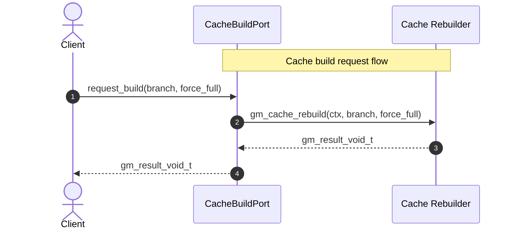
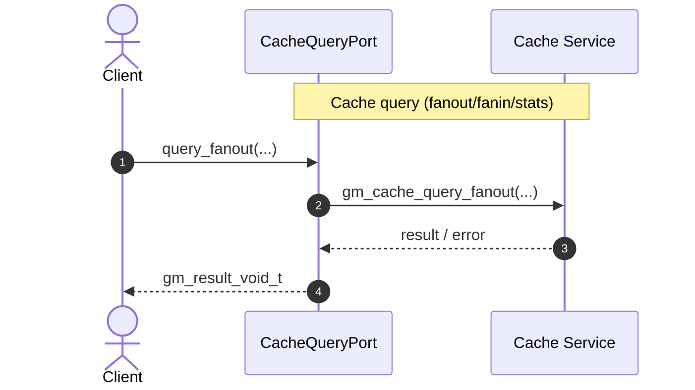
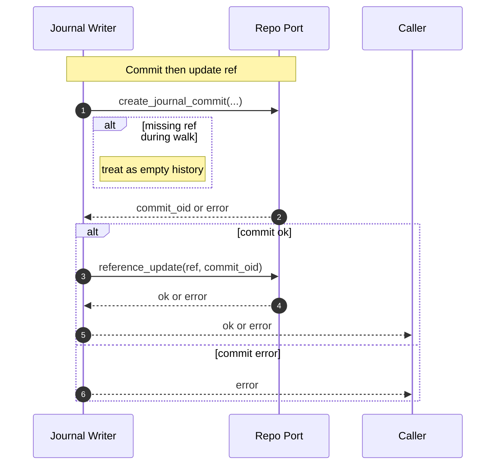
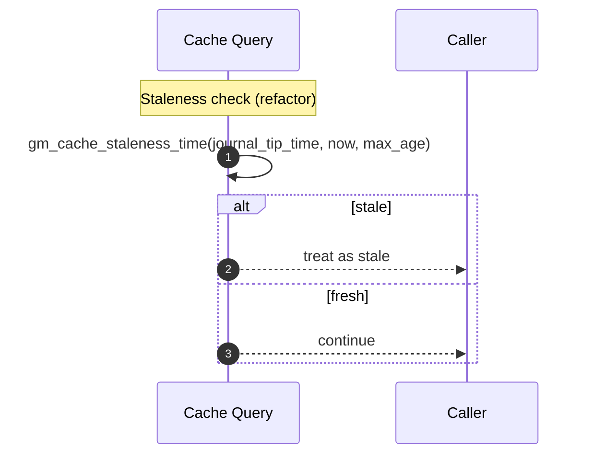

# Code Review Feedback

| Date | Agent | SHA | Branch | PR |
|------|-------|-----|--------|----|
| 2025-10-08 | CodeRabbit (and reviewers) | `0d1b34b0ee501bc7b7b2d0a9fb82e06a37642c77` | [feat/hex-ports-ci-green](https://github.com/neuroglyph/git-mind/tree/feat/hex-ports-ci-green "neuroglyph/git-mind:feat/hex-ports-ci-green") | [PR#177](https://github.com/neuroglyph/git-mind/pull/177) |

## CODE REVIEW FEEDBACK

### core/src/adapters/logging/stdio_logger_adapter.c:41 — coderabbitai[bot]

```text
_🛠️ Refactor suggestion_ | _🟠 Major_

<details>
<summary>🧩 Analysis chain</summary>

**Verify `gmtime_r` portability.**

The code uses `gmtime_r`, which is POSIX but not C standard. Ensure this is available on all target platforms or provide a fallback.

---

🏁 Script executed:

```shell
#!/bin/bash
# Check if gmtime_r is used elsewhere in the codebase or if there are existing portability abstractions
rg -n "gmtime_r|gmtime_s" --type=c --type=h -C2
```

Length of output: 2559

---

[tasks review_file_3/6 inspect_time_abstraction_1/1]
[observations]
- `wrap_gmtime_r` defined in `core/src/time/time.c`.
- Logging adapter calls raw `gmtime_r`, bypassing time abstraction.
- Time abstraction in `time_ops` maps to `wrap_gmtime_r`, not used in logger.
[analysis]
- Using raw `gmtime_r` risks portability issues on Windows.
- Abstraction exists to centralize portability handling.
[pending]
- Confirm `wrap_gmtime_r` has Windows fallback.
- Recommend logger use `time_ops->gmtime_r`.
[actions]
- Inspect `wrap_gmtime_r` implementation for fallback.
- Suggest using abstraction in logger.
[done] 
<!-- [/scratchpad] -->

---

🏁 Script executed:

```shell
#!/bin/bash
rg -nP -C3 'wrap_gmtime_r' core/src/time/time.c
```

Length of output: 471

---


</details>

**Replace raw `gmtime_r` with `time_ops->gmtime_r` in stdio_logger_adapter.c**  
Leverage the existing time abstraction (wrap_gmtime_r) and handle its `gm_result_tm_ptr_t` return to ensure compatibility on non-POSIX targets.

<!-- This is an auto-generated comment by CodeRabbit -->
```

_Meta_: https://github.com/neuroglyph/git-mind/pull/177#discussion_r2412649574

{response}

### docs/code-reviews/PR177/47a1bf537feb065ef3cbac02a8bf78e75944111c.md:10 — coderabbitai[bot]

```text
_⚠️ Potential issue_ | _🟡 Minor_

**Align title with H1.**

Per the markdown guidelines, the `title` field in front matter must match the H1 heading. Currently, `title: 47a1bf537feb065ef3cbac02a8bf78e75944111c.md` doesn't match `# Code Review Feedback`.


Apply this diff to align them:

```diff
 ---
-title: 47a1bf537feb065ef3cbac02a8bf78e75944111c.md
+title: Code Review Feedback
 description: Preserved review artifacts and rationale.
```

<!-- suggestion_start -->

<details>
<summary>📝 Committable suggestion</summary>

> ‼️ **IMPORTANT**
> Carefully review the code before committing. Ensure that it accurately replaces the highlighted code, contains no missing lines, and has no issues with indentation. Thoroughly test & benchmark the code to ensure it meets the requirements.

```suggestion
---
title: Code Review Feedback
description: Preserved review artifacts and rationale.
audience: [contributors]
domain: [quality]
tags: [review]
status: archive
---

# Code Review Feedback
```

</details>

<!-- suggestion_end -->

<details>
<summary>🤖 Prompt for AI Agents</summary>

```
In docs/code-reviews/PR177/47a1bf537feb065ef3cbac02a8bf78e75944111c.md around
lines 1–10, the front-matter title
("47a1bf537feb065ef3cbac02a8bf78e75944111c.md") does not match the H1 ("Code
Review Feedback"); update the title field in the front matter to exactly "Code
Review Feedback" (match capitalization and spacing) so it matches the H1
heading.
```

</details>

<!-- This is an auto-generated comment by CodeRabbit -->

✅ Addressed in commits e2eb59c to 9c9c521
```

_Meta_: https://github.com/neuroglyph/git-mind/pull/177#discussion_r2412649584

{response}

### docs/planning/Milestones.md:14 — coderabbitai[bot]

```text
_⚠️ Potential issue_ | _🟠 Major_

**Insert SPDX/license block immediately after the front matter**

Per our doc guidelines, every markdown doc needs the SPDX/license notice right after the front matter. Please add it here.  

Use this patch:

```diff
 status: draft
 ---
 
+<!-- SPDX-License-Identifier: LicenseRef-MIND-UCAL-1.0 -->
+<!-- © 2025 J. Kirby Ross / Neuroglyph Collective -->
+
 # Milestones (Placeholder)
```

<!-- suggestion_start -->

<details>
<summary>📝 Committable suggestion</summary>

> ‼️ **IMPORTANT**
> Carefully review the code before committing. Ensure that it accurately replaces the highlighted code, contains no missing lines, and has no issues with indentation. Thoroughly test & benchmark the code to ensure it meets the requirements.

```suggestion
---

<!-- SPDX-License-Identifier: LicenseRef-MIND-UCAL-1.0 -->
<!-- © 2025 J. Kirby Ross / Neuroglyph Collective -->

# Milestones (Placeholder)

## Table of Contents

- Near Term
```

</details>

<!-- suggestion_end -->

<details>
<summary>🤖 Prompt for AI Agents</summary>

```
In docs/planning/Milestones.md around lines 8 to 14, the document is missing the
required SPDX/license notice immediately after the front matter; insert the SPDX
license block (as the project convention uses an HTML comment SPDX line, e.g.
<!-- SPDX-License-Identifier: Apache-2.0 --> and any accompanying copyright or
license attribution required by our doc guidelines) directly below the front
matter header so the license notice appears before the rest of the content.
```

</details>

<!-- fingerprinting:phantom:medusa:sabertoothed -->

<!-- This is an auto-generated comment by CodeRabbit -->
```

_Meta_: https://github.com/neuroglyph/git-mind/pull/177#discussion_r2412649598

{response}

### docs/planning/Product_Roadmap.md:12 — coderabbitai[bot]

```text
_⚠️ Potential issue_ | _🟠 Major_

**Restore the SPDX/license block after the front matter.**

The documentation standards require the SPDX and copyright comments immediately following the front matter. Add the standard block before the H1.  


```diff
 ---
 status: draft
 ---
+
+<!-- SPDX-License-Identifier: LicenseRef-MIND-UCAL-1.0 -->
+<!-- © 2025 J. Kirby Ross / Neuroglyph Collective -->
 
 # Product Roadmap (Placeholder)
```
As per coding guidelines


> Committable suggestion skipped: line range outside the PR's diff.

<details>
<summary>🤖 Prompt for AI Agents</summary>

```
In docs/planning/Product_Roadmap.md around lines 8 to 12, the SPDX/license and
copyright comment block required by documentation standards is missing after the
front matter; insert the standard SPDX/license block (including SPDX identifier
and copyright line) immediately after the front matter and before the H1 "#
Product Roadmap (Placeholder)" so the license header appears directly after the
front matter and above the document title.
```

</details>

<!-- fingerprinting:phantom:medusa:sabertoothed -->

<!-- This is an auto-generated comment by CodeRabbit -->
```

_Meta_: https://github.com/neuroglyph/git-mind/pull/177#discussion_r2412649608

{response}

### docs/planning/Release_Plans.md:14 — coderabbitai[bot]

```text
_⚠️ Potential issue_ | _🟠 Major_

**Add required SPDX/license notice after front matter**

Docs under `docs/**/*.md` must place the SPDX/license block immediately after the front matter. Please add the standard notice so we stay compliant.  

Apply this diff:

```diff
 status: draft
 ---
 
+<!-- SPDX-License-Identifier: LicenseRef-MIND-UCAL-1.0 -->
+<!-- © 2025 J. Kirby Ross / Neuroglyph Collective -->
+
 # Release Plans (Placeholder)
```

<!-- suggestion_start -->

<details>
<summary>📝 Committable suggestion</summary>

> ‼️ **IMPORTANT**
> Carefully review the code before committing. Ensure that it accurately replaces the highlighted code, contains no missing lines, and has no issues with indentation. Thoroughly test & benchmark the code to ensure it meets the requirements.

```suggestion
---

<!-- SPDX-License-Identifier: LicenseRef-MIND-UCAL-1.0 -->
<!-- © 2025 J. Kirby Ross / Neuroglyph Collective -->

# Release Plans (Placeholder)

## Table of Contents

- Cadence
```

</details>

<!-- suggestion_end -->

<details>
<summary>🤖 Prompt for AI Agents</summary>

```
In docs/planning/Release_Plans.md around lines 8-14, the file is missing the
required SPDX/license notice immediately after the front matter; insert the
standard SPDX license block (for example an HTML comment like
SPDX-License-Identifier: <LICENSE-ID>) directly below the closing front-matter
delimiter (---) with a single blank line separation, so the notice appears as
the first content after front matter and complies with docs/**/*.md
requirements.
```

</details>

<!-- fingerprinting:phantom:medusa:sabertoothed -->

<!-- This is an auto-generated comment by CodeRabbit -->
```

_Meta_: https://github.com/neuroglyph/git-mind/pull/177#discussion_r2412649615

{response}

### docs/planning/Sprint_Plans.md:12 — coderabbitai[bot]

```text
_⚠️ Potential issue_ | _🟠 Major_

**Insert SPDX/license comments after front matter.**

Per the documentation guidelines, every Markdown page must include the SPDX/license comment block right after the front matter. Please add the standard comments before the H1.  


```diff
 ---
 status: draft
 ---
+
+<!-- SPDX-License-Identifier: LicenseRef-MIND-UCAL-1.0 -->
+<!-- © 2025 J. Kirby Ross / Neuroglyph Collective -->
 
 # Sprint Plans (Placeholder)
```
As per coding guidelines

<!-- suggestion_start -->

<details>
<summary>📝 Committable suggestion</summary>

> ‼️ **IMPORTANT**
> Carefully review the code before committing. Ensure that it accurately replaces the highlighted code, contains no missing lines, and has no issues with indentation. Thoroughly test & benchmark the code to ensure it meets the requirements.

```suggestion
---
status: draft
---

<!-- SPDX-License-Identifier: LicenseRef-MIND-UCAL-1.0 -->
<!-- © 2025 J. Kirby Ross / Neuroglyph Collective -->

# Sprint Plans (Placeholder)

## Table of Contents
```

</details>

<!-- suggestion_end -->

<details>
<summary>🤖 Prompt for AI Agents</summary>

```
In docs/planning/Sprint_Plans.md around lines 8 to 12, the file is missing the
required SPDX/license comment block after the front matter and before the H1;
add the standard SPDX/license comment block (e.g., SPDX-License-Identifier and
copyright/license owner lines used across the repo) immediately after the
YAML/front-matter section and before the "# Sprint Plans (Placeholder)" heading
so the document conforms to the documentation guidelines.
```

</details>

<!-- fingerprinting:phantom:medusa:sabertoothed -->

<!-- This is an auto-generated comment by CodeRabbit -->
```

_Meta_: https://github.com/neuroglyph/git-mind/pull/177#discussion_r2412649624

{response}

### docs/PRDs/PRD-co-thought-mcp-service.md:18 — coderabbitai[bot]

```text
_⚠️ Potential issue_ | _🟠 Major_

**Add required SPDX/License comment after front matter.**

Docs under `docs/` must place the SPDX/License comment immediately after the front matter. Please insert it between the front matter and the H1 heading to comply with our documentation policy.  [As per coding guidelines]

<details>
<summary>🤖 Prompt for AI Agents</summary>

```
In docs/PRDs/PRD-co-thought-mcp-service.md around lines 9 to 18, the file is
missing the required SPDX/License comment immediately after the front matter;
insert the SPDX short-form license comment (e.g. <!-- SPDX-License-Identifier:
Apache-2.0 --> or the project's approved identifier) directly between the
closing front-matter block and the H1 heading so the license line appears as the
first content after front matter and before "# PRD — Co‑Thought MCP Service".
```

</details>

<!-- fingerprinting:phantom:triton:sabertoothed -->

<!-- This is an auto-generated comment by CodeRabbit -->
```

_Meta_: https://github.com/neuroglyph/git-mind/pull/177#discussion_r2412649633

{response}

### docs/PRDs/PRD-git-mind-semantics-time-travel-prototype.md:13 — coderabbitai[bot]

```text
_⚠️ Potential issue_ | _🟠 Major_

**Add the required license/SPDX comment after the front matter.**

Docs must place the License/SPDX comment immediately after the front matter, but nothing is present here. Please add it to stay compliant.  As per coding guidelines.

```diff
 ---
 
+# <!-- SPDX-License-Identifier: Apache-2.0 -->
+
 # PRD — First-Class Semantics (Time-Travel Prototype)
```

<!-- suggestion_start -->

<details>
<summary>📝 Committable suggestion</summary>

> ‼️ **IMPORTANT**
> Carefully review the code before committing. Ensure that it accurately replaces the highlighted code, contains no missing lines, and has no issues with indentation. Thoroughly test & benchmark the code to ensure it meets the requirements.

```suggestion
---
<!-- SPDX-License-Identifier: Apache-2.0 -->

# PRD — First-Class Semantics (Time-Travel Prototype)

## Table of Contents
```

</details>

<!-- suggestion_end -->

<details>
<summary>🤖 Prompt for AI Agents</summary>

```
In docs/PRDs/PRD-git-mind-semantics-time-travel-prototype.md around lines 8-13
the required license/SPDX comment is missing after the front matter; add the
project's standard SPDX license comment immediately after the closing
front-matter marker (on the next line) so the file includes the correct
SPDX-License-Identifier comment consistent with the repo's licensing policy.
```

</details>

<!-- fingerprinting:phantom:triton:sabertoothed -->

<!-- This is an auto-generated comment by CodeRabbit -->
```

_Meta_: https://github.com/neuroglyph/git-mind/pull/177#discussion_r2412649638

{response}

### docs/specs/Technical_Specifications.md:14 — coderabbitai[bot]

```text
_⚠️ Potential issue_ | _🟠 Major_

**Restore the SPDX/license comment after the front matter**

We require the SPDX/license notice immediately following the front matter in every doc. Please add it back so the spec placeholder stays compliant.  

Suggested change:

```diff
 status: draft
 ---
 
+<!-- SPDX-License-Identifier: LicenseRef-MIND-UCAL-1.0 -->
+<!-- © 2025 J. Kirby Ross / Neuroglyph Collective -->
+
 # Technical Specifications (Placeholder)
```

<!-- suggestion_start -->

<details>
<summary>📝 Committable suggestion</summary>

> ‼️ **IMPORTANT**
> Carefully review the code before committing. Ensure that it accurately replaces the highlighted code, contains no missing lines, and has no issues with indentation. Thoroughly test & benchmark the code to ensure it meets the requirements.

```suggestion
status: draft
---

<!-- SPDX-License-Identifier: LicenseRef-MIND-UCAL-1.0 -->
<!-- © 2025 J. Kirby Ross / Neuroglyph Collective -->

# Technical Specifications (Placeholder)

## Table of Contents

- Overview
```

</details>

<!-- suggestion_end -->

<details>
<summary>🤖 Prompt for AI Agents</summary>

```
In docs/specs/Technical_Specifications.md around lines 8 to 14, the SPDX/license
notice was removed after the front matter; restore the required SPDX/license
comment immediately following the front matter (e.g. add the SPDX identifier
line such as "SPDX-License-Identifier: <license>" right after the front-matter
separator) so the document is compliant with project licensing conventions.
```

</details>

<!-- fingerprinting:phantom:medusa:sabertoothed -->

<!-- This is an auto-generated comment by CodeRabbit -->
```

_Meta_: https://github.com/neuroglyph/git-mind/pull/177#discussion_r2412649645

{response}

### docs/wish-list-features/README.md:10 — coderabbitai[bot]

```text
_⚠️ Potential issue_ | _🟠 Major_

**Add required SPDX comment after front matter.**

Docs must place the license/SPDX comment block immediately after the front matter; this placeholder currently omits it. Please add the repository-standard SPDX and copyright comments beneath the `---` block.  


```diff
 ---
 status: draft
 ---
+
+<!-- SPDX-License-Identifier: LicenseRef-MIND-UCAL-1.0 -->
+<!-- © 2025 J. Kirby Ross / Neuroglyph Collective -->
 
 # Wish List Features (Placeholder)
```
As per coding guidelines

<!-- suggestion_start -->

<details>
<summary>📝 Committable suggestion</summary>

> ‼️ **IMPORTANT**
> Carefully review the code before committing. Ensure that it accurately replaces the highlighted code, contains no missing lines, and has no issues with indentation. Thoroughly test & benchmark the code to ensure it meets the requirements.

```suggestion
---
status: draft
---
<!-- SPDX-License-Identifier: LicenseRef-MIND-UCAL-1.0 -->
<!-- © 2025 J. Kirby Ross / Neuroglyph Collective -->

# Wish List Features (Placeholder)
```

</details>

<!-- suggestion_end -->

<details>
<summary>🤖 Prompt for AI Agents</summary>

```
In docs/wish-list-features/README.md around lines 8 to 10, the front matter
separator (“---”) is present but the required repository-standard SPDX and
copyright comment block is missing immediately after it; insert the standard
SPDX license comment block (matching repository conventions) directly beneath
the `---` line, including SPDX identifier and copyright owner/year, ensuring
there are no blank lines between the front matter separator and the comment
block.
```

</details>

<!-- fingerprinting:phantom:medusa:sabertoothed -->

<!-- This is an auto-generated comment by CodeRabbit -->
```

_Meta_: https://github.com/neuroglyph/git-mind/pull/177#discussion_r2412649654

{response}

### migration-progress.md:5 — coderabbitai[bot]

```text
_⚠️ Potential issue_ | _🟡 Minor_

**Add required front matter.**

Per the markdown guidelines, documentation files must have front matter at the beginning. This migration tracking document is missing it.


Add front matter before line 1:

```diff
+---
+title: Hexagonal Architecture Migration Progress
+description: Single source of truth for tracking hexagonal architecture migration
+audience: [contributors]
+domain: [architecture]
+tags: [migration, hexagonal]
+status: active
+---
+
 # Hexagonal Architecture Migration Progress
```

<!-- suggestion_start -->

<details>
<summary>📝 Committable suggestion</summary>

> ‼️ **IMPORTANT**
> Carefully review the code before committing. Ensure that it accurately replaces the highlighted code, contains no missing lines, and has no issues with indentation. Thoroughly test & benchmark the code to ensure it meets the requirements.

```suggestion
---
title: Hexagonal Architecture Migration Progress
description: Single source of truth for tracking hexagonal architecture migration
audience: [contributors]
domain: [architecture]
tags: [migration, hexagonal]
status: active
---

# Hexagonal Architecture Migration Progress

Started: 2025-10-08

This file is the single source of truth for tracking the end-to-end migration of the C library to a strict hexagonal architecture, per AGENTS.md. Update this checklist as work proceeds. Check off items with `[x]` only after they are complete and validated (CI green, zero new clang-tidy warnings, and docs updated).
```

</details>

<!-- suggestion_end -->

<details>
<summary>🤖 Prompt for AI Agents</summary>

```
In migration-progress.md around lines 1 to 5, the document is missing required
front matter; add a YAML front matter block at the very top (before line 1)
including at minimum a title, date (2025-10-08), and a short description (and
optionally tags/layout) so the file conforms to the markdown guidelines and site
generator expectations; ensure the block is delimited with triple dashes and the
rest of the content follows after the closing dashes.
```

</details>

<!-- This is an auto-generated comment by CodeRabbit -->
```

_Meta_: https://github.com/neuroglyph/git-mind/pull/177#discussion_r2412649659

{response}

### docs/code-reviews/PR177/3b7ce522e107011f8f92dc629facfa5b6a3595fb.md:18 — coderabbitai[bot]

```text
_⚠️ Potential issue_ | _🔴 Critical_

<details>
<summary>🧩 Analysis chain</summary>

**Doc header must match guidelines.**

The doc front matter and header block miss multiple required conventions: the `title` must exactly match the H1 (“Code Review Feedback”), the SPDX/license comment block must appear immediately after the front matter, and the file needs a `## Table of Contents` section. Please align this file with the docs/**/*.md rules.  
   
Add front matter fixes and license block quickly with this patch scaffold:

```diff
---
-title: 3b7ce522e107011f8f92dc629facfa5b6a3595fb.md
+title: Code Review Feedback
 description: Preserved review artifacts and rationale.
 audience: [contributors]
 domain: [quality]
 tags: [review]
 status: archive
 ---
+<!-- SPDX-License-Identifier: LicenseRef-MIND-UCAL-1.0 -->
+<!-- © 2025 J. Kirby Ross / Neuroglyph Collective -->
 
 # Code Review Feedback
+
+## Table of Contents
```

Confirm any additional required sections follow afterward. As per coding guidelines.

---

🏁 Script executed:

```shell
#!/bin/bash
# List docs directory contents
find docs -maxdepth 2 -type f

# Search for SPDX license convention in docs
rg -n "SPDX-License-Identifier" -g "docs/**/*.md"

# Search for Table of Contents guideline in docs
rg -n "## Table of Contents" -g "docs/**/*.md"

# Search for files mentioning 'guideline'
rg -l "guideline" -g "docs/**/*.md"
```

Length of output: 14870

---

🏁 Script executed:

```shell
#!/bin/bash
# Show front matter of the review artifact
sed -n '1,30p' docs/code-reviews/PR177/3b7ce522e107011f8f92dc629facfa5b6a3595fb.md

# Show template conventions
echo "---- TEMPLATE START ----"
sed -n '1,50p' docs/templates/code-review-feedback.md
echo "---- TEMPLATE END ----"
```

Length of output: 2224

---

🏁 Script executed:

```shell
#!/bin/bash
# Search for front matter guidelines
rg -n "front matter" -g "docs/quality/Markdown_Style_Guide.md"

# Search for SPDX guidelines
rg -n "SPDX" -g "docs/quality/Markdown_Style_Guide.md"

# Search for Table of Contents in style guide
rg -n "Table of Contents" -g "docs/quality/Markdown_Style_Guide.md"
```

Length of output: 57

---


</details>

**Doc header must match guidelines.**  
Front matter `title` must be “Code Review Feedback” (matching the H1), insert the SPDX/license comment immediately after the front matter, and add a `## Table of Contents` section beneath the H1.  

```diff
---
-title: 3b7ce522e107011f8f92dc629facfa5b6a3595fb.md
+title: Code Review Feedback
 description: Preserved review artifacts and rationale.
 audience: [contributors]
 domain: [quality]
 tags: [review]
 status: archive
---
+<!-- SPDX-License-Identifier: LicenseRef-MIND-UCAL-1.0 -->
+<!-- © 2025 J. Kirby Ross / Neuroglyph Collective -->
 
 # Code Review Feedback
 
+## Table of Contents
```

<!-- suggestion_start -->

<details>
<summary>📝 Committable suggestion</summary>

> ‼️ **IMPORTANT**
> Carefully review the code before committing. Ensure that it accurately replaces the highlighted code, contains no missing lines, and has no issues with indentation. Thoroughly test & benchmark the code to ensure it meets the requirements.

```suggestion
---
title: Code Review Feedback
 description: Preserved review artifacts and rationale.
 audience: [contributors]
 domain: [quality]
 tags: [review]
 status: archive
<!-- SPDX-License-Identifier: LicenseRef-MIND-UCAL-1.0 -->
<!-- © 2025 J. Kirby Ross / Neuroglyph Collective -->

 # Code Review Feedback

## Table of Contents
```

</details>

<!-- suggestion_end -->

<details>
<summary>🤖 Prompt for AI Agents</summary>

```
In docs/code-reviews/PR177/3b7ce522e107011f8f92dc629facfa5b6a3595fb.md around
lines 1 to 18, the front matter and document structure do not follow project
guidelines: change the YAML front-matter title value to "Code Review Feedback",
insert the SPDX/license comment immediately after the closing front-matter
block, and add a "## Table of Contents" section directly beneath the H1 heading;
ensure spacing and ordering match other review artifacts.
```

</details>

<!-- fingerprinting:phantom:triton:sabertoothed -->

<!-- This is an auto-generated comment by CodeRabbit -->
```

_Meta_: https://github.com/neuroglyph/git-mind/pull/177#discussion_r2412749770

{response}

### General comment — coderabbitai[bot]

```text
<!-- This is an auto-generated comment: summarize by coderabbit.ai -->
<!-- walkthrough_start -->

## Walkthrough
Adds logger and metrics outbound ports plus cache build/query inbound ports and adapters, introduces an internal cache staleness helper, extends gm_context_t to hold ports, implements ports/adapters and wiring, updates repo/journal behavior, refactors cache staleness usage, updates Meson, and replaces many docs with placeholders.

## Changes
| Cohort / File(s) | Summary |
|---|---|
| **Internal cache staleness helper**<br>`core/include/gitmind/cache/internal/staleness.h` | New static inline `gm_cache_staleness_time` to evaluate cache age from timestamps and max-age; C/C++ compatible. |
| **Context ports expansion**<br>`core/include/gitmind/context.h` | Adds optional `logger_port` and `metrics_port` fields plus disposer callbacks; includes new port headers. |
| **Public port headers**<br>`core/include/gitmind/ports/logger_port.h`, `core/include/gitmind/ports/metrics_port.h`, `core/include/gitmind/ports/cache_build_port.h`, `core/include/gitmind/ports/cache_query_port.h` | New public port APIs: logger/metrics outbound ports with safe no-op wrappers; cache build/query port interfaces (vtbls, init/dispose). |
| **Cache port implementations**<br>`core/src/ports/cache/cache_build_port.c`, `core/src/ports/cache/cache_query_port.c` | Implements per-port state, vtables, input validation, calls into gm_cache APIs, error mapping, and dispose logic. |
| **Logging adapter (stdio)**<br>`core/src/adapters/logging/stdio_logger_adapter.c`, `core/src/adapters/logging/stdio_logger_adapter.h` | Adds FILE*-based logger adapter: level filtering, ISO8601 UTC timestamp formatting, component label, init/dispose and error handling. |
| **Metrics adapter (null)**<br>`core/src/adapters/metrics/null_metrics_adapter.c`, `core/src/adapters/metrics/null_metrics_adapter.h` | Adds a no-op metrics adapter implementing counter/gauge/timing vtbl and lifecycle. |
| **Cache query staleness refactor**<br>`core/src/cache/query.c` | Replaces manual staleness logic with call to `gm_cache_staleness_time` and includes the internal header. |
| **Git repository adapter tweaks**<br>`core/src/adapters/git/libgit2_repository_port.c` | commit_create_impl falls back to synthetic signature on git_signature_default failure; reference_update_impl ensures ref path dirs exist and refuses non-FF only when not forced. |
| **Journal writer flow update**<br>`core/src/journal/writer.c` | Treats missing ref as empty history during walks; after successful commit, updates target ref to the new commit and propagates update errors. |
| **Build system**<br>`meson.build` | Registers new ports, adapters, and public headers in the Meson build files. |
| **Docs — placeholders & archival**<br>`docs/PRDs/*`, `docs/planning/*`, `docs/specs/*`, `docs/wish-list-features/*`, `docs/code-reviews/*` | Replaces many PRDs/planning/specs with placeholder drafts, adds archival code-review artifacts and migration-progress.md. |

## Sequence Diagram(s)








## Estimated code review effort
🎯 4 (Complex) | ⏱️ ~60 minutes

## Possibly related PRs
- neuroglyph/git-mind#158 — Overlaps changes to cache staleness/time-check logic in `core/src/cache/query.c`.  
- neuroglyph/git-mind#169 — Refactors cache query staleness/load logic; likely to conflict with the new staleness helper.  
- neuroglyph/git-mind#171 — Expands gm_context_t with ports in another PR; strongly related to context port additions here.

## Poem
> In burrows of code where timelines weave,  
> I nudge the cache to build, then leave.  
> I log a squeak, and metrics hop by—  
> Fresh or stale? I sniff, I try.  
> Refs now point where commits arrive—thump-thump! 🐇✨

<!-- walkthrough_end -->


<!-- pre_merge_checks_walkthrough_start -->

## Pre-merge checks and finishing touches
<details>
<summary>✅ Passed checks (3 passed)</summary>

|     Check name     | Status   | Explanation                                                                                                                                                                                                                                                                                     |
| :----------------: | :------- | :---------------------------------------------------------------------------------------------------------------------------------------------------------------------------------------------------------------------------------------------------------------------------------------------- |
|     Title Check    | ✅ Passed | The title succinctly captures the primary changes by mentioning the addition of hex ports, cache coordinators, and improvements to journal adapter robustness, aligning with the core objectives of the PR.                                                                                     |
|  Description Check | ✅ Passed | The pull request description adheres to the required template by including clear sections for Summary, Change Areas, Risk, and Code Review Guidance, each populated with detailed information, checkboxes, and validation steps, making it comprehensive and aligned with repository standards. |
| Docstring Coverage | ✅ Passed | Docstring coverage is 100.00% which is sufficient. The required threshold is 80.00%.                                                                                                                                                                                                            |

</details>

<!-- pre_merge_checks_walkthrough_end -->

<!-- finishing_touch_checkbox_start -->

<details>
<summary>✨ Finishing touches</summary>

- [ ] <!-- {"checkboxId": "7962f53c-55bc-4827-bfbf-6a18da830691"} --> 📝 Generate docstrings
<details>
<summary>🧪 Generate unit tests (beta)</summary>

- [ ] <!-- {"checkboxId": "f47ac10b-58cc-4372-a567-0e02b2c3d479", "radioGroupId": "utg-output-choice-group-unknown_comment_id"} -->   Create PR with unit tests
- [ ] <!-- {"checkboxId": "07f1e7d6-8a8e-4e23-9900-8731c2c87f58", "radioGroupId": "utg-output-choice-group-unknown_comment_id"} -->   Post copyable unit tests in a comment
- [ ] <!-- {"checkboxId": "6ba7b810-9dad-11d1-80b4-00c04fd430c8", "radioGroupId": "utg-output-choice-group-unknown_comment_id"} -->   Commit unit tests in branch `feat/hex-ports-ci-green`

</details>

</details>

<!-- finishing_touch_checkbox_end -->

<!-- tips_start -->

---

Thanks for using CodeRabbit! It's free for OSS, and your support helps us grow. If you like it, consider giving us a shout-out.

<details>
<summary>❤️ Share</summary>

- [X](https://twitter.com/intent/tweet?text=I%20just%20used%20%40coderabbitai%20for%20my%20code%20review%2C%20and%20it%27s%20fantastic%21%20It%27s%20free%20for%20OSS%20and%20offers%20a%20free%20trial%20for%20the%20proprietary%20code.%20Check%20it%20out%3A&url=https%3A//coderabbit.ai)
- [Mastodon](https://mastodon.social/share?text=I%20just%20used%20%40coderabbitai%20for%20my%20code%20review%2C%20and%20it%27s%20fantastic%21%20It%27s%20free%20for%20OSS%20and%20offers%20a%20free%20trial%20for%20the%20proprietary%20code.%20Check%20it%20out%3A%20https%3A%2F%2Fcoderabbit.ai)
- [Reddit](https://www.reddit.com/submit?title=Great%20tool%20for%20code%20review%20-%20CodeRabbit&text=I%20just%20used%20CodeRabbit%20for%20my%20code%20review%2C%20and%20it%27s%20fantastic%21%20It%27s%20free%20for%20OSS%20and%20offers%20a%20free%20trial%20for%20proprietary%20code.%20Check%20it%20out%3A%20https%3A//coderabbit.ai)
- [LinkedIn](https://www.linkedin.com/sharing/share-offsite/?url=https%3A%2F%2Fcoderabbit.ai&mini=true&title=Great%20tool%20for%20code%20review%20-%20CodeRabbit&summary=I%20just%20used%20CodeRabbit%20for%20my%20code%20review%2C%20and%20it%27s%20fantastic%21%20It%27s%20free%20for%20OSS%20and%20offers%20a%20free%20trial%20for%20proprietary%20code)

</details>

<sub>Comment `@coderabbitai help` to get the list of available commands and usage tips.</sub>

<!-- tips_end -->

<!-- internal state start -->


<!-- DwQgtGAEAqAWCWBnSTIEMB26CuAXA9mAOYCmGJATmriQCaQDG+Ats2bgFyQAOFk+AIwBWJBrngA3EsgEBPRvlqU0AgfFwA6NPEgQAfACgjoCEYDEZyAAUASpETZWaCrKPR1AGxJcAgrXqwJAAePPgUuIgANIxoDIEKYbTwGNRhUegY9EL42BQpHui0aNw0fBSC2Ii45IjIkAYAco4ClFwAjADsHZCAKAT83GSQ9QCqNgAyXLC4uNyIHAD080TqsNgCGkzM8+S5+EQestywS+pgzMm089zYHh7znd31PniwYVwAZgfJROUC+BFDAwAZRyFAYJEgAioGDiHxI1HmgSCYG4YQiYAY8GIFBIg0ASYQwZykXCQ6GwyDMbRYeoAYRx1Do6E4kAATAAGFkAVjAbTZYDZAA5oGyAGwcNkAZg4LJZAC03AhkLZChJMODkLh4ki0ER8PkKfAftR4HrIfJkrhyrRsJiMERIMFuB54JiSajwshMPRNckEhQkikCBR0vBmLx8BJvpBsrl9b9KtVpOkvQ6MA4KFGaQBJHjOdSyDSQADSJHkcUwpDmBigAHk8H9sJlQh6uGh/JAiMwAPoePakChd90klOdrtsS0uxCDtGQAAUzRxtzQYEQaHeJGiGEI+G4kHeGbItAOAEoMvQlO80Ddh0USpRkLOqkl8JBe0R+5ubgVxxmGIhj4WACiQQ0E2o5MBgNAgV2JIAO4rK+faUPMP6Tug3ADJkjLUJAuDaAUBDoBI+DwPQPgAEI5lC8IANYaNWkBZhgDZNgwsTxEwiTJKkwatu2bFxCQXYCNg8AeLQ07hGeMSCV2ACO2CULIkkkpqOFKF4RAMrhL7BEg4h2pAPhWFmiAANwOiBVBiDJ8RVGgXg1MggQeAMfCEUwOLzMkDAeNgSgnLg5yZPMAmBN5kGUPk8z2Y5SYaLA0mVBC6h7uUzC2RCClKfRUAABLOEoWAxnkDnSc6AjLLgLKFMUpS5pqyDvGEe7wMGuAYiw5zDk2OLvIw9LiHq8zYNwRQ0HOW54QIBwKF5iBgvMJXRbBGalBs0meSQMWLW2dX3oF8wVVVLJdjiqKIOoYTKUOGwAQxfj0Htd58CmQ72KC4KtV4D5vh+FIkBOf7RGFEKcf63FBv+0mLgyATwkowavvpjK+pqELKkoiAMBmJQmhguWQAAIvgDCOOwxp6h88AhM6GA0cm7Y4gpbWMvueokpS0zIUCVhEwAGtEKZtvQ5xGkNGAouUPzxcw3rWTRlD0QY0DSACKbZhwD23LhavINwaC1CgWAkwwit8LOEosvMVv3VAlKK4wWK9mxBSoDLgyzrQpPIAA1JConiZA/s0FUfuMB4FZgOItCyHbkANCQsF7o2Yj4w5+aQBeV4eAChGruukBbmAO61S9iDKzSsAVhCzjwnMkA0mEEI0sjULOLI0RDog8zPaUv1IRQ0SocDmXHtEy0OfMq3qBCBuapAABkbcnWXpTRN7ZNsJBlME43YxZvMwz89JIliZc2aQLBYQ0Z8+CwcgOKUr6jbMIo8DvPAdCFjYSA0VwYx75zhFuoSQYNq52mkNEPCYkwDFEwrQdIRBsCFUZHIXWYd7oGBsCQSMScOyiSKDCbwe5SaVH4Fgcgyd3qBDbPeaSPosDgwDDxB8W0Iq+X8ttKqwVLjd3mAAKk2s3HaDArhoh7qDQR49cLxGdFUbCt5+5CybJPO4x11A1T7pQSA8YqhOW+tIQsAA1DO418ZcAoI2CkaBHaYjAC7Mqs5Tbm3gAALzoFg/QxhwBQEPPwfqV4CDEDIMoGg9BNjb2ZLwfgwhRDiCkDIMsihlCqHUFoHQ3iTBQDgKgVAmAcDBNIOQKg4SFCsHYJYtAycHBOBcGaBQiMVBqE0NoXQYBDA+NMAYdhPk/IBR4RcUK7FtoWiilPWKoTagJS1gAInmQYCwRkswhJKXDewjhKT1PwP1cskDEBGCYpaRQNppDoCLvgsZpUCi0MRnNUZMJ+ncPULw4ZgkIqlGipMpyCVZHqRIJ/Go5z7LiAYMbOmEJ3ipwlh2bsoMuzfKTDBUMEJCJKFKMFMGIz7B4TitMmA8QoUwhhXhRWyA1HIu4Mitgm577Uo3NJSkQQuw6iEogUQepEHRBxLgWMUZLSKRQP1dGjBcg4kgrhFFKBkBVF/LgWaa56oUvEFS8QbAGlvxxH8rATKWWkARRyzI5kUAkh5bGJqDl2VCqLnStVKVkBTXQO8JVoJ8iUvpfwdy8QSCR1mIyO10qr4rDRvEXVrKg2ZHvoWOAEJbk6NQDSTqYZjQzQhPBBewRPmQFmTSWZBDCpNRajSX2/sUzJRlXhTIhVIBxqRk+P4+APC/JTE+C0CVCwNF0iBcZBQlAILIJiM5LVKDlD4BAo8UYWiyE5cba4JJVTOnMaaSMaBJXqs2AbDMiA9Sei1X0rhtBlbmEsD4XOYT8YahfCKpQvlnC72QDsyyQ5GQtWuDNF0qZxDiGkEYKAABZQGrwnr+DoFwAABg2go4ERkItxVMqcdr5wWhFAAFhgtGV1Dl3V2uiKJSCqH0NblgvS3DyG0OczQMy1lBqIKIOPGB42hjIBgd6Y8rhgVXlSKuV8uDPzYBgaMIBKooZ1lMCULo3BX9k4AuauELgAGkiOAMPM2Zv7umsc4QMl5QyIJQU0LAOZCylk+BWcUsJjJalbPkI+vZlZf1GRA/QHcEsyp9sPAO2QYBkgiDTqabuOlYVdl05mmCXAqEA2YC0JGf1KAqTnKOGLA4hwwVPOmxK6hkBJEQBdHRqIrmIXfLF5LWWcsqNFoDX8U53qzlHCPKraIUtBoXhlrOSAct8DqypLsJX8DssJkxTTjJwtvudGC2tWcSD9phF/BuiWVLNqbJ126sB+uZBdOs30kT2AamrqpQIVr/OUnkC0SAjZkigIzh4p6TZVrwPoXXG1JdZhX0CFgRsyVD0MRjVa2zZzHQphFcFkCOKrFiFyKil8rwg4gJcwUfzaWcjDjPRmQyelhOGU/j6xBnrIQkGrpGFqsnLL6SjN3I9iyT3I/vQF69ohI6lIvQEp9aIX18BGx+9goCf0MSBAKmyItQPMfAhzELuAGO+hYyI/dWmgo6ZFyBBKDGiPG0G1WIYUBE7J0x+JcDCXB5dZJHNocZkBPq4Tvgnr7KKDgeIqROcAijcNctyQY8NXuyO/COhgRQ5jwm4MGbzXrUse6+7EthrnMKuThUn7gPFu2u9daMx239BZwCLD5753rvauR7/AbyA3u0S+4EwYITarRMpIk3g6T7xZPMgU/AJTKm1NgCMBpp5HGhn8PhWfcS82DPKaMye0zoTSkWc2R3Jnv2DkGEep6C51C1ijcbkZEyNaEY6Lb+xwZIUu8wZ7xJZbfySQXmSGc1doMwD7+bMOOfjC/QsKDPwKQfA0cGXtN7Z+WBjKmULEcq0py58txJZ74MAowJBpovBcJDha4mxV13pZUbQ4IEJV1wCZpQh8sUwdw0BsocUGQgIggcs59wCVBIC0tcJr5+hz0d1LESBsoqhhJA5aBZx24YRYBohZNwQuwoVbhTwUxkgF1SIGRmCyRYAAJiY6c65kBztxBLtd5AsGA5Ygs99GCutpDZwhwQZcAghTwzU8goxRwcQHBc4uxk90MUxLcypwJFDu8VDit492V1DC8gI0xwdkBW46YaJw0idi1/YIJal7xf82MsYJNP8DRQDKQPBuUfVZAoxTRX8oxDDrxhFIpgdcBoCK4E4XxkgIVGJ5gaweBKBZM2B6B0FQwnQSAol71lYlkcQq8uxyA6A6ADVQCwgEVYISB7NHpGR2cwVW5v9SFXpMoA5z5r9ohpcwDcAZou4ZwECxAytkZ1wGBZBfJIVoUL0GIrBF8P0iVfMsBLoiBAxXCuArCJIbDz5VDQCep6ATilDZJ98utncNitiwVUCPAaC6DcAGDz5HwfV3hogWC4h2CwhODuCPBeCmx+CzEhD2UPA/jSQ1RRDj0jIqcJZL1ZEIQb16dqdH1HQWcnM2dnjP0udp8oAujvRoCLxwM0iBgLwQdED5DrDlDzjktXiGTTimTe8WTJiPAYITdGNP5IDJcvJpdnlZcd8JE3lAgvjOS0RFcHpHMoCaSAVpJZjmQwNqTGj+pVS2TbipT7j3oABvBQNMEkG4s4mUz3V4r3V4iyZPfPEFEgCyAAXx1PNIP3Dz91JIVNVPA21LNI5PdMtO5MgCNIMOkGvBMJIgkhJFT2ZkUnoP3yzzhUZLuNsPD3tN+JBh3RJHLD4AEQBLYMhHwEbQGJBK/F90C0SOMNMJjIEUhMXQZCTKCxTL1LTM9xJAERhLhL8JzOrjzILIrKdM9IcyUHoB2JhUxLvQlnAwAHE/0uwGgawiYswgQaQfAbAiZKzwzqyoz0N/TUzmSGs1D9zWzDz2z88ND5D5dPiOyxBtDhyySU5iV8YJtb0GcqYk8ozXSAyHj7CSA3dmz2SDyLSbyLzC8/cm9qx1MpcgjRTXld9ZJsoXA+9DNVNjNh81kylLMJ8bMIE7MDA/8Tl1RzlwtkgWJzwMxIxDJ3oidQZIAkKZsVS8JxBhM/xCxZ9zkejjZShLwvphZahSZ4B1kNS0SrlYgkCF5AcRlWxr86SbIyCCksCcCHTpJV0gCS5YJQDDJWS8tIoh5zlWTdMqR+VYAcRVjny/MSI9KHwkLlJLwtw8BohbKuDMBkhogQV/x5jnRFjljICXI3JRLLihLnQPFpJnd0Tr9o0tR182dyhIxgjkFUF6B3DkhPDSABjG4S1yl554A1BnQ0ixjYKHVRAkwJ9kgwBXhkpFSzkAKqzPiazohoNZI6qYJGruxdzcA2qgtryUt5jcSPRzleKgxPNnRHZpDgr3E5DxyXzRw5JkL4VktpDVLWtssE8+BZr5qYM7DVq+sCUMTpBDQ3t2VPQsAlLBUVLhZZFNtiyIZAwWpWTCJyg8AsVBJ6LFJ6k6BKw5x7LEd5h7LkhwTvQXweUDwpB4TWDcCWLQUHxPqhImBGwrjMoEV3EhI5BQ4xDAIKBR17BDqM5DJUAV0tyjD6qOqJNeU8hIAF14yorIUxJ7V7BfjOod5T96AyCRT81/QTr6B7Iq1/RLIs0c080ZpSYGZydjMUTGdCJac3zsT+p+qylX1CTOdv0STzdk4NSQ95JNrZJksxd+S6bmNN8Zd4KJT4VnLlsBMNd8ENahduw5rlIFqGsrS9bfQBSIQhSHlBsO9xSPRJShJzbZT+MGJA8fTmM/S7btapSuSZpxcsA3bDaYKvbt8+FTaYMA7wg5Srb1aKSAVNb7bdShJdaGNHw+cJLEptdsdJcTTAt87HagyZprTuSGMUwwM7TOzmKSAwNTxXaDaPaOF29k7xFfazb3qbpA7La1anzdi87I7C6jzLiALa6tr0yC9wguqgdQKBE7z6Mya+VDIwMwzibIzSIYJY6mM+6RTvaU7h607R6+8J7A9pqPyD6I6Hbl6M8/zF7Z689V7cAd6e7BSja4LO9U7EK76LaB9VMoKW8elE6B7tMfaIgjp9dltUKKdllVlzNubx9tldk8LucOK4DCTEdyKCtlhqKZx+jrrhTYKr6h6kGPd9NAjjlrRiKiH30wU3xXxcEfVUxHAmtEoqazk5yuwxgawZyuwiZAJyJhgZzogRGxGJGswGgAAxGseR+cxRrsAAdXXIaA0dEfEa7EAhsBsBrBsHmLUr1A0q0vtFeMv0Nm6JmNLvB3i3dxQfD1PDUhJCh2xxQODN0vqmFlOoNhwO0T4AdMLCJgBVPyIODO1IAsYZMO5NPCMvO0MlXUujtEgKfqwECdaAYkPojJrPtzfFdzbq7K6rfB7B4Z5MN1qazOrtzPzw3T1HYEaaqEYD7PzzYFqFZWPCMCsDitIjP0ho/WyNPyvioAwh0VycCzmy4e8YKIoCKIdS/C6dEAZgoVGOvw6VePmKHD2e5I6TfAsg/gyHkAewwC/CiPJrTEC3wBomPqYNPFnGLh3DEKzH6gENoA3h9RIC0lDgC0Ob0Hsb0DfEcPCA6Uqe4akEiOyracgmHlKtIDEI4szSimzVzQ5r8YhNgpxbRM/xgSwB8OypTTEkzjekJP6PsjyvzECNVwm2xlxgSQxLIUqJhSJ0qFZWgVMoRhXDXEBnkEdHiXvS8o/hIAxF8ohBAPvAQF3EfXCchpIGqMp1KGpylviEnPfPuZxIILxJxy4uVpm3sxUbpq4CAbof4UYYSn910BgGgMKFHK4DIH4b1yIBqbhZgjtbN1MT8mkC4AUaMakZkZnMgAAF5IBeQDGtHlG1GI3WQ2QY2jHdGbAGgE2JQk3IAg2JGTGzG7BI2UM2Q7WclHWBdaAuBw6ewPH66oN3HCsksnbuTvWzdoAy3HNK3S75ma3cAfX7WANIt7wLXszu2G2utnb88bTKavzOzfi+3S2lTAkO3R3+wDcS2HWBgnXBcq2knXj53IAB2otjjuwWqSnU8ynZwKnMzR3PWfV0MvA4WOneznAWmWBURyAkXjTOnmm08UWXd13NiOGp6YVy3O3jQwUJnyAibinSb3XV2IWeyV2isV7Lz3Xb26nYWfUn2umX2t633EXOqv3n28zenVxUX93yI8c0ACdrdGJ+p3pUAGhhgxgxhDW0Qjm0DGPmPWPX12PQXjnwW9hA0mOWPbnzUHmnnk9ZwKz/hAgKB4IrV+DHmzkQWwWIWQWYWH2sOEWP3CPSP+nj1IHm9W84Gt8EHr6kH099M0H0LMHR9sG6lrM8Ga5p9CH59+B6wchFsc99YZwrleLY0Yrmcsn7QrHgDNKJiSDJWBBHH6B3oVBZVxKXyicKj1A38FAEb7xGqrxKx5i1VvgMjonAUVPCSRLj2xwfO88RxQ9Kvo66mu4/I59s8gZ6ta25KcyOZjLDJNQzLgOXz8neIMu9KWV/BsvsB9V2VCOAdQxvgxwMihmIwRmK1wPwVJnbsZmkZmvKturMuBwRYurOstJxu2VAZ5ituo98u7Q5uj9HtS5zmRVLz9mcdDCBg04wa5mBvA1GxJuLJZPKAFOGV0Z5BZNYJq1NWIRWSyCRVwnABMAhlV+OVYZaeTcKyoxYpsSs5uWsTQ3RTUgMjmnUcoEYyH6GwPOoR8+6JyVYutgIk+ed3optNHed3HnlgAyNLxIKQH204updX3TAC7CoBRzhJCZ4ZspEgjQlgle1Oy0ouxCu/iMCRNPXVdRJpy1YkJ1YfTlv1fCFZx4CVvF5Vs6IVPCw1MpOY1N+VKras+SbQPO9zzq95LPvjovtocHv4Ss8zpHKG3wS4tDvXfVJzq1K7bt9a5JCNMQ5D/HebY7KnavdhOdMC2t9wD5Il0tbd4lI96Dq9NHPc9967bII+6sv7i4H96t9q6bbQNDJPe3JJpPtrPhuG5FnKZnZhcQ5/ZSBpVOzI3QyEew5/bwiIH/AsiKZ3Lr/tyO4m8Bmb7t1ndhL7+6YEQ74ZW9kXwh4ckUnn9w4H6H+g9H+jPt0u49eYH/EvZb+vbb4X6X9I3w3IwNFuCQE37zO38HJT6wBd6TvM/oZ7kz4nsfOG0JMg5pppmAVLWGbjAwgpxmGAHIiP1r779I+DfUoCNyYIR8auLXH+peQv64cr+XfG/j33X4MpMBT/HUEPzPrv94GYpCzt/3L4Z0g6YAiARBygGTMYBzzPcqgO24T8TuuAWcCgIq5oDdaYFNekRxw55lsBK/VNJTXwGP988z/V/gnRoYf8KBX/FCNQP0ym57W4A5ipAOgHV8j6JTSPofzm7cCR2kffgb/SkGL80AnfPDLgAIycwxI8icwTINIFp9P+7vFQXKUgoQAYG7CBaGInCY9wqoR0XKidDOiTZesV0ZCrdAYA2ch8dndZNhVwY4d9k9mSJOoCCyDQhIZRN4nRw7BpD9ihxHEN1kF5JFLwYkdIMrkvC3AZAsQGiAFhxjwh0umTWQJBECCgocaBxagK40qD6E8huNcmkJGVxkEl+2aZOnmhTAVF8IIw8zgAAFgglg8ohoHrKkQ80yQBRG2CZy6FbGxPEdGEEJh9RKAA6ISKNHGiZCww2Q7RlL1XR4QKAxICTOuHFRfRvYZyR1K/miBkB0wKnOuBKiSA4gxAYQRikThFT7CHhc8agIlAez1D1kjYO5ECLCGXRhqc4UommFe7pcqooQi6BEJuhgiS6DIDpOdHwCA0TU56OFmWEGhRgrkxRIShNB+HxJ/h0gMQjGjyblBwQdANEpCImiwj7hhwong92GY59rhtwlMFw306kA9hAKA4cQi7DHCGQXYLIVwAuGDACk8RbrkSEBiBpeA0gdgKpWISypzQyAQSGbDoC8sIQ6lS8FUDAAg9q0OIHzDCloygJTQ+SZHP6hfCWpgatBUSFqiWbZZRAHSDghCBOyVCrUs4eABoBVbRA9Qs0a0fEheyDAsY4IKtBKnDaRs2Q0kR1H6NoBYJxayvSWlejV4y0VeerZ9PiT15AdjW3OIAh0RLzCYuYjIMTBCFqJSYHQNeNEFwDyiGhYARnaBiZ3mi7QlEB0P6N8Bii4Bnw1bMduEw2AxCMGZmezhskc6T58GrnfwIAXwStpCAMXdlPQAHEZM+xfALIRUQpicsWoIqODshykj+dYgKrRiJBH/xsNlW3BXlvSFoBgBvugrKZrPC9Q4Q3waJOAnyMZAqMswYwQCCDnhAZQFKYRUMPwy4ZacCgApdaMWFLC458cJoXiAxD/TFBkAUE2pmiVGhuQ2IVqWVAVznAhtZG0QONuo0gCpt9GkAPNuYz+aXgkiijeOCozCBcwMJewZAApSwArkawAoEUGyDaCQBhg0AVuHanshhgGEHEfDrpyLiWCIQXsYobnH5QvhZkW0WZKeCdDkIRUIolVgxDNbI4H0eAAGH0y+otBewycc/HqE/jIIcQosZIOh0JinpHEQLH8ZIG0gqVBANonFP8O67xB/xgEoRLKhAmMo7J0E7ZuNVkISwHJAlTEAyB2wQgVKYEnorNFxIbikOjbc8oTX8ZoE0mWw1dFw1dgeAYuZsQmAt3iqjNwqT1AyKil2xpRcQcU9ALcFJjxCO6m0LwM4F85SRgRhwiuAxAKiZAfoxsH5ugBuHkxIIXNCLNdAalOTku+EVwkTxEY0S7AdYnqQYEA5L5+iMOC9FrCgCjhVxo41dotUuJcBwpcvOfIllkpgTAplg4KRgHsmFNuwe0pJs7gtZtT7mo0CTNulyDEVKeZDXLLKQV7oMleVBe5uD1fJYkCxWvIsYa315foTWqEwDIoC3YVtmMtJXacOJND7TTxnxNQpeSunMBh4IU2pv/Tjq90fBvY/aMGGQbvhBxj0/XOOIYAT0AMmoRGaBxRnKk0ZI4p6Z/R9xO9SZIiXwb3B3E9wtxRAIcZzLpk7iNgxeUvCJjKR1jK8jYmTC2IPZ0AG8zATsV4O7HbQBZ/gqmeQ1Fm0yxxks/vE3ls7Tj4hODJzkkPwqEVWGozcLK3HGw/TVxDjVKSLLXg6IcIZMvwULL1k0z0Z+ATGXt2NnsUlxKuJ5AS2iApV6Y4aBwBhDRAHMeeOYbVtTiJwnT3EUYcwvYUzlpS4sRUxWCUUuaQA/JQEvGYWDWkfoqGRVbadm3nKLllyq5dcpuWYF6CHpAcoORcXUCJMe2XuS8iXPtKWgQJVTPYOh3QzBR0OvuBiHaQ5kYyuZO1f8iePSmb0fcZkAikVRxTPhlq4YTyTQhirlzfxyANHlgEFrIwY56VbwllQ3R00kYLaStEUD5rjYMeiCMWmq2Blolpa4MxnIWINaK1SxBvOGdnzZhrFn6M8wOUk2kLOD+Z5M8uH7LtBizZ5EsimXKTNxAg+h4OWcnXKXIrk1yG5XfrANYGwZxZY7Q6V3MXnoCE5xcgCUBPbr0h8ZN7aCWPMJlwsi8RvHPrk01qGyDpTuP8pAp7E+yKZwsvsP7KIWrtxxtA+1qgo6H9CbcX5UBR3O2o5Zu5xClDuBWlnVjy84mBsfgiVlyYVZimdWZ4Ogp8LBZAi5QS122BfheB23emZOJMxxCsKls+cS51YXLjk41zHWHVg9m7izh+4neIeMGKeLbojEHMhkMALbhdwkPBCAgNiz7cOwOXTgXlxm5Xdj+fXHdDd02EbIGA6oDiSsERzLMiimcjAPIGvgUA6IDEW2QAWBQRE4clFNyS1ISbuKeSnWB0o1kur0DKawZVYZWi+izgROYwLsMYmgDkQxgp4UhqDPHHlKfFUSKQkFQikvk3wH6UcI0qsVR4SFe2HCD81ikRVkgc6HZg5CcmjMPE5QLzLMrl7c0O6QsWoIdXqmskW05PIvpQHmKbCZUNobJRZHHQDS+lF05AlgB2GvRYCjUtiJy1mlapOJHnDqDsjOAVFJpfy/rFMu2wrULoZUBZWCiWWWLre4VL0YK1mj7g6pEVfZU1KwotSUwKxdqbJS6k6jCYwEQguQRfBcVcmhaL1CaPWbhNyuyy63ktVnDPK8FLAv+tJDRW3AVl9vbhfPLnDJ5Mxr8jXqr32r5iv5kMn+QST/mwzucgCuLoSXYW21Qhug2Dt2HZUqDZRC9EwSovCDEyIqeqtAUqz3Ect8YDkhUvSuAUYAZFduAVU0v1XO4AKSfAQX/TPoipzV1incSgHhV+KbVhnQxd4KgX8KYFdWCxYKs6xiLbFGFLBrOKsxOLkhM+MOWpXwSOygu3skxVGp84xrXVFq42TdxPxAo1K6zQJTOHHHBLuKN4s5LgAoL2qLK9zVYSM22HdoKaJ84WmbAyqksce4gOlmkRrkiN652CpuTytbn1F0V+q48mwNWXGq/6q8qANPN1Uzq+BIqxRUavPK/1J5MaNfHQl3HrzfVJVPpvUkz4Hq7kZaY6sT3ZpPzs2WYaAH+mUZEwuwPgImMZGgAmMgQXYP9IBGgA2AswNIH9X0q7B5QaaYMqcozgewpTGQZBaOWlR0kK8sxb86VZBqlXfydexYo1v/JVXFyHVSMzWn6oXWe451Qq0Pr3MLy8zAGEavNf3DMWVZC15Gkbkgv4xE8MlGpTVaew6rN1YCGAKaOsjIJgZR1WCxuRuQnoqMCNrMl+tOtjVurP6265eVRv1o0bjFus6NcRtzxiKGMZBDjY61bpRk1FZeOWRXi0XV5a88mVWY3gWRdjYGxiqRLZQnFGczZI+C2XONwrOL5SOffdJdFNCKt3O3GMqLWmOKf8uMelHjA5HgztoGIOCJ0BeKeg2JrmZURFEbANG1CjByaFHPaGVwphlU8AVVFKh1BUhOma5GkHlEAi/qfA/MN9TOQq1AhAINIGsA0CJhAhUsyBGIDrEIhNUpSKWhDCilnDjg0AGgPLQVs75EYpRUcnwGVoq1/oqtNWurQ1qa0tb44nafgOjD4AtAkJYQMqC1FVK5BkVewD9FPhQBFRxAmOegCGlQBJAa8FkXTOUBglmSQixWiKquHVSGx217MDKCKl60bNe1fUcSrsIBkoapVoMlORDOZxYboZSq4kvZk7TkBBM6ikzZoskzaLmxui+vNZqgaay7N2sxaGomnhrQlY0Q5zbEPNkOL3NznNNVACYgDQGhQkClKkMI6S9BgoPDwDRCjCM60S6KSgJilzDiofG+ka6MaNSVMjJMOQRAJGMBixh/U8QVnU83lmmhMAwrLGrsNrXK5B51AZAAtNMYLkaw0ALsGo2GDNa5w5wK5YZD6i8FD5YYNIjWkF31JMCUA+QNyr83raHQKu4MBZG102Bdd+uw3cbq3CIRIEfANiOWm2HOBJddzVbIFgZ0ZDuqrAdQMLppE2QMlNmWPQzq6jqA4eH0pIqgHOiRxwQrNKJXVFyAmV6xNfRjIzrOgMAxOehVHOHusyUJrGIjGsEWAObMjcQAYe0IRGlEcj4g4YMqfQD6jAsi+aG8LIzpjFYBAcGekkA4CyUd6epqqkivgh73xSaA3AVsM6k9mZLsl3BcpN1Cfag5hwgWNERSs4Ir6EUr3MwqxH2XH60h+I+EddC6yn6jhY0bSIRDfhg1ORo+/BIzt/zCpFQp2V/RNFKEeB0gmaayHtghB/LGkck7OEkS91dgjdRYRctowaCnhPtEVFfdntzgwwpdFNdJAxBrB7FXlSYXfc/sAMnCa9WAZvUWF+5MJp9e4EFQyg1FW5P98Qf4eQzKjQHNt1HZCS/ORLZi0loO9XrLQh0K1FVS+MsarTh2ViZZNYiJKZpR3mblZGOgxTZux25qEK4UN0vNmJ2mzSdrm8nSmo81pqswQa9WO5zopX5qsJ5VGm2T5Vs0AQIBZVuVAlZLEViNctzrwFckTQVKCTHQy0r5W+Mc5wuFIjeSERvN/g/ATSp4jhXlFplEmD4tKQkhyj12frQQkCxhZdloWFy0+CIQsjcqlhT4okKNJJDQHzmRR+iGbhpD7LkA3WoSDiH3w4iaAHSO8v8REJAkwQQkUEvdGqN6hn8AIdSjQewN5wXR07O3H8roPb6kw9PXVmUup3mGZlmymgLKLOHoAwlT2Ini0HNE6KZ9Ew8XmxQYhFdYm5yQZcMvY3ui1YyR6SEUe0hqA1sdoBfdYAPnflgKgZbGUdLSNQkgW8XViFoQKN4HW1GAH5nAhGlRI3d2NCo8CbMRVH7WjkwlWfjxay8Uay3CaNwIJUMAZEVQZuPqK0KXL8hyAM46x1vlv66V/0s3DgjuYPpahpoWfW8u2YYmpqTB2YwZIhXvAoVmqZXaOhKkvHbDyR38vPNAH2sVGZlT0ICuanaQSVbUpGDRS/jiQHwDpaIK8SwT7rws8deCIYQioMdIIuYqA0EBJyGQ+T+pPznpQC5vCUg76c3SQCvxxk9YAWE7EnrKRda4UMGRo4wWkjvCS91FcoG5AhMtQPlhSwfdIE+gQgxerKKJPwaBkg7dT6G0Q/LV144blVqtP9BGDoCCznW7neOmWobV97CSPZQ/S1HMJqwCzfAInEafsNCmdpyZICqeRAoGrSF1ZguvydMGoc4UPVW8loVPAdJJ1HVdduWbPKfF3V/Zusx2R9y6A9A4x2gF5v9TQELWP5QI3OG8OqgORuY1AJaEwAS65CZ2P+tOfOUrcGV0kV4pWbGaoqdBMHMfraYTIqEshAFBQjWbsMDmvcrfEdj+wLL/FiyME4Et0fLLrt2lLc0mrcZWM3nhz7xp8+fxfML8Byv5zQWCh4F3mmzxp2tuhiJNPFSx+rD4ZTSEqvHazoF01BMNWHS9fstACyKRXMNTV7BUhAENT3oCvFCwwdF8MdsIhzN8hnQzU5hvCRXAYZxJXHNOjxYsMbQUYMfdmRLPzAsYpdQs3xZ7SI8Edxm2sYoarxNiLNeitWRrKMW46xEWh7aCPSUi6GE19isfBTutl4aKlt4sfdilsqyUrVB4l8l7No2aW/a8kcBrKQYBRMYm5arAIFoKB+GXGnoyHI2gUNhHpIGps5O9P8ZRceRfLGVm5HvQfBMAeS2yuwVcpYAErTFTXWTVBoORbV2OHZXgDADLGbLTYP5RVS9B0x7Q63AKsNK870BlR9oeo45Z0s/VCedV5yv9QwBncXTskDyh1tAPQJoQm59LupUeYjGZlzprsCOjp5kE4xLLMBEZLI5GJJl8RhFQUnTlHKa639NZTd0ZPOTYC0wEZHPjcgohnGDIfE9coipPdb5OJrU7+ICt6ZbS3xs5DlfVhNgPlZ+cU8CrEjg44jXgBI6umdzrVX6TZhRQnhu64qczc8SgIdakjUWI48IJGM/qePkQLg9Uqy5FDHIOqRrYx9payS6VqgYCT0K5QcUotob3o1oLLcbGRNuJd4kZiWkIZjNg65VYhhM1xcN7wzmZwGDMzJu41j8Nqb9HWvPQbNa1ebUdRdevXbMtNOz1G92podAbaHb6OlqIYzIRns3BcBm51QDbrqDmFN6t9+kppNWS25B6lpQVIm0uRDnLRm2WXJeR0KXdjlm/RapZgabwe4tgImE7Y3KdRo4lVIgFMDOAMBuAK4SgJGHBAaA5YelsnQZeMOU78KUAHBCUq2YipnbWcdllqMG3jQ0AXAL9F4D+bMt8tEsIWP5C/jEIN4LAKkHl2IEUG4YFkEFOQkm4BZaAVAZ1ITBwRL9xphhHy2DcTtbwtRwWiTHFuIqzJnbXAJuIAEQCOADkC9skg/0NIKwJACBAB2XQckwBK7BgAfnkARyAFjq2PB5oyC/d3BX0GHuj3xuUwA9lPZntz3wQYw2ArQCEAJh6p0AcK4+ibiRQxpl6qMBgcAA4BECEtmABcAhijxIcx7nW5IRNGoQg375EGoT8CquRAv7kAN+/0U/srMLxGgL+zFsmz5727HB7iF5bWA81WWxpUCDGRnL4BLU0QOHUPcIfEOZ7TAAYKRNNMXjxC+Q6IETGoCroUzGkaICozMnpBZ7ZMNaJ3GsCFEWJuNwkDcMBjpAfAc+koEI7pDvihK0QGwI2l7CGSrAkcDAG1oXirpgoImOHGg98Y6IpoJCN+7kikL7WdH/lnRPnGNCIB3g8gR26fNqFpaK4yD6O9CsSQTYYEXgMiCZHmCGEQze4R7VNZzsXo3hQQeYZAQNiyBewbYZME2CSA6gqAx/Dpo2gyPkidTnFUx+JB0SI4IUhMGsM/hv0yZ4kXAb2JpSNDBFr0SdiVBgdXS5MHIfzdx4yATuEQ4C6Tu5Fk7W4IQV95WPCKndwNL9uaf9ndOTkBk02QZdNkQ+DvjPYbmbcMmQzJYtsKGrbistHXXis1qGsd3SR2/MGduu2iYxAU4Lwn9ti9oa0cFFNHCoBwspY/wf4NAWDsVsSdU4ww+HZwqR28NpsUo3IRTvMOJMYQLSKASuy9PZJyMjO8v2kA4xAneoPO0kEOFF3P8pdwfuXbKRVO3H+EBp7gv3CWClJ5yCCJiCtQJ3e7eOMx3wCGH4IhGTx6ADuAcS1MO7pR9rq40uhnCP4X8ZGXffEEP2Rcz9wB4ZCItpQWAPASOL6EMf33+oj9/B4gGgdNOD2zgGiMU6wDQSwANUcbLMiWQsvICbLp+xEFmQWReRYu8hMwGvBYh2UuxcFTkVQBMAlwfqX5j3fz1RgMWaYGa4a5V5gTNHERPlxeN0cUBCYIrrUU/AjBlQUweei8VEnTt2RsHlaXBwnYdeM5Zwn9xzvIyIc9XMikschwm7AdmwIH0I6IAtxyz0BomDD4uZw+iBwPcgAXdIDSHIjmNMiocTNwI4oBi8voy8AdkLtPs8P8w0QP9IaB1ZLxG4b7clvlT4e/xEAWzBt6AkBZBOjIEj7pS3EJ0Zg0A0QGsJhEgAABFeMqiTkcKO8lyjzALwS1Q+upAxYgNwXqJ7NO3XhLhmk/a+gXB1s6Xcp53YlT5JXX4Id11SudDBQ5Cj6dFCi/PAHUDi0kO+MnGCyQRWwOsD93TXPBCUjQCTrOF87fgaQmWYLvGDuijkbloAygkR6L0wDQ0nl67wyQomewPZd3dALV1qwqfC8gEDpIm/e/xfuuAsq4FitY7se/atmKYeCDrBOxBJXgNkhmpugZAHBCY7brcKWcEfTBM5V9hMNMuHbAn7wL5R9I2ESAHCbrWoiV/S6dCMuX0eACFNEDILbp1UnL+FziAcQqB/m12b0OwbyfAeSPxpIqKlMIiXugVtcK+DfBOWXOZYRsOu4qiGekkRn78vMZ/LSXsWmb0Ow3hrjaZzP5DMBhWajqUuqH7bRgTZ3WLABmbXbDweYChg6BoA2gAgd4JyAlAdB1wAgUUJyABQSgGARUjkGgAFCZeOgAoEgB0E5AABOFDChjaDNeXLId+53YrDsOcI7RlxcX43c6bx3nIHcIB/HEpMYBvUSDnfJcbHrg6A+cjKrYAeAQb46OU5AJ87wiXqsuwKRxRARlb/6y9CljenOEoPoBikhHIEHlB8DtGESmbmwDIkuogePHjcJckBJsCARjEWYQCNo2LmARAIRMciFNqLAM0jXClPAIQE682oq3TGcMNkqjAPfonY5c7IgAQDdccggkSRIEDNjyIIgv+Y/PgGeFRGYPH8S5kUo+hfSwYFeX+etJMgZF91m0h0frHByzRxv1l4aM4DiCuSCgAHzQEDslUasxnsqvz/Ksh2U+OcuG1WhWNC8aL9vSzpS22K9sxeDAmzuLfxsHHtufoBAGoLc9DuPOuvzznr/Zli1oOTPEINX2rDaaZYSPWewbTy4lRcx6oVTrAGz4QB7vGmE4ESEGAtFkJUpbTqDhK6o+nu3PzqLY+UEPU4AoXxCaSMr9sae+yYqUtb0NpQd9OIqzPiVMC4CyzJTf2JoFLOE3ePvCXm9pKEAcZABOEPbVxO7C9wjED5iVdz0Fkq4jZMCwDEYYEX+N86Rdwkb00BgaVcHs6aWf6QHmkIgZ/e/Gvmqrn4JcZOKABf4WKJ4UT0AVXu37t+q+cgIxMXSrywPP6ZxeuxpsyRu0nBvgy7Qzw/tpkD5V5Iu9XiksAH+jZAaANAf6XkBNmdB5PU0+sFR8tQe+MhP7c+o2NI9KBCV5g0TKbEHQNQcKwtBMbLIVU84uFpx0Q9tHEGPNDfeLWRdQPO/jN8oOWeBSUyCOX1gBKXOFgfdx/RGAbhZkROBfZVYWt1mRogIfzn8edMgOzRAEQyBIDmAHf3XZ4Aw9xFRgIUQDwAZrGNxTVEpKAL4AIULgBzR2XVSBfATsfvRGZD0VTApMXHbCB1hL3eKhQRvwI/yg52AA8AfAr/QAGQCO/zZBCRQ2G3QYpMpA0gwEKgGf8hYYbyGp4fCH3mspA/F1b9P/bJUbhp3P/wAD3MabAbVwrIYQYshAucE5wtUDvywACPDMVhNnHGwIipCHeYE7QwAQh3EIcXF8isAi+eHmB8EIf3wn88HLUUiMn0UbFShAmf8ByczPeFhvcaXdcztdT/dKCxc9QeoQmhzgdX2P8Q/WgEpBdwP314Cs4eu0I5d3WH0BhP3ZAL79xpXQMEp1kZwDO1xKcaTBdf/BP2Q1efFXmEMBfXViF9xDEsUkMxfWHRC8qxWSwWdpfSL2VlMAhXyV8VHWxi2cbxT4nkc2weoK192vRNRnEEhK2Snx7MGcl7AYub8A6CenFfQbhgXLO3g9c7MPwLtwQGFxLtK/QfncpmKSoC8pDYT4k6dCga+1n8eXDKGqdBHAoFqD6ggLGPc8/Cf1EsWggGG6dmHZWCgA3ncExgDwEFzkrYBnLAF08ZUcAPO0oQ85HP9xAf2yNd4Q4oDnA2AsmFwcuAjuGiBjEJAAKt6AIZh8h8tH6DeFcAFyy8YxjbFyQAIQdkN81HfJsEz8R/DCTQACeZPhCJfXAoHfcOgpAPRguYI7S8C3ocoE8lsYHcHikiQlaSgAt/N0F4CG4BwAEAcHGaxSAsaY0DBptQ/ABtEVwKhzkt1XK1wQCyCZIJhFM0bwI0AiADQGiA37E0PtM54a6yQd0DFqEpBsgCJkNCsQwkFZdhXIQPGkSQmgjxD6AFIEjBR3Tv1KD/LGABrBW4LTx4YqAXtFVDHvBEjSBEQslhsgDYNqCZwSQucHFD8YNtyUD6RAEw/0dtfqF7A7QT31rc4PaazBoLQvwKNDG4OhAj8izQAJmwuARWBKBzkc2U59Rwr6HIMQ0OeF4D/iQyQCD7AV7kZcwUbw3+FxASmxA4YnSbBcCliRANAN+SajhahH0L0ICI3AHUBL5hnQQ1Gdk/cZwZtJnKHQWCkzJYPh0Vg+Z3C8zNRSxUNVnbYJ9grgXYMHEcENqXZQuwTdzTBTg/QwedMKJ50SFrgpvyL96pSCPrgMYFRwt9b3EkCRd3/IMygj6xIhzqD6QxoJPcUg5/AlDCwEUw5gbEbmA6xHgr51z0k4NaFAhKw50HHtHlZoMVQVwNIkgJJud6VnBXgvsPBcy/K8HD9vg8v1+Dt+AEM6Ecgvah4AMwFNS58evY0gGNk/CzzP99XGkJhRlfBkKCB2A5kMtk5Hf5kcZT7bKELtxCep3oAgQF0Lkc/4QtwncpHRwLQBu6VJxvDg9IQMJhecQ/X21OfBcRoJm7XAz/dl/Q9WNQRUXMI381XUVyJEUlfD1QcPQ9rWdcyoGoyKg+KJsB/9KALCz8CINRkI4CwaFkPqQ1I1iI/1sIXqCSjD3HgMoi7kbJ0ldowiTGIjnQ/UP6ddiB8EwiLI2eysivoXJznsk4Rh1LDGQTqKtR7I/UMcjB3IyFqAkwKJGcjwQSRwj9somd2WZIAEaJdxhpMvXKjixM119QNxaIDakqKe0C8jcA91xmU1hJzH6gbQhnDBoufXyP2M2hKfGDc2WPCPsAEAZ1CahSgiyRhAeUBlCqCUAyVjrswEfwNIiEQiV1NEHVMqGOixkLCCBp7ASx3o8PCRj3SAtPQEPh5hA3iIbsjIfO25EoQUiPeEKQu7VypQfJGCadbgOFxlQ3o/CNKCo/TF0XAsImn1M9lAczxejoY59n2QKQ49xV8MmMwNG8KI5EMRhqbJ8O88ZVXzxmDGbKZ0C84ZCX1/CwveWQAibbSAEARYIECL/AwIzAD2CgQbw0ggYInCPgjB8RCKTVLg1NSjtVoqqLORQSGey1iSQWCP1EvAz0KaD4/G6S0cTo09z+BY4Oi2ccWCbHCdlSg2ZE1iUca2JwiB/ZSX9iLQawBwi5wMf3dcp/JsCR8P4dWGxjrIj/Fkiq/VK15Q0SXGND8aY6iiaDSXD2NNi7ZYAITDUg5+wldUo+FnCw/Yq2OzZ43RAAvt6AWZFTcaIN8DzQVAmbCiIP9UvWUidXQ+SMimQ+1xwZ24zcIDin8fqIfhcMK3C8lVA0u0mi4ffOOYD27QiJklbQ3ByHCj3DsBHwP0Y6JyJZwQQLdDCIUQLDC1JRlCld6pNSMNgMY01DBFzHCBGGl2fPd3njpA+qSpCDXauOohbEGV2TAXIiPxGCco2dwdBEdKBEr9B3CwLcgTQJ8W9FMQT+DBQ/o7oLOZrxIilGZlPbyiZcGuWqOgC27cnGx1gdPnxfDpgzXnFiPw0Xy/D6LH8LkMpfCL2UN0dYCLDVYvUCMgSe4VWDiBQCV2C7BNY0QG3CqiNrwQiOvHX2TU9fVCOCCjfCKlCI0/Is2ztS/RjBFR2YW32oB6oe2PQS+APOJQcQgqKIzBODAoFmQYoxMKX964k/3mV9IQyOMjOA0yMYgyLGFB8AMIEP0BIV8HMBFcIDLh0EhKQcaUgj70eVnSASweQFPRdQNaFgAEopsHIhuhAxEARlgTE3XjkEiAOzQ+oigCrw9EwQLDACOOuN39VE+IAKiTIucTUiao/mOgD2AbkV3jgwg+NDDFuUcg0A1JXfy2izw1GHMSmw2xPconEw2EsYPAHxJWAMoLnwBMQghROyS+AFqA3ChwwmDojZExiJ68inYuxfgW/DmLBAEAGgDBxfLTcNEBjUSOHoIwQiukVC93Su1RjIAacJvxL43IKZjOfLwJaBNgUZmOjB3f5g19dEa+I/FJ9dg3UTMHSpO5otw6BKqIefAQ1Q0pg0WIIT3wkXzBQpDU1nKBBk+qHptTQIi2phBSTZwYT5gJhNgAWErDHYSoEq9wvRbnNQSgB1STwE7ojLZGS0TRAaFPWwCgOFM4TUSPNAJAsU5hNxTLYjhKeSVeHP14DN7f3hL8JYBjBBTs0aJlsi5k+FKBVGcInHZQjnScBBhsUMZHFgak6f0DsVWIlOzQo4092mScUpewYTjYJQBCALHOj3kBEYhx1KS6U0ZIwBGU/BkxSnfWeBmSSAMVNmQGEyQPUFFk0EJb8GMAINL5UYy1NVDyAfGxRkWg4ugD1fsAZmNCvAoFPuYQU9dm4cYUXTwxSBA9f2xSYUvFMeSEUndENSg00lKXt8UylKjcJUif1pSUFIkORhv2bVKhChTM3DSSTExzn3YzDRa2DVTQSxPDB2Ifdn6J7EoYP3Z7IwIGcTpIVxNRJ3E/dk8TkSZpM1B/E+gECSsmGYxCSXQPtgIBM0+1miSq8fdibgEk3TgOR3Ut0J7Utmb1KzS+4wqIhBio5JHVcaCCpP9czYwvQXg94/BxDDlI4pO/goGchKR11gqhJWc7bWhMV9QIhTiwCsfC0QaFXCeYFe931P9T1i0KAwyQjdfFCIXEjANzjVMDaTZ2vSHEfSDvTWLaQEfTAIZ9MAhbnPBy657QAAE0fAP9FY4ZEijCGSfpY6O0ZOeRWMMSVGe9M1MDYUgCBJGpdokLlKQ87BdctkaV2cM8Q8OXzsMmeMNVcdEuKO3sswJQENg9EpELwCck89whBt0xTxECikgfTVTxg15OjM8Ej5KZwvkiQ2ISYdUhNkNAEtYMoTAI3RSViFfXpj1ANAffG18P0/hK/TPNbPmKp/3bFAY5qktJXRM3jXQz5SwGeW2cshQ+5FEQjbbFHGF0LM5E8gXuTlFJxCSWtAHhlFQQSs4rMnCxUgAs/2icsTVfOI4pwsS1VMz7mEuhEUYlSWWr0i4ddX9UkFMJOhEN8WjV1l3ZElUyzfZOrEJhm/E4QZ8gOfohSlXGdBCx8u44bGrVL7CmQ28kYZcPmCP0bzIZoYyG1kLJM+YLObNA6LrPTp9MeOECSRiCCCsl9tGFBFJ6pcLE+kujQxGTCYqGZQioAMbdCZFHQ+JE09clQyQchf/VHH1N0ce0BRUccO7RLI/3QWLeT+fCTP88JYz8Nkys6JrLGwguVmRcFFBa1h7ZbWG7K4pxsB7NM5jaEBl9pM+YOh94vM+7OXZHsk2hvoLM5bH+yF8IDg+zgcr7OAZEGSRDltTbGgVh0VxXx3jpPs4xXssdDKIUhzSfabIxzYcrHJlstLJHLHoM6BgFRyakdHINpMcw2yyyhFOBU4V4s1LLxypsr6EJyMzXNXU0C1TTSnB6ZSX2PSlMhWOi8L0sWB1ZnPQwgrhuE/WN4SdMo2JMN8KX9ItwSPci0gJxc3eElzZYEzxwhWDM/HqkQuQSN8dH0AVAXhARBWC7jDwaOEIB/EDXJhQTc+IBSp24epAldtQXUH1BdU6ZP6ElvA2nGz0QvaHW8cRKSGO91xH1EmZn8AlPxgZEfYEEA/XRbBOQvAFcDDTYLDH2bj9ICwI3QvAW0TcicfalwSMYPG4AND2oucFBgJ4TDHhZXgR5jANaAQjKZA3fDgL1A1HRKCj8nGD0CFghZaBD1h5iCPLjTaTNfQyIRXZ7RdSK8Y7UJwIYgoH2zNst+ToNZoNMIIRBCayP0cLAmvxsRSlehCJw9QXUCjA7cl8ljsTssTI/koNQX0ITvkokhZtgvMhIUz/wpQ2UzmQVTIvS4vFJAS8lDJLy6B5gOrwYAP8zkBZA2gNABFAKvAUFFA6vWgFq9aAYAveBaANkEvAWQEUEK9OQJQAy8UMNADq82QdYBly30g2IuDHFRXO5x91a7Xo4VIvMAVRJkjnzCpVciWGfzI4OWQXFCwGsEtCA7RkEJ9e8oE0Gwa5OkAaF8YXuBILDopnBfjyiGA2fyFLAYJG8xAcaTl0euMe1Z55vGwAeBCqTTFft/k1DPt9CzbgshjWUHoO7dxMHBAUtcM2bxqE889gEJhMMrGA1F1hFDIYigmbzgxD1vNsAhCgoJaxxhesXCJDAgiflDRS3g6awhdPg6Fxki3KP4OXyNkiuieMcEC0AODpPV6C4iMAcE0fReYAWCCF4xK1GnThgncFkB1Eo+y2xn7R0wVRN9Us0UKLC+NEoRyYJ6mQA0JUpRlcZs5JLQdoi/qCXjMkpIKaCffB6zyZwIu0Bu8iYdyle5QElovfwfYX0P9Dmw6oJqBM3A4NWiQY4oGiBQ4iVBtizI4iPDiNzNoosDAMrHz3A8M+kSyt7RU6n6gd86xnDAXPXCMG8XyWcDyg5hd3LKgfAEgq9zXGdt0FTTQBbj2KdAg0BuKmEVPKx9VsThAlCmcXVIXR9EtJVn1wROfFHIr3RkCbgtCm/N0LaAOb03hlqOcM0KSAGwGaRUocQtMpJCwmFW1GLLtGMjwrOsULdqfcMWkyGBHigvFjUY7QhFLJFmlrtyCl8jxDkWawv/i3oJoNuiXkqM1wTD8jDVmCAvK7PPzE3SsQsBBcy2xPTb8gBHvgVYyRCfzEvLZxkK38iUAEAOgcEG/yWQEgF5AOgfiTaB3gAUHeA6vFkFoAGAEUBZA6vXikvBOQAQBFA0ACUHq9OQd4DQK7nHhPOC3Nbr0ESRyE6jvjnfWpwpBdI+OhBKIQbQsbEFvLoGGlBgmyBEh+pFKCwBHbV31gyygtMCScThZKgrxvS/BHBK5vAjIZQUMs4DkTPZKwoDzV0Z4PQBHCo2GuY2AYoslcyi5wzDLI/Bkq8D84O+UKgUaAwsLS9iTBPKUEEwuP5p3hGa3MK7fHRCSLpIWIv5h4i94X9EXYJjzzLVvJXQ7sYaP0IDDXXLmKIAFijovmS0Emcq6CZQgmSeK90+4qFhIi2HxI8clBeHv1MRefMMDNfFRLQdMsIaIU873HVH1d+C2x06SuM7pPU8TjFMHj8oiXuyjBBwsNxms6iheB5p75JIH+caAM4ViksrOfHi8AIr4tcwLPL2FAiwKl/IlLkvVL3S9MvbL1y9rTAryK8SvWIDK8Kvd4Cq8aver0a9mvNoFa8MxbUVzKceIpXfLHFPwMYxV0GEqRKnqL2zkL+kQpQdBB2b0kuMI/WJwg9I/fT0LL0qVVKbLGWDRw7dNc3YqlzoMlQPkApaBWDXwQnU4oKBPc+JFcZti5bL2LCYEsEmxe4g03tBwKnmNELeKt9gBAicEzBO9tsNcLKN2KuKVAlg0a5NrhVCryzbtUxf4HmtawPIOF0SSrVBT9NBPUDjynoBysYwChR0htRbs2pJF12hIKvSAWoeWUnyZmF9kKSkZHHCYKmXffJZKfPI/LFipM0Kt+T6LdSMIhJnTiyA5PUs8q9z5eGWIoT5Y5Z1tsVLQxU6RskVMAujCkMHz4SMi5kCoAakRxXQQ6xYwJaQMkdpEMB6qyvVIgpwMzSaJ7IKSG8QDAeqqgLaAEUDq9f8/wBlKBQCEo6ABABgBWqBQFDEK8ZShrzoAGAS0o6BeQDLygL+qqat8RGAbUotKUMCUCKAZQEgE5BOQdUq2q2QDoD1Lrqqr2NK0AGrzaBaAFkHS93gM0voAskc6oq8fqlDHeA/qo6rq8BAP6o6AmvWgAlBNq/wBQxaAAUGa8bq6Gsy9JQIoBQxTqs6ogA99NIWGrQhKvCaJ/EYGoJqNRCrhEcgsVPKnBxqkkEmqDSO1lmQkAWwHIghyugFHSokOINn9ZkWK1AMNwFmqR8cgcSA5qRaWwH5rGDQWsiAWapAGiSMwEDAwApawMSFqhgWZCSBaAGwEbBTYPyIK4q4TZilqBUNWuzRNa7WowB3AeVBIADas2CNqrEE2o1rSIc2tzd3g/GBtqaIO2o34WajwjoBTIBwGkA/IqWvmRZa9WrNT3anBGJo64rgAABtPtmZqhgBOuzQ0tBoFkkg6y2sgJ3asgL7Z1amv09qTaxOtmRHQFR13g06+IDT86THyHlQywYvU1NeRETBKiFxDVE5w9QLuLp9NiuSuvx0gOimYRIYNIHmIyiOKl8VRjDDFjA/XANT0REwWoE3LDqKMCh5JJLVA8k/7VxwdyMYGwFKSQ6xOuzQfHPyAlgg6tEsbqGiEpKzrN67NBg8DUgQNB5a9IgGPrN62ZF+EyS6yXPrpa9lA3qC6jB3yB3alOrYAg64FxNShgJ0lfqQybOqTrU8r+qfrZkF2s8KSWVPJvqC63OvTt7awBvVqi6zABLqBA/dWuAdYS82PxQXKBsKA5OBtRjM4yVmG9AKiOLQmgkReQq5dpTH4vuYicJdKjl8GIyHpB0gAdxoh5iT0tNiFLGckIRcbN4XYhQgTBsE0EIJeOSAiiXeBBhU8v4CMiLA/Kz7ytK4eFsRyRDrjDAcQV7Euh7QgFUOo4NBCH3KERX8oLR164BrvrgzHevxg96hiwPqO9A9KQbT6lJCDrL62xlgaE6kxuGzDQcHBVrLUfOpcb36hyE/rU6gQPpTzGvtgAa464xuTqAm5lJ9gJwQyCbg8nUgGcac61GLzrbGwuoIJi63eoEDTYAiS5dUzKgHSpUAXkGv82QNkAABSF7BdB0sF5RrwXQAu00AlI4hs48euaQF8ZA0QAo0ASm0pqMaT62ZDPqHG5wCcbUm3xo8B/G7+sCbomrLTriQmu1gABdDetmQzU521wbxIoOpZAWgAQDq8RQNoAlASAAUAlBpSurzRqSAItn4kGvFDAYAuQHUuAK/8nUsOqICuaqNKAa1QA5ABQGUBQwBQBgAFA0akUARqSvA1PmbFmmwHTrwGr5tebgCqrxUAYCzapQwSACUHK9wQdcGWqLS3Uoeq6vDoC/yrYTZtoBOQHUtoBzmyGtQLXmtoBFAJQLZq+qJQTZtUwnSLpCgAqa/irho6asaybB9AIAA= -->

<!-- internal state end -->
```

_Meta_: https://github.com/neuroglyph/git-mind/pull/177#issuecomment-3379749420

{response}

