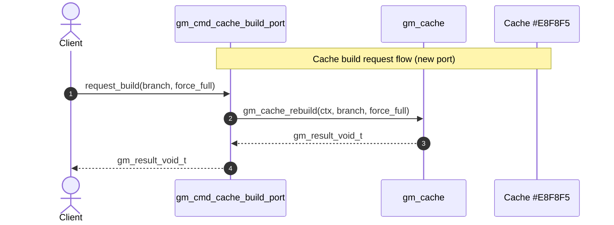
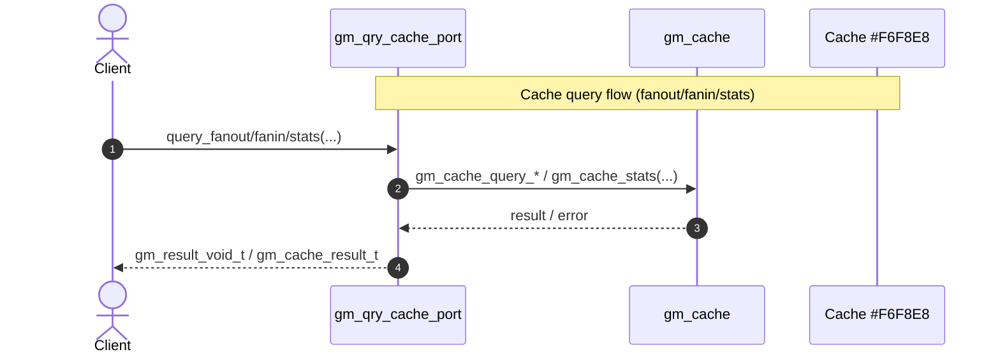
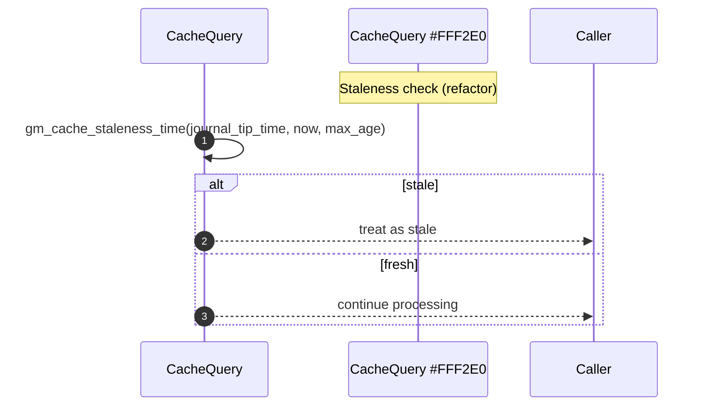
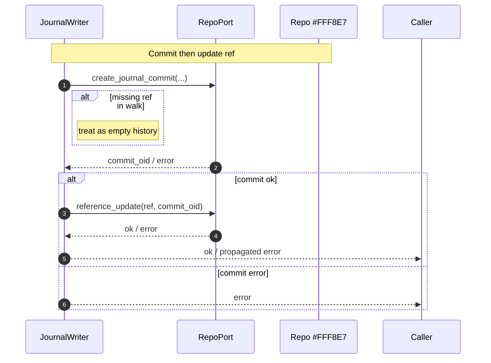

# Code Review Feedback

| Date | Agent | SHA | Branch | PR |
|------|-------|-----|--------|----|
| 2025-10-08 | CodeRabbit (and reviewers) | `62e7ab80a904e1bc42f06c250efb102af17ea962` | [feat/hex-ports-ci-green](https://github.com/neuroglyph/git-mind/tree/feat/hex-ports-ci-green "neuroglyph/git-mind:feat/hex-ports-ci-green") | [PR#177](https://github.com/neuroglyph/git-mind/pull/177) |

## CODE REVIEW FEEDBACK

### core/src/adapters/logging/stdio_logger_adapter.c:41 — coderabbitai[bot]

```text
_🛠️ Refactor suggestion_ | _🟠 Major_

<details>
<summary>🧩 Analysis chain</summary>

**Verify `gmtime_r` portability.**

The code uses `gmtime_r`, which is POSIX but not C standard. Ensure this is available on all target platforms or provide a fallback.

---

🏁 Script executed:

```shell
#!/bin/bash
# Check if gmtime_r is used elsewhere in the codebase or if there are existing portability abstractions
rg -n "gmtime_r|gmtime_s" --type=c --type=h -C2
```

Length of output: 2559

---

[tasks review_file_3/6 inspect_time_abstraction_1/1]
[observations]
- `wrap_gmtime_r` defined in `core/src/time/time.c`.
- Logging adapter calls raw `gmtime_r`, bypassing time abstraction.
- Time abstraction in `time_ops` maps to `wrap_gmtime_r`, not used in logger.
[analysis]
- Using raw `gmtime_r` risks portability issues on Windows.
- Abstraction exists to centralize portability handling.
[pending]
- Confirm `wrap_gmtime_r` has Windows fallback.
- Recommend logger use `time_ops->gmtime_r`.
[actions]
- Inspect `wrap_gmtime_r` implementation for fallback.
- Suggest using abstraction in logger.
[done] 
<!-- [/scratchpad] -->

---

🏁 Script executed:

```shell
#!/bin/bash
rg -nP -C3 'wrap_gmtime_r' core/src/time/time.c
```

Length of output: 471

---


</details>

**Replace raw `gmtime_r` with `time_ops->gmtime_r` in stdio_logger_adapter.c**  
Leverage the existing time abstraction (wrap_gmtime_r) and handle its `gm_result_tm_ptr_t` return to ensure compatibility on non-POSIX targets.

<!-- This is an auto-generated comment by CodeRabbit -->
```

_Meta_: https://github.com/neuroglyph/git-mind/pull/177#discussion_r2412649574

{response}

### docs/code-reviews/PR177/47a1bf537feb065ef3cbac02a8bf78e75944111c.md:10 — coderabbitai[bot]

```text
_⚠️ Potential issue_ | _🟡 Minor_

**Align title with H1.**

Per the markdown guidelines, the `title` field in front matter must match the H1 heading. Currently, `title: 47a1bf537feb065ef3cbac02a8bf78e75944111c.md` doesn't match `# Code Review Feedback`.


Apply this diff to align them:

```diff
 ---
-title: 47a1bf537feb065ef3cbac02a8bf78e75944111c.md
+title: Code Review Feedback
 description: Preserved review artifacts and rationale.
```

<!-- suggestion_start -->

<details>
<summary>📝 Committable suggestion</summary>

> ‼️ **IMPORTANT**
> Carefully review the code before committing. Ensure that it accurately replaces the highlighted code, contains no missing lines, and has no issues with indentation. Thoroughly test & benchmark the code to ensure it meets the requirements.

```suggestion
---
title: Code Review Feedback
description: Preserved review artifacts and rationale.
audience: [contributors]
domain: [quality]
tags: [review]
status: archive
---

# Code Review Feedback
```

</details>

<!-- suggestion_end -->

<details>
<summary>🤖 Prompt for AI Agents</summary>

```
In docs/code-reviews/PR177/47a1bf537feb065ef3cbac02a8bf78e75944111c.md around
lines 1–10, the front-matter title
("47a1bf537feb065ef3cbac02a8bf78e75944111c.md") does not match the H1 ("Code
Review Feedback"); update the title field in the front matter to exactly "Code
Review Feedback" (match capitalization and spacing) so it matches the H1
heading.
```

</details>

<!-- This is an auto-generated comment by CodeRabbit -->

✅ Addressed in commits e2eb59c to 9c9c521
```

_Meta_: https://github.com/neuroglyph/git-mind/pull/177#discussion_r2412649584

{response}

### docs/planning/Milestones.md:14 — coderabbitai[bot]

```text
_⚠️ Potential issue_ | _🟠 Major_

**Insert SPDX/license block immediately after the front matter**

Per our doc guidelines, every markdown doc needs the SPDX/license notice right after the front matter. Please add it here.  

Use this patch:

```diff
 status: draft
 ---
 
+<!-- SPDX-License-Identifier: LicenseRef-MIND-UCAL-1.0 -->
+<!-- © 2025 J. Kirby Ross / Neuroglyph Collective -->
+
 # Milestones (Placeholder)
```

<!-- suggestion_start -->

<details>
<summary>📝 Committable suggestion</summary>

> ‼️ **IMPORTANT**
> Carefully review the code before committing. Ensure that it accurately replaces the highlighted code, contains no missing lines, and has no issues with indentation. Thoroughly test & benchmark the code to ensure it meets the requirements.

```suggestion
---

<!-- SPDX-License-Identifier: LicenseRef-MIND-UCAL-1.0 -->
<!-- © 2025 J. Kirby Ross / Neuroglyph Collective -->

# Milestones (Placeholder)

## Table of Contents

- Near Term
```

</details>

<!-- suggestion_end -->

<details>
<summary>🤖 Prompt for AI Agents</summary>

```
In docs/planning/Milestones.md around lines 8 to 14, the document is missing the
required SPDX/license notice immediately after the front matter; insert the SPDX
license block (as the project convention uses an HTML comment SPDX line, e.g.
<!-- SPDX-License-Identifier: Apache-2.0 --> and any accompanying copyright or
license attribution required by our doc guidelines) directly below the front
matter header so the license notice appears before the rest of the content.
```

</details>

<!-- fingerprinting:phantom:medusa:sabertoothed -->

<!-- This is an auto-generated comment by CodeRabbit -->
```

_Meta_: https://github.com/neuroglyph/git-mind/pull/177#discussion_r2412649598

{response}

### docs/planning/Product_Roadmap.md:12 — coderabbitai[bot]

```text
_⚠️ Potential issue_ | _🟠 Major_

**Restore the SPDX/license block after the front matter.**

The documentation standards require the SPDX and copyright comments immediately following the front matter. Add the standard block before the H1.  


```diff
 ---
 status: draft
 ---
+
+<!-- SPDX-License-Identifier: LicenseRef-MIND-UCAL-1.0 -->
+<!-- © 2025 J. Kirby Ross / Neuroglyph Collective -->
 
 # Product Roadmap (Placeholder)
```
As per coding guidelines


> Committable suggestion skipped: line range outside the PR's diff.

<details>
<summary>🤖 Prompt for AI Agents</summary>

```
In docs/planning/Product_Roadmap.md around lines 8 to 12, the SPDX/license and
copyright comment block required by documentation standards is missing after the
front matter; insert the standard SPDX/license block (including SPDX identifier
and copyright line) immediately after the front matter and before the H1 "#
Product Roadmap (Placeholder)" so the license header appears directly after the
front matter and above the document title.
```

</details>

<!-- fingerprinting:phantom:medusa:sabertoothed -->

<!-- This is an auto-generated comment by CodeRabbit -->
```

_Meta_: https://github.com/neuroglyph/git-mind/pull/177#discussion_r2412649608

{response}

### docs/planning/Release_Plans.md:14 — coderabbitai[bot]

```text
_⚠️ Potential issue_ | _🟠 Major_

**Add required SPDX/license notice after front matter**

Docs under `docs/**/*.md` must place the SPDX/license block immediately after the front matter. Please add the standard notice so we stay compliant.  

Apply this diff:

```diff
 status: draft
 ---
 
+<!-- SPDX-License-Identifier: LicenseRef-MIND-UCAL-1.0 -->
+<!-- © 2025 J. Kirby Ross / Neuroglyph Collective -->
+
 # Release Plans (Placeholder)
```

<!-- suggestion_start -->

<details>
<summary>📝 Committable suggestion</summary>

> ‼️ **IMPORTANT**
> Carefully review the code before committing. Ensure that it accurately replaces the highlighted code, contains no missing lines, and has no issues with indentation. Thoroughly test & benchmark the code to ensure it meets the requirements.

```suggestion
---

<!-- SPDX-License-Identifier: LicenseRef-MIND-UCAL-1.0 -->
<!-- © 2025 J. Kirby Ross / Neuroglyph Collective -->

# Release Plans (Placeholder)

## Table of Contents

- Cadence
```

</details>

<!-- suggestion_end -->

<details>
<summary>🤖 Prompt for AI Agents</summary>

```
In docs/planning/Release_Plans.md around lines 8-14, the file is missing the
required SPDX/license notice immediately after the front matter; insert the
standard SPDX license block (for example an HTML comment like
SPDX-License-Identifier: <LICENSE-ID>) directly below the closing front-matter
delimiter (---) with a single blank line separation, so the notice appears as
the first content after front matter and complies with docs/**/*.md
requirements.
```

</details>

<!-- fingerprinting:phantom:medusa:sabertoothed -->

<!-- This is an auto-generated comment by CodeRabbit -->
```

_Meta_: https://github.com/neuroglyph/git-mind/pull/177#discussion_r2412649615

{response}

### docs/planning/Sprint_Plans.md:12 — coderabbitai[bot]

```text
_⚠️ Potential issue_ | _🟠 Major_

**Insert SPDX/license comments after front matter.**

Per the documentation guidelines, every Markdown page must include the SPDX/license comment block right after the front matter. Please add the standard comments before the H1.  


```diff
 ---
 status: draft
 ---
+
+<!-- SPDX-License-Identifier: LicenseRef-MIND-UCAL-1.0 -->
+<!-- © 2025 J. Kirby Ross / Neuroglyph Collective -->
 
 # Sprint Plans (Placeholder)
```
As per coding guidelines

<!-- suggestion_start -->

<details>
<summary>📝 Committable suggestion</summary>

> ‼️ **IMPORTANT**
> Carefully review the code before committing. Ensure that it accurately replaces the highlighted code, contains no missing lines, and has no issues with indentation. Thoroughly test & benchmark the code to ensure it meets the requirements.

```suggestion
---
status: draft
---

<!-- SPDX-License-Identifier: LicenseRef-MIND-UCAL-1.0 -->
<!-- © 2025 J. Kirby Ross / Neuroglyph Collective -->

# Sprint Plans (Placeholder)

## Table of Contents
```

</details>

<!-- suggestion_end -->

<details>
<summary>🤖 Prompt for AI Agents</summary>

```
In docs/planning/Sprint_Plans.md around lines 8 to 12, the file is missing the
required SPDX/license comment block after the front matter and before the H1;
add the standard SPDX/license comment block (e.g., SPDX-License-Identifier and
copyright/license owner lines used across the repo) immediately after the
YAML/front-matter section and before the "# Sprint Plans (Placeholder)" heading
so the document conforms to the documentation guidelines.
```

</details>

<!-- fingerprinting:phantom:medusa:sabertoothed -->

<!-- This is an auto-generated comment by CodeRabbit -->
```

_Meta_: https://github.com/neuroglyph/git-mind/pull/177#discussion_r2412649624

{response}

### docs/PRDs/PRD-co-thought-mcp-service.md:18 — coderabbitai[bot]

```text
_⚠️ Potential issue_ | _🟠 Major_

**Add required SPDX/License comment after front matter.**

Docs under `docs/` must place the SPDX/License comment immediately after the front matter. Please insert it between the front matter and the H1 heading to comply with our documentation policy.  [As per coding guidelines]

<details>
<summary>🤖 Prompt for AI Agents</summary>

```
In docs/PRDs/PRD-co-thought-mcp-service.md around lines 9 to 18, the file is
missing the required SPDX/License comment immediately after the front matter;
insert the SPDX short-form license comment (e.g. <!-- SPDX-License-Identifier:
Apache-2.0 --> or the project's approved identifier) directly between the
closing front-matter block and the H1 heading so the license line appears as the
first content after front matter and before "# PRD — Co‑Thought MCP Service".
```

</details>

<!-- fingerprinting:phantom:triton:sabertoothed -->

<!-- This is an auto-generated comment by CodeRabbit -->
```

_Meta_: https://github.com/neuroglyph/git-mind/pull/177#discussion_r2412649633

{response}

### docs/PRDs/PRD-git-mind-semantics-time-travel-prototype.md:13 — coderabbitai[bot]

```text
_⚠️ Potential issue_ | _🟠 Major_

**Add the required license/SPDX comment after the front matter.**

Docs must place the License/SPDX comment immediately after the front matter, but nothing is present here. Please add it to stay compliant.  As per coding guidelines.

```diff
 ---
 
+# <!-- SPDX-License-Identifier: Apache-2.0 -->
+
 # PRD — First-Class Semantics (Time-Travel Prototype)
```

<!-- suggestion_start -->

<details>
<summary>📝 Committable suggestion</summary>

> ‼️ **IMPORTANT**
> Carefully review the code before committing. Ensure that it accurately replaces the highlighted code, contains no missing lines, and has no issues with indentation. Thoroughly test & benchmark the code to ensure it meets the requirements.

```suggestion
---
<!-- SPDX-License-Identifier: Apache-2.0 -->

# PRD — First-Class Semantics (Time-Travel Prototype)

## Table of Contents
```

</details>

<!-- suggestion_end -->

<details>
<summary>🤖 Prompt for AI Agents</summary>

```
In docs/PRDs/PRD-git-mind-semantics-time-travel-prototype.md around lines 8-13
the required license/SPDX comment is missing after the front matter; add the
project's standard SPDX license comment immediately after the closing
front-matter marker (on the next line) so the file includes the correct
SPDX-License-Identifier comment consistent with the repo's licensing policy.
```

</details>

<!-- fingerprinting:phantom:triton:sabertoothed -->

<!-- This is an auto-generated comment by CodeRabbit -->
```

_Meta_: https://github.com/neuroglyph/git-mind/pull/177#discussion_r2412649638

{response}

### docs/specs/Technical_Specifications.md:14 — coderabbitai[bot]

```text
_⚠️ Potential issue_ | _🟠 Major_

**Restore the SPDX/license comment after the front matter**

We require the SPDX/license notice immediately following the front matter in every doc. Please add it back so the spec placeholder stays compliant.  

Suggested change:

```diff
 status: draft
 ---
 
+<!-- SPDX-License-Identifier: LicenseRef-MIND-UCAL-1.0 -->
+<!-- © 2025 J. Kirby Ross / Neuroglyph Collective -->
+
 # Technical Specifications (Placeholder)
```

<!-- suggestion_start -->

<details>
<summary>📝 Committable suggestion</summary>

> ‼️ **IMPORTANT**
> Carefully review the code before committing. Ensure that it accurately replaces the highlighted code, contains no missing lines, and has no issues with indentation. Thoroughly test & benchmark the code to ensure it meets the requirements.

```suggestion
status: draft
---

<!-- SPDX-License-Identifier: LicenseRef-MIND-UCAL-1.0 -->
<!-- © 2025 J. Kirby Ross / Neuroglyph Collective -->

# Technical Specifications (Placeholder)

## Table of Contents

- Overview
```

</details>

<!-- suggestion_end -->

<details>
<summary>🤖 Prompt for AI Agents</summary>

```
In docs/specs/Technical_Specifications.md around lines 8 to 14, the SPDX/license
notice was removed after the front matter; restore the required SPDX/license
comment immediately following the front matter (e.g. add the SPDX identifier
line such as "SPDX-License-Identifier: <license>" right after the front-matter
separator) so the document is compliant with project licensing conventions.
```

</details>

<!-- fingerprinting:phantom:medusa:sabertoothed -->

<!-- This is an auto-generated comment by CodeRabbit -->
```

_Meta_: https://github.com/neuroglyph/git-mind/pull/177#discussion_r2412649645

{response}

### docs/wish-list-features/README.md:10 — coderabbitai[bot]

```text
_⚠️ Potential issue_ | _🟠 Major_

**Add required SPDX comment after front matter.**

Docs must place the license/SPDX comment block immediately after the front matter; this placeholder currently omits it. Please add the repository-standard SPDX and copyright comments beneath the `---` block.  


```diff
 ---
 status: draft
 ---
+
+<!-- SPDX-License-Identifier: LicenseRef-MIND-UCAL-1.0 -->
+<!-- © 2025 J. Kirby Ross / Neuroglyph Collective -->
 
 # Wish List Features (Placeholder)
```
As per coding guidelines

<!-- suggestion_start -->

<details>
<summary>📝 Committable suggestion</summary>

> ‼️ **IMPORTANT**
> Carefully review the code before committing. Ensure that it accurately replaces the highlighted code, contains no missing lines, and has no issues with indentation. Thoroughly test & benchmark the code to ensure it meets the requirements.

```suggestion
---
status: draft
---
<!-- SPDX-License-Identifier: LicenseRef-MIND-UCAL-1.0 -->
<!-- © 2025 J. Kirby Ross / Neuroglyph Collective -->

# Wish List Features (Placeholder)
```

</details>

<!-- suggestion_end -->

<details>
<summary>🤖 Prompt for AI Agents</summary>

```
In docs/wish-list-features/README.md around lines 8 to 10, the front matter
separator (“---”) is present but the required repository-standard SPDX and
copyright comment block is missing immediately after it; insert the standard
SPDX license comment block (matching repository conventions) directly beneath
the `---` line, including SPDX identifier and copyright owner/year, ensuring
there are no blank lines between the front matter separator and the comment
block.
```

</details>

<!-- fingerprinting:phantom:medusa:sabertoothed -->

<!-- This is an auto-generated comment by CodeRabbit -->
```

_Meta_: https://github.com/neuroglyph/git-mind/pull/177#discussion_r2412649654

{response}

### migration-progress.md:5 — coderabbitai[bot]

```text
_⚠️ Potential issue_ | _🟡 Minor_

**Add required front matter.**

Per the markdown guidelines, documentation files must have front matter at the beginning. This migration tracking document is missing it.


Add front matter before line 1:

```diff
+---
+title: Hexagonal Architecture Migration Progress
+description: Single source of truth for tracking hexagonal architecture migration
+audience: [contributors]
+domain: [architecture]
+tags: [migration, hexagonal]
+status: active
+---
+
 # Hexagonal Architecture Migration Progress
```

<!-- suggestion_start -->

<details>
<summary>📝 Committable suggestion</summary>

> ‼️ **IMPORTANT**
> Carefully review the code before committing. Ensure that it accurately replaces the highlighted code, contains no missing lines, and has no issues with indentation. Thoroughly test & benchmark the code to ensure it meets the requirements.

```suggestion
---
title: Hexagonal Architecture Migration Progress
description: Single source of truth for tracking hexagonal architecture migration
audience: [contributors]
domain: [architecture]
tags: [migration, hexagonal]
status: active
---

# Hexagonal Architecture Migration Progress

Started: 2025-10-08

This file is the single source of truth for tracking the end-to-end migration of the C library to a strict hexagonal architecture, per AGENTS.md. Update this checklist as work proceeds. Check off items with `[x]` only after they are complete and validated (CI green, zero new clang-tidy warnings, and docs updated).
```

</details>

<!-- suggestion_end -->

<details>
<summary>🤖 Prompt for AI Agents</summary>

```
In migration-progress.md around lines 1 to 5, the document is missing required
front matter; add a YAML front matter block at the very top (before line 1)
including at minimum a title, date (2025-10-08), and a short description (and
optionally tags/layout) so the file conforms to the markdown guidelines and site
generator expectations; ensure the block is delimited with triple dashes and the
rest of the content follows after the closing dashes.
```

</details>

<!-- This is an auto-generated comment by CodeRabbit -->
```

_Meta_: https://github.com/neuroglyph/git-mind/pull/177#discussion_r2412649659

{response}

### docs/code-reviews/PR177/3b7ce522e107011f8f92dc629facfa5b6a3595fb.md:18 — coderabbitai[bot]

```text
_⚠️ Potential issue_ | _🔴 Critical_

<details>
<summary>🧩 Analysis chain</summary>

**Doc header must match guidelines.**

The doc front matter and header block miss multiple required conventions: the `title` must exactly match the H1 (“Code Review Feedback”), the SPDX/license comment block must appear immediately after the front matter, and the file needs a `## Table of Contents` section. Please align this file with the docs/**/*.md rules.  
   
Add front matter fixes and license block quickly with this patch scaffold:

```diff
---
-title: 3b7ce522e107011f8f92dc629facfa5b6a3595fb.md
+title: Code Review Feedback
 description: Preserved review artifacts and rationale.
 audience: [contributors]
 domain: [quality]
 tags: [review]
 status: archive
 ---
+<!-- SPDX-License-Identifier: LicenseRef-MIND-UCAL-1.0 -->
+<!-- © 2025 J. Kirby Ross / Neuroglyph Collective -->
 
 # Code Review Feedback
+
+## Table of Contents
```

Confirm any additional required sections follow afterward. As per coding guidelines.

---

🏁 Script executed:

```shell
#!/bin/bash
# List docs directory contents
find docs -maxdepth 2 -type f

# Search for SPDX license convention in docs
rg -n "SPDX-License-Identifier" -g "docs/**/*.md"

# Search for Table of Contents guideline in docs
rg -n "## Table of Contents" -g "docs/**/*.md"

# Search for files mentioning 'guideline'
rg -l "guideline" -g "docs/**/*.md"
```

Length of output: 14870

---

🏁 Script executed:

```shell
#!/bin/bash
# Show front matter of the review artifact
sed -n '1,30p' docs/code-reviews/PR177/3b7ce522e107011f8f92dc629facfa5b6a3595fb.md

# Show template conventions
echo "---- TEMPLATE START ----"
sed -n '1,50p' docs/templates/code-review-feedback.md
echo "---- TEMPLATE END ----"
```

Length of output: 2224

---

🏁 Script executed:

```shell
#!/bin/bash
# Search for front matter guidelines
rg -n "front matter" -g "docs/quality/Markdown_Style_Guide.md"

# Search for SPDX guidelines
rg -n "SPDX" -g "docs/quality/Markdown_Style_Guide.md"

# Search for Table of Contents in style guide
rg -n "Table of Contents" -g "docs/quality/Markdown_Style_Guide.md"
```

Length of output: 57

---


</details>

**Doc header must match guidelines.**  
Front matter `title` must be “Code Review Feedback” (matching the H1), insert the SPDX/license comment immediately after the front matter, and add a `## Table of Contents` section beneath the H1.  

```diff
---
-title: 3b7ce522e107011f8f92dc629facfa5b6a3595fb.md
+title: Code Review Feedback
 description: Preserved review artifacts and rationale.
 audience: [contributors]
 domain: [quality]
 tags: [review]
 status: archive
---
+<!-- SPDX-License-Identifier: LicenseRef-MIND-UCAL-1.0 -->
+<!-- © 2025 J. Kirby Ross / Neuroglyph Collective -->
 
 # Code Review Feedback
 
+## Table of Contents
```

<!-- suggestion_start -->

<details>
<summary>📝 Committable suggestion</summary>

> ‼️ **IMPORTANT**
> Carefully review the code before committing. Ensure that it accurately replaces the highlighted code, contains no missing lines, and has no issues with indentation. Thoroughly test & benchmark the code to ensure it meets the requirements.

```suggestion
---
title: Code Review Feedback
 description: Preserved review artifacts and rationale.
 audience: [contributors]
 domain: [quality]
 tags: [review]
 status: archive
<!-- SPDX-License-Identifier: LicenseRef-MIND-UCAL-1.0 -->
<!-- © 2025 J. Kirby Ross / Neuroglyph Collective -->

 # Code Review Feedback

## Table of Contents
```

</details>

<!-- suggestion_end -->

<details>
<summary>🤖 Prompt for AI Agents</summary>

```
In docs/code-reviews/PR177/3b7ce522e107011f8f92dc629facfa5b6a3595fb.md around
lines 1 to 18, the front matter and document structure do not follow project
guidelines: change the YAML front-matter title value to "Code Review Feedback",
insert the SPDX/license comment immediately after the closing front-matter
block, and add a "## Table of Contents" section directly beneath the H1 heading;
ensure spacing and ordering match other review artifacts.
```

</details>

<!-- fingerprinting:phantom:triton:sabertoothed -->

<!-- This is an auto-generated comment by CodeRabbit -->
```

_Meta_: https://github.com/neuroglyph/git-mind/pull/177#discussion_r2412749770

{response}

### core/include/gitmind/ports/cache_query_port.h:76 — coderabbitai[bot]

```text
_🛠️ Refactor suggestion_ | _🟠 Major_

<details>
<summary>🧩 Analysis chain</summary>

**Clarify stats output parameter behavior on error and verify implementation.**

The `stats` function documentation mentions returning `GM_ERR_NOT_FOUND` on a missing branch, but does not explicitly state what happens to the output parameters (`edge_count` and `cache_size_bytes`) on error. Per coding guidelines, output buffers should be zeroed on error paths.


1. Update the documentation to clarify that `edge_count` and `cache_size_bytes` are set to zero on error.
2. Verify that the implementation in `core/src/ports/cache/cache_query_port.c` properly zeros these outputs before returning an error.

---

🏁 Script executed:

```shell
#!/bin/bash
# Description: Verify that stats implementation zeros output parameters on error paths.

# Search for the stats implementation and check error handling
ast-grep --pattern $'gm_result_void_t $_(gm_qry_cache_port_t *$_, const char *$_, uint64_t *$_, uint64_t *$_) {
  $$$
}'
```

Length of output: 0

---

🏁 Script executed:

```shell
#!/bin/bash
rg -nP 'gm_result_void_t\s+stats\s*\(' -C3 core/src/ports/cache/*.c
```

Length of output: 0

---

🏁 Script executed:

```shell
rg -nP '\.stats\s*=' -C3 core/src
```

Length of output: 514

---

🏁 Script executed:

```shell
#!/bin/bash
rg -nP 'gm_result_void_t\s+stats_impl' -C50 core/src/ports/cache/cache_query_port.c
```

Length of output: 3961

---


</details>

**Zero outputs on error in stats_impl and update docs.** The `stats_impl` function (core/src/ports/cache/cache_query_port.c:50–63) never clears `*edge_count` or `*cache_size_bytes` on error; add `*edge_count = 0; *cache_size_bytes = 0;` before each `gm_err_void` return and update the doc comment in `cache_query_port.h` to state that outputs are zeroed on failure.

<details>
<summary>🤖 Prompt for AI Agents</summary>

```
In core/src/ports/cache/cache_query_port.c around lines 50–63 and
core/include/gitmind/ports/cache_query_port.h lines 61–76, the stats_impl
implementation fails to clear output parameters on error; before every
gm_err_void return in stats_impl set *edge_count = 0; *cache_size_bytes = 0; to
ensure callers get zeroed outputs on failure, and update the doc comment in
cache_query_port.h to explicitly state that on failure (e.g., non-existent
branch or other errors) both edge_count and cache_size_bytes are set to 0.
```

</details>

<!-- This is an auto-generated comment by CodeRabbit -->
```

_Meta_: https://github.com/neuroglyph/git-mind/pull/177#discussion_r2412822288

{response}

### docs/architecture/journal-architecture.md:9 — coderabbitai[bot]

```text
_🛠️ Refactor suggestion_ | _🟠 Major_

**Add the SPDX notice after the front matter**

The documentation standard requires an SPDX/license comment immediately following the YAML header.  


```diff
 ---
 title: Project: No Tux Given 🐧⚡
 description: Edge-journal commits with branch-aware graphs; the final architecture for storing semantics in Git.
 audience: [developers]
 domain: [architecture]
 tags: [journal, cbor, refs]
 status: stable
 last_updated: 2025-09-15
 ---
+<!-- SPDX-License-Identifier: Apache-2.0 -->
```

<!-- suggestion_start -->

<details>
<summary>📝 Committable suggestion</summary>

> ‼️ **IMPORTANT**
> Carefully review the code before committing. Ensure that it accurately replaces the highlighted code, contains no missing lines, and has no issues with indentation. Thoroughly test & benchmark the code to ensure it meets the requirements.

```suggestion
---
title: Project: No Tux Given 🐧⚡
description: Edge-journal commits with branch-aware graphs; the final architecture for storing semantics in Git.
audience: [developers]
domain: [architecture]
tags: [journal, cbor, refs]
status: stable
last_updated: 2025-09-15
---
<!-- SPDX-License-Identifier: Apache-2.0 -->
```

</details>

<!-- suggestion_end -->

<details>
<summary>🤖 Prompt for AI Agents</summary>

```
In docs/architecture/journal-architecture.md around lines 1 to 9, the YAML front
matter is present but missing the required SPDX/license comment immediately
after it; add a single-line SPDX identifier (e.g., "SPDX-License-Identifier:
Apache-2.0" or the project's chosen SPDX tag) on the line immediately following
the closing --- of the front matter so the file begins with the YAML block and
the SPDX notice directly after it.
```

</details>

<!-- fingerprinting:phantom:medusa:sabertoothed -->

<!-- This is an auto-generated comment by CodeRabbit -->
```

_Meta_: https://github.com/neuroglyph/git-mind/pull/177#discussion_r2412822301

{response}

### docs/architecture/journal-architecture.md:28 — coderabbitai[bot]

```text
_🛠️ Refactor suggestion_ | _🟠 Major_

**Use the mandated H2 heading for the Table of Contents**

Please change the “Table of Contents” label to a `## Table of Contents` heading to satisfy the docs guideline.  


```diff
-Table of Contents
+## Table of Contents
```

<!-- suggestion_start -->

<details>
<summary>📝 Committable suggestion</summary>

> ‼️ **IMPORTANT**
> Carefully review the code before committing. Ensure that it accurately replaces the highlighted code, contains no missing lines, and has no issues with indentation. Thoroughly test & benchmark the code to ensure it meets the requirements.

```suggestion
## Table of Contents

- [Executive Summary](#executive-summary)
- [Core Design Principles](#core-design-principles)
- [The Two-Layer Architecture](#the-two-layer-architecture)
- [Implementation Details](#implementation-details)
- [Solving the Hard Problems](#solving-the-hard-problems)
- [Migration Plan (Fresh Start)](#migration-plan-fresh-start)
- [Code Structure](#code-structure)
- [Why This Wins](#why-this-wins)
- [Potential Gotchas & Solutions](#potential-gotchas--solutions)
- [The Payoff](#the-payoff)
- [Next Steps](#next-steps)
```

</details>

<!-- suggestion_end -->

<details>
<summary>🤖 Prompt for AI Agents</summary>

```
In docs/architecture/journal-architecture.md around lines 15 to 28 the plain
text "Table of Contents" needs to be converted into a level-2 Markdown heading;
replace the current label with "## Table of Contents" (i.e., prepend "## " and
ensure it's on its own line) so the document follows the mandated H2 heading
guideline for the table of contents.
```

</details>

<!-- fingerprinting:phantom:medusa:sabertoothed -->

<!-- This is an auto-generated comment by CodeRabbit -->
```

_Meta_: https://github.com/neuroglyph/git-mind/pull/177#discussion_r2412822303

{response}

### docs/architecture/ref-name-validation.md:9 — coderabbitai[bot]

```text
_🛠️ Refactor suggestion_ | _🟠 Major_

**Add the required SPDX comment after front matter**

Docs must include the license/SPDX comment immediately after the YAML front matter. Please add it here to satisfy the doc guidelines.  


```diff
 ---
 title: Ref Name Validation
 description: Building refs safely with Git-style branch shorthands.
 audience: [contributors, developers]
 domain: [architecture]
 tags: [git, refs]
 status: stable
 last_updated: 2025-09-30
 ---
+<!-- SPDX-License-Identifier: Apache-2.0 -->
```

<!-- suggestion_start -->

<details>
<summary>📝 Committable suggestion</summary>

> ‼️ **IMPORTANT**
> Carefully review the code before committing. Ensure that it accurately replaces the highlighted code, contains no missing lines, and has no issues with indentation. Thoroughly test & benchmark the code to ensure it meets the requirements.

```suggestion
---
title: Ref Name Validation
description: Building refs safely with Git-style branch shorthands.
audience: [contributors, developers]
domain: [architecture]
tags: [git, refs]
status: stable
last_updated: 2025-09-30
---
<!-- SPDX-License-Identifier: Apache-2.0 -->
```

</details>

<!-- suggestion_end -->

<details>
<summary>🤖 Prompt for AI Agents</summary>

```
In docs/architecture/ref-name-validation.md around lines 1 to 9, the YAML front
matter is present but the required SPDX license comment is missing immediately
after the front matter; add the SPDX identifier comment line (e.g., "//
SPDX-License-Identifier: <LICENSE-ID>" or the project’s canonical SPDX comment
format) directly below the closing "---" of the front matter so the file
contains the license/SPDX comment immediately after the YAML block per doc
guidelines.
```

</details>

<!-- fingerprinting:phantom:medusa:sabertoothed -->

<!-- This is an auto-generated comment by CodeRabbit -->
```

_Meta_: https://github.com/neuroglyph/git-mind/pull/177#discussion_r2412822314

{response}

### docs/architecture/system-overview.md:9 — coderabbitai[bot]

```text
_🛠️ Refactor suggestion_ | _🟠 Major_

**Insert SPDX notice after the front matter**

Per the docs guidelines, place the SPDX/license comment immediately after the YAML header.  


```diff
 ---
 title: System Architecture
 description: High-level view of git-mind components and interactions.
 audience: [developers]
 domain: [architecture]
 tags: [system, overview]
 status: draft
 last_updated: 2025-09-15
 ---
+<!-- SPDX-License-Identifier: Apache-2.0 -->
```

<!-- suggestion_start -->

<details>
<summary>📝 Committable suggestion</summary>

> ‼️ **IMPORTANT**
> Carefully review the code before committing. Ensure that it accurately replaces the highlighted code, contains no missing lines, and has no issues with indentation. Thoroughly test & benchmark the code to ensure it meets the requirements.

```suggestion
---
title: System Architecture
description: High-level view of git-mind components and interactions.
audience: [developers]
domain: [architecture]
tags: [system, overview]
status: draft
last_updated: 2025-09-15
---
<!-- SPDX-License-Identifier: Apache-2.0 -->
```

</details>

<!-- suggestion_end -->

<details>
<summary>🤖 Prompt for AI Agents</summary>

```
In docs/architecture/system-overview.md around lines 1–9 the YAML front matter
is present but missing the required SPDX/license notice; add the SPDX license
comment immediately after the closing --- of the front matter by inserting the
project's SPDX identifier as a comment (e.g. an HTML or Markdown comment
containing "SPDX-License-Identifier: <identifier>") directly after the header
end so the notice is the first thing after the YAML block.
```

</details>

<!-- fingerprinting:phantom:medusa:sabertoothed -->

<!-- This is an auto-generated comment by CodeRabbit -->
```

_Meta_: https://github.com/neuroglyph/git-mind/pull/177#discussion_r2412822322

{response}

### docs/architecture/system-overview.md:20 — coderabbitai[bot]

```text
_🛠️ Refactor suggestion_ | _🟠 Major_

**Promote “Table of Contents” to an H2 heading**

Docs must include a `## Table of Contents` section. Please update the heading accordingly.  


```diff
-Table of Contents
+## Table of Contents
```

<!-- suggestion_start -->

<details>
<summary>📝 Committable suggestion</summary>

> ‼️ **IMPORTANT**
> Carefully review the code before committing. Ensure that it accurately replaces the highlighted code, contains no missing lines, and has no issues with indentation. Thoroughly test & benchmark the code to ensure it meets the requirements.

```suggestion
## Table of Contents

- [Executive Summary](#executive-summary)
- [High-Level Design](#high-level-design)
- [Components and Technology Stack](#components-and-technology-stack)
- [Data Flows and Storage](#data-flows-and-storage)
- [Scaling Strategy and Performance Targets](#scaling-strategy-and-performance-targets)
```

</details>

<!-- suggestion_end -->

<details>
<summary>🤖 Prompt for AI Agents</summary>

```
In docs/architecture/system-overview.md around lines 13 to 20, the "Table of
Contents" text is plain text but should be an H2 heading; change the line to use
Markdown H2 syntax ("## Table of Contents") so the docs include the required
section header and render correctly in the table of contents.
```

</details>

<!-- fingerprinting:phantom:medusa:sabertoothed -->

<!-- This is an auto-generated comment by CodeRabbit -->
```

_Meta_: https://github.com/neuroglyph/git-mind/pull/177#discussion_r2412822329

{response}

### docs/code-reviews/PR177/0d1b34b0ee501bc7b7b2d0a9fb82e06a37642c77.md:10 — coderabbitai[bot]

```text
_⚠️ Potential issue_ | _🟡 Minor_

**Doc header must match guidelines.**

The front matter title must be "Code Review Feedback" (matching the H1), the SPDX/license comment must appear immediately after the front matter, and a "## Table of Contents" section must follow the H1.


Apply this diff:

```diff
 ---
-title: 0d1b34b0ee501bc7b7b2d0a9fb82e06a37642c77.md
+title: Code Review Feedback
 description: Preserved review artifacts and rationale.
 audience: [contributors]
 domain: [quality]
 tags: [review]
 status: archive
 ---
+<!-- SPDX-License-Identifier: LicenseRef-MIND-UCAL-1.0 -->
+<!-- © 2025 J. Kirby Ross / Neuroglyph Collective -->
 
 # Code Review Feedback
+
+## Table of Contents
```

As per coding guidelines.

<!-- suggestion_start -->

<details>
<summary>📝 Committable suggestion</summary>

> ‼️ **IMPORTANT**
> Carefully review the code before committing. Ensure that it accurately replaces the highlighted code, contains no missing lines, and has no issues with indentation. Thoroughly test & benchmark the code to ensure it meets the requirements.

```suggestion
---
title: Code Review Feedback
description: Preserved review artifacts and rationale.
audience: [contributors]
domain: [quality]
tags: [review]
status: archive
---
<!-- SPDX-License-Identifier: LicenseRef-MIND-UCAL-1.0 -->
<!-- © 2025 J. Kirby Ross / Neuroglyph Collective -->

# Code Review Feedback

## Table of Contents
```

</details>

<!-- suggestion_end -->

<!-- This is an auto-generated comment by CodeRabbit -->
```

_Meta_: https://github.com/neuroglyph/git-mind/pull/177#discussion_r2412822333

{response}

### docs/code-reviews/PR177/9f49dd2ad65837735ac218c3d159b36f8b840819.md:18 — coderabbitai[bot]

```text
_⚠️ Potential issue_ | _🟠 Major_

**Align front matter with doc standards.**

Please update the front matter `title` to match the H1, insert the required SPDX/license comments immediately after the front matter, and add the mandatory `## Table of Contents` section. These steps are required for every `docs/**/*.md` file. As per coding guidelines

```diff
 ---
-title: 9f49dd2ad65837735ac218c3d159b36f8b840819.md
+title: Code Review Feedback
 description: Preserved review artifacts and rationale.
 audience: [contributors]
 domain: [quality]
 tags: [review]
 status: archive
 ---
+
+<!-- SPDX-License-Identifier: LicenseRef-MIND-UCAL-1.0 -->
+<!-- © 2025 J. Kirby Ross / Neuroglyph Collective -->
 
 # Code Review Feedback
+
+## Table of Contents
+
+- [Code Review Feedback](#code-review-feedback)
+- [CODE REVIEW FEEDBACK](#code-review-feedback-1)
```

<!-- suggestion_start -->

<details>
<summary>📝 Committable suggestion</summary>

> ‼️ **IMPORTANT**
> Carefully review the code before committing. Ensure that it accurately replaces the highlighted code, contains no missing lines, and has no issues with indentation. Thoroughly test & benchmark the code to ensure it meets the requirements.

```suggestion
---
title: Code Review Feedback
description: Preserved review artifacts and rationale.
audience: [contributors]
domain: [quality]
tags: [review]
status: archive
---

<!-- SPDX-License-Identifier: LicenseRef-MIND-UCAL-1.0 -->
<!-- © 2025 J. Kirby Ross / Neuroglyph Collective -->

# Code Review Feedback

## Table of Contents

- [Code Review Feedback](#code-review-feedback)
- [CODE REVIEW FEEDBACK](#code-review-feedback-1)

| Date | Agent | SHA | Branch | PR |
|------|-------|-----|--------|----|
| 2025-10-08 | CodeRabbit (and reviewers) | `9f49dd2ad65837735ac218c3d159b36f8b840819` | [feat/hex-ports-ci-green](https://github.com/neuroglyph/git-mind/tree/feat/hex-ports-ci-green "neuroglyph/git-mind:feat/hex-ports-ci-green") | [PR#177](https://github.com/neuroglyph/git-mind/pull/177) |

## CODE REVIEW FEEDBACK

### core/src/adapters/logging/stdio_logger_adapter.c:41 — coderabbitai[bot]
```

</details>

<!-- suggestion_end -->

<details>
<summary>🤖 Prompt for AI Agents</summary>

```
In docs/code-reviews/PR177/9f49dd2ad65837735ac218c3d159b36f8b840819.md lines
1-18, the front matter title doesn't match the H1 and the required SPDX/license
comment and Table of Contents section are missing; update the front matter title
to exactly match the H1, add the required SPDX/license comment block immediately
after the front matter, and insert a mandatory "## Table of Contents" heading
(with any needed anchors/placeholder entries) below the SPDX/license block so
the file conforms to docs/**/*.md standards.
```

</details>

<!-- fingerprinting:phantom:triton:sabertoothed -->

<!-- This is an auto-generated comment by CodeRabbit -->
```

_Meta_: https://github.com/neuroglyph/git-mind/pull/177#discussion_r2412828968

{response}

### docs/code-reviews/PR177/e9a58433621fc5d60552af3685c2a4cd68ece5e0.md:16 — coderabbitai[bot]

```text
_⚠️ Potential issue_ | _🟠 Major_

**Doc header must match guidelines.**  
Please align with the docs rules: set the front-matter `title` to match the H1, insert the required SPDX/license block immediately after the front matter, and add the mandated `## Table of Contents` section beneath the H1.  
 As per coding guidelines

```diff
 ---
-title: e9a58433621fc5d60552af3685c2a4cd68ece5e0.md
+title: Code Review Feedback
 description: Preserved review artifacts and rationale.
 audience: [contributors]
 domain: [quality]
 tags: [review]
 status: archive
 ---
+<!-- SPDX-License-Identifier: LicenseRef-MIND-UCAL-1.0 -->
+<!-- © 2025 J. Kirby Ross / Neuroglyph Collective -->
 
 # Code Review Feedback
+
+## Table of Contents
+
+- [Code Review Feedback](#code-review-feedback)
+- [CODE REVIEW FEEDBACK](#code-review-feedback-1)
```

<!-- suggestion_start -->

<details>
<summary>📝 Committable suggestion</summary>

> ‼️ **IMPORTANT**
> Carefully review the code before committing. Ensure that it accurately replaces the highlighted code, contains no missing lines, and has no issues with indentation. Thoroughly test & benchmark the code to ensure it meets the requirements.

```suggestion
---
title: Code Review Feedback
description: Preserved review artifacts and rationale.
audience: [contributors]
domain: [quality]
tags: [review]
status: archive
---
<!-- SPDX-License-Identifier: LicenseRef-MIND-UCAL-1.0 -->
<!-- © 2025 J. Kirby Ross / Neuroglyph Collective -->

# Code Review Feedback

## Table of Contents

- [Code Review Feedback](#code-review-feedback)
- [CODE REVIEW FEEDBACK](#code-review-feedback-1)

| Date | Agent | SHA | Branch | PR |
|------|-------|-----|--------|----|
| 2025-10-08 | CodeRabbit (and reviewers) | `e9a58433621fc5d60552af3685c2a4cd68ece5e0` | [feat/hex-ports-ci-green](https://github.com/neuroglyph/git-mind/tree/feat/hex-ports-ci-green "neuroglyph/git-mind:feat/hex-ports-ci-green") | [PR#177](https://github.com/neuroglyph/git-mind/pull/177) |

## CODE REVIEW FEEDBACK
```

</details>

<!-- suggestion_end -->

<!-- fingerprinting:phantom:triton:sabertoothed -->

<!-- This is an auto-generated comment by CodeRabbit -->
```

_Meta_: https://github.com/neuroglyph/git-mind/pull/177#discussion_r2412841494

{response}

### General comment — coderabbitai[bot]

```text
<!-- This is an auto-generated comment: summarize by coderabbit.ai -->
<!-- walkthrough_start -->

## Walkthrough
Adds logger and metrics port APIs and adapters, inbound cache build/query ports and implementations, an internal cache staleness helper used by cache query, context fields for optional ports, repository/journal behavior tweaks, Meson build updates, and extensive documentation churn including placeholder docs and temporary git-cache artifacts.

## Changes
| Cohort / File(s) | Summary |
|---|---|
| **Internal cache helper**<br>`core/include/gitmind/cache/internal/staleness.h` | New static-inline `gm_cache_staleness_time(journal_tip_time, now_time, max_age_seconds)` to evaluate strict staleness. |
| **Context expansion**<br>`core/include/gitmind/context.h` | Adds optional `logger_port` and `metrics_port` fields plus disposer callbacks; includes new port headers. |
| **Public port headers**<br>`core/include/gitmind/ports/logger_port.h`, `core/include/gitmind/ports/metrics_port.h`, `core/include/gitmind/ports/cache_build_port.h`, `core/include/gitmind/ports/cache_query_port.h` | Adds vtable-based port APIs: logger and metrics outbound ports (with no-op wrappers) and cache build/query inbound port interfaces with init/dispose. |
| **Cache port implementations**<br>`core/src/ports/cache/cache_build_port.c`, `core/src/ports/cache/cache_query_port.c` | Implements per-port state, vtables, validation, calls into gm_cache APIs, error mapping, and lifecycle (init/dispose). |
| **Logging adapter (stdio)**<br>`core/src/adapters/logging/stdio_logger_adapter.c`, `core/src/adapters/logging/stdio_logger_adapter.h` | New FILE*-backed logger adapter with level filtering, ISO8601 UTC timestamps, component label, init/dispose routines, and error handling. |
| **Metrics adapter (null)**<br>`core/src/adapters/metrics/null_metrics_adapter.c`, `core/src/adapters/metrics/null_metrics_adapter.h` | New no-op metrics adapter implementing counter/gauge/timing vtbl and lifecycle functions. |
| **Cache staleness refactor**<br>`core/src/cache/query.c` | Replaces inline time comparison with `gm_cache_staleness_time` and includes the new internal header. |
| **Git repository adapter tweaks**<br>`core/src/adapters/git/libgit2_repository_port.c` | Fall back to synthetic signature on git_signature_default failure; create missing ref path directories; non-fast-forward rejection respects `force`. |
| **Journal writer flow**<br>`core/src/journal/writer.c` | Treat missing ref as empty history in walks; capture commit result and update the target ref to the new commit, propagating update errors. |
| **Build system**<br>`meson.build` | Registers new port/adapters and exposes new public headers. |
| **Docs — placeholders & architecture**<br>`docs/...` (many files) | Large documentation churn: many PRDs/plans/specs replaced with placeholders/archival content; several new architecture docs and code-review artifacts added; front-matter/SPDX adjustments. |
| **Temporary git-cache artifacts**<br>`.gm_cache_query_tmp/...` | Adds a temporary repo tree with config, refs, and multiple object blobs (non-code artifacts). |

## Sequence Diagram(s)








## Estimated code review effort
🎯 4 (Complex) | ⏱️ ~60 minutes

## Possibly related PRs
- neuroglyph/git-mind#169 — Introduced or aligned the same `gm_cache_staleness_time` helper and related cache-query refactor.  
- neuroglyph/git-mind#171 — Refactors cache/query.c and touches staleness logic; likely overlaps with these changes.  
- neuroglyph/git-mind#165 — Prior cache-query/OID refactor touching the same module; may conflict in cache query handling.

## Poem
> In burrows of bytes I hop and write,  
> I timestamp logs at quiet night.  
> I nudge the cache to wake and build,  
> metrics hum softly, mild and thrilled.  
> Refs find their home — a rabbit's delight. 🐇

<!-- walkthrough_end -->


<!-- pre_merge_checks_walkthrough_start -->

## Pre-merge checks and finishing touches
<details>
<summary>✅ Passed checks (3 passed)</summary>

|     Check name     | Status   | Explanation                                                                                                                                                                                                                                                                                                                                                        |
| :----------------: | :------- | :----------------------------------------------------------------------------------------------------------------------------------------------------------------------------------------------------------------------------------------------------------------------------------------------------------------------------------------------------------------- |
|     Title Check    | ✅ Passed | The title clearly and succinctly summarizes the primary changes by highlighting the addition of hexagonal ports, cache coordinators, and improvements to journal adapter robustness, matching the main thrust of the pull request without unnecessary detail. It uses concise phrasing and omits noise, making it immediately clear what a reviewer should expect. |
|  Description Check | ✅ Passed | The description follows the repository’s template by providing a detailed Summary, clearly marked Change Areas, a Risk section with mitigations, and a Code Review Guidance section with focused review targets and validation steps. Each required heading is present and populated with relevant information, giving reviewers clear context and instructions.   |
| Docstring Coverage | ✅ Passed | No functions found in the changes. Docstring coverage check skipped.                                                                                                                                                                                                                                                                                               |

</details>

<!-- pre_merge_checks_walkthrough_end -->

<!-- finishing_touch_checkbox_start -->

<details>
<summary>✨ Finishing touches</summary>

<details>
<summary>🧪 Generate unit tests (beta)</summary>

- [ ] <!-- {"checkboxId": "f47ac10b-58cc-4372-a567-0e02b2c3d479", "radioGroupId": "utg-output-choice-group-unknown_comment_id"} -->   Create PR with unit tests
- [ ] <!-- {"checkboxId": "07f1e7d6-8a8e-4e23-9900-8731c2c87f58", "radioGroupId": "utg-output-choice-group-unknown_comment_id"} -->   Post copyable unit tests in a comment
- [ ] <!-- {"checkboxId": "6ba7b810-9dad-11d1-80b4-00c04fd430c8", "radioGroupId": "utg-output-choice-group-unknown_comment_id"} -->   Commit unit tests in branch `feat/hex-ports-ci-green`

</details>

</details>

<!-- finishing_touch_checkbox_end -->

<!-- tips_start -->

---

Thanks for using CodeRabbit! It's free for OSS, and your support helps us grow. If you like it, consider giving us a shout-out.

<details>
<summary>❤️ Share</summary>

- [X](https://twitter.com/intent/tweet?text=I%20just%20used%20%40coderabbitai%20for%20my%20code%20review%2C%20and%20it%27s%20fantastic%21%20It%27s%20free%20for%20OSS%20and%20offers%20a%20free%20trial%20for%20the%20proprietary%20code.%20Check%20it%20out%3A&url=https%3A//coderabbit.ai)
- [Mastodon](https://mastodon.social/share?text=I%20just%20used%20%40coderabbitai%20for%20my%20code%20review%2C%20and%20it%27s%20fantastic%21%20It%27s%20free%20for%20OSS%20and%20offers%20a%20free%20trial%20for%20the%20proprietary%20code.%20Check%20it%20out%3A%20https%3A%2F%2Fcoderabbit.ai)
- [Reddit](https://www.reddit.com/submit?title=Great%20tool%20for%20code%20review%20-%20CodeRabbit&text=I%20just%20used%20CodeRabbit%20for%20my%20code%20review%2C%20and%20it%27s%20fantastic%21%20It%27s%20free%20for%20OSS%20and%20offers%20a%20free%20trial%20for%20proprietary%20code.%20Check%20it%20out%3A%20https%3A//coderabbit.ai)
- [LinkedIn](https://www.linkedin.com/sharing/share-offsite/?url=https%3A%2F%2Fcoderabbit.ai&mini=true&title=Great%20tool%20for%20code%20review%20-%20CodeRabbit&summary=I%20just%20used%20CodeRabbit%20for%20my%20code%20review%2C%20and%20it%27s%20fantastic%21%20It%27s%20free%20for%20OSS%20and%20offers%20a%20free%20trial%20for%20proprietary%20code)

</details>

<sub>Comment `@coderabbitai help` to get the list of available commands and usage tips.</sub>

<!-- tips_end -->

<!-- internal state start -->


<!-- DwQgtGAEAqAWCWBnSTIEMB26CuAXA9mAOYCmGJATmriQCaQDG+Ats2bgFyQAOFk+AIwBWJBrngA3EsgEBPRvlqU0AgfFwA6NPEgQAfACgjoCEYDEZyAAUASpETZWaCrKPR1AGxJcAgrXqwJAAePPgUuIgANIxoDIEKYbTwGNRhUegY9EL42BQpHui0aNw0fBSC2Ii45IjIABS2kGYAjADsrQCUkHKQAGYesslE5QL4EZCAKAT83GQakADKORQM3n0k1AD0gUFg3GERYAzwxBQkZJCASYSQzNoYcwDCp9R0XABMAAyvAKxgze9g7wAHNB3gA2DjvADMHFerwAWnMAKo2AAyXFguFw3EQHA2GyI6lg2AEGiYzA25Fy+CIA24sHx6jAzGStA23GwHg8GzarQ0bgQyEaaFoEkwK2QuHi2zQRHw+Wu8GG1Hgcu68mSuHKtGwRwwREgwW4HngR1woXCyEw9ElyQSFCSKQIFHS8GYvHwEiGkGyuXlI0q1Wk6StBowDgoXvuAEkeM51LIHrBMKRkMkGB5sEoOAYoAB5PCjbCZc0RLjC+hEZgAfQ81NIFCre3CGQr1bYmpNiEb+0gdUcAlOnLQYEQaF6JGiGEI+G4fQjZFoAy6IaUvTQHLNwuKpXqVSS+EgtaI9cnHIK7YjDEQHT5UAAokEaMXK1WmBgaI+q2aAO6Ew91ygNgvTt0G4GZMjodAzUlEhIFwbQCgIdAJHweB6B8AAhGMB3WABrW9ICjDBC2LBhYniJhEmSVJnTLfwYjiEgqwEbB4A8Whu2bEMyMYqsAEdsEoWROLNJQvCIZU9Tgg9giQcQpJ8Kwo0QAiH01WIzR4+IqjQLwamQQIPBmPgkKYU4NjTDMlAZXBmUyDYtJICz30ofINh0vSgw0WAW0gSpYPUOcWAY+IBKEgiAAlnCULAfTyXTfONAQCVwV5Cm3ShY0lZBejCPp4GdXBDhYZlN2LU5ekYJ5xDlDZsG4IoaF7MynMQZYNjitzvwjUpSWiFr3ParcSkoRAbI2JKUteKtTj2RB1DCYSm00BgbxzSA/HoY0qkg5bIECYVRv6/AqMdPLXSNEg2HfZU5WDIoRudaIV3wBhHHYW6sHqxrpF7Xpynfa5qFKDZ5isAARAANaJjQwXD8qCaRomZJUaowXZymGLzmFoNaDGgaQIg2aMy05ODCeQbg0FqFAsHB17cMyupIVeDYWY6ABuIHGcYY5azIgpUCx846loV7kAAam6Vj2MgKWaCqSXGA8ZMwHEWhZBvSAADkSG/PoizEFV8njSBV3XDxxiQ0dx0gKcwBndLHpUyAbCQXCuBRfB9bqct1EkWC4mTJG4IQsBinA2h0iIbBosgnoFYiLWbBIT09b6V7Ki4ch9b2g6lGdXybSwSj7Wop17oyp7fM63SJvgZL1DS/0qn0/KvBdgA1XS0M+rgKCLbnA7516ErqemGEZiMAC86DxixIERBrnnoQQRCNqRkAcJwXDcTxVk2/bghLdJHLtB0aODYta4KYbSkgFvAxpho7Badouh6fpBj1EYxmQKYZxkGiIgJYKwuDjk2NsXY+xECHGOMLLAVwbjJAeNVF4kAPjfF+P8IEIJwRQhhPCJEqJ0SYmxLiGyRISRkgpCQKkNJZB0hskyFkbIzzcnaHyfGAprB2GFKKDA4o4JSmCDKOUCUUZUDRmqQoDp9SGmNKaE+RcEAlxOmXM61cLrlE9FJG+D8KityDM9YsZBwyRhjFTHqCZIAAGkSDyD2BqHE61D45FwCRegy1kAviPPWESvkXzASvAE38kozYkDXBuewuB9z/mPJlEMGAzzXBIB2K8Tsdxc2CE+Vsr45QflwF+Xs8E2LhzAguOe0labpkzLBPxgFgkqVcfRZIniQqB3URfCuHTmIyw4ntbi5EmJhRcAEsSJAJLyX1EhWSVQvSKWUqpR8VAxAdJibpMgQYj5GUyqZMITlLJ1JsnZVkjlnKlDch5LZtRvK+X8igM0toz6jITOtKK9pzj6O6uoRJxZJpNwfiQOaC0XCZMyrlPgvQCpVGKqwQKIYKpVXWGjOqy8mp1AGm1BgHUlhdR6pQPqChzLYo2HfUa40AWpRmsC/A80nRLX2KSNaUBD553WAXU+XTy7nTdF4a68E0aV2diY+gYs3oCs+n5dFv06j/QKUDTEgEwZQxhskeG0LEbpEkZ9DG1JTi3JxnjAmitfIk0gBPKe5NTVU2fizNmrxOZD15mAfmCUhanFmK7d2ntva9j9uIKQ0RSkeHKZHdIidrxzBTmnfWMde6CNWLlN6yBVQDSOdZFKpy2QwI2AAKmOiS9q3iHLDPzWqna9ByXVxDDfeujdUoGJYkYmm0KO5zG7saRqxt+6DxuDzI4rrR4FHHgzSg8BZ64y4foYw4AoALn4JVdcBBiBbKkZBMkAquC8H4MIUQgbfo9CYAXFQahNDaF0GAQwJgoBwFQKgTAOAV2kHIOu+gm72D9zQPrbeNwwVHsUMoVQ6gtA6BnbO0wBh02CKsk5LNrDzkalcnXa5+lvLZgAERYYMAvHwUZV2vpXvYRwf75D4EqkHPU0gjBEU1IoHUv00B23Tkh+KBR86ZWg7UzN6hs2IZcmx9y8FPK3J8pKagEToU1HQBs8QDBaaw1gr0Q20iXyOSrKhoMX5XSwSQkoUodlA7DI2SJl2cAlMqeNqHRmyAb7ae4Nptgk5vaOYnL5G4QQqwyiYogUQcoo7RFOLgX0XpNSCRQJVGCjBcinEBuINgKAt7pNwAMdAvR752fEA5+LsEejMAOcIx9HmvOkA035zIiAuaBSC76HKulfMRbti5nLiWmubnS5lTL8Bss6f4CZeIJAVbYkgi11AYTVHCNgsV7zkBfyZG9nMczR9Dp8FQPcOFVNxACC8LNv8OTXKQAw/cDDkAY7RRynle4EspYhn8klq00VlucpibQUY+APB3JDHuDU3k5jaxko+ZDBQlCRzIEcX6eVKDlD4EmTIsN9QCAcf52m7IzSii7VKz0TGWtkisUgO66BTg1Ng7QLh5hLA+EtsoIV1SotKHTM4T6qbKqGn2JBPK7JtsmlDOIcQ1H1oAFk0mwEULI9BAADN7BQ1PDI08Jm5XYct9g1KCAALMUrrPWnN+RV+rs0U5vyueiKxd8avinTdK75t8UcOji9pu3WC4uuOwZOQhstrGrny7Q7AcXRg7zzJuDQd9gGgWxoNL0SFnBIBC6SI4AwWGMNGAgGAIwzvjnwfsm+Qp6H4/Ydw/hl91PIK/ucGRijsOUxJ42v4dnJRjYJRB5UwRsgwDJHXtI7x1S1MFJyV+bO6c2DMER4XBpDY9p1F8QBMf+wvxdHG485ASREBzUyk4gT8T/HLSrEvlforUnpK7OPoJaTLyH5n7gOff51CL6QCvvgTSRLb9v3SkgBEiLccgjnHgxJFFPcyo3iCQReAaQLgUfEST7YsB/ZaX7daIiJIMiIPe3D9d8CUJMaCQIBrTvG4eQRHPyDAZIf2HuSdXybqCOUaQnWCe2GcZAb8QIL6ZJXzUndaczBrSjFMA0IIKmYsKLLPHJGJAeMQXIXTA8EXWWANevAoTvcbdxdAKnCMKSOZaZfKQbKOPrboEgJMT0PKSFDguSL0bxMnHDCnOQpnWneIenFWKRY2ZnDg5adnPgTnX/dgf2fnKAeYMLNZcsCXbvFyT8XAO3W0J3A5ZyD/V3TPHvR8byO3A3YnOpFxSAXQHWdOaFFQrgcXSfBJafcIYpMA5aDmX3BIqAXWfWHfF/CgNIlCNCXsPNXImfUo3zDoCfasWo7Is0PNZaTmAoxI4o5Q9iNI4/A/R/M0KA/YfIgwQopIko5/XzcoyAcXSo+gOoPNEY7I+okgRogY0/IYyAdo/YTov3APIjY9WCU4MPSJSPLgGPeAOPBPJPSDNPHjWyVhEtdTFiNiAZJlWATDPPCnAvNdIjEvMFcjRgCvfnTaS0ZjXOH/bne4DaJSP/PgB4uDXjZ43NV4/pcAsTNAyTZIRjDpMAN42WQZCE4uc+HlPgD0TKRQr0MWZBLARZF2WjLUBjCEqcdGb2fAqSCQeCbbXTRhWCEMJjPaKoAQn8P8Jjbk7bUIVjXyGcNAMKWTV/SAB8FfCE7klQHbefXAb8A8QBKwu6fuEgMKKoPpd4uoAcMUWAaISFFYKsZTTkZcYsZIdHXuGgc0qgQRWALWcGUQSw36Ag8QIgqVNTHGV8WXQkj47IgMuoZafqXAIILoGrPIL0F8A1DcKsBY4pFcaYhKEMjidE94x/NYmMvYuYO8MMIQ5AWE2GXCGbHQq7KWN8beUaOYd/WDZAU4OkhUfAm4DwQLQbb+fUVUakqSNMy2XyXgx8OCfkl2f7BTXEwiDYXMHgSgSFNgegHoC6flD6IVLhBeU44Aw3cgOgOgMrfAsIDTb8EgKvTaXaaE+TWExZDOPgJjM+CMksaIDNL0SUvsksfgnUXAPfY0ccBgWQdMCzQRIVdaKwe8g2SCqzeaIgR0SsrgPMsM3iCMx/AMwJasBgUMgs9iIs6Y68qAGCrneTH8w040opCMuoXzDwXoaIC0z060sIW0+0jwR0+gZ0nuH6OiwbRi7oD0uIDocnDaEwmnJCOnX0xnGnYE1ncIew7/cinnFwxAG8mva0fk1cNI3AbSyJf8tZNCgiyMopH807XC/C8MjErfH8r8fI+3NtR3JEsI1kF46yws6An3FpJQLSmYVcXyEUgC3S/SyqIKoyyy/MjywivaAAbwUDDDNGMuitMozI8Q8GKTzR/K5gWJ2J0hoC5gAF8LLXwrKMKbLz8xjWVNLDKo9xdwqkrIr0LAhTSYqZ9zL4rUzpB0zMyzQljThqLWrcYmjSqoryrPLz88qBLjpEqQTnAdjmK4gmKToCgbSmIOKnUuqHBLYMzUIOI+q80eKMcaANimqTLti816LBKmzNIkw+A81FqvSiqqrq9fK4KjZVQLDZKe05iABxAXKsbWXMcGKMeYe4HwGwcGEqscsyva4pZK8atqqM/A3AEavCsalqzCrfNo2MkqycopNosQBMl628+gZTeCz6mS/UjACovavGsqzGiq1Y4itGhmpiLGya3Y8IfY24nMe44IjNZEp4+ydy3iV5TE74xPfPAjIvegQEsvOaqjdSgwJk+jIRJjL/NpHIYsWgCMXRfUPaHQl5QSecS0YsfKvQq8OYcE5S3/PSmYM2qtSAH8gk6mSCVjNcFYapVjDSXbcJHg4ZMsP8+22CefR9OUhU/KtzCU9K2qhK0pTkmZWAT1d6jvVCATeocWtcKcPAaILOzAZIYBQVa8IC+AECsCnbQyYyCUA8AM+AIggUnW4iybEsRbERFbHE6Tas9VOsvKXHZUNQY0PS/s40CHLAZIMAEXB5EO+oLanquGwCvG2XGGr8aIF8Bete3CiIgmjoPfcVd6FA1JfLIE78V9RABAWcEMKHPKWHRcL0Eale3q2bKgMCL0IsAuAYL0a+xEwDKNZUzgl/CEz2hlV1eAHmOuhuvgF8PiMZdTLfbCwUs2YiqB6sGB4SOBuo4itu2CJQRCr6XzEkibUubpPKcypCcoPAIzRiSAV5A0WgdgxFE/YAqQISy02TS2q+bimDOI2IpQU7WOe0ZpIw8S0oUwqS8wqm0w+SgBxS1eBw2C5wvnZWoo9OEO/o1B2B2XbGgIrAJyuYlyjPNytE2XcWry33FR/WNRuY6BzR3iWy9Kr8HRh3fRgW7hx47NUWlq0xz48xyY2qtIhqkqtB5qpiex7bJxvRoI8yQW1ynNC0UtMWk2xlcIKI9aHokOnS6xjR9BrR8/O3OijwsU8JFI9iZAII2amxnJux9qhxton8u3EMeYumy6wVEgcXLoW0SJgxlEkW4xxJoSTE3xno8mj6mmrJ/iWxlq+BlGka4JjB1onY3GnwwpTKom23IFYLZMqSdI6sR+heiJtiZy1x0IwxuJomdTbxlJ7yix1On6nZiZqpqZzB5fF/WZyZ0Jzmjog5nbKJw5NxoWjxvprxpJwZ3PRPPmlPKDY5l3U5ktFozQL4sF4RvDGWt9YjHeBWtgsE/wCExw7ndxdpPxfQnsJ855aF9PHpox+J+F37Qid8Zk9W227nI8Q8VOQbUMRwP2nydHQSZAf6qsFEXMX6qscGO8DCREX66IflwV4VqMbWAAMVzClYBplarAAHUIbtZlWBWhWqw7wbAbBcwbA98Na5QHZT7vz0rXbGC/yGqhDewMjN9z8uhxMzRRDVCY6pS1975BSsAI7wtq1FS5gfSpM8TzLAmRr4W0rtsugs9bgvQmN5o9QdsRm07WNswoA56dqn6lijxGjcrLrpqSqjwaw2WMqzQvApBfybq5r7rcc5R2AZqqha2di2BahvNRKDArAdE0I8SLb5NkhFNn6yCoVLNVRHXKAaxqRCszRjI1zkBkkyZGJJ5U0sBcblor0fy98N29AXa9Ajwqsl0MB5BnBKCzx+zNmwwSr8BcJdq0I6gug6gqDuAtYoxKoXTaBogJkplfokId292jwSzwgr0rqYYy3jo3QG33xkYgwO3racWODLlDtjt+HztfJBbUPBHqk6SE7IAGyFA3QB62JTYQw8X5MnydJB74xWz/nF9pAGAIw68WH97JVpEdDKhvNg1k6OURwxw0l5BDR90mdS7xxDgK7YIOTRoL7F1wU+Ao6+RcMJLrCzCcHJG5KWcZHECOcFH3w1Kq95XDmuBunhaqWiYaXYBxjEjoB+SxdaAuAyBOWMjS2q2vxLOJjO1eWuBpXdXRXxXfrIAABeSAP4bV1VuVxVwLjBd4UL3VjVmwbWSLyEaLyAbz4V/Vw1uwIL1Xd4Sz29GzrwuzuOidrIsy2O4rx/Oy3AXLmAfLzSrgQJ8r5aNzxIoXIfUaIzu6RqqdzIir2pnY7K525pq65rvL/ygygr1C5oqfIY6r6zmYWz+rwp4t6bsJjwEb6PK6YfSbmlba2GtCYpXN6kfNobotpzytwbHI8DhK5toOOtlgPYcgaD6726+a5Y2D0gUSiYsi3/VNqzCb9hgdjAIdrNvb/a5bnrwDmtxrz5/YTe7r5zi7itq7mt27nY+tx7xelHu61t979Y9bjCDQtALQ2Yt9v81AbWREFEFENQ/92O8nyn6njnfYTdq1/d6d+nqni92ra929hYh9rmMYQICgX8BrZ0m936Wn7bK9QDnd0D1lqtiDh7xt1Jdtj78nJFiF1Pcl9x1E+JlYhFyW5Fv4wjRA+WmTrF5Wm2jW9OAl7W+gJpMngTT22CDjPgVnJN/UU19ki1rknkrwa13aHsFQEUjSKzHQq6dQJQpgIsHcNe9cFMPfeLIYF2EN3EymWCme7b/XrM58NsJhkJVb1engDMCEzYzsXrqUwJuNggqSSUFO371Ub19rhQGPyd8sOP7AS3NJRP10IYKsZgF2btj0Xt+7OTec8gYdipQuMvkJaPgTLzfwOHh/CSTvnzbvnC/v/PxXXvvUfv1AiTZ9xrKLXGrdtQg1GYDeCC0Z6U9fVAIsXzXAAXmCYXpANzGCeQSFb8R7cR2CcyrU+IatIAEwCLeAJSDZ0sP8VZa7IhwOxnYsOiDdbP3S2w7YVYsgdxNEDDp+sqYkdUAU3yhR5RA2UdXyExnXq886aSZP1lgEP6bZYALsf3H7yQAYEZMZHOEjGHDDO9fI5saJIf18w3BdOGSWgucCLAQNjQk6Qwop1EaSUDw0lBnNTRsIKUtO8jFSoo2ALKNXqn+VRqFRCpjcwqS3GfmfmyLmU9BFfctg5U6aHMXG0Tf5rExLT69Um1VN6l/mYENUuA1XcXBkwMoNc8+gxOKs9xKrZ9Ku/XdKjlRO4MUiqfgrfkMVMFYBfmIRGFpSzOZjRbB1zNQfQEcGwVAm8+Bvmu3To7gXBExeqroK8FbFVukATqrs26rZsF61ROfqUAX7DUC2cvLHq9xSDa4TcuAM3Gjl0iCQm2L3e6vBCIDXguYIPO9mDyWIr8u+F+OoA0KLZND7qLQtzGLB/y/8uhbmWYTsX6GDDoaFQ0HgdzzRJ9d+A/Y7lUULYMUehLbPNPMONy65zcbEbaGcNR57CZQmwwqlEIsF/MTm8QmwRELMY+V1BUJFSoOwXKkEp+8RRIgUOVCA9ge5Q3biMPhpFDy+NQtvv4ExSddwh3gmHuEHuHY8LhaAVodcM6EZhVhqIh4RsM6L24YhMTWFrmiSFdEoA4IsfoCIn7DCn6Rg8YWv1RpQ94RBfDEZj2JHYjLhZsHILyWdorCsRr3Uka8IpFWCqRevb4T41cH9tx+sEZkVUKMH7CiAe/FERUy5H6CCaizWHr4IeECi2hHQhUJyCQBii+hTwskYEWM6AtZR6Iq5r7l5rJ4teRaHFNWjGgpR60U0GlCCgZTgEGAhvaWoXjRZm9gSFvKvJunUCvg0EVYLclwFJ4pQNMioZCqcG3yRILYZoNcGxHSAxE1wnIGQLEHhimRqoCbewLIHfCBAx+eDagPa0qApkYxtYzZkxBiLz55hh2QxidivrIICgGGQxgAAFREfKV/EdTQgnZkgO0YUDJ3IEJssA39AiBVEoBg4mI30Z4PGL5RcA1WdBGTPBAoCkAzQS42LF7TFi/QpwZoRQtEDMSVlYwsWUSAVH3RhAVBz5FukeJXFZQfIp7ZFERnfp7J4gs0OlKCnkDml1QYYC/koWTEAT6Ui0RsNQFgAFNngV6ACVxUeTU4A4qWBjiii9CsZ1y9dJqEkFOBiAnx0gLWOZjXblAVgdAGut+KahRY3xiaLli3XdCeg3qe4g8YlGnZttRwpARcZEmXGJoqwa4mgBuKNBbidxj6EcjMmcDsTUAvAaQOwCIGJoRS6oZAMu0ZifsW6bJMAGuFhSf9HspwdvFZmtz+xVQD6OQiNgPD1YDwA1ViETldb2AL+V6NauoT6D1ZYIdQeABoFfzRA5QqWAyfulmw7jcGKwTIJgDNABcgu7wXyOeOfIrAp0YlSnBIOU4/8IkMgqRhpzsJyMmW8mZQfzjZLXkDAdA10EcRDwHl045xfYFwAiiKgLOLo/mu6LJQPQdwE0OsEMCEz7huu/iatKSGDG/FUWAJEjKXnN6glLeCHa3j+liQqgA+W0VqVJEDZbkroO5MPnlCizQ9mwHtWIEqVVrahGWUde0lxyeC0AwA9/Pjs/V+T9YJMR4aiUKR7ZvV5WUYFEHeH4LrBmAjEpjHZFdCcsWW53VamxF6h2IHE6hTQiqFoiC5igyAb6WW2on1RjIZEBrCKWT69hfOEraIOFyVaQA4uWrZUgayNZftMx0SGViykgDyswggeCGdSBoLiksAoNXMICFBDvBmgi8aALCRyw6Q3QKiTpJBwx52xcR7kzgZbFCwHgMMLUDDF0CNCVAW6XE7zARAM5yFU0eAFXtxMPSDY/Ur5OUNChjinB7eyQBHh9lcSchR4CsJgXrWeCKld07eGJE+Nr7xB7pj0vNM9NxHuYdZP0/gOPRRr10RBn0AiD4FqCvQ8Jv7bSK0zenZTUs7vSCGtL1FY4ZM5lavonRkwssBYHgAQMWIIhD8WJeJNYgYjwALl7J/0M4KgQFIGyECxeIOdxC8DOBKYPYeieKEihWgO4tMD9oThjgCpHaR9RaLITdRscEIN4+fPy3S5GsFAuDLhN925xPlxCBpdaC+G+z4BOpk7aZuoC4DCCJ0eJUfH+TDoOzXpIYOyLrIIhTzJpM8qNmsSM7lyr29UIFCAlyBCIdCTGVedASMAJSlOBOFKV9VkEyd5BSlZgblNUFC5JQouf7uLgCp7yOpUbaMrjRFIvTkYzsstuszME/MsUQ0JqRSiJZ6h2pKoWeQ2G6kMBfGP8kXFWjq5zFAF1YaeegqIovNfMQHC/N8yOYNTPRLU48G1OIVgFMFvuQqYcUQLHFQ8h5cPBcQ26x5mAGvV0VCxoWILnQdCgkCgsYXTdupiLW4iGP+Km9BpQJcvMHGVrbSWSMmL/LCVd4vjE2+86aRvgTYiKoIxKVqAgqrhjRkFRAVBQfKkUiLaWNtDDrAICx4dDwPdUgMRjAgGjSOsFJ8i/NMI6El508OcWKmmLliI53QYsfHBPbEyHpT08BbiLmAjzyO8JQWi4igD8sgaINMGhDShoqj9uXXSRT13nmo0I5mVXGrbKektMngzAOHiWx+k3CMAuszmOtFypAK0Fh8lmqUpxp7EOYKtWji9hVBECeA5QC2eyhWyJLbpv0fbHkGQ4nYayvdPgPh1xyHNC4X2eCKFPtAIlMOUcMQcYSSlPypBEjNKep1sJs4spn83Tkow0pvUsh6jOXMApW4z4AyTjGIaSloWWLrFJC6RbSIWCpi6xpwNIhkuBqg1wakNLYTCJZFEL95JC4pZG0eULMuai9CpXlU1AQLweushpU0rGK/CyaY7MZvc0KVOtmaZCtpuSPgUeiRFFi2aVYsJVIiq4qTCYvMD+UtjaaVRNpTYqKXPMV8cKzlQio6LYqipgeDdKVNThcKKp4QS4nQGuL8K6pkLclY1PMVAQt+FIM8Jv0GKYLepG0Y3rLXRakZhpKi65ayXTiLtzwW/WTigBHGsdlpL5ffKflbqERNIaCVktOFnB/8/wiIjBYv1Ozx92RPfOyBqIH63Mn52JcgcRgYDihKZv8hWXO1Jlzj5AOpCgPhFgL0s1afbXspIRNlNRCBEbE1Wqq2JR1Z8QyxUeZUnHrKvadQCnlTyrCdxoAGEFEB/Dt4qdZOb+S1ewFTDuygy0iI8NzhfC5rs+2FeyR+2eAFyUc0arxUXOHUyZZ45QVvB2pEElzngz0WoKmJHXmUvsOAnIZQD3zkCt4OoCNVzFvr1zK11PPaBgINAUBocRAidV3LYj2sz17iB2L0CZBXR25C42Aq2sPr1EEo3a+TL2tVXZ9M59km2AOTnD5yW6ukTuQuqahlz1ghcPaNXOkDLJVScEHUtlKDVXsdCUWE1bJ2259q5RyNQKHUB3Xgr56+SlCX+s5B5ry+W+TOVML2rzw9laEg5S3T8UnL355ynTrzhUHXK7yKlW5eMz2b5KSqeGx0UUmjJGDsa+o7mk4yw3/qIh80j9YKmNjeyaqzA/jU0zZXVgRNxQrla8wk08iYFWAWTZRofwKbLoVquUHuTMACL6ppiilYqqaQqqTN8muxTIp+Jar+pCijFvqqVpGArekJFxdovlW0LHN2m8vtIpnad08S2Gh3oMjsUOraYdGHab+1Q1qa8V7a+aHwwkmA4ZlR2E7NtgZgvill93IjkPVkAZsUuANTJSCpyUkbKhQmijRlX7UzN9NfKnpS0rpqNaqN3I4ldyta16jEVzSpbNotSWaTRAsHMFEkK2W3YCGGQXhsqIEb0BfqUYaAALjlbgwqwPgcGIpGgD6t5gVYAXHeGgA2Aow9wfbceqrARRsGqUywqYS/Fhz6A8+bunDGln3zkWj8q9s/LU7KdpGmUmnpxr07rR5WeKhbuMzC09axNLWnURdS+aOVzBrysxc7CVUH4nNTWlzfSp9yMTQ1IdATdsNhH+FFJ54ojPPnFxAqsloK8GL42B0U0sA/8rrQBs6XQ7JNg2qhW8MGj2akdoWuTeqtc125582OmzhptoAsLBVJUvhmVP1jiqo8VxG4thk15CK7NCTQIBsFeQ9SkWcik3sXkUWYsRpPGrhrUnmiqhgS40xLUDgRKoV4h/GS5Chi9xeRYABEFOEaE2lO1eBscAoJphphqTmoJW+QvqBiK1o8UukezK5nQASRS1eHHwPcAih3gDtPgSGJtt+ox75gd4e4LmG1jgx5gl+cJK+Qg1d5cKsuD3dvzYB1B2waADQJriNxNZDc2AaIODSj0x6BccehPUnpT1p6M9RMucoL0yiI5gZYQBKHlDtZUACgP6xWuwV7a6cUiXDYRKgCSAR4uYWecoKtVrD6xOytwEdaOASzUxe2QUV6VFkL0glRA8MCqBpDCC7KRGTGz7YctU7HKftGUs5f9qUGXLuNaTBtgcXixi6Tioq8qRHkqm8LpVNmuVcEVJR1ofkvUIMerr6mhiBp3miMbruTU0SmIdmaMYvQEFYAv+HgXCF6GQPUT9MlAQzLeIUkCgGUXHK/h3gPI5BEAfktJL6BGzxB0Dt7DhaqEwACcL1p+hLTEVRXUA+WANdLoDVzDQAqwirREOnt7DMhl1o5SJMuGQBXQSg8gIg+3JDC+T5AxGo3c/3PXQ5KslWvVgaz4MCGhDIhqcP+CoyIl1ws2iSc4CoOXs38WAF8EgbjHIGSDSDQiYeOoMzKIxcYpAyVHUDADz50SVALNBVhxTGJZEEoLkFCz/jthSBLw0UmWBc8tm8iCw2RkoFmt+WuYWxNuwolnA5E1SISbpniDMTe29AJFH+xyFNqv8yBwKecB4LRGw1lEnZTio0XpxcjMSYFGWA6w2qHA4aoMPaQI6lQehopGTC+Egl8Tjxq4mVBpgv45930ueoYzGKglATH8CGwSTKmw6UlXxBlFKeUeiOtlIsPCZozmI8DpAckqydArBG/qDy+Z+M8cn3J0PCHbEQNNVtrC6Dypd98QZozDV8ihqQM60XMFgE6MRqejCG6VD9DiNYBUjtiAXmonhTZju5pwaIHJJmIsMosT48RQlHOM96ieIMs/YlIv3UTpBt2tjZpw/kA6rlL+8gG/uKnsKRVZxH/RKr/2y7wWgi+VZ4ycjnVoC4B2RZAfkVa6YDyi3zSrUU1Gr9Yb5fpH+VZoY12aTNC/IxOvz8BT6ZskMMBVEDicKt/m3gJIFNnZqlumKFKnLnXHSn3WYSrer4QJr2yn2YwOU+QHilQAowgpoFINUwoJjqunaV0r9Dl5XUQOrTPfI9S5jEaxxR06SQfQvGsHVslUf03yAmL3AINPifPbxFOC0Uo6V6ImkxWEpWlYp61M8GtEjNygpAFoJrOjHBO+HLY10wblUW/qQnaj2yFQ0mptN2n/T64rcugGdUOxZw8+RHLCil32AroYUzsARFT7SYmMNautVjqNK8saKopkMPWaahqBMgyfVOZMpjOjUQmQ1LCijWzDudeKk6wZKRHjK+nXDV7f0+HH3FBn1D50MMxgA/YRnEilOSDa3MCVumg5OpoubvUtkGpGA8ZJdXg2QBDnqeay02SUZSbVcU4l7VNPDFVD/GgwFZiDYbLD6wnP9IF/gHgEfXPrj6LB6HPOeH64N6aEplczRuIrrnEi8rT1JaGvVQbG676cuXBp7AlNVCCEmgNEB/LGp4gX+PRr+DfPH8ewGoK/boXmRSQEajNCautKd6bSrxKQLnBIffI2SKY1SXAgRP3QWSl6cZkgO+SvoVlfdwyvUqeZhx1zgl580BFNkwDeYBU2Jj7XiaOUEnb9py2Rg/qcJP7XC0eSkqyH+4sXzBq4NPkxNgo3VRS+AnWoTG8t4CUGS5tk5VOq78XJTglyHeoHFPLmOabWzEXjW3qrN4yXQK9HVp2FVcJiYV3C7pvIVZXYrA2joroD0ClnaADRqxudQLV9V1TooWiYctQDqQwwKsaREIIvwNHFRWQ1uZRWq6Ki8lYPKSyaUdN8porwVhFY0L5GvdHqy1d7OmbtKZnurSm39dCNI1g8pzTELcsNd1PM6xrs1B4Y9U+6JFFRnIoK5tZqbbZikP56CgowAbhhf+9dbCzFalPFJV9k4vAli1oBcxNaimqVG2kOML4FTxYH8nMBf2j7f2B4LIfYGZU3jftZythI/q43KzUBTpFNTtK9BbHEq/ljYLg0KY+WuG1u93a0y4Si6qT4ur/ZLtpPS6pVDJu4oAYaksmldIyEFuyc1UosoDXmvVbAYNXJqkt6ik3cbSEhk8vr0iCTMyaBasmTGjNplAwGDaRJ3Lj6D3AlC1Oil7WSEd1vHT4Ihg2Lv0M+THQ1Kh0/wdfM4NMFxPgJMAMhV5NaQLpYBzbgVYuhs3nDo4VNqhZIKjjABDqhbpiEM5PR0tSRgR1dQnI2skmKXgWAzbOmgKDsM2Q7ltvfDLl4j5VVJ0Z4NB6UoOSQ/dZrG9kWfGBcWSqUOEYYxOCmMcD0is7zM0lrPma21c2+84Fbma5MCN6BCTNBeLmtzgYwyXFpQGgTNgo6n5ldS3VP5rKDkI6go29Xxo5VNzRs523gFbmHrGM162C7etOAtqy7h9JjGsSrvvNSFK+SLXnIDmwRjI7ds0IQJg0VygU44UYyXcgAYQWQI6haQKkggdXEtlkgHs7Tp6JUxQ5Fps1+ceRNq9o2odS4Eq9lvbxBuJptaxssvsabL3OL+VXhwV/z8F9zQTWD0qbLnYViD+ZgVYNHLNe8hNZK6zoR04o6bFzCWykywWC5hcMD3yqyryTV3qmvWvTdkyQcGacHIt+JucgIcDN2TIuthcKpJs0meFMumVXLsEXioxotgcGMI8hrFQ1YU9IgBiCZAMBuAI4SgJ6BWAaAcYzN7VWGO10+bK860FOAmtwgjqRHgoiVApNL2NQ0AXAXnF4DxmIAGO3WNGM9EzDAFE0X7FgLcET5PDgTK8LmPlQlkP9qkutMcJoB0dkBeZrcg1IUxvF05M4Aqc3UCid1CIMMIjrgPcHwCABEAjgA5BpHZoAXPcCsALBFHJodyV7AFgwAVqyAWjJMmpodATs8+RJ2CqmApP0nUjjENHlyf5OKASjkgN2OLDCghAAYEddAF1sycUnLkQ+vnC9AvHIAgAHAJ5g2uwALgE7kfdMlIPBf5xneoCGWA1ghTOMIxY4YHb0iBzPpnT5WZxQGd4aA5nwT+J9vb6yKhqI7u4kDpF04sNeCgMOoL9XwD1Zog/2DAKk/eefOFgTAGYKjOEte0fSeDaIODGoBMYBcgGX8vK2X3pB5gogMI8PWsCrlSZr9mANJLSTpAfAXRkoJi8eDnT660QGwO9lrAKyrAKsDAFns/HdlipkhQIxoXewFw2sqwKZ3elTC4smX7rPZAeFHDiBEAvQeQEI9cVwwD9K7c58E/yybwIkIaSCIsg2AGp9LfQZfREhscF3rCV4oILiMuixhZAtYYUJwyQYygqAA/Jtu9ldLYT3wD9q57y4pJ4BFMBEXMLmdz3nF90XAMWKfSVBYWonxjwGJM6YxZDdIeM+V/QEMdIQhSPLll5lHcRDt58uR+3mki3DwRPjIT9cl2dGZCN75gD1+V9pv0E5ob1l7TnDcB3fOCpRNrh5/p4e/6+HABowEI42AiOxH4MYgIyFOQKPeBcmWBDljVhUAq2eqAgCHRUd2cIDHm1mzyfZt8ntHUACeEGalSmOoXQKMIBJHwLEFGG8wwrpY4WH0dNXcoBx0kBXEuO6S7jgYZ48QKBu5XCESCIY/+i4jBZMmN8EcAayGO7XMbvgO2PTg8tENzBGcK6jLZGOTzg+2CPND5Rl1gChXQZ8KOBIjOnw4wNZ/qDes77i+twaZ1B52wwee8KBQ55G+jzOBcIXrrAD9LABpRtFGGBeOh4k6VRYPbajDFzGP7kGJZzADcMcCtzSI43C5VAEwCHDDYNJAR2IF/UBxhgA4mbmnOvI+m9kUPKwe1wRBo+AxOyHoBKIwyudboW6DgAQI88LuGO2PynOoLM4xZSsPnhxr5ykaM/pAdnk8PZ+/WiBD8V89AMF6mOiDwvvYuL+Eic+d7pB7gGEAef9gVg2f0XFAXgV7QABkG3VC9ECRdvRrE0QAXIqGpqQBQvKTwjltmI6ou3YiAfRwl+jz+wpkWrjaPi7LWwQiXpQEl5AFzDgRIAAARTHN5eyXBsyl9S+XBE4FPUgLKfx6CPry337ETKL5lGde0WQJoFOyxuicKSH0Un5l914oCqRjQdkKVMCX0zXuxU0gVMb5H6B+oXnUeXPQt8OYhLTXuI9IGY+uCwv1XtjuvHdFr2Q1oASq/cSB+7N8DjXi+il/vZoDYgKCQKGV3QHo/mERvgMGIlHVTBPJuXm0+19UgFdIBhXYr+GGpNbm/gyYuBZdCLi1ldmrEzwAYARFi9TgArgeJQr04DAtyOuF50aFZmBJFhEgy44PKM+ggP3QPRocD+zkde4l0Bf4EBAlgQ8dkSArqFQINkgghhkTrrsmCxwUnW4zEClgb8XJkx6PZ1eqLGDTACfpZDC+s/ZZfpY3fbC3d+4t4oNsvw31KRRV/awvf3E3q3Yq8m5Kr4X1uDAjb44mAAl1iOeQGwVXK0DQDNABAvQL4JCFaDjgBAYIL4JEkhAMBk5DAT4GgEBAu/WggIEgK0C+AABOVXKrmaDx+pbqjsdyze5Ny1NHHN/k/5q/yC+boQt8IGXV9p6Mc/Ufak1wvHB0AA/GqPKLYB5DXa9Gsc5AIu9Teu9gwuqoaX7yo/rGw8+NXsCCdD3K95gEUHwCmctI2ebAL5xBtt68D0BU9orV2HeE7hRg7warYmXeDvDgwMIke2xKJ6sxh08AhACd6kLGAhw9G7oCNTSWTe5i98UmBgYLJ1AYEHIgQSeNtAiCtlRI+AM8Rafyyz6T2x7ewCq8YNNfUeSUgzMAAX8ATJcenT5BwEVx+8lNWqGcA4gDUwKANvEyyV8zLa/Qss1fKywUE0NSB3Wh8pCkyFVg8bh2N8eFaqWkdzfRtyd0MAROg2BYvDuAIAagEdzUdPNSdyGkM/Gd1dhgUJl2tB4gegMJgG2RfFgCfDUvSChAYbHwhRygTeVp1lgBAFa8ZqDsBYgnQbSUzgbWDjwn5cPLr1Zc5fIph8gBwD51Zd1wQ9wYlSOal0ToVAlNEggm/MvWCdN3Yb39doIfeGqQMMfgKqBBA3sCpdgfd92qd7kGVCW8NXOx2Nhj3Nx1DgBhPfB8dLQcNVOgGEAiCXgfoXgOEJZwHT1VBJncj2y8GAwQJOwkIFwMOY3A6TAaBo3Sbx8DBSWgD6dK0LF2g9qPLD3g8OUB93I9LASj2GdqgxAAwwHdPWDCB1JSWVyDGA27yzdkPd6RY8wAAXHeANADQAFw/gCJGNBXXXkkphqXIZSn9IIWZy6MaYYr3HQ0ADYB9JQcIAl/YhnLO0TYtyOny8RCg1l2A8CLKAEd0eAq9x28zRAQIn5fkQNXnxyA2AH/cq2cb3tccQQ7F1h5qAmEC8MMaIByD6AH4OYA/gw7C9gpIIENaCgLbgOd0W6B8GRdC7fTz1VOvY4MyhFMLgCOxqgmSx3tJlUnETwJiFOA+8q0MmAG8WJN3RuC8gs43pZnxOoGGDAAZAJxg94BQlqYEBCOAiMMSADgqAGYOeh8/YBmNdzxH93xDoQoIyiwlgiNTw4CUCMHWDNgpvHBwJQIZ3bEDwDb17BnCInGSCsAFrzngrzc4KFDaDWCHecNgf7DAB3nC1FEAkAKzCsAchEAWv558LQM4xMQ801sJFEQKG9Yo0H4359fyP1xPMGrelGU5L3J9yCwpsboIbYDEYUBuBZwTQJRC+AHQP7IZXC/zDdyQnoKbtfZVkMQJnAcQF5CJyCUPrpUAoB3zdMAq9iLccAi5W18q8ct0ICP9ThW/0yAmqUoDxYNkDMC2pIfh2kikMl1DDigZgOT91HaAyncQbVQV+pawZOVNV4IQ71yMPg7d2sdTvexxwBjAlYGCDC6UIPSAIgoCmpgikRN0KAygi9ykCZMNcgShygNsPDDbXSMMxsqAdLH3wU3GwPWg53GJ2A9ew+riWdVQNnwhswPSfX6DrgQYLVCQw2gDDDewOELegEQ7XWiBO4M0KYNiwbtjTBusDuCvFcAKWxdYH7J91f5IAICMN1adYsFcDEww8DQBUBPAD3MZXfvUqgFghIMDxucJUNI4RlAKRsdAEHfzuhp0PDkxDbQ2iGIwNPdZULsUgC9WVAWGUiPwB28EcEBdhVSnzidLgm0MjDyYKcjqBX8IgA0BogKZzk8qfFyUHs6Ac52eM8oG4GyA5Oe8LDAaIxoMw9KfSe1qD1nQ0mA9UhTE1y8UgrcJZcYAXMFhJ58XzH58rg6fwyA4gNIGqQ1ZQjjWQqYAqBk5HwuoCQigg9INuCSJHCMU8CgYElrA9QFQMC8TvTVxYZ1PNUKEYoAKMxigvaFcGBQZQlQS4BGYEoEGN/iZAMOgGJIE1tBj+SMKYoFZDULloL+cD3kx1TJ8XEBp4KVGSitg0Cjsj21VyRQgKSSqHoihGQZyIAXBd7TQDgHVXwLD1fIsJJNn9XX3JN9fSkyrdKwsm14dKbfh0ZNIMKgIbCUFFOHLlfMKsE8CNIpP05Nx3VPzb8lFXsKrw4gydSixVo9YBfdqXIQIcDXwgiKBQ1ok4gMDvwiMK8DJvZ2iJ9LNYmQBhhiYGEyhrA1rFOBQDJ8GcjXFLJy3UzYE8KKgqgA11u9gsWcDqBxwyKMCD93acKcdZwwURPcFwoujrE/6JbHVM9VJUIt4EqXM1ONAPGJ0vdmPAWQUdr+agJ/DEYP8JE9EQ0vFJdufN2nycwoZxxND4w+YF4jSXd2GiA8XFYAJcGJVYMlCOmG1zeD33NW3fACIdwiVsh9W8KBR5hMJ0iQEXBEk0NkTWWC0iqgnSNQlA1L8Xa9IIcTwIJJPBKPfEQwEWLus1Q67V/Ds5FhkZiwUJUP8MX1VrzTcrnR7XFIJY16Kdc8PVSLujzojnwoj/KKiKvY6gM6NZikXdmK9oXXApz1gIXS/3siw4hrG5jAEXmIy8NoWoCDABUfmIK9CXLMKFJMoROPWI3vUqLUJuPIbEYIwOTEykh6Iz2OexS1DlBk5WIqwmedqgmWLu8x+C3gsdvva6PPoy6cYD9C5QTCXosEwhtjABdaAOHVDHo4oGBitJYN0ZcXo1lyQwIIa0H5dlQIV3kAayCV30cmfcJAiCuzWSJ0DraRx3fF9A3KJygtwhfQbh9/QuEjdOQU9y3gEAU8MmdqAuOXIYWYghmu1KSIfWBxYA03UBhCYy9xfiE2HkN9pno6T3fccwvN24sQHLALAcS3LX0B0CAiaKICLjaaO4Vf9L2G/Bawq8HrDMAWgPmB1Td8A2jLojsJ2iU/TXTT9eTQ6MucmXHKBSQCE+QjNBNo1SUxChIheN+jk3Q7y3ljYhKBrjRgDWCBttQ5ilUJtFVIIYSNQawEuisgoWXETAYZhI8DIw4oPNpH48YCMDUYhYVcd5wjYXCDBUCWSQhT41lyATq44SO/cXYYJ2S05QyoKlirYB+wk8Q3ALQwxZEs0D+dDjbp3oAMMCz1wgjwE7HYBTaGMOH5rZbENFUKDDgnhCRPQEhUFgEQhLNAv42NHSB/IOTidBIkouGph4YKfzMTtQq5xHVbopuPYjegsTw9jQxbnBrih2OoAxD+I/ROxDMLBSNFl3MfDxHUSIxfAhiH4OCT/FH0BALkCFIyAGldKSEdQpjxAEcGiShKPCEI9gwHOIYlbHErzQArxThwjRUk412MgVQI6WXxTQ6FHkxmQDIJqAqsZGx5snw2n0n14TYSOA9DCQRVzcxGaBIGi5BIkw41S3UkzGiK3Th2ICjfKsNrc5o7BLGgVknBIJg4gfAgFgqwAhNWTBvXcm2j3NchJ1Vwxad3ssLgmEKiwuybdw4Fd3JGLdkW6eVHECfoj9z/Aa40xLaC3YluhRM7nQ7C1jaInSLcTg41xWbY6gG2P/CDPQiEFsrMHwDAg9wpahYFiU9SDEBEXRiBuBW5VaKZwL6dIHsR5ASnFlAeoWAD1jiwDCAbE24L2AJBVoYORp9gKCD0Oxo4jp0PJSUjEK5laPHFMuCosKlIZjNHJUORD2EtSL693JcpLg8sQjS3TlcQomQJDHLOyPdo6U5GMWRgETlOpgTWDwGFTCQV6Q289zXFLYTwE16LygS42KJlkvoxVHvhO49GNQ81wwN1kDfkQQjsl+XC/k0MVYE0hjTgCWWFKjvHXROQAMozcCaTAnZ13dDrE9QjJA8SGuIy9ufRgJaS1DcTCM14gfFPlBboz5IqimcSBPOSVfAt0GjsA4k1uTRoz6IVQJAqMIGiQbQrkiZG3T5LGhvk2AF+Sg9AFKOA1kttJxgflNwX3g7cN63RDp02dIKB501tKFQTsK4Awwt0wbx3TyoxdJpwCgo1OqdXBfOyRT100EkK4MMH0njCW089N9CB9duM7B+oYzCQxUYXyJKDOnDQAPTDsTwIDTWXGgB+ST0hyVEB21JQBCBrYNeIh9N46HyAyb0zRIwB704OEfSOk+NJbFgMjDEnS8QsEVTTVwvwLtxSohURzTyMy/ytMmzAhQhj8mQwyxZRKeKMxCYEq9g3TquSL2kQEPUdPRCGg0QBnSoM3dLfS7ofDIEzIMkpxEygU3T1AyJvAuGvTGVdSPJSXuKjDJopAgiwmJdUu2O111uW00Xs4A+kkZSPnOIHW4nyWDxON1KBIkZVXU7lMGxeU7rCszrMqAAFTxKT1MlAxU+gAlSk2bZGlSTQZrgIBNMxImVTY0dbiS8leFAnWgZI7oH5hMvTjK0y6Y22Ngh7Y+QA29DSQkNdjBIv8DNSFJSpMtTCjVDOQSKwiXXQS6TOt1lUG3OsJF5ngl/20kUUSsg2AbAO8C21DtUhNBSuwtm3YDIU0aQ9YAtIvyqyGBUBl0l6sg1Eazms8GFaycYeOnjYpIAAE0fAAXGp5UU76KVQArJgWEi1WBgUgAUQOSGJkRsiXk44M4A2SvINyaJTsTzwfD0I9aqe1i/I5pCoIw9tYuD0jUfIDDCjAlAamFJSo3I1K7MTU5DkxC8s+SNxCAHRjSgTO0/MKuS/teBIgc7LVQTLCisw3zQSpdX1CwSKsgwDbZLNCMhYDD/faJ11ObewQXZ04M+D2hr7JaQJwdTRGlMoiUVhzGR2TWCJMV2dBIXptfIMORYSL1aQAe5sjZgRb9eweFhg5RNb9IpyRIAXODsac0sm6T8cgLTM1tyXP109aVT1XpUGAU8Gc0edBXK6BfxH+mEVFVSxQnIgDRHWakmkWIJlR0+FSifJ3ee1h6AX/cI0oJ04bczwUq4NWPtxj+WCm5y/HOoHM4+cnTSuZhc8KyRoEWb3P4hCHBFiJkJU94gSoNZXIClRRtLDXTgL5ZYCUxcg3yG5yCovgOkBG+MiLEAd4qek3A5CQTz0IpIEfT7oCkRfVVcFsYHPP1Qc/E2+pYE65PAccpGHNLCbc53I5REkfBTtFdeMznhUEWNJkbyVKbRX+4283pgdFPcrvJuYuc5vJfJW87XgBZ28saBGsR8vxjHyO6fvKnzrBUWwDy2HT4gbyf0FVz0Zl82m1Ft6bbKyIdu87fMvl48nbD3zFdfB3FsN84/JPz//M/OcZL8hnPeVqVT5SYU7FBgHvzY8r2l3zJ8zXM51lVcHS7BMFcsIRySspHPpN5o6myMAdUNGGl8DUFSBBSpaLkwoSccrR2xZes7P1gDvrcwTgLjYBAuxheAiTERNGMdfSGAdsH/M78wsYphWlVkTA0CTQwI6RXQF0fAqN1djIr1cULSMFFw9pQWUHlAcMiDJbE6/cwVG0/ohCWbA+/ZOXooFyXMz3TjYF8xpBBAJT0gJ6Mf3lfTiIp/y8S5IY11xwvAaREmS1gt/1Jjy7b/w5B8k3T0chogG+GiARcG9iON6GaOkxAIwJQIULGJF+MD4LQZ6EpVg0CmD3w5C0TL+MXvF2Fg819JrFQTCY7QjxVv1akG5xdINAMhNUsQyP4YE0NGP5DjXPeL/Qp4C7ApI9QdOn1A2CtAw6D20yQTByq87tLgSgAuvJLCyTB5IN8poiApN9ts72HeSHIQDGt9SbW33aANgKPwYBeir4FeBmgNAFBAQ/QEDBAo/WgEj9aACYt6BaAd4DXBXgUEB98vgJQGd9VcNACj93gEkGQKjeVgMoSewyMW4QcGMunaiIwP9DYgT2ONPRwOBHAvgLBwI4hGk5gXMA09FHKwMUB5CgnEFoKtR4Cwl4Aq4q9BgSfpIgjOkJQA6Kw8NMIL92Ukgl0hcIOvkycaBF8Rr92gT8jcYJnMNKHSdFK4t4Ti7IZRSc+GGNC4V5WLI0r8TC6WPWhNs3BjklpxZbPDS/kJN2HCl3XHyqAW5dAAY46UK6JdBUS2vn3gJwvdwwAD3dRLnD+SzGJttsY3onqNtQjUAZZ2PF8mNAkKGJ2BIVUSGHrgQpBrAK0V2HXO4BZACMCydejcuzksxAVLECdJAwdPRT7cZJDYAKGZAAFxLsjkgdwz7aFJWAFS/CPji+I81P9T5M2NwZ9pMW0CMSiAMf3BgokmDO3Zlo/UFFcxIjQAkiYvIMJqAbPaUtdgp47gAi8hk5hOZj7oyRMwB0gZtz3xqsobOzF9s10PsEIAmTkKLCC2X1uKrMOoAihREfgoSgfAONKEL7WWLz/TVQIfhl9rwIZUKKt4l/2sMDdYnyXQsS93XUjd1OIDozl7KVWLkZ/EPAJL04Ikor9ixIxyGUoDAoDxKSAGwFPRAoegzhLO+e3WBtCY2ZESyO/C435iQAnySqLTdU502lNDQmK/E3wUNhXjSSwzOuy4TM8LMcQy77JQCy8nEwrzzLcoohz79KHOqLAde5PV54chotJtSsqPEwTWiq3xt8m3GwDt9IQAQFaAVgAYteASAP4FaAGZZoF6BAQXoCj9XgWgAYBQQV4Cj9PaNcC+ABAUEDQBIQaPy+BegbYtHcyEjrLYCDow4olyTdHDOuLVyrgLDw5y17AXLi/REoQr2gYxUt92iuCqRLWgNmGQrUK2EAwr3gLCvj9cK/CsIriK0ivIq0ASiuoraKqP3orGK6bJr59QGkqHSIvCGGVLFEEXzVidEuWOLxhy3sBSzgXIdiS8WSzaEQK6AJz3JdvYY6WxBSJCiExDCJRIEtB9/FBJDAiQXgTQTy/ASsnhhKpoB5AOZJ7F6N1AQ5IllQ+J+TQBGYIzUsl/ARAseRBEulm5shEI8ojFmgwKnsqp/L0A0LIRBcmQJVEnKqDBIIOoGlT6wOCF6xqCPyA94SqHLCrBqCDMSiRxyayNOkCxJOWLEuYC0LzNuc3xVeg9SlAkCjriknwYJ3af5nn1LCQ4NkxKYRnHbBRoJkOJkvK78B8qNnClKzxkgcLDPhaSVD2OM0qjAC5hywWmCCoLNNAz/A1wGzCLg/CuCHoKlqhUBbL0Yd0HbKR3ImRtKNQMIq4q64Yv0+gEoNMRIAPrRUJGlqkZgQ4UnyPKBH0vxKUtTUmCHNxByO0yvNflCw3tIQS7knWBhqVFapHY1YbX/HYy6OIQoUiwC8Cprc6TaCrAqnkxHKaLysgR0gxIy2MxFzhIWyG4ANgaPS20scvaIhTqEnwAC0h2WOTCVqsEY3fEv+S0BqoUpfmqho9GScW30Oa5c3FoeaoMoXST01LAwwKoQ0l6AxofODGhE4PiFaDCa1BMAqWUm8qJxUa5LXetJsW2oXZLJD7RJrNOVND4Af1Qm0eTUExop4VoK1HLVrqc7mrdA2ijAA1lBatAuFrDitRUZY0bcPPi9d8s0HFwg6m/LGQeasOo1l10gpBmzPeSTCzFCIbWHwwoYnbDvLFQCPLRhjC8sDSVIAAAG0WoAAF0yU8bC4Bk5InCC4wsNzHmMGUHcNwBczZCMi5kuJym/9YIDuoHg3MVMQOQ4ZUeverBIdaFrqEkpuo/CW6nmQSwguE1FKArxXsUi5E4SgCHEdXEcVJAWAIwDnJAAntLcofFeEgt5rtLFlax2QaANkR/YINHyzsjfmU0gCsDE2J55gq4zNAEklABihecD/hWl/K8OvLrqaEouWcyinGqGi8a6HJqK4cytyZq/ajBJaLA6mOy5qvwUOtvSzvGmk7C9i9Ao4CwSPrPME7A1Ov6Z06rBsRScG2bGphbOQyrjkvssDL2QckdEMRAaA3mSKNaUaCRcBskJIHQJUAPRgABybBrRhBG6pA7E6JLhqAkgMi2uOITy5SDPK0NCmre87ahjCylv/Q4IgbmNbGvSlz62vNUoCahBp9qOFZBvprUGtmshYyGjBozq7C/RzGyWsu8A0AN9S6EjrwU9P26y9dRo31gmshxqcbdXHbFtArGiOwobea2xpYSboIypkxRgFZSd0s1QyHd1Jw6bSRsGqd9IcJAjQT3hChnFKH2gToeGACCSgdIGrlGxN1kGxZwMJpfFj6AKHDqMXSuq/LTLfqK7T/yjX1wD68gwCQTEG32ogrICgOosajAIJvXyQm5yFygNgYIA/xXGjRyoT2KlIS8an8s0H6aNa0OuSBhm0Ztgx6G0LFQ1aqsVxAJquSwFlkd7dFOV9J604G8dDbdIkCgq6FACQoDkO3B0JKm2mF7rlNHZu2z3LIDT3FdAyAEEazAMRtvKSoNtQIglsR2NnNG7FFPMFSCy0BJIZDJq078jm/ZtWyr2efFqrJ7WhsMNggTJuFEC8t3muSyauBrUotG5Xx0bCTSHPPK8A9puMbS/F5LMaUc3poMB5mkFgzq14fdDGhBinotVxIQXoFBAPfVXF6BWgVXAYBVcEgD0qSAVXDVxxwWgFVwo/doCQrXgBgH8BNij4GaBxm7sK6yRasaWIbS6nOsiaZzIaUO9fYCpCPtaGm+WxdnMdGEKR9XQ1ynQYAcwhOL7AEXG/BV2I0tp1wA9j12NUALVodjqg6GpEjgsBWwADAMbV28RFG5gV8VLklRp2S4pP7F1IXijpyGcF9d7G0k1XSHE9tD1LA1hqvxBEwUlEcRGwSDYiAeuBIosN1pwIBwvFvQCbtP8rfka8q2rwCQKxms6a6aqCvMaFoyxvQbgmkOt5qGW9lLZhAQDYFaABAZoEBAY/QEDIgPfL4A2KoQV4DwrBi94GD8BAV7Cj8aK5oAIrmgL4Hj8mK9rPwbo6uAyz904AttmbIAWloGZ6WvdA7bIQLtp7a+2gdqHbXfUdpZgJ2v4GnbZ2+dsXbl25oAp8E6AEqwFwsHdrMcI20JL/CY2v1vQ10gJGtiL5MFGrDbPvcIs9B5oYUX3LrJGPl6xP6kGXUJMta53TaGJPNviAd2iEuAZHciI39FFoYtoabwc8tqJaWm+BqJqlaN2tI7mBZRtwMxAampraTGrpqaKemxtr6bm2gZtbaNgdtqJg2WnopfaPgWiuaAPgBgGaAHfEgBHavgUEAwqBAVXG+BpisToYr3gKP0BAe2hgEBBFWzrLYrN2tVoCg5at6gkx92wZp46xoPjqj8BOqEGXaROsTtaAJOrSuk61i+TvM6uWr3xU61OwEDWapIAtoZBVAcdHPozYKFy+9lxN70MMoOhuHVa+GC3n9aYEQNsvrlIRLQZYukpbF3y9Wm+IPB4ffMzVg+CArQEBPWqxE6rIcQ8qswDghAmU57tdOQDctwunBOLCOvMLLbcam5Pxr+0uclJqaOkNretva+oqQbmO/2obaYCmlo46FmttqPaiYCVu5Ahij32aAb2kgFU7IQTYvWAujWTuaASADSteAXfKP0RxAQSEBIB5izTtYrcczP107jFIzq46TOnoukr4/NAEm7pu2bvm7YgFYCW6VusirW78Kzbu275izzoRxqIMFEO9Za2zh/bUWv9pg6Q8FaRyQyQqgpLTZJA1HYAgux+ukQxvHLtcVGYKgzQ6o+YZCykZiD2WXlX29gB/bBAREyGcf1K8RDN9ob239LS4ovOms1vYU1Tbba8DvRqH5PqLq7oGvRsrbWm3X3PrsWoCr0pewzrsmjuuutuRzzfE7swbhu9vDGhe27tsBAuWtAEWLegUTshANipLhHbQQUEHd86ZKPz98+294FoB+2ugAjxsuPbv2LlWw4tFqXLTUgNaaqQzsG66W0OrO7JesPxl65ehXqV73gFXrV6w/UEE17ROsYt16o/fXt6BsuT7u6BvukVyhcf2wpDJCz6oNqvraeqpsKqkukBvNSyCI+zyymMHdsR6FQyEiHYJMBdGBInKWrouTGmkjoAriW9nsJrxoiwBpqBe0gJQaqWtjoG7OalttF7uOkbol6nLWgB99B2nbpj9QQSYrFbZimP1IrI/MEG+BI/AQFeAe2yEAd81cI3oIaPGgwDN7kiUQv06efOZpt6D2u3rb6NgGdsaku+lYGU7hW/vq5bpiuTolavgUfq+Bx+yfoEBp+1oDVwFA3OpD7WIsPtTdzTE1r4INvLWBa7DywnpA7nMXdAJ7hRAeF04EsRDrCA98Qwxj6YwZRrA6E+0nAtrzjZNqkhC8lNSX11vOPuGV5JMksY7yWmaLr7hejfuM7t+lbsxsqK8P3l6X2rCv99WgOYtaAo/NXsiQ1e3oB5Ar+hgFhBIQZ3w265+jdrxzpmk3STqPxPdqIHTukgdZhXsEYsiRROyYveAaBugYYHtu9lrZbWBlCo4GuBgQEYkd2lAMtbz8zpAiaCwj9tyxQ+gLvghPWwHrwB/2pQF8LHwKPuqDFGsLvRaQOgHvdque0tpxqf6NAfjaMB4mrgHEuhnt6jcwovuI6Gu/RrwC4cqvtwGSAilqjwngwgab7OOlvrO7RADYEBA5ihge+AhWxYv5apuh7vQqBAC/uQqJ+8PwlayIL4EHbxwHgfcaRao7r+6CuY7pEHEhkgZxRUh5TpIqffOTrVwMKv32Us8hgoZ7bx2gVpQqtK8ob0G32rzuMHv22RoA6OrWLoBEQXRjDp74Bm+sxCU+tLpcl/WIwZf6TBtACC6na8Ivx7FHP/plTiey9WQHye1Abox0BmnpUVC+qBt0bKisjuAqLasjhGaa8xRlSzYaujqDwf25sR7lguuoeUj3iyfT56UEpjsF7mi+vv66Rew9vF6NgeXu7aGAR3zXBO+vCpd8WYV4F6BXgRXvHbVcQEDQBY/EisBBVOjYpD8GAAYsqHJmnTvN7Q6S3qHsNWuOW86hBATDkkjyyYfMwicL8UMNDpSwdyxYsvMQPBP5GvN+G3zVRqCNAR2fQg9IByNqAH1WtAZLz9YRNuhwvbOHC9AR9UVQAaf2i6BgQ1CG0HtBdgNMI3iG4KgDBQOOdxTIgsAXAiWaocW+yq6rWiPFuGCW0Bwray+motJauu2ttr7KWuIfVrbe3moqgvRS3TLRTaikYOLN21Vq/xxa+katz+CL0BU6Y/EgEhBIQUEH99Ve2gBZgqK7LiJGI8D4Gy4xwZEcj95evor98yjPWAwk0EMmnMFre+IaG6lXSJADGTOemw2BTan9rnj4kfFj4Bg24vt8G0atQg0bgRupqZ6gh+rpgbGunFsMaAcTKVcHlGvscVT8BTShBHisnroIG0G6sd9Haxw2tiY6AFMCbHCYPiBDGTeuAx+LJ1AQcrH1+1cc36/Rusc3HHCk2t3Hg+/YOTZ6kIEX1spQamC+IzYairJGtK+gb4lIQaYr0rxi7LiIrSR4itj8Zu1XC+ABi0ECXaTk/MzqL+ej0eiGhelcZ9GLx9caNqOUW8aqA9xvBuxzeBzP3DHl+i/LPHUJwZv9GtgTCZ3HsJ+8YhtHxrZsYkosb9z6BERxEbHBhQMoYYregdEcxHsR6XrxGCR8duJGVOgQDJHXgH9ocGdsaAd7C1CEfWvqBxwIbuHCW0vseHxxznra7i+mcYY6OmsEc9H62yEfl1G3HxomzHGnYo103Gykb4GiIKr1YgYqm0tnBgSB8Dzz9QCeEKadQ3gJTpBC/dCEJW8GgFelfEtKOq4fSfQvQQAAKUD0CgessQDGyonCsBJAMYGiAL7WyGniozahgc8kKfmOcKr46RHmBZAHaGYAtQlIS4Awp30DrKGyryZfKUp+IEimEAaKdfx1oY6MQIayaiW9ZnIsqYTSnIG+CPMop8qdfwpswUjamWxemy6mapnqZHcCIU+thqkILvTUi+g86F8n5ZCIG30bQXdReLRmB0d/KWeh4eLDAdDGur7EJ/AbKy3k1HMbdPJ9qbJRMp1wrNZf06mmIBWIJQDayUC3aKjqqhw4ttSXYqLBVCcGCspSDXLOsNOnBp4GBcLs5K6Zchvq26d7YxpnQcAHDh4Hv4jahgjjkk6CeaBYZrp4MjunVOENC9BbWkmra5s2wGaymEKXKd8n77Hiwgl23FkARmoOCIBRLuML0Gq8TQeGHcI0w4OPqB7gFEBjBN0K0Fbk20Erz1AJ/amVBn4ve4C0KX/UQyBGZM5jRrJ64KoFxQSp5APu4qZ57KghFAyhnoAtxkOBKy9HanpfMyAT0ABgYnUUElDYZhOuE4kGZfBQFnybH0E9/GkOEjghgMEq4Ud8FAQjRCYSqvsq+wFGguRKnT6An8vq+L2oFewOkDdoS6Xo1VBTR2FsuR6gPDC2BHAdpIungZ4UqbJrxWBAjIhgfmetAKGGYLsKIJO6dftrtFrzRMZvcuGntgcRFMRxHtDoOp6jjA+suh0gPRgQ1jXXWYKg5QAVEzqwGtGdSLRh24ENjCQZPIkx40e6ahnb61AARlDS6JQmRnWpgXvJtJATykgwa6RGVcz8z1rkaLyjz1mHf8Cjkhs3zL8XiLyfM/mdjPq5aaQZ7R+SZ/KMA4cdZ6XRp4aMb3RnSaQmIR1ov+mhCc6ZVn4CxACJmroB6d2K8Jl6bgM3p3UMfLcCnbBOmBp5+fxnLp9GHfm8pkd3QEEAUctjkefBGeCnCcbqYTT+9XMzDwMO2CB8B457KY/n8pqGYnm3S0b3+Y5aeyqN0MFw8jzobJ/RzeaXxal0YxiwHmaOgTFBKkFjxgOihVcZ6Z6FwWrMawJNZeFlIJVgBhHWaE83qdWefKQ4Bhe5m/pHr3wXPPbzzsA3AqgHcVe65ULEXb7Gpt8hK/L/k2VEBBuFS9NYY3CVksoSOeOghwUYHi8tZhF0/JHU3RnMEG5+RuPt+JX/PwFBF4UrBx3ilBXpwvF8nuUwWxUMFhwnSttT3plvJChrSJCJUlPqQe88qfIbaqpvgIvHV2SoNcI4KIox7uU4CRmRPeeceaMa8vKxqNp+4edGVJ5rr19tJvAcgrkJ6lpAXUFgGfcXjpXzEOBg5r+bMmJm0Mc5t/57Nv6ycEp+fMhwFhOYaWOfaeqQKNJWghNAfIBBadpccTJbMRsl76b+NlMiqoUIapX+tYJg5nRVp13FisTynewFFmZC5IWmqoXXZUYGighgbkNqX7WHJeRjE4BQFdd3FQywGB5oVyeAYrZA2lDLogXCANxp/dxWroDljmOOrkkEJLwxWWZwEToYOG7zDzFEFwxAQMwNGBfNbs/UBscQnCMDpRrSGxdQTuIEqCvoa5yCNSRAvbQF28lQc1wzt0gds1nYTjQp2NdXyWsE6r+Q12QUBOQJZxRmXIc0RfRlHPabvmDpvScfnQFvpc74W5FpdQLzJ9pYImsC9OCuX7F4Bb+neVpyHj4BVqbKWWk6bBYlZDtbWGgB5gbZeJnelpUiWwhKpgH7r+AShdjjWFp92BQOF9WfZ9UerA0xDU4d7ATnGJKgqbHsXM0EH8fZF82xnNyjoKVmhSOlCKgKjWxpNZ7U/wJW8Pw9QK9Bu69uVPUCoM5dCBYUf1dyb5Rq8UcKzZ/Vf5sQ+GgAJAQ4biCTBNWwnmJ5jC0bRJyZcymhDQRyz8RyhQWiJxfLGYeQFhIZhlclOcMXCZLuhe2WQSTWzR4OeMWqSTgnHR3xKuf9QQqiEXerixGNdjQv6FCFhXfIlrHUgq2dOYRmZl4TyRNXZqSHTXJkakJasUSjNepo98BcDVhCABcC1hKcEBCwHevcYCBK9XJID29A1EvTwMCVxZ0jinIbWcxKLll8sO9qendeTX7ioVD5S96WALoSAlsgCCXFpJex6cccn9o4VIiz2qNGhpLUbzNux+2q+970XFkuX5luHtyW/NepuZ6il6jpGj7LN0YQnOVypYfnjp6VZfWxbRiGGncMoQkFWnp4VYPHObWOui1xV1DcEGalkabOnHISjdqmR3YPpMqzSv6Ovk8OYzGqmqNonFiSuFL9YUtWw9S0SnvwqwptbTlvUG3VlLUU2p7lh/iNG0mMV3meg9knbCJSZIpWYNsLCsnPmA7qbIxDAUQTCLDsU4d8mc9vwaIGq9+bKwDgk51xhs9K+AOlbF8hvfZArJxyCHo4VMNeIChbm2dJPA2YloGUxM+9ZAMwHRRiDvUBBGqAJA0JV+wDIgf9diC9B15HQNkxKgdafPnNp4pe2nxx8aPKWohrlaqWG+tjdE2Op8Ka43Rp0yaFW2l+jf5NOXY+aXRCJkohY3fpnpZlXZZtjFq32pnjcVWUUlJG1WXxKLDnJoAbABCBfqCeI0t28a7SEr1A65ykw0TRwrAB9EXBhW915bUkIAUBRJBlWaZqyC9BLN2QEygopSlOTXiptjCkM1PFVzzaB4bPWLATtzKEZk9PGYEghKpouINbMBNGF4SAvIL3qRMIwlAS03LaTA+nk1w7xHqR0F8HVnC1eAUUXQwY9EqrOU6OmLB5I6QxxWQS2FoRKjaMsQUIbxw7ccdq4uCT0tJ15GIkXPFuRD3x9ECo0wkvZQhd/jU1wuBah1XFb0ISjgWuZH9PScOF0XYIG+BjX2Qc+jYQyYaxZc9t2f7cxdbuDSD87u3XsFzA3c6dieMaGE2mSS0wTsg+gco6hnjN+kP+ijBs849fLB3KgyDJ7JgtJGU4o5AgCHwKQ7VDi8pUagKpWNLOz1QSbw82PZnKZjHhdhNoCAIVtyqpABTQt4d7H1pIAGtY0teSa9fH1AGrndHLv0U9n0h4TCXY5iwquSEjXoe6NrhX4TY/105cyMYCDglZ90Cd2YVhOb5C+CHaFe9BNvOX86BcTuCsAx4vWnOBHvdxGu0egu+qkCxgCQlW8wgXRaOlawG9hjXrItlnljL1olfqAhcfFbQgUJK32NAeYRAHwIKkTOywA61yHGTXgPVuS88B5SnaGBcttwew3lJwrdKXspV4b+13h7fbE9/hmqnFG1q5PJn0aujlYqXIC1moq3SN9jcGmKoMAHmFXbUe2U16t2jca3tOhjfA6hTQBY7wZsKZxThKobWF5lEIz/blBDnIbexn/Rt70JIyoegDdtNFqBkZAS6kD0R860nZRNCAg9szU8nQGbE7lUmrsy7cIHG8YnIW7Rwwo5cgdgRGpMKCqDqAw7dxA0xp4eEwqh4AIICj2vSF8zdsrMSVP1AqUNKGGMT7FcSrBMfXsmXkJD3mXCC+OHnqjkp5DAGiTKoefCaz5WQGgWyY9cVnlZ5WfVn+SowOEEcayvb0ol5LXRqIHh65a+WOz44VMxtb9gW+gO8kAaCxOyDYMmH9GMjEYyR8bqMKRyLj7LAc1RENC1D/XrUEvzuWlMUhl4p7D8IEcPOy6gAjAQgYEn8l6OrhlRx6gRYV5IMYGWxCA5JKQF05ydt0B56lY4BFTSMCVigoA1AGvBLg7qaXergigYwxCSYojsHWdvTbAAjwevZeVJ6VRn2z/AbjGwCrAdDvQ/6PoAXMFzB/kxvSp5k4aWqUk8CQKEjQojcyEjQ6oT2cTgaUXoEElxAQ41JAXxULdPmClvLZ33mmvffssb5gjbv2Wao6eqWn9qrfch8Fh2CNXvwGjbBTf9g7u0cl+jrYcCgFr6e62yN247yn7jmOMeOps2oc0oODzC3LEEAaRxeD2WKBa1WZVw1cBOxt+IBSgWENHfTzNABLVi2ISZIvE304fvb6CdCbTOSyAIyACeCwAFEAA80p4UvCzFZ3yC3T3sakHkAmZyeAhcl3Ozdbl3CPvVIA98bmJ7gpIWWOeAiAX/3DcE9r2kGcbvV/wZ3roqPNQ1R95BCOlpCyCCH2zXD4JciIsp5AEwrqk1yJWUATkADArCKSDZmowYmCNY7wDYCu23IT7buiHM170UMcGtEyE9kIqOZFBCnIFDMhnFKl075bQMJtc3th+Ua7MH13U5L51IJQgp3k1unfdsvEEne3LpHVhYD05Z182lkEtDQuudlF4g6s2FZQLdggLTlQpn9hkHdYtKi8LeAFgvQT5fx7fIGNXxWGJNiRxdlQyMskiFNvRZbsZEKMChpy5bIzkA/PGpHV2boAoH0Rtd94nSAUQGwERAQ+pKdnBzW9WOdW/DqFubwDpeEtRw98M+HmhZ4PytGGFJBuetPECLbRsAm7eE6EcFfM5NKLHR6vJw2+01wnw3QR84+rCKAkjZwTYKzovgq7fHXud9p+r3zOAL+530RHChwiqnayKgQEBB0KsEBor7+uTsRHeQb/eeOlWv/cO7LCdxT8d5vVDdHDWS8oBphJG/DrBRk0fyFXhdGdErNLFTQpzDBOZWnzzmAZMjCjbRQGDthqvirm2lK/uUxGqa4850oWBzKlUqsr1SzL1dBcJVHxPZ2jMQJWz74W0ELOrSvD0TUrspynSPxYFC/ZKUPGgJjXsy6DKvAmfc+jzK6s/5RDgHzuJL3xSy36sQKiZL3ZlLiUZw37LIAebMWz+L2kr4AOL+oARiRG/9OPiOY86q0SnhLGOCwOynQkNmVQCWSEdRLcxDmk5SjABidHgxmUfC/zDZTFRf43ydiaf3G0yIv8/dgpkx9N0qo/DEccgBJ2IoEK70iz3W0BsjlAeWdBKSsl6FA6QE9lO9lBy3BKYaTIaqGYvcr+WMMdTAvBJpI/1/snicAShwk4Ogga1bhnMU4SJ0C9zxAOuL0i3spL4TL5dAP89o1cvXLgMclfu5VE3y1LWXxYFe8xD6BwASReLeRB1c3I6gDiBQGHmFn1Da5yLAhUsJUpiyGYbmbwvVsoy+HK242yNFcYiDDgUQTQQKD43Lr6y+MUosAgCTKjvAuDXc5vSqDZ93U1MSCu/wCNZ+7UNgecGw0+b2T9ndUXS+2RxUGhtX73Y4pguufWJG0KqGUaxJ8lvSrGZrLxEW+HhOuytlIYKJIvY+PPClpSaOPcN5WnLcrNW/dK2iNh/f66fARPTVX5gJ45YrjemC84CbaHbYcTMEH4D+AAQDzqmAfSAcGAJKoOoBCn5gNPXrV8tPkeD7pb2W55xTaOyNVG38mgG3JNQeQHwJxtaSaSQS94IusME+wA8cS7qSCFa525CtRIB8AVXCEAugKYB8AX0XAFScUnCxbpYUmsTLJSEV0MD1mW5hSTfrSVk6AiB1IXmvDnejLmb3w9ScGulxc5xNG9kKkCrBkwMMXWCnJ3CYFHqBb6cjHLxD9F/yUTOGqFtXhjIGO42Awu1UHSKuWZPNU5xbyJH9arQJq8+ODC1hMJAZCNgmtW+GcAam99ZW+CdayuonAlWw681NHDPW1sbPrB9BKAg3Hism8gaTziooK3qbowEvPFx8EaZuDJusM0vDyLoukqyK8Vv8BXgYUCWKtuyVpHb2BvtoYA/xpdo26kx3CoAvMxhdo5v123+b4H/NOC86RGV6/mBIbSsS7tLkt7Do0hlY2NA6LC7tlz8OpKwneyMXrzesRicGqlcHLsts+0Y2F2d6BEvIH7vT5HeSpFONdS9MeMZK2S8soyQIyqMouMHZ9OD/v2Uw5MaulN3hFEdIFTZI1n34ne0uita9IFzLRZiBBbEsH23fgK4b2oCJk7wXGYx2nwZGaK9AMKa7PR8GqKpJLYo8B69AgS/UebBHExJvMGg8eW7Ov4Tba58hAq1gAXBTZ5AyPLVrlMCFQ98YFfdBCjvw4l0WyGhKvK1CPBLGBJ1WKPcLIwj2pQW5A91CBbL4PfFG19sRdZpGMDGM5oEv2eumH3PD59QhXofFmcdt2fMQ5mOkIJUrYuiLtrFdOVPDc9HMHxFkuNKoUVG8SQ8Hxv2YMjHVuQMfpLKqqyhGIa6QCuRzDC/kAIbxTAQfBZydXPWdsOU4JWAzwSAYllT/b2hK/H5OnhLUwPU/TX9CcoCd3elie5GkuOeEtZLvW/K8DhMBmKUFop9I+f2vZPekaQfLSkJLGv8Giu84izHxa5jBlr6md4YUydGZqeXxCx9lKgb5XgRvgPa/y+imQM0qbI/l0CiLS8rgoHdcxAIOglWLA7C7Xo47lYEnp1gCQHkBmjeyXCdbK1uWL8Md8CRvc7AM/waq65m54xK7yptbRj+pga4VtUt3KHS2qHqRCF5CsN2UKqJnaIqmfee6e+0aKbp0bPOmuk47KWyWhm/v3Ljx/ZwTo7oVA2ACYLW7GQRnDWQfuf5iydFXAD5Lb0ZWXxaW1viUk2ekQht4DRhhvKsiA0Qe4HnsDvtFu3kggm5/WfYB9FFNEt2J0b61B62X4CSul3MLfm9Iy536FlB/nN+oNAxDJ055yKZfV4PwdZi82bnAr1V8VOKfUV6swyzjT17BltVbXW0qwPNEULFtKgFzESkGUFcVSodIH4PVQSw9tnygBADPQRsEN6/7Jwe9ykg3wPI5pxw+UqEQImkExG7PgN4TAtUDMu3epcd1zHfiRW5A3KmHIu2GryhO7kZ58HFhvwcMJ8l8m4OPKb4aPPOab6l9vnrz5cauP7ziSsfOpKkZrnayh1lqTHBi+XpWL6ZSCf3uuJkYq+B2B/EZlbJB1Cp26uXoWqfv+TKAD2aH41WQwibvHiM2QQSX0Gkv8H+d0jPUEtiwmd8BEsH0VtV/KsQeAtZgUGQmIilYNIN8OeQNF9ef3PyslztOuSZF6KOVWdx81uTMhz+fzGwk7F3bF91Inp+11t9FZgQ2kr5YBvkkT4FKvbV1ATG2bolTUCnApAOl8QW6fIO+XvAxF8JtNapp+085A5DcyNXkt5M1U7xefQIA8iV7M+xto0hFSjGVnsTFbZyXmWczmkjFItcMz6gH27lyF+KuCVy0dFXMegbUzMSIlmd4zH30R9JCAeRXyXxIbpcbM3SrowY27CNz1kWhgDm341LFVB7JYPjZTam2K5NvvQcKbXopayp5NYZVoB6IxloBVRKA+6UZ9kI5QfUHnwhcEBAtHRTZC7fiCQHaA82bc3NFoVF8zlD7MQjr7HReWXLeFTFW0wGGS3Rww0lavjEo1LGguKpU6kvP3fWFG2fL4h8KuSr/Z5DBUHvgDifLKhJ6ZLbIcu1iBULjko2BInxqQ3CZAfpDVhesZT0AlMblARkIyHjhaiu+9MFBRO3yAcOeWOy62BhkewRwXv10eP5rdDnnmZPoFz6ctOZ5x4vI5ceqt9wri6Zz6lQ9yv0qg+oYmXvL0FIArq6PPew+LJ4xTwkE65sk0nub7yXvy/Y5P3yX3fYXuGjZ96D5X3q6vqAv8VrupuOgM4OJlDOenMpFPhXNHM51uJJWnIZgbbijY+qRhmAf1SYURDorxes9qVO8tKl1t9rL7lgocPlU3B4iVSK0XpSlNYkh/YKJH68BFuAY1KUKfy41DZyZTIj/Ijvu6H2tt34H4HzTORIXw0u86zMSIofqxn60DuBH6Ixaf6H7x5ef0ilx+y6ZU3Aos+bn/jEUaJfnl/SfiX+sByfjvyp+AKNEWHzMf4UVFgZbaTFi0ewZn7DBWfoH8p+Qf6UTB/mHE6yuYyflSgF/4h/K1c5VfqH7x/Zf8OyPyifuHjnyn8ElXt/f8Wn81+IqB6witdfrwGq49mjrksEPhBsZZMEhrygD/ucR39ImAPl3+cy1flSnd+LfhoeKUff/9/XsX8JP4ooNfornPHRcgwQ796pvwOe/mNCqC8A1kGcF+3JCbUbJYTTQH6j/Lf2P74xt6byGL+0NuUC4Am/9vfhYbX4fPFL6gbMhJUTDTkEr9rwS6xUpA2JPPp6O/9n91yOdZqQ+VRPzBUa+LOVX5VIX8DT8vLkPm1QqU80V2knhIIWj6MV58F2WYXfdVGRlu6ZBmVaq22eCDdBjXAMiw+SVLOXkhqMCYk7+wWkpUyOlPwqOm60IBU/yu/3W4B/xtYh/Ad4UuTze1q1b4FAHxAPqibGO/H1ASH2owkvxUobAk2kL4jPgJv2QAiblX+FvyYc5zDLQc+VJAkfzX+++Rt+jEEPylzBWg/f2z+BlhSApABicpHDbswpCDkf9inCEb2FKvPlg0hHgX+G83hIRtAU+tuhpgx+jk+pANWAHP0bG8ti5Ahej7+rv1gojIlIMP1A46helcwdQAr0OWGcwhuAMBQME8w3mDKw1uHn+BgB2y3BTSicE3puzyTK2pJxrCdUkMABgBvQTBRk46z2xytVS/QP6E0cAGBPQ011Awl6GvQc6CSqYmijgNKFjQp5B0gzYHAw7gPmKtAC96QxX8AyFVSGhQxlaaQIgmylnoG/LSIqDFVaAfwGd8H3RnQ7gJlaZI0D6f41l66FUgmeFQgmilVIqrLTD8VFTQAEfgE6Tvi4mKxRCBbgLCBIfhfaXLX3uRQI26+9x5aL7RPaquH8AEwMBA8fj/GG3Rd8UICKAquG6B7gK4mf43l67wFZaSxVoAuFSXaS7VSG4ajaA2wJE6SgETGqnUAu8flaAywLCBU7R98KwAYGZFT+A4rRHak/T/GOvSJGYxVs6sxQXaivTk6xQPkwpQLCBoIG5aogGU607Wla2wPj80rRZgU3VV6CY1iAYF2j8fvh0qdMm6BPQIgA4QPjEkQIseHEAXQAIPRBckk34N3lfAWhS7AsQLNA4GFiolnAwwSAFsAGEFiydABcq7AAtClaAwwJtkOME4CpB59ByA7EDpBDMFsArINck7IMiAVIKQAyqQjAVRwFBBYl8wwoISIGGCSAtABsARYAngssWT4ws0P0AoM7qMoMOw8oMVBGAHcAKWBIAaoMngGoPHqWoLlBaEF1BYLknCxsCNBuEBNB3QipBNZDoAykAcA0gFliAoKwwZoJIytoJTgu3BaCXAFrqzXEpBvP1lBakggObAA9B+oJ2wtoL+CzXFlBEQXtBHIJDBh2AUQhljRgkYPiA8KXAoiRkCoe6jTAKWHkAESVngA9jOKQ0kJiPQEhOsADlKGIGjG48j9Y/1zxu8oADa6yGIY5JE/+boB0Qeb2ok+iEDYj8Dj2iqEQCjBThSydADAMnCdy7h1HMhMC5YMhCLA5AAjU2rXjixhTuwbCwQidICoAnVUUMYbyawr/GRgGVWwkTyG0el601uqWUosgUnrs00R68U9FlggnDEAQGS1BvPz1qqeTJ2GAA9BE02Jqx5F8osPXhSD6GMy6ph4u0D0LsX2DPSJoDvBcYMOwI9Q9Bui0TosYOTBj4LLqmsi6cbIOlBYEIwwjaV0gtoPDBiEMOw27iIyCREKo94NKEKELDBvMg9BVoL5KeHC0KMEJDBBGRzSiYIIhsoNTBjoGNgGYNU4+TTY4e1RHUoN1kAPhiiuULRkQg9nLEt0UcqysFg0qWCyKH21BIG0CeArfnS8eTWUy8+FKgioFNm8AmnKEFV+oPz2M2j1VoKlgU4aYeBrOc1xQO0ByCKGdzLI5EHtMtkkggvGSh62A2QOoQHZAwD3503PgEQGpweayMQJAQe1OeqklPBPfknM6NgAo1hFAhsEOVcz4NfBFHXYIH4Ig60lDYhxXRYSI4mg0PTlO+DE0zBkLWeAgUOohEEPRCUEKGAVEIfBgVVAaCEMlBbknohh2DQhHgAwhJEPRCdlzlAuEMgA+EKDBREK0KmENIh4sGaO+oBSc4Rxyh1mRoh2MTohKEMYhn0FCh+H1yg79Fw60zxuGwRyvArUNuWygDNGWhXsAmBgqQuIWKhGGAyhh2CyheoE6hsoNKh5UIjBlUJahvuhaCzXEKolnAbqXoJXCIjioa6YPRCa3WUsDAym6M3UTGAgBU6y3Wy4DMhj8vLW+AxFQmKwxWIqhQNmKXvUoqXE1UAnwEAurwFxG6nWmBffT98iOCohGGBIytgCjBWEIww7wNIqkxTxGE/RGKYE0V63fXHAqQ3oqbQ2j89AzJGLMAYGnfWIqYrUXefwAAugxTV60E1aBc3VBAieGOhaIKgABIMtKpWGh8VYFxBV6CAAA=== -->

<!-- internal state end -->
```

_Meta_: https://github.com/neuroglyph/git-mind/pull/177#issuecomment-3379749420

{response}

