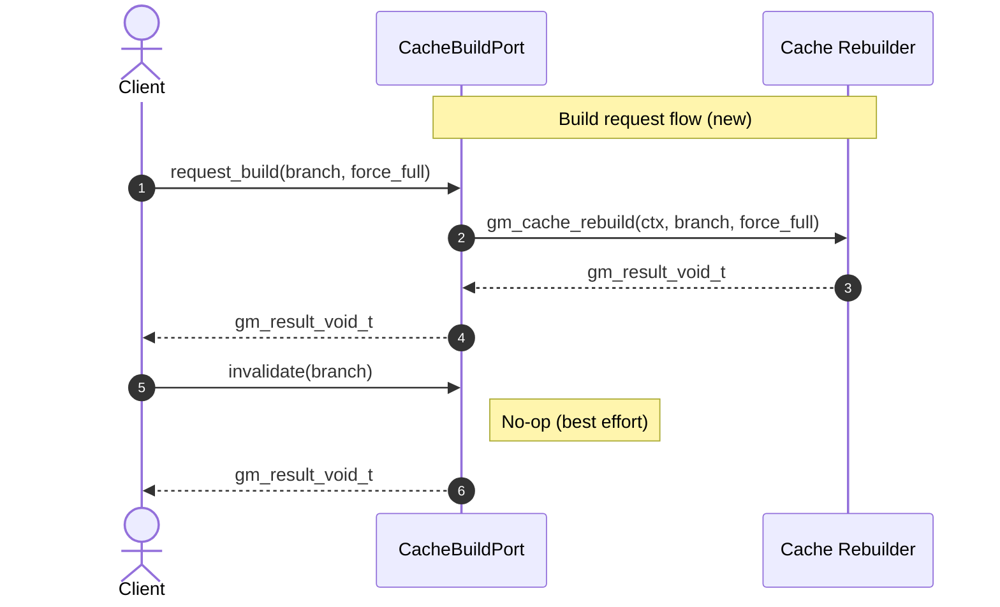
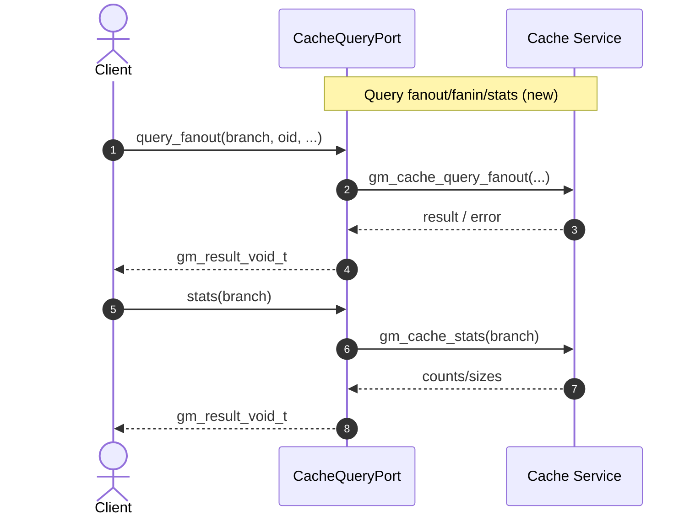
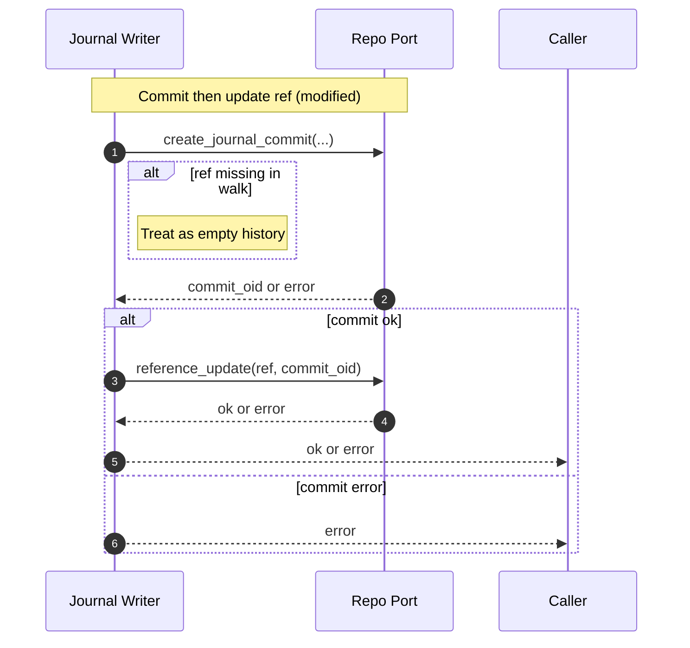
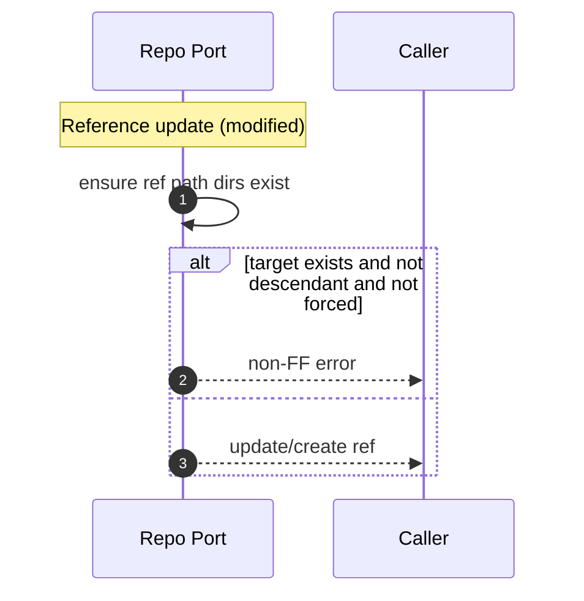
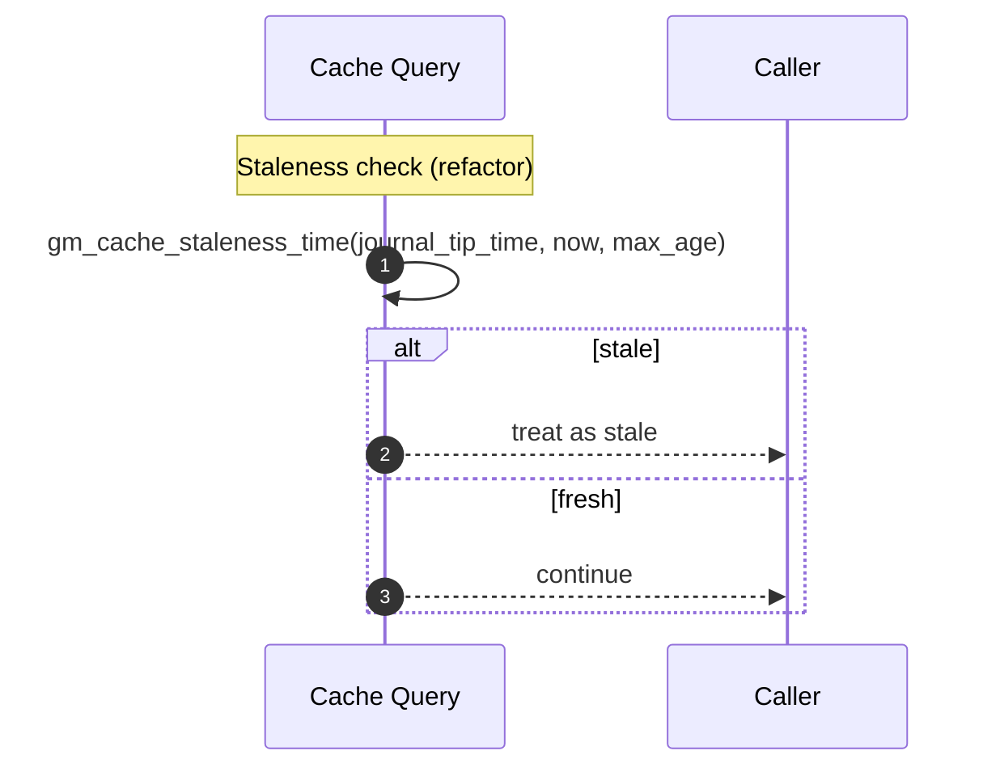

# Code Review Feedback

| Date | Agent | SHA | Branch | PR |
|------|-------|-----|--------|----|
| 2025-10-08 | CodeRabbit (and reviewers) | `9c9c521a68b8069d75d9dfd0fa265e5de1b4a90b` | [feat/hex-ports-ci-green](https://github.com/neuroglyph/git-mind/tree/feat/hex-ports-ci-green "neuroglyph/git-mind:feat/hex-ports-ci-green") | [PR#177](https://github.com/neuroglyph/git-mind/pull/177) |

## CODE REVIEW FEEDBACK

### core/src/adapters/logging/stdio_logger_adapter.c:41 — coderabbitai[bot]

```text
_🛠️ Refactor suggestion_ | _🟠 Major_

<details>
<summary>🧩 Analysis chain</summary>

**Verify `gmtime_r` portability.**

The code uses `gmtime_r`, which is POSIX but not C standard. Ensure this is available on all target platforms or provide a fallback.

---

🏁 Script executed:

```shell
#!/bin/bash
# Check if gmtime_r is used elsewhere in the codebase or if there are existing portability abstractions
rg -n "gmtime_r|gmtime_s" --type=c --type=h -C2
```

Length of output: 2559

---

[tasks review_file_3/6 inspect_time_abstraction_1/1]
[observations]
- `wrap_gmtime_r` defined in `core/src/time/time.c`.
- Logging adapter calls raw `gmtime_r`, bypassing time abstraction.
- Time abstraction in `time_ops` maps to `wrap_gmtime_r`, not used in logger.
[analysis]
- Using raw `gmtime_r` risks portability issues on Windows.
- Abstraction exists to centralize portability handling.
[pending]
- Confirm `wrap_gmtime_r` has Windows fallback.
- Recommend logger use `time_ops->gmtime_r`.
[actions]
- Inspect `wrap_gmtime_r` implementation for fallback.
- Suggest using abstraction in logger.
[done] 
<!-- [/scratchpad] -->

---

🏁 Script executed:

```shell
#!/bin/bash
rg -nP -C3 'wrap_gmtime_r' core/src/time/time.c
```

Length of output: 471

---


</details>

**Replace raw `gmtime_r` with `time_ops->gmtime_r` in stdio_logger_adapter.c**  
Leverage the existing time abstraction (wrap_gmtime_r) and handle its `gm_result_tm_ptr_t` return to ensure compatibility on non-POSIX targets.

<!-- This is an auto-generated comment by CodeRabbit -->
```

_Meta_: https://github.com/neuroglyph/git-mind/pull/177#discussion_r2412649574

{response}

### docs/code-reviews/PR177/47a1bf537feb065ef3cbac02a8bf78e75944111c.md:10 — coderabbitai[bot]

```text
_⚠️ Potential issue_ | _🟡 Minor_

**Align title with H1.**

Per the markdown guidelines, the `title` field in front matter must match the H1 heading. Currently, `title: 47a1bf537feb065ef3cbac02a8bf78e75944111c.md` doesn't match `# Code Review Feedback`.


Apply this diff to align them:

```diff
 ---
-title: 47a1bf537feb065ef3cbac02a8bf78e75944111c.md
+title: Code Review Feedback
 description: Preserved review artifacts and rationale.
```

<!-- suggestion_start -->

<details>
<summary>📝 Committable suggestion</summary>

> ‼️ **IMPORTANT**
> Carefully review the code before committing. Ensure that it accurately replaces the highlighted code, contains no missing lines, and has no issues with indentation. Thoroughly test & benchmark the code to ensure it meets the requirements.

```suggestion
---
title: Code Review Feedback
description: Preserved review artifacts and rationale.
audience: [contributors]
domain: [quality]
tags: [review]
status: archive
---

# Code Review Feedback
```

</details>

<!-- suggestion_end -->

<details>
<summary>🤖 Prompt for AI Agents</summary>

```
In docs/code-reviews/PR177/47a1bf537feb065ef3cbac02a8bf78e75944111c.md around
lines 1–10, the front-matter title
("47a1bf537feb065ef3cbac02a8bf78e75944111c.md") does not match the H1 ("Code
Review Feedback"); update the title field in the front matter to exactly "Code
Review Feedback" (match capitalization and spacing) so it matches the H1
heading.
```

</details>

<!-- This is an auto-generated comment by CodeRabbit -->
```

_Meta_: https://github.com/neuroglyph/git-mind/pull/177#discussion_r2412649584

{response}

### docs/planning/Milestones.md:14 — coderabbitai[bot]

```text
_⚠️ Potential issue_ | _🟠 Major_

**Insert SPDX/license block immediately after the front matter**

Per our doc guidelines, every markdown doc needs the SPDX/license notice right after the front matter. Please add it here.  

Use this patch:

```diff
 status: draft
 ---
 
+<!-- SPDX-License-Identifier: LicenseRef-MIND-UCAL-1.0 -->
+<!-- © 2025 J. Kirby Ross / Neuroglyph Collective -->
+
 # Milestones (Placeholder)
```

<!-- suggestion_start -->

<details>
<summary>📝 Committable suggestion</summary>

> ‼️ **IMPORTANT**
> Carefully review the code before committing. Ensure that it accurately replaces the highlighted code, contains no missing lines, and has no issues with indentation. Thoroughly test & benchmark the code to ensure it meets the requirements.

```suggestion
---

<!-- SPDX-License-Identifier: LicenseRef-MIND-UCAL-1.0 -->
<!-- © 2025 J. Kirby Ross / Neuroglyph Collective -->

# Milestones (Placeholder)

## Table of Contents

- Near Term
```

</details>

<!-- suggestion_end -->

<details>
<summary>🤖 Prompt for AI Agents</summary>

```
In docs/planning/Milestones.md around lines 8 to 14, the document is missing the
required SPDX/license notice immediately after the front matter; insert the SPDX
license block (as the project convention uses an HTML comment SPDX line, e.g.
<!-- SPDX-License-Identifier: Apache-2.0 --> and any accompanying copyright or
license attribution required by our doc guidelines) directly below the front
matter header so the license notice appears before the rest of the content.
```

</details>

<!-- fingerprinting:phantom:medusa:sabertoothed -->

<!-- This is an auto-generated comment by CodeRabbit -->
```

_Meta_: https://github.com/neuroglyph/git-mind/pull/177#discussion_r2412649598

{response}

### docs/planning/Product_Roadmap.md:12 — coderabbitai[bot]

```text
_⚠️ Potential issue_ | _🟠 Major_

**Restore the SPDX/license block after the front matter.**

The documentation standards require the SPDX and copyright comments immediately following the front matter. Add the standard block before the H1.  


```diff
 ---
 status: draft
 ---
+
+<!-- SPDX-License-Identifier: LicenseRef-MIND-UCAL-1.0 -->
+<!-- © 2025 J. Kirby Ross / Neuroglyph Collective -->
 
 # Product Roadmap (Placeholder)
```
As per coding guidelines


> Committable suggestion skipped: line range outside the PR's diff.

<details>
<summary>🤖 Prompt for AI Agents</summary>

```
In docs/planning/Product_Roadmap.md around lines 8 to 12, the SPDX/license and
copyright comment block required by documentation standards is missing after the
front matter; insert the standard SPDX/license block (including SPDX identifier
and copyright line) immediately after the front matter and before the H1 "#
Product Roadmap (Placeholder)" so the license header appears directly after the
front matter and above the document title.
```

</details>

<!-- fingerprinting:phantom:medusa:sabertoothed -->

<!-- This is an auto-generated comment by CodeRabbit -->
```

_Meta_: https://github.com/neuroglyph/git-mind/pull/177#discussion_r2412649608

{response}

### docs/planning/Release_Plans.md:14 — coderabbitai[bot]

```text
_⚠️ Potential issue_ | _🟠 Major_

**Add required SPDX/license notice after front matter**

Docs under `docs/**/*.md` must place the SPDX/license block immediately after the front matter. Please add the standard notice so we stay compliant.  

Apply this diff:

```diff
 status: draft
 ---
 
+<!-- SPDX-License-Identifier: LicenseRef-MIND-UCAL-1.0 -->
+<!-- © 2025 J. Kirby Ross / Neuroglyph Collective -->
+
 # Release Plans (Placeholder)
```

<!-- suggestion_start -->

<details>
<summary>📝 Committable suggestion</summary>

> ‼️ **IMPORTANT**
> Carefully review the code before committing. Ensure that it accurately replaces the highlighted code, contains no missing lines, and has no issues with indentation. Thoroughly test & benchmark the code to ensure it meets the requirements.

```suggestion
---

<!-- SPDX-License-Identifier: LicenseRef-MIND-UCAL-1.0 -->
<!-- © 2025 J. Kirby Ross / Neuroglyph Collective -->

# Release Plans (Placeholder)

## Table of Contents

- Cadence
```

</details>

<!-- suggestion_end -->

<details>
<summary>🤖 Prompt for AI Agents</summary>

```
In docs/planning/Release_Plans.md around lines 8-14, the file is missing the
required SPDX/license notice immediately after the front matter; insert the
standard SPDX license block (for example an HTML comment like
SPDX-License-Identifier: <LICENSE-ID>) directly below the closing front-matter
delimiter (---) with a single blank line separation, so the notice appears as
the first content after front matter and complies with docs/**/*.md
requirements.
```

</details>

<!-- fingerprinting:phantom:medusa:sabertoothed -->

<!-- This is an auto-generated comment by CodeRabbit -->
```

_Meta_: https://github.com/neuroglyph/git-mind/pull/177#discussion_r2412649615

{response}

### docs/planning/Sprint_Plans.md:12 — coderabbitai[bot]

```text
_⚠️ Potential issue_ | _🟠 Major_

**Insert SPDX/license comments after front matter.**

Per the documentation guidelines, every Markdown page must include the SPDX/license comment block right after the front matter. Please add the standard comments before the H1.  


```diff
 ---
 status: draft
 ---
+
+<!-- SPDX-License-Identifier: LicenseRef-MIND-UCAL-1.0 -->
+<!-- © 2025 J. Kirby Ross / Neuroglyph Collective -->
 
 # Sprint Plans (Placeholder)
```
As per coding guidelines

<!-- suggestion_start -->

<details>
<summary>📝 Committable suggestion</summary>

> ‼️ **IMPORTANT**
> Carefully review the code before committing. Ensure that it accurately replaces the highlighted code, contains no missing lines, and has no issues with indentation. Thoroughly test & benchmark the code to ensure it meets the requirements.

```suggestion
---
status: draft
---

<!-- SPDX-License-Identifier: LicenseRef-MIND-UCAL-1.0 -->
<!-- © 2025 J. Kirby Ross / Neuroglyph Collective -->

# Sprint Plans (Placeholder)

## Table of Contents
```

</details>

<!-- suggestion_end -->

<details>
<summary>🤖 Prompt for AI Agents</summary>

```
In docs/planning/Sprint_Plans.md around lines 8 to 12, the file is missing the
required SPDX/license comment block after the front matter and before the H1;
add the standard SPDX/license comment block (e.g., SPDX-License-Identifier and
copyright/license owner lines used across the repo) immediately after the
YAML/front-matter section and before the "# Sprint Plans (Placeholder)" heading
so the document conforms to the documentation guidelines.
```

</details>

<!-- fingerprinting:phantom:medusa:sabertoothed -->

<!-- This is an auto-generated comment by CodeRabbit -->
```

_Meta_: https://github.com/neuroglyph/git-mind/pull/177#discussion_r2412649624

{response}

### docs/PRDs/PRD-co-thought-mcp-service.md:18 — coderabbitai[bot]

```text
_⚠️ Potential issue_ | _🟠 Major_

**Add required SPDX/License comment after front matter.**

Docs under `docs/` must place the SPDX/License comment immediately after the front matter. Please insert it between the front matter and the H1 heading to comply with our documentation policy.  [As per coding guidelines]

<details>
<summary>🤖 Prompt for AI Agents</summary>

```
In docs/PRDs/PRD-co-thought-mcp-service.md around lines 9 to 18, the file is
missing the required SPDX/License comment immediately after the front matter;
insert the SPDX short-form license comment (e.g. <!-- SPDX-License-Identifier:
Apache-2.0 --> or the project's approved identifier) directly between the
closing front-matter block and the H1 heading so the license line appears as the
first content after front matter and before "# PRD — Co‑Thought MCP Service".
```

</details>

<!-- fingerprinting:phantom:triton:sabertoothed -->

<!-- This is an auto-generated comment by CodeRabbit -->
```

_Meta_: https://github.com/neuroglyph/git-mind/pull/177#discussion_r2412649633

{response}

### docs/PRDs/PRD-git-mind-semantics-time-travel-prototype.md:13 — coderabbitai[bot]

```text
_⚠️ Potential issue_ | _🟠 Major_

**Add the required license/SPDX comment after the front matter.**

Docs must place the License/SPDX comment immediately after the front matter, but nothing is present here. Please add it to stay compliant.  As per coding guidelines.

```diff
 ---
 
+# <!-- SPDX-License-Identifier: Apache-2.0 -->
+
 # PRD — First-Class Semantics (Time-Travel Prototype)
```

<!-- suggestion_start -->

<details>
<summary>📝 Committable suggestion</summary>

> ‼️ **IMPORTANT**
> Carefully review the code before committing. Ensure that it accurately replaces the highlighted code, contains no missing lines, and has no issues with indentation. Thoroughly test & benchmark the code to ensure it meets the requirements.

```suggestion
---
<!-- SPDX-License-Identifier: Apache-2.0 -->

# PRD — First-Class Semantics (Time-Travel Prototype)

## Table of Contents
```

</details>

<!-- suggestion_end -->

<details>
<summary>🤖 Prompt for AI Agents</summary>

```
In docs/PRDs/PRD-git-mind-semantics-time-travel-prototype.md around lines 8-13
the required license/SPDX comment is missing after the front matter; add the
project's standard SPDX license comment immediately after the closing
front-matter marker (on the next line) so the file includes the correct
SPDX-License-Identifier comment consistent with the repo's licensing policy.
```

</details>

<!-- fingerprinting:phantom:triton:sabertoothed -->

<!-- This is an auto-generated comment by CodeRabbit -->
```

_Meta_: https://github.com/neuroglyph/git-mind/pull/177#discussion_r2412649638

{response}

### docs/specs/Technical_Specifications.md:14 — coderabbitai[bot]

```text
_⚠️ Potential issue_ | _🟠 Major_

**Restore the SPDX/license comment after the front matter**

We require the SPDX/license notice immediately following the front matter in every doc. Please add it back so the spec placeholder stays compliant.  

Suggested change:

```diff
 status: draft
 ---
 
+<!-- SPDX-License-Identifier: LicenseRef-MIND-UCAL-1.0 -->
+<!-- © 2025 J. Kirby Ross / Neuroglyph Collective -->
+
 # Technical Specifications (Placeholder)
```

<!-- suggestion_start -->

<details>
<summary>📝 Committable suggestion</summary>

> ‼️ **IMPORTANT**
> Carefully review the code before committing. Ensure that it accurately replaces the highlighted code, contains no missing lines, and has no issues with indentation. Thoroughly test & benchmark the code to ensure it meets the requirements.

```suggestion
status: draft
---

<!-- SPDX-License-Identifier: LicenseRef-MIND-UCAL-1.0 -->
<!-- © 2025 J. Kirby Ross / Neuroglyph Collective -->

# Technical Specifications (Placeholder)

## Table of Contents

- Overview
```

</details>

<!-- suggestion_end -->

<details>
<summary>🤖 Prompt for AI Agents</summary>

```
In docs/specs/Technical_Specifications.md around lines 8 to 14, the SPDX/license
notice was removed after the front matter; restore the required SPDX/license
comment immediately following the front matter (e.g. add the SPDX identifier
line such as "SPDX-License-Identifier: <license>" right after the front-matter
separator) so the document is compliant with project licensing conventions.
```

</details>

<!-- fingerprinting:phantom:medusa:sabertoothed -->

<!-- This is an auto-generated comment by CodeRabbit -->
```

_Meta_: https://github.com/neuroglyph/git-mind/pull/177#discussion_r2412649645

{response}

### docs/wish-list-features/README.md:10 — coderabbitai[bot]

```text
_⚠️ Potential issue_ | _🟠 Major_

**Add required SPDX comment after front matter.**

Docs must place the license/SPDX comment block immediately after the front matter; this placeholder currently omits it. Please add the repository-standard SPDX and copyright comments beneath the `---` block.  


```diff
 ---
 status: draft
 ---
+
+<!-- SPDX-License-Identifier: LicenseRef-MIND-UCAL-1.0 -->
+<!-- © 2025 J. Kirby Ross / Neuroglyph Collective -->
 
 # Wish List Features (Placeholder)
```
As per coding guidelines

<!-- suggestion_start -->

<details>
<summary>📝 Committable suggestion</summary>

> ‼️ **IMPORTANT**
> Carefully review the code before committing. Ensure that it accurately replaces the highlighted code, contains no missing lines, and has no issues with indentation. Thoroughly test & benchmark the code to ensure it meets the requirements.

```suggestion
---
status: draft
---
<!-- SPDX-License-Identifier: LicenseRef-MIND-UCAL-1.0 -->
<!-- © 2025 J. Kirby Ross / Neuroglyph Collective -->

# Wish List Features (Placeholder)
```

</details>

<!-- suggestion_end -->

<details>
<summary>🤖 Prompt for AI Agents</summary>

```
In docs/wish-list-features/README.md around lines 8 to 10, the front matter
separator (“---”) is present but the required repository-standard SPDX and
copyright comment block is missing immediately after it; insert the standard
SPDX license comment block (matching repository conventions) directly beneath
the `---` line, including SPDX identifier and copyright owner/year, ensuring
there are no blank lines between the front matter separator and the comment
block.
```

</details>

<!-- fingerprinting:phantom:medusa:sabertoothed -->

<!-- This is an auto-generated comment by CodeRabbit -->
```

_Meta_: https://github.com/neuroglyph/git-mind/pull/177#discussion_r2412649654

{response}

### migration-progress.md:5 — coderabbitai[bot]

```text
_⚠️ Potential issue_ | _🟡 Minor_

**Add required front matter.**

Per the markdown guidelines, documentation files must have front matter at the beginning. This migration tracking document is missing it.


Add front matter before line 1:

```diff
+---
+title: Hexagonal Architecture Migration Progress
+description: Single source of truth for tracking hexagonal architecture migration
+audience: [contributors]
+domain: [architecture]
+tags: [migration, hexagonal]
+status: active
+---
+
 # Hexagonal Architecture Migration Progress
```

<!-- suggestion_start -->

<details>
<summary>📝 Committable suggestion</summary>

> ‼️ **IMPORTANT**
> Carefully review the code before committing. Ensure that it accurately replaces the highlighted code, contains no missing lines, and has no issues with indentation. Thoroughly test & benchmark the code to ensure it meets the requirements.

```suggestion
---
title: Hexagonal Architecture Migration Progress
description: Single source of truth for tracking hexagonal architecture migration
audience: [contributors]
domain: [architecture]
tags: [migration, hexagonal]
status: active
---

# Hexagonal Architecture Migration Progress

Started: 2025-10-08

This file is the single source of truth for tracking the end-to-end migration of the C library to a strict hexagonal architecture, per AGENTS.md. Update this checklist as work proceeds. Check off items with `[x]` only after they are complete and validated (CI green, zero new clang-tidy warnings, and docs updated).
```

</details>

<!-- suggestion_end -->

<details>
<summary>🤖 Prompt for AI Agents</summary>

```
In migration-progress.md around lines 1 to 5, the document is missing required
front matter; add a YAML front matter block at the very top (before line 1)
including at minimum a title, date (2025-10-08), and a short description (and
optionally tags/layout) so the file conforms to the markdown guidelines and site
generator expectations; ensure the block is delimited with triple dashes and the
rest of the content follows after the closing dashes.
```

</details>

<!-- This is an auto-generated comment by CodeRabbit -->
```

_Meta_: https://github.com/neuroglyph/git-mind/pull/177#discussion_r2412649659

{response}

### General comment — coderabbitai[bot]

```text
<!-- This is an auto-generated comment: summarize by coderabbit.ai -->
<!-- This is an auto-generated comment: review in progress by coderabbit.ai -->

> [!NOTE]
> Currently processing new changes in this PR. This may take a few minutes, please wait...
> 
> <details>
> <summary>📥 Commits</summary>
> 
> Reviewing files that changed from the base of the PR and between 0fd691addb78db7bcdb7845eb794edcfb7101b0f and 9c9c521a68b8069d75d9dfd0fa265e5de1b4a90b.
> 
> </details>
> 
> <details>
> <summary>📒 Files selected for processing (1)</summary>
> 
> * `docs/code-reviews/PR177/47a1bf537feb065ef3cbac02a8bf78e75944111c.md` (1 hunks)
> 
> </details>
> 
> ```ascii
>  _____________________
> < I've git the power! >
>  ---------------------
>   \
>    \   \
>         \ /\
>         ( )
>       .( o ).
> ```

<!-- end of auto-generated comment: review in progress by coderabbit.ai -->

<!-- walkthrough_start -->

## Walkthrough
Adds new cache ports (build/query) and outbound ports (logger/metrics) with adapters, introduces a staleness helper, updates context to hold ports, wires builds in Meson, adjusts git repository adapter behavior, extends journal commit flow to update refs, refactors cache query to use the staleness helper, and replaces multiple docs with placeholders.

## Changes
| Cohort / File(s) | Summary |
|---|---|
| **Internal cache staleness helper**<br>`core/include/gitmind/cache/internal/staleness.h` | New inline function `gm_cache_staleness_time` to evaluate cache age using timestamps and max-age. C/C++ compatible. |
| **Context ports expansion**<br>`core/include/gitmind/context.h` | Adds optional logger and metrics ports with disposer callbacks; includes new port headers. |
| **Public port surfaces (cache/logger/metrics)**<br>`core/include/gitmind/ports/logger_port.h`, `core/include/gitmind/ports/metrics_port.h`, `core/include/gitmind/ports/cache_build_port.h`, `core/include/gitmind/ports/cache_query_port.h` | Introduces logger and metrics outbound ports with safe no-op wrappers; adds cache build and query port APIs with vtables and init/dispose functions. |
| **Cache ports implementations**<br>`core/src/ports/cache/cache_build_port.c`, `core/src/ports/cache/cache_query_port.c` | Implements cache build/query ports with state allocation, vtables, input validation, error mapping, and dispose logic. |
| **Logging adapter (stdio)**<br>`core/src/adapters/logging/stdio_logger_adapter.c`, `core/src/adapters/logging/stdio_logger_adapter.h` | Adds FILE\*-based logger adapter with level filtering, timestamped formatting, init/dispose, and error handling. |
| **Metrics adapter (null)**<br>`core/src/adapters/metrics/null_metrics_adapter.c`, `core/src/adapters/metrics/null_metrics_adapter.h` | Adds no-op metrics adapter with vtable, state management, init/dispose. |
| **Cache query staleness refactor**<br>`core/src/cache/query.c` | Replaces manual staleness check with `gm_cache_staleness_time`; includes new header. |
| **Git repository adapter tweaks**<br>`core/src/adapters/git/libgit2_repository_port.c` | Commit creation falls back to synthetic signature; reference update ensures directories exist; force flag permits non-FF updates. |
| **Journal writer flow update**<br>`core/src/journal/writer.c` | Treats missing ref as empty history; after commit, updates ref to new commit; propagates update errors. |
| **Build system**<br>`meson.build` | Registers new ports, adapters, and public headers. |
| **Planning/PRD/spec docs placeholders**<br>`docs/PRDs/*`, `docs/planning/*`, `docs/specs/Technical_Specifications.md`, `docs/wish-list-features/README.md` | Replaces detailed content with placeholder outlines and updated metadata. |
| **Migration tracking**<br>`migration-progress.md` | Adds migration checklist document for hexagonal architecture transition. |
| **Review artifact**<br>`docs/code-reviews/PR177/47a1bf537feb065ef3cbac02a8bf78e75944111c.md` | Adds code review feedback document for archival. |

## Sequence Diagram(s)










## Estimated code review effort
🎯 4 (Complex) | ⏱️ ~60 minutes

## Possibly related PRs
- neuroglyph/git-mind#158 — Also changes cache query and staleness logic; overlaps with refactoring `core/src/cache/query.c`.
- neuroglyph/git-mind#171 — Refactors cache/query to port-based helpers and adjusts staleness handling; intersects with this PR’s staleness extraction.
- neuroglyph/git-mind#169 — Modifies `gm_cache_is_stale` and `core/src/cache/query.c`, overlapping with the new `gm_cache_staleness_time` usage.

## Poem
> In burrows of code where the timelines weave,  
> I nudge the cache to build, then leave.  
> I log a squeak, metrics hop by—  
> Fresh or stale? I sniff, I try.  
> Refs now point where commits arrive—  
> Thump-thump! Our garden’s come alive. 🐇✨

<!-- walkthrough_end -->

<!-- pre_merge_checks_walkthrough_start -->

## Pre-merge checks and finishing touches
<details>
<summary>❌ Failed checks (2 warnings)</summary>

|     Check name     | Status     | Explanation                                                                                                                                                                                                                                                                                                                                                                                                                                                                                                 | Resolution                                                                                                                                                                                                                                                                                                                   |
| :----------------: | :--------- | :---------------------------------------------------------------------------------------------------------------------------------------------------------------------------------------------------------------------------------------------------------------------------------------------------------------------------------------------------------------------------------------------------------------------------------------------------------------------------------------------------------- | :--------------------------------------------------------------------------------------------------------------------------------------------------------------------------------------------------------------------------------------------------------------------------------------------------------------------------- |
| Docstring Coverage | ⚠️ Warning | Docstring coverage is 21.43% which is insufficient. The required threshold is 80.00%.                                                                                                                                                                                                                                                                                                                                                                                                                       | You can run `@coderabbitai generate docstrings` to improve docstring coverage.                                                                                                                                                                                                                                               |
|  Description Check | ⚠️ Warning | The pull request description follows the general template structure but diverges in the Change Areas and Risk sections: the Change Areas checklist uses custom categories instead of the exact “Core (C)”, “CLI / Hooks”, “Docs”, and “CI / Tooling” items, and the Risk section uses a low/medium/high radio style rather than the required checkbox list for “Behavior change”, “Public API change”, and “Docs-only”. These deviations mean the repository’s prescribed template is not fully adhered to. | Please update the Change Areas checklist to use the exact template entries (“Core (C)”, “CLI / Hooks”, “Docs”, “CI / Tooling”), convert the Risk section into checkboxes for “Behavior change”, “Public API change”, and “Docs-only”, and ensure the section headings precisely match the repository’s description template. |

</details>
<details>
<summary>✅ Passed checks (1 passed)</summary>

|  Check name | Status   | Explanation                                                                                                                                                                                                                        |
| :---------: | :------- | :--------------------------------------------------------------------------------------------------------------------------------------------------------------------------------------------------------------------------------- |
| Title Check | ✅ Passed | The title succinctly references the key additions of hexagonal ports, cache coordination utilities, and robustness enhancements to the journal adapter, accurately reflecting the PR’s primary changes without unnecessary detail. |

</details>

<!-- pre_merge_checks_walkthrough_end -->

<!-- tips_start -->

---

Thanks for using CodeRabbit! It's free for OSS, and your support helps us grow. If you like it, consider giving us a shout-out.

<details>
<summary>❤️ Share</summary>

- [X](https://twitter.com/intent/tweet?text=I%20just%20used%20%40coderabbitai%20for%20my%20code%20review%2C%20and%20it%27s%20fantastic%21%20It%27s%20free%20for%20OSS%20and%20offers%20a%20free%20trial%20for%20the%20proprietary%20code.%20Check%20it%20out%3A&url=https%3A//coderabbit.ai)
- [Mastodon](https://mastodon.social/share?text=I%20just%20used%20%40coderabbitai%20for%20my%20code%20review%2C%20and%20it%27s%20fantastic%21%20It%27s%20free%20for%20OSS%20and%20offers%20a%20free%20trial%20for%20the%20proprietary%20code.%20Check%20it%20out%3A%20https%3A%2F%2Fcoderabbit.ai)
- [Reddit](https://www.reddit.com/submit?title=Great%20tool%20for%20code%20review%20-%20CodeRabbit&text=I%20just%20used%20CodeRabbit%20for%20my%20code%20review%2C%20and%20it%27s%20fantastic%21%20It%27s%20free%20for%20OSS%20and%20offers%20a%20free%20trial%20for%20proprietary%20code.%20Check%20it%20out%3A%20https%3A//coderabbit.ai)
- [LinkedIn](https://www.linkedin.com/sharing/share-offsite/?url=https%3A%2F%2Fcoderabbit.ai&mini=true&title=Great%20tool%20for%20code%20review%20-%20CodeRabbit&summary=I%20just%20used%20CodeRabbit%20for%20my%20code%20review%2C%20and%20it%27s%20fantastic%21%20It%27s%20free%20for%20OSS%20and%20offers%20a%20free%20trial%20for%20proprietary%20code)

</details>

<sub>Comment `@coderabbitai help` to get the list of available commands and usage tips.</sub>

<!-- tips_end -->

<!-- internal state start -->


<!-- DwQgtGAEAqAWCWBnSTIEMB26CuAXA9mAOYCmGJATmriQCaQDG+Ats2bgFyQAOFk+AIwBWJBrngA3EsgEBPRvlqU0AgfFwA6NPEgQAfACgjoCEYDEZyAAUASpETZWaCrKPR1AGxJcAEiQAePPgUuMgA1IxoDLAkCsG08BjUweGQQvjYFEkeAPRotGjcNHwAZvD+0pAAFADCAJKQRBQkZACUkJAGAHKOApRcAIwA7EMdBgCqNgAyXLC4uNyIHDk5ROqw2AIaTMw55Jn4RB6y3LCr6mDMibQ53NgeucOjnQCCeLDBXCXHiU2C+KExgBlDIUBixARUDDRL4kag5GL+MDcYKhMAMeDEZpkMbQZykXCQSGYGGQZjaLCdIG4ajYJb8bg4zo1ZrUOjoTiQABMAAYuQBWMADHlgHkADmgPIAbBweQBmDhcrkALTGNhIEngJAA7pR6VUMPhyJAPEgaLR2p0pioSB59YbjabEObWkYACLSBgUeBFeBGrhWVHIRAMNAlEr4DwJDBEAA0kWisSY8USyQoiHjtBYFPsNK85EQyBiHkZFHjmHo6Uy2RypoEa1wXPQBSKlEgFEEdNwBcQGkg9S45IA1knMR58KGPI1sRgNEZ9MZwFAyPR8CUcARiGRlOaFKx2FxePxhKJxFIZPImEoqKp1FodAuTFA4KhUJgN4RSOQqLudmwMJyVDavYjjki4RKXooyi3po2i6GAhiLqYBhMM0OSJAwHjYEo5y4FcGA3KGiboQBlA1s6aD5tIvawBwBgAESMQYFiQC8dRbt+bL0A4TjgWujCwJgpCIEYdQAR2tDYOCyBoJA5DAYkxTZJAMT5G2qEkCRmHYZpDb4YRUQxCRSmUTkFFUYWGiwJAuCCYSShlAW6C5tQ8AMCgGCmsaJTYNC4hGo0zAAPpETEQXmduhZBeIbA2fgkBKMU+FJoZsQRT2fZwLEPl+X6WA0iOyBVlklHRT6ZVsPGhrahVJDlgRZJoP4QVoKQ4WiEatAZu2JC4NWvw2RQ2CxPA662UmmTNABNnwLFqDOt6YjHOgJTFGkoLZGV3C1RBZLBLEtnvuSzWtSQ7VMARiAANwoISzR9VkyAlJRiAjeu1U7aghqEmGa3FZt4jbTFsTBDZMSQLahSvfQwMoMg2rrIkYOxMdLWkJACMEfg2qZeDqnXnD/boiw3CuQIXgY+sEP+EpkD0TU9GNNgzhdZAEZ8DUYQRBWkB0pUFEESzKlwtewa4LQAj4JGVnoA1zrRposB9l08UBCZU5KIyBFkBilSg5QHZ8IJBFeUQRIkLInUeXchISJR8AFP5WCarJsM7KT3qIEaMnNB52lKLQc5GMxlgvB4xSud7cXIwlogeM4kcYMg/EBCiITsqDdzk25EMAeoWoiQYUAALK9R89D5AHXAAAaS5GgUhal4V5pFiC1VU2CKVKAAs0XrdWpWA7V8adwBPd9x9wMj13veEqjp3nZ1iCtNXHls/AFPVxpWlYThenXDkoWaYpZGmel1FWdXRgAKLOrNXEKEoPWajqEPhqiXClwkjgMUxRfIdvDCu9dLqH0ofI0NAaZWTooxeiIdWLsS/DudkPEwLyH4tEIS0h5ysVoAHBkTtKKxy1koaEsgwCJBEGIPKQQQjIAIA3C6kDcDRS4PJMkJBmB9HTCaQ4pAKBBTToSKoRBgrjiIPwwRqJortARrZW6yAEiIBRK9PgKIT58HEZIoRQUlEqLqrLegbBcCLTbkI6ooigrGNMVIkIMjKbyPUIopA+i+DWLcmY6Rej8CvTnFAMS/t2TsKzqady+M2yaxXDrAuXAtGUFsYrQxHCTEeISVZPxkAxIJFDLuJGf52D0LssjV6tDATknkH0XmGBEj53tgAL3ZDzbUVBuClh9rEQ0YB8CLAxjELAvk+aByLjAGIJTMExkqKnHm40FCkRprmIaYhMgHXih8KMzYEiEKnEI+G6wMg/XDpQAaAQzQDTKLaVmoM+iCU1KDdm1NTkxlKb2YO8Cw4RydvQ+KMylCYQTp8/g65U6ogzmozYoTc7iHENg4Z1JFk/TwXQGulimFq2iqvJGW99o7x0rhMBqKoGwFXtVP2wClgGA6FALor9zlRmRWIvh8SdGEjiQIoRV0r6UsgNS4C3jVE1wkPgB21QABUrKEm6JcT4kgrQREMokUy6RhIRVCNaByiluhuU0q1HSyA1dLHuIYJ4uxc9eo2PZZyzVPKEpSv5XqwVwqqgisNcalhfKZVyqsWa1JzLIAqtRGqq+Bhb4xQfleWIzQX7ARIO/EIn86DwB/rA+cADsVANxfvAitwgyHybgITuUY0m0V/nAlibEOLIO4qBZw6D1zjOEkYF4eCZJyVfiEnONRWJWAaOE0ooNZJHyJAW+gQi+xiRMYoKSlRZLmIcBQZ64Jo4pIVXwQdzR80bwrg1RIdtTSOzyvGZgUEvAVxbbZPJUsKDRjTPwKQfATl3yeVmckSMXjdt7JAD0jlp1ySNF07U1SnkSBpOTA6JxYg8xnaiBZUlCRMIpANWSwHyZBA0Uk7paAACOw0XI0FxrEYDKgKbpqUPQ7U8Vuk7jyvSZo2HpAsI3esqoxJoSwHjOzcEQUfIPHaDzHd9tHaxGY1CaIrQ+wej+c0FtDk0D3EJDU8Q9TE5s18tQgKnqGDMFoI3RMQVGPaZ0Qp9o91+pPNkpYqTcmgoOu0z9Bqsk+VEJymprAGmtM6bCvpiV7qxOQGvknZZyBO1eSHKdNmoNOYRAujxPUY7oRkvQL7EcRQyQ1PJFOHmzRloBQfeIJ5lnw5JIJYSXA4GP0qw8l5WIdQADyhNSzszYPQOQKBmDcC8P+Gkny+yvLLYcn81Gl3g1+fHAbUcU7+CEaCng4Kc7sHzjCqATb8GlcZA5Guq26Axpg2IRh7mj56eHRK5DU4UX7bzUdnRJ3oocrXmUTegD4sZtAQfHZubdNedHUS4Zy32SbYckkhasGNvgYB0D3bZ3tMHc+9BgA3rM50e2ocXc3cd3A5M+4ipOzdGzfqKI0BugAXyRx5s6MOTXqqW4i7iJjgd6vB4SSHpPDuo6u+jqc8OLPSCszZvuTraPDWdCzqMsqmfQ8u0qvHtoSjxmi3BwSfARUseiPGOuU4ONnW4x4NVDcCssN58IkV/G91slF8FTTyOPsS5NVLjwMuEfy+cH65XsAdeE8p7g/Bzmnax0k4nGuABxYuQUug1bdHUIENQXg2DdLr7n4drNCtsyT8XrPpEKbc5bzz1uWHKqEfGFFEC0XKrEP4QNP3qcqdygFEb/y8oCqTynlHhadHusz8z8nue/WqvVcGu+5JfxQWflqaNsbORf0TcwEtKawBGEe4EvFr2c0Hboy4ItMCmJlsQduH8KDq18TrcbBtBhx0SSnS29hiRJa+XoLQb0monnmPuYO1fBdAdddOUavsy2W3tvchohdCDezQsCceAB+TbL5DyCOXbORayGZI+LgKDEIHbQkWA2WBkLDHDfHIAiuX9DAf9QDM2E7VDUiMsZyYg+DGpJ5WybEKvFzEg4oZAKoVfWQLjTAfZeMFgtgwDeMfHZeeqegU0EoUQWQTCWIYsNpaOBTMA00BpJJd1GOUdEZcQkWNsXgfATUUjJmFmdkYLRIULdGe5SLPcUmcQNQU0UreMEjSocgaSRAGtDyMAD4PmGyMrCxYKPXRPB2aKAvc3JuTw3AXwoKJPHwxhIvGmGRAQ6mHZZyBdAgFwMAU0EcDyWpWQ5Tb3GhSxTDNfA7QzapOzXA91PgLInIpuVvW1EgfDWORAeAIgfpV6GSLADDOjXDHA5yc9LAZMK9VMeIyAYghhDsPAFKRMSAFgiGWgYSaoZ6Q0PAHIaYxIXjBqAY71DUCEETayfHT/JgugNqJgXyAohMMKGohpPTWQGgZePsa+CgQ2ewWo7IAaVAF2OPBwBPA3HqB6Z2SiQXKo+7EaYMaXYmACCkdkNA6w7Qq9RomnCsIWNWMiOmBmIkccBgIcF5YOPrD5QbBhH5OOOvcbIFSbEFVcMFbOdyebaFQuKlV+TbelIKbI1g3IpVDFLAX4vVefYBRfLNN7FfYaNfL7K+Sk4CakvVEo+kso6Ra7XAJk9eB7NNJ7PeF7Tk5fJuLgvk4Za1BnGkuk5nIRKUlkrFNCawjkm4Lk5Unk1g1UgUlAmuBnBuLUhkuxE7XUjeWIfU4+OUkBPCJfOhd7MKFU1ES+NUmlVTJ2TU0o3TPI9QT1O0sUm3f1EIII4rTHUvFed40zM2fVDw+PfXEIyUu7Z01k2UhfTNY0pU3TP0kIAMy0jI/0YU4KaM8MrxCoqMsMsKX1OM3AFMpGPUtk57T0xU707kygc0/077PvUNQfJ+SNEfN+dmcfBNJNP+CAWfFCQs9k4s7Nb08VL7DfUtUObfTiXcVBBwjBI/GFU/SdaSZydhfZa/BqLRAacxAAqIEaTo1c3ssBN7Lckc8TGNRIH9P/XhCRAaLwKQKcMgRwaoIPIKKYGrAPIKN0a+AAIXGAD3jCgpgrgrqC6AADEas0Lg8MKgoAB1aPLofC6C2CoKa+GwGwGrGwVocsQC/hUpFA5ZdwoKL8k1WRKmWSB0AggaYg9RUgpJd8ZorArrWIIS4oKIpDdnVi32T1Ti/XdndoSgwg5yGomMCmcROgn3KSygS4gkho5yACxIKrDGFpUsXSzI+VSRHSw6Qkew4Q5aJQLwIgNkZAe86g+KIRBCE7BCHS0adAO2DeIjAxAEGICgBGEpEzR6K8wgbpHqF44RSxfAIcLwi0OLQJZAWErIeExmIgZmCE8LDmLmEwsmDedQeQHmAWAoK9UlHScErqKo5pQoKysgDXZADAe4KcRMZE5OLAfPUpPy9nKI3yvQfyvQHSvodmF8wVHJA9XOIjRDewMMWIGTOTc2G5P0PgbUPpRQ6DN8AQV6aaUGDCEmLwPDXrUOfrROSA7Ev3AFCbKbIkmbEkyFBbCkyAbC50rgHs+UvskszcxlNlEcjVZ8cDDZJFXOCCyxcRDi1YjwaKDVLlAANS+OkC4HQsooQuQoD0gAAF5IBhRyLCKsLcLCbuQeRSbKKSKbAuhKa5RqbIBsa4LqLaK7Aibu4eRwaYBIbK5oabS4aQaEkUbNVS4uE9Q/rvZGdbLFUHT2dMdsc+jG8RVXo7deboB+bqcuAha5bQaFbyYxaS5OFuEuAudkqMq+cxVDhZVcc1bpcgj4aQLbQ+4XaPBZcZaBIncRV3YjR2BPak5HdFc2BCxTpXQuUta1ttsBbaAuB/tts9aOKRa2cUNhaV00cMdcArpearBZt3JNsoa46UCG4lLrM5KqgHI/zT10BJYpAI7NU873rqysBY7daP9/9PI/zniecczS6RbxEqg5d+6M62yhr06EbQK3bEbA7EdMFFc/byAAJZ7g6/VQ77DSAG6uVEKSBtrPhuUer0QYh+rSl4xxqTsz7UQRryYArDgboApnoN42LYqk4G40qMqqgdcIrKBoqUoHhkBz72db6iAqhxr1b7d3bPa2t/bl6OEw7N7c787rKAoai6jaRfZVNTzms8AZzTxJBbRqrm10CzLu6JD+gR67LDheafqvBEjEbqZaZ6YCqirWY+N3SmrkBmgX0MAz6pNKAH8zYAK30Gh3YKqLDXAxz74JyI0NRpyY1ZzfBajYBp9/5lz/qPSPyc0XV19p8t8K1d8q1eJa1vaJlC4f8rzX4byMgGoXUWKnzF0GFOF1AFB9i9QC9ZNhIoiYpfgP1zzJJLzZKwqwABA0BoYWKVAFoogfc0DeK/1sZ1LwGGC2xplYBaCW6kn0xpbXGBFK53HsA2pXpAiklvGYwrEP0rAOxNDKghHu0LK2q9R2LtG9jSCWo8EgjtH3L8mzpCn2nvUjUKpfgyn2gHLpxnytd5BOlEqqgX6BpUr0qbNZF9qZkhqL7+A+BlFRBRoc50nUBfJCmsqEtjDcqsBCqWZITnIahiY2syYKYbT45LY8B4wyBlqnkxKIMWw1psC+iwCY5En9KKBLiKJs5EBRlXDo6SgnpQYDU+nXU+4eZoWUl+nU6kaDjzNgptHkWS61KBoZl0n/mP0w4pxWrWkGn2ZtQhZJw7QhsCM5K9qcQ0AQr45QN77xooqkADFxp5AX6NKpI7CVbhU9cg5zAbqMSo4sThscSxtX7nrCS1m3qIUySC4cFft6B2EE6SgQdwWS6EXzVxS5KdWfU9Ws7bsuz8zXScUAbNHvSMWRz+TPcgk20kGNTOguVq51XtX0WYWElIB4dh6DWkWjWUW/Vlb7bwGicG4bWKcpTzXDT1y3tI3FY7WVXW1gIAKbS0C8WhVSD6Rebq4k6E3y6UNOdMzLa3inVmnihWmLQqhQ3HaHdvbFckhKpeYZ4+5d1hoV6G2/UaQiBl4boLbe7vDDdOmCneo7bVbwHO356/Um2DEsxwUCMMap2Fdu3Wo+2e7Xi+6nUSmiAhma2J263h7p2RVZ3p4x5Z5UsHgkBl2fae3133do31GjSNzQgcgE3Kz7XVXHX3qSHjRiW2k6JXXNjO7zKB3N2h2I2vWK34lK4h6vb/XYW89UQb3G20Bm3R5cBx5bYl363j273A014Y33Tn342vXVSgOO7Ktu6wPsyIOEOgoR3uneo4Og7IPEXEPu9kPcOV2T20O52MhQM+icOj2eP8OTWsAiOiyFSgbX333vsKPXIQPqOS3B3k96Od2ymWPEd6Ox6uOROfbT2W3z2+4rgr3up9PFcxPH23zLWvTZOyPbWb5+8w0h8pzX55GP5IAJ8Fy4FVG59sVEAwQ8gPm9RcJax4B6x1AuQgpmgVF1BghhyKyGAdy3l9zK0QIjHAUTHj8oA/x1AQpWQaAgpZp2suA6h1wGxwo7j0GzoNrCtH67QqpsY2ZKIqWQnkTo4vQ4Q8szZZJEBZAAIYhxB3JUGkgHpYg6RZn8vRuaugoSU0DZ26ZizGYeZOFtApx6JiyAABAIND9rSo43B2RmRIZ0EWLLmZszLAA2YIDJZoYQqaTjbAbgQTYrtrDwLgIi/a12fEXqHqe7nWda/AGwgEB5Z0J5gLKTHgZwdgG1ZoMQYIN/e5GZO7ygAHqH+RaHxgQr9kG/NsZHkgOL+I+QZjeQE7xkahJ5Sr2LnxeL3k6gWAKobAhCanxY+gdQKjUCy8Qrh40gprMAmgWH08BH6QXzLKQajscEOgSArrtkGOFHh72INA5Zyph2P7H7g4nS9e06W7mNVH6EM6J7l7kr97yAT7+lq7/wR5M2GkCgAkerPh6aSDfXhaUn5APqkcWgeMGZPi56Z0MAMloWZoKhH3C6TZGhN8frP7eKF6eKAXeAX2EZjZhgBCDXc2Fru0ITeADQSo+MI0ZaIP08XpHEUjcEQWaaAmomnkJJb6Eq8ETK4V1iW6gFcV9ayVu6rL4FdOV6gCxVmFB0EgJz8c9kcNYfdzsfRRogZR5NPzlctCQLhgYLwoRg2sPhX4MycWP0ZOjO/IJfgy5L3Rvc/Rh+I8g/bLmFcx3i1+eWP0YJ0J9kLy3rkLvgY3zhdgdI0GGZdO7RQ60gwAuLCdfxj+mwLcYveqTEWGAD2ZrULK7PPgCM3ESQEZ0KvfBNhTqBTBr4CyOEMwAcTWRZI+EWaBBR0ru1pSxQPsAAGkLYW1BljtXJQlwoYgFE0IjUgJPdSwoYEpAtB8bVBcaKFeMOTTwqm9SK8YdmnRUzAxpZMhWDCmJmGTYVggA+TyocF2QY8sAEeGrGKClA8gBgkAcYNAE7TAwKIbWYpuDEXow9FuldUQXJhxbxR6IGkeiO0Hax0gY4WvUgBkhoaMF+AODRwZUD6DjhgIA6I0GUEKrNAjEiQSeraAySEsJwHlEyvfll5fNBAwfXMAj2oLgwUBaAkVBgLQ5JJ8IIQqcAFGkJKYnYYQkAhiEiEzIvmMTeVm5GWjAowmX/eWl3ieKyUUM2LMzPQMpbtchwGSCphoVV7SYKi7YfZN3RGYlBsQhSCDA8AiGHkJKRWLwM4AAbQZ5eAPF5FAB8AVgvAyAQ7hXFt6OACkmQzhAl3QDjCFqD9dboFmwEs1g8QguwOGlRJN0IUwjDZPnG9h0QoAlia/vgC37f87ECmLgHkNkI/pWULFcoQtEwGZDgh7tDJK8I37vCy67qP6jMNfpPckqoIS8vclkgAjR011RvqK1fot9fco2dvjKy75yse+ecckjglLi2RFARdGuADkhEJBoRKddPPkVAZcdgRaHQ9GCMRqdlmSZrbePP0X6th0wK/ICjGHX70iPhMHJ/tsDtYUjy41IvVLSOChvCJRBtN1E2VVROkZSc/ILjv0FGIBhRawUUcqPFS6iSBDAINCGikbD9XOsjMfgoy87zkp80/Jcv521EL9TRoXB/mKM34mipRxaZNHoyQQGMMuaCLLvWjPLiQLyP6dhJ2l7QlUNKUI2/mEwf7Nhd+fAagAoDdECjl+Xo40SLQ9EAslYnudYew1OYQl4wehDAAYTSjMCuOPMGpg0FrxStIWz/fIjIXgB1JEMDUPlCtVqGqiiQUQD3rtFkgpD0BbI5gH2FuE5x7h1hGgecJDxh4I8UeGPBu1o5qclRUIlURKgzx9iJUSHeMt9VQHoC1aJiTAU7UODZCTOnI0CmqmGS446RPoxkXYjby7jdOIQW8QEgSxvCRKPADsPEPMS9pJxSAyZDTDhJMMTQ+hMLEYTKruxnSPCGqjSEFj1U4xZY5qpiPeRUYxW3yCVo9UGyEjdwmcJBr3y+rJsW6NJPMaPSZHqBrOWYgsfqNzGbjfRaYgMlyiBDVdxugeYPKHnDyR5o8seGjlbVlrNxxRZdHcfrT3GccDxo4vHKePZEj1Lxc8a8baHLwV4vcwZevLWWEmPjKJz4iojRM0j8i6JBotfhRMkQFiWJmqNiWgw4n2pG8D4hkTpLVHKJpUilJ8V3nbIqTLRA+a0ZOVtGj57R3nJ0YuVTS0Sn++ol1HsB6pep2OrTZifvwDGH8gxx/ffMY3DEkSiGl/YCN1QeDJJTEqYwUa1n26dZ3+6Y3KR4lKRjo4M2PC/AlW4B9FaWVMaDjkzaaNAPGTHIptMlmiDNmAT0dSWKyKTcsHADAPlrAX2Q8BKAjWLsfIHIwUAOhwyPxufg0rpZtk0QgXl8xtIGgop2jbAvYkgy4Yc4xBE7ohMXRVAug4wKYFMCCio1oAiFKYO0FvIwxsJ7zZifNLe6v8AIJY1Ih2OUziIc4libKUjQLYKYwYGY3dA7BKHgxEgNsU+gcKRKRDZIDSDsBQjbH1IUEElcsIWDuKjD6pKGGqtLgyZREX6wYXltRBujGxaAaw7lOdKmCAieKV3a4v2nsyHD0iJw32DEyaJ4AukJQS4HsPAjXcAWr0oqTsMcxThfp7kf6VtIc66TnJJSRPmtWWjDCWg2M1rhMLRmy8eYYhWYSxQWHO8Mk18IypUFwDkYKh7kFui2JjgAz8pxQc2sFABnRTdWXw/ItUCJmrjBJrPBuHbILYKF92DsSQW8ib6YknpeI3EtK3xIvViRRE0kUq1UnsgAKZEzSZ4TeISyHg9sw1o7MjI6dJcHkqUt70lkxSCxhUjrG/wKExyR0SDeOdXHvG2y85Dspyfok9QFt9xHZHOeDE9lesC5L/YqSXJDgqMXRs/AyTqLClvsYWkUlOdo3Mn+jN8iUnfMlMy4nksEZjDKSm37DCw1Iq6ALoPLTHhSR5bc/OX6JBn2RfyTkXij1TKlGpwmUozJPJkjGACyMPlcuX1NfondVe6BY5vlURITghw8Y4wqIzMKVVSszw+cdxKXF8TXZSc6uWPKlksIxJqcgNrGR7x3i7JECwGVAslQyySADc1BU3NvFZRV5BMWcRbNEDUQHCcnPBckwah8xGiDVJ+KhJZp1BoAxcLCm6CCgvA3Qb6aANRSBBBRi418aADYDqA1AuFZ0i6UFB8BVEmx7fTHtUJBJUxKx1YoVv7OxH3UcJ+Ip6mHNlaET3qxEnBNhUfnyiMyc3GuWnOgXMjM58CgNJqJdJ8jN5eo4eex1HkoK95zEolGcO5aF0DFicnMqvCd7fQH4aBauFBWAW8SY8drXRdXlbo61NJu82uWgvrlmL3JGovMlqIHnuih5EU6Jakgnmrw0CbiyGpXKTwWjnO0jUfv5M86BTe5IUlJT6U0gsFtgKXQMTPMPIpSwxp5dKfgnTQ1EAo/ETKVAVPhThe05taTtUuMh9L1+lEVuOkmGTqh2sz5XAuSG6pEJz4hYASKIC/lwdrm3oJ5CSh5j/RB45UWGK1ApCI4o8NQHwNfG4UvAAAGiwoDznKgQ18GoDVi6BuggQ3FDHpEBykMIUUTcJZW3GBhVBjEaADQLspRb7LZoBiD6NgArEvBTl5y4uFcpuV3KHlTyl5ZIKpQUZWWlA25FQByHrNacSyHFYBRzhpSUApCcQOcjZ75QEAzicMDdCYQdh1c3gnqNw2xn2FYooTF+cMJYC/MW4PYFZR1zu5RMbu6EgOVhJjgSK1F0RDRcSQVZRzFs3Kf2oPytH0AR+bnUpXGgdHfwgpvnPudYoX4gqcgzSGAXUoP4IIj+TSueYfgXk4IxIWPbrmdBBUhQWAVwIpnSywDksPAQ4AaHl0BAMJEolAZKFDymiEhqVRPUAdlD0W8BZGGQRAPn16jVg/s4MD1elRH4BRMA8gfmZVN/SClCuyAKCuzQXHQAgouFcYM8uqBXBMZ+WGNLxhyptZSsKkM0PsJ5h58uW8auKl0sxX8zro84gtaHiLUlqy1hoXhBMlXSyZjK74OEBQDjUfEMktqyxI6pl5FcfV4awXrtm5YYJseQUBdc6vUCABMAk4ZZlCYsXeOHXzOGhgigmQHFuDD1xrwfVMXBgPGAu5mxJ12WLAHxSgo1ZSBY1CXi0GjDW94ohvWXsr26H4I7u0cKStS2Xk+qi+VKpMDuscokypeYQyvD0sA1rSaA3ARAqtGSYgRhp1EbjHuBdUr14UzkSxFT114K8goaG7puTzhYNRKWDccjYTwS4SodZj3Z7kBvihHopAcvbbLiPYQ+qx0Y0albzA40C8Gu3UNWFQF2wzJ+Zj8ITHV0JD5qaKQUUtaQNDxEUug7QLlVgJmTUakqm1TLG2qwB3hhkNWLAENLsIEa2NE3MTQYm5YfrSB99V8qwGcYNdlkvDaQPwwOjgwEehoohHJuuRUDhVaJEVphJxFByJVeE9RUSM0WyqoU0c9FeQCVXeSVVNoqNDOTKWOiKlajDeQvxNLERU8Lef0vFKnlmqkpFq0MfPNMaiQ3pnWC/K/EHT6YWK7eIrQZgDRnCnE/AADK0SSRCERCYhQBRf1/GSAYhUwjaW1ubhsh7EayP9aRvNzhFc8aQg0CD3iZ0A0VmSOrTsIFz0Zhc2mY3oB01To0Tc5xewHW3AYIRsCURF3DdBdkbCwA+IbYdNDk1BUNhc4LlDUFa7IBvlumddMOkZ4SUEIpeVXOsXYzBBOMWuSQR9qNB3pAQ764PJ+oM3hwEB/LegPzOc24a+WLstKrOq20fSPIYMo3m93QA1SukdUtAn0D94edkCr0eZcNyWGfoj5P6a6bdNcUkA6MQuZrWw0J2y81ABEHxp0OAnfbzc52K3GnnTmcBeax28GadvMQazcA/gW7cZpLGE6HtWwzrBDAZnP91wb23muEJyTTpt0KMv4WLFl5D0VZDABigkMh7A6Sdo3ZACzppkITONFU3muqA+LJwv5KDEmYWAx0W6WZT9X2Njs5lrgeZR6PmVrsF0gbKgYuZvO1uln6JDtUAbCiMNhmqyoSAvDWTMJ4RP4dUrMAHWyHjAnY/ZuC9hCyQRiQ9lmP/XEbllmYi6s8ZOHPL0vnTPlweLzM2H9s3Q9QOdvq+KJUgSBw9dwXyvwr9pIBc6GoZAOdA+Q7DtUtdKkVYV2PoBSZkRKMTAKdE6wKL0S4W5Ra31wl4kpVsWmVXNjlVfVi4GhOgMFyrjLyWSVdJyMsyQZy54UjM2/PRif19pii9ejvDniT1N4xdxWiXa1rj0ST2yCZRbUmQV3tAEIYCnMrzVj1/749dclyXAezzi6ElHWqAzZlLlgtvAhxRvajh2nCJeAo2gXuK1QAmJMAsa5TL5HUCugqc+CYDsg1fo8wTsP+hgwJLeI7bOdR2Y3oAfgPAHJ23HH2i7lVxSx1c4OzXD1QbpQA2DKncDsng2HTaeDyBvA//vckCGLOzudYlIf2nuQ/Wn+ybciz7iO7hkU40kkZTYpPFlDe2iSVwyOVVJwxtAG6Jfjx0f4H6G8Kll1q+bMH2cPWdFWf0gLpMZu43ZODFvNC3BI5CWzwRbCtiKQz8GILZY1plpv6cgpGfFb0TYbqxWiQcLyS518kZbqdc5LVTltdFVKCtRkQcryRK31Lp5B5PfJav8M2qb5i0npS/jNJ2MXDymDMXqpfb6ij41S2kmaTSQMAfy36KhRomUjrS0jbFBhLNtmTMIkkFeyoIiMCaCcleYAkGKWDupfB2CODFguxkwBIw9j7+agAepSQahKIyG1mFDM5k86fcq3LXU4QX1PJ/2DTZwNYzR2W9H0ZsH7b6UGPTEOCjCU0kOW4KJAoiPx7pl1jd5faveUISgz1zwJdIv5euEscPqCgGwMqZwkvt6F9A8aPBDOuoC4bGPG6OxbYEUtqSoklYik/u07ZBnmCpRf8lAZENBiu126sZMcVZghP2jYz1CVTNLXMmzpCcTtlQa44CB5jkzKZ1JmhO5uaC46hZ+OhzBUQ/20kWyZ0cougoPlsxU9yzRk7OimFZ7J1B6/7rrOGSIVrg2MzuewHZBmyoC0fHQzjKnBHSSQbRUJvbtuiQbzEkkTZWbF+HfTu5DfDCc2Mg1Rb99nfAiUftJIn7yRZcKkW3QTlZlBJtpFU9uNMV1kkzb4opoXn5PgGy8ligslmLKOaQKjiXTQOaOGSyiYzkS/JcKjJP2lEDr0ZsqKQbLmL3xuZ81vyILP9HyyJZwpUPzS15G5G4/TVZPmKMGAswRqHILYDdD6jJzxMMAJSPyZzBLgDAbgGAFUSahwQGgLTNUfK2NK6jVWq1TVqmU6hggKJGOJOYSgTgntpqGkI7DQDx1PAc7T0NiadjlhsIWofXpmGzCgnima7UTYJkcO4Z7BhTaOHfl+gZJ1Qs7c5lJimOV7hsl5jXQMp6gzLLy9ESc1wBqD4BAAiARwAMgk/QkMXBqBWBIAQIfhm5CExTAIhU4aAKIeQDjoSATQROK0EZhoFULK4wACgE/YLCzhYXP4XCLxF0i+CBW72ZaAQgLsNjLxCCd+IGF0iPjvxhnIOwWAwADgEQIFKYAFwCMyHgzFXsI5LMYTyvAGSKKXEKg4v4DfljCqXIAil+4SpZb0bnVLR55C4bN83eh/NU4BwMdUQlng4NMl4RAHnwAvR4wKsDAJhd8v+XiLTARkDwN/7PlGdo3eMG6GoCyQz9rleMNhW8HdQSLDAS9ZYWsATSZBTpmAOr26gvA8NRQfKyyBgFgF4wNgSMOOBwZWB44GAN5TgNSzVJ0sPAE9bvUjAExvoOBxSy+HWG/4Ors2vHvFHsLiBEAJQeQGOb0tVj+VKJDQHZagDqhuNlQRKOt3ZDCMcgy+zIIum+DNcsTPoT5E838B7cKYpMWQOOHyDdQeYCQVqFQB6mz1IwMunngwhnRDWurbYfZFVgyQ1Y70rXXBmIC4BZgAMDFrQj8ngsw8dNsRR+ZRBEE0hnS9Ac869favPlhrfAL693TQLUajEvUHfjSCSRTQ+O3ETS0nAUWKLt9QZtvpKtDPTYSRkRwuIFYH6SNUt8mkpZlo1XlLnRyEaaxOZjzTmY8xAC4PpFXNrc84RqOc+CrnNUBQKyIDsAQE2ybm46pq8tBVr3PHkDzOXT9BDaBI+5AVt5nqMEHcrVIGkW6Jfc8yaz3ncAXgEQSGGfOLVZMCQAHp+e4ZeNfz2NzU9yocy42Eb1gFccMLQ4WDnIF0DECUnPMOW0bZw9hO22kAZJqLK5ogWOavPyU0oxvLZtDQksUwpLReWSyLG9VYMPbWAmZUjD6thUsu0lmgB9PMvI3i4zgIcMDawDu0wATYOMfRBYgZ2QY64cuwUnog3Rle0a+wcwHMEi36CGN40KgCYAPAoYdAR9QTxPXHJQJScfBmdpcwKDmreAtq+HY+sCyoAXd6aFww0JEIjNDlzrPHXBhuWBYnl327Hlegr3qgKloxmhT8uNcFV+BEK8/aMvIkTLBEeMF0P0T0APQsV76mlfjBWXMggBbqDUEQp0UFV5xH+7lYoDzLF0AAMgdHh7ZA8YDK1lfQdedaiUrSACg4wvXM/54jKq0gFPMoPi4+cdykddYglXjpsQcq8UEquQAasWsSAAAEVBcND6q+MLqsNXeMQevYVIFerHrZlZwt66ja3tnaZLi6a4G5FchJDAemVjXW+BRvgg0bes00PhGUz8Q1rPt0jHcSSR7XgIqKACIgRyl6OT0NqO62h26j62j0rlaol6EOvUYKxMeaAMPNt5pRRb9OwmTVbGmncekmPfe8I97twXlHxg5rtgXWHyZBrkjqMCNdWrjXJrEE2a+73OYIwcplSWTJSMCFnaPYbIY4BkkoeGh39A+eE/kFEvOh6t0tDAHek6VNF1wvkeIKjz5MV2Sstpmom9zTurg8AVWeMGgS9ixQdLvbHqIkRtBWOUmIMP6xY+1twZOok+qPh5GyTqyMYJ55GbLcOBSZFEVAVaGTaWyiqIt4qqm9FoP1hmTZH1MkUlqZs5Hilaq9m4UeHNc3lyPN8NGADVX82ngOQbuEMDQADABAJQfkHKCGDCEBA0ofkDGjlAMB2ufINAGKABdDAxQJAIYPyAACc3cbuAMCxfDGtzyttLsGJP6pTWljaJeewkTtdyaEzgclVE2lJKOrz3q9LdOWEJ0B2h8Y2wE8B+L5k1KyAPWwlbIXphGKhLmyKXf4j48MtxWaoIJnLBfgimQIHwC8BB0kg2Mvtq3XtMse6Ew86AmwNfFRp1Br4RFb6tfGvhuhEKMK0gcveiY8U8An4Xc6qwBDSB2M+ZdQnYQGiWPrrDURyEgAQDeUpIoyQ+MfSHBOhQgWarMMDzniKBRo1VDAPIC9g7W4NT8OLdOPfRVFK4jwkzQA2WQuU5nicPIGCAQC7o5j7ATfWFsDO4jgzocs57TYiOfUcE/fFLbkZkb5HBzPgJRiOZ5szKMAhBHIJQ7WEEACwit7cyrdtchj1bDR+yx1Zhjgwe39Gf2oojmf7rkkskLldNHKdtgob74ZwNEHwae85j3ofNPEX96Xmwmo9lZCZXesJO+AoF1aGcMhB+WCYDt984unrENXCCh7zK2E15c0hwL5txNXS411QoKYDCeiNO+dCzvqg9V+J9eCYtJJ3bB130EaGdsUgvea7KIvjnsFRBUIf6op8MnGB2bJ3KyOqTfZ9xQ3W7OD3t7O8ZhAeQPfbyoFUAg/qOt70HyDCJa7Dsh27Zd7O4CBGfRxW7lgdj1ne8uIB6I37maUOJmSmcZ3xoIj4NnXdkgh7xcHkBoA0DFxhQscU0H9dAwAMGrP49V/QBUt4blljDo5GgByAegSE0SQ2aXcUidPU7FKtR51YvfJ2f90yid7HHhtWOJPoHsezQB6lnCW3k/OhqBXs9o36Q9EalE7mgABr6I8YYD8Kki8IPovdMCi08ni/MBhPbu2e2I5mT6zRAeAJe/fdDHlDN7jnqrFwHpicfo4lSHk6r0DhwIuUy18/RXBylyPNCzMKcJ55o+QpvQtHhT4AGQCFTzyHdkunQCD8VyvgxvBrDywIQUaFE3dd2vzi72zVC56y/gx9PfLIz96BM9meok0IN/CBgpgLd4opj4RPNl9jSeAoIT9bYt6WuZfT1MyXyzkBVhgBfLjOkOzQkDCKR/i9BNAsV4JjHfqgQ61OKEmcZSULiZmmZx7XFVzPBoFBtN09AUtB2jQXXAXh1/9r9D8g5IOqcjd+8RJdnRTEJ66+9sefnSXnw3aei9jFDdwVLmb2IHObOOmHQKkVUospt76K3NN7vtW7JFqlFVzNht2zYKMT8p+wUl5xOH1Eduu3XQ/xiwmqsY/CgA7vF+arVun80pOCAPOOBCbtfcb+t6jfSAA+PnbbLjhDzgEdsfmLzLt4V7214JdY6QUReOELnduVPWP9AWT41iIQdhZfWP20zj4oApG8fi7280HCgBuhofDONimlN1ok28FHArp+1h6cF3nIg98OJiHO9YB3ftATH9UBy+ZXL7BXmtPGFRpIBKXDUCphhB9CTeIYuAYY8M1tPB32WkAAvw06STUewP9zfZEru41EJdHRP39wPmJUVf6xf4wviGEowWvqMgfzi95eC9b36Q59jy0vaSDXFXIPGgf/gGD6rnwr1oyf6I9PU/fz3BMeY1UEqJEANA8YRS7vY6dp9qvAcBa9ptBjkh0g6zEm6iWfAivO7nH85iM5oyv7YMyyVVlQOodSmCPl1YwANWJ2iDOqxISq6essNEApA0cL4LXMu2KTDx8WXJ/7VADfotTN+BYDrghOnfuuDjgMYIe4IOTjnbY8a59k/7j+n2qQhPu3YgTw7eusPSDJYP0I0AzyvVGpD68f3HryyOsGlP4XuquDgyXe3EOTxbM7kEQYI84gHUidGNAeZ5kIbnutwliLXIKjo264N76okeIEQBcA/poc476wcoGb4SVbloqRm3Pslq8+dzn5IPO8aEUbPORgO24vua/OqAzCr0EFAQepNri4JSO5rUaGM+5mO5QAuHoJjYy9gXCCh2DVnO4RO00LJ5QBWWIEERod7hn7Y+e/m2D1OeUH2Ap6ECI1DzAbYJ+6yQqAM0BGq6QflC2mpoHhaUAmYHj6rmpWLczxqdUlUB6+Nts47wePDMb6Pu/HOb53sVvrSAXEyhCNqhi/3iSoXQsOlD6hBhILJ6J+4gMPZ6U2nlUBZ+eXjxq5+LgFVa2gUQfxZ0Ypvh6Due7IECAb+pDogBDgIDnQ5lW3oAz7tA1njwF/enHhkhwoP/oSrh+PUJBYE2MaGlb8u3ajMjAB/Hm/6Cet0JwjtISFq57lC69kQiUBaPDzAbePzCn5VEUwTn7NK/3tkFCOjSA1Db+Miu8re+qTpURecaAA/49QDgSQDr+lGMTa32VQAEF38SwcNDsBv1qRY6gcVt370ABISUgbBlGFsFfyLwIWDUQnWLsHggpVuwHAhM6G2DUhMqIlgyMK1q9QT28cIsDT2DAlQKP48QWoiShJYqdz5AWXAv4DYPGsd7nBPjsSqtKp9n+4w8ILKNCAgsnsHb3QBiKj7kAYAHfj4MqfjEGFAcAQiYt0RCEiEnw2sI9JJOSACk4hYc1t1CDO1vv8QX+V7poCsQb5mjy3ubAfD7cq9KhFzWuPCK9YPArtqM7ah17lDbi+gdpEF38H6Lgrn6OKhrDQ+9oY7imM8fhI6duiGNN5xEVod77FuWIhTZluJziGYEkh+hc7aKBgHW4mBPko24Dm9ohRbagbbqL63AtgaKJAgRBgBBOBwQfL5uBQ7h4EjuyvsS7juz5L1I5SvYZsqEgzgW7wVeu/pB4ZBWvny48wfwdsiShRIIoCyAvhpADqgLGKzBxiJHrOGKQ1gMEGUelgmeHTQC4eB6ShTHnLAIAq0DJD+hpvs+hIeFvnN6AWkBIGEEwCYRKErhfANHYfoR5rfLCuklnWjv+VoZuFVQr8PRA3hSmk/ZCeSSPRAf2gbocCMw7AN17dQBPoo6/i/djlQVA2fkvYn8BcLwR9hhIGmFRo3UHzB4qwvN+E0g2wbIEbwoETd4OW2MlAEKhS/t46325QkGI5wSIeZRVA5XpP4MIVXsBK1e7smBCnm8BP347Ov0O2D08ePMbCJYW7sI77hDXueAOCQ9sohzhRIKyB128TNdZ7B7AfT7GeTzEUoOuwrtsHfhpYH6C0Aq5kIFlA7kEaHSAN0LEZRiLaDH5CEWoDu5IhofjKavIfclvqlukWpWFs+1Yec502NbkYE3OVkX2bNhdollqWBwvtYGdhSfPqKRe0QNUiTgQUL2GbMLkXdRDhZWiOHpcQrtVqa2y3nd7gw3DDNBW2bRHB4+4SMLiwdgK7tQBrQy4Qx6OeIEd+4OW+Hmsy1EqYBtyvBE/u04oReMvQRBumfsRHTBsQLMHYOBJnKauGWAC8CtI7virhdoDQOXbSaoQBg6Jg5IOcz2Bd1AgCLA8YOQLyAYcEQBiBsAL548wiFJNx8qFFmsCW64jrcTdOdnvRCkhFAFGhCW9AOV7QMS9KEDpe7Ea57Zes0RCGZc/3kV7bhJ1BXYnSoke06VeklJJEaANgt+4ChLEVY4WmOtotTCMvBAdGhMMlB4DXRBwbdGFuAEErr9RZwkiGgwAgaP7ewzgm1FzwHUepDqhZvjmDu267nm7s8BKqe6ZRN0Hb4sIXMXnrMqjXjdBoeyAIwEk6CUHj4/WEPhTGEgfQDsD/ksMSOCXUF3spGwCqkc8HOWw0VjEoIzkfI7dYTPuWHhRrPiEaVuHPgYH02OiszFpBa0OW5n8xdHqQ82mUTkDZRsALlGlQBURiBFR3WFpiWoUAG6wPmq8A4Zlensd7FTgvscIF3UjMIABJhHTCRx8jtHFGxRwq/R0eD4XV6ao1cE1F5QYcVgxleqwetaCBhUcbEyeoMLTqYAvjrga9KDFi+YiUtAOuaVECcXTD0eDnvv6iAXsSnH2A5PCWJKAgQAwhjWzofICuh6TmjG5sH4YkAFxWCMXT0Qm7ggA0AfMa3H0QmUdnHBxQsVRp4eq8AIG5sksTvHe25ADXS5xePqvAraZ/LQZjRMPOW5u8hcbzQZWPuNx7hxdMHx5dxUccRZpxccZACJxpHsnGTgH8WXHpxTBO3Fo2TFvfGR+00Q4YF2h2lyjgh+XilLG0m2stHKYa0eoSGQiCfcI7Rs3ogkbBMQIdFJIx0Z8inRIkB0BcoF0Y3ykx6wHdENQD0ZpTUQkAM9FuQYtAQAwJmqN9FRoiCYQ4ogQMSJA72FXuTCfyt8bPE/6cCTMGQhnHlwD0xR9j8FUwiMTDziRKMdHq1e9bqYFNuAUtlpWBo5p2HRUsAIkRmg/vN1yBYOQNq6sKPCiVG7k7geVHNKlUefyku2qBTA82OiXol+8whDVz6iJiW6BmJWmHMYIYTyAACaLwMXA0yy7izHpB7+me5ARpvF64MJZoN9SGJkPKTCkAYOuMK6gzWNVQtW98O16129dsnbUKK1KNHn+q9nTB1ASgKEx/RESd1EEwcMWjxyJ00Aom/iSiRPGhaZYWFHHOFsR3xRR+gfFqxR1ziolNh/PoOZthI5qHRGgGgPpiDu+LrPJeBKvqpJdUjWqlDtGyCQCjm6fBqOgPquBgMbAmaydX6ZipRqWTgwq3AbKLh1xNIDcJc2gBS9oTBEpSHoUCrLhAGQ1EWYJIvmLMnLyHch0bLJpkpKJxSVUEYr9M5kq9G4868qFJbyxkpdxpawKbYouoGSL4GRCDYlKpzoEIKPFW8hCqmzQYzHmmKPBa8PfrvUlyWdrCISlFZA3JMUl9h3JqySOSkpvxlskjkG2g9Fd6F0P4KZAymAQre8V/Cvq0uH/qoQ8ILUVO7SAAUOoTB8Aznsg4MlEEw5PItek8hiycrPSr1wxjqWEBm7fBWHtJegdbHdJXPpaQXJnKfKJPscbDmgEpyjOqlIMcYrGbapQyqRzEpYNAak4pmqcak2cGjHZy9G9yRalaoqbIanWpkSiamA0PRp2aDGX2DgjqkbKSyQ2p+ZvsmFmjqUlyBkwELG5gg2UPmRBpeyQOSpQ3qVSnhpEafYABpsae6l5a2Yp6Kr8RooxL5iUogwCppUabtYZpV+t0ZGS6Sr8ltw/yX0mJRAyeompROqshBXA9cXlCbOTQBfCuBpUZMmVao7jMnDaZLtm7Ee+ZK2lSsHads6K2GpmubTorKr8C3MbKaK5DQ8iEjzSaXqvhErgc5oQArgqWG2ldKwmgw4QSxIOBDI2iIK1BGgh9jzFLx43Jy7EY7pDy5rh+NgXrIEUrgOLq03dHeixxTsFbpHAggIfY2Mk6LQxJ8wgXNZBu34e7CXUNCOZGbeIbnM48ugGbxHLJR8PGAgq8YB8BpUkmhMQGIHUXu55eRoE1Yo2nbrHJBg5YGFJe89GN+Gfp/sTQiBOH6OXZ2GQ6iPwkqdyDDaiyhwDnAip2+s5rLQgUeyCFU4Mqb49W34ZLGNQs0qSygwRoNdEDQY6cpiiecqVoEs+qiqc7s+EcjbE9JL9vFG9mrNvc4C+DCdjAVKiEE+C5wq4OuA5ONrqOH5IZjkpGRpzSi1jhoN4GoCwQD4AhAGARmXeoOwbcGqp0AU2sgQLgrmUuCQAPICUC0AUoKi4DAlcAICIuEsEMACADANFlig3cBC6RZ6LnQAMAJQJFnCg/zkFnwQhmQFnuZXUDFx+S3mTumPgAWVGpeoXjiFABubcBRC+ZLmQYCw4GqPRBIA30d6CIoGAPRDbGGfLGBNZSALYCIUSJB7yEOnWIGCnctAJ1np8r0D1kdAq8c4RRgA2Z/K2AE2c9DdZTWQkC0ANgL5DB+DAHCg+MNQAG4TZtOHVBrZDsJtkYA7gA1H7ZqyodlDQx2TNnrZZ2QA51BTsFdnIkN2R2xNZIWHQB1AhYILhwoE2YxDTZdMELGvZQ4OqDJUQnlwAAA2mLSNZpCaQlWCAbl0B8cAOdtnsCTyBhZ/WpANF5i0M2ZLHLZL0Hdnw5dMED5r6TsKjmi+KSE8hMAWOX8TcgAwBoDdwcoAACkvSG5DWQr4AFjhgbkO+a+huCnHx5ONBNICzGqAGKCKePIDyDM5aMUDnw59EMvpYQ5OWV5+JGQJECp+vkHqhbc9mSoCOZcEKrYXmRqFTm9sq8AwglclTEo7o5ZsDTnKATgjjnE5dMA44kAAOeSxZAvwLbnE59EH5rDRoOcjlsAAOdNaG5QnmLSE4MuT6y45dMO7w+5juRHEPm/YAdkh5eOZ6HvZRObLmk5Y3HlAA5uCnr6Y6GEFbatqRppeQzII4IQxh8++menXRykDsgUpcGimBp5AUHl4WE5EQTadgzoHypkAxsOCD1akGiCpWyxQegDDSjKTQBxq3wHgz4RtgAu5EG3Qa0rYCY0r5C2ExCuBCWO0uWHly5vKQrnp5ZXhVgkq5AFti1e8efblQQTuc4CEEbubLlw8fgrUTLIBOatl25HuXrHZA3uSjlleevtnEdAwebDnL5EeY/l0wT2XbYBQoOSfkI5+OV1lTZy+anmJwGeeDB3AOUpwaHyBvvUHhYKSdjJJSU4D54zK6GvChsU+7jah3okxNykMOp5KxCsgR0WQ4MxScBqGx5WCIQWBBoGbEmUKjAF2AhhbIJQnCmQdGdyiu4MLty7YZ/vtDVANQK0CqWp/jUBTADQDkCQAPgFLAokAhRZZo5UhTzBn+IhTACiGvwOZbs8D1gYKxANgCQUp+vMOOq8I2oMPJaqCIEoxKR9IrmAXWEaFrEgy3AQLnD8AbpLCBA00fciGWu9MFqrop5FIWKWphltFn8shQ1CKWaOV0ieQsgKpb4YJSEoAuwAKGwDvg+PMxouA4+VJjOOfQDDCcIaBXTk184zM2CRUUfEvk358uXhkdZZXvVaLB+mjMj7ZlBS8BEFNBYjgMILhLJonWMmikXxwAvNhFv4VQNwUKUfBR4VCFCheIUYZHhTIWCFChdRZPWMYKpZW6fQZQCUmGhVoWR+xwe7z2FlQE4U70e9G4VYIHhV4X3C4Yr4X0A/haL6BFxwNsW5wCKb8yR+qAVGoh2BDGkHRAvGrEWyAC7nnEBQqBU0Utxe+fRAO5h+S7kxgABTNln5GAAynNAV+SAU35nufflI5X+fRAPFHWUHkaoAALpA59EELG2AF2V4AA5YoGiVcgqLrQCIuKgFyBSgCWd3AkAcoHC7ggwhGKC0A/ICUBSgAoGi5DAqLgwBAuGJVKDklDAEyXdwDAFyB/OPIAIBigXIAMBSgcoFKDhZhJai5SgbuQiWhMuAJOZPmhvgUV0wXIH0ACAIpQMBygJAGKBygcoIqVigAwCQDc06gui5slAoCyWYlaAFKAslQwAMDBZoWfyAAuGpWC5cgPJVyDdwYoAwBolfJbQBQufQHAiE4SEFADlZbAJVnpOaJg1D6AQAA= -->

<!-- internal state end -->
```

_Meta_: https://github.com/neuroglyph/git-mind/pull/177#issuecomment-3379749420

{response}

