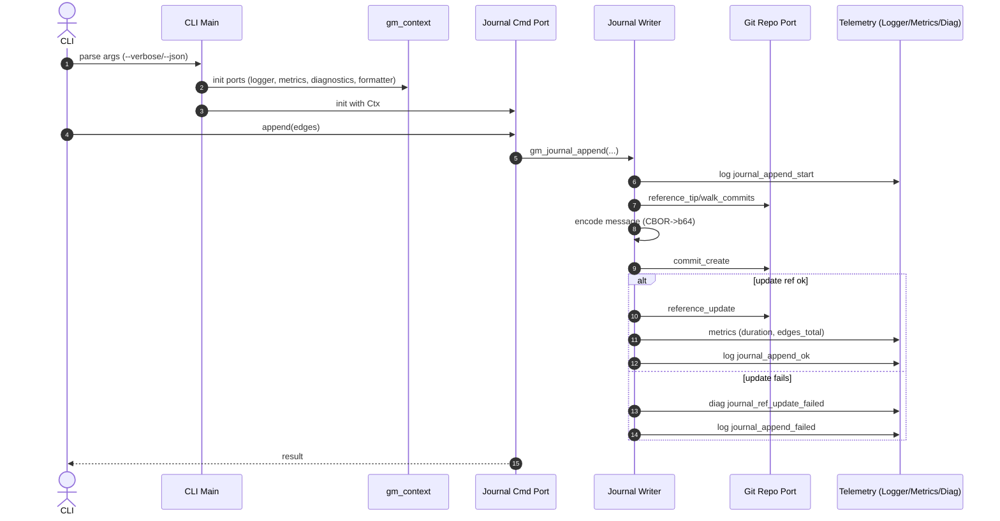
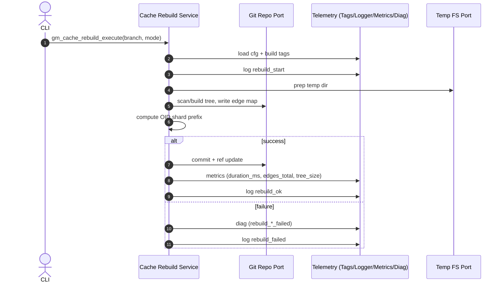
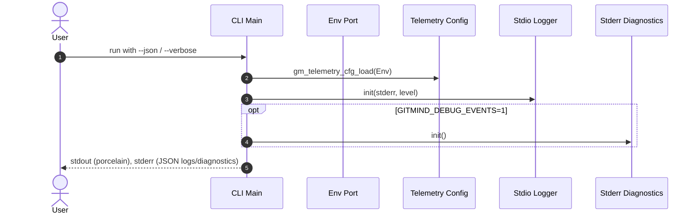

# Code Review Feedback

| Date | Agent | SHA | Branch | PR |
|------|-------|-----|--------|----|
| 2025-10-08 | CodeRabbit (and reviewers) | `e471420251f958e42c7a23f1bc346d128abd6875` | [feat/hex-ports-ci-green](https://github.com/neuroglyph/git-mind/tree/feat/hex-ports-ci-green "neuroglyph/git-mind:feat/hex-ports-ci-green") | [PR#177](https://github.com/neuroglyph/git-mind/pull/177) |

## CODE REVIEW FEEDBACK

### core/src/adapters/logging/stdio_logger_adapter.c:41 — coderabbitai[bot]

```text
_🛠️ Refactor suggestion_ | _🟠 Major_

<details>
<summary>🧩 Analysis chain</summary>

**Verify `gmtime_r` portability.**

The code uses `gmtime_r`, which is POSIX but not C standard. Ensure this is available on all target platforms or provide a fallback.

---

🏁 Script executed:

```shell
#!/bin/bash
# Check if gmtime_r is used elsewhere in the codebase or if there are existing portability abstractions
rg -n "gmtime_r|gmtime_s" --type=c --type=h -C2
```

Length of output: 2559

---

[tasks review_file_3/6 inspect_time_abstraction_1/1]
[observations]
- `wrap_gmtime_r` defined in `core/src/time/time.c`.
- Logging adapter calls raw `gmtime_r`, bypassing time abstraction.
- Time abstraction in `time_ops` maps to `wrap_gmtime_r`, not used in logger.
[analysis]
- Using raw `gmtime_r` risks portability issues on Windows.
- Abstraction exists to centralize portability handling.
[pending]
- Confirm `wrap_gmtime_r` has Windows fallback.
- Recommend logger use `time_ops->gmtime_r`.
[actions]
- Inspect `wrap_gmtime_r` implementation for fallback.
- Suggest using abstraction in logger.
[done] 
<!-- [/scratchpad] -->

---

🏁 Script executed:

```shell
#!/bin/bash
rg -nP -C3 'wrap_gmtime_r' core/src/time/time.c
```

Length of output: 471

---


</details>

**Replace raw `gmtime_r` with `time_ops->gmtime_r` in stdio_logger_adapter.c**  
Leverage the existing time abstraction (wrap_gmtime_r) and handle its `gm_result_tm_ptr_t` return to ensure compatibility on non-POSIX targets.

<!-- This is an auto-generated comment by CodeRabbit -->
```

_Meta_: https://github.com/neuroglyph/git-mind/pull/177#discussion_r2412649574

{response}

### docs/code-reviews/PR177/47a1bf537feb065ef3cbac02a8bf78e75944111c.md:10 — coderabbitai[bot]

```text
_⚠️ Potential issue_ | _🟡 Minor_

**Align title with H1.**

Per the markdown guidelines, the `title` field in front matter must match the H1 heading. Currently, `title: 47a1bf537feb065ef3cbac02a8bf78e75944111c.md` doesn't match `# Code Review Feedback`.


Apply this diff to align them:

```diff
 ---
-title: 47a1bf537feb065ef3cbac02a8bf78e75944111c.md
+title: Code Review Feedback
 description: Preserved review artifacts and rationale.
```

<!-- suggestion_start -->

<details>
<summary>📝 Committable suggestion</summary>

> ‼️ **IMPORTANT**
> Carefully review the code before committing. Ensure that it accurately replaces the highlighted code, contains no missing lines, and has no issues with indentation. Thoroughly test & benchmark the code to ensure it meets the requirements.

```suggestion
---
title: Code Review Feedback
description: Preserved review artifacts and rationale.
audience: [contributors]
domain: [quality]
tags: [review]
status: archive
---

# Code Review Feedback
```

</details>

<!-- suggestion_end -->

<details>
<summary>🤖 Prompt for AI Agents</summary>

```
In docs/code-reviews/PR177/47a1bf537feb065ef3cbac02a8bf78e75944111c.md around
lines 1–10, the front-matter title
("47a1bf537feb065ef3cbac02a8bf78e75944111c.md") does not match the H1 ("Code
Review Feedback"); update the title field in the front matter to exactly "Code
Review Feedback" (match capitalization and spacing) so it matches the H1
heading.
```

</details>

<!-- This is an auto-generated comment by CodeRabbit -->

✅ Addressed in commits e2eb59c to 9c9c521
```

_Meta_: https://github.com/neuroglyph/git-mind/pull/177#discussion_r2412649584

{response}

### docs/planning/Milestones.md:14 — coderabbitai[bot]

```text
_⚠️ Potential issue_ | _🟠 Major_

**Insert SPDX/license block immediately after the front matter**

Per our doc guidelines, every markdown doc needs the SPDX/license notice right after the front matter. Please add it here.  

Use this patch:

```diff
 status: draft
 ---
 
+<!-- SPDX-License-Identifier: LicenseRef-MIND-UCAL-1.0 -->
+<!-- © 2025 J. Kirby Ross / Neuroglyph Collective -->
+
 # Milestones (Placeholder)
```

<!-- suggestion_start -->

<details>
<summary>📝 Committable suggestion</summary>

> ‼️ **IMPORTANT**
> Carefully review the code before committing. Ensure that it accurately replaces the highlighted code, contains no missing lines, and has no issues with indentation. Thoroughly test & benchmark the code to ensure it meets the requirements.

```suggestion
---

<!-- SPDX-License-Identifier: LicenseRef-MIND-UCAL-1.0 -->
<!-- © 2025 J. Kirby Ross / Neuroglyph Collective -->

# Milestones (Placeholder)

## Table of Contents

- Near Term
```

</details>

<!-- suggestion_end -->

<details>
<summary>🤖 Prompt for AI Agents</summary>

```
In docs/planning/Milestones.md around lines 8 to 14, the document is missing the
required SPDX/license notice immediately after the front matter; insert the SPDX
license block (as the project convention uses an HTML comment SPDX line, e.g.
<!-- SPDX-License-Identifier: Apache-2.0 --> and any accompanying copyright or
license attribution required by our doc guidelines) directly below the front
matter header so the license notice appears before the rest of the content.
```

</details>

<!-- fingerprinting:phantom:medusa:sabertoothed -->

<!-- This is an auto-generated comment by CodeRabbit -->
```

_Meta_: https://github.com/neuroglyph/git-mind/pull/177#discussion_r2412649598

{response}

### docs/planning/Product_Roadmap.md:12 — coderabbitai[bot]

```text
_⚠️ Potential issue_ | _🟠 Major_

**Restore the SPDX/license block after the front matter.**

The documentation standards require the SPDX and copyright comments immediately following the front matter. Add the standard block before the H1.  


```diff
 ---
 status: draft
 ---
+
+<!-- SPDX-License-Identifier: LicenseRef-MIND-UCAL-1.0 -->
+<!-- © 2025 J. Kirby Ross / Neuroglyph Collective -->
 
 # Product Roadmap (Placeholder)
```
As per coding guidelines


> Committable suggestion skipped: line range outside the PR's diff.

<details>
<summary>🤖 Prompt for AI Agents</summary>

```
In docs/planning/Product_Roadmap.md around lines 8 to 12, the SPDX/license and
copyright comment block required by documentation standards is missing after the
front matter; insert the standard SPDX/license block (including SPDX identifier
and copyright line) immediately after the front matter and before the H1 "#
Product Roadmap (Placeholder)" so the license header appears directly after the
front matter and above the document title.
```

</details>

<!-- fingerprinting:phantom:medusa:sabertoothed -->

<!-- This is an auto-generated comment by CodeRabbit -->
```

_Meta_: https://github.com/neuroglyph/git-mind/pull/177#discussion_r2412649608

{response}

### docs/planning/Release_Plans.md:14 — coderabbitai[bot]

```text
_⚠️ Potential issue_ | _🟠 Major_

**Add required SPDX/license notice after front matter**

Docs under `docs/**/*.md` must place the SPDX/license block immediately after the front matter. Please add the standard notice so we stay compliant.  

Apply this diff:

```diff
 status: draft
 ---
 
+<!-- SPDX-License-Identifier: LicenseRef-MIND-UCAL-1.0 -->
+<!-- © 2025 J. Kirby Ross / Neuroglyph Collective -->
+
 # Release Plans (Placeholder)
```

<!-- suggestion_start -->

<details>
<summary>📝 Committable suggestion</summary>

> ‼️ **IMPORTANT**
> Carefully review the code before committing. Ensure that it accurately replaces the highlighted code, contains no missing lines, and has no issues with indentation. Thoroughly test & benchmark the code to ensure it meets the requirements.

```suggestion
---

<!-- SPDX-License-Identifier: LicenseRef-MIND-UCAL-1.0 -->
<!-- © 2025 J. Kirby Ross / Neuroglyph Collective -->

# Release Plans (Placeholder)

## Table of Contents

- Cadence
```

</details>

<!-- suggestion_end -->

<details>
<summary>🤖 Prompt for AI Agents</summary>

```
In docs/planning/Release_Plans.md around lines 8-14, the file is missing the
required SPDX/license notice immediately after the front matter; insert the
standard SPDX license block (for example an HTML comment like
SPDX-License-Identifier: <LICENSE-ID>) directly below the closing front-matter
delimiter (---) with a single blank line separation, so the notice appears as
the first content after front matter and complies with docs/**/*.md
requirements.
```

</details>

<!-- fingerprinting:phantom:medusa:sabertoothed -->

<!-- This is an auto-generated comment by CodeRabbit -->
```

_Meta_: https://github.com/neuroglyph/git-mind/pull/177#discussion_r2412649615

{response}

### docs/planning/Sprint_Plans.md:12 — coderabbitai[bot]

```text
_⚠️ Potential issue_ | _🟠 Major_

**Insert SPDX/license comments after front matter.**

Per the documentation guidelines, every Markdown page must include the SPDX/license comment block right after the front matter. Please add the standard comments before the H1.  


```diff
 ---
 status: draft
 ---
+
+<!-- SPDX-License-Identifier: LicenseRef-MIND-UCAL-1.0 -->
+<!-- © 2025 J. Kirby Ross / Neuroglyph Collective -->
 
 # Sprint Plans (Placeholder)
```
As per coding guidelines

<!-- suggestion_start -->

<details>
<summary>📝 Committable suggestion</summary>

> ‼️ **IMPORTANT**
> Carefully review the code before committing. Ensure that it accurately replaces the highlighted code, contains no missing lines, and has no issues with indentation. Thoroughly test & benchmark the code to ensure it meets the requirements.

```suggestion
---
status: draft
---

<!-- SPDX-License-Identifier: LicenseRef-MIND-UCAL-1.0 -->
<!-- © 2025 J. Kirby Ross / Neuroglyph Collective -->

# Sprint Plans (Placeholder)

## Table of Contents
```

</details>

<!-- suggestion_end -->

<details>
<summary>🤖 Prompt for AI Agents</summary>

```
In docs/planning/Sprint_Plans.md around lines 8 to 12, the file is missing the
required SPDX/license comment block after the front matter and before the H1;
add the standard SPDX/license comment block (e.g., SPDX-License-Identifier and
copyright/license owner lines used across the repo) immediately after the
YAML/front-matter section and before the "# Sprint Plans (Placeholder)" heading
so the document conforms to the documentation guidelines.
```

</details>

<!-- fingerprinting:phantom:medusa:sabertoothed -->

<!-- This is an auto-generated comment by CodeRabbit -->
```

_Meta_: https://github.com/neuroglyph/git-mind/pull/177#discussion_r2412649624

{response}

### docs/PRDs/PRD-co-thought-mcp-service.md:18 — coderabbitai[bot]

```text
_⚠️ Potential issue_ | _🟠 Major_

**Add required SPDX/License comment after front matter.**

Docs under `docs/` must place the SPDX/License comment immediately after the front matter. Please insert it between the front matter and the H1 heading to comply with our documentation policy.  [As per coding guidelines]

<details>
<summary>🤖 Prompt for AI Agents</summary>

```
In docs/PRDs/PRD-co-thought-mcp-service.md around lines 9 to 18, the file is
missing the required SPDX/License comment immediately after the front matter;
insert the SPDX short-form license comment (e.g. <!-- SPDX-License-Identifier:
Apache-2.0 --> or the project's approved identifier) directly between the
closing front-matter block and the H1 heading so the license line appears as the
first content after front matter and before "# PRD — Co‑Thought MCP Service".
```

</details>

<!-- fingerprinting:phantom:triton:sabertoothed -->

<!-- This is an auto-generated comment by CodeRabbit -->
```

_Meta_: https://github.com/neuroglyph/git-mind/pull/177#discussion_r2412649633

{response}

### docs/PRDs/PRD-git-mind-semantics-time-travel-prototype.md:13 — coderabbitai[bot]

```text
_⚠️ Potential issue_ | _🟠 Major_

**Add the required license/SPDX comment after the front matter.**

Docs must place the License/SPDX comment immediately after the front matter, but nothing is present here. Please add it to stay compliant.  As per coding guidelines.

```diff
 ---
 
+# <!-- SPDX-License-Identifier: Apache-2.0 -->
+
 # PRD — First-Class Semantics (Time-Travel Prototype)
```

<!-- suggestion_start -->

<details>
<summary>📝 Committable suggestion</summary>

> ‼️ **IMPORTANT**
> Carefully review the code before committing. Ensure that it accurately replaces the highlighted code, contains no missing lines, and has no issues with indentation. Thoroughly test & benchmark the code to ensure it meets the requirements.

```suggestion
---
<!-- SPDX-License-Identifier: Apache-2.0 -->

# PRD — First-Class Semantics (Time-Travel Prototype)

## Table of Contents
```

</details>

<!-- suggestion_end -->

<details>
<summary>🤖 Prompt for AI Agents</summary>

```
In docs/PRDs/PRD-git-mind-semantics-time-travel-prototype.md around lines 8-13
the required license/SPDX comment is missing after the front matter; add the
project's standard SPDX license comment immediately after the closing
front-matter marker (on the next line) so the file includes the correct
SPDX-License-Identifier comment consistent with the repo's licensing policy.
```

</details>

<!-- fingerprinting:phantom:triton:sabertoothed -->

<!-- This is an auto-generated comment by CodeRabbit -->
```

_Meta_: https://github.com/neuroglyph/git-mind/pull/177#discussion_r2412649638

{response}

### docs/specs/Technical_Specifications.md:14 — coderabbitai[bot]

```text
_⚠️ Potential issue_ | _🟠 Major_

**Restore the SPDX/license comment after the front matter**

We require the SPDX/license notice immediately following the front matter in every doc. Please add it back so the spec placeholder stays compliant.  

Suggested change:

```diff
 status: draft
 ---
 
+<!-- SPDX-License-Identifier: LicenseRef-MIND-UCAL-1.0 -->
+<!-- © 2025 J. Kirby Ross / Neuroglyph Collective -->
+
 # Technical Specifications (Placeholder)
```

<!-- suggestion_start -->

<details>
<summary>📝 Committable suggestion</summary>

> ‼️ **IMPORTANT**
> Carefully review the code before committing. Ensure that it accurately replaces the highlighted code, contains no missing lines, and has no issues with indentation. Thoroughly test & benchmark the code to ensure it meets the requirements.

```suggestion
status: draft
---

<!-- SPDX-License-Identifier: LicenseRef-MIND-UCAL-1.0 -->
<!-- © 2025 J. Kirby Ross / Neuroglyph Collective -->

# Technical Specifications (Placeholder)

## Table of Contents

- Overview
```

</details>

<!-- suggestion_end -->

<details>
<summary>🤖 Prompt for AI Agents</summary>

```
In docs/specs/Technical_Specifications.md around lines 8 to 14, the SPDX/license
notice was removed after the front matter; restore the required SPDX/license
comment immediately following the front matter (e.g. add the SPDX identifier
line such as "SPDX-License-Identifier: <license>" right after the front-matter
separator) so the document is compliant with project licensing conventions.
```

</details>

<!-- fingerprinting:phantom:medusa:sabertoothed -->

<!-- This is an auto-generated comment by CodeRabbit -->
```

_Meta_: https://github.com/neuroglyph/git-mind/pull/177#discussion_r2412649645

{response}

### docs/wish-list-features/README.md:10 — coderabbitai[bot]

```text
_⚠️ Potential issue_ | _🟠 Major_

**Add required SPDX comment after front matter.**

Docs must place the license/SPDX comment block immediately after the front matter; this placeholder currently omits it. Please add the repository-standard SPDX and copyright comments beneath the `---` block.  


```diff
 ---
 status: draft
 ---
+
+<!-- SPDX-License-Identifier: LicenseRef-MIND-UCAL-1.0 -->
+<!-- © 2025 J. Kirby Ross / Neuroglyph Collective -->
 
 # Wish List Features (Placeholder)
```
As per coding guidelines

<!-- suggestion_start -->

<details>
<summary>📝 Committable suggestion</summary>

> ‼️ **IMPORTANT**
> Carefully review the code before committing. Ensure that it accurately replaces the highlighted code, contains no missing lines, and has no issues with indentation. Thoroughly test & benchmark the code to ensure it meets the requirements.

```suggestion
---
status: draft
---
<!-- SPDX-License-Identifier: LicenseRef-MIND-UCAL-1.0 -->
<!-- © 2025 J. Kirby Ross / Neuroglyph Collective -->

# Wish List Features (Placeholder)
```

</details>

<!-- suggestion_end -->

<details>
<summary>🤖 Prompt for AI Agents</summary>

```
In docs/wish-list-features/README.md around lines 8 to 10, the front matter
separator (“---”) is present but the required repository-standard SPDX and
copyright comment block is missing immediately after it; insert the standard
SPDX license comment block (matching repository conventions) directly beneath
the `---` line, including SPDX identifier and copyright owner/year, ensuring
there are no blank lines between the front matter separator and the comment
block.
```

</details>

<!-- fingerprinting:phantom:medusa:sabertoothed -->

<!-- This is an auto-generated comment by CodeRabbit -->
```

_Meta_: https://github.com/neuroglyph/git-mind/pull/177#discussion_r2412649654

{response}

### migration-progress.md:5 — coderabbitai[bot]

```text
_⚠️ Potential issue_ | _🟡 Minor_

**Add required front matter.**

Per the markdown guidelines, documentation files must have front matter at the beginning. This migration tracking document is missing it.


Add front matter before line 1:

```diff
+---
+title: Hexagonal Architecture Migration Progress
+description: Single source of truth for tracking hexagonal architecture migration
+audience: [contributors]
+domain: [architecture]
+tags: [migration, hexagonal]
+status: active
+---
+
 # Hexagonal Architecture Migration Progress
```

<!-- suggestion_start -->

<details>
<summary>📝 Committable suggestion</summary>

> ‼️ **IMPORTANT**
> Carefully review the code before committing. Ensure that it accurately replaces the highlighted code, contains no missing lines, and has no issues with indentation. Thoroughly test & benchmark the code to ensure it meets the requirements.

```suggestion
---
title: Hexagonal Architecture Migration Progress
description: Single source of truth for tracking hexagonal architecture migration
audience: [contributors]
domain: [architecture]
tags: [migration, hexagonal]
status: active
---

# Hexagonal Architecture Migration Progress

Started: 2025-10-08

This file is the single source of truth for tracking the end-to-end migration of the C library to a strict hexagonal architecture, per AGENTS.md. Update this checklist as work proceeds. Check off items with `[x]` only after they are complete and validated (CI green, zero new clang-tidy warnings, and docs updated).
```

</details>

<!-- suggestion_end -->

<details>
<summary>🤖 Prompt for AI Agents</summary>

```
In migration-progress.md around lines 1 to 5, the document is missing required
front matter; add a YAML front matter block at the very top (before line 1)
including at minimum a title, date (2025-10-08), and a short description (and
optionally tags/layout) so the file conforms to the markdown guidelines and site
generator expectations; ensure the block is delimited with triple dashes and the
rest of the content follows after the closing dashes.
```

</details>

<!-- This is an auto-generated comment by CodeRabbit -->
```

_Meta_: https://github.com/neuroglyph/git-mind/pull/177#discussion_r2412649659

{response}

### docs/code-reviews/PR177/3b7ce522e107011f8f92dc629facfa5b6a3595fb.md:18 — coderabbitai[bot]

```text
_⚠️ Potential issue_ | _🔴 Critical_

<details>
<summary>🧩 Analysis chain</summary>

**Doc header must match guidelines.**

The doc front matter and header block miss multiple required conventions: the `title` must exactly match the H1 (“Code Review Feedback”), the SPDX/license comment block must appear immediately after the front matter, and the file needs a `## Table of Contents` section. Please align this file with the docs/**/*.md rules.  
   
Add front matter fixes and license block quickly with this patch scaffold:

```diff
---
-title: 3b7ce522e107011f8f92dc629facfa5b6a3595fb.md
+title: Code Review Feedback
 description: Preserved review artifacts and rationale.
 audience: [contributors]
 domain: [quality]
 tags: [review]
 status: archive
 ---
+<!-- SPDX-License-Identifier: LicenseRef-MIND-UCAL-1.0 -->
+<!-- © 2025 J. Kirby Ross / Neuroglyph Collective -->
 
 # Code Review Feedback
+
+## Table of Contents
```

Confirm any additional required sections follow afterward. As per coding guidelines.

---

🏁 Script executed:

```shell
#!/bin/bash
# List docs directory contents
find docs -maxdepth 2 -type f

# Search for SPDX license convention in docs
rg -n "SPDX-License-Identifier" -g "docs/**/*.md"

# Search for Table of Contents guideline in docs
rg -n "## Table of Contents" -g "docs/**/*.md"

# Search for files mentioning 'guideline'
rg -l "guideline" -g "docs/**/*.md"
```

Length of output: 14870

---

🏁 Script executed:

```shell
#!/bin/bash
# Show front matter of the review artifact
sed -n '1,30p' docs/code-reviews/PR177/3b7ce522e107011f8f92dc629facfa5b6a3595fb.md

# Show template conventions
echo "---- TEMPLATE START ----"
sed -n '1,50p' docs/templates/code-review-feedback.md
echo "---- TEMPLATE END ----"
```

Length of output: 2224

---

🏁 Script executed:

```shell
#!/bin/bash
# Search for front matter guidelines
rg -n "front matter" -g "docs/quality/Markdown_Style_Guide.md"

# Search for SPDX guidelines
rg -n "SPDX" -g "docs/quality/Markdown_Style_Guide.md"

# Search for Table of Contents in style guide
rg -n "Table of Contents" -g "docs/quality/Markdown_Style_Guide.md"
```

Length of output: 57

---


</details>

**Doc header must match guidelines.**  
Front matter `title` must be “Code Review Feedback” (matching the H1), insert the SPDX/license comment immediately after the front matter, and add a `## Table of Contents` section beneath the H1.  

```diff
---
-title: 3b7ce522e107011f8f92dc629facfa5b6a3595fb.md
+title: Code Review Feedback
 description: Preserved review artifacts and rationale.
 audience: [contributors]
 domain: [quality]
 tags: [review]
 status: archive
---
+<!-- SPDX-License-Identifier: LicenseRef-MIND-UCAL-1.0 -->
+<!-- © 2025 J. Kirby Ross / Neuroglyph Collective -->
 
 # Code Review Feedback
 
+## Table of Contents
```

<!-- suggestion_start -->

<details>
<summary>📝 Committable suggestion</summary>

> ‼️ **IMPORTANT**
> Carefully review the code before committing. Ensure that it accurately replaces the highlighted code, contains no missing lines, and has no issues with indentation. Thoroughly test & benchmark the code to ensure it meets the requirements.

```suggestion
---
title: Code Review Feedback
 description: Preserved review artifacts and rationale.
 audience: [contributors]
 domain: [quality]
 tags: [review]
 status: archive
<!-- SPDX-License-Identifier: LicenseRef-MIND-UCAL-1.0 -->
<!-- © 2025 J. Kirby Ross / Neuroglyph Collective -->

 # Code Review Feedback

## Table of Contents
```

</details>

<!-- suggestion_end -->

<details>
<summary>🤖 Prompt for AI Agents</summary>

```
In docs/code-reviews/PR177/3b7ce522e107011f8f92dc629facfa5b6a3595fb.md around
lines 1 to 18, the front matter and document structure do not follow project
guidelines: change the YAML front-matter title value to "Code Review Feedback",
insert the SPDX/license comment immediately after the closing front-matter
block, and add a "## Table of Contents" section directly beneath the H1 heading;
ensure spacing and ordering match other review artifacts.
```

</details>

<!-- fingerprinting:phantom:triton:sabertoothed -->

<!-- This is an auto-generated comment by CodeRabbit -->
```

_Meta_: https://github.com/neuroglyph/git-mind/pull/177#discussion_r2412749770

{response}

### core/include/gitmind/ports/cache_query_port.h:77 — coderabbitai[bot]

```text
_🛠️ Refactor suggestion_ | _🟠 Major_

<details>
<summary>🧩 Analysis chain</summary>

**Clarify stats output parameter behavior on error and verify implementation.**

The `stats` function documentation mentions returning `GM_ERR_NOT_FOUND` on a missing branch, but does not explicitly state what happens to the output parameters (`edge_count` and `cache_size_bytes`) on error. Per coding guidelines, output buffers should be zeroed on error paths.


1. Update the documentation to clarify that `edge_count` and `cache_size_bytes` are set to zero on error.
2. Verify that the implementation in `core/src/ports/cache/cache_query_port.c` properly zeros these outputs before returning an error.

---

🏁 Script executed:

```shell
#!/bin/bash
# Description: Verify that stats implementation zeros output parameters on error paths.

# Search for the stats implementation and check error handling
ast-grep --pattern $'gm_result_void_t $_(gm_qry_cache_port_t *$_, const char *$_, uint64_t *$_, uint64_t *$_) {
  $$$
}'
```

Length of output: 0

---

🏁 Script executed:

```shell
#!/bin/bash
rg -nP 'gm_result_void_t\s+stats\s*\(' -C3 core/src/ports/cache/*.c
```

Length of output: 0

---

🏁 Script executed:

```shell
rg -nP '\.stats\s*=' -C3 core/src
```

Length of output: 514

---

🏁 Script executed:

```shell
#!/bin/bash
rg -nP 'gm_result_void_t\s+stats_impl' -C50 core/src/ports/cache/cache_query_port.c
```

Length of output: 3961

---


</details>

**Zero outputs on error in stats_impl and update docs.** The `stats_impl` function (core/src/ports/cache/cache_query_port.c:50–63) never clears `*edge_count` or `*cache_size_bytes` on error; add `*edge_count = 0; *cache_size_bytes = 0;` before each `gm_err_void` return and update the doc comment in `cache_query_port.h` to state that outputs are zeroed on failure.

<details>
<summary>🤖 Prompt for AI Agents</summary>

```
In core/src/ports/cache/cache_query_port.c around lines 50–63 and
core/include/gitmind/ports/cache_query_port.h lines 61–76, the stats_impl
implementation fails to clear output parameters on error; before every
gm_err_void return in stats_impl set *edge_count = 0; *cache_size_bytes = 0; to
ensure callers get zeroed outputs on failure, and update the doc comment in
cache_query_port.h to explicitly state that on failure (e.g., non-existent
branch or other errors) both edge_count and cache_size_bytes are set to 0.
```

</details>

<!-- This is an auto-generated comment by CodeRabbit -->
```

_Meta_: https://github.com/neuroglyph/git-mind/pull/177#discussion_r2412822288

{response}

### docs/architecture/journal-architecture.md:9 — coderabbitai[bot]

```text
_🛠️ Refactor suggestion_ | _🟠 Major_

**Add the SPDX notice after the front matter**

The documentation standard requires an SPDX/license comment immediately following the YAML header.  


```diff
 ---
 title: Project: No Tux Given 🐧⚡
 description: Edge-journal commits with branch-aware graphs; the final architecture for storing semantics in Git.
 audience: [developers]
 domain: [architecture]
 tags: [journal, cbor, refs]
 status: stable
 last_updated: 2025-09-15
 ---
+<!-- SPDX-License-Identifier: Apache-2.0 -->
```

<!-- suggestion_start -->

<details>
<summary>📝 Committable suggestion</summary>

> ‼️ **IMPORTANT**
> Carefully review the code before committing. Ensure that it accurately replaces the highlighted code, contains no missing lines, and has no issues with indentation. Thoroughly test & benchmark the code to ensure it meets the requirements.

```suggestion
---
title: Project: No Tux Given 🐧⚡
description: Edge-journal commits with branch-aware graphs; the final architecture for storing semantics in Git.
audience: [developers]
domain: [architecture]
tags: [journal, cbor, refs]
status: stable
last_updated: 2025-09-15
---
<!-- SPDX-License-Identifier: Apache-2.0 -->
```

</details>

<!-- suggestion_end -->

<details>
<summary>🤖 Prompt for AI Agents</summary>

```
In docs/architecture/journal-architecture.md around lines 1 to 9, the YAML front
matter is present but missing the required SPDX/license comment immediately
after it; add a single-line SPDX identifier (e.g., "SPDX-License-Identifier:
Apache-2.0" or the project's chosen SPDX tag) on the line immediately following
the closing --- of the front matter so the file begins with the YAML block and
the SPDX notice directly after it.
```

</details>

<!-- fingerprinting:phantom:medusa:sabertoothed -->

<!-- This is an auto-generated comment by CodeRabbit -->
```

_Meta_: https://github.com/neuroglyph/git-mind/pull/177#discussion_r2412822301

{response}

### docs/architecture/journal-architecture.md:28 — coderabbitai[bot]

```text
_🛠️ Refactor suggestion_ | _🟠 Major_

**Use the mandated H2 heading for the Table of Contents**

Please change the “Table of Contents” label to a `## Table of Contents` heading to satisfy the docs guideline.  


```diff
-Table of Contents
+## Table of Contents
```

<!-- suggestion_start -->

<details>
<summary>📝 Committable suggestion</summary>

> ‼️ **IMPORTANT**
> Carefully review the code before committing. Ensure that it accurately replaces the highlighted code, contains no missing lines, and has no issues with indentation. Thoroughly test & benchmark the code to ensure it meets the requirements.

```suggestion
## Table of Contents

- [Executive Summary](#executive-summary)
- [Core Design Principles](#core-design-principles)
- [The Two-Layer Architecture](#the-two-layer-architecture)
- [Implementation Details](#implementation-details)
- [Solving the Hard Problems](#solving-the-hard-problems)
- [Migration Plan (Fresh Start)](#migration-plan-fresh-start)
- [Code Structure](#code-structure)
- [Why This Wins](#why-this-wins)
- [Potential Gotchas & Solutions](#potential-gotchas--solutions)
- [The Payoff](#the-payoff)
- [Next Steps](#next-steps)
```

</details>

<!-- suggestion_end -->

<details>
<summary>🤖 Prompt for AI Agents</summary>

```
In docs/architecture/journal-architecture.md around lines 15 to 28 the plain
text "Table of Contents" needs to be converted into a level-2 Markdown heading;
replace the current label with "## Table of Contents" (i.e., prepend "## " and
ensure it's on its own line) so the document follows the mandated H2 heading
guideline for the table of contents.
```

</details>

<!-- fingerprinting:phantom:medusa:sabertoothed -->

<!-- This is an auto-generated comment by CodeRabbit -->
```

_Meta_: https://github.com/neuroglyph/git-mind/pull/177#discussion_r2412822303

{response}

### docs/architecture/ref-name-validation.md:9 — coderabbitai[bot]

```text
_🛠️ Refactor suggestion_ | _🟠 Major_

**Add the required SPDX comment after front matter**

Docs must include the license/SPDX comment immediately after the YAML front matter. Please add it here to satisfy the doc guidelines.  


```diff
 ---
 title: Ref Name Validation
 description: Building refs safely with Git-style branch shorthands.
 audience: [contributors, developers]
 domain: [architecture]
 tags: [git, refs]
 status: stable
 last_updated: 2025-09-30
 ---
+<!-- SPDX-License-Identifier: Apache-2.0 -->
```

<!-- suggestion_start -->

<details>
<summary>📝 Committable suggestion</summary>

> ‼️ **IMPORTANT**
> Carefully review the code before committing. Ensure that it accurately replaces the highlighted code, contains no missing lines, and has no issues with indentation. Thoroughly test & benchmark the code to ensure it meets the requirements.

```suggestion
---
title: Ref Name Validation
description: Building refs safely with Git-style branch shorthands.
audience: [contributors, developers]
domain: [architecture]
tags: [git, refs]
status: stable
last_updated: 2025-09-30
---
<!-- SPDX-License-Identifier: Apache-2.0 -->
```

</details>

<!-- suggestion_end -->

<details>
<summary>🤖 Prompt for AI Agents</summary>

```
In docs/architecture/ref-name-validation.md around lines 1 to 9, the YAML front
matter is present but the required SPDX license comment is missing immediately
after the front matter; add the SPDX identifier comment line (e.g., "//
SPDX-License-Identifier: <LICENSE-ID>" or the project’s canonical SPDX comment
format) directly below the closing "---" of the front matter so the file
contains the license/SPDX comment immediately after the YAML block per doc
guidelines.
```

</details>

<!-- fingerprinting:phantom:medusa:sabertoothed -->

<!-- This is an auto-generated comment by CodeRabbit -->
```

_Meta_: https://github.com/neuroglyph/git-mind/pull/177#discussion_r2412822314

{response}

### docs/architecture/system-overview.md:9 — coderabbitai[bot]

```text
_🛠️ Refactor suggestion_ | _🟠 Major_

**Insert SPDX notice after the front matter**

Per the docs guidelines, place the SPDX/license comment immediately after the YAML header.  


```diff
 ---
 title: System Architecture
 description: High-level view of git-mind components and interactions.
 audience: [developers]
 domain: [architecture]
 tags: [system, overview]
 status: draft
 last_updated: 2025-09-15
 ---
+<!-- SPDX-License-Identifier: Apache-2.0 -->
```

<!-- suggestion_start -->

<details>
<summary>📝 Committable suggestion</summary>

> ‼️ **IMPORTANT**
> Carefully review the code before committing. Ensure that it accurately replaces the highlighted code, contains no missing lines, and has no issues with indentation. Thoroughly test & benchmark the code to ensure it meets the requirements.

```suggestion
---
title: System Architecture
description: High-level view of git-mind components and interactions.
audience: [developers]
domain: [architecture]
tags: [system, overview]
status: draft
last_updated: 2025-09-15
---
<!-- SPDX-License-Identifier: Apache-2.0 -->
```

</details>

<!-- suggestion_end -->

<details>
<summary>🤖 Prompt for AI Agents</summary>

```
In docs/architecture/system-overview.md around lines 1–9 the YAML front matter
is present but missing the required SPDX/license notice; add the SPDX license
comment immediately after the closing --- of the front matter by inserting the
project's SPDX identifier as a comment (e.g. an HTML or Markdown comment
containing "SPDX-License-Identifier: <identifier>") directly after the header
end so the notice is the first thing after the YAML block.
```

</details>

<!-- fingerprinting:phantom:medusa:sabertoothed -->

<!-- This is an auto-generated comment by CodeRabbit -->
```

_Meta_: https://github.com/neuroglyph/git-mind/pull/177#discussion_r2412822322

{response}

### docs/architecture/system-overview.md:20 — coderabbitai[bot]

```text
_🛠️ Refactor suggestion_ | _🟠 Major_

**Promote “Table of Contents” to an H2 heading**

Docs must include a `## Table of Contents` section. Please update the heading accordingly.  


```diff
-Table of Contents
+## Table of Contents
```

<!-- suggestion_start -->

<details>
<summary>📝 Committable suggestion</summary>

> ‼️ **IMPORTANT**
> Carefully review the code before committing. Ensure that it accurately replaces the highlighted code, contains no missing lines, and has no issues with indentation. Thoroughly test & benchmark the code to ensure it meets the requirements.

```suggestion
## Table of Contents

- [Executive Summary](#executive-summary)
- [High-Level Design](#high-level-design)
- [Components and Technology Stack](#components-and-technology-stack)
- [Data Flows and Storage](#data-flows-and-storage)
- [Scaling Strategy and Performance Targets](#scaling-strategy-and-performance-targets)
```

</details>

<!-- suggestion_end -->

<details>
<summary>🤖 Prompt for AI Agents</summary>

```
In docs/architecture/system-overview.md around lines 13 to 20, the "Table of
Contents" text is plain text but should be an H2 heading; change the line to use
Markdown H2 syntax ("## Table of Contents") so the docs include the required
section header and render correctly in the table of contents.
```

</details>

<!-- fingerprinting:phantom:medusa:sabertoothed -->

<!-- This is an auto-generated comment by CodeRabbit -->
```

_Meta_: https://github.com/neuroglyph/git-mind/pull/177#discussion_r2412822329

{response}

### docs/code-reviews/PR177/0d1b34b0ee501bc7b7b2d0a9fb82e06a37642c77.md:10 — coderabbitai[bot]

```text
_⚠️ Potential issue_ | _🟡 Minor_

**Doc header must match guidelines.**

The front matter title must be "Code Review Feedback" (matching the H1), the SPDX/license comment must appear immediately after the front matter, and a "## Table of Contents" section must follow the H1.


Apply this diff:

```diff
 ---
-title: 0d1b34b0ee501bc7b7b2d0a9fb82e06a37642c77.md
+title: Code Review Feedback
 description: Preserved review artifacts and rationale.
 audience: [contributors]
 domain: [quality]
 tags: [review]
 status: archive
 ---
+<!-- SPDX-License-Identifier: LicenseRef-MIND-UCAL-1.0 -->
+<!-- © 2025 J. Kirby Ross / Neuroglyph Collective -->
 
 # Code Review Feedback
+
+## Table of Contents
```

As per coding guidelines.

<!-- suggestion_start -->

<details>
<summary>📝 Committable suggestion</summary>

> ‼️ **IMPORTANT**
> Carefully review the code before committing. Ensure that it accurately replaces the highlighted code, contains no missing lines, and has no issues with indentation. Thoroughly test & benchmark the code to ensure it meets the requirements.

```suggestion
---
title: Code Review Feedback
description: Preserved review artifacts and rationale.
audience: [contributors]
domain: [quality]
tags: [review]
status: archive
---
<!-- SPDX-License-Identifier: LicenseRef-MIND-UCAL-1.0 -->
<!-- © 2025 J. Kirby Ross / Neuroglyph Collective -->

# Code Review Feedback

## Table of Contents
```

</details>

<!-- suggestion_end -->

<!-- This is an auto-generated comment by CodeRabbit -->
```

_Meta_: https://github.com/neuroglyph/git-mind/pull/177#discussion_r2412822333

{response}

### docs/code-reviews/PR177/9f49dd2ad65837735ac218c3d159b36f8b840819.md:18 — coderabbitai[bot]

```text
_⚠️ Potential issue_ | _🟠 Major_

**Align front matter with doc standards.**

Please update the front matter `title` to match the H1, insert the required SPDX/license comments immediately after the front matter, and add the mandatory `## Table of Contents` section. These steps are required for every `docs/**/*.md` file. As per coding guidelines

```diff
 ---
-title: 9f49dd2ad65837735ac218c3d159b36f8b840819.md
+title: Code Review Feedback
 description: Preserved review artifacts and rationale.
 audience: [contributors]
 domain: [quality]
 tags: [review]
 status: archive
 ---
+
+<!-- SPDX-License-Identifier: LicenseRef-MIND-UCAL-1.0 -->
+<!-- © 2025 J. Kirby Ross / Neuroglyph Collective -->
 
 # Code Review Feedback
+
+## Table of Contents
+
+- [Code Review Feedback](#code-review-feedback)
+- [CODE REVIEW FEEDBACK](#code-review-feedback-1)
```

<!-- suggestion_start -->

<details>
<summary>📝 Committable suggestion</summary>

> ‼️ **IMPORTANT**
> Carefully review the code before committing. Ensure that it accurately replaces the highlighted code, contains no missing lines, and has no issues with indentation. Thoroughly test & benchmark the code to ensure it meets the requirements.

```suggestion
---
title: Code Review Feedback
description: Preserved review artifacts and rationale.
audience: [contributors]
domain: [quality]
tags: [review]
status: archive
---

<!-- SPDX-License-Identifier: LicenseRef-MIND-UCAL-1.0 -->
<!-- © 2025 J. Kirby Ross / Neuroglyph Collective -->

# Code Review Feedback

## Table of Contents

- [Code Review Feedback](#code-review-feedback)
- [CODE REVIEW FEEDBACK](#code-review-feedback-1)

| Date | Agent | SHA | Branch | PR |
|------|-------|-----|--------|----|
| 2025-10-08 | CodeRabbit (and reviewers) | `9f49dd2ad65837735ac218c3d159b36f8b840819` | [feat/hex-ports-ci-green](https://github.com/neuroglyph/git-mind/tree/feat/hex-ports-ci-green "neuroglyph/git-mind:feat/hex-ports-ci-green") | [PR#177](https://github.com/neuroglyph/git-mind/pull/177) |

## CODE REVIEW FEEDBACK

### core/src/adapters/logging/stdio_logger_adapter.c:41 — coderabbitai[bot]
```

</details>

<!-- suggestion_end -->

<details>
<summary>🤖 Prompt for AI Agents</summary>

```
In docs/code-reviews/PR177/9f49dd2ad65837735ac218c3d159b36f8b840819.md lines
1-18, the front matter title doesn't match the H1 and the required SPDX/license
comment and Table of Contents section are missing; update the front matter title
to exactly match the H1, add the required SPDX/license comment block immediately
after the front matter, and insert a mandatory "## Table of Contents" heading
(with any needed anchors/placeholder entries) below the SPDX/license block so
the file conforms to docs/**/*.md standards.
```

</details>

<!-- fingerprinting:phantom:triton:sabertoothed -->

<!-- This is an auto-generated comment by CodeRabbit -->
```

_Meta_: https://github.com/neuroglyph/git-mind/pull/177#discussion_r2412828968

{response}

### docs/code-reviews/PR177/e9a58433621fc5d60552af3685c2a4cd68ece5e0.md:16 — coderabbitai[bot]

```text
_⚠️ Potential issue_ | _🟠 Major_

**Doc header must match guidelines.**  
Please align with the docs rules: set the front-matter `title` to match the H1, insert the required SPDX/license block immediately after the front matter, and add the mandated `## Table of Contents` section beneath the H1.  
 As per coding guidelines

```diff
 ---
-title: e9a58433621fc5d60552af3685c2a4cd68ece5e0.md
+title: Code Review Feedback
 description: Preserved review artifacts and rationale.
 audience: [contributors]
 domain: [quality]
 tags: [review]
 status: archive
 ---
+<!-- SPDX-License-Identifier: LicenseRef-MIND-UCAL-1.0 -->
+<!-- © 2025 J. Kirby Ross / Neuroglyph Collective -->
 
 # Code Review Feedback
+
+## Table of Contents
+
+- [Code Review Feedback](#code-review-feedback)
+- [CODE REVIEW FEEDBACK](#code-review-feedback-1)
```

<!-- suggestion_start -->

<details>
<summary>📝 Committable suggestion</summary>

> ‼️ **IMPORTANT**
> Carefully review the code before committing. Ensure that it accurately replaces the highlighted code, contains no missing lines, and has no issues with indentation. Thoroughly test & benchmark the code to ensure it meets the requirements.

```suggestion
---
title: Code Review Feedback
description: Preserved review artifacts and rationale.
audience: [contributors]
domain: [quality]
tags: [review]
status: archive
---
<!-- SPDX-License-Identifier: LicenseRef-MIND-UCAL-1.0 -->
<!-- © 2025 J. Kirby Ross / Neuroglyph Collective -->

# Code Review Feedback

## Table of Contents

- [Code Review Feedback](#code-review-feedback)
- [CODE REVIEW FEEDBACK](#code-review-feedback-1)

| Date | Agent | SHA | Branch | PR |
|------|-------|-----|--------|----|
| 2025-10-08 | CodeRabbit (and reviewers) | `e9a58433621fc5d60552af3685c2a4cd68ece5e0` | [feat/hex-ports-ci-green](https://github.com/neuroglyph/git-mind/tree/feat/hex-ports-ci-green "neuroglyph/git-mind:feat/hex-ports-ci-green") | [PR#177](https://github.com/neuroglyph/git-mind/pull/177) |

## CODE REVIEW FEEDBACK
```

</details>

<!-- suggestion_end -->

<!-- fingerprinting:phantom:triton:sabertoothed -->

<!-- This is an auto-generated comment by CodeRabbit -->
```

_Meta_: https://github.com/neuroglyph/git-mind/pull/177#discussion_r2412841494

{response}

### core/src/app/cache/cache_rebuild_service.c:569 — coderabbitai[bot]

```text
_⚠️ Potential issue_ | _🟠 Major_

**Honor gm_telemetry_* return values to avoid leaked errors.**

Both gm_telemetry_cfg_load and gm_telemetry_build_tags return gm_result_void_t, yet we drop them on the floor. If either surfaces an error, the gm_error_t leaks and we proceed with possibly uninitialized config/tag buffers. Please capture the results, free any error payloads, and decide whether to continue (with defaults) or abort.

As per coding guidelines

```diff
-    gm_telemetry_cfg_t tcfg = {0};
-    (void)gm_telemetry_cfg_load(&tcfg, gm_env_port_system());
+    gm_telemetry_cfg_t tcfg = {0};
+    gm_result_void_t cfg_rc =
+        gm_telemetry_cfg_load(&tcfg, gm_env_port_system());
+    if (!cfg_rc.ok) {
+        if (cfg_rc.u.err != NULL) {
+            gm_error_free(cfg_rc.u.err);
+        }
+        /* Defaults in tcfg stay zeroed; continue without telemetry tweaks. */
+    }
@@
-    (void)gm_telemetry_build_tags(&tcfg, branch, mode, repo_canon, &repo_id,
-                                  tags, sizeof(tags));
+    gm_result_void_t tags_rc = gm_telemetry_build_tags(
+        &tcfg, branch, mode, repo_canon, &repo_id, tags, sizeof(tags));
+    if (!tags_rc.ok) {
+        if (tags_rc.u.err != NULL) {
+            gm_error_free(tags_rc.u.err);
+        }
+        tags[0] = '\0';
+    }
```

<!-- suggestion_start -->

<details>
<summary>📝 Committable suggestion</summary>

> ‼️ **IMPORTANT**
> Carefully review the code before committing. Ensure that it accurately replaces the highlighted code, contains no missing lines, and has no issues with indentation. Thoroughly test & benchmark the code to ensure it meets the requirements.

```suggestion
    /* Telemetry configuration */
    gm_telemetry_cfg_t tcfg = {0};
    gm_result_void_t cfg_rc =
        gm_telemetry_cfg_load(&tcfg, gm_env_port_system());
    if (!cfg_rc.ok) {
        if (cfg_rc.u.err != NULL) {
            gm_error_free(cfg_rc.u.err);
        }
        /* Defaults in tcfg stay zeroed; continue without telemetry tweaks. */
    }
    const char *mode = "full"; /* TODO: detect incremental when available */
    char tags[256];
    tags[0] = '\0';
    gm_repo_id_t repo_id = {0};
    char repo_path[GM_PATH_MAX];
    const char *repo_canon = NULL;
    do {
        int rp = unwrap_result(gm_git_repository_port_repository_path(
            &ctx->git_repo_port, GM_GIT_REPOSITORY_PATH_GITDIR, repo_path,
            sizeof(repo_path)));
        if (rp != GM_OK) break;
        gm_fs_canon_opts_t copts = {.mode = GM_FS_CANON_PHYSICAL_EXISTING};
        if (unwrap_result(gm_fs_temp_port_canonicalize_ex(
                &ctx->fs_temp_port, repo_path, copts, &repo_canon)) != GM_OK) {
            repo_canon = NULL;
        }
        (void)compute_repo_id(ctx, &repo_id);
    } while (0);
    gm_result_void_t tags_rc = gm_telemetry_build_tags(
        &tcfg, branch, mode, repo_canon, &repo_id, tags, sizeof(tags));
    if (!tags_rc.ok) {
        if (tags_rc.u.err != NULL) {
            gm_error_free(tags_rc.u.err);
        }
        tags[0] = '\0';
    }
    if (tcfg.extras_dropped) {
        (void)gm_logger_log(&ctx->logger_port, GM_LOG_WARN, "cache",
                            "telemetry extras dropped=1");
```

</details>

<!-- suggestion_end -->

<details>
<summary>🤖 Prompt for AI Agents</summary>

```
In core/src/app/cache/cache_rebuild_service.c around lines 494-519, the calls to
gm_telemetry_cfg_load and gm_telemetry_build_tags ignore their gm_result_void_t
return values which can leak gm_error_t and leave telemetry state uninitialized;
capture each return into a gm_result_void_t variable, check for GM_OK, and on
error extract and free the gm_error_t (or call the library error-cleanup
helper), log an appropriate error via ctx->logger_port, then decide flow: either
abort the rebuild early (return an error) or continue using safe defaults
(ensure tcfg and tags are zeroed/valid) depending on surrounding error-handling
conventions. Ensure every branch that receives an error frees the error payload
before proceeding to avoid leaks.
```

</details>

<!-- fingerprinting:phantom:medusa:sabertoothed -->

<!-- This is an auto-generated comment by CodeRabbit -->
```

_Meta_: https://github.com/neuroglyph/git-mind/pull/177#discussion_r2412906880

{response}

### core/src/telemetry/config.c:228 — coderabbitai[bot]

```text
_⚠️ Potential issue_ | _🟠 Major_

**Check `gm_strcpy_safe` return value and handle truncation.**

The `(void)` cast ignores truncation when copying `repo_canon_path`, which could be longer than the 65-byte `repo_val` buffer. Per coding guidelines, truncation must be treated as an error.


Apply this fix:

```diff
         if (cfg->repo_tag == GM_REPO_TAG_PLAIN) {
             if (repo_canon_path != NULL && repo_canon_path[0] != '\0') {
-                (void)gm_strcpy_safe(repo_val, sizeof(repo_val), repo_canon_path);
+                if (gm_strcpy_safe(repo_val, sizeof(repo_val), repo_canon_path) != 0) {
+                    return gm_err_void(GM_ERROR(GM_ERR_BUFFER_TOO_SMALL, "repo path too long"));
+                }
             }
```

As per coding guidelines.

<!-- suggestion_start -->

<details>
<summary>📝 Committable suggestion</summary>

> ‼️ **IMPORTANT**
> Carefully review the code before committing. Ensure that it accurately replaces the highlighted code, contains no missing lines, and has no issues with indentation. Thoroughly test & benchmark the code to ensure it meets the requirements.

```suggestion
         if (cfg->repo_tag == GM_REPO_TAG_PLAIN) {
             if (repo_canon_path != NULL && repo_canon_path[0] != '\0') {
                if (gm_strcpy_safe(repo_val, sizeof(repo_val), repo_canon_path) != 0) {
                    return gm_err_void(GM_ERROR(GM_ERR_BUFFER_TOO_SMALL, "repo path too long"));
                }
             }
         }
```

</details>

<!-- suggestion_end -->

<details>
<summary>🤖 Prompt for AI Agents</summary>

```
In core/src/telemetry/config.c around line 228, the call to
(void)gm_strcpy_safe(repo_val, sizeof(repo_val), repo_canon_path) ignores the
function's return value and potential truncation; change this to capture the
return, check for non-success/truncation per gm_strcpy_safe's contract, and
handle it (e.g., log an error including the offending path, set appropriate
error state/return code or abort initialization) instead of discarding the
result so truncated copies are treated as errors per coding guidelines.
```

</details>

<!-- This is an auto-generated comment by CodeRabbit -->
```

_Meta_: https://github.com/neuroglyph/git-mind/pull/177#discussion_r2412906896

{response}

### core/tests/fakes/metrics/fake_metrics_port.c:86 — coderabbitai[bot]

```text
_⚠️ Potential issue_ | _🟠 Major_

**Stop recording entries when gm_strcpy_safe truncates.**

We bump the slot counter before validating the copies and ignore gm_strcpy_safe’s return codes. Any truncation leaves the state inconsistent (count advanced, partial strings stored) and violates the “treat truncation as error” rule for test fakes. Please gate the increment on successful copies, reset the slot on failure, and surface an error result so tests can fail loudly.

As per coding guidelines

```diff
@@
-    size_t i = st->counter_count++;
-    (void)gm_strcpy_safe(st->counters[i].name, sizeof(st->counters[i].name),
-                         name ? name : "");
-    st->counters[i].value = value;
-    (void)gm_strcpy_safe(st->counters[i].tags, sizeof(st->counters[i].tags),
-                         tags ? tags : "");
-    return gm_ok_void();
+    size_t slot = st->counter_count;
+    if (gm_strcpy_safe(st->counters[slot].name,
+                       sizeof(st->counters[slot].name),
+                       name ? name : "") != 0) {
+        st->counters[slot].name[0] = '\0';
+        st->counters[slot].tags[0] = '\0';
+        st->counters[slot].value = 0;
+        return gm_err_void(GM_ERROR(GM_ERR_BUFFER_TOO_SMALL,
+                                    "fake metrics counter name truncated"));
+    }
+    st->counters[slot].value = value;
+    if (gm_strcpy_safe(st->counters[slot].tags,
+                       sizeof(st->counters[slot].tags),
+                       tags ? tags : "") != 0) {
+        st->counters[slot].name[0] = '\0';
+        st->counters[slot].tags[0] = '\0';
+        st->counters[slot].value = 0;
+        return gm_err_void(GM_ERROR(GM_ERR_BUFFER_TOO_SMALL,
+                                    "fake metrics counter tags truncated"));
+    }
+    st->counter_count = slot + 1;
+    return gm_ok_void();
@@
-    size_t i = st->gauge_count++;
-    (void)gm_strcpy_safe(st->gauges[i].name, sizeof(st->gauges[i].name),
-                         name ? name : "");
-    st->gauges[i].value = value;
-    (void)gm_strcpy_safe(st->gauges[i].tags, sizeof(st->gauges[i].tags),
-                         tags ? tags : "");
-    return gm_ok_void();
+    size_t slot = st->gauge_count;
+    if (gm_strcpy_safe(st->gauges[slot].name,
+                       sizeof(st->gauges[slot].name),
+                       name ? name : "") != 0) {
+        st->gauges[slot].name[0] = '\0';
+        st->gauges[slot].tags[0] = '\0';
+        st->gauges[slot].value = 0.0;
+        return gm_err_void(GM_ERROR(GM_ERR_BUFFER_TOO_SMALL,
+                                    "fake metrics gauge name truncated"));
+    }
+    st->gauges[slot].value = value;
+    if (gm_strcpy_safe(st->gauges[slot].tags,
+                       sizeof(st->gauges[slot].tags),
+                       tags ? tags : "") != 0) {
+        st->gauges[slot].name[0] = '\0';
+        st->gauges[slot].tags[0] = '\0';
+        st->gauges[slot].value = 0.0;
+        return gm_err_void(GM_ERROR(GM_ERR_BUFFER_TOO_SMALL,
+                                    "fake metrics gauge tags truncated"));
+    }
+    st->gauge_count = slot + 1;
+    return gm_ok_void();
@@
-    size_t i = st->timing_count++;
-    (void)gm_strcpy_safe(st->timings[i].name, sizeof(st->timings[i].name),
-                         name ? name : "");
-    st->timings[i].millis = millis;
-    (void)gm_strcpy_safe(st->timings[i].tags, sizeof(st->timings[i].tags),
-                         tags ? tags : "");
-    return gm_ok_void();
+    size_t slot = st->timing_count;
+    if (gm_strcpy_safe(st->timings[slot].name,
+                       sizeof(st->timings[slot].name),
+                       name ? name : "") != 0) {
+        st->timings[slot].name[0] = '\0';
+        st->timings[slot].tags[0] = '\0';
+        st->timings[slot].millis = 0;
+        return gm_err_void(GM_ERROR(GM_ERR_BUFFER_TOO_SMALL,
+                                    "fake metrics timing name truncated"));
+    }
+    st->timings[slot].millis = millis;
+    if (gm_strcpy_safe(st->timings[slot].tags,
+                       sizeof(st->timings[slot].tags),
+                       tags ? tags : "") != 0) {
+        st->timings[slot].name[0] = '\0';
+        st->timings[slot].tags[0] = '\0';
+        st->timings[slot].millis = 0;
+        return gm_err_void(GM_ERROR(GM_ERR_BUFFER_TOO_SMALL,
+                                    "fake metrics timing tags truncated"));
+    }
+    st->timing_count = slot + 1;
+    return gm_ok_void();
```

<!-- suggestion_start -->

<details>
<summary>📝 Committable suggestion</summary>

> ‼️ **IMPORTANT**
> Carefully review the code before committing. Ensure that it accurately replaces the highlighted code, contains no missing lines, and has no issues with indentation. Thoroughly test & benchmark the code to ensure it meets the requirements.

```suggestion
static gm_result_void_t counter_add(void *self, const char *name, uint64_t value,
                                    const char *tags) {
    gm_fake_metrics_state_t *st = (gm_fake_metrics_state_t *)self;
    if (st == NULL) return gm_ok_void();
    if (st->counter_count >= 32) return gm_ok_void();
    size_t slot = st->counter_count;
    if (gm_strcpy_safe(st->counters[slot].name,
                       sizeof(st->counters[slot].name),
                       name ? name : "") != 0) {
        st->counters[slot].name[0] = '\0';
        st->counters[slot].tags[0] = '\0';
        st->counters[slot].value = 0;
        return gm_err_void(GM_ERROR(GM_ERR_BUFFER_TOO_SMALL,
                                    "fake metrics counter name truncated"));
    }
    st->counters[slot].value = value;
    if (gm_strcpy_safe(st->counters[slot].tags,
                       sizeof(st->counters[slot].tags),
                       tags ? tags : "") != 0) {
        st->counters[slot].name[0] = '\0';
        st->counters[slot].tags[0] = '\0';
        st->counters[slot].value = 0;
        return gm_err_void(GM_ERROR(GM_ERR_BUFFER_TOO_SMALL,
                                    "fake metrics counter tags truncated"));
    }
    st->counter_count = slot + 1;
    return gm_ok_void();
}

static gm_result_void_t gauge_set(void *self, const char *name, double value,
                                  const char *tags) {
    gm_fake_metrics_state_t *st = (gm_fake_metrics_state_t *)self;
    if (st == NULL) return gm_ok_void();
    if (st->gauge_count >= 32) return gm_ok_void();
    size_t slot = st->gauge_count;
    if (gm_strcpy_safe(st->gauges[slot].name,
                       sizeof(st->gauges[slot].name),
                       name ? name : "") != 0) {
        st->gauges[slot].name[0] = '\0';
        st->gauges[slot].tags[0] = '\0';
        st->gauges[slot].value = 0.0;
        return gm_err_void(GM_ERROR(GM_ERR_BUFFER_TOO_SMALL,
                                    "fake metrics gauge name truncated"));
    }
    st->gauges[slot].value = value;
    if (gm_strcpy_safe(st->gauges[slot].tags,
                       sizeof(st->gauges[slot].tags),
                       tags ? tags : "") != 0) {
        st->gauges[slot].name[0] = '\0';
        st->gauges[slot].tags[0] = '\0';
        st->gauges[slot].value = 0.0;
        return gm_err_void(GM_ERROR(GM_ERR_BUFFER_TOO_SMALL,
                                    "fake metrics gauge tags truncated"));
    }
    st->gauge_count = slot + 1;
    return gm_ok_void();
}

static gm_result_void_t timing_ms(void *self, const char *name, uint64_t millis,
                                  const char *tags) {
    gm_fake_metrics_state_t *st = (gm_fake_metrics_state_t *)self;
    if (st == NULL) return gm_ok_void();
    if (st->timing_count >= 32) return gm_ok_void();
    size_t slot = st->timing_count;
    if (gm_strcpy_safe(st->timings[slot].name,
                       sizeof(st->timings[slot].name),
                       name ? name : "") != 0) {
        st->timings[slot].name[0] = '\0';
        st->timings[slot].tags[0] = '\0';
        st->timings[slot].millis = 0;
        return gm_err_void(GM_ERROR(GM_ERR_BUFFER_TOO_SMALL,
                                    "fake metrics timing name truncated"));
    }
    st->timings[slot].millis = millis;
    if (gm_strcpy_safe(st->timings[slot].tags,
                       sizeof(st->timings[slot].tags),
                       tags ? tags : "") != 0) {
        st->timings[slot].name[0] = '\0';
        st->timings[slot].tags[0] = '\0';
        st->timings[slot].millis = 0;
        return gm_err_void(GM_ERROR(GM_ERR_BUFFER_TOO_SMALL,
                                    "fake metrics timing tags truncated"));
    }
    st->timing_count = slot + 1;
    return gm_ok_void();
}
```

</details>

<!-- suggestion_end -->

<!-- fingerprinting:phantom:medusa:sabertoothed -->

<!-- This is an auto-generated comment by CodeRabbit -->
```

_Meta_: https://github.com/neuroglyph/git-mind/pull/177#discussion_r2412906903

{response}

### core/tests/unit/test_cache_telemetry_emit.c:25 — coderabbitai[bot]

```text
_⚠️ Potential issue_ | _🟠 Major_

**Use gm_snprintf/gm_strcpy_safe in test helper.**

The helper bypasses the required safe wrappers (snprintf/memcpy), so truncation would slip by silently. Please lean on gm_snprintf and gm_strcpy_safe, check their return values, and bail if formatting/copying fails.

As per coding guidelines

```diff
@@
-#include <stdio.h>
+#include <stdio.h>
@@
-#include "gitmind/security/memory.h"
+#include "gitmind/security/memory.h"
+#include "gitmind/security/string.h"
@@
-    int n = snprintf(buf, sizeof(buf), "%s=%s", k, v);
-    assert(n > 0 && (size_t)n < sizeof(buf));
+    int n = gm_snprintf(buf, sizeof(buf), "%s=%s", k, v);
+    assert(n >= 0 && (size_t)n < sizeof(buf));
@@
-    memcpy(heap, buf, (size_t)n + 1);
+    if (gm_strcpy_safe(heap, (size_t)n + 1, buf) != 0) {
+        heap[0] = '\0';
+        free(heap);
+        assert(!"set_env: gm_strcpy_safe truncated");
+    }
```


Also applies to: 110-118

<details>
<summary>🤖 Prompt for AI Agents</summary>

```
In core/tests/unit/test_cache_telemetry_emit.c around lines 4-23 (and also apply
same change at lines 110-118), the test helper currently uses raw
snprintf/memcpy-style operations that bypass the project's safe wrappers; update
the helper to use gm_snprintf and gm_strcpy_safe instead, check their return
values and if either indicates truncation/failure, fail the test immediately
(bail out) with an assertion or error return; ensure all format/copy calls are
replaced, handle and assert on non-zero/error return codes from the gm_*
functions, and remove any raw snprintf/memcpy usage so truncation cannot
silently pass.
```

</details>

<!-- fingerprinting:phantom:medusa:sabertoothed -->

<!-- This is an auto-generated comment by CodeRabbit -->
```

_Meta_: https://github.com/neuroglyph/git-mind/pull/177#discussion_r2412906915

{response}

### core/tests/unit/test_cache_telemetry_emit.c:141 — coderabbitai[bot]

```text
_⚠️ Potential issue_ | _🟠 Major_

**Check the gm_strcpy_safe result before proceeding.**

We currently ignore the return value when copying the fake repo path, so a truncation would leave `sr.gitdir` containing partial data. Please assert/handle the result instead of discarding it.

As per coding guidelines

```diff
-    gm_strcpy_safe(sr.gitdir, sizeof(sr.gitdir), "/fake/state");
+    int copy_rc = gm_strcpy_safe(sr.gitdir, sizeof(sr.gitdir), "/fake/state");
+    assert(copy_rc == 0);
```

<details>
<summary>🤖 Prompt for AI Agents</summary>

```
In core/tests/unit/test_cache_telemetry_emit.c around lines 133 to 138, the
result of gm_strcpy_safe when copying "/fake/state" into sr.gitdir is ignored
which can hide truncation; call gm_strcpy_safe and check its return value,
asserting success (or handling error) before proceeding—e.g., capture the
return, assert it indicates the copy succeeded (or fail the test) so tests don't
continue with a potentially truncated gitdir.
```

</details>

<!-- fingerprinting:phantom:medusa:sabertoothed -->

<!-- This is an auto-generated comment by CodeRabbit -->
```

_Meta_: https://github.com/neuroglyph/git-mind/pull/177#discussion_r2412906923

{response}

### docs/code-reviews/PR177/62e7ab80a904e1bc42f06c250efb102af17ea962.md:10 — coderabbitai[bot]

```text
_⚠️ Potential issue_ | _🟠 Major_

**Fix documentation header to comply with standards.**

The file has multiple issues with the documentation guidelines:
1. Front matter `title` must match the H1 heading
2. SPDX/license comment must appear immediately after front matter
3. Missing required `## Table of Contents` section


Apply this fix:

```diff
 ---
-title: 62e7ab80a904e1bc42f06c250efb102af17ea962.md
+title: Code Review Feedback
 description: Preserved review artifacts and rationale.
 audience: [contributors]
 domain: [quality]
 tags: [review]
 status: archive
 ---
+<!-- SPDX-License-Identifier: LicenseRef-MIND-UCAL-1.0 -->
+<!-- © 2025 J. Kirby Ross / Neuroglyph Collective -->
 
 # Code Review Feedback
+
+## Table of Contents
```

As per coding guidelines.

<!-- suggestion_start -->

<details>
<summary>📝 Committable suggestion</summary>

> ‼️ **IMPORTANT**
> Carefully review the code before committing. Ensure that it accurately replaces the highlighted code, contains no missing lines, and has no issues with indentation. Thoroughly test & benchmark the code to ensure it meets the requirements.

```suggestion
---
title: Code Review Feedback
description: Preserved review artifacts and rationale.
audience: [contributors]
domain: [quality]
tags: [review]
status: archive
---
<!-- SPDX-License-Identifier: LicenseRef-MIND-UCAL-1.0 -->
<!-- © 2025 J. Kirby Ross / Neuroglyph Collective -->

# Code Review Feedback

## Table of Contents
```

</details>

<!-- suggestion_end -->

<details>
<summary>🤖 Prompt for AI Agents</summary>

```
In docs/code-reviews/PR177/62e7ab80a904e1bc42f06c250efb102af17ea962.md around
lines 1 to 10, the front matter and document body do not meet project docs
standards: update the YAML front matter `title` to exactly match the H1 heading
text, insert the required SPDX/license comment (e.g. SPDX-License-Identifier:
MIT) immediately after the closing front matter block, and add a required "##
Table of Contents" section below the SPDX line (populate with appropriate
anchors or placeholders for the document sections).
```

</details>

<!-- This is an auto-generated comment by CodeRabbit -->
```

_Meta_: https://github.com/neuroglyph/git-mind/pull/177#discussion_r2412906934

{response}

### core/tests/unit/test_repo_build_tree.c:21 — coderabbitai[bot]

```text
_⚠️ Potential issue_ | _🟡 Minor_

**Check `fwrite` return value.**

The helper function casts `fwrite`'s return to void, ignoring write failures. Per coding guidelines, check returns and treat errors appropriately.


Apply this diff:

```diff
 static void write_file(const char *path, const char *content) {
     FILE *f = fopen(path, "wb");
     assert(f != NULL);
     size_t n = fwrite(content, 1, strlen(content), f);
-    (void)n;
+    assert(n == strlen(content));
     fclose(f);
 }
```

<!-- suggestion_start -->

<details>
<summary>📝 Committable suggestion</summary>

> ‼️ **IMPORTANT**
> Carefully review the code before committing. Ensure that it accurately replaces the highlighted code, contains no missing lines, and has no issues with indentation. Thoroughly test & benchmark the code to ensure it meets the requirements.

```suggestion
static void write_file(const char *path, const char *content) {
    FILE *f = fopen(path, "wb");
    assert(f != NULL);
    size_t n = fwrite(content, 1, strlen(content), f);
    assert(n == strlen(content));
    fclose(f);
}
```

</details>

<!-- suggestion_end -->

<details>
<summary>🤖 Prompt for AI Agents</summary>

```
In core/tests/unit/test_repo_build_tree.c around lines 15 to 21, the write_file
helper ignores fwrite's return value; change it to check that fwrite returned
the expected number of bytes (strlen(content)) and handle failures: after
fwrite, compare the returned size to strlen(content), and if they differ, call
perror or assert/fail the test (ensure the file is closed before failing). This
ensures write errors are detected and reported rather than silently ignored.
```

</details>

<!-- This is an auto-generated comment by CodeRabbit -->
```

_Meta_: https://github.com/neuroglyph/git-mind/pull/177#discussion_r2412919592

{response}

### core/tests/unit/test_repo_build_tree.c:73 — coderabbitai[bot]

```text
_🛠️ Refactor suggestion_ | _🟠 Major_

<details>
<summary>🧩 Analysis chain</summary>

**Move integration test to appropriate directory.**

This test uses real libgit2 adapters (`git_libgit2_init`, `git_repository_init`, `gm_libgit2_repository_port_create`), making it an integration test. Per coding guidelines: "Unit tests should use fakes only; integration tests may use real adapters but only inside Docker." Move this test from `core/tests/unit/` to `core/tests/integration/` and update the meson.build registration accordingly.


As per coding guidelines

Verify the test directory structure:

---

🏁 Script executed:

```shell
#!/bin/bash
# Check if integration test directory exists
fd -t d "integration" core/tests/

# List other tests that might use real adapters
rg -l "git_libgit2_init|git_repository_init" core/tests/unit/
```

Length of output: 192

---


</details>

**Relocate integration-style tests to core/tests/integration/**

- Tests under core/tests/unit/ using real libgit2 adapters: test_repo_build_tree.c, test_cache_branch_limits.c, test_journal_mixed_cbor.c, test_cache_tree_size.c, test_cache_query.c, test_cache_meta.c  
- Create core/tests/integration/ (if missing) and move these tests there  
- Update meson.build to register them as integration tests

<details>
<summary>🤖 Prompt for AI Agents</summary>

```
core/tests/unit/test_repo_build_tree.c lines 23-73: these are integration-style
tests that use the real libgit2 adapter and should be relocated; move
test_repo_build_tree.c (and the other listed files: test_cache_branch_limits.c,
test_journal_mixed_cbor.c, test_cache_tree_size.c, test_cache_query.c,
test_cache_meta.c) from core/tests/unit/ into a new directory
core/tests/integration/ (create it if missing), update any include or path
references accordingly, and modify meson.build to stop registering them as unit
tests and instead register them as integration tests under
core/tests/integration/ (adjust test names/targets and dependencies to match the
new location).
```

</details>

<!-- This is an auto-generated comment by CodeRabbit -->
```

_Meta_: https://github.com/neuroglyph/git-mind/pull/177#discussion_r2412919602

{response}

### docs/code-reviews/PR177/191912ae67648beab20b6c597cc130e73db5a1e5.md:10 — coderabbitai[bot]

```text
_⚠️ Potential issue_ | _🟠 Major_

**Align front matter with documentation standards.**

The front matter title must match the H1, and the required SPDX/license comment must appear immediately after the front matter. Additionally, add a `## Table of Contents` section after the H1.


Apply this diff:

```diff
 ---
-title: 191912ae67648beab20b6c597cc130e73db5a1e5.md
+title: Code Review Feedback
 description: Preserved review artifacts and rationale.
 audience: [contributors]
 domain: [quality]
 tags: [review]
 status: archive
 ---
+<!-- SPDX-License-Identifier: LicenseRef-MIND-UCAL-1.0 -->
+<!-- © 2025 J. Kirby Ross / Neuroglyph Collective -->
 
 # Code Review Feedback
+
+## Table of Contents
```

As per coding guidelines.

<!-- suggestion_start -->

<details>
<summary>📝 Committable suggestion</summary>

> ‼️ **IMPORTANT**
> Carefully review the code before committing. Ensure that it accurately replaces the highlighted code, contains no missing lines, and has no issues with indentation. Thoroughly test & benchmark the code to ensure it meets the requirements.

```suggestion
---
title: Code Review Feedback
description: Preserved review artifacts and rationale.
audience: [contributors]
domain: [quality]
tags: [review]
status: archive
---
<!-- SPDX-License-Identifier: LicenseRef-MIND-UCAL-1.0 -->
<!-- © 2025 J. Kirby Ross / Neuroglyph Collective -->

# Code Review Feedback

## Table of Contents
```

</details>

<!-- suggestion_end -->

<details>
<summary>🤖 Prompt for AI Agents</summary>

```
In docs/code-reviews/PR177/191912ae67648beab20b6c597cc130e73db5a1e5.md around
lines 1 to 10, the front matter title does not match the H1, there is no
SPDX/license comment immediately after the front matter, and the file is missing
a "## Table of Contents" section; update the YAML front matter title to exactly
match the H1 text, insert the required SPDX/license comment (e.g.
SPDX-License-Identifier: <license>) immediately after the closing --- of the
front matter, and add a "## Table of Contents" heading on a new line directly
after the H1 header.
```

</details>

<!-- This is an auto-generated comment by CodeRabbit -->
```

_Meta_: https://github.com/neuroglyph/git-mind/pull/177#discussion_r2412919609

{response}

### core/src/telemetry/config.c:107 — coderabbitai[bot]

```text
_⚠️ Potential issue_ | _🟠 Major_

**Check `gm_strcpy_safe` return value and handle truncation.**

Both calls cast the return value to `(void)`, ignoring potential truncation. Per coding guidelines, truncation must be treated as an error, and outputs must be zeroed on failure paths.

Although `validate_key` and `validate_val` check lengths beforehand, the return value must still be checked to handle any unexpected conditions.


Apply this fix:

```diff
     gm_kv_pair_t *p = &cfg->extras[cfg->extra_count++];
-    (void)gm_strcpy_safe(p->key, sizeof(p->key), k);
-    (void)gm_strcpy_safe(p->value, sizeof(p->value), v);
+    int key_ret = gm_strcpy_safe(p->key, sizeof(p->key), k);
+    int val_ret = gm_strcpy_safe(p->value, sizeof(p->value), v);
+    if (key_ret != 0 || val_ret != 0) {
+        /* Should not happen due to prior validation, but handle defensively */
+        memset(p, 0, sizeof(*p));
+        cfg->extra_count--;
+        *dropped = true;
+        return;
+    }
```

As per coding guidelines.

<!-- suggestion_start -->

<details>
<summary>📝 Committable suggestion</summary>

> ‼️ **IMPORTANT**
> Carefully review the code before committing. Ensure that it accurately replaces the highlighted code, contains no missing lines, and has no issues with indentation. Thoroughly test & benchmark the code to ensure it meets the requirements.

```suggestion
    gm_kv_pair_t *p = &cfg->extras[cfg->extra_count++];
-    (void)gm_strcpy_safe(p->key, sizeof(p->key), k);
    int key_ret = gm_strcpy_safe(p->key, sizeof(p->key), k);
    int val_ret = gm_strcpy_safe(p->value, sizeof(p->value), v);
    if (key_ret != 0 || val_ret != 0) {
        /* Should not happen due to prior validation, but handle defensively */
        memset(p, 0, sizeof(*p));
        cfg->extra_count--;
        *dropped = true;
        return;
    }
```

</details>

<!-- suggestion_end -->

<details>
<summary>🤖 Prompt for AI Agents</summary>

```
In core/src/telemetry/config.c around lines 106-107, the calls to gm_strcpy_safe
for p->key and p->value currently cast their return values to void; instead
check each call's return value and treat any non-success (truncation/failure) as
an error: on failure zero the destination buffers (memset p->key and p->value to
0), clean up any related state, and return/propagate an error code from this
function so callers know the copy failed; do this for both the key and value
copies and ensure no truncated data is left in the struct.
```

</details>

<!-- This is an auto-generated comment by CodeRabbit -->
```

_Meta_: https://github.com/neuroglyph/git-mind/pull/177#discussion_r2412948246

{response}

### docs/operations/Telemetry_Config.md:14 — coderabbitai[bot]

```text
_⚠️ Potential issue_ | _🟠 Major_

**Add required "## Table of Contents" section.**

The document has proper front matter, SPDX header, and H1 title, but is missing the required "## Table of Contents" section. Per coding guidelines, all docs must include a Table of Contents after the H1.


Add the section after line 14:

```diff
 # Telemetry Configuration (Logs + Metrics)
 
+## Table of Contents
+
+- [Goals](#goals)
+- [Defaults](#defaults)
+- [Configuration (Environment)](#configuration-environment)
+- [Guardrails](#guardrails)
+- [Naming Conventions](#naming-conventions)
+- [Implementation Plan (Incremental)](#implementation-plan-incremental)
+- [Example (Text Log)](#example-text-log)
+- [Example (Metrics with tags)](#example-metrics-with-tags)
+- [Repo Tag Hash Algorithm](#repo-tag-hash-algorithm)
+- [Custom Logger Adapters (Extension Point)](#custom-logger-adapters-extension-point)
+- [Quickstart](#quickstart)
+
 ## Goals
```

As per coding guidelines.

<!-- suggestion_start -->

<details>
<summary>📝 Committable suggestion</summary>

> ‼️ **IMPORTANT**
> Carefully review the code before committing. Ensure that it accurately replaces the highlighted code, contains no missing lines, and has no issues with indentation. Thoroughly test & benchmark the code to ensure it meets the requirements.

```suggestion
---
title: Telemetry Configuration (Logs + Metrics)
description: Safe, low-cardinality defaults with bounded customization via environment.
audience: [developers]
domain: [operations]
tags: [telemetry, logging, metrics]
status: draft
last_updated: 2025-10-08
---

<!-- SPDX-License-Identifier: LicenseRef-MIND-UCAL-1.0 -->
<!-- © 2025 J. Kirby Ross / Neuroglyph Collective -->

# Telemetry Configuration (Logs + Metrics)

## Table of Contents

- [Goals](#goals)
- [Defaults](#defaults)
- [Configuration (Environment)](#configuration-environment)
- [Guardrails](#guardrails)
- [Naming Conventions](#naming-conventions)
- [Implementation Plan (Incremental)](#implementation-plan-incremental)
- [Example (Text Log)](#example-text-log)
- [Example (Metrics with tags)](#example-metrics-with-tags)
- [Repo Tag Hash Algorithm](#repo-tag-hash-algorithm)
- [Custom Logger Adapters (Extension Point)](#custom-logger-adapters-extension-point)
- [Quickstart](#quickstart)

## Goals
```

</details>

<!-- suggestion_end -->

<details>
<summary>🤖 Prompt for AI Agents</summary>

```
In docs/operations/Telemetry_Config.md around lines 1 to 14, the document lacks
the required "## Table of Contents" section immediately after the H1; add a new
section header "## Table of Contents" right after line 14 and populate it with a
short TOC listing the major headings in the file (e.g., Overview, Logging,
Metrics, Configuration, Examples, References) using markdown link entries so the
doc conforms to the coding guidelines.
```

</details>

<!-- This is an auto-generated comment by CodeRabbit -->
```

_Meta_: https://github.com/neuroglyph/git-mind/pull/177#discussion_r2412948266

{response}

### core/src/app/cache/cache_rebuild_service.c:609 — coderabbitai[bot]

```text
_⚠️ Potential issue_ | _🟠 Major_

**Check gm_snprintf returns per coding guidelines.**

The coding guidelines require checking returns from `gm_snprintf` and treating truncation as an error. While truncation is unlikely for numeric formatting into these buffers, honoring the guideline ensures consistency and catches unexpected failures.


As per coding guidelines

Apply this diff to check the rebuild_ok path:

```diff
     char msg[256];
     char edge_count_buf[32];
     char dur_buf[32];
-    (void)gm_snprintf(edge_count_buf, sizeof(edge_count_buf), "%u",
-                      (unsigned)meta.edge_count);
-    (void)gm_snprintf(dur_buf, sizeof(dur_buf), "%llu",
-                      (unsigned long long)meta.build_time_ms);
+    if (gm_snprintf(edge_count_buf, sizeof(edge_count_buf), "%u",
+                    (unsigned)meta.edge_count) < 0) {
+        edge_count_buf[0] = '?'; edge_count_buf[1] = '\0';
+    }
+    if (gm_snprintf(dur_buf, sizeof(dur_buf), "%llu",
+                    (unsigned long long)meta.build_time_ms) < 0) {
+        dur_buf[0] = '?'; dur_buf[1] = '\0';
+    }
```

Apply this diff to check the rebuild_failed path:

```diff
     char msg[256];
     char code_buf[16];
-    (void)gm_snprintf(code_buf, sizeof(code_buf), "%d", result_code);
+    if (gm_snprintf(code_buf, sizeof(code_buf), "%d", result_code) < 0) {
+        code_buf[0] = '?'; code_buf[1] = '\0';
+    }
```


Also applies to: 629-629

<details>
<summary>🤖 Prompt for AI Agents</summary>

```
In core/src/app/cache/cache_rebuild_service.c around lines 606-609 (and also
apply same change at line 629), the gm_snprintf calls are not checking return
values; update both the rebuild_ok and rebuild_failed paths to capture the
return of gm_snprintf, detect errors/truncation (return < 0 or return >= buffer
size), and treat that as a failure by handling the error path (e.g., set rebuild
result to failure, log an error, and return/propagate an error code consistent
with surrounding code flow). Ensure you check both the edge_count_buf and
dur_buf snprintf results and perform the same error handling in both locations.
```

</details>

<!-- This is an auto-generated comment by CodeRabbit -->
```

_Meta_: https://github.com/neuroglyph/git-mind/pull/177#discussion_r2413135321

{response}

### core/src/telemetry/log_format.c:121 — coderabbitai[bot]

```text
_⚠️ Potential issue_ | _🟡 Minor_

**Zero output on all failure paths.**

The function initializes `out[0] = '\0'` at line 80, but if formatting fails after partial content has been written (e.g., at lines 88, 93, 95, 103), the output buffer retains incomplete data. As per coding guidelines, "Zero output buffers before formatting/copying on error paths."


Apply this diff to zero the output before returning errors:

```diff
 gm_result_void_t gm_log_format_render_default(const gm_log_kv_t *kvs,
                                               size_t kv_count,
                                               bool json,
                                               char *out,
                                               size_t out_size) {
     if (out == NULL || out_size == 0) {
         return gm_err_void(GM_ERROR(GM_ERR_INVALID_ARGUMENT,
                                     "log formatter requires buffer"));
     }
     out[0] = '\0';
     if (kvs == NULL && kv_count > 0) {
         return gm_err_void(GM_ERROR(GM_ERR_INVALID_ARGUMENT,
                                     "key/values missing for formatter"));
     }
 
     size_t idx = 0;
     if (json) {
-        if (idx + 1 >= out_size) return gm_err_void(GM_ERROR(GM_ERR_BUFFER_TOO_SMALL, "buffer too small"));
+        if (idx + 1 >= out_size) {
+            out[0] = '\0';
+            return gm_err_void(GM_ERROR(GM_ERR_BUFFER_TOO_SMALL, "buffer too small"));
+        }
         out[idx++] = '{';
         bool first = true;
         for (size_t i = 0; i < kv_count; ++i) {
             int rc = append_json_kv(out, out_size, &idx, kvs[i].key, kvs[i].value, &first);
-            if (rc != GM_OK) return gm_err_void(GM_ERROR(rc, "json format overflow"));
+            if (rc != GM_OK) {
+                out[0] = '\0';
+                return gm_err_void(GM_ERROR(rc, "json format overflow"));
+            }
         }
-        if (idx + 2 >= out_size) return gm_err_void(GM_ERROR(GM_ERR_BUFFER_TOO_SMALL, "buffer too small"));
+        if (idx + 2 >= out_size) {
+            out[0] = '\0';
+            return gm_err_void(GM_ERROR(GM_ERR_BUFFER_TOO_SMALL, "buffer too small"));
+        }
         out[idx++] = '}';
         out[idx] = '\0';
         return gm_ok_void();
     }
 
     for (size_t i = 0; i < kv_count; ++i) {
         int rc = append_text(out, out_size, &idx, kvs[i].key, kvs[i].value);
-        if (rc != GM_OK) return gm_err_void(GM_ERROR(rc, "text format overflow"));
+        if (rc != GM_OK) {
+            out[0] = '\0';
+            return gm_err_void(GM_ERROR(rc, "text format overflow"));
+        }
     }
     if (idx < out_size) out[idx] = '\0';
     return gm_ok_void();
 }
```

<details>
<summary>🤖 Prompt for AI Agents</summary>

```
In core/src/telemetry/log_format.c around lines 71 to 107, the function may
return errors after having written partial content to out (e.g., at the json and
text overflow/size-check return points) but currently only sets out[0] = '\0'
once at the top; before every early error return inside the function you must
ensure the output buffer is zeroed (e.g., if (out && out_size > 0) out[0] =
'\0';) so partial data is not leaked on error paths — add that zeroing
immediately before each gm_err_void(...) return in those branches.
```

</details>

<!-- This is an auto-generated comment by CodeRabbit -->
```

_Meta_: https://github.com/neuroglyph/git-mind/pull/177#discussion_r2413135331

{response}

### meson.build:445 — coderabbitai[bot]

```text
_⚠️ Potential issue_ | _🔴 Critical_

**Missing test registration for `test_journal_port`.**

The `test_journal_port` executable is defined at lines 408-413, but there's no corresponding `test('journal_port', test_journal_port)` registration visible in the test registration section (lines 417-453). This means the test won't run as part of the Meson test suite.


Add the missing test registration after line 453:

```diff
 test('cache_oid_prefix', test_cache_oid_prefix)
+test('journal_port', test_journal_port)
```


Also applies to: 442-453

<details>
<summary>🤖 Prompt for AI Agents</summary>

```
In meson.build around lines 408-413 and the test registration block at lines
417-453, the executable test_journal_port is defined but not registered, so add
a Meson test registration call — e.g., test('journal_port', test_journal_port) —
into the test registration section (after line 453 as requested); also scan
lines 442-453 and ensure any other executables defined there have corresponding
test('name', executable_var) registrations so those tests run under Meson.
```

</details>

<!-- This is an auto-generated comment by CodeRabbit -->
```

_Meta_: https://github.com/neuroglyph/git-mind/pull/177#discussion_r2413153686

{response}

### core/src/journal/reader.c:345 — coderabbitai[bot]

```text
_⚠️ Potential issue_ | _🔴 Critical_

<details>
<summary>🧩 Analysis chain</summary>

**Handle gm_result_void_t returns to avoid leaks; init/validate buffers for logging**

Several calls that can allocate gm_error_t on failure are ignored, leaking on error paths and violating error-surfacing guidelines. Also, ensure msg/dur_buf are initialized and gm_snprintf return is checked.

Apply these focused fixes:


```diff
-    (void)gm_telemetry_cfg_load(&tcfg, gm_env_port_system());
+    gm_result_void_t cfg_res = gm_telemetry_cfg_load(&tcfg, gm_env_port_system());
+    if (!cfg_res.ok && cfg_res.u.err) {
+        gm_error_free(cfg_res.u.err);
+    }
@@
-    do {
-        if (ctx && ctx->git_repo_port.vtbl && ctx->fs_temp_port.vtbl) {
-            if (gm_git_repository_port_repository_path(&ctx->git_repo_port,
-                    GM_GIT_REPOSITORY_PATH_GITDIR, repo_path, sizeof(repo_path)).ok) {
-                gm_fs_canon_opts_t copts = {.mode = GM_FS_CANON_PHYSICAL_EXISTING};
-                (void)gm_fs_temp_port_canonicalize_ex(&ctx->fs_temp_port, repo_path, copts, &repo_canon);
-                if (repo_canon) (void)gm_repo_id_from_path(repo_canon, &repo_id);
-            }
-        }
-    } while (0);
+    do {
+        if (ctx && ctx->git_repo_port.vtbl && ctx->fs_temp_port.vtbl) {
+            gm_result_void_t rp_res =
+                gm_git_repository_port_repository_path(&ctx->git_repo_port,
+                    GM_GIT_REPOSITORY_PATH_GITDIR, repo_path, sizeof(repo_path));
+            if (rp_res.ok) {
+                gm_fs_canon_opts_t copts = {.mode = GM_FS_CANON_PHYSICAL_EXISTING};
+                gm_result_void_t can_res =
+                    gm_fs_temp_port_canonicalize_ex(&ctx->fs_temp_port, repo_path, copts, &repo_canon);
+                if (!can_res.ok && can_res.u.err) {
+                    gm_error_free(can_res.u.err);
+                } else if (repo_canon) {
+                    (void)gm_repo_id_from_path(repo_canon, &repo_id);
+                }
+            } else if (rp_res.u.err) {
+                gm_error_free(rp_res.u.err);
+            }
+        }
+    } while (0);
@@
-    (void)gm_telemetry_build_tags(&tcfg, resolved_branch, mode, repo_canon, &repo_id,
-                                  tags, sizeof(tags));
+    gm_result_void_t tags_res =
+        gm_telemetry_build_tags(&tcfg, resolved_branch, mode, repo_canon, &repo_id,
+                                tags, sizeof(tags));
+    if (!tags_res.ok) {
+        if (tags_res.u.err) gm_error_free(tags_res.u.err);
+        tags[0] = '\0';
+    }
@@
-    {
-        char msg[256];
+    {
+        char msg[256]; msg[0] = '\0';
         const gm_log_kv_t kvs[] = {
             {.key = "event", .value = "journal_read_start"},
             {.key = "branch", .value = resolved_branch},
             {.key = "mode", .value = mode},
         };
         gm_log_formatter_fn fmt = ctx && ctx->log_formatter ? ctx->log_formatter
                                                             : gm_log_format_render_default;
-        (void)fmt(kvs, sizeof(kvs)/sizeof(kvs[0]), json, msg, sizeof(msg));
-        (void)gm_logger_log(&ctx->logger_port, GM_LOG_INFO, "journal", msg);
+        gm_result_void_t f_res = fmt(kvs, sizeof(kvs)/sizeof(kvs[0]), json, msg, sizeof(msg));
+        if (!f_res.ok) { if (f_res.u.err) gm_error_free(f_res.u.err); msg[0] = '\0'; }
+        gm_result_void_t l_res = gm_logger_log(&ctx->logger_port, GM_LOG_INFO, "journal", msg);
+        if (!l_res.ok && l_res.u.err) gm_error_free(l_res.u.err);
     }
@@
-    if (tcfg.metrics_enabled) {
-        (void)gm_metrics_timing_ms(&ctx->metrics_port,
-                                   "journal.read.duration_ms", dur_ms, tags);
+    if (tcfg.metrics_enabled) {
+        gm_result_void_t m_res = gm_metrics_timing_ms(&ctx->metrics_port,
+                                   "journal.read.duration_ms", dur_ms, tags);
+        if (!m_res.ok && m_res.u.err) gm_error_free(m_res.u.err);
         /* Note: edge count not tracked here without modifying callbacks; future work */
     }
@@
-    {
-        char msg[256]; char dur_buf[32];
-        (void)gm_snprintf(dur_buf, sizeof(dur_buf), "%llu",
-                          (unsigned long long)dur_ms);
+    {
+        char msg[256]; msg[0] = '\0';
+        char dur_buf[32]; dur_buf[0] = '\0';
+        if (gm_snprintf(dur_buf, sizeof(dur_buf), "%llu",
+                        (unsigned long long)dur_ms) != GM_OK) {
+            dur_buf[0] = '\0';
+        }
         const gm_log_kv_t kvs[] = {
             {.key = "event", .value = (rc_walk == GM_OK) ? "journal_read_ok" : "journal_read_failed"},
             {.key = "branch", .value = resolved_branch},
             {.key = "mode", .value = mode},
             {.key = "duration_ms", .value = dur_buf},
         };
         gm_log_formatter_fn fmt = ctx && ctx->log_formatter ? ctx->log_formatter
                                                             : gm_log_format_render_default;
-        (void)fmt(kvs, sizeof(kvs)/sizeof(kvs[0]), json, msg, sizeof(msg));
-        (void)gm_logger_log(&ctx->logger_port,
-                            (rc_walk == GM_OK) ? GM_LOG_INFO : GM_LOG_ERROR,
-                            "journal", msg);
+        gm_result_void_t f2_res = fmt(kvs, sizeof(kvs)/sizeof(kvs[0]), json, msg, sizeof(msg));
+        if (!f2_res.ok) { if (f2_res.u.err) gm_error_free(f2_res.u.err); msg[0] = '\0'; }
+        gm_result_void_t l2_res = gm_logger_log(&ctx->logger_port,
+                            (rc_walk == GM_OK) ? GM_LOG_INFO : GM_LOG_ERROR,
+                            "journal", msg);
+        if (!l2_res.ok && l2_res.u.err) gm_error_free(l2_res.u.err);
     }
```


Please confirm whether gm_fs_temp_port_canonicalize_ex returns an allocated string or an internal/lifetime-bound pointer for repo_canon. If allocated, we need to free it per port contract after use.


Also applies to: 391-396, 399-401, 403-413, 420-423, 426-440

---

🏁 Script executed:

```shell
#!/bin/bash
set -eux
rg -nC3 'gm_fs_temp_port_canonicalize_ex' -n
```

Length of output: 10877

---

🏁 Script executed:

```shell
#!/bin/bash
set -eux
sed -n '1,200p' core/include/gitmind/ports/fs_temp_port.h
```

Length of output: 6101

---

🏁 Script executed:

```shell
#!/bin/bash
set -eux
rg -n 'gm_fs_temp_port_vtbl' -n core/src
rg -n 'canonicalize_ex' -n core/src
```

Length of output: 733

---

🏁 Script executed:

```shell
#!/bin/bash
set -eux
sed -n '580,650p' core/src/adapters/fs/posix_temp_adapter.c
```

Length of output: 2804

---

🏁 Script executed:

```shell
#!/bin/bash
set -eux
rg -n 'canonicalize_impl' -n core/src/adapters/fs/posix_temp_adapter.c
rg -n 'canonicalize_impl' -n core/src
```

Length of output: 502

---


</details>

**Handle gm_result_void_t returns to avoid leaks; init/validate buffers for logging**

Several calls that can allocate gm_error_t on failure are ignored, leaking on error paths and violating error‐surfacing guidelines. Also, ensure msg/dur_buf are initialized and gm_snprintf return is checked.

Apply these focused fixes:


```diff
-    (void)gm_telemetry_cfg_load(&tcfg, gm_env_port_system());
+    gm_result_void_t cfg_res = gm_telemetry_cfg_load(&tcfg, gm_env_port_system());
+    if (!cfg_res.ok && cfg_res.u.err) {
+        gm_error_free(cfg_res.u.err);
+    }
@@
-    do {
-        if (ctx && ctx->git_repo_port.vtbl && ctx->fs_temp_port.vtbl) {
-            if (gm_git_repository_port_repository_path(&ctx->git_repo_port,
-                    GM_GIT_REPOSITORY_PATH_GITDIR, repo_path, sizeof(repo_path)).ok) {
-                gm_fs_canon_opts_t copts = {.mode = GM_FS_CANON_PHYSICAL_EXISTING};
-                (void)gm_fs_temp_port_canonicalize_ex(&ctx->fs_temp_port, repo_path, copts, &repo_canon);
-                if (repo_canon) (void)gm_repo_id_from_path(repo_canon, &repo_id);
-            }
-        }
-    } while (0);
+    do {
+        if (ctx && ctx->git_repo_port.vtbl && ctx->fs_temp_port.vtbl) {
+            gm_result_void_t rp_res =
+                gm_git_repository_port_repository_path(&ctx->git_repo_port,
+                    GM_GIT_REPOSITORY_PATH_GITDIR, repo_path, sizeof(repo_path));
+            if (rp_res.ok) {
+                gm_fs_canon_opts_t copts = {.mode = GM_FS_CANON_PHYSICAL_EXISTING};
+                gm_result_void_t can_res =
+                    gm_fs_temp_port_canonicalize_ex(&ctx->fs_temp_port, repo_path, copts, &repo_canon);
+                if (!can_res.ok && can_res.u.err) {
+                    gm_error_free(can_res.u.err);
+                } else if (repo_canon) {
+                    (void)gm_repo_id_from_path(repo_canon, &repo_id);
+                }
+            } else if (rp_res.u.err) {
+                gm_error_free(rp_res.u.err);
+            }
+        }
+    } while (0);
@@
-    (void)gm_telemetry_build_tags(&tcfg, resolved_branch, mode, repo_canon, &repo_id,
-                                  tags, sizeof(tags));
+    gm_result_void_t tags_res =
+        gm_telemetry_build_tags(&tcfg, resolved_branch, mode, repo_canon, &repo_id,
+                                tags, sizeof(tags));
+    if (!tags_res.ok) {
+        if (tags_res.u.err) gm_error_free(tags_res.u.err);
+        tags[0] = '\0';
+    }
@@
-    {
-        char msg[256];
+    {
+        char msg[256]; msg[0] = '\0';
         const gm_log_kv_t kvs[] = {
             {.key = "event", .value = "journal_read_start"},
             {.key = "branch", .value = resolved_branch},
             {.key = "mode", .value = mode},
         };
         gm_log_formatter_fn fmt = ctx && ctx->log_formatter ? ctx->log_formatter
                                                             : gm_log_format_render_default;
-        (void)fmt(kvs, sizeof(kvs)/sizeof(kvs[0]), json, msg, sizeof(msg));
-        (void)gm_logger_log(&ctx->logger_port, GM_LOG_INFO, "journal", msg);
+        gm_result_void_t f_res = fmt(kvs, sizeof(kvs)/sizeof(kvs[0]), json, msg, sizeof(msg));
+        if (!f_res.ok) { if (f_res.u.err) gm_error_free(f_res.u.err); msg[0] = '\0'; }
+        gm_result_void_t l_res = gm_logger_log(&ctx->logger_port, GM_LOG_INFO, "journal", msg);
+        if (!l_res.ok && l_res.u.err) gm_error_free(l_res.u.err);
     }
@@
-    if (tcfg.metrics_enabled) {
-        (void)gm_metrics_timing_ms(&ctx->metrics_port,
-                                   "journal.read.duration_ms", dur_ms, tags);
+    if (tcfg.metrics_enabled) {
+        gm_result_void_t m_res = gm_metrics_timing_ms(&ctx->metrics_port,
+                                   "journal.read.duration_ms", dur_ms, tags);
+        if (!m_res.ok && m_res.u.err) gm_error_free(m_res.u.err);
         /* Note: edge count not tracked here without modifying callbacks; future work */
     }
@@
-    {
-        char msg[256]; char dur_buf[32];
-        (void)gm_snprintf(dur_buf, sizeof(dur_buf), "%llu",
-                          (unsigned long long)dur_ms);
+    {
+        char msg[256]; msg[0] = '\0';
+        char dur_buf[32]; dur_buf[0] = '\0';
+        if (gm_snprintf(dur_buf, sizeof(dur_buf), "%llu",
+                        (unsigned long long)dur_ms) != GM_OK) {
+            dur_buf[0] = '\0';
+        }
         const gm_log_kv_t kvs[] = {
             {.key = "event", .value = (rc_walk == GM_OK) ? "journal_read_ok" : "journal_read_failed"},
             {.key = "branch", .value = resolved_branch},
             {.key = "mode", .value = mode},
             {.key = "duration_ms", .value = dur_buf},
         };
         gm_log_formatter_fn fmt = ctx && ctx->log_formatter ? ctx->log_formatter
                                                             : gm_log_format_render_default;
-        (void)fmt(kvs, sizeof(kvs)/sizeof(kvs[0]), json, msg, sizeof(msg));
-        (void)gm_logger_log(&ctx->logger_port,
-                            (rc_walk == GM_OK) ? GM_LOG_INFO : GM_LOG_ERROR,
-                            "journal", msg);
+        gm_result_void_t f2_res = fmt(kvs, sizeof(kvs)/sizeof(kvs[0]), json, msg, sizeof(msg));
+        if (!f2_res.ok) { if (f2_res.u.err) gm_error_free(f2_res.u.err); msg[0] = '\0'; }
+        gm_result_void_t l2_res = gm_logger_log(&ctx->logger_port,
+                            (rc_walk == GM_OK) ? GM_LOG_INFO : GM_LOG_ERROR,
+                            "journal", msg);
+        if (!l2_res.ok && l2_res.u.err) gm_error_free(l2_res.u.err);
     }
```

  
gm_fs_temp_port_canonicalize_ex returns a malloc’d string (via canonicalize_impl), so free repo_canon after use (after gm_repo_id_from_path and on all error paths) to avoid leaks. Also applies to: lines 391–396, 399–401, 403–413, 420–423, 426–440.

<details>
<summary>🤖 Prompt for AI Agents</summary>

```
In core/src/journal/reader.c around line 345 (and additionally lines ~391–396,
399–401, 403–413, 420–423, 426–440), several calls return gm_result_void_t or
allocate gm_error_t and their return values are currently ignored which can leak
error objects; also msg and dur_buf should be initialized and gm_snprintf return
checked, and gm_fs_temp_port_canonicalize_ex returns a malloc'd repo_canon that
must be freed after use and on all error paths. Fix by capturing and checking
gm_result_void_t returns (propagate or free gm_error_t on failure), initialize
msg and dur_buf to empty/zero before use, check gm_snprintf return codes and
handle truncation/error, and free repo_canon immediately after
gm_repo_id_from_path succeeds and on every early-return/error path in the listed
blocks so there are no memory leaks.
```

</details>

<!-- fingerprinting:phantom:medusa:chinchilla -->

<!-- This is an auto-generated comment by CodeRabbit -->
```

_Meta_: https://github.com/neuroglyph/git-mind/pull/177#discussion_r2413188744

{response}

### apps/cli/main.c:260 — coderabbitai[bot]

```text
_⚠️ Potential issue_ | _🟠 Major_

**Handle adapter init failures and free gm_error_t payloads**

Both `gm_stderr_diagnostics_port_init` and `gm_stdio_logger_port_init` return `gm_result_void_t`. Casting them to `(void)` leaks the embedded `gm_error_t` on failure and silently leaves the ports unset. Please capture the result, free any error payload, and proceed only when `.ok` is true.

Apply this diff:

```diff
-    extern gm_result_void_t gm_stderr_diagnostics_port_init(gm_diagnostics_port_t *port);
-    (void)gm_stderr_diagnostics_port_init(&ctx->diag_port);
+    extern gm_result_void_t gm_stderr_diagnostics_port_init(gm_diagnostics_port_t *port);
+    gm_result_void_t diag_rc = gm_stderr_diagnostics_port_init(&ctx->diag_port);
+    if (!diag_rc.ok && diag_rc.u.err != NULL) {
+        gm_error_free(diag_rc.u.err);
+    }
```

```diff
-    extern gm_result_void_t gm_stdio_logger_port_init(gm_logger_port_t *port, FILE *stream, int min_level);
-    (void)gm_stdio_logger_port_init(&ctx->logger_port, stderr,
-                                    (level == GM_OUTPUT_VERBOSE) ? 10 /* DEBUG */ : 20 /* INFO */);
+    extern gm_result_void_t gm_stdio_logger_port_init(gm_logger_port_t *port, FILE *stream, int min_level);
+    gm_result_void_t log_rc = gm_stdio_logger_port_init(
+        &ctx->logger_port, stderr,
+        (level == GM_OUTPUT_VERBOSE) ? GM_LOG_DEBUG : GM_LOG_INFO);
+    if (!log_rc.ok && log_rc.u.err != NULL) {
+        gm_error_free(log_rc.u.err);
+    }
```

(Use the enum constants for clarity.)

<!-- suggestion_start -->

<details>
<summary>📝 Committable suggestion</summary>

> ‼️ **IMPORTANT**
> Carefully review the code before committing. Ensure that it accurately replaces the highlighted code, contains no missing lines, and has no issues with indentation. Thoroughly test & benchmark the code to ensure it meets the requirements.

```suggestion
    /* Optional: wire diagnostics/logging adapters for local usage */
    const char *dbg = getenv("GITMIND_DEBUG_EVENTS");
    if (dbg && (strcmp(dbg, "1") == 0
             || strcasecmp(dbg, "true") == 0
             || strcasecmp(dbg, "on")   == 0)) {
        /* stderr diagnostics adapter */
        extern gm_result_void_t
        gm_stderr_diagnostics_port_init(gm_diagnostics_port_t *port);
        gm_result_void_t diag_rc =
            gm_stderr_diagnostics_port_init(&ctx->diag_port);
        if (!diag_rc.ok && diag_rc.u.err != NULL) {
            gm_error_free(diag_rc.u.err);
        }
    }
    /* Basic stdio logger: INFO when normal, DEBUG when verbose */
    extern gm_result_void_t
    gm_stdio_logger_port_init(gm_logger_port_t *port,
                              FILE *stream,
                              int   min_level);
    gm_result_void_t log_rc =
        gm_stdio_logger_port_init(&ctx->logger_port,
                                  stderr,
                                  (level == GM_OUTPUT_VERBOSE)
                                    ? GM_LOG_DEBUG
                                    : GM_LOG_INFO);
    if (!log_rc.ok && log_rc.u.err != NULL) {
        gm_error_free(log_rc.u.err);
    }
```

</details>

<!-- suggestion_end -->

<details>
<summary>🤖 Prompt for AI Agents</summary>

```
In apps/cli/main.c around lines 249-260, the diagnostics/logger init calls
currently cast results to void and leak any gm_error_t payloads; capture each
gm_result_void_t return, check its .ok flag before proceeding, and if .ok is
false free the embedded error payload (eg. gm_error_free(result.err)) and handle
the failure (log/exit or skip setting the port); do this for both
gm_stderr_diagnostics_port_init and gm_stdio_logger_port_init and use the enum
constants for the min_level argument instead of raw numeric literals.
```

</details>

<!-- fingerprinting:phantom:medusa:sabertoothed -->

<!-- This is an auto-generated comment by CodeRabbit -->
```

_Meta_: https://github.com/neuroglyph/git-mind/pull/177#discussion_r2414249308

{response}

### core/src/app/cache/cache_rebuild_service.c:601 — coderabbitai[bot]

```text
_⚠️ Potential issue_ | _🟠 Major_

**Check log formatter results to free errors and honor truncation**

`gm_log_format_render_default` (or any injected formatter) returns `gm_result_void_t`. Ignoring it leaks `gm_error_t` on failure (e.g., buffer overflow) and leaves `msg` undefined. Capture the result, free any error payload, and bail or fall back before logging.

```diff
-        gm_log_formatter_fn fmt = ctx->log_formatter ? ctx->log_formatter
-                                                     : gm_log_format_render_default;
-        (void)fmt(kvs, sizeof(kvs) / sizeof(kvs[0]),
-                  (tcfg.log_format == GM_LOG_FMT_JSON), msg, sizeof(msg));
-        (void)gm_logger_log(&ctx->logger_port, GM_LOG_INFO, "cache", msg);
+        gm_log_formatter_fn fmt = ctx->log_formatter ? ctx->log_formatter
+                                                     : gm_log_format_render_default;
+        gm_result_void_t fmt_rc =
+            fmt(kvs, sizeof(kvs) / sizeof(kvs[0]),
+                (tcfg.log_format == GM_LOG_FMT_JSON), msg, sizeof(msg));
+        if (!fmt_rc.ok) {
+            if (fmt_rc.u.err != NULL) {
+                gm_error_free(fmt_rc.u.err);
+            }
+            return GM_ERR_UNKNOWN;
+        }
+        (void)gm_logger_log(&ctx->logger_port, GM_LOG_INFO, "cache", msg);
```

Apply the same handling in the later success/failure log blocks.

<!-- suggestion_start -->

<details>
<summary>📝 Committable suggestion</summary>

> ‼️ **IMPORTANT**
> Carefully review the code before committing. Ensure that it accurately replaces the highlighted code, contains no missing lines, and has no issues with indentation. Thoroughly test & benchmark the code to ensure it meets the requirements.

```suggestion
    /* Log start */
    {
        char msg[256];
        const gm_log_kv_t kvs[] = {
            {.key = "event", .value = "rebuild_start"},
            {.key = "branch", .value = branch},
            {.key = "mode", .value = mode},
        };
        gm_log_formatter_fn fmt = ctx->log_formatter ? ctx->log_formatter
                                                     : gm_log_format_render_default;
        gm_result_void_t fmt_rc =
            fmt(kvs, sizeof(kvs) / sizeof(kvs[0]),
                (tcfg.log_format == GM_LOG_FMT_JSON), msg, sizeof(msg));
        if (!fmt_rc.ok) {
            if (fmt_rc.u.err != NULL) {
                gm_error_free(fmt_rc.u.err);
            }
            return GM_ERR_UNKNOWN;
        }
        (void)gm_logger_log(&ctx->logger_port, GM_LOG_INFO, "cache", msg);
    }
```

</details>

<!-- suggestion_end -->

<details>
<summary>🤖 Prompt for AI Agents</summary>

```
In core/src/app/cache/cache_rebuild_service.c around lines 541 to 554, the call
to the log formatter ignores the gm_result_void_t return which leaks gm_error_t
on failure and can leave msg undefined on overflow; capture the formatter
result, check if it indicates error, free the gm_error_t payload (using the
appropriate gm_error_free or API), and on error either bail out or fall back to
a safe truncated/default message before calling gm_logger_log; apply the same
capture/check/free and fallback handling to the later success and failure log
blocks that call the formatter so no errors are leaked and msg is always
valid/truncated before logging.
```

</details>

<!-- fingerprinting:phantom:medusa:sabertoothed -->

<!-- This is an auto-generated comment by CodeRabbit -->
```

_Meta_: https://github.com/neuroglyph/git-mind/pull/177#discussion_r2414249329

{response}

### core/src/domain/journal/read_decoder.c:38 — coderabbitai[bot]

```text
_🛠️ Refactor suggestion_ | _🟠 Major_

**Use gm_strcpy_safe for string copies.**

The manual string copy loops should be replaced with `gm_strcpy_safe` to align with coding guidelines. This helper already handles length checks and null-termination.

As per coding guidelines.


Apply this diff to use `gm_strcpy_safe`:

```diff
-    size_t src_len = strlen(legacy->src_path);
-    if (src_len >= sizeof(attributed->src_path)) src_len = sizeof(attributed->src_path) - 1U;
-    for (size_t i = 0; i < src_len; i++) { attributed->src_path[i] = legacy->src_path[i]; }
-    attributed->src_path[src_len] = '\0';
+    (void)gm_strcpy_safe(attributed->src_path, sizeof(attributed->src_path), legacy->src_path);

-    size_t tgt_len = strlen(legacy->tgt_path);
-    if (tgt_len >= sizeof(attributed->tgt_path)) tgt_len = sizeof(attributed->tgt_path) - 1U;
-    for (size_t i = 0; i < tgt_len; i++) { attributed->tgt_path[i] = legacy->tgt_path[i]; }
-    attributed->tgt_path[tgt_len] = '\0';
+    (void)gm_strcpy_safe(attributed->tgt_path, sizeof(attributed->tgt_path), legacy->tgt_path);

-    size_t ulid_len = strlen(legacy->ulid);
-    if (ulid_len >= sizeof(attributed->ulid)) ulid_len = sizeof(attributed->ulid) - 1U;
-    for (size_t i = 0; i < ulid_len; i++) { attributed->ulid[i] = legacy->ulid[i]; }
-    attributed->ulid[ulid_len] = '\0';
+    (void)gm_strcpy_safe(attributed->ulid, sizeof(attributed->ulid), legacy->ulid);
```

<details>
<summary>🤖 Prompt for AI Agents</summary>

```
In core/src/domain/journal/read_decoder.c around lines 25 to 38, the code
manually computes lengths and copies legacy->src_path, legacy->tgt_path and
legacy->ulid into attributed buffers with custom loops; replace each manual
length/copy/termination sequence with calls to
gm_strcpy_safe(attributed-><field>, sizeof(attributed-><field>),
legacy-><field>) for src_path, tgt_path and ulid so the helper handles bounds
checking and null-termination per project guidelines.
```

</details>

<!-- This is an auto-generated comment by CodeRabbit -->
```

_Meta_: https://github.com/neuroglyph/git-mind/pull/177#discussion_r2414249336

{response}

### core/src/journal/writer.c:42 — coderabbitai[bot]

```text
_⚠️ Potential issue_ | _🟠 Major_

**Potential division by zero if CLOCKS_PER_SEC < 1000.**

The `CLOCKS_PER_MS` macro at lines 39-40 uses integer division. If `CLOCKS_PER_SEC` is less than 1000 (possible on some platforms), `CLOCKS_PER_MS` becomes 0, leading to division by zero at line 369.


Consider using a safe calculation that prevents division by zero:

```diff
-#define CLOCKS_PER_MS                                                       \
-    ((clock_t)((CLOCKS_PER_SEC + (MILLIS_PER_SECOND - 1)) / MILLIS_PER_SECOND))
+#define CLOCKS_PER_MS                                                       \
+    ((clock_t)(((CLOCKS_PER_SEC) < (MILLIS_PER_SECOND)) ? 1 : ((CLOCKS_PER_SEC + (MILLIS_PER_SECOND - 1)) / MILLIS_PER_SECOND)))
```

Or verify at compile-time:

```c
#if CLOCKS_PER_SEC < MILLIS_PER_SECOND
#error "CLOCKS_PER_SEC must be >= 1000 for millisecond timing"
#endif
```

<details>
<summary>🤖 Prompt for AI Agents</summary>

```
In core/src/journal/writer.c around lines 39-40, the CLOCKS_PER_MS macro uses
integer division which can evaluate to zero if CLOCKS_PER_SEC < 1000 and later
cause a division-by-zero at line 369; fix by making the macro safe — either add
a compile-time check that errors when CLOCKS_PER_SEC < MILLIS_PER_SECOND, or
compute a nonzero value (e.g., ensure the denominator clamps to at least 1) so
CLOCKS_PER_MS is never zero, and update any dependent code/comments accordingly.
```

</details>

<!-- This is an auto-generated comment by CodeRabbit -->
```

_Meta_: https://github.com/neuroglyph/git-mind/pull/177#discussion_r2414249343

{response}

### core/tests/fakes/diagnostics/fake_diagnostics_port.c:70 — coderabbitai[bot]

```text
_⚠️ Potential issue_ | _🟠 Major_

**Check gm_strcpy_safe results; guard kvs; treat truncation as error**

Ignoring rc violates guidelines and risks silent truncation; also segfault if kvs==NULL with kv_count>0. Return an error on truncation/invalid args and zero outputs on failure paths.

Apply this diff:

```diff
 static gm_result_void_t emit_impl(void *self, const char *component,
                                   const char *event, const gm_diag_kv_t *kvs,
                                   size_t kv_count) {
     gm_fake_diag_state_t *st = (gm_fake_diag_state_t *)self;
     if (st == NULL) return gm_ok_void();
     if (st->count >= 64) return gm_ok_void();
+    if (kv_count > 0 && kvs == NULL) {
+        return gm_err_void(GM_ERROR(GM_ERR_INVALID_ARGUMENT, "diag kvs missing"));
+    }
     size_t i = st->count++;
-    (void)gm_strcpy_safe(st->meta[i].component, sizeof(st->meta[i].component),
-                         component ? component : "");
-    (void)gm_strcpy_safe(st->meta[i].event, sizeof(st->meta[i].event),
-                         event ? event : "");
+    st->meta[i].component[0] = '\0';
+    st->meta[i].event[0] = '\0';
+    int rc1 = gm_strcpy_safe(st->meta[i].component, sizeof(st->meta[i].component),
+                             component ? component : "");
+    int rc2 = gm_strcpy_safe(st->meta[i].event, sizeof(st->meta[i].event),
+                             event ? event : "");
+    if (rc1 != 0 || rc2 != 0) {
+        st->kv_counts[i] = 0;
+        return gm_err_void(GM_ERROR(GM_ERR_BUFFER_TOO_SMALL, "diag meta truncated"));
+    }
     size_t cap = (kv_count > 8) ? 8 : kv_count;
     st->kv_counts[i] = cap;
     for (size_t j = 0; j < cap; ++j) {
-        (void)gm_strcpy_safe(st->kvs[i][j].key, sizeof st->kvs[i][j].key,
-                             kvs[j].key ? kvs[j].key : "");
-        (void)gm_strcpy_safe(st->kvs[i][j].value, sizeof st->kvs[i][j].value,
-                             kvs[j].value ? kvs[j].value : "");
+        st->kvs[i][j].key[0] = '\0';
+        st->kvs[i][j].value[0] = '\0';
+        int rck = gm_strcpy_safe(st->kvs[i][j].key, sizeof st->kvs[i][j].key,
+                                 kvs[j].key ? kvs[j].key : "");
+        int rcv = gm_strcpy_safe(st->kvs[i][j].value, sizeof st->kvs[i][j].value,
+                                 kvs[j].value ? kvs[j].value : "");
+        if (rck != 0 || rcv != 0) {
+            st->kv_counts[i] = j; /* record only fully copied kvs */
+            return gm_err_void(GM_ERROR(GM_ERR_BUFFER_TOO_SMALL, "diag kv truncated"));
+        }
     }
     return gm_ok_void();
 }
```

As per coding guidelines


> Committable suggestion skipped: line range outside the PR's diff.

<details>
<summary>🤖 Prompt for AI Agents</summary>

```
In core/tests/fakes/diagnostics/fake_diagnostics_port.c around lines 12 to 32,
the emit_impl function currently ignores gm_strcpy_safe return codes, does not
guard against kvs == NULL when kv_count > 0, and silently allows truncation;
update the function to validate inputs and handle errors: check that self is
non-NULL and that kv_count is consistent with kvs (treat kvs == NULL with
kv_count > 0 as an error), call gm_strcpy_safe for component/event and check its
return value and for each kv copy check gm_strcpy_safe return; if any
gm_strcpy_safe reports truncation or error, decrement the earlier incremented
count (or avoid incrementing until success) and return an appropriate
gm_result_void_t error, ensuring no partial/visible outputs are left on failure
and that successful paths still cap kv_count at 8 and copy safely.
```

</details>

<!-- fingerprinting:phantom:medusa:chinchilla -->

<!-- This is an auto-generated comment by CodeRabbit -->
```

_Meta_: https://github.com/neuroglyph/git-mind/pull/177#discussion_r2414249350

{response}

### core/tests/unit/test_cli_json_env.c:19 — coderabbitai[bot]

```text
_⚠️ Potential issue_ | _🔴 Critical_

**Critical: Undefined behavior with stack-allocated string passed to putenv.**

The POSIX `putenv` function does not copy the string—it stores the pointer directly in the environment. Passing a stack-allocated array causes undefined behavior when the variable goes out of scope or the function returns.


Apply this diff to use a static string:

```diff
-    char kv[] = "GITMIND_LOG_FORMAT=json"; /* putenv takes ownership of the pointer */
+    static char kv[] = "GITMIND_LOG_FORMAT=json"; /* putenv stores pointer, doesn't copy */
     assert(putenv(kv) == 0);
```

<details>
<summary>🤖 Prompt for AI Agents</summary>

```
In core/tests/unit/test_cli_json_env.c around lines 18-19, the code passes a
stack-allocated char array to putenv which leads to undefined behavior because
putenv stores the pointer; change the code to use a static (or malloc'd) string
with static lifetime (e.g., declare the string with static storage duration)
before calling putenv so the pointer remains valid for the program lifetime, and
ensure not to free it later.
```

</details>

<!-- This is an auto-generated comment by CodeRabbit -->
```

_Meta_: https://github.com/neuroglyph/git-mind/pull/177#discussion_r2414249358

{response}

### core/tests/unit/test_cli_json_env.c:21 — coderabbitai[bot]

```text
_⚠️ Potential issue_ | _🟠 Major_

**Unit test uses real adapter instead of fake.**

This test uses `gm_env_port_system()`, which is a real adapter. According to the coding guidelines: "Unit tests should use fakes only; integration tests may use real adapters but only inside Docker."


Consider refactoring this test to use a fake environment port that returns predetermined values, ensuring the test remains deterministic and isolated. Alternatively, if testing the real environment integration is essential, this test should be moved to the integration test suite or run only inside Docker.

As per coding guidelines.

<details>
<summary>🤖 Prompt for AI Agents</summary>

```
In core/tests/unit/test_cli_json_env.c around line 21, the unit test currently
calls gm_env_port_system() (a real adapter) which violates the unit-test
guideline; replace this with a fake environment port that returns predetermined
values (e.g., create or use an existing gm_env_port_fake() that implements the
same interface and returns controlled values for the tested keys), pass that
fake port into gm_telemetry_cfg_load(&cfg, fake_port) and assert on the results,
and ensure the fake is properly constructed and torn down in the test;
alternatively, if exercising the real system env is required, move this test to
the integration suite and mark it to run inside Docker rather than as a unit
test.
```

</details>

<!-- This is an auto-generated comment by CodeRabbit -->
```

_Meta_: https://github.com/neuroglyph/git-mind/pull/177#discussion_r2414249369

{response}

### core/tests/unit/test_journal_e2e_libgit2.c:52 — coderabbitai[bot]

```text
_⚠️ Potential issue_ | _🟠 Major_

**Use GM_PATH_MAX and gm_snprintf with rc checks**

Avoid magic 1024; use GM_PATH_MAX and safe formatter per guidelines.

```diff
-    char a_path[1024];
-    char b_path[1024];
-    snprintf(a_path, sizeof(a_path), "%s/%s", repo_path, "a.txt");
-    snprintf(b_path, sizeof(b_path), "%s/%s", repo_path, "b.txt");
+    char a_path[GM_PATH_MAX];
+    char b_path[GM_PATH_MAX];
+    int n1 = gm_snprintf(a_path, sizeof(a_path), "%s/%s", repo_path, "a.txt");
+    int n2 = gm_snprintf(b_path, sizeof(b_path), "%s/%s", repo_path, "b.txt");
+    assert(n1 >= 0 && (size_t)n1 < sizeof(a_path));
+    assert(n2 >= 0 && (size_t)n2 < sizeof(b_path));
```
As per coding guidelines

<details>
<summary>🤖 Prompt for AI Agents</summary>

```
In core/tests/unit/test_journal_e2e_libgit2.c around lines 42 to 49, replace the
fixed-size 1024 buffers and snprintf usage with char arrays sized GM_PATH_MAX
and gm_snprintf, and check gm_snprintf's return value for errors/truncation;
specifically declare a_path and b_path as char a_path[GM_PATH_MAX]; char
b_path[GM_PATH_MAX]; call gm_snprintf(..., GM_PATH_MAX, "%s/%s", repo_path,
"a.txt") and similarly for b.txt, then verify the return code is >= 0 and <
GM_PATH_MAX (treat values <0 or >=GM_PATH_MAX as failure and handle accordingly,
e.g., fail the test or abort), before calling write_file.
```

</details>

<!-- fingerprinting:phantom:medusa:chinchilla -->

<!-- This is an auto-generated comment by CodeRabbit -->
```

_Meta_: https://github.com/neuroglyph/git-mind/pull/177#discussion_r2414249377

{response}

### core/tests/unit/test_journal_nff_retry.c:59 — coderabbitai[bot]

```text
_🛠️ Refactor suggestion_ | _🟠 Major_

**Use gm_strcpy_safe for manual string copy.**

Lines 46-50 manually copy a string into `out` without bounds checking beyond `i+1<n`. While this works, it's inconsistent with the project's guideline to use `gm_strcpy_safe` for all string copies. Consider replacing the manual loop with `gm_strcpy_safe` for consistency and clarity.


As per coding guidelines:

```diff
 static gm_result_void_t nff_head_branch(void *self, char *out, size_t n) {
-    (void)self; const char *name = "main";
-    size_t i=0; while (name[i] && i+1<n) { out[i]=name[i]; ++i; } out[i]='\0';
-    return gm_ok_void();
+    (void)self;
+    if (gm_strcpy_safe(out, n, "main") != GM_OK) {
+        return gm_err_void(GM_ERROR(GM_ERR_BUFFER_TOO_SMALL, "head branch too long"));
+    }
+    return gm_ok_void();
 }
```

<!-- suggestion_start -->

<details>
<summary>📝 Committable suggestion</summary>

> ‼️ **IMPORTANT**
> Carefully review the code before committing. Ensure that it accurately replaces the highlighted code, contains no missing lines, and has no issues with indentation. Thoroughly test & benchmark the code to ensure it meets the requirements.

```suggestion
static gm_result_void_t nff_head_branch(void *self, char *out, size_t n) {
    (void)self;
    if (gm_strcpy_safe(out, n, "main") != GM_OK) {
        return gm_err_void(GM_ERROR(GM_ERR_BUFFER_TOO_SMALL, "head branch too long"));
    }
    return gm_ok_void();
}
```

</details>

<!-- suggestion_end -->

<details>
<summary>🤖 Prompt for AI Agents</summary>

```
In core/tests/unit/test_journal_nff_retry.c around lines 46 to 50, the function
nff_head_branch manually copies the literal "main" into out using a loop and
minimal bounds checking; replace this manual copy with a call to
gm_strcpy_safe(out, "main", n) to follow project guidelines and ensure
consistent, safe string copying.
```

</details>

<!-- This is an auto-generated comment by CodeRabbit -->
```

_Meta_: https://github.com/neuroglyph/git-mind/pull/177#discussion_r2414249388

{response}

### General comment — coderabbitai[bot]

```text
<!-- This is an auto-generated comment: summarize by coderabbit.ai -->
<!-- This is an auto-generated comment: review in progress by coderabbit.ai -->

> [!NOTE]
> Currently processing new changes in this PR. This may take a few minutes, please wait...
> 
> <details>
> <summary>📥 Commits</summary>
> 
> Reviewing files that changed from the base of the PR and between 45cb56f7a5f112c6af1f34d2a01879d6634c8ecc and e471420251f958e42c7a23f1bc346d128abd6875.
> 
> </details>
> 
> <details>
> <summary>📒 Files selected for processing (27)</summary>
> 
> * `.github/workflows/auto-seed-review.yml` (0 hunks)
> * `core/include/gitmind/ports/cache_query_port.h` (1 hunks)
> * `core/src/app/cache/cache_rebuild_service.c` (10 hunks)
> * `core/src/domain/journal/read_decoder.c` (1 hunks)
> * `core/src/journal/reader.c` (9 hunks)
> * `core/src/journal/writer.c` (11 hunks)
> * `core/src/ports/cache/cache_query_port.c` (1 hunks)
> * `core/src/telemetry/config.c` (1 hunks)
> * `core/src/telemetry/log_format.c` (1 hunks)
> * `core/tests/fakes/diagnostics/fake_diagnostics_port.c` (1 hunks)
> * `core/tests/fakes/metrics/fake_metrics_port.c` (1 hunks)
> * `core/tests/integration/test_cache_branch_limits.c` (4 hunks)
> * `core/tests/integration/test_cache_meta.c` (3 hunks)
> * `core/tests/integration/test_cache_query.c` (3 hunks)
> * `core/tests/integration/test_cache_tree_size.c` (3 hunks)
> * `core/tests/integration/test_journal_mixed_cbor.c` (3 hunks)
> * `core/tests/integration/test_repo_build_tree.c` (1 hunks)
> * `core/tests/support/temp_repo_helpers.h` (1 hunks)
> * `core/tests/unit/test_cache_telemetry_emit.c` (1 hunks)
> * `core/tests/unit/test_cli_json_env.c` (1 hunks)
> * `core/tests/unit/test_journal_e2e_libgit2.c` (1 hunks)
> * `core/tests/unit/test_journal_nff_retry.c` (1 hunks)
> * `docs/README.md` (2 hunks)
> * `docs/operations/Telemetry_Config.md` (1 hunks)
> * `docs/requirements/Requirements.md` (1 hunks)
> * `docs/risk/Risk_Register.md` (1 hunks)
> * `meson.build` (8 hunks)
> 
> </details>
> 
> ```ascii
>  ___________________________________________________________________
> < It's elementary, my dear Watson. The bugs are hiding in the code. >
>  -------------------------------------------------------------------
>   \
>    \   \
>         \ /\
>         ( )
>       .( o ).
> ```

<!-- end of auto-generated comment: review in progress by coderabbit.ai -->

<!-- walkthrough_start -->

## Walkthrough
Adds new ports for logging, metrics, diagnostics, cache build/query, and journal commands; implements adapters (stdio logger, stderr diagnostics, null metrics), telemetry config and log formatter, OID prefix utility, and extensive telemetry/diagnostics integration in journal and cache flows. Updates CLI to wire adapters, expands Meson build and tests, and revises documentation.

## Changes
| Cohort / File(s) | Summary |
|---|---|
| **Cache staleness & OID prefix internals**<br>`core/include/gitmind/cache/internal/staleness.h`, `core/src/cache/query.c`, `core/include/gitmind/cache/internal/oid_prefix.h`, `core/src/domain/cache/oid_prefix.c` | Introduces staleness helper and refactors its use; adds OID shard prefix API and implementation; updates cache code to use new helper. |
| **Telemetry config & log formatting**<br>`core/include/gitmind/telemetry/internal/config.h`, `core/src/telemetry/config.c`, `core/include/gitmind/telemetry/internal/log_format.h`, `core/src/telemetry/log_format.c` | Adds telemetry configuration loader and tag builder; introduces log formatter API and default renderer (text/JSON). |
| **Diagnostic port & adapter**<br>`core/include/gitmind/ports/diagnostic_port.h`, `core/src/adapters/diagnostics/stderr_diagnostics_adapter.{h,c}` | Adds diagnostics port interface and stderr adapter with emit wrapper and initializer. |
| **Logger & metrics ports and adapters**<br>`core/include/gitmind/ports/logger_port.h`, `core/src/adapters/logging/stdio_logger_adapter.{h,c}`, `core/include/gitmind/ports/metrics_port.h`, `core/src/adapters/metrics/null_metrics_adapter.{h,c}` | Introduces logger and metrics port APIs; implements stdio logger and null metrics adapters with init/dispose and safe wrappers. |
| **Context extension for ports/formatter**<br>`core/include/gitmind/context.h` | Extends context to hold logger, metrics, diagnostics ports, disposers, and optional log formatter. |
| **Journal domain helpers**<br>`core/include/gitmind/journal/internal/{append_plan.h,codec.h,read_decoder.h}`, `core/src/domain/journal/{append_planner.c,codec.c,read_decoder.c}` | Adds commit planning, message encode/decode, and edge read decoder utilities. |
| **Journal command port & implementations**<br>`core/include/gitmind/ports/journal_command_port.h`, `core/src/ports/journal/journal_command_port.c` | Adds inbound journal port (append/append_attributed) and its implementation with state and error translation. |
| **Cache ports**<br>`core/include/gitmind/ports/{cache_build_port.h,cache_query_port.h}`, `core/src/ports/cache/{cache_build_port.c,cache_query_port.c}` | Adds cache build/query ports and implementations delegating to cache services with state management. |
| **Journal coordinators with telemetry**<br>`core/src/journal/{writer.c,reader.c}` | Integrates telemetry, logging, metrics, diagnostics; refactors encoding via domain helpers; adds retry/diagnostic events and ref update handling. |
| **Git repository adapter tweaks**<br>`core/src/adapters/git/libgit2_repository_port.c` | Adds default signature fallback; ensures ref path dirs exist; adjusts non-FF rejection respecting force flag. |
| **Cache rebuild service instrumentation**<br>`core/src/app/cache/cache_rebuild_service.c` | Integrates telemetry/diagnostics; uses new OID prefix util; exposes optional commit OID out; emits metrics and structured logs. |
| **CLI: wiring & flags**<br>`apps/cli/main.c`, `apps/cli/README.md`, `apps/cli/{Scripting_Patterns.md,link.md,list.md}`, `apps/cli/main.md` | Adds --json flag handling; wires stderr diagnostics and stdio logger; documents scripting patterns and logging/diagnostics behavior. |
| **Build system**<br>`meson.build` | Wires new sources, ports, adapters, headers; adds multiple new unit tests and targets. |
| **Tests: fakes and units**<br>`core/tests/fakes/{logging,metrics,diagnostics}/*`, `core/tests/unit/*` | Adds fake ports (logger, metrics, diagnostics); introduces unit/integration tests for telemetry, journal, cache, OID prefix, CLI env; minor repo init tweaks. |
| **Docs added (architecture/ops)**<br>`docs/architecture/{journal-architecture.md,cache-architecture.md,system-overview.md,hexagonal/Journal.md,ref-name-validation.md,augments.md}`, `docs/operations/{Telemetry_Config.md,Diagnostics_Events.md,Observability.md}`, `migration-progress.md`, `AGENTS.md`, `docs/README.md`, `README.md` | Adds/updates architecture, observability, telemetry, and migration docs. |
| **Docs removed/simplified**<br>`docs/cli/*` (deleted), `docs/architecture/attribution-*.md` (deleted), `docs/code-reviews/*` (deleted), `docs/PRDs/*` (simplified placeholders), `docs/planning/*` (placeholders) | Removes several docs and replaces planning/PRDs with placeholders. |
| **Repo hygiene**<br>`.gitignore` | Ignores new temp/test directories. |

## Sequence Diagram(s)






## Estimated code review effort
🎯 4 (Complex) | ⏱️ ~75 minutes

## Possibly related PRs
- neuroglyph/git-mind#158 — Overlaps cache staleness handling in core/src/cache/query.c; both touch staleness logic refactors.
- neuroglyph/git-mind#174 — Adds strict-equality tests for cache staleness; relevant to the new gm_cache_staleness_time usage.
- neuroglyph/git-mind#169 — Refactors cache staleness and OID handling in the same area updated here.

## Poem
> A rabbit taps logs with careful paws,  
> Tags in a row, JSON without flaws.  
> Metrics hop by, tick-tock they chime,  
> Diagnostics whisper, breadcrumbs in time.  
> Ports bloom like clover, adapters align—  
> Cache and journal, now humming fine. 🐇✨

<!-- walkthrough_end -->

<!-- pre_merge_checks_walkthrough_start -->

## Pre-merge checks and finishing touches
<details>
<summary>❌ Failed checks (1 warning)</summary>

|     Check name     | Status     | Explanation                                                                           | Resolution                                                                     |
| :----------------: | :--------- | :------------------------------------------------------------------------------------ | :----------------------------------------------------------------------------- |
| Docstring Coverage | ⚠️ Warning | Docstring coverage is 17.14% which is insufficient. The required threshold is 80.00%. | You can run `@coderabbitai generate docstrings` to improve docstring coverage. |

</details>
<details>
<summary>✅ Passed checks (2 passed)</summary>

|     Check name    | Status   | Explanation                                                                                                                                                                                                                                                                           |
| :---------------: | :------- | :------------------------------------------------------------------------------------------------------------------------------------------------------------------------------------------------------------------------------------------------------------------------------------ |
|    Title Check    | ✅ Passed | The title accurately and succinctly highlights the core additions of ports, cache coordinators, and robustness improvements in the journal adapter, directly reflecting the primary focus of the changeset without unnecessary detail or noise.                                       |
| Description Check | ✅ Passed | The description includes all required template sections—Summary, Change Areas, Risk, and Code Review Guidance—with clear checkboxes, rationale, and guidance for reviewers, and it provides sufficient detail and context for understanding the scope and validation steps of the PR. |

</details>

<!-- pre_merge_checks_walkthrough_end -->

<!-- tips_start -->

---

Thanks for using CodeRabbit! It's free for OSS, and your support helps us grow. If you like it, consider giving us a shout-out.

<details>
<summary>❤️ Share</summary>

- [X](https://twitter.com/intent/tweet?text=I%20just%20used%20%40coderabbitai%20for%20my%20code%20review%2C%20and%20it%27s%20fantastic%21%20It%27s%20free%20for%20OSS%20and%20offers%20a%20free%20trial%20for%20the%20proprietary%20code.%20Check%20it%20out%3A&url=https%3A//coderabbit.ai)
- [Mastodon](https://mastodon.social/share?text=I%20just%20used%20%40coderabbitai%20for%20my%20code%20review%2C%20and%20it%27s%20fantastic%21%20It%27s%20free%20for%20OSS%20and%20offers%20a%20free%20trial%20for%20the%20proprietary%20code.%20Check%20it%20out%3A%20https%3A%2F%2Fcoderabbit.ai)
- [Reddit](https://www.reddit.com/submit?title=Great%20tool%20for%20code%20review%20-%20CodeRabbit&text=I%20just%20used%20CodeRabbit%20for%20my%20code%20review%2C%20and%20it%27s%20fantastic%21%20It%27s%20free%20for%20OSS%20and%20offers%20a%20free%20trial%20for%20proprietary%20code.%20Check%20it%20out%3A%20https%3A//coderabbit.ai)
- [LinkedIn](https://www.linkedin.com/sharing/share-offsite/?url=https%3A%2F%2Fcoderabbit.ai&mini=true&title=Great%20tool%20for%20code%20review%20-%20CodeRabbit&summary=I%20just%20used%20CodeRabbit%20for%20my%20code%20review%2C%20and%20it%27s%20fantastic%21%20It%27s%20free%20for%20OSS%20and%20offers%20a%20free%20trial%20for%20proprietary%20code)

</details>

<sub>Comment `@coderabbitai help` to get the list of available commands and usage tips.</sub>

<!-- tips_end -->

<!-- internal state start -->


<!-- DwQgtGAEAqAWCWBnSTIEMB26CuAXA9mAOYCmGJATmriQCaQDG+Ats2bgFyQAOFk+AIwBWJBrngA3EsgEBPRvlqU0AgfFwA6NPEgQAfACgjoCEYDEZyAAUASpETZWaCrKPR1AGxJcAgrXqwJAAePPgUuIgANIxoDIEKYbTwGNRhUegY9EL42BQpHui0aNw0fBSC2Ii45IjIABS2kGYAjADsrQCUkHKQAGYesslE5QL4EZCAKAT83GQakADKORQM3n0k1AD0gUFg3GERYAzwxBQkZJCASYSQzNoYcwDCp9R0XABMAAyvAKxgze9g7wAHNB3gA2DjvADMHFerwAWnMAKo2AAyXFguFw3EQHA2GyI6lg2AEGiYzA25Fy+CIA24sHx6jAzGStA23GwHg8GzarQ0bgQyEaaFoEkwK2QuHi2zQRHw+Wu8GG1Hgcu68mFSQwREgwW4HngR1woXCyEw9ElyQSFE1qQo6VgziUGCGkElJEg2Vy+Q2+oEBNwr0KxVKPGosHSZp1GAcFBd9wAkqHY7hZHMANIkeRxTCkHEGKAAeTwo2wmWNES4RGYAH0PNTSBRq3twtEq9W2LhYwxEE39pA6o4BKdOWgwIg0L0SNEMIR8Nw+rGyLQBl1I0pemgOUbhcHKDj7LgkvhIHWiA2MvQMByCh2u4g+VA20wMDQgrhq0bgjRMnRIAB3QkT3rSgL2uEhOwNepihmH96GoV1tAKAh0AkfB4HoHwACFEyHdYAGsOgfSB4wwEsywYWJ4iYRJkltfcKLiEhqwEbB4A8Whe3CUCGMCasAEdsEoWROKNJQvCIZUtVdY9giQcQpJ8Kx40QABuK0bQIPh4GYPUSDYF9lTlZBSyUPgmFODZEGWNl9kQDYeJIDYiIAUTfKgxF/ByDzQLwamQQIPBmPhkPMxzkgYDxsCUBlcGZTJ7MosKX0ob0qh8shpHvWBQMqX91AXFgFAsqyGASxiNgEoTSSIgAJR0MqyJZ5UjX1/UDHcShA7gw2QXowj6eA7VwQ4WGZbcy1OXpGCecQ5Q2bBuCKGh+1CyzrM9PIfI2P9k0oUluLCRySo2DrSjs/0fXgP11FeatTj2RB1DCYTm00BgOmicLIs1bVJsgJIzJmlUsEjR6iBSXBcndDdOQEWI8KIgARfAGEcdhDIwLhengIJf31DA8Ijfxf1OATBt/Xpyhfa5qFKDZ5isRGAA1okjDVf2ZJVZowXZymGTKNGYc13LwvajHuB0tXdZx1n3e5DpPK6qBcft7g6NSrFsjY/F3O1+1PBtolvSDogc9XIAAKSaradvUd1uslSAAGpFeugMg06ig1OR1H9NwDG5hsJA8K4FF8D/SZGEl3N0FOQoknEKR+3ICPAmFPcNmxrx0n9tiwGgpdEFXcj8CkU56B6GgqnvSAADUfPQjGuB8pDpHGbrahQLAfdFvg6khV4NgH82blFxhjjrCiClQfnzjqWgUeQF2WLY+gXar8YXYinMwHEWhZEIox9GMcAoCXfgps3AhiAyqgaHoMk/a4Xh+GEURE+kNUFFMlQ1E0bRdBgEMCYKAcBUCoEwDga+pByB308qNdgXAqARwcE4FWPQmA/1UOoLQOhj4n1MAYVaX0oqOX9HFVkDkNjJFKKlf2vkBawA4AYAARGwgwFhIA+HjDfWBzx6CoJuCrfAU1sxS0QEYEinZFDYHFOgSAKcu60J8pANOpkipJQiqQmKFCyqBGoclTaXI0oMNqBobKkp4LrmSJ/NA3lxAMC7vjaGpYxDA0gE+RK1YTEZVqB+bS7pkJKFKHFd0XkfF+TmHAFxGA3Gqn9qLZAG18j+O4P4tg05w7pKnKBG4QRqwyiYogUQcpaDpFOJDPILpOyCRQFNN0jBcinGpuINgKBkBVC7LgAY6BeghmST5VJ2Sv7MAVpYrAeSCmkG8SUzIqkUBGgqV6XqPlil1IUVk1p7pUAzm3H0kCAyPBDK2fwYK8QSAeGKMU80AT2n/kJJaBpkzCn3MyOHKJUp1jqNQPcEaOllQCC8Pcx2X4UqQBYfcFhHjsCOl6v1e4TsXaRlyh0/2mRHSqK+XuA8tBRj4A8OY0CVRNSaFgHMAAcjJN8KUVFKBgk6I4n9+qUHKHwSWy4XQCEzKUru7IjSin1EtdxEh4B2JOWSbqsZEBGVjts2J306B8iMBwywPgPClAxhKY8DSlDbzvsDZAIidRBFer+fq7JAUGijOIcQ0gj6QAALLgVgIoeOLxIAAAM8UFE8Yxbx9DfE9i2QOGhoIAAsH4PTWyOeINJWzoisRfOGyNM4/zZITaGiNRpnnTOKc+MpHQPVdwGkCj1xD5XaPISyPRSVlHGIDZE2AHqjDOSqNpfh393SnBFSQCOJBeh9XCFwJ1SRHCsPYfmQh5atHRSrfFZ8r5SXMLYSwlVXCeEwOUPfewjghHyCNWI3M9q/BKEvL2ruM73R0qXGQRl+4DaUBEuYo24E7xPtgNEJIMoZxtoYO+1mZZTzVkHTcUlLlqWwQ8TWBdX5I0AUdnObmKjXr3uAo2V6oF1DICSIgB6lA1LG27CJTD4wcN4YoOB78p6oPVhg2+ODgFEPA1paK8G+Bf3li4F+ogxHIxYf+kgcjRET1mpKMxgoQGQO0xAtjC59A6htkk2EUDpRgMYC6MhJ8cpF0fiIoiRaHatPJXo0aZCJClACe/exhx5Yd3cAw2gZAkqjRGp1SQelt75DJBEHErAxS0DMCVZwtVGruZatdPEXVlz9UyqNbqfYZq+AWv1I49g6h4B2vzJAAAYhl9ibraBcA9YptDIlI0PvQ/sFSRbkKdNkUaYr0HtNfiLZaMth0DGXp0dWujpLm1QFy3JgrRXULoX7AAKgq2Vsj7GSAdAUzWKbr1I3jdeurGrx46tiE9UZxdrWsDtYsuZsh6hdG9fMf1nLeW4LE0KztmshGezLeza+yCIlqvSQPBQer93aPNbfPtz106FXdfnf9vrWXBv5fZndj1o35Pjce9NwTs35ttiR89yAq39jrc+1thru2WvFsO5okHc7KHg4u5D67w3ftKYoCpx9vQsD08Z17DbX2fuNb+8Z3AgOSedbJ6dnrlOm3U6GzDorbZuM/ocU9/YkbuPvY5/j37vX+fA8rcLsHvOqcDZp5Lz18OJtK+WzN4paOawy+s29zH2Pwi49qzU7b3P1fE817O7XFPddi5XUfKdHXjug9ZChmtzFWLsXfcu9hwWN23w7YI5w+7RHR0yye00Cjz3JatfcLhSlMXpzMoHitnvYrVtDw5cPq930Rasf2mxGeHJgBXvlhzGeLRYGotaWiml+Bl2NXJF0C8biWkUspOYUjyi0FkbYjZPNw7OikhIf2gLAmyBmKBOxGHVfweynY5fgLQg0JApGOcaBKr2JIHMVyeGM/L5UEC3fro/zHjnFug1SCSCVSqFX9idQhxigfp9BhArDAbXjFz0DJACqNw0D/5UCxKwCESQCIyiDRafzJDpYNwABeGMNGDAQstGXiLeHEy2GBuAdQr0psuAQQXQSyVSUkbYpwDg6q1Y8Okaa4KO44Pq0GBBlexByOuGs2FBOO1+0YUMyAue+MeELyg6kACKW8RkaMdoE+Jen8pwI+EyGBNwHg0Qw4gwUkqoskbaUkTBW4B0vOro6+0gFKx4yQzixEGwBYPAlAIGv4PQ2kukfsmqQWlg3aGWaa5AdAdAMyzoYQ3if4JAx6t2PAxIKWcheeiYshdiXkxB5Yn0JeLoB+Ohtm+OAG9A+ok4DAsgEUMSvmEiUAVgsRVqvQri3M9gioEM4hlYPBHEfBEeJBCuZBoET4vBRB7RAheGWWlRlqjiWRn+3+74xBdQxSHgvQ0QABCB0Qg6oBNRnIEBXc0BS0JA0xFycx3Q8BcQHQ5gqq6q7+MqyEbmeqmqF8xqpq9A5qVRqWL46WmWUAIm5oVh64RWKYMw64nO22PRrRfR1ey2WReBvRfq/BoJuAgKH4H2loWc7oAuQe5ONkJoYeUJ+weuXC0RPxQRl8ZY+O3xnx/a/xRogJhBkJ/RGGAA3goNGOSS0ZSbxJieEKwTCTGljlkWpMbuNmlDQGpAAL7glAlUkgkK64DVZZbvFklFaq4UltHilslgl0mMHSBbisFoQcRGh1DjakyCQ/7EGW60YQksnUkSlY4zF7HPhVBRzOBY4LFxDzH4D4rAHLBMSrEeDmxqnMHvhsE6njZQENxbHGn4GilmlKnvhGh8m7GmxGRGjZh8DjaOmIFClSlvHRE1GxJ1FRbOBNyeoADiDq1Y5KBYiM8Y8w9wPgNgiMNGphLB/pIpzJTErJ74ZBC2Jp4ZLZ5pbJ0ZlBeB4OK2YgNB6ZOJ1GWZvm/0qBeZ3MI2WpTZipkeZunB2xCpwJS5Fp9uuA6246q6k6YARgHuJ2Ze8UFeXilULgUeu5a63CvCW6v4iewiKeOYmWk+MicidiiiyQZE9AtAsYIqUkGGshXkF5GWpohJ/s4gv6Nc6eMRIxlhMw4FcEkAWRzejmeUhiG4Kwn2x+7kRoT+DSDkzctmeJwKe+WAZ+F+/JOS++HJZJ9Juci+2okopwpRdRewuF9QF5wkG4M4eA0Q3FwGmAyQ0Q/JRceRishRxRQKAUQU4WZBoq+oWB0sZY5ugS8Qr0Hy7oaiIE1iNQ8RUhMh/UEqAKbE6gsguhFyYF/AWAyQYALquUCFn8HZ9ZfpWpH4rY0GXirlHlNG7luAnlPOOm25ElC8vs7AyAbAoywif4sCiACA84kYLK/U7K+M2oLl6pDZ/l/4VA9mLoJklAAwLoyVReSgRc1+Jqs2GeWFmksgYA+oY8Cl2BIEbYfEl5lepBzo40yFalfArV7VXiy5ghxSWlU5YMWAKK8iHe6kPe/UYJyE5QeAYSiUkA3FOotAMckYFSi4ScKZ9ig+3YElx2yAx20KsKPhXCpxMW0Yn2lx0W1xcWlV4QiWcFcRaWtqEiWW5K56eJUuNYbVwkHVEpgOiJQOxeXWqJZ5fqglmlYuUA31Ecv1v2ANzZZWWRH4INbESJR5weaJEQYeMNWJcNkACNspnq8p/1A1fq0JgKmNpaONkNWslehN4Q2JpNeJXxyNVNvEz2Ra0xzu+FgEsm7EyA7WDJNGKNQNypHJK2WRRakYcO85fJkFJAHqXQCJWNYNR2qhuNUNvELNEO8N56E5s5XNgNg1nRXVHZktFtvZWO/ZhOJmWOw5hakAdBTFv2Pl/pdN2N4NQuJ5IeTN55gkl5sNl2pNJtwMf1/E3NTEQ1eG1tsdZWfZOOPtWtpOWuAdeNdkzNIdL0RNzafu+5h5ftmduioeS2RN0eq6sed5cCAiu6SeNxh6ae/gGe2ejiOQMJOQgG9YLoGGY+xaDNXu2dPopWsNKh0i0+H5r1Vqp4J4JAUgBQZAjgZFKFPkBpkARZ1YKIBYBZ1YiMzkmEiIBZ0Q29u9+98Y5K2WBYZ9xZF91YAA6tWeSnfTvXvdWM5DYDYAWDYBJZ+XKGAAvpkRyWhdcjkQLVDP2CVmeI+s9hpg6EaC6iLfImCRxYYpvhRd1BfqdCBNRXMCgdjPpbRYfqrh2ZXdLYCl0AurcC6HYo9FqECpHaqOg6UMwo+DWF7dlbqaePNryVaYFUBl4EveVovRcnGeLYmc7SwHsOQC+BI7aVI4jplIUkcQYFYOUCKmVfIvyVanYTYjlQXHwMw1gDAw2LWNSLXkaEFCBsgFeJyFHKIITDZWkeWEAlkRJa9O46A3oKeGpPAASeqHHPY9ke7cgG2PgHhJqehHUF0HUDOEA9wEgfGFNJsZ+hciQBJFXJ9l43oKhb49SMIeEEAgIwvUvXGTpHKOwC+rUKo3MLBaCnkOCpCmddaEhRegqq02Up9hoYxXIYigoP8uIGoPqCmKBB3Qkd5CM+ZSoZethtIAwLGGJknGFWjAZHUbIZUIUtECxV8mOBOOBPILqO/JqhJQUSQIcNJe6AvnuAlTcbg3wPgzeVddcRcZFtOddYalNPFs9fcUlo8dai8Z9frl4FwMPVnRXePUTQYJALoDAFYbTivcwDRkI2IzGjC7C3C/XJFNIFwOfR/YfcfQWZAAALyQB/Bv0P1X032kuQAfCUsf3P02Dkq0uQjvAMv71f0/12BkthrvAYugIIuG4U0WOwOVaUPcGivmM03ouwuCsb7CsC0otQvhAYtyuOp6Rcp2hgvxnKtito0y3RnckoVK1WlqtwvQAkmXy3bNFStwMSkCvwsKs2v0VmP2sSvmtQBOrMBau2tcPoSRo8PUh8Omuxl6u1houiPlP0mKMOhJkSpVPyMxsJlxtY5sC1OkBHHqvDFxEmO066OOL6PkB1mZVuUBuMl2uNinh1A2kVsUNRn237CCPUgRsiNGjCPiPJt2nxsyOJsBVdtKPpvjiZueuQCYQkAOgiphBcApO2aoDkqIgogoinJuN5N0XzuLvLvmr7DeOApALz0btLuWWVI3URNRPw6xNqRjCBAUAARrJQGROfy5P5PVu5OlMdvZEJtyP9tDuqPHHXnF1EKl2l7l1awY5V3Xm12br107poLJ52niJGCwWfnnpd0/lgQQTdhzuYWxDaVYp8DxYMPagAPz6xUgMP4XNwzgMOYCCdKxAbPMpjTyTahMClhnStibi5gSWtJDA1yEMN6z2OJ4n7jo6vZEaY6RiieYfy4Su+V6iVDyJSdvoyv0U0MYFSS7NsXuKsN7g6tsePoagcfYC5rgTcfaRDDtg1waOlzoSfwFtOIGM7RGPhMPZic9iseGIFL+CBVI4STGdFKmfdGufSfpIWfMASiIMbKJPrINL9keMrtMEzBuJJx5s6daTGTRjgRXtui3tIA5JujyCDp/gYpvPuhgkEXxAPOACYBB0rsZfrMwqhIQM406YzCm05vnIX8g7FdECpcrIF3dEE/pApRbUlaUfhg0kUUJ7Jfh12e9E/QO7S4wk3OKGJKDXK2ivvqPFbPhM4PTGFhSpb+f2puOqlFyt8UjcM8Vh3+IEBNYvpgUpYqsqs86Fgarde81cWFjcT89ug8fBe9WBVEdRoohzf2sSb8aSSK+BxKzRtD36Ya/CVgKDciTrYzeiXD9iTKYohM0SZAI6x6qD1NFD258RnSbW7DyTzK7LRyTyaG7MUKRTyF89oj+nYLmXeXmB5TwXdKdEdjwCzvkLbUdp2hIYvuPj8T0zwriqSW76fN4G+Nh56phqCG2NjGbMQoym/aeNikBkpAImrgMmvyhvTkuT0o/7EQEXGpD6RqY2bqX5yZ9uXUPw2G6b6m9rwFjkgvLEWV8bxr921jub5bzLzb9w+Njx1qJZyr/QGr9abq0ozrzkvr4bwqJyEgH72bzKEH4KSzyjxDSPaHhj8TVj1ngC0W+6E5/Zrp+L5BXoxgPYdb1leW4z2+orwZ/4DW7q0p7bpuf2a71rwnxmkmlmuvTi+n274H7jm1uC6B+j1z6zWLuqx6vZ2X8H439qc329vbwF+QeT13+Jz302wO27wP/9DkKviP4JGP1rxPzn9Pxz7P5L/P82ov8v3XwYw32W+v3v0GuZxH+Fx3+LW/7J1G2LYI/v3w96D8Dew/ZkKn3SB98kyN/DXMB2PIz98ahfQuhOggAHkgOxUayA83OjqBLobsW6PdHYxPRQ6WJBgNXRvJx4+E26R8vBxbrAtBmY0WjDNCYgeEPAM7KaP6G8QNFqAUMasOuBO5GgNwbEdIKmj6AtwZA8MT7Is3WDMcdGsgF8IEBszjUBBccSoC6F4HqDKkTESQU/gT7gpycUKJKiPgKAsJycAAAWCABZdIGgIMoKihTJAqgXyG4u7ToZYASqRESaJQFvRMQFoWxasJwK4CP1buU1ZwKQEWT9o/BsSK9PgE/i7IB8VQaIGQBjBPsZY1MAGO/DCDWVZCDSXwc0mwoOw98cceQR2gKpnIu07mMgbVX7DuFowSXRQbwNIGPRaqTYMMPzWeBAJSB6xO2PqiXpZggYUkXCmwC/TLRshYgXIdICQLRIsAvAFGGcG6YhR2BEWaoZOCKHl9AIsXTRrZ3NCRDwIoEeer+1IA+CYhmw6sIEOeDBCdIXAyAGEPOCQIjCig/2BQCiF3JeA0gdgJg3FCdgvMyARiAwFFi0Adm8QGcDzA3BVAwARXDFKcB8x1F806WVUBAiuq/hkIqyY8PqXJhWN7ASXIBMsXdBcopBHgNZHUHgAaAr80QOUD0jhHvx/w4QsqisHRTUwSWZLd4KBCSEEjaAh8F7mcRuqlcpyn3N7o9TuIrsJmAPTLOCMiIGANu7abdJgmqE9o+0A6fYFwBqiKhYAAHLASXVwGlR8BY9M8EMEsiHgVQlbLzrrFJDUCoO8eegY3SfIIcj0BgZDpnhQQmjCAVHPGH3SkgPMUAtwvSOjAY5VC9W0rPsLhQO6T0p8M+DPNRVWKgingtAMAKWHHCTgcq/QnEaeHCxb5dh1GbLPGBRDOQvs6wZFkNwVDOhmAq9eeh+xLSlB0wmYboBOzQBTttWWWB1FciAjagP24WBaEFAohrJOkvHfsISxPrRBqWt9e4S/WiBctf66TDcGYQvqHwBsymagMgAzFr1IEFZAsICFBDvBmgkARENAFzxbI0oOkUCIRV7bfsFEHvfsMIK3DVJjwLCUKCwi6DycIu7oE4VfmpxXVDUeAMCBm0/hco6wEcZInKGxhEAoY9AOKK2wuTCZOQKMZ4O3X/LPAZuggeEQeFyEad4guY/MeNkLEBZckyQKCQUGRFdVFK8AHAtzGEy1AUYoqbJg0moprjBOPSQjr+DdbisG2IqOxCQwKBqcPadieelPA8BwwgRREazlo1nxqU3aXdAxpYlEGsVXx6AWCRRHoEq1uIXgZwE5j7CFD/B94LLHVEyDZwNiwZWOGBL9jtMoqz0BSZPFwJiDIoTBNetvSnF2AFROk9RgC0HoagkR0YdhjRmJSmj62wQrqlwCaqPcM8FWWzCWM6RFj8JGAQiURDbC+T8AZo+OrNjBZqSbqC0N2tICWByIki7Y88JpWe7BYXmX3AUbmU+bfcnqv3f5v92eIfV7UTqSUK6kNweo/i8Ut0UlMtrqAim/bSKQFiNgESP2rtDWvTQ6zHR9RBsI0QlLNEPNSQl2BqS6huynoisrUmsFNP8lqVupQ0pHprQFxjSpuZ0A0QSC1DGijw00/aXtAYDNoZRbaUDPAgsx+Fz0/aQdJwA1ajpmAWogPLqJOjnS7Qh0yae1KmwzSmEkHVVLQPvIN04OzdVPJ9TfLT1Z8iiXPDpWMb9R6GbosBp6MNHeifp6ABMqNLwE/S7IE046WtNKxAz6mbdDpqQi6bpBJCyQaQqQDsz9lIwu3fPGVOuKyFgpZEzwb+U4J0Ngx7rI0EJOBFfw7EWEgsb1MCzWA3J+eY6t5O3qllyylZasrWQ/5y8K2JM/Vp1S6msTgBW5aIGLMtKdgixzbHjB+0jSQTBpKkLLMbjamnT1pK5chiqwbZbl1YBgEiHMxxQqgOuCw1CRhiRlzBRJtnZAC12aZQpDKDM2QvIUGbcAsaesUGGiiKDWgC86iMCedUKknFXu5xbVB93upfcRRCWP5oJ0BZ1See45IXnKGjoayQxbJMgkgK+njSvRRAE6X5NJk/Sqc6reYPwL0FFZ5ZZZCslWRrKr9P+kaW2S3M1mdTyCOsu3P2QNnK0ngzAE2YRPNkDS0WO5UuRTHLmYxfsVcgWUIJXJ1yjo+M3WITMbnNzEpgMtuQvzhadzwYGg1YIrTGyjzz5TsvecNVXKLYX5KdB3FKWumtIO0CozKUqJ1Aqih0r0+AGOiLraicBh8vUQTI2CPYKQ14dsCTxmlUCQZ66OugnjtGMDoZQPDPIohCYYc7wHsEMJwP9HrN3EuUx7OWAnwJl2B+C2cPOHK6ARW+jYQzh4k47b8zOcUHjOFz6CbyIu8ERbg4AYDihkAu+Lus4QoAgZPB8gF/BQARhZZYZUYnRtoQKC8BJASE+iWQxCbIKQu1FD8OsVRnKhRi67BkmKHdB1AF2S7asLXGgCYQUQXQdDgKJmlKK/RpkruA9zIm4FTwVqNsLorh4BT8oMkkfjAU/gNJkgfKVxi3DgnZM7EylcoGAE5nKUBEKtVmLUAaLySwSoMOrmlwkphMd0oizKGpFSqfxrFy7DDENy8EUBWUm+RSdZMQhQMql/APAEA16BMg9IFk7wW4s8IRUBMw1FRL4scT+KkFgSiSSEuTEXJCucktYZZNiUPkVJkYEoupNsxaS4hOkqADfiqrP5jwEzExnCiDGEKHmtrAJXPzbJdV+wBS1Wf6XWIjLOQei5TgrgklO8tSPIoqZnP5HZyr0HzB6t80qkvVxRtUwHuvPoB7LN50df1l/xrCnLH+5y7WcF0eV20XZgOBpDCrfQ+iyFXhCiSCqLkmM5yj86FaMrOWvyE6QA6eanWLSoqiVIXDFe4oDHAwfCH07AatD2nHz4FbnRBfcqRxAyrRoMzBbaMhkHpcFToimShwjiIz8OGiNaLArZUIK0Vb2IGTiL0rwzrwRCyCLZhmnEQjQNCSMXIlwAv5cVAiruI9AsxPDqUTTCFFCkBQow8IbpfpgoSGZXQzKKYOWcWQVn9zlZQ8tWTRnlX78a5VtMlQf2/nWz5ydyo5GModmBqkVa2K2dEmTkgRjqsy8gGIqbqF941fAZFMUnAqUyLMqcpOQWXjDQAHUV9RGNWB8CIxFI0AL+vMGrAOpnI0AGwPGHuA1ryl1YGqKNTZlfcZYtxWbPQCfy0yCYhSJVMcUuofLwsd1GcsKL+Wii/ub1IFa8Ryybzac3OX1TJzhWTyEV3faNRSuGm+165cCuVdSvRWXyi0T+RbqRW5yQqMamDXZB2ifwepe5isgeYjEuzZYl1zUsNQ8q3XvgNpUa52WtjTq7Sj5nsOyIeq5UoKT1a9c9Qiwfm0Arpso26Q/EUCKj/CwC56cOjoDgL3pkCz6TAprQVQ86lo9BbeWg5YLBVz5RDjipISPRVQRqMVUohpQFAkZlYEelQlwp0J0ojaIiDYHcyXIVgyFS7jCgKARJMojjIEStBkbOAXQkgyMIcmOS3IZQtwW0lWXuA1RnItanwEzDLUFl1N8wZyPcALDkpEY8wLoCWIEmfZfUvEETX4mDQdg0AGgOTbGnTQbI002AaICprU0aatNPgHTdWD00GajNJmoiJSn4A5d6xk7FUFQCImPNIGUW9sVaiYEoAnQ4gWTJASwAWhsMATXoGpAXTlACg/QcOJlI0LyTxwbSRzLZwKjIs6JDaUTYCNtWTR6OYQYdbyPKmlSflec6dQXLFEAsJRzAylOQBbQ3T/5yGwBahqemqiwFECzAbhulUbBDk20XaBRjQV+5rRdAh8tgqhkvlmBMpaCLRmoKfY5Nw5dgmWAAjlwFk/0XIC6GSXWT+o1uaCtxt424cIJmAITXIUwi/1d47o9CuGijCYIXQT+NsHJtvTIbkFf4q9tUtZTHsvQW9Ysly2rCIhyUaYUso/RZb9Q6JSXAJlahKqdp1kCwsSbQCIjlCaA1YQ7aNHyiSDiCjeMndY0uRYAyRDJNwUakmHdIsw8Zb7G4kAqZCIgH0Kcv+QyHNJ3wW3WSYVDrCRMFoe2oIBJUmqxdadOTOcByCQlnjWA+UXDKICIgFgsAxXDwLapslQwdmM0GHZ/W/olkCw0AasDfQR21lHMOoHSGMwFC1U1ICw7qFk2uZhaSqpoGQP2kOhnDpUHgKQMxAOKwBqwRgmcEBClhmRAgQI5AAWqLUlrqwVa+YGbswg2AfA5KVTVGBFRUw/Y69WMBRzUg+RiusgZAEwXxRSBkAHEjxOBFoxNJ2AAewAkRH6CVAg9cmuGLgDiAub2xmWqzBxjEYvhDUneandNAUGULGlccU/FgD+hXDlouupgv41UIAjwcisMeH9CSo1LjKyGoiHJoLiZBqw0HPxUptdAZNbwsgdldJwY1cwo6QEYUBKCP2vpWdGAUCfMXaIShM+9QwPUbGQ2WU9gPO1ccYq4i97+2R437YoCGBnNqQ2a8+AAbXp0BNqqlXIBjDUh6R+M1C+ePAe5iWdQIMB6QB+DGA+RTN4QsgBR1oA5aZGS1YvTUMILgjQIpA4IfQHyEygjpRATfdGgKSV8d9e+xxJIKQPjA/97bSxlykHTuhgdP0TBlGHyKWMJwIYYQ/9sAgAH5i7+64J/vWpcdQI0+a6pZyRiXapIW+tg3QcAmsxcSv/YjotTLDSHvRphpjhzDc52q1DuBJKhtTCQ91NAWWDXYUrEWrEWB+UXfJaEB0sGidTER+OoAMPUY7Ek+gzMtFcHzhkIoyJODsJs7UY/oAoxRIEclI8BygzupCe7sq2zKp90sKnUoDik1hDt7Av7MrpemqgZ9OSXprcDSOL0VQCnbHVygi1hBwdbhzKNEBsbKZZlYRrYtQfAjQ7t6BYNMCuwaS5GdQa+0qh+M2WVVwGJVDYHdpsw0AvAx+u1aTrKNsCFBHpRCHQGiByaH9vQO6HfokpybJolw8I1saxppb0A9mdI7nuWglCXJ7yvkeOpzmTrYsnW35t1pqk2pgV8NKpoNr/nyiRtD05UehsgDqiiAmonDcyrxmlQ9ajkRch0VZrLaY8fK0jQKr3SbbKN8YOlX3vkTJGVqqRDDB2TDKo1WypmwCPxgXwzcWoATUQFc28nOiNFooCIypLIaIn/U1w7cqonxQiG7EjtKMjhPiZjB+AsVOgAuOIi4nxg+pNuL/g4ghDHW2LMJbV3V72BdiJTNJaBBTJqQCljg9CPnDeFrNPwEx9ZHqYJ2Ot7g0gvAt5RIBTFqKQCYcvIcAJLEQCHpcAnyHVbywMAZccYOCLACDHhjrlTMSazGwlVWjIisRZlJPaGpFFUAHE70rxNmnrhnA9AAwui5P4uUUI8bVxAu6YA5cSMevMQzrj2Ll2Z6r/AaUmLtFMM3p4MkhLUCZBeOIk7MZ/DXJikNy/q9QMwnVZKmtiGkriEsuoI6n+jeQE6jWcFQGmTJ3w7HQE0MmCoPTcLNVFZLiVlhkldnFSTWxiXvRRKmkT+I6dTPjVkAdihxUShUnIQCp6rHjdGf4C2rVQEZ4pS403MNK2IUDApV3TaUdLoqRzCY02fiMtmmSHJ5KcUi7NwtssMyx88pKQlLK1JesICtdnqDUVogWRHkXGsUSg1Tt4SjSqGJfBfLkhzQ/8+uSRPaqcOKwVISkEtQmFbTVZmU9XE+xEjmdaI48JZqYinBUiSVMQrGEArpGQI2O1KtzMynSpcg2FS7oUj9jNanjrWnC52qnU9rPjs6rHfOuYEOpS4dAb6UtJdElpvlRDDC/bABa1t2dveNcG3H0v9RZCrZiMu2c4COszL3ZSMkEo3WdkyTPZf9YfwFNDlqCXQIBF6v9JWX8LbZwiySqELWW5TustbLoD0AhnaAOKpGhyYMU6lmTiu7OagE7CYBEAlyOoqWHUBHEMy1GezvstAhjFHW9na5dlWouVnq8nAkk6aRssWWVspTeAQ6QUPeo3SKxcAoVZr7DLOGpbb1UmeJ0VWgrrZWqy7zj5u8UyWbOFvZ136+XzL/l9GkaCPMoghiPWmY1Awr39WnLkadQgftcSp5iD6lzFfSoqNsQSRCyVFJBbLBZE5gX1Y8IluQh5tdB4hCqXcTZA9aFL9Y/riuZfC6rpN56PS/VjCDzGjLf1jNR9brT1cATcou6ShsekgKXpI6LDUyp1F4b4TBNPOk+hRM100TNo9beRodELrlFM9Ak4xFWp5052Upuw7jK+nI3c6QkNGwQ0LO2JbKhieUNoti2BJjwyDJDRYUjDoXjIiVFCpty2GOxNO0wZ41jEwCSLuKSxYSlgElsnnlxUZnaj5GEwUzIlrSzYnYdMMTH7KZoNKoY0r5xyTD9AZ4doK8rQ1UbvFAbtabNs03eKIlILqjTEoxBOQOceAqlckjag/TkTfi1uFHOaYawLKebmvUZFLMP4v44dtYR6XLG+lkCVc31Uprm1qaE8nEeBYZtwRMQiUdupQF2B9gEL+5zJbMvi7xzDo8kvHXsIYpfgeStZ7JqrZ4NlhSlpoepRs1H1THJTCZng/0vIwS0k6gF9SvBEphnAS7Wd7fIsvIjQXyDGw7SUREwgsh5J+15KHQaNU0JjwximzGCRcFopsKbMDJeDBOqmYcLGGNQ1dpInYEA46c0dc8fe7fKhR7xmS1VKLm9b6pzqJqS60vVdXGy/VBOzzQnmJ1P7cdINf21cvRkXagGlldZCpvB0abmlS6S2KfuLT3UsGru7/YGKBX47qNclQ7hAewnR6VCamxQORPwahtQJ+6XUehtgm4bU2vclArCp2RbAiMGhzWRGi7wHKkJ4aMwAYDcAxwlAEVCsEFiFZiNYMmDgwKxOOioAPG+Rc4waS0PT+4VamHZqWhoAuANqLwOk0QCLN4AYmOUKzCigZY4hn6FgLcG46v7cju1/kgp2KR73/oVAPpA9oT7tMmCrN+Sas2z3MbMpeoXDsgBYS0OuA8sQAIgEcAHICw8dT3ArACwLhwaEsVhwp4MAF0sdakSZNrqHQKFE/k8eDypgvj/x8ZwxBBOQn8wMJysFMFlhhQQgSoOMAaTQAKONxL09+HGBqIXQlMQqIABwCeYNgsAC4BJZHfhvdkIiiWp1qBXHwAx4DTzCPDGGA90QRLTyAA08HrNPpFuHDQC06yw8a3Heq+ILkKOkqIHAtHNFKHZgzUw6gBZfAKsmiD9afH+zw5wsCYAzARxxF90CgXGrRBEY1AOxEpbEj6zAJ6QXJ6jGTAWVrALhJcXEJgAHCIg0QHwEUpKAWK5Ci20VNEBsD4o6wP4qwLTopOOw7EcUdtOor40TteTIEXZKsAadgITq7dDFxzZAi1ZlQiAXoPIGoeKwCYYmwmHM4WedKy9U5XOF4AwhKQNgJewS9DEAljU1HGj6MKkKCB2CgU3UWQHWGv2hVWMVAcLgo3xQwEj76IngES6xd8Au6zidXWXBbhob34XGBfEqG0Y6oUYRp7I3YhMY+R0mLL38FI8VdLPMX7EECGq8c6ARjHGHHcP7D6MJ8BEHToyM1pa2vNJL7W6Sz9wBUvWfjmWfrdKIQ3DbiHQC7M7Dcw0UP/c2A6hxsFof0PEYxARkBQk4eXc5cu8AJLvCoBL1eYYwMYFYV4e8qMF6J7G5iaFVbb7UPsI07gTkePPMpYQCSM6BSUeuPed2JR57wWYh3gYWjpIP4L0caFDHFvPXucboPlBkWdiYJNsfoBSPKYAWO8fImfBHA1kUj218S74CGDz0AqA0kRGgBzh6qaLaR8a/xxQNHotwzHe6nKfn8jUVTvpT05Y47Xsjbjy0Hi4qdPvmsfe8Z4q9bEKKF4sVMphcjACBgkZ4KThA+6BS/vkofelhGpB2F1GcgkVW8Zw8nKOvi2qAJgCOGxA7HXHfG4qhBkehJw80X3Esai+0JKvcOu7oiM++pjqFS4KiLao9pWBPxZlGztKM8SThSOKPb3OoM07g5n0DnJIo54A1Ofiex2wzw29EGs54Z6Atzhoq8/DjpApnuQA7jTPe12BKUVceT784ZzguAAZBq0/PRAPnl2lMNEAdSKhrqkAUz/LEdXTNrPkAIOIgGcamfbP4gLJgamBeguN77oR4P0KheQACwMESAAAEUKzfntz7C8kUIvMAq4OOMx6kCFz7oGLvtYBC3zKv7XjzdgP4K7hJAlJ1SSLEa+z0QJaPKwej1lmcj6g4ouBJneBEXdjUGioEArRHB2cvStXC7y45ZiVAyv/orb0ZGJF5eDujI7mmstAHZVvD3QuZq7hGAmjxefxkR00Cl8Zd0BkPZXmR0aEkHUVd7dyHL3R5Vd44yXFL6l7arq3tMAIDjIkVfBdRnbikkqZ4AMCIi2eZwyMoz5iDoa0BinVQUyTq29N7h3ERqUsIkD8Gc3qnn2ehpwLvf3E8AziQboBGlRtJX35B+qioAyZwQywDSZS1FoKBOPvh+aNIQxaK8GhIL/4MIHhCSU8wFh/MTuH+UkO+u3ixUzpwG+vs3V85sl6qXOrDflESa/x3+RDaQ0xuxtMNjDW9IRsGAU3bjjAExQ2C2fs4BAGoBW/4f8qa3TdOt5RtEfse0R8QRX23CqbYZyv7AGrq64KiyPpMxjWdxkFjhxBJAhH3LVdDwBhBoRRr8Bth7ZvyId3J3xn30jXpDgDn6iTcCO/+fMzadTFN36jHAYtv/YNjnt7MsJ8tJPAXvlhAb6qBG/+wiX6ryq8Sc5Rp3Y39R9zDHcGOEIFvCSqY9NCiKaIjDVMFln0xbFzQ8QAgPOAE8VGbfLCSwOn+V/SAoUyENP1jQz/6UGguX0yHn7Zi/eSnv4WD9cymiMeanXyNd538sAz/Knf7iICwge3iO9fb4wfz37VNlETX1wDDw6neAaANADqP4FOX1CavV8TmWXWzGZctfmnRSzuMF9KCioNgKBDzLEmsoC2lEy9vUS3uqWlV52u6iFe6nAwFjr62uR3Ja4QSe/lUwLIekOIqAQEJrABnuS9KAG7u+4CwjfU9pNACUAzACwjRAA/vQAEBDOMQHgoYcFJDkBRAfObQBmXrMquQogHgAO+CwBtoliPvnl7UuqwBCjr+tFvbDNmBOqugXmG3nBAOMLIJIDoQr2jAKG+xbOwCLg9QKf6AAyASX+7wEYpUSRwB2hiQDvlQB3+rMOEABM9HIt6XgYwBHaiBMAbMov+kZu/6UAn/t/43ov/uEoVOhgtdb8BdQGlhxwbfhPpiBh8BYGMBDSPs4bAlKP6bHgKBJu7uImsDQi1ck5E/hcB6iF17JwVKHqAGg+UKwzlULhpq6cgoIvEI7eroK7aeSvUDb7ASsSBUi7+SvogHlAwoDcBRGgAfEG6UVjv2ypeQ+M159esgUP6p2+5tRIdozgClrGB3EJC72aZ9iFgX2bWhz5fMt9iG7fGQLPagRu4Noho46IJmhoTaaAVL4y+EfkaLWc09O+Awu1QcUCq+K2pjZraEMrW4UaIjlvR1gcMDeDNe8jlO69mijin4qOfLsX44AofiRan847mX7pAlfmcyOY74C65FOU/jO6FQprkuIFAVQbQA1B0PlgEqu8xo0Guu8jkqhQAjbtnoQBYSNDJcA3gcnIDiN7ikEgB9TnO7H+6qMcBYhEIVCF1AzAajCh2wnnujRAtcEgDuIkYBozhQ6jtnCpCbehoAaYgARu55cdcAyGqgkYN36Z+fXF3RDmMRiohNecAWsKgYCWvwHMy5QKhKqOb+Af5hYSIXIT8B9Qdqw7omznmZsBKQDUrKgScPKH4A8ImOAXO8CAh7RClgXEGj+JLl+D9gV+EwbRADTvP4CBaRr+YE6LTl0CyENwNkD5eZRGqGr+8HtU7tMaPp/hohl4I2KKg1kjb68mMAAWC54T+MUhZBT/n16AEaQNCEmU22N1CDQNxGj79g9ITRoYANnggE1A5sKl4ShU0HWBagbvgziF+yzHN7Eg3gS5JQAlpgyiHcU5D/53oXAKLAlAinPHjcS6cP85rK2FI8gaUtoRQBP60QjEYPkGOtjCOIGirkLiA5EoyGqU7mI4FFEqYcdYIkjYv1BGomoS5LlORAFwAjqIwRJaJ+gbjfbBuhcoCp8+swYL5RuRDlDagmE2uQ7Ya02sm6LwbIBsHHSPGmpLFI1YIl7RgBwaiZVuWNicGa+ZwQuoN+8ErMp/hssO6BARxvnkEEh8iL16sumUv+FdoQflCE2uE4ShTA+coHMCgW2mDTCYgIELH52IqAKcC2w5EelqAB+oCw6UAn6I0FjgKYECjmOGUnUB9uTweN7FhrwTo7vBw+KX6B825gILlUMABpSxgmJokGJaz4D6aJ+JvtTCoRKLhh5Yhsvv2CUhrAUnA0hSeNC4ZM6FKE6VQujsgStBGEfMDmh0LsHD+eKwGC7/Otgbnrq02FjCHcBXXkRDzAsWiohMCn+LY59GHXv5D4c8yLj75YQYXP7r+u9sgGyoRHk9oMS1HiohthhXpGAORoqCqEMqkke6BaR1IRtqJB1EWIF9G1odl4uR6iOq6OoaAH6GYRCEWaFv4Xrof51A8EYZG5OxkdhQFgZcEqL3OZkb+D1RayBZFv4VkR55cItQJlB+wNke5iBeELiF5b4IEF1FzYUUal4vUeHpcgEeIIgvRRhgFPhEHhxqjQDCgNxPqEDCjhpaHuRekLqGOI3kYpF5B8VAEzjAKkfSTyCNAP1IVB5AGAB/kDvhPo4RxQNCF+mZrui7He3AcfiQYpLlBTneUhLS7pASYZBRmOhwkEiNB9TNo6FegfkOFFBhUE74sQmkJmLZBp4q/oXR/vqhGy+HtAtQGRWaqNR4+PXkpFEWUPolrXRuMXQyGBNVNCGahYlhnKjB7PrnJBu/yjeGhuMwQYBSi8wdG7PhywaAphwf4GsFfhVMcdLzAGii+CARtOveBCwlbiRrgRsHKcG42zAos4YuvUKqrixHFkaBIR5dtTA2hP0eoiUR0Umi5FRIEKMD7wl1jr4LE3TFB6oRLCJrE0I1gNLF9+94g7HUwOsSP4GxlAOP6EkCAH0imgsMSZHCRdtqJFy2kMOFjwx6iKLHagmoRfzWEePDr5wyL+o+6iI4UdCFxR2RIoj2xEsUaBSeiAAU70ALCEM5Aip4FCgKBYFJZQxGpXoIGoeDRrjBUhbAY+QVxuIlrF94YTr2jpAuUDFrTCJgQhD9R6ETXAMutro44dRkYQaGh2zYQxIcGpsXwD2EdQHwGWhboaXanoGgE+K5IzgBI5UQcodhjwhd8Dey14IMMsAIAaXpbFueG3vJLlixIWOA5x+xPhAgeArugABe4Lmo4f+aAKkKEO0gDsyOYhMJ4x2BigNfGiAmOo4jtBPfvMg6q75LPi4hBRBljLRscWiHNaUCuJb+uF4eMGPWXWnJZPEd4VdYDaQvgsEAKSwXG4S+8NtCZGAKbqrrdgGwAQFxAzoFPB+ac4eT6qhssWr7VuEEfaJMC9qKrExRTyDUZ9uqhgO5F+7iGOHQwVMNmhW+a9LHGHuEdgwFcJKzrGBrOFgqFHqhlofnFEo3rizhyQmkfXHaR7oLpEuAI4mTZ1EPgDcYHOTpJMxVOeFO86MQNwO0x/hmqAlTpAGYPIBqosoMmCwAfCpGCYQWgn5CQAYcASDvQDElAlw+4KC1Htxf4AXHNM54hFSb+Q8QEHxAmUWwG6J9+lD6cB+EcUgIe2FPPGuhyEESLLxiqE+IPaM4bAEtec9jXyaOCRKJRWJjmP/QeALiYSDIsXXkOYFRjsLHH9Qc0TVGqhkOCIlkRIYKdHBxE1AX4qRR8XbBiAUDLVhJc8yJcg/4LrsLQLcYgWpCV+kAL2HbgO8Uz6ZBygA4yJBXKGSA7cqSaLBeAyvm7RhgJLpLCzKqzrRAE+o8biKAJ84d4TDBrPlnIoJLMVeFsxXxrz6cxA2F0ls4gok8md4O1ljA7SZCeMmUJogLAA0JgyOLHXJDCQai8Oz/HCwE8KfkWgt0d2CwhUJoKeT4FAEKUcA3JYWFChXAKKSClgpGKfQkleMqJ7E5+eXok748wdgIlygiKX8ngoKBFKHkJQCezL9Q83nLimwK1MfgX6ZSRP7cOV+Lingo2fmAF2h1CeilXJWHCyDBAp3oDHyAwMVd6rxVKfo7JAdKS+TIpzgPb40AIyacCCpLCOQn5x+PJMn/B07kWhtJ1fOJGmprQeQBwQotH7584SQbjZZWSiVD5SWMqEilQBoTpOSvuuNsikr+BKeKmYpLKTimXA0HjAD+pUToGnYpgnsKm7ulKR3JqJisLGxqplWsBbqs8STpHYKo7PGZR2FCqqBGJCwpRCjsg9OYnGBo7BZGBA1iaBC2JYWPYmjsjiZdS1JkoO4llgniQwyiaviQaDmsBAKmlwsISRQBKio7E56yMEVFliuh1qlHo+pHqemk6J2Uev6f4hSflGMByTlknHgOSUIGKpuCbzGjapDq+EJu74ZQ6EIKbnezoBQutCIKC4hBsA2AzkOWp1qIERjZgRxwYrGQRysUhyiq6lqDRHpSACelyQZ6XfJ2QV6TenOQvDgxS0MUkAACaPgA6jLs9Tpb7kRn3t774Rj9F+k+JGidljnpdks7o5IfULBIREFcOqCliJsUIh4Q98WSRQM5mHzKKJ8/igGOwLCPGBKAjmOElHe5KeAEFe/zgvFQ+2SYIEehG6aeH3Jnyo8lvGnPh8Z32t4e8kC+OCY+GQ226S+ECx4cFL7psREcQRyxAjmRpKx7CbV4QY3TKkRmYqhOpZ9Jp4rfp/C0cn2z1A7lJ8LYwQQKSBqQfSXNrRoJ0LoZNgEfhdKWUwoEIIlIpkKSBxkuqFZmH6Udn8L2QIEoqA+ZSxv6L+ZrONQCkgPOooj4C14qxiy4kECdIB2CxgqptyDAGpBEyTcjvJsKqWQRgcqq6uaKewkWRJSKI82l5AoYK0ARZo2nKdbZ4Ob0LsZ+Go0GaBo2SBKXJ2M56BlamYbcO0wbwmUgSB0cX3NxGym4WXBnIespjQb8ERsiQCjZP+EDqvATEK1A3Q02T+pxZNuH6qpGG8CTosG+xocZ/CS2ZtleggyK9D56JcDUrSAsjCIY9ZpwH1nJWYWC1lQAMEdkwsyiYIRxNKgENjx9gSMvUD1sz6GqprZP2QBZE01WfrSo2sNPVkHZRyI/BNZsNOsRpCD1lB4SobELgRXeOaupRfCp8Uhl2SyRpEmJmzkQ0hOo0qFgDEE6RDOjfWKCNlLoEfmMsCJp3VOpYTMn2cWh05kqgqkJxxEJ9YQJpoP4CeSKiD1mvCUQt1ltwhwJFCuCBHJ9Z/+bgf3gg8hmXolRo4OZ+grZ0FBJReQIWSsZfsEVKfF9pWrqkT7cuHLcRmgv4Pu6de2ObXbmgXWUj6Owoet9jPEbSE0ZRhxlNDJvWPKA0geSdREahY5lTN+z851cAzHn254ROrlSXPiJkcxJckbQRwjOYXi04d/KeRawaxpdyEW5iF9Ql88FPTmG4keYHTok32UASp5o9IXxxk2tHnwQsQdH5b/oUqiiT58hecDmQO0LCHlFyUHjDg5MjxNWD05Qujqx55/tKgJ2QMeVDlV5JNInlxEyebiS7KALPDkyMiOQiKR6hMC3kZ0IHPfz40GebnlT5KAjPmgaZyv9nICutOXnVWceZnlr5aPPjS4O+dPPzz5bPNPlR56JJ3k76oOSXmo8ZeeiTJZf6LDSzB56AJbukGlgVj158FHtyaeuHJPmza4DkXlQOCeWTlcur+XXlnm0somDa5KwD/nHQf+RXm1ZpIIAX2A5OSAUD5Rcp/kzOUBVKowF0eXZnn5ceQwCIFz+dhSg0oBYPkf5+eJAWrAoDqVA2ZVCGZmTQOMAgXV5RBdDCa0pBWgUUFX+ZgXUF8xsqkYAtmeDn2Z9KI5mYAsCEwU95QBS/kkFqBU9k7oGBVQVYONmfNrxibmQqJLahBcgXSF1GGAXkFEBVwUKFX0koV2ZCogwDiFpNCwUoF2hWQVxE6BQdzQF1kMrl36AWQ/pBZBBcwWaFbBTIXgFchXYVYFDhVLkn6w2WYVP5HhUCjsFshZQX2FMqiBrzG8uXLiJZNSnvLd6cuAVk1ibhRIVIFwBVoWk+ERfoVRF30myoZZZ8mdIWi6ReYWhF0sF4W6FPhd/l+F0RQdJga4ahBqlFj+RHAdZh+raTBALAQLYc5VhUXKRFHRYLotsUmHBk7MY2RQYTZrFGMUzZLBiQBzZtYFdBtQ0xctnJF36ssX7ZRiMHoDoO2dLkbZcmv2QbZleI4V/C1YNwbrFxxe1S9ARAOsURQ8ACToE5pxd6Y3FXiPQX14kuoMUbFKSMtjb6HEB16LWSeZKrmOdwR2g6Zl6D/ml5BeenlOyq+a3ns8p+WgIr52+bCUn5aeXvmVZl+Vnnwm/ECDmA5V+fnnt5AhZsWQ5F+biWYlWsHfnvo9qDmxWo9OSOHohW2plL9A78BhTpqlenQKX6SMrRjj53iFTnMyDefTkuuyELDnBMWeB9mBRUUQjkYRshGXBBpDKvJl2eGMCW70+MsXw6HBD6eDJPpbCcKo0C6vqwk4K9bm7Js5ScfibnoSfqUnbSQKJzDXUSpUwQqlOIsUj9ptiCVpDAHEcgWuY32I7D5CIsNXFiGPjgQA+O58FaWNe9SPEC0yABCrCKu/YttjSgsoM1BDJWqXoKjUWhcHKkebAZRGtglwV5Hj5QuukBBQTIDIgcRaifUAOQYOUYjRALqJEzpAWBqzCYgsYCjHAwSLtlCvQBRZ7AbAPWbL7pAMpVGm3mNANiCK5MjPsnuIL8XYH2aWqijk36fmSrA2ktnJ8ykWmenKDZ6ooLnr6BGMUQDoyqSuJE0wCitiiRyiYGuCkxuBLkY1wcah+mkxAIuUC1AhwHgCKCEqIOWqgw5bnp+RsQnqrHgPms5Dko0APMDAZbMPGXvwUDNxjSuNcCFpfROOolrdq4CXDK7W1IvIARh0KI3AmRCyURl7goVPwkNhqUTKiyEcoLKAugQZXUTiOvrkgklSzMYJkTB14a8nyWWCX8YSZH8SL58xhCeCYaiPMU+HSZ/MfG6S+JCdL5fhAGYjC3pTCWqXyxj6UI5a+5wSRBRerEOJqti84EaiuQg+FJA+w5SLr5N+rFHb4IACZVDBJKNAMizlxuLI6woE+ye6hWw4OVwi/l2qYhGSAYwNEDT2sUO9GWmRNsp7gwwLrWXO+dRPMBF6mlfQFjkBldGjGVmqX+WnA7mitQ+AJlYmX1+BflIThYrDND7BVUMISX5ABpr5WmV35YU7RVFkE3gapqlX5VX4QsAx4ogEBQmn2O+luBLzpylmlpJAWjK9r3AuVUgHNpsyU0l74U5BsJnalVc9mfWdfjr6MUZqGFqTxfGJpX1AabqBDlqNgEXBkUkikwLe5Z4cgl+5vypMHsx0wSXLKoFgExVSZBCeL6Ta+6Um6kJX4elXDJegidBOV9ZYAzcp1pWBK2cd6TqUsJmpfqWUaPGgukNIngbkFNuGzJrQpu21WpUWQtMHWWsBh1clA8pPMCdUFG2VelGvwDpaKDn8iQcVxU6OkKcC3cZHnKg0Av1XBUWY6ES6AuoiNDJA+sO/jjIQQB1X5huVekAAG4W2glm4sgxmR7nE530C6DReBoLaoeRvQehU3UdQM1UsCZoO0xZwH/lqA8664j9X2eEsE4xC6/YCN6ylDyVISXQVQLFVeRRudRl74+1UtRG2DhgpVAK4jh1486ZAPOUYAi5VJoVOz4KBJoGsXmRh9cbpCpgkewrp/HOEDZjWFLB+tWgBF6yxS6CTxA4F1QGI8NQk6swCoAjUlC/YHSDoU4lCwKqgWzAzIOwtCPUDcIWwI4CQIH1c5VDuMbLDmIAzeO0RDAnNTj6LUd/hWXNCrEEUBxCo1BWHL09Xj3i2IDjNSlcofalT7+RgribXpAoNHSW9xqtYNALl7AM4U619nv9XPx2mLcD65DyOlqRc/1VfhA1LdHchRlLOmhEZMLuZfCCc0IrEBD4B5XUScu7pGpCh6CoukSlAWnlSI8+VqHtxdyD1t2o+QpQC9RtJlKgKACYA6ONV8ZLxlfY/JpFS8kYJxcr8biZkbjRWLBJDjJkvSgscLEUJr1ZlV7V2NV9U8wiAHjWBYfFaBECVGpUJVQRn1DdUlVZ0Y9WUKz1VtUpVjkBHU41Y4H/W8Og3AgDt6PEr+DASfostDv12qRKGtRqGq5jxAPgDLUuVyDUDViQ4EBaFQ+x2O0nCiFFAQ29oAlOJWEwrwqIL9QtOp0Fs1yFRog3Ro0fBbIFwnDWVf1dROmWb4pDZQqXIFvCrWaZv4FgakZTBNECcNrNWxAhgv9a4KDe9wDp5oSVABHJLiOpKCiQYIxVqbwwxXEnImUwzM6oHwCaOHarcQdXGQjgowPZ5K1bzp9AGJ0DUChV1wLvnh0ldqgg3f1pFn9rHSuqCAZagSxHgBQMZAJLAceEVChXjUhyUhheANhDjpX1g9GBVxwkgUpKbeNlDSKMulYdHLQ1aQmwFmlp9gtWMxvua8b+5wmVMFvJwebfVLVtFSxX0VL9RxUvVcDZ/WfV3MImLFIhwN7VnVq2sA0bawlZljgNaXrMqnlb9e03+NXTblC9NhMULCoNBoNlAYNyFBKiFN0YMU1T17iFiHI1UkCQAaiRoI5S9in8EkQgwEjbeZ/1/YLeSOYj0K4KNNIJlSKkQBzt3hhNKlTtX/lWzWUk9ZTAJq4MymAD5BF6afIyWNaHFjHE/h1xYsmporLgHXA+rgiZELoyQNgBoe66CtH0EELWwCze9JP0AGg0Qr7rf1POuRlSQqjoQaxg7GEsSuNOOksqNZphkK5+i6QBi0j4PMjKCAVllL6TpAmZtYx4U4Tr3HJEdYERwbIy0PeWwuHTknDH4qfDAg8ODTQ/Wxuq1S00fhm1ZM0JVu1ZxymS/TUcGDNONupnOiiiCU1PVQKG01KtMVSq1q5QsFuE+lPgCfR1qH5fMD2Alzbg2JlFDaTEKAZcIaiMNf4PPl8NJQPUBYG5Bp8JpJN5fwGL0+KN/Vr0LBW2WAuCwDVA+APtajXna4jlLXe+1mH8hjQPJpEz/0W4b+BlUbXliHYeLoK0LkC8gJUqDQoBqEBQiKRqm066+hsoZXoSAD81CQX2M8AEgptUsoOg6nNqA25TYrQrjlvom3a4EA8YUp74vUJrRoh0QKLDyAuePsodGhnpdzYU05T/BhYqQg4YxAWajY3cWJqHYGFe/kf2BXw+josbelrzUqLFUqEJFAvBJyMlZL0idUhpQ1E7EU2xGbcHbU3ZmTNZQO1QRufrXUElEuCfaYAEuBIEaqNKi1G/reh7EhukP16AVAtYQHaArIMUhNRjkMrV+NcDZ+ituHXh+1Ltw4HYnqOvcWaXqxeglGDRN5Csbk6M2Csk0AKiWhw1KwTdB4S2QUURBUz4u1hlqHeMRHHC6tjIZznYqyqBNVEVAmVU0zV5FZgliZ3MZunMVK1WCZytB6Z+GKtGVaZU1o8VZJ2JlADfelANgjkM2gNkiEaUqK9Gsx2HWYRaJCwNhralWJQMne82nAwGTxJ1OnyWIlGxuUrZXENcDW3H9pqGmh3boyELsGgtY7KdjvRJZfYBxsP0PkqUWq8H0CASo1DlHz68iEjKu1UCe6CUZacRVzKV9tfMDedfFiiDW1ltjxqpE2WFW3Re9bVYBhgl7QhlexfADi5k+JXhpxuBYhKdwWFACvkLxAaVm3BbhQFW4EWY/UB22RaWZQyXgVanfxr+MuAAADkTmFDA9ImnX5gUQKouxAyGyLpY6SG9iJUDH1Y6pfbfJJFWgnc+99gpb3h1FYCbLVj9axWhwcma026dsnTFWHIhnW9VZVqpYA0qZGJs+nqZ+LofXWs3TBp2fNFpbkF2Q9rQd3RoR3ZlXAZuzcxTxAnpG83Hddqg0gha0ANgAhABZC9Huh8Ih2pOtnvvJJEMKiFgZgAhyK17gwDEvqqEAfXCfgIdOai6BJdsgCBDsiFIUu2GVRiKuAlabpfUgel5FPQC49IELuJCeMwL+DWdM0dbrDc/LshjTt4Lhj0UYY5cqryS8jbcEjeFyNAz+2DhoYodcWjb/TAGIhqo4VpNFGWC5JKZSbU46DxnapE6xVPLXk12jpzqOwJeie1R18jWYYQtsmt5XltavURGOteQXW16woUMj3zCHFkcC6Q7LYHr5wZje6CHIJbeyDxUz1g4wuNanr/HSKfzrO1xs9HHYHQU/YAWB1A89OShdAoFKbXhQ6hOjCDhRNixbP6yTNuAkiy9v4C2ln8LxZSQlDV9wV6BAD6wdB9LQqXsU0sem1O6vajjpohoEEzWq5feuTIJw4mPTWZaqjpUAdIpei6Bjt7oavh8KZIslrmUTpggToArvX5BTtAfUZ4mRkYPboWSfrVw4YwPOnsDVOilB4hjA2YAm1V94DHi0LtHIvaGrefjQuDSA2UA6i1wVgE9F86r0bBJ4Ao1Pv6oACwqMiJN7XmEBmNCYqLp4QJbUmFiMcWgBUBYSgRB3oQ6xAqL1U/TnN7OglfOMCWgE7cyhLtaIe0wS9dgIb0zdTMVx3TVZFVfUP2V1oJwbAZFe9SUul4TdQREY+tET9QgtSAFjhqAEkBH1Urfgmbd9FW+Gv1z3e02TQYAAnxgA6thRLyd51QrEgNL6YaVT06nXpkPdoYAzINOPGlNDkoV4j2YYw4zl908mEcJNBrehIhHg05HAxTD9Q/oGxFiuc3g97jIZSHTaqOdZdpY6NLyEuZvcshOylY68tdxAZ2OQZMyUFwvcFaTQdQJbZd03iFgQdGDBe8WjWPOhwPuIXiR2KLFN0B4jqAhxhPZxCwemCFkS+ghAJEoBzGMyrWq0hgA5xU0E/hXp2WCWSQZ6msfTZY2WF/R+a8YHCBAZYXgj4CcewCljyA32AZJJEOGW4SB6XnfsDso6QDhgxKuGfwoOMig54yFCZ2rWx5mByoyW1GFmfHEohfShvAugVvUZR8AmxA0PhATQx1ygYsYCEBGotIh5BpafKPUBe8q+LzBvFtRlIDPEZSXpAlA8gLY6iUkyYEAV1YQGoDEwvyXmQeQdoIh3h6yLdx4QQvThJQsQA6HgzRDqiDrZjd2UA5LG6OQ3kM2A8egWAFgfmg6g+AS7EgTiDz5Z/DtFG8KOZSqCI/NCO1G2acasBJIvtCyEA8cgMVNZ9Qt0B5NTRRViZcwYJ0bdMrWQ57pjAydDtN6jZpVAMbrWq3qlSnZq3CqPgEIM7e1kjA0SdRnUdB/1DI6EnAZENQVieD8RnzIIAkJhgFC9dI/jUvdccHj5AKVXe6CaDFCBD3vwXbTR0z0sFQqOoaX/Yf6yE06ewEieDFZKMog57vZX8RQ6SZmgQqKTOCng8gLTVAi9zq27pdanqBAeRYQNszujU8C6AeRcCEQDqgZYFYAc9/zuU6zeEQFD15Biamj0asRnvqYeiTLQN77gWDcOnUwuFPRzuIv/cixHWJTvqhSQzVRsAGaV6RsDE93oEz2YR6HdiCgQTGHKDw9qZaSl+A/KZlLmQZSPJ6RQR0hW0+1j/rcEdeapjB0oAnILmPu21bSONm9IMPL1hgEWItSQmvDcb1GVGfro0918YEaDMpsmCVqaQpg8l0/iSo5bDeVSUYlAftV4Bi2wRqjg3BSQeEDOC0c4zCGPYUvOeBDetGgE6FedGKA5AyA8gPGC1kakiIZyA+nhegJ9BkAUBI9KfavDpAKIDYCIg3QO53zg4rmUjIegLv0M1dsSN84sUATrAB8oiuStSPQylLMJbxi8VXUVj26INXtMco090EV5TZNWVNaA5fWr1fHcHkCdkmfc10Dq1asEcVb5da1MjinapmXdwqtlaZapwMlxe+5AP3gOANxrVq06a5XvByKzgExQJtpZLlUflQ5mTB2SFmXQw+90k42YaZ3UHMjqhZRg55SyDjDxoTEW9OnVWU+lLvhcAdQGgBdAtgOh62kvjUgAOAn8BXq5YuMB0jKC/sO8X/41k0NWZSSk9LC0eFFKUPFskYF2VQpPZe5jpANbM+JZ2oNH9FP9aUIwbRA88F0BCTZsevg3NIQ0gwukzjGjqm5DoauD7IfAEKDGJAqHGQ1+SEp70IAx0m/ge0jQBVzugXcURD42n8LRnc1wZT4mZMsQOO1ygKwCOZQolQp6lWe8gI56BZYEu+3xwJHikGGgwBNH4uMeaENNpG5nB/DzM8Tdbqh4MWZGDmSKsJMpjMc7RfY+hZfdCkaZVGB44a6FzGAhSQNgByAkASToBB5leA4jUWKXAIgFIsUiumqPNc3kqxBQrJRQSl8jNviXVoi9YxqhaN7HexzYElJUFnZRkE6qjMhbSS6u2aVv4NdUQ5v0KwR8wDYBWA6RPCJR13NupM1h/dtUJ+TpkvnoUyZAASJ+wWwHJAWSzdZnXSkuhhKAGqFsPMCGa3QJPDOMZpS0FDgGWL0B2ONQm0IWSyyleCJU+QEXrOU4kF1NPRTrfxM9TZlBjB6OnIwiJpSC0OWW2CsZax62duFdpzgtXIVwg6a7E9lWtZQ3tujaV9QB8DfAvwP8BAgXQHIMXFgRY3K4dFiqZIvo0nJnD6NIYOWRqmfUjEDlQSPYCH/esTV3Doc2+MN3YZPnSQp2h1cPLO82vZu5oQF4Mb3HkAb4I/EdJvEzsrahPHuIC0owgybN2q+bXUL/NAwLc32QSs8LN0Gt2sIOCzys9j1EtdotENwQZROkwRBE3u14RNccPhW8Zs3WMHn1i3YHlzVwKtzG7dFCW/ifMwKZOXCQXpqBIcT53Rr5alBpdlaYNHI1A1adkXQEVKJjdbgTzwX4cPOaoo86FmXkE80FlCw1s2ZEugBAWPNrzioLrUVG/UL4ntMDUneCRjxrjD1r9ZzjeLqoVZd6a116tewDrlWLZfP2eF44IDpAeaoz7iC04Ku5SQ8kWljNzMdqUH4dKiCUm4Esvh+20tjvQD32hv+mWCPYXbRiIXuHig0iLOx4EeHgmjmNlDOJS4W4mu19wCU6FQvieeA6wIGsajfgRYeNz9skYGTBR6bDY9OZ1Avik18AzXZ6PcS9ue10CD/GkqgcdbPqgMdaPHRgMrdBgKSMMT0rWL4idO3fK3QKx+YvnzoiUE7WMaGwK8UWZ5iMpm6ll1cI6vkHXfDLnoEquHlZ5bGkzZbQ+i4wUWIkXMxLqx2ZOJjmUcgqQY4NmKEK66oJsQWAfjz40nLmZjBZAD1pt+n3reS/HPpTb0HmupoQjWmvMBRtNZIBE+A0ADVCpmkAAPAFmeqJ/CPqHqoPKOxTFtWAOLQQAAK2kETE3zjYWpIvWQTQLv7zVL/FPUTKUkaG4NYTc2FbKemXi7PjbA2wxZlhegS/FQYoCYy4xxG+OvwBjYkYH/AL0WoJKAeVRYFiA/ih7LvCEBeddj7CwriCCWv4eAHwLKUcLLuKJkIfcoSOsl5ssi2+jsS4O0cXDpg3R6bqn3JKyNZBKbuyjXH5RN8pFKhGokGI3ovoQ5iHphZqTC2CiWqdqlHIWNMMx4vxyZoBiinUICy5IhazuS31DKK7CVTa2+ki0EsuSg+6HjLXKO9ZN+n08NqfW9HPvX4j11LiMUTxK1RMzqNE9fULqrYosyZ9alrEs+AqmvEuaafmskulqVgGksZLyqlcag0Ni9ovsa9iwGwhLlmZqIDY76i6xFLptrxClL5SxWzZU1S+hC1Lf8HAJu8ltu0utLOy+0tORr+fyvlQgq1yClL8eSqg0DwJkxOUj7FWotZ5tszotGIDdUFnAy/FdPN6lpi59Tat56Aau+Ze8/frrzdRFB5xBjxCANjwg9K6k3Ua4K25wD6C+fPmOzHDXDNTeYBUSBrDVGviIUHqWqR7AH4DKDtgIOoLSOwBYLkPRAUbUkvyeKINwgsskiRIjqsMDMBj6NDGI7BVqTMNADRATM4Zo+W1YHhASAHQoNDsE0YmoqLJmYBsCSJoYLmH44ba7bO0YVxZGi3oVyArqKC1CgQBngbIa47aoDBi6A1jD8V+BUA9QBlLIQkID/r2z5mbCO9xjnVYb+w8jtKT54+ymmudWsvO/Y1g46wwCTrMEx2QPrk69GSW2k1o8WdrduKrU6zME3/PagqETXVZ63wkW2Owb8xEBtrV6hWzjrE2ZnxyrNGK+s8YQDlcVX8SZCmRobabEob1WepBQYUQ4Ih0KSgfvOmuJSVSzQZKrDS+qvRDmq++DartFlWZYNNwJw7PeTnTKBfYvw/Ih5INxNjCxGmfPLNGm1SGxv3QTBAdYM1RaxkvW6zQK8D2U0qfFQfZpCyWtlrmS/htyg4qSUJ9CGRHs1uQ1ujuvXWxQBPUpgSivPqCutCKHLUywKwMygrLnt86RgMIknKhr4WMBt11SbIiQyjVWocPRKvdGKzlgWWCMO5pP9exGOGrAH0qF1LQbOLvzWpg2JNiNxA0jm8cdavB1Om8p+LbIlTCaDeQ6KEnLJ5INsDMYYYYu46tF83eVLsF1qwEW2r3oNrUOrHqZawQ8PM36wUG5vNmtKAvlNWsjFzWzWAdrXa42AAO96wEUTryG46xvqbi7eYb1TBLaxIbFjMKCBUsG/0SB8xgKHpSYQiwyVCl5qvKACL/C9yg4+lXKx0g+IZV8LYDnqyGsED3WVYSIAhgIgVI0JG5mu8KOa0PQ75I9DasGr9q0wZirGRRdsfyPGK1tEWeJW3nVoD23YtcgFW89vnbVhLawdbOYV1u3byJZousgf23WhPb8edXlvbH4L1uPryG5DsL5uNLDu6LgOwjsZFeKl5bZUbYONvPrROyjtvrWOB+ud8/tt6a6yv6+jsaLmO6VuPbOOy9sR04KgTtN8pO2PPBWgfAhtc73q31tDkqG2ALobChjhuC9mG7hsZrKmzFIlCxG51YZrZGxQYUbSjFRstLLmFqvRDOqyVtjzZW1tAs79qIou0DFI7umS+a6B3MoDU1dIvoDVK5gOI7IOyWwZrDW4L2RoloDrvereuwDujTuO+zQO7LW7Wtfb7u8fqe78O6zs/Ufu+1vfr2gBDtu7d21nRY7dqwbv27MwGNtk7aO7HtQ7jO7rvM73u2HsRw+O8Vac7PW9zuo7E27QAvraeytiU7gAtTvfrm5HTsZ7GO6iQJ75W7nuIFBezesh8Re8jvc7cGxbx87xewLul7KGxC04bGGyLtYbSgJLs0GMu4Rvb5Ne4caK76/FLukby0artNLGqxru0bWu/TsQluiC3v67bexxU8F0EPhqV4wE5Hgg14TkRpOrxi7wPqZ882egRwsshMskEXgz9kH7Xuy4XPbkrqsX35RNE1PmLD8F4hK43BpiiBQJLujX5Qd+TqB7D4wBmb1DVLRZjnYMSTFHM6evLY1GoUQiUvCrXg0HZ8F4B99PFLpS8WhYG7YMUDVgtEQEYtwQsg9qWBdlKDTYHJB4gt4VhUTOGfY+mbJQgQwpkBBROLB+4hLJEps85BJZBzUGUHu0IQSwwsguiKN2HYVnAFAWYjsOJDqNCQcz9OttDDN2X8B4JSQ/w8CNX0tcJCMfjfmtABpLQGcdM3owB0XkpGBSDvpjG91nHDoiAXrb7rrEoTsvWH85M94dgJ+PL3pGimstBK6fKPAi6TAS7WQ3c5wLknmmcZqYzSrzFn52R4XRVSE0UuJKVt35HSCHO8mQwB6lhw20bbMAbT+v52B8b+s6aKGU+8uuUGZSeRvciYBsRyZS/BGlD/6cBx5W010zHsuaVzYE3TM6c/ZOORl//u8MbCdqsv1pYKiKcC5QHlc5AptS5fUZd6bGD3pwH/elILPmccBQT3Qi7dMg1BDjV4BiAC2nbDOzVkxgfjDIB6xinFY0B5UkQXinsuZqgSKvOA7V83TqEt2oNQozmhBqvjcifRi2MXa40/I2K83HLF1fDhfaVvUKYR9tLyg5bff26qT3GmkptoRnEccQXtvPS3msiJGYIHxRxLvVtf2GxyhUtx2MdQntR/0Q2SGMh1wwHUBgKEYAhXM3buRK+GZRdubR3vJJYk47n3MUMkOxZ4r5/B7X+10sHSudwPMyLafMwmIVOeGdCsPplJLh5yCFt8ujV0tK74O4djY9UwNAgng+iEf0i4R+ulRWARRf3g9hGMuuGBUkKgafHGvfkFnAzSzNEu6eGb9k9gzx6y6AHoi5g3bbtY9xIlzeUv3Q9QmBsyec2tzVD4jFighYNsNlkIieZQmcJoe5HABhsqQAN+HrniGmMoyco5Cjb+Bjt7A8byG1tMBxstrqOkliXIjyPaHXo5tdqBCt3+xdQSLDyVbusxlK8t2UV9TWSOMTJu6AosTVq4oV8F+Gkavo23A4JXKdfA/Gsml+e0upnm4J6F22CfizR4ir9zFgCKnwFJhPedl4jwpJlS6sQe4HOwwkgM2Ay4jCu1f8Ge6zLQBMNx4AUSn0fMRJGB0jRDvnVeYr2CnAqJKo9aWtveS0g9kySKp+JrvKUQ5lea6H1YPoeGHpatWQFkiIFa3QAppmOY/LRm+cdMom5z+JCltujBUvDTBkopTQ85Iexbs/C/xjAAbIlDojmhukMYjVP4mQP6EOZ4BfOGrYd0vkGfkwEDSphy3cMe6jAPs0eA/+PxgbAkAGGg8628DpDhYgxkYdqaWmqprVkX5RBeSnW59gAfD6XNJCbYaiqbCXI9F92zhYbS18NQAdPcKV213UMQX9QhCiEizUFABKZemPpvJKKnirtsDsbS+ClGVL2pIlLbAjur4cu6djJJ7FkKF+7QuQD+q6YZ4eSNpCr0RqIyvMrXmmyvKyqS+kv7L3bEcv9DIqwx5zgf/j92DQSaXrCaXRF2dCfYXdFEqRgITCssM4edSGenLSFwGZzTfp2YhGA1JaVBkVoa8rG+AvPMbRLq9h5ERQAUqyoeznFmQPs4Hy+zUtKIdS6qta8au0xBb7uyzNFCJDGkYg/TRq4gSYYUpiyU8FtBdouNn+ZyfVzdDmz3NEjtEzfXzSz9mpYeoxV5Xiyrn6wqtVXjsSqumwaqxvvUbjV9quYOhhfWd0FpV4wWXS/YPwdygTqeEE/Jy6rNcvF+12UsLXVS0tfUwK15RvrX6u5KdNXW0q/nFYrGgKv/b3y2/tvFF2P2BIyRxMftYONqzjtNnAzSyNqZwqu2f0auRzcf2eI3tdM9tOaduiN7s2mDfe7phWOROY6kijUXIclHapOb38y+DqnewwBu3H9QjE7pAlYmiyuzX3l/orrDx8ho+1Y7YOsJnfg7yk0tyVv5A/DWoAHLNmeYFlj87x+oLswTXADBML63+5TcqRXgp/Mgb1MBYXzwx3LeIldtrRo3rIUopit7CBLcfYhSDVSII8t9mPqBMoZcLGDaMQG/LfObRvMuXZwHqTHrFqRmrWr1qjas2qf05KFhD5iS51vSFqjt6Wp1qDak2o1qyeqnqqa8ej5pn0vt3HoB3rtzWoOoZZOpomHp9D7ex6TtzHdB31YFelWAYI0neR3qd/7cu3Gd1ndgj4m2WoogBZGOIO30d4Xdu3zkI2sp64dwWTzAed37fv0+9PmK1wzkCiAt3ceg/Q30NgBCPQAiplXadBkqP8sVrQdircRbM5kmL0JEJ3Cyaw7IDV2RUbnF/HagMa7xyM3ZfiUdy9EZ2qbfevToUY97Au33v7glOhELr3YF9kYEg5Nwjca2kPl+Aepzy6QgyAChqidseewF8FFHCBPAojauWsK2mnqO0AgNbe1EspXFwD1muC9jSYlLm8F8L0DfhtwFsCkLa9OuveXk460nK73Io6z5phcFO6fYCS43c1q0AKbqQjXway1NCnKNxf9HudQR3aHxHMYkaKmRhMbzHePn8Udy3YlR2br1uqhGo7/YLptZLE00/1xnQ6+DvDVbFukJOYXFgRynjMcsdKc3GALpIE3O5dOyOs2XXaCcoMTusCED2wt9iaWIgqo943FFp/ewPgvf2AiI8Dw6Be9n7upgGP6j1JC03S9PTegYw94KjDjY7XZAT34j1obEctQw/DB9xF9g+c5Wmzzdr08j46zxd8m/FRslfIv2DZY5KLXC/Aex7ISkCq3PSAyn4QoESno4TwcxaXLHD1PPAEMJQpo6bGzc2asAwOYcbNorckM/i8j5gYmmDJ5/hXmc3MbgaD/tokXG4T+GwDS2RAB4bY6zknapmmxkkabtM256q5lw/kfX7/L9DAJfdAoznI3abK92IhIAyLHUBcbkIEwtbrRsGgAhAXwNJD0IXwWozRIayIlqaj/k7IWyEME9UjXHo0zLc2+d1Vbck3NObITEEVz+fOwP/Yr07dA6FPcSd17oDBMWhoEtQZsctyCgd3Jnc8RXcdNu6WdiZk13A6w4It3fpi3QfhXsl75O40v9sn66rW073pu9dAapUJjd5n0Dl6ywOy6gi8nFp9+VfjbI+5Lvj74u9hvDWWvDPvi2su2GDy7i+6vsrYlR6td1Xz1w1evXW1+7ig3pW+DcEO63ZWfKLpu/DbPcB5CDcWQyIxuCJIf0sdIKv82dCUQ36rVDfcTBpe6v57aAGPBhSuW+43XzwUPe383rOdafRi7Vu2I3CeoPwpDbndUIolI7XPPQ5zkfWiwVMqYz+wqMmbATWTRFADT48e2FPRJma70UagDw1qIoEC3v5hnjzWa9A0jz0ebOhbmgx4EBicCFVLfg0YKrx1IdmFjinbVm/5/IgGvfYD1WnWd0VIoyKUkEcpYLnSirDgWQ5ePkKVJ7HQwMPdxkIYmm/TxUbknoZzMZ/mQlKLDZvy2W/JyCaUng9O5shxuU4NE0F8LWMfYDMlxrIXZMq5PCgNwAYXfCZOCVP6IU4z9D5SkM/4LsANOMOUzhmU0+5ZK4VsUr6CbbtyL4q/a+kvne2vwjyNYFm/+S7ZFPKbkltm2BPvpWLFZY46L5yY0A718jyrQ8r3q/SASr03Kfv48vg6Q4Eq9Nc2yj7yB8DvAVsUiOykH85YYOxaIB8dYwH4q9FFEH9XJvQor8L5KLO6aAoMDsr45DYfoH7h8IfGeUYsXV9+zxPmv4J/gqWLrJUB9dZAZzh+nyeHwLKEoISrz3yIKr3lJdQfYIPT5CXWQ1wv33vvzxsmSrLSZSUJRHa+H+/ahd5Dqhsx+80fX7yrSRoquKZ1agHqR+zNwBofBzhv1a2bK4AjrA30vSA8EEDhvoVxRHUAiw46zviXADZ/fAoIJ5d3DZEU5/qsivJiEbXvmx8y9vPH2xJ2Wize3oRXeABnivvdtGlzeyIvCGA9HSEihJ0iHZCF9/vfL+Ni/v1FBKZnXMsC5x9vqr6h9IfXvsOAIR/FuTn9D/JuD0xfUZJZcSP0cqZSwza9FHIV6IckCswrOUP8unURDdULIYYpeHkyHbXsJx/La5pCtJy0K21x3dZYAzDMwrJZRGkrnHUWfPJJZ6Jl1NMpEjvpf377upIjHHyq8nykZ5x9Ff+H7jsykHe4V+IfL7+9v4fVe00saf/b1NjfvWX20sq02u1h97fIHwd+MGR3wO+nfmZOzv3fx37vK/q137vJfy3JujeUfX30aLpfD+RWfEfT9UQmJugHOx/VwR38vkuzWbxjzqvzI1xOzz2JuYvVUIH2aek2vbXUSQ/H34q8IKWPyvnY36eMwjSkN0WUHFmx5uvbgudQPNYUmrncLalKWoawpecy0VvwzIgBkYYaG/xXETXaGzNOfwf/b4EpdEMh0uYdhq5opwy/TEEjixW6SvE0NIsbwKKSKTMmWAinuTSexceKkhXovfzwHPoeyPFnzeAbcl6qrXnBv60oiIH5s9AiSALObgqIebID9fqa2SV+fYBM7Mop2E7x2HLKSWLO9wWx7vu+Gn9nLz8o38CwNn8/7CkL/mOOzKL/hcCDPBCTKPSKUoKIqqnVbvROc/BADwcZCu8TnoH6HELjPvDizHrw5n5gpXsK1Sig2voMrBeYqW+MCpN+eIlrYrPKB5IYSgSAap888FHlaRgqKueixvp2kMCLfki8t9CZMi5e9lng25OQfqd78PIVsNP7Cp2WHZIErvrd36r8+/PYE9/Zfr3wfJtllP6B/U/CH9j+vqMH/A5wfF3xGpvyW/8Srg/uL6j/40+36fp3gP31f+mroviR9sVxCVrOcrzP+GPy/+6/0RUS6GYSPA1bO6mVhu76WJ+1Cj9kkqnE+XuRxuHZ36KSrG9+6v20+Fjg5sscCoARemboThh4aW/F7i4fEncPkCwqcb0CAuYUS4IrUcMbHD44QXwZmx4EH+ubAEUtrHAB36jssOFD1uXw35Mm6l9+NOQWEcMmcOWq01MknD3+D/zwww7y0eeDwEB+/2Too1Cg8qAAr4vxGgMK2zM2kcks2kmksazXwhWGWwIu4eRhWCCQ1YjUjhe0dC4Bvvyu+igLtw77ykBJPEP+5v3/e21wo+IAM/+CWSsBa6mxIsL1ve9/2JUIP1sB/9gA+O0jf+dkA/+F/1l+iJUuw1W0qK010J49FDpI5/jmAwpCwBjgJwBLPEw+wALR+EQI5UXgPfQV0igURuzNWVZwAByPygUYQJRGhAkOKV1z+uBixx+nEwu6+P0dEcAMUQ8I1q6FhT5W73zR+HWVP+P+Dmu1132gISi6KywDy48khnOdQJxgSnwokQNW+abOnqw2ahHOxQR8W6cCOANHg+eELTdAMthDo/l2WoRNkVOg53ggl8VjQvXDIARADW4/YDDQ0QEBA0QCk20QA+AvgyrsPpXdov4BFWtiAkg69luIzJVSUoLXqALCHeAlAX+BzQEBBO4leAIIKk2kIDDQ+STHKk1F0uwGFncjeWlSZ5nUkqOUXOoECSuyOWQgag2mB7iCDMSxHOSXMikgzShYQQxihQN8QROr/mPKzflq6w4GsoAoUGiaWxqGBQHke7TBzi7eFq6lyAAk9YkEMm+H5OCR2/qU/0LOlE2t21E2hedTQUW99WN2Er1I+VI3I+fQPxovQJqBfqHHW3Bhv2Z3Tv2MALZGb6TaBFyh6yXQOyBCoNRGspiOKvW1VBQnEi4CvU42WhHWckMFUAv4DB6VoVqEc/WLehTkGK3wzyAomlHOyfRhOXqxWMSBgyU5vXCWqNwTWjqGtBwmltBy635mKsGJM6M1sUJZnVoUpjzafMwLac+3yOkeEmy8IJYAtJxyE0uTpKqSEG4PkCiYKRjgE1Og/ArFCauFTFYE/hkso4Q1AIYxifwwSFWWzoA4wQnyDMllzVqzjiUe+XnfAqtTxwhwmJuGtVtuTkxSigRyeKGB1J8C6xpAb4msMI/0z4vlwsInEXnAd1n6MaSF6wFN1c6prmJ+2WBtaTMn2ojiCqAxIEIWm0QsU1RwbAHgKw4KGGPcBqm+a3tQ9SG2SRwLQxeOorB7A0FS4wSAAo4K92k4uhCTEVtl4gF+w4g/ILLepTzS2oemoU3BnvgiFjsCa428g/ZgN+tqgzEiuTSkvNgq+XLh0k6rHvBJPAtOwRF3wV233AWEM/Bd4AkYjdX/Egel/u0UBSehRySo2mzIebtB/BxS3/BpxS0SQEIZBPBnbYssBcwxbHIBAWX04fAEIwiFhHukjy+E/zlcwbG0SCcBBROShlIEYxS9meWnBm+Vigh1lHqOuAD0W8EPAMOWiQheDxnq4oCIgGhBxBhhCYh/4mvYgxVq4xkUzmop1G+lrxMUB4GJAeODsuEpzzmFknTGh/i8eGGXLgOLQqca2yjW3qxt0DkyOmfriW+woOLOF7zFBN9QlBYrwR+W3RNGUJiABbgJ6BRoJ/wSGzVBCnWdWJi2Gabq21B7WV1BtXX1BsUMNB1QNlMiUJOirdTbaU42j+Vrz1BRqkf8iAD7WA4O+EXBwoADPygAG2Qg2PYBTIjWyYgr4P3uBEMggYABPWRtm9MOenCwEGyUaQfgBEwu2AhpGCnu4wFWemELIsrLjXudekWIZfnah+QUEg0Dyu2cDx50590KOnT0QenpAkoag3IMvpAfarnXLMqyHBQKZBJY47kF6JLE9I0SSahspi4ePYCayZpn3A5jmj0UdzTuNdxrUddwbUPgEIeoTyMkfGB/O/UIggptUlujAHGhLEJTKITwog84DJmrpmz0I/2cWCzyiif5DnA6gOggtxhokUyjTBywj423EAbeAHUK8RqHH27925uW637AW0QXkkki8AjZRau7zzAuREDRGFBkseQeg4ktBi4A+EOXWZfkYMKFBSivYLqANBlgeLCDZh4STZhCkkbSbiX3W1+khho+3mBYgBf0k7k4CQgR5hFGy3sDpXbgIm2EhU0FIEJLFZg1YW1AyJxH6m0xG0LV1cogm0vuoLSVQz920YW+H2AFTnMcX60IOkBykU7pwz0X80HBoqDv8/MK3wS1G9Mt/S6yGxEfYiG0r2/60kBx91Fup90soRVAMIWAA0AXtiDMRKGJS29w2BusQjGQNV0hebEAh+dVbgNFktA0HUEgtM38h0/0ChK32Cha31ChgvkWq8PylB//yR+61UA4KbluKl6WvSPFSAyXA0huePyuqjoj0qVDVxWgLCY6X4Rbh3FV4qy0WaCffy3ojIHe89ACZqvjUG69TAcYYjWbC/ZUXioW0nhzVU16Ihj7SbUXVCccCc8seXSAwY0n6M7SC81LVbGoZ2PaIbQPhLNXc0LAF9GLpH4iVgAQAfLTnAsAG+cBZHAgiglpqvzAkoN1U1YO527UbSSTKmtE+EU7EqAPSBWae4K3KxGWpM4NRYU58PrCu/XZO3C3eCfGEHG/WTYCAkDMC6QHbcwlC7cS9iJCJwMCQKfjoaMqFBgTYSLKyTUAhWtRG0zKHqeNv3i0jiGFG8/RfAW3npKUsB1AudQhgGFkoGwg1Kewuiq08QAchLgCVQxQL/+iPx8SqizE6CrRzo+oACyPrBsQHECIy98SnmGoNZGBpVGamNTJA9Zl/AQHlgRoHkG6r+Wbh8iJ0RSiPIOwHgXwKDXpESzV2GUxx6QDBiuyHaGOBrISC8VVWJKsyVrBFOUjKLpVn82LUeigfj/A/LS0hPdTjU+fXcQVlAa8cShPABwlEo6pigRRiJYg+kn2ijFDtqRZTtUKoxJqbHhq6V7UPhDoUfGGgFbAXuF6ajEF6hMJyKRAdADe9CA8A9lGymwC2KRUhAqR2biF0FSKZAJNVCgutxJyBhDdaNjReQtgjpaVIn5cuZRvG7oBxcLtjP42cFTqHvRfh7GDfhNm0Kcv/hHA20yoRvCwAUrSWBebSERWqADIGMCXB0PSAKEeTSIkIZVw8RkDlcjfmkcKEJfy9/WnaiqDx4x7wLO/GRn+F9VW+QeRvqRgBC0EzGZQLyRGuRAziBu9TECYiMlBJQOlBz9WkRG1U4qFCRbh5OBKRgQDKRxBDUR9H01BBpRPK3IzkR8AGDwMKIuY/4KFG1umARkkVQAgDBwwtqiMRmGTsRaHgG6/CSLqsyn9ApYksOsKP/BchHcR58K3haSMP8IikHaJNCyGFnjAypZCsA8wArI9zmcglZEbUVgGgA8YEM0hawLAj9GIgX50fov9DTAzdzC8oqPFR5KEVRdd0gyVgHzEiqKsAX9H7uEIzT0zkGiAj9DU0LLGIebniPoiIDzE3tyrUqmnJQTalIeh9BMOeYkVR5ZB80pZET0Qdws8zkALEkI2ZmElCsANUDzEBYGZmAaLAyBsKoBhgmcAe0VQRHYVK0IHUi+GcLjU2dS4Rv/Fgi9z3EAQ8IVmuIKykXLnYRY+mCY11ntyIUCUMT2VwRfAAc2zWgeRp9TPeIoJeRfcwXUYUKI+dcMkRonXBRJiPRR0KLZ+nIFqRlZQRR0AI0RlGjjUnaPMU3aIrK7M2EGEzTRRGKK7RNSLHRdpWFGeKLjU91QuRiQXXh33WVG+UFVGM6J7RzjA8RR10022oA9udam5RvKP5RLqKFR9wBFRYqIlRMADU0chHjANgEqqBYnzWchCja5KB000QALAyqMM0aqKZgGqK1RkqOlRhanuE8qMVRxqPfKXCEta75U/K4JkUgOqNfoUXkRAX9DAyV9GJYzkFrgBYBRA+4hVR0QAR0V9ET0kI3kmydwDRQaJDRNUDDRMAH00NUDtRVZGXYjqO4QKIEVRkYD00PqMYxBYHVo8zH0qBOlWRdCNni1IAS0wizjgrCPWyN7G2QJl2BqC/XP4luROQnkPoRtSgZOPTBAMFLiC6qeCQKXgCYk3CLTR23iXmSPDR08QG3Rc6LWAd8kFBjyLLhs/yhelcIbRD4SBREiMihraKbhw8PkR0KKkIfaJbOA6N7hw9Uxqy6KMRk6OLmHaIaRdMl4ci8O4k/AW8Mvz1fyC6LECLKKkgMGVESoxVb6/YCPRhqIWAPKK/RZ6MFRwqPjA36IQxammrIX5xfRMejAAft0/R2WN/R/6KFRgGJlRIGJsACqOhcXdzSWKqKSWWWJgAYGR1RiqMwgQqK/OtgCZWYqPuAFWOsAX9H1R75T6xek3QxmGOwxN6McksGKM0RGK9RrGL9Rt6ILEJGN3oZGLAyuXRzGmCKTgACnHSzjFBgzwXq6fCyLkeWzkQvyLfypAyUxuyJyalQ0ORMW20xWKg8a1zFEUNem4xYL0t2ZmOeRFcNeRVmOVin2GvCz1ngoI10bBqw0BR4UObRdmLBRDmMhRTmICxVQFcxGrWhuBpT7hTnTuxomxEGT3T8xGKKF0n3UpRPpUyRgGA0SHiKzqeUWC6l6DIRN1HZRmSySxJ6LSxAqOQIF6KvROGMWx1gClRX9DC82WAWA3qNQxJWOvRqqNieqjTsCrzURggmD640QHcAbSGgARbk7Yx8KkwJkUbGFiiXcVvgfizkCvhdRAlx8MBLatKyqmFzB40O4HP4Cyz5QPOnVRDqE1RQqP7AQzkegDAH1k7vkI8uWFREy0RIaIjSjqYuMi6kuOyI4EFMKPOkt01ahMORmlQxTOILA+4isA+4nk8gaJWxX6PIx9znjAbqODRvWMVRLGK4QbGOKyUaMNCc3nSRuoHTOHtHZOVIiwuiZ3qWVLTiEJQFe0NM0la9yKGuXcwJG1TVmqtTV+Mv/zoqsrQhxVDkcx/mIDocOM1ezQJGaeUXTR2InbRweGAyiJFSEmmJeEGlEDWWFEnqWaONe1KOJqZYGaqICJFcfhHJRSSTbqqzRkY6zVhq0kA4cVYh1GTDWrm693SRshCpxKWNPRtOMPomWOyxouLvRtcArIjOIM0DqH1RxmlVgh0Bs8/zVIAw0T3E4gFhmPOhqgUqKqxcqJqxNrTqApYxUQNPUnCchBWowBMnEKuPcQrlQ0ahuL/RxuIAxxEA/KzkALIKeh5x/YAdB64LlmoZwTgYQFjmhY0RgPOnSWBYkPozkB1RdgAhGBalzwdQGyw/UBIgZVWkCZzgICf/X1krczkh75UvxP9HJQn5xz03sKXWYsl/RwGIIx0AERAceO9RCeIWxgaMT0v9AoxFrXSWv9CYxZYCIJ1gB/oxaj00dNjvKPgRnCDdgKAXcXHqRwAYI6dRPBGBxeQYyLLqAyOrMztT7aZkQ900qC0C26AB0U+PNMpePBeUiyChS3Usxn1EbReCWBR9cKkRQsTlByI0VB4xQzWkxTOASUObO8OK1eBPwte6APaByml1W3QLyhykJZhIRJm2rFCGBKMMoAm7n/E8dW9EU8NMwylWuinRxVgAQ1dgbUDfauBAr01XwDoNClmBtXV96f4EahrOX/OfTmIEAwU2MGeDhg63gegBbRxkkAEfGNYFCJsRz2ADHnoUqih685MCmE201Zs/YAGJPO3LBJUCg0LpE0A1BBpyAMHsgL8IJ0qxIlMuTnGAGUgUBC2QDA7LyjBB+RpyNzW6CEFknePMjfkFGFHSVpjbALQmTB7QmWwQxMzBVuEmJdQhWEmximoylRS+22FQiOqA+Jz0E5SheO5+wiNLY1SGUqIRyIgl52MGIgNo6r8FQkzwnSAlXkmyvnVlhRsVWsoQ0UAAgEOMwoA5cbglIoCqVHSGkIykPQHNwPpVy2U0AiOSxFYozwJqEFfiJAB921AJGUOJrwHV0WF2QADTiGM4zgpBYijERDCNRWFFhNu8xwmhki2FKQhkogB4HcwbRjoAZAOpBtpAmhfPXXaqw0RJdIlIoezkLU1YALAmEAtg+mjN0Dam9ROEyuOtpEmodiC6J1Qh6J+c1dBiJFiK/EzqEIoSAux4C7K8gFi2rFHi2o3RGEbU3Yo3R33eqE2pRi2CCGRxJERpxNau4YlexeIxrRbhN7m1ePDc1mNBxPhMkRZHxihDO2b2TOx+uQRUdW6oMRR7mNbod3VpyQ+WQBuU3PmCbzdmk/yY+7OUZM4bA62K4xmJyEDwBbNxEe0exDO7I392X3lUwzOD0h8wgS+JLgRYwFBoWyLE9O2KASQ3fQkAw63uGCgAxO8iCEABOQC6MoAhmOeNGelkGiGwmHdCBAHeWrT1FYNay+8hxh/AjYAg2n2GaQxUUsYCaJ1AhIBPwyABTOIxntChCKzEHoW6AVDzFgUAFpqhgLkIhY2a4mgM6+wMMvQ1MjNy2UGTUKjBVgx1BMx1aJGuhIyrxxI3FB4exT2nqASBIrCAwHa0gAZPAZeSZDHaJBkkYbvEkSDPGrWNZNv4ce3326ZLh2mZPDoeVxvecXyRoBPCtYHO3X4dvHe225LZwamHmwn6wQpna2jIHa2+CG10WSna2+Osz1dIM5LKS6+x6knFLEu2EzwpmezTJ2ewzJwxX0abNFIpk5FDWEKjfshOzoprWyPJj6Ag25VxYpK2HYpolE4pHWx4pTVn4p/EUEpulJeuIlI6WJ/z32v20Ipui2IpteKaaq1WTJMiPUWx0BtWQRQaBKUIY+2rwyh4qjj+92InxYqFXmpZPbJIEAIoBqkF6+4EXQoEBTOEYnZyLsLKAUkn0o2SSrMQ5J+BOIQOYPSDCxgnxxgZqEXJj5Iah9qB+KyOzfAzcHpmOjF8R/a1kAJLCbJuYV1+WFz/Jhb0X8RLRku2yCmgSQgaQ2MCGg1VRKU6hxkA+VOaWxVGYeoEB3eFayIgRVKMppxRke7qAWYxQE/g2COXMFcHhgbtm241dViQLNwYoeWk8+YV2t0AAB1sALkNchn2Mi4eKA1IFQdfbDhZTyXEEpHrM8TIACJx8pP8ssONSHih2ssYPo0M8FeThHgmdwduIlrqfNS+LDNTZHkQACMM/jdzI1k1TCxsMwlUSBoENANKvjV+gDKAhzCKSHzA5kJqQDT1BvwsjIT30Qpsbwj7sNldyaZA3MuFsXpLeEIypFw1KXrBEKaI8zyWFprdFeSUZB0gWqcxsZyGiJMzuuFszg+YPQLOT4aUwYfnCfDRzFEpanvEx7fnlSeLv1IMlOeMJAOIpwhFiJy4LrcWiZxcmlj1V7yK61jku6B2KfRsCjgFdmbEzCcsP1AryaicK+Iag34IrCA/O5BOgmaSUac9SJAGpBxPknNUThbThCouh6mMbdFIZhxBZKM47qU4w+LAUosYXOBW3obopsc5IJGD6YFXMDNK/OEpGLG09GwB08EEbzgZAt68I7DKJBSRyh9Pgy4HzrDoARoiBchvkNiHmCN5gBCMl2AM8xCAOhUgt8JRnriJZnGnSzlrocPtGoDIbP0NBnpEJhntWNxnjy5iWvqEVQCGdEQP8sAzBsAa6XYAiyFN1xFLlRCbtOU4WoPVnnkZDPVnyV/uCaZ1BGlQlUOYlXSB15vJLOwjKXcgakDkhz7nYg6acbSXpEpCE2t10aSN11PoKFhP4DpTrjPShkAI2Svqc2TfYZfSlwPcU5QO2sJAKRZumE/huuoKRuuhyJrwDFcokU1oOLuvTUADDBikKfTlaVxSIwLoYrnknMqaVUSHMouhuOE2DYIoYJVVPZ893AyIqmDCSBIQrTBZP1TWEZvYywH6ZCFOrSgTlxT0TtTBwrGf40rt4VvIogUceLIAfWPihbWHjTyaYTSRBJpSW2DWSscBfTN9mQyDKTE5OaQJS1rkJSzKbec5sM9wS4UKDyVrWjPsfWjFLCS9l/ocZb1spStyapSb0PuSpoRwyeMFwzxsDwy9KdxSnDM6Q+KQTluXkmR6rjRs3rq4CMbqVt3KYR9vCbZj6BrKCUyYET4oUMUPtm7MLpHR9+0QjjKNDq89eFlDbSDlD5QXZAgiT/hhsmkUcRCMDsifJJgqWzgu2gJ8YxgiMmiRtlF0D5FTIAwoeYFeTBsm+AugPPQn8Os9PqTixxycRNoYcTCdYeCgADCSwGIZExAQZdCNCJQFIwCwgboXdCiVjgzmYbKYjKWkzsUDvTmZiyw8mYBAw0JVT4zkUyqaRrDKAKU4VnDnjUAFkylIRxsj6d/S2LCIYP6V/TcujxIPHDtSWEAAYNmRwANmQxD8TrQANmYCCNmSmRtmRsylABIBDmRJQWEBsyFRKcyWEF8BDmUqgUUUChE1Ci4ajHmwQlJbkZAEZCERvUwWIW9xu1LlAy5gRxk6WlR5kvX9FpniYSQWmAoULIR1gO3oN4A8BtMJtTexkyIwrqqA2yaBh8aepSpoWuIW3jjD2kE/SkeFI0tTP1T2liDEQKcNcjtqNcIKeNcrMWt0m0YmTIoU5S20cPDkNGUilRPQ42gJCBuQK0B/AMKBmgGgA0AJCBWgGGhWgL0A+WKIBYgAwB3gAIBaAGbMSAK0ABAICBIQHQABAL0BmgLQBNWa3ju4a6sjAKM18mk8JniJmidMbHA+gv8SsaLq5IUeyyQTFyzWgDyy2gPyytWUKyRWWKyJWe8ApWaIpZWfKzPgIqzlWaqzcUBqytWQTpAas8ya4uAjUrIvilEUPUpQlrpqfChNMnABgAWrc13Qrbpe4i4iQOgAjoiMAMlgr0EjAibTZCLYBuWdFjd8WyjZEByiDNIfRzUZfjnINKi8hs5BEYJhAmVmmAtnhBAdgMmtNSs3E2YC74FgoUhqYA/0vWrQpOMeBAIkYPi4SSJtHSrMkgFHmyaqKDFCwQmyZxrtEU8TnAPwf/Q5fLgZbRLAw20DKgzSu3UO8NQimIbQjSjsdjTausircn89+MY4gt6h8Ngcb3VVMff1+uq6TwSeKEjkWhF+ETTF6OJSzy8ZC9RQR4TVunfUEyQ4z68f4S1Fs3CbWY/U7WTyzRWWGgvgAIBH1u8B3gAwBWgM0ABAKCBegK0BQQICASAAABOW0yggAQDNAXoC0AbDnYc+VkEchgDbiVoAqs3oA6spoE9wzLBI4rzHGsh6r+Uw+Lms0QSoogLJKADln+ESDkbAaDmwc+DmIc5Dmoc9DmYcnDl4cgjlEckjlkc5oAUc94BUcyEA0chZo2I9BrFQ61JvNMZo5szbqTgNVnwwTJC/jY0JiKNFaIQA7FrI4xibyQZSXs/8DW6HZHZNaCpFaFjyvsw1w7eEmCbdGdmErFGCfOcuCXWZwlvY6RnRksa7UrYFhSibATiIuvEqLEDnOUsDncc21mpuGwDcsnAafAMNBssL4CAgIVkMAZoBhoAdCQgNACAgBgAqsicCvAXoCggWgBhoWgCPrHDl8s+VmAgd4BhoWjkzzejlgNTvEo4/zZms/Nkcc/Vpss2LkQc+LmJckgDJc1Lnpc2IBZcnLl5cgrm5c3oDFc0rnlcyrnYc6rmvAWrn1clTk3cWxFQIyRwJc+1mdoHjnnoDzliADtSeYugya0AKAQSG4KtuT7Ku1dCL65QsFMOA97cvThFNxU2rSzYLaQYFIz/+BwBbs3frXNGBCctGRh54nw4XMDFoMyONkLs5Zrr+DUaqEMnEdIctmZLYmJqTbXSg84ZH+vPlaqYx7kPjJ8aKnDEZAsSZjwrZuZUIebRfHaGQJoLqgrLU0nnGTDoowYEpVwHnSFwwrxZjGv5eI8LBFs0Vl9c1oDtQD9mKwoLqBtNan/IQaL7CcMYaWXBFXLSdntIRybfBYzi5gZipMCSsHqAf/xUDHmYSUC6qPwdGC1vEsCmYeIC2AM3xKhS5yoXbNBKY1d70cV7Tmcjgrj4IGp7c9Pr/tWhph6NcogYS8TjxRuLpIuoAg8v0mJs0DrMEjkQ4IroBdPZSIYPJUTYoPeLHJSBDSY25BrbL9kQvc97uEr7F9aeMmMsoDmRc6kbaczlms8sNAbAODmEchgCQgZoDYctliQgdVmCshDkCAFLkCAKEBoAPlgkc14BwwKjmAgEjn4cwVkNcl1ZpQowBI4nbbSOHOjgcpPnM8lPlp83oAZ8rPk58vPloAAvlF8kvll87DkV8tABV8mvkEc+zQqcieE1Hefoi83Nkc8zrkpI0DIPHZrzpqcXmQyUwmFvKgE7tYxbywJQA2AX+A4IABBLBHbFKNOSATBVzbuhMRSEeWzYYEC6Ildctl2cFZEFgYXlac/gJW8+2HhAbDJeyZYabdI2LzwZ4CswH7kWeKNrD9UxKNAKQic1doYFAF0IJ3atnxgWtk5Yb1GNs5tnjOLEJDcF3zGLA8IbHK5A9cVPH6jdfRlGFRpLrHJQphIhhfpIYCfaF/me0kuJX85JpALSTFAoY3myFJgRz1TEQbIi9l+JRDruuOAYr1W+xRkmVCnYuzncYkLTW/IUkxxMMCF6Q1BF4NnI1I3saIrU7ETgQoj3wOYAa5BxhPSOkS5RF9n3MPBao483mb4TQI4w07nuuNyIRk095gUyvG8dYLlHweynCdCbT2YxvHWsnrkd8zbmggeYxhoNAB/AUVmAgAQCQgdLlkckgDNAJTmggSEBj8wED+CrVlhodYBnARDm9AavkVc+vmpQlToGALREDw7apjNHzGccxPm8c1nmeCsrk+ChTlhofwWBC4UAV8kIVhCiIWLc6IVZcuIUDcx9ZJC0worctBpg8gyDRshfmf8twWoac3l2ODGDpQA7lcY1/JW8o2IXc+RCVsgsRXpGtl1stAVNs+4DDGLAXZeEGA4CpXnIaPQJ/wABA4uS7mXJfmrDNI7nkCssBUCp/mMnOgVtlDDqt9eJljYJIQFwe0jRGfXkZAVnSNdKlYnssBL4UFnrQI83m8FcfGPdMPmuE8uGR8uRn2oeiY2YiLlOChvGHpbrlYo3rnM8zwWiADPkkAbwUZ85DkrAcNBoc4jnCs5oBfAe1kIc94AqAGDkycwEDoclQApCrymDogK5dc1wXQi9wVtAOEWiKVVlIikVlyckgBoi6TmYi7EVssBDn4ir4CEi4kUkgU1rCjfPq3I5cZkoiBFRsjTldCyGw7coCTL8/oWJNHJD3HC3ysOCzpnc91zcRR4JIInGaBxISJ8FNe7fBeOawCyYVIClAX1s9AULC+mpriFYXQIBWJqFE/m4yF7lsLVIUCnMgVPscoB38+3GVkeMB7lUATHCqqanCxiAbDReBgXTuIk89sqzuL1o86WNCrUhMRdxAVrxxaJBtza3Sh6GhFg1XjG0Q89lMI9hG42RzlMuFexWoIxHm8v4VPImlm2Cu3blncLkOU+PlygqynwlDvINZJwAklefheMtzE+Mx0R+MqxbqIPSieCQOajOSxxSBQCizvfqBI9DxHzvGIkkcIBhkcJfAC2X+YnsvxpQMqSBUcK1BswUhpyNawYCiQ5DhookGFRV6AVOYeyFVMoTqcvmRoMHsnA2e4jYMUbgq0Omy5LDPAHkmqjPQAxD5QL35MkfYpJ2bsYrkOOwOWF8VskNSijUWcUuLNOapcE8Uhgn4qVWDiBfiwUxsvMg64AcbCmUhq5OpIqnTNOgCgSz4qHZCUgwSrthtgMg6IS7UjoSzfaHPc4bugMfAYrLNrgwUnxd4DSCC2bKDG2SBaL6ewx/NTZxctUlKAOQKjQbQKhQStiWi9bCWGKZQGSqM0leCTQEdfKb4WbB1TdcazbjMQW5WgssTmuaYDn4C8UVTRXH30+HA4SJ5h+cyMnWCuf4hQhdSxA/NiYA58UsGWkgYSvSXg5A1iwkI1g08CKyGyC36QAVIFGSzYrPYLLDaSxVj6WJsjgS9kiH4VUgr/b1S6kH4qhkAgiuS6Mh1WKnanFUXrRkH1qwSyNCK8b0ieS23jjYBCUri7kTIS/yWWkIawL7LCXxSlbBhSo04RSpwzmwGyWfi/SVS8Q1gOSoVgusEVikmVyVgkZW5UC7mBdACkgVSoqXXvJf4usfJYPLFWTRSlRnlSgqU5vRKVdStD7dbIKiwYIBzuWaD43vQ3B3/TqXGSnuw9SyaXBAhwXmrSV7lAmbTYFM/K4FesWx5NGzNiyInt4mGSE/dAHDixBGGvMn6MhCmxI2HAqCFPAq02NAFZiTRSsmLRRKseslxhccXAMGiUWENLgT4KUwsAnk4PUcLGvQUqn0ofsCmWEXrTIT8Dy1IxQOZbCUAyzclpSkRrBEEGW5gFWpSkzoyxXL0kC0p4FlJShq+eNW6+GYyU/FFdjYyzYpxSmGXLREf4IzYcaLcfp6EIwvbr8Ibj4sph61Kd8RWcCSV5i0xSH4esxLM7YTN+A1SASzihN9UcznHayTS/fKUzSnN7Q+WQ7iNf2AIs+IC52IEoNIQuwQUMZC4TRdCO6adpreSczUwZHJqHZJHaE2JQj6RY491WCge/fLSCyiaV2Sp5Qrkf37KVMd6K/YP6qSdYBh/LiBV1UQgNfSQUp0235aQEGG7vAOZvmZ35bTeZGNQIyrbzJux6yweKqSqwXUs8Cmliq95mAhaR+A6DYuS3qWb/OqUJy8H6BUXrBuWGghWM5aX40ebQXSqBxzSBRkv2caV+ShOWBAk2VfFYIGZysBxnSu1a5yygR2MrdKOCmUGWrZymVA0JnvgcCXhEruF0cvVkiqfMk6g4JS1dOnzSuXb5xQ/KEzFYWVvQSJm4wUYH/LBpD7ShsWgqfYC9dB+kTjOZZjlVcxE/MeAYEkMmuMX6wm0lFxhg6trpEVCCJIWZSvQZeW4yjsALSA6EKQjCzwQaE5eIqnmPY7zmYNaIQ8zXGg+teBS3AHBYZ9dcGdBQWbIQo1kdg74STHCpxV3J24J6JPQp6NPQZLWrB2QinxUHfhYKGZmQqyjuzsYfXYOnVzA0gnNHukKkEmkzlrRBCZx7FXqVaAXQzJAsLxpgXkl1/SkEXUC3ZqS8OU2C2RZYJEEWAcsEVNywAEtyrBzKFfDidyjV66sxvmGzW2YjQyM4SUR44Mkb7Cscg7TeVeMSji5j7oAyqoJhBVGARfIYOoG1o3AOlbVmD2RuU0+QwHFDAdGIXIfBW4BSjcEJfIcILrC4wmnCM+LDxXg6DKTqabhEJoiGFXoNggg4OKvDgQHPWDLHRYR+IMg6uK146mwplzJhdZKCiUJq/QKGYbNFzxi5QxXJAcWohY93Jq5CsnGlMg6K8JsCdgVpnxiECBrg0Er/jOGUMAvEw+hNzgVUE6bjGeTGMI5wC9i/nruZNdxgHVI4uMBAbBKkQyVGdpiqgd8SZSbaKNKuYC3zHRhcLKAx1AE4xfITkwO4U2mAEXJBKGIAwNIONm3Yt3rRoD9pjQCAymGOA79gPpWuZL2xDilgwqFfZmNlD4733L4JzATxIgTX0F36L+7iQpaGonFJ4y7DYAfjdYiriJ/B008tG4sz04tBelBrrAfR5nLhDGcDxRxslCVHIaeLZI/+Q0HJam/YlNpEnOY4uMRpWLKlgyfK/ZmllFJAqFd8RCUS4y5dSUUplWSqhK436WDbsAaCrILZEL6IeLLGJXRG3wMHTWh1KhxVruPpJk3c4Akq15pDcZI5jzVP48KURUzgw2yzKICZuCBYT8kmFiSM0zEBcgEUxkyCnAqLwkNy+aXVnRiocVR8bpYNjCQBKAEtiqInnBWCgOgmeFlInJGH6VLZN0JZQrUYomRKhpBiqnzwfeVYDFLQSixQbgCpyogiB6D8A6QY1XKg8sGGqi1W8QOzRmqo1U0YV4lSQx1VpEs4A8lS3E0YRzTmq+2yzZYYn4AYnnqIO6pBAFFXgoAgK2kDVWdBNYWWhKFDeBZJogVLv4bbSAgSq6uJrIB4xFi97EliphWcxAVVCdIVWgoqLngo0eEdw07rJQ9RGtihdQ8aXyINIJmpYhW2Id+Jmr9ItBbTEShHaqbq7JvIoAHwDgAuxaDycIJmpU1ThZ01MkRtq6SAdqxJx0HNWISpIBKMo57KoLVgXnw8LCTQTY67ec9DyKPkyFOUVS2neUCnksRDkAC5KGDGlIM1ZsArADPEoUS8m9MzvQSmZ0SpHAGwsQSM7pzBNJseRnnQ+TdVZzLDiWTezBTootW8OCUyuQIpUuco0y/gftWsNOmoywOxAG5e9XOQ+XpASxTGZosBK7S3HnygKlw5zAaYucuyCBygFmFOD9V+Y1J4hnYCqWc6LSgVaGSO6R9kGC/zbOFKHxHlPyKBdSwUBQ7lXmY39lR8/9lzS0oENwqXzQQT9VtwseGbStvFNc19J9y42jcjATYbwqqpAapSEA9eIB442eG5VLnmLxGHpNE9LqZ8LgBlwUYCgM40DHq0vzr0+qa5hbQUm01UAZZbPGLLdhrtkktp7YkOwLgHRwp0gWAuGHPE7qi5BvQw8CSKYCiIIpOHxyUyDwZDMSxFP/bxXQBKprY1Dl1O1REgS7g4MuN4YLcAwdGV0wnqy6mAQK8kIQvhK3qvmENguIrqqYM6W/F5YxyQGmWwc9WriZCBCAPiDuReIayALjC4shYQJlRkIfA8WiW5D2gtXc5kXIOcDZ6HeXNKPHzm3blxsbXcobAZyCvAMw7yLBrocImOAmWfDVMI6jpAHLMXy8hjo6tCdFY0dNV0aj7GAi2MnR8hln2MthX5qtjVYaluEWRQdwR8bLpwZYCKdwvhXdygRWk0HIVhFVbXyI9bUCJTbWK4u0qajOMBVVfdViYbXpB1eJmUolswmTZxD9DMxEe0I9UXIGoynkyMAxa8AzFoO7X1LRUUSxB3oGSfmhe8IzXe2d+bbmNzV2qDMSO6CLXvMtlL/+Me5DANSCOUCACaawCC5apfpI6y0Bo6rTbl1ZtZZagHVP4XLUWKnJC4YUZiKCCWTETM8BOIxQQJo6uqgsk6GNtMChRvMSQL6BeUgDeQKzqk5rmoQx4xxfHWBTQzXB08ZlruFM74gq6gugf7Xl+TKTM6E6FFicLCubN4blaVLDBq4aAKiHAZa2KAwMnKbXCC+jV1oubXvI5IIFyf7FxEEa5iCkHGx8pbXbdAtWAcdjUY4lzG7a3H77atIUykIxGTxOQZfak9WS01RBh1LABM1BNESUOXXc63RFZeZpIi6tpms5K3786/oYfeGjyBajc5i6tTXfay0Bjtaqm30wK6h60nWTuJ3Bw6/tRVVX3U8JTbAOappYviKajqOAY7qOWXV568LC5a4jpFo48DxqtMUuysFlXY3XKQYXQmj4gwnwVAhlG2ePWswG9mKCAsXVvDNgPU0OW0aw3Uza3lV0s5gQsK23WVi8EUO6qBRO6luFY413WNAxrk9y2CgxjRRCTxAURM1JDUmoDPFrrHPEjFEMENOVyDl1LgCawd0h+65AA1QQPUlDQzWyDE+Z59XFnJ60XUC0vszqau2xP4RtVzqheVNKzklEQa/Xx6rgBXkzpUuwe/X/6jADv6/dX1mPJ6KIj2hh68RLR6kPU74vzV+iZmoLIwfWy+dqaViBvBKoPDX2vCWrIHe3Id/PcpDXbtTCYm3WLa5fWyZVfWEIdfXyIjQi8Kt3U76gRX3ZAvwoItOGglTpj0aLHWzkmkCCACUL8uVSRSaEALM6u1QQAZTWzYUCAQAEvXJAZWzA8c9BiGq4Jzk7UAKY2QgiG4iRJgACKaGwZDc074Jfwl0DgK0tR93X+iD3ElhGUq07gnM8VP9Cf4GEKsJwSBQ4EyYtBkEAaUlUx1izsSw0H0C1GcsTu7WtfuqHCbiKU9axqeKMyH8AnFAsofrzxZC8FYkPw18Ai45fPC3GeyFN5oYWzClE4lAsoBqkWyc9wyysIJBGpU5YABQ2qa0cQgzSgBgzPTAF+SX6SNQrRClZk56ZJLWlQDLLhzA2xbCM7SH2F6VRUxcF1G85E5xS4S2NfGJMlbbCj/COD6GrBh1EEt6aioiI0a0uHTazNXz/EkZm635gW6g0DftWqQwVEba9az+BA49QXMakFGsajipsG9FEcGrfWeUpFG+M0maplJOA96iep59YQaH6nCzH6xeDeSQNJeRW8Gka9uw7TeQAgLKeX8YJ/B13LUnzAHwB5DaABgZWxTio0tZoEuoBhoV4D4Gc4CW5Y1QVaBpCSaqchL0OrXfCEMkNU4bhm3CrQV6AI3gmyE1gZEljmPYFbxgdrWdaoiAFkTMoFABTWTuUzzOQB56ceU569QKRrGK6YBdqLzZ8wtbYlswBAVGjsLKGkXXhdQ8DxGsKQ+iJ/CdiTsKOBDiFCmygAqanJAinTLUszWJlJnbS52IAI3WGge5pLOcqewn+bPRcm4OPIXrEmz6FWGj+gd3Lu6/7GY7xFahTceKhG+bNo31AFAgSAYFJVADoBcw0/UH6C05D4F032SC02BGolif0EI2flEli7iKiFK9GA4Jot7xucLgBjIs7jzgTyESKH8QouGcHYyR9VHrAiaZtReCq9G54krByUEShLFb1aIgtXBpxvqPQRtOJpwsBL5wkLa0BkAIYDjOUDURgd5VpYLTYhq3sbOK1zkVwKLaRadphAGxOkVixuUvSGs6cK8Skj0ebSPbIqmy+QxZSqraW8a/gZyK+jQHbfPDoiQaI+sMIoy5Nq7ltDSKpmo0Dio3mXSfEYhaDDiK6Sr5WlGVgSy+RXA44yeF7moWhwWcTWBIKEkfjeYjfaMNDbGhUSzw7RrviQZFP9SVCgbE8WV9LnSTkl8BXitAgsfTs43vfGUpIfgjWHDSIhKWQ0KAmPKhDa83kkcHpPCEC4Gnd0AhHADA8mlvoAW6mC4W+YYJ0uYCP0XKgjxVBKWgM1SmbIFY7Yn6nDzaM5fkj6weyMr6igNMb/bTfl2qRU5seX0jfDKQXJNcVEfCG5GR6qqbjNTeRddTvV7yiZn2wWXSWgNwazmxY1SMmfUrGzSXMCRyUv2OCnnmlC3vgDSJJA8/zWSz1VrS1C206OEiWU6/JZ0Kc0/XGc206bEiL/WY0v2FqXPqaikPvC81wW0sGy+cq4KrQ4YpgMsFuqqq63XZfaEW98DuURDCS7X81GW4yXwW0y07/XS2IuMSlN7Sc12Zac0OZWc1i4WuFMsxxnNy8FFZ5Ky1w7Ewpzm2/Y5k8tU7SscUFkgErGA5FhI9T1YmFON5cypdQjXSOTaND0Q/aQ3oA2IJo5nKaBI9BmVHmyb6wodzQfk0zYwrCvwJyErgIsYClSyXQreSGC2DIYQxq/BOlcwtanaMOpWiuf9YhoF8CAgD8DoS3yDnAzq63k9I0siwZktKtOE1sONhZfIlAbXHCTM6nnR0PFy3YXSK2bFVxWg6cOxFa/p7mk981h2F5AIbRMjjYJyLZJWiAqwOpU/jZyj68Ta3QShqk7WhDBYXG621/E2xKMrvbakPkBxqKDy0gplDRHeG33vGnJOW5WQziaNk+GEeiuUH7KXHO/BakU83VCPi0bkkFklKgS3nOPy4jCGGGArFphOa5zxWNI6i6ZTr5gI74QZsl5kVoIsIG69SUWYxjUwOcwF+AoHRLW+a1/iBDag2ochONIQSPOcKUJkWW2+QUxk/vOFXmM6Mhwq3yAlLPAAhAkaQTmyy3JWn64FW4mi+AxRlyaJ63vib61u8ZBDPWr0bS26Mi+KhW1Y4XxURsNc662vdSJWg22CFHPbeZdK3DmvNWnGlMk1i1kB5W3RYqFVxUUYLMmlq4q0yqvGzwa9SzD5fW26IUO12rcO3uZPaBOLOvDXiwT5dnY8CuK8qmMMILw6eT83IaOWqWK5G2SqAT6muQWXm29O3BS4Hkcyubx7G4CxUy1y212hUT127Yjk8e20Okbi5O25W28U9RSFCApDxSjiXAyinY7LRcUeqzCWcS9KWxWke2dgJ20K8RQhjCIxkFAcbCygd8AfVMawiikSblZNHrftJdqX67drxS09UL0CSBFEJxTfPUZZSRc4QL2zpoUwKRqIXG6hJXPkntGasackpNSDgB1xTQYG1S3VBCYNE7SqCfeLh1U+3yNFhGOGniXh5RNTDW+1QArC1QtMcOS73RkrZmoUpLtXi1mEEb54KdLaJyIwEpyKb7tMR+DESD2QQ69cA/ZYlDeoch0miMC2dXSgFbi5pIKhd+AAJLFJWDP5pTvPi2fZNUIbcB/BfpWfC/IKzZAoMT63aSpXaGbyo+tI/xA2/KlkTE97T6gW0MaoEWIFMip5sBSme0JSnd7du0g6LAxS2mhBg23u17EXhkD2pqyHrNhSj2mjBQSie2TEdXVj2piBcS+e0fVJe02kNGDLRJqwb2sYD32922s8YO0xKkPZp2tQpU4DK1x8haWNwioH4UpfKeau00GgK8hFW7xmx20q3Lm1o1/7bDhL1HXLo3Lx2h4CkoT0HG5NE9K5OUPMBVrd4lZrGsk9hAdY1UmLTOS7EYumjyrS4F03J0Z6bnimtpea8KSFRT2yTi7UDHi3CiqJWYhGzIYL5OpIoRO336zWV6m3sR0BPRIL70AeajluKkoAsMEhohD1IisVI4mSkLEdC3iRdk1haUAHtIcMDG2r/CbDcGKPjJS1Uw4bKz6S7OQyGSvp0v07SmS0p236UnKVWycX5WoRd510izn2vOZ1WvFfit2itigHMaDlXBZ3oODF4oU6RhxKpNg4bE52frJXA6MvRkvXa51scMazqsWdi5bZAA7vbdjFMNdiH4aC5iiHdgoumpF6AMA7QXZ+0FfSJjzcWJjzmdVgFgHLhgzJ2zHWZ9g+MbgzdSEphDWQF39sE50X0qF0vgHkSthHQEs25r7MWwfW0Wlpg7YwA4/krM4MoMCiYhQ8BkOqnqZTXRCE2slCKPYwFTfPFhBm7O42AT8oH0KPEFkd1G9YwCK/0M3TtqfkBgnaN46MA5iZIUjifa/FAMMsIB0gWvjJO2S4EcJjj+mxJ3Bne+k/83ABm+HF1GvfiIoM7tH/GvonjKkelmxUZxJ4fm0MKjSV/skFSKOKinzOo46IU5CkYUrXhoUifbjYLCmGW6p2FO1ilz6b7ZwlVEp2QDJ3d5d4jhumrausAp39OtdRIU050/OwqWmSrkjmS53j08ZN1FuxI1rqOEi77Cy0ElHN3z8MN1OUP4iRurzWLOmjDlu2TipGVJ0tusJ1tu0lAdu7t3Fu3t0eSrZ1eS8bC7Ol5Sq8QKWxuntgMu451wHNl5gu1incMy51ZSo0Asu7chpkZt0AzWsXhOxI2UlR/aiuqyFvO9qXd7T51dSUF01O352S7I50JukF1BSzd0XOjimQugxnQuzpZwscdjNGBqG5/L10Fa+85nLZp5akWJi46Q/hUuwFCCC2D1YunF0IuzdjZcUGa8hOzbLCXZQYu/JhgHOIIYuq0ikGswK+ADZKCYuIGFBG4gTMEa5swRmz2ER52rOlq5IyTgWE1QCju/almiCi7FPcAJ126tapS+E/ZwKa9V5GxIoLO1BTca/hVpC1oGsfGpU+ib05uaznVByW3zcGG15IQFvX6NcSWOxGA6FM2pBU0gvX5G72R/TfmVS/aC2rSCU1Cex91J2EJQp2TOz+vYewgCvOw72VBiDQSGDc5CjgSUHmwm/CqYniyT7aMKe2ey6mC1PTaY1vdUCN2CJGs615q3W32mMPZaDvO4pVpAOmxaWSyE2Ycf6N2nyGtqo6UknCuAz2c7RJGUUpcQXo3agBo0LGqfVLGlS0RyrNV1Ney0sdaa7Re22RJZMz3dSlN2Tu350eOvF4tlA6QCekz37kmp2oKeuW5qljU8euUGsqGIrtetzV9Oht2pFDO2ie93VtneO0IyVko7jRPSH0b+gJG1bIc5C0SmRbO00WxjQ9IQyjn8Ar1I8QWWCezr09urWTq8+CAbylX6jelb3ACNjyHnO61QO75AhdfkxTfeZ68uq1RszYSWNfPQHgrKd5Pq0d2/LXhbHXWyiSPe8kUDTLTUDZVDEvEW2KMuOU1e0z3He7+wNesb1NeyuX1FDODDe2r09uoGQ9e8kYnG/r0pk46BGFQQo2W0QqeM+c08a3fU+U+IhPity39EaK2wLOoq8FDQjeO4n1y+C6RTnG96HQ3lBRfB0IgXPy0dQijYRWhS2y6P0zlKXLpv2zuB7AJe6wRIX2QIAijlgqq4RW5mRc6RGJCIrjLjLJulOzfe6KCYK3kMixy7iGcxb4LnQVXEpZ9hfV346KkRku3kJn+M+JNPGsAEui9hdAcX1yCsx3tPechP4R87PnXKqvnGwDvnbgkzmGuwYrM0xeel7UvjS5B8Sm1IHmAaByYKvwtjF0rfONuA8Ok4XlU3A3yOD0kiGRajyQaGAoyAU4BTIN2oJUr2rG8r03/eF43uqFQ0+6vB0+jABeWqpY+W4SAZggK1BShVY6+0K0lAcK0J0wKg6WkQoxSee2y+Zr29Xes7zaFn1iFaBxcepg1lA4J1LS6yCE+xPbIaUwoeUstWxOvjWfSjuh6ExLb2vfoaG9PhIdW7c3ygBmX7HBcUfW2U6LAN6SuwFv7TWooyzFcW2220gCLWt61vaSXrA2h8k8XaEItWwZkbAg2FmDAwg5432WkWGMBXPZGVYEm71egF0CQ27KAzmUqy3I2En807n2ay5cAAXYaA+ywL3VmaYYa+tXLC3C/3GSi20LW+pWz4V/1LvIWS+ve/12AR/2jPfiGuPRQQB+j16sBT/VfmmZa7W8sqMIwZ4jFA87AByeG+KugNry7ul2cEAyOAZiDvmivmWgJ/C/0eMAFqD27LsUBVgWm31nLLIzKHAOwtPRmzTDAP0rsEYo2wkLoAU2pgqwenJCeHgPIsLHl26fDjrESag+yOkRzGVyi5Oom5z0/gQL0pS1cqkr2MKwv0TXAuXTXFaQXmua3X+ru26sHu0K8WW3yOJ20MAJW1kAFW1ZfNW28vFbCa2sgDa27cgo+xn2IPUrKz+2aTC2mOXNSFwMaOpraW2nDY22iK1eBx227u523p2jiCgBvv11nJn1xB7zIj+/219ellko/YoOxBuzK+O9YWcG7fUN88T0ze89D1BjzLAJAspZ+u5Xb+pHo+tI80xjGP5dg+kg+mKvhQAKBZskcWZFEHAz325yruoCYPt2KYMAmoGV8vP2yd22YMoxWGUl/Vd5JLdkZzvEcR0OGOF9teW04a/sBJhHJ6gBkGI/07tEKXQp4nXXDFe+4RqdNaBrR+34LkAQnRygH0wbB2WozBqe2A+VS4Xe6GUP29fhrB9iWQABJSEAc71uYYwhYEi5zWUXYNR+kWifoj8YKVRGaqgXwOugAJDHiB1WgwDKms6GOQZCZFxlgRdiDLYMXiLN9JgqZ53oBi81PWrR3vDJRqBBwYYGcUx1uDKe0Ga++0KMJx2tgNx3b2163rUp4RH2m3wIDZ+3FUc8kZqU+1NddXWG1A60/PJkObCOYBQBrn31LZKwTpRx226HGaEke8Zr9Le21lR+Kx+2vwT4akndDdGmgYBY7SeGGDHWAgO6/MLQjFJ+5Ghu+0QypKy6PRRy1vU+2uK1oyVGfXRypOxXyAHz352/PEKRdETxS0472hjYTfBtG4rIEkSrAIzJ+h9O0eh5uxehrGrAhnAPmEQMOrpdXV8gUSqjAT0r/K8TQPGY+VGSY+3wk7Cge++J4vnc3Q2GtJYxe5Qh7if5b1QlMN5WGe3TILiVPW/wNhEaVIRwnxV12tsONgYICrwl1ruIeqHvai8qx1YxpWbKxpPMikUNTbr6cW32XGiVzp6B6yjGhLnUNVW9qbvCdKyEEJjtMCEOrnXa1Kh9bg9vaMQVU2QpmaaCxtGCX2TjCD2TLTWzU212X30zCWu+385Fe5S1yO43V8qmlZOB+BwzWo5C0hhwzaOja0rYekO5Bwx0CM4x3hhwjxNhzL6shqx1mO2e1Ey2746hxe25B5e1iEVe2D2rHCb29x3RB6f3egdoMXSbH3ivXwlVBkJ0Gg8IGffU90ren779ut6CTe7g0tBsq2zevUHE/Cp2NOlDDEUb36m4PsCfMp17dMcCGZtAM23kxmwu/aYnPAOT12wln6lmZYUpevymo4iZQ7mbnWevVITrujrg0PB8iHCI1A30kZl30gcC1BSACAgCBlvTBQLfOfh6tW0XIzCdN7bKPb2qGTgie/DgHUhrN6cRkWWc+3Hw54vJRzKLJqQWzN4IfJXAa/Oz1hrfmyH4AUT9kSv7rjJCQE6/D1hsIANIXK8OFyJ4QmmTt56yjQVs9UU5RmM5ZWy+ZQ2ys37iA0SP2R7yNHHHuxH9YwZB/Gkyj2O2V9mGd48y/kBCGVgQpmOENrmX4H2APEOkWAkTfM26mK8s2mekeQD12EmibsfcNfwI2TDjN0BzuYORYWjYHO+5bjYgUahI3IFCTUCLpgQT8zuRjeYCSFGBADB04V6AmZKoO5GEVYr2vh2Rkm69vb5XZu2qO5Rnd7ByP5RhH31uq712A3f4XfHyM4An97OAubBWMqH4UR6ChURur0EfA6M3vAq74qegAcR86PfiyNSXR6CghWHdSPdVngvR69VnR+H1QfUf0jmwO3jm3KFkRxV5QxvKMwxyAHRO6VXbS1ToMR1j62xbP1CfGpUYYIFmUqCT5XSrBiySvFasmfcXKjPf53Rrkw4iDmzTHRI0IhE4Oae+2DNkifrbGozKK8Hlp7PCWpsccC35fNOaUhsoicAtGM8YE728Agt7GhUQEp6qJQOYQpwmChPASAssD/RrNYFRkKAjvHdaYWVmj3CCi0qWwA0CSpm3woDl2iSqxqaKl5Y8eXB2slEwGrI5vXMemOK6qOohDKLMVQeBJnD46oo7jQmMBm4mPgMDM5e5GwOgU4N2C2hR3J7P5Gw4LS3OS/S0pAryP9vemPE6SUgn/SGMum96Pox2SlQWpqVVe0v2uW6GOSxi6OXekGPXR/qV5xjL4rYI/7PASfgHYSoEf/VGPxxj6MZx1Z3NSO/6lxqaWI+q6PBAhK3BM9H6vR+Ip5xpH3c8OGMB2vH2Ix7uMf/C6BZvR4lWk56AbSsn1ie6b1xxpiBTxp0G1ZKWz9vPMFjGSQTSzdrjh1avz/IUk7jDQfRGRt6a+NUhlioQFwVXD4TrpMcoSk+SS+NY+PIk1a5bvM+VZ2P6DltGh6swMqn0actqynO8YuYCjbvQ74Y9gFpUjLAUI6NPGB/BS82hDCK11Ri+IJ03HTawthYfWeWk6+xXifYa32zsTACgXGUk2SZ32xbC+NQXZD1HscLS25MoBHRFwSZLAQwKwbiIEJsbALjF5DGUaCz/acISi+j5AQISn0mqC5g6ar7ajGc4ypPOXRS++4yvx0kjltWfolE8Bg9AONkuSOhVhy/P32BtS3HGoiNOM0eMuMseVSnE1WAEBYqzKxoPXG3MnMCUSpxEwAzVdIMmBgL36hDEMk8A8BDemR9iiW2ZQWgJOSoB9WXvuAEm6Pf36rIUJEH1berYoMI5haQijsCWqorx/4RfPJY6SCEBlyoYrywRP0wWk62bePN0F7e4fVqCu2qUI0yFfSkqSRcG5powfEyAMC0mRggtqjUGMCG2A44OMNoSdBMUkyoTayWgbaxqpZrQyOnaMhx+R37RsLmgisf0IxnK2JEkJmuM1GjcUHRML+7GMGACWDJpWLYIAYJZ5kLw6quHgTmJp4kzxroguJ2pC3WdxOiUeDD2+Ix6BJofQxhQqA5JrpzZJmWCBwWrq9fALqFaCpP8iKWUe8Jj03WGSChenM7yC6RD5aHlzXsGo15cPP3dzAv0KJmFg5qnH1KJ7K3VB0iNVA5InGg/UBEsr9Y9JmO19JvxmGJzIpSFTWityzpO3FQFOq1DInwQUKafwOXW54tUxLq4VACwtk0gKzWqr4QOG2kG9yzrYwbTG7Q1fwDe6TwnU0f0PVFVh2qF+enFMzR/lqjg1+nRG0iTKUdkHnzQHYxnEaGyw4JQu8mcZkvS4qmyIPzUAubyXNGlMzvUARKk88PkuDkBX6YmVKxzWGCKBMhXFDQDDZHUACQc6H4sfejZYB1Bm6GKl1E20hsg90LKlLr5OlBVMWB28PWB5VClkclDOQcwC1Jl8P1Jt8Pz6pjVDxyoPKJtpM/JtuWFxlIpQOWiPNBvgbOicFMU/UeV/Jn/DURhFOfgaeXRMxPy+xrCyWE1g5C2KiArUBlEdePFOWWUdIFm2fAZxayECATKa5JuoQYYCZTwK6JGVGYtAvPSeFokvsUAUGo6lpkoSjEjon5vGI2spwT7E/GpUMMW1SP+IT6ubS5ptHEijL2HDK1GbgCp8qswH9bs6LCUnz2wx2JhHITH3QGIBI8RCDgYboqz4LyAMo5Q7n7GE6MQpdPCp8uwwMhL5ruarQ2QlJ62bLcHsXN4ilMkJQHI1izkRW3SpRpC7jiu8ydwABTIw++VsQv4I2UBp39O2A7fCYUZ8RyI6hOdKqfwX9PLesPq5SJvB9Qr9PUwALBUAwJVxaB6CPQc/ilpx11CwjdNQq3E4gke6Dwq+aFoZ+I6i9MQ6oZhiELRd+DiHO2CYZwjwMQu1UbKhjykkxKjjvS5EfkHw6EK01znJYJIwsqdxO+xenIs5el3Jt1qr01I0pI+0LHpseDtpuyCXgrLDT2CCiHpmoRNO8bo6/C0FMy/hPdjKyhasF7xknMygLi11Ut2CXGKgc8D0QjdM5wxAwqk3bymXbUmBmUtjiSoSHYUJnRtGiDMRjLLCwkvon/hDiHVCYRh5mb2Y/dTQ5QGH9OWGP9NC4od4hIgc2a6p5MV4kN1C2qioAcpfXwxkeMeppGO/J+UGuB+Ypsk4FMxO0FOU+8FPQptRPxZ+bImJiNPGoLIljA5lXeVDrUFiXsalExLP6p9NNRHeWmBUlVUqwNkloUIET2g/KANatg41GUB7kQMYkxjG/mWTDQCrE+Yg9ZnJliRPmFUtMoxD4vSBT2ZYkZ4YPltINcFP4bO78opmA5YG1q9p/shsk/NPOgiVNHC4n4VYc8HlRkM6PABtMxjPoPWDbrOrEsKzdAfrPLJQ3RXpFECZ3ZyBAjYbGm4qZYXZs7P2aU7PW6bejXZwI3wY4zTak6Pqb4MqlDR++kRKJ5omQHf39fVmh2Z2+Urie2bbq9TlJIFgxFUsTVzjAmUOZNNqnidJOYhnhS/ZVYzRoUhX0oDQC2GdAx8KZEno5+CB3VeWo4GfZ6sKRkpLq00Cvp20iBgfoMMuWWFzy7yqlEuxASjE9LnuMfBxkYF4UWbaLiOqGkCSIWQHQ7BkdGgL1n6HcbxiVJPuIXpVrK/pVKQ6FWDIFQpo5w5AaAeMQE5246WcJXMEoDXM+tSnN4GESSoKyuZSVakm2QS/ltEv4n/cgeFtHT0YqwHeXFEuvwGAONQnPcxYVErppVAbQaDFOhjla20hniOODu9Gua0cS5oliJ4ASYExP1Z4WR4m7A19PBt7CK3JBicfcwS6mBbsO5Aom5oLM/sp1N2C7BLhZxg2RZsc3RZ7uNepvYzbFbaipgef0gpxc1gpgJkr8keVJEuLMl5g4xl5nLMlJGy6Hyg8G5pneXLbPLNrIBpCAEgoDX0dnFl51J5pp+5B2STcFjwImOH8aS0QGBwxs2k+W9vHQz45oGod5tbPbTYtOz4PTxgAGgkmQbfP9QKxS5DahilITyRaHWG3mGasM321gpdUjeN8J8zQUIykHJXK5YpJo8qj5yVMhKb8OsGf6W3lKhoJtJK7Pp7cDAZmzBQGRvM7FIJNAZ2wRiAHpA9TDxP4K8cGN4Ackk0Q6l2KXcXZifG6uZcfafK4sEy8qU7sCXzpeIs4y9GQH29xOQAdwOsNuCXXohtdulSadjCn52OE5ncLGerFM3hCNRAVfPXrIiDLiNiRCAUcUfOc+4fOeQjggOu5kABgzuoHvcZqtp2NMQ558O2B3aOza98Pza3POCqt1NfJkiMxZ4vMJyoqmppivPJZxc0Setoo15hImepzpOuSjQuBdc0GIp7BkNIWTG7bHsWg5pHoOYXQwHJv8Cj5wBP7E6OT6VKQRjwMVPQMJrNSZg4qHDO3PyAbcHCKw2BmnOXJeauWlNphc7fkXsV2F6fMKw0pwGqcR2Jani64m77U1pDDr/0AHMVpKcb+k2LhYkMcpbApPMmgJomELE4k059+DZqMYwDTRQYfy+WpUXfPGMUDJnftLC3ltd8REQOhZH2D2RL5x+lI5ssDdFnfSRMNSDZh0oTXMD/lPcSH3EKU6hq5n4qa59Qw1VMHMEoGYv659ckqIEsRDrPQBksdknM5kQyHIcvQpRTnPcmweiDAaP0OZ9iFpzQv5ebKW59MJZUcQXov+yzYoq521RP4cyCJcY/MacIwwHQHiEk/ZDPCgdXoxwFYsFADYt0sXL4SF6cK+mrC3sZowC5YfIADAU+loK/5Z0aBxhCfcrLyhQhXckyhWj5qJn5Zz9rXwc+C9jFSIOF/GLbRbGnkBuzi2cb9oj6/nJjzDPMR8ufXZ595OERpMnupyHFMDPTqOQGMp2nEsa45q429JqvOU+klEvIKxB7dXkZbAVWacl/vPY4llw+lfvM3U17mL6LKkc5sUtxlNkujUUlHPzXHxYqz1o9SGYnvq+cDkSxS6IjHgq+zVSgEHIcPFoHCN4GOwblZNUO/gDsjLxk4kiQE2T4fHzhnKQKjURyMWrzAQvFumIDw1HuL6wMLWhFwAuQQXLqJm+JBbxcqYj1YiBOEUHmMdeIS6QocNdtVca7A1MQhgNjzh5V4vhK51TNxV/2FjbRptWylVG9TbayW0QpGiAssNteGrNxfc1KIL6zmGJ4X7G6ROcq4ONyJkLNhx3hZ/Yyj1sevwQlHIJKg+3GwMGxQu4+5wWQioeZBQHeZC4nt3K4k1olqiInk+g7WmlCbWUitDWjlsLBf+Gp2TlxvqmtNdHIEAM3rl6aFumj03bkOL0CcVnpP9KfNcQduNFxvsDNKGl0vupl2S0roDHx1hjWZKaHhYCaNlG/xnmOOmzorTo32akb3Ce7GTLHQhW3l5SPsx8LCHeoxRugoT5wwypBHtPpR2UX2V+Nf5k+uawASSlw3agQc3SxyItdKuHVnlpBN/RwwnCQiaijG48CiwGUmOuwCTsDYNplaHHyAuV+Vmhh6ytJbtTJWDZq79L/osbShQ2+YsMux8Aw7ZjQVBTT+CkMx13dqIDMbmImzI5+UDgZk2ZORLpHr3FOFQGXyIawi4kUwR83HK0xIL1RkrshD3HpvDPH+QJo15298Hn8HoBqSatMBRmaOZcFzB8AdnPAejw0WiIONUs5suhx/aOL6vPPDxocvidJcvPGRwgf8lQAThnkuV5nuW6F341cjRct6LZcsGoLysg1HyuwzSUuIQH0rv8yKtiSldxsAcRwZIxwmz4ljmjDKP6jFhKsWxrnqIACYCdK7JnKQlM486e+bqqDvg8Q86CcKOyDkAhNo/kNERsbd6G5dccvel5W63q2+LCgRZiDgfobnM+UEdACYB0Oo2GyGLFPUwQBZXjfPG+rbNGM8rtqWglBGDmhCaWMS/Xx5zsQSUJmprbZobPa3SsRwahTCV7zP9gZQ5w8FB7JRn8ti+/ivMx1bIdVirkSK8at12PStRgCpxDR4P0xBPORB6qqr8TdRwC6/LzsVolrl65SGHer+JqZ7UDoGm/zIOj7X2u70symgMuV6/CbIQM+beQg+ZjTbZUtVht2XwkLYPdGksyM2QvOp/MCKJltEQis7YgIMQz3MVYU2ihBAvgJBBoAFBAbaDBDrCu0W4IQBDAIU+ACnWgw9gEEzBEMTX4IQmvvAIjmggbDmCs/wACAKjm4oJVkMAYWuAgGDm2mVoDYc2IUVc3oCC1v4Aoc7msM1gwCE10WsMAL4ASsyEBFAWEAkAL4BpciVlfABTmvAaWsis/wWggNACKszVmvAHwW9ASEBfAegDHwQmv+CzVnZc62sK17DkCAa2uiszVmBC8rllc2gCAgZoChC4jmqAXoBQgIoCDMx2tM122ta1nvl1cyECgge2uJCrEVYiwEAVczLl8sqbmIcpQCQgQIVUc14BB11oDK1rmtoAL4CiAHDm81jVl1c7DlfANACvAe1m0Ad4AB1qIUKc/tBas7Pml8guvF8xxBR1iACQANDmtAUQDvAbDl5cz2ui1jVlSbDPkF1hOuggEgC5chgCIm9WvZ8ijnCsrcTF1pmsKcw2uvANDmocxE1pc2gAD18NB4iijlj8sNCz1zLmQg4oXNAKIU989et91qTbEiojmKs2gCa1w2uF8wIWi1pTklcnvnYcvEWB1wWu58w2sbgO+tQAUVkDcsOv4cuYpTcr4BssQesB1nDkIcwED21yEAUQYjkDoOVmImrcS7iXutnwBOsEctnmoc0vl4imusa1s4AkAQECLcj4CZ8ugAh11DmD17DmTgbBtAIFWtM10oVKAZoAsircSG1/wDvAHkVoc7Pn9oAQBfAfDls8/wO1cxutfAPlhh19kQ4NyAD214UB8sfwMMAb4D2s6vlUc2IUV85Dl615oCggWevCgNnmlC8NAB1uxCyNmDn+B4RvEijWtB114Ar1jVm218rnW1ncSAgKWsH18IVhoArnwi5WssNvuvWHdCCs1x+rBEc+CyNz4TIKWbxclLd4DKo0D4IGkgYsFhBIAWwCYQNmZ0AA+HsATWB3NFhBi2KMORAWJtybDkC0ARJs2qWwAZN4kSgM2JtIAPtLm3J0DFNsJPZN2FgsIJIC0AK6YYAH2B+jXji81IETFNzem1N8FANNppvuAbpAkAdpt4QTpu6Pbpv1N9CBNN25zPBYGBDNkZuX8WJtSEOgDKQMXl+jYptsIMZtGpIZs8aNlrFNgADa5rBibmLExYD4nHykgzYAazf6bQKFmb3TaObeqXjmczanA5rDqb6eP+a3MAubzfhT8eobQMUyiJQiJ3Cgg9U5zjEQxA8kht6CGomCeirczjhgjLaQHyUFQCqA3iQ8ImjHw6iI1ZzRlQeYcuXtJuTXGNo2cWmmJj6gs032TTAkOEVZdLA6gfHAKsHQiK7BnAjyeICTzfBQFBbebXAFwChaIZKmT2yasW0+bPIRmIgY3rmnzhUznbObTOwnbQU5Whkq8RubxzcF6azbMaTFFpbRzbqb0s2luOqUybpTblb4KDOS+QCGbZzZumTLb7cIgUxYgpHFbhzblbJzacYWrbWbUzb4ichHHysreNblfgeb4reebPpruDGAHeb3yiB1giUe9HQ3LM5MBNytwi0URZQmAiSXc0qmKCqssD6ieEFWrI2h40QCgLIBFZWAEwGeLZ4bq0owFcmuhAGFyjm6Icbe6D0mR4aPVW1u2jAcAJdMZQWQjMi5hCipmzD3J1sZ9K2vI7CtTwP6+ydsAYrbpbLCAZbwMDWbIWkS0bLbo67zHdb18xwyd8e9bZ2jaOEpyG4xSfSR9BptbtzclbTLelbQwEnbxzYVbxEOqbCyebb6rZ8gmrY94azepS/Lj1bsLANbBzebbdWjNbTLfkqV93lgvzRumDrfBQdreVbjzdVbmzKdbGMHNbQYtc6EwwZkqADaAGgCy5AAFJVOWAHRzIW35wjo5NAEDUZaXr4mCHgDUALVyNAAhzv2023726225QGs2wMjkA50+mLPUFYJbRdghc4NE84EK3zgxRzhEW8pZ8O6+3iYqcJ523U3p2+ChZ21qAKO2q25EuckN2+c2mW9Q5gxbu3rJRiwAALobNv4K0OVCqMt8FCVCgQDYc0EChC8hu514TuB1xEUIcrPlhodxvfAE+tFAUEAUc5Dk81muvqs3PnF8yhuvAUoUFcwOulclBtcoG1ssII1K2AS5vat8FBRCihukcqjkqAbevi12IW5c/LkxCNOsa10EDfAHkVS19WsDwETu0AL4AUcsrnKN4oXKsguvhC0TsW1iIWggVdCCkAhBQAEJtA8gIwNvR4oO1oBBAAA=== -->

<!-- internal state end -->
```

_Meta_: https://github.com/neuroglyph/git-mind/pull/177#issuecomment-3379749420

{response}

