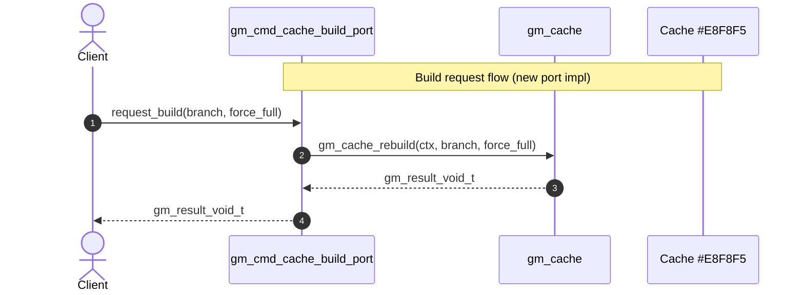
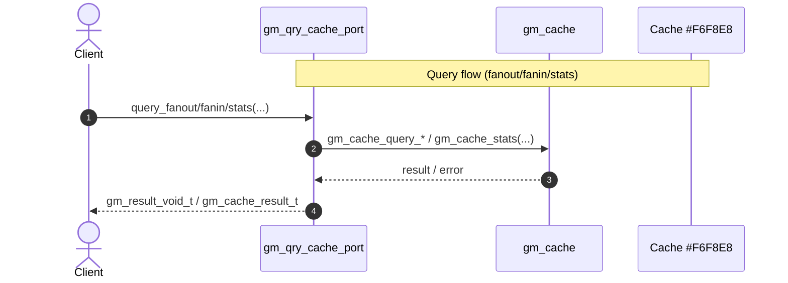
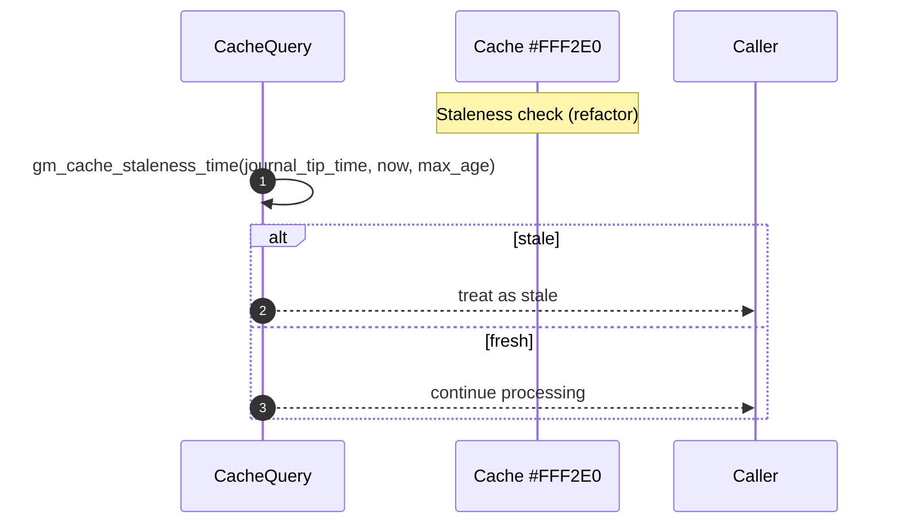
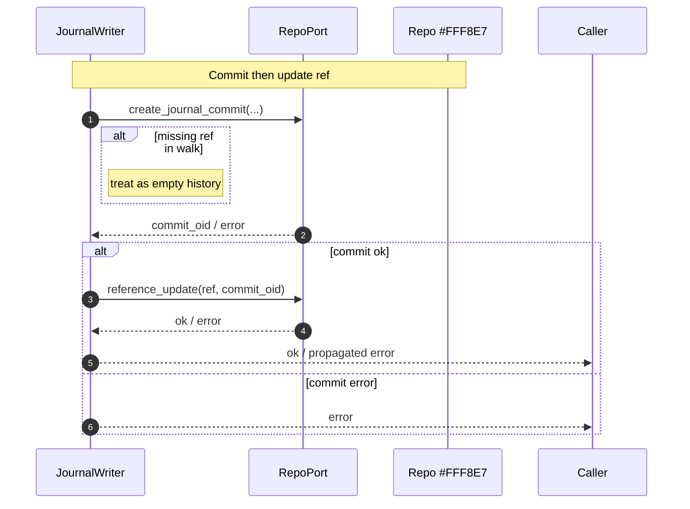

# Code Review Feedback

| Date | Agent | SHA | Branch | PR |
|------|-------|-----|--------|----|
| 2025-10-08 | CodeRabbit (and reviewers) | `e9a58433621fc5d60552af3685c2a4cd68ece5e0` | [feat/hex-ports-ci-green](https://github.com/neuroglyph/git-mind/tree/feat/hex-ports-ci-green "neuroglyph/git-mind:feat/hex-ports-ci-green") | [PR#177](https://github.com/neuroglyph/git-mind/pull/177) |

## CODE REVIEW FEEDBACK

### core/src/adapters/logging/stdio_logger_adapter.c:41 — coderabbitai[bot]

```text
_🛠️ Refactor suggestion_ | _🟠 Major_

<details>
<summary>🧩 Analysis chain</summary>

**Verify `gmtime_r` portability.**

The code uses `gmtime_r`, which is POSIX but not C standard. Ensure this is available on all target platforms or provide a fallback.

---

🏁 Script executed:

```shell
#!/bin/bash
# Check if gmtime_r is used elsewhere in the codebase or if there are existing portability abstractions
rg -n "gmtime_r|gmtime_s" --type=c --type=h -C2
```

Length of output: 2559

---

[tasks review_file_3/6 inspect_time_abstraction_1/1]
[observations]
- `wrap_gmtime_r` defined in `core/src/time/time.c`.
- Logging adapter calls raw `gmtime_r`, bypassing time abstraction.
- Time abstraction in `time_ops` maps to `wrap_gmtime_r`, not used in logger.
[analysis]
- Using raw `gmtime_r` risks portability issues on Windows.
- Abstraction exists to centralize portability handling.
[pending]
- Confirm `wrap_gmtime_r` has Windows fallback.
- Recommend logger use `time_ops->gmtime_r`.
[actions]
- Inspect `wrap_gmtime_r` implementation for fallback.
- Suggest using abstraction in logger.
[done] 
<!-- [/scratchpad] -->

---

🏁 Script executed:

```shell
#!/bin/bash
rg -nP -C3 'wrap_gmtime_r' core/src/time/time.c
```

Length of output: 471

---


</details>

**Replace raw `gmtime_r` with `time_ops->gmtime_r` in stdio_logger_adapter.c**  
Leverage the existing time abstraction (wrap_gmtime_r) and handle its `gm_result_tm_ptr_t` return to ensure compatibility on non-POSIX targets.

<!-- This is an auto-generated comment by CodeRabbit -->
```

_Meta_: https://github.com/neuroglyph/git-mind/pull/177#discussion_r2412649574

{response}

### docs/code-reviews/PR177/47a1bf537feb065ef3cbac02a8bf78e75944111c.md:10 — coderabbitai[bot]

```text
_⚠️ Potential issue_ | _🟡 Minor_

**Align title with H1.**

Per the markdown guidelines, the `title` field in front matter must match the H1 heading. Currently, `title: 47a1bf537feb065ef3cbac02a8bf78e75944111c.md` doesn't match `# Code Review Feedback`.


Apply this diff to align them:

```diff
 ---
-title: 47a1bf537feb065ef3cbac02a8bf78e75944111c.md
+title: Code Review Feedback
 description: Preserved review artifacts and rationale.
```

<!-- suggestion_start -->

<details>
<summary>📝 Committable suggestion</summary>

> ‼️ **IMPORTANT**
> Carefully review the code before committing. Ensure that it accurately replaces the highlighted code, contains no missing lines, and has no issues with indentation. Thoroughly test & benchmark the code to ensure it meets the requirements.

```suggestion
---
title: Code Review Feedback
description: Preserved review artifacts and rationale.
audience: [contributors]
domain: [quality]
tags: [review]
status: archive
---

# Code Review Feedback
```

</details>

<!-- suggestion_end -->

<details>
<summary>🤖 Prompt for AI Agents</summary>

```
In docs/code-reviews/PR177/47a1bf537feb065ef3cbac02a8bf78e75944111c.md around
lines 1–10, the front-matter title
("47a1bf537feb065ef3cbac02a8bf78e75944111c.md") does not match the H1 ("Code
Review Feedback"); update the title field in the front matter to exactly "Code
Review Feedback" (match capitalization and spacing) so it matches the H1
heading.
```

</details>

<!-- This is an auto-generated comment by CodeRabbit -->

✅ Addressed in commits e2eb59c to 9c9c521
```

_Meta_: https://github.com/neuroglyph/git-mind/pull/177#discussion_r2412649584

{response}

### docs/planning/Milestones.md:14 — coderabbitai[bot]

```text
_⚠️ Potential issue_ | _🟠 Major_

**Insert SPDX/license block immediately after the front matter**

Per our doc guidelines, every markdown doc needs the SPDX/license notice right after the front matter. Please add it here.  

Use this patch:

```diff
 status: draft
 ---
 
+<!-- SPDX-License-Identifier: LicenseRef-MIND-UCAL-1.0 -->
+<!-- © 2025 J. Kirby Ross / Neuroglyph Collective -->
+
 # Milestones (Placeholder)
```

<!-- suggestion_start -->

<details>
<summary>📝 Committable suggestion</summary>

> ‼️ **IMPORTANT**
> Carefully review the code before committing. Ensure that it accurately replaces the highlighted code, contains no missing lines, and has no issues with indentation. Thoroughly test & benchmark the code to ensure it meets the requirements.

```suggestion
---

<!-- SPDX-License-Identifier: LicenseRef-MIND-UCAL-1.0 -->
<!-- © 2025 J. Kirby Ross / Neuroglyph Collective -->

# Milestones (Placeholder)

## Table of Contents

- Near Term
```

</details>

<!-- suggestion_end -->

<details>
<summary>🤖 Prompt for AI Agents</summary>

```
In docs/planning/Milestones.md around lines 8 to 14, the document is missing the
required SPDX/license notice immediately after the front matter; insert the SPDX
license block (as the project convention uses an HTML comment SPDX line, e.g.
<!-- SPDX-License-Identifier: Apache-2.0 --> and any accompanying copyright or
license attribution required by our doc guidelines) directly below the front
matter header so the license notice appears before the rest of the content.
```

</details>

<!-- fingerprinting:phantom:medusa:sabertoothed -->

<!-- This is an auto-generated comment by CodeRabbit -->
```

_Meta_: https://github.com/neuroglyph/git-mind/pull/177#discussion_r2412649598

{response}

### docs/planning/Product_Roadmap.md:12 — coderabbitai[bot]

```text
_⚠️ Potential issue_ | _🟠 Major_

**Restore the SPDX/license block after the front matter.**

The documentation standards require the SPDX and copyright comments immediately following the front matter. Add the standard block before the H1.  


```diff
 ---
 status: draft
 ---
+
+<!-- SPDX-License-Identifier: LicenseRef-MIND-UCAL-1.0 -->
+<!-- © 2025 J. Kirby Ross / Neuroglyph Collective -->
 
 # Product Roadmap (Placeholder)
```
As per coding guidelines


> Committable suggestion skipped: line range outside the PR's diff.

<details>
<summary>🤖 Prompt for AI Agents</summary>

```
In docs/planning/Product_Roadmap.md around lines 8 to 12, the SPDX/license and
copyright comment block required by documentation standards is missing after the
front matter; insert the standard SPDX/license block (including SPDX identifier
and copyright line) immediately after the front matter and before the H1 "#
Product Roadmap (Placeholder)" so the license header appears directly after the
front matter and above the document title.
```

</details>

<!-- fingerprinting:phantom:medusa:sabertoothed -->

<!-- This is an auto-generated comment by CodeRabbit -->
```

_Meta_: https://github.com/neuroglyph/git-mind/pull/177#discussion_r2412649608

{response}

### docs/planning/Release_Plans.md:14 — coderabbitai[bot]

```text
_⚠️ Potential issue_ | _🟠 Major_

**Add required SPDX/license notice after front matter**

Docs under `docs/**/*.md` must place the SPDX/license block immediately after the front matter. Please add the standard notice so we stay compliant.  

Apply this diff:

```diff
 status: draft
 ---
 
+<!-- SPDX-License-Identifier: LicenseRef-MIND-UCAL-1.0 -->
+<!-- © 2025 J. Kirby Ross / Neuroglyph Collective -->
+
 # Release Plans (Placeholder)
```

<!-- suggestion_start -->

<details>
<summary>📝 Committable suggestion</summary>

> ‼️ **IMPORTANT**
> Carefully review the code before committing. Ensure that it accurately replaces the highlighted code, contains no missing lines, and has no issues with indentation. Thoroughly test & benchmark the code to ensure it meets the requirements.

```suggestion
---

<!-- SPDX-License-Identifier: LicenseRef-MIND-UCAL-1.0 -->
<!-- © 2025 J. Kirby Ross / Neuroglyph Collective -->

# Release Plans (Placeholder)

## Table of Contents

- Cadence
```

</details>

<!-- suggestion_end -->

<details>
<summary>🤖 Prompt for AI Agents</summary>

```
In docs/planning/Release_Plans.md around lines 8-14, the file is missing the
required SPDX/license notice immediately after the front matter; insert the
standard SPDX license block (for example an HTML comment like
SPDX-License-Identifier: <LICENSE-ID>) directly below the closing front-matter
delimiter (---) with a single blank line separation, so the notice appears as
the first content after front matter and complies with docs/**/*.md
requirements.
```

</details>

<!-- fingerprinting:phantom:medusa:sabertoothed -->

<!-- This is an auto-generated comment by CodeRabbit -->
```

_Meta_: https://github.com/neuroglyph/git-mind/pull/177#discussion_r2412649615

{response}

### docs/planning/Sprint_Plans.md:12 — coderabbitai[bot]

```text
_⚠️ Potential issue_ | _🟠 Major_

**Insert SPDX/license comments after front matter.**

Per the documentation guidelines, every Markdown page must include the SPDX/license comment block right after the front matter. Please add the standard comments before the H1.  


```diff
 ---
 status: draft
 ---
+
+<!-- SPDX-License-Identifier: LicenseRef-MIND-UCAL-1.0 -->
+<!-- © 2025 J. Kirby Ross / Neuroglyph Collective -->
 
 # Sprint Plans (Placeholder)
```
As per coding guidelines

<!-- suggestion_start -->

<details>
<summary>📝 Committable suggestion</summary>

> ‼️ **IMPORTANT**
> Carefully review the code before committing. Ensure that it accurately replaces the highlighted code, contains no missing lines, and has no issues with indentation. Thoroughly test & benchmark the code to ensure it meets the requirements.

```suggestion
---
status: draft
---

<!-- SPDX-License-Identifier: LicenseRef-MIND-UCAL-1.0 -->
<!-- © 2025 J. Kirby Ross / Neuroglyph Collective -->

# Sprint Plans (Placeholder)

## Table of Contents
```

</details>

<!-- suggestion_end -->

<details>
<summary>🤖 Prompt for AI Agents</summary>

```
In docs/planning/Sprint_Plans.md around lines 8 to 12, the file is missing the
required SPDX/license comment block after the front matter and before the H1;
add the standard SPDX/license comment block (e.g., SPDX-License-Identifier and
copyright/license owner lines used across the repo) immediately after the
YAML/front-matter section and before the "# Sprint Plans (Placeholder)" heading
so the document conforms to the documentation guidelines.
```

</details>

<!-- fingerprinting:phantom:medusa:sabertoothed -->

<!-- This is an auto-generated comment by CodeRabbit -->
```

_Meta_: https://github.com/neuroglyph/git-mind/pull/177#discussion_r2412649624

{response}

### docs/PRDs/PRD-co-thought-mcp-service.md:18 — coderabbitai[bot]

```text
_⚠️ Potential issue_ | _🟠 Major_

**Add required SPDX/License comment after front matter.**

Docs under `docs/` must place the SPDX/License comment immediately after the front matter. Please insert it between the front matter and the H1 heading to comply with our documentation policy.  [As per coding guidelines]

<details>
<summary>🤖 Prompt for AI Agents</summary>

```
In docs/PRDs/PRD-co-thought-mcp-service.md around lines 9 to 18, the file is
missing the required SPDX/License comment immediately after the front matter;
insert the SPDX short-form license comment (e.g. <!-- SPDX-License-Identifier:
Apache-2.0 --> or the project's approved identifier) directly between the
closing front-matter block and the H1 heading so the license line appears as the
first content after front matter and before "# PRD — Co‑Thought MCP Service".
```

</details>

<!-- fingerprinting:phantom:triton:sabertoothed -->

<!-- This is an auto-generated comment by CodeRabbit -->
```

_Meta_: https://github.com/neuroglyph/git-mind/pull/177#discussion_r2412649633

{response}

### docs/PRDs/PRD-git-mind-semantics-time-travel-prototype.md:13 — coderabbitai[bot]

```text
_⚠️ Potential issue_ | _🟠 Major_

**Add the required license/SPDX comment after the front matter.**

Docs must place the License/SPDX comment immediately after the front matter, but nothing is present here. Please add it to stay compliant.  As per coding guidelines.

```diff
 ---
 
+# <!-- SPDX-License-Identifier: Apache-2.0 -->
+
 # PRD — First-Class Semantics (Time-Travel Prototype)
```

<!-- suggestion_start -->

<details>
<summary>📝 Committable suggestion</summary>

> ‼️ **IMPORTANT**
> Carefully review the code before committing. Ensure that it accurately replaces the highlighted code, contains no missing lines, and has no issues with indentation. Thoroughly test & benchmark the code to ensure it meets the requirements.

```suggestion
---
<!-- SPDX-License-Identifier: Apache-2.0 -->

# PRD — First-Class Semantics (Time-Travel Prototype)

## Table of Contents
```

</details>

<!-- suggestion_end -->

<details>
<summary>🤖 Prompt for AI Agents</summary>

```
In docs/PRDs/PRD-git-mind-semantics-time-travel-prototype.md around lines 8-13
the required license/SPDX comment is missing after the front matter; add the
project's standard SPDX license comment immediately after the closing
front-matter marker (on the next line) so the file includes the correct
SPDX-License-Identifier comment consistent with the repo's licensing policy.
```

</details>

<!-- fingerprinting:phantom:triton:sabertoothed -->

<!-- This is an auto-generated comment by CodeRabbit -->
```

_Meta_: https://github.com/neuroglyph/git-mind/pull/177#discussion_r2412649638

{response}

### docs/specs/Technical_Specifications.md:14 — coderabbitai[bot]

```text
_⚠️ Potential issue_ | _🟠 Major_

**Restore the SPDX/license comment after the front matter**

We require the SPDX/license notice immediately following the front matter in every doc. Please add it back so the spec placeholder stays compliant.  

Suggested change:

```diff
 status: draft
 ---
 
+<!-- SPDX-License-Identifier: LicenseRef-MIND-UCAL-1.0 -->
+<!-- © 2025 J. Kirby Ross / Neuroglyph Collective -->
+
 # Technical Specifications (Placeholder)
```

<!-- suggestion_start -->

<details>
<summary>📝 Committable suggestion</summary>

> ‼️ **IMPORTANT**
> Carefully review the code before committing. Ensure that it accurately replaces the highlighted code, contains no missing lines, and has no issues with indentation. Thoroughly test & benchmark the code to ensure it meets the requirements.

```suggestion
status: draft
---

<!-- SPDX-License-Identifier: LicenseRef-MIND-UCAL-1.0 -->
<!-- © 2025 J. Kirby Ross / Neuroglyph Collective -->

# Technical Specifications (Placeholder)

## Table of Contents

- Overview
```

</details>

<!-- suggestion_end -->

<details>
<summary>🤖 Prompt for AI Agents</summary>

```
In docs/specs/Technical_Specifications.md around lines 8 to 14, the SPDX/license
notice was removed after the front matter; restore the required SPDX/license
comment immediately following the front matter (e.g. add the SPDX identifier
line such as "SPDX-License-Identifier: <license>" right after the front-matter
separator) so the document is compliant with project licensing conventions.
```

</details>

<!-- fingerprinting:phantom:medusa:sabertoothed -->

<!-- This is an auto-generated comment by CodeRabbit -->
```

_Meta_: https://github.com/neuroglyph/git-mind/pull/177#discussion_r2412649645

{response}

### docs/wish-list-features/README.md:10 — coderabbitai[bot]

```text
_⚠️ Potential issue_ | _🟠 Major_

**Add required SPDX comment after front matter.**

Docs must place the license/SPDX comment block immediately after the front matter; this placeholder currently omits it. Please add the repository-standard SPDX and copyright comments beneath the `---` block.  


```diff
 ---
 status: draft
 ---
+
+<!-- SPDX-License-Identifier: LicenseRef-MIND-UCAL-1.0 -->
+<!-- © 2025 J. Kirby Ross / Neuroglyph Collective -->
 
 # Wish List Features (Placeholder)
```
As per coding guidelines

<!-- suggestion_start -->

<details>
<summary>📝 Committable suggestion</summary>

> ‼️ **IMPORTANT**
> Carefully review the code before committing. Ensure that it accurately replaces the highlighted code, contains no missing lines, and has no issues with indentation. Thoroughly test & benchmark the code to ensure it meets the requirements.

```suggestion
---
status: draft
---
<!-- SPDX-License-Identifier: LicenseRef-MIND-UCAL-1.0 -->
<!-- © 2025 J. Kirby Ross / Neuroglyph Collective -->

# Wish List Features (Placeholder)
```

</details>

<!-- suggestion_end -->

<details>
<summary>🤖 Prompt for AI Agents</summary>

```
In docs/wish-list-features/README.md around lines 8 to 10, the front matter
separator (“---”) is present but the required repository-standard SPDX and
copyright comment block is missing immediately after it; insert the standard
SPDX license comment block (matching repository conventions) directly beneath
the `---` line, including SPDX identifier and copyright owner/year, ensuring
there are no blank lines between the front matter separator and the comment
block.
```

</details>

<!-- fingerprinting:phantom:medusa:sabertoothed -->

<!-- This is an auto-generated comment by CodeRabbit -->
```

_Meta_: https://github.com/neuroglyph/git-mind/pull/177#discussion_r2412649654

{response}

### migration-progress.md:5 — coderabbitai[bot]

```text
_⚠️ Potential issue_ | _🟡 Minor_

**Add required front matter.**

Per the markdown guidelines, documentation files must have front matter at the beginning. This migration tracking document is missing it.


Add front matter before line 1:

```diff
+---
+title: Hexagonal Architecture Migration Progress
+description: Single source of truth for tracking hexagonal architecture migration
+audience: [contributors]
+domain: [architecture]
+tags: [migration, hexagonal]
+status: active
+---
+
 # Hexagonal Architecture Migration Progress
```

<!-- suggestion_start -->

<details>
<summary>📝 Committable suggestion</summary>

> ‼️ **IMPORTANT**
> Carefully review the code before committing. Ensure that it accurately replaces the highlighted code, contains no missing lines, and has no issues with indentation. Thoroughly test & benchmark the code to ensure it meets the requirements.

```suggestion
---
title: Hexagonal Architecture Migration Progress
description: Single source of truth for tracking hexagonal architecture migration
audience: [contributors]
domain: [architecture]
tags: [migration, hexagonal]
status: active
---

# Hexagonal Architecture Migration Progress

Started: 2025-10-08

This file is the single source of truth for tracking the end-to-end migration of the C library to a strict hexagonal architecture, per AGENTS.md. Update this checklist as work proceeds. Check off items with `[x]` only after they are complete and validated (CI green, zero new clang-tidy warnings, and docs updated).
```

</details>

<!-- suggestion_end -->

<details>
<summary>🤖 Prompt for AI Agents</summary>

```
In migration-progress.md around lines 1 to 5, the document is missing required
front matter; add a YAML front matter block at the very top (before line 1)
including at minimum a title, date (2025-10-08), and a short description (and
optionally tags/layout) so the file conforms to the markdown guidelines and site
generator expectations; ensure the block is delimited with triple dashes and the
rest of the content follows after the closing dashes.
```

</details>

<!-- This is an auto-generated comment by CodeRabbit -->
```

_Meta_: https://github.com/neuroglyph/git-mind/pull/177#discussion_r2412649659

{response}

### docs/code-reviews/PR177/3b7ce522e107011f8f92dc629facfa5b6a3595fb.md:18 — coderabbitai[bot]

```text
_⚠️ Potential issue_ | _🔴 Critical_

<details>
<summary>🧩 Analysis chain</summary>

**Doc header must match guidelines.**

The doc front matter and header block miss multiple required conventions: the `title` must exactly match the H1 (“Code Review Feedback”), the SPDX/license comment block must appear immediately after the front matter, and the file needs a `## Table of Contents` section. Please align this file with the docs/**/*.md rules.  
   
Add front matter fixes and license block quickly with this patch scaffold:

```diff
---
-title: 3b7ce522e107011f8f92dc629facfa5b6a3595fb.md
+title: Code Review Feedback
 description: Preserved review artifacts and rationale.
 audience: [contributors]
 domain: [quality]
 tags: [review]
 status: archive
 ---
+<!-- SPDX-License-Identifier: LicenseRef-MIND-UCAL-1.0 -->
+<!-- © 2025 J. Kirby Ross / Neuroglyph Collective -->
 
 # Code Review Feedback
+
+## Table of Contents
```

Confirm any additional required sections follow afterward. As per coding guidelines.

---

🏁 Script executed:

```shell
#!/bin/bash
# List docs directory contents
find docs -maxdepth 2 -type f

# Search for SPDX license convention in docs
rg -n "SPDX-License-Identifier" -g "docs/**/*.md"

# Search for Table of Contents guideline in docs
rg -n "## Table of Contents" -g "docs/**/*.md"

# Search for files mentioning 'guideline'
rg -l "guideline" -g "docs/**/*.md"
```

Length of output: 14870

---

🏁 Script executed:

```shell
#!/bin/bash
# Show front matter of the review artifact
sed -n '1,30p' docs/code-reviews/PR177/3b7ce522e107011f8f92dc629facfa5b6a3595fb.md

# Show template conventions
echo "---- TEMPLATE START ----"
sed -n '1,50p' docs/templates/code-review-feedback.md
echo "---- TEMPLATE END ----"
```

Length of output: 2224

---

🏁 Script executed:

```shell
#!/bin/bash
# Search for front matter guidelines
rg -n "front matter" -g "docs/quality/Markdown_Style_Guide.md"

# Search for SPDX guidelines
rg -n "SPDX" -g "docs/quality/Markdown_Style_Guide.md"

# Search for Table of Contents in style guide
rg -n "Table of Contents" -g "docs/quality/Markdown_Style_Guide.md"
```

Length of output: 57

---


</details>

**Doc header must match guidelines.**  
Front matter `title` must be “Code Review Feedback” (matching the H1), insert the SPDX/license comment immediately after the front matter, and add a `## Table of Contents` section beneath the H1.  

```diff
---
-title: 3b7ce522e107011f8f92dc629facfa5b6a3595fb.md
+title: Code Review Feedback
 description: Preserved review artifacts and rationale.
 audience: [contributors]
 domain: [quality]
 tags: [review]
 status: archive
---
+<!-- SPDX-License-Identifier: LicenseRef-MIND-UCAL-1.0 -->
+<!-- © 2025 J. Kirby Ross / Neuroglyph Collective -->
 
 # Code Review Feedback
 
+## Table of Contents
```

<!-- suggestion_start -->

<details>
<summary>📝 Committable suggestion</summary>

> ‼️ **IMPORTANT**
> Carefully review the code before committing. Ensure that it accurately replaces the highlighted code, contains no missing lines, and has no issues with indentation. Thoroughly test & benchmark the code to ensure it meets the requirements.

```suggestion
---
title: Code Review Feedback
 description: Preserved review artifacts and rationale.
 audience: [contributors]
 domain: [quality]
 tags: [review]
 status: archive
<!-- SPDX-License-Identifier: LicenseRef-MIND-UCAL-1.0 -->
<!-- © 2025 J. Kirby Ross / Neuroglyph Collective -->

 # Code Review Feedback

## Table of Contents
```

</details>

<!-- suggestion_end -->

<details>
<summary>🤖 Prompt for AI Agents</summary>

```
In docs/code-reviews/PR177/3b7ce522e107011f8f92dc629facfa5b6a3595fb.md around
lines 1 to 18, the front matter and document structure do not follow project
guidelines: change the YAML front-matter title value to "Code Review Feedback",
insert the SPDX/license comment immediately after the closing front-matter
block, and add a "## Table of Contents" section directly beneath the H1 heading;
ensure spacing and ordering match other review artifacts.
```

</details>

<!-- fingerprinting:phantom:triton:sabertoothed -->

<!-- This is an auto-generated comment by CodeRabbit -->
```

_Meta_: https://github.com/neuroglyph/git-mind/pull/177#discussion_r2412749770

{response}

### core/include/gitmind/ports/cache_query_port.h:76 — coderabbitai[bot]

```text
_🛠️ Refactor suggestion_ | _🟠 Major_

<details>
<summary>🧩 Analysis chain</summary>

**Clarify stats output parameter behavior on error and verify implementation.**

The `stats` function documentation mentions returning `GM_ERR_NOT_FOUND` on a missing branch, but does not explicitly state what happens to the output parameters (`edge_count` and `cache_size_bytes`) on error. Per coding guidelines, output buffers should be zeroed on error paths.


1. Update the documentation to clarify that `edge_count` and `cache_size_bytes` are set to zero on error.
2. Verify that the implementation in `core/src/ports/cache/cache_query_port.c` properly zeros these outputs before returning an error.

---

🏁 Script executed:

```shell
#!/bin/bash
# Description: Verify that stats implementation zeros output parameters on error paths.

# Search for the stats implementation and check error handling
ast-grep --pattern $'gm_result_void_t $_(gm_qry_cache_port_t *$_, const char *$_, uint64_t *$_, uint64_t *$_) {
  $$$
}'
```

Length of output: 0

---

🏁 Script executed:

```shell
#!/bin/bash
rg -nP 'gm_result_void_t\s+stats\s*\(' -C3 core/src/ports/cache/*.c
```

Length of output: 0

---

🏁 Script executed:

```shell
rg -nP '\.stats\s*=' -C3 core/src
```

Length of output: 514

---

🏁 Script executed:

```shell
#!/bin/bash
rg -nP 'gm_result_void_t\s+stats_impl' -C50 core/src/ports/cache/cache_query_port.c
```

Length of output: 3961

---


</details>

**Zero outputs on error in stats_impl and update docs.** The `stats_impl` function (core/src/ports/cache/cache_query_port.c:50–63) never clears `*edge_count` or `*cache_size_bytes` on error; add `*edge_count = 0; *cache_size_bytes = 0;` before each `gm_err_void` return and update the doc comment in `cache_query_port.h` to state that outputs are zeroed on failure.

<details>
<summary>🤖 Prompt for AI Agents</summary>

```
In core/src/ports/cache/cache_query_port.c around lines 50–63 and
core/include/gitmind/ports/cache_query_port.h lines 61–76, the stats_impl
implementation fails to clear output parameters on error; before every
gm_err_void return in stats_impl set *edge_count = 0; *cache_size_bytes = 0; to
ensure callers get zeroed outputs on failure, and update the doc comment in
cache_query_port.h to explicitly state that on failure (e.g., non-existent
branch or other errors) both edge_count and cache_size_bytes are set to 0.
```

</details>

<!-- This is an auto-generated comment by CodeRabbit -->
```

_Meta_: https://github.com/neuroglyph/git-mind/pull/177#discussion_r2412822288

{response}

### docs/architecture/journal-architecture.md:9 — coderabbitai[bot]

```text
_🛠️ Refactor suggestion_ | _🟠 Major_

**Add the SPDX notice after the front matter**

The documentation standard requires an SPDX/license comment immediately following the YAML header.  


```diff
 ---
 title: Project: No Tux Given 🐧⚡
 description: Edge-journal commits with branch-aware graphs; the final architecture for storing semantics in Git.
 audience: [developers]
 domain: [architecture]
 tags: [journal, cbor, refs]
 status: stable
 last_updated: 2025-09-15
 ---
+<!-- SPDX-License-Identifier: Apache-2.0 -->
```

<!-- suggestion_start -->

<details>
<summary>📝 Committable suggestion</summary>

> ‼️ **IMPORTANT**
> Carefully review the code before committing. Ensure that it accurately replaces the highlighted code, contains no missing lines, and has no issues with indentation. Thoroughly test & benchmark the code to ensure it meets the requirements.

```suggestion
---
title: Project: No Tux Given 🐧⚡
description: Edge-journal commits with branch-aware graphs; the final architecture for storing semantics in Git.
audience: [developers]
domain: [architecture]
tags: [journal, cbor, refs]
status: stable
last_updated: 2025-09-15
---
<!-- SPDX-License-Identifier: Apache-2.0 -->
```

</details>

<!-- suggestion_end -->

<details>
<summary>🤖 Prompt for AI Agents</summary>

```
In docs/architecture/journal-architecture.md around lines 1 to 9, the YAML front
matter is present but missing the required SPDX/license comment immediately
after it; add a single-line SPDX identifier (e.g., "SPDX-License-Identifier:
Apache-2.0" or the project's chosen SPDX tag) on the line immediately following
the closing --- of the front matter so the file begins with the YAML block and
the SPDX notice directly after it.
```

</details>

<!-- fingerprinting:phantom:medusa:sabertoothed -->

<!-- This is an auto-generated comment by CodeRabbit -->
```

_Meta_: https://github.com/neuroglyph/git-mind/pull/177#discussion_r2412822301

{response}

### docs/architecture/journal-architecture.md:28 — coderabbitai[bot]

```text
_🛠️ Refactor suggestion_ | _🟠 Major_

**Use the mandated H2 heading for the Table of Contents**

Please change the “Table of Contents” label to a `## Table of Contents` heading to satisfy the docs guideline.  


```diff
-Table of Contents
+## Table of Contents
```

<!-- suggestion_start -->

<details>
<summary>📝 Committable suggestion</summary>

> ‼️ **IMPORTANT**
> Carefully review the code before committing. Ensure that it accurately replaces the highlighted code, contains no missing lines, and has no issues with indentation. Thoroughly test & benchmark the code to ensure it meets the requirements.

```suggestion
## Table of Contents

- [Executive Summary](#executive-summary)
- [Core Design Principles](#core-design-principles)
- [The Two-Layer Architecture](#the-two-layer-architecture)
- [Implementation Details](#implementation-details)
- [Solving the Hard Problems](#solving-the-hard-problems)
- [Migration Plan (Fresh Start)](#migration-plan-fresh-start)
- [Code Structure](#code-structure)
- [Why This Wins](#why-this-wins)
- [Potential Gotchas & Solutions](#potential-gotchas--solutions)
- [The Payoff](#the-payoff)
- [Next Steps](#next-steps)
```

</details>

<!-- suggestion_end -->

<details>
<summary>🤖 Prompt for AI Agents</summary>

```
In docs/architecture/journal-architecture.md around lines 15 to 28 the plain
text "Table of Contents" needs to be converted into a level-2 Markdown heading;
replace the current label with "## Table of Contents" (i.e., prepend "## " and
ensure it's on its own line) so the document follows the mandated H2 heading
guideline for the table of contents.
```

</details>

<!-- fingerprinting:phantom:medusa:sabertoothed -->

<!-- This is an auto-generated comment by CodeRabbit -->
```

_Meta_: https://github.com/neuroglyph/git-mind/pull/177#discussion_r2412822303

{response}

### docs/architecture/ref-name-validation.md:9 — coderabbitai[bot]

```text
_🛠️ Refactor suggestion_ | _🟠 Major_

**Add the required SPDX comment after front matter**

Docs must include the license/SPDX comment immediately after the YAML front matter. Please add it here to satisfy the doc guidelines.  


```diff
 ---
 title: Ref Name Validation
 description: Building refs safely with Git-style branch shorthands.
 audience: [contributors, developers]
 domain: [architecture]
 tags: [git, refs]
 status: stable
 last_updated: 2025-09-30
 ---
+<!-- SPDX-License-Identifier: Apache-2.0 -->
```

<!-- suggestion_start -->

<details>
<summary>📝 Committable suggestion</summary>

> ‼️ **IMPORTANT**
> Carefully review the code before committing. Ensure that it accurately replaces the highlighted code, contains no missing lines, and has no issues with indentation. Thoroughly test & benchmark the code to ensure it meets the requirements.

```suggestion
---
title: Ref Name Validation
description: Building refs safely with Git-style branch shorthands.
audience: [contributors, developers]
domain: [architecture]
tags: [git, refs]
status: stable
last_updated: 2025-09-30
---
<!-- SPDX-License-Identifier: Apache-2.0 -->
```

</details>

<!-- suggestion_end -->

<details>
<summary>🤖 Prompt for AI Agents</summary>

```
In docs/architecture/ref-name-validation.md around lines 1 to 9, the YAML front
matter is present but the required SPDX license comment is missing immediately
after the front matter; add the SPDX identifier comment line (e.g., "//
SPDX-License-Identifier: <LICENSE-ID>" or the project’s canonical SPDX comment
format) directly below the closing "---" of the front matter so the file
contains the license/SPDX comment immediately after the YAML block per doc
guidelines.
```

</details>

<!-- fingerprinting:phantom:medusa:sabertoothed -->

<!-- This is an auto-generated comment by CodeRabbit -->
```

_Meta_: https://github.com/neuroglyph/git-mind/pull/177#discussion_r2412822314

{response}

### docs/architecture/system-overview.md:9 — coderabbitai[bot]

```text
_🛠️ Refactor suggestion_ | _🟠 Major_

**Insert SPDX notice after the front matter**

Per the docs guidelines, place the SPDX/license comment immediately after the YAML header.  


```diff
 ---
 title: System Architecture
 description: High-level view of git-mind components and interactions.
 audience: [developers]
 domain: [architecture]
 tags: [system, overview]
 status: draft
 last_updated: 2025-09-15
 ---
+<!-- SPDX-License-Identifier: Apache-2.0 -->
```

<!-- suggestion_start -->

<details>
<summary>📝 Committable suggestion</summary>

> ‼️ **IMPORTANT**
> Carefully review the code before committing. Ensure that it accurately replaces the highlighted code, contains no missing lines, and has no issues with indentation. Thoroughly test & benchmark the code to ensure it meets the requirements.

```suggestion
---
title: System Architecture
description: High-level view of git-mind components and interactions.
audience: [developers]
domain: [architecture]
tags: [system, overview]
status: draft
last_updated: 2025-09-15
---
<!-- SPDX-License-Identifier: Apache-2.0 -->
```

</details>

<!-- suggestion_end -->

<details>
<summary>🤖 Prompt for AI Agents</summary>

```
In docs/architecture/system-overview.md around lines 1–9 the YAML front matter
is present but missing the required SPDX/license notice; add the SPDX license
comment immediately after the closing --- of the front matter by inserting the
project's SPDX identifier as a comment (e.g. an HTML or Markdown comment
containing "SPDX-License-Identifier: <identifier>") directly after the header
end so the notice is the first thing after the YAML block.
```

</details>

<!-- fingerprinting:phantom:medusa:sabertoothed -->

<!-- This is an auto-generated comment by CodeRabbit -->
```

_Meta_: https://github.com/neuroglyph/git-mind/pull/177#discussion_r2412822322

{response}

### docs/architecture/system-overview.md:20 — coderabbitai[bot]

```text
_🛠️ Refactor suggestion_ | _🟠 Major_

**Promote “Table of Contents” to an H2 heading**

Docs must include a `## Table of Contents` section. Please update the heading accordingly.  


```diff
-Table of Contents
+## Table of Contents
```

<!-- suggestion_start -->

<details>
<summary>📝 Committable suggestion</summary>

> ‼️ **IMPORTANT**
> Carefully review the code before committing. Ensure that it accurately replaces the highlighted code, contains no missing lines, and has no issues with indentation. Thoroughly test & benchmark the code to ensure it meets the requirements.

```suggestion
## Table of Contents

- [Executive Summary](#executive-summary)
- [High-Level Design](#high-level-design)
- [Components and Technology Stack](#components-and-technology-stack)
- [Data Flows and Storage](#data-flows-and-storage)
- [Scaling Strategy and Performance Targets](#scaling-strategy-and-performance-targets)
```

</details>

<!-- suggestion_end -->

<details>
<summary>🤖 Prompt for AI Agents</summary>

```
In docs/architecture/system-overview.md around lines 13 to 20, the "Table of
Contents" text is plain text but should be an H2 heading; change the line to use
Markdown H2 syntax ("## Table of Contents") so the docs include the required
section header and render correctly in the table of contents.
```

</details>

<!-- fingerprinting:phantom:medusa:sabertoothed -->

<!-- This is an auto-generated comment by CodeRabbit -->
```

_Meta_: https://github.com/neuroglyph/git-mind/pull/177#discussion_r2412822329

{response}

### docs/code-reviews/PR177/0d1b34b0ee501bc7b7b2d0a9fb82e06a37642c77.md:10 — coderabbitai[bot]

```text
_⚠️ Potential issue_ | _🟡 Minor_

**Doc header must match guidelines.**

The front matter title must be "Code Review Feedback" (matching the H1), the SPDX/license comment must appear immediately after the front matter, and a "## Table of Contents" section must follow the H1.


Apply this diff:

```diff
 ---
-title: 0d1b34b0ee501bc7b7b2d0a9fb82e06a37642c77.md
+title: Code Review Feedback
 description: Preserved review artifacts and rationale.
 audience: [contributors]
 domain: [quality]
 tags: [review]
 status: archive
 ---
+<!-- SPDX-License-Identifier: LicenseRef-MIND-UCAL-1.0 -->
+<!-- © 2025 J. Kirby Ross / Neuroglyph Collective -->
 
 # Code Review Feedback
+
+## Table of Contents
```

As per coding guidelines.

<!-- suggestion_start -->

<details>
<summary>📝 Committable suggestion</summary>

> ‼️ **IMPORTANT**
> Carefully review the code before committing. Ensure that it accurately replaces the highlighted code, contains no missing lines, and has no issues with indentation. Thoroughly test & benchmark the code to ensure it meets the requirements.

```suggestion
---
title: Code Review Feedback
description: Preserved review artifacts and rationale.
audience: [contributors]
domain: [quality]
tags: [review]
status: archive
---
<!-- SPDX-License-Identifier: LicenseRef-MIND-UCAL-1.0 -->
<!-- © 2025 J. Kirby Ross / Neuroglyph Collective -->

# Code Review Feedback

## Table of Contents
```

</details>

<!-- suggestion_end -->

<!-- This is an auto-generated comment by CodeRabbit -->
```

_Meta_: https://github.com/neuroglyph/git-mind/pull/177#discussion_r2412822333

{response}

### docs/code-reviews/PR177/9f49dd2ad65837735ac218c3d159b36f8b840819.md:18 — coderabbitai[bot]

```text
_⚠️ Potential issue_ | _🟠 Major_

**Align front matter with doc standards.**

Please update the front matter `title` to match the H1, insert the required SPDX/license comments immediately after the front matter, and add the mandatory `## Table of Contents` section. These steps are required for every `docs/**/*.md` file. As per coding guidelines

```diff
 ---
-title: 9f49dd2ad65837735ac218c3d159b36f8b840819.md
+title: Code Review Feedback
 description: Preserved review artifacts and rationale.
 audience: [contributors]
 domain: [quality]
 tags: [review]
 status: archive
 ---
+
+<!-- SPDX-License-Identifier: LicenseRef-MIND-UCAL-1.0 -->
+<!-- © 2025 J. Kirby Ross / Neuroglyph Collective -->
 
 # Code Review Feedback
+
+## Table of Contents
+
+- [Code Review Feedback](#code-review-feedback)
+- [CODE REVIEW FEEDBACK](#code-review-feedback-1)
```

<!-- suggestion_start -->

<details>
<summary>📝 Committable suggestion</summary>

> ‼️ **IMPORTANT**
> Carefully review the code before committing. Ensure that it accurately replaces the highlighted code, contains no missing lines, and has no issues with indentation. Thoroughly test & benchmark the code to ensure it meets the requirements.

```suggestion
---
title: Code Review Feedback
description: Preserved review artifacts and rationale.
audience: [contributors]
domain: [quality]
tags: [review]
status: archive
---

<!-- SPDX-License-Identifier: LicenseRef-MIND-UCAL-1.0 -->
<!-- © 2025 J. Kirby Ross / Neuroglyph Collective -->

# Code Review Feedback

## Table of Contents

- [Code Review Feedback](#code-review-feedback)
- [CODE REVIEW FEEDBACK](#code-review-feedback-1)

| Date | Agent | SHA | Branch | PR |
|------|-------|-----|--------|----|
| 2025-10-08 | CodeRabbit (and reviewers) | `9f49dd2ad65837735ac218c3d159b36f8b840819` | [feat/hex-ports-ci-green](https://github.com/neuroglyph/git-mind/tree/feat/hex-ports-ci-green "neuroglyph/git-mind:feat/hex-ports-ci-green") | [PR#177](https://github.com/neuroglyph/git-mind/pull/177) |

## CODE REVIEW FEEDBACK

### core/src/adapters/logging/stdio_logger_adapter.c:41 — coderabbitai[bot]
```

</details>

<!-- suggestion_end -->

<details>
<summary>🤖 Prompt for AI Agents</summary>

```
In docs/code-reviews/PR177/9f49dd2ad65837735ac218c3d159b36f8b840819.md lines
1-18, the front matter title doesn't match the H1 and the required SPDX/license
comment and Table of Contents section are missing; update the front matter title
to exactly match the H1, add the required SPDX/license comment block immediately
after the front matter, and insert a mandatory "## Table of Contents" heading
(with any needed anchors/placeholder entries) below the SPDX/license block so
the file conforms to docs/**/*.md standards.
```

</details>

<!-- fingerprinting:phantom:triton:sabertoothed -->

<!-- This is an auto-generated comment by CodeRabbit -->
```

_Meta_: https://github.com/neuroglyph/git-mind/pull/177#discussion_r2412828968

{response}

### General comment — coderabbitai[bot]

```text
<!-- This is an auto-generated comment: summarize by coderabbit.ai -->
<!-- walkthrough_start -->

## Walkthrough
Adds logger and metrics port APIs and adapters, inbound cache build/query ports and implementations, an internal cache staleness helper used by cache query, context fields for optional ports, repository/journal behavior tweaks, Meson build updates, and broad documentation additions/removals and temporary git-cache artifacts.

## Changes
| Cohort / File(s) | Summary |
|---|---|
| **Internal cache staleness helper**<br>`core/include/gitmind/cache/internal/staleness.h` | New static inline `gm_cache_staleness_time(journal_tip_time, now_time, max_age_seconds)` to evaluate strict staleness. |
| **Context ports expansion**<br>`core/include/gitmind/context.h` | Adds optional `logger_port` and `metrics_port` fields and disposer callbacks; includes new port headers. |
| **Public port headers**<br>`core/include/gitmind/ports/logger_port.h`, `core/include/gitmind/ports/metrics_port.h`, `core/include/gitmind/ports/cache_build_port.h`, `core/include/gitmind/ports/cache_query_port.h` | New vtable-based port APIs: logger/metrics outbound ports with no-op wrappers; cache build/query inbound port interfaces with init/dispose. |
| **Cache port implementations**<br>`core/src/ports/cache/cache_build_port.c`, `core/src/ports/cache/cache_query_port.c` | Implements per-port state, vtables, validation, calls into gm_cache APIs, error mapping, and lifecycle (init/dispose). |
| **Logging adapter (stdio)**<br>`core/src/adapters/logging/stdio_logger_adapter.c`, `core/src/adapters/logging/stdio_logger_adapter.h` | Adds FILE*-backed logger adapter with level filtering, ISO8601 UTC timestamps, component label, init/dispose routines, and error codes. |
| **Metrics adapter (null)**<br>`core/src/adapters/metrics/null_metrics_adapter.c`, `core/src/adapters/metrics/null_metrics_adapter.h` | Adds a no-op metrics adapter implementing counter/gauge/timing vtbl and lifecycle functions. |
| **Cache query staleness refactor**<br>`core/src/cache/query.c` | Replaces inline staleness comparison with call to `gm_cache_staleness_time` and includes the new internal header. |
| **Git repository adapter tweaks**<br>`core/src/adapters/git/libgit2_repository_port.c` | Fall back to synthetic signature on git_signature_default failure; create missing ref path directories; non-fast-forward rejection requires !force. |
| **Journal writer flow update**<br>`core/src/journal/writer.c` | Treats missing ref as empty history during walks; after commit, updates target ref to new commit and propagates update errors. |
| **Build system**<br>`meson.build` | Registers new ports, adapters, and public headers in build configuration. |
| **Docs — placeholders & architecture**<br>`docs/...` (many files, e.g., `docs/PRDs/*`, `docs/planning/*`, `docs/architecture/*`, `docs/code-reviews/*`) | Large doc churn: many PRDs/plans/specs replaced with placeholders or archived, several new architecture docs and code-review artifacts, front-matter/SPDX adjustments. |
| **Temporary git-cache blobs & refs**<br>`.gm_cache_query_tmp/...` | Adds a temporary repo tree with config, refs, and multiple object blobs (non-code artifacts). |

## Sequence Diagram(s)








## Estimated code review effort
🎯 4 (Complex) | ⏱️ ~60 minutes

## Possibly related PRs
- neuroglyph/git-mind#171 — Refactors cache/query.c including staleness-related logic; likely overlaps with the new staleness helper.  
- neuroglyph/git-mind#158 — Prior changes to cache staleness/time-check logic in the same area; closely related to this refactor.  
- neuroglyph/git-mind#173 — Modifies OID handling in cache/query.c and touches gm_cache_is_stale; may conflict with staleness/port changes.

## Poem
> In burrows of bytes I hop and write,  
> I timestamp logs at quiet night.  
> I nudge the cache to wake and build,  
> metrics hum softly, quiet and mild.  
> Refs find their home — a rabbit's delight. 🐇

<!-- walkthrough_end -->


<!-- pre_merge_checks_walkthrough_start -->

## Pre-merge checks and finishing touches
<details>
<summary>✅ Passed checks (3 passed)</summary>

|     Check name     | Status   | Explanation                                                                                                                                                                                                                                        |
| :----------------: | :------- | :------------------------------------------------------------------------------------------------------------------------------------------------------------------------------------------------------------------------------------------------- |
|     Title Check    | ✅ Passed | The title succinctly summarizes the main changes—introducing hexagonal ports, cache coordinators, and journal adapter hardening—and clearly conveys the PR’s primary focus without extraneous details.                                             |
|  Description Check | ✅ Passed | The pull request description follows the repository template by providing a clear summary, detailed change areas with checkboxes, a risk assessment, and comprehensive code review guidance; all required sections are present and well populated. |
| Docstring Coverage | ✅ Passed | No functions found in the changes. Docstring coverage check skipped.                                                                                                                                                                               |

</details>

<!-- pre_merge_checks_walkthrough_end -->

<!-- finishing_touch_checkbox_start -->

<details>
<summary>✨ Finishing touches</summary>

<details>
<summary>🧪 Generate unit tests (beta)</summary>

- [ ] <!-- {"checkboxId": "f47ac10b-58cc-4372-a567-0e02b2c3d479", "radioGroupId": "utg-output-choice-group-unknown_comment_id"} -->   Create PR with unit tests
- [ ] <!-- {"checkboxId": "07f1e7d6-8a8e-4e23-9900-8731c2c87f58", "radioGroupId": "utg-output-choice-group-unknown_comment_id"} -->   Post copyable unit tests in a comment
- [ ] <!-- {"checkboxId": "6ba7b810-9dad-11d1-80b4-00c04fd430c8", "radioGroupId": "utg-output-choice-group-unknown_comment_id"} -->   Commit unit tests in branch `feat/hex-ports-ci-green`

</details>

</details>

<!-- finishing_touch_checkbox_end -->

<!-- tips_start -->

---

Thanks for using CodeRabbit! It's free for OSS, and your support helps us grow. If you like it, consider giving us a shout-out.

<details>
<summary>❤️ Share</summary>

- [X](https://twitter.com/intent/tweet?text=I%20just%20used%20%40coderabbitai%20for%20my%20code%20review%2C%20and%20it%27s%20fantastic%21%20It%27s%20free%20for%20OSS%20and%20offers%20a%20free%20trial%20for%20the%20proprietary%20code.%20Check%20it%20out%3A&url=https%3A//coderabbit.ai)
- [Mastodon](https://mastodon.social/share?text=I%20just%20used%20%40coderabbitai%20for%20my%20code%20review%2C%20and%20it%27s%20fantastic%21%20It%27s%20free%20for%20OSS%20and%20offers%20a%20free%20trial%20for%20the%20proprietary%20code.%20Check%20it%20out%3A%20https%3A%2F%2Fcoderabbit.ai)
- [Reddit](https://www.reddit.com/submit?title=Great%20tool%20for%20code%20review%20-%20CodeRabbit&text=I%20just%20used%20CodeRabbit%20for%20my%20code%20review%2C%20and%20it%27s%20fantastic%21%20It%27s%20free%20for%20OSS%20and%20offers%20a%20free%20trial%20for%20proprietary%20code.%20Check%20it%20out%3A%20https%3A//coderabbit.ai)
- [LinkedIn](https://www.linkedin.com/sharing/share-offsite/?url=https%3A%2F%2Fcoderabbit.ai&mini=true&title=Great%20tool%20for%20code%20review%20-%20CodeRabbit&summary=I%20just%20used%20CodeRabbit%20for%20my%20code%20review%2C%20and%20it%27s%20fantastic%21%20It%27s%20free%20for%20OSS%20and%20offers%20a%20free%20trial%20for%20proprietary%20code)

</details>

<sub>Comment `@coderabbitai help` to get the list of available commands and usage tips.</sub>

<!-- tips_end -->

<!-- internal state start -->


<!-- DwQgtGAEAqAWCWBnSTIEMB26CuAXA9mAOYCmGJATmriQCaQDG+Ats2bgFyQAOFk+AIwBWJBrngA3EsgEBPRvlqU0AgfFwA6NPEgQAfACgjoCEYDEZyAAUASpETZWaCrKPR1AGxJcAgrXqwJAAePPgUuIgANIxoDIEKYbTwGNRhUegY9EL42BQpHui0aNw0fBSC2Ii45IjIABS2kGYAjADsrQCUkHKQAGYesslE5QL4EZCAKAT83GTRiDkUDN59JNQA9IFBYNxhEWAM8MQUJGSQgEmEkLjOpJyQzNoYGpAAwsfUdFwATAAMnwCsYGa3zA3wAHNBvgA2DjfADMHE+nwAWk8AKo2AAyXFguFw3EQHDWayI6lg2AEGiYzDW5Fy+CIA24sGJ6jAzGStDW3GwHg8azarQ0bgQyEaaFoEkwS2QuHimzQRHw+Tu8GG1HgSu68nFSQwREgwW4HngB1woXCyEw9FlyQSFF1qQo6XgzF4+AkQ0g2VyypGlWq0nSVoNGAcFE9zwAkjxnOpZE9nrBMKRkMkGB5sEoOAYoAB5PCjbCZc0RLhEZgAfQ89NIFArO3CGXo5YrbFw4YYiHru0gdUcAmOvLQYEQaF6JGiGEI+G4fXDZFoAy6waUvTQPLN4uKpXqVSS+Eg1aItcnPIKbY7iA6QqgAFEgjRiy2mBgaA+K2aAO6kw81yhrC8TUtbgZkyOh0DNWUSEubQCjqKdIB8AAhaMB1WABra8c0gSMMELYsGFieImESZJHQJGI4hICsBGweAPFobtG2DQiqIrABHbBKFkJizSULwiHVPVLgPYIkHEYSfCsSNEBvSB73bWIzVY+IqjQLwamQQIPBmPgCAUY41jTDMlBZXB2UyNYVJIIzX0ofI1jUjTAw0WAm0gSpoPUOcWEo+JOO4uSAAlnCULBvTydTIE/cNSnc40BBJXBPkKbdKD6MI+ngJ1cH2Fh2U3Ytjl6Rg3nEJU1mwbgihoXsmEMxBFjWCKHJi9RKEpaJ6psxqGDWLcSkoRAzLWBKks+Ctjh2RB1DCHiG00BgsKgPwlHoY0qnAhbIECcUhq6/BSJSAg+BdI0SDYV91SVIMikGp1ohXfAGEcdhrqwKqaukXtenKV87moUo1gAZSsAARAANaJjQwdCsqCaRonZNVyowbZymGFzmFoLDoGkCI1ijLh1IKGgqmQbg0FqFAsDB570PSupYU+NZmY6ABuAGGcYQ5q0IgpUEx046loZ7kAAam6OiGMgSWyfGSX02TMBxFoWRr0gAA5EhPz6IsxA1fI40gVd1w8cZ9NHcdICnMAZ1S+7ZMgGwkHQrgMXwXW6h1dRJGguJk0RmD6LAYpQNodIiGwULwJ6eWryeGwSA9HWMpeijyF17bdqUJ13JtLASPtMiTtutKHvclr1NG+BEvUFK/SqTSsq8J2ADV1PgGrDa4Cgiy5/3eeeqK6jphgGfDAAvOgsIMCxIFRar3noQQRANqRkAcJwXHMSxGi3+4d4MdxcC8Xx/B24IS3Say7QdUvHuLKuCgGuLG4DanIAMTX+0oLgBUmNMU4X90RYh2rifEhIzJkgpFSGkJA6QMlkEyMybIORcjPPydokAv4+DwLAMIXB+iDD1CMMYyAv7AwWEsboVAMBxCIasXAGxgjbF2IgfYhwhZYAuNAa4JAzQDilLALg9xbRf1eEw8C1Avi/ABECEE4IoQwnhIiJEwpUBiglFKb6UFL5BAVEqKKyMqCoy1DTdsihsAHGEoaY0ppr75wQIXQ6xdjppGiGdcoHphLP0gO/TSj96BkDDBGaMlNYrxkgAAaRIPIAOeppDZjzAWHIxYFoUR1JAFsR5ay8Xci2QCnZ8l9mYGhIcI4xwThttOWcv14ALiXO5U2G4HY7l7HuDUv5jyUFPLyO4AjLwawUgubJlYXxvlwB+aKP5cn/iKcBcO0jIKwREugCQ+Au6IRQrQjCclcL4XoLfIu980jEwvtZGi0tGLbRYkRaiAUXD5NlNQE2JABLvDWWJKonopIyU5sERSYg/LQScmQQMl8dLpX0t1Wy6ZMw2SShZTk1lbKlAcmCzSrl3KeRQGaX6vlb6PPjNhEK9pTh+ODGNeubT0qU1lMgXomVejZSqHlVg3lgzFVKkww2lUl61XgmMFQAwDI9Sas/NYbVSiUncrC3q/U7o7hGtS5Kk0SDTVmk8halJlqIQvq/dKwZtrzFyDQllrdexzIoEjQZQEur3LviXNIy4irvOXpfPaecNo0HoLaPRjQlCIAYOGEohs5Jj1eldVGRD4AhBhuhW69BjicWyuBAl/17i4n/KDSGQTCj0BMe9dG9Jji1A0NjS4VBx4dTcPjS0xYibYR8P0+OMZqa2jHhPXszNWafD1fcbmBwwB8yioLY4wtRadlllLei9A5b1pnUrPUKsu7qzktrXWvR9ao07rgeQLTzYygPFbaCtt7aGqdEKAwiZA7oDeBRZ4YRoLPEPLXKgLhogZMVeXeo1rbXtntSCjo0RJXSugvStyAAyN9ddkq0ptSbZ6UariowTBiSMaxUQQ3crROdhNoyfjCOhfontkDHDER9DAzBFDwBZXQROrt3ae17D7cQUhGBJkSekK4Icw4LkjtHcl9A471tnknFOuso5dx0UQ5DyBNSZxLJ63ODbrTOKde4vOdRYXGQRWZZFXJ2FrAAFRyufY5Jq37UUmZA5ceIPrpFKv2pXBYDlVUpUvf4ioTcIUWukE8Duxpu5Kl7v3Qdg8R3Dzgl2yg8Bp442vfoYw4AoCjPwCVdcBBiDgtMeBKkl1bi8H4MIUQ7Hvo9CYLnFQahNDaF0GAQwJgoBwFQKgTAOBsukHIHlo5+V2C9zQLrA+zh5CVcUMoVQ6gtA6GSyl0wBhdP0JMoi9QhnUXJHRdXTFLkREGAAESHbnpYHwkYcs9Y9SNlw/ASoJJTEYXCljaDWO+mgG2qdNv2SijndKS34WmSRegjbdlIp8h2+WtyLy+IkBZTUdA9hUMmhpjDaC276FmOfPcis4OuziDYGspQpQLL+0dTjp4cBUc7sNjBBmyBn4fngNwBnbBJye2Z9U4M9wggVgVNRRAoglQR2iMcXAPpPTti4igEqeiXoUGOP9PHXlN6AbEKKsccV6fiCZ4r8xNHjj2Y61znnpBscC8yIgTm3kRc+kZepfnUuamfnZygZAU5Ny9A1259SDPtcumgplPR7r8TgR16gb8Bd7PQSN7zmZmRPbk7lKsXOLuXjsvpbXLwMzZQGgfPZSA+3nj7eyUJiOGU+DPHFpLYMnlldWlCipoaCPaCjHwB4bFwZOmvlck8TWolc+g7eUs+hDSFN8EoOUPgXHFyegEHEwXNNuRmklMF96kAPRvZ11SCJSAbr3q8sthFtBr270QubZQqNj2R7eUrUxhsFMlUNLscCmVuQCHsSGcQ4hpBGCgAAWQEQQvQDqB8JAAAAYt4FCY5sQ47s59ibaQgAAs0ymujO7O0QdEr4iB0yU4Tuiu6B8BSBZo0eJu/OL4EcHQoBNMLc0EoBf2K2BmQO9yaKX2YOVwzkEOoBRgt4PyWa+WE2/iycDSusMOTK4QXA/+SQjgB2R2OYC2dB+mgOlkEygKrk2Yh2+2x2iEZ23W5+4EV28gGWnGgciAP++qa00wu6BQSgQ+DAsgYAyQa8ZiGSayz4SokyH4XASmbAZSje1qJSOSf4dYC0H4XQ4ebk6gyASQiA00dKmyIO3SeSwRURMR+aCy/hlYaRwRuAoRP4ERJsSAMRfAmRuwFYyR+A/O+yB+5hSmr+7+P2fA1hC4ZABwSSCRlAvE7exYxR4Q3e2EuESQhEvqVBBW7AMoSYkEgQ9uzh9wY20ERYyQvsncCW7kMU/GeczgZ6tSyAn4gQVGnkR+2EFO9ud230howYMubhgKCOfcYguQ0E+kBCMsbGhsUUzhYROQm4Z+4YtiQQ4kno9GDEo+3QJASYHozKmU3yEk+oGSx+mhLapQ70l+eiSgN+iJN2OeC0z+fAtRSO7Avs3+2EwMEuwKwBtAXAoBrhdk74uAlBtotBFmemAOa2QOlxD4rklBOBNM/2SSBgOCUAm6WU7yZJYBARPSQRJRZofhC07MnBfJWsqcZR/OFA5JGyWydQJmUpJRipJAHQdQopiREpkAJmC0HMspug8pW6DSDE5JhSdqxSWRAyKuXY0pZp/JCpBR5Rf8YBqp9A6p3RUy2puptpTpvE0yxpuwppXBPBHqVW0ExwkmBovQohtwEh8AUh6hP+chDJVRq25k6C1mWOeGDEHRe2GZ88p252uh9A+h6JJxJhBgq0lo72Wc5I7+r6fyDefA8hTJeZlkBZbERZNyuw2KUObysOr2IKYAg5ymVM8OEeJyzqfA7o6UkJnooslGiE0kTsj25Qz20o8OU4aMnsGAnoEgVwb+9xyC0EwYb2JqxJX4P4b2Z5b+oQn2fAwYM4aAAUCO7wTw94MRTZZ5Iq0EYRlwRGQCt+N0vcJAAUVQVyc6dQQi9CsA0QohSwFY26vIrqfqGAy+MmNAiFdCcQGsYMogHgGxqYJ54gSxq+z42MFYlyg5oZCxuAdQC0XUuAQQXQ1ueQnoLYZaG4FYPp0yK4Hpo4kB4y9FjF1yoZ2pbFEZf5oYdxyAr6CaMeohLwleCgSlbAV6OEOZ5GF0DwKoJ59wHgwu7yJC+omoq5wkAl5s5mVJkEV5TsveyOyQ0EmGuYPAlAohbAIm8gZ0XghWiJ16888ZQhFY5AdAdApuJ5YQ2On4JAphq0W0rZSO7Z0kZe8Ot8057FXJJkp5uAb+X6PYVQNxuA+axo44th6YlO6Od+2EVg6VDAesDVmoM0RAx0ylZYkljE0lc6zFVFBSfVDFhZMlSRYlyVUAzVb+SOz5Hg0FsFUyg5dQ/OHgvQ0QSFcQqFYQ6FmFHg2FNMeFX0a17ym1tCwiHQJ+8J5+d+ayyJZFzgaJhhj+4QWJPALVH++J9ZK0/gIeV5q45J+6Mwq41x1iZodF/V41g1wRC1YyDFUlMNxZcNxVHgH4MpVB/mYB3ZuZhm/ZgQ8FKNw5sAnBf15hINMVmWxY5VENwNgNMO4NwKUNY1A5E1PYAA3tpVUAjQwEjWzbDSUQtWGQtZzD6UaWpDQJzAAL68382E1MVZEynNr/XVn3nkm03M2jUDXE3hBCVo2QBc38XSCCXCVmjqkppcRwWDlBna3I1Dl61mgmbrUXUvg80Bx8AmbbUoXdCHQFBoXUQHUcwI32VTJm29gmbJAnXvC22I3Q0C261TJO0u0HShjKRJie3e3B3S3K3k3ppU6agonkWQUYDkkADiv+FYmsuYYMkYwMzwPgNgYMIdJt5sQlmyjEkNdtCdDtUyLFep3dCt7NjtRp+VlJ7hTtYgXFudZh+d7VWARdz1Ma3pHdct8dQ9gtetclLNOtvdYZJpytGZshYARguNDBfZxmlyxKJZahR25Z2huWl2jgh8Bht2XG92BgO5Vi+5b2SmyQhyJs4YPi0JPYGlRKXE84amP54gPynYTwjZn1c1rVlNUDT5aNU5VM4Eb5a4NC+kb5SkWekOxE9yxMymlNhDGQ0wX5kuktHOa+BtmtykbhDw4usAE6bVBsmoOwb59Q19a4U4eA0QfDmAyQcwqGV4VVdGogsgdVkKukl+LF8ASx15xY2pV+OqMAieXqY5HlKlb6sM6lmUW+6oagxo+6Flxo30moyQYABCuKKDvYxtDgbdZt0QUBhNodH4bjlYHdXjvNrJSddmT0L0hWyA3hc0/An4PWiACAs4wY4+mUU+MM+oA96qzjYdvjX4VAIEnoRYucAwnoCTXZE2Cc8kQQAF8OODJ0dhxo3MijyjfALY7ETylywRLF7kb22pjTlYzTPErTWpU1Ce0EQaqoH0/OTZ85ripyfA8N+k5QeAJOVEkAxKBotAKY7kIu84HG3t0DfxnY+ajJ30hzxeoUskN1XxaJ+kj1qJF+6Jb1QxL+X1eJX+v1FplwV5NpPTLTWOWRtJWA2N9Jhkhz59nIBNDyED80JNZNbzlNnzHE3zbEqNb+H4fz1BON2Z3JILRmFoVkWO19OqpN2EApjDGt95CNvTrNhNSLHgqLALZ9ihoLl9eLELJZ0LAplNQNIpXzfTPzEplBa1ZLoFAJpe9Jad5LCLVLQtaNItaNlBwYoB4tztqGJAoBXQtodLGL9BDL2LBMV9LLBLbLqcaOnDpdXL8LPLiLJR/dTTEr1EDp4Z4Q3jDFATYZU9FBAhouvFwkFJlYnjZttL9ENB9LzJF9OLer3ErLRLRrBdprPr5rlLdrAz0RnpqTFL/TI9Dr2RAbmegLNkwL2rYLHE+rUL0hGhx9p9mrChIbjLOLmpPRpZd9J2D9F2QxNZhhdZRgCDt5X1HxADuSno20HZtowbvZNbBMdbmgsATwX9e5E5OJrVR4h4yc7yIYjgFDy+VtkAFdFYGIuYZdFYYMt4SEqIZd0Q27u7+7kYmsAAYrmGe5XRexWAAOqN2az3s7t7sVi3g2A2C5g2D5q/1Kh2xRNFVv4YP870B3kVV3GOOVgTshEG5miPGl5oMvncPxE3lYCfnflea0NPCkXjmAUMNkupPwcLVdATIsPCRvYzR6iZ7GtOFxGlDJIt3pPt1dzTLqlHi6mKsp0I1HhVjLvo2SlCep3u0Z1Glb5KjsBifp3OBGlsC1C87XUGBWDeJdwTmS1I7JAo7RTZO6QcMY5weBFVj0iIc+UUB+Wu5nicaiCJr8BYD5ULSNYLX5rOd6ALWNZHiW7U3aj64YBngWWeuhgI34DoTse0B1BdBCp2zcAayRglQnXRD8QkCCRkxrLueed6BHjyXhCNZ8deBSDmUKCujSevi2pKekAawIOAp54F5F5RynPuTHONf2iX6Ua8ZYAV6KwsDp6mPGzGpfUdlqT9f7rTsGVvLBqhrlZIYhNvRmIaWVC87RCyhvC0CVLjj7oYllaImSPjj7AyOZ7HlDSxPom4fKtCjlkXO3NXPxCL0l334YlP4rzYlPOvg/WmHXuBtcAjv43GYTuuS8nmnQBXkFogFkBruimCdFcfhA9ylBZW1cDnufuHvHtl2QAAC8kAQI77j7V7t7mPkAPwuPn7L7NgmshPsI3wJP+737v7dgWPCB3wQPLWoPpJXAjD/HJn1LXPYpoZwtuALPMAbPqtHPZL+p7RC0cP5p/+PhToP3N0XdpnfP1LMrb+Ytq9zt510vrPoNjN7PvPBpjtQvIPMwYPwpnPEv4petC1OvkAsvs+yprHptmTEd3HdQvH51TrAnhX7y0yvvxXbtcnntUn5A5X3NwfCngYynQvs17+DH1OBvWnrVOnHlzvLjrvVvyvOmivhvkvhpmb3v9I0PfvInRXsnRhIfvXZXlVEflfUflXOpdvSEIJaAYJTvCXymqAmsqIGIGI/A2JuwLnBt3fvf/fL+Q/Hn6D2XZno/ffQXNuoX4XPpUXnMYwgQFA349uUdYX30mX0/OX7nBXonJXOwYftfino4VXu8pbmZJ9i2lbPZf3OL/pqht/99lZvW9gz9o2tZ79BJXbZsvwFSR5NHSl4LviDhwbQR6iT3WjvqEA5HkQOwkICheXA5bQewKgcqkpGpwaULo6gKEgoCLA7g3G64FMPmjxxDAnYBHXRog3fwoNeqrYO0s6UNLBhgyl4fntK1r5GhKg8ONgUBA4EvlOelHBYsJFW4nBDO1OdDjuAV5ED2iOoEgdgBIICJyBLoIYK2Cdhqd3QGnWvOIBT4YBdOqxECI3j4HFImAsgusPIIRppFBIigvnMoJGqMCQyFAvUOoPM7npZwdGdRrsGiCucB+AhaImVj9gSCuGTHdKKgCLD85cAa/KCJvyQDVIoI8gUQp+Hry3doI8NUCnokvSABMAk3jnVoGJAcbtyRUpaVaueQE5m1w6ap5jG4gC8oeDQCyAPi0QUCh1mw40M8hUg9KBpXO6fIbyS/CLh6x9AOcaksXGMAyj/IjcNokxeHPO03LRgwwUA5pDDjNhmh3B9gIyu92nQ7FTg8xKiko2NAJZYSV3BEjdwPDXNi6L1B/OU2e5+CZhzzEfClVVpACOWMOemnrxKiW8MiTAgQRJUcHsDVeUQ7NkG0f5418yxmV/oSzzr0AaiX1Ell/DlKgFnh7w8Xp8JDLbQuaQfKwV8P+FGlRaa+TXi7RlqYjUREpTGnSV+6giX+WIktpCKAEzDOeQrGNq+RBwUQheoBD4b8P4E88javrVuhkw47m0TMZgkHDzn8A8d8RXvOvh7SNIpAWcHkAgtMg3bVIMRUokzFcCIBXhOYTjF3vyIjo2ClB2RD3uKI2oV8VRMo6pKLFbJpD1IXEE0RJ1VEKgNR6fPkZ3QjrOCiA6gsUVsi17GjJRdos0fgUwKEEVQvIJALaPk72j1R2dUkVgFzZwotW1bHVsNHBHQtUqUI1ODMNT7kA9OaxAkKyOT7uUsxWojPjqJMFdghRpQEUZFwxGljQyTtfKsqL9FoBZRGBXAFgSXzWilRufFUWqI1GotYx+bBMd+mTF5jEceg3TkWOdHTIaxeouwaxWrEoi/hBfesV2MbGyiLRtQxUWGM9o9jTSVBfsTmSxZDiqR9bV0mAXzGZjoIE4iLlOIXH8C3R6gnPmKxrH2tlxYrU0U2OqQti2xwYjaFuKNI7jox6LIFgeILZgjjxk7TgkfQgD395UTUS9MNCSg1w4ME0KaOUS1SQseiDAW+hoQ/46Ev+bbN+sYVMIFZ1ADFMqNRCCpcBO+SUbHKM2oB3FSiSw1pGuHojpBOSa4XkDIFiBwwYUZUT0DR1kCvhAgug+wHRM9ZzE4B2SUiZ1W6rHAoqLGUCmaPzwMsi88TMRAUH2wMsAAAsECbHnQNAUdTuLQCLzJBNo4odEjxRPLUcsARTOSMVEoDNFqIn0d4BWEomQAn2uxOcvwjND2T5cNCUWN9Ddw55xI0QEJMpRjDy4+IaaMQGEBHzZU9EvkxyaMLcgbEeUHqPJtCniCoSZo1TXsD0FMkzADYwkGidlPQn1hqAsAAVu8EayoSjq7UW/EV3iR8ThIb5fyko1qhJBjgMUyBhrApyOdygSwOgJfhDRSIr8iU+hCBR/B6I3QHoCmt5PihmdL+vOOyTDgckTSKwzkmgK5NdCLV3JnkjrLZX1BXAKANwFPLwGkDsAOmE08qoFWQBUQa0tAFbvEEPJgA1wbKJIfXmOCOFqcZBX2NY0tBfEQ8B4O3AeEtpppzOAQhgI1gDrAk+gduaCHUHgAaACh0QJUKKi+llZoonkoNEsEyCYAzQGPLHt8HchBSA6iWc5scPuqpDr85w25q9SuHvUXutA3Eu9xeZGBDyyVAwNwTxwxl+CEVVOCIV2BcAgoqoWALf3LYP8GocE5zE6FGg1ghgjkXAPuGV55JL0lIbCXCWbZVlv+28V+kYW4ydt/ATZJTJ0kIACBMG60eWdRxlkoAdpF0ebjgIDzxAs+20bBrEAKH6UnsL2JsrQ0wpPS1uYACIVUj071TzOR4S/LeXU7mFr2kYDELeGuKrBmAFDN7BZBdBrtF2AfFuDKhiRxJgSoJDUPL2wi/5igyADOUJ0vxVRdIhEe3OVUoG9hUeJ7aIPjzvbuTX20QOnn+2S5MSHKF7PVNezCBZpS59IbYo+SwB11cwoISEN8GaALxoAr6RXGpFdBOJ/Y1fc/jbA/G9hD0BA/SPtm6j7Yug3AsYlHmj6kA5IX3L4gpjwADJG+Mgd5CxjewvgWUUcY4IWmSAl828zaXkMPHS6RzJAnyWhiVkcII5Ypog+IDHLjlmZyqic9yBZHflDD6m+w96HJB8C1Bno7U3RKpGVbJzmZ6YeQI/gg559reSdNfEo3hzw1hBVk+Ad0hiC8hzZ48OSJoNmkTk1G8zCSPcXGJzgTgR89AF/MGJ6EsFLELwM4Apg9hxp0oYKFaEtSGTgs96KOKExgUXQImJMb+TgNgjhTQK27DuXYFjJnNVOQ3LKs8SgrYQWwpslWfnz1osUuACC+LBOWtTKZmhCcpsTArfkB85IJipWRqDMVELSiU1H7kIpC5VR/B1Cb6F0LaKD8eiRgCmXdV3zUz7uFwp7ozJuFvdP89wouQAUUDm9ySYNdxcrPg7918qUCpsUjBcVCd3W6rQNkBPFR9R4Jcs48ArNMV+E1ZDAaFv/llAZKDeoBbJZWAaXc8k2MRXLlmyxoVLYxCqGpf2z1CKzclJnJpZwS5nRkhisZAQgmUFliF7edANMswHFnQSK2Us6pTLOGjjKiAkyzxY0pllv8yyTbT/k/V1l/8iJn9V8LuW9kHlU4r6GAaEtNloDLZdS62eXAghipLMey39LUpJATKelfPNWVOzMKUVuS5QoXC8H0boQY8DgECN4PcgzCOycS25hpWsWTx+JqjMSvxMIX5I6FDMAKvDnAXxzClzAJ4HHyRxDsDKLHbdtXVrr11G6zdK8eHRyUnLelFiqiqRx5XELC+kAClRLXbCJyi+7ogPtMlgUB8OY2EcWlyvwBeLZKU1flSryXERl2Y9yooU3i6S9C3QQC7OEng6jWAo5pxfvFgHq4IrDG5eLSlvkDbrEaaVwPGfaE7KwrdFUSh7g9Tu5PUvV9MzEkzNuGszUlNIhPqFjNZgqjefdKin2NgmArHYwK+pR4qVWnLy47JIXsDDEl3Fy6ldZlXXQbpN0nR14pXpGvMXRr1AaqqNfvVRUiqlWbwZgBKvfnSqSlRXSMirXMJhrY2iq5VZNWTb85Y1FmUZfssTWgrk1yqiFaeMzVdV6JxwFUqvW7Xwdt6xndVRmwPqzLuZLoXmUoCWVCFEyyZcQusvTIyFtlksqpT+gTULIaQZ4DkcUiaUazcJj9Vtj/2uztt/+rzQAUpgC79IFkCGW2edBCoLdMoKcpgSWGnbKRyJxs2pPQxfKgVyxcg/wAoP1EqCLI7o5gIyhjZjFXklk7/gwGlAjy2lV83SH5TxXyAiMFAdCJUS9k/17AZlAoLwD/m1QAFnPeCNerSK0MEOvQ/MfDVMnOqaEdQHvn3wrBtxoASEDEF0AAbUy1ZfRO2fIpxWr4jwSOFsF+vRr+lXJw1UctHXS56Jkgi+EsI9F4XvAmy08coPYV2HKM1a7wR6LUFGbcL4aHedoaEMQxcoBEi/BwLhsDCcwkm30ATf322jNCbJcuIDcWGUWDFVF9EGDv5uAG5QMsbIRRddlsnSb/1oxfIn2qigKbWqSm1jeBJ8V9r2FryU9KKl+hcKr8IWy7AIoIhCK8420MRQFmwj/lPSMocCjMM7WMonZZ6GzpegYHKab1zA3ld5DqCWTkAHKzJkdUy28getKq3Lb2B9Kzwjh0SkLrEt9XxL7mH1INSkoJI0jmtMbOFn60z6Vhutqm61rePtIarwgZSrAHogO1fCvMQVe2dGnDTtq0qSDYIbGwVX7astxIreqqufGnbBl/qZ6R9vYE3aZNDspUGFTMBbKsyuy89cqkvVXaQyEK+9ZcrwnXKX6tyg2Q2SNnPLdYry41cU2h01K4dgO/gRCvM6rgaBv9Gzj+tuRnKcIZoTbI8v3K4AmtX1FrTTBmjbqDpFq/PIXm6B8w4YGlbrqfxMb0Q4wjK3NTXXzVsqi1nK97eNsO18qftq6zVfKvnVy6VN2WpdRNpfEq6Kcbqw5twvIB4bf+4It1dXnGaUMWuJeLdpGGgC/4r2YMCsD4DBhSRoA37YGBWF/y3hoANgSMM8A90+aKwQUIZjTKXr3VUp+C8CKBVUrJBEVp8yJXCWu5UzThPqm5vdX9XXDHmz2u4RtuFWMiOlY2jXZ9vLWsUldgqk0oCMqUAqYdQ0ACEwKvXy7rtZy0mhQ2w3kM42u2/kXK2C0YA3cHqUCqASZWS7WVTdaFte3z2i8zW8OxcV9ty2pNVNdYiMpXpGXSygVROxvQjub2UFQKbe0Hgqw7rrr5lfBbdfzOEJJkhZayyQpsqglQ6z1qKYlOrPf7I7H1ehZ9XrI7aPacK8KGaJqEMK/0PsIOZUPUTLAJjgcW2VgupHBQQ45IScI0O7KAIAwAuUUHHLZ3Hh1ReusYYSJyWDAoFfc+OBUA8B5oN1ngQUW8J7p8AQwndZdMg8DFvDPBcwmsMGMDByLZ4H5JMFwuMixwwFFcdQNsGgA0C4G0CjuDadEGIOkHyDlBnwNQYrC0H6DjB5gxugPDr90os+fOWECiiZRGGuQNLfSCRx1kUAYUcQPRhwr2ZUASQJMpzAmTlB/a1YXWBRkINX5Rw+BjnajnKBJy9EKB+6XDGKhKQwghwk7EnpiUp7hmS2umZcIDVJLs9wa3Pb3nIBRkeZCyvmYIQFnn7VlqZI9WWxPVxrmoXuPkOBgoCP6LlWhK5U+puWvq7lUAXCGlK2n04SJtfLYVgGSEeB0InoOo5fkJyUBicEUy6SKGqZPT6qJrHgBFRyCIB0ZLmvICHniBNHwuiyzUJgDwWBaCjdOx3FWiYTIBNFP7KurmGgAVhb2qIRg72HZDWa7KMOZcMgAuglB5AvRpRcWDRnyBBtQw5Q2PkWMW4t2ldOnlsZ2N7GDjCEasIki7LrgLdB05wGMeC6VEEatR8ic6w5S19kS0UnyeMaw63YoTtR/KOoByH+DWkqAKaORSWD0BYN24XIKwzjK8jhiaJqZIsAX5et9QqwCgKKkUxAdt2uYaJG5wGknBdQR0g8JtPYUQYzVyaRmvpCkHeqz0qcOo1jNOAXEYTOGwaRHGQWPD/9usbkwjg1TEwPcRqaU4GEwolcCosnCqrwMrAlTVpfkpyQKj5yFSRKBEdgy2ENOapqmoZGrRtNNNrIaMHGBKQKeCNAC6j07aXCKA8hOmWJHgdIICmrQTFoIRTBQNupFjdyzQGxmwBWH2PRJq6T7TWF0AJTuH4gSp0Ohs0RN4o5IuYLAG5rw1amatfpr6FSawBMnoka/FxFKYDN3Ev0ZaSgK6fiCxSQVUUcM6obb4Fz/Dp+SmUEavyYr094RzPa9yiPrbXmsRzmRut4J9YT9yRs/fusv0bLIdMEwdVZiZZURcWPdDolhKf3FGUdpRtHeUYx2RgQdr4Y2aKcdR5UewqTPmuvWoiK0IyFDPIseXyHxQpGtVM+O2qbL0bJQjGrBcxt3rY5lWCHZDoSvHqAoPwZmIVGaGO7kzKjZ58YJbXxhE1GIlEoXkFnwrfQ+OLtfLsq3zTe1OYDx6RV3FDgnSUMBoRYw7hIsHE5SzwEmENs4NsRjgq1Who1inpbUiKPtAOhhTPBYQ6LSoKQBaBqRoxKzmJo9GsifKr0im1ZjU9TAeNhd9kiFyippook7T0AkGkYaBVnxsoVlZofnPcA2FnMoA1AuHG9mE2ibW9MFK2itWuTNdcKRkz5GoEyCUCGFZqxi3HQTaoWhq6gbMPD0cvpdbkBETikRcRMqWjJZFuRZdPDOeCaLQoOUi2lHQ/ziwOK7C1gp0wha7MVQZ9HdM4pWaZJyACy/3w7xYLBTw5IXknGC4KY4YHVaxHhtkulaFuai/XApbwB2xegsWvXAsYnxuWtBQaNel5cfOz6Yifl80tewnQAykr/CnoRVtpMiLGwwrXcPheg2HVr0eupTNjW/BlovBjYTbB6cOkDWgLrsyAe7NCkpA5qJx6cshfJhrJZ8+RLqUMX0juNqILFuy/EyUrfFoS5QAzuGaSZ4r+TpqRYFHkwC85CsPZ26l6sW1p7d8GexJVnvfw57Xmv+ZcpyAN4bWKl5OuHNNK+pB8KqQW+gEGnvLglumnlo60LKF4717aPl0vYPQfPD1y9qKiC9SUk6cUugjWGXZkwpu03vLva/pZTe3M66ztugPQHiK7if73mMwH7lTfY3m1fznyW7qgEUihhyKZieYtkXFv5i2dwYBaqNagD5jhtOo667ZcGpBVbz8tOm5vUFV8cGx4Y72ltT9pl59qfFoXvrZ5Fsdw6NFlyabf5sb1E6YZa2yuNttcXrqcpfMfONJtU3sRRVpqk8yuFhg0hpCn2xbb9sInKMyAfWP/1oCcw/6iF1fBakDN4odBKjegAtSeBEsDw+h/SJ2tEnTrxJj3FbaC2SU/VgSDQlKw8u/qeglMuNiGmEDWCE28b75Nu+AfyHXppzW6kk8stSMplD11+49bfur1gstzhNfFsOV3NFGKyB51/WUcIkY7Kj7d2dhed1jgNuIXfXO2YleTZHF74bbVKvfw4w4KdWAN8sqCY33kYODxVvH1icorE006duJvQ2AoUMxB/uXSIiSISYAPiyzCFqhREZYBiU+aSWoZUAzJx1Icp0vDprauabE+xYIprY0kWehDB8je9GkmCS/EfkxUpi8vZZb8NGhvNZlhG34aiMHBlyBBzQsDMrc6EoxoSPqBelhdxL4wPawjXHz9DQKOM6bkEKWkpglLSW885brM37D0oNrC1pKz60TFXkjV17MFtxD3IfzlANhI2Fob5WbNV+XwSVZyvqM+T2lSZGLQCtHMMAi+KBl5smsqLNQdZ44FI+CrJbOmU1Em2m15bDXPS5nIrRgogy6O7yM1o5JVsMrjhjTxlyAEhA5DcLbthWOeia0or6QaOo4la+zt43F2NLBVvFMKeUzPZPrNMRYogrQwJ65tkNj04OZhvDm4bo5hG9EaRvpKgCk+jvbyOLXislHibFR6m1ta1jR6jN8ZC60nqs3l9l9jc4ECXvgsI2OqZpWkraVtO1oc6rZIo68u82U26z9NgzbO0TO1zfUK+3Q5vuYTD9CR4/RPd3V6WD1V+lc0YCnTDRbAYMR503Tygqw7GRAHEGyAYDcARwTZk0AUOxhI79zL+6sm/vR0f0oAScMjfZwDSFqp0FFvgzVDQBcBP8XgLuVN0ZyoxHomYBpBNOS4sAHg5Ah0aWeXicxJaPAyIQTioAe4YDZAD8VAzLSv3tryJZDIVk7LQU4D+5fbE864BPpAAiARwAcgnzs0L/meBWBIAwMf53xo9j8wYAftZAI9lS4l0OgReUCjy8LVTABXQrxQTiHt7ivJX0rkgKpOC20AhA/obhXwlqGGEn0dkGRznH+JuHIAgAHAJgYb+wALgEjkQIf2aUwOu9Qpc+ANzGddIRuJwwYh5EHdcuuOybryzu7I0DuvsIsB3E8E4H6qgyIBQBwAIDUjvcOMyhf6HUDLr4A7c0QWI/y8LfFvJXTAGYE3JOs0JSKMk6IGDGoBvZkb/EaINe1sPpApXsuOMNECsC+UB5OiGAN5PSA+B3NJQId68HqlKNogNgVvNWCvlWByKGAFgylJMqbq6Nyb5DulDdzLBnXrWVMD+a3cf3oUJ6dUIgF6AHoxYCK1A4mnjeJvFFG8N5Lxi8D0A/kawMtMEr6C2HJuIaLF3flCkGI7ZMYWQNWHFBBh8VCoKgGhrE6t58KnoAR7eWPcMR0oHxFHHmaEvsGRCZWLgKLCiZqh+rrLubv9DTOVMY26kLuS+/AhPPJLPAZD8njQ9p9QK3JwtAIi3BXBszZo6st69DCwlE9fZhbTU9CNDmElDzRpyzPHNGBJz8RzdYkbnOT3Fz6R2e5kYWwPO1gTzl52DGICshkUfzwy7oI4SK4VYVAIriWgICU0K0ZJPcxvdBc6yjzO9yF5AEjQAbqcSL5twITCCCQTyyxZzVx9ReeBzR0gP92GiVA4ukgjkgl5RmJfqjSXQxUj50zY+Bt6ANH36E2PFzAztKBwe3DR65cgkT3fARSanEVGxPoAM4EdEJ1m4UWtD+uGaDtLowNJhSVro7iVFtePhxgfr/UCcXoCke4DtofdwA5teXFzzkb9J/b2cDoQ8PWAAPmABSgwD9s88Jr/7ha9DeIg+2TmNNOGM8DmAG4Q4KQTMSMesxqAJgEOGDyPSBCXLwprnlDBBC9v91BxanLMp0f3Z27go9hFa+XSKM7oKKM5ty+FZUXqkckNm5m40fbvu+OoG691lnsi3bDrWIyeh/pAQ348MN3kz7ffXPS9Aet6M3bedvog0b3IFAPSDPAkIf7WH2TD7cDuKAhlmhDBll5zRog3bok+Y3t6qgS6kAGDE+ldAi6zGsgWd67GQA0/fYaXAD4hHHc5OXgsUOLGgGiC5hQIkAAAIo2Xhfc7r+Yu+XfLgWrj7j6jifgPYLcvL3tYXa5oQcgTQXDgc2y8untYnvSwF73JFvDGgLIq+QwoTlgjgQRmXVdyKRiPsrfiY/SZ30l/yJQemx6QZF3cAmxWEgvYjm6KIabrQA69J00FOsIM/5prDC7/SzQHxB74BCLpugOt7u7m//onJWhqmHp1Hvnv+XtZKOBgaXub3XhqBt+H6R3WssBCF+WsIiTvABgckX/MkGJtZoCB4oc11UFCYK9cKQ0anIYSLCJAHJn9tr7R9q9Gh6vz+PACjiaE/h5g+ODr4ZRHQqB3k0iYsHomXJUBff+fphmBFDBAyaYAxHodFGIymaS0mMamLQBpeaAE9n8gT0iVT20yRPDdyI008k/8lpOMnjOYRmlzikaKeM9nc4GAanrGRgAp+i84CgawAgStAaAM0ACAvQH8CwgrQOOACAUIH8Aw4sIAwB0KvwGgCggqAa0CggJAK0B/AAAJwIECBM0D0BDAJZ7AuNni2xb29nvrIf0H6gqTH+q+M4BGGBDNjQIuhWK0ZJGCZOOB0AJKtlS2AAoCHrY0FCmExseIfvURBgdnr/znkzXmNLzmljlcQiwlmugDdYtfMDBBQPgJxbCIfbjYBBMwWs+4u+9APQaHszsLeBtwkYLeBPswqreC3gYMEhA+AzwNEhrCgxs0J4AhAJvZQiYwEHDY0boHhprkiXjD7BgsOEgDOInJtYiTEVkIEDjwPqNuR8Q+AIFJjAofuYbagGAPICA2NCLMbierVH8hOweuoYqP2FMHcSioQgaDoYA/UIsAIAy+NoFd4lTgEZv+hTrU4hcsNmJ44K31GzLYQHMoAHj2O6qAEX6Isp84QBannAa96Csl36twBADUBMB1nlrL4S4LseaOeSbjr56IiwfjDSckRMf4YmfBj5CZogMJ0JOuHWM4BxAfsGd5WGtcIEEUAr0vJiL+p8GnyjeevuX6P+6uBQwDgRbsnjrg4XhNJoqy7pQovB6cOBBueVwHS5ceZvsR6QQAXmsj7Y+wdlZw4DQPR6UAqrjiimmBNhH7/uoXkhhReMEOqLwOqGDwKxA9UByYd+2EIvBfQ6mPcT2woPv8xOu83sz5LBhwUXg7yqIcsHfQGIWX4oeFANiE3kZrv6DgQi3uiTve9rknjpe+eAt4Dey3na6redLjC6TGUeIGxohCfqk4+QScinI7eYAL/jfAGgBoC/4QIG8jGgmHheQUwy7pUJ++r7pK51WEKFO6lASjGsCkUNhHFLqB++KN5z+1VA15W+eXoKFM04krrbOwGqMm54hVHq/Ichh3jQBoaFDFMGwA5XkVwBhL3hRD7Y2sPJx4wlPvtjRAKIVsjZhzALmH54HsMJCFh+2PFbmkOwXiZX494KIB4AQQhD5o6Dil8FBhKOFwAF4K3rda8mfVgxgaEcpEnDZ+QBP0jG+s0tHDngGobyEf4kDL2CGhgAMgEpod8BHUVMPMAHAHqPxB+wVAFaGPQ4QHRhKQEHiEFkwlYVC7hhuwfEBuu7mtTDOhkvm6EaoTRMPi6IADopIV2XYXUB4kNXjx5Z+KNvxZVhp4TWF6IhbmsC94YAIW5OeogEgDU4VgExy5C/gT+CthyeHm7m0CEHYgmg3kFIIJw2ELmCYevIP0aVe7LkrY5S91PF6ZeIuOqExhcZACH3As4J8GYhDRE/4WULplEFRhwYgcFmWwWqgprhQxHwF7hYgFAx/uLofwYdBvZvNrv+IRtDa9B9Tv0FraH3OXZxGcyuc6zmIAQuaTBosjMFiwXIGCEKymgnuRTIc7uKBURqwevbrBqOr/xbBuemXTVg5sueCKB7ntyYUQaLoF6YuIXhgBheeLksCReRLiSHpAFLgeF1CcFCx6FAA/nF5XBZeI97lA+kcUC0e8Ef+A/BHuI6TsegkdhDOel0tV7+wb6hzyfhG/qJJ1exhjqHw423ubC7en4eFG0AVEb2B1hL0DNxNho2NEBtwEEXMbFganGmCM4rcKFK4AjAV0CjeL4Fl7QQdUT/pYAwYDyGHBdQg0J4AoVi6YaGJUHaFqhWaHoZdhxqOUBAKwaDOBahF+ElgvAXYdFHy83/Fm7OqM3CkBy46oBxgLR+AI4QjgVbnwRKh53hGEUMW0ZcA6BBQkQAaA0QM65ShkEAeB3WM0hpxH47rqmaZQ9wNkB8AzIbootYCoRtFKhDjjKH+u0FKlFQiXZkL4uOTrh/YwAuYK+igU/ONhHWB/vsIhpAtHsYzAolMNlDokWUXUB9RhsNEBDRNQMHSferQYYR/GRAC8GU+v7mI4cYmbsDHrR9FmFA0IK4HeGn+LRBRAMwJQLwKP0BQIRBcxJJtE5JS/2hBi0RW1FfI0xehIVL1erVPRqxS4gJPC8BqjLzFcxB6NEGUUcMhshLkJUFtG6KfCEQBcAnqpcxCe4kfXYMyUkU3ZDB//nJFj2cnkpF7qF+kp5qRnYBpGYAlCmsBJwQivzgVgS7pgCyQQLmsElGbAaZEOeuenSGGaV+AHGrA2Xsu5HBCIXlEJezEYOBJxFERFHURGXndFCW/UU8DjWbhADDZoRRDZEce2JjrCxQj4LR7GgIrr0iAM6uCOD7omeJEKBKdQA5EYuwXti44AwIe5FEhnkT2JiM9EqUx669GmjqIRHAd9AvgQlqGZ4Rl0sREFR4gH86DGcweVEIwlUY2Fv6s7jv6YMhrgFD4uYEcxHAwF0bz6IA6ELj6i+k7hL7hgaAGqyvgB4HdGIRckESTQch/jPEUQ8uAy7ZmnvlpB46rxvv4ywEoYN4QxeKBdCWgGvrl74mj5Ou6PenMUlLBg14ffF+BaGJozQQFUQ2EcY1UddjTx1cUOHZmMCbr60R+jB7LFygMQISBxJAOdErR3HtqF1AicQfFSuR8TQhYR/zjrCNu0QeBBMJ9uGfErRF8XDAoK4zIgCFY18UsATuIISgmkKBnLwk6kmfgrFMyx3uRSne0MKsDAMqYeX4mx2TknjokB0Q1IrySoW/GJ+ehulHwhVXggAe4jKCFHdRpEcUrkRYAI/5+wWACVFlRo3i9KdqrxKQmfYYENaBnuVfvIAJot7ukDox5IbkLvRzcbS6IQuLklL/Be0CFykeDwbRClwkljhH5wJLjEx0Y+KE65zBlCmshZxmDBUEtm2EVYTH+FiJdL6GxEbkn8Su4VUxRRtEeDaBGgngObCedTqJ6raDsakojB8kbJ4XO4wcpGrKHsJ+Bexw0NUkTKwMPRqvgwcSnGGRjbCC6sBYLtvZfxphNWEhKNnBMnfEZoCHEhc08aBR3R0IW9ic4CxI953RowGrBl2J4UhSl4byqyEbJm2NYApxXIQeD7Ydyf9DbJ9QCHHW++XsKE00lieMBAhbkeaKEujDiPHuQPkbdYlRdKJpHCQBcR2JOwD7gfYwQ1rrdgreEcvAkUeQAi8mTJMZvD4mu9APtiI+6EEeBF47AJAwMRWgqAq8mghCMY549YTNxXYI+HMDYp/AEJaSY6QJ5BAxJ0IynpJl8VjGBmFyWGG5e3CtNFwxh0fSk8e+Gmu54SSOHdG6cdQJ2FXR+kJ9F8mGgPvIwK43twrTxs5LFE+SFUplLXBzQXcECpg4cuTcKK8bt7MpaEGgATex5EGA3xIIfxGS+oUkfo8YVMImhuccWIoAjgSsSyitU7IORGvGDOt/SacQVAv5ned0alGwkJ6lU5WxLSTbF3MdsR0ljmMkU7FTmR+opH9J7sWkbgBN+vfxqekMsNB4wcQCeT8wMhj6km+a0eHFGRkcYsnsBH+ieHEJeiBuQORiwk5FmI0sWcFEEFwQV5wRpCcV50ujaS2bhgbZhpKgJioW16IAeKWgnU4PqJvF0pO8ZD44QZ9tTg+AIEOFE7UswuDFAoEQPT5UQ9wFAwBxiJLEzpAsSPIAtoioLFCwA8YcGBIQlQLozIAHsCSBLQ2Cr6Fhp+eOwkUAkmFOmdhpXOfyTpA6TdF6IWCVVHguuyXAkRp7AElLypb0d2FDGvYUfj7ydLoQkipf6h473ahIX8hzAe6VTAAcHgBemkgScohGhWxCXsmkJmUIonTpN0GfJ/QXaeXFfxuHsCkfQuIenGGpNALcT64lsIVKvG5FP5HMZwrF+FSAWdtAw8CgsZuCRET/hh7KA/SNPGz4VIHOykJl8Tv7LB/iHql6QXGFfitm6bnymKx4Eb6mhUQkRDaxpZwmHptJ3/vDYSeKacKo0ZZcXFA9BM8cKQAs+aVxlrARabAAlp3uBMm6ZFaXfiWep4giIBelBF14dhrme5kFAnmQcB6ZF+EXgXA+2CFkm+YWeWmhaYPp8mBhucKq6siojgSEYAgWZnYdhpFMxGQyysWiQaUBlvjJAYt8J9gow5MR0wSgALqqnnA+eCln6+bGW5nxZ9gFxkX+V8JbDnu1fkEm1+qqRlmMZOWYHDCk+2DcEIAbGeJLRZ+eAWn9h5pKAQ8ZUyCx6UEiiSOJjxK2Yl7kAQBMgCdKT/vywIQJxNdRQAMGT0F3SuWRmqZRUMZ165ZcoTACiArWXK7hZRWVFkNZbIXFmPZiWWiT8hXyYKHpZcpN25mIs6V146ho1nKTAZC6S/R28p5tI6I4moKulugREHbwdkrXiGYmEOCP9nYZB6e6gX4x6Xbynpp+Phmyg16cWC3ptHBCiPpJoNLwEAoOeaQfpkmHbwc+Z/KMRveXYW/j0wZ2SNmhh4OTgmgZ3vgJm7+/JiRk/gCqTP5KpPYUwoIZowa7GZp1zkuYZGd/Pc7qRW/EmE+or0kwjKU/sbeDO6XurMk4Sz+gsmqBL6jHH1kXAZaSZ4ansrkjo4kGrkzq0gJrna5t4JZ6WOVHPqAAAmj4C/4/fBmi0ZcUKEp3RT7PEGQAGIOJDCq6udtaUwpALtRfySVGSopyxycYjjek3sGEwcjJISpjpW6clrqukYEoBUwU6Uh4ChyePziG+0ECLmXSYuXBkS5A2ZEoxpJwnGmf+pmYmmBqnSTEYABPSUAGLKp+lmm3AQyRAGKcYOoOTMBxkYebRxyyd+aemjqK7LLpYPmTaYSDqGxAr2mEp1Evh0OmCzuQkendJhAZaGfwcmAwcoFWoAqgBgz6tfDPnH5xzhhLZEAqQgxKYwOjDlfZpahYJnKDAH0hF6QOo/ldAGUvjpnqYylbLwCBEAc416ssgshyQccYFb6K0YPgowcPQD6jEmtIhgKmuvynvkdpMwnvlUudQADw+04InPm+2vdK5BYFszic6TseqLelzo2lE/LaG7aRNyXaqcEUGo4Goe5CIFF2vED/48wP1KnRZWCv4EanxC6E/EfxMJDpafglYat437vHgGZTSaJGh6fqpJFJpv/pZkCkyBXjqZK/ygOKjsiYsCplqgPG6Qtkz2jAIG85IqGwEw4IlGxaFdRAoW6FwIoeJTOydjgViymhbvmmFk+noVjsw0Nfbn5gPEYX2AX7tjRmFK+ZYUzOPNqvbuFNBWizeFZ6kc7z5xbJhKmExLJ4UVKIRdXrf53ykcr35IommoMAgRTEWZ4cRUOpr69etPok6j+VLl9JnebLmexuaUYBFoqMHf5loYcVZ7VpwQYbnv6b6obIocQAvUHoZ/zBUoVFhsFUVYw6mPlpNmr2NwpwC7cV+6GEEuNngaUQKC0aUpIYOtzZYoyF0W/6Ppi+iwYH6PICje8oIqDKg42e1DsZHsnrrY0BuvFEh+VUo2Blm3QJgy6cQls9mGwdmAyCCA33l0RWIXgN6leZrVF4bpB+aFvheAZiI6n3xYGovEyONGM9jtxEqXVD3IoGLkbRABCGFxBmazBzi4g4YMkm3Ft0WCHoCFoI9D7KK3PWj5o1xZFnU4m0PiAJgzDKZI1IwAV/F+CniQUD8F6kG/7VmoqLDHF4MmMfG7uvkeCmHwE8K1pLkeoHET6gixY0bEYjSV0FQ29eRJHtJTecmmOxsPs7Hpp5JcUVT2zGMMllFkAepHQBsAep42A8AVQEMA2pX8CfAzQGgCQgJAaCBQgVAbQCUBtAGaW9AtAN8BrgnwJCC4BfwEoAoBCBGgBUB3wBSBVpcySwHayBEqPl665hsbHhgh8PRB+ctwa0HBMKGMWiDgMZG+pPAuYFm4DFhaLRj4lu+IcwsckiO9BNB4ZZ6CGE5qedDABMAVoHcRVTHX7qQ6EKtzCusAFyXWAmpe0CeIVRI66lxvfp0JAahqa0ER5GjggZPo26hJi7q17OyaSBbRc/5QAAeUGjnS5kt7k2ZRqF0SVxhyaKGD+njiGjlEqcc6CNloggF49xkfi5H9xgKR5EgpDomSFjxgpICR0uQaTpFj+75A3HUYl0oYS5oEMDXC4y9uGznjwfETOCyAw6Xq4jEMjp1JlYauGqZ8AU5S2WnQWAAFy6UNKcXLkaSef5ixOqyey5O+3CdP6XSpGQXmoeS/jQK2gYyUQDmBYMEymiAvkVhWzc9QI9HPR7IaxFBw2kRDTOwlEcUD0+zKe8l7x1CQ8mhxOFb5GW5s6eOC25GEeTR/SSJiqBVZQHG6D3+qcVGVmIdQEFC6SWxVFA+ArGWVgwcXfgJVYAmgsJXLh/Faz4fF4kJUTf6Y/pljtlyBmCVuaKUk2RrQFaeBA9l0EH2WpwA5RIHcSs3JUIo6BQOZU2ANWN5DTGlZbq6KGFJfpDBAdKQA6xkuPluSoypQeUmxu0oJYZvqmfo/IeUfiYCWw5BZsy7VIByW5ykJr8aIXCl1saKW2xERuZmtUiNlEWt5FgIUUZp8pYuY95ypVAETYRZWykal8AbCACArQEsB6lnwCQBAgrQNPLNAvQKCC9AVAZ8C0ADAJCCfAVATgxrgfwAICQgaALCDUBfwL0CeltRd6VD5UcUbmj55NIfb3o4ZVFDmVYYQmTWVzeLZXDlUgXWWtAfyhVVKAVVUIRwB7QKzD1VjVYiAtV3wG1X0BnVd1W9V/VYNXDVaAKNXjVk1VQHTVs1c7kiC+oEBXdp9PuDAPl9iCEjQCgCWSEfxehGCXg+u8fpS6cHPvIqrQ1RXQDtu87p7CBy+IL1LEQXYV1KJAloIEFABwYGSCGWmaeIG7VaBhpSNALQNgjnEWjH1gwmX6BmCWg2oVcAMwF2sDL+A1RbmZfwe9lRqPhyKW0H/JNNGCV2hnoIVm+pBYivKsAnjjzWBg4EHUCPptYJcB+40wOnaSSLYIrgVgM4F2BbyFDKehwytCtxKcwUEcJZ75GKs9DamoxONFfeBQOP4BcBCocyWGxdG+ksObfm2BDQqlf3LR52NQG480j4hJCS4t8OuTGUwZtgJKgnMFkg8afcC56agQrNaldl90eTDsO3ElgxYA/JT0Xlo2MHqjFym2A4Y7Fy+H3Y8BlhOvLiS2dhXYRVgpjjb8EHZJlA0l+uOeUvYBxNXmdBIkd0GtJYpWZnBVeVeXZeVfeAGoYIz2qdnPuZWAxhFVcpVoGy5PeW3ljBJVR7E5pc9vfwaAz1kWwRs5kNwBrApBs7qD5NaQ0UQuAAkAK6cFCuBZW4RpklLJCloI8LUyO9c3SHF13tuqr1FDvgU8Qm9XhURZ8WaKj7YxUNBS9Aw0DnDDQ8sOxAVhsPuSU5Vm6foapSzdXia5+DkingIQtJfNpfIdsUCTpao9rKUd509QqVB5nsBAHP1XltfSb1VkEqBPye9fUV+lH+jOxPKCpqQWqg5BTgKxFZoKAQENLhR+CugJDRgBPygWSSV5JCXmuCtIV7GdhVAoHoYlkFJdACU6guYlAAAA2t1AAAupRmNGpIFwDmy+uFjwS41SKVLVMflNQCFx1OETKoUgbMCXQQGjX3DVIozM+jVypjVWhcQ2EDI0cpijcyGEMnhBvJY8eMJtCIYRlPRCE88sJQA6SQHvpJUgUni+HbqEJI3nD17+B2R1kIeicRnStQdqD+AvsFIANmfVlEECNDlN1B5yXZvjbw4BtRykGGzzIkJtadDc/JIKaVR3UilJmd3WN5P/hZlDB0nnPXS5C9YMl4Nypaw1n57DVvWZZzkeQ22elDU0UNkQAtjRwhHTeEUb1HDT01mIV9ebz/VfDZolBhkyB2Gogveh+KC5aEtUwAoSQBMSoA2NAADkUzYbB7NayEpJumtpnND1ZblP5WzC6QBA2j10DfvYt1fgsCVhpQpZU0ZV1TVlUjmAwX3Wppk9Vg0KeF+mVXL1RgGM2UOEzVvUwliaPblgwOuU4bnQfTQbkDNFRrPQIGSmDYBa5sLY7nwtmeLaBgtr9V00bAh0PZyn11HL7QOqcBoxraQGbr3Fm6bdowxERL+LiaXevlbUJJQO0MS32AvcekBiKfFN5DaQs4FC01leuPvi6NFTm3XCR1TnXmfNCadlW91zTuzKt5LsUUXYNpVW00gtBgPi3r1TyMQ3JATKGsDBA3JIi2+lmwcbkPC5hLQ1eFZoFq1ENHDXq34ABrUEAwqpLUdLgU35ZKS6MoYZYDnyEGN2nNJljccDku4ghST8t7yB4JdUz6JQQaUIrTTBitD2nKSWAweVjYcKakI2CgUezWYDHNqUu60leeNVdHG+fCtwrY0SpE+6zkG+BcYq2S3igARt+uPSjookqTbUyOpNbOTIRW8XgAAO/BeE1D10kS8xvNUrcZmSF4pXU25VCrQYDdJyrcVWqtQLeq0qeK9WvW2tW9avBlYw0PqVrANAbCC9AkIJgEIEvQK0AIEDAAgQkAP1SQAIEiBOOC0ACBFQHtAdVZ8AMA/gO6U/AzQMa0bBSyR/qm5aLC63dAZENdgnF/GMIoaW8OMXSR5IlirBXElMKB4AhuNcMx0Y7wgQifgCmPoL5BBaLxXokNoDIDft8SCt6V190Q+DjhHhWagrySgIB4ZIQVQMEYqXdVAnehjOgxhgNggCW1+VbhNYavSP7hCSLGuDpkDJMFJalLnSReYIhz4e/vEB6Y/Uah3xAzlr/xs5FIBU39tH/jK19B0hfU0hq0pWmkKRU9YC2tNSpRq02tLLMQ1LtvEazCggawK0ACAzQKCA0BoIIRCYBfwG6VwgnwF1X6l3wMQECAzeFQETVzQD1XNAfwPQFzVeufMkmtr7YM3vtYnddhWtkAFp0QtawLp0EwsIAZ1GdJnWZ0WdaAdZ3MwdnUCCOdzna53udnnc0DT+LuVQzfkQXQejNuPeH3istmeNc0tapHY3VUdwaUJkIQHoDNC1CldqDJEC6tZ2bt8wJC4bcKPHUlJjFonRh33o/AcCgdp2jRc1SdRmTJ2DtPdT82jtVzdXWD13zTMKj1HRmIAT1TTSq1qd3eTO0K5mrfO3adHDZF3DQG7Wu3ZdPwJNXNAPwAwDNAiASQBWdfwJCAtVAgAgT/AlpVd0zV3wFQGggRnQwCggz7SZFLVb7cM0VK7WPKbWtu3eF0HdrML0DHdtAKd2edF3Vd2tAN3R9X3dLpc91UBr3dgEfdX3aCBzNM+Bh0sgqgHFgxMJsM25wN+uKlJ1dEEY138EdZMR3sIpHeipbkFiNR1H4GCcEVGC/7eXkICoHQ+B86ggNh0RIkkuE3zp1jHV5JZIXBHpMKJHk65wmSZH23jdYkZlWytC3c3kTm83YzKRNSOKPVdeGDSp0AtVzjg3Ats7aC1g9Orft2lYenVe38gBpZgHNAyXSQCfdsIO6WrA7mo93NAJAG9WfAqAVQGz4oILCAkAtpb93D5/3QF2A9mRaD0v12rW/Xm9jhMNBW99AWgC299vY73O9lISQBu9HvUNVe93Vb73+9tpbj3CQBXST0ceMzaSTFdtKZVEMdYTXpCAoeHUEX4JFMI2avgcDch3tpTZBJ1voDMGMbdd73MJDWQTMkqR7CNikhVd4tHYmWfpHbboZP5lFhPg7QeDnqCkdghTYYsYUDU3WPNeJvL215A7ctq1NEDb81gNDdpr0jtn+PEhxl/zaIEG9arRp3G9O3ZH0LtEXRb0EwxnYZ2ggO7WgD2lvQJd2wgbpVTxWdkIJCAYBk8lQH4BJnd8C0ApnXQBJkTPEH2LVjRXco+AYfSBRltIPaF2m90fYu2P9w0M/1kBb/R/1f9P/d8B/9AA2QGQgwA5d0ml4A1QGQDvQEzwF9+oEX3Iu5fZMh4dJQWR1ZUq/dV2zsrPXrpapHPXnBc9X7QdFjYlkRQwIQmcLpyvI6WCVD+Ym/cnrStk3bv3ytknrJGcyhVWt2TtG3YqX4NaA4S0Q9TnYqi4B5nQH00BkIOaUXt1pTQGDVlAVCD/AlAQICfARnbCCIBiBDAO1pI+QD3o2uLdfUWtEfYQ17dGA7H1rA+g+KCGDSwO92ntZgzu2WlT3Ve1/ANg38B2DDgwIBODrQIgSp0nXHj1CDxfW9hCoaMJMgi1GsG5Q+VlfbULparOCVj0dtQn3Dvc+OG10Fy+aAhCM90YPc1r9gtaz1FDVFn9bCQRjIx1CFnvlx21tTfc/7qDqnZf3Tt1/dt1hdZvQEPLtBrSzDN4RpTDiXd5pd8AEBrQDaWtAVAQAMw4AA70ACgCQwwCIgsICgE+9rgwfVmR76vKaIDfypBioDd/f4MP9gQx7192Y1eQGf92XW1VrDGw1sP+9m7Ru37DDVUcMnDAgH8H9dr8Wz1yBvDQpiUw+Xf13Iu2HcUPtt1PUR04douFFCIRpHfV0Z40EOg0H9qDUf0SFL1MUzt2HgMx0r9EVQ81tDsg/2bb9YRkO179M3QVUQ6Iw/r0TBqyomHaD9w+D2YDBrX1CggNpVsP/AJ7faWHtdvUsD2D6fXEP1V9g+QFXthEH8Dmd44GcPItGOggOeDSA94PLIdw34PcjTw3yMCjA1bgFPdiBC1X4B6fc1UCAUo0Z22dR7Q1UfVio4YkZDhfXCNFdYDeV0YaDPV9RuyP9K0Ms9sTfNF8Dl+HdatC0EAwOk9keE3Wu4ShuP2SgpQ1P2hSnQ/P3YVAhb0PL9R9mf0SthmVv0TdO/XK3Tdyg//44KjrREZFNFJct2+o5fTJJcV0UPA2kkzzSmUNeuvb0kaDYw+p2cjOo9MOPDsw5/2GdDAEgFrgtAAqMzVvQMzCfAvQJ8Df9tnQgSggaALQEDVoIJ91ulJAQwB6lyo6a2j5ao0awVKpfY8KftBXZVBWSpQOdJeh2Q0Mzk9/nKDJJ4VfaGP86bEs/Gx2ERlWN12zPTV31j5hg14ND0Y5UNldqY8IW6wrHRPjsd0+HwVT9BoFL2aAYDWdDsIfgjaD2g2wHwGBJ76L/xLcpADEBYAd1nq3j46aDL13cMHdSPNJtI1/6KD+YzJHjtmDRf1sjm3RMMSyUw+gMfuMOAhKgGTBMA1rj/nfANY6tDSfW8NMBbXLCQH3TQEkAsILCCQgBAf/20AzMGNVM8C40mQ/ATPGOADjlAZ/06l+AYU7iDTUlIjdeTDdqNsNxDcVCMTKhaijAN5fVSXdISOJlDkd8aZSMs9b4681jd2Y4r2ydUhRKUyFUpUUMRNi3RR25Bb6UBqq0TY+3kUTAyVRPtjOkxw16TWLHQApgawCxMRxFDeuMf6mZT/LXDryLROEtYU9qwRTducA10D8OMMU4jTHlNJygVMCIgmw41SuMfVmw6tKwglpT9WmlTPH1XLj/VbQEO9CBH8B6lkIB51RpIlsp3Njow5RNaD7TToO6TDEywjgeUU/jDsQrE3WkBdHE0lO+DIU1vVhTgDWNNVA7ENlM0cQwJngGCBU1aIZgqOH2N9jY4CENdVqAaOPjjk46/0zjc47Z2LjH3QIArjnwOX1YjtQk0MUlDdaBMxNdk3IOETDeXmM9tinW5PdtX1KPUvNxhn5Pz1U7W2PlV6kRi0O5uuZrL71Ko455VGCviaBwwxcrOCGE94LwX6gY8Dy1/hkxuww7Fk2XcT2EcYdOEj4oYaRQ/FIBAABSuRohCyVexdYCSAYwNEDxO5kJFH0WSzJj5dUuPoiWPBZiMDCyAm0NSpC8qYlwB0zPoNJWMz4kqIaOoMlbcHEzbjrSHMZCaJfhCm6TjLN3EORlLOkjRM3JVuOlaDeRazhkNZBkWiswbOAuBxIWNNd/ADEJKNQJO1DxhHxC4amGm8ID48e+E+IWj1cnc5MKdBJG3Xn98nq2PT2tzlDPex+s3sX9Q/M8iVAclWSXTEAdEEoBwzD6ki1xTgzSamCZV+O+HDMpdYw3m56kZHPiS0c4BixzaMPHPFo0mMnPYwIenR1NmDHVdGl9p/McC7EM0BxgVzGOEnMhGL7p6BwdXyD4QMhEEKXMNhHVMLNkzAjgdZJQaCH/m/poxA2X/YnoCjNoGRJHwEOzvYM8AYY2plaBQMFqNwVEAlgZ7LKuq+ImB2cs6bwYNj4vZfgJoNcFUA6zA+KHyZ5j5DHMLMwSPCV4zCZDC6e+dmGQAegf0Oy6Sg98dT1cN9DQ9zJcBRORTFNlPoDCXeekq1E+ULliuid5yRBAs8Y+MJLVw1atswSKVQTGpWr4tw2xRJg4zHZgFYmoChO+t5cSFx1Ap2BsCOA1wc/N9xbtGFIcIg5EMCWB1oPMxWhMJQQJVzOiCHo0x7Zvb4lwr2L774hs+PibEY/8YB6wLYQRUo1avkT/PZQSoIVicN4jbRRJzQ7hQpR6pIP9qvIVc/sXEQ//Cni1yquNqDmhAiDpXTCLVK9KxAa5HnOagn7gR3Yd1zd6NBwEDcNxZq21qlJINLfuRma+Jhmh35EcvZ9M0jOY3SNTdf0y3kylevQFNd5/Uxq1qeRc9rOAwSJSPNowiAGPMXQKc/rl+dU03cqZzaobFV52GNoXMmzNkMksCz3Reksizlnk0IIAcQHM3SIp/NTNrVE2QbMaGrKbuq9d0ED4D0L1OELPVLbPSlyJG+bTmT0JdMlhwdLnCZA6ozqbfigN1mAMnW7zLmFk3dRGqOMBrUX7igyPQvS5qBJVHTDsv/M5FJGKAej4OYQZTyeWWjQwCyzvP0QcUFUtxhhPsT52A2VlQCoTYrb2C1cviaFFqOxYCSrJCrqtUK1wouvuh2YZC6ML1tB0EOCjArPp/M4+qGXdpxVaLHIsBV0YCWZdCBy2dZVYCsiiS0YC/XrDiSIYFxhLAoTPmhu+Lie9CQG5fawMvTHAxf6mVQmXcYCZk0c3MgkISEELDl5TZmNiFndfGm+zw7YMH/TSreRPBzfU7g3UTJ6gkulLJcykuVFnkPsCFJWS750vtuSxjr5Lg84IElLFs1HPlLZc4HL848q+Mw1LWMiaBuQmiwgZb4Lc2yscYHK2YjONEtbYiiyZoLijWNNZXQvDztqxktJyVC2dgrh4kOt1CEqMnhBFubiMmOJL+uDavVZ8sAoCYeqEyDYDAM0HjNVMICtCTQpyY+hA4Er7qhPyMfq8fETIyQNgA0pp2EuzOAlCrajx+pBfYgIm8wBmCowdmKnnCQwaPS7hg5RKhRwriyixD5Q8TIE1wLulGIgE2SjGqAwefDukA6WZoLwDYC0oAByMA1YJJK7uQwsomBC7c3ZAhi3WEsBgzzTRDNBT4c8NBhrZS4oKhMiqz6XKr7g9NMtFSmBGsuOxSxHNSrpAgeuVo9q0dLxAPgCexe6msNADAw9gJ6stLuxeJIh6+1UwCFxLKRwmfgB0PrirLJQMRVvz53kMMiBV0cnCt4qS4bXBKUU/NJGBKCnZh9zrlcRgNtt5OUS5QYplC1TrKGWStKNUWjDCegI3ddh+a2UEMClUbKARuctnvqFLwlKWgBsn2WAjQAkgQcCxBJgANdk3t8AJUcVJODQXynuz9S7OTFtCVdEAMw8gK+gVdFnLo0OpN0BpygLqzKhMur6BEqTbc84CCH/xrGMTXqgyDNWjTFyY5JiFMGyDWuRr6tYpCtqXxb1yWr13q6ZoLDa4pCcbcUn2BUUDZZxsl0+aAuAqwhAAuDVcgZs/FDDYTDt4FlSQIH7xhvBp0baAnIPzisJNkF/PZUu68lzueTG2vksbMZTjmM4vkcOXoaBK2QBErCK6gwNFVKzT0RVDdUhPXYUE8JZWTNXbn5tYP5jBwXrA0Uk3itnbNytVNCg79Oq9phGRPRLIq4FNxLN/ZKtarxc2bO7rh6wtVuDIfXcrUN1Guet2LHReH1EV2Za0tRzk26UtO5n7UDV0ZBySlsvA8s6UtAbn6burZb5/npElO7M2VHWQcwBnQcmyfun12Wnvv6MjLOqm9j1Ej0NlEFl6eW9ENtQDmvPg+D2/9ZB59QjQ5Jw05B26ew0QAr4n2VgBVJsL0wqQlzrBbab4woN0K0j19/BJMUOYhmtDgvurlKE3+4fAHUPqGosRSO+jDW3ih7NNQYOBXuCIavjBo8kx/b4OcCTqnCZHqvx7vN8g7mMq9kpYKtRLPU6yPDbYqyMnrbP69rPPw5sxtu/rXpT51Hrf3XAMY6B7oEuZYM00tuM7C3Fes7rUq9LtTb969EEwFB1N+tKzqOCU1uU0ANgAhAZdM4lwZjhH+tlJB3im6w47ZvCVgAfiCRsOKzOoQAQLRqKUvzzhVMJAYg9QulDEydQLeAsbks6DhnGjhqMXS4fcKwbFgIe7IDpQM8uD4zAZlfcix7LQs5GvEFPlT44joe0saRg0OIRzZzLGyH4mNcEC2AZTHGlYFE+JPs0S4r+oMGiBAsoidFMK5xt2uEd5C9WXZUI0qb4ZTa5QvMwpFUkEqWbhIecvN7j265i6z2pt5CD76CQGVlJbG3nBZNJG5MkHA50COtcWocP8vQQz8LRufUMTBgj9IsK2RgeplnIO4OpGdEpBE9Bnr2C5gaBWZwpmkDnFhBwaYBRhvQosY6ivWc6KUyl7PCvMAFoaNVpBJjZi7czr4IkGUiah6QPyVPeoYFOtugMRBmmpR7kBvPRgD8+ebwM7Wy8QZu4tUgDpwm8K3gaJMm3BkXk0WxpysyPPpdTIU6AAfuBICmzfuDxpNeJARM3XRP21rpVG157C2SGMABwDbSgfo+HhZPtIHJMlcSElrq5wrE9v+G3BWAjiUAynAKfh8Qh6U4agBugNGGXWxBYQP8vrc1YGFzH76McuyfxkW4Ov1A/+FAtdwR1NAG1MoKCeRGC/Dl1zZU5y6lFQMje3YAz7QwF7M8rSvXysMjBY2A3zsxY9cKljo9UlTk9jwv9ENjGdW7Nq766/6uirpRfEuarsu9rPFQYAGaJgAmDmDry78M7FNsTJ5uv0Tkmu6JWSCMeM65JwJUJrAbymFiFgYAkbg+sctdhgxOZ+RZIVAl2Njt16ZQU8yI3txzfi8jm4d9pi46WjhidAx4SVoy1AxJiblVQbdyFRA8YT61lTzC7srBzeWxUHUA0OHxNjiTwDZvfZBApgchQdAdmDkdjMnoB5hSSFJhfXrSU4FAvyOUVB+LwOVSFtzQHJinY6bJJUKBQYt17FXQe5ZBsezXs17N+wyGkYEiCO5kAPmDvBcODsD2I9xjyAhKQGtHmxwXFvYADHU+MH5IAyijHl6w/SHpOsmRpi35B8+MjWXco50iygIwVAsf4ygzm514H+NqmvhGSqJ7sDonlQlmjhgIQIYQYyK3ThT2Om8jkCoCZJ3GhDGy7O9xT7roFtxmi3kTxmTEu1BQBqA/1IXB37K3RXBFA/xjSlsxgGP64EW2AEmTpQM0NPBz9HHWzvZ4sZhWAAnQJ3GbQAuYLmAyGv+D4B98GsFUdrS+5GrYp1Th/8rxwB4+oDLTVx70AbS4gPymtUGlHaFc7NeV9OhLRE71sC7kS91P+TQ27Ety5yntt1jbaRw1CerdsJMufg02wjPpz8A60XLbaLCmeS7aZyLMZnwG07k7ja0Kk2zShKggCfOyYSuz3LF0KbuWzp22IElNU88ij27ZWIJvFHPsglUrwmZ4bVglGlNznQQuCbQeJhYABiAVePMzuWM5NfFAwhZrePSDyAK8+PCNu7ntDvwd7kESTqGwHcGBnxncMJDvx7wEQD5ByXgXtDufCPH4RAju2nFHFPu2spWH63ObIEKZh9B6ZIp/DXwhVkdQvQDr0HigC8g/oLfjCQmB4TB/st4GsDR7DkFzNZS2OXfjHp7kDOBl1ny/1H1AfgB6A0IBNW1x9uGYCCoctsJUjudM6Wz+4JbXECCH0QrNa5uFMLG+ctL7WDpBzj77lZ85ioc+wPgvLy0ssZS1noZgr7nRe6NFzLamdBAwXjxbYEQla+WBW6Em8PzCeg6a3R1oqV5yCHHSNwMRWr1pFTEz141kDIDyAkYM3RCKO+XIBk+XJN/tXQBQH4j/7gJNEAYgNgKiBftHM7OBgeEcOt4ju2VJW30ItByxewAi+F8Wk4NilB0i1AhJLHXSVCR6jO6NgKgwnbDznx5hnISw5M9b/Oy5MhqA28LsxLsuRyPbrJDadXql0gZdVgDKAU4PYBJwHEMoBfY9KO9VDnUNUCAoIM1VQgE1akNPdfY4KB5HqczksnreZ0B0J+sFlNEFndkegDLl1MGc0bNETEyiQhK8CyHNl3ae+ZPlstfP68LOcgYQxjflRFXplfROv3n22Dlw17UCK+iT3lj5RDV89r5bbJtS7ftqAAVnadOUgVNsK9DzMyAJBU2pUTNQT1ADzv1flA1MFhWsVH9SEnxBVue9Jh5QcGqXzmvkVnVCV1RXqirQKHT0Ny4n4YYTu5nuRdfAVh1/Zxdxm5czFZZrkRF5DxB5aSGc7f0TMyxgNKQ85nWoSNRzXl7LqBRBQM8llElWdeK6r7VcYZS21ae9kqT7emWMO7C1/26Ruz45AOPuU3KmHXK2gGMVJmFlnecEwDdPEXefNoelXyB3RYqtQDwV7wiYdRQNHsaiprsVXjMXe3Q9iTFQcaLBsz+KFT9nJ4OqZFfrVBQKyVaVrNRYtZYQQbZ5OVLlWOtuGEG4sKE72VEWu84Mjg4A9IZDjSYGIBMdQBxAVudzCBlEciBCio95Ujc7z1mYjf1QD1j5mEkSt6UnTonJMcwoRDiHttxQL5fZyvIeiAQDcASMBNi8UGsazf83Wpx0xk3yFT+CUbDO2UeageiyjixOCAyDcYwvNVOjRQyA+YRCsUd1NfBgMDblIYjZG3xubFRiC/AnbCB1MXeHwSwRMRnP04lf+z9ZJObg6Qc27ElFS9Tf1SGt4G+vAw2ZwUcqrjnoAKExRsZimkUA4A0glQdQDTPAwDBmJpF4wMcX3gQPwP8CAgwIGCDZTF91ffkzydShnm3a1yzfIALyRnTgQtPtdj8aJAPgAIEQgF0BTAPgAYH8uT6FCv6UDLTdBquP4Aot/zl0lvIjrh0BECKQW9WCsFY28/mgrRJdFFA8LE0sgpGC5uPlH6hzjVPgZYU0fCZBCoFNrC89RJBqjpAZMZqDAwKQPiAEItfCMgD40AMZvH7ScMJXU4ZdCXhUArEuYFbVu6ifNpBIUu5DQPl0mO7sYxsKQ9rrn8i/B4Hu+KlKtbnDTP52R2HSZOLK+hpobMu6I/wTeL+mVyvpVvO2EvETES/WQpXcZ8vc4NyR6NuqllVTleHVa7TQNmlMPeKAOlfvde1WdhwyZ0MAVUx50+9wk51XVXUk253b3/Tbme72UKoB38ICgLyAw3JUPddJ5rW+Lell2ZpJhFllbYeEInfALletAge7i7CQ6d03GHNUfh0zS3nO5RrUd1nOBU8CtT6Tu3jW5VlnA3bHo4nuesQG9erlHy+pcHQ2V8WW1J+4SzW+xx+xp72J5FXjNMVcwd5FcZK/jEy/X+KP9fA3LPsWig3gYHqi3gA893uPgbcy+gTYzlVNi5Q9RZTWSBwMVU8755qfBONgLybS2IjvqEXiZ36QPSj1LBNXLV4yF+AdAwmJ457cpggL4o/hIjt+MAaUp+kNAAZ7skCS+xwqOly33Bt6lmN4bZabd0rgxB4j2WOqmheMP5ZV5cYnUWwRXHAsWuWu1+Ds6g5ROzp7ogHge1+DVn+NSLoIyx7suy5gypl/8nnXnT69crliBgztQMoL4ug8XKsf7dTC6TteVWW5zddh13ujJRpHz6XPmWZ4lh32trCiWwH7mHKxES9sMVZamDAXHGwOxo+BCmGvojb6k9JVl/V2iOixFW8YSZ+QUocz+LvpoGVyQrXg4ZSXt151g23BuayVoqULzWVu3BgSPtB7+oHK9w4ML/OZGo5d+Hyt3qUfmje5bIFNdu0Oa7YSSZh/gUDYeYgKQytbEIfsRuM6ixNK2M6ifIBKmo5Ey4w1UDPlvbc3J7WVwZeGmEE0Zib3RmPyLBxzjBaTT8zvn6DEMfumIG/AbiP26/f8TkeNr9uofTNjzzvfTNTVGdJXMZ0vcy5bj6vfJn6kUQ+IkLmTv4XgPELa5PyiT2nOFHnARrvcBWu/nPQQeMB47tgsm6Q0gLq+E0eno0MFjWEQbiHui6xGTaLUiYxDuBCoPSi+wCfKjAP6AsA8WHnYB4674MjyAL+zF6c4TAiRSiL30IqAVuBtXgLWaYPuHIKKTpN/O4UiizeWvgP71FVlNZiPJdZuvYGXS269uowYVgtmPm+hQkjwXZdxCoG+gFQ6QKcf+I8J98/lACALVgh4tH4hF2YMorBtSAopwkkQkBUEMQLIj8CZcIrY6FPmOcy7r5s973SFAxAFbo7a/cYfgmTufxtKzA2rdRgJK0K9hI/Y/Tvc9yE1C7Lj/O9X9kOoYAGAzWLMVncgQfvXutg2MNjgu42NVhXPM2A1hNYqWAvt90EcOqiSYsVLMtuf82FAC2ltAKQMGl/gPVX8j0o3e0RfLU+n2bDh7X1UzVrQECAoB+fcliWfd7SuM0DVU+/3NVrU11UtT91YNUIEgA2NVoAFASd3IBI406UBflnyQHZdO7Z8DIB08j71Nfe7dl3RdCBP4BdfoIPQFVTPvagFwgRQAgS1fHnyONVTn/d8AlfDpbQCdVHnR538juGm0CzfF3UoBCTn3TVf0BR1el8efDnbgFLAWw0NVAgl7VZ0ODVU2AMLjJpYj3Wlbnd/1PdqX61RzYGX+SauS3n7C+MQoyDt8QAwp4wLx+DFKkGJowFqvNzYHNEDz7YSALYBIQ/OnQDI17AFBGbQxkmA6BmE4GD8xMOQAxBQ/9MLYD7YSP/ziRAYP0gAfp4YAqc4/xtXj9g/SQLQA2ARYGPDvxlAnI/oQpP5o34/OCPtiU/1PxgAnwXgAz9M/5jSz/547PzT/4hzkTz+oufP2D8JodADJAOA0gO/Gk/h2Pz/7Yi2Qz9Jw6TJOlcAMjdLyg/6Oejm7yAPzUdsA8v1z8voAP7mHS8rPz5G8/Noub/54diCDaowRv/EAtphZmmCnwhQc+o2KZqcZR1kEwDA29zklcPfXweBZpjkQ+aJSg2yD22QBDAEwIIq0moqHPFxI3CrYAYmk8b/yjXPAu8RXyEdeQCE3esaqn8/Ovz/XSACGw78dhZvzr+s/JjfL//LlCuX8V/Rfzh93EpPxxLk/Ff/niaZ+QAz8G/xrh2EORc2TgjS0Bf4bQ2/ev3Zzd/8v/W69x1ODz9D/Fv2ElW/KP23/7Ydv8dCGwjvxBg2cRtmjfORGUNHncKVd/dE7STlvIBfRO+Q/KVaDRZR42BM8XvizksGgD+jAFJ99vhgvKSuGBgYieZiugDm2c+9TUmAW9LA0dVxO1ljTQYy3D0gwwuk/0GDASVH6QOwG5AJT3z+I/0/cYh3l+df0L+Vfw7CNfyGAqAN1+BNWAWz8h7+ZP0X+9fw7+6kC7+H4nl+9TwwA/f0gAg/y1+I/y8M4/zyyYsE1O+oCfQMa2Ncs/xmy8/zF+1vyX+K/3eg8vzcobOiZQoAg7SMTSc8zAJKca+xjwXhnsALRiMECGU4B+2HQB+eEwBeoGwBrPxIBHgDIBhvw7CDzhYBk6Wl40tCB48jUV+i2Secwv1L++eC966fS2GdvQd6QkwEAH3Xd6TPBa+tAUOGfwH6qZpUNK/VWS+1pVIGo1RHGqgF+ANV0+A042+6vX1MG+AVnwdfyV+VMFwAtgGN+8v0u+g1XNKM43sGRpSam3/SMG44H5G01UNG1AU2GK42ZgWw0HG/VQvahw2a+1V31KAA3am5Xyd6kIA0IxgIs+Hn3Okv3xNwtfgrAn30awQAA -->

<!-- internal state end -->
```

_Meta_: https://github.com/neuroglyph/git-mind/pull/177#issuecomment-3379749420

{response}

