# 🗺️ ROADMAP TO REFACTORING: From Chaos to Architecture

> _“Love it—your tweaks slap the rust right off the plan. Getting names and guards in place before we spew any more pointers around is the sane move.”_

## Executive Summary

This document outlines the critical path for implementing the 11 architectural capabilities during THE GREAT MIGRATION. We build foundations that make excellence inevitable, with each layer creating a safety net for the next.

## 🎯 Final Attack Order (“Cut-Once Edition”)

```mermaid
graph TD
    subgraph "Refactor Campaign"
        A["1 Filesystem Split"] 
        B["2 ErrHandling + Basic Types<br/>+ Sec Primitives"]
        C["3 Observability"]
        D["4 Testing Framework"]
        E["5 Memory Architecture"]
        F["6 Config Overhaul"]
        G["7 Plugin Hooks + Full Security"]
        H["8 DevEx CLI"]
        I["9 Full Domain Language"]
        J["10 Future-Proofing Pass"]
        K["11 GitMind Metadata Layer"]
    end
    A --> B --> C --> D --> E --> F --> G --> H --> I --> J --> K
    
    style A fill:#e8f4f8
    style B fill:#ff6b6b
    style C fill:#ffd93d
    style D fill:#4ecdc4
    style E fill:#a8e6cf
```



## 📊 Why This Order Works

| Step | Immediate Wins | Safety Net for Next Step |
|------|----------------|-------------------------|
| 1. __Filesystem Split__ | Clear targets, zero tangles | Lets clang-tidy focus per module |
| 2. __Err+Types+Sec-P__ | Common `GM_RESULT<T>` & IDs; input sanitizers | Every log/test/assert now meaningful and safe |
| 3. __Observability__ | Structured logs + trace IDs | Data for test assertions & mem-tuning |
| 4. __Testing__ | CI catches regressions instantly | Guarantees memory overhaul won’t silently rot |
| 5. __Memory__ | Arena/stack alloc, leak detectors lit up | Stable foundation for config parsing |
| 6. __Config__ | Typed TOML schema, env layering | Secure contract for plugins |
| 7. __Plugin + Full Sec__ | Capability model, sandbox, SBOM | Hard borders before exposing DevEx |
| 8. __DevEx CLI__ | One UX to rule them all | Surfaces domain API ergonomics pain early |
| 9. __Full Domain API__ | Fluent semantics, zero `void*` | Precondition for long-term compatibility |
| 10. __Future-Proof__ | Opt-in flags, version gates | Ready for provenance plumbing |
| 11. __Metadata__ | Event bus stamps every action | Crown jewel: living epistemology |

## 🔨 Immediate To-Dos

### Step 1: Filesystem Split

```bash
core/                    # Pure library (no I/O except error/log plumb)
├── include/gitmind/     # Public headers (amalgamate later)
├── src/                 # Implementation
├── tests/              # Tests live with the code
└── CMakeLists.txt      # Standalone library build

apps/                    # Applications using the library
├── cli/                # git-mind CLI (thin adapter, no logic)
├── mcp/                # MCP server (future)
└── web/                # Web daemon (future)

plugins/                # Plugin system
├── core/               # Built-in plugins
├── contrib/            # Community plugins
└── CMakeLists.txt      # Plugin build system
```

__Deliverables:__

- Basic CMake setup
- `compile_commands.json` for clang-tidy
- Clear module boundaries

### Step 2: Error Handling + Basic Types + Security Primitives

#### 2.1 Types

```c
// Strong type definitions
typedef struct { uint8_t bytes[32]; } gm_node_id_t;
typedef struct { uint8_t bytes[32]; } gm_edge_id_t;
typedef struct { char* data; size_t len; bool owned; } gm_string_t;
typedef struct { gm_string_t path; bool validated; } gm_path_t;

// Result type (variant/expected-like)
#define GM_RESULT(T) struct { bool ok; union { T value; gm_error_t* error; } data; }
```

#### 2.2 Error Policy

```c
// Error handling with source location
typedef struct {
    gm_error_code_t code;
    const char* message;
    const char* file;
    int line;
    struct gm_error* cause;
} gm_error_t;

// Convenience macros
#define GM_TRY(expr) \
    do { \
        gm_result_t _result = (expr); \
        if (!gm_ok(_result)) { \
            return gm_error_propagate(_result, __FILE__, __LINE__); \
        } \
    } while(0)
```

#### 2.3 Security Primitives

```c
// Input validation
gm_result_t gm_validate_utf8(const char* str, size_t len);
gm_result_t gm_validate_path(const char* path, gm_path_rules_t* rules);
gm_result_t gm_sanitize_filename(const char* input, char* output, size_t size);

// Length guards
#define GM_MAX_PATH_LENGTH 4096
#define GM_MAX_STRING_LENGTH 65536
```

#### 2.4 Logging Stub

```c
// Minimal structured logger
gm_result_t gm_log(gm_log_level_t level, const char* module, const char* fmt, ...);
#define GM_ERROR(module, ...) gm_log(GM_LOG_ERROR, module, __VA_ARGS__)
#define GM_DEBUG(module, ...) gm_log(GM_LOG_DEBUG, module, __VA_ARGS__)
```

__Deliverables:__

- `core/include/gitmind/error.h`
- `core/include/gitmind/types.h`
- `core/include/gitmind/security.h`
- Unit tests with fuzzing
- Zero warnings on touched files

### Step 3: Observability

- Structured logging with module tags
- Performance timers
- Basic metrics collection
- __Why now:__ “So the next steps talk back”

### Step 4: Testing Framework

- Test runner with fixtures
- Assertion library
- Mock/stub support
- __Why now:__ “Lock the progress in place”

### Step 5: Memory Architecture

- Arena allocators
- Object pools
- Memory tagging
- __Why now:__ Telemetry shows leaks immediately

### Step 6: Config Overhaul

- TOML schema validation
- Layered configuration
- Type-safe access
- __Why now:__ Memory-safe parsing ready

### Step 7: Plugin Hooks + Full Security

- Capability model
- Sandboxing infrastructure
- Hook registration
- __Why together:__ Same mental model

### Step 8: DevEx CLI

- Debug commands
- Profiling tools
- Code generation
- __Why now:__ “One UX to rule them all”

### Step 9: Full Domain Language

- Semantic APIs
- Domain-specific types
- Fluent interfaces
- __Why now:__ Refine after seeing usage patterns

### Step 10: Future-Proofing Pass

- Version gates
- Feature flags
- Abstraction layers
- __Why now:__ Before metadata needs it

### Step 11: GitMind Metadata Layer

- Provenance tracking
- Event bus
- Attribution system
- __Why last:__ “Crown jewel: living epistemology”

## 🎯 Definition of Done (Per Step)

Each step is complete when:

1. __Code implemented__ - Following patterns from gameplans
2. __Tests passing__ - Unit, integration, fuzz where applicable
3. __Zero warnings__ - THE ENFORCER satisfied
4. __Documentation__ - Architecture docs updated
5. __Migration guide__ - How to use in next steps

## 📅 Realistic Timeline

### Phase 1: Foundation (Weeks 1-3)

- Week 1: Filesystem split + Error/Types/Security
- Week 2: Observability + Testing framework
- Week 3: Memory architecture

### Phase 2: Infrastructure (Weeks 4-5)

- Week 4: Config overhaul
- Week 5: Plugin hooks + Security architecture

### Phase 3: Developer Experience (Weeks 6-7)

- Week 6: DevEx CLI
- Week 7: Full domain language

### Phase 4: Future-Ready (Weeks 8-9)

- Week 8: Future-proofing pass
- Week 9: Metadata layer

### Total: 9 Weeks of Focused Development

## 🚨 Critical Success Factors

### 1. Build Once, Build Right

```c
// ❌ BAD: Rush to migrate, fix later
void process(char* data) {
    // TODO: add error handling
    // TODO: add validation
    // TODO: fix memory leak
}

// ✅ GOOD: Build foundations first
GM_RESULT(gm_node_t) gm_process_node(gm_string_t data) {
    GM_VALIDATE_UTF8(data);  // Security from day 1
    GM_DEBUG("node", "Processing: %s", data.data);  // Observable
    
    GM_WITH_ARENA(arena, 4096, "process") {  // Memory-safe
        gm_node_t node;
        GM_TRY(parse_node(arena, data, &node));  // Error-aware
        return GM_OK(node);
    }
}
```

### 2. Each Layer Enables the Next

- Can’t test without types to assert on
- Can’t measure memory without observability
- Can’t configure without memory-safe parsing
- Can’t sandbox without configuration

### 3. No Shortcuts

- Every step builds on the previous
- Skipping steps creates technical debt
- The order is the architecture

## 🔗 References

- [Gameplans](./gameplans/) - Detailed capability designs
- [ARCHITECTURE.md](ARCHITECTURE.md) - Overall architecture
- [MIGRATION_PHILOSOPHY.md](../architecture/MIGRATION_PHILOSOPHY.md) - Why we’re doing this
- [CLAUDE.md](../../CLAUDE.md) - The battle context

---

_“Cut once, measure twice? Nah. Plan once perfectly, then cut with confidence.”_
