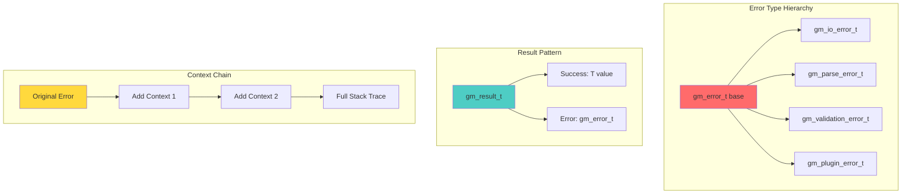
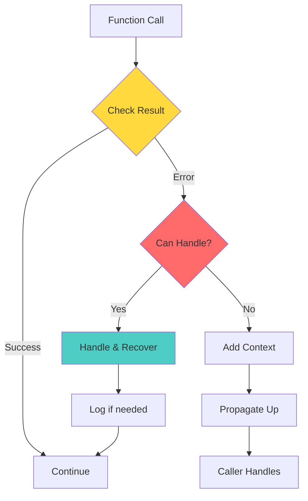

# 🚨 Error Handling Revolution: Gameplan

> _“Fail loudly, catch gracefully, propagate meaningfully.”_

## Executive Summary

Transform git-mind’s error handling from ad-hoc string returns and silent failures into a robust, type-safe, context-preserving error system that makes debugging a joy and resilience testable.

## 🎯 Domain Overview

### Current State (The Problem)

```c
// 😱 What we're escaping from:
if (some_operation() == -1) {
    printf("Error occurred\n");  // Where? Why? What now?
    return NULL;                 // Silent failure cascade
}
```

### Future State (The Vision)

```c
// 🎉 Where we're going:
gm_result_t result = some_operation();
if (!gm_ok(result)) {
    return gm_error_propagate(result, 
        "Failed while processing edge %s", edge_id);
}
```

## 🏗️ Architecture Design



## 📋 Core Features Required

### 1. Base Error Type System

```c
// In core/include/gitmind/error.h
typedef struct gm_error {
    gm_error_code_t code;        // Standardized error codes
    const char *message;         // Human-readable message
    const char *file;            // Source file (for debugging)
    int line;                    // Line number
    struct gm_error *cause;      // Previous error in chain
    void *context;               // Optional context data
} gm_error_t;

// Error codes enum
typedef enum {
    GM_OK = 0,
    GM_ERR_INVALID_ARG,
    GM_ERR_OUT_OF_MEMORY,
    GM_ERR_IO_FAILED,
    GM_ERR_PARSE_FAILED,
    GM_ERR_NOT_FOUND,
    GM_ERR_ALREADY_EXISTS,
    GM_ERR_PERMISSION_DENIED,
    // ... domain-specific codes
} gm_error_code_t;
```

### 2. Result<T,E> Pattern

```c
// Generic result type
#define GM_RESULT(T) \
    struct { \
        bool is_ok; \
        union { \
            T value; \
            gm_error_t *error; \
        } data; \
    }

// Convenience macros
#define GM_OK_VAL(result, val) \
    ((result).is_ok = true, (result).data.value = (val), (result))

#define GM_ERR_VAL(result, err) \
    ((result).is_ok = false, (result).data.error = (err), (result))
```

### 3. Error Context Building

<svg viewBox="0 0 800 400" xmlns="http://www.w3.org/2000/svg">
  <!-- Title -->
  <text x="400" y="30" text-anchor="middle" font-size="20" font-weight="bold">Error Context Chain Building</text>
  
  <!-- Original Error -->
  <rect x="50" y="60" width="200" height="80" fill="#ff6b6b" stroke="black" stroke-width="2"/>
  <text x="150" y="90" text-anchor="middle" font-size="14" font-weight="bold">Original Error</text>
  <text x="150" y="110" text-anchor="middle" font-size="12">ENOENT: foo.txt</text>
  <text x="150" y="130" text-anchor="middle" font-size="10">file.c:42</text>
  
  <!-- Arrow -->
  <path d="M 250 100 L 290 100" stroke="black" stroke-width="2" marker-end="url(#arrowhead)"/>
  
  <!-- Context 1 -->
  <rect x="300" y="60" width="200" height="80" fill="#ffd93d" stroke="black" stroke-width="2"/>
  <text x="400" y="90" text-anchor="middle" font-size="14" font-weight="bold">+ Context</text>
  <text x="400" y="110" text-anchor="middle" font-size="12">Loading config</text>
  <text x="400" y="130" text-anchor="middle" font-size="10">config.c:128</text>
  
  <!-- Arrow -->
  <path d="M 500 100 L 540 100" stroke="black" stroke-width="2" marker-end="url(#arrowhead)"/>
  
  <!-- Context 2 -->
  <rect x="550" y="60" width="200" height="80" fill="#4ecdc4" stroke="black" stroke-width="2"/>
  <text x="650" y="90" text-anchor="middle" font-size="14" font-weight="bold">+ Context</text>
  <text x="650" y="110" text-anchor="middle" font-size="12">Initializing app</text>
  <text x="650" y="130" text-anchor="middle" font-size="10">main.c:15</text>
  
  <!-- Final Message -->
  <rect x="100" y="200" width="600" height="120" fill="#e8f4f8" stroke="black" stroke-width="2"/>
  <text x="400" y="230" text-anchor="middle" font-size="14" font-weight="bold">Final Error Message:</text>
  <text x="400" y="260" text-anchor="middle" font-size="12">Failed to initialize app</text>
  <text x="400" y="280" text-anchor="middle" font-size="11"> └─ Failed to load config</text>
  <text x="400" y="300" text-anchor="middle" font-size="11"> └─ File not found: foo.txt (ENOENT)</text>
  
  <!-- Arrow marker -->
  <defs>
    <marker id="arrowhead" markerWidth="10" markerHeight="7" refX="10" refY="3.5" orient="auto">
      <polygon points="0 0, 10 3.5, 0 7" fill="black"/>
    </marker>
  </defs>
</svg>

### 4. Error Creation & Propagation APIs

```c
// Create new error
gm_error_t* gm_error_new(gm_error_code_t code, const char *fmt, ...);

// Add context to existing error
gm_error_t* gm_error_with_context(gm_error_t *cause, const char *fmt, ...);

// Propagate with source location
#define gm_error_propagate(err, fmt, ...) \
    gm_error_with_context_at(err, __FILE__, __LINE__, fmt, ##__VA_ARGS__)

// Check if result is ok
static inline bool gm_ok(GM_RESULT(void) result) {
    return result.is_ok;
}

// Extract error for handling
static inline gm_error_t* gm_unwrap_err(GM_RESULT(void) result) {
    return result.is_ok ? NULL : result.data.error;
}
```

### 5. Error Handling Patterns



## 🛠️ Implementation Plan

### Phase 1: Core Infrastructure (During cbor/edge Migration)

1. Create `core/include/gitmind/error.h` with base types
2. Implement error creation/propagation functions
3. Add unit tests for error system
4. Convert cbor module to use new errors

### Phase 2: Result Pattern Adoption (Next 3 Modules)

1. Define Result<T> macros
2. Convert return types progressively
3. Create examples and patterns doc
4. Measure performance impact

### Phase 3: Domain-Specific Errors (Ongoing)

1. Define error codes per module
2. Create typed errors for common cases
3. Build error recovery strategies
4. Document error handling patterns

### Phase 4: Testing & Resilience (Per Module)

1. Add error injection points
2. Create chaos testing framework
3. Test error propagation paths
4. Verify no silent failures

## 📊 Migration Strategy

### Step-by-Step Module Conversion

```c
// BEFORE: Old style
int process_edge(edge_t *edge) {
    if (!edge) return -1;
    if (validate(edge) < 0) {
        fprintf(stderr, "Invalid edge\n");
        return -2;
    }
    return 0;
}

// AFTER: New style
GM_RESULT(edge_t*) process_edge(edge_t *edge) {
    if (!edge) {
        return GM_ERR_VAL(result, 
            gm_error_new(GM_ERR_INVALID_ARG, "Edge is NULL"));
    }
    
    GM_RESULT(void) valid = validate_edge(edge);
    if (!gm_ok(valid)) {
        return GM_ERR_VAL(result,
            gm_error_propagate(gm_unwrap_err(valid), 
                "Failed to process edge %s", edge->id));
    }
    
    return GM_OK_VAL(result, edge);
}
```

## 🧪 Testing Approach

### 1. Error Creation Tests

```c
void test_error_creation(void) {
    gm_error_t *err = gm_error_new(GM_ERR_NOT_FOUND, 
        "File %s not found", "test.txt");
    
    assert(err->code == GM_ERR_NOT_FOUND);
    assert(strstr(err->message, "test.txt") != NULL);
    assert(err->cause == NULL);
    
    gm_error_free(err);
}
```

### 2. Context Chain Tests

```c
void test_error_context_chain(void) {
    gm_error_t *base = gm_error_new(GM_ERR_IO_FAILED, "Read failed");
    gm_error_t *ctx1 = gm_error_with_context(base, "Loading config");
    gm_error_t *ctx2 = gm_error_with_context(ctx1, "Starting app");
    
    // Verify chain
    assert(ctx2->cause == ctx1);
    assert(ctx1->cause == base);
    assert(base->cause == NULL);
    
    // Check full message includes all context
    char *full = gm_error_format_chain(ctx2);
    assert(strstr(full, "Read failed") != NULL);
    assert(strstr(full, "Loading config") != NULL);
    assert(strstr(full, "Starting app") != NULL);
    
    free(full);
    gm_error_free(ctx2);  // Frees entire chain
}
```

### 3. Result Pattern Tests

```c
void test_result_pattern(void) {
    // Success case
    GM_RESULT(int) success = parse_number("42");
    assert(gm_ok(success));
    assert(success.data.value == 42);
    
    // Error case  
    GM_RESULT(int) failure = parse_number("xyz");
    assert(!gm_ok(failure));
    assert(gm_unwrap_err(failure)->code == GM_ERR_PARSE_FAILED);
}
```

### 4. Error Injection for Resilience

```c
// In test builds, allow error injection
#ifdef GM_TEST_BUILD
typedef struct {
    bool should_fail;
    gm_error_code_t error_code;
    const char *error_msg;
} gm_test_injection_t;

// Inject errors for testing
void gm_test_inject_error(const char *function, gm_test_injection_t injection);
#endif

// Usage in tests
void test_error_recovery(void) {
    gm_test_inject_error("read_file", (gm_test_injection_t){
        .should_fail = true,
        .error_code = GM_ERR_IO_FAILED,
        .error_msg = "Simulated disk error"
    });
    
    GM_RESULT(config_t*) result = load_config("test.conf");
    assert(!gm_ok(result));
    
    // Verify graceful handling
    assert(gm_unwrap_err(result)->code == GM_ERR_IO_FAILED);
}
```

## 📈 Success Metrics

1. __Zero Silent Failures__: No function returns error without context
2. __100% Error Coverage__: Every error path tested
3. __Context Preservation__: Full error chains in logs
4. __Performance__: < 5% overhead vs raw return codes
5. __Developer Satisfaction__: Debugging time cut by 50%

## 🎓 Best Practices

### DO

- ✅ Always propagate errors with context
- ✅ Use typed errors for common cases
- ✅ Test both success and failure paths
- ✅ Log errors at appropriate boundaries
- ✅ Clean up resources on error paths

### DON’T

- ❌ Swallow errors silently
- ❌ Use generic error messages
- ❌ Panic in library code
- ❌ Leak memory on error paths
- ❌ Mix error handling styles

## 🔗 Integration Points

### With Memory Architecture

- Errors must be allocated via gm_mem
- Error chains freed recursively
- Consider arena allocation for temporary errors

### With Observability

- Structured error logging
- Error metrics/counters
- Trace error propagation paths

### With Testing Infrastructure

- Error injection framework
- Chaos testing support
- Coverage of error paths

## 📚 References

- [Rust's Result<T,E>](https://doc.rust-lang.org/book/ch09-02-recoverable-errors-with-result.html) - Inspiration
- [Go's error handling](https://go.dev/blog/error-handling-and-go) - Context wrapping
- [C++ Expected](https://en.cppreference.com/w/cpp/utility/expected) - Modern C++ approach

---

_“The best error messages are the ones that tell you exactly what went wrong, where it went wrong, why it went wrong, and what you can do about it.”_
