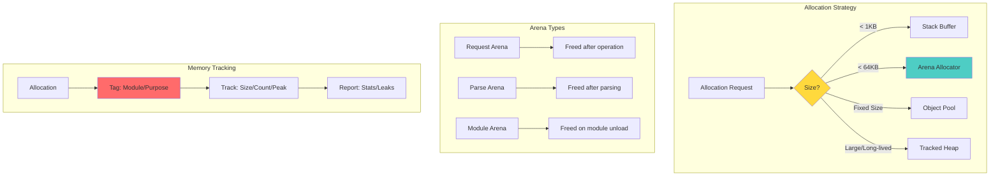
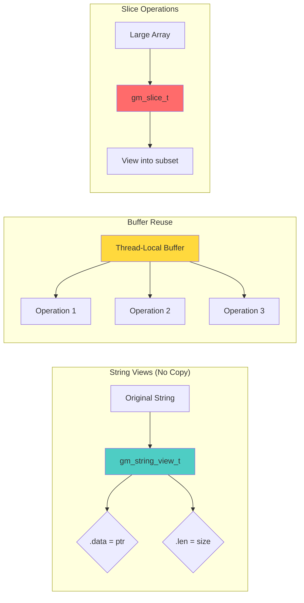

# 🧠 Memory Architecture Revolution: Gameplan

> _"Know where every byte lives and dies. Embrace arenas, pools, and lifetimes."_

## Executive Summary

Transform git-mind from malloc/free chaos into a structured memory architecture with arena allocators, explicit ownership, built-in observability, and zero-allocation fast paths. Make memory bugs extinct through design, not debugging.

## 🎯 Domain Overview

### The Memory Hierarchy Problem

```svg
<svg viewBox="0 0 800 600" xmlns="http://www.w3.org/2000/svg">
  <!-- Title -->
  <text x="400" y="30" text-anchor="middle" font-size="20" font-weight="bold">Git-Mind Memory Architecture</text>
  
  <!-- Stack -->
  <rect x="50" y="60" width="150" height="400" fill="#4ecdc4" stroke="black" stroke-width="2"/>
  <text x="125" y="90" text-anchor="middle" font-size="16" font-weight="bold">Stack</text>
  <text x="125" y="110" text-anchor="middle" font-size="12">• Fast</text>
  <text x="125" y="130" text-anchor="middle" font-size="12">• Limited size</text>
  <text x="125" y="150" text-anchor="middle" font-size="12">• Auto cleanup</text>
  <rect x="60" y="180" width="130" height="40" fill="#e8f4f8" stroke="black"/>
  <text x="125" y="205" text-anchor="middle" font-size="11">Local buffers</text>
  <rect x="60" y="230" width="130" height="40" fill="#e8f4f8" stroke="black"/>
  <text x="125" y="255" text-anchor="middle" font-size="11">Small structs</text>
  
  <!-- Arenas -->
  <rect x="250" y="60" width="200" height="400" fill="#ffd93d" stroke="black" stroke-width="2"/>
  <text x="350" y="90" text-anchor="middle" font-size="16" font-weight="bold">Arena Allocators</text>
  <text x="350" y="110" text-anchor="middle" font-size="12">• Bulk free</text>
  <text x="350" y="130" text-anchor="middle" font-size="12">• No fragmentation</text>
  <text x="350" y="150" text-anchor="middle" font-size="12">• Cache friendly</text>
  <rect x="260" y="180" width="180" height="60" fill="#fff3cd" stroke="black"/>
  <text x="350" y="205" text-anchor="middle" font-size="11">Request Arena</text>
  <text x="350" y="225" text-anchor="middle" font-size="11">(per operation)</text>
  <rect x="260" y="250" width="180" height="60" fill="#fff3cd" stroke="black"/>
  <text x="350" y="275" text-anchor="middle" font-size="11">Parse Arena</text>
  <text x="350" y="295" text-anchor="middle" font-size="11">(temp data)</text>
  <rect x="260" y="320" width="180" height="60" fill="#fff3cd" stroke="black"/>
  <text x="350" y="345" text-anchor="middle" font-size="11">Graph Arena</text>
  <text x="350" y="365" text-anchor="middle" font-size="11">(traversals)</text>
  
  <!-- Pools -->
  <rect x="500" y="60" width="150" height="400" fill="#ff6b6b" stroke="black" stroke-width="2"/>
  <text x="575" y="90" text-anchor="middle" font-size="16" font-weight="bold">Object Pools</text>
  <text x="575" y="110" text-anchor="middle" font-size="12">• Fixed size</text>
  <text x="575" y="130" text-anchor="middle" font-size="12">• Fast alloc</text>
  <text x="575" y="150" text-anchor="middle" font-size="12">• Reusable</text>
  <rect x="510" y="180" width="130" height="50" fill="#ffcccc" stroke="black"/>
  <text x="575" y="205" text-anchor="middle" font-size="11">Edge Pool</text>
  <text x="575" y="220" text-anchor="middle" font-size="11">(8KB blocks)</text>
  <rect x="510" y="240" width="130" height="50" fill="#ffcccc" stroke="black"/>
  <text x="575" y="265" text-anchor="middle" font-size="11">Node Pool</text>
  <text x="575" y="280" text-anchor="middle" font-size="11">(4KB blocks)</text>
  <rect x="510" y="300" width="130" height="50" fill="#ffcccc" stroke="black"/>
  <text x="575" y="325" text-anchor="middle" font-size="11">Buffer Pool</text>
  <text x="575" y="340" text-anchor="middle" font-size="11">(64KB blocks)</text>
  
  <!-- Heap (minimized) -->
  <rect x="680" y="60" width="100" height="400" fill="#e0e0e0" stroke="black" stroke-width="2"/>
  <text x="730" y="90" text-anchor="middle" font-size="16" font-weight="bold">Heap</text>
  <text x="730" y="110" text-anchor="middle" font-size="12">• Last resort</text>
  <text x="730" y="130" text-anchor="middle" font-size="12">• Long-lived</text>
  <text x="730" y="150" text-anchor="middle" font-size="12">• Tracked</text>
  
  <!-- Lifetime indicators -->
  <text x="125" y="490" text-anchor="middle" font-size="14" font-weight="bold">µs-ms</text>
  <text x="350" y="490" text-anchor="middle" font-size="14" font-weight="bold">Operation</text>
  <text x="575" y="490" text-anchor="middle" font-size="14" font-weight="bold">Session</text>
  <text x="730" y="490" text-anchor="middle" font-size="14" font-weight="bold">Process</text>
  
  <!-- Usage flow -->
  <path d="M 200 250 L 240 250" stroke="black" stroke-width="2" marker-end="url(#arrowhead)"/>
  <path d="M 450 290 L 490 290" stroke="black" stroke-width="2" marker-end="url(#arrowhead)"/>
  <path d="M 650 320 L 670 320" stroke="black" stroke-width="2" marker-end="url(#arrowhead)"/>
  
  <!-- Arrow marker -->
  <defs>
    <marker id="arrowhead" markerWidth="10" markerHeight="7" refX="10" refY="3.5" orient="auto">
      <polygon points="0 0, 10 3.5, 0 7" fill="black"/>
    </marker>
  </defs>
</svg>
```

### Current Problems We're Solving

1. __Memory Leaks__: Lost allocations in error paths
2. __Fragmentation__: Many small allocs/frees
3. __Cache Misses__: Data scattered across heap
4. __No Visibility__: Can't track who allocates what
5. __Manual Management__: Easy to forget cleanup

## 🏗️ Architecture Design



## 📋 Core Features Required

### 1. Arena Allocator System

```c
// core/include/gitmind/arena.h
typedef struct gm_arena {
    uint8_t *memory;      // Base memory block
    size_t capacity;      // Total size
    size_t used;         // Current usage
    size_t peak;         // Peak usage (metrics)
    struct gm_arena *overflow;  // Chain for large requests
    const char *name;    // For debugging/metrics
} gm_arena_t;

// Arena lifecycle
gm_arena_t* gm_arena_create(size_t initial_size, const char *name);
void* gm_arena_alloc(gm_arena_t *arena, size_t size);
void* gm_arena_alloc_aligned(gm_arena_t *arena, size_t size, size_t align);
void gm_arena_reset(gm_arena_t *arena);  // Fast bulk free
void gm_arena_destroy(gm_arena_t *arena);

// Scoped arena for RAII-style cleanup
#define GM_WITH_ARENA(arena, size, name) \
    for (gm_arena_t *arena = gm_arena_create(size, name); \
         arena; \
         gm_arena_destroy(arena), arena = NULL)
```

### 2. Object Pool System

```c
// core/include/gitmind/pool.h
typedef struct gm_pool {
    void *free_list;      // Linked list of free objects
    uint8_t *blocks;      // Memory blocks
    size_t object_size;   // Size of each object
    size_t block_size;    // Objects per block
    size_t total_objects; // Stats
    size_t free_objects;  // Stats
    const char *name;     // For debugging
} gm_pool_t;

// Pool operations
gm_pool_t* gm_pool_create(size_t object_size, size_t initial_count, const char *name);
void* gm_pool_alloc(gm_pool_t *pool);
void gm_pool_free(gm_pool_t *pool, void *object);
void gm_pool_destroy(gm_pool_t *pool);

// Typed pool for common objects
#define GM_POOL_FOR(type) \
    gm_pool_create(sizeof(type), 1024, #type "_pool")
```

### 3. Memory Tagging & Observability

```c
// Memory tags for tracking
typedef enum {
    GM_MEM_TAG_GENERAL,
    GM_MEM_TAG_EDGE,
    GM_MEM_TAG_NODE,
    GM_MEM_TAG_PARSE,
    GM_MEM_TAG_CBOR,
    GM_MEM_TAG_PLUGIN,
    GM_MEM_TAG_CACHE,
    GM_MEM_TAG_TEMP,
    GM_MEM_TAG_COUNT
} gm_mem_tag_t;

// Tagged allocation
void* gm_mem_alloc_tagged(size_t size, gm_mem_tag_t tag);
void gm_mem_free_tagged(void *ptr, gm_mem_tag_t tag);

// Memory statistics
typedef struct {
    size_t current_bytes;
    size_t peak_bytes;
    size_t total_allocs;
    size_t total_frees;
    size_t alloc_count;
} gm_mem_stats_t;

gm_mem_stats_t gm_mem_get_stats(gm_mem_tag_t tag);
void gm_mem_report_stats(void);
```

### 4. Zero-Allocation Patterns



```c
// String view - no allocation
typedef struct {
    const char *data;
    size_t len;
} gm_string_view_t;

// Array slice - no copy
typedef struct {
    const void *data;
    size_t offset;
    size_t count;
    size_t elem_size;
} gm_slice_t;

// Buffer reuse pattern
typedef struct {
    uint8_t *buffer;
    size_t capacity;
    size_t used;
} gm_buffer_t;

// Zero-alloc operations
gm_string_view_t gm_str_view(const char *str, size_t len);
gm_slice_t gm_slice(const void *array, size_t start, size_t count, size_t elem_size);
int gm_buffer_append(gm_buffer_t *buf, const void *data, size_t len);
```

### 5. Lifecycle Management

```svg
<svg viewBox="0 0 800 500" xmlns="http://www.w3.org/2000/svg">
  <!-- Title -->
  <text x="400" y="30" text-anchor="middle" font-size="20" font-weight="bold">Memory Lifecycle Patterns</text>
  
  <!-- Pattern 1: Arena Scope -->
  <g transform="translate(50, 60)">
    <rect width="300" height="150" fill="#e8f4f8" stroke="black" stroke-width="2"/>
    <text x="150" y="25" text-anchor="middle" font-size="14" font-weight="bold">Arena Scope Pattern</text>
    <rect x="20" y="40" width="260" height="30" fill="#4ecdc4" stroke="black"/>
    <text x="150" y="60" text-anchor="middle" font-size="12">GM_WITH_ARENA(arena, 64KB)</text>
    <rect x="40" y="80" width="220" height="20" fill="#b8e6e6" stroke="black"/>
    <text x="150" y="95" text-anchor="middle" font-size="11">alloc, alloc, alloc...</text>
    <rect x="40" y="110" width="220" height="20" fill="#b8e6e6" stroke="black"/>
    <text x="150" y="125" text-anchor="middle" font-size="11">automatic cleanup at end</text>
  </g>
  
  <!-- Pattern 2: Pool Lifecycle -->
  <g transform="translate(400, 60)">
    <rect width="300" height="150" fill="#fff3cd" stroke="black" stroke-width="2"/>
    <text x="150" y="25" text-anchor="middle" font-size="14" font-weight="bold">Pool Lifecycle Pattern</text>
    <rect x="20" y="40" width="120" height="30" fill="#ffd93d" stroke="black"/>
    <text x="80" y="60" text-anchor="middle" font-size="12">Create Pool</text>
    <rect x="160" y="40" width="120" height="30" fill="#ffd93d" stroke="black"/>
    <text x="220" y="60" text-anchor="middle" font-size="12">Destroy Pool</text>
    <path d="M 80 80 L 80 140 L 220 140 L 220 80" stroke="black" stroke-width="1" fill="none"/>
    <text x="150" y="110" text-anchor="middle" font-size="11">alloc → use → free → reuse</text>
  </g>
  
  <!-- Pattern 3: Ownership Transfer -->
  <g transform="translate(200, 250)">
    <rect width="400" height="150" fill="#ffcccc" stroke="black" stroke-width="2"/>
    <text x="200" y="25" text-anchor="middle" font-size="14" font-weight="bold">Ownership Transfer Pattern</text>
    <rect x="20" y="40" width="100" height="40" fill="#ff6b6b" stroke="black"/>
    <text x="70" y="65" text-anchor="middle" font-size="12">Creator</text>
    <path d="M 120 60 L 180 60" stroke="black" stroke-width="2" marker-end="url(#arrowhead)"/>
    <text x="150" y="50" text-anchor="middle" font-size="10">transfer</text>
    <rect x="180" y="40" width="100" height="40" fill="#ff9999" stroke="black"/>
    <text x="230" y="65" text-anchor="middle" font-size="12">New Owner</text>
    <text x="200" y="110" text-anchor="middle" font-size="11">Clear ownership = no leaks</text>
  </g>
  
  <!-- Arrow marker -->
  <defs>
    <marker id="arrowhead" markerWidth="10" markerHeight="7" refX="10" refY="3.5" orient="auto">
      <polygon points="0 0, 10 3.5, 0 7" fill="black"/>
    </marker>
  </defs>
</svg>
```

## 🛠️ Implementation Plan

### Phase 1: Foundation (First 2 Modules)

1. Implement basic arena allocator
2. Create memory tagging system
3. Add gm_mem.h with secure wrappers
4. Convert edge module to use arenas

### Phase 2: Pools & Patterns (Next 3 Modules)

1. Implement object pool system
2. Create common pools (edges, nodes, buffers)
3. Add zero-allocation patterns
4. Convert high-frequency allocations

### Phase 3: Observability (Ongoing)

1. Add memory statistics tracking
2. Create memory report functions
3. Build allocation heatmaps
4. Add peak usage tracking

### Phase 4: Advanced Features (Later)

1. Thread-local arenas
2. Lock-free pools
3. Memory pressure callbacks
4. Custom allocator backends

## 📊 Migration Strategy

### Converting a Module to Arena Allocation

```c
// BEFORE: Traditional allocation
edge_t* create_edge(const char *from, const char *to) {
    edge_t *edge = malloc(sizeof(edge_t));
    if (!edge) return NULL;
    
    edge->from = strdup(from);  // Leak risk!
    edge->to = strdup(to);      // Leak risk!
    
    if (!edge->from || !edge->to) {
        free(edge->from);
        free(edge->to);
        free(edge);
        return NULL;
    }
    return edge;
}

// AFTER: Arena-based allocation
edge_t* create_edge_arena(gm_arena_t *arena, 
                         const char *from, const char *to) {
    edge_t *edge = gm_arena_alloc(arena, sizeof(edge_t));
    
    size_t from_len = strlen(from) + 1;
    size_t to_len = strlen(to) + 1;
    
    edge->from = gm_arena_alloc(arena, from_len);
    edge->to = gm_arena_alloc(arena, to_len);
    
    gm_memcpy(edge->from, from, from_len);
    gm_memcpy(edge->to, to, to_len);
    
    return edge;  // No error paths, no leaks!
}
```

### Converting to Object Pools

```c
// BEFORE: malloc/free for each edge
void process_edges(edge_t **edges, size_t count) {
    for (size_t i = 0; i < count; i++) {
        edge_t *copy = malloc(sizeof(edge_t));
        // ... process ...
        free(copy);
    }
}

// AFTER: Pool allocation
void process_edges_pooled(gm_pool_t *pool, edge_t **edges, size_t count) {
    for (size_t i = 0; i < count; i++) {
        edge_t *copy = gm_pool_alloc(pool);
        // ... process ...
        gm_pool_free(pool, copy);  // Instant reuse!
    }
}
```

## 🧪 Testing Approach

### 1. Arena Allocator Tests

```c
void test_arena_basic(void) {
    GM_WITH_ARENA(arena, 1024, "test") {
        void *p1 = gm_arena_alloc(arena, 100);
        void *p2 = gm_arena_alloc(arena, 200);
        
        assert(p1 != NULL);
        assert(p2 != NULL);
        assert((char*)p2 >= (char*)p1 + 100);
        
        // Verify alignment
        void *p3 = gm_arena_alloc_aligned(arena, 64, 16);
        assert(((uintptr_t)p3 % 16) == 0);
    }
    // Arena automatically freed here
}

void test_arena_overflow(void) {
    GM_WITH_ARENA(arena, 1024, "test") {
        // Request larger than initial size
        void *big = gm_arena_alloc(arena, 2048);
        assert(big != NULL);
        assert(arena->overflow != NULL);
    }
}
```

### 2. Pool Tests

```c
void test_pool_reuse(void) {
    gm_pool_t *pool = gm_pool_create(sizeof(edge_t), 10, "edge_pool");
    
    // Allocate all
    edge_t *edges[10];
    for (int i = 0; i < 10; i++) {
        edges[i] = gm_pool_alloc(pool);
        assert(edges[i] != NULL);
    }
    
    // Pool exhausted
    assert(gm_pool_alloc(pool) == NULL);
    
    // Free one and reallocate
    gm_pool_free(pool, edges[5]);
    edge_t *reused = gm_pool_alloc(pool);
    assert(reused == edges[5]);  // Same memory!
    
    gm_pool_destroy(pool);
}
```

### 3. Memory Tracking Tests

```c
void test_memory_tags(void) {
    gm_mem_stats_t before = gm_mem_get_stats(GM_MEM_TAG_EDGE);
    
    void *p1 = gm_mem_alloc_tagged(1024, GM_MEM_TAG_EDGE);
    void *p2 = gm_mem_alloc_tagged(2048, GM_MEM_TAG_EDGE);
    
    gm_mem_stats_t during = gm_mem_get_stats(GM_MEM_TAG_EDGE);
    assert(during.current_bytes == before.current_bytes + 3072);
    assert(during.alloc_count == before.alloc_count + 2);
    
    gm_mem_free_tagged(p1, GM_MEM_TAG_EDGE);
    gm_mem_free_tagged(p2, GM_MEM_TAG_EDGE);
    
    gm_mem_stats_t after = gm_mem_get_stats(GM_MEM_TAG_EDGE);
    assert(after.current_bytes == before.current_bytes);
}
```

### 4. Zero-Allocation Tests

```c
void test_string_views(void) {
    const char *original = "Hello, World!";
    
    // No allocation for substring
    gm_string_view_t view = gm_str_view(original + 7, 5);
    assert(view.len == 5);
    assert(strncmp(view.data, "World", 5) == 0);
    
    // Verify no heap allocation occurred
    gm_mem_stats_t stats = gm_mem_get_stats(GM_MEM_TAG_GENERAL);
    assert(stats.total_allocs == 0);
}
```

## 📈 Success Metrics

1. __Memory Efficiency__: 50% reduction in allocations
2. __Performance__: 30% faster graph operations
3. __Zero Leaks__: Valgrind-clean on all tests
4. __Observability__: Full allocation tracking
5. __Cache Efficiency__: 2x better locality

## 🎓 Best Practices

### DO

- ✅ Use arenas for request-scoped data
- ✅ Use pools for fixed-size objects
- ✅ Tag all allocations
- ✅ Prefer stack buffers for small data
- ✅ Design for bulk cleanup

### DON'T

- ❌ Mix arena and manual memory
- ❌ Hold arena pointers past scope
- ❌ Allocate tiny objects individually
- ❌ Forget to track metrics
- ❌ Over-optimize prematurely

## 🔗 Integration Points

### With Error Handling

- Errors allocated from request arena
- No cleanup needed on error paths
- Error chains in arena memory

### With Testing

- Memory leak detection
- Allocation failure injection
- Performance benchmarks

### With Observability

- Memory metrics exported
- Allocation heatmaps
- OOM prediction

## 📚 References

- [jemalloc](http://jemalloc.net/) - Advanced allocator techniques
- [Arena Allocation](https://en.wikipedia.org/wiki/Region-based_memory_management) - Theory
- [mimalloc](https://github.com/microsoft/mimalloc) - Modern allocator design
- [Linux Kernel Slab](https://www.kernel.org/doc/gorman/html/understand/understand011.html) - Object pools

---

_"The heap is a harsh mistress. Arenas set you free."_
