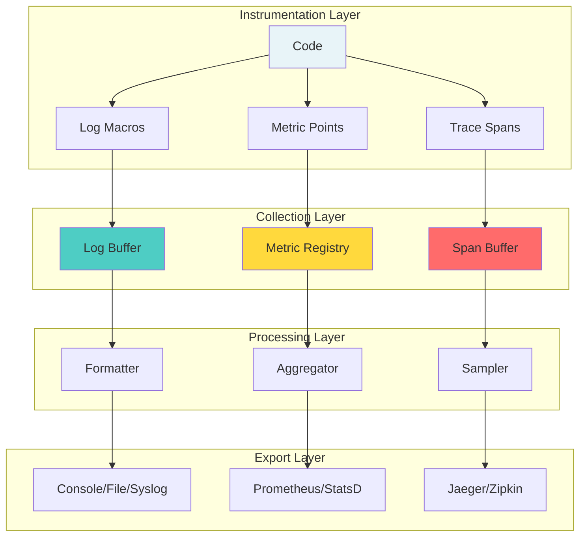
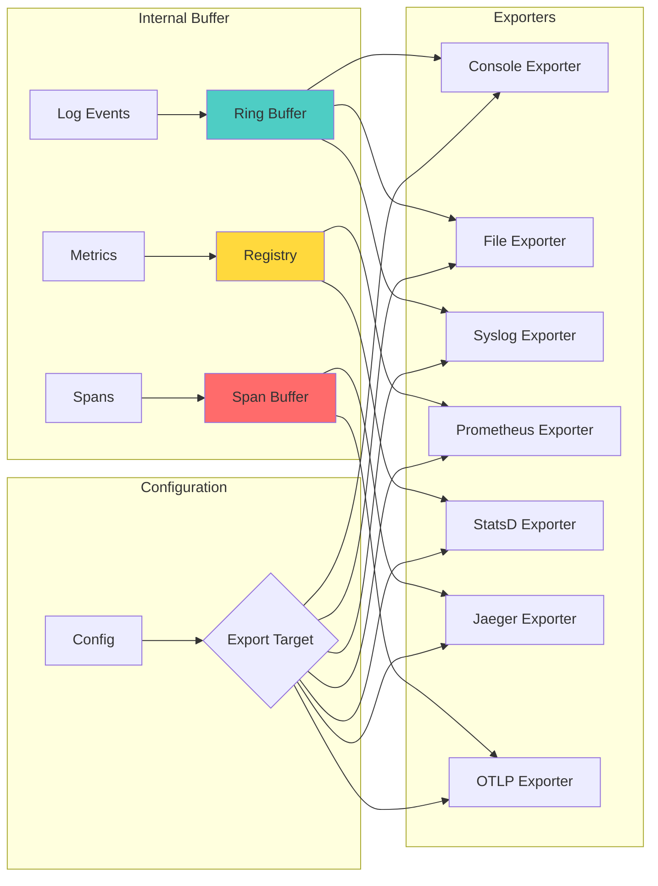

# 🔍 Observability Built-In: Gameplan

> _"Make the invisible visible."_

## Executive Summary

Transform git-mind from a black box into a transparent, observable system with structured logging, performance metrics, distributed tracing support, and built-in telemetry. Enable developers to understand system behavior in development, testing, and production.

## 🎯 Domain Overview

### The Observability Pillars

```svg
<svg viewBox="0 0 800 600" xmlns="http://www.w3.org/2000/svg">
  <!-- Title -->
  <text x="400" y="30" text-anchor="middle" font-size="20" font-weight="bold">Three Pillars of Observability</text>
  
  <!-- Logging Pillar -->
  <g transform="translate(100, 80)">
    <rect width="180" height="400" fill="#4ecdc4" stroke="black" stroke-width="3"/>
    <text x="90" y="30" text-anchor="middle" font-size="16" font-weight="bold">LOGS</text>
    <text x="90" y="50" text-anchor="middle" font-size="12">Discrete Events</text>
    
    <rect x="20" y="70" width="140" height="50" fill="#b8e6e6" stroke="black"/>
    <text x="90" y="90" text-anchor="middle" font-size="11">Structured</text>
    <text x="90" y="105" text-anchor="middle" font-size="10">JSON/Key-Value</text>
    
    <rect x="20" y="130" width="140" height="50" fill="#b8e6e6" stroke="black"/>
    <text x="90" y="150" text-anchor="middle" font-size="11">Contextual</text>
    <text x="90" y="165" text-anchor="middle" font-size="10">Request ID, User</text>
    
    <rect x="20" y="190" width="140" height="50" fill="#b8e6e6" stroke="black"/>
    <text x="90" y="210" text-anchor="middle" font-size="11">Leveled</text>
    <text x="90" y="225" text-anchor="middle" font-size="10">TRACE→ERROR</text>
    
    <rect x="20" y="250" width="140" height="50" fill="#b8e6e6" stroke="black"/>
    <text x="90" y="270" text-anchor="middle" font-size="11">Tagged</text>
    <text x="90" y="285" text-anchor="middle" font-size="10">[module][action]</text>
  </g>
  
  <!-- Metrics Pillar -->
  <g transform="translate(310, 80)">
    <rect width="180" height="400" fill="#ffd93d" stroke="black" stroke-width="3"/>
    <text x="90" y="30" text-anchor="middle" font-size="16" font-weight="bold">METRICS</text>
    <text x="90" y="50" text-anchor="middle" font-size="12">Numeric Measures</text>
    
    <rect x="20" y="70" width="140" height="50" fill="#fff3cd" stroke="black"/>
    <text x="90" y="90" text-anchor="middle" font-size="11">Counters</text>
    <text x="90" y="105" text-anchor="middle" font-size="10">edges_created</text>
    
    <rect x="20" y="130" width="140" height="50" fill="#fff3cd" stroke="black"/>
    <text x="90" y="150" text-anchor="middle" font-size="11">Gauges</text>
    <text x="90" y="165" text-anchor="middle" font-size="10">memory_used</text>
    
    <rect x="20" y="190" width="140" height="50" fill="#fff3cd" stroke="black"/>
    <text x="90" y="210" text-anchor="middle" font-size="11">Histograms</text>
    <text x="90" y="225" text-anchor="middle" font-size="10">request_duration</text>
    
    <rect x="20" y="250" width="140" height="50" fill="#fff3cd" stroke="black"/>
    <text x="90" y="270" text-anchor="middle" font-size="11">Summaries</text>
    <text x="90" y="285" text-anchor="middle" font-size="10">p50, p95, p99</text>
  </g>
  
  <!-- Traces Pillar -->
  <g transform="translate(520, 80)">
    <rect width="180" height="400" fill="#ff6b6b" stroke="black" stroke-width="3"/>
    <text x="90" y="30" text-anchor="middle" font-size="16" font-weight="bold">TRACES</text>
    <text x="90" y="50" text-anchor="middle" font-size="12">Request Flow</text>
    
    <rect x="20" y="70" width="140" height="50" fill="#ffcccc" stroke="black"/>
    <text x="90" y="90" text-anchor="middle" font-size="11">Spans</text>
    <text x="90" y="105" text-anchor="middle" font-size="10">Operation timing</text>
    
    <rect x="20" y="130" width="140" height="50" fill="#ffcccc" stroke="black"/>
    <text x="90" y="150" text-anchor="middle" font-size="11">Context</text>
    <text x="90" y="165" text-anchor="middle" font-size="10">Propagation</text>
    
    <rect x="20" y="190" width="140" height="50" fill="#ffcccc" stroke="black"/>
    <text x="90" y="210" text-anchor="middle" font-size="11">Correlation</text>
    <text x="90" y="225" text-anchor="middle" font-size="10">Request → Logs</text>
    
    <rect x="20" y="250" width="140" height="50" fill="#ffcccc" stroke="black"/>
    <text x="90" y="270" text-anchor="middle" font-size="11">Sampling</text>
    <text x="90" y="285" text-anchor="middle" font-size="10">Smart selection</text>
  </g>
  
  <!-- Integration arrows -->
  <path d="M 280 280 L 310 280" stroke="black" stroke-width="2" marker-end="url(#arrowhead)"/>
  <path d="M 490 280 L 520 280" stroke="black" stroke-width="2" marker-end="url(#arrowhead)"/>
  
  <!-- Bottom integration -->
  <rect x="200" y="510" width="400" height="60" fill="#e8f4f8" stroke="black" stroke-width="2"/>
  <text x="400" y="540" text-anchor="middle" font-size="14" font-weight="bold">Unified Observability Platform</text>
  <text x="400" y="560" text-anchor="middle" font-size="12">OpenTelemetry Compatible</text>
  
  <!-- Arrow marker -->
  <defs>
    <marker id="arrowhead" markerWidth="10" markerHeight="7" refX="10" refY="3.5" orient="auto">
      <polygon points="0 0, 10 3.5, 0 7" fill="black"/>
    </marker>
  </defs>
</svg>
```

## 🏗️ Architecture Design



## 📋 Core Features Required

### 1. Structured Logging System

```c
// core/include/gitmind/log.h

// Log levels
typedef enum {
    GM_LOG_TRACE = 0,
    GM_LOG_DEBUG = 1,
    GM_LOG_INFO = 2,
    GM_LOG_WARN = 3,
    GM_LOG_ERROR = 4,
    GM_LOG_FATAL = 5
} gm_log_level_t;

// Log context for structured data
typedef struct gm_log_context {
    const char *module;      // e.g., "edge", "cbor", "plugin"
    const char *operation;   // e.g., "create", "parse", "validate"
    const char *request_id;  // Correlation ID
    const char *user_id;     // For audit trails
    // Key-value pairs for additional context
    struct {
        const char *key;
        const char *value;
    } fields[16];
    size_t field_count;
} gm_log_context_t;

// Logging macros with automatic source location
#define GM_LOG(level, ctx, fmt, ...) \
    gm_log_emit(level, ctx, __FILE__, __LINE__, __func__, fmt, ##__VA_ARGS__)

#define GM_TRACE(ctx, fmt, ...) GM_LOG(GM_LOG_TRACE, ctx, fmt, ##__VA_ARGS__)
#define GM_DEBUG(ctx, fmt, ...) GM_LOG(GM_LOG_DEBUG, ctx, fmt, ##__VA_ARGS__)
#define GM_INFO(ctx, fmt, ...)  GM_LOG(GM_LOG_INFO, ctx, fmt, ##__VA_ARGS__)
#define GM_WARN(ctx, fmt, ...)  GM_LOG(GM_LOG_WARN, ctx, fmt, ##__VA_ARGS__)
#define GM_ERROR(ctx, fmt, ...) GM_LOG(GM_LOG_ERROR, ctx, fmt, ##__VA_ARGS__)

// Structured field helpers
#define GM_LOG_FIELD(ctx, key, value) \
    gm_log_add_field(ctx, key, value)

// Module-specific loggers
#define GM_LOG_MODULE(module) \
    ((gm_log_context_t){.module = module, .field_count = 0})
```

### 2. Performance Metrics System

```c
// core/include/gitmind/metrics.h

// Metric types
typedef enum {
    GM_METRIC_COUNTER,   // Monotonic increase
    GM_METRIC_GAUGE,     // Can go up/down
    GM_METRIC_HISTOGRAM, // Distribution of values
    GM_METRIC_SUMMARY    // Percentiles
} gm_metric_type_t;

// Metric handle
typedef struct gm_metric gm_metric_t;

// Create metrics
gm_metric_t* gm_metric_counter(const char *name, const char *help);
gm_metric_t* gm_metric_gauge(const char *name, const char *help);
gm_metric_t* gm_metric_histogram(const char *name, const char *help, 
                                 double *buckets, size_t bucket_count);

// Metric operations
void gm_counter_inc(gm_metric_t *counter);
void gm_counter_add(gm_metric_t *counter, double value);
void gm_gauge_set(gm_metric_t *gauge, double value);
void gm_histogram_observe(gm_metric_t *hist, double value);

// Common metrics
extern gm_metric_t *gm_edges_created;
extern gm_metric_t *gm_nodes_created;
extern gm_metric_t *gm_memory_bytes;
extern gm_metric_t *gm_request_duration;

// Timer helper
typedef struct {
    gm_metric_t *metric;
    uint64_t start_ns;
} gm_timer_t;

#define GM_TIMER_START(timer, metric) \
    ((timer) = (gm_timer_t){.metric = metric, .start_ns = gm_time_ns()})

#define GM_TIMER_STOP(timer) \
    gm_histogram_observe((timer).metric, \
        (double)(gm_time_ns() - (timer).start_ns) / 1e9)
```

### 3. Distributed Tracing Support

```c
// core/include/gitmind/trace.h

// Trace context
typedef struct {
    uint64_t trace_id[2];  // 128-bit trace ID
    uint64_t span_id;      // 64-bit span ID
    uint64_t parent_id;    // Parent span ID
    uint8_t flags;         // Sampling, etc.
} gm_trace_context_t;

// Span lifecycle
typedef struct gm_span gm_span_t;

gm_span_t* gm_span_start(const char *name, gm_trace_context_t *parent);
void gm_span_end(gm_span_t *span);

// Span attributes
void gm_span_set_string(gm_span_t *span, const char *key, const char *value);
void gm_span_set_int(gm_span_t *span, const char *key, int64_t value);
void gm_span_set_bool(gm_span_t *span, const char *key, bool value);

// Span events
void gm_span_add_event(gm_span_t *span, const char *name);
void gm_span_record_error(gm_span_t *span, gm_error_t *error);

// Convenience macro for auto-closing spans
#define GM_WITH_SPAN(span, name, parent) \
    for (gm_span_t *span = gm_span_start(name, parent); \
         span; \
         gm_span_end(span), span = NULL)
```

### 4. Telemetry Export Infrastructure



### 5. Debug & Development Tools

```svg
<svg viewBox="0 0 800 500" xmlns="http://www.w3.org/2000/svg">
  <!-- Title -->
  <text x="400" y="30" text-anchor="middle" font-size="20" font-weight="bold">Debug Observability Tools</text>
  
  <!-- Live Dashboard -->
  <g transform="translate(50, 60)">
    <rect width="320" height="180" fill="#e8f4f8" stroke="black" stroke-width="2"/>
    <text x="160" y="25" text-anchor="middle" font-size="14" font-weight="bold">Live Debug Dashboard</text>
    
    <rect x="20" y="40" width="280" height="30" fill="#4ecdc4" stroke="black"/>
    <text x="160" y="60" text-anchor="middle" font-size="12">Memory: 45.2 MB (↑ 2.1 MB/s)</text>
    
    <rect x="20" y="80" width="280" height="30" fill="#ffd93d" stroke="black"/>
    <text x="160" y="100" text-anchor="middle" font-size="12">Edges: 1,234 | Nodes: 567</text>
    
    <rect x="20" y="120" width="280" height="30" fill="#ff6b6b" stroke="black"/>
    <text x="160" y="140" text-anchor="middle" font-size="12">Req/s: 42 | p95: 23ms</text>
  </g>
  
  <!-- Trace Viewer -->
  <g transform="translate(430, 60)">
    <rect width="320" height="180" fill="#fff3cd" stroke="black" stroke-width="2"/>
    <text x="160" y="25" text-anchor="middle" font-size="14" font-weight="bold">Request Trace Viewer</text>
    
    <!-- Waterfall diagram -->
    <rect x="20" y="40" width="200" height="20" fill="#4ecdc4" stroke="black"/>
    <text x="25" y="55" font-size="11">parse_request [2ms]</text>
    
    <rect x="40" y="65" width="150" height="20" fill="#ffd93d" stroke="black"/>
    <text x="45" y="80" font-size="11">load_graph [15ms]</text>
    
    <rect x="60" y="90" width="100" height="20" fill="#ff6b6b" stroke="black"/>
    <text x="65" y="105" font-size="11">traverse [8ms]</text>
    
    <rect x="40" y="115" width="180" height="20" fill="#b8e6e6" stroke="black"/>
    <text x="45" y="130" font-size="11">serialize_result [3ms]</text>
  </g>
  
  <!-- Log Stream -->
  <g transform="translate(50, 270)">
    <rect width="700" height="200" fill="#f0f0f0" stroke="black" stroke-width="2"/>
    <text x="350" y="25" text-anchor="middle" font-size="14" font-weight="bold">Live Log Stream</text>
    
    <text x="20" y="50" font-family="monospace" font-size="10">
      <tspan x="20" dy="15">[2024-01-15 10:23:45.123] [INFO] [edge] Creating edge: src/main.c → src/util.c</tspan>
      <tspan x="20" dy="15">[2024-01-15 10:23:45.125] [DEBUG] [cbor] Encoding edge with 3 attributes</tspan>
      <tspan x="20" dy="15">[2024-01-15 10:23:45.126] [TRACE] [storage] Writing to .gitmind/edges/abc123...</tspan>
      <tspan x="20" dy="15">[2024-01-15 10:23:45.130] [WARN] [cache] Cache miss for node: src/util.c</tspan>
      <tspan x="20" dy="15">[2024-01-15 10:23:45.132] [ERROR] [plugin] Failed to load plugin: analytics.so</tspan>
    </text>
  </g>
</svg>
```

## 🛠️ Implementation Plan

### Phase 1: Logging Foundation (First Module)

1. Implement structured logging core
2. Add log levels and filtering
3. Create module loggers
4. Convert edge module to structured logs

### Phase 2: Basic Metrics (Next 2 Modules)

1. Implement metric types (counter, gauge)
2. Add common metrics (memory, operations)
3. Create metric registry
4. Add timer helpers

### Phase 3: Tracing Infrastructure (Module 4-5)

1. Implement span creation/management
2. Add context propagation
3. Create trace sampling
4. Integrate with operations

### Phase 4: Export & Visualization (Ongoing)

1. Add console/file exporters
2. Implement Prometheus endpoint
3. Add OTLP support
4. Create debug dashboard

## 📊 Migration Strategy

### Converting Module Logging

```c
// BEFORE: Printf debugging
void create_edge(const char *from, const char *to) {
    printf("Creating edge from %s to %s\n", from, to);
    
    if (validate_edge(from, to) < 0) {
        fprintf(stderr, "ERROR: Invalid edge\n");
        return;
    }
    
    printf("Edge created successfully\n");
}

// AFTER: Structured logging
void create_edge(const char *from, const char *to) {
    gm_log_context_t ctx = GM_LOG_MODULE("edge");
    GM_LOG_FIELD(&ctx, "from", from);
    GM_LOG_FIELD(&ctx, "to", to);
    GM_LOG_FIELD(&ctx, "operation", "create");
    
    GM_DEBUG(&ctx, "Creating edge");
    
    gm_timer_t timer;
    GM_TIMER_START(timer, gm_edge_creation_time);
    
    if (validate_edge(from, to) < 0) {
        GM_ERROR(&ctx, "Edge validation failed");
        gm_counter_inc(gm_edge_creation_failures);
        return;
    }
    
    GM_INFO(&ctx, "Edge created successfully");
    gm_counter_inc(gm_edges_created);
    GM_TIMER_STOP(timer);
}
```

### Adding Metrics to Operations

```c
// Define module metrics
static gm_metric_t *edge_operations;
static gm_metric_t *edge_validation_time;
static gm_metric_t *edge_memory_bytes;

void init_edge_metrics(void) {
    edge_operations = gm_metric_counter(
        "gitmind_edge_operations_total",
        "Total number of edge operations"
    );
    
    edge_validation_time = gm_metric_histogram(
        "gitmind_edge_validation_seconds", 
        "Time spent validating edges",
        (double[]){0.001, 0.005, 0.01, 0.05, 0.1}, 5
    );
    
    edge_memory_bytes = gm_metric_gauge(
        "gitmind_edge_memory_bytes",
        "Memory used by edge structures"
    );
}
```

## 🧪 Testing Approach

### 1. Log Output Verification

```c
void test_structured_logging(void) {
    // Capture log output
    gm_test_log_capture_start();
    
    gm_log_context_t ctx = GM_LOG_MODULE("test");
    GM_LOG_FIELD(&ctx, "user", "alice");
    GM_INFO(&ctx, "Test message with %d items", 42);
    
    const char *output = gm_test_log_capture_get();
    
    // Verify structured format
    assert(strstr(output, "\"level\":\"INFO\"") != NULL);
    assert(strstr(output, "\"module\":\"test\"") != NULL);
    assert(strstr(output, "\"user\":\"alice\"") != NULL);
    assert(strstr(output, "\"message\":\"Test message with 42 items\"") != NULL);
    
    gm_test_log_capture_stop();
}
```

### 2. Metric Collection Tests

```c
void test_metrics_collection(void) {
    gm_metric_t *test_counter = gm_metric_counter("test_ops", "Test operations");
    
    // Record some operations
    gm_counter_inc(test_counter);
    gm_counter_add(test_counter, 5);
    
    // Get metric value
    double value = gm_metric_get_value(test_counter);
    assert(value == 6.0);
    
    // Test histogram
    gm_metric_t *test_hist = gm_metric_histogram(
        "test_duration", "Test durations",
        (double[]){0.1, 0.5, 1.0}, 3
    );
    
    gm_histogram_observe(test_hist, 0.05);  // bucket 0
    gm_histogram_observe(test_hist, 0.3);   // bucket 1
    gm_histogram_observe(test_hist, 0.7);   // bucket 2
    gm_histogram_observe(test_hist, 1.5);   // bucket +Inf
    
    // Verify buckets
    gm_histogram_buckets_t buckets = gm_histogram_get_buckets(test_hist);
    assert(buckets.counts[0] == 1);  // <= 0.1
    assert(buckets.counts[1] == 2);  // <= 0.5
    assert(buckets.counts[2] == 3);  // <= 1.0
    assert(buckets.counts[3] == 4);  // <= +Inf
}
```

### 3. Trace Context Tests

```c
void test_trace_propagation(void) {
    // Start root span
    GM_WITH_SPAN(root, "test_operation", NULL) {
        gm_span_set_string(root, "user.id", "test123");
        
        // Start child span
        gm_trace_context_t *ctx = gm_span_context(root);
        GM_WITH_SPAN(child, "child_operation", ctx) {
            gm_span_set_int(child, "item.count", 42);
            
            // Verify parent-child relationship
            gm_trace_context_t *child_ctx = gm_span_context(child);
            assert(child_ctx->parent_id == ctx->span_id);
            assert(child_ctx->trace_id[0] == ctx->trace_id[0]);
            assert(child_ctx->trace_id[1] == ctx->trace_id[1]);
        }
    }
}
```

### 4. Performance Overhead Tests

```c
void test_observability_overhead(void) {
    const int iterations = 100000;
    
    // Baseline: no observability
    uint64_t start = gm_time_ns();
    for (int i = 0; i < iterations; i++) {
        dummy_operation();
    }
    uint64_t baseline = gm_time_ns() - start;
    
    // With observability
    start = gm_time_ns();
    for (int i = 0; i < iterations; i++) {
        gm_log_context_t ctx = GM_LOG_MODULE("perf");
        GM_TRACE(&ctx, "Operation %d", i);
        gm_counter_inc(test_counter);
        GM_WITH_SPAN(span, "op", NULL) {
            dummy_operation();
        }
    }
    uint64_t with_obs = gm_time_ns() - start;
    
    // Verify overhead is acceptable (< 10%)
    double overhead = ((double)with_obs - baseline) / baseline;
    assert(overhead < 0.10);
}
```

## 📈 Success Metrics

1. __Log Coverage__: 100% of operations have structured logs
2. __Metric Coverage__: All key operations measured
3. __Trace Adoption__: Critical paths traced
4. __Performance__: < 5% overhead in production
5. __Debug Time__: 50% reduction in issue diagnosis

## 🎓 Best Practices

### DO

- ✅ Use structured logging everywhere
- ✅ Add context to all operations
- ✅ Measure what matters
- ✅ Sample traces intelligently
- ✅ Export metrics for monitoring

### DON'T

- ❌ Log sensitive data (passwords, keys)
- ❌ Create high-cardinality metrics
- ❌ Trace every single operation
- ❌ Block on telemetry export
- ❌ Ignore performance impact

## 🔗 Integration Points

### With Error Handling

- Errors automatically logged with context
- Error metrics tracked
- Errors recorded in trace spans

### With Memory Architecture

- Memory metrics exported
- Allocation tracking in traces
- Memory pressure alerts

### With Testing

- Mock telemetry for tests
- Verify observability in tests
- Performance benchmarks

## 📚 References

- [OpenTelemetry](https://opentelemetry.io/) - Industry standard
- [Structured Logging](https://www.honeycomb.io/blog/structured-logging-101) - Best practices
- [Prometheus](https://prometheus.io/docs/concepts/metric_types/) - Metric types
- [Dapper](https://research.google/pubs/pub36356/) - Distributed tracing paper

---

_"If you can't see it, you can't fix it. If you can't measure it, you can't improve it."_
