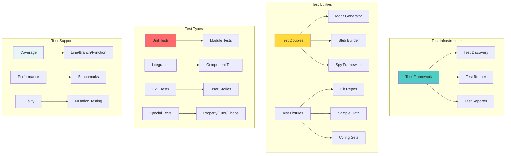
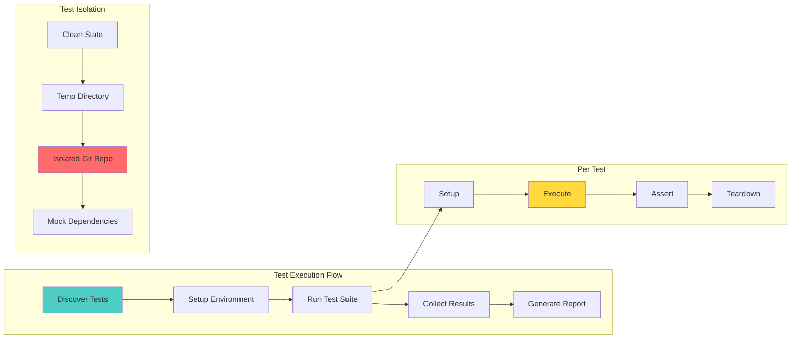

# 🧪 Testing Infrastructure Uplift: Gameplan

> *"Every module is a fortress of unit and integration tests."*

## Executive Summary

Transform git-mind's testing from ad-hoc validation into a comprehensive, multi-layered testing infrastructure with unit tests, integration tests, property-based tests, and chaos engineering capabilities. Make bugs extinct through testing, not debugging.

## 🎯 Domain Overview

### The Testing Pyramid (Git-Mind Style)

```svg
<svg viewBox="0 0 800 600" xmlns="http://www.w3.org/2000/svg">
  <!-- Title -->
  <text x="400" y="30" text-anchor="middle" font-size="20" font-weight="bold">Git-Mind Testing Pyramid</text>
  
  <!-- Unit Tests Base -->
  <polygon points="400,500 100,500 200,350 600,350 700,500" fill="#4ecdc4" stroke="black" stroke-width="2"/>
  <text x="400" y="440" text-anchor="middle" font-size="16" font-weight="bold">Unit Tests (70%)</text>
  <text x="400" y="460" text-anchor="middle" font-size="12">• Fast (ms)</text>
  <text x="400" y="480" text-anchor="middle" font-size="12">• Isolated • Deterministic</text>
  
  <!-- Integration Tests -->
  <polygon points="200,350 250,250 550,250 600,350" fill="#ffd93d" stroke="black" stroke-width="2"/>
  <text x="400" y="310" text-anchor="middle" font-size="16" font-weight="bold">Integration Tests (20%)</text>
  <text x="400" y="330" text-anchor="middle" font-size="12">• Real Git • File I/O • Modules</text>
  
  <!-- E2E Tests -->
  <polygon points="250,250 300,150 500,150 550,250" fill="#ff6b6b" stroke="black" stroke-width="2"/>
  <text x="400" y="210" text-anchor="middle" font-size="16" font-weight="bold">E2E Tests (8%)</text>
  <text x="400" y="230" text-anchor="middle" font-size="12">• Full CLI • User Stories</text>
  
  <!-- Chaos/Property Tests Peak -->
  <polygon points="300,150 400,80 500,150" fill="#e74c3c" stroke="black" stroke-width="2"/>
  <text x="400" y="120" text-anchor="middle" font-size="14" font-weight="bold">Chaos (2%)</text>
  
  <!-- Test Types on sides -->
  <g transform="translate(50, 200)">
    <rect width="120" height="40" fill="#b8e6e6" stroke="black"/>
    <text x="60" y="25" text-anchor="middle" font-size="12">Mock/Stub</text>
  </g>
  
  <g transform="translate(50, 250)">
    <rect width="120" height="40" fill="#b8e6e6" stroke="black"/>
    <text x="60" y="25" text-anchor="middle" font-size="12">Test Doubles</text>
  </g>
  
  <g transform="translate(50, 300)">
    <rect width="120" height="40" fill="#b8e6e6" stroke="black"/>
    <text x="60" y="25" text-anchor="middle" font-size="12">Fixtures</text>
  </g>
  
  <g transform="translate(630, 200)">
    <rect width="120" height="40" fill="#fff3cd" stroke="black"/>
    <text x="60" y="25" text-anchor="middle" font-size="12">Property Tests</text>
  </g>
  
  <g transform="translate(630, 250)">
    <rect width="120" height="40" fill="#fff3cd" stroke="black"/>
    <text x="60" y="25" text-anchor="middle" font-size="12">Fuzz Tests</text>
  </g>
  
  <g transform="translate(630, 300)">
    <rect width="120" height="40" fill="#fff3cd" stroke="black"/>
    <text x="60" y="25" text-anchor="middle" font-size="12">Benchmarks</text>
  </g>
</svg>
```

## 🏗️ Architecture Design



## 📋 Core Features Required

### 1. Test Framework Core

```c
// core/tests/framework/test_framework.h

// Test case structure
typedef struct gm_test_case {
    const char *name;
    const char *description;
    void (*setup)(void);
    void (*test)(void);
    void (*teardown)(void);
    bool skip;
    const char *skip_reason;
} gm_test_case_t;

// Test suite structure
typedef struct gm_test_suite {
    const char *name;
    gm_test_case_t *cases;
    size_t case_count;
    void (*suite_setup)(void);
    void (*suite_teardown)(void);
} gm_test_suite_t;

// Test registration macros
#define GM_TEST(suite, name) \
    static void test_##suite##_##name(void); \
    static gm_test_case_t test_case_##suite##_##name \
        __attribute__((section("test_cases"))) = { \
        .name = #name, \
        .test = test_##suite##_##name \
    }; \
    static void test_##suite##_##name(void)

// Test assertions with better diagnostics
#define GM_ASSERT_EQ(expected, actual) \
    gm_assert_equal(__FILE__, __LINE__, #expected, #actual, \
                   expected, actual, sizeof(expected))

#define GM_ASSERT_STR_EQ(expected, actual) \
    gm_assert_string_equal(__FILE__, __LINE__, #expected, #actual, \
                          expected, actual)

#define GM_ASSERT_OK(result) \
    gm_assert_ok(__FILE__, __LINE__, #result, result)

// Test execution hooks
typedef struct {
    void (*on_suite_start)(const gm_test_suite_t *suite);
    void (*on_test_start)(const gm_test_case_t *test);
    void (*on_test_pass)(const gm_test_case_t *test);
    void (*on_test_fail)(const gm_test_case_t *test, const char *msg);
    void (*on_suite_end)(const gm_test_suite_t *suite);
} gm_test_hooks_t;
```

### 2. Test Double System

```c
// core/tests/framework/test_doubles.h

// Mock function builder
typedef struct gm_mock {
    const char *name;
    void *implementation;
    int call_count;
    struct {
        void *args[8];
        void *result;
    } calls[100];
} gm_mock_t;

// Mock creation macros
#define GM_MOCK_CREATE(return_type, name, ...) \
    static gm_mock_t mock_##name = {.name = #name}; \
    return_type name(__VA_ARGS__) { \
        gm_mock_record_call(&mock_##name, ##__VA_ARGS__); \
        if (mock_##name.implementation) { \
            return ((return_type (*)(__VA_ARGS__))mock_##name.implementation)(__VA_ARGS__); \
        } \
        return (return_type){0}; \
    }

// Stub with fixed return
#define GM_STUB(name, return_value) \
    gm_mock_stub(&mock_##name, return_value)

// Spy to verify calls
#define GM_VERIFY_CALLED(name, times) \
    GM_ASSERT_EQ(times, mock_##name.call_count)

// Dependency injection helpers
typedef struct {
    // File operations
    FILE* (*fopen)(const char *path, const char *mode);
    int (*fclose)(FILE *fp);
    size_t (*fread)(void *ptr, size_t size, size_t nmemb, FILE *fp);
    
    // Time operations
    time_t (*time)(time_t *tloc);
    int (*gettimeofday)(struct timeval *tv, void *tz);
    
    // Memory operations
    void* (*malloc)(size_t size);
    void (*free)(void *ptr);
} gm_test_ops_t;

// Default ops vs test ops
extern const gm_test_ops_t gm_default_ops;
extern gm_test_ops_t gm_test_ops;

#define GM_WITH_TEST_OPS(ops) \
    for (gm_test_ops_t saved = gm_test_ops; \
         (gm_test_ops = ops, 1); \
         gm_test_ops = saved)
```

### 3. Test Fixture System

```c
// core/tests/framework/fixtures.h

// Git repository fixture
typedef struct {
    char *path;
    git_repository *repo;
    git_signature *sig;
} gm_fixture_repo_t;

// Fixture lifecycle
gm_fixture_repo_t* gm_fixture_repo_create(const char *name);
void gm_fixture_repo_destroy(gm_fixture_repo_t *fixture);

// Common fixtures
gm_fixture_repo_t* gm_fixture_simple_repo(void);    // A→B→C
gm_fixture_repo_t* gm_fixture_branched_repo(void);  // With branches
gm_fixture_repo_t* gm_fixture_merge_repo(void);     // With merges

// Data fixtures
typedef struct {
    const char *name;
    const void *data;
    size_t size;
} gm_fixture_data_t;

// Load test data
gm_fixture_data_t* gm_fixture_load(const char *name);
void gm_fixture_free(gm_fixture_data_t *data);

// Fixture macros
#define GM_WITH_REPO(repo, type) \
    for (gm_fixture_repo_t *repo = gm_fixture_##type##_repo(); \
         repo; \
         gm_fixture_repo_destroy(repo), repo = NULL)
```

### 4. Property-Based Testing

```c
// core/tests/framework/property_test.h

// Property test generator
typedef void* (*gm_gen_func_t)(gm_rng_t *rng);

// Common generators
void* gm_gen_int(gm_rng_t *rng, int min, int max);
void* gm_gen_string(gm_rng_t *rng, size_t min_len, size_t max_len);
void* gm_gen_array(gm_rng_t *rng, gm_gen_func_t elem_gen, size_t count);

// Property definition
typedef bool (*gm_property_t)(void *input);

// Property test runner
typedef struct {
    const char *name;
    gm_gen_func_t generator;
    gm_property_t property;
    size_t iterations;
} gm_property_test_t;

// Property test macro
#define GM_PROPERTY_TEST(name, gen, prop) \
    static gm_property_test_t prop_test_##name = { \
        .name = #name, \
        .generator = gen, \
        .property = prop, \
        .iterations = 100 \
    }

// Example property
bool prop_edge_serialization_roundtrip(void *input) {
    edge_t *edge = (edge_t*)input;
    
    // Serialize
    uint8_t buffer[1024];
    size_t size = edge_serialize(edge, buffer, sizeof(buffer));
    
    // Deserialize
    edge_t *decoded = edge_deserialize(buffer, size);
    
    // Check equivalence
    return edge_equal(edge, decoded);
}
```

### 5. Testing Utilities



## 🛠️ Implementation Plan

### Phase 1: Framework Foundation (Immediate)
1. Create test framework core
2. Implement assertion library
3. Add test discovery/runner
4. Create basic test report

### Phase 2: Test Doubles (During Migration)
1. Build mock/stub system
2. Add dependency injection
3. Create spy framework
4. Generate common mocks

### Phase 3: Fixtures & Helpers (Per Module)
1. Create Git repo fixtures
2. Add data fixtures
3. Build test utilities
4. Add isolation helpers

### Phase 4: Advanced Testing (Later)
1. Property-based tests
2. Fuzz testing
3. Chaos engineering
4. Mutation testing

## 📊 Migration Strategy

### Converting Tests to New Framework

```c
// BEFORE: Basic assertions
void test_edge_creation() {
    edge_t *edge = create_edge("A", "B");
    assert(edge != NULL);
    assert(strcmp(edge->from, "A") == 0);
    assert(strcmp(edge->to, "B") == 0);
}

// AFTER: Rich test framework
GM_TEST(edge, creation_basic) {
    // Arrange
    GM_WITH_ARENA(arena, 4096, "test") {
        // Act
        GM_RESULT(edge_t*) result = create_edge_ex(arena, "A", "B");
        
        // Assert
        GM_ASSERT_OK(result);
        edge_t *edge = gm_unwrap_ok(result);
        GM_ASSERT_STR_EQ("A", edge->from);
        GM_ASSERT_STR_EQ("B", edge->to);
        GM_ASSERT_EQ(GM_EDGE_TYPE_DEFAULT, edge->type);
    }
}

GM_TEST(edge, creation_with_invalid_input) {
    GM_WITH_ARENA(arena, 4096, "test") {
        // Test NULL from
        GM_RESULT(edge_t*) r1 = create_edge_ex(arena, NULL, "B");
        GM_ASSERT_ERROR(r1, GM_ERR_INVALID_ARG);
        
        // Test NULL to
        GM_RESULT(edge_t*) r2 = create_edge_ex(arena, "A", NULL);
        GM_ASSERT_ERROR(r2, GM_ERR_INVALID_ARG);
        
        // Test empty strings
        GM_RESULT(edge_t*) r3 = create_edge_ex(arena, "", "B");
        GM_ASSERT_ERROR(r3, GM_ERR_INVALID_ARG);
    }
}
```

### Adding Integration Tests

```c
// Integration test with real Git
GM_TEST(edge, persistence_in_git) {
    GM_WITH_REPO(repo, simple) {
        // Create edge in real repo
        gm_context_t ctx = {
            .repo = repo->repo,
            .arena = gm_arena_create(8192, "test")
        };
        
        GM_RESULT(edge_t*) result = gm_edge_create(&ctx, 
            "src/main.c", "src/util.c", 
            GM_EDGE_TYPE_DEPENDS);
        GM_ASSERT_OK(result);
        
        // Verify it's persisted
        const char *edge_path = ".gitmind/edges/";
        GM_ASSERT_TRUE(gm_path_exists(repo->path, edge_path));
        
        // Load and verify
        GM_RESULT(edge_list_t) loaded = gm_edge_load_all(&ctx);
        GM_ASSERT_OK(loaded);
        GM_ASSERT_EQ(1, loaded.data.value.count);
        
        gm_arena_destroy(ctx.arena);
    }
}
```

## 🧪 Testing Patterns

### 1. Arrange-Act-Assert Pattern
```c
GM_TEST(module, test_name) {
    // Arrange: Set up test state
    test_data_t *data = setup_test_data();
    gm_mock_t *mock = create_mock();
    
    // Act: Execute the operation
    result_t result = operation_under_test(data);
    
    // Assert: Verify outcomes
    GM_ASSERT_OK(result);
    GM_VERIFY_CALLED(mock, 1);
    
    // Cleanup (automatic with RAII patterns)
}
```

### 2. Table-Driven Tests
```c
GM_TEST(parser, various_inputs) {
    struct {
        const char *input;
        bool should_succeed;
        int expected_value;
    } test_cases[] = {
        {"42", true, 42},
        {"-1", true, -1},
        {"abc", false, 0},
        {"", false, 0},
        {NULL, false, 0},
    };
    
    for (size_t i = 0; i < ARRAY_SIZE(test_cases); i++) {
        GM_SUBTEST(test_cases[i].input) {
            result_t r = parse_int(test_cases[i].input);
            
            if (test_cases[i].should_succeed) {
                GM_ASSERT_OK(r);
                GM_ASSERT_EQ(test_cases[i].expected_value, r.value);
            } else {
                GM_ASSERT_ERROR(r);
            }
        }
    }
}
```

### 3. Test Pyramid Example

```svg
<svg viewBox="0 0 800 400" xmlns="http://www.w3.org/2000/svg">
  <!-- Title -->
  <text x="400" y="30" text-anchor="middle" font-size="18" font-weight="bold">Edge Module Test Coverage</text>
  
  <!-- Unit Tests -->
  <g transform="translate(50, 60)">
    <rect width="200" height="300" fill="#e8f4f8" stroke="black" stroke-width="2"/>
    <text x="100" y="25" text-anchor="middle" font-size="14" font-weight="bold">Unit Tests (23)</text>
    
    <rect x="10" y="40" width="180" height="25" fill="#4ecdc4" stroke="black"/>
    <text x="100" y="57" text-anchor="middle" font-size="11">edge_create_valid</text>
    
    <rect x="10" y="70" width="180" height="25" fill="#4ecdc4" stroke="black"/>
    <text x="100" y="87" text-anchor="middle" font-size="11">edge_create_invalid</text>
    
    <rect x="10" y="100" width="180" height="25" fill="#4ecdc4" stroke="black"/>
    <text x="100" y="117" text-anchor="middle" font-size="11">edge_serialize</text>
    
    <rect x="10" y="130" width="180" height="25" fill="#4ecdc4" stroke="black"/>
    <text x="100" y="147" text-anchor="middle" font-size="11">edge_deserialize</text>
    
    <text x="100" y="180" text-anchor="middle" font-size="11">... 19 more tests</text>
  </g>
  
  <!-- Integration Tests -->
  <g transform="translate(300, 60)">
    <rect width="200" height="300" fill="#fff3cd" stroke="black" stroke-width="2"/>
    <text x="100" y="25" text-anchor="middle" font-size="14" font-weight="bold">Integration Tests (8)</text>
    
    <rect x="10" y="40" width="180" height="35" fill="#ffd93d" stroke="black"/>
    <text x="100" y="57" text-anchor="middle" font-size="11">edge_persist_to_git</text>
    
    <rect x="10" y="85" width="180" height="35" fill="#ffd93d" stroke="black"/>
    <text x="100" y="102" text-anchor="middle" font-size="11">edge_load_from_git</text>
    
    <rect x="10" y="130" width="180" height="35" fill="#ffd93d" stroke="black"/>
    <text x="100" y="147" text-anchor="middle" font-size="11">edge_cross_module</text>
    
    <text x="100" y="190" text-anchor="middle" font-size="11">... 5 more tests</text>
  </g>
  
  <!-- E2E Tests -->
  <g transform="translate(550, 60)">
    <rect width="200" height="300" fill="#ffcccc" stroke="black" stroke-width="2"/>
    <text x="100" y="25" text-anchor="middle" font-size="14" font-weight="bold">E2E Tests (3)</text>
    
    <rect x="10" y="40" width="180" height="50" fill="#ff6b6b" stroke="black"/>
    <text x="100" y="65" text-anchor="middle" font-size="11">cli_create_edge</text>
    
    <rect x="10" y="100" width="180" height="50" fill="#ff6b6b" stroke="black"/>
    <text x="100" y="125" text-anchor="middle" font-size="11">cli_list_edges</text>
    
    <rect x="10" y="160" width="180" height="50" fill="#ff6b6b" stroke="black"/>
    <text x="100" y="185" text-anchor="middle" font-size="11">cli_query_graph</text>
  </g>
</svg>
```

## 📈 Success Metrics

1. **Test Coverage**: > 80% line coverage, > 70% branch
2. **Test Speed**: Unit tests < 1ms each
3. **Test Reliability**: Zero flaky tests
4. **Test Clarity**: Tests document behavior
5. **Bug Prevention**: 90% of bugs caught by tests

## 🎓 Best Practices

### DO:
- ✅ Write tests first (TDD)
- ✅ Keep tests focused and small
- ✅ Use descriptive test names
- ✅ Test edge cases and errors
- ✅ Isolate tests from each other

### DON'T:
- ❌ Test implementation details
- ❌ Share state between tests
- ❌ Ignore failing tests
- ❌ Write tests after debugging
- ❌ Mock what you don't own

## 🔗 Integration Points

### With Error Handling
- Test error propagation
- Verify error messages
- Test recovery paths

### With Memory Architecture
- Test memory leaks
- Verify arena cleanup
- Test allocation failures

### With Observability
- Capture logs in tests
- Verify metrics
- Test trace generation

## 📚 References

- [Test Pyramid](https://martinfowler.com/articles/practical-test-pyramid.html) - Martin Fowler
- [Property-Based Testing](https://hypothesis.works/articles/what-is-property-based-testing/) - Hypothesis
- [Test Doubles](https://martinfowler.com/bliki/TestDouble.html) - Patterns
- [TDD](https://www.amazon.com/Test-Driven-Development-Kent-Beck/dp/0321146530) - Kent Beck

---

*"Tests are the first users of your code. Make them happy, and your users will be too."*