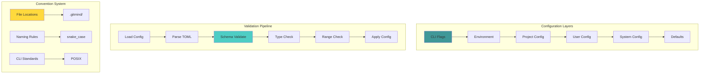

# ⚙️ Config & Convention Overhaul: Gameplan

> _"Consistency wins. Predictability scales."_

## Executive Summary

Transform git-mind from scattered configuration and inconsistent conventions into a unified, predictable system with schema validation, clear defaults, and convention-based operations. Make configuration a feature, not a burden.

## 🎯 Domain Overview

### The Configuration Chaos We're Solving

```svg
<svg viewBox="0 0 800 500" xmlns="http://www.w3.org/2000/svg">
  <!-- Title -->
  <text x="400" y="30" text-anchor="middle" font-size="20" font-weight="bold">Configuration Evolution</text>
  
  <!-- Before Section -->
  <g transform="translate(50, 60)">
    <text x="150" y="0" text-anchor="middle" font-size="16" font-weight="bold">BEFORE (Chaos)</text>
    <rect width="300" height="380" fill="#ffcccc" stroke="black" stroke-width="2"/>
    
    <!-- Scattered configs -->
    <rect x="20" y="30" width="120" height="40" fill="#ff6b6b" stroke="black"/>
    <text x="80" y="55" text-anchor="middle" font-size="11">env vars</text>
    
    <rect x="160" y="30" width="120" height="40" fill="#ff6b6b" stroke="black"/>
    <text x="220" y="55" text-anchor="middle" font-size="11">CLI flags</text>
    
    <rect x="40" y="90" width="100" height="40" fill="#ff9999" stroke="black"/>
    <text x="90" y="115" text-anchor="middle" font-size="11">.gitmindrc</text>
    
    <rect x="160" y="90" width="100" height="40" fill="#ff9999" stroke="black"/>
    <text x="210" y="115" text-anchor="middle" font-size="11">config.json</text>
    
    <rect x="90" y="150" width="120" height="40" fill="#ffaaaa" stroke="black"/>
    <text x="150" y="175" text-anchor="middle" font-size="11">hardcoded</text>
    
    <!-- Problems -->
    <text x="150" y="230" text-anchor="middle" font-size="14" font-weight="bold">Problems:</text>
    <text x="150" y="250" text-anchor="middle" font-size="11">• No validation</text>
    <text x="150" y="270" text-anchor="middle" font-size="11">• Unclear precedence</text>
    <text x="150" y="290" text-anchor="middle" font-size="11">• Magic defaults</text>
    <text x="150" y="310" text-anchor="middle" font-size="11">• Inconsistent naming</text>
    <text x="150" y="330" text-anchor="middle" font-size="11">• No schema</text>
    <text x="150" y="350" text-anchor="middle" font-size="11">• Silent failures</text>
  </g>
  
  <!-- After Section -->
  <g transform="translate(450, 60)">
    <text x="150" y="0" text-anchor="middle" font-size="16" font-weight="bold">AFTER (Unified)</text>
    <rect width="300" height="380" fill="#e8f4f8" stroke="black" stroke-width="2"/>
    
    <!-- Config hierarchy -->
    <rect x="50" y="30" width="200" height="60" fill="#4ecdc4" stroke="black"/>
    <text x="150" y="55" text-anchor="middle" font-size="12" font-weight="bold">Schema-Validated</text>
    <text x="150" y="75" text-anchor="middle" font-size="12" font-weight="bold">Config System</text>
    
    <!-- Layers -->
    <rect x="30" y="110" width="240" height="35" fill="#b8e6e6" stroke="black"/>
    <text x="150" y="132" text-anchor="middle" font-size="11">1. Defaults (explicit)</text>
    
    <rect x="30" y="155" width="240" height="35" fill="#a0d8d8" stroke="black"/>
    <text x="150" y="177" text-anchor="middle" font-size="11">2. System (/etc/gitmind)</text>
    
    <rect x="30" y="200" width="240" height="35" fill="#88c8c8" stroke="black"/>
    <text x="150" y="222" text-anchor="middle" font-size="11">3. User (~/.config/gitmind)</text>
    
    <rect x="30" y="245" width="240" height="35" fill="#70b8b8" stroke="black"/>
    <text x="150" y="267" text-anchor="middle" font-size="11">4. Project (.gitmind/config)</text>
    
    <rect x="30" y="290" width="240" height="35" fill="#58a8a8" stroke="black"/>
    <text x="150" y="312" text-anchor="middle" font-size="11">5. Environment (GM_*)</text>
    
    <rect x="30" y="335" width="240" height="35" fill="#409898" stroke="black"/>
    <text x="150" y="357" text-anchor="middle" font-size="11">6. CLI flags (--option)</text>
  </g>
  
  <!-- Arrow -->
  <path d="M 350 250 L 450 250" stroke="black" stroke-width="3" marker-end="url(#arrowhead)"/>
  <text x="400" y="240" text-anchor="middle" font-size="14" font-weight="bold">TRANSFORM</text>
  
  <!-- Arrow marker -->
  <defs>
    <marker id="arrowhead" markerWidth="10" markerHeight="7" refX="10" refY="3.5" orient="auto">
      <polygon points="0 0, 10 3.5, 0 7" fill="black"/>
    </marker>
  </defs>
</svg>
```

## 🏗️ Architecture Design



## 📋 Core Features Required

### 1. Unified Configuration System

```c
// core/include/gitmind/config.h

// Configuration schema
typedef struct gm_config {
    // Core settings
    struct {
        char *storage_path;      // Default: ".gitmind"
        bool verbose;           // Default: false
        bool debug;             // Default: false
        char *log_level;        // Default: "info"
        size_t cache_size_mb;   // Default: 100
    } core;
    
    // Edge settings
    struct {
        bool auto_detect;       // Default: true
        char **ignore_patterns; // Default: [".git", "node_modules"]
        size_t pattern_count;
        uint32_t max_depth;     // Default: 10
    } edge;
    
    // Plugin settings
    struct {
        char **enabled;         // Default: []
        size_t enabled_count;
        char *plugin_dir;       // Default: "~/.gitmind/plugins"
        bool safe_mode;         // Default: true
    } plugin;
    
    // Network settings
    struct {
        uint16_t api_port;      // Default: 0 (disabled)
        char *bind_address;     // Default: "127.0.0.1"
        bool enable_cors;       // Default: false
        uint32_t timeout_ms;    // Default: 30000
    } network;
} gm_config_t;

// Config lifecycle
gm_config_t* gm_config_load(void);
void gm_config_free(gm_config_t *config);

// Config sources (in precedence order)
typedef enum {
    GM_CONFIG_DEFAULT = 0,
    GM_CONFIG_SYSTEM = 1,
    GM_CONFIG_USER = 2,
    GM_CONFIG_PROJECT = 3,
    GM_CONFIG_ENV = 4,
    GM_CONFIG_CLI = 5
} gm_config_source_t;

// Get config with source tracking
const char* gm_config_get_string(gm_config_t *cfg, const char *key, 
                                gm_config_source_t *source);
```

### 2. Schema Validation System

```c
// Configuration schema definition
typedef struct gm_schema_field {
    const char *name;
    gm_type_t type;
    bool required;
    const char *default_value;
    const char *description;
    
    // Validation
    union {
        struct { int64_t min, max; } integer;
        struct { double min, max; } number;
        struct { size_t min_len, max_len; } string;
        struct { const char **values; size_t count; } enum_vals;
    } constraints;
} gm_schema_field_t;

// Schema definition
static const gm_schema_field_t CONFIG_SCHEMA[] = {
    {
        .name = "core.storage_path",
        .type = GM_TYPE_STRING,
        .required = false,
        .default_value = ".gitmind",
        .description = "Path to git-mind storage directory",
        .constraints.string = { .min_len = 1, .max_len = 255 }
    },
    {
        .name = "core.cache_size_mb",
        .type = GM_TYPE_INTEGER,
        .required = false,
        .default_value = "100",
        .description = "Maximum cache size in megabytes",
        .constraints.integer = { .min = 0, .max = 10240 }
    },
    {
        .name = "core.log_level",
        .type = GM_TYPE_ENUM,
        .required = false,
        .default_value = "info",
        .description = "Logging level",
        .constraints.enum_vals = {
            .values = (const char*[]){"trace", "debug", "info", "warn", "error"},
            .count = 5
        }
    },
    // ... more fields
};

// Validation function
GM_RESULT(gm_config_t*) gm_config_validate(const toml_table_t *toml);
```

### 3. Configuration File Format (TOML)

```toml
# ~/.config/gitmind/config.toml
# Git-Mind Configuration File
# Schema Version: 1.0

[core]
# Storage location for git-mind data
storage_path = ".gitmind"

# Logging configuration
log_level = "info"  # trace, debug, info, warn, error
verbose = false
debug = false

# Performance tuning
cache_size_mb = 100
max_threads = 4

[edge]
# Edge detection settings
auto_detect = true
max_depth = 10

# Patterns to ignore (gitignore syntax)
ignore_patterns = [
    ".git/**",
    "node_modules/**",
    "*.pyc",
    "__pycache__/**",
    ".DS_Store"
]

[plugin]
# Plugin system configuration
enabled = ["git-analyzer", "code-metrics"]
plugin_dir = "~/.gitmind/plugins"
safe_mode = true  # Sandbox plugins

[network]
# API server settings (0 = disabled)
api_port = 0
bind_address = "127.0.0.1"
enable_cors = false
timeout_ms = 30000
```

### 4. Convention-Based Defaults

```mermaid
flowchart LR
    subgraph "File Conventions"
        A[Project Root] --> B[.gitmind/]
        B --> C[config.toml]
        B --> D[edges/]
        B --> E[nodes/]
        B --> F[cache/]
        B --> G[plugins/]
    end
    
    subgraph "Naming Conventions"
        H[Config Keys] --> I[snake_case]
        J[Env Vars] --> K[GM_SNAKE_CASE]
        L[CLI Flags] --> M[--kebab-case]
    end
    
    subgraph "Path Resolution"
        N[~] --> O[$HOME]
        P[.] --> Q[Current Dir]
        R[/] --> S[Absolute]
    end
    
    style B fill:#4ecdc4
    style I fill:#ffd93d
    style O fill:#ff6b6b
```

### 5. CLI Flag System

```c
// CLI flag definitions following POSIX conventions
static const gm_cli_flag_t CLI_FLAGS[] = {
    // Long and short options
    {
        .long_name = "verbose",
        .short_name = 'v',
        .type = GM_FLAG_BOOL,
        .help = "Enable verbose output",
        .config_key = "core.verbose"
    },
    {
        .long_name = "config",
        .short_name = 'c',
        .type = GM_FLAG_STRING,
        .help = "Path to config file",
        .meta = "FILE"
    },
    {
        .long_name = "log-level",
        .short_name = 'l',
        .type = GM_FLAG_STRING,
        .help = "Set log level (trace|debug|info|warn|error)",
        .config_key = "core.log_level",
        .meta = "LEVEL"
    },
    // Subcommand specific flags
    {
        .long_name = "type",
        .short_name = 't',
        .type = GM_FLAG_STRING,
        .help = "Edge type for 'link' command",
        .subcommand = "link",
        .meta = "TYPE"
    }
};

// POSIX-compliant parsing
GM_RESULT(gm_cli_args_t) gm_cli_parse(int argc, char **argv);
```

## 🛠️ Implementation Plan

### Phase 1: Core Infrastructure (First Module)

1. Define configuration schema
2. Implement TOML parser integration
3. Create validation system
4. Add config loading with layers

### Phase 2: Convention System (During Migration)

1. Standardize file locations
2. Define naming conventions
3. Create path resolution helpers
4. Document all conventions

### Phase 3: CLI Integration (With CLI Module)

1. Implement POSIX flag parser
2. Map flags to config keys
3. Add help generation
4. Create completion scripts

### Phase 4: Advanced Features (Later)

1. Config migration tools
2. Live reload support
3. Config diff/merge
4. Schema versioning

## 📊 Migration Strategy

### Converting Hardcoded Values

```c
// BEFORE: Magic values everywhere
#define CACHE_SIZE 104857600  // What's this number?
#define MAX_DEPTH 10          // Why 10?

void init_cache() {
    cache = malloc(CACHE_SIZE);
    if (getenv("DEBUG")) {
        printf("Cache initialized\n");
    }
}

// AFTER: Configuration-driven
void init_cache(gm_config_t *config) {
    size_t cache_bytes = config->core.cache_size_mb * 1024 * 1024;
    cache = gm_mem_alloc_tagged(cache_bytes, GM_MEM_TAG_CACHE);
    
    if (config->core.debug) {
        GM_DEBUG(log_ctx, "Cache initialized: %zu MB", 
                 config->core.cache_size_mb);
    }
}
```

### Environment Variable Migration

```c
// BEFORE: Random env vars
const char *storage = getenv("GITMIND_DIR") ?: ".gitmind";
const char *debug = getenv("DEBUG");
const char *threads = getenv("THREADS");

// AFTER: Standardized with precedence
gm_config_t *config = gm_config_load();
// Automatically handles:
// 1. Defaults from schema
// 2. System config from /etc/gitmind/config.toml
// 3. User config from ~/.config/gitmind/config.toml
// 4. Project config from .gitmind/config.toml
// 5. Env vars like GM_STORAGE_PATH, GM_DEBUG
// 6. CLI flags like --storage-path, --debug
```

## 🧪 Testing Approach

### 1. Schema Validation Tests

```c
void test_config_schema_validation(void) {
    // Valid config
    const char *valid_toml = 
        "[core]\n"
        "cache_size_mb = 200\n"
        "log_level = \"debug\"\n";
    
    toml_table_t *toml = toml_parse(valid_toml);
    GM_RESULT(gm_config_t*) result = gm_config_validate(toml);
    GM_ASSERT_OK(result);
    
    gm_config_t *config = result.data.value;
    GM_ASSERT_EQ(200, config->core.cache_size_mb);
    GM_ASSERT_STR_EQ("debug", config->core.log_level);
    
    // Invalid config (out of range)
    const char *invalid_toml = 
        "[core]\n"
        "cache_size_mb = 999999\n";  // > max
    
    toml = toml_parse(invalid_toml);
    result = gm_config_validate(toml);
    GM_ASSERT_ERROR(result, GM_ERR_VALIDATION_FAILED);
}
```

### 2. Precedence Tests

```c
void test_config_precedence(void) {
    // Set up config layers
    gm_test_write_file("/etc/gitmind/config.toml",
        "[core]\nlog_level = \"warn\"\n");
    
    gm_test_write_file("~/.config/gitmind/config.toml",
        "[core]\nlog_level = \"info\"\n");
    
    gm_test_write_file(".gitmind/config.toml",
        "[core]\nlog_level = \"debug\"\n");
    
    setenv("GM_LOG_LEVEL", "trace", 1);
    
    // Load config
    gm_config_t *config = gm_config_load();
    
    // Verify precedence (env var wins)
    GM_ASSERT_STR_EQ("trace", config->core.log_level);
    
    // Check source tracking
    gm_config_source_t source;
    const char *value = gm_config_get_string(config, 
        "core.log_level", &source);
    GM_ASSERT_EQ(GM_CONFIG_ENV, source);
}
```

### 3. Convention Tests

```c
void test_path_conventions(void) {
    gm_config_t *config = gm_config_load();
    
    // Test path expansion
    config->plugin.plugin_dir = "~/.gitmind/plugins";
    char *expanded = gm_config_expand_path(config->plugin.plugin_dir);
    GM_ASSERT_TRUE(strstr(expanded, getenv("HOME")) != NULL);
    
    // Test relative paths
    config->core.storage_path = "./data";
    char *absolute = gm_config_resolve_path(config->core.storage_path);
    GM_ASSERT_TRUE(absolute[0] == '/');  // Absolute path
}
```

### 4. CLI Flag Tests

```c
void test_cli_flag_parsing(void) {
    char *argv[] = {
        "git-mind",
        "--verbose",
        "--log-level", "debug",
        "-c", "/custom/config.toml",
        "link",
        "--type", "depends",
        "src/a.c", "src/b.c"
    };
    int argc = sizeof(argv) / sizeof(argv[0]);
    
    GM_RESULT(gm_cli_args_t) result = gm_cli_parse(argc, argv);
    GM_ASSERT_OK(result);
    
    gm_cli_args_t args = result.data.value;
    GM_ASSERT_TRUE(args.verbose);
    GM_ASSERT_STR_EQ("debug", args.log_level);
    GM_ASSERT_STR_EQ("/custom/config.toml", args.config_path);
    GM_ASSERT_STR_EQ("link", args.command);
    GM_ASSERT_STR_EQ("depends", args.edge_type);
}
```

## 📈 Success Metrics

1. __Zero Magic Values__: All config explicit
2. __100% Validation__: No invalid configs accepted
3. __Clear Precedence__: Users understand overrides
4. __Fast Loading__: < 10ms config parse time
5. __Developer Joy__: Config "just works"

## 🎓 Best Practices

### DO

- ✅ Make all defaults explicit
- ✅ Validate early and loudly
- ✅ Document every option
- ✅ Follow platform conventions
- ✅ Support standard locations

### DON'T

- ❌ Hide configuration magic
- ❌ Ignore validation errors
- ❌ Mix config formats
- ❌ Hardcode paths
- ❌ Break POSIX conventions

## 🔗 Integration Points

### With Error Handling

- Config errors are structured
- Validation errors have context
- Schema violations are clear

### With Observability

- Config changes logged
- Config source tracked
- Performance metrics

### With Testing

- Config fixtures provided
- Mock configs for tests
- Validation test helpers

## 📚 References

- [TOML Spec](https://toml.io/en/v1.0.0) - Configuration format
- [XDG Base Directory](https://specifications.freedesktop.org/basedir-spec/latest/) - Standard locations
- [POSIX Utility Conventions](https://pubs.opengroup.org/onlinepubs/9699919799/basedefs/V1_chap12.html) - CLI standards
- [12-Factor Config](https://12factor.net/config) - Configuration principles

---

_"Convention over configuration, but when you need configuration, make it excellent."_
