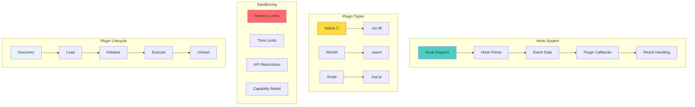
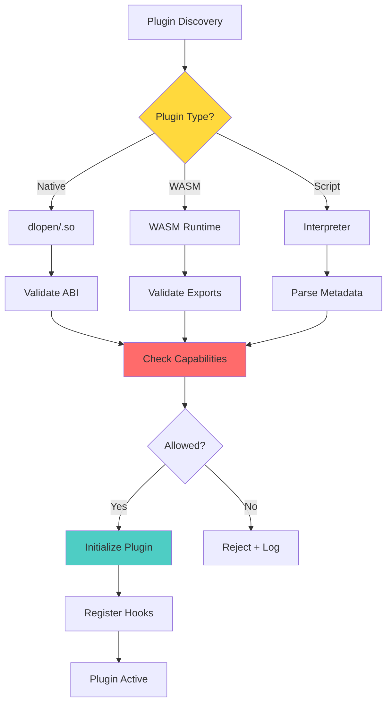

# 🔌 Plugin + Extensibility Hooks: Gameplan

> _"Architect for extensibility from the start."_

## Executive Summary

Build extensibility into git-mind's DNA by creating a robust hook system, plugin architecture, and extension-safe APIs during the migration. Even if plugins ship later, the foundations must be laid now.

## 🎯 Domain Overview

### The Extensibility Vision

```svg
<svg viewBox="0 0 800 600" xmlns="http://www.w3.org/2000/svg">
  <!-- Title -->
  <text x="400" y="30" text-anchor="middle" font-size="20" font-weight="bold">Git-Mind Plugin Architecture</text>
  
  <!-- Core System -->
  <rect x="250" y="200" width="300" height="200" fill="#e8f4f8" stroke="black" stroke-width="3"/>
  <text x="400" y="230" text-anchor="middle" font-size="16" font-weight="bold">Git-Mind Core</text>
  
  <!-- Hook Points -->
  <circle cx="250" cy="250" r="20" fill="#4ecdc4" stroke="black" stroke-width="2"/>
  <text x="250" y="280" text-anchor="middle" font-size="10">pre_edge</text>
  
  <circle cx="400" cy="250" r="20" fill="#4ecdc4" stroke="black" stroke-width="2"/>
  <text x="400" y="280" text-anchor="middle" font-size="10">post_edge</text>
  
  <circle cx="550" cy="250" r="20" fill="#4ecdc4" stroke="black" stroke-width="2"/>
  <text x="550" y="280" text-anchor="middle" font-size="10">on_query</text>
  
  <circle cx="250" cy="350" r="20" fill="#4ecdc4" stroke="black" stroke-width="2"/>
  <text x="250" y="380" text-anchor="middle" font-size="10">pre_commit</text>
  
  <circle cx="400" cy="350" r="20" fill="#4ecdc4" stroke="black" stroke-width="2"/>
  <text x="400" y="380" text-anchor="middle" font-size="10">on_load</text>
  
  <circle cx="550" cy="350" r="20" fill="#4ecdc4" stroke="black" stroke-width="2"/>
  <text x="550" y="380" text-anchor="middle" font-size="10">on_traverse</text>
  
  <!-- Plugins -->
  <g transform="translate(100, 60)">
    <rect width="150" height="80" fill="#ffd93d" stroke="black" stroke-width="2"/>
    <text x="75" y="30" text-anchor="middle" font-size="14" font-weight="bold">Code Analysis</text>
    <text x="75" y="50" text-anchor="middle" font-size="11">• Complexity</text>
    <text x="75" y="65" text-anchor="middle" font-size="11">• Dependencies</text>
    <path d="M 125 140 L 250 250" stroke="black" stroke-width="2" stroke-dasharray="5,5"/>
  </g>
  
  <g transform="translate(300, 60)">
    <rect width="150" height="80" fill="#ff6b6b" stroke="black" stroke-width="2"/>
    <text x="75" y="30" text-anchor="middle" font-size="14" font-weight="bold">Visualization</text>
    <text x="75" y="50" text-anchor="middle" font-size="11">• Graph render</text>
    <text x="75" y="65" text-anchor="middle" font-size="11">• Web UI</text>
    <path d="M 75 140 L 400 250" stroke="black" stroke-width="2" stroke-dasharray="5,5"/>
  </g>
  
  <g transform="translate(500, 60)">
    <rect width="150" height="80" fill="#a8e6cf" stroke="black" stroke-width="2"/>
    <text x="75" y="30" text-anchor="middle" font-size="14" font-weight="bold">AI Assistant</text>
    <text x="75" y="50" text-anchor="middle" font-size="11">• Auto-link</text>
    <text x="75" y="65" text-anchor="middle" font-size="11">• Suggestions</text>
    <path d="M 25 140 L 550 250" stroke="black" stroke-width="2" stroke-dasharray="5,5"/>
  </g>
  
  <g transform="translate(100, 450)">
    <rect width="150" height="80" fill="#dda0dd" stroke="black" stroke-width="2"/>
    <text x="75" y="30" text-anchor="middle" font-size="14" font-weight="bold">Import/Export</text>
    <text x="75" y="50" text-anchor="middle" font-size="11">• GraphML</text>
    <text x="75" y="65" text-anchor="middle" font-size="11">• Graph DB</text>
    <path d="M 125 0 L 250 350" stroke="black" stroke-width="2" stroke-dasharray="5,5"/>
  </g>
  
  <g transform="translate(500, 450)">
    <rect width="150" height="80" fill="#87ceeb" stroke="black" stroke-width="2"/>
    <text x="75" y="30" text-anchor="middle" font-size="14" font-weight="bold">Custom Rules</text>
    <text x="75" y="50" text-anchor="middle" font-size="11">• Policies</text>
    <text x="75" y="65" text-anchor="middle" font-size="11">• Validation</text>
    <path d="M 25 0 L 550 350" stroke="black" stroke-width="2" stroke-dasharray="5,5"/>
  </g>
</svg>
```

## 🏗️ Architecture Design



## 📋 Core Features Required

### 1. Hook System Infrastructure

```c
// core/include/gitmind/hooks.h

// Hook types
typedef enum {
    GM_HOOK_PRE_EDGE_CREATE,
    GM_HOOK_POST_EDGE_CREATE,
    GM_HOOK_PRE_EDGE_DELETE,
    GM_HOOK_POST_EDGE_DELETE,
    GM_HOOK_PRE_NODE_CREATE,
    GM_HOOK_POST_NODE_CREATE,
    GM_HOOK_ON_GRAPH_LOAD,
    GM_HOOK_ON_GRAPH_SAVE,
    GM_HOOK_ON_TRAVERSE_START,
    GM_HOOK_ON_TRAVERSE_NODE,
    GM_HOOK_ON_QUERY,
    GM_HOOK_COUNT
} gm_hook_type_t;

// Hook data passed to callbacks
typedef struct gm_hook_data {
    gm_hook_type_t type;
    void *data;              // Type-specific data
    gm_context_t *ctx;       // Execution context
    bool cancel;             // Allow cancellation
    char *cancel_reason;     // Why cancelled
} gm_hook_data_t;

// Hook callback signature
typedef gm_result_t (*gm_hook_fn)(gm_hook_data_t *data);

// Hook registration
typedef struct gm_hook_entry {
    const char *name;        // Hook identifier
    gm_hook_fn callback;     // Function to call
    int priority;            // Execution order (lower first)
    void *user_data;         // Plugin-specific data
} gm_hook_entry_t;

// Hook management
void gm_hook_register(gm_hook_type_t type, gm_hook_entry_t *entry);
void gm_hook_unregister(gm_hook_type_t type, const char *name);
gm_result_t gm_hook_run(gm_hook_type_t type, void *data);

// Convenience macros for hook points
#define GM_HOOK_RUN(type, data_ptr) \
    do { \
        gm_result_t _hook_result = gm_hook_run(type, data_ptr); \
        if (!gm_ok(_hook_result)) return _hook_result; \
    } while(0)
```

### 2. Plugin API Definition

```c
// core/include/gitmind/plugin_api.h

// Plugin metadata
typedef struct gm_plugin_info {
    const char *name;
    const char *version;
    const char *author;
    const char *description;
    const char *license;
    
    // Requirements
    const char *min_gitmind_version;
    const char **dependencies;
    size_t dependency_count;
    
    // Capabilities requested
    uint32_t capabilities;  // Bitmask of GM_CAP_*
} gm_plugin_info_t;

// Plugin interface (all plugins must export these)
typedef struct gm_plugin_interface {
    // Metadata
    gm_plugin_info_t* (*get_info)(void);
    
    // Lifecycle
    gm_result_t (*initialize)(gm_context_t *ctx);
    gm_result_t (*shutdown)(void);
    
    // Hook registration
    gm_hook_entry_t* (*get_hooks)(size_t *count);
    
    // Commands (optional)
    gm_command_t* (*get_commands)(size_t *count);
} gm_plugin_interface_t;

// Standard plugin entry point
#define GM_PLUGIN_EXPORT \
    __attribute__((visibility("default"))) \
    const gm_plugin_interface_t* gm_plugin_get_interface(void)

// Capability flags
#define GM_CAP_READ_GRAPH    (1 << 0)
#define GM_CAP_WRITE_GRAPH   (1 << 1)
#define GM_CAP_NETWORK       (1 << 2)
#define GM_CAP_FILESYSTEM    (1 << 3)
#define GM_CAP_EXECUTE       (1 << 4)
```

### 3. Extension-Safe API Design

```c
// Forward-compatible API design patterns

// 1. Versioned structures
typedef struct gm_edge_v1 {
    uint32_t version;        // Always first field
    char *from;
    char *to;
    gm_edge_type_t type;
    // v1 fields only
} gm_edge_v1_t;

typedef struct gm_edge_v2 {
    uint32_t version;        // Always first field
    char *from;
    char *to;
    gm_edge_type_t type;
    // v1 fields above
    time_t created_at;       // New in v2
    char *created_by;        // New in v2
} gm_edge_v2_t;

// 2. Capability-based access
typedef struct gm_plugin_context {
    // Core APIs (always available)
    struct {
        void* (*alloc)(size_t size);
        void (*free)(void *ptr);
        void (*log)(gm_log_level_t level, const char *fmt, ...);
    } core;
    
    // Graph APIs (require GM_CAP_READ_GRAPH)
    struct {
        gm_result_t (*get_edges)(gm_edge_filter_t *filter);
        gm_result_t (*get_nodes)(gm_node_filter_t *filter);
    } graph_read;
    
    // Graph mutation (require GM_CAP_WRITE_GRAPH)
    struct {
        gm_result_t (*create_edge)(gm_edge_t *edge);
        gm_result_t (*delete_edge)(const char *id);
    } graph_write;
    
    // Network (require GM_CAP_NETWORK)
    struct {
        gm_result_t (*http_get)(const char *url);
    } network;
} gm_plugin_context_t;

// 3. Stable ABI patterns
// Use opaque handles instead of exposing structs
typedef struct gm_graph_handle gm_graph_handle_t;
typedef struct gm_query_handle gm_query_handle_t;

// Functions operate on handles
gm_graph_handle_t* gm_graph_open(const char *path);
void gm_graph_close(gm_graph_handle_t *graph);
```

### 4. Plugin Loading & Management



### 5. Hook Implementation Examples

```c
// In edge module - adding hook points
gm_result_t gm_edge_create(gm_context_t *ctx, 
                          const char *from, 
                          const char *to,
                          gm_edge_type_t type) {
    // Prepare hook data
    gm_edge_create_hook_data_t hook_data = {
        .from = from,
        .to = to,
        .type = type,
        .edge = NULL  // Will be filled if created
    };
    
    // Pre-creation hook
    GM_HOOK_RUN(GM_HOOK_PRE_EDGE_CREATE, &hook_data);
    
    // Check if hook cancelled creation
    if (hook_data.cancel) {
        return gm_error_new(GM_ERR_CANCELLED, 
            "Edge creation cancelled: %s", 
            hook_data.cancel_reason);
    }
    
    // Create edge
    gm_edge_t *edge = create_edge_internal(ctx, from, to, type);
    hook_data.edge = edge;
    
    // Post-creation hook
    GM_HOOK_RUN(GM_HOOK_POST_EDGE_CREATE, &hook_data);
    
    return GM_OK_VAL(result, edge);
}

// Plugin implementation example
static gm_result_t on_pre_edge_create(gm_hook_data_t *data) {
    gm_edge_create_hook_data_t *edge_data = 
        (gm_edge_create_hook_data_t*)data->data;
    
    // Example: Prevent self-loops
    if (strcmp(edge_data->from, edge_data->to) == 0) {
        data->cancel = true;
        data->cancel_reason = "Self-loops not allowed by policy";
        return GM_OK;
    }
    
    // Example: Log edge creation
    plugin_log("Creating edge: %s -> %s", 
              edge_data->from, edge_data->to);
    
    return GM_OK;
}
```

## 🛠️ Implementation Plan

### Phase 1: Hook Infrastructure (Immediate)

1. Define hook types and data structures
2. Implement hook registry
3. Add hook points to edge/node operations
4. Create no-op implementations

### Phase 2: Plugin API (During Migration)

1. Define stable plugin interface
2. Create versioned structures
3. Implement capability model
4. Document API contracts

### Phase 3: Basic Plugin Loading (Later)

1. Native plugin loader (.so/.dll)
2. Plugin discovery mechanism
3. Capability enforcement
4. Basic sandboxing

### Phase 4: Advanced Features (Future)

1. WASM plugin support
2. Script language bindings
3. Hot reload support
4. Plugin marketplace

## 📊 Migration Strategy

### Adding Hooks to Existing Code

```c
// BEFORE: Direct implementation
edge_t* create_edge(const char *from, const char *to) {
    edge_t *edge = malloc(sizeof(edge_t));
    edge->from = strdup(from);
    edge->to = strdup(to);
    save_edge(edge);
    return edge;
}

// AFTER: With hook points
gm_result_t create_edge(gm_context_t *ctx,
                       const char *from, 
                       const char *to) {
    // Hook data preparation
    gm_edge_hook_data_t hook_data = {
        .from = from, .to = to, .edge = NULL
    };
    
    // Pre-create hook point
    GM_HOOK_RUN(GM_HOOK_PRE_EDGE_CREATE, &hook_data);
    if (hook_data.cancel) {
        return gm_error_new(GM_ERR_CANCELLED, 
                           hook_data.cancel_reason);
    }
    
    // Core logic (unchanged)
    GM_WITH_ARENA(arena, 4096, "edge_create") {
        edge_t *edge = gm_arena_alloc(arena, sizeof(edge_t));
        edge->from = gm_arena_strdup(arena, from);
        edge->to = gm_arena_strdup(arena, to);
        
        gm_result_t save_result = save_edge(ctx, edge);
        if (!gm_ok(save_result)) {
            return save_result;
        }
        
        hook_data.edge = edge;
        
        // Post-create hook point
        GM_HOOK_RUN(GM_HOOK_POST_EDGE_CREATE, &hook_data);
        
        return GM_OK_VAL(result, edge);
    }
}
```

## 🧪 Testing Approach

### 1. Hook System Tests

```c
void test_hook_registration_and_execution(void) {
    // Register test hook
    int call_count = 0;
    gm_hook_entry_t hook = {
        .name = "test_hook",
        .callback = test_hook_callback,
        .priority = 100,
        .user_data = &call_count
    };
    
    gm_hook_register(GM_HOOK_PRE_EDGE_CREATE, &hook);
    
    // Trigger hook
    gm_edge_create_hook_data_t data = {
        .from = "A", .to = "B"
    };
    gm_hook_run(GM_HOOK_PRE_EDGE_CREATE, &data);
    
    // Verify execution
    GM_ASSERT_EQ(1, call_count);
    
    // Cleanup
    gm_hook_unregister(GM_HOOK_PRE_EDGE_CREATE, "test_hook");
}
```

### 2. Plugin API Tests

```c
void test_plugin_capability_enforcement(void) {
    // Mock plugin with limited capabilities
    gm_plugin_context_t *ctx = create_plugin_context(GM_CAP_READ_GRAPH);
    
    // Read should work
    gm_result_t read_result = ctx->graph_read.get_edges(NULL);
    GM_ASSERT_OK(read_result);
    
    // Write should fail
    GM_ASSERT_NULL(ctx->graph_write.create_edge);
}
```

### 3. Extension Safety Tests

```c
void test_forward_compatibility(void) {
    // Old plugin using v1 structure
    gm_edge_v1_t edge_v1 = {
        .version = 1,
        .from = "A",
        .to = "B",
        .type = GM_EDGE_TYPE_DEPENDS
    };
    
    // New code handling v1 structure
    gm_result_t result = handle_edge((gm_edge_t*)&edge_v1);
    GM_ASSERT_OK(result);
    
    // Verify v2 fields handled gracefully
    gm_edge_v2_t *edge_v2 = (gm_edge_v2_t*)&edge_v1;
    GM_ASSERT_EQ(1, edge_v2->version);
    // v2 fields not accessed when version = 1
}
```

## 📈 Success Metrics

1. __Hook Coverage__: All major operations have hooks
2. __API Stability__: Zero breaking changes after v1.0
3. __Plugin Ecosystem__: 5+ useful plugins within 6 months
4. __Performance__: < 1% overhead when no plugins loaded
5. __Safety__: Zero plugin-caused crashes

## 🎓 Best Practices

### DO

- ✅ Version all structures
- ✅ Use capability model
- ✅ Design for forward compatibility
- ✅ Sandbox by default
- ✅ Document hook semantics

### DON'T

- ❌ Expose internal structures
- ❌ Allow unrestricted access
- ❌ Break plugin API
- ❌ Trust plugin input
- ❌ Block on plugin execution

## 🔗 Integration Points

### With Error Handling

- Plugins can return errors
- Hook failures propagated
- Plugin crashes isolated

### With Memory Architecture

- Plugins use arena allocators
- Memory limits enforced
- No direct malloc access

### With Observability

- Plugin operations logged
- Hook execution traced
- Performance monitored

## 📚 References

- [VSCode Extension API](https://code.visualstudio.com/api) - Excellent plugin design
- [Neovim Lua API](https://neovim.io/doc/user/lua.html) - Script plugin example
- [WebAssembly System Interface](https://wasi.dev/) - WASM sandboxing
- [Linux Kernel Modules](https://www.kernel.org/doc/html/latest/kernel-hacking/hacking.html) - Hook patterns

---

_"The best plugin system is the one where core developers want to write plugins too."_
