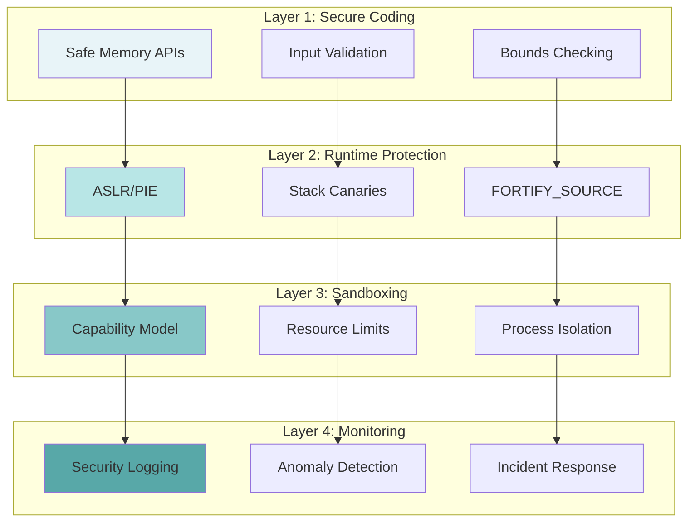
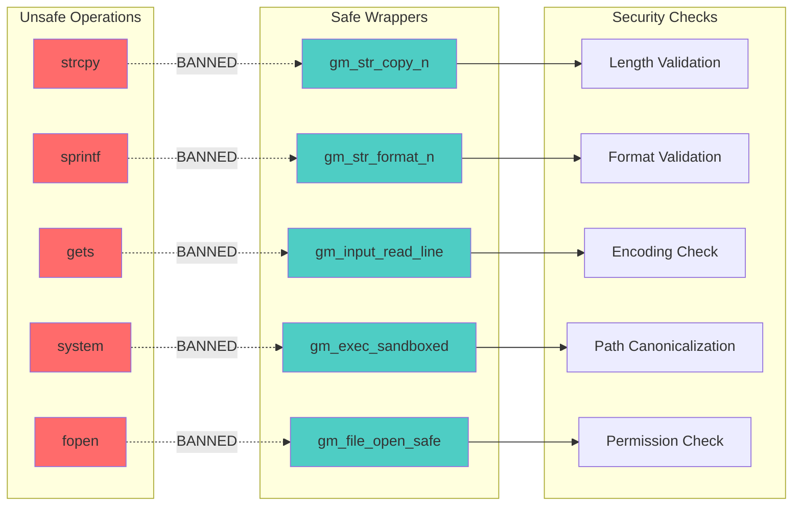
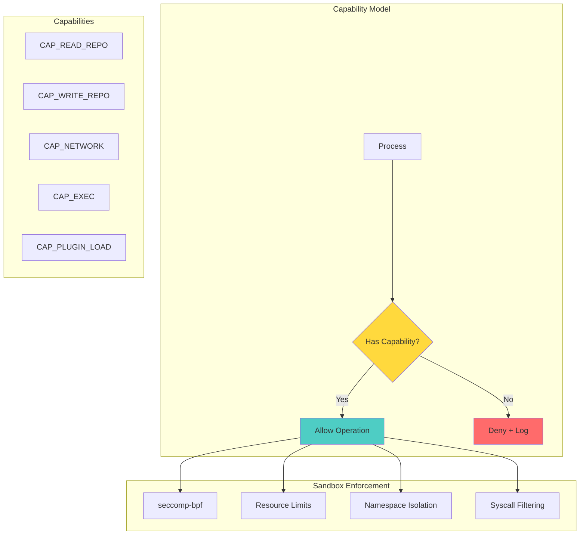

# 🔒 Security Hygiene as Code: Gameplan

> _"Security isn't a feature, it's a foundation."_

## Executive Summary

Transform git-mind from a traditional C codebase into a security-first system where memory safety, input validation, and sandboxing are built into every line of code. Make security vulnerabilities extinct through architecture, not patches.

## 🎯 Domain Overview

### The Security Threat Landscape

```mermaid
graph TB
    subgraph "Attack Vectors"
        A[Memory Corruption] --> A1[Buffer Overflow]
        A --> A2[Use After Free]
        A --> A3[Double Free]
        
        B[Injection Attacks] --> B1[Command Injection]
        B --> B2[Path Traversal]
        B --> B3[Format String]
        
        C[Logic Flaws] --> C1[TOCTOU]
        C --> C2[Integer Overflow]
        C --> C3[Type Confusion]
        
        D[Resource Abuse] --> D1[DoS]
        D --> D2[Memory Exhaustion]
        D --> D3[CPU Spinning]
    end
    
    subgraph "Defense Layers"
        E[Memory Safety] --> E1[Safe APIs]
        E --> E2[Bounds Checking]
        E --> E3[Lifetime Tracking]
        
        F[Input Validation] --> F1[Whitelist Only]
        F --> F2[Length Limits]
        F --> F3[Type Checking]
        
        G[Sandboxing] --> G1[Capability Model]
        G --> G2[Resource Limits]
        G --> G3[Isolation]
        
        H[Monitoring] --> H1[Security Events]
        H --> H2[Anomaly Detection]
        H --> H3[Audit Trail]
    end
    
    A -.->|defended by| E
    B -.->|defended by| F
    C -.->|defended by| G
    D -.->|defended by| H
    
    style A fill:#ff6b6b
    style B fill:#ff6b6b
    style C fill:#ff6b6b
    style D fill:#ff6b6b
    style E fill:#4ecdc4
    style F fill:#4ecdc4
    style G fill:#4ecdc4
    style H fill:#4ecdc4
```



### Security Philosophy: Defense in Depth



## 🏗️ Architecture Design

### Security-First API Design



## 📋 Core Features Required

### 1. Memory Safety Framework

```c
// core/include/gitmind/security.h

// Safe string operations with explicit bounds
typedef struct gm_string {
    char *data;
    size_t length;
    size_t capacity;
    bool owned;  // Do we own the memory?
} gm_string_t;

// String operations that can't overflow
gm_result_t gm_str_create(gm_string_t *str, const char *src, size_t max_len);
gm_result_t gm_str_copy_n(gm_string_t *dst, const gm_string_t *src, size_t n);
gm_result_t gm_str_append_n(gm_string_t *dst, const char *src, size_t n);
gm_result_t gm_str_format_n(gm_string_t *dst, size_t max, const char *fmt, ...);

// Safe array operations
#define GM_ARRAY_SIZE(arr) (sizeof(arr) / sizeof((arr)[0]))

typedef struct gm_array {
    void *data;
    size_t element_size;
    size_t count;
    size_t capacity;
} gm_array_t;

// Bounds-checked array access
void* gm_array_get(gm_array_t *arr, size_t index);
gm_result_t gm_array_set(gm_array_t *arr, size_t index, const void *value);

// Memory safety helpers
#define GM_SAFE_FREE(ptr) do { \
    if (ptr) { \
        gm_mem_free(ptr); \
        ptr = NULL; \
    } \
} while(0)

// Compile-time buffer size checking
#define GM_STATIC_ASSERT(cond) _Static_assert(cond, #cond)
#define GM_BUFFER_SIZE(buf) (sizeof(buf) - 1)  // Account for null terminator

// Safe casting with overflow detection
gm_result_t gm_safe_cast_size_to_int(size_t value, int *result);
gm_result_t gm_safe_add_size(size_t a, size_t b, size_t *result);
gm_result_t gm_safe_mul_size(size_t a, size_t b, size_t *result);
```

### 2. Input Validation Framework

```c
// core/include/gitmind/validate.h

// Validation result with detailed error info
typedef struct gm_validation_error {
    const char *field;
    const char *reason;
    size_t position;  // Where in input
} gm_validation_error_t;

// Common validators
typedef struct gm_validator {
    const char *name;
    bool (*validate)(const void *input, size_t len, gm_validation_error_t *err);
} gm_validator_t;

// Built-in validators
extern const gm_validator_t GM_VALIDATOR_PATH;
extern const gm_validator_t GM_VALIDATOR_SHA;
extern const gm_validator_t GM_VALIDATOR_IDENTIFIER;
extern const gm_validator_t GM_VALIDATOR_URL;

// Path validation (prevent traversal)
typedef struct gm_path_validator {
    bool allow_absolute;
    bool allow_relative;
    bool allow_symlinks;
    const char **allowed_prefixes;
    size_t prefix_count;
    size_t max_length;
    size_t max_components;
} gm_path_validator_t;

gm_result_t gm_validate_path(const char *path, 
                            const gm_path_validator_t *rules,
                            char *canonical_path,
                            size_t canonical_size);

// Input sanitization
gm_result_t gm_sanitize_filename(const char *input, 
                                char *output, 
                                size_t output_size);

gm_result_t gm_sanitize_shell_arg(const char *input,
                                 char *output,
                                 size_t output_size);

// Length validation helpers
#define GM_VALIDATE_MAX_LEN(str, max) \
    (strlen(str) <= (max) ? GM_OK : GM_ERR_INVALID_LENGTH)

// Format validation
bool gm_is_valid_sha(const char *sha);
bool gm_is_valid_identifier(const char *id);
bool gm_is_valid_edge_type(const char *type);
```

### 3. Secure File Operations

```c
// core/include/gitmind/secure_io.h

// File access permissions
typedef enum {
    GM_FILE_READ = 1 << 0,
    GM_FILE_WRITE = 1 << 1,
    GM_FILE_CREATE = 1 << 2,
    GM_FILE_APPEND = 1 << 3,
    GM_FILE_EXCLUSIVE = 1 << 4
} gm_file_perm_t;

// Secure file handle
typedef struct gm_file {
    FILE *fp;
    char *path;
    gm_file_perm_t perms;
    bool is_temp;
    uid_t owner;
    mode_t mode;
} gm_file_t;

// Safe file operations
gm_result_t gm_file_open_safe(gm_file_t **file,
                             const char *path,
                             gm_file_perm_t perms);

// Atomic file operations
gm_result_t gm_file_write_atomic(const char *path,
                                const void *data,
                                size_t size);

// Temporary file with automatic cleanup
gm_result_t gm_file_temp_create(gm_file_t **file,
                               const char *prefix);

// Directory traversal protection
gm_result_t gm_dir_ensure_safe(const char *path,
                              mode_t mode);

// Resource limits
typedef struct gm_io_limits {
    size_t max_file_size;
    size_t max_read_size;
    uint32_t max_open_files;
    uint32_t operation_timeout_ms;
} gm_io_limits_t;

void gm_io_set_limits(const gm_io_limits_t *limits);
```

### 4. Sandboxing & Capability Model



```c
// core/include/gitmind/sandbox.h

// Capability flags
typedef enum {
    GM_CAP_NONE = 0,
    GM_CAP_READ_REPO = 1 << 0,
    GM_CAP_WRITE_REPO = 1 << 1,
    GM_CAP_READ_CONFIG = 1 << 2,
    GM_CAP_WRITE_CONFIG = 1 << 3,
    GM_CAP_NETWORK = 1 << 4,
    GM_CAP_EXECUTE = 1 << 5,
    GM_CAP_LOAD_PLUGIN = 1 << 6,
    GM_CAP_ACCESS_ENV = 1 << 7
} gm_capability_t;

// Sandbox configuration
typedef struct gm_sandbox_config {
    uint32_t capabilities;
    
    // Resource limits
    struct {
        size_t max_memory_mb;
        uint32_t max_cpu_ms;
        uint32_t max_files;
        size_t max_file_size;
    } limits;
    
    // Path restrictions
    struct {
        const char **allowed_read_paths;
        size_t read_path_count;
        const char **allowed_write_paths;
        size_t write_path_count;
    } paths;
    
    // Network restrictions
    struct {
        bool allow_localhost;
        const char **allowed_hosts;
        size_t host_count;
        uint16_t *allowed_ports;
        size_t port_count;
    } network;
} gm_sandbox_config_t;

// Sandbox operations
gm_result_t gm_sandbox_init(const gm_sandbox_config_t *config);
bool gm_sandbox_has_capability(gm_capability_t cap);
gm_result_t gm_sandbox_check_path(const char *path, gm_file_perm_t perms);
gm_result_t gm_sandbox_check_network(const char *host, uint16_t port);

// Privilege dropping
gm_result_t gm_drop_privileges(uid_t uid, gid_t gid);
gm_result_t gm_enter_sandbox(void);
```

### 5. Security Monitoring & Audit

```c
// core/include/gitmind/security_monitor.h

// Security event types
typedef enum {
    GM_SEC_EVENT_INVALID_INPUT,
    GM_SEC_EVENT_PATH_TRAVERSAL,
    GM_SEC_EVENT_BUFFER_OVERFLOW,
    GM_SEC_EVENT_PERMISSION_DENIED,
    GM_SEC_EVENT_RESOURCE_EXHAUSTED,
    GM_SEC_EVENT_SUSPICIOUS_PATTERN
} gm_security_event_t;

// Security event data
typedef struct gm_security_event_data {
    gm_security_event_t type;
    const char *description;
    const char *source_file;
    int source_line;
    
    // Context
    struct {
        const char *user;
        const char *operation;
        const char *target;
        const void *raw_input;
        size_t input_size;
    } context;
    
    // Response
    struct {
        bool blocked;
        const char *action_taken;
    } response;
} gm_security_event_data_t;

// Security monitoring
void gm_security_log_event(const gm_security_event_data_t *event);
void gm_security_set_handler(void (*handler)(const gm_security_event_data_t*));

// Anomaly detection
typedef struct gm_anomaly_detector {
    // Rate limiting
    struct {
        uint32_t max_requests_per_minute;
        uint32_t max_errors_per_minute;
    } rate_limits;
    
    // Pattern detection
    struct {
        const char **suspicious_patterns;
        size_t pattern_count;
    } patterns;
} gm_anomaly_detector_t;

gm_result_t gm_anomaly_check(const char *operation, 
                            const void *input,
                            size_t input_size);
```

## 🛠️ Implementation Plan

### Phase 1: Memory Safety (Immediate)

1. Create safe string/array APIs
2. Ban unsafe C functions via macros
3. Add bounds checking everywhere
4. Implement safe casting helpers

### Phase 2: Input Validation (During Migration)

1. Build validation framework
2. Create validators for all input types
3. Add path traversal protection
4. Implement sanitization functions

### Phase 3: Secure I/O (Per Module)

1. Wrap all file operations
2. Add atomic write support
3. Implement temp file handling
4. Add resource limits

### Phase 4: Sandboxing (Later)

1. Design capability model
2. Implement basic sandboxing
3. Add resource limits
4. Create security monitoring

## 📊 Migration Strategy

### Converting Unsafe String Operations

```c
// BEFORE: Buffer overflow waiting to happen
void process_path(const char *input) {
    char buffer[256];
    strcpy(buffer, input);  // BOOM! 💥
    
    char formatted[512];
    sprintf(formatted, "Processing: %s", buffer);  // BOOM! 💥
    
    system(formatted);  // BOOM! 💥💥💥
}

// AFTER: Defense in depth
gm_result_t process_path_safe(const char *input) {
    // Validate input
    gm_validation_error_t err;
    if (!GM_VALIDATOR_PATH.validate(input, strlen(input), &err)) {
        gm_security_log_event(&(gm_security_event_data_t){
            .type = GM_SEC_EVENT_INVALID_INPUT,
            .description = err.reason,
            .context.raw_input = input,
            .response.blocked = true
        });
        return gm_error_new(GM_ERR_INVALID_INPUT, 
                           "Invalid path: %s", err.reason);
    }
    
    // Safe string handling
    gm_string_t path;
    GM_TRY(gm_str_create(&path, input, PATH_MAX));
    
    // Canonicalize to prevent traversal
    char canonical[PATH_MAX];
    GM_TRY(gm_validate_path(path.data, &GM_PATH_RULES_REPO, 
                           canonical, sizeof(canonical)));
    
    // Safe formatting
    gm_string_t command;
    GM_TRY(gm_str_format_n(&command, 1024, 
                          "git-mind-helper process %s", 
                          canonical));
    
    // Sandboxed execution
    if (!gm_sandbox_has_capability(GM_CAP_EXECUTE)) {
        return gm_error_new(GM_ERR_PERMISSION_DENIED,
                           "Execution not permitted in sandbox");
    }
    
    return gm_exec_sandboxed(command.data, NULL);
}
```

### Adding Security Layers to Operations

```c
// Security-aware edge creation
gm_result_t create_edge_secure(gm_context_t *ctx,
                              const char *from,
                              const char *to,
                              const char *type) {
    // Layer 1: Input validation
    if (!gm_is_valid_identifier(from) || 
        !gm_is_valid_identifier(to) ||
        !gm_is_valid_edge_type(type)) {
        gm_security_log_event(&(gm_security_event_data_t){
            .type = GM_SEC_EVENT_INVALID_INPUT,
            .context.operation = "create_edge"
        });
        return gm_error_new(GM_ERR_INVALID_INPUT, 
                           "Invalid edge parameters");
    }
    
    // Layer 2: Length checks
    if (strlen(from) > MAX_NODE_ID_LENGTH ||
        strlen(to) > MAX_NODE_ID_LENGTH) {
        return gm_error_new(GM_ERR_INVALID_LENGTH,
                           "Node ID too long");
    }
    
    // Layer 3: Capability check
    if (!gm_sandbox_has_capability(GM_CAP_WRITE_REPO)) {
        return gm_error_new(GM_ERR_PERMISSION_DENIED,
                           "Write access not permitted");
    }
    
    // Layer 4: Rate limiting
    GM_TRY(gm_anomaly_check("create_edge", from, strlen(from)));
    
    // Proceed with creation using safe operations
    return create_edge_internal(ctx, from, to, type);
}
```

## 🧪 Testing Approach

### 1. Fuzzing Tests

```c
void test_input_validation_fuzzing(void) {
    // AFL-compatible fuzzing harness
    uint8_t *data = __AFL_FUZZ_TESTCASE_BUF;
    while (__AFL_LOOP(10000)) {
        size_t len = __AFL_FUZZ_TESTCASE_LEN;
        
        // Test path validator
        char canonical[PATH_MAX];
        gm_validate_path((char*)data, &GM_PATH_RULES_STRICT,
                        canonical, sizeof(canonical));
        
        // Test string operations
        gm_string_t str;
        gm_str_create(&str, (char*)data, len);
        
        // Should never crash, only return errors
    }
}
```

### 2. Boundary Tests

```c
void test_buffer_boundaries(void) {
    // Test exact boundary
    char input[256];
    memset(input, 'A', 255);
    input[255] = '\0';
    
    gm_string_t str;
    GM_ASSERT_OK(gm_str_create(&str, input, 256));
    GM_ASSERT_EQ(255, str.length);
    
    // Test over boundary
    char oversized[300];
    memset(oversized, 'B', 299);
    oversized[299] = '\0';
    
    GM_ASSERT_ERROR(gm_str_create(&str, oversized, 256),
                    GM_ERR_INVALID_LENGTH);
}
```

### 3. Injection Tests

```c
void test_injection_prevention(void) {
    // Path traversal attempts
    const char *evil_paths[] = {
        "../../../etc/passwd",
        "..\\..\\..\\windows\\system32",
        "foo/../../../etc/passwd",
        "foo/./../../etc/passwd",
        "/etc/passwd",
        "C:\\Windows\\System32"
    };
    
    for (size_t i = 0; i < ARRAY_SIZE(evil_paths); i++) {
        char canonical[PATH_MAX];
        gm_result_t result = gm_validate_path(evil_paths[i],
                                            &GM_PATH_RULES_STRICT,
                                            canonical, sizeof(canonical));
        GM_ASSERT_ERROR(result, GM_ERR_INVALID_PATH);
    }
    
    // Command injection attempts  
    const char *evil_commands[] = {
        "file; rm -rf /",
        "file`rm -rf /`",
        "file$(rm -rf /)",
        "file\nrm -rf /",
        "file|rm -rf /"
    };
    
    for (size_t i = 0; i < ARRAY_SIZE(evil_commands); i++) {
        char safe[1024];
        GM_ASSERT_OK(gm_sanitize_shell_arg(evil_commands[i],
                                          safe, sizeof(safe)));
        // Verify dangerous chars escaped
        GM_ASSERT_NULL(strchr(safe, ';'));
        GM_ASSERT_NULL(strchr(safe, '|'));
        GM_ASSERT_NULL(strchr(safe, '`'));
    }
}
```

### 4. Capability Tests

```c
void test_sandbox_capabilities(void) {
    // Setup restricted sandbox
    gm_sandbox_config_t config = {
        .capabilities = GM_CAP_READ_REPO | GM_CAP_READ_CONFIG,
        .limits = {
            .max_memory_mb = 100,
            .max_files = 50
        }
    };
    
    GM_ASSERT_OK(gm_sandbox_init(&config));
    
    // Test allowed operations
    GM_ASSERT_TRUE(gm_sandbox_has_capability(GM_CAP_READ_REPO));
    
    // Test denied operations
    GM_ASSERT_FALSE(gm_sandbox_has_capability(GM_CAP_WRITE_REPO));
    GM_ASSERT_FALSE(gm_sandbox_has_capability(GM_CAP_NETWORK));
    
    // Test path restrictions
    GM_ASSERT_OK(gm_sandbox_check_path(".gitmind/config", GM_FILE_READ));
    GM_ASSERT_ERROR(gm_sandbox_check_path("/etc/passwd", GM_FILE_READ));
}
```

## 📈 Success Metrics

1. __Zero Security Vulnerabilities__: No CVEs in production
2. __100% Input Validation__: All external input validated
3. __Memory Safety__: Clean Valgrind/ASAN runs
4. __Fuzzing Coverage__: 10M iterations without crash
5. __Sandbox Escapes__: Zero successful escapes

## 🎓 Best Practices

### DO

- ✅ Validate all input at boundaries
- ✅ Use safe APIs exclusively
- ✅ Fail securely (deny by default)
- ✅ Log security events
- ✅ Test with fuzzing

### DON'T

- ❌ Trust any external input
- ❌ Use unsafe C functions
- ❌ Implement crypto yourself
- ❌ Ignore compiler warnings
- ❌ Disable security features

## 🔗 Integration Points

### With Error Handling

- Security errors are structured
- Error messages don't leak info
- Failed operations logged

### With Memory Architecture

- Arena allocators prevent leaks
- Bounds tracked automatically
- Memory limits enforced

### With Observability

- Security events traced
- Anomalies detected
- Metrics exported

## 📚 References

- [OWASP Secure Coding](https://owasp.org/www-project-secure-coding-practices-quick-reference-guide/) - Best practices
- [SEI CERT C](https://wiki.sei.cmu.edu/confluence/display/c) - C security standards
- [OpenBSD Security](https://www.openbsd.org/security.html) - Security-first OS design
- [AFL Fuzzing](https://aflplus.plus/) - Fuzzing framework
- [seccomp-bpf](https://www.kernel.org/doc/html/latest/userspace-api/seccomp_filter.html) - Linux sandboxing

---

_"Security is not a product, but a process. Build it into every line of code."_
