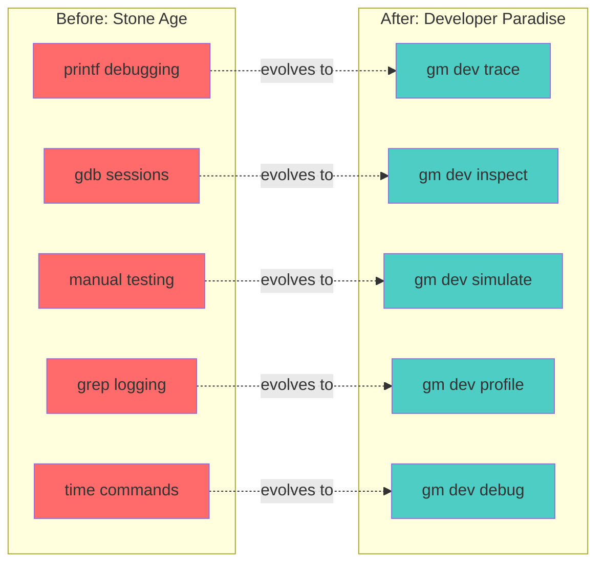
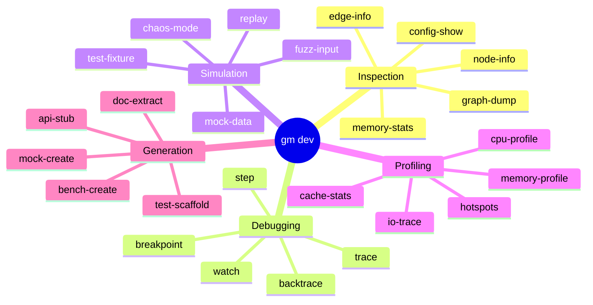
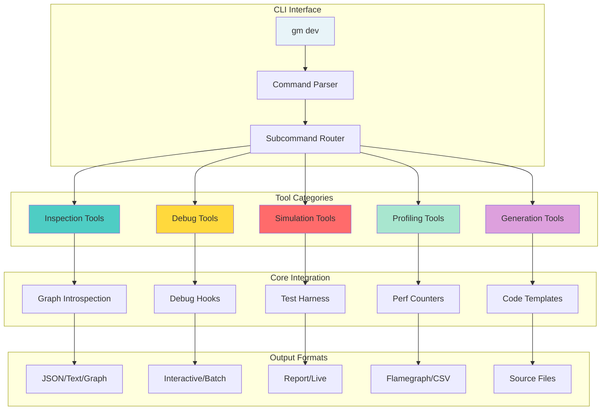
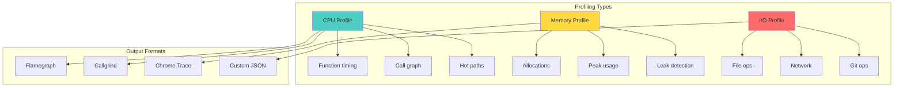

# 🛠️ DevEx: Internal CLI for Developer Tools - Gameplan

> _"Developer experience is user experience."_

## Executive Summary

Build a comprehensive internal CLI toolkit that makes debugging, profiling, and inspecting git-mind a joy. Transform development from printf-debugging into a rich, interactive experience with built-in tools for every development task.

## 🎯 Domain Overview

### The Developer Workflow Revolution



### Developer Tool Categories



## 🏗️ Architecture Design



## 📋 Core Features Required

### 1. Developer CLI Framework

```c
// core/include/gitmind/devtools.h

// Developer command structure
typedef struct gm_dev_command {
    const char *name;
    const char *description;
    const char *usage;
    
    // Command handler
    gm_result_t (*handler)(gm_context_t *ctx, 
                          int argc, 
                          char **argv);
    
    // Options
    struct {
        const char *long_name;
        char short_name;
        const char *description;
        bool required;
        const char *default_value;
    } options[16];
    int option_count;
    
    // Examples
    struct {
        const char *command;
        const char *description;
    } examples[8];
    int example_count;
} gm_dev_command_t;

// Register developer commands
void gm_dev_register_commands(void);

// Command categories
typedef enum {
    GM_DEV_CAT_INSPECT,
    GM_DEV_CAT_DEBUG,
    GM_DEV_CAT_SIMULATE,
    GM_DEV_CAT_PROFILE,
    GM_DEV_CAT_GENERATE
} gm_dev_category_t;

// Output formats
typedef enum {
    GM_DEV_OUTPUT_TEXT,
    GM_DEV_OUTPUT_JSON,
    GM_DEV_OUTPUT_CSV,
    GM_DEV_OUTPUT_DOT,
    GM_DEV_OUTPUT_INTERACTIVE
} gm_dev_output_t;
```

### 2. Inspection Tools

```c
// Graph inspection commands
static gm_dev_command_t dev_graph_commands[] = {
    {
        .name = "graph-dump",
        .description = "Dump entire graph structure",
        .usage = "gm dev graph-dump [--format=dot|json|text] [--output=FILE]",
        .handler = cmd_graph_dump,
        .options = {
            {"format", 'f', "Output format (dot, json, text)", false, "text"},
            {"output", 'o', "Output file (default: stdout)", false, "-"},
            {"depth", 'd', "Max traversal depth", false, "unlimited"},
            {"filter", 'F', "Filter expression", false, NULL}
        },
        .examples = {
            {"gm dev graph-dump --format=dot | dot -Tpng -o graph.png", 
             "Generate graph visualization"},
            {"gm dev graph-dump --filter='type:depends' --format=json", 
             "Export dependencies as JSON"}
        }
    },
    {
        .name = "edge-info",
        .description = "Detailed information about edges",
        .usage = "gm dev edge-info <edge-id|pattern>",
        .handler = cmd_edge_info,
        .options = {
            {"verbose", 'v', "Show internal details", false, NULL},
            {"raw", 'r', "Show raw CBOR data", false, NULL}
        }
    },
    {
        .name = "memory-stats",
        .description = "Memory usage statistics",
        .usage = "gm dev memory-stats [--live] [--by-tag]",
        .handler = cmd_memory_stats,
        .options = {
            {"live", 'l', "Live updating display", false, NULL},
            {"by-tag", 't', "Group by allocation tag", false, NULL},
            {"threshold", 'T', "Only show allocations > N bytes", false, "1024"}
        }
    }
};

// Implementation example
gm_result_t cmd_graph_dump(gm_context_t *ctx, int argc, char **argv) {
    // Parse options
    gm_dev_output_t format = parse_format_option(argv);
    const char *output_file = get_option_value("output", argv);
    
    // Load graph
    GM_RESULT(gm_graph_t*) graph_result = gm_graph_load(ctx);
    GM_TRY(graph_result);
    gm_graph_t *graph = graph_result.data.value;
    
    // Dump based on format
    switch (format) {
        case GM_DEV_OUTPUT_DOT:
            return dump_graph_as_dot(graph, output_file);
        case GM_DEV_OUTPUT_JSON:
            return dump_graph_as_json(graph, output_file);
        case GM_DEV_OUTPUT_TEXT:
            return dump_graph_as_text(graph, output_file);
        default:
            return gm_error_new(GM_ERR_INVALID_ARG, 
                               "Unknown format");
    }
}
```

### 3. Debug Tools

```c
// Interactive debugging support
typedef struct gm_debug_session {
    bool active;
    bool stepping;
    
    // Breakpoints
    struct {
        const char *function;
        const char *file;
        int line;
        const char *condition;
        bool enabled;
    } breakpoints[64];
    int breakpoint_count;
    
    // Watches
    struct {
        const char *expression;
        void *address;
        size_t size;
        gm_type_t type;
    } watches[32];
    int watch_count;
    
    // Trace settings
    struct {
        bool calls;
        bool returns;
        bool memory;
        bool errors;
        const char *filter;
    } trace;
} gm_debug_session_t;

// Debug commands
static gm_dev_command_t dev_debug_commands[] = {
    {
        .name = "trace",
        .description = "Trace execution with filters",
        .usage = "gm dev trace [--calls] [--memory] [--errors] [--filter=PATTERN]",
        .handler = cmd_trace,
        .options = {
            {"calls", 'c', "Trace function calls", false, NULL},
            {"memory", 'm', "Trace memory operations", false, NULL},
            {"errors", 'e', "Trace errors only", false, NULL},
            {"filter", 'f', "Filter pattern", false, NULL},
            {"output", 'o', "Output file", false, "-"}
        }
    },
    {
        .name = "breakpoint",
        .description = "Set/list/delete breakpoints",
        .usage = "gm dev breakpoint <set|list|del> [location]",
        .handler = cmd_breakpoint
    },
    {
        .name = "watch",
        .description = "Watch variable/memory changes",
        .usage = "gm dev watch <expression>",
        .handler = cmd_watch
    }
};

// Trace implementation with filtering
void gm_trace_call(const char *function, const char *file, int line) {
    if (!debug_session.trace.calls) return;
    
    if (debug_session.trace.filter && 
        !strstr(function, debug_session.trace.filter)) {
        return;
    }
    
    fprintf(trace_output, "[CALL] %s at %s:%d\n", 
            function, file, line);
}

// Macro for automatic tracing
#define GM_TRACE_FUNC() \
    gm_trace_call(__func__, __FILE__, __LINE__)
```

### 4. Simulation Tools

```c
// Test data generation and simulation
static gm_dev_command_t dev_simulate_commands[] = {
    {
        .name = "test-fixture",
        .description = "Generate test fixtures",
        .usage = "gm dev test-fixture <type> [--size=N] [--seed=S]",
        .handler = cmd_test_fixture,
        .options = {
            {"size", 's', "Size of fixture", false, "medium"},
            {"seed", 'S', "Random seed", false, "42"},
            {"output", 'o', "Output directory", false, "./fixtures"}
        },
        .examples = {
            {"gm dev test-fixture repo --size=large", 
             "Generate large test repository"},
            {"gm dev test-fixture edges --size=1000", 
             "Generate 1000 random edges"}
        }
    },
    {
        .name = "chaos-mode",
        .description = "Enable chaos testing mode",
        .usage = "gm dev chaos-mode [--failures=TYPE] [--rate=N]",
        .handler = cmd_chaos_mode,
        .options = {
            {"failures", 'f', "Failure types (memory,io,network)", false, "all"},
            {"rate", 'r', "Failure rate (0.0-1.0)", false, "0.1"},
            {"seed", 's', "Random seed", false, "random"}
        }
    },
    {
        .name = "replay",
        .description = "Replay captured operations",
        .usage = "gm dev replay <capture-file> [--speed=N]",
        .handler = cmd_replay
    }
};

// Chaos mode implementation
typedef struct gm_chaos_config {
    bool enabled;
    double failure_rate;
    uint32_t failures_enabled;
    uint64_t seed;
    
    // Failure injection points
    bool (*should_fail)(const char *operation);
    gm_error_t* (*inject_error)(const char *operation);
} gm_chaos_config_t;

static gm_chaos_config_t chaos_config = {0};

// Use in code
gm_result_t some_operation(void) {
    if (chaos_config.enabled && 
        chaos_config.should_fail("some_operation")) {
        return GM_ERR_VAL(result, 
            chaos_config.inject_error("some_operation"));
    }
    // Normal operation
}
```

### 5. Profiling Tools



```c
// Profiling infrastructure
typedef struct gm_profile_data {
    // Timing data
    struct {
        const char *function;
        uint64_t total_ns;
        uint64_t self_ns;
        uint32_t call_count;
        uint64_t min_ns;
        uint64_t max_ns;
    } *timings;
    size_t timing_count;
    
    // Memory data
    struct {
        const char *location;
        size_t total_allocated;
        size_t current_allocated;
        uint32_t alloc_count;
        uint32_t free_count;
    } *allocations;
    size_t allocation_count;
    
    // I/O data
    struct {
        const char *operation;
        uint64_t total_bytes;
        uint32_t operation_count;
        uint64_t total_time_ns;
    } *io_ops;
    size_t io_op_count;
} gm_profile_data_t;

static gm_dev_command_t dev_profile_commands[] = {
    {
        .name = "cpu-profile",
        .description = "CPU profiling with sampling",
        .usage = "gm dev cpu-profile <start|stop|report>",
        .handler = cmd_cpu_profile,
        .options = {
            {"rate", 'r', "Sampling rate (Hz)", false, "1000"},
            {"output", 'o', "Output format", false, "flamegraph"},
            {"threshold", 't', "Min percentage to show", false, "0.1"}
        }
    },
    {
        .name = "memory-profile",
        .description = "Memory allocation profiling",
        .usage = "gm dev memory-profile [--live] [--leaks]",
        .handler = cmd_memory_profile
    },
    {
        .name = "hotspots",
        .description = "Find performance hotspots",
        .usage = "gm dev hotspots [--type=cpu|memory|io]",
        .handler = cmd_hotspots
    }
};

// Automatic profiling macros
#define GM_PROFILE_START(name) \
    uint64_t _prof_start_##name = gm_time_ns()

#define GM_PROFILE_END(name) \
    gm_profile_record(#name, gm_time_ns() - _prof_start_##name)
```

### 6. Code Generation Tools

```c
// Developer productivity tools
static gm_dev_command_t dev_generate_commands[] = {
    {
        .name = "test-scaffold",
        .description = "Generate test scaffolding",
        .usage = "gm dev test-scaffold <module> [--type=unit|integration|e2e]",
        .handler = cmd_test_scaffold,
        .examples = {
            {"gm dev test-scaffold edge --type=unit", 
             "Generate unit test template for edge module"}
        }
    },
    {
        .name = "mock-create",
        .description = "Generate mock for interface",
        .usage = "gm dev mock-create <header-file> [--output=FILE]",
        .handler = cmd_mock_create
    },
    {
        .name = "bench-create",
        .description = "Generate benchmark template",
        .usage = "gm dev bench-create <function> [--iterations=N]",
        .handler = cmd_bench_create
    },
    {
        .name = "doc-extract",
        .description = "Extract documentation from source",
        .usage = "gm dev doc-extract <source-file> [--format=md|man|html]",
        .handler = cmd_doc_extract
    }
};

// Template for test generation
const char *test_template = 
    "/* SPDX-License-Identifier: LicenseRef-MIND-UCAL-1.0 */\n"
    "/* © 2025 J. Kirby Ross / Neuroglyph Collective */\n"
    "\n"
    "#include \"test_framework.h\"\n"
    "#include \"%s.h\"\n"
    "\n"
    "GM_TEST(%s, basic_functionality) {\n"
    "    // Arrange\n"
    "    \n"
    "    // Act\n"
    "    \n"
    "    // Assert\n"
    "    GM_ASSERT_TRUE(false); // TODO: Implement test\n"
    "}\n"
    "\n"
    "GM_TEST(%s, error_handling) {\n"
    "    // Test error cases\n"
    "}\n"
    "\n"
    "GM_TEST(%s, edge_cases) {\n"
    "    // Test boundary conditions\n"
    "}\n";
```

## 🛠️ Implementation Plan

### Phase 1: Core Framework (Immediate)

1. Create dev command infrastructure
2. Implement basic inspection tools
3. Add output format support
4. Create help system

### Phase 2: Debug Tools (During Migration)

1. Add tracing infrastructure
2. Implement watch/breakpoint system
3. Create interactive debugger
4. Add debug macros

### Phase 3: Simulation & Testing (Per Module)

1. Build fixture generators
2. Add chaos mode
3. Create replay system
4. Implement fuzz helpers

### Phase 4: Profiling & Generation (Later)

1. Add profiling infrastructure
2. Create analysis tools
3. Build code generators
4. Add template system

## 📊 Usage Examples

### Developer Workflow Examples

```bash
# Debugging a crash
$ gm dev trace --calls --errors --filter=edge
[CALL] gm_edge_create at edge.c:42
[CALL] validate_edge at edge.c:128
[ERROR] Invalid edge type: unknown at edge.c:135
[RETURN] validate_edge = GM_ERR_INVALID_TYPE

# Profiling performance issue
$ gm dev cpu-profile start
$ gm query "depends_on*"  # Run slow operation
$ gm dev cpu-profile stop
$ gm dev cpu-profile report --output=flame.svg
Generated flamegraph: flame.svg
Top hotspots:
  45.2% - traverse_graph
  23.1% - cbor_decode
  15.3% - edge_filter_match

# Generating test data
$ gm dev test-fixture repo --size=large --seed=42
Created fixture: ./fixtures/large_repo_42/
  - 10,000 commits
  - 50,000 files
  - 125,000 edges
  
# Memory leak hunting
$ gm dev memory-profile --leaks
Potential leaks detected:
  edge.c:234 - 1024 bytes (10 allocations)
  cbor.c:567 - 512 bytes (5 allocations)
Total leaked: 1536 bytes

# Quick inspection
$ gm dev edge-info "src/*.c -> include/*.h"
Found 23 matching edges:
  src/main.c -> include/gitmind.h
    Type: includes
    Created: 2024-01-15 10:23:45
    Attributes: line_count=15
  ...
```

## 🧪 Testing Approach

### 1. Command Testing

```c
void test_dev_command_parsing(void) {
    char *argv[] = {"gm", "dev", "trace", "--calls", "--filter=test"};
    
    gm_result_t result = gm_dev_handle_command(5, argv);
    GM_ASSERT_OK(result);
    
    GM_ASSERT_TRUE(debug_session.trace.calls);
    GM_ASSERT_STR_EQ("test", debug_session.trace.filter);
}
```

### 2. Tool Integration Tests

```c
void test_graph_dump_formats(void) {
    // Create test graph
    GM_WITH_FIXTURE(graph, simple) {
        char output[4096];
        
        // Test each format
        GM_ASSERT_OK(dump_graph_as_json(graph, output));
        GM_ASSERT_TRUE(is_valid_json(output));
        
        GM_ASSERT_OK(dump_graph_as_dot(graph, output));
        GM_ASSERT_TRUE(strstr(output, "digraph") != NULL);
    }
}
```

## 📈 Success Metrics

1. __Developer Efficiency__: 50% faster debugging
2. __Tool Coverage__: Every major task has a tool
3. __Discovery__: < 5 seconds to find right command
4. __Performance__: Tools add < 1% overhead
5. __Adoption__: 90% of devs use daily

## 🎓 Best Practices

### DO

- ✅ Make tools discoverable
- ✅ Provide helpful examples
- ✅ Support common workflows
- ✅ Output in standard formats
- ✅ Design for scripting

### DON'T

- ❌ Require complex setup
- ❌ Hide useful features
- ❌ Break existing workflows
- ❌ Forget documentation
- ❌ Ignore performance

## 🔗 Integration Points

### With Observability

- Dev tools use same infrastructure
- Profiling data exported to metrics
- Trace output follows log format

### With Testing

- Fixture generation for tests
- Mock creation automated
- Replay for regression tests

### With Error Handling

- Debug tools show error chains
- Trace includes error context
- Profiling tracks error paths

## 📚 References

- [Chrome DevTools Protocol](https://chromedevtools.github.io/devtools-protocol/) - Debugging protocol
- [Flamegraph](https://www.brendangregg.com/flamegraphs.html) - Visualization technique
- [rr debugger](https://rr-project.org/) - Record/replay debugging
- [Valgrind](https://valgrind.org/) - Memory profiling tools

---

_"The best developers build the best tools. The best tools build the best developers."_
