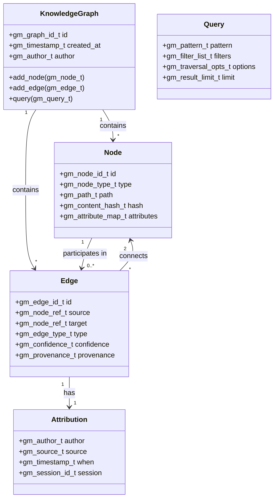
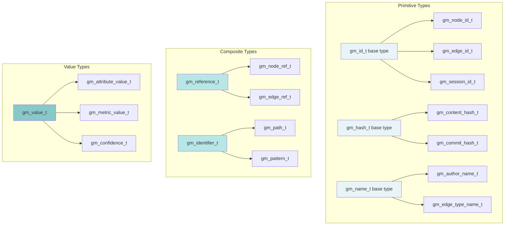
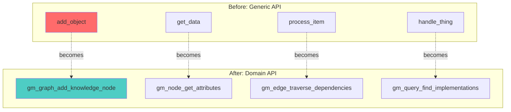

# 📖 Domain Language Purity: Gameplan

> _"Speak the language of your domain."_

## Executive Summary

Transform git-mind from a codebase using raw primitives and generic names into a system that speaks the precise language of knowledge graphs, where every type, function, and variable tells a story about its purpose and constraints.

## 🎯 Domain Overview

### The Semantic Gap We're Closing

```mermaid
graph LR
    subgraph "Before: Primitive Soup"
        A1[char* id]
        A2[int type]
        A3[void* data]
        A4[char buffer{1024}]
        A5[struct obj]
    end
    
    subgraph "After: Domain Model"
        B1[gm_node_id_t]
        B2[gm_edge_type_t]
        B3[gm_attribute_value_t]
        B4[gm_path_buffer_t]
        B5[gm_knowledge_node_t]
    end
    
    A1 -.->|becomes| B1
    A2 -.->|becomes| B2
    A3 -.->|becomes| B3
    A4 -.->|becomes| B4
    A5 -.->|becomes| B5
    
    style A1 fill:#ff6b6b
    style A2 fill:#ff6b6b
    style A3 fill:#ff6b6b
    style A4 fill:#ff6b6b
    style A5 fill:#ff6b6b
    style B1 fill:#4ecdc4
    style B2 fill:#4ecdc4
    style B3 fill:#4ecdc4
    style B4 fill:#4ecdc4
    style B5 fill:#4ecdc4
```

### Git-Mind Domain Model



## 🏗️ Architecture Design

### Type System Hierarchy



## 📋 Core Features Required

### 1. Domain Type System

```c
// core/include/gitmind/domain_types.h

// ===== Base Types with Semantic Meaning =====

// IDs are opaque, comparable, hashable
typedef struct gm_id {
    uint8_t bytes[32];  // SHA-256 based
} gm_id_t;

// Typed IDs prevent mixing
typedef struct { gm_id_t base; } gm_node_id_t;
typedef struct { gm_id_t base; } gm_edge_id_t;
typedef struct { gm_id_t base; } gm_graph_id_t;
typedef struct { gm_id_t base; } gm_session_id_t;

// Hash types for content addressing
typedef struct gm_hash {
    uint8_t bytes[32];
    gm_hash_algorithm_t algorithm;
} gm_hash_t;

typedef struct { gm_hash_t base; } gm_content_hash_t;
typedef struct { gm_hash_t base; } gm_commit_hash_t;
typedef struct { gm_hash_t base; } gm_tree_hash_t;

// Timestamps with timezone awareness
typedef struct gm_timestamp {
    int64_t seconds_since_epoch;
    int32_t nanoseconds;
    int16_t timezone_offset_minutes;
} gm_timestamp_t;

// Confidence scoring (0.0 - 1.0)
typedef struct gm_confidence {
    double value;
    const char *explanation;
} gm_confidence_t;

// ===== Domain Entities =====

// Author information
typedef struct gm_author {
    gm_string_t name;
    gm_string_t email;
    gm_id_t author_id;  // Stable ID across name changes
} gm_author_t;

// Source attribution
typedef struct gm_source {
    gm_source_type_t type;  // human, ai, plugin, import
    gm_string_t identifier; // "claude", "user", "plugin:analyzer"
    gm_version_t version;
} gm_source_t;

// Provenance tracking
typedef struct gm_provenance {
    gm_author_t author;
    gm_source_t source;
    gm_timestamp_t created_at;
    gm_session_id_t session;
    gm_confidence_t confidence;
} gm_provenance_t;

// ===== Semantic Strings =====

// Path with validation
typedef struct gm_path {
    gm_string_t value;
    bool is_absolute;
    bool is_canonical;
    gm_path_type_t type;  // file, directory, url, identifier
} gm_path_t;

// Pattern for matching
typedef struct gm_pattern {
    gm_string_t expression;
    gm_pattern_type_t type;  // glob, regex, exact
    bool case_sensitive;
} gm_pattern_t;

// ===== Type Constructors =====

// Create typed IDs from strings
gm_result_t gm_node_id_from_path(gm_path_t path, gm_node_id_t *id);
gm_result_t gm_edge_id_from_triple(gm_node_id_t source, 
                                   gm_node_id_t target,
                                   gm_edge_type_t type,
                                   gm_edge_id_t *id);

// Parse and validate domain values
gm_result_t gm_confidence_parse(const char *str, gm_confidence_t *conf);
gm_result_t gm_timestamp_now(gm_timestamp_t *ts);
gm_result_t gm_author_from_git(git_signature *sig, gm_author_t *author);
```

### 2. Domain Constants and Enums

```c
// core/include/gitmind/domain_constants.h

// Edge types as semantic constants
typedef enum {
    GM_EDGE_TYPE_UNKNOWN = 0,
    
    // Structural relationships
    GM_EDGE_TYPE_CONTAINS,      // Directory → File
    GM_EDGE_TYPE_INCLUDES,      // Source → Header
    GM_EDGE_TYPE_IMPORTS,       // Module → Module
    
    // Dependency relationships  
    GM_EDGE_TYPE_DEPENDS_ON,    // Code → Code
    GM_EDGE_TYPE_USES,          // Function → Function
    GM_EDGE_TYPE_CALLS,         // Caller → Callee
    GM_EDGE_TYPE_IMPLEMENTS,    // Class → Interface
    GM_EDGE_TYPE_EXTENDS,       // Child → Parent
    
    // Semantic relationships
    GM_EDGE_TYPE_REFERENCES,    // Doc → Code
    GM_EDGE_TYPE_DOCUMENTS,     // Doc → Concept
    GM_EDGE_TYPE_TESTS,         // Test → Code
    GM_EDGE_TYPE_GENERATED_BY,  // Output → Generator
    
    // Temporal relationships
    GM_EDGE_TYPE_PRECEDED_BY,   // Version → Version
    GM_EDGE_TYPE_DERIVED_FROM,  // Fork → Original
    GM_EDGE_TYPE_REPLACES,      // New → Old
    
    // Custom types start here
    GM_EDGE_TYPE_CUSTOM = 1000
} gm_edge_type_t;

// String representations
extern const char* GM_EDGE_TYPE_NAMES[];
const char* gm_edge_type_to_string(gm_edge_type_t type);
gm_result_t gm_edge_type_from_string(const char *str, gm_edge_type_t *type);

// Node types
typedef enum {
    GM_NODE_TYPE_UNKNOWN = 0,
    
    // File system nodes
    GM_NODE_TYPE_FILE,
    GM_NODE_TYPE_DIRECTORY,
    GM_NODE_TYPE_SYMLINK,
    
    // Code nodes
    GM_NODE_TYPE_FUNCTION,
    GM_NODE_TYPE_CLASS,
    GM_NODE_TYPE_MODULE,
    GM_NODE_TYPE_PACKAGE,
    
    // Documentation nodes
    GM_NODE_TYPE_COMMENT,
    GM_NODE_TYPE_DOCSTRING,
    GM_NODE_TYPE_README,
    GM_NODE_TYPE_WIKI,
    
    // Version control nodes
    GM_NODE_TYPE_COMMIT,
    GM_NODE_TYPE_TAG,
    GM_NODE_TYPE_BRANCH,
    
    // Abstract nodes
    GM_NODE_TYPE_CONCEPT,
    GM_NODE_TYPE_PATTERN,
    GM_NODE_TYPE_DECISION,
    
    GM_NODE_TYPE_CUSTOM = 1000
} gm_node_type_t;

// Source types for attribution
typedef enum {
    GM_SOURCE_TYPE_HUMAN,
    GM_SOURCE_TYPE_AI,
    GM_SOURCE_TYPE_PLUGIN,
    GM_SOURCE_TYPE_IMPORT,
    GM_SOURCE_TYPE_INFERRED
} gm_source_type_t;
```

### 3. Domain Validation Rules

```c
// core/include/gitmind/domain_rules.h

// Validation rules for domain types
typedef struct gm_domain_rules {
    // ID rules
    struct {
        size_t min_length;
        size_t max_length;
        bool allow_unicode;
        const char *forbidden_chars;
    } identifiers;
    
    // Path rules  
    struct {
        size_t max_depth;
        size_t max_length;
        bool allow_absolute;
        bool allow_relative;
        bool allow_symlinks;
        const char **forbidden_patterns;
        size_t forbidden_count;
    } paths;
    
    // Edge rules
    struct {
        bool allow_self_loops;
        bool allow_duplicates;
        size_t max_edges_per_node;
        gm_edge_type_t *allowed_types;
        size_t allowed_type_count;
    } edges;
    
    // Attribute rules
    struct {
        size_t max_key_length;
        size_t max_value_size;
        size_t max_attributes_per_node;
        const char **reserved_keys;
        size_t reserved_count;
    } attributes;
} gm_domain_rules_t;

// Default rules
extern const gm_domain_rules_t GM_DEFAULT_RULES;
extern const gm_domain_rules_t GM_STRICT_RULES;
extern const gm_domain_rules_t GM_RELAXED_RULES;

// Validation functions
gm_result_t gm_validate_node_id(gm_node_id_t id, 
                               const gm_domain_rules_t *rules);
gm_result_t gm_validate_edge(gm_edge_t *edge,
                            const gm_domain_rules_t *rules);
gm_result_t gm_validate_path(gm_path_t path,
                            const gm_domain_rules_t *rules);

// Domain invariants
bool gm_invariant_no_orphan_nodes(gm_graph_t *graph);
bool gm_invariant_acyclic_depends(gm_graph_t *graph);
bool gm_invariant_unique_paths(gm_graph_t *graph);
```

### 4. Semantic API Design



```c
// Semantic API examples

// ❌ BAD: Generic, unclear
int add_link(void *graph, char *from, char *to, int type);
void* get_links(void *graph, char *node);
int process(void *data, int flags);

// ✅ GOOD: Domain-specific, self-documenting
gm_result_t gm_graph_add_dependency(
    gm_graph_t *graph,
    gm_node_ref_t dependent,
    gm_node_ref_t dependency,
    gm_dependency_opts_t *options
);

gm_result_t gm_node_find_dependencies(
    gm_node_t *node,
    gm_dependency_filter_t *filter,
    gm_node_list_t *dependencies
);

gm_result_t gm_query_traverse_call_graph(
    gm_graph_t *graph,
    gm_function_ref_t root,
    gm_traversal_direction_t direction,
    gm_call_graph_visitor_t *visitor
);

// Rich query language
gm_result_t gm_query_build(
    gm_query_builder_t *builder,
    const char *dsl_expression
);

// Example: "MATCH (test:Test)-[tests]->(code:Function) 
//          WHERE code.complexity > 10 
//          RETURN test, code"
```

### 5. Type Safety Enforcement

```c
// Compile-time type checking

// Type-safe ID comparison
static inline bool gm_node_id_equal(gm_node_id_t a, gm_node_id_t b) {
    return gm_id_equal(a.base, b.base);
}

// Prevent mixing different ID types
static inline bool gm_edge_id_equal(gm_edge_id_t a, gm_edge_id_t b) {
    return gm_id_equal(a.base, b.base);
}

// Won't compile: different types
// gm_node_id_t node_id = ...;
// gm_edge_id_t edge_id = ...;
// bool same = gm_node_id_equal(node_id, edge_id);  // ERROR!

// Type-safe collections
typedef struct {
    gm_node_t **nodes;
    size_t count;
    size_t capacity;
} gm_node_list_t;

typedef struct {
    gm_edge_t **edges;
    size_t count;
    size_t capacity;
} gm_edge_list_t;

// Can't accidentally mix collections
gm_result_t gm_node_list_add(gm_node_list_t *list, gm_node_t *node);
gm_result_t gm_edge_list_add(gm_edge_list_t *list, gm_edge_t *edge);

// Domain-specific iterators
#define GM_FOR_EACH_NODE(node, list) \
    for (size_t _i = 0; _i < (list)->count && ((node) = (list)->nodes[_i]); _i++)

#define GM_FOR_EACH_EDGE(edge, list) \
    for (size_t _i = 0; _i < (list)->count && ((edge) = (list)->edges[_i]); _i++)
```

## 🛠️ Implementation Plan

### Phase 1: Core Types (Immediate)

1. Define base domain types
2. Create type constructors
3. Add validation functions
4. Document type semantics

### Phase 2: Constant Migration (During Refactor)

1. Replace magic numbers with enums
2. Define string constants
3. Create lookup tables
4. Add conversion functions

### Phase 3: API Semantics (Per Module)

1. Rename generic functions
2. Add type-specific APIs
3. Create domain helpers
4. Update documentation

### Phase 4: Type Safety (Ongoing)

1. Add compile-time checks
2. Create type-safe collections
3. Implement validators
4. Enforce invariants

## 📊 Migration Strategy

### Converting Generic Code to Domain Code

```c
// BEFORE: Generic, unclear intent
typedef struct {
    char *id;
    int type;
    void *data;
    struct obj *next;
} obj_t;

obj_t* create_obj(const char *id, int type) {
    obj_t *obj = malloc(sizeof(obj_t));
    obj->id = strdup(id);
    obj->type = type;
    obj->data = NULL;
    obj->next = NULL;
    return obj;
}

int link_objs(obj_t *a, obj_t *b, int link_type) {
    // What does this even do?
    return add_link(a->id, b->id, link_type);
}

// AFTER: Domain-specific, self-documenting
typedef struct gm_knowledge_node {
    gm_node_id_t id;
    gm_node_type_t type;
    gm_path_t path;
    gm_attribute_map_t attributes;
    gm_provenance_t provenance;
} gm_knowledge_node_t;

gm_result_t gm_knowledge_node_create(
    gm_path_t path,
    gm_node_type_t type,
    gm_knowledge_node_t **node
) {
    GM_VALIDATE_PATH(path);
    GM_VALIDATE_NODE_TYPE(type);
    
    GM_WITH_ARENA(arena, 4096, "node_create") {
        gm_knowledge_node_t *n = gm_arena_alloc(arena, sizeof(*n));
        
        GM_TRY(gm_node_id_from_path(path, &n->id));
        n->type = type;
        n->path = path;
        GM_TRY(gm_attribute_map_create(&n->attributes));
        GM_TRY(gm_provenance_capture(&n->provenance));
        
        *node = n;
        return GM_OK;
    }
}

gm_result_t gm_knowledge_edge_create_dependency(
    gm_knowledge_node_t *dependent,
    gm_knowledge_node_t *dependency,
    gm_confidence_t confidence
) {
    GM_ASSERT_NODE_TYPE(dependent, GM_NODE_TYPE_FILE);
    GM_ASSERT_NODE_TYPE(dependency, GM_NODE_TYPE_FILE);
    GM_VALIDATE_CONFIDENCE(confidence);
    
    return gm_edge_create(
        dependent->id,
        dependency->id,
        GM_EDGE_TYPE_DEPENDS_ON,
        &(gm_edge_opts_t){
            .confidence = confidence,
            .provenance = gm_provenance_current()
        }
    );
}
```

### Naming Convention Guidelines

```c
// Domain-Driven Naming Patterns

// ✅ GOOD: Clear domain concepts
gm_node_t
gm_edge_t  
gm_graph_t
gm_query_t
gm_traversal_t
gm_knowledge_base_t

// ❌ BAD: Generic terms
object_t
item_t
thing_t
data_t
info_t
manager_t

// ✅ GOOD: Semantic operations
gm_graph_add_knowledge
gm_edge_establish_dependency
gm_node_inherit_attributes
gm_query_find_implementations
gm_traversal_follow_dependencies

// ❌ BAD: CRUD operations
create_object
read_data
update_record
delete_item
process_thing

// ✅ GOOD: Domain events
gm_event_node_discovered
gm_event_edge_established  
gm_event_cycle_detected
gm_event_pattern_matched

// ❌ BAD: Technical events
on_create
on_update
on_change
on_process
```

## 🧪 Testing Approach

### 1. Type Safety Tests

```c
void test_type_safety(void) {
    // These should not compile (checked in build)
    #ifdef COMPILE_TEST
    gm_node_id_t nid;
    gm_edge_id_t eid;
    bool same = gm_id_equal(nid, eid);  // Type error!
    #endif
    
    // Runtime type validation
    gm_node_id_t node_id;
    GM_ASSERT_OK(gm_node_id_from_path(
        (gm_path_t){.value = "src/main.c"}, &node_id));
    
    // Invalid types rejected
    GM_ASSERT_ERROR(gm_node_id_from_path(
        (gm_path_t){.value = ""}, &node_id));
}
```

### 2. Domain Rule Tests

```c
void test_domain_rules(void) {
    gm_edge_t edge = {
        .source = node_a->id,
        .target = node_a->id,  // Self-loop
        .type = GM_EDGE_TYPE_DEPENDS_ON
    };
    
    // Strict rules forbid self-loops
    GM_ASSERT_ERROR(gm_validate_edge(&edge, &GM_STRICT_RULES));
    
    // Relaxed rules allow them
    GM_ASSERT_OK(gm_validate_edge(&edge, &GM_RELAXED_RULES));
}
```

### 3. API Semantics Tests

```c
void test_semantic_api(void) {
    // Clear, intention-revealing test
    gm_knowledge_node_t *test_file, *source_file;
    
    GM_ASSERT_OK(gm_knowledge_node_create(
        gm_path_from_string("tests/test_main.c"),
        GM_NODE_TYPE_FILE,
        &test_file
    ));
    
    GM_ASSERT_OK(gm_knowledge_node_create(
        gm_path_from_string("src/main.c"),
        GM_NODE_TYPE_FILE,
        &source_file
    ));
    
    // Semantic relationship
    GM_ASSERT_OK(gm_knowledge_edge_create_tests(
        test_file,
        source_file,
        gm_confidence_high()
    ));
}
```

## 📈 Success Metrics

1. __Zero Raw Types__: No char*/int/void* in public APIs
2. __100% Semantic Names__: Every identifier tells a story
3. __Type Safety__: Compiler catches type mismatches
4. __Domain Coverage__: All concepts have types
5. __API Clarity__: New developers understand immediately

## 🎓 Best Practices

### DO

- ✅ Create types for domain concepts
- ✅ Use semantic function names
- ✅ Validate at type boundaries
- ✅ Document type invariants
- ✅ Prefer composition over primitives

### DON'T

- ❌ Use generic names (manager, handler)
- ❌ Expose raw primitives
- ❌ Mix abstraction levels
- ❌ Create "god objects"
- ❌ Ignore domain language

## 🔗 Integration Points

### With Error Handling

- Domain-specific error types
- Validation errors are semantic
- Error messages use domain terms

### With Configuration

- Config uses domain types
- Validation rules configurable
- Type mappings defined

### With Testing

- Type generators for properties
- Domain-specific assertions
- Semantic test builders

## 📚 References

- [Domain-Driven Design](https://www.domainlanguage.com/ddd/) - Eric Evans
- [Type-Driven Development](https://www.manning.com/books/type-driven-development-with-idris) - Type safety
- [Making Invalid States Unrepresentable](https://blog.janestreet.com/effective-ml-revisited/) - Yaron Minsky
- [Parse, Don't Validate](https://lexi-lambda.github.io/blog/2019/11/05/parse-don-t-validate/) - Type design

---

_"Make illegal states unrepresentable. Make the right thing easy and the wrong thing impossible."_
