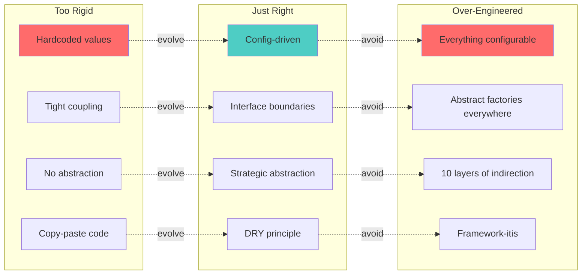
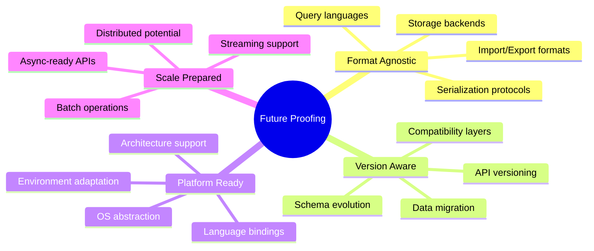
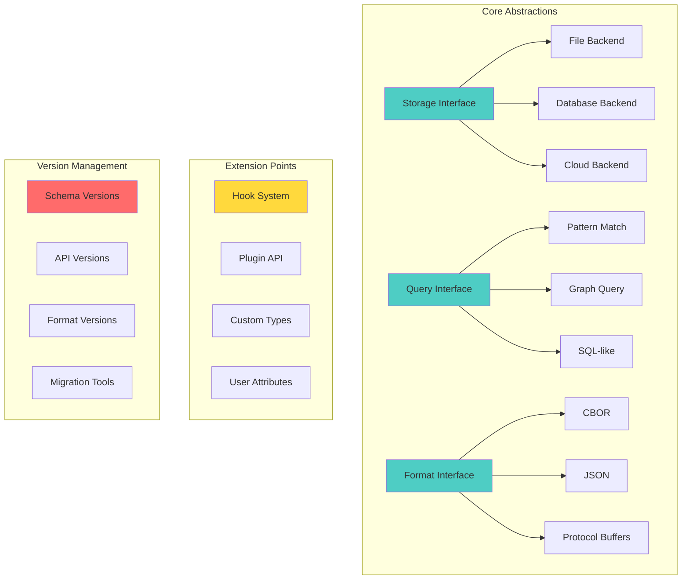
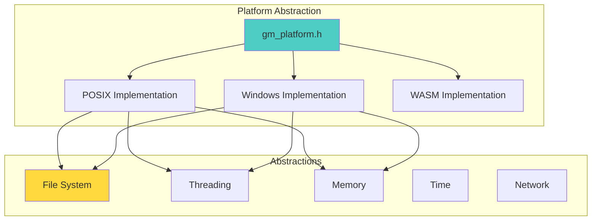

# 🔮 Future Proofing Without YAGNI Sin: Gameplan

> _"Prepare for change without overengineering."_

## Executive Summary

Build git-mind with strategic flexibility points that enable evolution without the burden of speculative complexity. Master the art of "just enough" abstraction - creating extension points where change is likely while keeping the codebase simple and focused.

## 🎯 Domain Overview

### The YAGNI Balance



### Strategic Flexibility Points



## 🏗️ Architecture Design

### Abstraction Boundaries That Matter



## 📋 Core Features Required

### 1. Format-Agnostic Storage Layer

```c
// core/include/gitmind/storage.h

// Storage backend interface (prepare for multiple implementations)
typedef struct gm_storage_backend {
    const char *name;
    uint32_t version;
    
    // Core operations
    gm_result_t (*open)(const char *path, gm_storage_handle_t **handle);
    gm_result_t (*close)(gm_storage_handle_t *handle);
    
    // Object operations
    gm_result_t (*put)(gm_storage_handle_t *handle,
                      const gm_storage_key_t *key,
                      const void *data,
                      size_t size);
    
    gm_result_t (*get)(gm_storage_handle_t *handle,
                      const gm_storage_key_t *key,
                      void **data,
                      size_t *size);
    
    gm_result_t (*delete)(gm_storage_handle_t *handle,
                         const gm_storage_key_t *key);
    
    // Batch operations (future optimization)
    gm_result_t (*put_batch)(gm_storage_handle_t *handle,
                            const gm_storage_batch_t *batch);
    
    // Iteration (future feature)
    gm_result_t (*iterate)(gm_storage_handle_t *handle,
                          const gm_storage_filter_t *filter,
                          gm_storage_iterator_t **iter);
    
    // Transactions (future feature)
    gm_result_t (*begin_transaction)(gm_storage_handle_t *handle,
                                    gm_transaction_t **txn);
} gm_storage_backend_t;

// Current implementation: file-based
extern const gm_storage_backend_t gm_storage_file_backend;

// Future implementations (not implemented yet)
// extern const gm_storage_backend_t gm_storage_sqlite_backend;
// extern const gm_storage_backend_t gm_storage_rocks_backend;
// extern const gm_storage_backend_t gm_storage_s3_backend;

// Storage key abstraction
typedef struct gm_storage_key {
    uint8_t bytes[32];
    gm_key_type_t type;  // edge, node, metadata
} gm_storage_key_t;

// Format-agnostic serialization
typedef struct gm_serializer {
    const char *name;
    const char *mime_type;
    
    gm_result_t (*serialize)(const void *object,
                            gm_object_type_t type,
                            gm_buffer_t *output);
    
    gm_result_t (*deserialize)(const gm_buffer_t *input,
                              gm_object_type_t type,
                              void **object);
} gm_serializer_t;

// Current format
extern const gm_serializer_t gm_serializer_cbor;

// Future formats (when needed)
// extern const gm_serializer_t gm_serializer_json;
// extern const gm_serializer_t gm_serializer_protobuf;
```

### 2. Version-Aware Schema System

```c
// core/include/gitmind/schema.h

// Schema versioning for forward compatibility
typedef struct gm_schema_version {
    uint32_t major;  // Breaking changes
    uint32_t minor;  // New features, backward compatible
    uint32_t patch;  // Bug fixes
} gm_schema_version_t;

// Versioned structure pattern
#define GM_VERSIONED_STRUCT(name) \
    struct name { \
        uint32_t struct_version; \
        uint32_t struct_size;

#define GM_VERSIONED_END() \
    }

// Example: Edge structure with versioning
GM_VERSIONED_STRUCT(gm_edge_v1)
    gm_node_id_t source;
    gm_node_id_t target;
    gm_edge_type_t type;
GM_VERSIONED_END();

GM_VERSIONED_STRUCT(gm_edge_v2)
    gm_node_id_t source;
    gm_node_id_t target;
    gm_edge_type_t type;
    // New in v2
    gm_timestamp_t created_at;
    gm_confidence_t confidence;
GM_VERSIONED_END();

// Version detection and handling
typedef struct gm_version_handler {
    gm_schema_version_t version;
    size_t struct_size;
    
    // Migration functions
    gm_result_t (*upgrade_from_previous)(void *old_struct, 
                                        void *new_struct);
    gm_result_t (*downgrade_to_previous)(void *new_struct,
                                        void *old_struct);
} gm_version_handler_t;

// Schema registry
typedef struct gm_schema_registry {
    struct {
        const char *type_name;
        gm_version_handler_t *handlers;
        size_t handler_count;
        uint32_t current_version;
    } types[64];
    size_t type_count;
} gm_schema_registry_t;

// API versioning through capabilities
typedef struct gm_api_version {
    uint32_t version;
    uint32_t capabilities;  // Bitmask of features
    
    // Function table for version
    const void *functions;
} gm_api_version_t;

// Future-proof API access
#define GM_API_CALL(version, func, ...) \
    ((version)->functions->func(__VA_ARGS__))
```

### 3. Enumeration and Constant Management

```c
// core/include/gitmind/constants.h

// Extensible enums with string mapping
typedef struct gm_enum_registry {
    const char *enum_name;
    struct {
        int value;
        const char *name;
        const char *description;
    } *entries;
    size_t entry_count;
    int next_custom_value;
} gm_enum_registry_t;

// Register custom enum values at runtime
gm_result_t gm_enum_register_value(const char *enum_name,
                                  const char *value_name,
                                  int *assigned_value);

// String table pattern for i18n readiness
typedef struct gm_string_table {
    const char *string_id;
    const char *default_text;
    // Future: translations
} gm_string_table_t;

// Error messages as table (not hardcoded)
static const gm_string_table_t ERROR_MESSAGES[] = {
    {"err.invalid_input", "Invalid input provided"},
    {"err.not_found", "Resource not found"},
    {"err.permission", "Permission denied"},
    // Easy to extend, localize later
};

// Feature flags for gradual rollout
typedef struct gm_feature_flags {
    struct {
        const char *name;
        bool enabled;
        const char *description;
    } flags[128];
    size_t flag_count;
} gm_feature_flags_t;

bool gm_feature_enabled(const char *feature_name);
void gm_feature_set(const char *feature_name, bool enabled);
```

### 4. Async-Ready API Design

```c
// Design APIs to support async operation in future

// Async-ready result type
typedef struct gm_future {
    bool is_ready;
    union {
        void *value;
        gm_error_t *error;
    } result;
    
    // Future: callback support
    void (*on_complete)(struct gm_future *self);
    void *callback_data;
} gm_future_t;

// Operations return immediately, may complete later
gm_future_t* gm_graph_query_async(gm_graph_t *graph,
                                 const gm_query_t *query);

// Check if ready (non-blocking)
bool gm_future_is_ready(gm_future_t *future);

// Wait for completion (blocking)
gm_result_t gm_future_wait(gm_future_t *future, void **result);

// Batch operations for efficiency
typedef struct gm_batch_operation {
    gm_operation_type_t type;
    void *params;
    gm_future_t *future;
} gm_batch_operation_t;

gm_result_t gm_batch_execute(gm_batch_operation_t *ops, 
                            size_t count);

// Stream processing ready
typedef struct gm_stream {
    // Current implementation: in-memory
    void *data;
    size_t position;
    size_t size;
    
    // Future: actual streaming
    int fd;
    bool is_pipe;
} gm_stream_t;

// Process data in chunks
gm_result_t gm_stream_process(gm_stream_t *input,
                             gm_stream_processor_t *processor,
                             gm_stream_t *output);
```

### 5. Platform Abstraction Layer



```c
// core/include/gitmind/platform.h

// Platform detection
#if defined(__linux__) || defined(__APPLE__)
    #define GM_PLATFORM_POSIX
#elif defined(_WIN32)
    #define GM_PLATFORM_WINDOWS
#elif defined(__EMSCRIPTEN__)
    #define GM_PLATFORM_WASM
#endif

// Platform-specific types
#ifdef GM_PLATFORM_WINDOWS
    typedef HANDLE gm_file_handle_t;
    typedef DWORD gm_error_code_t;
#else
    typedef int gm_file_handle_t;
    typedef int gm_error_code_t;
#endif

// Platform operations
typedef struct gm_platform_ops {
    // File operations
    gm_result_t (*file_open)(const char *path, int flags, 
                            gm_file_handle_t *handle);
    gm_result_t (*file_close)(gm_file_handle_t handle);
    
    // Memory mapping (future optimization)
    gm_result_t (*mmap)(gm_file_handle_t handle, size_t size,
                       void **addr);
    gm_result_t (*munmap)(void *addr, size_t size);
    
    // Threading (future feature)
    gm_result_t (*thread_create)(gm_thread_t *thread,
                                void *(*func)(void*), void *arg);
    gm_result_t (*mutex_create)(gm_mutex_t *mutex);
    
    // Time operations
    gm_result_t (*time_now)(gm_timestamp_t *ts);
    gm_result_t (*time_monotonic)(uint64_t *ns);
} gm_platform_ops_t;

// Current platform
extern const gm_platform_ops_t *gm_platform;

// Platform initialization
gm_result_t gm_platform_init(void);
```

## 🛠️ Implementation Plan

### Phase 1: Core Abstractions (Immediate)

1. Create storage interface
2. Add schema versioning
3. Build platform layer
4. Design async-ready APIs

### Phase 2: Extension Points (During Migration)

1. Add enum registry
2. Create feature flags
3. Build string tables
4. Add format abstraction

### Phase 3: Version Support (As Needed)

1. Implement v1/v2 migration
2. Add compatibility layer
3. Create version detection
4. Build migration tools

### Phase 4: Platform Expansion (Future)

1. Add Windows support
2. Implement WASM target
3. Create language bindings
4. Add distributed features

## 📊 Migration Strategy

### Adding Abstraction Without Overengineering

```c
// BEFORE: Hardcoded, rigid
void save_edge(edge_t *edge) {
    char path[256];
    sprintf(path, ".gitmind/edges/%s", edge->id);
    
    FILE *fp = fopen(path, "w");
    fwrite(edge, sizeof(edge_t), 1, fp);
    fclose(fp);
}

// STEP 1: Add minimal abstraction
void save_edge_v1(edge_t *edge) {
    char path[PATH_MAX];
    gm_path_join(path, sizeof(path), 
                gm_config_get_storage_path(), 
                "edges", edge->id, NULL);
    
    gm_file_t *file;
    if (gm_file_open_safe(&file, path, GM_FILE_WRITE) == GM_OK) {
        gm_file_write(file, edge, sizeof(edge_t));
        gm_file_close(file);
    }
}

// STEP 2: Format abstraction (when needed)
gm_result_t save_edge_v2(gm_context_t *ctx, edge_t *edge) {
    // Storage abstraction
    gm_storage_key_t key;
    gm_storage_key_from_edge_id(edge->id, &key);
    
    // Format abstraction
    gm_buffer_t buffer;
    GM_TRY(ctx->serializer->serialize(edge, GM_TYPE_EDGE, &buffer));
    
    // Save through backend
    return ctx->storage->put(ctx->storage_handle, &key, 
                           buffer.data, buffer.size);
}

// FUTURE: Async support (when needed)
gm_future_t* save_edge_async(gm_context_t *ctx, edge_t *edge) {
    return gm_storage_put_async(ctx->storage, 
                               edge_to_key(edge),
                               edge_to_buffer(edge));
}
```

### Feature Flag Usage

```c
// Progressive feature rollout
if (gm_feature_enabled("async_queries")) {
    // New async implementation
    return gm_graph_query_async(graph, query);
} else {
    // Stable sync implementation
    gm_result_t result = gm_graph_query_sync(graph, query);
    return gm_future_completed(result);
}

// A/B testing new algorithms
if (gm_feature_enabled("new_traversal_algorithm")) {
    return traverse_graph_optimized(graph, start);
} else {
    return traverse_graph_classic(graph, start);
}
```

## 🧪 Testing Approach

### 1. Version Compatibility Tests

```c
void test_schema_version_upgrade(void) {
    // Create v1 edge
    struct gm_edge_v1 edge_v1 = {
        .struct_version = 1,
        .struct_size = sizeof(struct gm_edge_v1),
        .source = node_a_id,
        .target = node_b_id,
        .type = GM_EDGE_TYPE_DEPENDS_ON
    };
    
    // Upgrade to v2
    struct gm_edge_v2 edge_v2;
    GM_ASSERT_OK(gm_schema_upgrade(&edge_v1, 1, &edge_v2, 2));
    
    // Verify upgrade
    GM_ASSERT_EQ(2, edge_v2.struct_version);
    GM_ASSERT_EQ(edge_v1.source, edge_v2.source);
    GM_ASSERT_EQ(edge_v1.target, edge_v2.target);
    // New fields have sensible defaults
    GM_ASSERT_TRUE(edge_v2.created_at.seconds_since_epoch > 0);
}
```

### 2. Platform Abstraction Tests

```c
void test_platform_operations(void) {
    // Test works on all platforms
    gm_file_handle_t handle;
    GM_ASSERT_OK(gm_platform->file_open("test.txt", 
                                       GM_O_RDWR | GM_O_CREATE,
                                       &handle));
    
    // Platform-agnostic operations
    uint8_t data[] = "Hello, World!";
    GM_ASSERT_OK(gm_platform->file_write(handle, data, sizeof(data)));
    
    GM_ASSERT_OK(gm_platform->file_close(handle));
}
```

### 3. Feature Flag Tests

```c
void test_feature_flags(void) {
    // Save current state
    bool was_enabled = gm_feature_enabled("test_feature");
    
    // Test enabling
    gm_feature_set("test_feature", true);
    GM_ASSERT_TRUE(gm_feature_enabled("test_feature"));
    
    // Test disabling
    gm_feature_set("test_feature", false);
    GM_ASSERT_FALSE(gm_feature_enabled("test_feature"));
    
    // Restore
    gm_feature_set("test_feature", was_enabled);
}
```

## 📈 Success Metrics

1. __Zero Breaking Changes__: APIs remain stable
2. __Easy Extensions__: New features without rewrites
3. __Platform Portability__: Runs on 3+ platforms
4. __Format Flexibility__: Support 2+ formats
5. __Future Features__: Async/distributed ready

## 🎓 Best Practices

### DO

- ✅ Abstract at natural boundaries
- ✅ Version data structures
- ✅ Use feature flags for rollout
- ✅ Design for testability
- ✅ Document extension points

### DON'T

- ❌ Over-abstract everything
- ❌ Add unused parameters
- ❌ Create deep hierarchies
- ❌ Predict the future
- ❌ Sacrifice simplicity

## 🔗 Integration Points

### With Configuration

- Feature flags in config
- Storage backend selection
- Format preferences

### With Plugin System

- Plugins can add formats
- Custom storage backends
- New platform support

### With Error Handling

- Version mismatch errors
- Platform-specific errors
- Migration failures

## 📚 References

- [YAGNI Principle](https://martinfowler.com/bliki/Yagni.html) - Martin Fowler
- [Semantic Versioning](https://semver.org/) - Version numbering
- [Protocol Buffers](https://developers.google.com/protocol-buffers) - Schema evolution
- [SQLite File Format](https://www.sqlite.org/fileformat.html) - Forward compatibility

---

_"The best code is code that's easy to delete. The second best is code that's easy to extend."_
