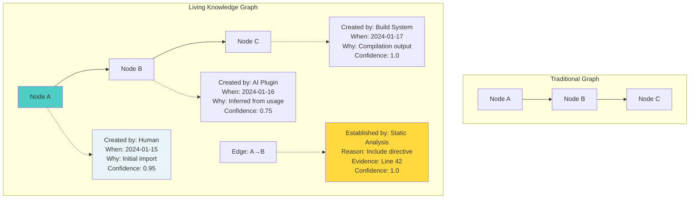
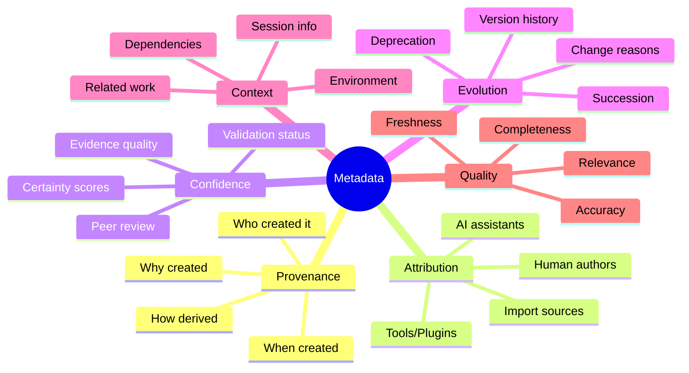
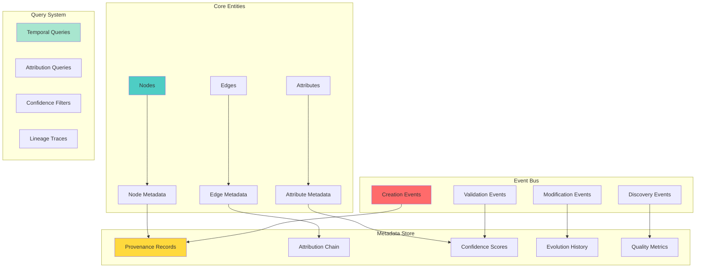
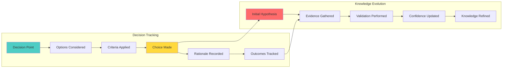

# 🎁 GitMind-Native Metadata Layer: Gameplan

> _"Turn git-mind into a living epistemology engine, not just a tool."_

## Executive Summary

Build a comprehensive metadata layer that transforms git-mind from a static graph into a living knowledge system that tracks the origin, evolution, and reliability of every piece of information. Make the invisible visible by capturing the "why" and "how" behind every node and edge.

## 🎯 Domain Overview

### The Epistemology Vision



### Metadata Categories



## 🏗️ Architecture Design

### Metadata Layer Architecture



## 📋 Core Features Required

### 1. Comprehensive Provenance Tracking

```c
// core/include/gitmind/metadata.h

// Provenance: The complete origin story
typedef struct gm_provenance {
    // Who
    gm_attribution_t attribution;
    
    // When
    gm_timestamp_t created_at;
    gm_timestamp_t modified_at;
    
    // Why
    gm_reason_t reason;
    gm_intent_t intent;
    
    // How
    gm_derivation_t derivation;
    gm_evidence_t *evidence;
    size_t evidence_count;
    
    // Where
    gm_context_t creation_context;
    gm_session_id_t session_id;
    
    // Confidence
    gm_confidence_t confidence;
    gm_validation_status_t validation;
} gm_provenance_t;

// Attribution: Who/what created this
typedef struct gm_attribution {
    gm_attribution_type_t type;
    
    union {
        struct {
            gm_author_t author;
            gm_tool_t tool;  // Editor, IDE, etc.
        } human;
        
        struct {
            gm_ai_model_t model;
            gm_string_t prompt_context;
            gm_confidence_t confidence;
        } ai;
        
        struct {
            gm_plugin_id_t plugin;
            gm_version_t version;
            gm_string_t algorithm;
        } plugin;
        
        struct {
            gm_string_t source_system;
            gm_string_t import_tool;
            gm_timestamp_t import_time;
        } import;
    } source;
    
    // Chain of attributions (for derived work)
    struct gm_attribution *derived_from;
} gm_attribution_t;

// Reason: Why this exists
typedef struct gm_reason {
    gm_reason_type_t type;
    gm_string_t description;
    
    // Supporting context
    union {
        struct {
            gm_string_t requirement_id;
            gm_string_t user_story;
        } requirement;
        
        struct {
            gm_string_t bug_id;
            gm_string_t fix_description;
        } bugfix;
        
        struct {
            gm_string_t pattern_name;
            gm_confidence_t match_score;
        } inferred;
        
        struct {
            gm_string_t refactor_type;
            gm_string_t improvement;
        } refactoring;
    } details;
} gm_reason_t;

// Evidence: Proof of relationship
typedef struct gm_evidence {
    gm_evidence_type_t type;
    
    union {
        struct {
            gm_path_t file;
            uint32_t line;
            uint32_t column;
            gm_string_t snippet;
        } code_location;
        
        struct {
            gm_string_t pattern;
            gm_match_result_t *matches;
            size_t match_count;
        } pattern_match;
        
        struct {
            gm_test_result_t result;
            gm_string_t test_name;
        } test_evidence;
        
        struct {
            gm_string_t doc_path;
            gm_string_t section;
        } documentation;
    } data;
    
    gm_confidence_t strength;
} gm_evidence_t;
```

### 2. Event Bus and Temporal Tracking

```c
// Event system for metadata capture
typedef enum {
    GM_EVENT_NODE_CREATED,
    GM_EVENT_NODE_MODIFIED,
    GM_EVENT_NODE_DELETED,
    GM_EVENT_EDGE_ESTABLISHED,
    GM_EVENT_EDGE_MODIFIED,
    GM_EVENT_EDGE_REMOVED,
    GM_EVENT_ATTRIBUTE_ADDED,
    GM_EVENT_ATTRIBUTE_CHANGED,
    GM_EVENT_VALIDATION_PERFORMED,
    GM_EVENT_CONFIDENCE_UPDATED,
    GM_EVENT_PATTERN_DISCOVERED,
    GM_EVENT_DECISION_MADE
} gm_event_type_t;

// Rich event data
typedef struct gm_event {
    gm_event_id_t id;
    gm_event_type_t type;
    gm_timestamp_t timestamp;
    
    // What changed
    gm_entity_ref_t subject;
    gm_change_t change;
    
    // Who/what caused it
    gm_attribution_t attribution;
    
    // Why it happened
    gm_reason_t reason;
    
    // Additional context
    gm_metadata_t *metadata;
    size_t metadata_count;
    
    // Causality chain
    gm_event_id_t caused_by;
    gm_event_id_t *causes;
    size_t causes_count;
} gm_event_t;

// Event bus for real-time tracking
typedef struct gm_event_bus {
    // Subscribers
    struct {
        gm_event_handler_t handler;
        gm_event_filter_t filter;
        void *context;
    } *subscribers;
    size_t subscriber_count;
    
    // Event store
    gm_event_store_t *store;
    
    // Real-time processing
    gm_queue_t *event_queue;
    gm_thread_t processor_thread;
} gm_event_bus_t;

// Event operations
gm_result_t gm_event_emit(gm_event_t *event);
gm_result_t gm_event_subscribe(gm_event_handler_t handler,
                              gm_event_filter_t *filter);
gm_result_t gm_event_query(gm_event_query_t *query,
                          gm_event_list_t *results);

// Temporal queries
gm_result_t gm_metadata_at_time(gm_entity_ref_t entity,
                               gm_timestamp_t time,
                               gm_metadata_t **metadata);

gm_result_t gm_lineage_trace(gm_entity_ref_t entity,
                            gm_lineage_t **lineage);
```

### 3. Confidence and Quality Metrics

```c
// Confidence scoring system
typedef struct gm_confidence_score {
    double value;  // 0.0 to 1.0
    
    // Factors contributing to confidence
    struct {
        double source_reliability;    // Trust in source
        double evidence_strength;     // Quality of evidence  
        double consistency;          // Agreement with other data
        double recency;             // Age penalty
        double validation_score;    // External validation
    } factors;
    
    // Explanation
    gm_string_t explanation;
    
    // Supporting evidence
    gm_evidence_t **supporting;
    size_t supporting_count;
    
    gm_evidence_t **contradicting;
    size_t contradicting_count;
} gm_confidence_score_t;

// Quality metrics for entities
typedef struct gm_quality_metrics {
    // Completeness
    struct {
        double attribute_coverage;  // Required attrs present
        double relationship_coverage; // Expected edges exist
        double documentation_level; // How well documented
    } completeness;
    
    // Accuracy
    struct {
        double validation_score;    // Passed validations
        double consistency_score;   // Internal consistency
        double conflict_rate;      // Conflicting information
    } accuracy;
    
    // Freshness
    struct {
        gm_timestamp_t last_verified;
        gm_timestamp_t last_modified;
        double staleness_score;    // How outdated
        bool needs_review;
    } freshness;
    
    // Relevance
    struct {
        double usage_frequency;    // How often accessed
        double connection_strength; // Graph centrality
        double importance_score;   // Domain importance
    } relevance;
    
    // Overall
    double overall_quality;  // Weighted combination
    gm_quality_grade_t grade; // A, B, C, D, F
} gm_quality_metrics_t;

// Quality assessment
gm_result_t gm_quality_assess(gm_entity_ref_t entity,
                             gm_quality_metrics_t *metrics);

gm_result_t gm_quality_improve_suggestions(gm_entity_ref_t entity,
                                          gm_suggestion_list_t *suggestions);
```

### 4. Decision and Knowledge Tracking



```c
// Decision tracking
typedef struct gm_decision {
    gm_decision_id_t id;
    gm_string_t title;
    gm_string_t question;
    
    // Context
    gm_timestamp_t made_at;
    gm_author_t made_by;
    gm_context_t context;
    
    // Options considered
    struct {
        gm_string_t option;
        gm_string_t pros;
        gm_string_t cons;
        double score;
    } *options;
    size_t option_count;
    
    // Decision
    size_t chosen_option;
    gm_string_t rationale;
    
    // Criteria used
    gm_criteria_t *criteria;
    size_t criteria_count;
    
    // Outcomes
    struct {
        gm_timestamp_t measured_at;
        gm_string_t outcome;
        bool as_expected;
    } *outcomes;
    size_t outcome_count;
    
    // Related entities
    gm_entity_ref_t *affected_entities;
    size_t affected_count;
} gm_decision_t;

// Knowledge state tracking
typedef struct gm_knowledge_state {
    gm_knowledge_type_t type;
    
    union {
        struct {
            gm_string_t hypothesis;
            gm_confidence_t confidence;
            gm_evidence_t **supporting;
            gm_evidence_t **contradicting;
        } hypothesis;
        
        struct {
            gm_string_t fact;
            gm_validation_t validation;
            gm_source_t *sources;
        } verified_fact;
        
        struct {
            gm_string_t assumption;
            gm_string_t basis;
            bool needs_validation;
        } assumption;
        
        struct {
            gm_pattern_t pattern;
            gm_instance_t *instances;
            double prevalence;
        } pattern;
    } data;
    
    // Evolution history
    gm_knowledge_state_t *previous_state;
    gm_timestamp_t transitioned_at;
    gm_string_t transition_reason;
} gm_knowledge_state_t;
```

### 5. Metadata Query Language

```c
// Rich query language for metadata
typedef struct gm_metadata_query {
    // Temporal constraints
    struct {
        gm_timestamp_t after;
        gm_timestamp_t before;
        bool include_deleted;
    } time_range;
    
    // Attribution filters
    struct {
        gm_attribution_type_t types[8];
        size_t type_count;
        gm_author_t *authors;
        size_t author_count;
        gm_source_t *sources;
        size_t source_count;
    } attribution;
    
    // Confidence thresholds
    struct {
        double min_confidence;
        double max_confidence;
        bool include_unvalidated;
    } confidence;
    
    // Quality filters
    struct {
        gm_quality_grade_t min_grade;
        bool needs_review_only;
        double max_staleness_days;
    } quality;
    
    // Lineage options
    struct {
        bool include_ancestors;
        bool include_descendants;
        uint32_t max_depth;
    } lineage;
} gm_metadata_query_t;

// Query examples
gm_result_t gm_query_by_attribution(const char *author_email,
                                   gm_entity_list_t *results);

gm_result_t gm_query_recent_ai_contributions(gm_timespan_t timespan,
                                            gm_contribution_list_t *results);

gm_result_t gm_query_low_confidence_edges(double threshold,
                                         gm_edge_list_t *results);

gm_result_t gm_query_decision_outcomes(gm_decision_id_t decision,
                                      gm_outcome_report_t *report);

// Metadata aggregations
gm_result_t gm_stats_contribution_breakdown(gm_contribution_stats_t *stats);
gm_result_t gm_stats_quality_distribution(gm_quality_stats_t *stats);
gm_result_t gm_stats_knowledge_evolution(gm_evolution_stats_t *stats);
```

## 🛠️ Implementation Plan

### Phase 1: Core Metadata Types (Immediate)

1. Define provenance structures
2. Create attribution system
3. Build confidence scoring
4. Add basic event bus

### Phase 2: Event System (During Migration)

1. Instrument all operations
2. Create event store
3. Add temporal queries
4. Build lineage tracking

### Phase 3: Quality Metrics (Per Module)

1. Define quality criteria
2. Implement assessments
3. Add improvement suggestions
4. Create quality reports

### Phase 4: Advanced Features (Future)

1. Decision tracking system
2. Knowledge state machine
3. Metadata query language
4. Analytics dashboard

## 📊 Usage Examples

### Tracking Edge Creation

```c
// When creating an edge with full metadata
gm_result_t create_edge_with_metadata(gm_context_t *ctx,
                                     const char *from,
                                     const char *to,
                                     gm_edge_type_t type) {
    // Create edge
    gm_edge_t *edge;
    GM_TRY(gm_edge_create(ctx, from, to, type, &edge));
    
    // Create provenance
    gm_provenance_t prov = {
        .attribution = {
            .type = GM_ATTR_HUMAN,
            .source.human = {
                .author = gm_get_current_author(),
                .tool = {
                    .name = "git-mind CLI",
                    .version = GM_VERSION
                }
            }
        },
        .created_at = gm_timestamp_now(),
        .reason = {
            .type = GM_REASON_EXPLICIT,
            .description = "User manually established relationship"
        },
        .confidence = {
            .value = 1.0,  // Human created = high confidence
            .explanation = "Explicitly created by user"
        },
        .session_id = ctx->session_id
    };
    
    // Attach metadata
    GM_TRY(gm_metadata_attach(edge->id, &prov));
    
    // Emit event
    gm_event_t event = {
        .type = GM_EVENT_EDGE_ESTABLISHED,
        .timestamp = prov.created_at,
        .subject = {.type = GM_ENTITY_EDGE, .id = edge->id},
        .attribution = prov.attribution,
        .reason = prov.reason
    };
    
    return gm_event_emit(&event);
}
```

### Querying Knowledge History

```c
// Find all AI-suggested edges that were later validated
void find_validated_ai_edges(void) {
    gm_metadata_query_t query = {
        .attribution = {
            .types = {GM_ATTR_AI},
            .type_count = 1
        },
        .time_range = {
            .after = gm_timestamp_days_ago(30)
        }
    };
    
    gm_edge_list_t edges;
    gm_query_edges_by_metadata(&query, &edges);
    
    GM_FOR_EACH_EDGE(edge, &edges) {
        gm_provenance_t *prov;
        gm_metadata_get_provenance(edge->id, &prov);
        
        if (prov->validation.status == GM_VALIDATED) {
            printf("AI edge %s -> %s (confidence: %.2f) validated\n",
                   edge->from, edge->to, prov->confidence.value);
        }
    }
}
```

### Decision Tracking Example

```c
// Record architectural decision
void record_architecture_decision(void) {
    gm_decision_t decision = {
        .title = "Storage Backend Selection",
        .question = "Which storage backend should we use?",
        .made_at = gm_timestamp_now(),
        .made_by = gm_get_current_author(),
        
        .options = (struct option[]){
            {
                .option = "File-based (current)",
                .pros = "Simple, no dependencies, Git-friendly",
                .cons = "Performance limits, no queries",
                .score = 0.7
            },
            {
                .option = "SQLite",
                .pros = "Fast queries, ACID, embedded",
                .cons = "Not Git-friendly, migration needed",
                .score = 0.6
            },
            {
                .option = "RocksDB",
                .pros = "Very fast, embedded, key-value",
                .cons = "C++ dependency, complex",
                .score = 0.5
            }
        },
        .option_count = 3,
        
        .chosen_option = 0,  // File-based
        .rationale = "Simplicity and Git-friendliness outweigh "
                    "performance concerns for v1.0. Can migrate "
                    "later if needed.",
        
        .criteria = (gm_criteria_t[]){
            {.name = "Simplicity", .weight = 0.4},
            {.name = "Performance", .weight = 0.3},
            {.name = "Git Integration", .weight = 0.3}
        },
        .criteria_count = 3
    };
    
    gm_decision_record(&decision);
}
```

## 🧪 Testing Approach

### 1. Metadata Integrity Tests

```c
void test_metadata_persistence(void) {
    // Create entity with metadata
    gm_node_t *node;
    gm_node_create("test.c", GM_NODE_TYPE_FILE, &node);
    
    gm_provenance_t prov = create_test_provenance();
    GM_ASSERT_OK(gm_metadata_attach(node->id, &prov));
    
    // Reload and verify
    gm_node_t *loaded;
    GM_ASSERT_OK(gm_node_load(node->id, &loaded));
    
    gm_provenance_t *loaded_prov;
    GM_ASSERT_OK(gm_metadata_get_provenance(loaded->id, &loaded_prov));
    
    // Verify all fields preserved
    GM_ASSERT_STR_EQ(prov.attribution.source.human.author.name,
                     loaded_prov->attribution.source.human.author.name);
    GM_ASSERT_EQ(prov.confidence.value,
                 loaded_prov->confidence.value);
}
```

### 2. Event Bus Tests

```c
void test_event_causality_chain(void) {
    // Subscribe to events
    gm_event_list_t captured_events;
    gm_event_subscribe(capture_events_handler, NULL);
    
    // Trigger chain of events
    gm_node_create("a.c", GM_NODE_TYPE_FILE, NULL);  // Event 1
    gm_node_create("b.c", GM_NODE_TYPE_FILE, NULL);  // Event 2
    gm_edge_create("a.c", "b.c", GM_EDGE_TYPE_INCLUDES); // Event 3
    
    // Verify causality
    GM_ASSERT_EQ(3, captured_events.count);
    GM_ASSERT_EQ(captured_events.events[2].caused_by,
                 captured_events.events[1].id);
}
```

### 3. Quality Assessment Tests

```c
void test_quality_metrics(void) {
    // Create node with varying quality
    gm_node_t *node;
    gm_node_create("test.c", GM_NODE_TYPE_FILE, &node);
    
    // Add some attributes (improves completeness)
    gm_node_add_attribute(node, "size", "1024");
    gm_node_add_attribute(node, "language", "C");
    
    // Assess quality
    gm_quality_metrics_t metrics;
    GM_ASSERT_OK(gm_quality_assess(node->id, &metrics));
    
    // Verify scoring
    GM_ASSERT_TRUE(metrics.completeness.attribute_coverage > 0.5);
    GM_ASSERT_TRUE(metrics.freshness.staleness_score < 0.1);
    GM_ASSERT_EQ(GM_QUALITY_GRADE_B, metrics.grade);
}
```

## 📈 Success Metrics

1. __100% Attribution__: Every entity has provenance
2. __Event Coverage__: All operations emit events  
3. __Confidence Tracking__: All edges have confidence
4. __Quality Visibility__: Dashboard shows quality
5. __Decision Audit__: All major decisions recorded

## 🎓 Best Practices

### DO

- ✅ Always capture attribution
- ✅ Record decision rationale
- ✅ Track confidence scores
- ✅ Monitor quality metrics
- ✅ Preserve full history

### DON'T

- ❌ Skip metadata for performance
- ❌ Lose provenance in migrations
- ❌ Ignore low confidence data
- ❌ Delete historical metadata
- ❌ Trust without verification

## 🔗 Integration Points

### With All Systems

- Every operation records metadata
- All queries can filter by metadata
- Every entity has quality metrics
- All changes emit events

### With AI/Plugins

- AI confidence tracked
- Plugin attribution recorded
- Decision rationale captured
- Quality improvements suggested

### With Version Control

- Metadata stored in Git
- History preserved in commits
- Decisions tracked in repo
- Quality evolves over time

## 📚 References

- [Provenance in Databases](https://dl.acm.org/doi/10.1145/3339918) - Academic foundation
- [Event Sourcing](https://martinfowler.com/eaaDev/EventSourcing.html) - Pattern overview
- [Knowledge Graphs](https://www.ontotext.com/knowledgehub/fundamentals/what-is-a-knowledge-graph/) - Concepts
- [Data Lineage](https://www.talend.com/resources/what-is-data-lineage/) - Tracking origins

---

_"In the end, it's not just about what we know, but how we came to know it, why we trust it, and how it evolves."_
