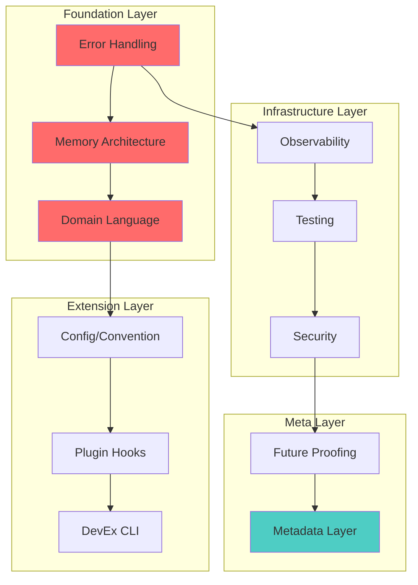

# 🗺️ GitMind Architecture Revolution: Gameplan Library

> _"We're not just fixing warnings. We're building a foundation for the next decade."_

## Overview

This directory contains comprehensive gameplans for baking foundational capabilities into git-mind during THE GREAT MIGRATION. Each gameplan represents a critical architectural pillar that will be woven into the fabric of our codebase as we transform 11,951 warnings into ZERO.

## 🎯 Core Principles

Before diving into specific capabilities, remember our baseline:

- __SRP__ - Single Responsibility Principle: Each function does ONE thing
- __DI__ - Dependency Injection: Testable, modular, flexible
- __Test Double Friendliness__ - Design for mockability from day one
- __KISS__ - Keep It Simple, Stupid
- __YAGNI__ - You Aren't Gonna Need It (until you do)
- __DRY__ - Don't Repeat Yourself

## 📚 Capability Gameplans

### 🚨 [1. Error Handling Revolution](./01-error-handling-revolution.md)

*Fail loudly, catch gracefully, propagate meaningfully_

- Standardized error types with context chains
- Result<T,E> patterns throughout
- Zero silent failures

### 🧠 [2. Memory Architecture Revolution](./02-memory-architecture-revolution.md)

*Know where every byte lives and dies_

- Arena allocators for ephemeral data
- Explicit ownership models
- Memory observability built-in

### 🔍 [3. Observability Built-In](./03-observability-built-in.md)

*Make the invisible visible_

- Structured logging with module tags
- Performance timing infrastructure
- Telemetry interfaces (privacy-first)

### 🧪 [4. Testing Infrastructure Uplift](./04-testing-infrastructure-uplift.md)

*Every module is a fortress_

- Unit + integration + black-box tests
- First-class test doubles
- Meaningful coverage over quantity

### ⚙️ [5. Config & Convention Overhaul](./05-config-convention-overhaul.md)

*Consistency wins. Predictability scales._

- Unified config format with validation
- No magical defaults
- Convention-based with explicit overrides

### 🔌 [6. Plugin + Extensibility Hooks](./06-plugin-extensibility-hooks.md)

*Architect for extensibility from the start_

- Hook system infrastructure
- Extension-safe APIs
- Lazy-loading architecture

### 🔒 [7. Security Hygiene as Code](./07-security-hygiene-as-code.md)

*Security isn't a feature, it's a foundation_

- Centralized input validation
- Safe memory patterns enforced
- Sandbox-aware design

### 🛠️ [8. DevEx: Internal CLI for Developer Tools](./08-devex-internal-cli.md)

*Developer experience is user experience_

- Built-in debugging commands
- One-liner profiling/benchmarking
- Inspection and introspection tools

### 📖 [9. Domain Language Purity](./09-domain-language-purity.md)

*Speak the language of your domain_

- Central domain types
- Semantic naming enforced
- No raw primitives in core APIs

### 🔮 [10. Future Proofing Without YAGNI Sin](./10-future-proofing-without-yagni.md)

*Prepare for change without overengineering_

- Abstraction boundaries that matter
- Format-agnostic interfaces
- Extensible without complexity

### 🎁 [BONUS: GitMind-Native Metadata Layer](./11-gitmind-metadata-layer.md)

*Turn git-mind into a living epistemology engine_

- Everything traces to its origin
- Internal event bus
- Knowledge graph of decisions

## 🗺️ Implementation Roadmap

## 🏗️ Integration Strategy

As we migrate each module during THE GREAT CRUSADE:

1. __Start with Foundation__ - Error handling, memory, and domain language
2. __Layer Infrastructure__ - Add observability and testing as we go
3. __Enable Extensions__ - Build in hooks and config points
4. __Think Meta__ - Track decisions and prepare for the future

## 📊 Progress Tracking

| Capability | Status | Modules Using | Notes |
|------------|--------|---------------|-------|
| Error Handling | 🟢 Gameplan Complete | - | Ready for implementation |
| Memory Architecture | 🟢 Gameplan Complete | - | Ready for implementation |
| Observability | 🟢 Gameplan Complete | - | Ready for implementation |
| Testing Infrastructure | 🟢 Partial Implementation | edge, cbor | Gameplan complete |
| Config & Convention | 🟢 Gameplan Complete | - | Ready for implementation |
| Plugin Hooks | 🟢 Gameplan Complete | - | Ready for implementation |
| Security Hygiene | 🟢 Partial Implementation | gm_mem.h | Gameplan complete |
| DevEx CLI | 🟢 Gameplan Complete | - | Ready for implementation |
| Domain Language | 🟢 Gameplan Complete | - | Ready for implementation |
| Future Proofing | 🟢 Gameplan Complete | - | Ready for implementation |
| Metadata Layer | 🟢 Gameplan Complete | - | Ready for implementation |

## 🎯 Success Criteria

Each capability is considered "baked in" when:

1. ✅ Core patterns established and documented
2. ✅ At least 3 modules using the capability
3. ✅ Tests demonstrate the capability
4. ✅ Performance impact measured and acceptable
5. ✅ Developer documentation complete

## 📖 Further Reading

- [ARCHITECTURE.md](ARCHITECTURE.md) - Master architecture index
- [MIGRATION_PHILOSOPHY.md](../../architecture/MIGRATION_PHILOSOPHY.md) - Why we're doing this
- [CLAUDE.md](../../../CLAUDE.md) - The battle plan

---

_"We shape our tools, and thereafter our tools shape us."_ - Marshall McLuhan

Let's build tools that shape us into better developers. 🚀
