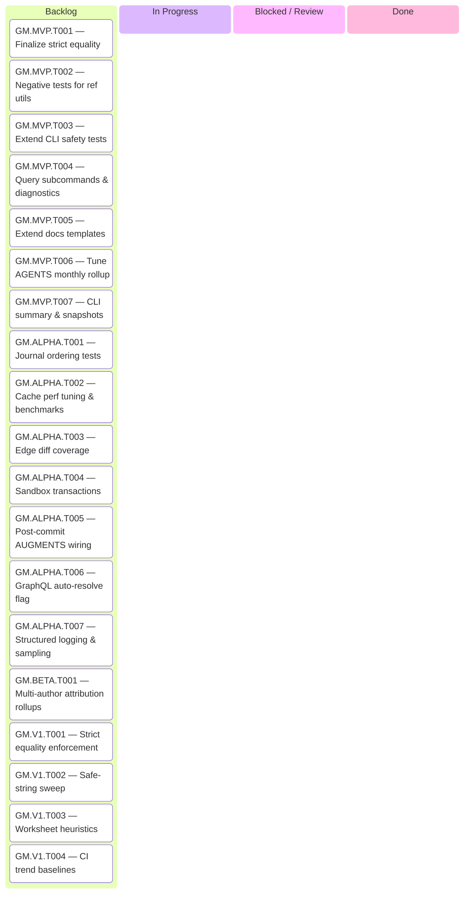

	---
title: Features Ledger
description: Canonical, grouped snapshot of features — shipped, in‑progress, and planned — including progress, tasks, tests, and remarks.
audience: [contributors]
domain: [planning]
tags: [features, progress]
status: draft
last_updated: 2025-09-16
---

# Features Ledger

This is the canonical, grouped snapshot of features — shipped, in‑progress, and planned — including progress, tasks, tests, and remarks. CLI/TUI and other feature tasks live here (not in AGENTS.md).

## Progress

Progress is milestone-weighted overall, milestone-specific by KLoC, and feature-weighted within each group. Update via the `hubless` toolkit (`python3 ../hubless/update_progress.py --root .`) or `make features-update` (requires `HUBLESS_REPO`/`HUBLESS_PATH` pointing to the hubless checkout) after edits.


Milestone completion derives from the features tagged to that milestone:

```
milestone_pct = (Σ(feature_pct × feature_weight)) / Σ(feature_weight)
feature_weight = feature_KLoC (or 0.1 when KLoC is unset)
```

Overall completion blends the gated milestone percentages. Each milestone inherits the minimum progress of its immediate predecessor (Alpha ≤ MVP, Beta ≤ Alpha, v1.0.0 ≤ Beta) before the overall weighting step:

```
overall_pct = (Σ(gated_milestone_pct × milestone_weight)) / Σ(milestone_weight)
milestone_weight = {MVP: 0.30, Alpha: 0.30, Beta: 0.20, v1.0.0: 0.20}
```

### Progress Bars

<!-- progress-overall:begin -->
```text
░░░░░░░░░░░░░░░░░░░░░░░░░░░░░░░░░░░░░░░░ 0%
MVP 0% | ALPHA 0% | BETA 0% | V1.0.0 0%
```
<!-- progress-overall:end -->

### MVP Progress

**What “MVP” means:** Core linking/journal flows usable end-to-end for maintainers and early adopters; docs and safety rails in place for guided experiments. See `docs/planning/Milestone_Synthesis.md#mvpmmdash-show-hn-ready`.

<!-- progress-mvp:begin -->
```text
░░░░░░░░░░░░░░░░░░░░░░░░░░░░░░░░░░░░░░░░ 0%
```
<!-- progress-mvp:end -->

> [!INFO]- **Outstanding Tasks**
> <!-- tasks-mvp:begin -->
> - [ ] Finalize strict equality
> - [ ] Negative tests for ref utils
> - [ ] Extend CLI safety tests
> - [ ] Query subcommands & diagnostics
> - [ ] Extend docs templates
> - [ ] Tune AGENTS monthly rollup
> - [ ] CLI summary & snapshots
> <!-- tasks-mvp:end -->

### Alpha Progress

**What “Alpha” means:** Broader team-ready; cache rebuilds reliable, augmented hooks online, telemetry/observability guardrails in place. See `docs/planning/Milestone_Synthesis.md#alpha-mdash-team-productivity`.

<!-- progress-alpha:begin -->
```text
░░░░░░░░░░░░░░░░░░░░░░░░░░░░░░░░░░░░░░░░ 0%
```
<!-- progress-alpha:end -->

> [!INFO]- **Outstanding Tasks**
> <!-- tasks-alpha:begin -->
> - [ ] Journal ordering tests
> - [ ] Cache perf tuning & benchmarks
> - [ ] Edge diff coverage
> - [ ] Sandbox transactions
> - [ ] Post-commit AUGMENTS wiring
> - [ ] GraphQL auto-resolve flag
> - [ ] Structured logging & sampling
> <!-- tasks-alpha:end -->

### Beta Progress

**What “Beta” means:** External contributors onboard smoothly; scaling telemetry captured; advanced review automation hardened. See `docs/planning/Milestone_Synthesis.md#beta-mdash-community-onboarding`.

<!-- progress-beta:begin -->
```text
░░░░░░░░░░░░░░░░░░░░░░░░░░░░░░░░░░░░░░░░ 0%
```
<!-- progress-beta:end -->

> [!INFO]- **Outstanding Tasks**
> <!-- tasks-beta:begin -->
> - [ ] Multi-author attribution rollups
> <!-- tasks-beta:end -->

### v1.0.0 Progress

**What “v1.0.0” means:** Production-grade stability with complete semantics, attribution, and CI observability; ready for wider release and partner integrations. See `docs/planning/Milestone_Synthesis.md#v100-mdash-production-grade`.

<!-- progress-v1:begin -->
```text
░░░░░░░░░░░░░░░░░░░░░░░░░░░░░░░░░░░░░░░░ 0%
```
<!-- progress-v1:end -->

> [!INFO]- **Outstanding Tasks**
> <!-- tasks-v1:begin -->
> - [ ] Strict equality enforcement
> - [ ] Safe-string sweep
> - [ ] Worksheet heuristics
> - [ ] CI trend baselines
> <!-- tasks-v1:end -->

## Status Model

- Planned → In Progress → MVP → Alpha → Beta → v1.0.0
- Stage names are canonical; “Shipped” is implied by milestone tags ≥ the current release.

## Feature Lifecycle & Workflow

Use the ledger as the single system of record from ideation through release:

1. **Capture (Planned)** — When a new idea lands (roadmap review, retro, support signal), add a row under the appropriate group with a short name, owning area, and initial KLoC estimate. Link to any discovery notes/spec drafts in the “Spec” column and file a task in the `## Tasklist

> [!NOTE]
> Keep this checklist in sync with the Kanban board below—move cards as soon as a task changes state.

### MVP

Minimum Viable Product

#### Core

<a id="gmmvpt001"></a>
- [ ] (GM.MVP.T001) Finalize strict equality
> [!INFO]- (0/4) ⣀⣀⣀⣀⣀⣀⣀⣀⣀⣀⣀⣀⣀⣀ — Step-by-step plan · 0%
> - [ ] Audit equality helpers in cache and journal to ensure OID-first comparisons never fall back when OIDs exist.
> - [ ] Add regression tests covering mixed OID/string paths across cache and journal utilities.
> - [ ] Update `docs/TECHNICAL.md` and any relevant ADRs to document strict equality behavior.
> - [ ] Sweep references to legacy SHA fallbacks in docs and CLI examples.
> [!NOTE]- Dependencies
> - (none)

```yaml
branch: feat/gm-mvp-t001-strict-equality
kanban:
    status: "Backlog"
```

<a id="gmmvpt002"></a>
- [ ] (GM.MVP.T002) Negative tests for ref utils
> [!INFO]- (0/4) ⣀⣀⣀⣀⣀⣀⣀⣀⣀⣀⣀⣀⣀⣀ — Step-by-step plan · 0%
> - [ ] Extend `test_ref_utils` to cover invalid prefixes, length overflows, and reserved refs.
> - [ ] Ensure errors propagate with meaningful `GM_ERR_*` codes.
> - [ ] Update `docs/architecture/Ref_Name_Validation.md` with new failure scenarios.
> - [ ] Mention failure scenarios in README/tutorial examples.
> [!NOTE]- Dependencies
> - **Hard:** [GM.MVP.T001](#gmmvpt001)

```yaml
branch: feat/gm-mvp-t002-negative-ref-utils
kanban:
    status: "Backlog"
```

#### CLI

<a id="gmmvpt003"></a>
- [ ] (GM.MVP.T003) Extend CLI safety tests
> [!INFO]- (0/4) ⣀⣀⣀⣀⣀⣀⣀⣀⣀⣀⣀⣀⣀⣀ — Step-by-step plan · 0%
> - [ ] Expand CLI safety guard tests to cover host override permutations.
> - [ ] Document the override matrix in `docs/operations/Environment_Variables.md`.
> - [ ] Highlight safe override usage in README/CLI help.
> - [ ] Verify behavior in Docker CI harness.
> [!NOTE]- Dependencies
> - (none)

```yaml
branch: feat/gm-mvp-t003-cli-safety-tests
kanban:
    status: "Backlog"
```

<a id="gmmvpt004"></a>
- [ ] (GM.MVP.T004) Query subcommands & diagnostics
> [!INFO]- (0/4) ⣀⣀⣀⣀⣀⣀⣀⣀⣀⣀⣀⣀⣀⣀ — Step-by-step plan · 0%
> - [ ] Design CLI syntax and update command help output for new query modes.
> - [ ] Implement parsing and output formatting for diagnostic flags.
> - [ ] Add unit/integration tests for diagnostic output.
> - [ ] Update tutorial examples with new query flows.
> [!NOTE]- Dependencies
> - **Hard:** [GM.MVP.T003](#gmmvpt003)

```yaml
branch: feat/gm-mvp-t004-query-diagnostics
kanban:
    status: "Backlog"
```

#### Docs

<a id="gmmvpt005"></a>
- [ ] (GM.MVP.T005) Extend docs templates
> [!INFO]- (0/4) ⣀⣀⣀⣀⣀⣀⣀⣀⣀⣀⣀⣀⣀⣀ — Step-by-step plan · 0%
> - [ ] Audit existing document templates for missing sections (status, TOC guidance, review notes).
> - [ ] Add missing sections and refresh template examples.
> - [ ] Update docs tooling lint to enforce new expectations.
> - [ ] Announce template changes in the contributor guide.
> [!NOTE]- Dependencies
> - (none)

```yaml
branch: feat/gm-mvp-t005-docs-templates
kanban:
    status: "Backlog"
```

<a id="gmmvpt006"></a>
- [ ] (GM.MVP.T006) Tune AGENTS monthly rollup
> [!INFO]- (0/4) ⣀⣀⣀⣀⣀⣀⣀⣀⣀⣀⣀⣀⣀⣀ — Step-by-step plan · 0%
> - [ ] Define the monthly rollup cadence for AGENTS summaries.
> - [ ] Provide a script or automation to generate rollups.
> - [ ] Update `AGENTS.md` with cadence instructions.
> - [ ] Verify the pre-commit hook enforces the new format.
> [!NOTE]- Dependencies
> - **Soft:** [GM.MVP.T005](#gmmvpt005)

```yaml
branch: feat/gm-mvp-t006-agents-rollup
kanban:
    status: "Backlog"
```

#### Observability

<a id="gmmvpt007"></a>
- [ ] (GM.MVP.T007) CLI summary & snapshots
> [!INFO]- (0/4) ⣀⣀⣀⣀⣀⣀⣀⣀⣀⣀⣀⣀⣀⣀ — Step-by-step plan · 0%
> - [ ] Implement CLI summary command reading ledger progress.
> - [ ] Automate a cron/workflow to publish weekly snapshots.
> - [ ] Document the snapshot cadence and expectations.
> - [ ] Add regression test verifying README/ledger sync.
> [!NOTE]- Dependencies
> - **Soft:** [GM.MVP.T005](#gmmvpt005)

```yaml
branch: feat/gm-mvp-t007-cli-summary-snapshots
kanban:
    status: "Backlog"
```

### Alpha

#### Core

<a id="gmalphat001"></a>
- [ ] (GM.ALPHA.T001) Journal ordering tests
> [!INFO]- (0/4) ⣀⣀⣀⣀⣀⣀⣀⣀⣀⣀⣀⣀⣀⣀ — Step-by-step plan · 0%
> - [ ] Write table-driven tests exercising journal iteration order across branches.
> - [ ] Cover both plain and attributed edges in CBOR fixtures.
> - [ ] Document ordering guarantees in journal reader docs.
> - [ ] Wire new tests into `meson.build` and CI.
> [!NOTE]- Dependencies
> - **Hard:** [GM.MVP.T001](#gmmvpt001)

```yaml
branch: feat/gm-alpha-t001-journal-ordering-tests
kanban:
    status: "Backlog"
```

<a id="gmalphat002"></a>
- [ ] (GM.ALPHA.T002) Cache perf tuning & benchmarks
> [!INFO]- (0/4) ⣀⣀⣀⣀⣀⣀⣀⣀⣀⣀⣀⣀⣀⣀ — Step-by-step plan · 0%
> - [ ] Capture baseline rebuild/query timings across representative repos.
> - [ ] Profile shard fan-out hotspots and prototype optimizations.
> - [ ] Automate a Docker-safe benchmark harness for regressions.
> - [ ] Document findings in `docs/architecture/bitmap-cache-design.md`.
> [!NOTE]- Dependencies
> - **Hard:** [GM.ALPHA.T001](#gmalphat001)

```yaml
branch: feat/gm-alpha-t002-cache-perf-benchmarks
kanban:
    status: "Backlog"
```

<a id="gmalphat003"></a>
- [ ] (GM.ALPHA.T003) Edge diff coverage
> [!INFO]- (0/4) ⣀⣀⣀⣀⣀⣀⣀⣀⣀⣀⣀⣀⣀⣀ — Step-by-step plan · 0%
> - [ ] Create fixture branches with divergent edge histories to stress diffs.
> - [ ] Add integration tests comparing fan-in/out across merge commits.
> - [ ] Ensure cache/journal diff helpers handle branch fan-out scenarios.
> - [ ] Document the harness in `docs/architecture/System_Architecture.md`.
> [!NOTE]- Dependencies
> - **Hard:** [GM.ALPHA.T002](#gmalphat002)

```yaml
branch: feat/gm-alpha-t003-edge-diff-coverage
kanban:
    status: "Backlog"
```

<a id="gmalphat004"></a>
- [ ] (GM.ALPHA.T004) Sandbox transactions
> [!INFO]- (0/4) ⣀⣀⣀⣀⣀⣀⣀⣀⣀⣀⣀⣀⣀⣀ — Step-by-step plan · 0%
> - [ ] Implement `gm_txn_start/apply/abort` helpers manipulating pending refs.
> - [ ] Build CLI plumbing (`git mind txn ...`) with dry-run/apply flows.
> - [ ] Add local/server hook snippets to enforce provenance.
> - [ ] Ship documentation updates (RFC, roadmap, tutorial snippet).
> [!NOTE]- Dependencies
> - **Hard:** [GM.ALPHA.T003](#gmalphat003)
> - **Hard:** [GM.MVP.T002](#gmmvpt002)

```yaml
branch: feat/gm-alpha-t004-sandbox-transactions
kanban:
    status: "Backlog"
```

#### CLI

<a id="gmalphat005"></a>
- [ ] (GM.ALPHA.T005) Post-commit AUGMENTS wiring
> [!INFO]- (0/4) ⣀⣀⣀⣀⣀⣀⣀⣀⣀⣀⣀⣀⣀⣀ — Step-by-step plan · 0%
> - [ ] Finish journal read integration and handle path truncation errors.
> - [ ] Add end-to-end test demonstrating AUGMENTS edges emitted via hooks.
> - [ ] Document error/fallback behavior in hook guides.
> - [ ] Verify containerized tests cover the new path.
> [!NOTE]- Dependencies
> - **Hard:** [GM.ALPHA.T004](#gmalphat004)

```yaml
branch: feat/gm-alpha-t005-post-commit-augments
kanban:
    status: "Backlog"
```

<a id="gmalphat006"></a>
- [ ] (GM.ALPHA.T006) GraphQL auto-resolve flag
> [!INFO]- (0/4) ⣀⣀⣀⣀⣀⣀⣀⣀⣀⣀⣀⣀⣀⣀ — Step-by-step plan · 0%
> - [ ] Introduce a feature flag controlling auto-resolve behavior.
> - [ ] Document validation workflow with screenshots in Review Seeding docs.
> - [ ] Outline GH App roadmap clarifying future automation.
> - [ ] Add regression tests around the new flag default.
> [!NOTE]- Dependencies
> - **Hard:** [GM.MVP.T004](#gmmvpt004)

```yaml
branch: feat/gm-alpha-t006-graphql-auto-resolve
kanban:
    status: "Backlog"
```

#### Observability

<a id="gmalphat007"></a>
- [ ] (GM.ALPHA.T007) Structured logging & sampling
> [!INFO]- (0/4) ⣀⣀⣀⣀⣀⣀⣀⣀⣀⣀⣀⣀⣀⣀ — Step-by-step plan · 0%
> - [ ] Design logging schema for CBOR debug tracing.
> - [ ] Implement sampling controls (environment/config toggles).
> - [ ] Update operations docs with usage examples.
> - [ ] Add tests ensuring logs redact sensitive content.
> [!NOTE]- Dependencies
> - **Hard:** [GM.ALPHA.T004](#gmalphat004)

```yaml
branch: feat/gm-alpha-t007-structured-logging
kanban:
    status: "Backlog"
```

### Beta

#### Core

<a id="gmbetat001"></a>
- [ ] (GM.BETA.T001) Multi-author attribution rollups
> [!INFO]- (0/4) ⣀⣀⣀⣀⣀⣀⣀⣀⣀⣀⣀⣀⣀⣀ — Step-by-step plan · 0%
> - [ ] Extend attribution data structure to track multiple authors and time windows.
> - [ ] Update cache/journal serialization to carry new metadata.
> - [ ] Add CLI flags to display attribution columns.
> - [ ] Document workflow and examples in attribution docs.
> [!NOTE]- Dependencies
> - **Hard:** [GM.ALPHA.T004](#gmalphat004)
> - **Soft:** [GM.MVP.T002](#gmmvpt002)

```yaml
branch: feat/gm-beta-t001-multi-author-attribution
kanban:
    status: "Backlog"
```

### v1.0.0

#### Core

<a id="gmv1t001"></a>
- [ ] (GM.V1.T001) Strict equality enforcement
> [!INFO]- (0/4) ⣀⣀⣀⣀⣀⣀⣀⣀⣀⣀⣀⣀⣀⣀ — Step-by-step plan · 0%
> - [ ] Harmonize equality helpers across cache/journal/util modules.
> - [ ] Add regression tests covering strict equality edges-to-cache interactions.
> - [ ] Document long-term guarantees in architecture docs.
> - [ ] Ensure release notes highlight the enforcement.
> [!NOTE]- Dependencies
> - **Hard:** [GM.ALPHA.T001](#gmalphat001)
> - **Hard:** [GM.MVP.T001](#gmmvpt001)

```yaml
branch: feat/gm-v1-t001-strict-equality-enforcement
kanban:
    status: "Backlog"
```

<a id="gmv1t002"></a>
- [ ] (GM.V1.T002) Safe-string sweep
> [!INFO]- (0/4) ⣀⣀⣀⣀⣀⣀⣀⣀⣀⣀⣀⣀⣀⣀ — Step-by-step plan · 0%
> - [ ] Grep for raw `strcpy`/`sprintf` usage outside approved wrappers.
> - [ ] Replace with `gm_snprintf`/`gm_strcpy_safe` equivalents.
> - [ ] Update safety documentation and examples.
> - [ ] Add unit coverage where new wrappers are introduced.
> [!NOTE]- Dependencies
> - **Hard:** [GM.MVP.T001](#gmmvpt001)

```yaml
branch: feat/gm-v1-t002-safe-string-sweep
kanban:
    status: "Backlog"
```

#### CLI

<a id="gmv1t003"></a>
- [ ] (GM.V1.T003) Worksheet heuristics
> [!INFO]- (0/4) ⣀⣀⣀⣀⣀⣀⣀⣀⣀⣀⣀⣀⣀⣀ — Step-by-step plan · 0%
> - [ ] Define heuristic rules (placeholder detection, decision coverage).
> - [ ] Implement optional flag enabling heuristics in gate tooling.
> - [ ] Document opt-in usage and backward compatibility.
> - [ ] Add tests covering heuristic outcomes.
> [!NOTE]- Dependencies
> - **Hard:** [GM.MVP.T005](#gmmvpt005)
> - **Soft:** [GM.MVP.T006](#gmmvpt006)

```yaml
branch: feat/gm-v1-t003-worksheet-heuristics
kanban:
    status: "Backlog"
```

#### Observability

<a id="gmv1t004"></a>
- [ ] (GM.V1.T004) CI trend baselines
> [!INFO]- (0/4) ⣀⣀⣀⣀⣀⣀⣀⣀⣀⣀⣀⣀⣀⣀ — Step-by-step plan · 0%
> - [ ] Instrument CI to capture tidy counts and unit failures.
> - [ ] Store trend data (JSON/CSV) for dashboards.
> - [ ] Render trend visualization in docs/dashboard.
> - [ ] Document maintenance workflow for trend data.
> [!NOTE]- Dependencies
> - **Hard:** [GM.ALPHA.T007](#gmalphat007)
> - **Soft:** [GM.MVP.T007](#gmmvpt007)

```yaml
branch: feat/gm-v1-t004-ci-trend-baselines
kanban:
    status: "Backlog"
```

## Completeness

| Task | Started? | Finished? | Tested? | Documented? | Shipped? |
|------|----------|-----------|---------|--------------|----------|
| [GM.MVP.T001](#gmmvpt001) | 🚫 | 🚫 | 🚫 | 🚫 | 🚫 |
| [GM.MVP.T002](#gmmvpt002) | 🚫 | 🚫 | 🚫 | 🚫 | 🚫 |
| [GM.MVP.T003](#gmmvpt003) | 🚫 | 🚫 | 🚫 | 🚫 | 🚫 |
| [GM.MVP.T004](#gmmvpt004) | 🚫 | 🚫 | 🚫 | 🚫 | 🚫 |
| [GM.MVP.T005](#gmmvpt005) | 🚫 | 🚫 | 🚫 | 🚫 | 🚫 |
| [GM.MVP.T006](#gmmvpt006) | 🚫 | 🚫 | 🚫 | 🚫 | 🚫 |
| [GM.MVP.T007](#gmmvpt007) | 🚫 | 🚫 | 🚫 | 🚫 | 🚫 |
| [GM.ALPHA.T001](#gmalphat001) | 🚫 | 🚫 | 🚫 | 🚫 | 🚫 |
| [GM.ALPHA.T002](#gmalphat002) | 🚫 | 🚫 | 🚫 | 🚫 | 🚫 |
| [GM.ALPHA.T003](#gmalphat003) | 🚫 | 🚫 | 🚫 | 🚫 | 🚫 |
| [GM.ALPHA.T004](#gmalphat004) | 🚫 | 🚫 | 🚫 | 🚫 | 🚫 |
| [GM.ALPHA.T005](#gmalphat005) | 🚫 | 🚫 | 🚫 | 🚫 | 🚫 |
| [GM.ALPHA.T006](#gmalphat006) | 🚫 | 🚫 | 🚫 | 🚫 | 🚫 |
| [GM.ALPHA.T007](#gmalphat007) | 🚫 | 🚫 | 🚫 | 🚫 | 🚫 |
| [GM.BETA.T001](#gmbetat001) | 🚫 | 🚫 | 🚫 | 🚫 | 🚫 |
| [GM.V1.T001](#gmv1t001) | 🚫 | 🚫 | 🚫 | 🚫 | 🚫 |
| [GM.V1.T002](#gmv1t002) | 🚫 | 🚫 | 🚫 | 🚫 | 🚫 |
| [GM.V1.T003](#gmv1t003) | 🚫 | 🚫 | 🚫 | 🚫 | 🚫 |
| [GM.V1.T004](#gmv1t004) | 🚫 | 🚫 | 🚫 | 🚫 | 🚫 |

## Kanban Board



## Legacy Backlog (Possibly Won't Do)

### Milestone 1 — Web UI

- [ ] (GH-95) Implement basic CRUD operations from web UI
  > [!NOTE] [Possibly Won't Do] Part of the Web UI implementation (Milestone 1). — see [#95](https://github.com/neuroglyph/git-mind/issues/95) for full context.

### Milestone 2 — MCP Integration

- [ ] (GH-96) Implement MCP tools: link, traverse, recall, remember
  > [!NOTE] [Possibly Won't Do] Part of MCP Integration (Milestone 2). — see [#96](https://github.com/neuroglyph/git-mind/issues/96) for full context.

- [ ] (GH-97) Implement real-time edge creation from AI
  > [!NOTE] [Possibly Won't Do] Part of MCP Integration (Milestone 2). — see [#97](https://github.com/neuroglyph/git-mind/issues/97) for full context.

- [ ] (GH-98) Implement human-AI collaboration features
  > [!NOTE] [Possibly Won't Do] Part of MCP Integration (Milestone 2). — see [#98](https://github.com/neuroglyph/git-mind/issues/98) for full context.

### Milestone 3 — Core Features

- [ ] (GH-99) Integrate all CLI features into web UI
  > [!NOTE] [Possibly Won't Do] Part of Core Features Completion (Milestone 3). — see [#99](https://github.com/neuroglyph/git-mind/issues/99) for full context.

- [ ] (GH-100) Implement time-travel visualizations
  > [!NOTE] [Possibly Won't Do] Part of Core Features Completion (Milestone 3). — see [#100](https://github.com/neuroglyph/git-mind/issues/100) for full context.

### Milestone 4 — Polish & Ship

- [ ] (GH-101) Web UI performance optimization
  > [!NOTE] [Possibly Won't Do] Part of Polish & Ship (Milestone 4). — see [#101](https://github.com/neuroglyph/git-mind/issues/101) for full context.

- [ ] (GH-102) Create screen recording for HN post
  > [!NOTE] [Possibly Won't Do] Part of Polish & Ship (Milestone 4). — see [#102](https://github.com/neuroglyph/git-mind/issues/102) for full context.

### Refactor / Foundations

- [ ] (GH-23) Reduce Cyclomatic Complexity - 125 functions with CCN > 10
  > [!NOTE] [Possibly Won't Do] We have 125 functions with Cyclomatic Complexity Number (CCN) > 10, indicating overly complex code that's hard to test and maintain. — see [#23](https://github.com/neuroglyph/git-mind/issues/23) for full context.

- [ ] (GH-25) Fix Single Responsibility Principle Violations
  > [!NOTE] [Possibly Won't Do] Systematic SRP violations throughout codebase where functions try to do multiple unrelated things. — see [#25](https://github.com/neuroglyph/git-mind/issues/25) for full context.

- [ ] (GH-27) Check and fix nesting levels - max 3 levels deep
  > [!NOTE] [Possibly Won't Do] Functions should have maximum 3 levels of nesting for readability. — see [#27](https://github.com/neuroglyph/git-mind/issues/27) for full context.

- [ ] (GH-44) Achieve project quality score ≥ 8/10
  > [!NOTE] [Possibly Won't Do] Achieve and maintain high code quality score across all metrics. — see [#44](https://github.com/neuroglyph/git-mind/issues/44) for full context.

- [ ] (GH-52) Implement Express server with WebSocket support
  > [!NOTE] [Possibly Won't Do] Set up the Express.js server infrastructure with WebSocket support for real-time updates to the graph visualization. — see [#52](https://github.com/neuroglyph/git-mind/issues/52) for full context.

- [ ] (GH-53) Refactor cache_rebuild_internal() - 154 lines to <15 each
  > [!NOTE] [Possibly Won't Do] Break down the massive "cache_rebuild_internal()" function into smaller, focused functions that each have a single responsibility. — see [#53](https://github.com/neuroglyph/git-mind/issues/53) for full context.

- [ ] (GH-54) Refactor journal_append_generic() - Mixed responsibilities
  > [!NOTE] [Possibly Won't Do] Split "journal_append_generic()" which currently handles buffer management, encoding, batching decisions, and commit creation. — see [#54](https://github.com/neuroglyph/git-mind/issues/54) for full context.

- [ ] (GH-56) Refactor process_commit_generic() - Extract/decode/route/iterate
  > [!NOTE] [Possibly Won't Do] Break down "process_commit_generic()" which currently handles extracting CBOR, decoding edges, routing callbacks, and iteration. — see [#56](https://github.com/neuroglyph/git-mind/issues/56) for full context.

- [ ] (GH-58) Refactor safety_check() - Path/config/display/enforcement mixed
  > [!NOTE] [Possibly Won't Do] The "safety_check()" function in main.c combines path validation, git config checking, error display, and policy enforcement. — see [#58](https://github.com/neuroglyph/git-mind/issues/58) for full context.

- [ ] (GH-59) Refactor write_bitmaps_to_temp() - Duplicate logic for two maps
  > [!NOTE] [Possibly Won't Do] The "write_bitmaps_to_temp()" function processes forward and reverse maps with nearly identical logic duplicated. — see [#59](https://github.com/neuroglyph/git-mind/issues/59) for full context.

- [ ] (GH-81) Create demo repository with rich history
  > [!NOTE] [Possibly Won't Do] Create a compelling demo repository that showcases git-mind's capabilities with a realistic project history and interesting edge relationships. — see [#81](https://github.com/neuroglyph/git-mind/issues/81) for full context.

- [ ] (GH-82) Implement git-mind evolution command with animation
  > [!NOTE] [Possibly Won't Do] Create a command that shows the evolution of code relationships over time with animated visualization in the web UI. — see [#82](https://github.com/neuroglyph/git-mind/issues/82) for full context.

- [ ] (GH-106) Refactor cache_rebuild_internal() - Split 67-line monster
  > [!NOTE] [Possibly Won't Do] Part of SRP Refactoring (Priority 1: Core Infrastructure). — see [#106](https://github.com/neuroglyph/git-mind/issues/106) for full context.

- [ ] (GH-107) Refactor journal_append_generic() - Separate concerns
  > [!NOTE] [Possibly Won't Do] Part of SRP Refactoring (Priority 1: Core Infrastructure). — see [#107](https://github.com/neuroglyph/git-mind/issues/107) for full context.

- [ ] (GH-108) Refactor process_commit_generic() - Split responsibilities
  > [!NOTE] [Possibly Won't Do] Part of SRP Refactoring (Priority 1: Core Infrastructure). — see [#108](https://github.com/neuroglyph/git-mind/issues/108) for full context.

- [ ] (GH-109) Refactor safety_check() - Separate validation from enforcement
  > [!NOTE] [Possibly Won't Do] Part of SRP Refactoring (Priority 2: CLI Layer). — see [#109](https://github.com/neuroglyph/git-mind/issues/109) for full context.

- [ ] (GH-110) Refactor execute_cache_rebuild() - Separate timing from execution
  > [!NOTE] [Possibly Won't Do] Part of SRP Refactoring (Priority 2: CLI Layer). — see [#110](https://github.com/neuroglyph/git-mind/issues/110) for full context.

- [ ] (GH-111) Refactor write_bitmaps_to_temp() - Eliminate duplicate logic
  > [!NOTE] [Possibly Won't Do] Part of SRP Refactoring (Priority 3: Data Processing). — see [#111](https://github.com/neuroglyph/git-mind/issues/111) for full context.

- [ ] (GH-112) Refactor cache_query_generic() - Separate strategies
  > [!NOTE] [Possibly Won't Do] Part of SRP Refactoring (Priority 3: Data Processing). — see [#112](https://github.com/neuroglyph/git-mind/issues/112) for full context.

- [ ] (GH-113) Refactor gm_edge_create() - Separate initialization steps
  > [!NOTE] [Possibly Won't Do] Part of SRP Refactoring (Priority 4: Edge Operations). — see [#113](https://github.com/neuroglyph/git-mind/issues/113) for full context.

- [ ] (GH-114) Refactor validate_link_inputs() - Split validation concerns
  > [!NOTE] [Possibly Won't Do] Part of SRP Refactoring (Priority 4: Edge Operations). — see [#114](https://github.com/neuroglyph/git-mind/issues/114) for full context.

- [ ] (GH-115) SRP Refactoring Implementation Strategy & Tracking
  > [!NOTE] [Possibly Won't Do] Parent tracking issue for the SRP refactoring effort across core infrastructure, CLI, data processing, and edge operations. — see [#115](https://github.com/neuroglyph/git-mind/issues/115) for full context.

- [ ] (GH-116) RFC: Modular Architecture Restructure
  > [!NOTE] [Possibly Won't Do] We're planning a major restructure to address large-scale modularization and code quality improvements. — see [#116](https://github.com/neuroglyph/git-mind/issues/116) for full context.

### Future / Unscoped

- [ ] (GH-22) Refactor cache_rebuild_internal() - SRP violation (CCN 67)
  > [!NOTE] [Possibly Won't Do] Break down cache_rebuild_internal() to resolve a 67 CCN hot spot. — see [#22](https://github.com/neuroglyph/git-mind/issues/22) for full context.

- [ ] (GH-24) Complete Dependency Injection Implementation
  > [!NOTE] [Possibly Won't Do] Finish dependency injection work across the cache module and supporting components. — see [#24](https://github.com/neuroglyph/git-mind/issues/24) for full context.

- [ ] (GH-26) Complete cache module dependency injection
  > [!NOTE] [Possibly Won't Do] Finish extracting hard-coded dependencies from the cache module. — see [#26](https://github.com/neuroglyph/git-mind/issues/26) for full context.

- [ ] (GH-28) Organize tests by user story/feature
  > [!NOTE] [Possibly Won't Do] Reorganize tests around user stories to make coverage easier to understand. — see [#28](https://github.com/neuroglyph/git-mind/issues/28) for full context.

- [ ] (GH-29) Implement 'git mind explore' web UI command
  > [!NOTE] [Possibly Won't Do] Add a CLI command to launch the web UI explorer. — see [#29](https://github.com/neuroglyph/git-mind/issues/29) for full context.

- [ ] (GH-30) Implement MCP (Model Context Protocol) server
  > [!NOTE] [Possibly Won't Do] Stand up an MCP server to integrate AI tools directly. — see [#30](https://github.com/neuroglyph/git-mind/issues/30) for full context.

- [ ] (GH-31) Implement 'git-mind traverse' command
  > [!NOTE] [Possibly Won't Do] Build a CLI traversal command for exploring the graph programmatically. — see [#31](https://github.com/neuroglyph/git-mind/issues/31) for full context.

- [ ] (GH-32) Implement 'git-mind evolution' command with animation
  > [!NOTE] [Possibly Won't Do] Add an evolution command that animates how the knowledge graph changes over time. — see [#32](https://github.com/neuroglyph/git-mind/issues/32) for full context.

- [ ] (GH-37) Performance optimization and benchmarking
  > [!NOTE] [Possibly Won't Do] Establish a performance benchmarking regimen and optimize bottlenecks. — see [#37](https://github.com/neuroglyph/git-mind/issues/37) for full context.

- [ ] (GH-38) Create one-line installer script
  > [!NOTE] [Possibly Won't Do] Ship a universal installer script to simplify onboarding. — see [#38](https://github.com/neuroglyph/git-mind/issues/38) for full context.

- [ ] (GH-39) Implement 'git-mind status' command
  > [!NOTE] [Possibly Won't Do] Provide a status command to summarize graph health and activity. — see [#39](https://github.com/neuroglyph/git-mind/issues/39) for full context.

- [ ] (GH-40) Implement 'git-mind unlink' command
  > [!NOTE] [Possibly Won't Do] Add a command to remove relationships safely. — see [#40](https://github.com/neuroglyph/git-mind/issues/40) for full context.

- [ ] (GH-45) Create comprehensive user guides and tutorials
  > [!NOTE] [Possibly Won't Do] Develop end-to-end user education material. — see [#45](https://github.com/neuroglyph/git-mind/issues/45) for full context.

- [ ] (GH-46) Create operations and deployment documentation
  > [!NOTE] [Possibly Won't Do] Document how to operate git-mind in various environments. — see [#46](https://github.com/neuroglyph/git-mind/issues/46) for full context.

- [ ] (GH-47) Create example scripts and integration templates
  > [!NOTE] [Possibly Won't Do] Provide sample scripts for integrating git-mind with external tools. — see [#47](https://github.com/neuroglyph/git-mind/issues/47) for full context.

- [ ] (GH-48) Complete API reference documentation
  > [!NOTE] [Possibly Won't Do] Finish the comprehensive API reference. — see [#48](https://github.com/neuroglyph/git-mind/issues/48) for full context.

- [ ] (GH-49) Implement git-mind gc - journal compression
  > [!NOTE] [Possibly Won't Do] Add garbage collection to keep journal storage manageable. — see [#49](https://github.com/neuroglyph/git-mind/issues/49) for full context.

- [ ] (GH-50) Improve git hooks installer with better UI and safety
  > [!NOTE] [Possibly Won't Do] Polish the hook installer UX and safety rails. — see [#50](https://github.com/neuroglyph/git-mind/issues/50) for full context.

- [ ] (GH-51) Create 'git mind explore' command to launch web UI
  > [!NOTE] [Possibly Won't Do] Provide a CLI entry point for the web experience. — see [#51](https://github.com/neuroglyph/git-mind/issues/51) for full context.

- [ ] (GH-55) Implement Three.js 3D force-directed graph visualization
  > [!NOTE] [Possibly Won't Do] Build a 3D visualization of the graph using Three.js. — see [#55](https://github.com/neuroglyph/git-mind/issues/55) for full context.

- [ ] (GH-57) Implement time slider with smooth transitions
  > [!NOTE] [Possibly Won't Do] Add a temporal slider with smooth transitions for exploring history. — see [#57](https://github.com/neuroglyph/git-mind/issues/57) for full context.

- [ ] (GH-60) Implement MCP (Model Context Protocol) server
  > [!NOTE] [Possibly Won't Do] Provide back-end MCP server support. — see [#60](https://github.com/neuroglyph/git-mind/issues/60) for full context.

- [ ] (GH-61) Create user-facing attribution documentation
  > [!NOTE] [Possibly Won't Do] Document attribution workflows for end users. — see [#61](https://github.com/neuroglyph/git-mind/issues/61) for full context.

- [ ] (GH-62) Create developer documentation for attribution system
  > [!NOTE] [Possibly Won't Do] Create developer documentation for the attribution system, including API references and integration guides. — see [#62](https://github.com/neuroglyph/git-mind/issues/62) for full context.

- [ ] (GH-63) Create attribution examples and scripts
  > [!NOTE] [Possibly Won't Do] Provide practical examples and scripts demonstrating attribution system usage for common workflows. — see [#63](https://github.com/neuroglyph/git-mind/issues/63) for full context.

- [ ] (GH-64) Reorganize documentation structure
  > [!NOTE] [Possibly Won't Do] Reorganize the documentation to have a clear, intuitive structure that separates user guides, references, architecture docs, and development guides. — see [#64](https://github.com/neuroglyph/git-mind/issues/64) for full context.

- [ ] (GH-65) Document all environment variables
  > [!NOTE] [Possibly Won't Do] Create comprehensive documentation for all environment variables used by git-mind, especially the attribution variables. — see [#65](https://github.com/neuroglyph/git-mind/issues/65) for full context.

- [ ] (GH-66) Test on macOS, Linux, and Windows (WSL)
  > [!NOTE] [Possibly Won't Do] Ensure git-mind works correctly across all major platforms before release. — see [#66](https://github.com/neuroglyph/git-mind/issues/66) for full context.

- [ ] (GH-67) Create installation and distribution documentation
  > [!NOTE] [Possibly Won't Do] Document the installation process for all platforms and create distribution guidelines. — see [#67](https://github.com/neuroglyph/git-mind/issues/67) for full context.

- [ ] (GH-68) Create operational documentation suite
  > [!NOTE] [Possibly Won't Do] Create comprehensive operational documentation for running and maintaining git-mind in production environments. — see [#68](https://github.com/neuroglyph/git-mind/issues/68) for full context.

- [ ] (GH-69) Create security documentation
  > [!NOTE] [Possibly Won't Do] Document security considerations and best practices for git-mind usage, especially around attribution and code execution. — see [#69](https://github.com/neuroglyph/git-mind/issues/69) for full context.

- [ ] (GH-70) Document advanced features (lanes, filters, batch ops)
  > [!NOTE] [Possibly Won't Do] Create comprehensive guides for advanced git-mind features that power users need. — see [#70](https://github.com/neuroglyph/git-mind/issues/70) for full context.

- [ ] (GH-71) Implement git-mind traverse command
  > [!NOTE] [Possibly Won't Do] Implement the "git-mind traverse" command for navigating the knowledge graph from a starting point. — see [#71](https://github.com/neuroglyph/git-mind/issues/71) for full context.

- [ ] (GH-72) Create AI memory repository system
  > [!NOTE] [Possibly Won't Do] Implement a system for AI assistants to maintain persistent memory across sessions using dedicated git repositories. — see [#72](https://github.com/neuroglyph/git-mind/issues/72) for full context.

- [ ] (GH-73) Create Claude panel in web UI
  > [!NOTE] [Possibly Won't Do] Add an integrated Claude assistant panel to the web UI for real-time collaboration on code understanding. — see [#73](https://github.com/neuroglyph/git-mind/issues/73) for full context.

- [ ] (GH-74) Implement git-mind status command
  > [!NOTE] [Possibly Won't Do] Create a "git-mind status" command that shows the current state of the knowledge graph and recent activity. — see [#74](https://github.com/neuroglyph/git-mind/issues/74) for full context.

- [ ] (GH-75) Implement git-mind unlink command
  > [!NOTE] [Possibly Won't Do] Add ability to remove edges by creating tombstone edges that mark relationships as deleted. — see [#75](https://github.com/neuroglyph/git-mind/issues/75) for full context.

- [ ] (GH-76) Implement git-mind gc (garbage collection)
  > [!NOTE] [Possibly Won't Do] Create a garbage collection command to compress old journal commits for better performance in large repositories. — see [#76](https://github.com/neuroglyph/git-mind/issues/76) for full context.

- [ ] (GH-77) Create man pages for all commands
  > [!NOTE] [Possibly Won't Do] Create comprehensive man pages for git-mind and all subcommands following Unix manual conventions. — see [#77](https://github.com/neuroglyph/git-mind/issues/77) for full context.

- [ ] (GH-78) Implement real-time WebSocket updates
  > [!NOTE] [Possibly Won't Do] Add WebSocket support to push real-time updates to the web UI when edges are created or modified. — see [#78](https://github.com/neuroglyph/git-mind/issues/78) for full context.

- [ ] (GH-79) Create one-line installer script
  > [!NOTE] [Possibly Won't Do] Create a simple one-line installer that automatically detects the platform and installs git-mind with all dependencies. — see [#79](https://github.com/neuroglyph/git-mind/issues/79) for full context.

- [ ] (GH-80) Create v0.2.0 release with changelog
  > [!NOTE] [Possibly Won't Do] Prepare and create the v0.2.0 release including comprehensive changelog, release notes, and binary artifacts. — see [#80](https://github.com/neuroglyph/git-mind/issues/80) for full context.

- [ ] (GH-83) Error message overhaul for better UX
  > [!NOTE] [Possibly Won't Do] Improve all error messages to be more helpful, actionable, and user-friendly. — see [#83](https://github.com/neuroglyph/git-mind/issues/83) for full context.
