# Graph-Lvl-Up-Tank.md
---
title: Graph LvL-Up Tank 🛡️🧠
description: Crash-course to power-level new contributors into graph-native thinking for git-mind.
audience: [contributors]
domain: [learning]
tags: [graphs, onboarding, best-practices]
status: draft
last_updated: 2025-09-16
---

# Graph LvL-Up Tank 🛡️🧠

Welcome to the tank queue. Strap in; by the time you exit, you should be dangerous enough to model git-mind semantics without summoning undefined behavior—or a disappointed reviewer.

## 0. Mindset Buffs (Pre-pull Ritual)
- **Everything is an edge first, artifact second.** Start by naming the relationship (`implements`, `touches`, `reflects`), then pick endpoints. If you can’t articulate the edge, you’re not ready to store the nodes.
- **Paths are narratives.** A commit-to-retro chain is a story. Store the raw events, then decide which shortcuts (journey nodes, convenience edges) the UX needs.
- **Filters > Firehoses.** Plan for edge-type and node-type filters in every traversal. Hidden subgraphs are the secret sauce; surface them deliberately.
- **Rebuild is cheap, provenance isn’t.** Derived edges are disposable. Canonical edges (journal entries) must be traceable and time-travel safe.

## 1. Core Knowledge Slots (Allocate 5 Skill Points)
1. **Graph Math Basics**
   - Directed acyclic vs. cyclic; strongly connected components.
   - Path length (degree/separation) and why we cap N in CLI output.
2. **Query Languages**
   - Cypher pattern: `MATCH (a:Issue)-[:RESOLVED_IN]->(f:File)` → mental template for git-mind queries.
   - Gremlin grok: `g.V().hasLabel('file').out('implements')` — stream mindset for CLI pipelines.
3. **Indexing**
   - Node key indexes (file path + OID), composite indexes for `(:Edge {type, lane})`.
   - Materialized projections (journey nodes, globs) to accelerate user-facing flows.
4. **Temporal Semantics**
   - Effective-from / effective-to windows, commit ULIDs, cache snapshots.
   - How time-aware queries keep “what was true at C2?” deterministic.
5. **Conflict Handling**
   - Merge strategies: union vs. CRDT for advice edges, last-writer-wins metadata.
   - Review worksheets as capture devices, not just documentation.

## 2. git-mind Native Patterns
- **Journey Nodes (a.k.a. path bundles)**
  - Use when the same path is replayed often (Issue → PR → Review → Merge → Retro).
  - Store ordered edge IDs + timestamps; connect journey ⇄ participants for hop-1 access.
- **Convenience Edges**
  - Materialize on workflows closing: `issue --touched--> file`, `retro --reflects--> file`.
  - Regenerate on cache rebuild; mark `derived=true` for hygiene.
- **Edge Taxonomy**
  - `primary`: canonical journal entry (AUGMENTS edge).
  - `secondary`: manual curation (`implements`, `verified_by`).
  - `advisory`: AI suggestions, dashed edges in the SVG; require verification state.
- **OID-first Everything**
  - Node keys: `(type, repo_id, oid)`.
  - Edge keys: `(src_oid, dst_oid, type, ulid)` to guarantee time-travel diffing.

## 3. Query Recipes (Tank Macros)
| What you want | Pattern | Notes |
| --- | --- | --- |
| “All artifacts tied to this file” | `MATCH (f:File {oid:$oid})-[:TOUCHES|:REFLECTS|:JOURNEY_HAS*1..2]->(x) RETURN x` | Include journey bundles for 1-hop hits. |
| “Which commits closed issue #42?” | `MATCH (i:Issue {number:42})-[:RESOLVED_IN]->(j:Journey)-[:MERGED_IN]->(c:Commit) RETURN c` | Journey keeps metadata; fallback to merge edges. |
| “Retro notes within 2 hops of auth.c” | `MATCH (f:File {path:'core/src/auth.c'})-[:REFLECTS\|:JOURNEY_HAS*1..2]->(r:Retro) RETURN DISTINCT r` | Filters keep CLI output sane. |
| “What changed between C2 and C5?” | Use timeline diff: `gm timeline diff --from C2 --to C5 --edge-types implements,verified_by` | Rely on cache deltas; avoid brute-force BFS. |

## 4. Modeling Checklist (Before You Commit Your Thoughts)
- [ ] Edge types named verb-first (`implements`, `reflects`, `verified_by`).
- [ ] Node labels single-responsibility (no `DocOrIssue` mashups).
- [ ] Every derived edge cites its source journal ULID.
- [ ] Path bundle recorded if more than three steps are replayed in UX.
- [ ] Filters documented: which queries surface this edge? Which layers hide it?

## 5. Toolchain & Playground
- **Local Sandbox**: Use `cypher-shell` or `memgraph` for synthetic modeling before touching git refs.
- **Visualization**: Keep the animated SVG (assets/images/git-mind-dag.svg) as the mental map; update it when semantics evolve.
- **Performance Drills**: `EXPLAIN` queries (even conceptually) to spot where indexes matter. If a traversal requires >3 hops routinely, consider a projection.
- **Docs Backfill**: Update `docs/architecture/*` whenever you invent a new edge type or path strategy; ledger tasks depend on that clarity.

## 6. Level-Up Quests (XP Farming)
1. Run `git mind list --from core/src/auth.c --with-attribution` and sketch the path you *expected* vs. what exists. Gap? Add edges or journeys.
2. Model Issue → Review → Merge as a journey node in a scratch graph; verify you can reach every participant in ≤2 hops.
3. Draft a Cypher query that respects time-travel (`WHERE c.ulid BETWEEN $from AND $to`). Translate it into git-mind CLI verbs.
4. Teach someone else the difference between canonical vs. derived edges. If you can’t explain it in one whiteboard, repeat this tank session.

## 7. Raid Boss Tips
- **Graph drift shows up as surprise hops.** When a traversal suddenly needs N+2 steps, inspect recent merges; you probably missed a convenience edge.
- **Don’t promote AI advice to canonical without human sign-off.** Keep `verified_by` state explicit; blank verification is villain fuel.
- **Measure before refactoring.** Snapshot traversal counts/latency before “optimizing” edge types. Graph debt hides in assumptions.
- **Time-travel kills shortcuts.** If an edge isn’t reproducible at C1…Cn, it doesn’t belong in the journal. Derived edges can time-shift; canonical can’t.

## 8. TL;DR Buff Sheet
- Model narratives, not just nodes.
- Use journey nodes + convenience edges to balance fidelity and ergonomics.
- Keep queries filter-rich and depth-limited.
- Treat OIDs and ULIDs as sacred; everything else is rebuildable.
- Document every new edge type the moment it spawns.

Queue is clear. Mount awarded. Go forth and mind the graph.


# Sandbox_Transactions.md
---
title: Sandbox Transaction Blocks
description: RFC to stage git-mind graph mutations inside inspectable transaction branches before committing to the journal.
audience: [contributors]
domain: [architecture]
tags: [journal, workflow, sandbox]
status: draft
last_updated: 2025-09-17
---

# Sandbox Transaction Blocks

## Why

As we migrate fully into `core/` and tighten our conformance tests, the next friction point is confidence in graph mutations. Contributors (humans, plugins, or AI helpers) often want to queue a series of edges, inspect the result, then decide whether to land it. Today the only options are:

- append directly to `refs/gitmind/edges/<branch>` and hope CI catches bad edges later
- hand-roll temporary refs and clean them up manually
- bypass the hooks with `HOOKS_BYPASS=1`

We can do better by giving every mutation a sandboxed transaction.

## Goals

- **Preview first** – let devs and tools see exactly what a batch of edges will do before touching the canonical refs.
- **Make journaling safe** – journal entries authored in a transaction never appear in the main DAG until applied.
- **Shareable drafts** – a transaction should be easy to hand off (txn ID/ref), so reviewers can inspect deltas without bespoke tooling.
- **Integrate with cache rebuilds** – transaction refs must be invisible to cache/journal consumers unless explicitly targeted.
- **Zero surprise for CI** – transactions that were never applied should not affect builds/tests.

Non-goals for the first iteration: multi-user locking, conflict resolution UI, or automatic rebase of transactions during apply.

## Proposed Design

### Ref Layout

```
refs/gitmind/
  edges/<branch>                          # canonical journal
  pending/<actor>/<txn-id>/edges/<branch> # sandbox transactions (namespaced)
  pending/<actor>/<txn-id>/meta           # json metadata for the txn
  applied/<txn-id>                        # optional archival pointer
```

- Transactions are ULID-keyed and namespaced by the author (CLI derives `<actor>` from git config or `GITMIND_TXN_NAMESPACE`). This prevents cross-claiming someone else’s sandbox.
- Metadata (JSON) records author, branch target, base journal OID, start time, edge-count hash, and applied-by provenance. Payload edges mirror the canonical layout so replay logic can reuse existing helpers.

### CLI Flow

1. `git mind txn start [--branch main]` → returns txn ID, records base journal OID.
2. Subsequent `git mind link/list/...` commands operate inside the transaction by default (reads merge pending + canonical, writes hit pending).
3. `git mind txn show [--format table|json|diff]` renders edges staged in the transaction.
4. Users choose `git mind txn apply [--branch main]` (alias: `txn commit`) or `git mind txn abort`.

`git mind txn show --format diff` is the default preview; `--dry-run` performs the apply simulation without mutating refs (useful for CI or pre-review).

### Apply Logic

- Collect pending commits for `<txn-id>`.
- Confirm the canonical journal tip still equals the recorded base OID (fast-forward); else replay on top (append new commits) and surface schema/ULID conflicts loudly.
- Stamp the apply commit with trailers (`Gm-Txn:` and `Gm-Apply:`) for provenance.
- Update `refs/gitmind/edges/<branch>` and move the transaction ref under `refs/gitmind/applied/<txn-id>` (retention policy below) or prune it if configured.
- Trigger cache rebuild hooks or mark the cache dirty if the branch matches current context.

### Abort Logic

- Drop the pending ref; the CLI should refuse to abort if the transaction was already applied to avoid footguns.

### Concurrency / Conflicts

- If the canonical ref moved while the transaction was active, we replay the edges as fresh commits: read CBOR payloads, re-run append logic, and create new journal commits.
- If replay encounters conflicts (duplicate ULIDs, incompatible schema), we surface the errors before applying.

### Hooks & Tests

- Local hooks (pre-push) should block accidental pushes of `refs/gitmind/pending/*` unless an override flag is set; server-side hooks enforce trailers on canonical refs and optionally auto-archive transactions (see worked example in `Sandbox_Transactions_Feedback.md`).
- Unit tests for `gm_journal` should ensure reads can accept a transaction ref override (`gm_journal_read_txn(ctx, txn_id, ...)`).
- E2E: script that starts a transaction, stages edges, aborts, verifies canonical journal unchanged; then repeat with apply and validate.

## Implementation Phases

1. **Scaffold** – add `gm_txn_*` helpers (start/apply/abort) that manipulate Git refs only; no CLI surface yet.
2. **CLI Preview** – wire `git mind txn` commands, default writes to a transaction when `GITMIND_TXN_ID` is set (useful for `make ci-local` harnesses).
3. **Opt-in Auto-Txn** – add `--txn` flag, environment variable, and docs. CI remains “apply-only”; developers manually apply before running pipelines.
4. **Retention + Enforcement** – implement configurable retention (`git config gitmind.txn.retention=keep|days=<n>|delete`) and disallow direct journal writes outside of a transaction unless `--apply` is passed explicitly (with a hook guard).

Default retention proposal:

- Pending refs are pruned automatically on abort.
- Applied refs are archived under `refs/gitmind/applied/` for 14 days by default, overridden via config or `git mind txn apply --no-archive`.
- A periodic `git mind txn gc` command prunes expired archives.

## Decisions & Remaining Questions

- ✅ **Retention** — archive applied transactions for 14 days by default with `gitmind.txn.retention` override; pending refs auto-pruned on abort/apply.
- ✅ **CI strategy** — CI remains “apply-only”; pipelines fail fast if pending refs are pushed. Developers must apply (or use dry-run apply locally) before running `make ci-local`.
- ✅ **Namespaces & metadata** — each transaction stores author, base OID, branch, start time, edge digest, and apply provenance; refs are namespaced by actor.
- ✅ **Replay semantics** — schema violations or duplicate ULIDs abort apply. No silent skipping; users fix the transaction then re-apply.
- ❓ **Review tooling** — explore integrating transaction IDs into worksheet/review seeding so bots can comment before apply.
- ❓ **Rebase support** — evaluate need for `git mind txn rebase` once transactions are in heavy use.

## Related Work

- `docs/features/Features_Ledger.md` (new tasks around cache/journal confidence)
- `docs/talk-shop/Graph-Lvl-Up-Tank.md` (journey node + transaction storytelling)
- Existing cache conformance tests and the recently added branch/tree coverage (`core/tests/unit/test_cache_branch_limits.c`, `test_cache_tree_size.c`)

---

Feedback welcome—especially on the remaining review/rebase questions. A worked end-to-end example (including hook snippets) lives in `docs/talk-shop/Sandbox_Transactions_Feedback.md` for quick reference.


# Sandbox_Transactions_Feedback.md
# A structured RFC review of your Sandbox Transaction Blocks draft 

Here's what’s solid, what needs tightening, and a few extra sharp edges you might want to grind down before calling it “ready.”

## Strengths

•	Clear motivation – You nailed the “why.” Current friction points are well-explained (manual refs, bypass flags, CI catching things too late). That grounds the proposal in contributor pain.
•	Concrete goals – Each goal maps to a real workflow: preview, journaling safety, shareability, cache isolation, CI hygiene. Good scoping (no UI/rebase in v1).
•	Ref layout sketch – Showing pending/ and applied/ alongside canonical is clean, Git-idiomatic, and composable.
•	CLI flow – The numbered workflow (txn start → operate → show → apply/abort) reads intuitive. Good developer ergonomics.
•	Apply/abort semantics – Covers fast-forward expectations, replay logic, and error surfacing. That’s the hardest part and you’ve already drawn the boundaries.
•	Testing hooks – Explicit mention of both unit and E2E tests at this stage is solid discipline.

## Weak Spots / Risks

•	Ref explosion – Every transaction spawns a ref subtree. Without a cleanup strategy, you’ll drown in pending/ and applied/ clutter. Right now you punt on retention.
•	Rebase/replay cost – Replay edge CBOR payloads on schema drift is non-trivial. You call it “re-run append logic,” but that may need its own test suite (duplicate ULIDs vs. schema version bumps are very different beasts).
•	Cache invisibility – You say “must be invisible unless explicitly targeted,” but don’t outline how consumers distinguish. A flag in gm_journal_read_txn is fine, but you’ll need guardrails so rogue readers don’t accidentally pull pending refs.
•	Concurrency model – No multi-user locking is fine for v1, but you should acknowledge the risk of racey concurrent applies. Without at least a warning system, two contributors could both “fast-forward” in their own heads and then clobber.
•	CI semantics – It’s fuzzy whether CI should (a) always ignore pending refs, (b) run tests only on applied, or (c) optionally simulate applying pending. Needs a decision, not just an open question.

## Suggestions / Additions

•	Retention knobs – Decide early:
•	Default = applied refs get GC’d after X days,
	Opt-in = keep forever for audit,
•	Configurable = git config gitmind.txn.retention=keep|prune|days.
•	Namespace isolation – To address your own security open question, prefix refs/gitmind/pending/<user>/<txn-id>; avoids accidental cross-claiming of someone else’s txn.
•	Transaction metadata – ULID is good, but include at least: author, start time, base OID, branch target, maybe hash of staged payloads. Makes audits and replay debugging saner.
•	“Dry-run apply” mode – Before doing the irreversible, let the CLI show exactly what edges will be appended if applied now (like git rebase --show-current-patch).
•	CLI ergonomics – Consider git mind txn commit (synonym for apply) so the git muscle memory flows naturally.
•	Hooks – Explicitly note that pre-push/pre-commit should ignore pending/ by default, to stop confusion.

## Open Questions (Reframed)

1.	Retention – Are applied transactions first-class audit artifacts or temporary scaffolding? Decide now, else you’ll regret dangling refs.
2.	CI role – Do you want CI to simulate transactions (auto-apply + rollback), or force devs to apply first? My take: start with manual apply only, else CI semantics balloon.
3.	Security – Is namespacing enough, or do you need RLS-like ACLs for multi-user repos? For single-user local use, probably overkill.
4.	Replay semantics – Are schema errors fatal (abort apply) or recoverable (skip edge)? Define strictness before contributors start relying on undefined behavior.

## Verdict

Great draft. The bones are strong: you’ve got a git-native layout, intuitive CLI, and clear apply/abort semantics. The two dragons ahead are retention sprawl and CI ambiguity. Solve those, and v1 is both achievable and useful.

## A Worked Example

I wrote it in narrative CLI style so contributors can see the whole lifecycle without reading walls of prose.

### Worked Example: Transaction Lifecycle

#### 1. Start a transaction

Create a sandbox to stage edges against main.

```bash
$ git mind txn start --branch main
txn started: 01J7A3S5J0B9QHY1TG8RZVZPWF
base: 9f3c12a (refs/gitmind/edges/main)
```

This creates refs under:

```bash
refs/gitmind/pending/01J7A3S5J0B9QHY1TG8RZVZPWF/
  meta
  edges/main
```

#### 2. Stage edges inside the transaction

All git mind commands now write to the pending ref (not canonical).

```bash
$ git mind link A B --rel depends_on
$ git mind link B C --rel implements
```

The canonical journal (`edges/main`) is untouched.

#### 3. Inspect staged changes

Preview what would land if applied now.

```bash
$ git mind txn show --format diff
+ edge A → B (depends_on)
+ edge B → C (implements)
```

You can also dump JSON for programmatic review:

```bash
$ git mind txn show --format json > txn-review.json
```

### 4. Abort (optional)

If you decide the batch is junk:

```bash
$ git mind txn abort 01J7A3S5J0B9QHY1TG8RZVZPWF
txn aborted; pending refs removed
```

The canonical journal remains unchanged.

### 5. Apply (happy path)

If the batch looks good:

```bash
$ git mind txn apply 01J7A3S5J0B9QHY1TG8RZVZPWF
applied to refs/gitmind/edges/main at 9f3c12a → 5c7d9be
archived under refs/gitmind/applied/01J7A3S5J0B9QHY1TG8RZVZPWF
```

Now `edges/main` has the two new commits, and the transaction is archived.

### 6. What if main moved?

If someone else updated the journal in the meantime:

```bash
$ git mind txn apply 01J7A3S5J0B9QHY1TG8RZVZPWF
base mismatch (expected 9f3c12a, found e4d2b71)
→ replaying edges…
→ appended new commits cleanly
applied at e4d2b71 → 8a9f11c
```

The tool transparently replays CBOR payloads on top of the new tip.
Conflicts (e.g. duplicate ULIDs) surface before finalizing.

That’s the whole dance: start → stage → show → abort/apply → archive.

## A mock meta file 

To show contributors what lives under `refs/gitmind/pending/<txn-id>/meta`. I kept it in CBOR-friendly JSON, since that’s what your edges already use.

### Example: Transaction Metadata

```json
{
  "txn_id": "01J7A3S5J0B9QHY1TG8RZVZPWF",    // ULID for uniqueness + sort order
  "author": {
    "name": "J. Kirby Ross",
    "email": "james@flyingrobots.dev"
  },
  "branch": "main",                          // target journal branch
  "base_oid": "9f3c12a",                     // OID of journal head at txn start
  "created_at": "2025-09-17T20:41:12Z",      // ISO8601 timestamp
  "applied_at": null,                        // set once txn applied
  "status": "pending",                       // pending | applied | aborted
  "edge_count": 2,                           // count of staged edges
  "hash": "sha256-0f9f1c2...",               // hash of all staged edge payloads
  "notes": "Initial draft links A→B, B→C"   // optional freeform field
}
```

### Notes

•	txn_id – ULID makes it sortable and globally unique.
•	base_oid – allows fast-forward check before apply.
•	hash – gives you immutability; lets CI verify payload integrity.
•	status – a single field for lifecycle transitions.
•	applied_at – stays null until applied; doubles as audit trail if you archive.
•	notes – cheap way to let humans drop a comment.

## Sketch of a minimal schema/validation ruleset

Think: like a JSON Schema or CBOR schema, so contributors can’t bikeshed later about what’s “required” vs. “optional”? That way you bake enforcement right into phase 1.

A tight, opinionated JSON Schema + ruleset for `refs/gitmind/pending/<txn-id>/meta`. Drop this straight into the RFC.

### Transaction Metadata Schema & Validation

```
File: schemas/gitmind.txn.meta.schema.json
Purpose: Enforce a minimal, durable contract for transaction audit data.
Format: JSON (CBOR-encoded on disk is fine; schema targets the JSON model).
```

### JSON Schema (Draft 2020-12)

```json
{
  "$id": "https://gitmind.dev/schemas/gitmind.txn.meta.schema.json",
  "$schema": "https://json-schema.org/draft/2020-12/schema",
  "title": "GitMind Transaction Metadata",
  "type": "object",
  "additionalProperties": false,
  "required": [
    "version",
    "txn_id",
    "author",
    "branch",
    "base_oid",
    "created_at",
    "status",
    "edge_count",
    "hash"
  ],
  "properties": {
    "version": {
      "description": "Schema payload version for meta format.",
      "type": "string",
      "pattern": "^1\\.0\\.0$"
    },
    "txn_id": {
      "description": "ULID for uniqueness and sortability.",
      "type": "string",
      "pattern": "^[0-9A-HJKMNP-TV-Z]{26}$"
    },
    "author": {
      "type": "object",
      "additionalProperties": false,
      "required": ["name", "email"],
      "properties": {
        "name": { "type": "string", "minLength": 1, "maxLength": 200 },
        "email": { "type": "string", "format": "email", "maxLength": 320 }
      }
    },
    "branch": {
      "description": "Target journal branch (e.g., main).",
      "type": "string",
      "minLength": 1,
      "maxLength": 200,
      "pattern": "^[A-Za-z0-9._/\\-]+$"
    },
    "base_oid": {
      "description": "OID of refs/gitmind/edges/<branch> at txn start.",
      "type": "string",
      "pattern": "^[0-9a-f]{7,40}$"
    },
    "created_at": {
      "description": "ISO8601 UTC timestamp when txn started.",
      "type": "string",
      "format": "date-time"
    },
    "applied_at": {
      "description": "ISO8601 UTC timestamp when txn applied (nullable until applied).",
      "type": ["string", "null"],
      "format": "date-time"
    },
    "aborted_at": {
      "description": "ISO8601 UTC timestamp when txn aborted (nullable until aborted).",
      "type": ["string", "null"],
      "format": "date-time"
    },
    "status": {
      "description": "Lifecycle state.",
      "type": "string",
      "enum": ["pending", "applied", "aborted"]
    },
    "edge_count": {
      "description": "Number of staged edges in txn.",
      "type": "integer",
      "minimum": 0
    },
    "hash": {
      "description": "Deterministic hash of staged edge payloads.",
      "type": "string",
      "pattern": "^sha256-[0-9a-f]{64}$"
    },
    "notes": {
      "description": "Optional human note.",
      "type": "string",
      "maxLength": 1000
    },
    "namespace": {
      "description": "User/actor namespace for isolation (recommended).",
      "type": "string",
      "maxLength": 120,
      "pattern": "^[A-Za-z0-9._/\\-]+$"
    },
    "provenance": {
      "description": "Where this txn originated.",
      "type": "object",
      "additionalProperties": false,
      "required": ["tool", "tool_version"],
      "properties": {
        "tool": { "type": "string", "minLength": 1, "maxLength": 120 },
        "tool_version": { "type": "string", "minLength": 1, "maxLength": 60 },
        "host": { "type": "string", "maxLength": 255 },
        "pid": { "type": "integer", "minimum": 0 }
      }
    },
    "replay_policy": {
      "description": "Behavior if base moved or duplicates appear.",
      "type": "string",
      "enum": ["strict", "skip-duplicates", "best-effort"],
      "default": "strict"
    },
    "retention": {
      "description": "Archival preference after apply/abort.",
      "type": "string",
      "enum": ["keep", "prune", "days-7", "days-30", "days-90"],
      "default": "days-30"
    },
    "labels": {
      "description": "Freeform labels for filtering/search.",
      "type": "array",
      "items": { "type": "string", "minLength": 1, "maxLength": 40 },
      "maxItems": 16,
      "uniqueItems": true
    }
  },
  "allOf": [
    {
      "if": { "properties": { "status": { "const": "pending" } } },
      "then": {
        "properties": { "applied_at": { "type": "null" }, "aborted_at": { "type": "null" } }
      }
    },
    {
      "if": { "properties": { "status": { "const": "applied" } } },
      "then": {
        "required": ["applied_at"],
        "properties": { "aborted_at": { "type": "null" } }
      }
    },
    {
      "if": { "properties": { "status": { "const": "aborted" } } },
      "then": {
        "required": ["aborted_at"],
        "properties": { "applied_at": { "type": "null" } }
      }
    }
  ]
}
```

### Deterministic Hash Rule (normative)

```
hash = "sha256-" + sha256_hex(concat(edge_hashes_sorted))
```

•	edge_hashes_sorted: list of sha256_hex of each staged edge’s canonical JSON payload (no whitespace; keys sorted lexicographically; UTF-8).
•	Sort the per-edge hashes lexicographically before concatenation.
•	This makes hash independent of edge insertion order.

### Invariants (must hold)

•	I1: txn_id is immutable after creation.
•	I2: If status == "applied", applied_at != null and aborted_at == null.
•	I3: If status == "aborted", aborted_at != null and applied_at == null.
•	I4: created_at <= applied_at|aborted_at (when present).
•	I5: edge_count equals the number of staged edge commits under pending/<txn-id>/edges/<branch>.
•	I6: base_oid must have been the tip of refs/gitmind/edges/<branch> at created_at (enforced at txn start).
•	I7: hash must verify against current staged edges before apply.
•	I8 (namespace, recommended): pending/<namespace>/<txn-id> is the ref path if namespace is set; otherwise pending/<txn-id>.

### Validation Strategy

•	Schema validation: run on txn start, txn show, and always on txn apply.
•	Hash verification: recompute hash from staged edges before apply.
•	Base guard: on apply, if HEAD(edges/<branch>) != base_oid, follow replay_policy:
•	strict → fail with GM_TXN_BASE_MOVED
•	skip-duplicates → replay non-duplicate edges; fail on schema errors
•	best-effort → attempt replay; warn on skips; still fail on invariants

### Error Codes (don’t be cute; be specific)

•	GM_TXN_SCHEMA_INVALID – meta failed JSON Schema validation
•	GM_TXN_HASH_MISMATCH – staged edges don’t match hash
•	GM_TXN_BASE_MOVED – fast-forward check failed (and policy is strict)
•	GM_TXN_REPLAY_CONFLICT – duplicate ULIDs or schema incompatibility during replay
•	GM_TXN_STATUS_IMMUTABLE – illegal status transition (e.g., applied → pending)
•	GM_TXN_ID_IMMUTABLE – attempt to mutate txn_id
•	GM_TXN_ABORT_APPLIED – refuse to abort an already-applied txn
•	GM_TXN_NOT_FOUND – unknown txn_id / missing ref subtree

#### Example Valid Meta (compact JSON)

```json
{
  "version": "1.0.0",
  "txn_id": "01J7A3S5J0B9QHY1TG8RZVZPWF",
  "author": { "name": "J. Kirby Ross", "email": "james@flyingrobots.dev" },
  "branch": "main",
  "base_oid": "9f3c12a",
  "created_at": "2025-09-17T20:41:12Z",
  "applied_at": null,
  "aborted_at": null,
  "status": "pending",
  "edge_count": 2,
  "hash": "sha256  -0f9f1c2d5e1b4a39d8ff1a2c3b4c5d6e7f8a9b0c1d2e3f405162738495aabbcc".replace("  ", ""),
  "notes": "Initial draft links A→B, B→C",
  "namespace": "flyingrobots",
  "provenance": { "tool": "git-mind-cli", "tool_version": "0.7.0", "host": "seattle-dev-01", "pid": 23142 },
  "replay_policy": "strict",
  "retention": "days-30",
  "labels": ["preview", "ai-seeded"]
}
```

### CLI Enforcement Hooks (quick spec)

•	txn start
•	Create meta with status=pending; validate against schema.
•	txn show
•	Validate meta; recalc edge_count; warn on mismatch.
•	txn apply
•	Validate meta → verify hash → base guard (+ policy) → apply → set applied_at, status=applied, move to applied/ or GC per retention.
•	txn abort
•	Refuse if status=applied; otherwise set status=aborted, aborted_at=now, then prune per retention.

### Back/Forward Compatibility

•	Freeze this as version: "1.0.0".
•	Future changes must bump version and keep 1.x readers tolerant of additional fields (but never missing requireds).
•	Don’t repurpose fields. Add new ones and bump.

Up next, I write a 10-line ajv/jq preflight snippet for make ci-local that validates meta + recomputes the deterministic hash before letting tests run.

## CI preflight snippet you can wire into make ci-local (or any test harness)

It validates meta against the JSON Schema and recomputes the deterministic hash before proceeding.

### scripts/check-txn-meta.sh

```bash
#!/usr/bin/env bash
set -euo pipefail

META_FILE="$1"
EDGES_DIR="$2"   # path to staged edges JSON/CBOR payloads

SCHEMA="schemas/gitmind.txn.meta.schema.json"

# 1. JSON Schema validation
echo "[gm-txn] validating $META_FILE against $SCHEMA..."
npx ajv-cli validate -s "$SCHEMA" -d "$META_FILE" --spec=draft2020 > /dev/null

# 2. Recompute deterministic hash of staged edges
TMP_HASHES=$(mktemp)
for edge in "$EDGES_DIR"/*.json; do
  jq -cS . "$edge" | sha256sum | awk '{print $1}' >> "$TMP_HASHES"
done

SORTED=$(sort "$TMP_HASHES" | tr -d '\n')
RECALC="sha256-$(echo -n "$SORTED" | sha256sum | awk '{print $1}')"
rm "$TMP_HASHES"

# 3. Compare with meta.hash
META_HASH=$(jq -r .hash "$META_FILE")

if [[ "$META_HASH" != "$RECALC" ]]; then
  echo "[gm-txn] ERROR: hash mismatch"
  echo " expected: $META_HASH"
  echo "   actual: $RECALC"
  exit 1
fi

echo "[gm-txn] OK: $META_FILE valid and hash verified"
```

### Usage

```bash
# Validate pending txn 01J7A3S5...
./scripts/check-txn-meta.sh \
  .git/refs/gitmind/pending/01J7A3S5J0B9QHY1TG8RZVZPWF/meta \
  .git/refs/gitmind/pending/01J7A3S5J0B9QHY1TG8RZVZPWF/edges/main
```

This ensures every transaction in CI:

•	Conforms to schema (ajv-cli).
•	Matches its deterministic payload hash (order-independent).

Here’s the hook wiring so nobody “helpfully” yeets half-baked transactions upstream. Drop-in scripts, minimal ceremony, maximal guardrails.

## Git Hooks for Sandbox Transactions

### 1) Enable local hooks once

```bash
git config core.hooksPath .githooks
mkdir -p .githooks scripts
```

Assumes you already saved the earlier scripts/check-txn-meta.sh.

### 2) Client-side pre-push

Block pushing pending/ by default and validate any txn meta/hash if someone does opt-in.

#### File: .githooks/pre-push (chmod +x)

```bash
#!/usr/bin/env bash
set -euo pipefail

REMOTE_NAME="$1"; REMOTE_URL="$2" || true

# Env switches:
#   PUSH_PENDING=1        -> allow pushing refs/gitmind/pending/*
#   GM_TXN_STRICT=1       -> also validate meta/hash for applied txns by scanning push set
# Paths:
CHECK_SCRIPT="scripts/check-txn-meta.sh"

echo "[pre-push] scanning refs about to push to $REMOTE_NAME ($REMOTE_URL)"

# read lines: <local ref> <local sha> <remote ref> <remote sha>
PENDING_SEEN=0
APPLIED_SEEN=0
while read -r LOCAL_SHA LOCAL_REF REMOTE_SHA REMOTE_REF; do
  [[ -z "${LOCAL_REF:-}" ]] && continue

  if [[ "$LOCAL_REF" =~ ^refs/gitmind/pending/ ]]; then
    PENDING_SEEN=1
    if [[ "${PUSH_PENDING:-0}" != "1" ]]; then
      echo "[pre-push] ERROR: refusing to push pending transaction refs:"
      echo "  $LOCAL_REF"
      echo "  (set PUSH_PENDING=1 to intentionally publish pending refs for review)"
      exit 1
    fi

    # Validate meta/hash for this pending txn
    TXN_PATH=".git/$(echo "$LOCAL_REF" | sed 's#^refs/##')"
    META_FILE="$TXN_PATH/meta"
    # find branch dir under edges/*
    EDGES_DIR=$(find "$TXN_PATH/edges" -maxdepth 1 -type d | tail -n +2 | head -n 1 || true)
    if [[ -f "$META_FILE" && -n "${EDGES_DIR:-}" ]]; then
      bash "$CHECK_SCRIPT" "$META_FILE" "$EDGES_DIR"
    else
      echo "[pre-push] ERROR: pending txn missing meta or edges: $LOCAL_REF"
      exit 1
    fi
  fi

  if [[ "$LOCAL_REF" =~ ^refs/gitmind/edges/ ]]; then
    APPLIED_SEEN=1
  fi
done

# Optional: block direct writes to canonical journal unless explicitly acknowledged
if [[ "$APPLIED_SEEN" == "1" && "${ALLOW_CANONICAL_WRITES:-0}" != "1" ]]; then
  echo "[pre-push] ERROR: direct pushes to refs/gitmind/edges/* are disabled."
  echo "Use: git mind txn apply  (or set ALLOW_CANONICAL_WRITES=1 if you absolutely must)."
  exit 1
fi

echo "[pre-push] OK"
exit 0
```

Typical flows:

•	Normal devs: push code branches only → hook does nothing.
•	Review pending txn (rare):

```bash
PUSH_PENDING=1 git push origin refs/gitmind/pending/01J...:refs/gitmind/pending/01J...
```

Meta/hash validated before it leaves your laptop.

•	Hard override (discouraged):

```bash
ALLOW_CANONICAL_WRITES=1 git push origin refs/gitmind/edges/main
```

###3) Server-side pre-receive

Final backstop. Reject pending refs outright (unless you run a special “draft” remote), and require a provenance trailer on journal commits so only txn apply can touch canonical refs.

#### Commit trailer chosen: Gm-Txn: (ULID)

Have your git mind txn apply write commits with:

```bash
Gm-Txn: 01J7A3S5J0B9QHY1TG8RZVZPWF
Gm-Apply: git-mind-cli/0.7.0
```

#### File (server repo): .git/hooks/pre-receive (chmod +x)

```bash
#!/usr/bin/env bash
set -euo pipefail

reject() { echo "[pre-receive] $1" >&2; exit 1; }

while read -r OLD NEW REF; do
  # Block pending refs by default
  if [[ "$REF" =~ ^refs/gitmind/pending/ ]]; then
    reject "pending refs are not accepted on this remote: $REF"
  fi

  # Enforce provenance on canonical journal
  if [[ "$REF" =~ ^refs/gitmind/edges/ ]]; then
    # New branch or update; scan new commits
    RANGE="$OLD..$NEW"
    # Allow branch creation (OLD == 0000...) — still scan NEW
    if [[ "$OLD" == "0000000000000000000000000000000000000000" ]]; then
      RANGE="$NEW"
    fi

    # Every new commit must carry Gm-Txn trailer
    # (git log --format='%(trailers:key=Gm-Txn)' prints trailer value if present)
    MISSING=$(git rev-list "$RANGE" | while read -r C; do
      T=$(git log -1 --pretty='%(trailers:key=Gm-Txn,separator=%x0a)' "$C")
      [[ -z "$T" ]] && echo "$C"
    done)

    if [[ -n "$MISSING" ]]; then
      echo "[pre-receive] ERROR: commits to $REF without Gm-Txn trailer:"
      echo "$MISSING"
      echo "Only 'git mind txn apply' is allowed to write canonical journals."
      exit 1
    fi
  fi
done

exit 0
```

If you host on a shared server, put this into your server-side hook (bare repo) so the policy is universal.

### 4) Optional: update hook to archive applied txns

When a canonical journal moves forward with a valid trailer, you can auto-archive the matching pending txn under refs/gitmind/applied/<txn-id> (if the client didn’t do it).

#### File (server): .git/hooks/update (chmod +x)

Called once per ref update: <refname> <old-sha> <new-sha>

```bash
#!/usr/bin/env bash
set -euo pipefail

REF="$1"; OLD="$2"; NEW="$3"

if [[ "$REF" =~ ^refs/gitmind/edges/ ]]; then
  # Extract the last commit’s Gm-Txn
  TXN=$(git log -1 --pretty='%(trailers:key=Gm-Txn,valueonly)' "$NEW" | tail -n1)
  if [[ -n "$TXN" ]]; then
    PENDING="refs/gitmind/pending/$TXN"
    APPLIED="refs/gitmind/applied/$TXN"
    if git show-ref --verify --quiet "$PENDING"; then
      echo "[update] archiving $PENDING -> $APPLIED"
      # Create lightweight namespace under applied if not present
      git update-ref "$APPLIED" "$(git rev-parse "$PENDING")"
      # Optionally delete pending
      git update-ref -d "$PENDING"
    fi
  fi
fi

exit 0
```

### 5) Bonus: local pre-commit sanity (cheap win)

Catch accidental direct writes to journal files in the worktree (if any) and keep txn meta in sync.

#### File: .githooks/pre-commit (chmod +x)

```bash
#!/usr/bin/env bash
set -euo pipefail

# Block accidental edits to journal files in repo (if they exist in worktree)
BAD=$(git diff --cached --name-only -- \
  'refs/gitmind/edges/*' 'refs/gitmind/pending/*' 2>/dev/null || true)
if [[ -n "$BAD" ]]; then
  echo "[pre-commit] ERROR: do not commit refs/* paths via worktree."
  echo "Use 'git mind' CLI to mutate journals/transactions."
  exit 1
fi

# If a txn is active, keep meta.edge_count honest (best-effort)
if [[ -n "${GITMIND_TXN_ID:-}" ]]; then
  TXN_DIR=".git/refs/gitmind/pending/${GITMIND_TXN_ID}"
  META="$TXN_DIR/meta"
  if [[ -f "$META" ]]; then
    EDGES_DIR=$(find "$TXN_DIR/edges" -maxdepth 1 -type d | tail -n +2 | head -n 1 || true)
    if [[ -n "${EDGES_DIR:-}" && -d "$EDGES_DIR" ]]; then
      COUNT=$(ls -1 "$EDGES_DIR"/*.json 2>/dev/null | wc -l | tr -d ' ')
      jq --argjson n "$COUNT" '.edge_count=$n' "$META" > "$META.tmp" && mv "$META.tmp" "$META"
    fi
  fi
fi
```

### 6) Policy TL;DR (communicate this in your RFC)

•	You cannot push pending/ by default. Opt-in with PUSH_PENDING=1 for review-only remotes.
•	You cannot push edges/* directly. Only commits created by git mind txn apply (with Gm-Txn: trailer) are accepted server-side.
•	All pending txns are meta+hash validated before they’re allowed to leave a machine.
•	Applied txns are auto-archived server-side when possible; otherwise clients should move pending → applied.

This setup makes the safe path the easy path:
	•	Stage in a sandbox, preview, apply with a provenance trailer, and let the server archive.
	•	Anyone trying to sneak around the process gets a fast, loud failure. Good.


# centralized-cbor-keys-and-public-apis.md
---
title: Centralized CBOR Keys and Public Encoders
description: Explorations and design discussions.
audience: [contributors]
domain: [project]
tags: [discussion]
status: archive
last_updated: 2025-09-15
---

# Centralized CBOR Keys and Public Encoders

Wire formats drift when every module invents its own constants. We centralized CBOR field keys in a single header and exposed public encode/decode helpers. That small move pays huge dividends: writers are consistent, readers are simpler, and schema evolution becomes a surgical change—not a scavenger hunt. It also makes fuzzing and differential testing easier—one place to feed, many places to validate.

Encoders return typed Results, and decoders fail loud and early with precise errors. Combined with OID‑first fields, it’s very hard to misuse the API accidentally. The journal, cache, and CLI all speak “git‑mind over CBOR” through these helpers, so the on‑wire language stays crisp.

```mermaid
flowchart LR
  K[CBOR Keys
  (one header)] --> W[Writer
  (public helper)]
  K --> R[Reader
  (public helper)]
  W --> J[Journal
  append]
  R --> C[CLI / Tools]
  R --> S[Services]
```

One vocabulary. Many speakers. Fewer bugs.


# deterministic-merges-crdt-advice.md
---
title: Deterministic Merges with CRDT Advice
description: Explorations and design discussions.
audience: [contributors]
domain: [project]
tags: [discussion]
status: archive
last_updated: 2025-09-15
---

# Deterministic Merges with CRDT Advice

When knowledge lives in Git, merges need to be predictable. We model edges as commits (append‑only) and layer “advice” with a minimal set of CRDT rules: Last‑Writer‑Wins (LWW) for scalars and OR‑Set for collections. Two people (or a person and an AI) can explore semantics on branches and then converge without surprises. No hidden conflict resolvers, no opaque heuristics—just deterministic replay on top of Git’s own merge model.

Practically, this makes collaboration ergonomic. You can park suggestions in a lane (e.g., `suggested`), filter by attribution (human vs. AI), and promote decisions when they’re ready. Disagreements become visible data, and resolution is a function of history—not who clicked “merge” first.

```mermaid
sequenceDiagram
  participant H as Human Branch
  participant A as AI Branch
  participant M as Merge

  H->>H: Append Edge E1 (lane: review)
  A->>A: Append Edge E2 (lane: suggested)
  Note over H,A: Advice: LWW for confidence, OR‑Set for tags
  H-->>M: PR: Merge H into main
  A-->>M: PR: Merge A into main
  M->>M: Replay edges + apply advice
  M-->>M: Deterministic result
```



Determinism turns semantics into infrastructure. You can trust your graph to converge the same way across machines, CI, and time.


# hardening-mindset.md
---
title: The Hardening Mindset: Safety as a Feature
description: Explorations and design discussions.
audience: [contributors]
domain: [project]
tags: [discussion]
status: archive
last_updated: 2025-09-15
---

# The Hardening Mindset: Safety as a Feature

Great semantics deserve great engineering. We treat safety work—bounds‑checked formatting, consistent error codes, and growing tests—as product features. `gm_snprintf` replaces risky `snprintf`; GM_ERR_* codes show up everywhere; and tests cover the paths users actually hit (journal read/write, cache fan‑in/out, equality semantics). The goal isn’t “no crashes,” it’s graceful failure with debuggable signals.

This mindset compounds. Once the guardrails are in place, iteration gets faster: refactors are less scary, features ship with confidence, and CI tells the truth. It’s not glamorous, but it’s how software grows up without losing its soul.

```mermaid
flowchart TD
  I[Inputs] --> B[Bounds Checks
  (gm_snprintf,
  gm_memcpy_safe)]
  B --> E[Explicit Errors
  (GM_ERR_*)]
  E --> T[Tests
  (unit + integration)]
  T --> CI[CI Signals]
  CI --> F[Fast Iteration]
  F --> I
```

Safety is a feature the whole stack can rely on.


# journal-first-cbor-commits.md
---
title: Journal‑First CBOR Commits: Time‑Travel You Can Trust
description: Explorations and design discussions.
audience: [contributors]
domain: [project]
tags: [discussion]
status: archive
last_updated: 2025-09-15
---

# Journal‑First CBOR Commits: Time‑Travel You Can Trust

Most systems treat metadata as an afterthought; we made it the source of truth. In git‑mind, every semantic edge is an append‑only CBOR payload committed under a dedicated ref (`refs/gitmind/edges/<branch>`). That journal design buys us three things at once: immutability (no in‑place mutation, ever), auditability (every change has authorship, time, and diff), and actual time‑travel (check out an old commit and you get the semantics from that moment). It’s just Git, which means the transport, permission model, replication, and conflict semantics are already battle‑tested.

Why CBOR? It’s compact, typed, and unambiguous—perfect for encoding edges and attribution without dragging in a heavy runtime. We base64 the CBOR for commit messages to keep things ASCII‑safe, and we keep writes strictly append‑only so content merges like code. The journal can be scanned directly for truth, or indexed into a cache for speed; either way, the chain of record lives in the repo you already trust.

Here’s the write/read loop at a glance:


By anchoring semantics to the journal, we get a reproducible, reviewable history of thought that rides shotgun with your code. Branch your ideas, review them like diffs, and merge them with the same confidence you’ve always had in Git.


# oid-first-migration.md
---
title: OID‑First Migration: Future‑Proof by Design
description: Explorations and design discussions.
audience: [contributors]
domain: [project]
tags: [discussion]
status: archive
last_updated: 2025-09-15
---

# OID‑First Migration: Future‑Proof by Design

Relying on raw 20‑byte SHA‑1 arrays is a dead end. git‑mind migrates interfaces to `git_oid` (our `gm_oid_t`) across the core, so the code is agnostic to the underlying hash algorithm. Equality, hashing, and cache sharding all operate on OIDs, not legacy byte blobs. That shift eliminates subtle bugs (like mismatched sizes or comparisons) and ensures we don’t care whether the repo is SHA‑1, SHA‑256, or what comes next.

We kept read‑compatibility during the transition: decoders backfill OIDs from legacy SHA fields when needed, and writers include both OID and legacy keys during a grace period. Meanwhile, caches, hooks, and equality semantics are OID‑first today. The payoff is simple—correctness now, and no migration panic later.

Phases of the migration:

```mermaid
graph TD
  A[Legacy Only
  sha[20] fields] --> B[Dual Mode
  OID + Legacy]
  B --> C[OID‑Only
  Legacy fields dropped]

  subgraph Compatibility
    A -->|read| B
    B -->|write OID| B
    B -->|read legacy| C
  end
```

We designed the migration to be boring: no big‑bang rewrites, no flag days—just steady evolution toward an interface that won’t age out.


